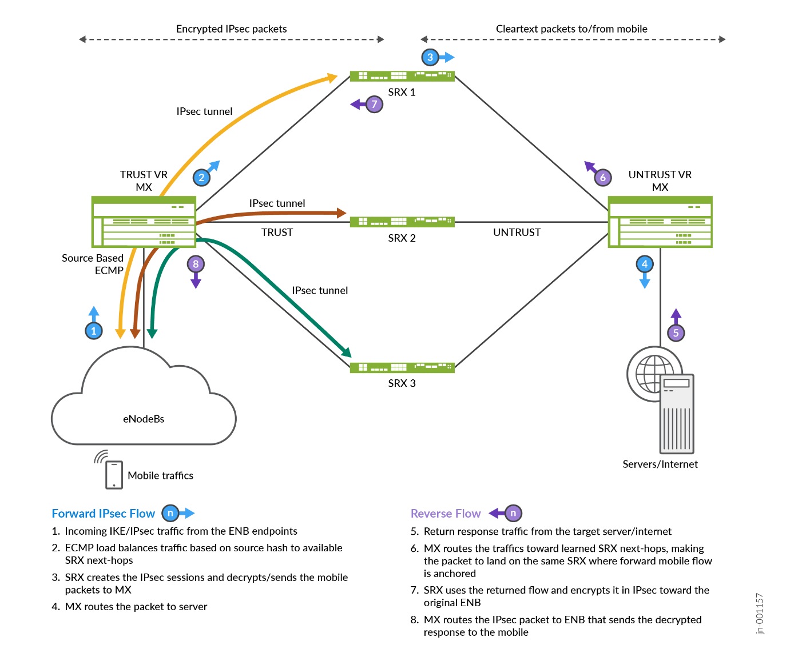

# Solution Overview — Scale-Out IPsec Solution for Mobile Service Providers

> Faithful markdown conversion of the published Juniper Validated Design
> **Solution Overview: Scale-Out IPsec Solution for Mobile Service Providers**
> (`sol-overview-MSE-SCALEOUT-IPSEC-SP-01-01`, V1.0). The PDF on juniper.net is
> the source of truth. This document is the **Mobile Service Provider** framing
> of the shared CSDS ScaleOut architecture; see
> [solution-overview-enterprise.md](solution-overview-enterprise.md) for the
> Enterprise framing.

## Executive Summary

The Juniper Scale-Out Security Services Solution is a common security services
complex featuring an IPsec Security Gateway for use in a **Mobile Service Provider
(MSP)** deployment. The security services complex leverages the scale-out network
architecture and automation with tight integration between the routing and
security services elements, represented by MX Series Routers and SRX Series
Firewalls. This provides the best routing and security stacks for optimal
performance and total cost of ownership. The scale-out approach offers advantages
over the scale-up approach (such as integrating security engines directly into
routing nodes), including pay-as-you-grow pricing, flexibility to handle
unpredictable traffic growth, high availability with sub-second restoration for
IPsec Security Associations, and optimal operational preferences for a choice of
physical or virtual nodes.

*Figure 1. Scale-Out Security Services Solution at the Provider Edge.*

## Solution Overview

This JVD outlines the Juniper Scale-Out Security Services Solution, seamlessly
integrated within MSP network solutions, and enables the following security
services:

- IPsec Security Gateway

The solution is comprised of dedicated forwarding and service layers, with an
optional distribution layer to enhance scalability and optimize port usage and
bandwidth. The architecture leverages Juniper's portfolio with standards-based
routing protocols featuring BGP and BFD, ECMP with consistent hashing (CHASH),
and the traffic load balancer (TLB) function in the forwarding layer. The service
layer is comprised of all the IPsec security services.

This JVD is validated with **Junos OS Release 23.4R2** and encompasses the
following Juniper hardware:

- **Forwarding layer:** MX Series Routers, validated with MX304
- **Service layer:** SRX Series Firewalls, validated with SRX4600 and Virtual SRX (vSRX)
- **Distribution layer:** QFX Series Switches (optional, not part of this JVD)

### Table 1: Summary of Test Plan and Platforms Mapping

| Load-Balancing Method | For MX Series Routers | Number of MX Series Routers | Security Features | SRX Standalone | SRXs MNHA Cluster |
|---|---|---|---|---|---|
| ECMP with Consistent Hashing | Junos OS Release 23.4R2 | Single MX Series Router | IPsec Security Gateway | Yes | No |
| Traffic Load Balancer (TLB) with Health Checking | Junos OS Release 23.4R2 | Single MX Series Router | IPsec Security Gateway | Yes | Yes |

## Sources

- Published JVD: *Scale-Out IPsec Solution for Mobile Service Providers — JVD
  Solution Overview* (`sol-overview-MSE-SCALEOUT-IPSEC-SP-01-01`), juniper.net
  validated designs.
- Companion docs in this folder: [design-guide-mobile-sp.md](design-guide-mobile-sp.md),
  [test-report-brief-mobile-sp.md](test-report-brief-mobile-sp.md),
  [datasheet.md](datasheet.md).
- Configurations: [../configuration/conf](../configuration/conf).
