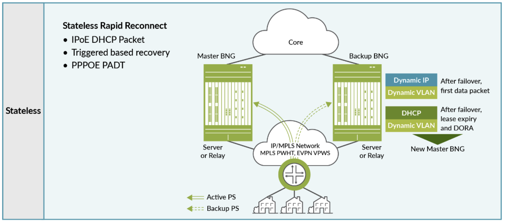
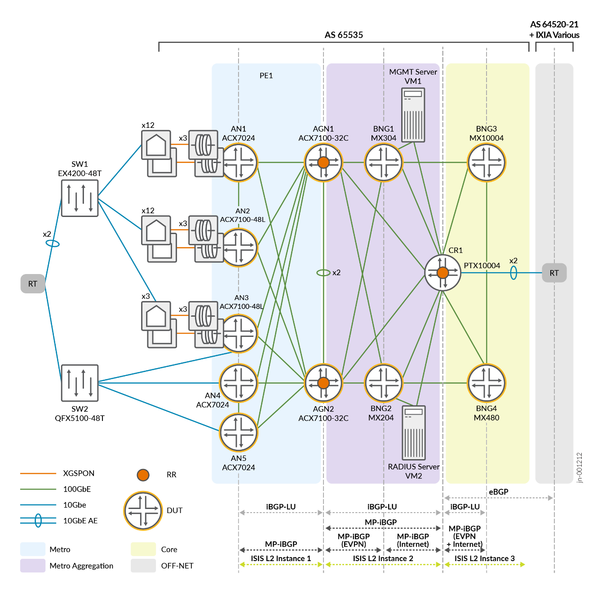

# Metro Fabric and Broadband Edge JVD

> Cloud Metro fabric architecture for subscriber broadband access, integrating access, aggregation, and BNG functions with scale-out CGNAT.

Use Cloud Metro fabric principles to stitch together access, aggregation, and BNG functions, simplifying deployment and reducing costs. This solution seamlessly integrates with Juniper's Scale-out Carrier Grade NAT (CGNAT) solution, enhancing network scalability and resilience while supporting dynamic expansion based on subscriber demand.

## Highlights

- Cloud Metro fabric spanning access, aggregation, and BNG domains
- BNG validated across MX304, MX204, MX480, and MX10004 platforms
- Stateless rapid-reconnect model for sub-second subscriber recovery
- Integrated scale-out CGNAT for elastic subscriber capacity
- TI-LFA fast reroute for sub-50ms transport convergence

---

## 📄 Metro Fabric BBE JVD Documentation

- **JVD Document:**  
  [Broadband Edge JVD](https://www.juniper.net/documentation/us/en/software/jvd/jvd-metro-fabric-and-broadband-edge/index.html)

- **Solution Overview:**  
  [PDF Overview](https://www.juniper.net/documentation/us/en/software/jvd/solution-overview-metro-fabric-and-broadband-edge.pdf)

- **Test Report Brief:**  
  [PDF Test Brief](https://www.juniper.net/documentation/us/en/software/jvd/test-report-brief-metro-fabric-and-broadband-edge.pdf.pdf)

---

## Validated Hardware

| Juniper Product | Role | Config |
|---|---|---|
| **PTX10004** | Core Router | [`cr1_ptx10004.conf`](configuration/conf/cr1_ptx10004.conf) |
| **MX304** | BNG | [`bng1_mx304.conf`](configuration/conf/bng1_mx304.conf) |
| **MX204** | BNG | [`bng2_mx204.conf`](configuration/conf/bng2_mx204.conf) |
| **MX10004** | BNG | [`bng3_mx10004.conf`](configuration/conf/bng3_mx10004.conf) |
| **MX480** | BNG | [`bng4_mx480.conf`](configuration/conf/bng4_mx480.conf) |
| **ACX7100-32C** | Aggregation Node | [`agn1_acx7100-32c.conf`](configuration/conf/agn1_acx7100-32c.conf), [`agn2_acx7100-32c.conf`](configuration/conf/agn2_acx7100-32c.conf) |
| **ACX7024** | Access Node | [`an1_acx7024.conf`](configuration/conf/an1_acx7024.conf) |
| **ACX7100-48L** | Access Node | [`an2_acx7100-48l.conf`](configuration/conf/an2_acx7100-48l.conf), [`an3_acx7100-48l.conf`](configuration/conf/an3_acx7100-48l.conf), [`an4_acx7100-48l.conf`](configuration/conf/an4_acx7100-48l.conf), [`an5_acx7100-48l.conf`](configuration/conf/an5_acx7100-48l.conf) |
| **QFX5120-32C** | Switch | [`sw1_qfx5120-32c.conf`](configuration/conf/sw1_qfx5120-32c.conf) |
| **QFX5210-64C** | Switch | [`sw2_qfx5210-64c.conf`](configuration/conf/sw2_qfx5210-64c.conf) |

---

