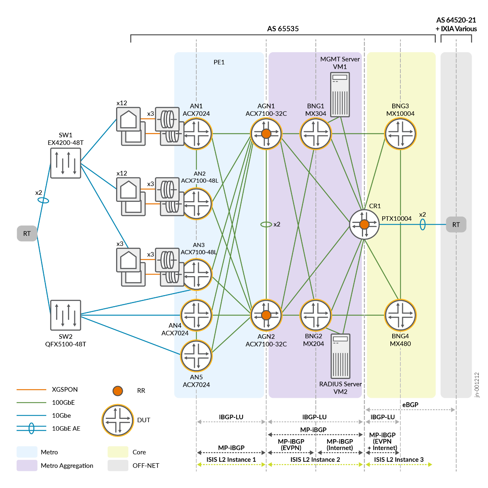

# Configuration Snippets (snips)

This `snips/` directory contains **focused, templated configuration excerpts**
extracted from the validated device configurations in [`../conf/`](../conf/).
Each file isolates one construct — an EVPN-VPWS instance, a pseudowire-headend
interface, a dynamic profile, a subscriber VRF, an IS-IS or BGP form — so it can
be read, compared and adapted without reading a multi-thousand-line BNG
configuration. Every body is measured against the source: the `Count:` header is
the number of exact source instances the template reproduces on each device.

## Topology



Device tokens in snippet headers are the file names in `../conf/`:
`an1_acx7024`, `an2_acx7100-48l` … `an5_acx7100-48l` (access nodes),
`agn1_acx7100-32c`, `agn2_acx7100-32c` (aggregation nodes and route reflectors),
`bng1_mx304`, `bng2_mx204`, `bng3_mx10004`, `bng4_mx480` (BNGs) and
`cr1_ptx10004` (core router and route reflector). The access switches
`sw1_qfx5120-32c` and `sw2_qfx5210-64c` emulate subscriber access toward the
access nodes; they are helper devices, excluded in full by
[`_source-exclusions.json`](_source-exclusions.json), and no snippet claims them.

## Layout

```
snips/
  junos/        ← Junos OS forms (MX304, MX204, MX10004, MX480 BNGs)
  evo/          ← Junos Evolved forms (ACX7024, ACX7100-48L, ACX7100-32C, PTX10004)
```

| Sub-folder | What's in it |
|---|---|
| `routing-instances/evpn-vpws/` | EVPN-VPWS instances (access node and BNG ends of each pseudowire) and the access-node flexible cross-connect form. |
| `routing-instances/l3vpn/` | Subscriber VRFs (`PPPOE_SUBS_1`, the per-BNG `dhcp-subs` forms), the RADIUS VRF (BNG and core-router forms) and the Internet VRF. |
| `interfaces/` | Pseudowire-headend (`ps`) devices for PPPoE and DHCP/IPoE, access-node aggregates and cross-connect units, core links and LAG members, loopbacks. |
| `dynamic-profiles/` | The five dynamic profiles that create PPPoE and DHCP/IPoE subscriber sessions. |
| `access/`, `access-profile/` | RADIUS server, access profiles and address-assignment pools. |
| `protocols/` | IS-IS SR-MPLS with TI-LFA (instance and interface forms), MPLS SRGB, the per-role iBGP overlay forms, LLDP. |
| `policy-options/` | IS-IS export, per-packet load balancing, route-reflector export, subscriber and VRF import/export policies, communities, prefix lists, the `if-master` condition. |
| `firewall/` | DHCP/DHCPv6 RPF fail-filters and the clear-DF-bit filter. |
| `system/`, `chassis/`, `routing-options/`, `forwarding-options/` | Subscriber management and redundancy, DDoS protection, pseudowire and tunnel services, FPC profiles, router identity, forwarding-table load balancing, NSR/GRES. |

## Snippet headers

Every snippet starts with a C-style header whose fields follow the repository
snippet contract:

- **`Seen on:`** — every validated device whose configuration reproduces this
  exact template, split by OS. Shared applicability is not a peer relationship.
- **`Count:`** — distinct source instances of the template per device and in
  total, generated from [`_bindings.json`](_bindings.json); never hand-edited.
- **`Variant group:`** — the per-role BGP overlay forms publish `bbe-bgp-overlay`
  with the address families they carry; EVPN-VPWS instances require it with
  `variant:bbe-bgp-overlay families=evpn`.
- **`Pair with:`** — directed, required same-device dependencies: the snippet
  that defines a named object this one uses (a dynamic profile, access profile,
  routing instance, policy, community, filter or tunnel PIC). A reference that
  several forms can satisfy is not listed; the dependency projection in
  [`_composition.json`](_composition.json) records it with every eligible form.
- **`Peers with:`** — verified configured cross-device relationships (BGP
  sessions and the access-node / BNG ends of each pseudowire). Snippets without
  the field have no verified relationship; [`_peers.json`](_peers.json) records
  why.

## Templated values — `$VAR` placeholders

Deployment-specific values (loopbacks, RD/RT tails, instance names, attachment
units, service IDs, ESIs, subscriber pools, RADIUS addresses) appear as `$VAR`
placeholders. Names that other configuration refers to and JVD-wide constants
are left literal. Each header lists the placeholders it uses with example values
from a validated device; the full glossary is [`_variables.md`](_variables.md).

The `$junos-*` placeholders inside `dynamic-profiles/` are resolved at runtime by
the BNG subscriber-management daemons — they are not user variables and must be
left as-is in any rendered configuration.

## Source examples

[`_bindings.md`](_bindings.md) summarises, and [`_bindings.json`](_bindings.json)
records in full, the exact source instances and variable bindings each template
reproduces. Example values in headers are illustrative; the bindings are the
evidence.

## Scope

Every in-scope source statement on the twelve design devices is reproduced by a
snippet. Two source details are reproduced exactly as validated:

- bng4 exports subscriber IPv6 routes with bng3's IPv6 loopback as the next hop;
  bng1–bng3 use their own.
- bng3's `dhcp-subs` VRF aggregates three of the four BNG subscriber IPv6
  prefixes; bng4 aggregates all four.

The DHCP dynamic profiles and `PS-DHCP-SUBSv6` reference the `dhcp-subs` VRF,
which has three per-BNG forms; select the form whose `Seen on:` lists the target
BNG.

## Topic index

Totals are source instances across all devices; OS mirrors are listed once per
OS.

| Topic | What it shows |
|---|---|
| `evo/chassis/aggregated-devices-ethernet.conf` | Aggregated Ethernet device-count for the chassis (8) |
| `evo/forwarding-options/tunnels-udp.conf` | UDP tunnel decapsulation (1) |
| `evo/interfaces/ifd-ae-flexible-lacp-fast-mtu-esi-single-active.conf` | Access-facing aggregated Ethernet bundle with a single-active ESI and fast LACP (5) |
| `evo/interfaces/ifd-ae-flexible-lacp-fast-mtu.conf` | Access-facing aggregated Ethernet bundle with flexible tagging and fast LACP (5) |
| `evo/interfaces/ifd-breakout-10g.conf` | Port channelized into 10G sub-ports (2) |
| `evo/interfaces/ifd-core-aggregate-lacp.conf` | Core aggregated Ethernet bundle with active LACP (1) |
| `evo/interfaces/ifd-core-aggregate-vlan-tagging-min-links-lacp.conf` | Core aggregated Ethernet bundle with VLAN tagging, minimum links and active LACP (2) |
| `evo/interfaces/ifd-core-lag-member-ether-description-100g.conf` | Described 100G physical member of a core aggregated Ethernet bundle (1) |
| `evo/interfaces/ifd-core-lag-member-ether-description.conf` | Described physical member of a core aggregated Ethernet bundle (1) |
| `evo/interfaces/ifd-description-100g.conf` | Described 100G interface device (10) |
| `evo/interfaces/ifd-description.conf` | Interface device description (23) |
| `evo/interfaces/ifd-lag-member-ether.conf` | Physical member of an aggregated Ethernet bundle (14) |
| `evo/interfaces/ifd-speed-100g.conf` | Port speed 100G (5) |
| `evo/interfaces/ifd-unused.conf` | Unused physical port (1) |
| `evo/interfaces/ifl-core-inet-iso-inet6-mpls-max-labels-16.conf` | Core logical interface (31) |
| `evo/interfaces/ifl-core-inet-iso-inet6-noaddr-mpls-max-labels-16.conf` | Core logical interface without an IPv6 address (1) |
| `evo/interfaces/ifl-core-vlan-inet-iso-inet6-mpls.conf` | VLAN-tagged core logical interface (4) |
| `evo/interfaces/ifl-inet-inet6.conf` | Dual-stack logical interface (2) |
| `evo/interfaces/ifl-loopback-primary-iso.conf` | Loopback logical interface (8) |
| `evo/interfaces/ifl-loopback-primary.conf` | Loopback logical interface for a routing instance (1) |
| `evo/interfaces/ifl-vlan-ccc-esi-all-active-family-ccc.conf` | Single-tagged cross-connect logical interface with an all-active ESI (50) |
| `evo/interfaces/ifl-vlan-ccc-family-ccc.conf` | Single-tagged cross-connect logical interface (20) |
| `evo/policy-options/community/cm-pppoe-subs-comm-1.conf` | Route-target community PPPOE_SUBS_COMM_1 for PPPoE subscriber direct routes (1) |
| `evo/policy-options/community/cm-pppoe-subs-comm-2.conf` | Route-target community PPPOE_SUBS_COMM_2 for PPPoE subscriber aggregates (1) |
| `evo/policy-options/community/cm-ps-dhcpsubs-comm-2.conf` | Route-target community PS-DHCPSUBS-COMM_2 for DHCP subscriber access routes (1) |
| `evo/policy-options/community/cm-ps-dhcpsubs-comm.conf` | Route-target community PS-DHCPSUBS-COMM for DHCP subscriber direct routes (1) |
| `evo/policy-options/community/cm-ps-internet-comm.conf` | Route-target community PS-Internet-COMM for Internet VRF routes (1) |
| `evo/policy-options/community/cm-ps-radius-comm.conf` | Route-target community PS-RADIUS-COMM for RADIUS VRF routes (1) |
| `evo/policy-options/policy-statement/ps-bgp-rr-export.conf` | Route-reflector export policy PS-BGP-RR-EXPORT with next-hop self for core loopbacks (3) |
| `evo/policy-options/policy-statement/ps-client-rr-export.conf` | Route-reflector client export policy PS-CLIENT-RR-EXPORT for access-region loopbacks (3) |
| `evo/policy-options/policy-statement/ps-isis-export.conf` | IS-IS export policy PS-ISIS-EXPORT carrying the node loopbacks with their prefix segments (8) |
| `evo/policy-options/policy-statement/ps-pplb.conf` | Per-packet load-balance policy PS-PPLB (8) |
| `evo/policy-options/policy-statement/ps-radius-vrf-export.conf` | VRF export policy PS-RADIUS-VRF-EXPORT (1) |
| `evo/policy-options/policy-statement/ps-radius-vrf-import-subscribers.conf` | VRF import policy PS-RADIUS-VRF-IMPORT that also imports the subscriber routes (1) |
| `evo/policy-options/policy-statement/ps-redis-ospf.conf` | OSPF export policy PS-REDIS-OSPF redistributing BGP routes (1) |
| `evo/policy-options/policy-statement/ps-v6-default.conf` | Export policy PS-V6-default for the Internet VRF IPv6 default route (1) |
| `evo/policy-options/policy-statement/stop-leak.conf` | IS-IS policy stop_leak blocking level 1 to level 2 leaking (1) |
| `evo/policy-options/policy-statement/vrf-internet-export.conf` | VRF export policy VRF_Internet_export for the IPv4 and IPv6 default routes (1) |
| `evo/policy-options/policy-statement/vrf-internet-import.conf` | VRF import policy VRF_Internet_import for the subscriber routes (1) |
| `evo/policy-options/prefix-list/pl-an-region-agn.conf` | Prefix-list PL-AN-REGION with the access-node loopbacks (2) |
| `evo/policy-options/prefix-list/pl-an-region-cr.conf` | Prefix-list PL-AN-REGION with the access-node and BNG1/BNG2 loopbacks (1) |
| `evo/policy-options/prefix-list/pl-bng.conf` | Prefix-list PL-BNG with the BNG loopbacks (1) |
| `evo/policy-options/prefix-list/pl-core-agn.conf` | Prefix-list PL-CORE with the BNG1/BNG2 and core-router loopbacks (2) |
| `evo/policy-options/prefix-list/pl-core-cr.conf` | Prefix-list PL-CORE with the BNG3/BNG4 loopbacks (1) |
| `evo/protocols/bgp-overlay-agn.conf` | iBGP route reflector for the access fabric and the core (2) |
| `evo/protocols/bgp-overlay-an.conf` | iBGP overlay sessions from an access node to its route reflectors (5) |
| `evo/protocols/bgp-overlay-cr.conf` | iBGP core route reflector for the aggregation nodes and BNGs (1) |
| `evo/protocols/isis-intf-l1-tilfa-bfd.conf` | IS-IS level 1 point-to-point core interface with TI-LFA node protection and BFD (34) |
| `evo/protocols/isis-intf-l2-tilfa-bfd.conf` | IS-IS level 2 point-to-point core interface with TI-LFA node protection and BFD (2) |
| `evo/protocols/isis-loopback-passive.conf` | IS-IS passive loopback interface (8) |
| `evo/protocols/isis-srmpls-tilfa-l1-l2.conf` | IS-IS level 1 and level 2 instance with SR-MPLS TI-LFA and two export policies (1) |
| `evo/protocols/isis-srmpls-tilfa-l1.conf` | IS-IS level 1 instance with SR-MPLS TI-LFA (7) |
| `evo/protocols/lldp-interface-all.conf` | LLDP enabled on all interfaces (2) |
| `evo/protocols/mpls-srgb-ipv6-tunneling.conf` | MPLS segment-routing global block with IPv6 tunneling (8) |
| `evo/routing-instances/evpn-vpws/ri-evpn-fxc-2-uni-esi.conf` | EVPN flexible cross-connect (VLAN-unaware) with two attachment units and a group ESI (10) |
| `evo/routing-instances/evpn-vpws/ri-evpn-vpws.conf` | EVPN-VPWS routing instance with one attachment circuit (50) |
| `evo/routing-instances/l3vpn/ri-radius-server-ospf.conf` | RADIUS VRF attaching the RADIUS server with OSPF (1) |
| `evo/routing-instances/l3vpn/ri-vrf-internet.conf` | Internet VRF with default discard routes and eBGP to the upstream CE (1) |
| `evo/routing-options/autonomous-system.conf` | Device autonomous-system number (8) |
| `evo/routing-options/forwarding-table-pplb-chained-evpn.conf` | Forwarding table with per-packet load balancing and EVPN ingress chained composite next hops (5) |
| `evo/routing-options/forwarding-table-pplb.conf` | Forwarding table with per-packet load balancing (3) |
| `evo/routing-options/router-id.conf` | Router ID (8) |
| `evo/system/ports-console-log-out.conf` | Console log-out on disconnect (8) |
| `junos/access-profile/access-profile-vlan-auth-access1.conf` | Default access profile vlan-auth-access1 (4) |
| `junos/access/address-assignment-pppoe-pools.conf` | Global PPPoE IPv4 address pool and IPv6 router-advertisement pool (4) |
| `junos/access/profile-no-auth.conf` | Access profile no-auth with authentication disabled (4) |
| `junos/access/profile-vlan-auth-access.conf` | Access profile vlan-auth-access with no authentication and the PPPoE IPv4 pool (4) |
| `junos/access/profile-vlan-auth-access1.conf` | Access profile vlan-auth-access1 with RADIUS authentication and subscriber line identification (4) |
| `junos/access/profile-vlan-auth-access2.conf` | Access profile vlan-auth-access2 with basic RADIUS authentication (4) |
| `junos/access/radius-server.conf` | Global RADIUS server reached through VRF RADIUS (4) |
| `junos/chassis/aggregated-devices-ethernet.conf` | Aggregated Ethernet device-count for the chassis (2) |
| `junos/chassis/fpc-mx10004-tunnel-100g-ports.conf` | MX10004 FPC with 100G tunnel services and 100G ports on PICs 2 to 5 (1) |
| `junos/chassis/fpc-mx204-tunnel-100g-4x100g.conf` | MX204 FPC with 100G tunnel services, four 100G ports and PIC 1 disabled (1) |
| `junos/chassis/fpc-mx480-tunnel-100g-2x100g-single-sub-port.conf` | MX480 FPC with 100G tunnel services and two 100G single-sub-port ports (1) |
| `junos/chassis/fpc-tunnel-services-100g.conf` | 100G tunnel services on a PIC (7) |
| `junos/chassis/maximum-ecmp.conf` | Chassis maximum ECMP paths (4) |
| `junos/chassis/network-services-enhanced-ip.conf` | Enhanced IP chassis network-services mode (1) |
| `junos/chassis/pseudowire-service.conf` | Pseudowire-subscriber device allocation (4) |
| `junos/chassis/redundancy-graceful-switchover.conf` | Graceful Routing Engine switchover (3) |
| `junos/dynamic-profiles/auto-stacked-pwht.conf` | Dynamic profile auto-stacked-pwht for PPPoE sessions over pseudowire-headend stacked VLANs (4) |
| `junos/dynamic-profiles/auto-stacked-pwht_dhcp.conf` | Dynamic profile auto-stacked-pwht_dhcp for DHCP/IPoE subscribers over pseudowire-headend stacked VLANs (4) |
| `junos/dynamic-profiles/prod-dhcp-base.conf` | Dynamic profile prod-dhcp-base for DHCPv4/DHCPv6 subscriber demux sessions (4) |
| `junos/dynamic-profiles/prod-pppoe-dt-base.conf` | Dynamic profile prod-pppoe-dt-base for per-session PPPoE pp0 units (4) |
| `junos/dynamic-profiles/prof_autosense_ipdemux.conf` | Dynamic profile prof_autosense_ipdemux for per-subscriber IP demux units (4) |
| `junos/firewall/filter-clear-df-bit.conf` | Interface-specific IPv4 filter clear-df-bit that clears the Don't Fragment bit (4) |
| `junos/firewall/filter-rpf-pass-dhcp.conf` | IPv4 RPF-fail filter rpf-pass-dhcp that passes DHCP broadcasts (4) |
| `junos/firewall/filter-rpf-pass-dhcpv6.conf` | IPv6 RPF-fail filter rpf-pass-dhcpv6 that passes DHCPv6 (4) |
| `junos/interfaces/ifd-core-aggregate-lacp.conf` | Core aggregated Ethernet bundle with active LACP (3) |
| `junos/interfaces/ifd-core-lag-member-gigether-description.conf` | Described physical member of a core aggregated Ethernet bundle (6) |
| `junos/interfaces/ifd-description.conf` | Interface device description (7) |
| `junos/interfaces/ifd-ps-pwht-dhcp.conf` | Pseudowire-headend subscriber interface with stacked-VLAN auto-configuration for DHCP/IPoE (48) |
| `junos/interfaces/ifd-ps-pwht-pppoe.conf` | Pseudowire-headend subscriber interface with stacked-VLAN auto-configuration for PPPoE (48) |
| `junos/interfaces/ifl-core-inet-iso-inet6-mpls-max-labels-16.conf` | Core logical interface (10) |
| `junos/interfaces/ifl-loopback-description-primary-secondary.conf` | Described loopback logical interface with a secondary IPv4 address (4) |
| `junos/interfaces/ifl-loopback-primary-iso.conf` | Loopback logical interface (4) |
| `junos/interfaces/ifl-loopback-primary.conf` | Loopback logical interface for a routing instance (8) |
| `junos/policy-options/community/cm-pppoe-subs-comm-1.conf` | Route-target community PPPOE_SUBS_COMM_1 for PPPoE subscriber direct routes (4) |
| `junos/policy-options/community/cm-pppoe-subs-comm-2.conf` | Route-target community PPPOE_SUBS_COMM_2 for PPPoE subscriber aggregates (4) |
| `junos/policy-options/community/cm-ps-dhcpsubs-comm-2.conf` | Route-target community PS-DHCPSUBS-COMM_2 for DHCP subscriber access routes (4) |
| `junos/policy-options/community/cm-ps-dhcpsubs-comm.conf` | Route-target community PS-DHCPSUBS-COMM for DHCP subscriber direct routes (4) |
| `junos/policy-options/community/cm-ps-internet-comm.conf` | Route-target community PS-Internet-COMM for Internet VRF routes (4) |
| `junos/policy-options/community/cm-ps-radius-comm.conf` | Route-target community PS-RADIUS-COMM for RADIUS VRF routes (4) |
| `junos/policy-options/condition/condition-if-master.conf` | Route condition if-master tracking the active pseudowire-subscriber interface (4) |
| `junos/policy-options/policy-statement/dhcp-subs-vrf-export-pol.conf` | VRF export policy dhcp-subs-vrf-export-pol (4) |
| `junos/policy-options/policy-statement/dhcp-subs-vrf-import-pol.conf` | VRF import policy dhcp-subs-vrf-import-pol (4) |
| `junos/policy-options/policy-statement/ps-dhcp-subsv6.conf` | BGP export policy PS-DHCP-SUBSv6 for DHCPv6 subscriber routes (4) |
| `junos/policy-options/policy-statement/ps-isis-export.conf` | IS-IS export policy PS-ISIS-EXPORT carrying the node loopbacks with their prefix segments (4) |
| `junos/policy-options/policy-statement/ps-pplb.conf` | Per-packet load-balance policy PS-PPLB (4) |
| `junos/policy-options/policy-statement/ps-pppoe-subs-1-vrf-export.conf` | VRF export policy PS-PPPOE-SUBS-1-VRF-EXPORT (4) |
| `junos/policy-options/policy-statement/ps-pppoe-subs-1-vrf-import.conf` | VRF import policy PS-PPPOE-SUBS-1-VRF-IMPORT (4) |
| `junos/policy-options/policy-statement/ps-pppoe-subsv6.conf` | BGP export policy PS-PPPOE-SUBSv6 for the PPPoE subscriber IPv6 prefix (4) |
| `junos/policy-options/policy-statement/ps-radius-vrf-export.conf` | VRF export policy PS-RADIUS-VRF-EXPORT (4) |
| `junos/policy-options/policy-statement/ps-radius-vrf-import.conf` | VRF import policy PS-RADIUS-VRF-IMPORT on a BNG (4) |
| `junos/protocols/bgp-overlay-bng-core-rr.conf` | iBGP overlay session from a BNG to the core route reflector (2) |
| `junos/protocols/bgp-overlay-bng-three-rr.conf` | iBGP overlay sessions from a BNG to three route reflectors (2) |
| `junos/protocols/isis-intf-l1-tilfa-bfd.conf` | IS-IS level 1 point-to-point core interface with TI-LFA node protection and BFD (6) |
| `junos/protocols/isis-intf-l2-tilfa-bfd.conf` | IS-IS level 2 point-to-point core interface with TI-LFA node protection and BFD (4) |
| `junos/protocols/isis-loopback-passive.conf` | IS-IS passive loopback interface (4) |
| `junos/protocols/isis-srmpls-tilfa-l1.conf` | IS-IS level 1 instance with SR-MPLS TI-LFA (2) |
| `junos/protocols/isis-srmpls-tilfa-l2.conf` | IS-IS level 2 instance with SR-MPLS TI-LFA (2) |
| `junos/protocols/mpls-srgb-ipv6-tunneling.conf` | MPLS segment-routing global block with IPv6 tunneling (4) |
| `junos/routing-instances/evpn-vpws/ri-evpn-vpws.conf` | EVPN-VPWS routing instance with one attachment circuit (96) |
| `junos/routing-instances/l3vpn/ri-dhcp-subs-four-pools-three-v6-aggregates.conf` | DHCP subscriber VRF dhcp-subs with four BNG subscriber pools and three IPv6 aggregates (1) |
| `junos/routing-instances/l3vpn/ri-dhcp-subs-four-pools.conf` | DHCP subscriber VRF dhcp-subs with four BNG subscriber pools (1) |
| `junos/routing-instances/l3vpn/ri-dhcp-subs-two-pools.conf` | DHCP subscriber VRF dhcp-subs with two BNG subscriber pools (2) |
| `junos/routing-instances/l3vpn/ri-pppoe-subs.conf` | PPPoE subscriber VRF PPPOE_SUBS_1 with local address pools (4) |
| `junos/routing-instances/l3vpn/ri-radius.conf` | RADIUS VRF on a BNG reaching the RADIUS server through the core (4) |
| `junos/routing-options/autonomous-system.conf` | Device autonomous-system number (4) |
| `junos/routing-options/forwarding-table-pplb-chained-evpn.conf` | Forwarding table with per-packet load balancing and EVPN ingress chained composite next hops (4) |
| `junos/routing-options/nonstop-routing.conf` | Nonstop active routing (3) |
| `junos/routing-options/rib-groups-interface-routes-pppoe-v6.conf` | RIB group interface_routes sharing IPv6 interface routes with VRF PPPOE_SUBS_1 (4) |
| `junos/routing-options/router-id.conf` | Router ID (4) |
| `junos/system/commit-synchronize.conf` | Commit synchronization between Routing Engines (3) |
| `junos/system/configuration-database-max-size.conf` | Configuration database size limit (4) |
| `junos/system/ddos-protection-subscriber.conf` | DDoS protection policers for subscriber control traffic (4) |
| `junos/system/dynamic-profile-options-versioning.conf` | Dynamic profile versioning (4) |
| `junos/system/ports-console-log-out.conf` | Console log-out on disconnect (3) |
| `junos/system/processes-smg-service.conf` | Session and service management process (4) |
| `junos/system/subscriber-management-redundancy-interface.conf` | Subscriber redundancy interface with shared key (40) |
| `junos/system/subscriber-management-redundancy.conf` | Subscriber management with M:N subscriber redundancy (4) |
