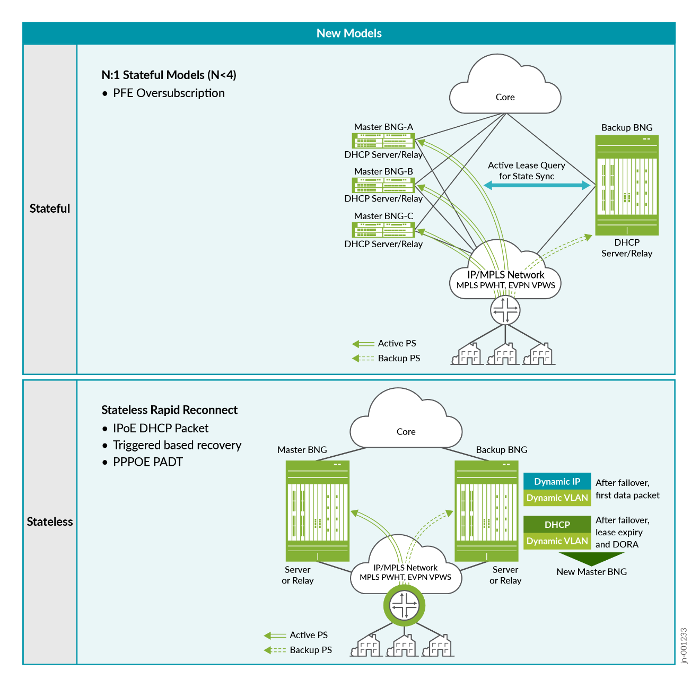
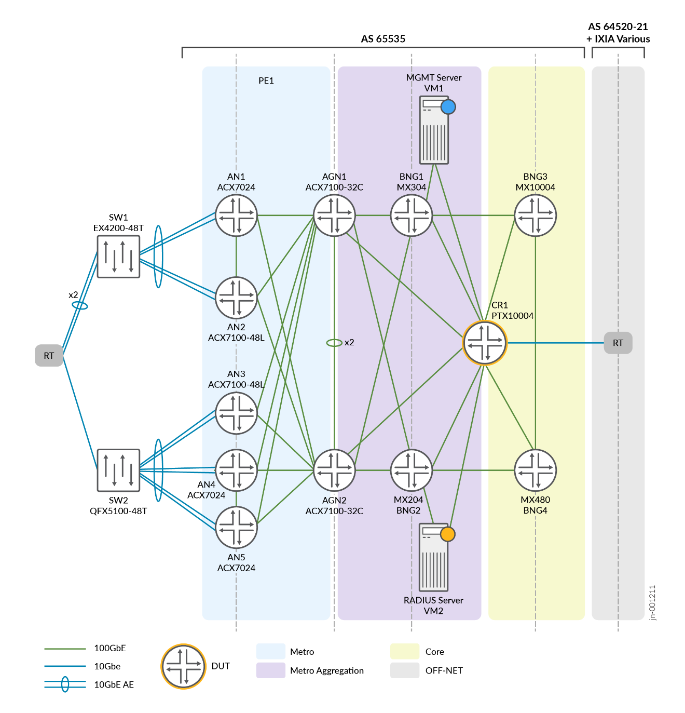
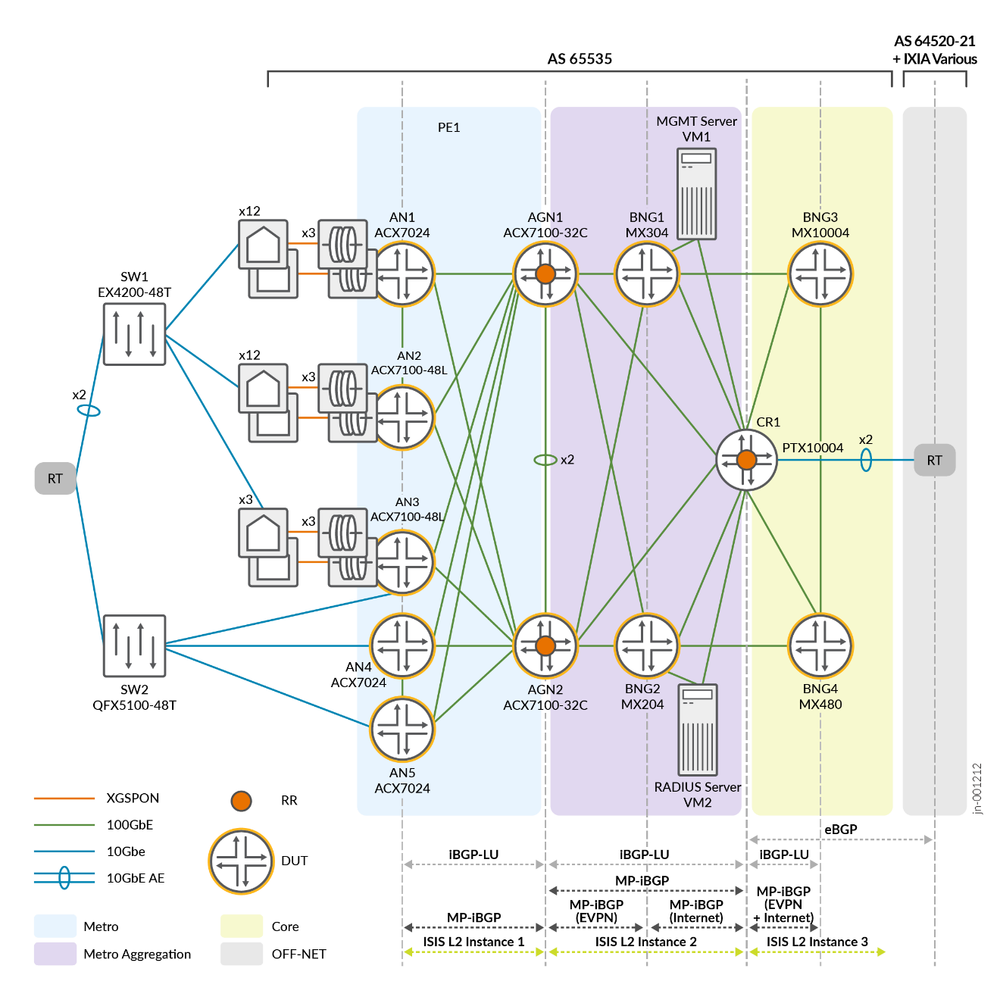
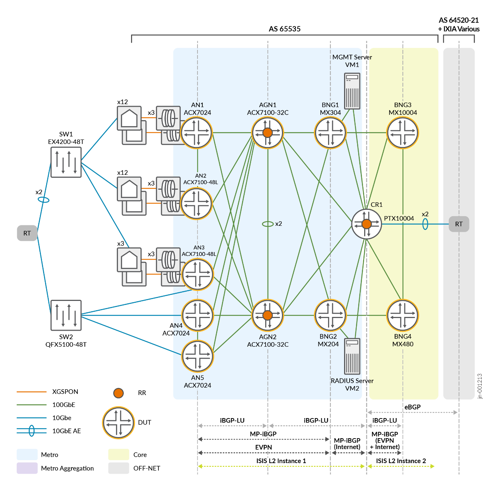

# Metro Fabric and Broadband Edge — Juniper Validated Design (JVD)

> Faithful markdown conversion of the published *Metro Fabric and Broadband
> Edge — Juniper Validated Design (JVD)* (`JVD-METRO-BBE-01-01`, published
> 2026-03-10). The PDF on juniper.net is the source of truth. Exhaustive
> per-stream convergence matrices are condensed here to per-category summaries;
> see the [test report brief](test-report-brief.md) for the full per-stream
> tables, and [`../configuration`](../configuration) for the complete
> per-device configurations.

## Table of Contents

- [About this Document](#about-this-document)
- [Solution Benefits](#solution-benefits)
- [Use Case and Reference Architecture](#use-case-and-reference-architecture)
- [Solution Architecture and Test Objectives](#solution-architecture-and-test-objectives)
- [Validation Framework](#validation-framework)
- [Solution Architecture](#solution-architecture)
- [Results Summary and Analysis](#results-summary-and-analysis)
- [Sources](#sources)

## About this Document

This document presents a Juniper Validated Design (JVD) for a **Metro Fabric and
Broadband Edge (BBE)** used for broadband services terminated from Service Provider
(SP) customers, delivering both residential and business access.

BBE is a complex technological solution of SP networking, including L2/L3/MPLS
backhauling, different retail and wholesale service delivery modes, multicast
delivery, and subscriber management in centralized and distributed environments.
JVD solution validation assumes a **phased approach**, with each phase bringing
additional functional scope and new platforms. This JVD constitutes the first BBE
phase, named **BBE 01-01**. This phase focuses on:

- Basic BBE subscriber management with **IPoE and PPPoE** protocols.
- **MPLS access backhaul** to a central BNG gateway with distinct types of L2
  subscriber termination.
- **BNG gateway redundancy** schemes.

Using the reference network design, **ACX7K Series** routers are validated together
with **MX Series** routers, offering a comprehensive solution for BBE network
deployments and providing the necessary scale and performance.

## Solution Benefits

### Distributed Broadband Access Solution

Most broadband networks rely on centralized, large form-factor routing platforms to
provide all subscriber management functions. In this model, each router port manages
access and aggregation functions as well as BBE/BNG concurrently in one place. The
**DBAS** enables a modern, hyperscale-style approach, splitting up these functions
and distributing them to the cloud metro edge in a spine-leaf architecture.

The model enables modularized access, aggregation, and BNG functions handled
individually by compact platforms leveraging a spine-and-leaf architecture with
aggregation (AGN) and access (AN) nodes. This replaces the traditional centralized
architecture — large modular chassis performing these functions — with distributed
BBE/BNG systems. With these capabilities, you can:

- **Improve the subscriber experience** — Pushing BBE/BNG user-plane functions
  closer to subscribers delivers improved throughput and lower latencies, and
  reduces the "blast zone" of failures since a failed service leaf affects far fewer
  subscribers.
- **Increase network scalability** — Scale ANs, AGNs, and BBE/BNG services
  independently and incrementally. Using smaller form-factor platforms, scale out
  BNG services on demand instead of pre-emptively scaling up centralized BBE/BNG
  infrastructure at higher cost to serve.
- **Simplify operations** — Move away from traffic-handling protocols like LDP in
  favor of **Segment Routing (SR)** and **EVPN**. The broadband network looks and
  acts like a simplified VXLAN data center fabric, interconnecting all BBE/BNG
  service leaves using EVPN. Decoupling the access fabric from BBE/BNG service nodes
  also simplifies lifecycle management.
- **Reduce cost to serve** — Meeting growing demand incrementally with smaller,
  cost-effective platforms lowers Capex; those platforms consume less space, power,
  and cooling, lowering Opex. Reducing user-plane traffic backhauled across the
  network lowers Opex further.

## Use Case and Reference Architecture

The BBE JVD architecture is based on the DBAS concept. In this architecture, the
overlay network infrastructure has effectively become a simplified, data-center-style
access fabric using **MPLS Segment Routing (SR)** as transport underlay and **EVPN**
as service overlay. It can run on a variety of Juniper underlay platforms that
support AGN "spine" functions in an access and aggregation capacity.

The BBE/BNG service leaves enable broadband services to provide **PPPoE** and **IPoE**
sessions over the **EVPN Pseudowire Headend Termination (PWHT)**. This architecture
also provides access-agnostic connectivity for residential, retail/business, and
wholesale services.

The transport underlay in the access fabric is based on **SR-MPLS**, enabling
operational simplicity and fast convergence with Loop-Free Alternate Fast Re-Route.
In the BBE JVD, rapid topology convergence is achieved with **Topology Independent
Loop-Free Alternates (TI-LFA)** fast reroute. Where the CGNAT service gateway is
remote from the core network, the BBE/BNG service leaves and the Access Fabric AGN
spines implement **BGP labeled unicast** to enable segmentation and isolation
between core and access fabric and facilitate seamless MPLS integration across
domains.

The service overlay for unicast services is based on **EVPN Virtual Private Wire
Service (VPWS)**, which enables per-Access-Node transport. It supports **EVPN
Flexible Cross Connect (FXC)**, which multiplexes multiple access nodes in the same
EVPN transport, improving operational simplicity in the access fabric. The access
fabric also provides IP multicast transport for IPTV services.

BBE/BNG service leaves enable:

- **PWHT** for the EVPN service.
- **PPPoE, IPoE, and IP multicast** for retail unicast and multicast services.
- **Link Access Concentrator (LAC)** and **MPLS VPN** for wholesale services.

### Architecture Functional Layers

- **Metro Ethernet Network (MEN)** — a spine-leaf access topology providing physical
  redundancy for L2 to connect to a PWHT for BNG services.
- **Transport Underlay layer:**
  - SR-MPLS using IS-IS IPv4 (Metro and Core)
  - iBGP-LU
  - MP-BGP
- **Services Overlay for PWHT EVPN E-LINE:**
  - EVPN-VPWS multihomed without FXC
  - EVPN E-LINE (EVPN-VPWS) multihomed with FXC

### BBE/BNG redundancy models

Juniper operates two redundancy models for DBAS BBE/BNG solutions to achieve minimal
subscriber traffic drop during failover with predictable revert time. This JVD is
based on the **Stateless Rapid Reconnect** model.



*Figure 2. Juniper BNG Redundancy — New Models: N:1 Stateful (N<4) with PFE
oversubscription, and Stateless Rapid Reconnect (IPoE DHCP packet / triggered
recovery / PPPoE PADT).*

**Stateless Rapid Reconnect (RR)** benefits:

- Can be leveraged for PPPoE, DHCP C-VLAN, and static VLAN methods for relay and
  server.
- Optimizes upgrades — fast restoration of best-effort traffic, applied on access
  interfaces such as PS, GE, XE, and AE.
- No overhead synchronizing subscriber state and client information between BNGs.

Drawback: no background programming of CoS, firewall, and services structure upon
node failure.

In Stateless Rapid Reconnect there is no synchronization between the Primary and
Backup BNG nodes. On primary BNG failure, the **first data packet** of an existing
subscriber session triggers creation of a subscriber interface on the Backup BNG.
After DHCP lease expiry, a new DHCP process creates the subscriber sessions on the
Backup BNG:

- Before failover: DHCP over Dynamic VLAN stack is present at the Primary BNG; no
  subscribers at the Backup BNG.
- At failover: the first data packet arriving on the Backup BNG triggers creation of
  a Dynamic VLAN and a Dynamic IP subscriber (stacked over the Dynamic VLAN).
- If the primary BNG is still failed at DHCP renew, it is addressed as NAK and
  restarts the DORA process — creating the DHCP subscriber at the backup BNG and
  deleting the earlier dynamic IP subscriber.

**N:1 Stateful Model (N<4)** — Active Lease Query (ALQ) and Bulk Lease Query (BLQ)
synchronize subscribers from primary BNG(s) to the backup BNG.

- Benefits: N+1 (N<4) PFE oversubscription using pseudowire (PS) interface (MPLS
  PWHT, EVPN VPWS); one chassis backs up Nx BNGs (Juniper recommends a 4:1 ratio);
  best-effort forwarding resumes immediately on failover while CoS, firewall, and
  services are programmed in the background.
- Drawbacks: DHCP subscribers only (no PPPoE support); single-failure design (one
  failover at a time — a second failover needs the first to complete revert).

### Baseline Features

- **EVPN:** EVPN E-LINE (EVPN-VPWS) with and without FXC
- **Routing:** SR-MPLS, IS-IS, MP-BGP, iBGP-LU, eBGP, BFD, Route Reflection, IPv4
- **Switching:** ESI-LAG, VLAN (802.1q), VLAN QinQ (802.1ad)

## Solution Architecture and Test Objectives

### Solution Goals

- Validate solutions through incremental testing efforts / test profiles.
- Identify and close solution gaps to ensure completeness.
- Build and deliver full test reports and design recommendations.
- Provide configuration details, design, and implementation guidance for validated
  use cases.

This JVD is part of the Metro JVD track, alongside:

- *Metro Ethernet Business Services — JVD* (metro fabric wholesale service delivery)
- *5G xHaul CSR Seamless Segment Routing — JVD* (fronthaul access/aggregation)
- *5G Fronthaul Class of Service — JVD* (CoS modeling for access/aggregation)

### Solution Non-Goals

- **BBE/BNG:** topology discovery; CPE IPv6 aggressive-timer / IPv6-state support on
  failover; scaling higher than 4×AN to 1×BBE/BNG; per-MX-product subscriber scaling;
  H-Policer QoS model. (For TR-101, xDSL/xPON Access Nodes are assumed to support
  N:1 service VLANs or 1:1 per-subscriber VLANs for unicast, and IGMP/MLD snooping
  for multicast such as IPTV.)
- **Access Nodes:** xDSL, xPON, IGMP/MLD.
- Timing and synchronization.
- Network optimization (BFD, BGP timers).
- Network Slicing / Flex-Algo / BGP-CT / SRv6 for underlay.
- SLA monitoring (RFC 2544, Y.1564, TWAMP, Paragon Active Assurance).
- Telemetry.
- LDP and/or RSVP signalling for MPLS.
- Class-of-Service (CoS) in port mode.

## Validation Framework

This JVD addresses network modernization with a new broadband approach for a
scalable and resilient access fabric, enabling flexibility to support heterogeneous
customer architectures within one validated design. Major technical attributes:

- SR-MPLS underlay architecture
- EVPN-VPWS overlay service framework with or without FXC
- Subscriber access termination based on IPoE and PPPoE
- EVPN PWHT
- Stateless Rapid Reconnect model for BNG recovery
- IPv4 and IPv6 subscriber termination with dual-stack option

## Solution Architecture

### JVD Lab Topology



*Figure 3. Metro BBE Lab Topology.*

### Platform Positioning

This JVD is evaluated and validated on the following platforms. The Devices Under
Test (DUT) are used with helper devices; helper functionality is not evaluated — its
role is to facilitate test execution.

| Role | Platform(s) | DUT / Helper |
|---|---|---|
| Switch SW1 | EX4200-48T | Helper |
| Switch SW2 | QFX5100-48S | Helper |
| Access Node (AN) | ACX7024 / ACX7100-48L | DUT |
| Aggregation Node (AGN) | ACX7100-32C | DUT |
| Core Router (CR) | PTX10004 | Helper |
| BNG1 | MX304 | DUT |
| BNG2 | MX204 | DUT |
| BNG3 | MX10004 (LC480 and LC9600) | DUT |
| BNG4 | MX480 (MPC3, MPC5E, MPC7E, MPC10) | DUT |
| RT | IXIA | Helper (simulates subscriber devices and traffic) |

> **Note on switch platforms.** The design guide's Platform Positioning and topology
> figures label the helper switches **EX4200-48T (SW1)** and **QFX5100-48S/48T
> (SW2)**. The test report's DUT table (Table 1) and this repository's configurations
> instead use **QFX5120-32C (SW1)** and **QFX5210-64C (SW2)**. Both are transcribed
> faithfully from their respective source documents; the switches are helper devices
> and are not the focus of validation.

### Network Architecture

The underlay solution is based on **SR-MPLS** with **IS-IS** as the IGP. The routing
domain is divided into **Metro, Metro Aggregation, and Core** areas, each running a
separate IGP instance so routing information is condensed to only the routes needed
in a particular domain. **BGP-LU** distributes routing information between metro
areas. A Tier 2/3 SP may condense the Metro and Metro Aggregation IGPs into a single
instance.



*Figure 4. Underlay Solution Architecture, Tier 1 Provider — IS-IS L2 instances per
domain, iBGP-LU between domains, MP-iBGP (EVPN and Internet), and eBGP toward the
off-net domain.*

The following overlay models are used in both SP Tier 1 and SP Tier 2/3 design
models. The overlay may be built using different L2 service technologies; this JVD
uses **EVPN-VPWS** as the overlay structure. Figure 5 shows the collapsed Metro +
Aggregation overlay that more closely resembles current Tier 2/3 provider networks.



*Figure 5. Overlay Solution Architecture — collapsed Metro and Aggregation areas
(Tier 2/3 Provider).*

### BNG Network Architecture

This JVD evaluates the following residential and business subscriber services:

- Residential broadband subscribers with **100 Mbps, 200 Mbps, and 500 Mbps** services
- Business broadband subscribers with **100 Mbps** services

RADIUS attributes steer subscribers to the correct VRF and/or default instance. The
BNGs are paired for Stateless RR, and ANs are homed to BNG groups:

| Grouping | Members |
|---|---|
| BNG Group A | BNG1 + BNG2 |
| BNG Group B | BNG3 + BNG4 |
| ANs → Group A | AN1 + AN2 |
| ANs → Group B | AN3 + AN4 + AN5 |

Each ANx has its own S-VLAN per access-facing port to delineate its presence in the
metro; subscribers are split by C-VLAN into residential or business customers. The
BNG groups are loaded with **128k subscribers total**, split 50:50 (64k per group).
Subscribers map to a primary and secondary BNG per S-VLAN, e.g. for AN1:

| ANx | C-VLAN | S-VLAN | Primary BNGx | Secondary BNGx |
|---|---|---|---|---|
| AN1 | 2–3202 | 1011 | BNG1 | BNG2 |
| AN1 | 2–3202 | 1012 | BNG2 | BNG1 |
| AN1 | 2–3202 | 1013 | BNG1 | BNG2 |
| AN1 | 2–3202 | 1014 | BNG2 | BNG1 |
| AN1 | 2–3202 | 2011 | BNG1 | BNG2 |
| AN1 | 2–3202 | 2012 | BNG2 | BNG1 |
| AN1 | 2–3202 | 2013 | BNG1 | BNG2 |
| AN1 | 2–3202 | 2014 | BNG2 | BNG1 |

*(AN2–AN5 follow the same alternating primary/secondary S-VLAN mapping pattern across
BNG groups; see the published guide, Tables 1–5, for the complete per-AN mapping.)*

To terminate broadband subscribers, the BNGs add pseudowires using PWHT. Each BNG is
primary for specific C-VLAN/S-VLAN ranges and backup for others, so BNG1↔BNG2 (and
BNG3↔BNG4) back each other up.

### QoS Consideration for BNG Subscribers

A subscriber hierarchical QoS profile is attached to every subscriber interface
terminating on the BNG. The BNG QoS traffic-control-profile (TCP) parameters:

- **Policing** subscriber profiles to 100 Mb/s or 200 Mb/s.
- **Scheduling / queuing** at the logical interface (Level 4) hierarchy — a
  **four-queue model** per L4 IFL with Best Effort, Expedited Forwarding, Voice, and
  Assured Forwarding:
  - **Voice** — strict-high priority, 5% interface bandwidth (transmit-rate),
    rate-limited to prevent starving; temporal buffer value 10 ms.
  - **Assured / Expedited Forwarding** — high-priority, 10% transmit-rate.
  - **Best Effort** — low-priority, remainder of transmit-rate.
- Traffic marked using **DSCP** for IPv4, with BA classification using arbitrary
  values consistent across the network.

TCP profiles are passed to the BNG through RADIUS server parameters.

### Solution Validation Requirements

This JVD validates an end-to-end network architecture using SR-MPLS, IPv4 IGP
underlay, and EVPN pseudowires at scale under multiple stress conditions:

- Validate EVPN E-LINE for PWHT into a BBE/BNG.
- Validate EVPN E-LINE with FXC for PWHT into a BBE/BNG.
- Validate BNG failover for Stateless Rapid Reconnect (RR) and N:1 Stateful (N<4).
- Validate L3 routing when using ESI-LAG to an 'OLT'.
- Capacity planning and monitoring — bandwidth per PFE in the BBE; subscribers per
  pseudowire terminated on the BBE.
- Validation of basic per-subscriber QoS profile with policer attached, and
  large-scale subscriber QoS behaviours.

### Key Measurements

- **BBE network failure** — pseudowire re-routing during a link failure event and an
  AGNx node failure event (target ≤ 50 ms).
- **BNG failover** — time to reconnect a subscriber, expressed as connections per
  second (CPS) on the backup BNG; typical values observed ~300 CPS (hardware
  dependent).
- **BNG recovery** — repeat the above during the recovery period while no state
  exists between the BBE/BNG pair.

Failure scenarios include AGN failure (ECMP reroutes traffic immediately to the
surviving AGN), single and dual BNG failure (subscribers fail over to their backup
BNG and remain in a 'fail open' state until re-authentication), ESI-LAG failover,
and AN-to-AGG core link failover (fast SR-MPLS restoration via TI-LFA).

### Test Bed Device Configuration

Representative EVPN-VPWS (E-LINE) with PWHT configuration excerpts follow. For the
complete per-device configurations, see
[`../configuration/conf`](../configuration/conf) and
[`../configuration/set`](../configuration/set); templated stanzas are in
[`../configuration/snips`](../configuration/snips).

**Access Node — EVPN-VPWS instance (ACX7024, all-active multihoming):**

```junos
routing-instances METRO_BBE_EVPN_VPWS_IPoE_GROUP_10 {
    instance-type evpn-vpws;
    protocols {
        evpn {
            interface ae1.1050 {
                vpws-service-id {
                    local 20;
                    remote 40;
                }
            }
        }
    }
    interface ae1.1050;
    route-distinguisher 103.103.103.103:1050;
    vrf-target target:60000:1050;
}
interfaces ae1 {
    flexible-vlan-tagging;
    mtu 9102;
    encapsulation flexible-ethernet-services;
    aggregated-ether-options {
        lacp { active; periodic fast; system-id 00:00:00:00:04:04; }
    }
    unit 1050 {
        encapsulation vlan-ccc;
        vlan-id 1050;
        esi { 00:10:11:11:11:11:11:00:00:4a; all-active; }
        family ccc;
    }
}
```

**BNG — EVPN-VPWS with PWHT instance (MX304 / MX204 / MX10004 / MX480):**

```junos
routing-instances METRO_BBE_EVPN_VPWS_IPoE_GROUP_10 {
    instance-type evpn-vpws;
    protocols {
        evpn {
            interface ps20.0 {
                vpws-service-id {
                    local 40;
                    remote 20;
                }
            }
        }
    }
    interface ps20.0;
    route-distinguisher 192.168.107.107:1050;
    vrf-target target:60000:1050;
}
```

**BNG — pseudowire (PS) interface with dynamic stacked-VLAN subscriber profile and
single-active ESI (MX304):**

```junos
interfaces ps20 {
    anchor-point { lt-3/2/0; }
    flexible-vlan-tagging;
    auto-configure {
        stacked-vlan-ranges {
            dynamic-profile auto-stacked-pwht_dhcp {
                accept any;
                ranges { any,any; }
            }
            authentication {
                packet-types any;
                password joshua;
                username-include { domain-name jnpr.net; user-prefix pwht_dhcp; }
            }
            access-profile vlan-auth-access1;
        }
        remove-when-no-subscribers;
    }
    mtu 2022;
    esi {
        00:10:12:12:12:12:12:00:00:4a;
        single-active;
        df-election-type { preference { value 995; } }
    }
    mac aa:aa:aa:bb:bb:bb;
    no-gratuitous-arp-request;
    unit 0 { encapsulation ethernet-ccc; }
}
```

## Results Summary and Analysis

The JVD team validated comprehensive, multidimensional solutions for the BBE
architecture. Primary DUTs are **MX304, MX204, MX10004, MX480, ACX7024,
ACX7100-48L, and ACX7100-32C**. **Over 120 test cases** are executed for each DUT on
**Junos OS and Junos OS Evolved 24.2R2**.

General testing includes baseline PPPoE / IPoE with EVPN-VPWS (with and without FXC)
and PWHT; restart methods (service, daemon); NSR switchover; link and node failures
across access, aggregation, and core; revertive / non-revertive restoration for BBE
PWHT; routing protocol (IS-IS/BGP) convergence; configuration restoration; device
reboot; and software component restarts.

### Scaling of JVD Testing

> Values are not system maximums and may be modified at any time. Contact your
> Juniper representative for additional scaling information.

| Feature | AN | BNG1 (non-failure) | BNG2 (non-failure) | BNG (during failure) |
|---|---|---|---|---|
| IPv4 RIB / FIB | N/A | 8100 | 8100 | 16200 |
| IPv6 RIB / FIB | N/A | 8100 | 8100 | 16200 |
| Total RIB / FIB | N/A | 16200 | 16200 | 32400 |
| PPPoE v4 / v6 (E-LINE-PWHT) | N/A | 4000 | 4000 | 8000 |
| PPPoE v4 / v6 (E-LINE-FXC-PWHT) | N/A | 50 | 50 | 100 |
| IPoE v4 / v6 (E-LINE-PWHT) | N/A | 4000 | 4000 | 8000 |
| IPoE v4 / v6 (E-LINE-FXC-PWHT) | N/A | 50 | 50 | 100 |
| VLANs | S-VLANs = 15, C-VLANs = 8100 | 16200 | 16200 | 32400 |
| ELINE-PWHT (routing instances) | 10 | 20 | 20 | 20 |
| ELINE-FXC-PWHT (routing instances) | 2 | 4 | 4 | 4 |

Subscriber scaling is based on maximum subscriber values supported by specific BNG
platforms. On total BNG failure, half of a platform's maximum is used so the
redundant BNG can terminate both its own sessions and those from the failed BNG.

### BNG Convergence Measurements

Convergence results (condensed; full per-stream tables in the
[test report brief](test-report-brief.md)):

- **Single BNG failure / restoration** — average restoration on the backup BNG is
  in the range of **~20 seconds** across stream types. PPPoE convergence is visibly
  worse than DHCP because the PPPoE state machine must re-establish the lost session
  with a new session ID after timers expire. FXC streams show better numbers, an
  effect of the lower active stream count (50 FXC subscribers vs 4000 for
  EVPN-VPWS).
- **Dual BNG catastrophic failure (BNG1 then BNG2)** — subscriber termination
  converges on BNG3 with an average of **~75 seconds** across stream types (about
  half that for FXC due to fewer streams).
- **Switch↔AN link failure** — typical convergence is a **few milliseconds**; for
  FXC, no traffic interruption. Some streams show 0 ms because the ESI-LAG between
  AN1 and AN2 toward SW1 forwards via the second AN with no loss.
- **AN node failure** — EVPN active-active fails over to the second AN; average
  values on the order of **~100 ms**.
- **AN-to-core link failure** — mitigated by core MPLS fast restoration (TI-LFA);
  as the backup core path is preprogrammed in the AN's PFE, traffic recovers within
  **milliseconds** (~0.5 ms observed).

Convergence further depends on random factors such as subscriber traffic intensity,
number of sessions, and session distribution across the primary BNG in different
EVPN instances.

## Revision History

| Date | Version | Description |
|---|---|---|
| 17/01/2025 | JVD-METRO-BBE-01-01 | Initial publish |

## Sources

- Published JVD: [Metro Fabric and Broadband Edge — Juniper Validated Design](https://www.juniper.net/documentation/us/en/software/jvd/jvd-metro-fabric-and-broadband-edge/index.html)
- Companion docs: [solution-overview.md](solution-overview.md) · [test-report-brief.md](test-report-brief.md) · [datasheet.md](datasheet.md)
- Configurations: [`../configuration/conf`](../configuration/conf) · [`../configuration/set`](../configuration/set) · [`../configuration/snips`](../configuration/snips)
- Related JVD: *Scale-Out Stateful Firewall and CGNAT for SP Edge*
