# Metro Fabric and Broadband Edge — Juniper Validated Design (JVD)

> Faithful markdown conversion of the published *Metro Fabric and Broadband Edge
> — Juniper Validated Design (JVD)* Design Guide (JVD-METRO-BBE-01-01, published
> 2026-03-10). The PDF on juniper.net is the authoritative source of truth. This
> is a complete transcription — all narrative, tables, figures, and
> representative configuration examples from the design guide are preserved; full
> per-device configurations live under
> [`../configuration/`](../configuration/). Figures are in [`images/`](images/).

**Author:** Juniper Networks, Inc.

## Table of Contents

1. [About this Document](#about-this-document)
2. [Solution Benefits](#solution-benefits)
   - [Distributed Broadband Access Solution](#distributed-broadband-access-solution)
3. [Use Case and Reference Architecture](#use-case-and-reference-architecture)
   - [Architecture Functional Layers](#architecture-functional-layers)
   - [BBE/BNG Solution](#bbebng-solution)
   - [Baseline Features](#baseline-features)
4. [Solution Architecture and Test Objectives](#solution-architecture-and-test-objectives)
   - [Solution Goals](#solution-goals)
   - [Solution Non-Goals](#solution-non-goals)
5. [Validation Framework](#validation-framework)
6. [Solution Architecture](#solution-architecture)
   - [JVD Lab Topology](#jvd-lab-topology)
   - [Platform Positioning](#platform-positioning)
   - [Network Architecture](#network-architecture)
   - [BNG Network Architecture](#bng-network-architecture)
   - [QoS Consideration for BNG Subscribers](#qos-consideration-for-bng-subscribers)
   - [Solution Validation Requirements](#solution-validation-requirements)
   - [Key Measurements](#key-measurements)
   - [Test Bed Device Configuration](#test-bed-device-configuration)
7. [Results Summary and Analysis](#results-summary-and-analysis)
   - [Scaling of JVD Testing](#scaling-of-jvd-testing)
   - [BNG Convergence Measurements](#bng-convergence-measurements)
8. [Appendix](#appendix)
9. [Revision History](#revision-history)
10. [Sources](#sources)

---

Juniper Networks Validated Designs provide you with a comprehensive, end-to-end
blueprint for deploying Juniper solutions in your network. These designs are
created by Juniper's expert engineers and tested to ensure they meet your
requirements. Using a validated design, you can reduce the risk of costly
mistakes, save time and money, and ensure that your network is optimized for
maximum performance.

## About this Document

This document presents a Juniper Validated Design (JVD) for a Metro Fabric and
Broadband Edge (BBE) used for broadband services terminated from Service Provider
(SP) customers delivering both residential and business access.

BBE is a complex technological solution of the SP networking with inclusion of
L2/L3/MPLS backhauling, different retail and wholesale service delivery modes,
multicast delivery and subscriber management in centralised and distributed
environment. JVD solution validation assumes a phased approach with each phase
bringing an additional functional scope as well as new platforms. This JVD
constitutes first BBE Phase 1 named as BBE 01-01. This phase focuses on testing
basic BBE subscriber management with IPoE and PPPoE protocols as well as MPLS
access backhaul to central BNG gateway with distinct types of L2 subscriber
termination. This phase also evaluates BNG gateway redundancy schemes.

Using the reference network design, ACX7K series routers are validated together
with MX Series Routers offering comprehensive solution for BBE network
deployments and providing necessary scale and performance.

## Solution Benefits

### Distributed Broadband Access Solution

Most of the broadband networks rely on centralized, large form-factor routing
platforms to provide all subscriber management functions to its subscribers. In
this model, each router port manages access and aggregation functions as well as
BBE/BNG concurrently in one place. The DBAS enables a modern, hyperscale-style
approach, splitting up these functions and distributing them to the cloud metro
edge in a spine-leaf architecture.

The model enables modularized access, aggregation, and BNG functions handled
individually by compact platforms leveraging a spine and leaf architecture with
aggregation (AGN) and access (AN) nodes. This design replaces the traditional
centralized architecture, featuring large modular chassis performing these
functions, with distributed BBE/BNG systems. Performance is optimized by
delivering services closer to the user while reducing blast radius with compact
cost-optimized systems, each supporting a smaller subscriber count. With each
BBE/BNG service leaf responsible for a narrower set of tasks, these platforms can
be smaller and simpler whilst reducing the cost to serve, as well as scaling out
individual functions as needed, based on subscriber demand(s). With these
capabilities, you can:

- **Improve the subscriber experience:** By pushing the BBE/BNG user plane
  functions out closer to subscribers, you can deliver improved throughput and
  lower latencies. Additionally, there is a reduction in the "blast zone" in the
  event of problems since failures in individual service leaves affect a much
  smaller number of subscribers.
- **Increase network scalability:** You can scale ANs, AGNs, and BBE/BNG services
  independently and incrementally. Using smaller form-factor platforms, you can
  scale-out BNG services on demand instead of having periodically, pre-emptively
  scaled-up centralised BBE/BNG infrastructure at a much higher cost to serve.
- **Simplify operations:** The Juniper DBAS inherently reduces operational
  complexity due to its simpler spine-leaf topology, as well as its smaller
  failure domains. You can move away from traffic-handling protocols like Label
  Distribution Protocol (LDP) in underlay and overlay networks in favour of
  Segment Routing (SR) and Ethernet Virtual Private Network (EVPN). Your broadband
  network looks and acts like a simplified VXLAN data centre fabric,
  interconnecting all BBE/BNG service leaves using EVPN. Decoupling the access
  fabric from BBE/BNG service nodes also simplifies lifecycle management.
- **Reduce Cost to Serve:** Since growing demand is met incrementally with
  smaller, cost-effective platforms, your Capital Expenditure (Capex) lowers.
  And, since those platforms consume less space and require less power and
  cooling, you reduce Operational Expenses (Opex) as well. Reducing the amount of
  user plane traffic backhauled across the networks lowers Opex even further.

## Use Case and Reference Architecture

As discussed in the [Solution Benefits](#solution-benefits) section, the BBE JVD
architecture is based on the DBAS concept. The following solution model shows
Juniper DBAS architecture.

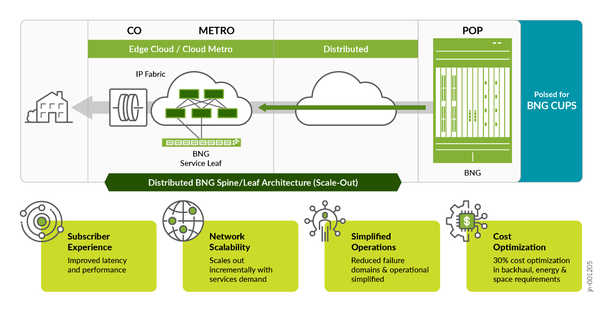
*Figure 1: Juniper DBAS Solution Architecture*

In this architecture, the overlay network infrastructure has effectively become a
simplified, data centre style access fabric using Multiprotocol Label Switching
(MPLS) Segment Routing (SR) as transport underlay and EVPN as service overlay. And
therefore, it can run on a variety of Juniper underlay platforms that support AGN
"spine" functions in an access and aggregation capacity.

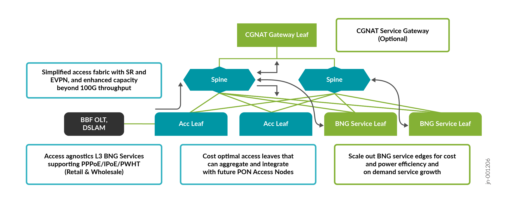
*Figure 2: Juniper Metro DBAS Key Elements*

Figure 2 shows key elements of the DBAS architecture. The BBE/BNG service leaves
enable the broadband services to provide Point-to-Point Protocol over Ethernet
(PPPoE) and IP over Ethernet (IPoE) sessions over the EVPN Pseudowire Headend
Termination (PWHT). This architecture also provides access-agnostic connectivity
for residential, retail/business, and/or wholesale services.

The AN leaves and BBE/BNG service leaves are horizontally scaled and can aggregate
and integrate PON access. Disaggregating larger centralized devices provides
significant advantages, such as lower power consumption, reduced space
requirements, and decreased cooling demands. This approach enables agile,
on-demand scalability.

The transport underlay in the access fabric is based on SR MPLS, enabling
operational simplicity and fast convergence with Loop Free Alternate Fast Re-Route
(LFA FRR). In case of BBE JVD, rapid topology convergence is achieved with
Topology Independent Loop Free Alternates (TI-LFA) fast reroute. In cases where the
CGNAT service gateway is remote from the core network (see Juniper Scale-Out
Stateful Firewall and Source NAT for Enterprise — JVD), the BBE/BNG service leaves
and the Access Fabric AGN spines implement BGP label unicast to enable segmentation
and isolation between core and access fabric and facilitate seamless MPLS
integration across the domains.

The service overlay for unicast services is based on EVPN Virtual Private Wire
Service (VPWS), which enables per Access Node transport. It supports EVPN Flexible
Cross Connect (FXC), which enables multiplexing of multiple access nodes in the
same EVPN transport, improving operational simplicity in the access fabric.

The access fabric provides IP multicast transport for IP Television (IPTV)
services. The EVPN transport enables the broadband access to be load balanced
across the BNG service leaves cluster. By using a different designated forwarded
priority, it provides active/standby connectivity to backup BBE/BNGs.

BBE/BNG service leaves enable:

- PWHT for the EVPN service
- PPPoE, IPoE, and IP multicast for retail unicast and multicast services
- Link Access Concentrator (LAC) and MPLS VPN for wholesale services

### Architecture Functional Layers

- **Metro Ethernet Network (MEN):** The reference architecture deploys a
  spine-leaf access topology to provide the physical redundancy (wherever
  appropriate) for L2 to connect to a PWHT for BNG services.
- **The Transport Underlay layer includes:**
  - SR MPLS using IS-IS IPv4 (Metro and Core)
  - iBGP-LU
  - MP-BGP
- **The Services Overlay for PWHT EVPN E-LINE includes:**
  - (EVPN-VPWS) multihomed without FXC
  - EVPN E-LINE (EVPN-VPWS) multihomed with FXC

### BBE/BNG Solution

Juniper operates two redundancy models for DBAS using BBE/BNG solutions to achieve
minimal subscriber traffic drop during failover and keep the revert time
predictable (i.e., it is the same as failover):

**Stateless Rapid Reconnect (RR) model** provides the following benefits:

- This model can be leveraged for PPPoE, DHCP C-VLAN, and static VLAN methods for
  relay and server.
- Use this model to optimize upgrades, i.e., fast restoration of best-effort
  traffic, which can be applied on access interfaces such as PS, GE, XE, and AE.
- There is no overhead in synchronising the subscriber state and client
  information between the BNGs.

A drawback of this model is:

- There is no background programming of CoS, firewall, and services structure upon
  node failure.

For more information, see BNG Redundancy for DHCP Subscribers Using Packet
Triggered Based Recovery.

Figure 3 shows Juniper BBE redundancy models. Juniper supports traditional
stateful and stateless mechanisms of operation as well as new models with
Stateless Rapid Reconnect and N:1 Stateful model with PFE oversubscription. This
JVD is based on the new model of Stateless Rapid Reconnect.

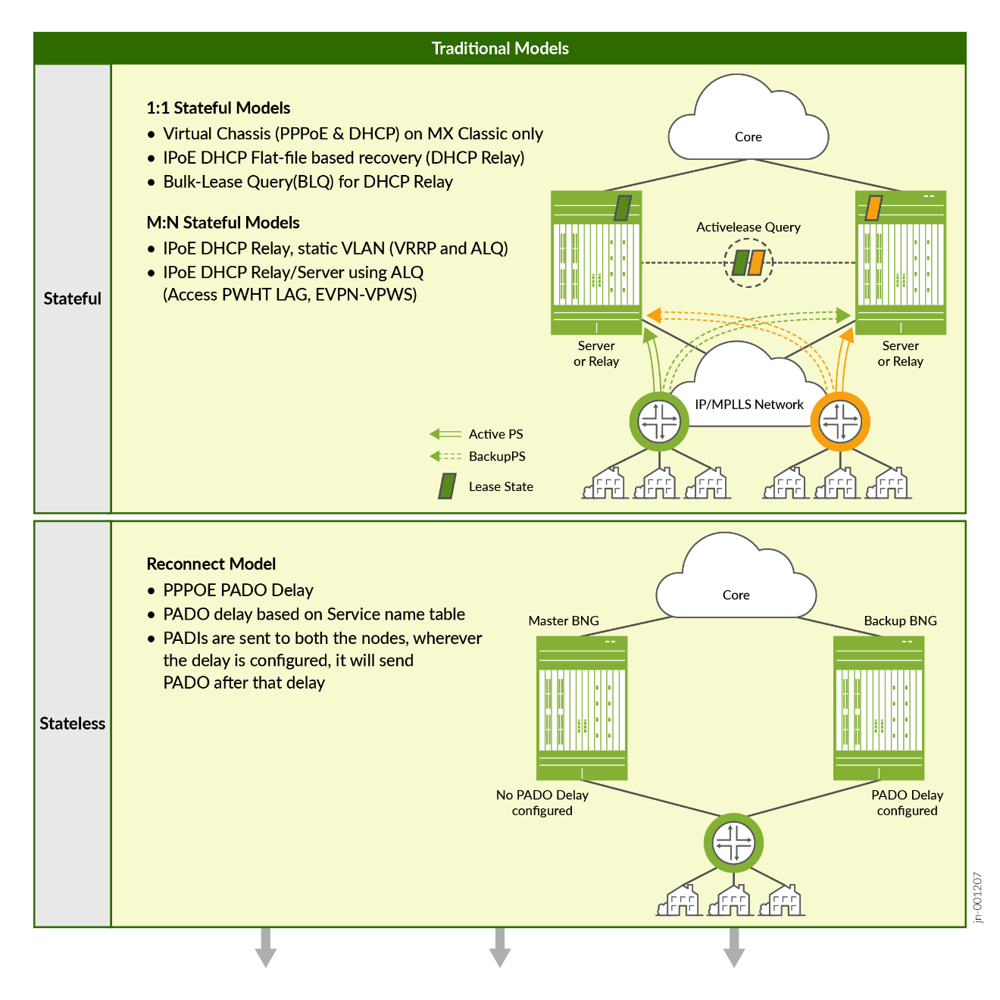
*Figure 3: Juniper BNG Redundancy Traditional Models*

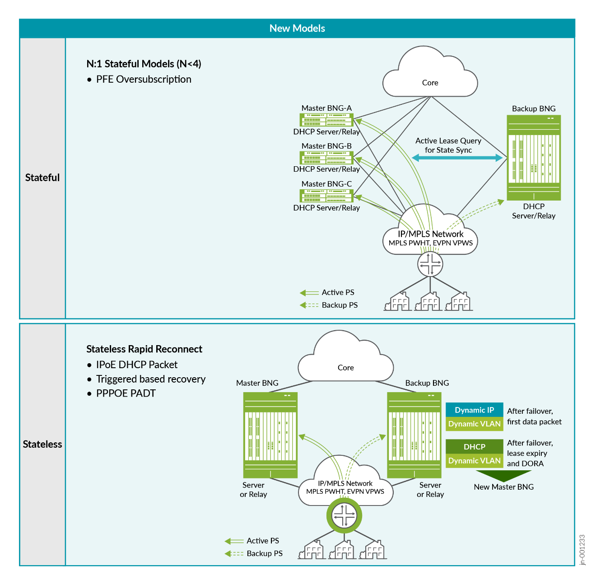
*Figure 4: Juniper BNG Redundancy New Models*

Figure 5 shows the operation of Stateful N:1 Redundancy model. This model shows the
Active Lease subscriber synchronization between the Master and Backup BNG.

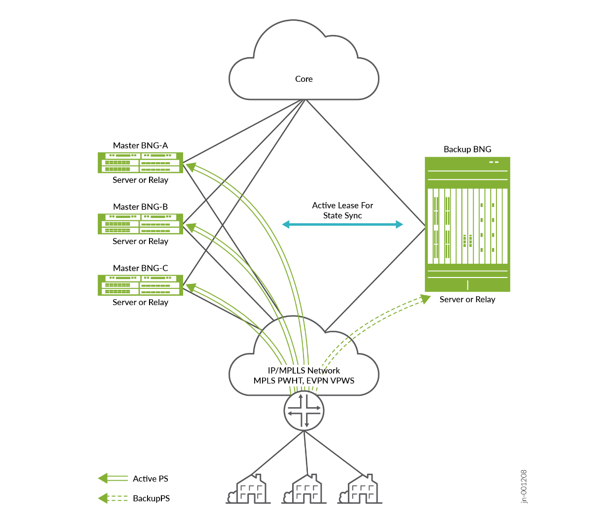
*Figure 5: Juniper BNG Stateful N:1 Redundancy Model*

Figure 6 shows Stateless Rapid Reconnect. There is no synchronization between the
Primary and Backup BNG nodes. In case of the primary BNG node failure, the first
data packet of an existing subscriber session is used to trigger the creation of a
subscriber interface on the Backup BNG. After the expiry of the DHCP lease, a new
DHCP process is used to create the subscriber sessions on Backup BNG.

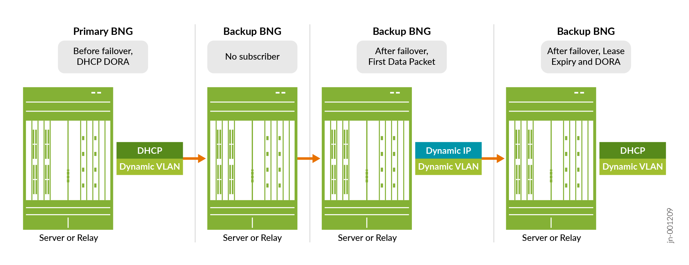
*Figure 6: Juniper BNG Stateless Rapid Reconnect Flow*

Figure 7 presents the call flow procedures during BNG failover between subscriber
device (CPE) to Primary and Backup BNG. The diagram explains how the session is
recreated on the Backup BNG.

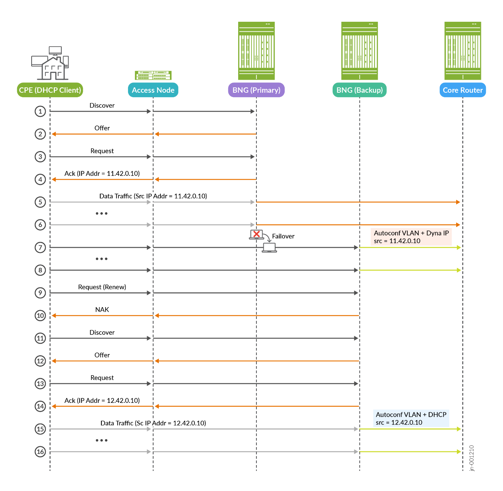
*Figure 7: Juniper BNG Stateless Rapid Reconnect Process*

Before the failover:

- DHCP over Dynamic VLAN stack is present at Primary BNG.
- There are no subscribers at the Backup BNG.

At the point of failover, the first data packet that arrives on the Backup BNG
triggers the creation of a Dynamic VLAN and a Dynamic IP subscriber. The Dynamic
IP subscriber stacks over the Dynamic VLAN.

If the primary BNG continues to show a failure state when the DHCP renew occurs, it
is addressed as NAK, and it restarts the DORA process. This creates the DHCP
subscriber at backup BNG and stacks DHCP over dynamic VLAN. The dynamic IP
subscriber created earlier (at step 2 above) is deleted.

**N:1 Stateful Model (N<4)** (formerly known separately as 1:1 Stateful Model and
M:N Stateful Model): In this model, Active Lease Query (ALQ) and Bulk Lease Query
(BLQ) are used to synchronise subscribers from the primary BNG(s) to the backup
BNG.

The benefits of this model are:

- N+1 (N<4) PFE oversubscription using pseudowire (PS) interface (MPLS PWHT, EVPN
  VPWS).
- One chassis acts as a backup for Nx BNGs (Juniper recommends four primary BNGs
  to one backup BNG as a ratio).
- Upon failover, best-effort traffic forwarding immediately resumes. In the
  background, CoS, firewall, and services are programmed.

Drawbacks of this model include:

- DHCP subscribers only, therefore no PPPoE support.
- Single failure design (one failover at a time; second failover needs revert of
  the first failover to complete)

For more information, see M:N Subscriber Redundancy on BNG.

### Baseline Features

The baseline features required for this JVD include:

- **EVPN:** EVPN E-LINE (EVPN-VPWS) with and without FXC
- **Routing:** SR MPLS, IS-IS, MP-BGP, iBGP-LU, eBGP, BFD, Route Reflection, IPv4
- **Switching:** ESI LAG, VLAN (802.1q), VLAN QinQ (802.1ad)

## Solution Architecture and Test Objectives

### Solution Goals

The solution goals and deliverables include:

- Validate solutions through incremental testing efforts/test profiles.
- Identify and close solution gaps to ensure completeness.
- Build and deliver full test reports and design recommendations for network
  engineers implementing this solution.
- Provide configuration details, design, and implementation guidance for validated
  use cases.

The JVD solutions delivered as part of an existing Metro JVD track are:

- Metro Ethernet Business Services—Juniper Validated Design (JVD): Leveraging metro
  fabric design concepts to support wholesale service delivery mechanisms.
- 5G xHaul CSR Seamless Segment Routing—Juniper Validated Design (JVD): Using
  fronthaul access and aggregation principles.
- 5G Fronthaul Class of Service—Juniper Validated Design (JVD): Class of Service
  modelling for access and aggregation architectures.

### Solution Non-Goals

The solution non-goals are:

- **BBE/BNG:**
  - Topology discovery
  - CPE IPv6 timer support, i.e., aggressive DHCP timers and/or IPv6 state when
    BBE/BNG fails over.
  - Scaling higher than 4x AN to 1x BBE/BNG.
  - BBE/BNG subscriber scaling per MX product.
  - In respect to the functional architecture, for Broadband Forum TR-101 we have
    assumed that the compliant xDSL and xPON Access Nodes have the ability to
    implement N:1 service VLANs or 1:1 per subscriber VLANs for the unicast
    services, and IGMP/MLDP snooping for multicast services like IPTV.
  - H-Policer QoS model
- **Access Nodes:**
  - xDSL
  - xPON
  - IGMP/MLDP
- Timing and synchronization
- Network optimisation, i.e. BFD, BGP timers
- Network Slicing/Flex-Algo/BGP-CT/SRv6 for underlay configuration
- SLA monitoring: RFC 2544, Y.1564, TWAMP, Paragon Active Assurance
- Telemetry
- LDP and/or RSVP signalling for MPLS
- Class-of-Service (CoS) in the port mode

## Validation Framework

This JVD addresses the network modernization that includes a new broadband
approach for scalable and resilient access fabric. A crucial aspect of the overall
solution is to enable flexibility to support heterogeneous customer architectures
within the same validated design. Major technical attributes include:

- SR MPLS underlay architecture
- EVPN-VPWS overlay service framework with or without FXC
- Subscriber access termination based on IPoE and PPPoE
- EVPN PWHT
- Stateless Rapid Reconnect model for BNG recovery
- IPv4 and IPv6 subscriber termination with Dual Stack option

To review the software versions and platforms on which this JVD was validated by
Juniper Networks, see the Validated Platforms and Software section in this document
and the companion [datasheet.md](datasheet.md).

## Solution Architecture

### JVD Lab Topology

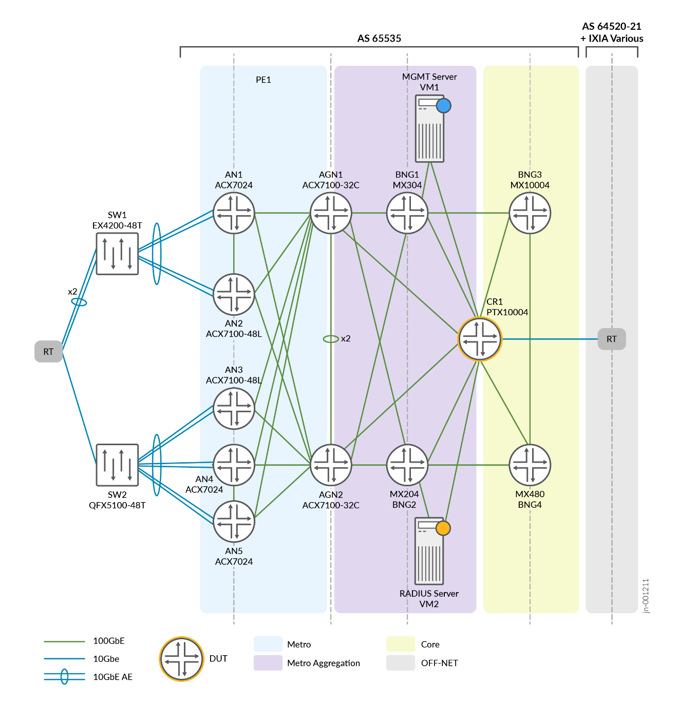
*Figure 8: Metro BBE Lab Topology*

### Platform Positioning

This JVD is evaluated and validated on the following platforms.

> **NOTE:** The Devices Under Test (DUT) are used with helper devices. However, the
> helper devices functionality is not evaluated. Their role is to facilitate test
> execution.

- **Switch SW:**
  - SW1 – EX4200-48T (Helper)
  - SW2 – QFX5100-48S (Helper)
- **Access Node AN** – ACX7024/ACX7100-48L (DUT)
- **Aggregation Node AGN** – ACX7100-32C (DUT)
- **Core Router CR** – PTX10004 (Helper)
- **BBE/BNG:**
  - BNG1 – MX304 (DUT)
  - BNG2 – MX204 (DUT)
  - BNG3 – MX10004 with LC480 and LC9600 (DUT)
  - BNG4 – MX480 with MPC3 and MPC5E and MPC7E and MPC10 (DUT)
- **RT** – IXIA (Helper) Tester device to simulate subscriber devices and traffic
  flow

### Network Architecture

The following figure shows the underlay solution architecture for a tier 1 service
provider.

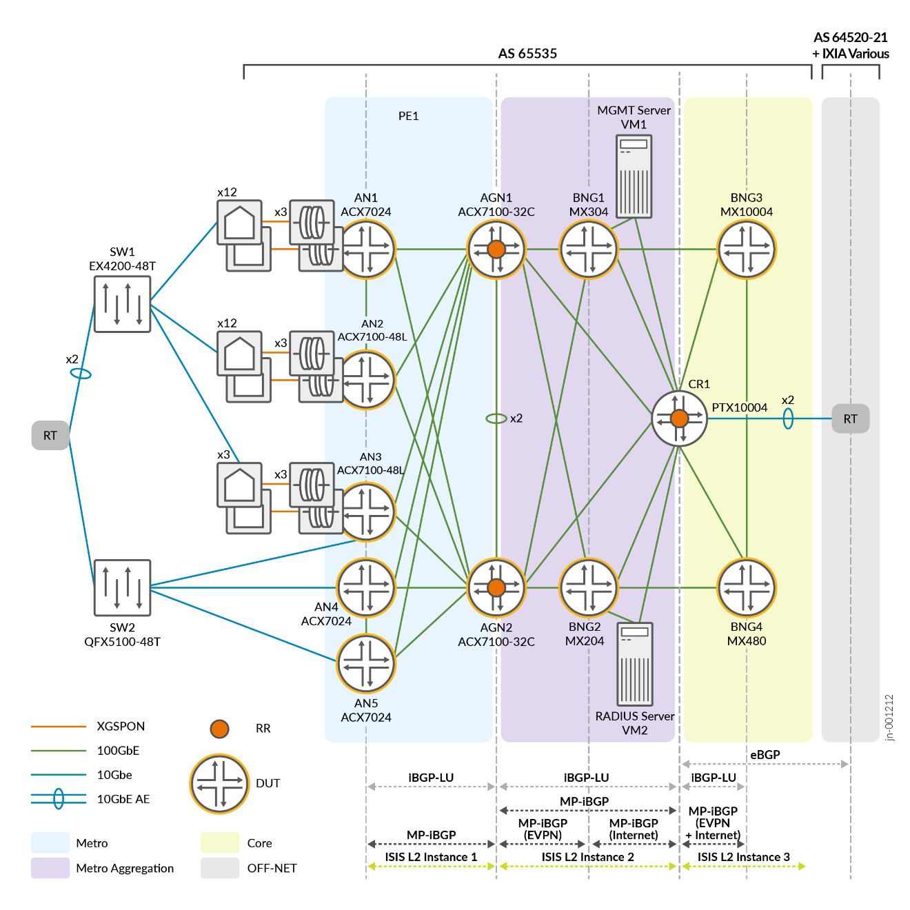
*Figure 9: Underlay Solution Architecture Tier 1 Provider*

The underlay solution is based on SR MPLS technology with IS-IS as the IGP
protocol. The routing domain is divided into Metro, Metro Aggregation, and Core
areas. Each area runs a separate IGP Instance. Due to this, the routing information
is condensed to only the necessary routes in a particular domain. BGP-LU protocol
is used to distribute routing information between metro areas. If needed, a Tier
2/3 SP can condense the Metro and Metro Aggregation IGPs into a single instance:

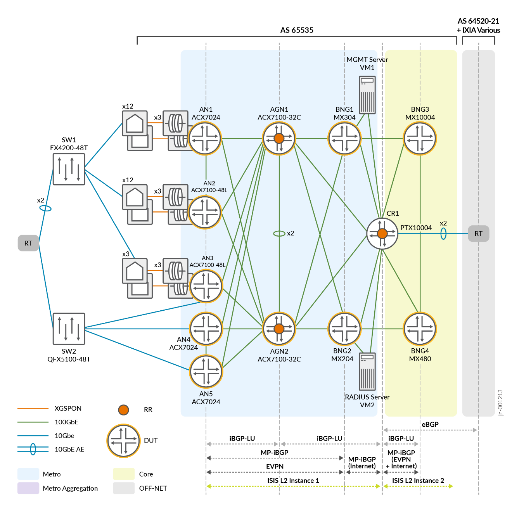
*Figure 10: Underlay Solution Architecture Tier 2/3 Provider*

Figure 11 outlines the overlay solution architecture with collapsed Metro and
Aggregation areas. This more closely resembles current T2 and T3 provider networks.
The following overlay models are utilized in both SP Tier 1 and SP Tier 2/3 design
models.

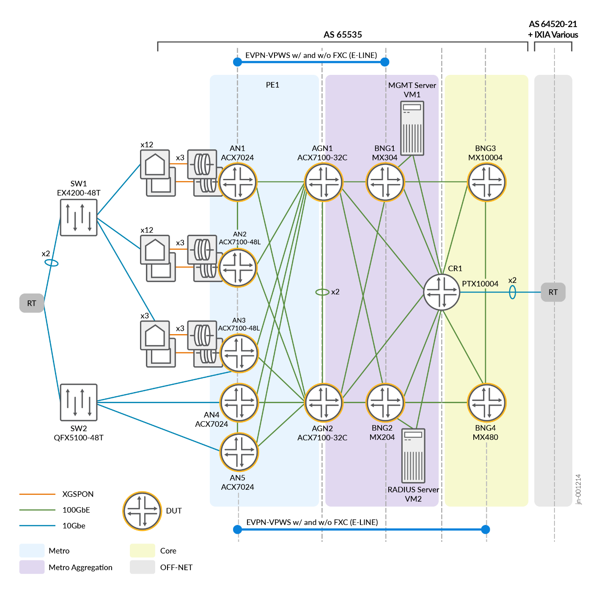
*Figure 11: Overlay Solution Architecture*

> **NOTE:** You can build the overlay structure using different L2 service
> technologies. This JVD proposes to use EVPN-VPWS as an overlay structure for
> current testing. Other overlay structures are documented for reference in the
> backup section.

The following figure shows EVPN-VPWS (E-LINE) overlay structure.

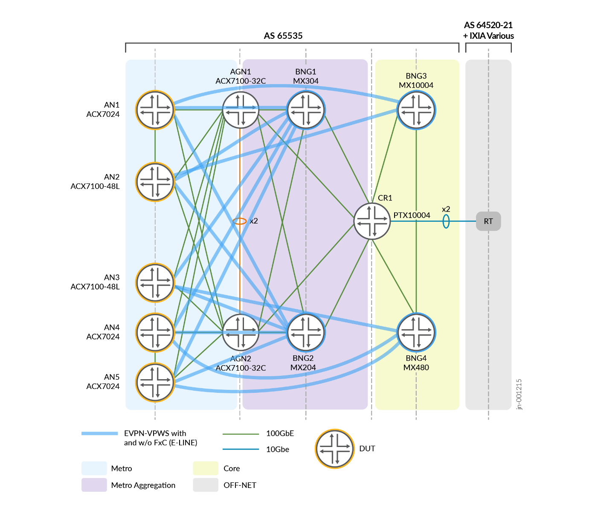
*Figure 12: BNG Base + E-LINE Pseudowires Solution Architecture*

### BNG Network Architecture

This JVD evaluates the following residential subscribers' services:

- Residential broadband subscribers with 100Mbps, 200Mbps, and 500Mbps services
- Business broadband subscribers with 100Mbps services

**Base**

The RADIUS attributes are used to steer the subscribers to the correct VRF and/or
default instance.

The BNGs are paired as follows for Stateless RR:

- BNG1 + BNG2 = BNG Group A
- BNG3 + BNG4 = BNG Group B

The ANs are homed to the BNGs as follows:

- AN1 + AN2 = BNG Group A
- AN3 + AN4 + AN5 = BNG Group B

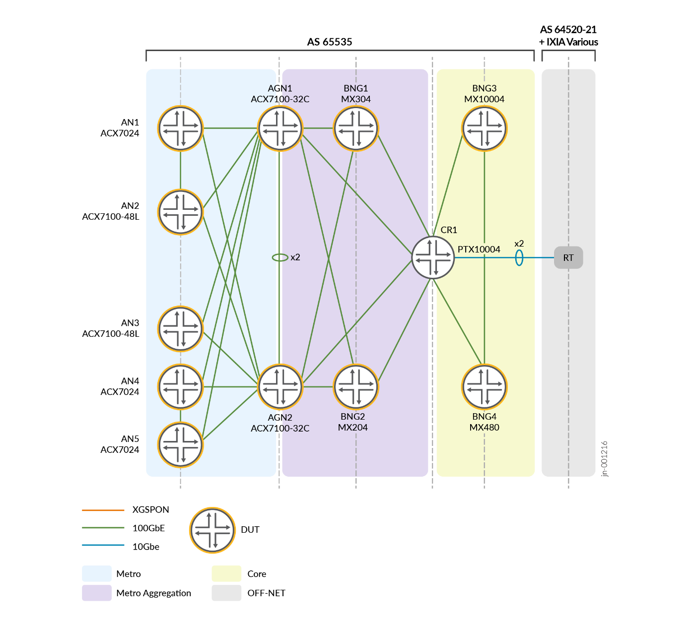
*Figure 13: BNG Base Solution Architecture*

**Broadband Subscribers**

Each ANx has its own S-VLAN per access-facing port to delineate its presence in the
metro, and the subscribers are split based on their C-VLAN as to whether they are
residential or business broadband customers.

The BNG groups are loaded with 128k subscribers total and split 50:50 between them
(64k subscribers each). The subscribers are mapped as follows:

*Table 1: AN1 Subscribers C-LAN and S-VLAN mapping to BBE/BNG*

| ANx | C-VLAN | S-VLAN | Primary BNGx | Secondary BNGx |
|---|---|---|---|---|
| AN1 | 2-3202 | 1011 | BNG1 | BNG2 |
| AN1 | 2-3202 | 1012 | BNG2 | BNG1 |
| AN1 | 2-3202 | 1013 | BNG1 | BNG2 |
| AN1 | 2-3202 | 1014 | BNG2 | BNG1 |
| AN1 | 2-3202 | 2011 | BNG1 | BNG2 |
| AN1 | 2-3202 | 2012 | BNG2 | BNG1 |
| AN1 | 2-3202 | 2013 | BNG1 | BNG2 |
| AN1 | 2-3202 | 2014 | BNG2 | BNG1 |

*Table 2: AN2 Subscribers C-LAN and S-VLAN mapping to BBE/BNG*

| ANx | C-VLAN | S-VLAN | Primary BNGx | Secondary BNGx |
|---|---|---|---|---|
| AN2 | 2-3202 | 1021 | BNG1 | BNG2 |
| AN2 | 2-3202 | 1022 | BNG2 | BNG1 |
| AN2 | 2-3202 | 1023 | BNG1 | BNG2 |
| AN2 | 2-3202 | 1024 | BNG2 | BNG1 |
| AN2 | 2-3202 | 2021 | BNG1 | BNG2 |
| AN2 | 2-3202 | 2022 | BNG2 | BNG1 |
| AN2 | 2-3202 | 2023 | BNG1 | BNG2 |
| AN2 | 2-3202 | 2024 | BNG2 | BNG1 |

*Table 3: AN3 Subscribers C-LAN and S-VLAN mapping to BBE/BNG* (labeled "AN2" in the
source; values are for AN3)

| ANx | C-VLAN | S-VLAN | Primary BNGx | Secondary BNGx |
|---|---|---|---|---|
| AN3 | 2-3202 | 1031 | BNG1 | BNG2 |
| AN3 | 2-3202 | 1032 | BNG2 | BNG1 |
| AN3 | 2-3202 | 1033 | BNG1 | BNG2 |
| AN3 | 2-3202 | 1034 | BNG2 | BNG1 |
| AN3 | 2-3202 | 2031 | BNG1 | BNG2 |
| AN3 | 2-3202 | 2032 | BNG2 | BNG1 |
| AN3 | 2-3202 | 2033 | BNG1 | BNG2 |
| AN3 | 2-3202 | 2034 | BNG2 | BNG1 |

*Table 4: AN4 Subscribers C-LAN and S-VLAN mapping to BBE/BNG* (labeled "AN2" in the
source; values are for AN4)

| ANx | C-VLAN | S-VLAN | Primary BNGx | Secondary BNGx |
|---|---|---|---|---|
| AN4 | 2-3202 | 1031 | BNG1 | BNG2 |
| AN4 | 2-3202 | 1032 | BNG2 | BNG1 |
| AN4 | 2-3202 | 1033 | BNG1 | BNG2 |
| AN4 | 2-3202 | 1034 | BNG2 | BNG1 |
| AN4 | 2-3202 | 2031 | BNG1 | BNG2 |
| AN4 | 2-3202 | 2032 | BNG2 | BNG1 |
| AN4 | 2-3202 | 2033 | BNG1 | BNG2 |
| AN4 | 2-3202 | 2034 | BNG2 | BNG1 |

*Table 5: AN5 Subscribers C-LAN and S-VLAN mapping to BBE/BNG* (labeled "AN2" in the
source; values are for AN5)

| ANx | C-VLAN | S-VLAN | Primary BNGx | Secondary BNGx |
|---|---|---|---|---|
| AN5 | 2-3202 | 1031 | BNG1 | BNG2 |
| AN5 | 2-3202 | 1032 | BNG2 | BNG1 |
| AN5 | 2-3202 | 1033 | BNG1 | BNG2 |
| AN5 | 2-3202 | 1034 | BNG2 | BNG1 |
| AN5 | 2-3202 | 2031 | BNG1 | BNG2 |
| AN5 | 2-3202 | 2032 | BNG2 | BNG1 |
| AN5 | 2-3202 | 2033 | BNG1 | BNG2 |
| AN5 | 2-3202 | 2034 | BNG2 | BNG1 |

To terminate the broadband subscribers, the BNGs add pseudowires using PWHT in the
BBE/BNG. BNG1 is a primary BNG for specific C-VLAN and S-VLAN ranges with BNG2 being
backed up. These mappings are presented in Table 2 through Table 6. For different
S-VLAN ranges, BNG1 is backed up for customers connected to BNG2. In the case of
both BNGs, BNG3 and BNG4 serve as backup BNG, respectively.

### QoS Consideration for BNG Subscribers

A subscriber hierarchical QoS profile is attached to every subscriber interface
that terminates on the BNG. The BNG QoS TCP (traffic-control-profile) parameters
are defined as:

- Policing traffic on subscriber profiles to:
  - 100 Mb/s
  - 200 Mb/s
- Scheduling and Queuing properties are defined at the logical interface (Level 4)
  hierarchy
  - A four-queue model is created for each L4 IFL with Best Effort, Expedited
    Forwarding, Voice, and Assured Forwarding queue definitions.
  - Voice queue is assigned strict-high priority with 5% interface bandwidth
    (transmit-rate) and rate-limited to prevent starving.
  - Assured and Expedited Forwarding queues are assigned as high-priority with a
    10% transmit-rate.
  - Best Effort queue is assigned low-priority with a remainder of transmit-rate
  - Buffering scheduler configuration values are set up according to the queue
    transmit-rate, except the Voice queue is configured with a temporal value of
    10ms.
- Traffic is marked using DSCP for IPv4 packets and BA classification with
  arbitrary values consistent across the network

The TCP profiles are passed to BNG through radius server parameters.

### Solution Validation Requirements

This JVD validates an end-to-end network architecture and design using SR MPLS,
IPv4 IGP as underlay, and EVPN pseudowires at scale under multiple stress
conditions to emulate Business as Usual Operations (BAU OPS).

- Validate EVPN E-LINE for PWHT into a BBE/BNG
- Validate EVPN E-LINE with FXC for PWHT into a BBE/BNG
- Validate BNG failover for:
  - Stateless Rapid Reconnect (RR)
  - N:1 Stateful Model (N<4)
- Validate L3 routing when using ESI LAG to an 'OLT'
- Capacity planning and monitoring:
  - Bandwidth per PFE in the BBE
  - Subscribers per pseudowire terminated on the BBE
  - The subscriber scale included is a reasonable approximation of values used in
    service provider networks. JVD is considered a design blueprint rather than an
    extensive unidimensional scale testing.
- Validation of basic per subscriber QoS profile with policer attached.
- Validation of largescale subscribers' QoS behaviours.

### Key Measurements

Record the following items as a part of JVD testing.

- In a BBE network failure scenario:
  - pseudowire re-routing during:
    - Link failure event (should be ≤50ms)
    - AGNx node failure event (should be ≤50ms)
- In a BNG failover scenario:
  - Time to reconnect for a subscriber. This time is expressed as connections per
    second (CPS) occurring on the BNG backup. Typical values observed are
    approximately 300 CPS. Results depend on variable factors, such as hardware
    platforms.
- In a BNG recovery scenario:
  - Repeat the above steps during the recovery period while no state exists between
    BBE/BNG pair.

**Failover Testing** — following are examples of the failure scenarios.

- **AGN Failure:** During the AGN2 failure event, network resiliency mechanisms
  (ECMP) ensure that traffic destined for BNG2 (and potentially BNG4) is rerouted
  immediately to AGN1.

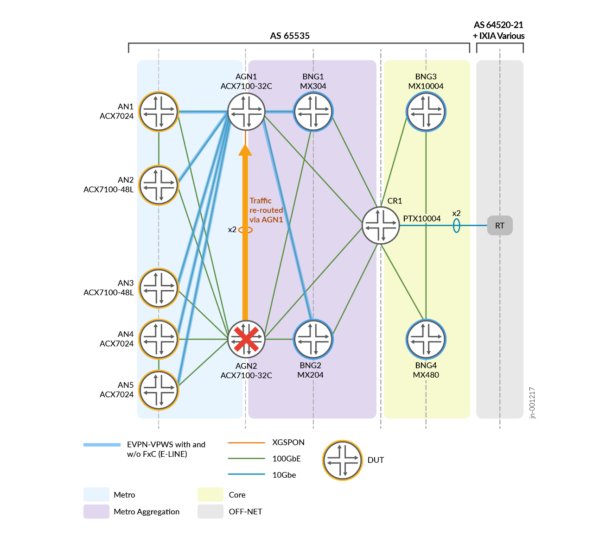
*Figure 14: AGN2 Failure*

- **BNG1 Failure:** If BNG1 fails, then all the subscribers should failover
  immediately to BNG2 and remain in a 'fail open' state until the subscriber
  re-authenticates.

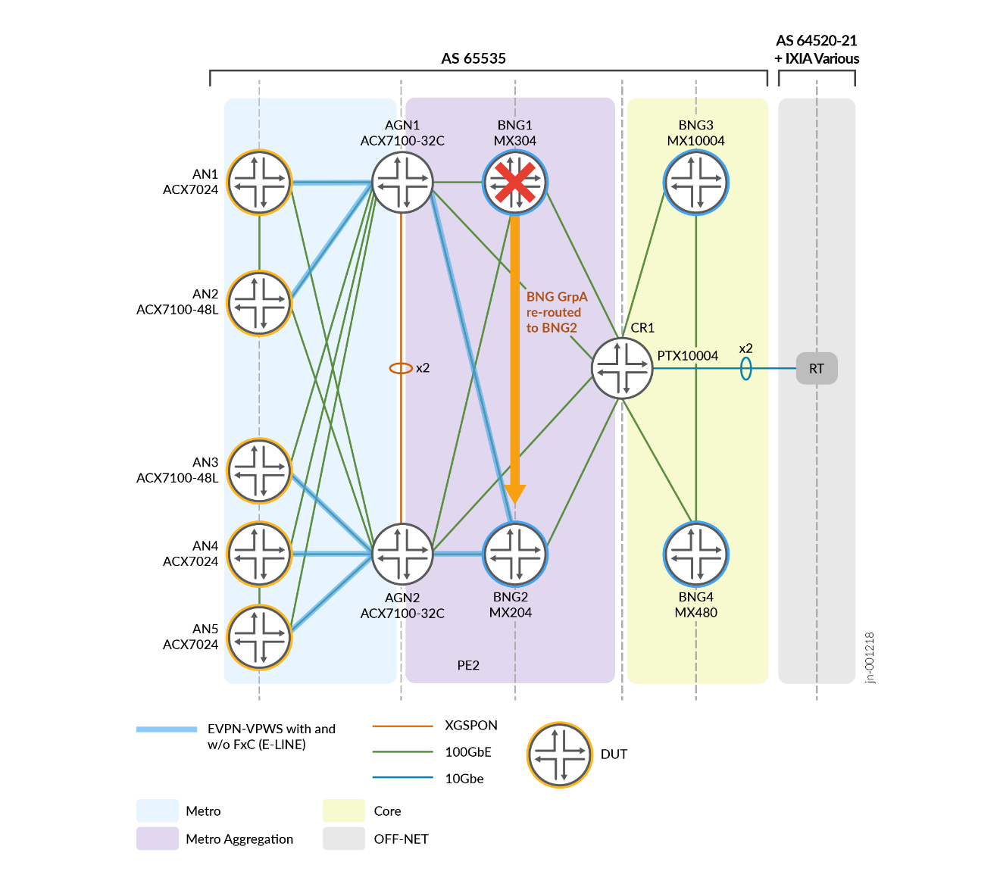
*Figure 15: BNG1 Failure*

- **BNG1 and BNG2 Failures:** If BNG1 and BNG2 fail, then all of the subscribers
  should failover immediately to their respective backup BNGs (see Broadband
  Subscribers) and remain in a 'fail open' state until the subscriber
  re-authenticates (see Stateless Rapid Reconnect (RR) Model).

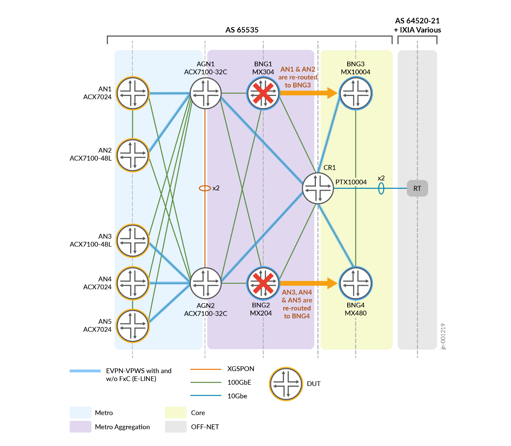
*Figure 16: BNG1 and BNG2 Failures*

- **ESI LAG failover.** L2 device (switch or OLT) is multihomed to AN and in case
  of one link failure (between L2 device and AN) second AN can forward traffic.
  This failover can happen between AN1 and AN2 nodes as an example.
- **Core link between AN and AGG device failover.** Fast underlay (SR-MPLS)
  restoration happens because of TI-LFA (topology independent loop-free alternates).

### Test Bed Device Configuration

Base configuration examples for AN, AGN, and BNG nodes follow. These are
representative excerpts; the full per-device configurations are in
[`../configuration/`](../configuration/).

**AN4 EVPN-VPWS instance configuration example on ACX7024:**

```
regress@rtme-acx7024-03# show routing-instances METRO_BBE_EVPN_VPWS_IPoE_GROUP_10
instance-type evpn-vpws;
protocols {
    evpn {
        interface ae1.1050 {
            vpws-service-id {
                local 20;
                remote 40;
            }
        }
    }
}
interface ae1.1050;
route-distinguisher 103.103.103.103:1050;
vrf-target target:60000:1050;
regress@rtme-acx7024-03# show interfaces ae1
flexible-vlan-tagging;
mtu 9102;
encapsulation flexible-ethernet-services;
aggregated-ether-options {
    lacp {
        active;
        periodic fast;
        system-id 00:00:00:00:04:04;
    }
}
unit 1050 {
    encapsulation vlan-ccc;
    vlan-id 1050;
    esi {
        00:10:11:11:11:11:11:00:00:4a;
        all-active;
    }
    family ccc;
}
```

**AN5 EVPN-VPWS configuration example on ACX7024:**

```
regress@rtme-acx7024-09# show routing-instances METRO_BBE_EVPN_VPWS_IPoE_GROUP_10
instance-type evpn-vpws;
protocols {
    evpn {
        interface ae1.1050 {
            vpws-service-id {
                local 20;
                remote 40;
            }
        }
    }
}
interface ae1.1050;
route-distinguisher 104.104.104.104:1050;
vrf-target target:60000:1050;
regress@rtme-acx7024-09# show interfaces ae1
flexible-vlan-tagging;
mtu 9102;
encapsulation flexible-ethernet-services;
aggregated-ether-options {
    lacp {
        active;
        periodic fast;
        system-id 00:00:00:00:04:04;
    }
}
unit 1050 {
    encapsulation vlan-ccc;
    vlan-id 1050;
    esi {
        00:10:11:11:11:11:11:00:00:4a;
        all-active;
    }
    family ccc;
}
```

**BNG1 (MX304) and BNG2 (MX204) EVPN-VPWS with PWHT instance configuration
examples:**

```
BNG1:
regress@jvd-awan-mx304-h# show routing-instances METRO_BBE_EVPN_VPWS_IPoE_GROUP_10
instance-type evpn-vpws;
protocols {
    evpn {
        interface ps20.0 {
            vpws-service-id {
                local 40;
                remote 20;
            }
        }
    }
}
interface ps20.0;
route-distinguisher 192.168.107.107:1050;
vrf-target target:60000:1050;

BNG2:
regress@jvd-awan-mx204-i# show routing-instances METRO_BBE_EVPN_VPWS_IPoE_GROUP_10
instance-type evpn-vpws;
protocols {
    evpn {
        interface ps20.0 {
            vpws-service-id {
                local 40;
                remote 20;
            }
        }
    }
}
interface ps20.0;
route-distinguisher 192.168.108.108:1050;
vrf-target target:60000:1050;
```

**BNG3 (MX10004) and BNG4 (MX480) EVPN-VPWS with PWHT configuration examples:**

```
BNG3:
regress@jvd-awan-mx10k4-e# show routing-instances METRO_BBE_EVPN_VPWS_IPoE_GROUP_10
instance-type evpn-vpws;
protocols {
    evpn {
        interface ps20.0 {
            vpws-service-id {
                local 40;
                remote 20;
            }
        }
    }
}
interface ps20.0;
route-distinguisher 192.168.109.109:1050;
vrf-target target:60000:1050;

BNG4:
regress@jvd-awan-mx480-n# show routing-instances METRO_BBE_EVPN_VPWS_IPoE_GROUP_10
instance-type evpn-vpws;
protocols {
    evpn {
        interface ps20.0 {
            vpws-service-id {
                local 40;
                remote 20;
            }
        }
    }
}
interface ps20.0;
route-distinguisher 192.168.110.110:1050;
vrf-target target:60000:1050;
```

**Associated BNG PS interface configuration (BNG1):**

```
regress@jvd-awan-mx304-h# show interfaces ps20
anchor-point {
    lt-3/2/0;
}
flexible-vlan-tagging;
auto-configure {
    stacked-vlan-ranges {
        dynamic-profile auto-stacked-pwht_dhcp {
            accept any;
            ranges {
                any,any;
            }
        }
        authentication {
            packet-types any;
            password joshua;
            username-include {
                domain-name jnpr.net;
                user-prefix pwht_dhcp;
            }
        }
        access-profile vlan-auth-access1;
    }
    remove-when-no-subscribers;
}
mtu 2022;
esi {
    00:10:12:12:12:12:12:00:00:4a;
    single-active;
    df-election-type {
        preference {
            value 995;
        }
    }
}
mac aa:aa:aa:bb:bb:bb;
no-gratuitous-arp-request;
unit 0 {
    encapsulation ethernet-ccc;
}
```

## Results Summary and Analysis

The JVD team successfully validated comprehensive and multidimensional solutions
for the proposed BBE solution architecture by executing extensive test cases
developed for this design. The validation features MX304, MX204, MX10004, MX480,
ACX7024, ACX7100-48L, and ACX7100-32C as primary DUTs. **Over 120 test cases are
executed for each DUT** during validation on Junos OS and Junos OS Evolved version
24.2R2.

A major objective of this JVD is to create practical solutions with a
multidimensional scale relevant to the domain-specific use cases. Functional
testing ensures that services and protocols operate within expectations. Network
resiliency and convergence performance are measured and reported in the JVD.

General testing includes, but is not limited to, the following crucial scenarios:

- Baseline verification of PPPoE with EVPN-VPWS (with FXC) and PWHT
- PPPoE: EVPN-VPWS with different restart methods (service, daemon)
- PPPoE: EVPN-VPWS with NSR switchover
- PPPoE: Link Failure on SW1 with PPPoE over EVPN-VPWS PWHT (without FXC)
- AN node link failure towards the core network
- AN node failure
- Restoration with revertive/non-revertive behavior for BBE PWHT (EVPN-VPWS with
  FXC)
- BNG link failures towards AGN nodes
- Various resiliency tests for routing protocols convergency IS-IS/BGP
- Device configuration restoration
- Device rebooting
- Various Junos OS and Junos EVO software components restart

### Scaling of JVD Testing

> **NOTE:** The information shared in this section is not system maximums and may be
> modified at any time. Please contact your Juniper Networks representative for
> additional scaling information.

*Table 6: Scaling for JVD Testing*

| Feature | AN-Device | BNG1 (non-failure) | BNG2 (non-failure) | BNG (failure) |
|---|---|---|---|---|
| IPv4 RIB | N/A | 8100 | 8100 | 16200 |
| IPv4 FIB | N/A | 8100 | 8100 | 16200 |
| IPv6 RIB | N/A | 8100 | 8100 | 16200 |
| IPv6 FIB | N/A | 8100 | 8100 | 16200 |
| Total RIB | N/A | 16200 | 16200 | 32400 |
| Total FIB | N/A | 16200 | 16200 | 32400 |
| PPPoE v4 (E-LINE-PWHT) | N/A | 4000 | 4000 | 8000 |
| PPPoE v6 (E-LINE-PWHT) | N/A | 4000 | 4000 | 8000 |
| PPPoE v4 (E-LINE-FXC-PWHT) | N/A | 50 | 50 | 100 |
| PPPoE v6 (E-LINE-FXC-PWHT) | N/A | 50 | 50 | 100 |
| IPoE v4 (E-LINE-PWHT) | N/A | 4000 | 4000 | 8000 |
| IPoE v6 (E-LINE-PWHT) | N/A | 4000 | 4000 | 8000 |
| IPoE v4 (E-LINE-FXC-PWHT) | N/A | 50 | 50 | 100 |
| IPoE v6 (E-LINE-FXC-PWHT) | N/A | 50 | 50 | 100 |
| VLANs | S-VLANS=15 C-VLANS=8100 | 16200 | 16200 | 32400 |
| ELINE-PWHT (Routing-instance) | 10 | 20 | 20 | 20 |
| ELINE-FXC-PWHT (Routing-Instance) | 2 | 4 | 4 | 4 |

The scaling details shown in Table 6 are used for resiliency and functional testing
in the JVD. Subscriber scaling is based on maximum subscriber values supported by
specific BNG platforms. In case of total BNG failure, you need to reconnect all
subscribers from failed node to backup node, you have used half of maximum number of
subscribers for given platform. In this case, BNG that provides redundancy, can
terminate its own subscribers' sessions and handle sessions coming from failed BNG.

Traffic streams are generated for testing purposes to simulate real subscriber
traffic patterns. Each traffic category is used to represent different types of
subscribers.

The proposed network design delivers fast BNG service restoration. Based on access
fabric and EVPN multihoming, subscriber services are restored on backup BNG.

### BNG Convergence Measurements

Table 7 (Appendix) shows convergence measurements for single BNG failure and
restoration time. Results show expected values for total restoration time on backup
BNG. Average values are in the range of 20 seconds for all stream types. The
convergence time reflects the time when all recovered subscriber sessions
successfully appeared on backup BNG. Restoration times show convergence when
primary BNG is back online. You can see better results in the case of FXC streams.
However, these are effects of the lower number of active streams while testing with
FXC. The FXC connections are tested with 50 subscribers compared to 4000
subscribers in the case of EVPN-VPWS.

Table 7 and Table 8 show specific differences between DHCP (both IPv4 and IPv6) and
PPPoE subscriber convergence. PPPoE subscriber stream convergence is visibly worse.
The reason for this is the different behavior of the PPPoE protocol versus DHCP in
case of BNG failures. PPPoE state machine must reestablish the lost session with a
new session ID waiting for timers to expire. However, these results are examples
only as convergence further depends on random factors like subscriber traffic
intensity, number of subscriber sessions, and particular session distribution
across primary BNG in different EVPN instances.

Additional testing is performed for dual BNG catastrophic failures, in this case,
BNG1 and BNG2. Initially, BNG1 is brought into a failure state, followed by BNG2
failure. This is considered a catastrophic failure event for both devices, showing
subscriber termination convergence on BNG3. The average value of 75 seconds for
different types of streams is measured. In the case of FXC, with a lower number of
subscribers streaming, half of the convergence time is observed. For more
information, see Table 8.

Another resiliency test is performed to measure the failure of the link between the
SW1 switch and the AN1 node. In this case, the subscriber stream convergence that is
measured shows restoration time for particular streams as the LAG interface is run
between the AN1 node and switch SW1. The typical convergence time is a few
milliseconds. For FXC, no traffic interruption is observed. Table 9 presents these
results measured. Please note that some results show a value of 0. This is because
of the ESI lag existence between AN1 and AN2 toward SW1 nodes. Some traffic streams
were forwarded via the second AN node (AN2), so no traffic loss is expected.

The next resiliency test is performed by failing AN1 node. In this case, EVPN
Active-Active mechanisms are responsible for failover to the second AN device (AN2).
The average values measured are in the order of 100ms. For more information, see
Table 10.

An additional resiliency test is performed by failing the AN link to the core. Core
link failures are being mitigated by core MPLS topology fast restoration (TI-LFA).
As the backup core path is preprogrammed in the PFE of the AN node, traffic is
recovered within milliseconds. Table 11 presents traffic convergence results. These
results reflect rapid link restoration times achieved by MPLS FRR (TI-LFA) for the
underlay network in a relatively simple topology (leaf & spine).

## Appendix

This appendix provides the reference table information from the Results Summary and
Analysis sections.

*Table 7: Subscriber Traffic Convergence Time — Single BNG Failure (BNG1 Failure)*

| Event | Services Stream Name (Left→Right) | Convergence time (ms) |
|---|---|---|
| BNG1 failover | PPPoEv4_VPWS_SW1_L_R | 28233 |
| BNG1 failover | PPPoEV6_VPWS_SW1_L_R | 26543 |
| BNG1 failover | PPPoEV4_VPWS_SW1_R_L | 28259 |
| BNG1 failover | PPPoEV6_VPWS_SW1_R_L | 26606 |
| BNG1 failover | PPPoEv4_FXC_SW1_L_R | 19652 |
| BNG1 failover | PPPoEV6_FXC_SW1_L_R | 19752 |
| BNG1 failover | PPPoEv4_FXC_SW1_R_L | 18347 |
| BNG1 failover | PPPoEV6_FXC_SW1_R_L | 17299 |
| BNG1 failover | DHCPv4_VPWS_SW1_L_R | 19733 |
| BNG1 failover | DHCPv4_VPWS_SW1_R_L | 21064 |
| BNG1 failover | DHCPv4_FXC_SW1_L_R | 4731 |
| BNG1 failover | DHCPv6_VPWS_SW1_R_L | 22935 |
| BNG1 failover | DHCPv6_VPWS_SW1_L_R | 21338 |
| BNG1 failover | DHCPv6_FXC_SW1_L_R | 7677 |
| BNG1 failover | DHCPv4_FXC_SW1_R_L | 3957 |
| BNG1 failover | DHCPv6_FXC_SW1_R_L | 6789 |
| BNG Restoration | PPPoEv4_VPWS_SW1_L_R | 28200 |
| BNG Restoration | PPPoEV6_VPWS_SW1_L_R | 27541 |
| BNG Restoration | PPPoEV4_VPWS_SW1_R_L | 28246 |
| BNG Restoration | PPPoEV6_VPWS_SW1_R_L | 27615 |
| BNG Restoration | PPPoEv4_FXC_SW1_L_R | 25111 |
| BNG Restoration | PPPoEV6_FXC_SW1_L_R | 25153 |
| BNG Restoration | PPPoEv4_FXC_SW1_R_L | 22457 |
| BNG Restoration | PPPoEV6_FXC_SW1_R_L | 23457 |
| BNG Restoration | DHCPv4_VPWS_SW1_L_R | 13627 |
| BNG Restoration | DHCPv4_VPWS_SW1_R_L | 15057 |
| BNG Restoration | DHCPv4_FXC_SW1_L_R | 421 |
| BNG Restoration | DHCPv6_VPWS_SW1_R_L | 15671 |
| BNG Restoration | DHCPv6_VPWS_SW1_L_R | 14228 |
| BNG Restoration | DHCPv6_FXC_SW1_L_R | 84 |
| BNG Restoration | DHCPv4_FXC_SW1_R_L | 50 |
| BNG Restoration | DHCPv6_FXC_SW1_R_L | 80 |

¹ FXC convergence values are based on measurements for 50 subscribers, so these
results are significantly better than non-FXC.

*Table 8: Subscriber Traffic Convergence Time — Dual BNG Failures (BNG1 and BNG2
Failure)*

| Event | Services Stream Name (Left→Right) | Convergence time (ms) |
|---|---|---|
| BNG1 & BNG2 failover | PPPoEv4_VPWS_SW1_L_R | 73634 |
| BNG1 & BNG2 failover | PPPoEV6_VPWS_SW1_L_R | 73835 |
| BNG1 & BNG2 failover | PPPoEV4_VPWS_SW1_R_L | 73759 |
| BNG1 & BNG2 failover | PPPoEV6_VPWS_SW1_R_L | 73962 |
| BNG1 & BNG2 failover | PPPoEv4_VPWS_SW2_L_R | 80061 |
| BNG1 & BNG2 failover | PPPoEV6_VPWS_SW2_L_R | 80364 |
| BNG1 & BNG2 failover | PPPoEV4_VPWS_SW2_R_L | 81714 |
| BNG1 & BNG2 failover | PPPoEV6_VPWS_SW2_R_L | 81943 |
| BNG1 & BNG2 failover | PPPoEv4_FXC_SW1_L_R | 75157 |
| BNG1 & BNG2 failover | PPPoEv4_FXC_SW2_L_R | 75452 |
| BNG1 & BNG2 failover | PPPoEV6_FXC_SW1_L_R | 75346 |
| BNG1 & BNG2 failover | PPPoEV6_FXC_SW2_L_R | 75934 |
| BNG1 & BNG2 failover | PPPoEv4_FXC_SW1_R_L | 74200 |
| BNG1 & BNG2 failover | PPPoEV6_FXC_SW1_R_L | 73200 |
| BNG1 & BNG2 failover | DHCPv4_VPWS_SW1_L_R | 44052 |
| BNG1 & BNG2 failover | DHCPv4_VPWS_SW1_R_L | 45386 |
| BNG1 & BNG2 failover | DHCPv4_VPWS_SW2_L_R | 38592 |
| BNG1 & BNG2 failover | DHCPv4_VPWS_SW2_R_L | 40206 |
| BNG1 & BNG2 failover | DHCPv4_FXC_SW1_L_R | 27912 |
| BNG1 & BNG2 failover | DHCPv4_FXC_SW2_L_R | 44052 |
| BNG1 & BNG2 failover | DHCPv6_VPWS_SW1_R_L | 45386 |
| BNG1 & BNG2 failover | DHCPv6_VPWS_SW1_L_R | 38592 |
| BNG1 & BNG2 failover | DHCPv6_VPWS_SW2_R_L | 40206 |
| BNG1 & BNG2 failover | DHCPv6_VPWS_SW2_L_R | 26421 |
| BNG1 & BNG2 failover | DHCPv4_FXC_SW1_L_R | 27912 |
| BNG1 & BNG2 failover | DHCPv4_FXC_SW2_L_R | 24300 |
| BNG1 & BNG2 failover | DHCPv4_FXC_SW1_R_L | 25400 |
| BNG2 Restoration | PPPoEv4_VPWS_SW1_L_R | 61457 |
| BNG2 Restoration | PPPoEV6_VPWS_SW1_L_R | 63551 |
| BNG2 Restoration | PPPoEV4_VPWS_SW1_R_L | 61563 |
| BNG2 Restoration | PPPoEV6_VPWS_SW1_R_L | 63661 |
| BNG2 Restoration | PPPoEv4_VPWS_SW2_L_R | 60142 |
| BNG2 Restoration | PPPoEV6_VPWS_SW2_L_R | 60356 |
| BNG2 Restoration | PPPoEV4_VPWS_SW2_R_L | 62058 |
| BNG2 Restoration | PPPoEV6_VPWS_SW2_R_L | 62300 |
| BNG2 Restoration | PPPoEv4_FXC_SW1_L_R | 55979 |
| BNG2 Restoration | PPPoEv4_FXC_SW2_L_R | 59446 |
| BNG2 Restoration | PPPoEV6_FXC_SW1_L_R | 58219 |
| BNG2 Restoration | PPPoEV6_FXC_SW2_L_R | 61268 |
| BNG2 Restoration | PPPoEv4_FXC_SW1_R_L | 54200 |
| BNG2 Restoration | PPPoEV6_FXC_SW1_R_L | 54300 |
| BNG2 Restoration | DHCPv4_VPWS_SW1_L_R | 64214 |
| BNG2 Restoration | DHCPv4_VPWS_SW1_R_L | 72004 |
| BNG2 Restoration | DHCPv4_VPWS_SW2_L_R | 64999 |
| BNG2 Restoration | DHCPv4_VPWS_SW2_R_L | 74329 |
| BNG2 Restoration | DHCPv4_FXC_SW1_L_R | 49419 |
| BNG2 Restoration | DHCPv4_FXC_SW2_L_R | 49419 |
| BNG2 Restoration | DHCPv6_VPWS_SW1_R_L | 34675 |
| BNG2 Restoration | DHCPv6_VPWS_SW1_L_R | 32425 |
| BNG2 Restoration | DHCPv6_VPWS_SW2_R_L | 31676 |
| BNG2 Restoration | DHCPv6_VPWS_SW2_L_R | 33962 |
| BNG2 Restoration | DHCPv4_FXC_SW2_L_R | 15 |
| BNG2 Restoration | DHCPv4_FXC_SW1_R_L | 77 |
| BNG2 Restoration | DHCPv6_FXC_SW1_R_L | 48100 |
| BNG1 Restoration | PPPoEv4_VPWS_SW1_L_R | 62201 |
| BNG1 Restoration | PPPoEV6_VPWS_SW1_L_R | 64899 |
| BNG1 Restoration | PPPoEV4_VPWS_SW1_R_L | 61444 |
| BNG1 Restoration | PPPoEV6_VPWS_SW1_R_L | 65103 |
| BNG1 Restoration | PPPoEv4_FXC_SW1_L_R | 67695 |
| BNG1 Restoration | PPPoEV6_FXC_SW1_L_R | 70784 |
| BNG1 Restoration | PPPoEv4_FXC_SW1_R_L | 65200 |
| BNG1 Restoration | PPPoEV6_FXC_SW1_R_L | 70200 |
| BNG1 Restoration | DHCPv4_VPWS_SW1_L_R | 19229 |
| BNG1 Restoration | DHCPv4_VPWS_SW1_R_L | 20909 |
| BNG1 Restoration | DHCPv4_FXC_SW1_L_R | 60 |
| BNG1 Restoration | DHCPv6_VPWS_SW1_R_L | 21261 |
| BNG1 Restoration | DHCPv6_VPWS_SW1_L_R | 19503 |
| BNG1 Restoration | DHCPv6_FXC_SW1_L_R | 80 |
| BNG1 Restoration | DHCPv4_FXC_SW1_R_L | 50 |
| BNG1 Restoration | DHCPv6_FXC_SW1_R_L | 70 |

*Table 9: Subscriber Traffic Convergence Time — Switch to AN Node Link Failure*

| Event | Services Stream Name (Left→Right) | Convergence time (ms) |
|---|---|---|
| SW1-AN1 link down | PPPoEv4_VPWS_SW1_L_R | 7.7 |
| SW1-AN1 link down | PPPoEV6_VPWS_SW1_L_R | 7.7 |
| SW1-AN1 link down | DHCPv4_VPWS_SW1_L_R | 6.6 |
| SW1-AN1 link down | PPPoEV4_VPWS_SW1_R_L | 1.1 |
| SW1-AN1 link down | PPPoEV6_VPWS_SW1_R_L | 1.2 |
| SW1-AN1 link down | DHCPv4_VPWS_SW1_R_L | 0.7 |
| SW1-AN1 link down | DHCPv6_VPWS_SW1_R_L | 0.7 |
| SW1-AN1 link down | DHCPv6_VPWS_SW1_L_R | 6.9 |
| SW1-AN1 link down | PPPoEv4_FXC_SW1_L_R | 0 |
| SW1-AN1 link down | DHCPv4_FXC_SW1_L_R | 0 |
| SW1-AN1 link down | PPPoEV6_FXC_SW1_L_R | 0 |
| SW1-AN1 link down | DHCPv6_FXC_SW1_L_R | 0 |
| SW1-AN1 link up | PPPoEv4_VPWS_SW1_L_R | 103 |
| SW1-AN1 link up | PPPoEV6_VPWS_SW1_L_R | 103 |
| SW1-AN1 link up | DHCPv4_VPWS_SW1_L_R | 90 |
| SW1-AN1 link up | PPPoEV4_VPWS_SW1_R_L | 0 |
| SW1-AN1 link up | PPPoEV6_VPWS_SW1_R_L | 0 |
| SW1-AN1 link up | DHCPv4_VPWS_SW1_R_L | 0 |
| SW1-AN1 link up | DHCPv6_VPWS_SW1_R_L | 0 |
| SW1-AN1 link up | DHCPv6_VPWS_SW1_L_R | 80 |
| SW1-AN1 link up | PPPoEv4_FXC_SW1_L_R | 0 |
| SW1-AN1 link up | DHCPv4_FXC_SW1_L_R | 0 |
| SW1-AN1 link up | PPPoEV6_FXC_SW1_L_R | 0 |
| SW1-AN1 link up | DHCPv6_FXC_SW1_L_R | 0 |
| SW3-AN2 link down | DHCPv4_VPWS_SW2_L_R | 0 |
| SW3-AN2 link down | DHCPv4_VPWS_SW2_R_L | 0 |
| SW3-AN2 link down | DHCPv6_VPWS_SW2_L_R | 0 |
| SW3-AN2 link down | DHCPv6_VPWS_SW2_R_L | 0 |
| SW3-AN2 link down | PPPoEv4_VPWS_SW2_L_R | 0 |
| SW3-AN2 link down | PPPoEv4_VPWS_SW2_R_L | 0 |
| SW3-AN2 link down | PPPoEv6_VPWS_SW2_L_R | 0 |
| SW3-AN2 link down | PPPoEv6_VPWS_SW2_R_L | 0 |
| SW3-AN2 link down | PPPoEv4_FXC_SW2_L_R | 833 |
| SW3-AN2 link down | PPPoEv6_FXC_SW2_L_R | 833 |
| SW3-AN2 link down | DHCPv6_FXC_SW2_L_R | 833 |
| SW3-AN2 link down | DHCPv4_FXC_SW2_L_R | 833 |
| SW2-AN3 link up | DHCPv4_VPWS_SW2_L_R | 59.4 |
| SW2-AN3 link up | DHCPv4_VPWS_SW2_R_L | 0 |
| SW2-AN3 link up | DHCPv6_VPWS_SW2_L_R | 57.4 |
| SW2-AN3 link up | DHCPv6_VPWS_SW2_R_L | 0 |
| SW2-AN3 link up | PPPoEv4_VPWS_SW2_L_R | 61.9 |
| SW2-AN3 link up | PPPoEv4_VPWS_SW2_R_L | 0 |
| SW2-AN3 link up | PPPoEv6_VPWS_SW2_L_R | 61.9 |
| SW2-AN3 link up | PPPoEv6_VPWS_SW2_R_L | 0 |
| SW2-AN3 link up | PPPoEv4_FXC_SW2_L_R | 18.9 |
| SW2-AN3 link up | PPPoEv6_FXC_SW2_L_R | 18.9 |
| SW2-AN3 link up | DHCPv6_FXC_SW2_L_R | 29.1 |
| SW2-AN3 link up | DHCPv4_FXC_SW2_L_R | 28.9 |

*Table 10: Subscriber Traffic Convergence Time — AN Node Failure*

| Event | Services Stream Name (Left→Right) | Convergence time (ms) |
|---|---|---|
| AN1 Node Failure | PPPoEv4_VPWS_SW1_L_R | 100 |
| AN1 Node Failure | PPPoEV6_VPWS_SW1_L_R | 100 |
| AN1 Node Failure | DHCPv4_VPWS_SW1_L_R | 98.4 |
| AN1 Node Failure | PPPoEV4_VPWS_SW1_R_L | 119.7 |
| AN1 Node Failure | PPPoEV6_VPWS_SW1_R_L | 114.6 |
| AN1 Node Failure | DHCPv4_VPWS_SW1_R_L | 119.5 |
| AN1 Node Failure | DHCPv6_VPWS_SW1_R_L | 125.7 |
| AN1 Node Failure | DHCPv6_VPWS_SW1_L_R | 96.9 |
| AN1 Node Failure | PPPoEv4_FXC_SW1_L_R | 0 |
| AN1 Node Failure | DHCPv4_FXC_SW1_L_R | 0 |
| AN1 Node Failure | PPPoEV6_FXC_SW1_L_R | 0 |
| AN1 Node Failure | DHCPv6_FXC_SW1_L_R | 0 |
| AN1 Node restore | PPPoEv4_VPWS_SW1_L_R | 84 |
| AN1 Node restore | PPPoEV6_VPWS_SW1_L_R | 84 |
| AN1 Node restore | DHCPv4_VPWS_SW1_L_R | 84 |
| AN1 Node restore | PPPoEV4_VPWS_SW1_R_L | 0 |
| AN1 Node restore | PPPoEV6_VPWS_SW1_R_L | 0 |
| AN1 Node restore | DHCPv4_VPWS_SW1_R_L | 0 |
| AN1 Node restore | DHCPv6_VPWS_SW1_R_L | 0 |
| AN1 Node restore | DHCPv6_VPWS_SW1_L_R | 76 |
| AN1 Node restore | PPPoEv4_FXC_SW1_L_R | 0 |
| AN1 Node restore | DHCPv4_FXC_SW1_L_R | 0 |
| AN1 Node restore | PPPoEV6_FXC_SW1_L_R | 0 |
| AN1 Node restore | DHCPv6_FXC_SW1_L_R | 0 |
| AN2 Node failure | DHCPv4_VPWS_SW1_L_R | 10.4 |
| AN2 Node failure | DHCPv4_VPWS_SW1_R_L | 10.4 |
| AN2 Node failure | DHCPv6_VPWS_SW1_L_R | 10.8 |
| AN2 Node failure | DHCPv6_VPWS_SW1_R_L | 142.5 |
| AN2 Node failure | PPPoEv4_VPWS_SW1_L_R | 145.3 |
| AN2 Node failure | PPPoEv4_VPWS_SW1_R_L | 147.6 |
| AN2 Node failure | PPPoEv6_VPWS_SW1_L_R | 152.6 |
| AN2 Node failure | PPPoEv6_VPWS_SW1_R_L | 11.9 |
| AN2 Node failure | PPPoEv4_FXC_SW1_L_R | 372.8 |
| AN2 Node failure | PPPoEv6_FXC_SW1_L_R | 372.8 |
| AN2 Node failure | DHCPv6_FXC_SW1_L_R | 372.8 |
| AN2 Node failure | DHCPv4_FXC_SW1_L_R | 372.8 |
| AN2 Node restore | DHCPv4_VPWS_SW1_L_R | 30 |
| AN2 Node restore | DHCPv4_VPWS_SW1_R_L | 30 |
| AN2 Node restore | DHCPv6_VPWS_SW1_L_R | 33 |
| AN2 Node restore | DHCPv6_VPWS_SW1_R_L | 0 |
| AN2 Node restore | PPPoEv4_VPWS_SW1_L_R | 0 |
| AN2 Node restore | PPPoEv4_VPWS_SW1_R_L | 0 |
| AN2 Node restore | PPPoEv6_VPWS_SW1_L_R | 0 |
| AN2 Node restore | PPPoEv6_VPWS_SW1_R_L | 32 |
| AN2 Node restore | PPPoEv4_FXC_SW1_L_R | 29 |
| AN2 Node restore | PPPoEv6_FXC_SW1_L_R | 28 |
| AN2 Node restore | DHCPv6_FXC_SW1_L_R | 28 |
| AN2 Node restore | DHCPv4_FXC_SW1_L_R | 28 |
| AN3 Node failure | DHCPv4_VPWS_SW2_L_R | 10.6 |
| AN3 Node failure | DHCPv4_VPWS_SW2_R_L | 152.1 |
| AN3 Node failure | DHCPv6_VPWS_SW2_L_R | 9.2 |
| AN3 Node failure | DHCPv6_VPWS_SW2_R_L | 152.3 |
| AN3 Node failure | PPPoEv4_VPWS_SW2_L_R | 9 |
| AN3 Node failure | PPPoEv4_VPWS_SW2_R_L | 152.6 |
| AN3 Node failure | PPPoEv6_VPWS_SW2_L_R | 9 |
| AN3 Node failure | PPPoEv6_VPWS_SW2_R_L | 152.3 |
| AN3 Node failure | PPPoEv4_FXC_SW2_L_R | 327.4 |
| AN3 Node failure | PPPoEv6_FXC_SW2_L_R | 327.4 |
| AN3 Node failure | DHCPv6_FXC_SW2_L_R | 327.4 |
| AN3 Node failure | DHCPv4_FXC_SW2_L_R | 327.3 |
| AN3 node restore | DHCPv4_VPWS_SW2_L_R | 29.7 |
| AN3 node restore | DHCPv4_VPWS_SW2_R_L | 0 |
| AN3 node restore | DHCPv6_VPWS_SW2_L_R | 23.6 |
| AN3 node restore | DHCPv6_VPWS_SW2_R_L | 0 |
| AN3 node restore | PPPoEv4_VPWS_SW2_L_R | 29 |
| AN3 node restore | PPPoEv4_VPWS_SW2_R_L | 0 |
| AN3 node restore | PPPoEv6_VPWS_SW2_L_R | 29 |
| AN3 node restore | PPPoEv6_VPWS_SW2_R_L | 0 |
| AN3 node restore | PPPoEv4_FXC_SW2_L_R | 17.6 |
| AN3 node restore | PPPoEv6_FXC_SW2_L_R | 17.6 |
| AN3 node restore | DHCPv6_FXC_SW2_L_R | 27 |
| AN3 node restore | DHCPv4_FXC_SW2_L_R | 28.2 |

*Table 11: Subscriber Traffic Convergence Time — AN Node to AGN Node Link Failure*

| Event | Services Stream Name (Left→Right) | Convergence time (ms) |
|---|---|---|
| AN1 to AGN1 down | PPPoEv4_VPWS_SW1_L_R | 0.5 |
| AN1 to AGN1 down | PPPoEV6_VPWS_SW1_L_R | 0.5 |
| AN1 to AGN1 down | DHCPv4_VPWS_SW1_L_R | 0.5 |
| AN1 to AGN1 down | PPPoEV4_VPWS_SW1_R_L | 0.5 |
| AN1 to AGN1 down | PPPoEV6_VPWS_SW1_R_L | 0.5 |
| AN1 to AGN1 down | DHCPv4_VPWS_SW1_R_L | 0.5 |
| AN1 to AGN1 down | DHCPv6_VPWS_SW1_R_L | 0.5 |
| AN1 to AGN1 down | DHCPv6_VPWS_SW1_L_R | 0.5 |
| AN1 to AGN1 down | PPPoEv4_FXC_SW1_L_R | 0.5 |
| AN1 to AGN1 down | DHCPv4_FXC_SW1_L_R | 0.5 |
| AN1 to AGN1 down | PPPoEV6_FXC_SW1_L_R | 0.5 |
| AN1 to AGN1 down | DHCPv6_FXC_SW1_L_R | 0.5 |
| AN1 to AGN1 up | PPPoEv4_VPWS_SW1_L_R | 0.5 |
| AN1 to AGN1 up | PPPoEV6_VPWS_SW1_L_R | 0.5 |
| AN1 to AGN1 up | DHCPv4_VPWS_SW1_L_R | 0.5 |
| AN1 to AGN1 up | PPPoEV4_VPWS_SW1_R_L | 0.5 |
| AN1 to AGN1 up | PPPoEV6_VPWS_SW1_R_L | 0.5 |
| AN1 to AGN1 up | DHCPv4_VPWS_SW1_R_L | 0.5 |
| AN1 to AGN1 up | DHCPv6_VPWS_SW1_R_L | 0.5 |
| AN1 to AGN1 up | DHCPv6_VPWS_SW1_L_R | 0.5 |
| AN1 to AGN1 up | PPPoEv4_FXC_SW1_L_R | 0.5 |
| AN1 to AGN1 up | DHCPv4_FXC_SW1_L_R | 0.5 |
| AN1 to AGN1 up | PPPoEV6_FXC_SW1_L_R | 0.5 |
| AN1 to AGN1 up | DHCPv6_FXC_SW1_L_R | 0.5 |
| AN3 to AGN1 down | DHCPv4_VPWS_SW2_L_R | 0.5 |
| AN3 to AGN1 down | DHCPv4_VPWS_SW2_R_L | 0.5 |
| AN3 to AGN1 down | DHCPv6_VPWS_SW2_L_R | 0.5 |
| AN3 to AGN1 down | DHCPv6_VPWS_SW2_R_L | 0.5 |
| AN3 to AGN1 down | PPPoEv4_VPWS_SW2_L_R | 0.5 |
| AN3 to AGN1 down | PPPoEv4_VPWS_SW2_R_L | 0.5 |
| AN3 to AGN1 down | PPPoEv6_VPWS_SW2_L_R | 0.5 |
| AN3 to AGN1 down | PPPoEv6_VPWS_SW2_R_L | 0.5 |
| AN3 to AGN1 down | PPPoEv4_FXC_SW2_L_R | 0.5 |
| AN3 to AGN1 down | PPPoEv6_FXC_SW2_L_R | 0.5 |
| AN3 to AGN1 down | DHCPv6_FXC_SW2_L_R | 0.5 |
| AN3 to AGN1 down | DHCPv4_FXC_SW2_L_R | 0.5 |
| AN3 to AGN1 up | DHCPv4_VPWS_SW2_L_R | 0.5 |
| AN3 to AGN1 up | DHCPv4_VPWS_SW2_R_L | 0.5 |
| AN3 to AGN1 up | DHCPv6_VPWS_SW2_L_R | 0.5 |
| AN3 to AGN1 up | DHCPv6_VPWS_SW2_R_L | 0.5 |
| AN3 to AGN1 up | PPPoEv4_VPWS_SW2_L_R | 0.5 |
| AN3 to AGN1 up | PPPoEv4_VPWS_SW2_R_L | 0.5 |
| AN3 to AGN1 up | PPPoEv6_VPWS_SW2_L_R | 0.5 |
| AN3 to AGN1 up | PPPoEv6_VPWS_SW2_R_L | 0.5 |
| AN3 to AGN1 up | PPPoEv4_FXC_SW2_L_R | 0.5 |
| AN3 to AGN1 up | PPPoEv6_FXC_SW2_L_R | 0.5 |
| AN3 to AGN1 up | DHCPv6_FXC_SW2_L_R | 0.5 |
| AN3 to AGN1 up | DHCPv4_FXC_SW2_L_R | 0.5 |

## Revision History

*Table 12: Revision History*

| Date | Version | Description |
|---|---|---|
| 17/01/2025 | JVD-METRO-BBE-01-01 | Initial publish |

## Sources

- **Published JVD (source of truth):** *Metro Fabric and Broadband Edge — Juniper
  Validated Design*, on
  [juniper.net validated designs](https://www.juniper.net/documentation/validated-designs/).
- **Companion documents in this folder:** [solution-overview.md](solution-overview.md),
  [test-report-brief.md](test-report-brief.md), [datasheet.md](datasheet.md).
- **Configurations:** full per-device configurations under
  [`../configuration/`](../configuration/) — including the complete EVPN-VPWS,
  PWHT, and subscriber-management stanzas excerpted in this guide.

> Trademarks: Juniper Networks, the Juniper Networks logo, Juniper, and Junos are
> registered trademarks of Juniper Networks, Inc. in the United States and other
> countries. All other trademarks, service marks, registered marks, or registered
> service marks are the property of their respective owners. Copyright © 2026
> Juniper Networks, Inc. All rights reserved.
