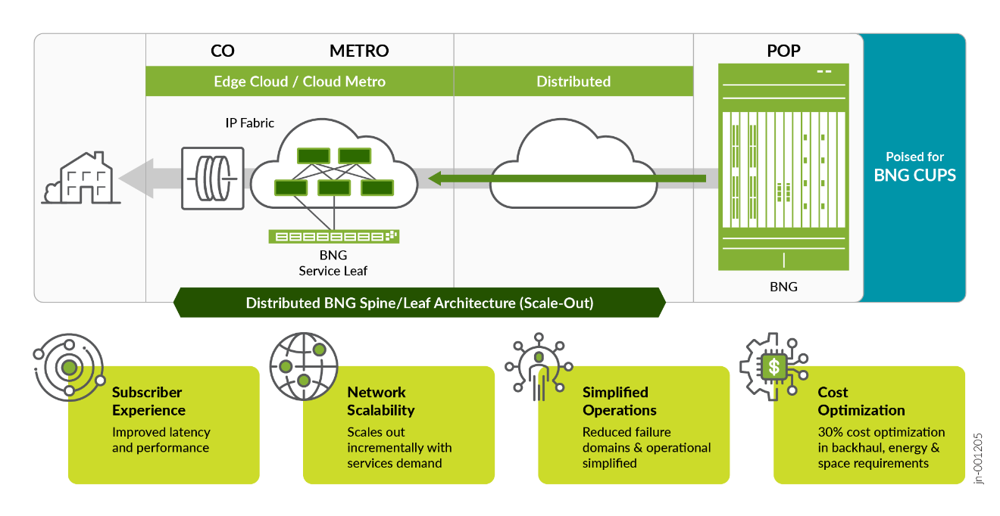

# JVD Solution Overview — Metro Fabric and Broadband Edge

> Faithful markdown conversion of the published Juniper Validated Design
> *JVD Solution Overview: Metro Fabric and Broadband Edge*
> (`sol-overview-JVD-METRO-BBE-01-01`). The PDF on juniper.net is the
> source of truth. See the [design guide](design-guide.md) and
> [test report brief](test-report-brief.md) for full architecture and results.

## Executive Summary

Broadband networks are among the most complex components of service provider
infrastructure. Few suppliers are equipped to deliver robust broadband solutions
capable of supporting millions of subscribers at scale while providing a
future-proof, end-to-end architecture. Juniper Networks stands out as a leader in
this space.

This JVD introduces a **Distributed Broadband Aggregation Solution (DBAS)**, which
leverages a Cloud Metro fabric to bring subscriber traffic to the **Broadband
Network Gateway (BNG)**. This approach simplifies deployment, reduces costs, and
adopts a hyperscale-inspired leaf-and-spine topology. By using **EVPN over Segment
Routing (SR)**, the architecture provides flexibility in the placement of the BNG
function within the metro fabric. Seamless integration of the BNG and metro fabric
is enabled by **Pseudowire Head-End Termination (PWHT)** technology.

## Solution Overview

This solution modularizes access, aggregation, and BNG functions and distributes
them across smaller platforms: **Aggregation Nodes (spines)** and **Access Nodes
(leaves)**. This contrasts with traditional centralized chassis systems by
decentralizing BNG functions and bringing them closer to end users. Compact,
cost-optimized service nodes handle smaller subscriber groups, allowing each BNG
service leaf to focus on a narrower task. This modular approach reduces the cost to
serve, enhances scalability, and supports dynamic expansion based on subscriber
demand.

*Figure 1. Cloud Metro Fabric and Broadband Edge solution — a distributed BNG
spine/leaf (scale-out) architecture spanning CO / Metro and POP.*

### Benefits

- **Increase network scalability** — Access Nodes, Aggregation Nodes, and BBE/BNG
  services scale independently and incrementally.
- **Simplify operations** — The Juniper DBAS reduces operational complexity through
  its simpler spine-leaf topology and reduced blast radius. Your broadband network
  looks and acts like a simplified VXLAN data center fabric.
- **Reduce cost to serve** — Meeting growing demand incrementally with smaller,
  simpler platforms lowers Capital Expenditure (Capex). These platforms take up
  less space and require less power and cooling, lowering Operational Expenses
  (Opex) as well.
- **Seamless integration with Juniper Scale-Out Carrier Grade NAT (CGNAT)** — See
  the companion *JVD Solution Overview: Scale-Out Stateful Firewall and CGNAT for
  SP Edge*.

## What is validated

This JVD shares a solution where distributed BNG leaves work together with a
centrally located BNG function, allowing flexibility and resiliency in BBE
subscriber termination. Validation includes:

- **ACX7100 and ACX7024** for the Cloud Metro fabric (Access and Aggregation Nodes).
- A broad range of **MX Universal Routing Series** hosting the BNG function —
  **MX304, MX204, MX10004, and MX480**.

Based on a Metro Fabric topology with several Access Nodes (ANs) connected to
Aggregation Nodes (AGNs), a redundant scalable topology is used to test subscriber
termination on BNG nodes. Four redundant BNG nodes demonstrate network resilience
during failures. JVD tests include various failover scenarios covering AN node,
AGN node, and BNG node failures. Results confirm an efficient Metro Fabric design
for BBE applications.

## Sources

- Published JVD: [Metro Fabric and Broadband Edge — Juniper Validated Design](https://www.juniper.net/documentation/us/en/software/jvd/jvd-metro-fabric-and-broadband-edge/index.html)
- Solution Overview PDF: <https://www.juniper.net/documentation/us/en/software/jvd/solution-overview-metro-fabric-and-broadband-edge.pdf>
- Companion docs: [design-guide.md](design-guide.md) · [test-report-brief.md](test-report-brief.md) · [datasheet.md](datasheet.md)
- Configurations: [`../configuration/conf`](../configuration/conf) · [`../configuration/set`](../configuration/set) · [`../configuration/snips`](../configuration/snips)
