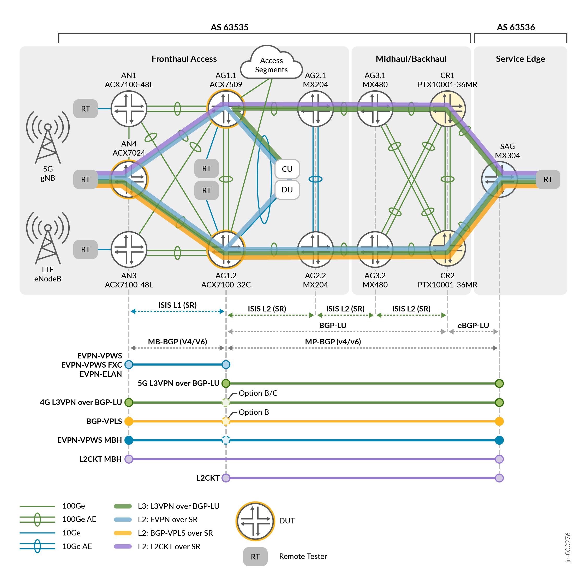
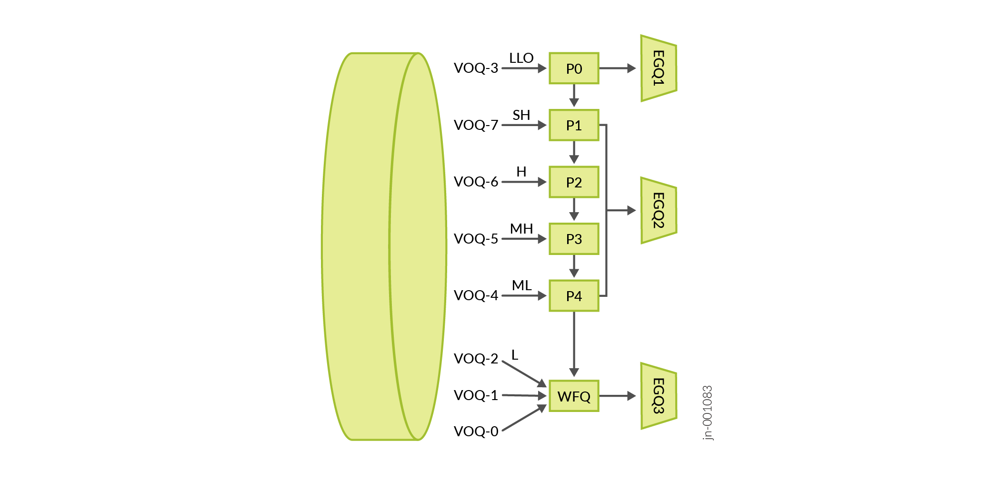

# JVD Design Guide — Low Latency QoS Design for 5G

> Markdown conversion of the published *Low Latency QoS Design for 5G Solution —
> Juniper Validated Design (JVD)* (`jvd-5g-fh-cos-llq-02-04`, published
> 2025-06-05). The PDF on juniper.net is the source of truth; this is a faithful
> text mirror for reference and for grounding the portal's Design & Planner.
> Exhaustive per-scenario latency and conformance matrices from the guide are
> **condensed** here to representative samples plus per-category summaries — see
> the [test report brief](test-report-brief.md) and the full published guide for
> every data point. Full device configurations are linked to
> [`../configuration`](../configuration) rather than duplicated.

## Table of Contents

- [About This Document](#about-this-document)
- [Solution Benefits](#solution-benefits)
- [Use Case and Reference Architecture](#use-case-and-reference-architecture)
- [Validation Framework](#validation-framework)
- [Test Objectives](#test-objectives)
- [Solution Architecture](#solution-architecture)
- [Results Summary and Analysis](#results-summary-and-analysis)
- [Recommendations](#recommendations)
- [Sources](#sources)

---

## About This Document

This document explains a Juniper Validated Design (JVD) for building and deploying
a 5G xHaul solution architecture using the Juniper ACX7000 series, MX series, and
PTX series platforms. This JVD extends solutions provided previously with *5G CSR
Seamless Segment Routing* and *5G Fronthaul Class of Service* for the focused
delivery of differentiated services supporting ultra-low latency workloads.

Comprehensive Quality of Service (QoS) in the 5G network architecture is mandatory
to ensure reliable and efficient performance across diverse applications and
services. QoS mechanisms prioritize traffic, manage bandwidth, and preserve
latency budgets, ensuring critical applications receive the necessary resources
and maintain overall network performance and user experience. After conducting
rigorous testing, Juniper ACX7024, ACX7100, and ACX7509 provide scalable and
flexible platforms for implementing CoS in 5G Fronthaul networks.

This JVD is based on 5G reference architectures. However, you can apply the CoS
modeling, best practices, and performance results to many implementations.

## Solution Benefits

5G radio access networks (RAN) introduce new requirements for the mobile backhaul
(MBH) network infrastructure like number of nodes, performance, and feature
richness. Juniper provides an end-to-end solution for the 5G xHaul network
infrastructure, designed to support 4G MBH and 5G network infrastructure over the
same physical network, allowing operators to smoothly transition from 4G to 5G
without disrupting existing services.

The QoS network architecture enables the following key benefits:

- Tailoring traffic priorities based on application requirements — enhanced mobile
  broadband (eMBB), ultra-reliable low-latency communication (URLLC), and massive
  machine-type communications (mMTC).
- Ensuring operators can design appropriate bandwidth, latency, and reliability
  parameters across different traffic classes.
- Optimizing network resources for efficient bandwidth allocation and traffic
  prioritization based on application requirements.
- Enhancing user experience with consistent, reliable quality across diverse
  applications like streaming, gaming, and remote work.
- Implementing LLQ to reduce transmission delay.
- Providing faster response time for crucial real-time applications by assigning
  preferential treatment over low-priority traffic.
- Using highly reliable networks to minimize the risk of data loss and
  transmission errors.
- Implementing traffic prioritization at multiple levels so urgent services (such
  as emergency communications and public safety) receive immediate attention.

This JVD examines CoS operations and performance requirements needed to ensure the
integrity of critical 5G Fronthaul traffic flows between O-RU to O-DU emulated
devices, as facilitated by ACX7024 (CSR), ACX7100-32C (HSR) and ACX7509 (HSR).
Additional validation includes MX304 as the Services Edge with PTX10001-36MR as
Core for supporting end-to-end MBH traffic flows.

To facilitate the JVD objectives, a comprehensive CoS network model is created
that aligns with the O-RAN multiple Priority Queue structure, establishing three
main components: **Low Latency Queues, Shaped Priority Queues, and Weighted Fair
Queues**. This model is adjustable beyond the featured use cases.

## Use Case and Reference Architecture

5G O-RAN is an open and disaggregated RAN architecture that enables
interoperability, flexibility, and innovation among vendors and operators. The
fronthaul is the most demanding segment of the xHaul architecture, requiring high
performance and functionality to ensure delivery and preservation of ultra-low
latency workloads. The solution is based on the 5G xHaul network and reference
architecture defined by O-RAN Alliance Working Group 9 in the *O-RAN Xhaul Packet
Switched Architectures and Solutions* technical specification
[O-RAN.WG9.XPSAAS-R003-v08.00].

The xHaul consists of the **Fronthaul (FH), Midhaul (MH), and Backhaul (BH)**
segments that connect to the O-RAN radio units (O-RUs), distributed units (O-DUs),
and centralized units (O-CUs), respectively. The fronthaul network segment enables
Layer 2 connectivity between O-RU and O-DU for control, data (eCPRI), and
management traffic flows, and provides time and frequency synchronization between
RAN elements.

> **NOTE:** This JVD does not cover all possible scenarios. However, it closely
> aligns with O-RAN split 7.2x, where the O-RU connects to the CSR and the O-DU is
> co-located with O-CU within the HSR infrastructure.

5G infrastructure must support stringent latency budgets between O-RU and O-DU. To
achieve this, the number of Transport Network Elements (TNEs) in the fronthaul
segment is kept to a minimum (one or two hops), making spine-and-leaf topologies
ideal. O-RAN WG9 (O-RAN.WG9.XTRP-REQ-v01.00) provides guidelines for a maximum
one-way latency budget of **100µs for the fronthaul**, including latency incurred
by fiber (~4.9µs/km) and transit nodes. The JVD objective is O-RU to O-DU latency
of approximately **≤10µs per node**; the ACX7000 series typically supports ≤6µs
for low latency workloads, including under congestion.

### 3GPP Scheduling Model

The referenced CoS scheduling model supports service types defined by 3GPP:

| Service Type | Characteristics |
|---|---|
| eMBB | Handling of 5G enhanced Mobile Broadband |
| URLLC | Handling of ultra-reliable low latency communications |
| V2X | Handling of V2X services |
| MIoT / mMTC | Handling of massive IoT and/or massive machine type communication |

The flow-based 5G QoS model provides more granular control than the bearer-based
4G LTE QCI model. When transitioning from the 4G LTE QCI model to the 5G QoS
Identifier (5QI) model, 5G introduces new categories for flows requiring very low
delay and high bandwidth — crucial for user-plane and control-plane traffic
streams between O-RU and O-DU, both transported using the **eCPRI** protocol over
the Open Fronthaul (OFH) interface. Resources are classified as delay-critical
GBR, GBR, or non-GBR (see ETSI TS-23.501). O-RAN groups common QCI and 5QI QoS
flow characteristics into four exemplary groups based on delay budget.

### Time Sensitive Networking (TSN) Fronthaul Profiles

The IEEE 802.1CM standard formalizes Time-Sensitive Networking (TSN) for
fronthaul, applying to both CPRI and eCPRI traffic flows. The JVD goals align with
**TSN Profile A** (802.1CM §8.1), a strict-priority model where the user plane is
assigned a high-priority class while control and management plane data are assigned
a low-priority class. Fronthaul traffic is always prioritized over non-fronthaul
traffic, with a maximum frame size recommendation of 2000 octets.

802.1CM additionally defines TSN Profile B with express frame preemption
(802.1Qbu), but the benefit is minimal for port speeds >1Gbps. The following table
outlines queuing-delay differences by port speed:

| Port Speed | Profile A (2,020 bytes) | Profile B (155 bytes) | Difference (µs) | Difference (Fiber) |
|---|---|---|---|---|
| 1 Gbps | 16.160 µs | 1.240 µs | 14.920 µs | 3,045 m |
| 10 Gbps | 1.616 µs | 0.124 µs | 1.492 µs | 304 m |
| 25 Gbps | 0.646 µs | 0.050 µs | 0.596 µs | 122 m |
| 50 Gbps | 0.323 µs | 0.025 µs | 0.298 µs | 61 m |
| 100 Gbps | 0.162 µs | 0.012 µs | 0.149 µs | 30 m |
| 200 Gbps | 0.081 µs | 0.006 µs | 0.075 µs | 15 m |
| 400 Gbps | 0.040 µs | 0.003 µs | 0.037 µs | 8 m |

From 10Gbps onward, the benefits of frame preemption in Profile B diminish to
nominal return. **Recommended Profile A** is leveraged in the JVD with multiple
priority queues, each having preemptive capability between queues. LLQ supports
dequeuing prioritization over lower priority frames.

### O-RAN Priority Queuing Models

O-RAN/3GPP proposes two common QoS profiles supporting a minimum of 6 queues:

- **Single Priority Queue (PQ) model** — one PQ handles ultra-low-latency flows
  (PTP, eCPRI), serviced ahead of all other queues; lower priority queues are WFQ.
  Used by the previous 5G CSR Seamless SR and 5G Fronthaul CoS JVDs.
- **Multiple Priority Queue model** — a hierarchy of multiple priority queues with
  the ability to dequeue in priority order; PQs must be rate-limited to prevent
  starving lower-priority queues. **Validating this model is the major focus of
  this LLQ JVD.**

As per Junos OS Evolved Release 23.3R1, the ACX7000 family supports six priorities:
low-latency, strict-high, high, medium-high, medium-low, and low. Each priority
queue can preempt lower priority queues.

### Recommended Latency Budgets

O-RAN mandates a maximum of **100µs fronthaul one-way latency**, typically
equating to ≤10µs per device (excluding fiber distances); operators commonly seek
~6µs per-device transit. The end-to-end xHaul RU to EPC is expected to be ≤10 ms.
When leveraging a multiple-PQ model, the highest priority is given to **eCPRI**
(G.8275.1 PTP aware traffic, carrying less precise delay requirements, can be
placed in a low-priority queue).

Representative per-hop latency / PDV budgets [O-RAN.WG9.XPSAAS-v08.00]:

| Traffic Type | Per-Hop Latency | Per-Hop PDV |
|---|---|---|
| CPRI (RoE), eCPRI CU-plane (~1500 bytes) | ~1–20 µs | ~1–20 µs |
| 5QI/QCI Group 1 (low latency U-plane), low latency business | ~1 ms | ~1 ms |
| Network control (OAM relaxed timers, IGP, BGP, LDP, RSVP, PTP aware) | ~5 ms | ~1–3 ms |
| 5QI/QCI Group 2 (medium latency U-plane) | ~5 ms | ~1–3 ms |
| 5QI/QCI Group 3 (remaining GBR U-plane), guaranteed business | ~10 ms | ~5 ms |
| 5QI/QCI Group 4 (remaining non-GBR U-plane) | ~10–50 ms | ~5–25 ms |

*(PTP unaware mode is not covered and is no longer recommended.)*

### Regulatory Interests

ETSI 3GPP · O-RAN Alliance · Metro Ethernet Forum (MEF) · IEEE P802.1CM · eCPRI
Specification.

## Validation Framework

Two xHaul deployment scenarios are considered: a **standalone 5G Fronthaul**
network, and a **joint deployment** of traditional L3VPN 4G MBH and 5G xHaul
running on the same physical infrastructure. The same 5G CSR allows simultaneous
connectivity to 5G gNB and 4G eNB cell towers, providing L2 fronthaul and L3 MBH
services. The topology uses **Seamless MPLS with BGP-LU** at border nodes and
**IS-IS SR** underlay across multiple domains. Service overlay includes EVPN,
L3VPN, VPLS, L2VPN, and L2Circuit.

### Test Bed

The fronthaul segment leverages a spine-and-leaf topology connecting access nodes
(CSR function) to pre-aggregation nodes (HSR function). The access segment uses
100GbE (supporting up to 400GbE). Device roles:

| Role | Devices |
|---|---|
| Access Node / CSR | ACX7024 (AN4), ACX7100-48L (AN1, AN3) |
| Aggregation / HSR | ACX7509 (AG1.1), ACX7100-32C (AG1.2) |
| Aggregation helper | MX204 (AG2.1/AG2.2) |
| Aggregation helper | MX480 (AG3.1/AG3.2) |
| Core | PTX10001-36MR (CR1, CR2) |
| Services Aggregation Gateway (SAG) | MX304 |

### Platforms and Devices Under Test (DUT)

The primary DUTs are **ACX7024 (CSR), ACX7100-32C (HSR), and ACX7509 (HSR)**. For
the exact validated software versions and platforms, see the
[test report brief](test-report-brief.md) and the [datasheet](datasheet.md).

## Test Objectives

The main test objective is to ensure the advanced CoS features of the ACX7000
series meet the requirements for reliable, high-quality performance in 5G
Fronthaul. The secondary objective is to confirm CoS behaviors are consistent
throughout the mobile backhaul topology and across different devices.

### Test Goals

CoS operational goals by functional category:

- **Classification** — Behavior Aggregate (BA) on received/pre-marked 802.1p,
  DSCP, or EXP; Fixed classification mapping all interface traffic to one
  forwarding class; Multifield (MF) classifier matching eCPRI, PTPoE, and OAM
  traffic; host-outbound exception traffic assigned to a specified FC/queue.
- **Queuing and Scheduling** — eight forwarding classes and eight queues; LLQ
  gives delay-sensitive data preferential treatment; multi-level priority queues;
  scheduler percentages honored based on custom shaping rates; unused bandwidth
  made available to other queues proportional to configured transmit-rate.
  - ACX7000: six priority levels (low-latency, strict-high, high, medium-high,
    medium-low, low), each higher priority preempting lower; **as of Junos OS
    Evolved 24.3R1, ACX supports eight priority levels for port QoS**. LLQ is
    serviced ahead of and preempts all other queues, and is given a dedicated
    VOQ→EGQ path to ensure latency preservation. FADT shared buffer allocation is
    updated on demand.
  - MX Trio-based: five priority levels; guaranteed and excess regions; guaranteed
    queues serviced as PQ-DWRR; only strict-high operates without an excess region.
- **Rewrite** — traffic mapped to the correct queue; ingress 802.1p/DSCP rewritten
  to EXP at egress (and EXP → 802.1p/DSCP); rewrite affects the outermost tag for
  dual-tagged frames, preserving the inner tag.
- **Shaping and Rate Limiting** — port-level shaper honors scheduler transmit
  rates; PQs allow rate-limiting to prevent starving low-priority queues.
- **Latency Budget** — LLQ has the highest priority; O-RU-to-O-DU averages ≤10µs
  per device; eCPRI Type 5 one-way delay ≈ ≤10µs per device; latency budget
  preserved in congestion and non-congestion conditions.

### Test Flow Characteristics

- **Accepted frame types:** untagged (port-based), tagged (802.1Q), double-tagged
  (802.1ad).
- **Accepted ether types:** 0x8100 (802.1Q C-TAG), 0x88a8 (802.1ad S-TAG on Q-in-Q).

### Test Non-Goals

Custom drop profiles (WRED); temporal transmit rate/buffer; hierarchical CoS and
H-Policing; 802.1CM TSN Profile B with frame pre-emption (802.1Qbu); VLAN
manipulation (covered in previous CoS JVD); failover/convergence (covered in
previous 5G JVDs); end-to-end timing/sync (SyncE, 1588v2); G.8275.1 PTP-aware
boundary clock; SLA monitoring (RFC 2544, Y.1564, TWAMP); telemetry/management/
automation; network or link slicing; Flex-Algo, transport classes, BGP classful
transport (covered in previous 5G JVDs).

### Failure Scenarios

Link congestion; queue congestion without traffic discarding; queue congestion
with traffic discarding; single and multiple queue congestion; injected failure
events (including eCPRI type); process restart.

## Solution Architecture

The solution architecture deploys a spine-leaf access fronthaul topology combined
with midhaul/backhaul ring topologies (aggregation and core roles) plus the
services gateway. Key attributes:

- 5G xHaul MBH reference architecture
- Seamless MPLS across xHaul IGP domains (Inter-AS and Inter-Domain BGP-LU)
- Segment Routing L-IS-IS
- Fast failover/detection: TI-LFA, BFD, Microloop Avoidance, OAM
- Redundant route reflectors; community-based route optimizations
- Inter-AS Option B/C
- EVPN-VPWS and Flexible Cross Connect (FXC) with A/A Multihoming
- EVPN-ELAN with A/A Multihoming and EVPN Virtual Gateway Address (VGA) IRB
- BGP-VPLS single-homed; L2Circuit MBH; L3VPN


*Figure 14. End-to-end service architecture for the joint 4G/5G solution. AN nodes
sit in an IS-IS Level 1 domain with adjacencies to L1/L2 HSR (AG1) nodes; the Level
2 domain extends from aggregation (AG2, AG3) to core (CR). Seamless MPLS is achieved
via BGP-LU at border nodes; TI-LFA loose-mode node redundancy per domain. Route
reflectors at CR1/CR2 (with AG1.1/AG1.2 as RRs for the access fronthaul). Service
overlay: EVPN-VPWS/FXC/ELAN, 4G/5G L3VPN over BGP-LU, BGP-VPLS, EVPN-VPWS MBH, and
L2Circuit over SR (Inter-AS Option B/C).*

The network underlay comprises interdomain Seamless MPLS SR with BGP Labeled
Unicast (BGP-LU). Services overlay incorporates modern and legacy VPNs — EVPN,
L3VPN, BGP-VPLS, and L2Circuit — with enhancements for Flow Aware Transport
Pseudowire Label (FAT-PW) and Ethernet OAM where applicable.

### Service Profiles

**EVPN-VPWS is the primary delivery mechanism for critical 5G fronthaul flows**,
with L3VPN servicing C/U and M plane communications across fronthaul, midhaul, and
backhaul segments. Representative xHaul use cases:

| Use Case | Service Overlay Mapping | Endpoints |
|---|---|---|
| 5G Fronthaul | EVPN-VPWS single-homing with E-OAM PM and FAT-PW | AN4 – AG1.1/AG1.2 |
| 5G Fronthaul | EVPN-VPWS with A/A Multihoming | AN4 – AG1.1/AG1.2 |
| 5G Fronthaul | EVPN-ELAN with A/A Multihoming | AN4 – AG1.1/AG1.2 |
| 5G Fronthaul | EVPN-VPWS FXC single-homing with E-OAM PM | AN4 – AG1.1/AG1.2 |
| 5G Fronthaul | EVPN-VPWS FXC with A/A Multihoming | AN4 – AG1.1/AG1.2 |
| 5G Fronthaul | L3VPN for M-Plane | AN4 – AG1.1/AG1.2 |
| 5G Midhaul | EVPN IRB anycast gateway with L3VPN Multihoming DU/HSR to SAG | AG1.1/AG1.2 – SAG |
| 5G Midhaul | Bridge Domain IRB anycast static MAC/IP with L3VPN Multihoming | AG1.1/AG1.2 – SAG |
| L2 MBH | End-to-End L2Circuit CSR to SAG with FAT-PW | AN4 – SAG |
| L2 MBH | End-to-End single-homing EVPN-VPWS CSR to SAG with E-OAM and FAT-PW | AN4 – SAG |
| L2 MBH | End-to-End single-homing BGP-VPLS CSR to SAG with E-OAM and FAT-PW | AN4 – SAG |
| L3 MBH | End-to-End L3VPN CSR to SAG | AN4 – SAG |

### Traffic Types and Forwarding Classes

The JVD uses an eight-queue model most closely aligned with the O-RAN Multiple
Priority Queue structure:

| Queue | Forwarding Class | Priority | Queue Characteristics / Traffic Examples |
|---|---|---|---|
| 7 | FC-SIGNALING | strict-high (PIR shaped) | OAM aggressive timers, O-RAN/3GPP C-plane |
| 6 | FC-LLQ | low-latency (PIR shaped) | CPRI RoE, eCPRI C/U-Plane ≤2000 bytes |
| 5 | FC-REALTIME | medium-high (PIR shaped) | 5QI Group 1 low-latency U-plane, low-latency business, interactive video/voice |
| 4 | FC-HIGH | low (WFQ guaranteed) | 5QI Group 2 medium-latency U-plane data |
| 3 | FC-CONTROL | high (PIR shaped) | Network control: OAM relaxed timers, IGP, BGP, PTP aware mode |
| 2 | FC-MEDIUM | low (WFQ guaranteed) | 5QI Group 3 remainder GBR U-plane, video-on-demand, O-RAN/3GPP M-plane |
| 1 | FC-LOW | low (WFQ guaranteed) | high latency, guaranteed low-priority data |
| 0 | FC-BEST-EFFORT | low (WFQ remainder) | 5QI Group 4 remainder non-GBR U-plane |

The CoS hierarchy divides into three components — **Low Latency Queues, Shaped
Priority Queues, and Weighted Fair Queues**:


*Figure 25. Differentiated CoS queuing model. Critical fronthaul flows map to the
LLQ or shaped PQs; non-fronthaul (MBH) flows map to the four low-priority WFQs. The
high/medium/low WFQs are given a guaranteed CIR with a dynamic PIR when bandwidth
is available; best-effort (remainder) has no guarantee.*

The forwarding-class configuration is identical across ACX, MX, and PTX:

```junos
set class-of-service forwarding-classes class FC-SIGNALING queue-num 7
set class-of-service forwarding-classes class FC-LLQ queue-num 6
set class-of-service forwarding-classes class FC-REALTIME queue-num 5
set class-of-service forwarding-classes class FC-HIGH queue-num 4
set class-of-service forwarding-classes class FC-CONTROL queue-num 3
set class-of-service forwarding-classes class FC-MEDIUM queue-num 2
set class-of-service forwarding-classes class FC-LOW queue-num 1
set class-of-service forwarding-classes class FC-BEST-EFFORT queue-num 0
```

### Service Classification

The VPN services required for essential 5G xHaul communications include EVPN-VPWS
(fronthaul C/U plane), L3VPN (fronthaul management plane and midhaul/backhaul
control/data plane). Classification style per service/segment:

| VPN Service | Segment | Classification | Forwarding Classes |
|---|---|---|---|
| EVPN-VPWS | Fronthaul | Fixed | FC-LLQ |
| EVPN-VPWS | Fronthaul | Multifield | FC-LLQ, FC-SIGNALING, FC-CONTROL, FC-REALTIME, FC-HIGH, FC-BEST-EFFORT |
| EVPN-FXC | Fronthaul | BA | FC-SIGNALING, FC-CONTROL, FC-REALTIME, FC-HIGH, FC-MEDIUM, FC-LOW, FC-BEST-EFFORT |
| EVPN-ELAN | Fronthaul | BA | FC-SIGNALING, FC-CONTROL, FC-REALTIME, FC-HIGH, FC-MEDIUM, FC-LOW, FC-BEST-EFFORT |
| L3VPN | Fronthaul | BA | FC-SIGNALING, FC-CONTROL, FC-REALTIME, FC-HIGH, FC-MEDIUM, FC-LOW, FC-BEST-EFFORT |
| L3VPN | Midhaul | Fixed | FC-REALTIME |
| L3VPN | Midhaul | BA / Multifield | Full set / FC-REALTIME, FC-HIGH, FC-MEDIUM, FC-LOW |
| L2Circuit | MBH | Fixed | FC-HIGH, FC-MEDIUM, FC-LOW |
| EVPN-VPWS | MBH | BA | FC-SIGNALING, FC-CONTROL, FC-REALTIME, FC-HIGH, FC-MEDIUM, FC-LOW, FC-BEST-EFFORT |
| BGP-VPLS | MBH | BA | FC-HIGH, FC-MEDIUM, FC-LOW |
| L3VPN | MBH | BA | Full set |

### Test Topologies for Latency Measurement

- **Topology 1 (a/b/c)** — individual DUT performance in a CSR or HSR role
  (ACX7024, ACX7100-32C, ACX7509 standalone); most accurate per-device data.
- **Topology 2** — point-to-point EVPN-VPWS between CSR and HSR (ACX7024 as CSR;
  ACX7100-32C or ACX7509 as HSR); test equipment emulates O-RU and O-DU.
- **Topology 3** — EVPN-VPWS active-active multihoming, single CSR DUT to a pair
  of HSRs via All-Active ESI LAG toward a physical DU (QFX5120), 3-hop scenario.

Critical flows emulate fronthaul patterns with burst and steady streams across
packet sizes 64B–2000B (max frame 2020 bytes incl. preamble/SFD/IFG). Background
iMIX (64B–2000B) is generated from SAG toward O-DU/O-RU to create congestion.

### O-RAN and eCPRI Emulation

Test scenarios include eCPRI O-RAN emulation (standard IQ sample file), O-RAN
conformance analysis, crafted eCPRI payloads, eCPRI services validation, and eCPRI
message types: Remote Memory Access (Type 4), Delay Measurement (Type 5, estimates
one-way delay between eCPRI ports), Remote Reset (Type 6), and Event Indication
(Type 7).

### Low Latency Queuing

Junos OS Evolved Release 23.3R1 introduces LLQ for ACX7000 platforms, enabling
delay-sensitive data to be dequeued first. The Virtual Output Queue (VOQ) and
Egress Queue (EGQ) priority hierarchy is:

> **Latency Queues > Priority Queues > Low Queues**

```junos
set class-of-service schedulers <name> priority low-latency
```

When queues other than LLQ are congested, LLQ is expected to support 10µs average
latency, and ≤6µs without congestion. **No more than two LLQs per system** are
recommended to preserve latency integrity (a PFE syslog warning is raised beyond
two). The ACX7000 VOQ architecture avoids Head-of-Line Blocking (HOLB) using
feedback between the ingress traffic manager (ITM) and egress traffic manager
(ETM). In Port QoS mode, three dedicated EGQs are enabled: **EGQ1** for LLQ,
**EGQ2** for priority queues, **EGQ3** for low queues.


*Figure 24. Multi-level priority hierarchy with LLQ in Port QoS mode. VOQs map to
priority levels P0–P4/WFQ, which map to EGQ1 (low-latency), EGQ2 (priority), and
EGQ3 (low/WFQ).*

### Multi-Level Priority

Junos OS Evolved 23.3R1 introduces multi-level priorities for the ACX7000 series
(six priorities: low-latency, strict-high, high, medium-high, medium-low, low). All
queues preempt lower priority; equal-priority queues perform round-robin; low
priority is WFQ. Priority levels: P0 Low-Latency, P1 Strict-High, P2 High, P3
Medium-High, P4 Medium-Low, WFQ Low. With strict queue preemption, shape the
priority queues to prevent starving lower-priority queues.

> **NOTE:** Only port-based QoS is covered in this validation. From Junos OS
> Evolved Release 24.3R1, ACX7000 supports eight priority levels, adding low-high
> (P5) and low-medium (P6) for port QoS.

The functional behavior differs from TRIO-based MX architectures, which use
guaranteed and excess regions (PQ-DWRR in the guaranteed region); only the
strict-high queue operates without an excess region and can starve low-priority
queues.

### Classification

Three classification styles are validated, performed at ingress:

- **Behavior Aggregate (BA)** — matches received L2 802.1p and/or L3 DSCP (DSCP
  takes priority when both are received); packet-based on pre-marked codepoints.
- **Fixed (discrete)** — maps all traffic on an interface to one forwarding class.
- **Multifield (MF)** — matches packet fields, mapping to one or more FCs. When BA
  and MF are performed simultaneously, MF overrides BA (assuming a match).

Transit nodes classify at ingress on outer-label MPLS EXP; core interfaces use BA;
BA/Fixed/MF are used at service (CE-facing) interfaces. Priority mapping:

| Queue | Forwarding Class | 802.1p | DSCP | EXP |
|---|---|---|---|---|
| 7 | FC-SIGNALING | 110 | CS5, CS6 | 110 |
| 6 | FC-LLQ | 100 | CS4, AF41, AF42, AF43 | 100 |
| 5 | FC-REALTIME | 101 | EF | 101 |
| 4 | FC-HIGH | 011 | CS3, AF31, AF32, AF33 | 011 |
| 3 | FC-CONTROL | 111 | CS7 | 111 |
| 2 | FC-MEDIUM | 010 | CS2, AF21, AF22, AF23 | 010 |
| 1 | FC-LOW | 001 | CS1, AF11, AF12, AF13 | 001 |
| 0 | FC-BEST-EFFORT | 000 | BE | 000 |

Representative EXP (MPLS) BA classifier:

```junos
set class-of-service classifiers exp CL-MPLS import default
set class-of-service classifiers exp CL-MPLS forwarding-class FC-SIGNALING loss-priority low code-points 110
set class-of-service classifiers exp CL-MPLS forwarding-class FC-LLQ loss-priority low code-points 100
set class-of-service classifiers exp CL-MPLS forwarding-class FC-REALTIME loss-priority low code-points 101
set class-of-service classifiers exp CL-MPLS forwarding-class FC-HIGH loss-priority low code-points 011
set class-of-service classifiers exp CL-MPLS forwarding-class FC-CONTROL loss-priority low code-points 111
set class-of-service classifiers exp CL-MPLS forwarding-class FC-MEDIUM loss-priority low code-points 010
set class-of-service classifiers exp CL-MPLS forwarding-class FC-LOW loss-priority low code-points 001
set class-of-service classifiers exp CL-MPLS forwarding-class FC-BEST-EFFORT loss-priority low code-points 000
```

Representative multifield classifier (eCPRI / PTPoE / CFM by ether-type):

```junos
set firewall family ethernet-switching filter FF-5G-LLQ-CLASS term eCPRI from ether-type 0xAEFE
set firewall family ethernet-switching filter FF-5G-LLQ-CLASS term eCPRI then forwarding-class FC-LLQ
set firewall family ethernet-switching filter FF-5G-LLQ-CLASS term eCPRI then count eCPRI-in
set firewall family ethernet-switching filter FF-5G-LLQ-CLASS term PTPoE from destination-mac-address 01:1b:19:00:00:00/48
set firewall family ethernet-switching filter FF-5G-LLQ-CLASS term PTPoE from ether-type 0x88F7
set firewall family ethernet-switching filter FF-5G-LLQ-CLASS term PTPoE then forwarding-class FC-CONTROL
set firewall family ethernet-switching filter FF-5G-LLQ-CLASS term CFM from ether-type 0x8902
set firewall family ethernet-switching filter FF-5G-LLQ-CLASS term CFM then forwarding-class FC-SIGNALING
set firewall family ethernet-switching filter FF-5G-LLQ-CLASS term REALTIME from learn-vlan-1p-priority 5
set firewall family ethernet-switching filter FF-5G-LLQ-CLASS term REALTIME then forwarding-class FC-REALTIME
```

The full 802.1p, DSCP IPv4, and DSCP IPv6 classifiers follow the same priority
mapping; see [`../configuration/conf`](../configuration/conf) and
[`../configuration/snips/*/cos`](../configuration/snips) for the complete rendered
configs across every device.

### Scheduling

ACX7000 scheduling begins in the ingress pipeline and is realized as an egress
function via an ITM→ETM credit-request feedback loop. The eight queues are
associated with the VOQ architecture and map into two or three EGQs. ACX7000
supports six traffic priorities (eight as of Junos OS Evolved 24.3R1); MX-series
supports five.

**Shaping-rate interaction (ACX7000):** a queue's configured shaping-rate is
deducted from the port speed, so low-priority transmit-rate percentages are based
on the remaining port speed. Example on a 100GbE port:

| Port Speed | High PQ shaping | Med-High PQ shaping | Updated Port Speed | Low-priority TR | Low-priority BW |
|---|---|---|---|---|---|
| 100GbE | – | – | 100 | 20% | 20 Gbps |
| 100GbE | 30% | – | 70 | 20% | 14 Gbps |
| 100GbE | 30% | 20% | 50 | 20% | 10 Gbps |
| 100GbE | 50% | 50% | 0 | 20% | 0 |

The validated model configures four priority queues with shaping rate (Signaling,
LLQ, Realtime, Control) carrying the most critical traffic; under full congestion
these PQs consume a guaranteed 80% of bandwidth. The remaining 20% is delegated
across four WFQs (High 40%, Medium 30%, Low 20%, Best-Effort remainder — of the
low-priority allocation), all able to borrow unused bandwidth. Validated scheduler
config:

```junos
set class-of-service schedulers SC-SIGNALING shaping-rate percent 5
set class-of-service schedulers SC-SIGNALING buffer-size percent 5
set class-of-service schedulers SC-SIGNALING priority strict-high
set class-of-service schedulers SC-LLQ shaping-rate percent 40
set class-of-service schedulers SC-LLQ buffer-size percent 10
set class-of-service schedulers SC-LLQ priority low-latency
set class-of-service schedulers SC-REALTIME shaping-rate percent 30
set class-of-service schedulers SC-REALTIME buffer-size percent 20
set class-of-service schedulers SC-REALTIME priority medium-high
set class-of-service schedulers SC-HIGH transmit-rate percent 40
set class-of-service schedulers SC-HIGH buffer-size percent 30
set class-of-service schedulers SC-HIGH priority low
set class-of-service schedulers SC-CONTROL shaping-rate percent 5
set class-of-service schedulers SC-CONTROL buffer-size percent 5
set class-of-service schedulers SC-CONTROL priority high
set class-of-service schedulers SC-MEDIUM transmit-rate percent 30
set class-of-service schedulers SC-MEDIUM buffer-size percent 20
set class-of-service schedulers SC-MEDIUM priority low
set class-of-service schedulers SC-LOW transmit-rate percent 20
set class-of-service schedulers SC-LOW buffer-size percent 10
set class-of-service schedulers SC-LOW priority low
set class-of-service schedulers SC-BEST-EFFORT transmit-rate remainder
set class-of-service schedulers SC-BEST-EFFORT buffer-size remainder
set class-of-service schedulers SC-BEST-EFFORT priority low
```

```junos
set class-of-service scheduler-maps SM-5G-SCHEDULER forwarding-class FC-SIGNALING scheduler SC-SIGNALING
set class-of-service scheduler-maps SM-5G-SCHEDULER forwarding-class FC-LLQ scheduler SC-LLQ
set class-of-service scheduler-maps SM-5G-SCHEDULER forwarding-class FC-REALTIME scheduler SC-REALTIME
set class-of-service scheduler-maps SM-5G-SCHEDULER forwarding-class FC-HIGH scheduler SC-HIGH
set class-of-service scheduler-maps SM-5G-SCHEDULER forwarding-class FC-CONTROL scheduler SC-CONTROL
set class-of-service scheduler-maps SM-5G-SCHEDULER forwarding-class FC-MEDIUM scheduler SC-MEDIUM
set class-of-service scheduler-maps SM-5G-SCHEDULER forwarding-class FC-LOW scheduler SC-LOW
set class-of-service scheduler-maps SM-5G-SCHEDULER forwarding-class FC-BEST-EFFORT scheduler SC-BEST-EFFORT
```

### Port Shaping

Port shaping is applied to the interface and adjusts scheduler percentages based on
the new port speed (e.g., a 10G shaper on a 100GbE port makes a 50% transmit rate
equal 5Gbps):

```junos
set class-of-service interfaces <ifd> shaping-rate <bps>
```

### Rewrite Rules

Rewrite is performed on the egress path based on protocol match, applicable to
ACX, PTX, and MX. For dual-tagged frames, rewrite operates on the outer (S-TAG),
leaving the inner C-TAG 802.1p bits transparent. Representative EXP rewrite:

```junos
set class-of-service rewrite-rules exp RR-MPLS forwarding-class FC-SIGNALING loss-priority low code-point 110
set class-of-service rewrite-rules exp RR-MPLS forwarding-class FC-LLQ loss-priority low code-point 100
set class-of-service rewrite-rules exp RR-MPLS forwarding-class FC-REALTIME loss-priority low code-point 101
set class-of-service rewrite-rules exp RR-MPLS forwarding-class FC-HIGH loss-priority low code-point 011
set class-of-service rewrite-rules exp RR-MPLS forwarding-class FC-CONTROL loss-priority low code-point 111
set class-of-service rewrite-rules exp RR-MPLS forwarding-class FC-MEDIUM loss-priority low code-point 010
set class-of-service rewrite-rules exp RR-MPLS forwarding-class FC-LOW loss-priority low code-point 001
set class-of-service rewrite-rules exp RR-MPLS forwarding-class FC-BEST-EFFORT loss-priority low code-point 000
```

The full 802.1p, DSCP IPv4, and DSCP IPv6 rewrite rules follow the same mapping;
see [`../configuration`](../configuration) for the complete configs.

### Interface Class of Service

CoS parameters are applied to the interface under the CoS hierarchy. Only BA and
Fixed styles apply here (MF is applied under firewall). From Junos OS Evolved
23.2R1, multiple classifiers and rewrite rules are allowed on the same ACX7000
interface.

```junos
set class-of-service interfaces <ifd> scheduler-map SM-5G-SCHEDULER
set class-of-service interfaces <ifd> unit <ifl> classifiers exp CL-MPLS
set class-of-service interfaces <ifd> unit <ifl> classifiers dscp CL-DSCP
set class-of-service interfaces <ifd> unit <ifl> classifiers ieee-802.1 CL-8021P
set class-of-service interfaces <ifd> forwarding-class <fc name>
set class-of-service interfaces <ifd> unit <ifl> rewrite-rules exp RR-MPLS
set class-of-service interfaces <ifd> unit <ifl> rewrite-rules dscp RR-DSCP
set class-of-service interfaces <ifd> unit <ifl> rewrite-rules ieee-802.1 RR-8021P
```

### Host Outbound Traffic

ACX7000 supports host-outbound classification from Junos OS Evolved 23.3R1:

```junos
set class-of-service host-outbound-traffic forwarding-class <FC-NAME>
```

### Buffer Management and Allocation

ACX7000 uses VOQ ingress buffer machinery with guaranteed and dynamic (elastic)
buffers, managed by Fair Adaptive Dynamic Threshold (FADT). Minimum buffer by port
speed: 10G = 2048, 25G/40G/50G = 4096, 100G = 8192. Validated buffer allocation
(example 100GbE port, 1250KB dedicated buffer):

| Queue | Rate | Buffer Size | Priority | Buffer |
|---|---|---|---|---|
| Q7 (FC-SIGNALING) | 5% shaped | 5% | strict-high | 62,500 |
| Q6 (FC-LLQ) | 40% shaped | 10% | low-latency | 125,000 |
| Q5 (FC-REALTIME) | 30% shaped | 20% | medium-high | 250,000 |
| Q4 (FC-HIGH) | 40% transmit | 30% | low | 375,000 |
| Q3 (FC-CONTROL) | 5% shaped | 5% | high | 62,500 |
| Q2 (FC-MEDIUM) | 30% transmit | 20% | low | 250,000 |
| Q1 (FC-LOW) | 20% transmit | 10% | low | 125,000 |
| Q0 (FC-BEST-EFFORT) | remainder | remainder | low | 8,192 (min) |

Buffer usage is monitored with `show interface voq` (CLI) and
`show cos voq buffer-occupancy ifd` (VTY).

## Results Summary and Analysis

During validation, a robust 5G xHaul transport solution is demonstrated using
Seamless MPLS with Segment Routing and EVPN-VPWS, EVPN-FXC, EVPN-ELAN, VPLS,
L2Circuit, and L3VPN services. **ACX7024 (CSR), ACX7100-32C (HSR), and ACX7509
(HSR) each successfully passed all 581 test cases** curated to support the
reference architecture.

### Class of Service Operations

All three ingress classification styles (Fixed, BA, MF) were validated. All CoS
functional test-case scenarios passed: traffic was correctly mapped to forwarding
classes (Queue Match), scheduler rates were honored, codepoints were rewritten
(802.1p/DSCP/EXP), and inner/outer tag bits were preserved end-to-end. Services
covered include EVPN-VPWS, EVPN-FXC, L2Circuit, VPLS, EVPN-ELAN, EVPN IRB VGA
active-active ESI to L3VPN, and Layer 2 Bridge Domain with Anycast IRB to L3VPN.
eCPRI (EtherType 0xAEFE), PTP (0x88F7), and OAM traffic were matched via MF
classifiers. *(The guide's full per-service PASS matrix is condensed here; see the
[test report brief](test-report-brief.md) for the complete tables and packet
captures.)*

### Congestion Scenarios

Key observations under congestion (traffic exceeding configured transmit/shaped
rate or port speed):

- FC-LLQ is serviced ahead of all other queues and preserves the latency budget;
  it does not exceed its shaping-rate allowance.
- Strict-high (FC-SIGNALING), high (FC-CONTROL), and medium-high (FC-REALTIME) are
  each serviced ahead of lower queues and honor their shaping allowances.
- Low-priority queues (FC-HIGH, FC-MEDIUM, FC-LOW) are serviced per configured
  transmit-rate percentages of the remaining port speed (WFQ when in excess and
  bandwidth is available); FC-BEST-EFFORT is serviced only from unused bandwidth.
- In-profile queues are guaranteed without packet drops during high congestion.
- Priority hierarchies are honored across and within VPN services sharing common
  links; traffic transmitted up to 99% port speed under normal conditions.

### Latency Budget Validation

The ACX7000 platforms selected for CSR and HSR roles consistently achieve an
average transit latency of **≤4–6µs**, and preserve the objective budget for
priority flows even under congestion — well below the ≤10µs per-node goal.

**Representative — ACX7024 (CSR), LLQ with continuous 99%-line-rate background
traffic (10G port):** all queues held below the 10µs average goal, with LLQ ≤6µs.

| Frame Size | FC-LLQ Ave (µs) | FC-SIGNALING Ave (µs) | FC-REALTIME Ave (µs) | FC-BEST-EFFORT class Ave (µs) |
|---|---|---|---|---|
| 64 B | 5.43 | 6.94 | 6.24 | ~6.9–7.0 |
| 512 B | 5.96 | 6.10 | 6.43 | ~6.1–6.3 |
| 1500 B | 6.06 | 6.08 | 6.36 | ~6.0–6.1 |

**Representative — ACX7024 LLQ under congestion (strict-high queue oversubscribed
to the point of discard):** LLQ average remained ≤6.2µs, max ≤12.4µs.

| Frame / Pattern | FC-LLQ Min | FC-LLQ Ave | FC-LLQ Max |
|---|---|---|---|
| 64 B continuous | 5.83 | 6.17 | 12.44 |
| 1500 B continuous | 5.09 | 5.26 | 11.34 |
| 1500 B burst | 5.84 | 6.00 | 12.44 |

**ACX7100-32C (HSR)** results were comparable or better — LLQ average ~4.4–5.5µs
without background, and ~4.9µs under strict-high congestion. **ACX7509 (HSR)** and
the eCPRI-over-EVPN-VPWS multi-hop topologies (Topologies 2 and 3) showed per-hop
averages of ~3–5µs even during heavy congestion causing loss in multiple priority
queues. *(The full per-DUT, per-frame-size, per-pattern tables — Topologies 1a/1b/
1c, eCPRI Types, and multi-hop EVPN-VPWS — are condensed here; see the
[test report brief](test-report-brief.md).)*

### Buffer Occupancy Validation

Buffer utilization was verified throughout execution and matched the configured
allocation (e.g., on a 100GbE port with 1250KB dedicated buffer:
Q6/FC-LLQ = 125,000; Q4/FC-HIGH = 375,000; Q5/FC-REALTIME and Q2/FC-MEDIUM =
250,000 each), confirmed via `show cos voq buffer-profile`.

## Recommendations

The 5G solution architecture demands strict QoS to deliver differentiated services
and maintain low latency for critical traffic. Key benefits of the LLQ JVD:

- **Custom Traffic Prioritization** for eMBB, URLLC, and mMTC.
- **Optimized Parameters** — appropriate bandwidth, latency, and reliability per
  traffic class.
- **Resource Efficiency** — bandwidth allocation and prioritization by application
  need.
- **Enhanced User Experience** for streaming, gaming, and remote work.
- **Low Latency Queuing (LLQ)** — reduces transmission delay for real-time
  applications.
- **High Reliability** — minimizes data loss and transmission errors.
- **Urgent Traffic Prioritization** — immediate resources for emergency/public
  safety.

The ACX7024, ACX7100-32C, and ACX7509 platforms deliver deterministic, effective
QoS for differentiated and delay-sensitive workloads, share a common software
architecture and feature roadmap, and have completed MEF 3.0 certification (which
carries rigid QoS requirements). In the validated eight-queue 5G CoS model, four
priority queues use shaping rate (Signaling, LLQ, Realtime, Control) for the most
critical traffic, and four WFQs (High, Medium, Low, Best-Effort) allow proportional
and dynamic bandwidth allocation. Under all scenarios, expected bandwidth
allocation and queue priorities were honored, and codepoint preservation was
achieved across all featured VLAN manipulation sequences.

Through extensive validation, the ACX7000 platforms **exceeded the latency
preservation objectives** in both non-congested and congested scenarios — during
network congestion causing heavy packet loss, the ACX platforms averaged a transit
latency of **4–7 microseconds** while delivering services across all eight queues,
preserving a latency budget of ≤10µs.

This JVD is based on 5G reference architectures; the CoS modeling, best practices,
and performance results are applicable to many implementations.

## Sources

- Published: *Low Latency QoS Design for 5G Solution — Juniper Validated Design*
  (`jvd-5g-fh-cos-llq-02-04`, published 2025-06-05) — juniper.net.
- Companion documents in this folder: [solution-overview.md](solution-overview.md),
  [test-report-brief.md](test-report-brief.md), [datasheet.md](datasheet.md).
- Full device configurations: [`../configuration/conf`](../configuration/conf),
  [`../configuration/set`](../configuration/set),
  [`../configuration/snips`](../configuration/snips).
- Figures: [images/](images) (see [images/README.md](images/README.md)).
