# 5G xHaul Low Latency Class of Service — Juniper Validated Design

> Faithful markdown conversion of the published *Low Latency QoS Design for 5G
> Solution — Juniper Validated Design (JVD)* Design Guide
> (5G-FH-CoS-LLQ-02-04, published 2025-06-05). The PDF on juniper.net is the
> authoritative source of truth. Full per-device configurations live under
> [`../configuration/`](../configuration/); complete per-topology latency,
> eCPRI, and buffer-occupancy measurement data live in the companion
> [test-report-brief.md](test-report-brief.md) and the full Juniper Test Report.
> Where this guide summarizes results, it says so explicitly and points to the
> Test Report — nothing is silently omitted. Figures are in [`images/`](images/).

**Author:** Juniper Networks, Inc.

## Table of Contents

1. [About This Document](#about-this-document)
2. [Solution Benefits](#solution-benefits)
3. [Use Case and Reference Architecture](#use-case-and-reference-architecture)
   - [Time Sensitive Networking (TSN) Fronthaul Profiles](#time-sensitive-networking-tsn-fronthaul-profiles)
   - [O-RAN Priority Queuing Models](#o-ran-priority-queuing-models)
   - [Recommended Latency Budgets](#recommended-latency-budgets)
   - [Regulatory Interests](#regulatory-interests)
4. [Validation Framework](#validation-framework)
   - [Test Bed](#test-bed)
   - [Platforms and Devices Under Test (DUT)](#platforms-and-devices-under-test-dut)
5. [Test Objectives](#test-objectives)
   - [Test Goals](#test-goals)
   - [Test Flow Characteristics](#test-flow-characteristics)
   - [Test Non-Goals](#test-non-goals)
   - [Failure Scenarios](#failure-scenarios)
6. [Solution Architecture](#solution-architecture)
   - [Service Profiles](#service-profiles)
   - [Traffic Types](#traffic-types)
   - [Service Carve Out](#service-carve-out)
   - [Class of Service Architecture](#class-of-service-architecture)
   - [Test Topologies for Latency Measurement](#test-topologies-for-latency-measurement)
   - [O-RAN and eCPRI Emulation](#o-ran-and-ecpri-emulation)
   - [VLAN Operations](#vlan-operations)
   - [Low Latency Queuing](#low-latency-queuing)
   - [Multi-Level Priority](#multi-level-priority)
   - [Forwarding Classes](#forwarding-classes)
   - [Classification](#classification)
   - [Scheduling](#scheduling)
   - [Port Shaping](#port-shaping)
   - [Rewrite Rules](#rewrite-rules)
   - [Interface Class of Service](#interface-class-of-service)
   - [Host Outbound Traffic](#host-outbound-traffic)
   - [Buffer Management](#buffer-management)
   - [Buffer Allocation](#buffer-allocation)
7. [Results Summary and Analysis](#results-summary-and-analysis)
   - [Class of Service Operations](#class-of-service-operations)
   - [Congestion Scenarios](#congestion-scenarios)
   - [Latency Budget Validation](#latency-budget-validation)
   - [eCPRI Validation](#ecpri-validation)
   - [Buffer Occupancy Validation](#buffer-occupancy-validation)
8. [Recommendations](#recommendations)
9. [Sources](#sources)

---

Juniper Networks Validated Designs provide you with a comprehensive, end-to-end
blueprint for deploying Juniper solutions in your network. These designs are
created by Juniper's expert engineers and tested to ensure they meet your
requirements. Using a validated design, you can reduce the risk of costly
mistakes, save time and money, and ensure that your network is optimized for
maximum performance.

## About This Document

This document explains a Juniper Validated Design (JVD) for building and
deploying a 5G xHaul solution architecture using the Juniper ACX7000 series, MX
series, and PTX series platforms. This JVD extends solutions that are provided
previously with 5G CSR Seamless Segment Routing and 5G Fronthaul Class of Service
for the focused delivery of differentiated services supporting ultra-low latency
workloads. Comprehensive Quality of Service (QoS) in the 5G network architecture
is mandatory to ensure reliable and efficient performance across diverse
applications and services. QoS mechanisms prioritize traffic, manage bandwidth,
and preserve latency budgets, ensuring critical applications receive the
necessary resources and maintain overall network performance and user
experience. The capabilities and performance of the 5G network become paramount
as technological advancements are considered to support autonomous driving,
remote surgery, industrial automation, and other mission-critical services.

The functional and performance aspects of Fronthaul services and Class of Service
(CoS) operations are thoroughly analyzed to support multi-level traffic
priorities with low latency queuing. After conducting rigorous testing, Juniper
ACX7024, ACX7100, and ACX7509 provide scalable and flexible platforms for
implementing CoS in 5G Fronthaul networks. These routers offer robust
performance, high port density, and advanced traffic management capabilities,
allowing seamless expansion and adaptation to evolving network requirements.

This JVD is based on 5G reference architectures. However, you can apply the CoS
modeling, best practices, and performance results to many implementations.

## Solution Benefits

5G radio access networks (RAN) introduce new requirements for the mobile backhaul
(MBH) network infrastructure like number of nodes in the network, performance,
and feature richness. This leads to growing network complexity. Juniper provides
an end-to-end solution for the 5G xHaul network infrastructure, designed to
support 4G MBH and 5G network infrastructure over the same physical network. This
approach allows operators to smoothly transition from 4G to 5G without disrupting
their existing services. The necessary changes can be gradually introduced to
accommodate the evolving requirements for increased bandwidth, lower latency,
enhanced synchronization, network slicing, and higher scale.

The 5G solution architecture requires robust QoS performance to deliver
differentiated services and preserve low latency for critical traffic types. The
QoS network architecture enables the following key benefits:

- Tailoring traffic priorities based on the application requirements, such as
  enhanced mobile broadband (eMBB), ultra-reliable low-latency communication
  (URLLC), and massive machine-type communications (mMTC)
- Ensuring network operators can design appropriate bandwidth, latency, and
  reliability parameters across different traffic classes
- Optimizing network resources to ensure efficient bandwidth allocation and
  traffic prioritization based on application requirements
- Enhancing user experience with consistent and reliable quality service across
  diverse applications like streaming, gaming, and remote work
- Implementing LLQ to reduce transmission delay.
- Providing faster response time for crucial real-time applications by assigning
  preferential treatment over low-priority traffic
- Using highly reliable networks to minimize the risk of data loss and
  transmission errors, ensuring stable and predictable communication for critical
  services
- Implementing traffic prioritization at multiple levels ensures urgent services,
  such as emergency communications and public safety applications receive
  immediate attention and appropriate resources

These benefits collectively enable 5G networks to meet the diverse demands of
modern applications and services, ensuring resilient, efficient, and flexible
network performance.

This JVD examines CoS operations and performance requirements needed to ensure
the integrity of critical 5G Fronthaul traffic flows between O-RU to O-DU emulated
devices (see Figure 1), as facilitated by ACX7024 (CSR), ACX7100-32C (HSR) and
ACX7509 (HSR). Additional validation includes MX304 as the Services Edge with
PTX10001-36MR as Core for supporting end-to-end MBH traffic flows.

To facilitate the JVD objectives, a comprehensive CoS network model is created to
support end-to-end 5G xHaul multiservice traffic types. The CoS model aligns with
O-RAN multiple Priority Queue structure, establishing three main components: Low
Latency Queues, Shaped Priority Queues, and Weighted Fair Queues. This model is
adjustable beyond the featured use cases to meet additional customer requirements.

Juniper's ACX7000 series platforms are specifically designed for use in the 5G
Fronthaul segment. They provide necessary connectivity and routing capabilities
at the cell sites and hub sites to enable seamless communication between the RAN
and core network. The ACX Series routers offer advanced features tailored for MBH
and xHaul applications, designed to handle the distinct challenges of high-volume
traffic, low latency, and strict QoS requirements associated with 4G and 5G
deployments.

Through rigorous testing, KPIs are observed and shared to ensure that the provided
solution is compliant with stringent fronthaul SLAs. The featured Juniper Networks
fronthaul platforms, including ACX7024, ACX7100-48L, ACX7100-32C, and ACX7509, are
excellent choices for access and aggregation purposes. These platforms deliver
enhanced performance, low latency, and high bandwidth with the necessary scale and
advanced feature set.

## Use Case and Reference Architecture

5G O-RAN is an open and disaggregated radio access network architecture that
enables interoperability, flexibility, and innovation among vendors and operators.
The fronthaul is the most demanding segment of the xHaul architecture, requiring
high performance and functionality to ensure delivery and preservation of
ultra-low latency workloads introduced in the 5G network. One of the key features
of 5G O-RAN is the support for multiple classes of service that provide
differentiated QoS and network slicing for various use cases and applications.

The solution is based on the 5G xHaul network and reference architecture defined
by O-RAN Alliance Working Group 9 in the O-RAN Xhaul Packet Switched Architectures
and Solutions technical specification [O-RAN.WG9.XPSAAS-R003-v08.00], which
establishes the service aspects and requirements for the xHaul plane.

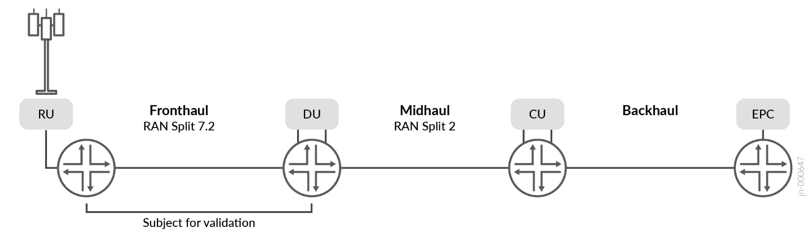
*Figure 1: xHaul Network*

The xHaul consists of the Fronthaul (FH), Midhaul (MH), and Backhaul (BH) segments
that connect to the O-RAN radio units (O-RUs), distributed units (O-DUs), and
centralized units (O-CUs), respectively.

The fronthaul network segment is leveraged to enable Layer 2 connectivity between
O-RU and O-DU, also referred to as RU and DU in the diagram (Figure 1) of the RAN
for control, data (eCPRI), management traffic flows, and to provide time and
frequency synchronization between RAN elements of the fronthaul network.

The advancement of the RAN involves different architectures for 4G, including
distributed, centralized, and virtualized infrastructures, which need to coexist
with the 5G disaggregated O-RAN. These diverse ecosystems provide flexibility for
the placement of components such as O-DU and O-CU.

> **NOTE:** This JVD does not cover all possible scenarios. However, it closely
> aligns with O-RAN split 7.2x, where the O-RU connects to the CSR and the O-DU is
> co-located with O-CU within the HSR infrastructure. Additional insertion points
> can be implemented to support disaggregation between the midhaul and backhaul
> segments by extending appropriate services.

Figure 2 summarizes the deployment scenarios for the RAN according to the ITU-T
for simultaneous support of 4G and 5G as proposed by the O-RAN Alliance.

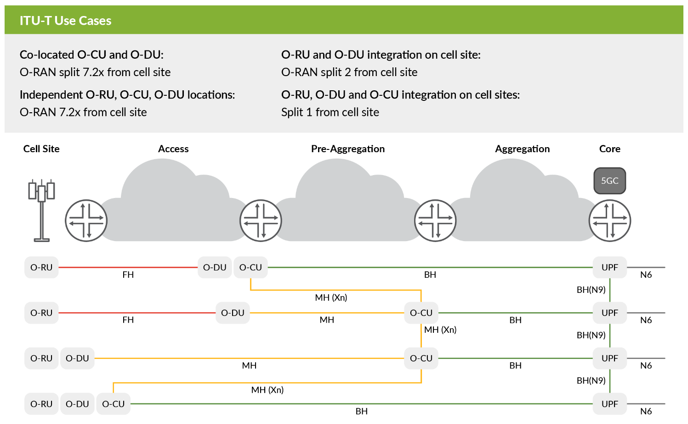
*Figure 2: RAN Deployment Scenarios for Simultaneous Support of 4G and 5G*

5G infrastructure must support stringent latency budgets between O-RU and O-DU. To
achieve this goal, the number of Transport Network Elements (TNEs) facilitating
the fronthaul segment is kept to a minimum, in most cases limited to one or two
hops. For this reason, spine-and-leaf topologies are ideal. However, ring
architectures might be leveraged if the given latency budget can be achieved. For
transport requirements, O-RAN WG9 technical specification
(O-RAN.WG9.XTRP-REQ-v01.00) provides guidelines for a maximum of one-way latency
budget of 100µs for the fronthaul. This budget includes latency incurred by the
fiber run (~4.9µs/km) and transit nodes. The objective for this JVD is to deliver
a solution with latency performance within the acceptable range from O-RU to O-DU,
approximately ≤10µs per node. The ACX7000 series platforms typically support ≤6µs
for low latency workloads, including under network congestion scenarios.

To meet Service Level Objectives (SLOs), 5G transport network QoS must be capable
of supporting the spectrum of fronthaul traffic characteristics and mobile
backhaul service applications. The referenced CoS scheduling model is constructed
to support service types defined by 3GPP, as shown in the following table. These
service hierarchies might be realized as part of network slicing architectures, as
explained in the O-RAN WG1 technical specification
(O-RAN.WG1.Slicing-Architecture-R003-v11.00). While network slicing is outside the
scope of this validation, the underlying service attributes are important
considerations in developing a viable CoS model.

*Table 1: 3GPP Scheduling Model*

| Service Type | Characteristics |
|---|---|
| eMBB | Slice suitable for the handling of 5G enhanced Mobile Broadband. |
| URLLC | Slice suitable for the handling of ultra-reliable low latency communications |
| V2X | Slice suitable for the handling of V2X services. |
| MIoT / mMTC | Slice suitable for the handling of massive IoT and/or massive machine type communication |

The flow-based 5G QoS model provides more granular control and flexibility
compared to the bearer-based 4G LTE QCI model. Instead of assigning a single QoS
value to an entire bearer, 5G allows differentiated flows within the same bearer
to deliver individual QoS requirements. This enables more fine-grained QoS
management and allows different applications and services to receive tailored
treatment based on their specific needs. It also enables the network to adjust QoS
parameters for individual flows dynamically, optimizing resource allocation and
providing a better user experience.

When transitioning from the 4G LTE QCI model to the 5G QoS Identifier (5QI) model,
there exist some similarities in defining and handling the traffic. However, in
5G, new categories are introduced specifically for flows that require very low
delay and high bandwidth. These are crucial for user-plane and control-plane
traffic streams between O-RU and O-DU in the 5G Fronthaul segment. The O-RAN
architecture separates user-plane and control-plane traffic to enhance the
efficiency and performance of 5G networks. The user-plane traffic includes the
transmission of high-speed user data with low latency, while the control-plane
traffic manages the signaling and coordination necessary to support the UPF. Both
traffic streams are transported using the eCPRI protocol over the Open Fronthaul
(OFH) interface, ensuring a standardized and efficient communication pathway
between the O-RU and O-DU.

5G incorporates several new delay-critical Guaranteed Bit Rate (GBR) flow
categories to meet the strict requirements of certain 5G applications that demand
ultra-reliable low latency communications (URLLC). The proper categorization with
performance capabilities of the network becomes paramount with technological
advancements to support mission-critical services like autonomous driving, remote
surgery, and industrial automation.

With high bandwidth and extremely low latency characteristics, 5G fronthaul access
devices must assign the highest priority to the eCPRI-based flows supporting user
and control traffic streams to ensure optimal performance and reliability. This
means that the Service Providers might need to rethink their existing CoS designs,
where the highest priority queues are typically reserved for voice or video
traffic.

3GPP defines 5QI to QoS characteristics mapping, which can be referenced to build
an appropriate CoS model. Resources are classified as delay-critical GBR, GBR, or
non-GBR. For more information on 3GPP 5QI models, see details in ETSI TS-23.501.

The O-RAN 5QI/QCI Exemplary Grouping model is shown in Figure 3 and defined in
O-RAN [O-RAN.WG9.XPSAAS-R003-v08.00], groups common QCI and 5CI QoS flow
characteristics into four exemplary groups based on delay budget.

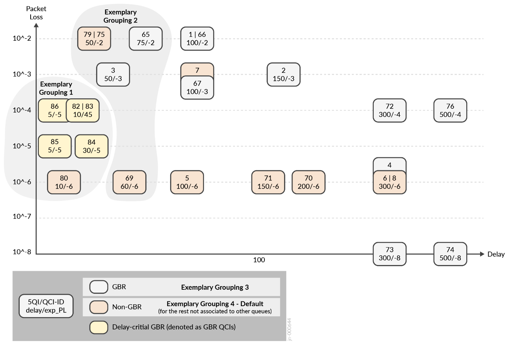
*Figure 3: O-RAN Exemplary 5QI Grouping*

QoS schemas vary between mobile operators; the JVD does not attempt to qualify a
specific design as the recommendation. The main goal is to substantiate
deterministic behaviors based on critical and noncritical traffic flows across a
range of services delivered by the xHaul network. The CoS solution should further
prove capable of supporting the Exemplary model explained here, along with the
Time Sensitive Network (TSN) profile and transport CoS characteristics.

### Time Sensitive Networking (TSN) Fronthaul Profiles

The IEEE 802.1CM standard formalizes Time-Sensitive Networking (TSN) for fronthaul
and ensures that fronthaul networks in 5G and advanced mobile networks meet
stringent latency, jitter, and reliability requirements. It applies TSN
principles, like precise synchronization and traffic shaping, to maintain
low-latency and low-jitter communication between remote radio heads and baseband
units. This standard helps mobile operators enhance network performance, support
new high-precision applications, and ensure scalable and flexible infrastructure
for future advancements. The standard applies to both CPRI and eCPRI traffic
flows.

The JVD goals align with TSN Profile A, outlined by 802.1CM section 8.1, which
follows a strict-priority model where the user plane is assigned a high-priority
class while control and management plane data are assigned a low-priority class.
Fronthaul traffic is always prioritized over non-fronthaul traffic, with a maximum
frame size recommendation of 2000 octets for both.

O-RAN defines TSN Profile A within its architecture to ensure deterministic
communication in the fronthaul network, connecting remote radio units (RRUs) with
centralized baseband units (BBUs). Profile A is recommended for ultra-low latency
and jitter, with precise synchronization and traffic shaping, suitable for the
most demanding 5G applications. Figure 4, defined by the O-RAN WG9, illustrates the
packet behavior in TSN Profile A.

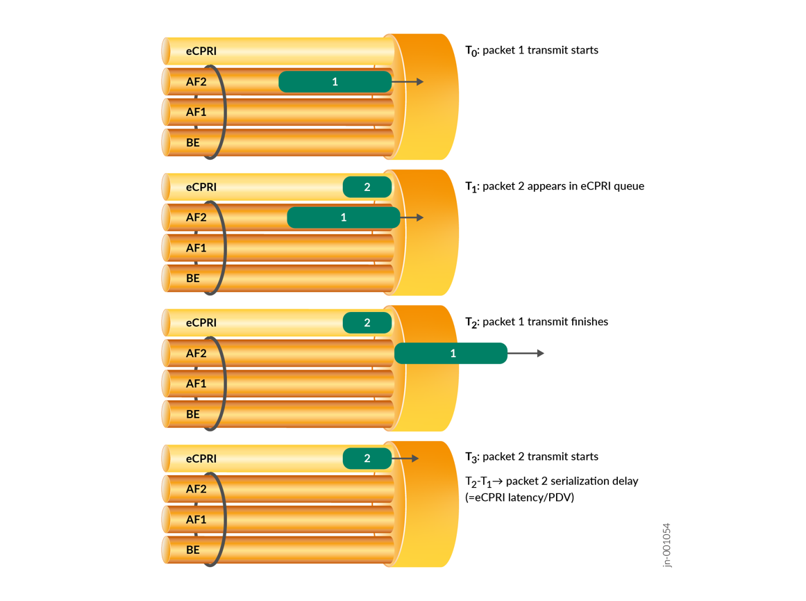
*Figure 4: TSN Profile A*

802.1CM additionally defines TSN Profile B with express frame preemption.
O-RAN.WG9.XPSAAS-R003-v08.00 illustrates the minimal benefit for port speeds
>1Gbps. Table 2 outlines queuing delay differences based on port speed and
calculates associated fiber reach. Each profile includes a reference frame size
influencing queuing delay. The frame size with Profile B is smaller due to
preemption, but only when frames are larger than 155 bytes. Frames below 155 bytes
are not preempted.

*Table 2: Queuing Delay of Non-Fronthaul Data*

| Port Speed | TSN Profile A: Queuing delay of 2,020 bytes | TSN Profile B: Queuing delay of 155 bytes | Difference (µs) | Difference (Fiber) |
|---|---|---|---|---|
| 1 Gbps | 16.160 µs | 1.240 µs | 14.920 µs | 3,045 m |
| 10 Gbps | 1.616 µs | 0.124 µs | 1.492 µs | 304 m |
| 25 Gbps | 0.646 µs | 0.050 µs | 0.596 µs | 122 m |
| 50 Gbps | 0.323 µs | 0.025 µs | 0.298 µs | 61 m |
| 100 Gbps | 0.162 µs | 0.012 µs | 0.149 µs | 30 m |
| 200 Gbps | 0.081 µs | 0.006 µs | 0.075 µs | 15 m |
| 400 Gbps | 0.040 µs | 0.003 µs | 0.037 µs | 8 m |

From 10Gbps onwards, the benefits of frame preemption in Profile B diminish to the
point of nominal return. The recommended Profile A is leveraged in the JVD solution
and includes multiple priority queues, with each having preemptive capability
(between queues). The LLQ supports dequeuing prioritization over lower priority
frames to ensure delivery of delay-sensitive traffic.

### O-RAN Priority Queuing Models

O-RAN/3GPP proposes two common QoS profiles supporting a minimum of 6 queues to
accommodate transport network requirements. These profiles include a single
Priority Queue (PQ) or multiple Priority Queues.

In the single PQ model (Figure 5), the priority queue is defined for handling
ultra-low latency flows such as PTP and eCPRI. This queue is serviced ahead of all
other queues. Lower priority queues are then serviced as weighted fair queuing
(WFQ).

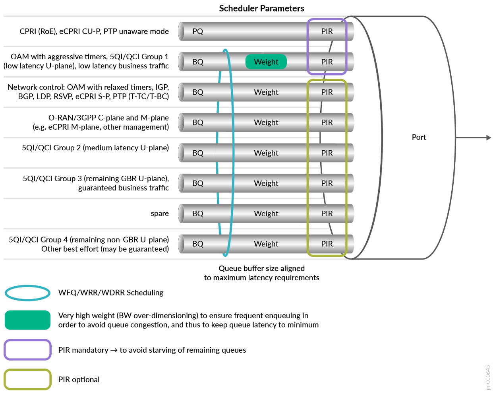
*Figure 5: Single Priority Queue*

In the second O-RAN transport core QoS model (Figure 6), a hierarchy supporting
multiple priority queues is utilized with the ability to dequeue in priority order.
Priority queues must be rate-limited to prevent starving queues of lower
priorities.

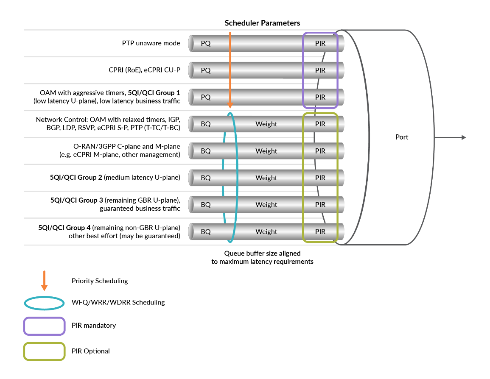
*Figure 6: Multiple Priority Queue*

The previous JVDs, 5G validated designs for 5G CSR Seamless Segment Routing and 5G
Fronthaul Class of Service leveraged the Single Priority Queue model. The
strict-high queue is reserved for the most critical traffic flows, such as eCPRI
between O-RU and O-DU and is shaped to prevent starving lower priority queues.

As per Junos OS Evolved Release 23.3R1, the ACX7000 family supports six priorities:
low-latency, strict-high, high, medium-high, medium-low, and low. Each priority
queue is capable of preempting lower priority queues. A major focus for this JVD
featuring LLQ is to validate the Multiple Priority Queue model.

### Recommended Latency Budgets

5G xHaul infrastructure defines strict latency budgets, particularly in the
fronthaul segment. The total budget factors include fiber length, transit network
devices, and transport design. O-RAN mandates a maximum of 100µs fronthaul one-way
latency.

Typically, this equates to ≤10µs per device without accounting for fiber
distances. Operators commonly seek solutions to reduce further per-device transit
latency in the range of ~6µs, which can help to extend the total network reach.
This is a massive paradigm shift from the earlier 4G architecture requirements. The
end-to-end xHaul RU to EPC is expected to be ≤10 milliseconds.

When leveraging a multiple PQ model, we recommend placing G.8275.2 PTP unaware as
the highest possible priority. However, O-RAN discourages deployments with PTP
unaware in favor of G.8275.1 PTP profile, using boundary clock mode on each transit
node. PTP aware does not carry such precise delay requirements, allowing this
traffic to be placed in a low-priority queue. The highest priority traffic is
therefore given to eCPRI. Traffic classes used in the JVD are explained in the
[Solution Architecture](#solution-architecture) section.

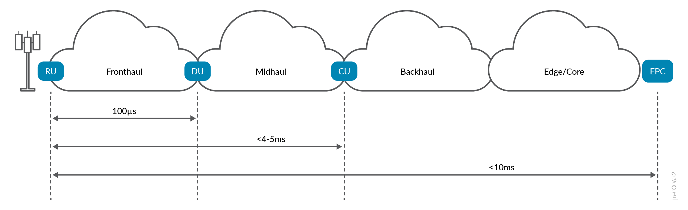
*Figure 7: 5G xHaul Latency Budget*

The transport architecture must be capable of preserving delay budget integrity
while guaranteeing traffic priorities. The following table
[O-RAN.WG9.XPSAAS-v08.00] defines suitable per-hop latency and per-hop packet delay
variation budgets for critical traffic types and is an important reference point in
developing the 5G JVD QoS model and contributing traffic classes. This table
includes the alignment of traffic classes based on Exemplary grouping.

*Table 3: Recommended Latency/PDV Budgets*

| Traffic Type | Packet Size | Per-Hop Latency | Per-Hop PDV |
|---|---|---|---|
| PTP (unaware mode)¹ | ~100 bytes | constant average | ~0.5 μs |
| CPRI (RoE) | ~1500 bytes | ~1-20 μs | ~1-20 μs |
| eCPRI CU-plane | ~1500 bytes | ~1-20 μs | ~1-20 μs |
| OAM with aggressive timers | ~100 bytes | ~1 ms | ~1 ms |
| 5QI/QCI Group 1 (low latency U-plane) | variable | ~1 ms | ~1 ms |
| Low latency business traffic | variable | ~1 ms | ~1 ms |
| Network Control: OAM with relaxed timers, IGP, BGP, LDP, RSVP, PTP aware mode (T-TC/T-BC) | variable | ~5 ms | ~1-3 ms |
| O-RAN/3GPP C-plane and M-plane | variable | ~5 ms | ~1-3 ms |
| 5QI/QCI Group 2 (medium latency U-plane) | variable | ~5 ms | ~1-3 ms |
| 5QI/QCI Group 3 (remaining GBR U-plane) | variable | ~10 ms | ~5 ms |
| Guaranteed business traffic | variable | ~10 ms | ~5 ms |
| 5QI/QCI Group 4 (remaining non-GBR U-plane) | variable | ~10-50 ms | ~5-25 ms |
| Other traffic types (best effort) | | | |

(1) PTP unaware mode will not be covered and is no longer recommended.

### Regulatory Interests

- ETSI 3GPP Forum (3rd Generation Partnership Project)
- O-RAN Alliance
- Metro Ethernet Forum (MEF)
- IEEE P802.1CM
- eCPRI Specification

## Validation Framework

Two xHaul network deployment scenarios are under consideration, standalone 5G
Fronthaul network infrastructure and a joint deployment of the traditional L3VPN 4G
MBH and 5G xHaul running on top of the same physical network infrastructure.

While operators are rolling out new 5G networks, you need to maintain an existing
4G infrastructure for an extended period. The same physical infrastructure must
serve the purposes of L3MBH and 5G networks. The same 5G CSR must allow
simultaneous connectivity to the 5G gNB and 4G eNB cell towers providing L2
fronthaul and L3 MBH services. The lab topology aligns with the co-located O-DU and
O-CU split 7.2x from the cell site, however the architecture allows for any
functional split with flexible insertion points across the midhaul/backhaul portion
of the network.

Topology involves Seamless MPLS with BGP-LU at border nodes and IS-IS SR underlay
across multiple domains. Service overlay includes EVPN, L3VPN, VPLS, L2VPN, and
L2Circuit. The end-to-end CoS model that this JVD uses might be extended or evolved
to support architectures and use cases beyond what this document proposes.

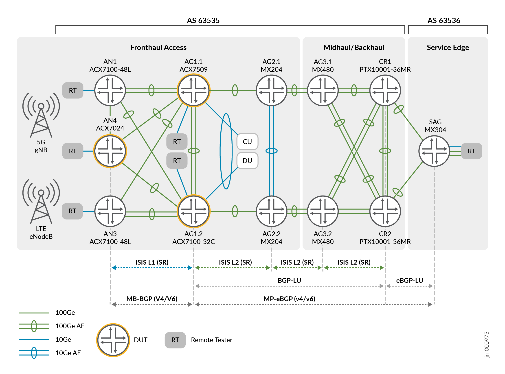
*Figure 8: Lab Topology*

### Test Bed

Figure 9 explains connectivity for building the physical 5G fronthaul CoS LLQ JVD
infrastructure. The fronthaul segment leverages a spine-and-leaf topology, enabling
connections between access nodes supporting cell site router (CSR) functionality to
pre-aggregation nodes supporting hub site router (HSR) functions. The access
segment leverages 100GbE speeds for the proposed topology, supporting up to 400GbE
port speeds. CSR aggregates O-RU traffic supporting 5G, including legacy 4G
workloads. The selected access nodes for the CSR role include the ACX7024 (AN4) and
ACX7100-48L (AN1, AN3) platforms. HSR aggregates traffic from multiple CSRs,
including additional emulated access segments and supports connectivity into the
O-DU and O-CU relative to the functional split model. The selected aggregation
nodes for the HSR role include the ACX7509 (AG1.1) and the ACX7100-32C (AG1.2).
Additional helper nodes build out the aggregation and core segments with the MX204
(AG2), MX480 (AG3), and PTX10001-36MR (CR1, CR2) devices. Finally, the MX304
platform supports the Services Aggregation Gateway (SAG) role.

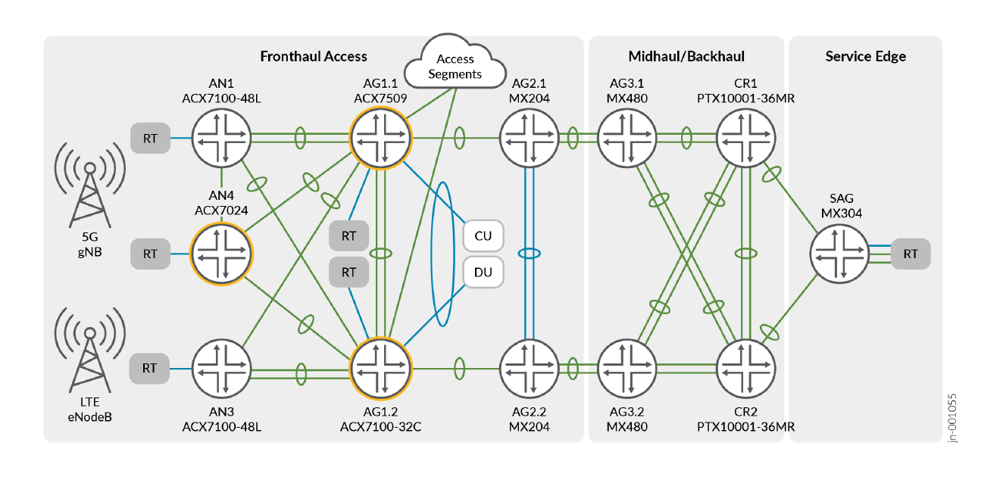
*Figure 9: Test Bed*

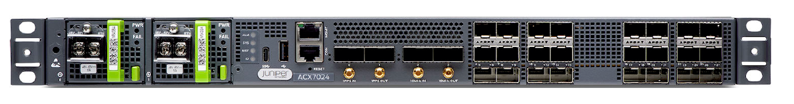
*Figure 10: ACX7024 Devices Under Test*

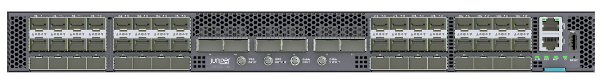
*Figure 11: ACX7100-48L Devices Under Test*

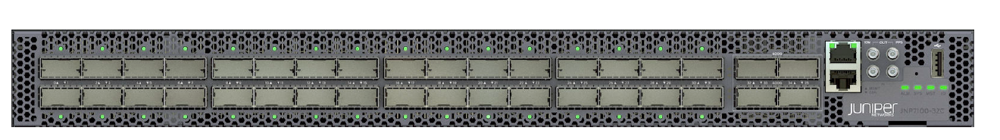
*Figure 12: ACX7100-32C Devices Under Test*

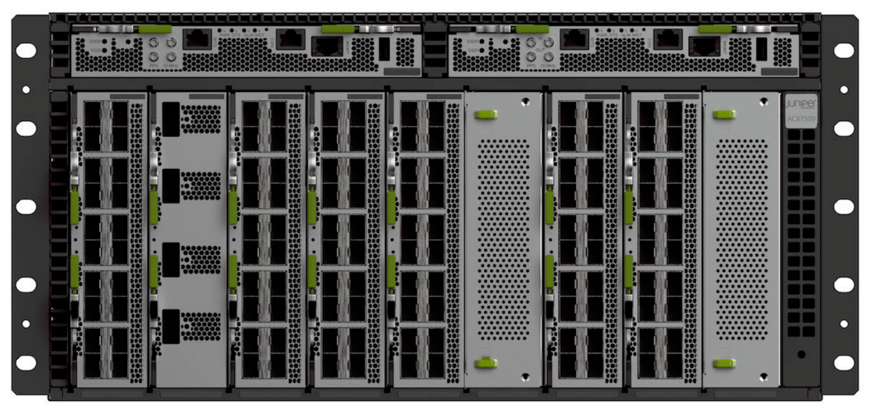
*Figure 13: ACX7509 Devices Under Test*

### Platforms and Devices Under Test (DUT)

To review the software versions and platforms on which this JVD was validated by
Juniper Networks, see the Validated Platforms and Software section in this
document and the companion [datasheet.md](datasheet.md).

## Test Objectives

This JVD is a cross-functional collaboration between Juniper Solution Architects and
Test teams to develop coherent multidimensional solutions for domain-specific use
cases. The JVD team comprises technical leaders in the industry with a wealth of
experience supporting complex customer use cases.

Using this JVD, you can significantly reduce the risk of costly mistakes while
saving time and money in the deployment of network solutions. A JVD-based network
provides benefits such as a more stable network with fewer bugs and a shorter time
to resolution if any bugs are discovered. The validation process ensures that the
network is optimized for maximum performance, leading to a better user experience
for enterprise, service provider operation, and network service consumers.
Furthermore, the design concepts deployed are formulated around best practices,
leveraging relevant technologies to deliver the scope of the solution. KPIs are
identified as part of an extensive test plan that focuses on functionality,
performance integrity, and service delivery. With JVDs, you can shorten the time to
market when implementing new network solutions, reducing the lead time to generate
revenue from new services.

The key test goals of the JVD initiative include:

- Test iterative multidimensional use cases
- Optimize best practices and address solution gaps
- Validate overall solution integrity and resilience
- Support configuration and design guidance
- Deliver practical, validated, and deployable solutions

### Test Goals

The main test objective is to ensure that the advanced CoS features of the ACX7000
series platforms meet the requirements for reliable and high-quality performance in
5G Fronthaul. The secondary test objective is to confirm that the CoS behaviors are
consistent throughout the mobile backhaul topology and across different devices.

An intrinsic test goal of JVD is to identify any limitations, anomalies, and problem
reports (PRs) that are discovered during the validation stages. These issues are
addressed and fixed whenever possible, and any code changes are revalidated as part
of the test execution to ensure the solution functions as intended.

The CoS operational goals are summarized by functional category. Additional details
of each category are available in the [Solution Architecture](#solution-architecture)
section.

**Classification**

- Behavior Aggregate (BA) classification is based on the received or pre-marked
  802.1p, DSCP, or EXP packet headers.
- Fixed Classification maps all interface traffic to a specific forwarding class.
- Multifield classifier matches received packet attributes and maps to a forwarding
  class. A multifield classifier is included to match eCPRI, PTPoE, and OAM traffic
  or received 802.1p bits and maps to an appropriate forwarding class.
- Host-outbound exception traffic is assigned to a specified forwarding class and
  queue.

**Queuing and Scheduling**

- Eight forwarding classes and eight queues are used in the validation.
- LLQ allows delay-sensitive data to be given preferential treatment over other
  traffic.
- Multi-level priority queues ensure differentiated services and applications can be
  appropriately prioritized across the network topology.
- Scheduler percentages are honored based on custom shaping rates (port level).
- Unused bandwidth is made available to other queues as required (up to
  shaping-rate) and proportional to the configured transmit-rate.
- Queueing and scheduling implementation distinctions for ACX7000 platforms:
  - Six priority levels are supported, with each higher priority pre-empting the
    lower: low-latency, strict-high, high, medium-high, medium-low, and low.
  - As of Junos OS Evolved Release 24.3R1, ACX supports eight priority levels for
    port QoS.
  - LLQ priority is serviced ahead of and pre-empts all other queues.
  - All priority queues with equal priority are serviced as round-robin.
  - Transmit-rate is not utilized on priority queues and might be shaped (PIR) to
    prevent starving lower priority queues.
  - Low-priority queues are serviced as WFQ round-robin in accordance with the
    transmit rate.
  - Only low-priority queues might use the transmit-rate configuration.
  - LLQ is given a dedicated VOQ to Egress Queue (EGQ) to ensure latency
    preservation.
  - When shaping rate is used, the amount is deducted from the total port speed. The
    remainder port speed is used to calculate transmit-rate percentage.
  - Fair Adaptive Dynamic Threshold (FADT) shared buffer allocation is updated on
    demand.
- Queueing and scheduling implementation distinctions for MX Trio-based platforms:
  - Five traffic priority levels are supported: strict-high, high, medium-high,
    medium-low, and low.
  - Queues in-profile (operating within the configured bandwidth rate) function
    within the guaranteed region where only strict-high queues can starve.
  - Guaranteed queues are serviced as priority queue deficit weighted round-robin
    (PQ-DWRR).
  - Queues out-of-profile (operating over the configured bandwidth rate) function in
    the excess priority region. Equal priority queues are serviced as WRR, with
    transmit-rate being the weight. Excess region priority is configurable, including
    excess transmit rate or weight.
  - An out-of-profile high-priority queue cannot starve an in-profile low-priority
    queue. Only strict-high operates without any excess region (therefore might be
    shaped to prevent starving other queues).
  - Buffer can be locked with manual configuration.

**Rewrite**

- Traffic is mapped to the correct queue(s), and customer or default rewrite rules
  are honored.
- Ingress traffic is marked as 802.1p or DSCP and rewritten for EXP classification
  at egress.
- Ingress traffic with EXP marking is rewritten to 802.1p or DSCP at egress.
- The rewrite operation affects the outermost tag for dual-tagged frames, preserving
  the inner tag.
- Preserve QoS codepoints end to end for inner and outer tags (wherever intended).
- Multiple rewrite types are supported per interface.

**Shaping and Rate Limiting**

- Port-level shaper honors existing scheduler transmit rates based on the provisioned
  shaper bandwidth.
- PQs allow rate-limiting to prevent starving low-priority queues.
- The port shaper inherits and appropriately scales the configured scheduling
  characteristics.
- Shaped queues do not exceed the configured shaping rate.

**Latency Budget**

- LLQ has the highest priority. In scenarios where the network is not congested and
  the line rate is below 100%, the LLQ adheres to the following latency budgets:
  - O-RU-to-O-DU latency averages ≤10µ per device.
  - RU-to-SAG latency ≤10ms (expected ≤100µ).
  - eCPRI Type 5 One Way Delay measurement is approximately ≤10µ per device.
- LLQ functionality ensures that the latency budget for delay-sensitive traffic is
  preserved in congestion and non-congestion conditions.

**Key 5G Validation Attributes**

- The solution ensures an end-to-end latency and stable jitter for eCPRI packets
  delivered between RU and DU nodes.
- Prioritize critical eCPRI fronthaul traffic during congestion and non-congestion
  conditions.
- Preserve latency budget of eCPRI fronthaul traffic during congestion and
  non-congestion conditions.
- Maintain traffic priorities across shared links.
- Maintain traffic priorities within and between VPN services that share common
  links.
- Allow transmission of eCPRI Type 7 event indication errors during network
  congestion.
- Maintain consistent CoS and resiliency across negative stress conditions (restart
  control and data plane daemons, add/delete configurations, and so on).
- CSR allows all types of UNI interfaces to interconnect with 5G gNB and 4G eNB as
  described.
- HSR supports the proposed connectivity of O-DU and O-CU, including redundancy
  options.
- Transport and connectivity services are supported for 4G MBH.

### Test Flow Characteristics

The JVD includes the following traffic patterns.

**Accepted Frame Types**

- Untagged (port-based)
- Tagged (802.1Q)
- Double-tagged (802.1ad)

**Accepted Ether Types**

- 0x8100 802.1Q (C-TAG or used with Single-Tagged flows)
- 0x88a8 802.1ad (S-TAG on Q-in-Q flows)

### Test Non-Goals

Non-goals represent functions outside the scope of this JVD or might be covered
previously.

- Custom drop profiles weighted random early detection (WRED)
- Temporal transmit rate or buffer (elastic buffer is used)
- Hierarchical CoS and H-Policing
- 802.1CM TSN Profile B with frame pre-emption (802.1Qbu)
- VLAN manipulation operations (covered in previous CoS JVD)
- Underlay or Overlay validation other than those specified in the solution goals
  section
- Failover and convergence scenarios (covered in previous 5G JVDs)
- End-to-End timing and synchronization distribution: synchronous Ethernet,
  IEEE1588v2
- G.8275.1 PTP Aware with per-node boundary clock
- SLA Monitoring: RFC 2544, Y.1564, TWAMP, and active assurance
- Telemetry, management, and automation
- Network or Link Slicing
- Flex-Algo, transport classes, BGP classful transport (covered in previous 5G JVDs)

### Failure Scenarios

The validation covers the following failure scenarios:

- Link congestion
- Queue congestion without traffic discarding
- Queue congestion with traffic discarding
- Single and multiple queue congestion conditions
- Injected failure events (including eCPRI type)
- Process restart

## Solution Architecture

The solution architecture deploys spine-leaf access fronthaul topology,
midhaul/backhaul ring topologies are combined to include aggregation and core roles
with the services gateway comprising the complete xHaul infrastructure. While the
QoS implementation is generally transferrable across multiple network designs, the
major components of building the end-to-end JVD solution include the following key
attributes.

- 5G xHaul MBH reference architecture
- Seamless MPLS across xHaul IGP domains (Inter-AS and Inter-Domain BGP-LU)
- Segment Routing L-IS-IS
- Fast failover and detection mechanisms TI-LFA, BFD, Microloop Avoidance, OAM, and
  so on.
- Redundant route reflectors
- Community-based route optimizations
- Inter-AS Option B/C
- EVPN-VPWS and Flexible Cross Connect (FXC) with A/A Multihoming
- EVPN-ELAN with A/A Multihoming and EVPN Virtual Gateway Address (VGA) IRB
- BGP-VPLS single-homed
- L2Circuit MBH
- L3VPN

Figure 14 describes an end-to-end service architecture for the joint 4G/5G solution
where hub site AG1.1 and AG1.2 routers also support aggregation of the L3 MBH
network, collapsing 4G Pre-Aggregation and 5G HSR roles. VPN PE functions are
supported in parallel to Inter-AS Option-B and Option-C procedures. AG1.1/AG1.2
nodes provide O-DU connectivity and additional access segment insertion points to
emulate network attachments with increased scale.

The network underlay comprises interdomain Seamless MPLS SR with BGP Labeled
Unicast (BGP-LU). Access nodes (AN) are placed into an IS-IS Level 1 domain with
adjacencies to L1/L2 HSR (AG1) nodes, where the Level 2 domain extends from
aggregation (AG2, AG3) to core (CR) segments. Seamless MPLS is achieved by enabling
BGP-LU at border nodes. TI-LFA loose mode node redundancy is enabled within each
domain instantiation. The environment is scaled by two sets of route reflectors at
CR1 and CR2, with westward HSR (AG1) clients. AG1.1 and AG1.2 serve as the redundant
route reflectors for the access fronthaul segment. Multi-Protocol BGP peering
between SAG to HSR (AG1) supports inter-AS Option-B solutions.

Services overlay incorporates modern and legacy VPNs, including EVPN, L3VPN,
BGP-VPLS, and L2Circuit, with enhancements for Flow Aware Transport Pseudowire Label
(FAT-PW) and Ethernet OAM where applicable.


*Figure 14: Solution Architecture*

Overall, the types of traffic flows represented in the topology include:

- 5G fronthaul layer 2 eCPRI between O-RU to O-DU
- 5G midhaul and backhaul layer 3 IP packet flows between 5G O-CU to UPF/5GC
- Layer 3 IP between 5G supporting open Fronthaul Management Plane and
  Midhaul/Backhaul Control and User plane
- 4G L3MBH IP packet flows between 4G CSR and EPC (SAG)
- 4G L2 wholesale MBH flows between CSR (AN) to EPC (SAG)

The split 7.2x includes layer 2 EVPN 5G Fronthaul traffic flows from O-RU to O-DU
and L3VPN from O-CU to UPF at SAG. The architecture supports additional functional
splits by simply enabling required connectivity from AG2 or AG3 segments.

### Service Profiles

The following profiles explain the VPN services included in the JVD profile and how
these services correlate to the 4G and 5G use cases. It is not an absolute mapping;
operators might select different VPN technologies to support services across the
xHaul. However, EVPN-VPWS is the primary delivery mechanism for critical 5G
fronthaul flows, with L3VPN servicing C/U and M plane communications across the
fronthaul, midhaul, and backhaul segments.

Additional VPN services are shown to represent potential points of connectivity,
such as O-RU emulation or attachment of access regions. This might include
inter-region VPN services (not requiring transport back to SAG) or connectivity
into additional Telco Cloud complexes, which might be facilitated at the HSR.

*Table 4: xHaul Use Cases*

| Use Case | Service Overlay Mapping | Endpoints |
|---|---|---|
| 5G Fronthaul | Fronthaul CSR to HSR EVPN-VPWS Single-Homing with E-OAM Performance Monitoring and FAT-PW | AN4 - AG1.1/AG1.2 |
| 5G Fronthaul | Fronthaul CSR-HSR EVPN-VPWS with active-active Multihoming | AN4 – AG1.1/AG1.2 |
| 5G Fronthaul | Fronthaul CSR-HSR EVPN-ELAN with active-active Multihoming | AN4 - AG1.1/AG1.2 |
| 5G Fronthaul | Fronthaul CSR-HSR EVPN-VPWS Flexible Cross Connect (FXC) Single-Homing with E-OAM Performance Monitoring | AN4 - AG1.1/AG1.2 |
| 5G Fronthaul | Fronthaul CSR-HSR EVPN-VPWS Flexible Cross Connect (FXC) with active-active Multihoming | AN4 - AG1.1/AG1.2 |
| 5G Fronthaul | Fronthaul CSR-HSR L3VPN for M-Plane | AN4 - AG1.1/AG1.2 |
| 5G Midhaul | EVPN IRB anycast gateway with L3VPN Multihoming DU/HSR to SAG | AG1.1/AG1.2 - SAG |
| 5G Midhaul | Bridge Domain IRB anycast static MAC/IP with L3VPN Multihoming DU/HSR to SAG | AG1.1/AG1.2 - SAG |
| L2 MBH | End-to-End L2Circuit CSR to SAG with FAT-PW | AN4 - SAG |
| L2 MBH | End-to-End Single-Homing EVPN-VPWS CSR to SAG with E-OAM and FAT-PW | AN4 - SAG |
| L2 MBH | End-to-End Single-Homing BGP-VPLS CSR to SAG with E-OAM and FAT-PW | AN4 - SAG |
| L3 MBH | End-to-End L3VPN CSR to SAG | AN4 - SAG |

### Traffic Types

The following table prioritizes examples of traffic types and explains how these are
mapped with the associated forwarding classes.

*Table 5: Traffic Profiles*

| Forwarding Class | Priority | Traffic Examples |
|---|---|---|
| Q7: FC-SIGNALING | strict-high | OAM aggressive timers, O-RAN/3GPP C-plane |
| Q6: FC-LLQ | low-latency | CPRI RoE, eCPRI C/U-Plane ≤2000 bytes |
| Q5: FC-REALTIME | medium-high | 5QI/QCI Group 1 low-latency U-plane, low latency business. Interactive video, low latency voice |
| Q4: FC-HIGH | low | 5QI/QCI Group 2 medium latency U-plane data |
| Q3: FC-CONTROL | high | Network control: OAM relaxed timers, IGP, BGP, PTP aware mode, and so on. |
| Q2: FC-MEDIUM | low | 5QI/QCI Group 3 remainder GBR U-plane guaranteed business data. Video on-demand. O-RAN/3GPP M-plane, e.g., eCPRI M-plane, other management, software upgrades |
| Q1: FC-LOW | low | high latency, guaranteed low priority data |
| Q0: FC-BEST-EFFORT | low-remainder | remainder non-GBR U-plane data |

### Service Carve Out

Fronthaul traffic flows are appropriately prioritized with objective latency budgets
and low delay and jitter tolerance. As a best practice, delayed critical eCPRI
traffic is assigned the highest priority queue for handling low-latency workloads.
Midhaul and backhaul services can be considered with lower requirements but might
include URLLC use cases, such as delay-sensitive real-time video. These aspects are
considered in the JVD.

The VPN services required to complete the essential 5G xHaul communications include:

- EVPN-VPWS for fronthaul C/U Plane
- L3VPN for fronthaul management plane
- L3VPN for midhaul/backhaul control plane
- L3VPN for midhaul/backhaul data plane

The environment is enhanced with additional VPN services at scale, providing
performance and emulated expansion of additional network segments, e.g., CSR
supporting many O-RUs.

*Table 6: Service Classification*

| VPN Service | Segment | Classification Type | Forwarding Classes |
|---|---|---|---|
| EVPN-VPWS | Fronthaul | Fixed | FC-LLQ |
| EVPN-VPWS | Fronthaul | Multifield | FC-LLQ, FC-SIGNALING, FC-CONTROL, FC-REALTIME, FC-HIGH, FC-BEST-EFFORT |
| EVPN-FXC | Fronthaul | BA | FC-SIGNALING, FC-CONTROL, FC-REALTIME, FC-HIGH, FC-MEDIUM, FC-LOW, FC-BEST-EFFORT |
| EVPN-ELAN | Fronthaul | BA | FC-SIGNALING, FC-CONTROL, FC-REALTIME, FC-HIGH, FC-MEDIUM, FC-LOW, FC-BEST-EFFORT |
| L3VPN | Fronthaul | BA | FC-SIGNALING, FC-CONTROL, FC-REALTIME, FC-HIGH, FC-MEDIUM, FC-LOW, FC-BEST-EFFORT |
| L3VPN | Midhaul | Fixed | FC-REALTIME |
| L3VPN | Midhaul | BA | FC-LLQ, FC-SIGNALING, FC-CONTROL, FC-REALTIME, FC-HIGH, FC-MEDIUM, FC-LOW, FC-BEST-EFFORT |
| L3VPN | Midhaul | Multifield | FC-REALTIME, FC-HIGH, FC-MEDIUM, FC-LOW |
| L2Circuit | MBH | Fixed | FC-HIGH, FC-MEDIUM, FC-LOW |
| EVPN-VPWS | MBH | BA | FC-SIGNALING, FC-CONTROL, FC-REALTIME, FC-HIGH, FC-MEDIUM, FC-LOW, FC-BEST-EFFORT |
| BGP-VPLS | MBH | BA | FC-HIGH, FC-MEDIUM, FC-LOW |
| L3VPN | MBH | BA | FC-SIGNALING, FC-CONTROL, FC-REALTIME, FC-HIGH, FC-MEDIUM, FC-LOW, FC-BEST-EFFORT |

### Class of Service Architecture

Flows are sent through access nodes (Figure 15) toward O-DU or SAG with Layer 2
(802.1p) or Layer 3 (DSCP) marking at positions defined as classification and
rewritten to EXP at egress across the SR-MPLS topology. Queue statistics are
monitored to ensure that the intended classification and scheduling produce the
expected results. Rewrite operations occur at the specified positions. Packet
captures are taken to verify that DSCP, 802.1p, or EXP bits are correctly rewritten
or preserved. In the inverse direction, flows sent through SAG are marked and
validated once egressing the access nodes.

The 5G CoS LLQ JVD builds upon previous validated designs featuring ACX, MX, and PTX
platform families to focus on delivering differentiated services requiring ultra-low
latency. This profile incorporates capabilities of ACX7000 platforms in the
fronthaul to dedicate queuing machinery to preserve low latency workloads. LLQ
enables support of a more comprehensive O-RAN traffic profile for multi-level
priority QoS.

MX304 as SAG and PTX10001-36MR core nodes, implements a corresponding configuration
to support the intended use cases and diverse services.

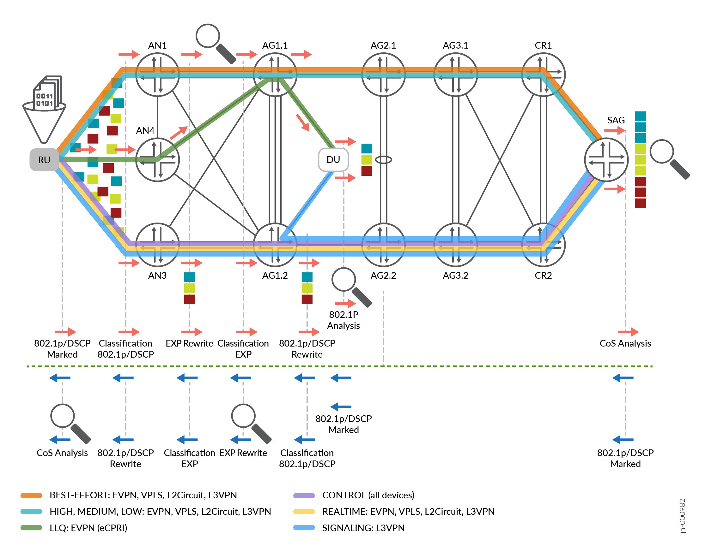
*Figure 15: Class of Service Points of Validation*

Figure 15 is presented as a generalization of the end-to-end traffic,
differentiating fronthaul vs backhaul and points of CoS operations to validate
these critical functions, e.g., classification, scheduling, and rewrite operations.
The diagram does not represent the precise per-flow path selection used in the JVD.
The points of packet capture for further inspection are indicated.

The major objective is to examine predictable behaviors regarding how critical and
noncritical traffic flows are handled across 5G xHaul network services. CoS
functionalities are validated across EVPN, L3VPN, BGP-VPLS, and L2Circuit VPNs,
aligning with 5QI traffic classification. QoS implementation should exhibit
deterministic functionality. The transport architecture must be capable of
supporting the adaptation of existing and emerging mobile applications, preserving
delay budget integrity while guaranteeing traffic priorities.

### Test Topologies for Latency Measurement

The JVD proposes multiple topologies to measure and report on latency performance
for each DUT and across fronthaul and backhaul network segments. This ensures to
capture meaningful data on the device performance across different functional roles
and topologies.

- Topology 1 validates the individual DUT performance acting in a CSR or HSR role.
  This topology provides most accurate performance for the individual device.
- Topology 2 measures performance over point-to-point EVPN-VPWS services between CSR
  and HSR. ACX7024 acts as CSR DUT with ACX7100-32C or ACX7509 as HSR DUTs. The test
  equipment emulates O-RU and O-DU.
- Topology 3 measures performance across EVPN-VPWS active-active multihoming
  connectivity with a single CSR DUT to a pair of HSRs leveraging All-Active ESI LAG
  toward DU (QFX5120).

Critical flows are crafted to emulate the fronthaul traffic patterns with burst and
steady streams (validating each pattern) across a variety of packet sizes. The
packet sizes include 64B – 2000B for fronthaul flows, with a maximum frame size of
2020 bytes, including up to 7-byte Preamble, 1-byte Start of Frame Delimiter (FSG),
and 20-byte Inter Frame Gap (IFG). Each test scenario includes fronthaul priority
flows where performance measurements are taken based on the frame size.

As per TSN Profile A, non-fronthaul traffic should include a maximum frame size of
2000 octets, though the validation includes scenarios with jumbo frames for
comparison. Background traffic is generated with iMIX 64B to 2000B frame size from
SAG (xHaul) toward O-DU or O-RU to create congestion scenarios measured at
converging DUT egress points. Test equipment traffic excludes self-latency. However,
it should be noted that where topology includes a physical DU (QFX Series Switch),
latency is incurred and counted against the total as a transit next hop.

For more information on 5G specifications, see the
[Recommended Latency Budgets](#recommended-latency-budgets) section.


*Figure 16: Topology 1a ACX7024 Standalone DUT*


*Figure 17: Topology 1b ACX7100-32C Standalone DUT*


*Figure 18: Topology 1c ACX7509 Standalone DUT*

Topology 1 (a, b, c) is crucial to understanding the individual DUTs latency
contribution. Flows of various packet sizes of burst and continuous traffic patterns
are included. Background traffic includes fixed frame size and iMIX traffic flows.
For more details, you can refer to the Test Report. The configuration is locally
switched on DUT. The included DUTs are ACX7024 as the primary CSR, ACX7100-32C as
HSR1, and ACX7509 as HSR2.


*Figure 19: Topology 2a CSR and HSR*

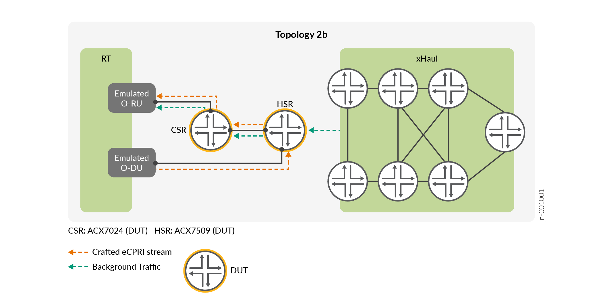
*Figure 20: Topology 2b CSR and HSR*

Topology 2 provides single-homed performance data in a 2-hop scenario without a
physical RU or DU element (both emulated by the test center).

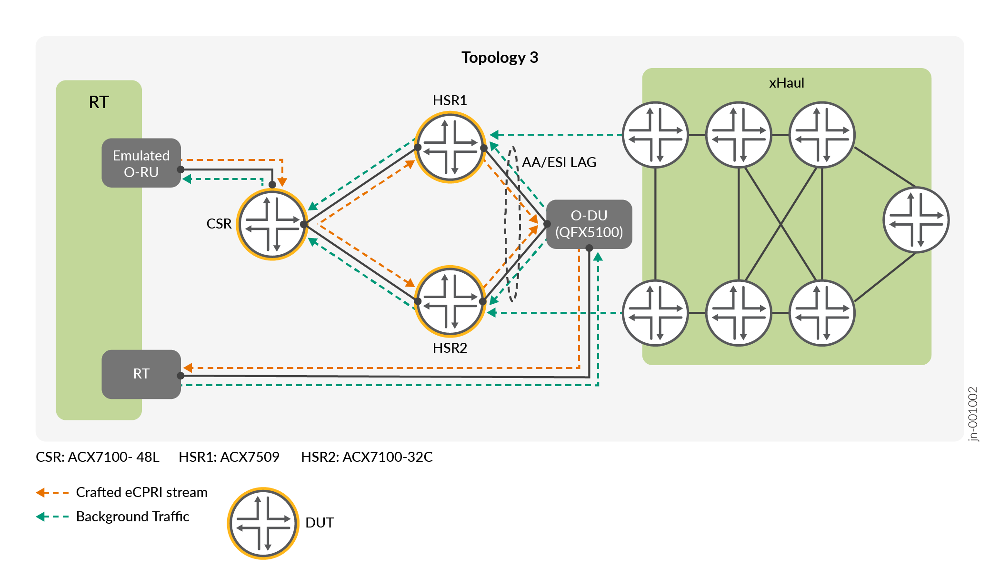
*Figure 21: Topology 3 CSR to active-active HSR*

Topology 3 provides multihomed performance data in a 3-hop scenario, which includes
QFX Series Switches as the DU connecting to the all-active ESI LAG. The test center
emulates RU.

### O-RAN and eCPRI Emulation

The O-RAN and eCPRI test scenarios include several functional permutations with
emulated O-DU and Remote Radio Unit (RRU). Innovative steps are taken to validate the
performance and assurance of 5G eCPRI communications, U-Plane message-type behaviors,
and O-RAN conformance. These steps ensure that the featured DUTs are correctly and
consistently transporting critical 5G services.

Results evolve across multiple topologies to capture a range of DUT performance
characteristics in non-congested and congested scenarios.

The summary of O-RAN and eCPRI test scenarios include:

- eCPRI O-RAN Emulation: Leverages a standard IQ sample file to generate flows.
- O-RAN Conformance: Analyzes messages for conformance to O-RAN specification.
- Crafted eCPRI O-RAN: Produces variable eCPRI payload for comparing latency
  performance.
- eCPRI Services Validation: Emulates user plane messages, performing functional and
  integrity analysis.
- eCPRI Remote Memory Access (Type 4): Performs read or write from or to a specific
  memory address on the opposite eCPRI node and validates expected success or failure
  conditions.
- eCPRI Delay Measurement Message (Type 5): Estimates one-way delay between two eCPRI
  ports.
- eCPRI Remote Reset Message (Type 6): One eCPRI node requests a reset of another
  node. It validates expected sender or receiver operations.
- eCPRI Event Indication Message (Type 7): Either side of the protocol indicates to
  the other side that an event has occurred. An event is either a raised or ceased
  fault or a notification. Validation confirms events raised as expected.

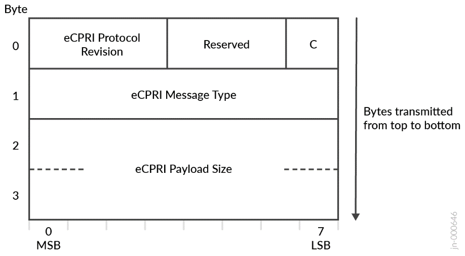
*Figure 22: eCPRI User Plane Common Header Format*

### VLAN Operations

The ACX7000 series supports a comprehensive set of VLAN manipulation operations. For
more information on the 80 VLAN combinations tested across L2Circuit, BGP-VPLS,
EVPN-VPWS, and EVPN-ELAN services, see the validated design for 5G Mobile xHaul CSR.

The following table summarizes VLAN operations supported by ACX EVO-based platforms.

*Table 7: ACX-EVO Supported VLAN Operations*

| IFL Tag Type | Input Map Operation | Output Map Operation | Eth Bridge | Vlan Bridge | Supported IFD Tagging |
|---|---|---|---|---|---|
| UT | None | None | Yes | No | None |
| UT | Push | Pop | Yes | No | None |
| UT | Push-Push | Pop-Pop | Yes | No | None |
| ST | None | None | No | Yes | VLAN and Flex Tagging |
| ST | Push | Pop | No | Yes | VLAN and Flex Tagging |
| ST | Swap | Swap | No | Yes | VLAN and Flex Tagging |
| ST | Pop | Push | No | Yes | VLAN and Flex Tagging |
| ST | Push-Swap | Swap-Pop | No | Yes | VLAN and Flex Tagging |
| DT | None | None | No | Yes | VLAN and Flex Tagging |
| DT | Pop | Push | No | Yes | VLAN and Flex Tagging |
| DT | Swap | Swap | No | Yes | VLAN and Flex Tagging |
| DT | Swap-Swap | Swap-Swap | No | Yes | VLAN and Flex Tagging |
| DT | Pop-Swap | Swap-Push | No | Yes | VLAN and Flex Tagging |
| DT | Pop-Pop | Push-Push | No | Yes | VLAN and Flex Tagging |
| Native ST | None | None | No | Yes | Flexible Tagging |
| Native ST | Push | Pop | No | Yes | Flexible Tagging |
| Native ST | Swap | Swap | No | Yes | Flexible Tagging |
| Native ST | Pop | Push | No | Yes | Flexible Tagging |
| Priority ST | Push | Pop | No | Yes | VLAN and Flex Tagging |
| Priority ST | Swap | Swap | No | Yes | VLAN and Flex Tagging |
| Priority ST | Pop | Push | No | Yes | VLAN and Flex Tagging |

Test scenarios include the following VLAN operations:

- Pop s-tag in outer position (on top of 802.1Q tagged frames)
- Push s-tag (moving c-tag to inner position)
- Swap outer tag
- Classification based on 802.1p priority code point (PCP) bits
- Rewrite outer VLAN tag 802.1p bits
- Preservation of c-tag PCP bits
- Translate or rewrite the VLAN tag of 802.1Q frames
- Multiple untagged, single-tagged, and dual-tagged operations

For single-tagged and dual-tagged operations, the classification of incoming frames
is done based on outer 802.1Q Ethernet header PCP bits. All traffic types
(single-tagged, dual-tagged, or untagged) are classified into appropriate forwarding
classes, determined by VPN service type, with EVPN (eCPRI + critical fronthaul flows)
given the highest priority and lowest latency.

### Low Latency Queuing

Junos OS Evolved Release 23.3R1 introduces the LLQ for ACX7000 platforms, enabling
delay-sensitive data to be given preferential treatment over other traffic by
allowing dequeuing of data so that priority traffic can be sent first.

With LLQ functionality, the queue is prioritized over all other priority queues to
ensure latency is preserved. The Virtual Output Queues (VOQ) and Egress Queue (EGQ)
priority hierarchy is as follows:

`Latency Queues > Priority Queues > Low Queues`

With Latency Queuing support, applications that require low latency queuing have the
option to configure this priority through CLI:
`set class-of-service schedulers <name> priority low-latency`

When queues (other than LLQ) are congested, LLQ is expected to support 10µs average
latency. The LLQ mechanics are capable of ≤6µs without congestion. Multiple factors
might influence delay. The validation demonstrates LLQ capability exceeding
expectations.

LLQ supports multiple queues of the same priority. However, we recommend to include
no more than two LLQs per system to ensure latency integrity is preserved. Reasonably,
the more latency queues that must perform round-robin distribution create delay. A PFE
syslog warning is given if more than two LLQs are configured.

The ACX7000 family implements a VOQ architecture designed to avoid Head of Line
Blocking (HOLB) and optimize buffering. This approach uses feedback mechanisms between
the ingress traffic manager (ITM) and the egress traffic manager (ETM). Packets
received at ingress VOQs are mapped to the destination egress port. The ITM generates
a credit request and sends it to the ETM. Depending on the egress port and queue credit
availability, the ETM generates appropriate credit and schedules the traffic with
minimal buffering. Ingress VOQ bundles are associated with a specific egress port. Each
bundle consists of eight VOQs. The VOQ connection forms a virtual representation of the
queue and an egress port association called a Virtual Output Queue Identifier (VOQ ID).


*Figure 23: Virtual Output Queuing Structure*

Packet buffering is performed at ingress with a large delay bandwidth buffer (DBB) and
SRAM small on-chip buffer (OCB). An additional on-chip egress buffer is leveraged for
packet serialization.

Figure 24 explains the ACX7000 scheduling hierarchy in Port QoS mode. Along with
priority, a low delay scheduling profile is associated with VOQs configured as low
latency. With Port QoS mode, three distinct dedicated Egress Queues (EGQ) are enabled to
support LLQ, Priority Queues, and Low Queues.

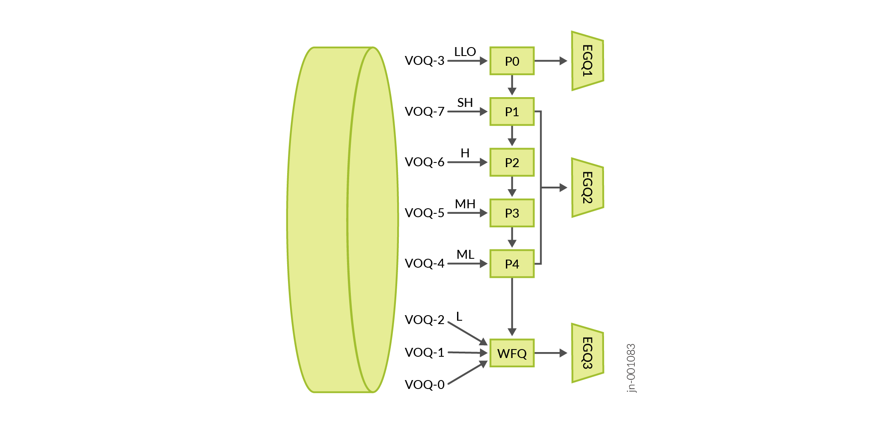
*Figure 24: Multi-Level Priority Hierarchy with LLQ Port QoS*

EGQ1 is dedicated to handling VOQs configured with low latency. EGQ2 is dedicated to
handling priority queues other than latency queues. EGQ3 is dedicated to handling
low-priority traffic. The EGQ separation allows independent treatment to each category
while minimizing the impact on each other. VOQ priority association is based on
configurations.

### Multi-Level Priority

Junos OS Evolved Release 23.3R1 introduces multi-level priorities for the ACX7000
series. Six priorities are supported: low-latency, strict-high, high, medium-high,
medium-low, and low. All queues preempt the lower priority. Equal-priority queues
perform round-robin distribution, and low-priority queues are WFQ. This support is
extended to both port-level QoS and hierarchical QoS (HQoS).

> **NOTE:** Only port-based QoS is covered in this validation.

Before Junos OS Evolved release 23.3R1, the ACX7000 family supported strict-high and
low priority queues, with SH preempting low. In the new CoS architecture, each queue is
given a priority level that is capable of preempting lower priority queues. These
priority levels are:

- P0 (highest priority): Low-Latency
- P1: Strict-High
- P2: High
- P3: Medium-High
- P4: Medium-Low
- WFQ (lowest priority): Low

Priority Queues are designated from P0-P4 and leverage round-robin distribution for
queues within the same priority level. Low priority is the only WFQ, where the transmit
rate is the weight given for the round-robin distribution of multiple low-priority
queues. With strict queue preemption, we recommend to shape the priority queues to
prevent starving lower priority queues.

The functional behavior differs from TRIO-based MX architectures, which leverage
guaranteed and excess regions to ensure the configured transmit rate for all priority
queues, including low priority. PQ-DWRR is implemented in the guaranteed region. Equal
priority queues are serviced as WRR, with the transmit-rate being the weight. Only the
strict-high queue operates without an excess region and can starve low-priority queues.

> **NOTE:** From Junos OS Evolved Release 24.3R1, ACX7000 supports eight priority
> levels, with the addition of low-high (P5) and low-medium (P6) for port QoS.

### Forwarding Classes

ACX7000 supports eight forwarding classes (FC), with four being enabled by default. One
or more FCs can be mapped up to the eight supported queues. Conversely, MX-series
supports sixteen forwarding classes, which can be mapped across eight queues. For this
JVD, a maximum of eight queues are utilized for each transit device, supporting O-RAN
proposed traffic profiles.

The JVD CoS model most closely aligns with the O-RAN Multiple Priority Queue structure
and includes the following queue assignments:

*Table 8: Queue Assignments*

| QUEUE | Forwarding Class | Queue Characteristics |
|---|---|---|
| 7 | FC-SIGNALING | strict-high priority and PIR shaped |
| 6 | FC-LLQ | low-latency priority and PIR shaped (eCPRI) |
| 5 | FC-REALTIME | medium-high priority and PIR shaped (voice & interactive video) |
| 4 | FC-HIGH | low priority WFQ guaranteed |
| 3 | FC-CONTROL | High priority and PIR shaped (network control) |
| 2 | FC-MEDIUM | low priority WFQ guaranteed |
| 1 | FC-LOW | low priority WFQ guaranteed |
| 0 | FC-BEST-EFFORT | low priority WFQ remainder |

Figure 25 illustrates the CoS model proposed for the solution architecture. The CoS
hierarchy can essentially be divided into three main components.

- Low Latency Queues
- Shaped Priority Queues
- Weighted Fair Queues

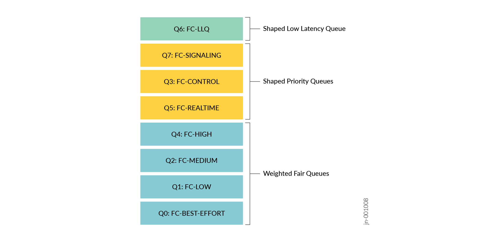
*Figure 25: Differentiated CoS Queuing Model*

Critical fronthaul flows are mapped to the LLQ or PQs, which allows a parallel queueing
structure for non-fronthaul flows with WFQs. The high, medium, and low traffic types are
given a guaranteed committed information rate (CIR) while allowing a dynamic peak
information rate (PIR) if bandwidth is available. To achieve this result, the transmit
rates configured for low-priority queues (WFQ) must be calculated based on the
appropriate port speed, excluding bandwidth allocated to shaped queues. For more
information, see the [Scheduling](#scheduling) section. The best-effort (remainder)
queue has no guarantee.

When implementing the 5G architecture, the LLQ PQ model might be contained within the
fronthaul segment with WFQs designated for MBH. This is not a goal for the JVD. In
general, fronthaul flows are mapped to the first three queues, as shown in Figure 25,
with FC-REALTIME supporting URLLC end-to-end applications. Non-fronthaul (i.e., MBH) is
always mapped to the lower four low-priority queues (WFQ). FC-CONTROL is applicable to
all devices. Low-priority queues might still support some functions within the
fronthaul, such as M-plane and software upgrades.

The following example displays the Forwarding Class configuration, which is the same
across ACX, MX, and PTX platforms.

```
set class-of-service forwarding-classes class FC-SIGNALING queue-num 7
set class-of-service forwarding-classes class FC-LLQ queue-num 6
set class-of-service forwarding-classes class FC-REALTIME queue-num 5
set class-of-service forwarding-classes class FC-HIGH queue-num 4
set class-of-service forwarding-classes class FC-CONTROL queue-num 3
set class-of-service forwarding-classes class FC-MEDIUM queue-num 2
set class-of-service forwarding-classes class FC-LOW queue-num 1
set class-of-service forwarding-classes class FC-BEST-EFFORT queue-num 0
```

Example traffic types per queue:

*Table 9: Forwarding Class with Traffic Types*

| QUEUE | Forwarding Class | Example Traffic Type |
|---|---|---|
| 7 | FC-SIGNALING | OAM aggressive timers, O-RAN/3GPP C-plane |
| 6 | FC-LLQ | CPRI RoE, eCPRI C/U-Plane ≤2000 bytes |
| 5 | FC-REALTIME | 5QI/QCI Group 1 low-latency U-plane, low-latency business. Interactive video, low latency voice |
| 4 | FC-HIGH | 5QI/QCI Group 2 medium latency U-plane data |
| 3 | FC-CONTROL | Network control: OAM relaxed timers, IGP, BGP, PTP aware mode, and so on |
| 2 | FC-MEDIUM | 5QI/QCI Group 3 remainder GBR U-plane guaranteed business data. Video-on-demand. O-RAN/3GPP M-plane, e.g., eCPRI M-plane, other management, software upgrades |
| 1 | FC-LOW | high latency, guaranteed low-priority data |
| 0 | FC-BEST-EFFORT | 5QI/QCI Group 4 – remainder non-GBR U-plane data |

### Classification

Classification is performed at ingress. The following three styles of classification are
included in the validation.

- Behavior Aggregate (BA) matches on the received layer 2 802.1p bits and/or layer 3
  DSCP. In the event where both are received, DSCP takes priority. Behavior Aggregate is
  packet-based, where flows are pre-marked with layer 3 DSCP, layer 2 802.1Q Priority
  Code Points (PCP), or MPLS EXP.
- Fixed or Discrete Classification allows the forwarding class to map directly on the
  interface. Fixed classification is context-based, where all traffic arriving on a
  specific interface is mapped to one forwarding class.
- Multifield (MF) Classification allows matching criteria within the packet fields and
  maps to one or more forwarding classes.

Classification on transit nodes is performed at ingress and is matched upon outer label
MPLS EXP bits. Core interfaces utilize BA classifiers. BA, Fixed, and MF-style
classifiers are used at service interfaces (CE-facing).

When both BA and MF classifications are performed simultaneously, MF takes priority since
BA is processed first and followed by MF processing. As a result, MF overrides BA results
(assuming a match).

In the use cases where received tagged frames include trusted PCP bits, behavior
aggregate classification is used. For the use cases where received frames are untrusted
PCP bits, fixed or multifield classification is used.

The classification posture is the same across ACX, MX, and PTX platforms included in the
JVD. Table 10 describes the overall priority mapping.

*Table 10: Classification Definitions*

| QUEUE | Forwarding Class | 802.1p | DSCP | EXP |
|---|---|---|---|---|
| 7 | FC-SIGNALING | 110 | CS5, CS6 | 110 |
| 6 | FC-LLQ | 100 | CS4, AF41, AF42, AF43 | 100 |
| 5 | FC-REALTIME | 101 | EF | 101 |
| 4 | FC-HIGH | 011 | CS3, AF31, AF32, AF33 | 011 |
| 3 | FC-CONTROL | 111 | CS7 | 111 |
| 2 | FC-MEDIUM | 010 | CS2, AF21, AF22, AF23 | 010 |
| 1 | FC-LOW | 001 | CS1, AF11, AF12, AF13 | 001 |
| 0 | FC-BEST-EFFORT | 000 | BE | 000 |

Representative classifier configurations follow (EXP, 802.1p, DSCP IPv4/IPv6). The
complete per-device classifiers are in [`../configuration/`](../configuration/).

**EXP Classifier**

```
set class-of-service classifiers exp CL-MPLS import default
set class-of-service classifiers exp CL-MPLS forwarding-class FC-SIGNALING loss-priority low code-points 110
set class-of-service classifiers exp CL-MPLS forwarding-class FC-LLQ loss-priority low code-points 100
set class-of-service classifiers exp CL-MPLS forwarding-class FC-REALTIME loss-priority low code-points 101
set class-of-service classifiers exp CL-MPLS forwarding-class FC-HIGH loss-priority low code-points 011
set class-of-service classifiers exp CL-MPLS forwarding-class FC-CONTROL loss-priority low code-points 111
set class-of-service classifiers exp CL-MPLS forwarding-class FC-MEDIUM loss-priority low code-points 010
set class-of-service classifiers exp CL-MPLS forwarding-class FC-LOW loss-priority low code-points 001
set class-of-service classifiers exp CL-MPLS forwarding-class FC-BEST-EFFORT loss-priority low code-points 000
```

**802.1P Classifier**

```
set class-of-service classifiers ieee-802.1 CL-8021P import default
set class-of-service classifiers ieee-802.1 CL-8021P forwarding-class FC-SIGNALING loss-priority low code-points 110
set class-of-service classifiers ieee-802.1 CL-8021P forwarding-class FC-LLQ loss-priority low code-points 100
set class-of-service classifiers ieee-802.1 CL-8021P forwarding-class FC-REALTIME loss-priority low code-points 101
set class-of-service classifiers ieee-802.1 CL-8021P forwarding-class FC-HIGH loss-priority low code-points 011
set class-of-service classifiers ieee-802.1 CL-8021P forwarding-class FC-CONTROL loss-priority low code-points 111
set class-of-service classifiers ieee-802.1 CL-8021P forwarding-class FC-MEDIUM loss-priority low code-points 010
set class-of-service classifiers ieee-802.1 CL-8021P forwarding-class FC-LOW loss-priority low code-points 001
set class-of-service classifiers ieee-802.1 CL-8021P forwarding-class FC-BEST-EFFORT loss-priority low code-points 000
```

**DSCP IPv4 Classifier**

```
set class-of-service classifiers dscp CL-DSCP import default
set class-of-service classifiers dscp CL-DSCP forwarding-class FC-SIGNALING loss-priority low code-points cs6
set class-of-service classifiers dscp CL-DSCP forwarding-class FC-SIGNALING loss-priority high code-points cs5
set class-of-service classifiers dscp CL-DSCP forwarding-class FC-LLQ loss-priority low code-points cs4
set class-of-service classifiers dscp CL-DSCP forwarding-class FC-LLQ loss-priority low code-points af41
set class-of-service classifiers dscp CL-DSCP forwarding-class FC-LLQ loss-priority medium-high code-points af42
set class-of-service classifiers dscp CL-DSCP forwarding-class FC-LLQ loss-priority high code-points af43
set class-of-service classifiers dscp CL-DSCP forwarding-class FC-REALTIME loss-priority low code-points ef
set class-of-service classifiers dscp CL-DSCP forwarding-class FC-HIGH loss-priority low code-points cs3
set class-of-service classifiers dscp CL-DSCP forwarding-class FC-HIGH loss-priority low code-points af31
set class-of-service classifiers dscp CL-DSCP forwarding-class FC-HIGH loss-priority medium-high code-points af32
set class-of-service classifiers dscp CL-DSCP forwarding-class FC-HIGH loss-priority high code-points af33
set class-of-service classifiers dscp CL-DSCP forwarding-class FC-CONTROL loss-priority low code-points cs7
set class-of-service classifiers dscp CL-DSCP forwarding-class FC-MEDIUM loss-priority low code-points cs2
set class-of-service classifiers dscp CL-DSCP forwarding-class FC-MEDIUM loss-priority low code-points af21
set class-of-service classifiers dscp CL-DSCP forwarding-class FC-MEDIUM loss-priority medium-high code-points af22
set class-of-service classifiers dscp CL-DSCP forwarding-class FC-MEDIUM loss-priority high code-points af23
set class-of-service classifiers dscp CL-DSCP forwarding-class FC-LOW loss-priority low code-points cs1
set class-of-service classifiers dscp CL-DSCP forwarding-class FC-LOW loss-priority low code-points af11
set class-of-service classifiers dscp CL-DSCP forwarding-class FC-LOW loss-priority medium-high code-points af12
set class-of-service classifiers dscp CL-DSCP forwarding-class FC-LOW loss-priority high code-points af13
set class-of-service classifiers dscp CL-DSCP forwarding-class FC-BEST-EFFORT loss-priority high code-points be
```

> The DSCP IPv6 classifier (`CL-DSCP-IPV6`) mirrors the IPv4 codepoint-to-forwarding-class
> mapping above. See [`../configuration/`](../configuration/) for the full DSCP IPv6
> classifier stanza.

The following configuration is an example of multifield classification matching distinct
traffic types to assign a forwarding class. The filter might be modified as required to
adapt an appropriate match and/or prioritization requirements.

```
set firewall family ethernet-switching filter FF-5G-LLQ-CLASS term eCPRI from ether-type 0xAEFE
set firewall family ethernet-switching filter FF-5G-LLQ-CLASS term eCPRI then forwarding-class FC-LLQ
set firewall family ethernet-switching filter FF-5G-LLQ-CLASS term eCPRI then count eCPRI-in
set firewall family ethernet-switching filter FF-5G-LLQ-CLASS term PTPoE from destination-mac-address 01:1b:19:00:00:00/48
set firewall family ethernet-switching filter FF-5G-LLQ-CLASS term PTPoE from ether-type 0x88F7
set firewall family ethernet-switching filter FF-5G-LLQ-CLASS term PTPoE then forwarding-class FC-CONTROL
set firewall family ethernet-switching filter FF-5G-LLQ-CLASS term CFM from ether-type 0x8902
set firewall family ethernet-switching filter FF-5G-LLQ-CLASS term CFM then forwarding-class FC-SIGNALING
set firewall family ethernet-switching filter FF-5G-LLQ-CLASS term REALTIME from learn-vlan-1p-priority 5
set firewall family ethernet-switching filter FF-5G-LLQ-CLASS term REALTIME then forwarding-class FC-REALTIME
set firewall family ethernet-switching filter FF-5G-LLQ-CLASS term HIGH from learn-vlan-1p-priority 3
set firewall family ethernet-switching filter FF-5G-LLQ-CLASS term HIGH then forwarding-class FC-HIGH
set firewall family ethernet-switching filter FF-5G-LLQ-CLASS term MEDIUM from learn-vlan-1p-priority 2
set firewall family ethernet-switching filter FF-5G-LLQ-CLASS term MEDIUM then forwarding-class FC-MEDIUM
set firewall family ethernet-switching filter FF-5G-LLQ-CLASS term INTERNET then forwarding-class FC-BEST-EFFORT
```

### Scheduling

ACX7000 scheduling begins in the ingress pipeline and is realized as an egress function
with a feedback loop mechanism. Once the packet is classified and arrives at the ingress
VOQ, the Ingress Traffic Manager (ITM) issues a credit request to the Egress Traffic
Manager (ETM). Depending on the egress port and queue availability, a credit request is
granted by ETM, and packets are scheduled and finally arrive at the Egress Queue (EGQ).

The 8-Queues (configurable per port) are associated with the VOQ architecture rather than
EGQ. The VOQs map into the two or three EGQs depending on the implementation. The
scheduling architecture for ACX7000 platforms has changed from Junos OS Evolved Release
23.3R1. For more information about the updated EGQ hierarchy with LLQ, see the
[Low Latency Queuing](#low-latency-queuing) section.

Schedulers assign traffic priorities and bandwidth characteristics to the forwarding
classes. ACX7000 platforms support six traffic priorities (Eight priorities as per Junos
OS Evolved Release 24.3R1). MX-series platforms support five traffic priorities.

Priorities are associated with VOQs, and VOQs map to EGQs. As a result, the mapping of
priority level to EGQ assignment is shown here as the 8-priority level model.

*Table 11: Priority to EGQ Mapping*

| Priority Name | Priority Level | Egress Queue Assignment |
|---|---|---|
| Low-Latency | P0 | EGQ1 |
| Strict-High | P1 | EGQ2 |
| High | P2 | EGQ2 |
| Medium-High | P3 | EGQ2 |
| Medium-Low | P4 | EGQ2 |
| Low-High | P5 | EGQ2 |
| Low-Medium | P6 | EGQ2 |
| Low (WFQ) | P7 | EGQ3 |

As shown, multiple priority queues map to the same EGQ, so it is important to understand
the nature of the ACX ingress pipeline. ACX efficient packet processing mechanisms
prevent Head-of-Line-Blocking (HOLB) and avoid buffering packets that might be later
dropped. Once a packet is scheduled, it should not be dropped.

There are important functional differences between the CoS operations of ACX and MX. All
priority queues for ACX (low-latency, strict-high, high, med-high, and med-low) preempt
the low-priority queues. PQs can be shaped to prevent the starving lower priority queues.
By contrast, on MX TRIO-based platforms, queues operate in a guaranteed or excess region.
Queues in profile (operating within the configured transmit rate) are serviced in the
guaranteed region and are moved to the excess region when exceeding the transmit rate.
Only strict-high priority has the authority to preempt all other priorities since it does
not have an excess region and is therefore always guaranteed.

Let's now consider the behavior when the shaping rate is included for ACX7000 platforms on
a priority queue. It is important to understand in case there is a combination of
low-priority queues using transmit-rate with PQs using shaping-rate. The configured
shaping-rate bandwidth applied to the queue is deducted from the port speed. This means
the configured transmit-rate is based on the port speed minus shaping-rates configured.

The following table provides an example of how the shaping rate configuration influences
the port speed, which is used to determine how much bandwidth is delegated based on the
transmit rate percentage. The first row shows a port speed of 100GbE, and no queues are
using the shaping rate. In this case, the 20% transmit rate on the low-priority queue
allocates 20Gb. The next row has 100GbE port speed, and one high-priority queue is given
30% of the port speed (shaping-rate). This brings the total remaining port speed to 70Gb.
The 20% transmit rate for the low-priority queue is based on 70Gb, which accounts for
14Gb. In the third row, the total shaping rate is 50% of the port speed, which allocates
10Gb based on the 20% transmit rate for the low-priority queue. Finally, in row four, a
total of 100% is allocated as shaping rate, leaving 0 for low priority. In all cases,
unused bandwidth is available to be distributed across other queues. When bandwidth is
available, the allocation is allowed to exceed the configured transmit rate. The shaping
rate cannot be exceeded. Packets exceeding the configured shaping rate are dropped.

*Table 12: Example Port Speed with Shaping-Rate*

| Port Speed | High PQ Shaping-Rate | Med-High PQ Shaping-Rate | Updated Port Speed | Low Priority Transmit-Rate | Low Priority Bandwidth (Gbps) |
|---|---|---|---|---|---|
| 100GbE | - | - | 100 | 20% | 20 |
| 100GbE | 30% | - | 70 | 20% | 14 |
| 100GbE | 30% | 20% | 50 | 20% | 10 |
| 100GbE | 50% | 50% | 0 | 20% | 0 |

The previous generation ACX5448/ACX710 allows configurations of shaping-rate and
transmit-rate at once. As a result, port speed does not change with the inclusion of the
shaping rate. The ACX7000 series does not use this combination.

In the validated design, a 5G CoS model is created with four priority queues configured
with shaping rate: Signaling, LLQ, Realtime, and Control. These queues carry the most
critical traffic types. Under full congestion, these PQs are allowed to consume 80% of
the total bandwidth, which is guaranteed.

The remaining 20% of the total port bandwidth is delegated across four WFQs. Although only
20% is allocated, recall that this is only if the PQ utilization is completely full.
Leftover bandwidth will be available. For a moment, let's ignore the four priority queues
and create a simple proportional bandwidth distribution model based on queues: High,
Medium, Low, and Best-Effort. All these queues are treated the same with low-priority WFQ
scheduling.

- High is given 40% of the total bandwidth
- Medium is given 30% of the total bandwidth
- Low is given 20% of the total bandwidth
- Best-Effort is given the remainder

The following table explains the WFQ CoS model, which exists in parallel to the PQ CoS
model.

*Table 13: Four WFQ Model*

| Queue Name | Priority | Transmit Rate | Egress Queue |
|---|---|---|---|
| High | Low | 40% | EGQ3 |
| Medium | Low | 30% | EGQ3 |
| Low | Low | 20% | EGQ3 |
| Best Effort | Low | Remainder (10%) | EGQ3 |
| **Total:** | | **100%** | |

All four queues are allowed to borrow from other queues if the bandwidth is available,
with the weighted distribution (based on TR) favoring the queues in the order shown. High,
Medium, and Low are all guaranteed some bandwidth, even if PQs are consuming all their
configured rates. Only a small amount is remaining for Best-Effort, so this queue is not
guaranteed.

This is one example of a potential 5G CoS model. Traffic patterns are quite different
between operators. It is not possible to create one model that works perfectly for all
situations. Thus, you must update the design to appropriately fit your use case.

A goal of the validation is to create a model realizing the O-RAN multiple PQ structure
(transport core profile-B) with TSN Profile A, enabling PQs to preempt other PQs with LLQ
supporting distinct dequeuing prioritization.

The following scheduler configuration is based on the ACX7000 family. Please contact your
Juniper representative for the full configurations.

**Schedulers**

```
set class-of-service schedulers SC-SIGNALING shaping-rate percent 5
set class-of-service schedulers SC-SIGNALING buffer-size percent 5
set class-of-service schedulers SC-SIGNALING priority strict-high
set class-of-service schedulers SC-LLQ shaping-rate percent 40
set class-of-service schedulers SC-LLQ buffer-size percent 10
set class-of-service schedulers SC-LLQ priority low-latency
set class-of-service schedulers SC-REALTIME shaping-rate percent 30
set class-of-service schedulers SC-REALTIME buffer-size percent 20
set class-of-service schedulers SC-REALTIME priority medium-high
set class-of-service schedulers SC-HIGH transmit-rate percent 40
set class-of-service schedulers SC-HIGH buffer-size percent 30
set class-of-service schedulers SC-HIGH priority low
set class-of-service schedulers SC-CONTROL shaping-rate percent 5
set class-of-service schedulers SC-CONTROL buffer-size percent 5
set class-of-service schedulers SC-CONTROL priority high
set class-of-service schedulers SC-MEDIUM transmit-rate percent 30
set class-of-service schedulers SC-MEDIUM buffer-size percent 20
set class-of-service schedulers SC-MEDIUM priority low
set class-of-service schedulers SC-LOW transmit-rate percent 20
set class-of-service schedulers SC-LOW buffer-size percent 10
set class-of-service schedulers SC-LOW priority low
set class-of-service schedulers SC-BEST-EFFORT transmit-rate remainder
set class-of-service schedulers SC-BEST-EFFORT buffer-size remainder
set class-of-service schedulers SC-BEST-EFFORT priority low
```

**Scheduler Map**

```
set class-of-service scheduler-maps SM-5G-SCHEDULER forwarding-class FC-SIGNALING scheduler SC-SIGNALING
set class-of-service scheduler-maps SM-5G-SCHEDULER forwarding-class FC-LLQ scheduler SC-LLQ
set class-of-service scheduler-maps SM-5G-SCHEDULER forwarding-class FC-REALTIME scheduler SC-REALTIME
set class-of-service scheduler-maps SM-5G-SCHEDULER forwarding-class FC-HIGH scheduler SC-HIGH
set class-of-service scheduler-maps SM-5G-SCHEDULER forwarding-class FC-CONTROL scheduler SC-CONTROL
set class-of-service scheduler-maps SM-5G-SCHEDULER forwarding-class FC-MEDIUM scheduler SC-MEDIUM
set class-of-service scheduler-maps SM-5G-SCHEDULER forwarding-class FC-LOW scheduler SC-LOW
set class-of-service scheduler-maps SM-5G-SCHEDULER forwarding-class FC-BEST-EFFORT scheduler SC-BEST-EFFORT
```

The configuration at this point produces the following port-scheduling hierarchies. The
VOQ ID is arbitrary and is assigned from a VOQ pool as part of the bundle association.
Note the configuration results in the EGQ assignment.

*Table 14: Custom Priority to EGQ Mapping*

| Queue Priority | Forwarding Class | Queue | VOQ ID | Egress Queue Assignment |
|---|---|---|---|---|
| Low-Latency | FC-LLQ | 6 | 750 | EGQ1 |
| Strict-High | FC-SIGNALING | 7 | 751 | EGQ2 |
| High | FC-CONTROL | 3 | 747 | EGQ2 |
| Medium-High | FC-REALTIME | 5 | 749 | EGQ2 |
| Low | FC-HIGH | 4 | 748 | EGQ3 |
| Low | FC-MEDIUM | 2 | 746 | EGQ3 |
| Low | FC-LOW | 1 | 745 | EGQ3 |
| Low-Remainder | FC-BEST-EFFORT | 0 | 744 | EGQ3 |

### Port Shaping

Queue shaping is explained in the previous section. Port Shaping is applied directly to
the interface under the CoS hierarchy and adjusts the configured scheduler percentages
based on the new port speed. For example, if a 10G shaper is configured on a 100GbE port,
the reference port speed is 10G. A scheduler with a 50% transmit rate results in 5Gbps
rather than 50Gbps.

```
set class-of-service interface <x> shaping-rate <bps>
```

### Rewrite Rules

Rewrite is performed at the egress path based on the protocol match. The following
configurations are applicable to ACX, PTX, and MX platforms. While sending dual tags, the
rewrite operations are performed on the outer (S-TAG). It is generally desirable that
inner C-TAG 802.1p bits are left unchanged and transmitted transparently.

A representative 802.1p rewrite rule follows; the complete EXP, DSCP IPv4, and DSCP IPv6
rewrite rules (`RR-8021P`, `RR-MPLS`, `RR-DSCP`, `RR-DSCP-IPV6`) follow the same
forwarding-class-to-codepoint mapping and are in [`../configuration/`](../configuration/).

```
set class-of-service rewrite-rules ieee-802.1 RR-8021P forwarding-class FC-SIGNALING loss-priority low code-point 110
set class-of-service rewrite-rules ieee-802.1 RR-8021P forwarding-class FC-LLQ loss-priority low code-point 100
set class-of-service rewrite-rules ieee-802.1 RR-8021P forwarding-class FC-REALTIME loss-priority low code-point 101
set class-of-service rewrite-rules ieee-802.1 RR-8021P forwarding-class FC-HIGH loss-priority low code-point 011
set class-of-service rewrite-rules ieee-802.1 RR-8021P forwarding-class FC-CONTROL loss-priority low code-point 111
set class-of-service rewrite-rules ieee-802.1 RR-8021P forwarding-class FC-MEDIUM loss-priority low code-point 010
set class-of-service rewrite-rules ieee-802.1 RR-8021P forwarding-class FC-LOW loss-priority low code-point 001
set class-of-service rewrite-rules ieee-802.1 RR-8021P forwarding-class FC-BEST-EFFORT loss-priority low code-point 000
```

> **Note on rewrite completeness:** the published guide lists the full 802.1p, EXP, DSCP
> IPv4, and DSCP IPv6 rewrite-rule stanzas (each with low/medium-high/high loss-priority
> code-points per forwarding class). Those complete stanzas are preserved in
> [`../configuration/`](../configuration/) and the published JVD on juniper.net; only a
> representative excerpt is shown here to keep the guide readable.

### Interface Class of Service

Once the CoS parameters are established, the application of the configuration is made to
the interface itself under CoS hierarchy. Recall the three styles of classification:
Behavior Aggregate, Fixed, and Multifield Classifier. Only BA and Fixed styles are
applicable under this configuration stanza. BA matches on received layer 2 802.1p bits
and/or layer 3 DSCP. Fixed classification maps all traffic received on the interface to a
single forwarding class. Wildcard match conditions are used for interfaces and units where
applicable. From Junos OS Evolved Release 23.2R1, multiple classifiers and rewrite rules
are allowed on the same interface for ACX7000 platforms.

```
Scheduler Map
set class-of-service interfaces <ifd> scheduler-map SM-5G-SCHEDULER
BA Classifier
set class-of-service interfaces <ifd> unit <ifl> classifiers exp CL-MPLS
set class-of-service interfaces <ifd> unit <ifl> classifiers dscp CL-DSCP
set class-of-service interfaces <ifd> unit <ifl> classifiers ieee-802.1 CL-8021P
Fixed Classifier
set class-of-service interfaces <ifd> forwarding-class <fc name>
Rewrite Rules
set class-of-service interfaces <ifd> unit <ifl> rewrite-rules exp RR-MPLS
set class-of-service interfaces <ifd> unit <ifl> rewrite-rules dscp RR-DSCP
set class-of-service interfaces <ifd> unit <ifl> rewrite-rules ieee-802.1 RR-8021P
```

### Host Outbound Traffic

ACX7000 series platforms support host-outbound classification from Junos OS Evolved
Release 23.3R1.

```
set class-of-service host-outbound-traffic forwarding-class <FC-NAME>
```

### Buffer Management

ACX7000 series platforms leverage VOQ ingress buffer machinery based on guaranteed and
dynamic buffers. Dynamic buffers are elastic in nature and leverage Fair Adaptive Dynamic
Threshold (FADT) as the algorithm to manage the shared buffer pool.

When the default CoS is used, the ACX7K allocates the buffer as:

*Table 15: Default Buffer Allocation*

| Queue | Buffer |
|---|---|
| 0 | 95% |
| 3 | 5% |
| Other Queues | * Minimum |

\* Based on port speed.

The minimum buffer that can be allocated is based on the port speed:

- 10G = 2048
- 25G = 4096
- 40G = 4096
- 50G = 4096
- 100G = 8192

Buffer usage can be monitored primarily with these commands:

- `show interface voq` (from CLI)
- `show cos voq buffer-occupancy ifd` (from VTY)

### Buffer Allocation

The CoS buffer configuration outlined in the [Scheduling](#scheduling) section proposes the
following buffer allocation per queue for the ACX7000 platform.

```
set class-of-service schedulers SC-SIGNALING buffer-size percent 5
set class-of-service schedulers SC-LLQ buffer-size percent 10
set class-of-service schedulers SC-REALTIME buffer-size percent 20
set class-of-service schedulers SC-HIGH buffer-size percent 30
set class-of-service schedulers SC-CONTROL buffer-size percent 5
set class-of-service schedulers SC-MEDIUM buffer-size percent 20
set class-of-service schedulers SC-LOW buffer-size percent 10
set class-of-service schedulers SC-BEST-EFFORT buffer-size remainder
```

The following table explains the buffer allocation calculated for each queue utilized in
the validation. For example, a 100GbE port with 1250KB of dedicated buffer can be used.

*Table 16: Buffer Allocation Results*

| Queue | Rate | Buffer Size | Priority | Calculation | Buffer |
|---|---|---|---|---|---|
| Q7 | 5% shaped rate | 5% | strict-high | 1250000*0.05 | 62500 |
| Q6 | 40% shaped rate | 10% | low-latency | 1250000*0.1 | 125000 |
| Q5 | 30% shaped rate | 20% | medium-high | 1250000*0.2 | 250000 |
| Q4 | 40% transmit rate | 30% | low | 1250000*0.3 | 375000 |
| Q3 | 5% shaped rate | 5% | high | 1250000*0.05 | 62500 |
| Q2 | 30% transmit rate | 20% | low | 1250000*0.2 | 250000 |
| Q1 | 20% transmit rate | 10% | low | 1250000*0.1 | 125000 |
| Q0 | remainder | remainder | low | 1250000*0 | *8192 |

\* remaining buffer is 0%, so minimum buffer programmed

**Test Bed Configuration** — Contact your Juniper account representative to obtain the full
archive of the test bed configuration used for this JVD.

## Results Summary and Analysis

CoS for LLQ JVD extends previous solutions with the focused delivery of differentiated
services supporting ultra-low latency workloads. 5G O-RAN is an open and disaggregated RAN
architecture that aims to enable interoperability, flexibility, and innovation among
different vendors and operators.

The fronthaul is the most demanding segment of the xHaul architecture, requiring high
performance and functionality. Comprehensive QoS in the 5G network architecture is
mandatory to ensure reliable and efficient performance across diverse applications and
services. QoS mechanisms prioritize traffic, manage bandwidth, and preserve latency
budgets, ensuring critical applications receive the necessary resources and maintain
overall network performance and user experience.

During the validation process, a robust solution is demonstrated for 5G xHaul transport
infrastructure using Seamless MPLS with Segment Routing and EVPN-VPWS, EVPN-FXC, EVPN-ELAN,
VPLS, L2Circuit, and L3VPN services. The JVD generates reasonable multi-vector scale of
Layer 2 and Layer 3 connectivity services, meeting the expectations of Mobile Network
Operators (MNOs) and Metropolitan Area Network (MAN) operators for real network deployments
while satisfying strict SLA requirements.

**ACX7024 (CSR), ACX7100-32C (HSR), and ACX7509 (HSR) as the DUT routers have each
successfully passed all 581 test cases** curated to support the reference architecture.

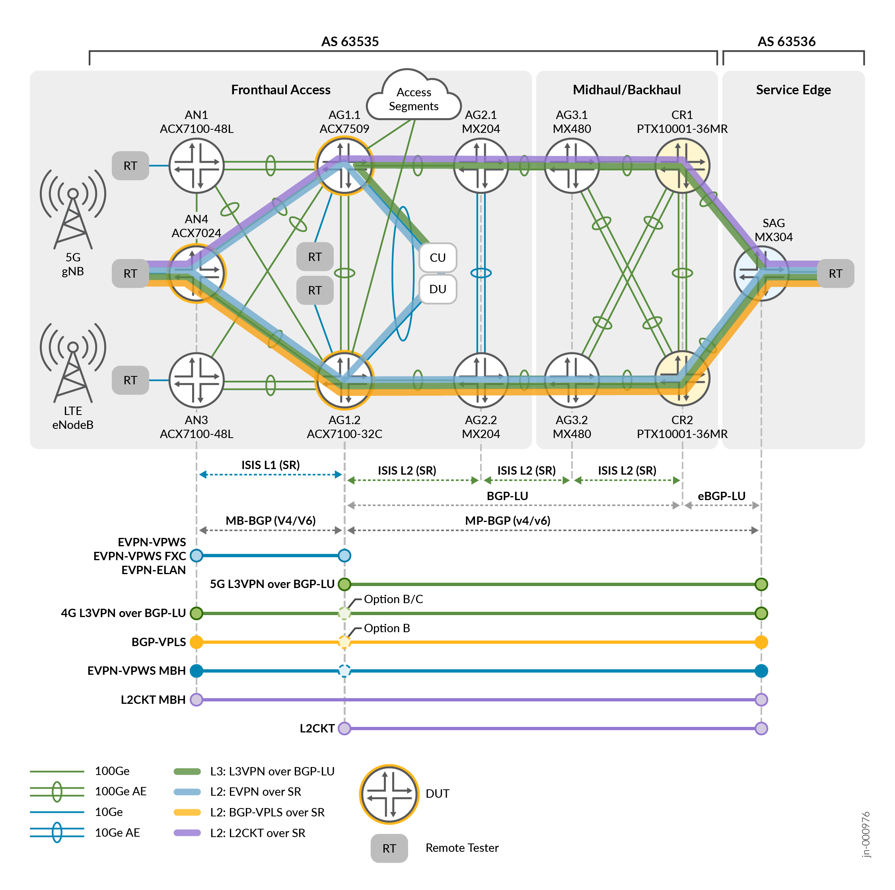
*Figure 26: Reference Architecture*

### Class of Service Operations

The CoS model differs between operators. The model created in the validation of this
profile is shared in the following table. However, this model might be modified to meet the
requirements for a given implementation based on the characteristics of the operator's
traffic patterns and goals. In the table, the higher priority queues use a shaping rate
(SR), and low-priority queues use a transmit rate (TR). For more information, see the
[Scheduling](#scheduling) section.

*Table 17: Validated Scheduling Profile*

| Forwarding Class | Queue | Priority | BW Rate | Buffer | 802.1p | DSCP | EXP | Traffic Profile Type |
|---|---|---|---|---|---|---|---|---|
| FC-SIGNALING | 7 | Strict-High | 5% SR | 5% | 110 | CS5, CS6 | 110 | OAM aggressive timers, O-RAN/3GPP C-plane |
| FC-LLQ | 6 | Low-Latency | 40% SR | 10% | 100 | CS4, AF41, AF42, AF43 | 100 | CPRI RoE, eCPRI C/U-Plane ≤2000 bytes |
| FC-REALTIME | 5 | Medium-High | 30% SR | 20% | 101 | EF | 101 | 5QI/QCI Group 1 low-latency U-plane, low-latency business. Interactive video, low latency voice |
| FC-HIGH | 4 | Low | 40% TR | 30% | 011 | CS3, AF31, AF32, AF33 | 011 | 5QI/QCI Group 2 medium latency U-plane data |
| FC-CONTROL | 3 | High | 5% SR | 5% | 111 | CS7 | 111 | Network control: OAM relaxed timers, IGP, BGP, PTP aware mode |
| FC-MEDIUM | 2 | Low | 30% TR | 20% | 010 | CS2, AF21, AF22, AF23 | 010 | 5QI/QCI Group 3 remainder GBR U-plane guaranteed business data. Video-on-demand. O-RAN/3GPP M-plane, e.g., eCPRI M-plane, other management, software upgrades |
| FC-LOW | 1 | Low | 20% TR | 10% | 001 | CS1, AF11, AF12, AF13 | 001 | high latency, guaranteed low-priority data |
| FC-BEST-EFFORT | 0 | Low | remainder | remainder | 000 | BE | 000 | 5QI/QCI Group 4 – remainder non-GBR U-plane data |

The validation includes three styles of ingress classification: fixed, behavior aggregate,
and multifield classifier. BA is packet-based, where flows are pre-marked with Layer 3
DSCP, Layer 2 802.1Q Priority Code Points (PCP), or MPLS EXP. Fixed classification is
context-based, where all traffic arriving on a specific interface is mapped to one
forwarding class. Multifield (MF) Classification allows matching criteria within packet
fields and mapping to one or more forwarding classes.

At egress, DSCP, 802.1p or EXP codepoints, and packet loss priorities (PLP) are rewritten
based on the assigned forwarding class and rewrite-rule instruction. ACX supports rewriting
the outer tag, which is the default and commonly preferred to preserve the inner (C-TAG)
802.1p bits for transparent transmission.


*Figure 27: Class of Service Operations*

The following table summarizes the three classification and rewrite operations, resulting
in the preservation of the CoS priority bits. Services include EVPN-VPWS, EVPN Flexible
Cross Connect (FXC), L2Circuit, VPLS, EVPN-ELAN, EVPN IRB Virtual Gateway Address (VGA)
active-active ESI to L3VPN, and Layer 2 Bridge Domain with Anycast IRB to L3VPN. In the
table, ✓ confirms the operation applied and passed; `--` represents scenarios not
applicable to the test conditions. **All CoS functional test case scenarios passed
successfully during execution.** Columns under Scheduler Rates Honored are LLQ (low-latency),
SH (strict-high), H (high), MH (medium-high), and L (low). For full match-condition detail
and packet captures, see the [test-report-brief.md](test-report-brief.md) and the full Test
Report.

*Table 18: CoS Summarized Results*

| Traffic Scenario | Ingress Classification Mapped to FC | Sched. LLQ | Sched. SH | Sched. H | Sched. MH | Sched. L | 802.1p Rewritten | DSCP Rewritten | EXP Rewritten | Bits Preserved E2E |
|---|---|---|---|---|---|---|---|---|---|---|
| **Fixed** — EVPN-VPWS | Queue Match ✓, EXP ✓ | ✓ | -- | -- | -- | -- | ✓ | -- | ✓ | ✓ |
| **Fixed** — EVPN-FXC | Queue Match ✓, EXP ✓ | ✓ | -- | -- | -- | -- | ✓ | -- | ✓ | ✓ |
| **Fixed** — L2Circuit | Queue Match ✓, EXP ✓ | -- | -- | -- | -- | ✓ | ✓ | -- | ✓ | ✓ |
| **Fixed** — EVPN IRB VGA with L3VPN MH | Queue Match ✓, EXP ✓ | -- | -- | -- | ✓ | -- | ✓ | -- | ✓ | ✓ |
| **Fixed** — BD IRB anycast static MAC/IP with L3VPN | Queue Match ✓, EXP ✓ | -- | -- | -- | ✓ | -- | ✓ | -- | ✓ | ✓ |
| **BA** — EVPN-VPWS | 802.1p ✓, EXP ✓ | -- | ✓ | ✓ | ✓ | ✓ | ✓ | -- | ✓ | ✓ |
| **BA** — EVPN-FXC | 802.1p ✓, EXP ✓ | -- | ✓ | ✓ | ✓ | ✓ | ✓ | -- | ✓ | ✓ |
| **BA** — EVPN-ELAN | 802.1p ✓, EXP ✓ | -- | ✓ | ✓ | ✓ | ✓ | ✓ | -- | ✓ | ✓ |
| **BA** — EVPN IRB anycast with L3VPN MH | 802.1p ✓, EXP ✓ | ✓ | ✓ | ✓ | ✓ | ✓ | ✓ | -- | ✓ | ✓ |
| **BA** — L3VPN | DSCP ✓, EXP ✓ | -- | ✓ | ✓ | ✓ | ✓ | ✓ | ✓ | ✓ | ✓ |
| **BA** — VPLS | 802.1p ✓, EXP ✓ | -- | -- | -- | -- | ✓ | -- | -- | ✓ | ✓ |
| **BA** — BD IRB anycast static MAC/IP with L3VPN | 802.1p ✓, EXP ✓ | -- | ✓ | ✓ | ✓ | ✓ | ✓ | -- | ✓ | ✓ |
| **Multifield** — Traffic Type: eCPRI | Packet Match ✓, EXP ✓ | ✓ | -- | -- | -- | -- | -- | -- | ✓ | ✓ |
| **Multifield** — Traffic Type: PTP | Packet Match ✓, EXP ✓ | ✓ | -- | -- | -- | -- | -- | -- | ✓ | ✓ |
| **Multifield** — Traffic Type: OAM | Packet Match ✓, EXP ✓ | ✓ | -- | -- | -- | -- | -- | -- | ✓ | ✓ |

As shown above, BA services included multiple traffic classes with checkmarks across
multiple priority queues. In this condition, there is contention for bandwidth resources.
By including a shaping rate to prevent priority queues from starving the low-priority
queues, you can ensure bandwidth reserves are available to service all queues. Multifield
classifiers are used to match specific traffic based on packet header information — for
example, eCPRI traffic is identified by EtherType 0xAEFE and PTP by EtherType 0x88F7. For
brevity, only one low-priority (L) queue is shown; the complete model includes four
low-priority queues. For full multifield match conditions and results including packet
captures, see the [test-report-brief.md](test-report-brief.md) and the full Test Report.

### Congestion Scenarios

The validation includes a variety of congestion scenarios, outlined in the
[Test Objectives](#test-objectives) section. Congestion constitutes one or more conditions
where traffic exceeds the configured scheduler transmit rate, shaped rate, or port speed and
results in an expected traffic loss. The major objective is to ensure critical priority
traffic is uninterrupted even during periods of congestion and that during congestion,
high-priority delay-sensitive traffic is given preference. During key congestion events, the
following observations are recorded (for the complete data set, see the full Test Report):

- Low-latency queue (FC-LLQ) is serviced ahead of strict-high, high, medium-high, medium-low,
  and low priority queues and given preferential treatment to preserve the latency budget.
  FC-LLQ does not exceed the defined allowance when a shaping rate is configured.
- Strict-high queue (FC-SIGNALING) is serviced ahead of high, medium-high, medium-low, and
  low queues. FC-SIGNALING does not exceed the defined allowance when a shaping rate is
  configured.
- High queue (FC-CONTROL) is serviced ahead of medium-high, medium-low, and low queues.
- Medium-high queue (FC-REALTIME) is serviced ahead of medium-low and low queues.
- Low-priority queues (FC-HIGH, FC-MEDIUM, and FC-LOW) are serviced based on configured
  transmit rate percentages of the remaining port speed, as WFQ when operating in excess of
  the transmit rate and bandwidth is available.
- Low-priority remainder queue (FC-BEST-EFFORT) is serviced only when unused bandwidth is
  available.
- During high congestion periods, queues operating within their configured bandwidth
  (in-profile) are guaranteed without packet drops.
- Critical eCPRI or ORAN traffic flows are assigned to priority queues and meet the given
  SLAs.
- Scheduler percentages correctly inherit the configured port-shaper as port speed.
- Queue shaping rate is deducted from total port speed with transmit-rates applied to the
  remaining bandwidth.
- Priority hierarchies are honored across and within VPN services that share common links.
- Traffic is transmitted up to 99% port speed under normal conditions where multi-level
  priorities are validated.
- Latency results are always measured in microseconds (µs).

### Latency Budget Validation

O-RAN WG9 (O-RAN.WG9.XTRP-REQ-v01.00) provides guidelines for a maximum one-way latency
budget of 100µs for the fronthaul, including fiber runs at ~4.9µs/km and transit nodes. The
JVD objective is ≤10µs per node from O-RU to O-DU. The ACX7000 platforms selected for CSR
and HSR roles consistently achieve an average transit latency of ≤4-6µs, and preserve the
objective latency budget for priority flows during congestion. The best measure of
individual device performance is shown by the standalone Topology 1; additional topologies
provide network-level insight. Three permutations for each CSR and HSR device type are
validated.

#### Topology 1a: ACX7024

Topology 1a (Figure 28) validates the performance of the ACX7024 platform in the CSR role.
The test equipment emulates O-RU and O-DU devices without self-latency. Latency is measured
in microseconds (µs).

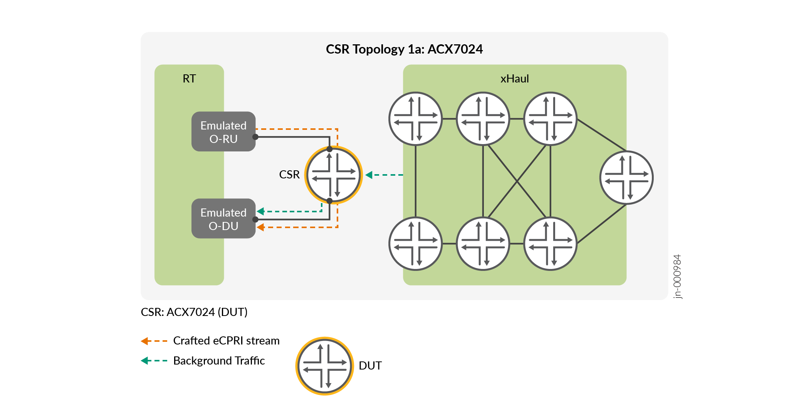
*Figure 28: Topology 1a ACX7024 Standalone DUT*

*Table 19: ACX7024 Low-Latency without Background Traffic* — no queues congested.

| Queue Name | Priority | Min (µs) | Ave (µs) | Max (µs) | Frame Size | Traffic Pattern | Port Speed |
|---|---|---|---|---|---|---|---|
| FC-LLQ | Low-Latency | 5.83 | 6.18 | 9.54 | 64 | continuous | 10G |
| FC-LLQ | Low-Latency | 5.78 | 6.13 | 9.55 | 512 | continuous | 10G |
| FC-LLQ | Low-Latency | 5.09 | 5.31 | 6.61 | 1500 | continuous | 10G |

*Table 20: ACX7024 Low-Latency with Continuous Background Traffic* (up to 99% line rate).
All queues maintained below the 10µs average goal.

| Queue Name | Priority | Min (µs) | Ave (µs) | Max (µs) | Frame Size | Pattern | Port Speed |
|---|---|---|---|---|---|---|---|
| FC-LLQ | Low-Latency | 5.09 | 5.43 | 12.95 | 64 | continuous | 10G |
| FC-SIGNALING | Strict-High | 5.09 | 6.94 | 52.72 | 64 | continuous | 10G |
| FC-CONTROL | High | 5.01 | 6.36 | 20.40 | 64 | continuous | 10G |
| FC-REALTIME | Medium-High | 5.08 | 6.24 | 24.66 | 64 | continuous | 10G |
| FC-HIGH | Low | 5.09 | 6.68 | 39.37 | 64 | continuous | 10G |
| FC-MEDIUM | Low | 5.09 | 7.05 | 51.91 | 64 | continuous | 10G |
| FC-LOW | Low | 5.09 | 6.94 | 52.72 | 64 | continuous | 10G |
| FC-LLQ | Low-Latency | 5.77 | 5.96 | 10.10 | 512 | continuous | 10G |
| FC-SIGNALING | Strict-High | 5.77 | 6.10 | 12.40 | 512 | continuous | 10G |
| FC-CONTROL | High | 5.76 | 6.26 | 17.33 | 512 | continuous | 10G |
| FC-REALTIME | Medium-High | 5.78 | 6.43 | 21.05 | 512 | continuous | 10G |
| FC-HIGH | Low | 5.78 | 6.40 | 19.31 | 512 | continuous | 10G |
| FC-MEDIUM | Low | 5.78 | 6.10 | 25.61 | 512 | continuous | 10G |
| FC-LOW | Low | 5.78 | 6.32 | 23.38 | 512 | continuous | 10G |
| FC-LLQ | Low-Latency | 5.83 | 6.06 | 11.23 | 1500 | continuous | 10G |
| FC-SIGNALING | Strict-High | 5.84 | 6.08 | 13.48 | 1500 | continuous | 10G |
| FC-CONTROL | High | 5.84 | 6.10 | 16.25 | 1500 | continuous | 10G |
| FC-REALTIME | Medium-High | 5.81 | 6.36 | 22.66 | 1500 | continuous | 10G |
| FC-HIGH | Low | 5.87 | 6.07 | 34.26 | 1500 | continuous | 10G |
| FC-MEDIUM | Low | 5.87 | 6.06 | 30.42 | 1500 | continuous | 10G |
| FC-LOW | Low | 5.87 | 6.07 | 32.43 | 1500 | continuous | 10G |

*Table 21: ACX7024 Low-Latency with Burst Background Traffic.* All queues well below the
10µs average goal.

| Queue Name | Priority | Min (µs) | Ave (µs) | Max (µs) | Frame Size | Pattern | Port Speed |
|---|---|---|---|---|---|---|---|
| FC-LLQ | Low-Latency | 5.82 | 5.91 | 6.38 | 64 | burst | 10G |
| FC-SIGNALING | Strict-High | 5.82 | 5.99 | 9.69 | 64 | burst | 10G |
| FC-CONTROL | High | 5.86 | 5.91 | 7.61 | 64 | burst | 10G |
| FC-REALTIME | Medium-High | 5.83 | 5.91 | 8.18 | 64 | burst | 10G |
| FC-HIGH | Low | 5.87 | 5.91 | 6.71 | 64 | burst | 10G |
| FC-MEDIUM | Low | 5.87 | 5.91 | 6.46 | 64 | burst | 10G |
| FC-LOW | Low | 5.87 | 5.91 | 9.13 | 64 | burst | 10G |
| FC-LLQ | Low-Latency | 5.77 | 5.80 | 6.21 | 512 | burst | 10G |
| FC-SIGNALING | Strict-High | 5.77 | 5.87 | 11.39 | 512 | burst | 10G |
| FC-CONTROL | High | 5.69 | 5.87 | 7.72 | 512 | burst | 10G |
| FC-REALTIME | Medium-High | 5.77 | 5.87 | 9.55 | 512 | burst | 10G |
| FC-HIGH | Low | 5.77 | 5.87 | 6.45 | 512 | burst | 10G |
| FC-MEDIUM | Low | 5.77 | 5.87 | 6.69 | 512 | burst | 10G |
| FC-LOW | Low | 5.77 | 5.87 | 6.64 | 512 | burst | 10G |
| FC-LLQ | Low-Latency | 5.08 | 5.12 | 6.31 | 1500 | burst | 10G |
| FC-SIGNALING | Strict-High | 5.08 | 5.30 | 11.10 | 1500 | burst | 10G |
| FC-CONTROL | High | 5.00 | 5.30 | 8.95 | 1500 | burst | 10G |
| FC-REALTIME | Medium-High | 5.08 | 5.30 | 8.72 | 1500 | burst | 10G |
| FC-HIGH | Low | 5.08 | 5.30 | 6.79 | 1500 | burst | 10G |
| FC-MEDIUM | Low | 5.08 | 5.30 | 8.35 | 1500 | burst | 10G |
| FC-LOW | Low | 5.08 | 5.30 | 6.57 | 1500 | burst | 10G |

*Table 22: ACX7024 Low-Latency with Congestion Traffic* — strict-high queue oversubscribed to
the point of discard. LLQ average latency ≤6µs, well below the 10µs goal.

| Queue Name | Priority | Min (µs) | Ave (µs) | Max (µs) | Frame Size | Pattern | Congested Queue |
|---|---|---|---|---|---|---|---|
| FC-LLQ | Low-Latency | 5.83 | 6.17 | 12.44 | 64 | continuous | Strict-High |
| FC-LLQ | Low-Latency | 5.78 | 6.02 | 10.95 | 512 | continuous | Strict-High |
| FC-LLQ | Low-Latency | 5.09 | 5.26 | 11.34 | 1500 | continuous | Strict-High |
| FC-LLQ | Low-Latency | 5.09 | 5.16 | 11.39 | 64 | burst | Strict-High |
| FC-LLQ | Low-Latency | 5.78 | 5.99 | 11.00 | 512 | burst | Strict-High |
| FC-LLQ | Low-Latency | 5.84 | 6.00 | 12.44 | 1500 | burst | Strict-High |

#### Topology 1b: ACX7100-32C

Topology 1b (Figure 29) executes the same scenarios for the ACX7100-32C in the HSR role.

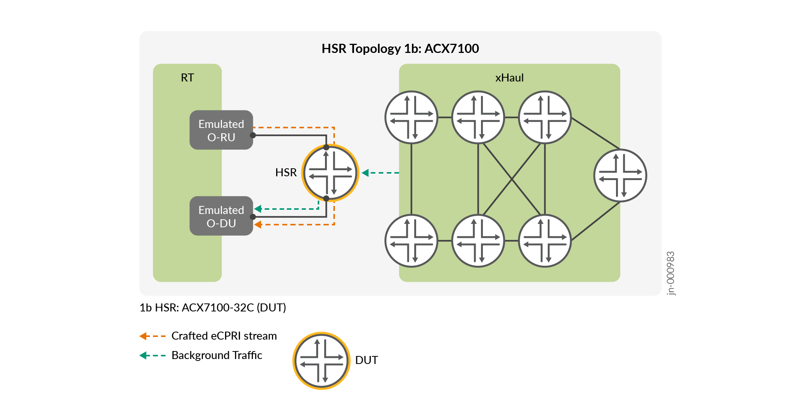
*Figure 29: Topology 1b ACX7100-32C Standalone DUT*

*Table 23: ACX7100-32C Low-Latency without Background Traffic.*

| Queue Name | Priority | Min (µs) | Ave (µs) | Max (µs) | Frame Size | Pattern | Port Speed |
|---|---|---|---|---|---|---|---|
| FC-LLQ | Low-Latency | 4.35 | 4.44 | 7.82 | 64 | continuous | 10G |
| FC-LLQ | Low-Latency | 5.05 | 5.18 | 5.57 | 512 | continuous | 10G |
| FC-LLQ | Low-Latency | 4.68 | 4.88 | 5.86 | 1500 | continuous | 10G |

*Table 24: ACX7100-32C Low-Latency with Continuous Background Traffic.* All queues below 10µs
average, LLQ operating <6µs.

| Queue Name | Priority | Min (µs) | Ave (µs) | Max (µs) | Frame Size | Pattern | Port Speed |
|---|---|---|---|---|---|---|---|
| FC-LLQ | Low-Latency | 4.57 | 4.78 | 9.30 | 64 | continuous | 10G |
| FC-SIGNALING | Strict-High | 4.57 | 4.83 | 11.84 | 64 | continuous | 10G |
| FC-CONTROL | High | 4.58 | 4.86 | 14.89 | 64 | continuous | 10G |
| FC-REALTIME | Medium-High | 4.57 | 5.20 | 21.32 | 64 | continuous | 10G |
| FC-HIGH | Low | 4.58 | 4.94 | 27.61 | 64 | continuous | 10G |
| FC-MEDIUM | Low | 4.61 | 4.96 | 31.12 | 64 | continuous | 10G |
| FC-LOW | Low | 4.58 | 4.95 | 25.48 | 64 | continuous | 10G |
| FC-LLQ | Low-Latency | 5.29 | 5.53 | 8.85 | 512 | continuous | 10G |
| FC-SIGNALING | Strict-High | 5.29 | 5.70 | 12.28 | 512 | continuous | 10G |
| FC-CONTROL | High | 5.34 | 5.83 | 18.32 | 512 | continuous | 10G |
| FC-REALTIME | Medium-High | 5.29 | 5.95 | 17.89 | 512 | continuous | 10G |
| FC-HIGH | Low | 5.29 | 5.94 | 28.39 | 512 | continuous | 10G |
| FC-MEDIUM | Low | 5.34 | 6.47 | 21.83 | 512 | continuous | 10G |
| FC-LOW | Low | 5.35 | 5.68 | 28.15 | 512 | continuous | 10G |
| FC-LLQ | Low-Latency | 4.91 | 5.29 | 10.27 | 1500 | continuous | 10G |
| FC-SIGNALING | Strict-High | 4.91 | 5.67 | 15.49 | 1500 | continuous | 10G |
| FC-CONTROL | High | 4.96 | 6.14 | 18.20 | 1500 | continuous | 10G |
| FC-REALTIME | Medium-High | 4.91 | 6.03 | 24.50 | 1500 | continuous | 10G |
| FC-HIGH | Low | 4.96 | 6.45 | 39.09 | 1500 | continuous | 10G |
| FC-MEDIUM | Low | 4.96 | 7.52 | 50.54 | 1500 | continuous | 10G |
| FC-LOW | Low | 4.96 | 6.76 | 55.82 | 1500 | continuous | 10G |

*Table 25: ACX7100-32C Low-Latency with Burst Background Traffic.* All queues transmitted
<6µs.

| Queue Name | Priority | Min (µs) | Ave (µs) | Max (µs) | Frame Size | Pattern | Port Speed |
|---|---|---|---|---|---|---|---|
| FC-LLQ | Low-Latency | 4.61 | 4.65 | 4.79 | 64 | burst | 10G |
| FC-SIGNALING | Strict-High | 4.61 | 4.67 | 5.04 | 64 | burst | 10G |
| FC-CONTROL | High | 4.61 | 4.67 | 5.04 | 64 | burst | 10G |
| FC-REALTIME | Medium-High | 4.61 | 4.66 | 5.04 | 64 | burst | 10G |
| FC-HIGH | Low | 4.61 | 4.67 | 5.04 | 64 | burst | 10G |
| FC-MEDIUM | Low | 4.61 | 4.67 | 5.04 | 64 | burst | 10G |
| FC-LOW | Low | 4.61 | 4.67 | 5.04 | 64 | burst | 10G |
| FC-LLQ | Low-Latency | 5.31 | 5.38 | 5.49 | 512 | burst | 10G |
| FC-SIGNALING | Strict-High | 5.31 | 5.42 | 8.41 | 512 | burst | 10G |
| FC-CONTROL | High | 5.31 | 5.42 | 5.78 | 512 | burst | 10G |
| FC-REALTIME | Medium-High | 5.31 | 5.42 | 7.82 | 512 | burst | 10G |
| FC-HIGH | Low | 5.31 | 5.42 | 5.74 | 512 | burst | 10G |
| FC-MEDIUM | Low | 5.31 | 5.42 | 7.73 | 512 | burst | 10G |
| FC-LOW | Low | 5.31 | 5.42 | 5.74 | 512 | burst | 10G |
| FC-LLQ | Low-Latency | 4.94 | 5.01 | 5.87 | 1500 | burst | 10G |
| FC-SIGNALING | Strict-High | 4.94 | 5.13 | 7.81 | 1500 | burst | 10G |
| FC-CONTROL | High | 4.94 | 5.13 | 8.42 | 1500 | burst | 10G |
| FC-REALTIME | Medium-High | 4.94 | 5.13 | 8.55 | 1500 | burst | 10G |
| FC-HIGH | Low | 4.94 | 5.13 | 5.69 | 1500 | burst | 10G |
| FC-MEDIUM | Low | 4.94 | 5.13 | 5.65 | 1500 | burst | 10G |
| FC-LOW | Low | 4.94 | 5.13 | 5.76 | 1500 | burst | 10G |

*Table 26: ACX7100-32C Low-Latency with Congestion Traffic* — strict-high oversubscribed. LLQ
budget preserved at ~4-5µs.

| Queue Name | Priority | Min (µs) | Ave (µs) | Max (µs) | Frame Size | Pattern | Congested Queue |
|---|---|---|---|---|---|---|---|
| FC-LLQ | Low-Latency | 4.58 | 4.89 | 11.04 | 64 | continuous | Strict-High |
| FC-LLQ | Low-Latency | 5.34 | 5.57 | 11.54 | 512 | continuous | Strict-High |
| FC-LLQ | Low-Latency | 4.93 | 5.13 | 11.46 | 1500 | continuous | Strict-High |
| FC-LLQ | Low-Latency | 4.59 | 4.70 | 11.02 | 64 | burst | Strict-High |
| FC-LLQ | Low-Latency | 5.30 | 5.50 | 10.14 | 512 | burst | Strict-High |
| FC-LLQ | Low-Latency | 4.92 | 5.03 | 11.09 | 1500 | burst | Strict-High |

#### Topology 1c: ACX7509

Topology 1c (Figure 30) executes the same scenarios for the ACX7509 in the HSR role.

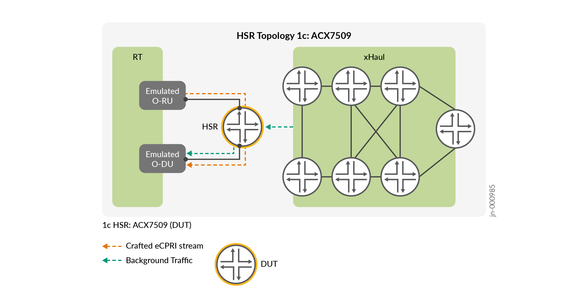
*Figure 30: Topology 1c ACX7509 Standalone DUT*

*Table 27: ACX7509 Low-Latency without Background Traffic.*

| Queue Name | Priority | Min (µs) | Ave (µs) | Max (µs) | Frame Size | Pattern | Port Speed |
|---|---|---|---|---|---|---|---|
| FC-LLQ | Low-Latency | 4.72 | 5.16 | 8.49 | 64 | continuous | 10G |
| FC-LLQ | Low-Latency | 5.30 | 6.12 | 9.22 | 512 | continuous | 10G |
| FC-LLQ | Low-Latency | 5.10 | 6.03 | 9.50 | 1500 | continuous | 10G |

*Table 28: ACX7509 Low-Latency with Continuous Background Traffic.* All priority queues below
10µs average, LLQ ≤6µs.

| Queue Name | Priority | Min (µs) | Ave (µs) | Max (µs) | Frame Size | Pattern | Port Speed |
|---|---|---|---|---|---|---|---|
| FC-LLQ | Low-Latency | 4.93 | 5.24 | 9.85 | 64 | continuous | 10G |
| FC-SIGNALING | Strict-High | 4.95 | 5.31 | 12.62 | 64 | continuous | 10G |
| FC-CONTROL | High | 4.97 | 5.34 | 15.32 | 64 | continuous | 10G |
| FC-REALTIME | Medium-High | 4.92 | 6.04 | 21.86 | 64 | continuous | 10G |
| FC-HIGH | Low | 4.97 | 5.41 | 36.48 | 64 | continuous | 10G |
| FC-MEDIUM | Low | 4.97 | 5.47 | 32.47 | 64 | continuous | 10G |
| FC-LOW | Low | 4.94 | 5.43 | 36.44 | 64 | continuous | 10G |
| FC-LLQ | Low-Latency | 5.69 | 6.18 | 10.24 | 512 | continuous | 10G |
| FC-SIGNALING | Strict-High | 5.69 | 6.54 | 14.42 | 512 | continuous | 10G |
| FC-CONTROL | High | 5.72 | 6.65 | 19.17 | 512 | continuous | 10G |
| FC-REALTIME | Medium-High | 5.69 | 7.69 | 22.86 | 512 | continuous | 10G |
| FC-HIGH | Low | 5.69 | 7.32 | 37.08 | 512 | continuous | 10G |
| FC-MEDIUM | Low | 5.73 | 8.01 | 35.80 | 512 | continuous | 10G |
| FC-LOW | Low | 5.73 | 7.28 | 36.19 | 512 | continuous | 10G |
| FC-LLQ | Low-Latency | 5.34 | 5.91 | 12.29 | 1500 | continuous | 10G |
| FC-SIGNALING | Strict-High | 5.32 | 6.75 | 16.29 | 1500 | continuous | 10G |
| FC-CONTROL | High | 5.34 | 7.28 | 18.77 | 1500 | continuous | 10G |
| FC-REALTIME | Medium-High | 5.34 | 8.00 | 26.09 | 1500 | continuous | 10G |
| FC-HIGH | Low | 5.34 | 8.85 | 45.10 | 1500 | continuous | 10G |
| FC-MEDIUM | Low | 5.34 | 10.19 | 57.32 | 1500 | continuous | 10G |
| FC-LOW | Low | 5.34 | 9.30 | 60.16 | 1500 | continuous | 10G |

*Table 29: ACX7509 Low-Latency with Burst Background Traffic.* All queues within ≤6µs.

| Queue Name | Priority | Min (µs) | Ave (µs) | Max (µs) | Frame Size | Pattern | Port Speed |
|---|---|---|---|---|---|---|---|
| FC-LLQ | Low-Latency | 4.92 | 5.01 | 5.12 | 64 | burst | 10G |
| FC-SIGNALING | Strict-High | 4.92 | 5.07 | 8.70 | 64 | burst | 10G |
| FC-CONTROL | High | 4.92 | 5.07 | 9.44 | 64 | burst | 10G |
| FC-REALTIME | Medium-High | 4.92 | 5.27 | 8.71 | 64 | burst | 10G |
| FC-HIGH | Low | 4.92 | 5.10 | 8.70 | 64 | burst | 10G |
| FC-MEDIUM | Low | 4.92 | 5.10 | 8.70 | 64 | burst | 10G |
| FC-LOW | Low | 4.92 | 5.10 | 8.70 | 64 | burst | 10G |
| FC-LLQ | Low-Latency | 5.71 | 5.75 | 5.85 | 512 | burst | 10G |
| FC-SIGNALING | Strict-High | 5.71 | 6.00 | 9.73 | 512 | burst | 10G |
| FC-CONTROL | High | 5.71 | 6.00 | 11.56 | 512 | burst | 10G |
| FC-REALTIME | Medium-High | 5.71 | 6.19 | 10.54 | 512 | burst | 10G |
| FC-HIGH | Low | 5.71 | 6.00 | 9.43 | 512 | burst | 10G |
| FC-MEDIUM | Low | 5.71 | 6.00 | 9.43 | 512 | burst | 10G |
| FC-LOW | Low | 5.71 | 6.00 | 9.43 | 512 | burst | 10G |
| FC-LLQ | Low-Latency | 5.30 | 5.38 | 7.37 | 1500 | burst | 10G |
| FC-SIGNALING | Strict-High | 5.30 | 6.10 | 9.07 | 1500 | burst | 10G |
| FC-CONTROL | High | 5.30 | 6.10 | 9.21 | 1500 | burst | 10G |
| FC-REALTIME | Medium-High | 5.30 | 6.13 | 12.20 | 1500 | burst | 10G |
| FC-HIGH | Low | 5.30 | 6.10 | 9.06 | 1500 | burst | 10G |
| FC-MEDIUM | Low | 5.30 | 6.10 | 11.82 | 1500 | burst | 10G |
| FC-LOW | Low | 5.30 | 6.10 | 9.02 | 1500 | burst | 10G |

*Table 30: ACX7509 Low-Latency with Congestion Traffic* — strict-high oversubscribed. LLQ
budget preserved <6µs.

| Queue Name | Priority | Min (µs) | Ave (µs) | Max (µs) | Frame Size | Pattern | Congested Queue |
|---|---|---|---|---|---|---|---|
| FC-LLQ | Low-Latency | 4.93 | 5.26 | 11.40 | 64 | continuous | Strict-High |
| FC-LLQ | Low-Latency | 5.71 | 5.94 | 11.89 | 512 | continuous | Strict-High |
| FC-LLQ | Low-Latency | 5.30 | 5.52 | 11.50 | 1500 | continuous | Strict-High |
| FC-LLQ | Low-Latency | 4.94 | 5.05 | 11.36 | 64 | burst | Strict-High |
| FC-LLQ | Low-Latency | 5.67 | 5.91 | 10.52 | 512 | burst | Strict-High |
| FC-LLQ | Low-Latency | 5.32 | 5.40 | 11.48 | 1500 | burst | Strict-High |

### eCPRI Validation

Validation is performed with real eCPRI traffic patterns, O-RAN conformance testing, and
handling of eCPRI message types. **For all eCPRI and O-RAN conformance validation results
with flow data and measurements, see the [test-report-brief.md](test-report-brief.md) and
the full Test Report.** This section captures the most critical data to explain network and
device performance. The O-RAN and eCPRI test scenarios (eCPRI O-RAN Emulation, O-RAN
Conformance, Crafted eCPRI O-RAN, eCPRI Services Validation, and eCPRI message Types 4–7)
are described in the [O-RAN and eCPRI Emulation](#o-ran-and-ecpri-emulation) section.

#### Topology 1: Latency Performance with eCPRI

Real eCPRI traffic is forwarded across Topology 1a (ACX7024), 1b (ACX7100-32C), and 1c
(ACX7509) for 10GbE and 100GbE port speeds with continuous or burst patterns. In all cases
the average latency is below the 10µs objective, the majority ≤6µs.

*Table 31: eCPRI ORAN Latency Performance without Congestion.*

| DUT | Scenario | Min (µs) | Ave (µs) | Max (µs) | Frame Size | Port Speed | Pattern | Traffic Type |
|---|---|---|---|---|---|---|---|---|
| ACX7024 | Non-Congested | 5.71 | 5.86 | 12.72 | 64 | 10GbE | Continuous | eCPRI-ORAN |
| ACX7024 | Non-Congested | 5.56 | 5.76 | 12.33 | 512 | 10GbE | Continuous | eCPRI-ORAN |
| ACX7024 | Non-Congested | 4.88 | 5.20 | 12.45 | 1500 | 10GbE | Continuous | eCPRI-ORAN |
| ACX7024 | Non-Congested | 5.70 | 5.82 | 6.36 | 64 | 10GbE | Burst | eCPRI-ORAN |
| ACX7024 | Non-Congested | 5.45 | 5.68 | 6.40 | 512 | 10GbE | Burst | eCPRI-ORAN |
| ACX7024 | Non-Congested | 4.95 | 4.99 | 6.45 | 1500 | 10GbE | Burst | eCPRI-ORAN |
| ACX7024 | Non-Congested | 5.71 | 6.01 | 6.55 | 64 | 100GbE | Continuous | eCPRI-ORAN |
| ACX7024 | Non-Congested | 5.74 | 5.85 | 6.36 | 512 | 100GbE | Continuous | eCPRI-ORAN |
| ACX7024 | Non-Congested | 5.78 | 5.80 | 6.43 | 1500 | 100GbE | Continuous | eCPRI-ORAN |
| ACX7024 | Non-Congested | 5.74 | 6.00 | 6.54 | 64 | 100GbE | Burst | eCPRI-ORAN |
| ACX7024 | Non-Congested | 5.73 | 5.84 | 6.35 | 512 | 100GbE | Burst | eCPRI-ORAN |
| ACX7024 | Non-Congested | 5.77 | 5.79 | 6.40 | 1500 | 100GbE | Burst | eCPRI-ORAN |
| ACX7100 | Non-Congested | 4.94 | 5.81 | 12.40 | 64 | 10GbE | Continuous | eCPRI-ORAN |
| ACX7100 | Non-Congested | 5.68 | 6.36 | 12.40 | 512 | 10GbE | Continuous | eCPRI-ORAN |
| ACX7100 | Non-Congested | 5.33 | 6.26 | 11.81 | 1500 | 10GbE | Continuous | eCPRI-ORAN |
| ACX7100 | Non-Congested | 4.91 | 4.98 | 5.15 | 64 | 10GbE | Burst | eCPRI-ORAN |
| ACX7100 | Non-Congested | 5.69 | 5.77 | 5.92 | 512 | 10GbE | Burst | eCPRI-ORAN |
| ACX7100 | Non-Congested | 5.33 | 5.38 | 6.29 | 1500 | 10GbE | Burst | eCPRI-ORAN |
| ACX7100 | Non-Congested | 4.44 | 4.47 | 4.71 | 64 | 100GbE | Continuous | eCPRI-ORAN |
| ACX7100 | Non-Congested | 4.47 | 4.53 | 4.69 | 512 | 100GbE | Continuous | eCPRI-ORAN |
| ACX7100 | Non-Congested | 4.44 | 4.60 | 4.71 | 1500 | 100GbE | Continuous | eCPRI-ORAN |
| ACX7100 | Non-Congested | 4.43 | 4.60 | 4.71 | 64 | 100GbE | Burst | eCPRI-ORAN |
| ACX7100 | Non-Congested | 4.47 | 4.53 | 4.73 | 512 | 100GbE | Burst | eCPRI-ORAN |
| ACX7100 | Non-Congested | 4.44 | 4.46 | 4.70 | 1500 | 100GbE | Burst | eCPRI-ORAN |
| ACX7509 | Non-Congested | 4.59 | 4.66 | 8.55 | 64 | 10GbE | Continuous | eCPRI-ORAN |
| ACX7509 | Non-Congested | 5.30 | 5.43 | 8.92 | 512 | 10GbE | Continuous | eCPRI-ORAN |
| ACX7509 | Non-Congested | 4.92 | 5.12 | 10.40 | 1500 | 10GbE | Continuous | eCPRI-ORAN |
| ACX7509 | Non-Congested | 4.59 | 4.63 | 4.82 | 64 | 10GbE | Burst | eCPRI-ORAN |
| ACX7509 | Non-Congested | 4.93 | 5.16 | 5.88 | 512 | 10GbE | Burst | eCPRI-ORAN |
| ACX7509 | Non-Congested | 4.93 | 5.01 | 5.88 | 1500 | 10GbE | Burst | eCPRI-ORAN |
| ACX7509 | Non-Congested | 5.71 | 6.01 | 6.55 | 64 | 100GbE | Continuous | eCPRI-ORAN |
| ACX7509 | Non-Congested | 5.74 | 5.85 | 6.36 | 512 | 100GbE | Continuous | eCPRI-ORAN |
| ACX7509 | Non-Congested | 5.78 | 5.80 | 6.43 | 1500 | 100GbE | Continuous | eCPRI-ORAN |
| ACX7509 | Non-Congested | 4.12 | 4.37 | 4.47 | 64 | 100GbE | Burst | eCPRI-ORAN |
| ACX7509 | Non-Congested | 4.19 | 4.24 | 4.55 | 512 | 100GbE | Burst | eCPRI-ORAN |
| ACX7509 | Non-Congested | 4.15 | 4.16 | 4.58 | 1500 | 100GbE | Burst | eCPRI-ORAN |

*Table 32: eCPRI ORAN Latency Performance with 1 Queue Congested* — strict-high
oversubscribed and dropping traffic. Average latency preserved below 10µs; as port speed
increases the congestion delay decreases.

| DUT | Scenario | Min (µs) | Ave (µs) | Max (µs) | Frame Size | Port Speed | Pattern | Traffic Type |
|---|---|---|---|---|---|---|---|---|
| ACX7024 | 1Q-Congested | 5.88 | 7.24 | 15.96 | 64 | 10GbE | Continuous | eCPRI-ORAN |
| ACX7024 | 1Q-Congested | 6.18 | 7.50 | 16.27 | 512 | 10GbE | Continuous | eCPRI-ORAN |
| ACX7024 | 1Q-Congested | 6.28 | 7.78 | 19.60 | 1500 | 10GbE | Continuous | eCPRI-ORAN |
| ACX7024 | 1Q-Congested | 5.69 | 6.07 | 12.23 | 64 | 10GbE | Burst | eCPRI-ORAN |
| ACX7024 | 1Q-Congested | 5.64 | 5.87 | 10.56 | 512 | 10GbE | Burst | eCPRI-ORAN |
| ACX7024 | 1Q-Congested | 4.95 | 5.12 | 12.88 | 1500 | 10GbE | Burst | eCPRI-ORAN |
| ACX7024 | 1Q-Congested | 5.70 | 6.02 | 7.02 | 64 | 100GbE | Continuous | eCPRI-ORAN |
| ACX7024 | 1Q-Congested | 5.72 | 5.87 | 6.84 | 512 | 100GbE | Continuous | eCPRI-ORAN |
| ACX7024 | 1Q-Congested | 5.78 | 5.81 | 6.89 | 1500 | 100GbE | Continuous | eCPRI-ORAN |
| ACX7024 | 1Q-Congested | 5.77 | 6.02 | 6.95 | 64 | 100GbE | Burst | eCPRI-ORAN |
| ACX7024 | 1Q-Congested | 5.71 | 5.86 | 6.86 | 512 | 100GbE | Burst | eCPRI-ORAN |
| ACX7024 | 1Q-Congested | 5.77 | 5.80 | 6.83 | 1500 | 100GbE | Burst | eCPRI-ORAN |
| ACX7100 | 1Q-Congested | 5.03 | 7.16 | 16.29 | 64 | 10GbE | Continuous | eCPRI-ORAN |
| ACX7100 | 1Q-Congested | 6.14 | 7.69 | 15.61 | 512 | 10GbE | Continuous | eCPRI-ORAN |
| ACX7100 | 1Q-Congested | 6.49 | 8.61 | 21.39 | 1500 | 10GbE | Continuous | eCPRI-ORAN |
| ACX7100 | 1Q-Congested | 4.91 | 5.28 | 11.45 | 64 | 10GbE | Burst | eCPRI-ORAN |
| ACX7100 | 1Q-Congested | 5.70 | 5.96 | 12.00 | 512 | 10GbE | Burst | eCPRI-ORAN |
| ACX7100 | 1Q-Congested | 5.30 | 5.42 | 12.01 | 1500 | 10GbE | Burst | eCPRI-ORAN |
| ACX7100 | 1Q-Congested | 4.44 | 4.49 | 5.08 | 64 | 100GbE | Continuous | eCPRI-ORAN |
| ACX7100 | 1Q-Congested | 4.47 | 4.55 | 5.07 | 512 | 100GbE | Continuous | eCPRI-ORAN |
| ACX7100 | 1Q-Congested | 4.42 | 4.61 | 5.48 | 1500 | 100GbE | Continuous | eCPRI-ORAN |
| ACX7100 | 1Q-Congested | 4.41 | 4.61 | 5.41 | 64 | 100GbE | Burst | eCPRI-ORAN |
| ACX7100 | 1Q-Congested | 4.46 | 4.54 | 5.07 | 512 | 100GbE | Burst | eCPRI-ORAN |
| ACX7100 | 1Q-Congested | 4.44 | 4.48 | 5.23 | 1500 | 100GbE | Burst | eCPRI-ORAN |
| ACX7509 | 1Q-Congested | 4.64 | 6.63 | 14.89 | 64 | 10GbE | Continuous | eCPRI-ORAN |
| ACX7509 | 1Q-Congested | 5.71 | 7.14 | 14.85 | 512 | 10GbE | Continuous | eCPRI-ORAN |
| ACX7509 | 1Q-Congested | 6.09 | 8.04 | 20.25 | 1500 | 10GbE | Continuous | eCPRI-ORAN |
| ACX7509 | 1Q-Congested | 4.59 | 4.92 | 11.10 | 64 | 10GbE | Burst | eCPRI-ORAN |
| ACX7509 | 1Q-Congested | 5.30 | 5.57 | 11.17 | 512 | 10GbE | Burst | eCPRI-ORAN |
| ACX7509 | 1Q-Congested | 4.59 | 4.68 | 12.39 | 1500 | 10GbE | Burst | eCPRI-ORAN |
| ACX7509 | 1Q-Congested | 4.13 | 4.17 | 4.94 | 64 | 100GbE | Continuous | eCPRI-ORAN |
| ACX7509 | 1Q-Congested | 4.18 | 4.24 | 4.76 | 512 | 100GbE | Continuous | eCPRI-ORAN |
| ACX7509 | 1Q-Congested | 4.10 | 4.36 | 4.96 | 1500 | 100GbE | Continuous | eCPRI-ORAN |
| ACX7509 | 1Q-Congested | 4.12 | 4.37 | 5.02 | 64 | 100GbE | Burst | eCPRI-ORAN |
| ACX7509 | 1Q-Congested | 4.19 | 4.25 | 4.87 | 512 | 100GbE | Burst | eCPRI-ORAN |
| ACX7509 | 1Q-Congested | 4.15 | 4.19 | 5.07 | 1500 | 100GbE | Burst | eCPRI-ORAN |

*Table 33: eCPRI ORAN Latency Performance with Heavy Congestion (2Q)* — both strict-high and
high queues oversubscribed and dropping traffic. Latency preserved below the 10µs objective in
all cases; measurements consistently 4-5µs as congestion increases at higher port speeds.

| DUT | Scenario | Min (µs) | Ave (µs) | Max (µs) | Frame Size | Port Speed | Pattern | Traffic Type |
|---|---|---|---|---|---|---|---|---|
| ACX7024 | 2Q-Congested | 5.90 | 7.71 | 22.88 | 64 | 10GbE | Continuous | eCPRI-ORAN |
| ACX7024 | 2Q-Congested | 6.18 | 7.37 | 16.89 | 512 | 10GbE | Continuous | eCPRI-ORAN |
| ACX7024 | 2Q-Congested | 6.29 | 7.39 | 23.58 | 1500 | 10GbE | Continuous | eCPRI-ORAN |
| ACX7024 | 2Q-Congested | 5.70 | 6.52 | 16.33 | 64 | 10GbE | Burst | eCPRI-ORAN |
| ACX7024 | 2Q-Congested | 5.64 | 6.17 | 14.18 | 512 | 10GbE | Burst | eCPRI-ORAN |
| ACX7024 | 2Q-Congested | 4.95 | 5.35 | 15.74 | 1500 | 10GbE | Burst | eCPRI-ORAN |
| ACX7024 | 2Q-Congested | 5.77 | 6.07 | 7.55 | 64 | 100GbE | Continuous | eCPRI-ORAN |
| ACX7024 | 2Q-Congested | 5.71 | 5.93 | 7.23 | 512 | 100GbE | Continuous | eCPRI-ORAN |
| ACX7024 | 2Q-Congested | 5.78 | 5.85 | 7.17 | 1500 | 100GbE | Continuous | eCPRI-ORAN |
| ACX7024 | 2Q-Congested | 5.77 | 6.06 | 7.54 | 64 | 100GbE | Burst | eCPRI-ORAN |
| ACX7024 | 2Q-Congested | 5.70 | 5.92 | 7.15 | 512 | 100GbE | Burst | eCPRI-ORAN |
| ACX7024 | 2Q-Congested | 5.77 | 5.84 | 7.16 | 1500 | 100GbE | Burst | eCPRI-ORAN |
| ACX7100 | 2Q-Congested | 4.98 | 7.09 | 22.41 | 64 | 10GbE | Continuous | eCPRI-ORAN |
| ACX7100 | 2Q-Congested | 6.10 | 7.40 | 16.54 | 512 | 10GbE | Continuous | eCPRI-ORAN |
| ACX7100 | 2Q-Congested | 6.49 | 8.55 | 26.38 | 1500 | 10GbE | Continuous | eCPRI-ORAN |
| ACX7100 | 2Q-Congested | 4.91 | 5.81 | 15.77 | 64 | 10GbE | Burst | eCPRI-ORAN |
| ACX7100 | 2Q-Congested | 5.70 | 6.31 | 13.40 | 512 | 10GbE | Burst | eCPRI-ORAN |
| ACX7100 | 2Q-Congested | 5.33 | 5.97 | 16.20 | 1500 | 10GbE | Burst | eCPRI-ORAN |
| ACX7100 | 2Q-Congested | 4.41 | 4.65 | 5.84 | 64 | 100GbE | Continuous | eCPRI-ORAN |
| ACX7100 | 2Q-Congested | 4.47 | 4.58 | 5.44 | 512 | 100GbE | Continuous | eCPRI-ORAN |
| ACX7100 | 2Q-Congested | 4.44 | 4.52 | 5.68 | 1500 | 100GbE | Continuous | eCPRI-ORAN |
| ACX7100 | 2Q-Congested | 4.12 | 4.37 | 5.02 | 64 | 100GbE | Burst | eCPRI-ORAN |
| ACX7100 | 2Q-Congested | 4.19 | 4.25 | 4.87 | 512 | 100GbE | Burst | eCPRI-ORAN |
| ACX7100 | 2Q-Congested | 4.15 | 4.19 | 5.07 | 1500 | 100GbE | Burst | eCPRI-ORAN |
| ACX7509 | 2Q-Congested | 4.60 | 6.54 | 19.92 | 64 | 10GbE | Continuous | eCPRI-ORAN |
| ACX7509 | 2Q-Congested | 5.69 | 6.93 | 15.62 | 512 | 10GbE | Continuous | eCPRI-ORAN |
| ACX7509 | 2Q-Congested | 6.10 | 7.70 | 21.52 | 1500 | 10GbE | Continuous | eCPRI-ORAN |
| ACX7509 | 2Q-Congested | 4.59 | 5.46 | 15.42 | 64 | 10GbE | Burst | eCPRI-ORAN |
| ACX7509 | 2Q-Congested | 5.30 | 5.88 | 15.93 | 512 | 10GbE | Burst | eCPRI-ORAN |
| ACX7509 | 2Q-Congested | 4.93 | 5.60 | 15.82 | 1500 | 10GbE | Burst | eCPRI-ORAN |
| ACX7509 | 2Q-Congested | 4.12 | 4.39 | 5.52 | 64 | 100GbE | Continuous | eCPRI-ORAN |
| ACX7509 | 2Q-Congested | 4.18 | 4.26 | 5.16 | 512 | 100GbE | Continuous | eCPRI-ORAN |
| ACX7509 | 2Q-Congested | 4.13 | 4.21 | 5.38 | 1500 | 100GbE | Continuous | eCPRI-ORAN |
| ACX7509 | 2Q-Congested | 4.13 | 4.41 | 5.57 | 64 | 100GbE | Burst | eCPRI-ORAN |
| ACX7509 | 2Q-Congested | 4.19 | 4.27 | 5.18 | 512 | 100GbE | Burst | eCPRI-ORAN |
| ACX7509 | 2Q-Congested | 4.15 | 4.22 | 5.37 | 1500 | 100GbE | Burst | eCPRI-ORAN |

#### Topology 2: Latency Performance with eCPRI over EVPN-VPWS

Topology 2 (Figure 31) measures LLQ latency over point-to-point EVPN-VPWS between CSR
(ACX7024) and HSR (ACX7100-32C). Two hops, no physical RU/DU (emulated). The per-hop average
is <6µs uncongested; the guide summarizes fronthaul eCPRI here and points to the Test Report
for the full midhaul/MBH and Topology 2b (ACX7024 CSR / ACX7509 HSR) data.


*Figure 31: Topology 2a ACX7024 CSR and ACX7100-32C HSR*

*Table 34: EVPN-VPWS Low-Latency without Congestion* (Topology 2a). Per-hop average (2nd
column) below 6µs uncongested; 2 hops.

| Traffic Type | Per-Hop Ave (µs) | Scenario | Min (µs) | Ave (µs) | Max (µs) | Frame Size | Port Speed | Pattern | Hops |
|---|---|---|---|---|---|---|---|---|---|
| EVPN-VPWS (eCPRI) | 5.29 | Non-Congested | 10.45 | 10.59 | 10.89 | 64 | 10GbE | Continuous | 2 |
| EVPN-VPWS (eCPRI) | 5.52 | Non-Congested | 10.89 | 11.04 | 11.40 | 512 | 10GbE | Continuous | 2 |
| EVPN-VPWS (eCPRI) | 5.30 | Non-Congested | 10.48 | 10.61 | 11.53 | 1500 | 10GbE | Continuous | 2 |
| EVPN-VPWS (eCPRI) | 5.29 | Non-Congested | 10.46 | 10.59 | 10.84 | 64 | 10GbE | Burst | 2 |
| EVPN-VPWS (eCPRI) | 5.52 | Non-Congested | 10.90 | 11.05 | 11.32 | 512 | 10GbE | Burst | 2 |
| EVPN-VPWS (eCPRI) | 5.30 | Non-Congested | 10.46 | 10.62 | 11.47 | 1500 | 10GbE | Burst | 2 |
| EVPN-VPWS (eCPRI) | 5.25 | Non-Congested | 10.00 | 10.50 | 10.94 | 64 | 100GbE | Continuous | 2 |
| EVPN-VPWS (eCPRI) | 5.10 | Non-Congested | 10.10 | 10.21 | 10.48 | 512 | 100GbE | Continuous | 2 |
| EVPN-VPWS (eCPRI) | 5.11 | Non-Congested | 10.12 | 10.23 | 10.60 | 1500 | 100GbE | Continuous | 2 |
| EVPN-VPWS (eCPRI) | 5.39 | Non-Congested | 10.40 | 10.80 | 11.17 | 64 | 100GbE | Burst | 2 |
| EVPN-VPWS (eCPRI) | 5.29 | Non-Congested | 10.47 | 10.59 | 10.93 | 512 | 100GbE | Burst | 2 |
| EVPN-VPWS (eCPRI) | 5.29 | Non-Congested | 10.43 | 10.58 | 11.01 | 1500 | 100GbE | Burst | 2 |

*Table 35: EVPN-VPWS Low-Latency with Heavy Congestion* (Topology 2a). Congestion created on
CSR ACX7024 toward HSR; per-hop average remains well below the ≤10µs/device goal (mostly
<6µs) even with traffic loss across strict-high and high queues.

| Traffic Type | Per-Hop Ave (µs) | Scenario | Min (µs) | Ave (µs) | Max (µs) | Frame Size | Port Speed | Pattern | Hops |
|---|---|---|---|---|---|---|---|---|---|
| EVPN-VPWS (eCPRI) | 6.05 | 1Q-Congested | 10.71 | 12.11 | 20.12 | 64 | 10GbE | Continuous | 2 |
| EVPN-VPWS (eCPRI) | 6.44 | 1Q-Congested | 11.50 | 12.89 | 21.10 | 512 | 10GbE | Continuous | 2 |
| EVPN-VPWS (eCPRI) | 6.76 | 1Q-Congested | 11.87 | 13.53 | 22.96 | 1500 | 10GbE | Continuous | 2 |
| EVPN-VPWS (eCPRI) | 5.37 | 1Q-Congested | 10.46 | 10.74 | 16.30 | 64 | 10GbE | Burst | 2 |
| EVPN-VPWS (eCPRI) | 5.61 | 1Q-Congested | 10.90 | 11.23 | 16.20 | 512 | 10GbE | Burst | 2 |
| EVPN-VPWS (eCPRI) | 5.38 | 1Q-Congested | 10.50 | 10.78 | 16.51 | 1500 | 10GbE | Burst | 2 |
| EVPN-VPWS (eCPRI) | 5.29 | 1Q-Congested | 10.01 | 10.60 | 11.53 | 64 | 100GbE | Continuous | 2 |
| EVPN-VPWS (eCPRI) | 5.12 | 1Q-Congested | 10.08 | 10.25 | 11.27 | 512 | 100GbE | Continuous | 2 |
| EVPN-VPWS (eCPRI) | 5.12 | 1Q-Congested | 10.10 | 10.26 | 11.16 | 1500 | 100GbE | Continuous | 2 |
| EVPN-VPWS (eCPRI) | 5.42 | 1Q-Congested | 10.41 | 10.84 | 11.94 | 64 | 100GbE | Burst | 2 |
| EVPN-VPWS (eCPRI) | 5.32 | 1Q-Congested | 10.44 | 10.64 | 11.70 | 512 | 100GbE | Burst | 2 |
| EVPN-VPWS (eCPRI) | 5.31 | 1Q-Congested | 10.43 | 10.62 | 11.58 | 1500 | 100GbE | Burst | 2 |
| EVPN-VPWS (eCPRI) | 5.78 | 2Q-Congested | 10.65 | 11.56 | 23.78 | 64 | 10GbE | Continuous | 2 |
| EVPN-VPWS (eCPRI) | 6.32 | 2Q-Congested | 11.46 | 12.64 | 22.78 | 512 | 10GbE | Continuous | 2 |
| EVPN-VPWS (eCPRI) | 6.53 | 2Q-Congested | 11.82 | 13.07 | 28.35 | 1500 | 10GbE | Continuous | 2 |
| EVPN-VPWS (eCPRI) | 5.48 | 2Q-Congested | 10.46 | 10.97 | 19.95 | 64 | 10GbE | Burst | 2 |
| EVPN-VPWS (eCPRI) | 5.76 | 2Q-Congested | 10.92 | 11.52 | 20.39 | 512 | 10GbE | Burst | 2 |
| EVPN-VPWS (eCPRI) | 5.53 | 2Q-Congested | 10.46 | 11.07 | 19.02 | 1500 | 10GbE | Burst | 2 |
| EVPN-VPWS (eCPRI) | 6.05 | 2Q-Congested | 10.01 | 12.11 | 17.33 | 64 | 100GbE | Continuous | 2 |
| EVPN-VPWS (eCPRI) | 5.16 | 2Q-Congested | 10.08 | 10.33 | 11.98 | 512 | 100GbE | Continuous | 2 |
| EVPN-VPWS (eCPRI) | 5.15 | 2Q-Congested | 10.10 | 10.31 | 11.82 | 1500 | 100GbE | Continuous | 2 |
| EVPN-VPWS (eCPRI) | 5.47 | 2Q-Congested | 10.40 | 10.95 | 12.96 | 64 | 100GbE | Burst | 2 |
| EVPN-VPWS (eCPRI) | 5.36 | 2Q-Congested | 10.43 | 10.73 | 12.29 | 512 | 100GbE | Burst | 2 |
| EVPN-VPWS (eCPRI) | 5.35 | 2Q-Congested | 10.44 | 10.70 | 12.23 | 1500 | 100GbE | Burst | 2 |

#### Topology 3: Latency Performance with eCPRI over active-active EVPN-VPWS Multihoming

Topology 3 (Figure 32) measures LLQ over active-active EVPN-VPWS multihoming between CSR
(ACX7024) and a pair of HSRs (ACX7100-32C and ACX7509), counting as a single load-shared hop,
with QFX5120 as the DU (3rd hop). Per-hop average ~3-4µs uncongested. The guide summarizes
fronthaul eCPRI and points to the Test Report for the full data.


*Figure 32: Topology 3 CSR to active-active HSR*

*Table 36: Active-active Multihoming EVPN-VPWS Low-Latency without Congestion* (Topology 3).
Per-hop average ~3-4µs; 3 hops.

| Traffic Type | Per-Hop Ave (µs) | Scenario | Min (µs) | Ave (µs) | Max (µs) | Frame Size | Port Speed | Pattern | Hops |
|---|---|---|---|---|---|---|---|---|---|
| EVPN-VPWS (eCPRI) | 3.75 | Non-Congested | 11.09 | 11.24 | 11.79 | 64 | 10GbE | Continuous | 3 |
| EVPN-VPWS (eCPRI) | 3.98 | Non-Congested | 11.78 | 11.94 | 12.47 | 512 | 10GbE | Continuous | 3 |
| EVPN-VPWS (eCPRI) | 4.08 | Non-Congested | 12.09 | 12.23 | 13.54 | 1500 | 10GbE | Continuous | 3 |
| EVPN-VPWS (eCPRI) | 3.75 | Non-Congested | 11.09 | 11.25 | 11.77 | 64 | 10GbE | Burst | 3 |
| EVPN-VPWS (eCPRI) | 3.98 | Non-Congested | 11.79 | 11.94 | 12.49 | 512 | 10GbE | Burst | 3 |
| EVPN-VPWS (eCPRI) | 4.07 | Non-Congested | 11.80 | 12.22 | 13.56 | 1500 | 10GbE | Burst | 3 |
| EVPN-VPWS (eCPRI) | 3.78 | Non-Congested | 10.95 | 11.35 | 11.66 | 64 | 100GbE | Continuous | 3 |
| EVPN-VPWS (eCPRI) | 3.73 | Non-Congested | 11.07 | 11.20 | 11.53 | 512 | 100GbE | Continuous | 3 |
| EVPN-VPWS (eCPRI) | 3.73 | Non-Congested | 11.11 | 11.18 | 11.63 | 1500 | 100GbE | Continuous | 3 |
| EVPN-VPWS (eCPRI) | 5.49 | Non-Congested | — | 10.99 | 11.39 | 64 | 100GbE | Burst | 3 |
| EVPN-VPWS (eCPRI) | 5.56 | Non-Congested | — | 11.12 | 11.24 | 512 | 100GbE | Burst | 3 |
| EVPN-VPWS (eCPRI) | 5.57 | Non-Congested | — | 11.15 | 11.22 | 1500 | 100GbE | Burst | 3 |

*Table 37: EVPN-VPWS Low-Latency with Heavy Congestion* (Topology 3). Congestion created on
the strict-high queue (1Q) and across strict-high + high queues (2Q); per-hop average ~3-5µs
per device even under multi-queue traffic loss.

| Traffic Type | Per-Hop Ave (µs) | Scenario | Min (µs) | Ave (µs) | Max (µs) | Frame Size | Port Speed | Pattern | Hops |
|---|---|---|---|---|---|---|---|---|---|
| EVPN-VPWS (eCPRI) | 4.24 | 1Q-Congested | 11.32 | 12.71 | 20.91 | 64 | 10GbE | Continuous | 3 |
| EVPN-VPWS (eCPRI) | 4.67 | 1Q-Congested | 12.44 | 14.01 | 21.78 | 512 | 10GbE | Continuous | 3 |
| EVPN-VPWS (eCPRI) | 5.12 | 1Q-Congested | 13.52 | 15.35 | 25.50 | 1500 | 10GbE | Continuous | 3 |
| EVPN-VPWS (eCPRI) | 3.80 | 1Q-Congested | 11.09 | 11.41 | 16.99 | 64 | 10GbE | Burst | 3 |
| EVPN-VPWS (eCPRI) | 4.04 | 1Q-Congested | 11.81 | 12.13 | 18.65 | 512 | 10GbE | Burst | 3 |
| EVPN-VPWS (eCPRI) | 4.14 | 1Q-Congested | 12.09 | 12.41 | 18.08 | 1500 | 10GbE | Burst | 3 |
| EVPN-VPWS (eCPRI) | 3.79 | 1Q-Congested | 10.83 | 11.38 | 12.51 | 64 | 100GbE | Continuous | 3 |
| EVPN-VPWS (eCPRI) | 3.73 | 1Q-Congested | 11.03 | 11.20 | 12.18 | 512 | 100GbE | Continuous | 3 |
| EVPN-VPWS (eCPRI) | 3.74 | 1Q-Congested | 11.06 | 11.21 | 12.22 | 1500 | 100GbE | Continuous | 3 |
| EVPN-VPWS (eCPRI) | 3.80 | 1Q-Congested | 11.03 | 11.41 | 12.65 | 64 | 100GbE | Burst | 3 |
| EVPN-VPWS (eCPRI) | 3.75 | 1Q-Congested | 11.08 | 11.27 | 12.35 | 512 | 100GbE | Burst | 3 |
| EVPN-VPWS (eCPRI) | 3.75 | 1Q-Congested | 11.11 | 11.26 | 11.29 | 1500 | 100GbE | Burst | 3 |
| EVPN-VPWS (eCPRI) | 4.18 | 2Q-Congested | 11.33 | 12.54 | 25.68 | 64 | 10GbE | Continuous | 3 |
| EVPN-VPWS (eCPRI) | 4.57 | 2Q-Congested | 12.40 | 13.72 | 25.47 | 512 | 10GbE | Continuous | 3 |
| EVPN-VPWS (eCPRI) | 4.99 | 2Q-Congested | 13.51 | 14.98 | 27.73 | 1500 | 10GbE | Continuous | 3 |
| EVPN-VPWS (eCPRI) | 3.87 | 2Q-Congested | 11.08 | 11.62 | 20.63 | 64 | 10GbE | Burst | 3 |
| EVPN-VPWS (eCPRI) | 4.14 | 2Q-Congested | 11.81 | 12.41 | 23.91 | 512 | 10GbE | Burst | 3 |
| EVPN-VPWS (eCPRI) | 4.24 | 2Q-Congested | 12.12 | 12.71 | 20.88 | 1500 | 10GbE | Burst | 3 |
| EVPN-VPWS (eCPRI) | 5.20 | 2Q-Congested | 11.08 | 15.61 | 17.93 | 64 | 100GbE | Continuous | 3 |
| EVPN-VPWS (eCPRI) | 5.13 | 2Q-Congested | 15.07 | 15.38 | 17.45 | 512 | 100GbE | Continuous | 3 |
| EVPN-VPWS (eCPRI) | 4.77 | 2Q-Congested | 11.07 | 14.32 | 17.39 | 1500 | 100GbE | Continuous | 3 |
| EVPN-VPWS (eCPRI) | 4.63 | 2Q-Congested | 11.10 | 13.91 | 18.05 | 64 | 100GbE | Burst | 3 |
| EVPN-VPWS (eCPRI) | 3.78 | 2Q-Congested | 11.07 | 11.35 | 13.11 | 512 | 100GbE | Burst | 3 |
| EVPN-VPWS (eCPRI) | 4.25 | 2Q-Congested | 11.10 | 12.76 | 17.51 | 1500 | 100GbE | Burst | 3 |

As shown, the average per-hop latency remains well below the ≤10µs/device goal even under
heavy congestion causing multi-queue traffic loss. As port speed increases, the associated
transmission delay typically decreases. The low-latency queue is designed to preserve the
strict latency budget — a critical function for 5G architectures.

### Buffer Occupancy Validation

Buffer utilization is verified throughout test execution. The CoS buffer configuration
proposed in the [Scheduling](#scheduling) section produces the buffer allocation below for a
100GbE port with 1250KB dedicated buffer. For the complete buffer-occupancy details captured
during test execution, see the full Test Report.

*Table 38: Buffer Allocation Estimation*

| Queue | Rate | Buffer Size | Priority | Calculation | Buffer |
|---|---|---|---|---|---|
| Q7 | 5% shaped rate | 5% | strict-high | 1250000*0.05 | 62500 |
| Q6 | 40% shaped rate | 10% | low-latency | 1250000*0.1 | 125000 |
| Q5 | 30% shaped rate | 20% | medium-high | 1250000*0.2 | 250000 |
| Q4 | 40% transmit rate | 30% | low | 1250000*0.3 | 375000 |
| Q3 | 5% shaped rate | 5% | high | 1250000*0.05 | 62500 |
| Q2 | 30% transmit rate | 20% | low | 1250000*0.2 | 250000 |
| Q1 | 20% transmit rate | 10% | low | 1250000*0.1 | 125000 |
| Q0 | remainder | remainder | low | 1250000*0 | *8192 |

\* remaining buffer is 0%, so minimum buffer programmed.

The `show cos voq buffer-profile ifd` output confirms the buffer is allocated as expected —
per-queue dedicated buffer of Q0=8192, Q1=124928, Q2=249856, Q3=62464, Q4=374784, Q5=249856,
Q6=124928, Q7=62464 bytes (Green/Yellow/Red colours, 500000000 shared buffer). The full CLI
output is preserved in the published guide and [`../configuration/`](../configuration/).

**Host Traffic Classification** and **Traffic Characteristics** — for the results of
assigning host traffic to a forwarding class, and for all details on traffic flows and stream
types created in execution, see the [test-report-brief.md](test-report-brief.md) and the full
Test Report.

## Recommendations

The 5G RAN imposes stringent demands on the MBH network infrastructure, necessitating a
substantial increase in the number of nodes, performance, and feature richness. This elevated
complexity poses new challenges that require innovative solutions. Juniper Networks presents
an end-to-end 5G xHaul network infrastructure solution designed to support an existing 4G MBH
while seamlessly evolving into 5G network infrastructure over the same physical network. This
approach facilitates smooth transitions for operators from 4G to 5G without compromising their
current services. The transition can be gradual, enabling an introduction of necessary changes
that cater to new requirements such as enhanced bandwidth capabilities, sub-millisecond
latency, improved synchronization for mission-critical applications, network slicing for
customized services, and scalability to manage an increased number of connected devices.

The 5G solution architecture demands strict QoS to deliver differentiated services and
maintain low latency for critical traffic. Key benefits of the LLQ JVD include:

- Custom Traffic Prioritization: Tailored priorities for enhanced mobile broadband (eMBB),
  ultra-reliable low-latency communication (URLLC), and massive machine-type communications
  (mMTC).
- Optimized Parameters: Ensures appropriate bandwidth, latency, and reliability for various
  traffic classes.
- Resource Efficiency: Allocates bandwidth and prioritizes traffic efficiently based on
  application needs.
- Enhanced User Experience: Provides consistent and reliable quality for streaming, gaming,
  and remote work.
- Low Latency Queuing (LLQ): Reduces transmission delay for real-time applications by
  prioritizing crucial traffic.
- High Reliability: Minimizes data loss and transmission errors for stable communication in
  critical services.
- Urgent Traffic Prioritization: Ensures immediate attention and resources for emergency
  communications and public safety applications.

The ACX7024, ACX7100-32C, and ACX7509 platforms are presented as DUTs to support deterministic
and effective QoS for supporting differentiated and delay-sensitive workloads. These platforms
offer an advanced feature-set, enhanced performance, and support a common software architecture
and feature roadmap. In addition, the ACX7024, ACX7100, and ACX7509 platforms have successfully
completed MEF 3.0 certification, which carries rigid QoS requirements.

As part of this validation, multiple topologies are utilized to provide meaningful data in
different circumstances. CoS functional operations are reported without issues, supporting the
ability to classify traffic based on BA, Fixed, or Multifield Classification. In the validated
design, an eight-queue 5G CoS model is created with four priority queues configured using
shaping rate: Signaling, LLQ, Realtime, and Control. These queues carried the most critical
traffic types, with the majority for the fronthaul network segment. Another four WFQs are used
to allow proportional and dynamic bandwidth allocation based on the transmit rate. These low
queues established High, Medium, Low, and Best-Effort service-type categories. Explicit
instructions are created for all forwarding classes on the type of traffic to be serviced.
Under all scenarios, the expected bandwidth allocation and queue priorities are honored.
Codepoint preservation is achieved across all featured VLAN manipulation sequences covered in
this JVD.

Through extensive validation, the performance of the ACX7000 platforms exceeded the objectives
for latency preservation goals in both non-congested and congested scenarios, delivering a
comprehensive multi-priority CoS solution while preserving a latency budget of ≤10µs. During
network congestion causing heavy packet loss, the ACX platforms averaged a transit latency of
4-7 microseconds (µs) while delivering services across all eight queues. The device
architecture is designed to support delay sensitive applications, with the low-latency queue
given further preferential treatment. These capabilities are critical functions for 5G solution
architectures.

This JVD is based on 5G reference architectures. However, the CoS modeling, best practices, and
performance results are applicable to many implementations. For more details on the Juniper JVD
solution tested, see the [test-report-brief.md](test-report-brief.md), the full Test Report, or
contact your Juniper Networks representative.

## Sources

- **Published JVD (source of truth):** *Low Latency QoS Design for 5G Solution — Juniper
  Validated Design*, on
  [juniper.net validated designs](https://www.juniper.net/documentation/validated-designs/).
- **Companion documents in this folder:** [solution-overview.md](solution-overview.md),
  [test-report-brief.md](test-report-brief.md), [datasheet.md](datasheet.md).
- **Configurations:** full per-device configurations under
  [`../configuration/`](../configuration/) — including the complete classifier, rewrite-rule,
  scheduler, and buffer stanzas that are excerpted in this guide.

> Trademarks: Juniper Networks, the Juniper Networks logo, Juniper, and Junos are registered
> trademarks of Juniper Networks, Inc. in the United States and other countries. All other
> trademarks, service marks, registered marks, or registered service marks are the property of
> their respective owners. Copyright © 2025 Juniper Networks, Inc. All rights reserved.
