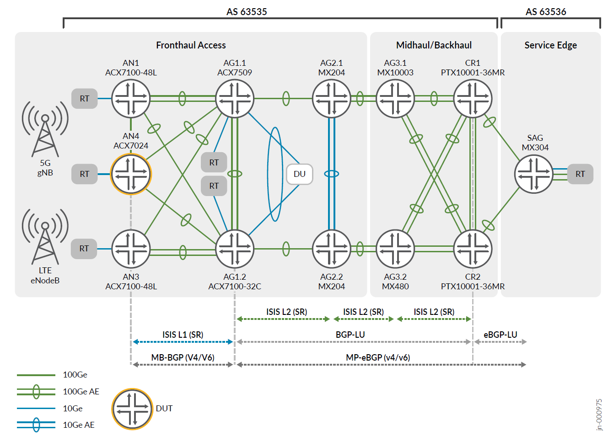
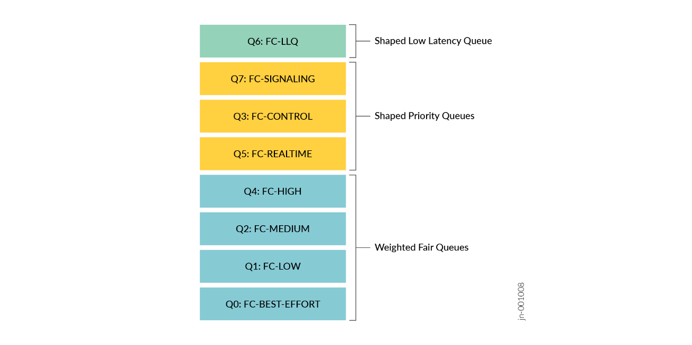

# JVD Solution Overview — Low Latency QoS Design for 5G

> Markdown conversion of the published *JVD Solution Overview: Low Latency QoS
> Design for 5G Solution* (`sol-overview-5g-fh-cos-llq-02-04`). Source of truth is
> the published PDF on juniper.net; this is a faithful text mirror for reference
> and for grounding the portal's Design & Planner.

## Executive Summary

Juniper Validated Design (JVD) is a cross-functional collaboration between Juniper
Solution Architects and Test teams to develop coherent multidimensional solutions
for domain-specific use cases. The JVD team comprises technical leaders in the
industry with a wealth of experience supporting complex use cases.

Using JVD, you can significantly reduce the risk of costly mistakes while saving
time and money in the deployment of network solutions. JVD provides benefits such
as a more stable network with fewer bugs and a shorter time to resolution if any
bugs are discovered. The validation process ensures that the network is optimized
for maximum performance, leading to a better user experience for enterprise/SP
operation and network service consumers. The design concepts deployed are
formulated around best practices, leveraging relevant technologies to deliver the
scope of the solution. KPIs are identified as part of an extensive test plan that
focuses on functionality, performance integrity, and service delivery. With JVDs,
you can shorten the time to market when implementing new network solutions,
reducing the lead time to generate revenue from new services.

## Solution Overview

5G radio access network (RAN) introduces new requirements for the mobile backhaul
(MBH) network infrastructure such as the number of nodes in the network,
performance, and features richness. These additional requirements lead to growing
network complexity. Juniper provides an end-to-end solution for the 5G xHaul
network infrastructure, designed to support 4G MBH and 5G network infrastructure
over the same physical network. This approach allows operators to smoothly
transition from 4G to 5G network infrastructure without disrupting their existing
services. The necessary changes can be gradually introduced to accommodate the
evolving requirements of 5G networks. The 5G solution architecture requires strict
QoS performance to deliver differentiated services and preserve low latency for
critical traffic types.

*Figure 1. 5G Solution Architecture — the featured validation topology across
Fronthaul Access, Midhaul/Backhaul, and Service Edge (AS 63535 / AS 63536).*

5G O-RAN is an open and disaggregated RAN architecture that aims to enable
interoperability, flexibility, and innovation among vendors and operators. The
Fronthaul is the most demanding segment of the xHaul architecture, requiring
high-performance and functionality to ensure delivery and preservation of
ultra-low latency workloads introduced in the 5G network. One of the key features
of 5G O-RAN is the support for multiple CoS that can provide differentiated QoS
and network slicing for various use cases and applications.

Key objectives of the featured JVD include:

- Comprehensive end-to-end multiservice CoS model
- QoS focused validation
- Differentiated services with multiple priority levels
- Low Latency Queuing with Latency Preservation
- Multiple classification methodologies with Behavior Aggregate, Fixed, and
  Multi-Field classification to distinguish critical flows
- O-RAN Multiple Priority Queue model
- Traffic Queueing, Scheduling and Rewriting
- Port and Queue Shaping
- Validation of Latency Budgets
- eCPRI Emulation and O-RAN conformance
- Host traffic mapping

The flow-based 5G QoS model provides more granular control and flexibility
compared to the bearer-based 4G LTE QCI model. Instead of assigning a single QoS
value to the entire bearer, 5G allows different flows within the same bearer to
have their own individual QoS requirements. This enables more fine-grained QoS
management, allowing different applications and services to receive tailored
treatment based on their specific needs. It also enables the network to
dynamically adjust QoS parameters for individual flows, optimizing resource
allocation and providing a better user experience.

5G incorporates new delay-critical guaranteed bit rate (GBR) flow categories. In
the 5G Fronthaul segment, eCPRI based flows define the user and control traffic
streams between O-RU and O-DU. These traffic characteristics require high
bandwidth and extremely low delay. All devices in the access topology must assign
the highest priority to this traffic type. This means that service providers may
need to rethink their existing CoS designs where the highest priority queues are
reserved for voice or video traffic.

To facilitate the JVD test objectives, a complete CoS network model is created to
support end-to-end 5G xHaul traffic types. This network model is adjustable to
meet your requirements. The JVD CoS model aligns with O-RAN multiple priority
queue structure and establishes three main components — Low Latency Queues, Shaped
Priority Queues, and Weighted Fair Queues.

*Figure 2. CoS Model Components — the eight-queue model: a Shaped Low Latency
Queue (Q6 FC-LLQ); Shaped Priority Queues (Q7 FC-SIGNALING, Q3 FC-CONTROL, Q5
FC-REALTIME); and Weighted Fair Queues (Q4 FC-HIGH, Q2 FC-MEDIUM, Q1 FC-LOW, Q0
FC-BEST-EFFORT).*

JVD validation examines CoS operations and performance requirements to ensure
integrity of critical 5G Fronthaul traffic flows between the RU to DU emulated
devices, as facilitated by the CSR (ACX7024), ACX7100-32C (HSR), and ACX7509
(HSR). Additional validation includes MX304 as the Services Edge with
PTX10001-36MR as Core for supporting end-to-end MBH traffic flows.

The main objective is to examine the predictable behavior in terms of how critical
and non-critical traffic flows are handled across services in the 5G xHaul
network. CoS functionalities are validated across EVPN, L3VPN, BGP-VPLS, and
L2Circuit VPN services, aligning with 5QI traffic classifications. QoS
implementation should exhibit deterministic functionality. The transport
architecture proves capable of supporting the adaptation of existing and emerging
mobile applications, preserving delay in budget integrity while guaranteeing
traffic priorities.

Through rigorous testing, KPIs are observed and shared to ensure the provided
solution is compliant with stringent fronthaul SLAs. The featured Juniper Networks
fronthaul platforms, including ACX7024, ACX7100-48L, ACX7100-32C, and ACX7509 are
excellent choices for access and aggregation purposes. These platforms deliver
enhanced performance, low latency, and high bandwidth with the necessary scale and
advanced feature set.

## Sources

- Published: *JVD Solution Overview: Low Latency QoS Design for 5G Solution*
  (`sol-overview-5g-fh-cos-llq-02-04`, V1.0/240808) — juniper.net.
- Companion documents in this folder: [design-guide.md](design-guide.md),
  [test-report-brief.md](test-report-brief.md), [datasheet.md](datasheet.md).
- Configurations: [`../configuration/conf`](../configuration/conf),
  [`../configuration/snips`](../configuration/snips).
