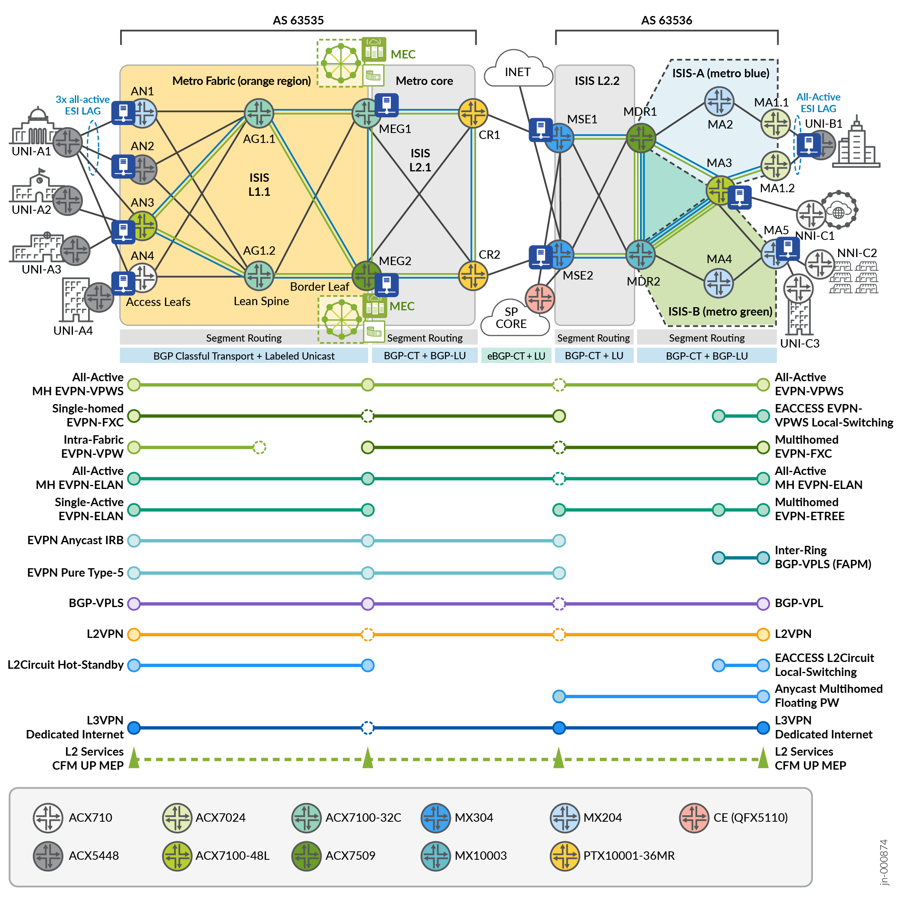

# Metro as a Service (MaaS) — Juniper Validated Design (JVD)

> Full end-to-end MEF 3.0 conformance over a Cloud Metro architecture with EVPN-FXC, EVPN-ETREE, BGP-VPLS, and floating pseudowires.

## Highlights

- First JVD to achieve full MEF 3.0 conformance end-to-end
- Extends Metro EBS with EVPN-FXC, EVPN-ETREE, EVPN-ELAN Type-5, BGP-VPLS E2E, and Floating Pseudowires
- Cloud Metro architecture with SR-MPLS transport and multi-ring core
- Mixed ACX (access/aggregation) and MX (edge/core) hardware
- E-Line, E-LAN, E-Tree, and E-Access MEF service layers validated

Metro as a Service (MaaS) is the first Juniper Validated Design to achieve
full end-to-end **MEF 3.0 conformance** over a **Cloud Metro architecture**.
It extends the
[Metro Ethernet Business Services (EBS) JVD](../metro_ethernet_business_services/)
with a denser MEF 3.0 services portfolio — adding EVPN-FXC, EVPN-ETREE,
EVPN-ELAN Type-5, BGP-VPLS E2E, Floating Pseudowires, and a richer mix
of L2VPN / L2Circuit single- and dual-homed variants — while reusing the
same SR-MPLS transport, multi-ring core, and ACX/MX hardware mix.

* JVD document: <https://www.juniper.net/documentation/us/en/software/jvd/jvd-metro-ebs-mef-03-02/index.html>
* Solution overview: <https://www.juniper.net/documentation/us/en/software/jvd/solution-overview-metro-ebs-mef-03-02.pdf>
* Test report: <https://www.juniper.net/documentation/us/en/software/jvd/test-report-brief-metro-ebs-mef-03-02.pdf>

## Hardware

The MaaS topology reuses the EBS device roster: ACX access and
aggregation nodes, MX edge and core, and a PTX transport core. The
configurations published here are MEF-service show-output slices
collected from each device.

| Juniper Product | Role | Role Label | Hostname |
|---|---|---|---|
| **ACX710** | Access Node | AN4 | `rtme-acx710-h` |
| **ACX5448** | Access Node | AN2 | `rtme-acx17` |
| **ACX7024** | Metro Aggregation | MA1.1, MA1.2 | `rtme-acx7024-04`, `rtme-acx7024-01` |
| **ACX7100-32C** | Metro Edge Gateway | MEG1 | `rtme-acx7100-32c-d` |
| **ACX7100-48L** | Access Node / Metro Aggregation | AN3, MA3 | `rtme-acx-48l-05`, `rtme-acx-48l-07` |
| **ACX7509** | Metro Edge Gateway | MEG2 | `rtme-acx7509-01-re0` |
| **MX204** | Access Node / Metro Aggregation | AN1, MA4, MA5 | `rtme-mx-45`, `rtme-mx204-10`, `rtme-mx-59` |
| **MX304** | Metro Service Edge | MSE1, MSE2 | `rtme-mx304-02`, `rtme-mx304-04` |

The role labels (AN, MA, MEG, MSE) correspond to the positions called
out in the topology diagram above.

## Configurations

Each file below captures the configuration groups that implement one
MEF service across every device that participates in it. Filenames
follow the pattern `<mef-layer>_<mef-service>_<technology>.conf`,
where the MEF layer is one of `eline`, `elan`, `etree`, or `eaccess`.

### E-Line (point-to-point) services

| File | MEF service | Technology |
|---|---|---|
| [`eline_epl_evpn_vpws.conf`](configuration/conf/eline_epl_evpn_vpws.conf) | EPL | EVPN-VPWS, port-based |
| [`eline_epl_l2vpn.conf`](configuration/conf/eline_epl_l2vpn.conf) | EPL | BGP L2VPN (Kompella), port-based |
| [`eline_evpl_evpn_vpws_edge.conf`](configuration/conf/eline_evpl_evpn_vpws_edge.conf) | EVPL | EVPN-VPWS, edge-terminated |
| [`eline_evpl_evpn_vpws_sh_fabric.conf`](configuration/conf/eline_evpl_evpn_vpws_sh_fabric.conf) | EVPL | EVPN-VPWS, single-homed across fabric |
| [`eline_evpl_evpn_vpws_mh_e2e.conf`](configuration/conf/eline_evpl_evpn_vpws_mh_e2e.conf) | EVPL | EVPN-VPWS, multihomed end-to-end |
| [`eline_evpl_evpn-fxc_aware_mh.conf`](configuration/conf/eline_evpl_evpn-fxc_aware_mh.conf) | EVPL | EVPN-FXC, VLAN-aware multihomed |
| [`eline_evpl_evpn-fxc_unaware_sh.conf`](configuration/conf/eline_evpl_evpn-fxc_unaware_sh.conf) | EVPL | EVPN-FXC, VLAN-unaware single-homed |
| [`eline_evpl_floating_pw.conf`](configuration/conf/eline_evpl_floating_pw.conf) | EVPL | Floating pseudowire with vESI / Anycast-SID |
| [`eline_evpl_l2ckt_hsb.conf`](configuration/conf/eline_evpl_l2ckt_hsb.conf) | EVPL | L2Circuit hot-standby |
| [`eline_evpl_l2vpn_e2e.conf`](configuration/conf/eline_evpl_l2vpn_e2e.conf) | EVPL | BGP L2VPN (Kompella), end-to-end |
| [`eline_evpl_vpls_fapm_ring_p2p.conf`](configuration/conf/eline_evpl_vpls_fapm_ring_p2p.conf) | EVPL | BGP-VPLS with FAPM, ring point-to-point |

### E-LAN (multipoint) services

| File | MEF service | Technology |
|---|---|---|
| [`elan_ep-lan_evpn_elan.conf`](configuration/conf/elan_ep-lan_evpn_elan.conf) | EP-LAN | EVPN-ELAN, port-based |
| [`elan_evp-lan_evpn-elan_bundle.conf`](configuration/conf/elan_evp-lan_evpn-elan_bundle.conf) | EVP-LAN | EVPN-ELAN, VLAN-bundle multihomed |
| [`elan_evp-lan_evpn-elan_vlan-based.conf`](configuration/conf/elan_evp-lan_evpn-elan_vlan-based.conf) | EVP-LAN | EVPN-ELAN, VLAN-based multihomed |
| [`elan_evp-lan_evpn-elan_type-5.conf`](configuration/conf/elan_evp-lan_evpn-elan_type-5.conf) | EVP-LAN | EVPN-ELAN Type-5 with IRB |
| [`elan_evp-lan_vpls_e2e_ms.conf`](configuration/conf/elan_evp-lan_vpls_e2e_ms.conf) | EVP-LAN | BGP-VPLS end-to-end, multi-segment |

### E-Tree (rooted-multipoint) services

| File | MEF service | Technology |
|---|---|---|
| [`etree_evp-tree_evpn-etree.conf`](configuration/conf/etree_evp-tree_evpn-etree.conf) | EVP-Tree | EVPN-ETREE |

### E-Access (access-only) services

| File | MEF service | Technology |
|---|---|---|
| [`eaccess_evpn-vpws_lsw.conf`](configuration/conf/eaccess_evpn-vpws_lsw.conf) | E-Access | EVPN-VPWS local-switch handoff |
| [`eaccess_l2ckt_lsw.conf`](configuration/conf/eaccess_l2ckt_lsw.conf) | E-Access | L2Circuit local-switch handoff |

## Related JVDs

* [Metro Ethernet Business Services (EBS)](../metro_ethernet_business_services/)
  — the parent design this JVD extends. Full per-device configurations
  and a snippet library (`configuration/snips/`) live there.
* [Metro EBS JVD landing page](https://www.juniper.net/documentation/us/en/software/jvd/jvd-metro-ebs-03-01/index.html)
* [Metro EBS YouTube overview](https://www.youtube.com/watch?v=dh3qvZMIhXA)
