# Metro as a Service (MEF 3.0) — JVD Design Guide

> Markdown conversion of the published *Metro as a Service MEF 3.0 — Juniper
> Validated Design* (Design Guide, published 2025-10-12), converted from the
> source Word document for fidelity to the original authored prose. Figures are
> in [`images/design-guide/`](images/design-guide/). Full per-device
> configurations also live under [`../configuration/`](../configuration/).
> Source of truth is the published document on juniper.net.

**Author:** Kevin Brown, HPE Juniper Networking

## Table of Contents

1. [About this Document](#about-this-document)
2. [Solution Benefits](#solution-benefits)
3. [Use Case and Reference Architecture](#use-case-and-reference-architecture)
   - [Metro Ethernet Forum](#metro-ethernet-forum)
   - [Carrier Ethernet Subscriber Models](#carrier-ethernet-subscriber-models)
4. [Validation Framework](#validation-framework)
5. [Test Objectives](#test-objectives)
6. [Solution Architecture](#solution-architecture)
7. [Results Summary and Analysis](#results-summary-and-analysis)
8. [Recommendations](#recommendations)

---

Metro as a Service (MaaS) MEF 3.0 (JVD)

Juniper Networks Validated Designs provide you with a comprehensive, end-to-end blueprint for deploying Juniper solutions in your network.

These designs are created by Juniper's expert engineers and tested to ensure they meet  
your requirements.

Using a validated design, you can reduce the risk of costly mistakes, save time and money, and ensure that your network is optimized for maximum performance.

# About this Document 

This document presents a Juniper Validated Design (JVD) for developing and deploying diverse services that are guaranteed Metro Ethernet Forum (MEF) 3.0 compliance using Juniper ACX Series and MX Series platforms. The reference architecture is based on the [Metro Ethernet Business Services (EBS)](https://www.juniper.net/documentation/us/en/software/jvd/jvd-metro-ebs-03-01/index.html) JVD and includes over twenty use cases delivered through EVPN, VPLS, L2VPN, L2Circuit, and L3VPN services.

The dense services portfolio covering E-Line, E-LAN, E-Tree, and Access E-Line service types are validated against MEF standards using the identical test infrastructure for MEF 3.0 certification. This ensures that service providers can confidentially deploy Juniper Networks end-to-end solutions, maximizing service performance, customer expectations, interoperability, and improving time to market.

The validation incorporates all [Metro Ethernet Business Services JVD](https://www.juniper.net/documentation/us/en/software/jvd/jvd-metro-ebs-03-01/solution_architecture.html) characteristics, including interdomain color-aware traffic steering across metro fabrics and multi-ring architectures.

The Metro as a Service (MaaS) JVD leverages MEF 3.0-certified Juniper routers, including the MX304, ACX7100, ACX7509, ACX7024, ACX5448, and ACX710 platforms. The JVD documentation references a comprehensive list of MEF technical specifications relevant to the design, including those related to subscriber Ethernet services, service attributes, class of service, service activation, and layer 2 control protocols.

Table of Contents


# Solution Benefits

The Juniper Validated Design tackles the challenges of modernizing metro networks to accommodate growing traffic demands, edge cloud integration, and evolving service requirements.

The Metro Ethernet Business Services solution validates a comprehensive multidimensional architecture with best practices for designing and implementing a dense services L2/L3 portfolio across intra-domain and inter-AS regions. Metro Ethernet follows the standards and framework defined by the Metro Ethernet Forum (MEF) for the delivery and characterization of services. MEF 3.0 certification for Operators involves the end-to-end compliance of production network services. By deploying MEF-certified equipment and adhering to MEF standards, providers can ensure that service offerings meet rigorous performance criteria and customer expectations.

The Metro Ethernet Business Services JVD addressed three key challenges faced by modern metro networks:

1.  **Inefficient Traffic Flow:** Traditional metro architectures often rely on backhauling traffic to central aggregation points, leading to increased costs and latency as edge cloud adoption grows. The JVD introduces the Metro Edge Gateway component to optimize traffic flows within the metro ecosystem by shifting advanced features closer to subscribers and enabling efficient traffic handling.

2.  **Modernizing Transport Underlay:** The design embraces network slicing and virtualization concepts, enabling multiple layers of abstraction over the same physical infrastructure. This allows for flexible traffic steering and service differentiation.

3.  **Adopting Cloud Principles:** Seamless integration of legacy and next-generation technologies, aligning with "x-to-anything" connectivity models. This involves leveraging techniques like Metro Fabric and color-aware traffic steering to enhance existing services and facilitate smooth migration to a cloud-centric metro architecture.

**Metro as a Service** by Juniper Networks introduces the first supplier-approved comprehensive validation of MEF 3.0 compliance conducted over a production-emulated network. The **Metro as a Service** JVD enhances the solution established with [Metro Ethernet Business Services JVD](https://www.juniper.net/documentation/us/en/software/jvd/jvd-metro-ebs-03-01/index.html) by qualifying over 12,000 MEF 3.0 test cases end-to-end across all featured E-Line, E-LAN, E-Tree, and Access E-Line (E-Access) services.

The Metro as a Service MEF 3.0 JVD enhances the solutions with key benefits to Service Providers:

1.  **Seamless Interoperability:** Juniper Networks MEF 3.0 certified products ensure that products work well with other MEF-compliant systems, reducing integration complexity and making it easier to deliver reliable, multi-vendor services.

2.  **Faster Time-to-Market:** Juniper Networks MEF-compliant solutions come pre-tested with industry standards, enabling service providers to deploy new services quickly, stay competitive, and meet customer demands efficiently.

3.  **Guaranteed Service Quality:** MEF 3.0 standards include stringent performance, security, and reliability benchmarks, allowing providers to deliver high-quality, dependable services and maintain customer trust.

Juniper Networks is committed to delivering quality, interoperability, and compliance with industry standards for Carrier Ethernet services. With the [Metro Ethernet Business Services JVD](https://www.juniper.net/documentation/us/en/software/jvd/jvd-metro-ebs-03-01/index.html) setting the foundation, this validation assures our customers can be confident that Juniper products and solutions are reliable, compatible, and capable of delivering high-performance Ethernet connectivity in diverse networking environments. The primary devices under test include MEF 3.0-certified products: ACX7024, ACX7100, ACX7509, and MX304.

The Metro Ethernet Business Services JVD addresses traditional L2 Business Access and Dedicated Internet Access services while incorporating modern service delivery protocols, including EVPN-VPWS, EVPN Flexible Cross Connect, EVPN-ETREE, and EVPN-ELAN. The topology, built upon the Juniper Cloud Metro portfolio, deploys an infrastructure designed to support metro access multi-ring topologies and metro fabric scale-out spine-and-leaf design. The reference architecture is based on modern Carrier Ethernet Metro Area Networks (MAN) and takes into consideration the transformation required to facilitate diverse new services, applications, and use cases.

The Cloud Metro concept carries several important characteristics in the amalgamation of service and content providers. These shifting industry trends demand massive bandwidth and service scale increases while supporting more complex metro workloads. The JVD establishes the bridge between retro-metro concepts and the modern adaptation of cloud principles into metro networks. This includes the array of EVPN technologies, SR-MPLS/SRv6, and machinery to support inter-domain traffic engineering or seamless architectures across disparate networks. This differentiating factor characterizes requirements for supporting X-to-Anything connectivity models or building infrastructures that become access agnostic while blending with virtualized network functions and devices.

The solution architectures and services proposed in the Metro Ethernet Business Services JVD are part of the network modernization journey and challenges faced by many Operators. Our modern converged network infrastructures and technologies stand ready to meet the demands of the new metro. JVD proposes solution blueprints to make every connection count!

# Use Case and Reference Architecture

The reference architecture is based on modern Carrier Ethernet Metro Area Networks (MAN), taking into consideration the transformation required to facilitate diverse new services, applications, and use cases. Some common principles exist to deliver Layer 2 and/or Layer 3-enabled services for point-to-point, point-to-multipoint, and multipoint-to-multipoint solutions—with more intelligent mechanisms enabling the coexistence of L2/L3 services and improved High Availability models.

The Metro as a Service JVD focuses on the service delivery and validation aspects defined by MEF 3.0 technical specifications and requirements and fulfilled with Iometrix Lab in the Sky cloud-based testing environment. The solution architecture deploys an infrastructure designed to support traditional metro access ring topologies with multi-service edge termination. In addition, the topology features a metro fabric spine-and-leaf design with border leaf nodes supporting metro-edge gateway services and facilitating connectivity into computing complexes. Both infrastructures are designed to support seamless interconnectivity within and between different network segments.

The validation encompasses mandatory and may include conditional mandatory test cases (where applicable) required for MEF 3.0 certification. The Metro Ethernet Forum 3.0 Carrier Ethernet certification for suppliers is limited to product-level certification. As such, the featured DUTs, including MX304, ACX7100, ACX7509, and ACX7024, are MEF 3.0-certified products and appear on the MEF registry. As of this writing, suppliers are not eligible for service-level MEF 3.0 certification, which is the primary certification path taken by operators. The MaaS JVD claims MEF 3.0 service compliance but is restricted from certification. Nevertheless, the Juniper MEF validation allows operators to rapidly achieve MEF 3.0 certification by utilizing the solutions provided. The JVD can be further leveraged to reduce POC qualification cycles and speed up time to market.

## Metro Ethernet Forum

The Metro Ethernet Forum (MEF) is an industry consortium dedicated to accelerating the adoption of Carrier Ethernet services and technologies. Its primary purposes and goals revolve around standardization, interoperability, and innovation within the Ethernet ecosystem. MEF works to develop and promote standards for Carrier Ethernet services, ensure interoperability between Carrier Ethernet networks and equipment from different vendors, foster innovation by promoting the development of new technologies and services based on Carrier Ethernet, and educate the market about the benefits and capabilities of Carrier Ethernet services.

MEF 3.0 Carrier Ethernet certification is a program designed to ensure that Ethernet services adhere to industry standards and best practices. The certification process involves rigorous testing and validation of network equipment, software, and services to ensure interoperability, performance, and reliability.

The certification provides several benefits to both vendors and customers. For vendors, certification can enhance market competitiveness, increase customer trust, and streamline the deployment of Ethernet services. For customers, certification ensures that they are investing in reliable and interoperable solutions that meet industry standards, reducing the risk of compatibility issues and downtime.

MEF 3.0 certification encompasses a range of technical specifications aimed at ensuring the interoperability, performance, and reliability of Carrier Ethernet services. Some of the key technical specifications included in MEF 3.0 certification are:

1.  **Service Attributes:** Defines the attributes and parameters of Carrier Ethernet services, including bandwidth profiles, service performance, and service multiplexing.

2.  **Service OAM (Operations, Administration, and Maintenance):** Specifies OAM functions for monitoring and troubleshooting Carrier Ethernet services, including connectivity verification, performance monitoring, and fault detection.

3.  **Performance Monitoring:** Defines performance metrics and monitoring mechanisms for Carrier Ethernet services, such as frame delay, frame delay variation (jitter), and frame loss ratio.

4.  **Ethernet Access Services:** Covers specifications for Ethernet access services, including Ethernet Virtual Connections (EVCs), service multiplexing, and service handoff at the network edge.

5.  **Interconnection Services:** Specifies requirements and protocols for interconnecting Carrier Ethernet networks, enabling end-to-end service delivery across multiple service providers.

6.  **Network-to-Network Interface (NNI):** Defines the interface and protocols for interconnecting Carrier Ethernet networks operated by different service providers, ensuring interoperability and seamless service handoff.

7.  **Test and Certification:** Outlines testing procedures and certification criteria for verifying compliance with MEF 3.0 specifications, ensuring consistent quality and interoperability of certified products and services.

These technical specifications provide a comprehensive framework for designing, deploying, and managing Carrier Ethernet services that meet the performance, scalability, and reliability requirements of modern networking environments.

# Validation Framework

An important focus of the Metro Ethernet Business Services JVD and the successive Metro as a Service JVD is the alignment with MEF standards. The Metro Ethernet Forum is an industry consortium dedicated to accelerating the adoption of Carrier Ethernet services and technologies. Its primary purposes and goals revolve around standardization, interoperability, and innovation within the Ethernet ecosystem. MEF works to develop and promote standards for Carrier Ethernet services, ensure interoperability between Carrier Ethernet networks and equipment from different vendors, foster innovation by promoting the development of new technologies and services based on Carrier Ethernet, and educate the market about the benefits and capabilities of Carrier Ethernet services.

The major MEF 3.0 Carrier Ethernet standards are divided into three main categories Subscriber services provided to customers, Operator services enabling interconnection of Ethernet services, and Special Topics covering service enhancements and emerging technologies.

The following section describes the key technical specifications covered by MEF 3.0 CE certification as a major point of reference for this validation. As can be gleaned from MEF 91, the certification typically does not cover the technical specifications in its entirety but rather identifies specific sections of relevance.

###### MEF 3.0 Carrier Ethernet Key Standards

1.  **MEF 91:** Establishes the test requirements for subscriber and operator Carrier Ethernet services. MEF 91 is the blueprint for what is tested and identifies the underlying MEF services standards for both subscriber and operator services.

2.  **MEF 3.0 Certification Framework**: Outlines the certification process, testing procedures, and criteria for verifying compliance with MEF 3.0 specifications, ensuring consistent quality and interoperability of certified products and services.

3.  **MEF 6.3 Subscriber Ethernet Services Definitions:** Including superseded MEF 6.2. Foundational specification that establishes the service definitions for UNI attributes, EVC attributes, and bandwidth profiles for all Carrier Ethernet service types.

4.  **MEF 10.4 Subscriber Ethernet Services Attributes**: Including superseded MEF 10.3. Establishes the foundational service attributes for E-Line, E-LAN, E-Tree, E-Access, and E-Transit service types. Specifies service attributes, performance objectives, and management requirements for Carrier Ethernet services, including bandwidth profiles, service multiplexing, and Quality of Service (QoS) parameters.

5.  **MEF 26.2 Operator Ethernet Services Attributes**: Establishes the External Network-to-Network Interface (ENNI) attributes and requirements critical for multi-operator service delivery. Specifies how Operator Virtual Connections (OVCs) are managed over ENNIs spanning multiple operators. Additionally covers the performance objectives, traffic management, service multiplexing, and handling of OAM protocols at the ENNI.

6.  **MEF 51 (.1) Operator Ethernet Service Definitions:** Defines operator services based on the 26.2 service attributes, including OVC UNI or ENNI endpoint attributes. Establishes the O-Line, O-LAN, and O-Tree definitions and implementations.

7.  **MEF 62 Managed Access E-Line (MAEL) Service:** Standardizes the implementation and characteristics of point-to-point managed Access E-Line services based on MEF 51.

8.  **MEF 65 Simplified Transit E-Line (STEL) Service:** Formalizes the common use case of Transit E-Line services by constraining values of certain ENNI Common Attributes, ENNI Service Attributes, and Operator Ethernet Service Attributes defined in MEF 26.2.

9.  **MEF 30.1 Service OAM Fault Management Implementation:** Establishes a common foundation for implementing Service OAM (SOAM) fault management for Ethernet Services.

10. **MEF 35.1 (Service OAM Performance Monitoring)**: Standardizes SOAM Performance Monitoring (PM) implementation for Ethernet services, building from MEF 17 framework.

11. **MEF 45.1 Layer 2 Control Protocols in Ethernet Services:** Defines treatment requirements for Layer 2 Control Protocols (L2CP) frames within Carrier Ethernet services.

12. **MEF 23.2 (.1) Class of Service:** MEF 23.2 standard and amended 23.2.1 standard for including bandwidth profile models with token sharing define the Class of Service attributes for Carrier Ethernet networks, ensuring service differentiation capabilities.

13. **MEF 48.1 Ethernet Service Activation Testing:** provides methodologies and requirements for Service Activation Testing (SAT) of Ethernet services.

## Carrier Ethernet Subscriber Models

Metro Ethernet Forum (MEF) establishes the framework for service attributes and definitions within the Carrier Ethernet network. The subscriber delivery mechanisms included in the JVD follow those standardized models. The column on the right describes the common solutions for the type of service, with the majority featured in the validation.

Table 1: Carrier Ethernet Service Categories

<table>
<colgroup>
<col style="width: 43%" />
<col style="width: 37%" />
<col style="width: 18%" />
</colgroup>
<thead>
<tr>
<th>Service Type</th>
<th>Service Description</th>
<th>Common VPN Types</th>
</tr>
</thead>
<tbody>
<tr>
<td></td>
<td>E-LINE for delivering point-to-point connections as Ethernet Private Lines (EPL) or Ethernet Virtual Private Lines (EVPL)</td>
<td><p>EVPN-VPWS</p>
<p>EVPN-FXC</p>
<p>L2Circuit</p>
<p>VPLS VPWS</p></td>
</tr>
<tr>
<td>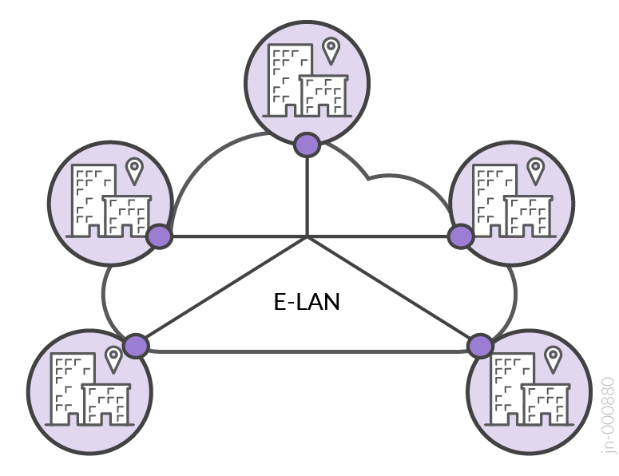</td>
<td>E-LAN for delivering multipoint-to-multipoint connections as Ethernet Private LAN (EP-LAN) or Ethernet Virtual Private LAN (EVP-LAN).</td>
<td><p>EVPN-ELAN</p>
<p>VPLS</p>
<p>L2VPN</p></td>
</tr>
<tr>
<td>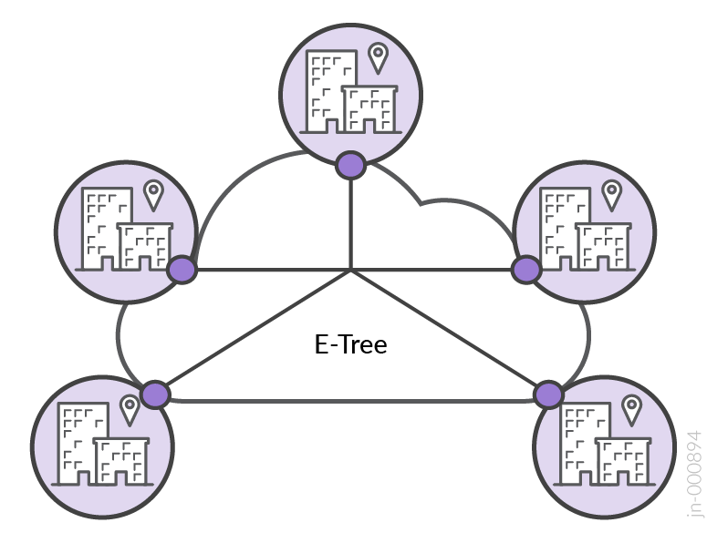</td>
<td>E-TREE for delivering rooted-multipoint hub-and-spoke connections as Ethernet Private Tree (EP-TREE) or Ethernet Virtual Private Tree (EVP-TREE).</td>
<td><p>EVPN-ETREE</p>
<p>H-VPLS</p></td>
</tr>
<tr>
<td>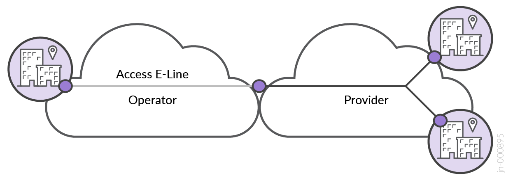</td>
<td>E-ACCESS for delivering wholesale point-to-point services connecting UNI to NNI as Access EPL or Access EVPL.</td>
<td><p>EVPN-VPWS LSW</p>
<p>L2CCC LSW</p></td>
</tr>
</tbody>
</table>

###### Key Service Attributes

MEF Services Attributes are further defined by the major characteristics:

- **Service Multiplexing:** This attribute allows multiple Ethernet Virtual Connections (EVCs) to terminate on the same User Network Interface (UNI), enabling multiple distinct Ethernet services to share the same physical or virtual interface. If Service Multiplexing is enabled at the UNI, multiple EVCs—such as EVC1 for Customer A and EVC2 for Customer B—can share the same interface while remaining logically separate. To differentiate traffic for each service, MEF standards specify the use of Customer Edge VLAN IDs (CE-VLAN) to map incoming frames to the appropriate EVC. Each EVC maintains discrete service characteristics for performance, bandwidth, and Quality of Service (QoS) parameters. This approach optimizes network efficiency and flexibility, allowing service providers to deliver customized, on-demand services over common infrastructures without requiring a dedicated connection for each service.

- **Bundling:** This attribute allows multiple CE-VLANs to be grouped under a single Ethernet Service at the UNI. Different types of customer traffic—such as voice, data, and video—can be carried over one EVC while maintaining distinct service characteristics for each CE-VLAN. Bundling enables service providers to manage multiple CE-VLANs within a single EVC, providing flexibility for differentiated traffic policies and performance requirements, making it ideal for delivering multiple traffic types from a single customer over a common interface.

- **All-to-One Bundling** consolidates all CE-VLANs from a single UNI into a single EVC, simplifying service provisioning when per-VLAN differentiation is unnecessary. All CE-VLANs share a unified service policy, inheriting the same QoS attributes applied to the EVC. Typically used with private Ethernet services, All-to-One Bundling enables secure, isolated connectivity between customer sites over common network infrastructure.

- An **Ethernet Virtual Circuit (EVC)** is a logical connection that links two or more Customer Edge (CE) devices across a service provider’s network. It forms the foundation for MEF-defined Ethernet services (e.g., E-Line, E-LAN, and E-Tree). EVCs provide the logical path through which customer traffic flows, ensuring that the traffic between specified CEs is isolated and follows defined performance characteristics like bandwidth and latency. MEF defines three main types of EVCs:

  - Point-to-Point (e.g., E-Line)

  - Multipoint-to-Multipoint (e.g., E-LAN)

  - Rooted Multipoint (e.g., E-Tree)

- **Customer Edge VLAN (CE-VLAN) ID(s)** are customer-assigned VLAN tags that are associated with an EVC at the service provider’s edge network. Depending on the service agreement and customer requirements, one or more CE-VLANs may be mapped to an EVC.

The ***EVC Data Service Frame Disposition Service Attribute*** (MEF 10.4/10.3) defines how Unicast, Multicast, and Broadcast traffic types are managed within the EVC. It specifies the treatment of frames, allowing for flexible and policy-driven frame forwarding or discarding in compliance with the service’s requirements, including:

- Delivered Unconditionally: Frames are forwarded to the destination without any conditions, ensuring that all valid frames are transmitted as expected.

- Delivered Conditionally: Frames are forwarded based on specific conditions, such as matching service policies, VLAN IDs, or other predefined criteria. This may include forwarding frames to specific recipients for multicast or broadcast traffic.

- Discarded: Frames are dropped if they do not meet certain criteria, such as invalid service parameters, improper frame tagging, or non-conformance with the service policy.

The updates from MEF 10.3 to MEF 10.4 signify a shift in design philosophy, moving from granular per-frame type service disposition attributes to a consolidated attribute utilizing a 3-tuple structure of frame handling within an EVC. The disposition settings (discard, delivery unconditionally, or delivery conditionally) remain unchanged but simplify overall management.

While the CE-VLAN construct remains central to the current implementation of MEF 3.0, as defined by MEF 10.3 technical specification, the modernized ***EVC EP Map Service Attribute*** and ***EVC EP Service Attribute*** introduced in MEF 10.4 reflect the continued evolution in the MEF framework, enveloping industry trends with greater flexibility. For more details on the EVC End Point (EVC EP) model, please refer to [MEF 10.4 technical specification](https://www.mef.net/resources/mef-10-4-subscriber-ethernet-services-attributes/).

MEF provides guidance for valid service multiplexing and bundling combinations, which are followed by this validated design. For more information, please refer to [MEF documentation](https://www.mef.net/learn/mef-technical-standards-sdks/?portfolio-set=carrier-ethernet).

Table 2: MEF Bundling and Service Multiplexing

| Service Multiplexing | Bundling | All-to-One Bundling | Description |
|----|----|----|:---|
| Enabled | Disabled | Disabled | Multiple virtual private services are allowed at the UNI with only one CE-VLAN ID mapped to each service |
| Enabled | Enabled | Disabled | Multiple virtual private services enabled at the UNI and multiple CE-VLAN IDs can be mapped to each service |
| Enabled | Enabled | Enabled | Illegal configuration |
| Enabled | Disabled | Enabled | Illegal configuration |
| Disabled | Disabled | Enabled | Single private service at the UNI |
| Disabled | Enabled | Disabled | Single virtual private service enabled at the UNI with multiple CE-VLAN IDs mapped to it |
| Disabled | Enabled | Enabled | Illegal configuration |
| Disabled | Disabled | Disabled | Single virtual private service enabled at the UNI with only a single CE-VLAN ID mapped to it |

Reference: https://wiki.mef.net/display/CESG/Bundling+and+Service+Multiplexing

- **Service Multiplexing:** determines whether the UNI terminates one (disabled) or more (enabled) Ethernet services.

- **Bundling** is enabled when multiple CE-VLANs are supported on the UNI or disabled when each Ethernet Service includes a single CE-VLAN.

- **All-to-One Bundling** means that all CE-VLANs are associated with a single Ethernet Service as a private UNI service. When bundling is disabled, one or more virtual private services are enabled per UNI.

The MaaS JVD covers 19 use cases for delivering Metro Ethernet services, including:

- E-Line: Point-to-point connections like EPL and EVPL.

- E-LAN: Multipoint-to-multipoint connections like EP-LAN and EVP-LAN.

- E-Tree: Rooted multipoint hub-and-spoke connections like EP-TREE and EVP-TREE.

- Access E-Line: Wholesale point-to-point services connecting UNI to NNI.

- Internet Access: IP service connecting IPVC endpoints for dedicated internet access.

Throughout the validated design, we explain how the featured services, behaviors, and characteristics map to MEF definitions.

###### Test Bed

The Metro as a Service MEF JVD leverages two foundational components: the physical infrastructure introduced in [Metro EBS JVD](https://www.juniper.net/documentation/us/en/software/jvd/jvd-metro-ebs-03-01/index.html) and Iometrix Lab in the Sky.

The diagram explains connectivity for building out the metro fabric spine-and-leaf and multi-ring topologies. For more details, please reference [Metro EBS JVD](https://www.juniper.net/documentation/us/en/software/jvd/jvd-metro-ebs-03-01/index.html).

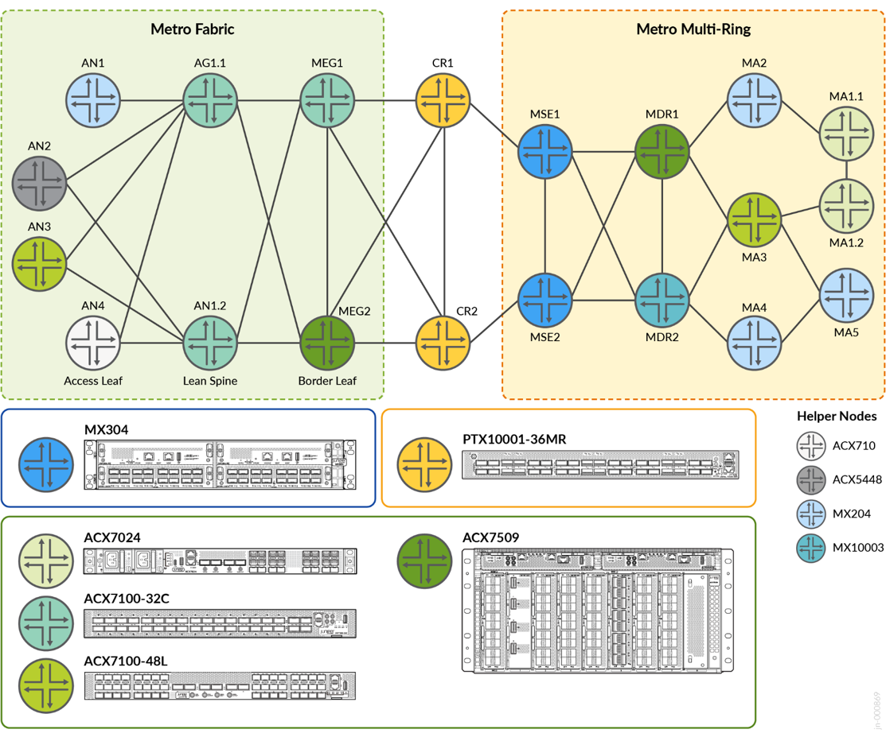

: Lab Topology Test Bed

Iometrix Lab in the Sky is a Network as a Service (NaaS) cloud-based testing infrastructure supporting a Testing Application that leverages virtual test probes utilizing x86 whitebox probes. The same infrastructure is used as a basis for MEF 3.0 certification testing. The Lab in the Sky infrastructure consists of the following components.

<figure>
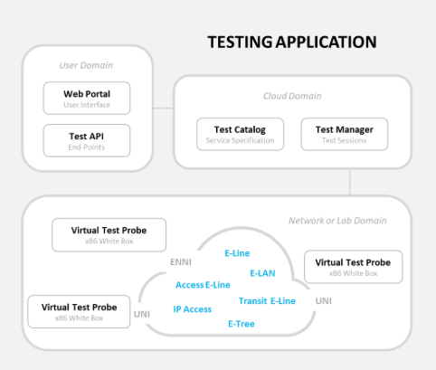
<figcaption><p>Iometrix Infrastructure</p></figcaption>
</figure>

###### Platforms / Devices Under Test (DUT)

Selected access platforms include ACX7024, ACX7100-48L, ACX710, ACX5448 and MX204 platforms. Aggregation or spine platforms include the ACX7100-32C in the metro fabric and ACX7509 with MX10003 routers as metro distribution routers in the ring architecture. The Metro edge gateway performs border leaf functions with the ACX7509 and ACX7100-32C, providing connectivity into edge compute complexes. The Metro core uses the PTX10001-36MR core and peering platform. The MX304 is ideally situated for the multi-services edge, supporting complex services termination and interconnect points.

The supported versions of Junos OS and Junos OS Evolved for all devices is 23.2R2, where applicable.

Table 3: Topology Abstract

| **Topology Definitions** | **Role** | **Device** | **Release** |
|----|:--:|----|:--:|
| Access Leaf | AN | ACX7100-48L (DUT), ACX710, ACX5448, MX204 | 23.2R2 |
| Lean Spine | AG1 | ACX7100-32C | 23.2R2 |
| Lean Edge Border Leaf | MEG | Metro Edge Gateway: ACX7509 (DUT), ACX7100-32C (DUT) | 23.2R2 |
| Core | CR | PTX10001-36MR | 23.2R2 |
| Multi-Services Edge | MSE | MX304 (DUT) | 23.2R2 |
| Metro Distribution Router | MDR | MX10003, ACX7509 (DUT) | 23.2R2 |
| Metro Access Node | MA | ACX7024 (DUT), ACX7100-48L (DUT), MX204 | 23.2R2 |

###### Test Bed Configuration 

Example configurations can be found in the **Solution Architecture** and **Results Summary and Analysis** sections. For full JVD configurations, please visit [Juniper GitHub](https://github.com/Juniper/jvd) or contact your Juniper account representative.

# Test Objectives

Juniper Validated Design (JVD) is a cross-functional collaboration between Juniper solution architects and test teams to develop coherent multidimensional solutions for domain-specific use cases. The JVD team comprises technical leaders in the industry with a wealth of experience supporting complex customer use cases. The scenarios selected for validation are based on industry standards to solve critical business needs with practical network and solution designs.

The key goals of the JVD initiative include:

- Test iterative multidimensional use cases.

- Optimize best practices and address solution gaps.

- Validate overall solution integrity and resilience.

- Support configuration and design guidance.

- Deliver practical, validated, and deployable solutions.

A reference architecture is selected after consultation with Juniper Networks global theaters and a deep analysis of customer use cases. The deployed design concepts use best practices and leverage relevant technologies to deliver the solution scope. Key performance indicators (KPIs) are identified as part of an extensive test plan that focuses on functionality, performance integrity, and service delivery.

Once the physical infrastructure that is required to support the validation is built, the design is sanity-checked and optimized. Our test teams conduct a series of rigorous validations to prove solution viability, capturing and recording results. Throughout the validation process, our engineers engage with software developers to quickly address any issues found.

The Metro Ethernet Business Services solution validates a comprehensive multidimensional architecture that includes best practices for designing and implementing a dense services L2/L3 portfolio across intra-domain and inter-AS regions.

The solution architecture is extended to validate MEF 3.0 compliance, ensuring all featured Layer 2 services meet or exceed MEF standards for high performance, reliability, interoperability, and QoS. With adherence to MEF standards, Operators can ensure that customers experience consistent, high-quality Ethernet connectivity across different networks and providers. The rigorous MEF 3.0 test cases provide assurance that Carrier Ethernet services are reliable and capable of delivering on Service Level Agreements (SLA).

The following are the Test Objective areas of focus:

1.  **Service Performance:** Validate bandwidth (using MEF bandwidth profile service attributes), latency, jitter (delay variation), frame loss, and QoS compliance with the capability to differentiate between traffic types. Ensures consistent and predictable network performance to meet SLAs.

2.  **Service Activation:** Ensure accurate service setup, provisioning, multiplexing, and bundling. Validation of service multiplexing and bundling capabilities that ensure EVCs and CE-VLANs can be managed over a single UNI, as required.

3.  **Standards Conformance:** Ensures Carrier Ethernet services deliver all defined EVC types, including E-Line, E-LAN, E-Tree, and Access E-Line, enabling compatibility and seamless operation in multi-vendor and multi-provider environments.

4.  **Reliability and Resiliency:** Test for service continuity, protection, and rapid failover. Ensuring services remain stable during network outages and able to meet uptime requirements. Protection mechanisms are built into both underlay and overlay network design.

5.  **Service Assurance:** Verify monitoring, fault detection, and Service OAM (Operations, Administration, and Maintenance) capabilities.

The underlying infrastructure described in this document provides a resilient and high-performance Segment Routing architecture but is not a requirement of the solutions presented. Other underlay technologies can be leveraged, for example MPLS RSVP-TE.

The validation focuses on qualifying MEF 3.0 mandatory test cases across [Metro Ethernet Business Services](https://www.juniper.net/documentation/us/en/software/jvd/jvd-metro-ebs-03-01/index.html) featuring E-Line, E-LAN, E-Tree, and E-Access solutions for supporting crucial Carrier Ethernet use cases.

<figure>
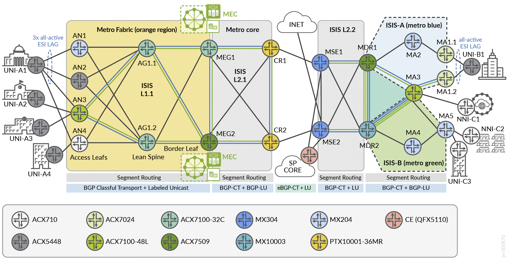
<figcaption><p>: Metro Ethernet Business Services Solution Architecture</p></figcaption>
</figure>

The table below explains all services included in the JVD. Service type will be one of the four MEF options for E-Line, E-LAN, E-Tree, or Access E-Line. VPN Type is the implementation mechanism used in the JVD to deliver the solution. Each service may include variations of single-homing and/or multi-homing. The diagram above (Figure 2) can be used to map and understand where the service is instantiated with defined endpoints and device types.

Table 4: Services Under Test

| Index | Service Type | VPN Type | High Availability | Service Instantiation | Endpoints |
|----|----|----|----|----|----|
| 1 | E-Line | EVPN-VPWS Port Based | Single-Homed | Inter-AS Fabric to Ring | AN3, MA1.1 |
| 2 | E-Line | EVPN-VPWS VLAN-based | Active-Active Multihoming | Inter-AS Fabric to Ring | AN1, AN2, AN3, MA1.1, MA1.2 |
| 3 | E-Line | EVPN-VPWS VLAN-based | Single-Homed | Intra-Fabric | AN3, AN4 |
| 4 | E-Line | EVPN-VPWS VLAN-based | Active-Active Multihoming | Metro Fabric | AN3, MEG1, MEG2 |
| 5 | E-Line | EVPN Flexible Cross-Connect VLAN Aware | Active-Active Multihoming | Inter-AS MEG to Ring | MEG1. MEG2, MA1.1, MA1.2 |
| 6 | E-Line | EVPN Flexible Cross-Connect VLAN Unaware | Single-Homed | Inter-AS Fabric to MSE | AN3, MSE1 |
| 7 | E-Line | Layer 2 Circuit | Hot-Standby | Metro Fabric | AN3, MEG1, MEG2 |
| 8 | E-Line | L2VPN Port Based | Single-Homed | Inter-AS Fabric to Ring | AN3, MA5 |
| 9 | E-Line | L2VPN VLAN-based | Single-Homed | Inter-AS Fabric to Ring | AN3. MA5 |
| 10 | E-Line | BGP-VPLS VPWS | Single-Homed | Inter-Rings | MA5, MA1.2 |
| 11 | E-Line | EVPN Floating Pseudowire | Anycast | Metro Ring | MSE1, MSE2, MA1.2 |
| 12 | E-LAN | EVPN-ELAN Port Based | Single-Homed | Inter-AS Fabric to Ring | AN3, MA1.2 |
| 13 | E-LAN | EVPN-ELAN VLAN-based | Active-Active Multihoming | Inter-AS Fabric to Ring | AN1, AN2, AN3, MEG1. MEG2, MA1.1, MA1.3 |
| 14 | E-LAN | EVPN-ELAN VLAN Bundle | Active-Active Multihoming | Metro Fabric | AN3, MEG1. MEG2 |
| 15 | E-LAN | EVPN-ELAN Type 5 | Active-Active Multihoming | Inter-AS Fabric to MSE | AN3, MEG1, MEG2, MSE1, MSE2 |
| 16 | E-LAN | BGP-VPLS | Single-Homed | Inter-AS Fabric to Ring | AN3, MEG2, MA1.2 |
| 17 | E-Tree | EVPN-ETREE | Active-Active Roots | Metro Ring | MSE1, MSE2, MA4, MA5 |
| 18 | Access E-Line | EVPN-VPWS Local-Switching | Single-Homed | Metro Ring | MA5, MA3 |
| 19 | Access E-Line | Layer 2 Circuit (L2CCC) Local-Switching | Single-Homed | Metro Ring | MA5, MA3 |

###### Test Goals

Test cases executed based on MEF 3.0 certification fall into four distinct categories. These test cases are qualified in the JVD across the presented transport and services architectures and include the below major topics.

1.  Functional Service Attributes and Parameters:

    - This category covers the testing of service functionalities and attributes defined for service types, including E-Line, E-LAN, E-Tree, and Access E-Line. It validates that services meet the necessary operational characteristics and behaviors, such as Ethernet Virtual Connections (EVCs), VLAN handling, and service multiplexing.

    - Tests include verifying the correct mapping of service attributes (e.g., CE-VLAN ID, CoS, EVC Service Attributes) and ensuring that services operate as intended.

2.  Layer 2 Control Protocol (L2CP) and Service OAM (SOAM) Frame Behavior:

    - This category tests the handling of Layer 2 Control Protocols (L2CP) and Service OAM (SOAM) frames, ensuring they are properly processed and managed by the system. It involves testing the correct tunneling and forwarding of control and management frames (e.g., CCM, LBM, LTM, LTR).

    - This also includes validating whether frames are correctly identified and handled according to MEF network operation and maintenance standards.

3.  Bandwidth Profile Attributes and Parameters:

    - This category focuses on verifying that Bandwidth Profiles are implemented correctly. It tests attributes such as committed information rate (CIR), excess information rate (EIR), and traffic shaping to ensure that the service adheres to the agreed-upon bandwidth allocations.

    - Performance metrics like traffic policing are validated to ensure proper traffic flow management in different service conditions.

4.  Service Performance Attributes and Parameters:

    - This category tests performance characteristics like latency, jitter, frame loss ratio (FLR), and availability in compliance with the specified Service Level Agreements (SLAs).

    - It ensures that the service can meet the agreed-upon performance parameters for various traffic types (e.g., unicast, multicast, broadcast) under real-world conditions, validating that service performance aligns with customer requirements.

These categories ensure that the service and equipment meet MEF 3.0 standards for functionality, performance, interoperability, and service assurance required to deliver the expected service quality and reliability.

###### Test Non-Goals

Non-goals include elements that logically belong in the JVD but are excluded for various reasons, e.g., outside the scope, feature/product limitation, etc. The MaaS validation covers service types included in the [Metro EBS JVD](https://www.juniper.net/documentation/us/en/software/jvd/jvd-metro-ebs-03-01/index.html). Additional service types are possible and supported.

- Formal MEF 3.0 certification. While the majority of Juniper products featured in this JVD are MEF 3.0 certified and appear on the public registry, the constraints of MEF limit suppliers from achieving a certification intended for Service Providers. The validation demonstrates MEF 3.0 compliance across all featured services.

- Transit E-Line (fka, E-Transit) is supported but not explicitly covered. An instance of Transit E-Line (MEF 65) service type is included, but test cases are designed to deliver I/ENNI-to-UNI O-Line services.

- Attributes outside the scope of MEF 3.0 certification. MEF 3.0 certification includes important sections across numerous technical specifications but may not cover the entire spec. For consistency, this JVD is focused primarily on MEF 3.0 requirements.

- Features and functionality of the solution architecture, including convergence, design concepts, and extensive configurations, are all covered by [Metro EBS JVD](https://www.juniper.net/documentation/us/en/software/jvd/jvd-metro-ebs-03-01/index.html). Some overlap may exist where applicable to MEF 3.0.

- The validation does not include multi-vendor test scenarios.

- Layer 3 IPVC solutions are included in the JVD with L3VPN and EVPN Type-5 but are not a requirement of MEF 3.0 CE certification. However, EVPN Type-5 is validated as an E-LAN service. Several MEF technical specifications cover IP Services definitions and attributes, including MEF 61.1, MEF 60, MEF 57, and so forth.

- Devices not listed as DUTs.

# Solution Architecture

The JVD solution presents a design for the integration of traditional Metro ring architectures utilizing multi-instance ISIS with Metro fabrics. Segment Routing MPLS is the underlay technology of choice. Flex-Algo is leveraged to enable lightweight traffic engineering. Transport Classes are associated with the Flex-Algo tunnels to create slices through the network established by the lowest delay, best traffic engineering metrics, or preferred IGP metrics. Three paths are created in the topology: Gold (Delay metric), Bronze (TE metric), and Best Effort (IGP metric). Each VPN service can be selectively mapped onto specific Flex-Algos using BGP extended color community attributes to perform color-aware traffic steering. A cascade-style resolution scheme allows Gold paths to failover to Bronze, and Bronze paths can failover to Best Effort.

Carrier Ethernet services are delivered with L2Circuit, L2VPN, and VPLS traditional VPN services coexisting with modern services, including EVPN-VPWS, EVPN Flexible Cross Connect (FXC), EVPN-ELAN, and EVPN-TREE. Layer 3 services are supported with L3VPN, EVPN-ELAN Type 5, and EVPN Anycast IRB models.

Please reference the [Metro Ethernet Business Services JVD](https://www.juniper.net/documentation/us/en/software/jvd/jvd-metro-ebs-03-01/index.html) for extensive details on building this solution architecture.

The MaaS JVD leverages the established services and infrastructure defined by Metro EBS JVD to qualify MEF 3.0 parameters. Solutions for E-Line, E-LAN, E-Tree, and Access E-Line deliver a variety of use cases critical for Metro networks. The primary service goals include the following key attributes:

- Site-to-site and multisite-to-multisite VPN services

- Communications with Edge/Cloud Computing resources

- Inter-AS stitching of disparate service domains

- Internet Access for select Layer 2 and Layer 3 services

- Optimization of Intra-Fabric and Inter-Ring connectivity

- Integration of services with points of network attachments (i.e., SP Core)

- Seamless multi-domain color-aware services with traffic steering

As shown in Figure 3, Iometrix probes are connected throughout the JVD topology to enable the execution of MEF-related test cases across all Layer 2 E-Line, E-LAN, E-Tree, and Access E-Line services featured in the solution. Test cases are developed to mirror MEF 3.0 certification requirements.

<figure>
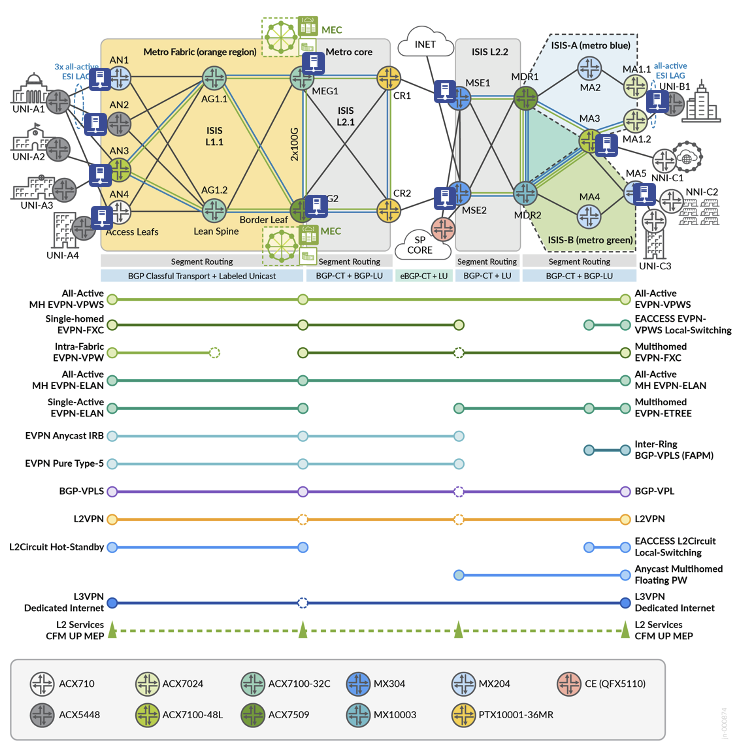
<figcaption><p>: Metro EBS Solution Architecture with Iometrix Probes</p></figcaption>
</figure>

The above diagram details service instantiation points throughout the network. For details on specific device participation, please reference Table 4. In the services schematic, solid circles represent points of termination, whereas empty dotted-line circles indicate passthrough or inter-AS points of the network.

Table 5: Featured Devices

| Topology Definitions | Role | Device |
|:---|----|:---|
| **Access Leaf** | AN | ACX7100-48L (DUT), ACX710, ACX5448, MX204 |
| **Lean Spine** | AG1 | ACX7100-32C |
| **Lean Edge Border Leaf** | MEG | Metro Edge Gateway: ACX7509 (DUT), ACX7100-32C (DUT) |
| **Core** | CR | PTX10001-36MR |
| **Multiservices Edge** | MSE | MX304 (DUT) |
| **Metro Distribution Router** | MDR | MX10003, ACX7509 (DUT) |
| **Metro Access Node** | MA | ACX7024 (DUT), ACX7100-48L (DUT), MX204 |

Service Providers are increasingly deploying or migrating to EVPN as a more capable solution under a single technology umbrella compared to fragmented traditional VPN services, such as L2Circuit, VPLS, and L2VPN. However, operators continue to require legacy support as both standalone and coexisting solutions. The JVD considers a range of modern and traditional Carrier Ethernet services, creating a comparative performance analysis and providing methodologies to modernize legacy protocols.

The validation consists of the standard service types:

- E-LINE

- E-LAN

- E-TREE

- ACCESS E-LINE (formerly E-Access)

Metro EBS JVD additionally includes Layer 3 IPVC service types, but this is outside the scope of MEF 3.0. EVPN-ELAN with Route-Type 5 is included as a L3+L2 VPN service with the validation focusing on the L2 aspect.

The JVD offers E-Line, E-LAN, and E-Tree services with options for single-homing and active-active multi-homing nodes to maximize service availability. Service type conformance, defined by MEF, utilizes the following attributes and testing requirements for reliable and consistent Ethernet connectivity across diverse network environments.

- UNI Service Attributes define the subscriber's interface characteristics in the service provider network.

- EVC per UNI Service Attributes distinguishes how the EVC functions at each UNI.

- EVC Service Attributes define the EVC characteristics critical to service functionality.

- CE-VLAN ID and EVC map between UNIs

  - EPL, EP-LAN, and EP-Tree: All CE-VLAN IDs, CoS assignments, as well as priority-tagged and untagged frames are included within a single EVC.

  - EVPL, EVP-LAN, and EVP-Tree: A single CE-VLAN ID in the EVC, allowing for all CoS assignments.

- Layer 2 Control Protocol (L2CP) functions identify which frames are tunneled (forwarded) or discarded within the service.

- Service Operations, Administration, and Maintenance (SOAM) functions identify frames that must be tunneled (CCM, LBM, LTM, LTR at MEG levels 5 and 6) for operational continuity.

- Preservation of CE-VLAN IDs and CoS ensures that customer-defined VLAN IDs and Class of Service priorities are maintained across the network.

In addition, MEF compliance testing includes specific traffic and port characteristics to validate service quality, including expected disposition settings explained in the Key Service Attributes section:

- Traffic Types: Unicast, multicast, and broadcast traffic behavior.

- Frame Tagging: Proper handling of tagged and untagged Ethernet frames.

###### Metro as a Service: E-LINE

The following sections describe how MEF framework is leveraged in the JVD to deliver Metro as a Service (MaaS) solutions. This section explains the E-Line portion of the MEF 3.0 validation.

The Subscriber Ethernet Services Definition 6.2/6.3 technical specification defines the E-Line service type as a point-to-point Ethernet Virtual Connection (EVC) connecting two User-Network Interfaces (UNIs). This service type is characterized by providing dedicated, private, and reliable Ethernet communications between two endpoints.

<figure>
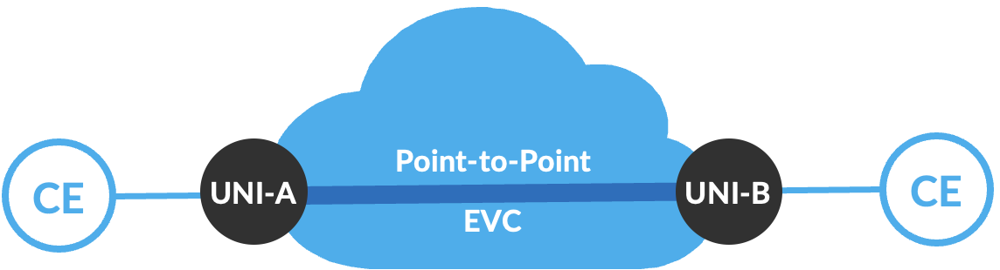
<figcaption><p>: E-LINE Point-to-Point Service Type</p></figcaption>
</figure>

Basic E-Line connects two UNIs to deliver a best-effort service with symmetrical bandwidth and no performance guarantees.

In more advanced E-Line implementations, a more diverse service offering might include:

- Differing bandwidth rates between UNIs.

- Multiple Class of Service (CoS) profiles for tailoring service levels.

- Performance objectives measuring Frame Delay (FD), Inter-Frame Delay Variation (IFDV), and Frame Loss Ratio (FLR) to establish availability metrics.

- Service Multiplexing at one or both UNIs, enabling multiple point-to-point EVCs.

E-Line services come in two main variations:

1.  **Ethernet Private Line (EPL)** is a port-based point-to-point “all-to-one bundling” service providing a dedicated, transparent data path. Subscribers maintain full control over their network infrastructure with the flexibility to create and manage multiple point-to-point connections over a single UNI, typically using VLAN separation. CE-VLAN IDs and CE-VLAN CoS markings are preserved end-to-end. EPL is ideal for applications requiring full Ethernet frame delivery between locations. Depending on SLAs, additional performance objectives may include low-latency guarantees, high reliability, bandwidth allocation, and so forth.

2.  **Ethernet Virtual Private Line (EVPL)** is similar to EPL but supports service multiplexing (VLAN-based), allowing multiple services to share the same physical interface at a UNI. EVPL enables multiple EVCs on one or both of the UNIs, providing greater flexibility for delivering multiple point-to-point connections over a single UNI. EVPL is well-suited for organizations that need scalable, segmented connectivity with customized service levels across diverse applications.

Depending on the required Class of Service, these services can be tailored to meet specific performance criteria. The service attributes and their values are detailed in MEF specifications, with specific constraints outlined for E-Line services to ensure performance consistency.

###### E-LINE Point-to-Point Services

The protocol suite of point-to-point E-LINE services covered by the JVD includes EVPN-VPWS, EVPN Flexible Cross Connect (FXC), BGP-VPLS (as a point-to-point service), L2Circuit, Floating PW, and L2VPN. The profile implements 11 distinct E-Line use cases to deliver different connectivity options. Each use case has approximately 500 MEF-related test cases executed as part of the validation. The key service categories under test include:

1.  Functional Service Attributes and Parameters

2.  Layer 2 Control Protocol Frame Behaviors

3.  Service OAM Functionalities

4.  Bandwidth Profile Attributes and Parameters

5.  Service Performance Attributes and Parameters

<figure>
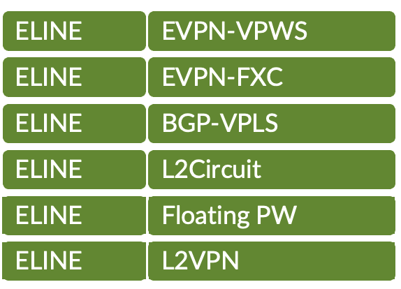
<figcaption><p>: E-Line Base Protocol Suite</p></figcaption>
</figure>

Multiple permutations of service instantiation are delivered:

- Intra-Fabric

- Inter-AS

- Inter-Ring

- Single-homing & Multihoming

- VLAN Aware & VLAN Unaware

Each VPN type can support multiple combinations of MEF service attributes. This flexibility is demonstrated, but the JVD does not attempt to include every possible combination. There are additional valid options for each VPN service type that can be leveraged, depending on the service objectives.

<figure>
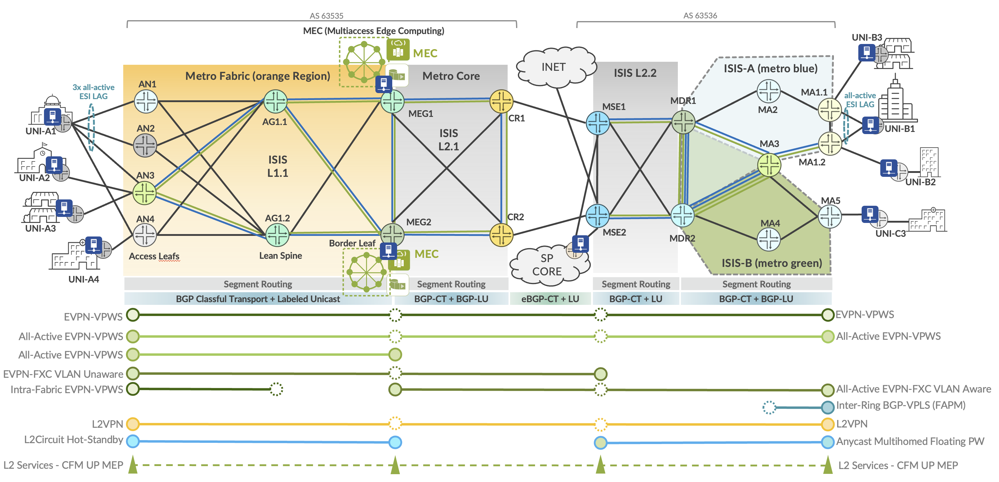
<figcaption><p>: E-LINE Point-to-Point Service Termination</p></figcaption>
</figure>

The lab topology includes service instantiation points illustrated in Figure 7 for E-Line services, covered by the corresponding MEF test cases. Iometrix test probes are placed throughout the topology for conducting the end-to-end validation.

Table 6: E-Line Service Definitions

| Index | Service Type | VPN Type | High Availability | Service Instantiation | Endpoints |
|----|----|----|----|----|----|
| 1 | E-Line | EVPN-VPWS Port Based | Single-Homed | Inter-AS Fabric to Ring | AN3, MA1.1 |
| 2 | E-Line | EVPN-VPWS VLAN-based | Active-Active Multihoming | Inter-AS Fabric to Ring | AN1, AN2, AN3, MA1.1, MA1.2 |
| 3 | E-Line | EVPN-VPWS VLAN-based | Single-Homed | Intra-Fabric | AN3, AN4 |
| 4 | E-Line | EVPN-VPWS VLAN-based | Active-Active Multihoming | Metro Fabric | AN3, MEG1, MEG2 |
| 5 | E-Line | EVPN Flexible Cross-Connect VLAN Aware | Active-Active Multihoming | Inter-AS MEG to Ring | MEG1. MEG2, MA1.1, MA1.2 |
| 6 | E-Line | EVPN Flexible Cross-Connect VLAN Unaware | Single-Homed | Inter-AS Fabric to MSE | AN3, MSE1 |
| 7 | E-Line | Layer 2 Circuit | Hot-Standby | Metro Fabric | AN3, MEG1, MEG2 |
| 8 | E-Line | L2VPN Port Based | Single-Homed | Inter-AS Fabric to Ring | AN3, MA5 |
| 9 | E-Line | L2VPN VLAN-based | Single-Homed | Inter-AS Fabric to Ring | AN3, MA5 |
| 10 | E-Line | BGP-VPLS VPWS | Single-Homed | Inter-Rings | MA5, MA1.2 |
| 11 | E-Line | EVPN Floating Pseudowire | Anycast | Metro Ring | MSE1, MSE2, MA1.2 |

Every VPN service included in the JVD is designed with the purpose of delivering crucial metro functionality and connectivity objectives. The services featured in the above table are further explained below with use cases.

Table 7: E-Line EVPL Service Use Cases

<table>
<colgroup>
<col style="width: 11%" />
<col style="width: 15%" />
<col style="width: 72%" />
</colgroup>
<thead>
<tr>
<th>Matching<br />
Index</th>
<th>E-Line EVPL</th>
<th style="text-align: left;">Metro Use Case</th>
</tr>
</thead>
<tbody>
<tr>
<td><strong>[ 2 ]</strong></td>
<td>EVPN-VPWS</td>
<td style="text-align: left;">EVPN-VPWS with EVI spanning up to three PEs AN1 (MX204), AN2 (ACX5448), and AN3 (ACX7100-48L) to connect the CE (UNI-A1) Ethernet Segment (ES) with all-active ESI UNI resiliency. The E-Line EVPN service is extended end-to-end with Inter-AS support terminating into the EVPN EVI spanning two PEs MA1.1 (ACX7024) and MA1.2 (ACX7024) with an all-active ESI connecting the UNI-B1 ES.</td>
</tr>
<tr>
<td><strong>[ 3 ]</strong></td>
<td>EVPN-VPWS</td>
<td style="text-align: left;">EVPN-VPWS, as a Metro Fabric E-Line service, supports intra-fabric communications between AN3 (ACX7100-48L) and AN4 (ACX710) with traffic flows optimized to be contained within the spine nodes AG1.1/AG1.2 (ACX7100-32C).</td>
</tr>
<tr>
<td><strong>[ 4 ]</strong></td>
<td>EVPN-VPWS</td>
<td style="text-align: left;">EVPN-VPWS establishes an active-active high availability service connection between AN3 (ACX7100-48L) to MEG1 (ACX7100-32C) and MEG2 (ACX7509) to provide UNI-A3 connectivity into the Multiaccess Edge Computing complex over an all-active ESI.</td>
</tr>
<tr>
<td><strong>[ 5 ]</strong></td>
<td><p>EVPN-FXC</p>
<p>VLAN-Aware</p></td>
<td style="text-align: left;">EVPN Flexible Cross Connect (FXC) as a VLAN Aware service is established between MA1.1/MA1.2 (ACX7024) with all-active ESI attachment circuits supporting multiple UNI ports and terminating on an active-active high availability connection with MEG1 (ACX7100-32C) and MEG2 (ACX7509). This Inter-AS service allows simplistic VLAN aggregation options with the ability to support one or more VLAN stacks per ESI for MEC access.</td>
</tr>
<tr>
<td><strong>[ 6 ]</strong></td>
<td><p>EVPN-FXC</p>
<p>VLAN-Unaware</p></td>
<td style="text-align: left;">EVPN Flexible Cross Connect (FXC) as a VLAN Unaware service is established between AN3 (ACX7100-48L) to MSE1 (MX304), connecting UNI-A2 into a QinQ infrastructure. This Inter-AS service allows simplistic VLAN aggregation options with a shared-state ESI.</td>
</tr>
<tr>
<td><strong>[ 7 ]</strong></td>
<td>L2Circuit</td>
<td style="text-align: left;">Layer 2 Circuit (L2Circuit) establishes an active-passive (hot-standby) connection between AN3 and MEG1 (active) and MEG2 (hot-standby). This traditional service (aka Martini) is extended to support the modern requirements of the network for accessing MEC resources.</td>
</tr>
<tr>
<td><strong>[ 9 ]</strong></td>
<td>L2VPN</td>
<td style="text-align: left;">L2VPN is a traditional BGP Layer 2 service (aka Kompella), establishing the Inter-AS connection between AN3 (ACX7100-48L) and MA5 (MX204).</td>
</tr>
<tr>
<td><strong>[ 10 ]</strong></td>
<td>BGP-VPLS</td>
<td style="text-align: left;">BGP-VPLS is leveraged as a point-to-point service connecting MA5 (MX204) with MA1.2 (ACX7024) over the multi-ring topology with optimizations to traverse the service-unaware MDR nodes.</td>
</tr>
<tr>
<td><strong>[ 11 ]</strong></td>
<td>EVPN Floating PW</td>
<td style="text-align: left;">EVPN Floating Pseudowire is a reimagined Static L2Circuit service utilizing a Segment Routing Anycast-SID for active-active termination on MSE1 and MSE2 (MX304). Using an anycast service label allows traffic to be load-shared over the ring. The floating PW service allows VLAN aggregation with selective stitching into EVPN-ELAN containers on the MSEs. The virtual ESI established with the MX pseudowire interface (ps) allows for an all-active vESI facing the ring segment.</td>
</tr>
</tbody>
</table>

Table 8: E-Line EPL Service Use Cases

<table>
<colgroup>
<col style="width: 11%" />
<col style="width: 15%" />
<col style="width: 72%" />
</colgroup>
<thead>
<tr>
<th>Matching<br />
Index</th>
<th>E-Line EPL</th>
<th style="text-align: left;">Metro Use Case</th>
</tr>
</thead>
<tbody>
<tr>
<td><strong>[ 1 ]</strong></td>
<td>EVPN-VPWS</td>
<td style="text-align: left;">EVPN-VPWS port-based service supports a point-to-point multidomain Inter-AS connection between AN3 to MA1.1. This enables UNI-A3 flexible connectivity with the UNI-B3 site.</td>
</tr>
<tr>
<td><strong>[ 8 ]</strong></td>
<td>L2VPN</td>
<td style="text-align: left;">L2VPN port-based service is delivered between AN3 (ACX7100-48L) and MA5 (MX204) connecting UNI-A3 with UNI-C3.</td>
</tr>
</tbody>
</table>

For E-Line configurations used in this JVD and in Metro Ethernet Business Services JVD, please visit the Juniper GitHub repository at <https://github.com/Juniper/jvd> or contact your Juniper Networks representative.

###### E-Line: EVPN-VPWS Example

E-Line EVPN-VPWS vlan-based services are included with several permutations in the validation (explained in Table 7 and throughout section **E-LINE Point-to-Point Services**). In the sample configuration below, MEG1 and MEG2 provide an all-active ESI termination for EVPN-VPWS services.

**MEG1 (ACX7100-32C)**

```
interfaces {

ae67 {

unit 4000 {

encapsulation vlan-ccc;

vlan-id 4000;

esi {

00:40:11:11:21:22:01:00:00:01;

all-active;

}

family ccc {

filter {

input f_eline-evpn-vpws;

}

}

}

}

}

routing-instances {

evpn_group_edge_4000 {

instance-type evpn-vpws;

protocols {

evpn {

interface ae67.4000 {

vpws-service-id {

local 2;

remote 1;

}

}

}

}

interface ae67.4000;

route-distinguisher 10.0.0.6:33300;

vrf-export evpn_group_edge_4000;

vrf-target target:63535:33300;

}

}
```

**MEG2 (ACX7509)**

```
interfaces {

ae67 {

unit 4000 {

encapsulation vlan-ccc;

vlan-id 4000;

esi {

00:40:11:11:21:22:01:00:00:01;

all-active;

}

family ccc {

filter {

input f_eline-evpn-vpws;

}

}

}

}

}

routing-instances {

evpn_group_edge_4000 {

instance-type evpn-vpws;

protocols {

evpn {

interface ae67.4000 {

vpws-service-id {

local 2;

remote 1;

}

}

}

}

interface ae67.4000;

route-distinguisher 10.0.0.7:33300;

vrf-export evpn_group_edge_4000;

vrf-target target:63535:33300;

}

}
```

For full details on EVPN-VPWS E-Line configurations, please refer to the Juniper GitHub repository at <https://github.com/Juniper/jvd>.

###### E-Line: EVPN-FXC VLAN Aware Example

EVPN-VPWS flexible cross-connect (FXC), enables multiplexing a large number of attachment circuits across multiple interfaces onto a single VPWS service tunnel. All attachment circuits bundled by the FXC instance share the same MPLS label and service tunnel. With VLAN Aware FXC, service multiplexing can support multiple Ethernet Segments with distinct high availability. Although the same service label is leveraged for all attachment circuits, an Ethernet A-D is advertised or withdrawn per EVI route for each attachment circuit.

E-Line EVPN-VPWS Flexible Cross Connect (FXC) VLAN Aware services (explained in section **E-LINE Point-to-Point Services**) are established between MA1.1/MA1.2 (ACX7024) with all-active ESI attachment circuits supporting multiple UNI ports and terminating on an active-active high availability connection with MEG1 (ACX7100-32C) and MEG2 (ACX7509). This Inter-AS service allows simplistic VLAN aggregation options with the ability to support one or more VLAN stacks per ESI for MEC access.

In the sample configuration below, MA1.1 and MA1.2 provide all-active ESI termination for EVPN-VPWS services. FXC is commonly leveraged with Pseudowire Headend Termination (PWHT). For this example, it is point-to-point with strictly FXC at the terminating points.

**MA1.1 (ACX7024)**

```
interfaces {

ae12 {

unit 4002 {

encapsulation vlan-ccc;

vlan-id 4002;

input-vlan-map {

push;

vlan-id 3400;

}

output-vlan-map pop;

esi {

00:10:55:11:50:12:02:00:00:00;

all-active;

}

family ccc {

filter {

input f_eline-evpn-vpws;

}

}

}

unit 4001 {

encapsulation vlan-ccc;

vlan-id 4001;

input-vlan-map {

push;

vlan-id 3000;

}

output-vlan-map pop;

esi {

00:10:55:11:50:12:01:00:00:00;

all-active;

}

family ccc {

filter {

input f_eline-evpn-vpws;

}

}

}

}

}

routing-instances {

evpn_vpws_fxc_aware {

instance-type evpn-vpws;

protocols {

evpn {

interface ae12.4001 {

vpws-service-id {

local 2;

remote 1;

}

}

interface ae12.4002 {

vpws-service-id {

local 22;

remote 11;

}

}

flexible-cross-connect-vlan-aware;

}

}

interface ae12.4001;

interface ae12.4002;

route-distinguisher 10.0.0.17:5501;

vrf-export evpn_vpws_fxc_aware;

vrf-target target:63536:55100;

}

}
```

**MA1.2 (ACX7024)**

```
interfaces {

ae12 {

unit 4002 {

encapsulation vlan-ccc;

vlan-id 4002;

input-vlan-map {

push;

vlan-id 3400;

}

output-vlan-map pop;

esi {

00:10:55:11:50:12:02:00:00:00;

all-active;

}

family ccc {

filter {

input f_eline-evpn-vpws;

}

}

}

unit 4001 {

encapsulation vlan-ccc;

vlan-id 4001;

input-vlan-map {

push;

vlan-id 3000;

}

output-vlan-map pop;

esi {

00:10:55:11:50:12:01:00:00:00;

all-active;

}

family ccc {

filter {

input f_eline-evpn-vpws;

}

}

}

}

}

routing-instances {

evpn_vpws_fxc_aware {

instance-type evpn-vpws;

protocols {

evpn {

interface ae12.4001 {

vpws-service-id {

local 2;

remote 1;

}

}

interface ae12.4002 {

vpws-service-id {

local 22;

remote 11;

}

}

flexible-cross-connect-vlan-aware;

}

}

interface ae12.4001;

interface ae12.4002;

route-distinguisher 10.0.0.18:5501;

vrf-export evpn_vpws_fxc_aware;

vrf-target target:63536:55100;

}

}
```

For full details on EVPN-FXC E-Line configurations, please refer to the Juniper GitHub repository at <https://github.com/Juniper/jvd>.

###### E-Line: EVPN-FXC VLAN Unaware Example

EVPN-VPWS flexible cross-connect (FXC), enables multiplexing a large number of attachment circuits across multiple interfaces onto a single VPWS service tunnel. All attachment circuits bundled by the FXC instance share the same MPLS service label and service tunnel. With VLAN Unaware FXC, a single Ethernet A-D is advertised or withdrawn for the entire bundle of attachment circuits. The route will only be withdrawn when all attachment circuits are down.

E-Line EVPN-VPWS Flexible Cross Connect (FXC) VLAN Unaware services (explained in section **E-LINE Point-to-Point Services**) are established between AN3 (ACX7100-48L) to MSE1 (MX304), connecting UNI-A2 into a QinQ infrastructure. This Inter-AS service allows simplistic VLAN aggregation options across a shared-state instance.

In the sample configuration below, AN3 presents two logical interfaces with service multiplexed attachment circuits (AC) bundled in a single EVI. An ESI could be extended for high availability with all ACs sharing EVI state. For this example, it is point-to-point with strictly FXC at the terminating points.

**AN3 (ACX7100-48L)**

```
interfaces {

et-0/0/13 {

flexible-vlan-tagging;

encapsulation flexible-ethernet-services;

unit 4007 {

encapsulation vlan-ccc;

vlan-id 4007;

family ccc {

filter {

input f_eline-evpn-vpws;

}

}

}

unit 4008 {

encapsulation vlan-ccc;

vlan-id 4008;

family ccc {

filter {

input f_eline-evpn-vpws;

}

}

}

}

}

routing-instances {

evpn_group_4007 {

instance-type evpn-vpws;

protocols {

evpn {

flexible-cross-connect-vlan-unaware;

group fxc {

interface et-0/0/13.4007;

interface et-0/0/13.4008;

service-id {

local 1;

remote 2;

}

}

}

}

route-distinguisher 10.0.0.2:40001;

vrf-target target:63535:40001;

}

}
```

**MSE1 (MX304)**

```
interfaces {

xe-0/0/13:2 {

flexible-vlan-tagging;

encapsulation flexible-ethernet-services;

unit 4007 {

encapsulation vlan-ccc;

vlan-id 4007;

family ccc {

filter {

input f_eline-evpn-vpws;

}

}

}

unit 4008 {

encapsulation vlan-ccc;

vlan-id 4008;

family ccc {

filter {

input f_eline-evpn-vpws;

}

}

}

}

}

routing-instances {

evpn_group_4007 {

instance-type evpn-vpws;

protocols {

evpn {

flexible-cross-connect-vlan-unaware;

group fxc {

interface xe-0/0/13:2.4007;

interface xe-0/0/13:2.4008;

service-id {

local 2;

remote 1;

}

}

}

}

route-distinguisher 10.0.0.10:40001;

vrf-target target:63535:40001;

}

}
```

For full details on EVPN-FXC E-Line configurations, please refer to the Juniper GitHub repository at <https://github.com/Juniper/jvd>.

###### E-Line: L2Circuit Example

Layer 2 Circuit (L2Circuit) establishes an active-passive (hot-standby) connection between AN3 and MEG1 (active) and MEG2 (hot-standby). This traditional service (aka Martini) is extended to support the modern requirements of the network for accessing MEC resources. Optionally, vlan normalization and flow-aware transport (FAT-PW) load-balancing are included. AN3 (ACX7100-48L) establishes the primary and backup remote PEs. MEG1 and MEG2 are configured with hot-standby-vc-on to enable hot-standby pseudowire upon receipt of the status-TLV. The solution is further explained in section **E-LINE Point-to-Point Services**.

**AN3 (ACX7100-48L)**

```
interfaces {

et-0/0/13 {

flexible-vlan-tagging;

encapsulation flexible-ethernet-services;

unit 4006 {

encapsulation vlan-ccc;

vlan-id 4006;

input-vlan-map {

push;

vlan-id 1000;

}

output-vlan-map pop;

family ccc {

filter {

input f_eline-evpn-vpws;

}

}

}

}

}

protocols {

l2circuit {

neighbor 10.0.0.6 {

interface et-0/0/13.4006 {

virtual-circuit-id 2006;

control-word;

flow-label-transmit;

flow-label-receive;

encapsulation-type ethernet-vlan;

ignore-mtu-mismatch;

pseudowire-status-tlv;

backup-neighbor 10.0.0.7 {

virtual-circuit-id 3333;

hot-standby;

}

}

}

}

}
```

**MEG1 (ACX7100-32C) and MEG2 (ACX7509)**

```
interfaces {

et-2/0/4 {

flexible-vlan-tagging;

encapsulation flexible-ethernet-services;

unit 4006 {

encapsulation vlan-ccc;

vlan-id 4006;

input-vlan-map {

push;

vlan-id 1000;

}

output-vlan-map pop;

family ccc {

filter {

input f_eline-evpn-vpws;

}

}

}

}

}

protocols {

l2circuit {

neighbor 10.0.0.2 {

interface et-2/0/4.4006 {

virtual-circuit-id 3333;

control-word;

flow-label-transmit;

flow-label-receive;

encapsulation-type ethernet-vlan;

ignore-encapsulation-mismatch;

ignore-mtu-mismatch;

pseudowire-status-tlv {

hot-standby-vc-on;

}

}

}

}
```

For full details on L2Circuit E-Line configurations, please refer to the Juniper GitHub repository at <https://github.com/Juniper/jvd>.

###### E-Line: Layer 2 VPN Example

L2VPN is a traditional BGP Layer 2 service (aka Kompella), establishing the Inter-AS connection between AN3 (ACX7100-48L) and MA5 (MX204). The solution is further explained in section **E-LINE Point-to-Point Services**.

**AN3 (ACX7100-48L)**

```
interfaces {

et-0/0/13 {

flexible-vlan-tagging;

encapsulation flexible-ethernet-services;

unit 200 {

encapsulation vlan-ccc;

vlan-id 200;

family ccc {

filter {

input f_eline-evpn-vpws;

}

}

}

}

}

routing-instances {

l2vpn_group_200 {

instance-type l2vpn;

protocols {

l2vpn {

site r2 {

interface et-0/0/13.200 {

remote-site-id 1119;

}

site-identifier 1102;

}

encapsulation-type ethernet-vlan;

no-control-word;

}

}

interface et-0/0/13.200;

route-distinguisher 63535:102000;

vrf-target target:63535:102000;

}

}
```

For full details on L2VPN E-Line configurations, please refer to the Juniper GitHub repository at <https://github.com/Juniper/jvd>.

###### E-Line: BGP-VPLS Example

BGP-VPLS is leveraged as a point-to-point service connecting MA5 (MX204) with MA1.2 (ACX7024) over the multi-ring topology with optimizations to traverse the service-unaware MDR nodes. Although not mandatory, the label-block-size can be reduced from the default of eight for label space savings.

**MA1.2 (ACX7024)**

```
interfaces {

et-0/0/12 {

vlan-tagging;

encapsulation flexible-ethernet-services;

unit 4005 {

encapsulation vlan-bridge;

vlan-id 4005;

family ethernet-switching {

filter {

input f_elan-evpn;

}

}

}

}

}

routing-instances {

vpls_group_4005 {

instance-type virtual-switch;

protocols {

vpls {

site r18 {

site-identifier 2;

}

service-type single;

site-range 2;

label-block-size 2;

no-tunnel-services;

}

}

route-distinguisher 10.0.0.18:44444;

vrf-target target:64535:44444;

vlans {

vlan4005 {

interface et-0/0/12.4005;

}

}

}

}
```

**MA5 (MX204)**

```
interfaces {

xe-0/1/0 {

vlan-tagging;

encapsulation flexible-ethernet-services;

unit 4005 {

encapsulation vlan-bridge;

vlan-id 4005;

family bridge {

filter {

input f_elan-evpn;

}

}

}

}

}

routing-instances {

vpls_group_4005 {

instance-type virtual-switch;

protocols {

vpls {

site r19 {

site-identifier 1;

}

site-range 2;

label-block-size 2;

no-tunnel-services;

}

}

bridge-domains {

vlan4005 {

vlan-id 4005;

interface xe-0/1/0.4005;

bridge-options {

no-normalization;

}

}

}

route-distinguisher 10.0.0.19:44444;

vrf-target target:64535:44444;

}

}
```

For full details on BGP-VPLS E-Line configurations, please refer to the Juniper GitHub repository at <https://github.com/Juniper/jvd>.

###### E-Line: EVPN Floating PW Example

EVPN Floating Pseudowire is a reimagined Static L2Circuit service utilizing a Segment Routing Anycast-SID for active-active termination on MSE1 and MSE2 (MX304). Using an anycast service label allows traffic to be load-shared over the Metro Ethernet ring. The floating PW service allows VLAN aggregation with selective stitching into EVPN-ELAN containers on the MSEs. The virtual ESI established with the MX pseudowire interface (ps) allows for an all-active vESI facing the ring segment.

The basic construct of the Floating PW service establishes a static L2Circuit from MA1.2 (ACX7024) toward an Anycast IP Gateway associated with an Anycast-SID terminating on both MSE1 and MSE2. The L2Circuit is terminated on the MX PS transport interface (ps22.0 in the configuration below). The associated pseudowire service interface (ps22.4004) is stitched into an EVPN instance, establishing the virtual ESI facing toward the access node. This vESI operates as all-active and signaled appropriately between MSE1/2, establishing the designated & backup forwarder based on default MOD election. EVPN signaling is separated from anycast functionalities and uses local (unique) loopbacks for MSE1/2. An additional optimization may include a conditional route policy applied to ISIS and BGP export policies to track the state of the transport interface (ps22.0).

**MA1.2 (ACX7024)**

```
interfaces {

et-0/0/12 {

flexible-vlan-tagging;

encapsulation flexible-ethernet-services;

unit 4004 {

encapsulation vlan-ccc;

vlan-id 4004;

family ccc {

filter {

input f_eline-evpn-vpws;

}

}

}

}

}

protocols {

l2circuit {

neighbor 1.1.10.10 {

interface et-0/0/12.4004 {

static {

incoming-label 1000022;

outgoing-label 1000022;

}

virtual-circuit-id 10120;

encapsulation-type ethernet-vlan;

}

}

}

}
```

**MSE1 (MX304)**

```
interfaces {

ps22 {

anchor-point {

lt-0/0/0;

}

vlan-tagging;

encapsulation flexible-ethernet-services;

unit 0 {

encapsulation ethernet-ccc;

}

unit 4004 {

encapsulation vlan-bridge;

vlan-id 4004;

esi {

00:11:11:11:44:11:11:30:02:0a;

all-active;

}

}

}

ae10 {

unit 4004 {

encapsulation vlan-bridge;

vlan-id 4004;

esi {

00:11:11:11:11:44:11:30:01:0a;

all-active;

}

family bridge {

filter {

input f_elan-evpn;

}

}

}

}

}

routing-instances {

4004-evpn-floating-pw {

instance-type evpn;

protocols {

evpn;

}

vlan-id 4004;

interface ae10.4004;

interface ps22.4004;

route-distinguisher 10.0.0.10:40004;

vrf-target target:4004:4004;

}

}

protocols {

l2circuit {

neighbor 10.0.0.18 {

interface ps22.0 {

static {

incoming-label 1000022;

outgoing-label 1000022;

}

virtual-circuit-id 10120;

encapsulation-type ethernet-vlan;

}

}

}

}

policy-options {

condition Floating-PW-Condition {

if-route-exists {

address-family {

ccc {

ps22.0;

table mpls.0;

}

}

}

}

}
```

**MSE2 (MX304)**

```
interfaces {

ps22 {

anchor-point {

lt-0/0/0;

}

vlan-tagging;

encapsulation flexible-ethernet-services;

unit 0 {

encapsulation ethernet-ccc;

}

unit 4004 {

encapsulation vlan-bridge;

vlan-id 4004;

esi {

00:11:11:11:44:11:11:30:02:0a;

all-active;

}

}

}

ae10 {

unit 4004 {

encapsulation vlan-bridge;

vlan-id 4004;

esi {

00:11:11:11:11:44:11:30:01:0a;

all-active;

}

family bridge {

filter {

input f_elan-evpn;

}

}

}

}

}

routing-instances {

4004-evpn-floating-pw {

instance-type evpn;

protocols {

evpn;

}

vlan-id 4004;

interface ae10.4004;

interface ps22.4004;

route-distinguisher 10.0.0.11:40004;

vrf-target target:4004:4004;

}

}

protocols {

l2circuit {

neighbor 10.0.0.18 {

interface ps22.0 {

static {

incoming-label 1000022;

outgoing-label 1000022;

}

virtual-circuit-id 10120;

encapsulation-type ethernet-vlan;

}

}

}

}

policy-options {

condition Floating-PW-Condition {

if-route-exists {

address-family {

ccc {

ps22.0;

table mpls.0;

}

}

}

}

}
```

For full details on Floating Pseudowire E-Line configurations, please refer to the Juniper GitHub repository at <https://github.com/Juniper/jvd>.

###### Metro as a Service: E-LAN

The following sections describe how MEF framework is leveraged in the JVD to deliver Metro as a Service (MaaS) solutions. This section explains the E-LAN portion of the MEF 3.0 validation.

The Subscriber Ethernet Services Definition 6.2/6.3 technical specification defines the E-LAN service type as a multipoint-to-multipoint EVC. E-LAN services allow communication between multiple locations by connecting UNIs, enabling any site to communicate directly with any other site within the network. E-LAN is designed to simulate the functionality of a traditional Local Area Network (LAN) over a Metro Ethernet Network (MEN).

Multipoint-to-multipoint offers flexible and scalable solutions for enterprises that need to interconnect multiple branch offices, data centers, or remote sites.

Service multiplexing is an important E-LAN feature capability, allowing multiple Ethernet services to be delivered over a single physical interface (UNI). A UNI can simultaneously support both E-LAN services connecting multiple locations and an E-Line service forming point-to-point connections. The ability to multiplex different services across the same interface is an important goal of supporting a flexible network design.

<figure>
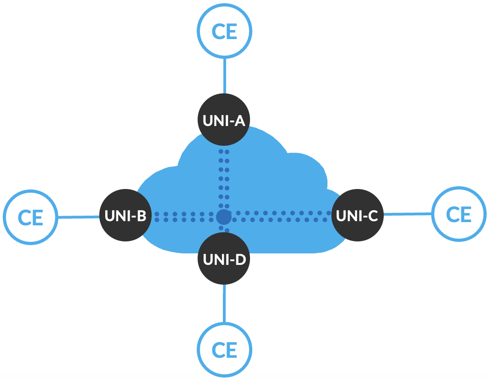
<figcaption><p>: E-LAN Multipoint-to-Multipoint Service Type</p></figcaption>
</figure>

E-LAN implements similar service performance categories to E-Line, wherein the basic imposition may include a best-effort service without performance guarantees, meaning data transmission is not prioritized, and there are no assurances for latency or packet loss thresholds. In more advanced implementations, service-level objectives (SLOs) are established to ensure key performance metrics are delivered:

- Differing bandwidth rates between UNIs.

- Multiple Class of Service (CoS) profiles for tailoring service levels.

- Performance objectives measuring Frame Delay (FD), Inter-Frame Delay Variation (IFDV), and Frame Loss Ratio (FLR) to establish availability metrics.

- Service Multiplexing at one or more UNIs, enabling flexibility for multiple multipoint-to-multipoint E-LAN services and/or in parallel with point-to-point E-Line EVCs.

These metrics ensure that the network meets specific performance levels, making it suitable for more critical applications that require reliable data transmission, such as voice, video, or financial transactions.

E-LAN services come in two main variations determined by the degree of control delegated between the provider and customer end user:

1.  **Ethernet Private LAN (EP-LAN)** is a port-based multipoint-to-multipoint “all-to-one bundling” service providing a dedicated and private, transparent data path. All traffic on the physical port is mapped to a single EVC. EP-LAN allows subscribers full control over their network infrastructure with the flexibility to create and manage site-to-site connectivity options. CE-VLAN IDs and CE-VLAN CoS markings are preserved end-to-end.

2.  **Ethernet Virtual Private LAN (EVP-LAN)** is similar to EP-LAN but supports service multiplexing and shared bandwidth across the network. EVP-LAN enables multiple EVCs on one or more UNIs, providing greater flexibility for delivering multiple multipoint-to-multipoint E-LAN services and/or in parallel with point-to-point E-Line EVCs over a single UNI. Subscribers and/or traffic flows can be mapped to specific VLANs with flexible VLAN ID preservation and QoS mapping.

E-LAN services offer a range of possibilities for enterprises looking to interconnect their facilities in an efficient and effective manner. The detailed service attributes and configurations, as outlined in MEF technical specifications, provide a foundation for customizing the service to meet varying business needs.

The Iometrix MEF 3.0 validation covers the critical functionality required to deliver E-LAN services and provide robust, flexible, and scalable solutions for organizations that require reliable multipoint-to-multipoint Ethernet connectivity. Leveraging the Metro EBS JVD solution architecture enables the ability to scale from best-effort services to high-performance, guaranteed service delivery with strict performance objectives.

###### E-LAN Multipoint-to-Multipoint Services

The protocol suite of multipoint-to-multipoint E-LAN services covered by the JVD includes EVPN-ELAN and BGP-VPLS. The profile implements five distinct E-LAN use cases to deliver different connectivity options. Each use case includes approximately 500-1250 MEF-related test cases executed as part of the validation. The key service categories under test include:

1.  Functional Service Attributes and Parameters

2.  Layer 2 Control Protocol Frame Behaviors

3.  Service OAM Functionalities

4.  Bandwidth Profile Attributes and Parameters

5.  Service Performance Attributes and Parameters

<figure>

<figcaption><p>: E-LAN Base Protocol Suite</p></figcaption>
</figure>

Multiple permutations of service instantiation are delivered:

- Intra-Fabric

- Inter-AS

- Inter-Ring

- Single-homing & Multihoming

- VLAN Aware & VLAN Unaware

Each VPN type can support multiple combinations of MEF service attributes. This flexibility is demonstrated, but the JVD does not attempt to include every possible combination. There are additional valid options for each VPN service type that can be leveraged, depending on the service objectives.

<figure>
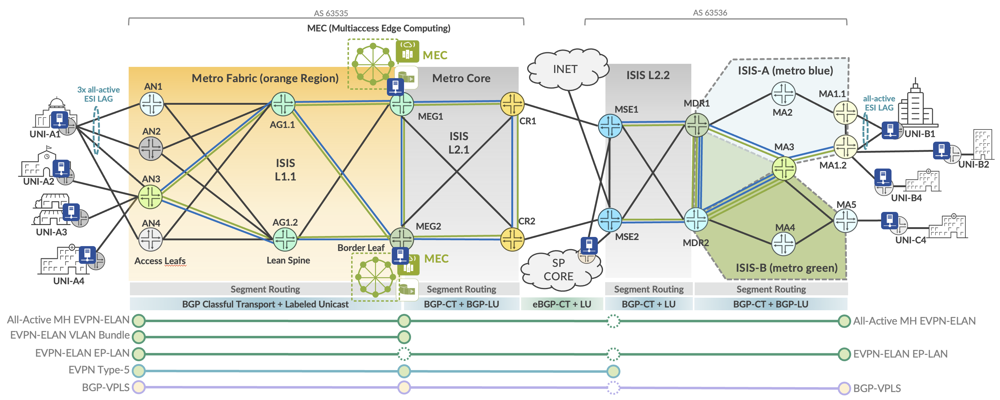
<figcaption><p>: E-LAN Multipoint-to-Multipoint Service Termination</p></figcaption>
</figure>

The lab topology includes service instantiation points illustrated in Figure 10 for E-LAN services, covered by the corresponding MEF test cases. Iometrix test probes are placed throughout the topology for conducting the end-to-end validation.

Table 9: E-LAN Service Definitions

| Index | Service Type | VPN Type | High Availability | Service Instantiation | Endpoints |
|----|----|----|----|----|----|
| 1 | E-LAN | EVPN-ELAN Port Based | Single-Homed | Inter-AS Fabric to Ring | AN3, MA1.2, MA5 |
| 2 | E-LAN | EVPN-ELAN VLAN-based | Active-Active Multihoming | Inter-AS Fabric to Ring | AN1, AN2, AN3, MEG1. MEG2, MA1.1, MA1.2 |
| 3 | E-LAN | EVPN-ELAN VLAN Bundle | Active-Active Multihoming | Metro Fabric | AN3, MEG1. MEG2 |
| 4 | E-LAN | EVPN-ELAN Type 5 | Active-Active Multihoming | Inter-AS Fabric to MSE | AN3, MEG1, MEG2, MSE1, MSE2 |
| 5 | E-LAN | BGP-VPLS | Single-Homed | Inter-AS Fabric to Ring | AN3, MEG2, MA1.2 |

Every VPN service included in the JVD is designed with the purpose of delivering crucial metro functionality and connectivity objectives. The services featured in the above table are further explained below.

Table 10: E-LAN EVP-LAN Service Use Cases

<table>
<colgroup>
<col style="width: 11%" />
<col style="width: 15%" />
<col style="width: 72%" />
</colgroup>
<thead>
<tr>
<th>Matching<br />
Index</th>
<th>EVP-LAN</th>
<th style="text-align: left;">Metro Use Case</th>
</tr>
</thead>
<tbody>
<tr>
<td><strong>[ 2 ]</strong></td>
<td><p>EVPN-ELAN</p>
<p>VLAN-based</p></td>
<td style="text-align: left;"><p>EVPN-ELAN VLAN-based service with EVI spanning up to three PEs AN1 (MX204), AN2 (ACX5448), and AN3 (ACX7100-48L) to connect the CE (UNI-A1) Ethernet Segment (ES) with all-active ESI UNI resiliency.</p>
<p>The E-LAN EVPN service is extended end-to-end with inter-AS support terminating into the EVPN EVI spanning two PEs MA1.1 (ACX7024) and MA1.2 (ACX7024) with an all-active ESI connecting the UNI-B1 ES.</p>
<p>Additional EVPN-ELAN sites include all-active ESI connecting into the Multiaccess Edge Computing infrastructure at MEG1 (ACX7100-32C) and MEG2 (ACX7509). This service allows for a seamless multipoint-to-multipoint LAN with all sites enabled to access MEC resources.</p></td>
</tr>
<tr>
<td><strong>[ 3 ]</strong></td>
<td><p>EVPN-ELAN</p>
<p>VLAN Bundle</p></td>
<td style="text-align: left;"><p>EVPN-ELAN VLAN Bundling establishes an active-active high availability service connection between AN3 (ACX7100-48L) to MEG1 (ACX7100-32C) and MEG2 (ACX7509) to provide UNI-A3 connectivity into the MEC complex over an all-active ESI. EVPN-ELAN VLAN Bundles services support N:1 mapping of CE-VLANs to the EVI Bridge Domain.</p>
<p>Service multiplexing is supported with MEF Bundling attribute selectively enabled or disabled (All-to-One Bundling is disabled). The use case allows the subscriber to curate layer 2 connectivity options between local and remote sites using VLAN matching. This allows the creation of multiple distinct E-LAN and simultaneous E-LINE services between the common networks.</p></td>
</tr>
<tr>
<td><strong>[ 4 ]</strong></td>
<td><p>EVPN-ELAN</p>
<p>Route Type-5</p></td>
<td style="text-align: left;">With EVPN-ELAN leveraging Route-Type 5, Layer 3 capabilities are extended into the Layer 2 service with IP Prefix advertisement support. This service connects UNI-A3 via AN3 (ACX7100-48L), establishing active-active high availability to MEG1 (ACX7100-32C) and MEG2 (ACX7509 for MEC access, including both Layer 2 and Layer 3 reachability using Virtual Gateway Address (VGA). The use case is further extended to include MSE1 (MX304) as an additional EVPN-ELAN site.</td>
</tr>
<tr>
<td><strong>[ 5 ]</strong></td>
<td>BGP-VPLS</td>
<td style="text-align: left;">BGP-VPLS is leveraged as a multipoint-to-multipoint inter-AS service connecting UNI-A2 at AN3 (ACX7100-48L) with the MEC at MEG2 (ACX7509) on the metro fabric and extends the LAN to the metro ring by connecting UNI-B2 site at MA1.2 (ACX7024).</td>
</tr>
</tbody>
</table>

Table 11: E-LAN EP-LAN Service Use Cases

<table>
<colgroup>
<col style="width: 11%" />
<col style="width: 15%" />
<col style="width: 72%" />
</colgroup>
<thead>
<tr>
<th>Matching<br />
Index</th>
<th>EP-LAN</th>
<th style="text-align: left;">Metro Use Case</th>
</tr>
</thead>
<tbody>
<tr>
<td><strong>[ 1 ]</strong></td>
<td>EVPN-ELAN</td>
<td style="text-align: left;">EVPN-ELAN port-based service supports an inter-AS LAN service between multidomain inter-AS connections between AN3, MA5, and MA1.2. This enables a flexible and transparent connectivity service between UNI-A4 (AN3), UNI-B4 (MA1.2), and UNI-C4 (MA5).</td>
</tr>
</tbody>
</table>

For E-LAN configurations used in this JVD and in Metro Ethernet Business Services JVD, please visit the Juniper GitHub repository at <https://github.com/Juniper/jvd> or contact your Juniper Networks representative.

###### E-LAN: EVPN-ELAN VLAN-based Example

EVPN-ELAN VLAN-based service allows a one-to-one mapping of a single broadcast domain to a single bridge domain. Each VLAN is mapped to one EVPN instance (EVI), resulting in a separate bridge table for each VLAN. The example includes attachment circuits from three PEs: AN1 (MX204), AN2 (ACX5448), and AN3 (ACX7100-48L) to connect the CE (UNI-A1) Ethernet Segment (ES) with all-active ESI UNI resiliency.

The E-LAN EVPN service is extended end-to-end with inter-AS support terminating into the EVPN EVI spanning two PEs MA1.1 (ACX7024) and MA1.2 (ACX7024) with an all-active ESI connecting the UNI-B1 ES.

Additional EVPN-ELAN sites include all-active ESI connecting into the Multiaccess Edge Computing infrastructure at MEG1 (ACX7100-32C) and MEG2 (ACX7509). This service allows for a seamless multipoint-to-multipoint LAN with all sites enabled to access MEC resources. Further details are explained in the section **E-LAN Multipoint-to-Multipoint Services**.

For brevity, the sample configuration below provides MX-to-ACX interoperability outputs for AN1 (MX204) with ELAN connectivity to MEG1 (ACX7100-32C) and MEG2 (ACX7509).

**AN1 (MX204)**

```
interfaces {

ae11 {

unit 4011 {

encapsulation vlan-bridge;

vlan-id 4011;

esi {

00:70:11:40:11:11:11:00:00:64;

all-active;

}

family bridge {

filter {

input f_elan-evpn;

}

}

}

}

}

routing-instances {

evpn_group_90_4011 {

instance-type evpn;

protocols {

evpn {

encapsulation mpls;

}

}

vlan-id none;

no-normalization;

interface ae11.4011;

route-distinguisher 10.0.0.0:64011;

vrf-target target:63535:64011;

}

}
```

**MEG1 (ACX7100-32C)**

```
interfaces {

ae67 {

unit 4011 {

encapsulation vlan-bridge;

vlan-id 4011;

esi {

00:70:11:40:11:11:11:00:00:66;

all-active;

}

family ethernet-switching {

filter {

input f_elan-evpn;

}

}

}

}

}

routing-instances {

evpn_group_90_4011 {

instance-type mac-vrf;

protocols {

evpn {

encapsulation mpls;

no-control-word;

}

}

service-type vlan-based;

route-distinguisher 10.0.0.6:64011;

vrf-target target:63535:64011;

vlans {

BD_evpn_group_90_4011 {

vlan-id none;

interface ae67.4011;

}

}

}

}
```

**MEG2 (ACX7509)**

```
interfaces {

ae67 {

unit 4011 {

encapsulation vlan-bridge;

vlan-id 4011;

esi {

00:70:11:40:11:11:11:00:00:66;

all-active;

}

family ethernet-switching {

filter {

input f_elan-evpn;

}

}

}

}

}

routing-instances {

evpn_group_90_4011 {

instance-type mac-vrf;

protocols {

evpn {

encapsulation mpls;

no-control-word;

}

}

service-type vlan-based;

route-distinguisher 10.0.0.7:64011;

vrf-target target:63535:64011;

vlans {

BD_evpn_group_90_4011 {

vlan-id none;

interface ae67.4011;

}

}

}

}
```

For full details on EVPN-ELAN configurations, please refer to the Juniper GitHub repository at <https://github.com/Juniper/jvd>.

###### E-LAN: EVPN-ELAN VLAN-Bundle Example

EVPN-ELAN VLAN Bundling establishes an active-active high availability service connection between AN3 (ACX7100-48L) to MEG1 (ACX7100-32C) and MEG2 (ACX7509) to provide UNI-A3 connectivity into the MEC complex over an all-active ESI. EVPN-ELAN VLAN Bundles services support N:1 mapping of CE-VLANs to the EVI Bridge Domain.

Service multiplexing is supported with the MEF Bundling attribute selectively enabled or disabled (All-to-One Bundling is disabled). The use case allows the subscriber to curate layer 2 connectivity options between local and remote sites using VLAN matching. This allows the creation of multiple distinct E-LAN and simultaneous E-LINE services between the common networks. Further details are explained in the section **E-LAN Multipoint-to-Multipoint Services**.

The sample configuration below provides outputs for AN3 to MEG1 and MEG2.

**AN3 (ACX7100-48L)**

```
interfaces {

et-0/0/13 {

flexible-vlan-tagging;

encapsulation flexible-ethernet-services;

unit 4013 {

encapsulation vlan-bridge;

vlan-id-list 4013-4014;

family ethernet-switching {

filter {

input f_elan-evpn;

}

}

}

}

}

routing-instances {

evpn_group_80_4013 {

instance-type mac-vrf;

protocols {

evpn {

encapsulation mpls;

}

}

service-type vlan-bundle;

route-distinguisher 10.0.0.2:4013;

vrf-export evpn_group_80_4013;

vrf-target target:63535:4013;

vlans {

BD_evpn_group_80_4013 {

interface et-0/0/13.4013;

}

}

}

}
```

**MEG1 (ACX7100-32C)**

```
interfaces {

ae67 {

unit 4013 {

encapsulation vlan-bridge;

vlan-id-list 4013-4014;

esi {

00:81:10:13:10:10:10:00:00:01;

all-active;

}

family ethernet-switching {

filter {

input f_elan-evpn;

}

}

}

}

}

routing-instances {

evpn_group_80_4013 {

instance-type mac-vrf;

protocols {

evpn {

encapsulation mpls;

}

}

service-type vlan-bundle;

route-distinguisher 10.0.0.6:4013;

vrf-export evpn_group_80_4013;

vrf-target target:63535:4013;

vlans {

BD_evpn_group_80_4013 {

interface ae67.4013;

}

}

}

}
```

**MEG2 (ACX7509)**

```
interfaces {

ae67 {

unit 4013 {

encapsulation vlan-bridge;

vlan-id-list 4013-4014;

esi {

00:81:10:13:10:10:10:00:00:01;

all-active;

}

family ethernet-switching {

filter {

input f_elan-evpn;

}

}

}

}

}

routing-instances {

evpn_group_80_4013 {

instance-type mac-vrf;

protocols {

evpn {

encapsulation mpls;

}

}

service-type vlan-bundle;

route-distinguisher 10.0.0.7:4013;

vrf-export evpn_group_80_4013;

vrf-target target:63535:4013;

vlans {

BD_evpn_group_80_4013 {

interface ae67.4013;

}

}

}

}
```

For full details on EVPN-ELAN VLAN Bundling configurations, please refer to the Juniper GitHub repository at <https://github.com/Juniper/jvd>.

###### E-LAN: EVPN-ELAN Type-5 Example

With EVPN-ELAN leveraging Route-Type 5, Layer 3 capabilities are extended into the Layer 2 service with IP Prefix advertisement support. This service connects UNI-A3 via AN3 (ACX7100-48L), establishing active-active high availability to MEG1 (ACX7100-32C) and MEG2 (ACX7509 for MEC access, including both Layer 2 and Layer 3 reachability with IRB Virtual Gateway Address (VGA). The use case is extended to include MSE1 (MX304) as an additional EVPN-ELAN site. In the Metro EBS JVD, MSE2 further provides a subscription-based Internet service for EVPN-ELAN with RT-5 by importing public subnets tagged with the Internet community value. To limit only route-type 5 advertisements, an export filter can be leveraged at MSE2 with a family EVPN matching keyword \[nlri-route-type 5\]. This aspect is not included in the MaaS JVD, since only Layer 2 services are covered.

**AN3 (ACX7100-48L)**

```
interfaces {

et-0/0/13 {

flexible-vlan-tagging;

encapsulation flexible-ethernet-services;

unit 4075 {

encapsulation vlan-bridge;

vlan-id 4075;

family ethernet-switching {

filter {

input f_elan-evpn;

}

}

}

}

irb {

unit 4075 {

family inet {

address 203.0.113.1/27;

}

mac 00:01:33:44:11:12;

}

}

}

routing-instances {

evpn_group_60_4075 {

instance-type mac-vrf;

protocols {

evpn {

encapsulation mpls;

default-gateway do-not-advertise;

normalization;

no-control-word;

}

}

service-type vlan-based;

route-distinguisher 10.0.0.2:14075;

vrf-target target:61535:14075;

vlans {

V4000 {

vlan-id 4075;

interface et-0/0/13.4075;

l3-interface irb.4075;

}

}

}

METRO_L3VPN_4075 {

instance-type vrf;

routing-options {

router-id 10.0.0.2;

}

protocols {

evpn {

ip-prefix-routes {

advertise direct-nexthop;

encapsulation mpls;

}

}

}

interface irb.4075;

route-distinguisher 63000:13075;

vrf-import PS-METRO_L3VPN_4075-IMPORT;

vrf-export PS-METRO_L3VPN_4075-EXPORT;

vrf-table-label;

}

}
```

**MEG1 (ACX7100-32C)**

```
interfaces {

ae67 {

unit 4075 {

encapsulation vlan-bridge;

vlan-id 4075;

esi {

00:22:11:77:11:12:a1:00:00:01;

all-active;

}

family ethernet-switching {

filter {

input f_elan-evpn;

}

}

}

}

irb {

unit 4075 {

virtual-gateway-accept-data;

family inet {

address 198.51.100.2/27 {

virtual-gateway-address 198.51.100.1;

}

}

virtual-gateway-v4-mac 00:01:33:44:11:11;

}

}

}

routing-instances {

evpn_group_60_4075 {

instance-type mac-vrf;

protocols {

evpn {

encapsulation mpls;

default-gateway do-not-advertise;

normalization;

no-control-word;

}

}

service-type vlan-based;

route-distinguisher 10.0.0.6:14075;

vrf-target target:61535:14075;

vlans {

V4000 {

vlan-id 4075;

interface ae67.4075;

l3-interface irb.4075;

}

}

}

METRO_L3VPN_4075 {

instance-type vrf;

routing-options {

router-id 10.0.0.6;

}

protocols {

evpn {

ip-prefix-routes {

advertise direct-nexthop;

encapsulation mpls;

}

}

}

interface irb.4075;

route-distinguisher 61000:13075;

vrf-import PS-METRO_L3VPN_4075-IMPORT;

vrf-export PS-METRO_L3VPN_4075-EXPORT;

vrf-target target:61535:13075;

vrf-table-label;

}

}
```

**MEG2 (ACX7509)**

```
interfaces {

ae67 {

unit 4075 {

encapsulation vlan-bridge;

vlan-id 4075;

esi {

00:22:11:77:11:12:a1:00:00:01;

all-active;

}

family ethernet-switching {

filter {

input f_elan-evpn;

}

}

}

}

irb {

unit 4075 {

virtual-gateway-accept-data;

family inet {

address 198.51.100.3/27 {

virtual-gateway-address 198.51.100.1;

}

}

virtual-gateway-v4-mac 00:01:33:44:11:11;

}

}

}

routing-instances {

evpn_group_60_4075 {

instance-type mac-vrf;

protocols {

evpn {

encapsulation mpls;

default-gateway do-not-advertise;

normalization;

no-control-word;

}

}

service-type vlan-based;

route-distinguisher 10.0.0.7:14075;

vrf-target target:61535:14075;

vlans {

V4000 {

vlan-id 4075;

interface ae67.4075;

l3-interface irb.4075;

}

}

}

METRO_L3VPN_4075 {

instance-type vrf;

routing-options {

router-id 10.0.0.7;

}

protocols {

evpn {

ip-prefix-routes {

advertise direct-nexthop;

encapsulation mpls;

}

}

}

interface irb.4075;

route-distinguisher 62000:13075;

vrf-import PS-METRO_L3VPN_4075-IMPORT;

vrf-export PS-METRO_L3VPN_4075-EXPORT;

vrf-target target:61535:13075;

vrf-table-label;

}

}
```

**MSE1 (MX304)**

```
interfaces {

xe-0/0/13:2 {

flexible-vlan-tagging;

encapsulation flexible-ethernet-services;

unit 4075 {

encapsulation vlan-bridge;

vlan-id 4075;

family bridge {

filter {

input f_elan-evpn;

}

}

}

}

irb {

unit 4075 {

family inet {

address 192.0.2.1/27;

}

}

}

}

routing-instances {

evpn_group_60_4075 {

instance-type virtual-switch;

protocols {

evpn {

encapsulation mpls;

default-gateway do-not-advertise;

extended-vlan-list 4075;

no-control-word;

}

}

bridge-domains {

BD_evpn_group_60_4075 {

vlan-id 4075;

interface xe-0/0/13:2.4075;

routing-interface irb.4075;

}

}

route-distinguisher 10.0.0.10:14075;

vrf-target target:61535:14075;

}

METRO_L3VPN_4075 {

instance-type vrf;

routing-options {

router-id 10.0.0.10;

auto-export;

}

protocols {

evpn {

ip-prefix-routes {

advertise direct-nexthop;

encapsulation mpls;

}

}

}

interface irb.4075;

route-distinguisher 63200:13075;

vrf-import PS-METRO_L3VPN_4075-IMPORT;

vrf-export PS-METRO_L3VPN_4075-EXPORT;

vrf-table-label;

}

}
```

For full details on EVPN-EVPN with Type-5 configurations, please refer to the Juniper GitHub repository at <https://github.com/Juniper/jvd>.

###### E-LAN: BGP-VPLS Example

BGP-VPLS is leveraged as a multipoint-to-multipoint inter-AS service connecting UNI-A2 at AN3 (ACX7100-48L) with the MEC at MEG2 (ACX7509) on the metro fabric and extends the LAN to the metro ring by connecting UNI-B2 site at MA1.2 (ACX7024). For brevity, the sample configuration outputs AN3 and MA1.2.

**AN3 (ACX7100-48L)**

```
interfaces {

et-0/0/13 {

flexible-vlan-tagging;

encapsulation flexible-ethernet-services;

unit 4012 {

encapsulation vlan-bridge;

vlan-id 4012;

input-vlan-map {

push;

vlan-id 3712;

}

output-vlan-map pop;

family ethernet-switching {

filter {

input f_elan-evpn;

}

}

}

}

}

routing-instances {

vpls_group_103_4012 {

instance-type virtual-switch;

protocols {

vpls {

site r2 {

site-identifier 1;

}

service-type single;

site-range 10;

label-block-size 8;

no-tunnel-services;

}

}

route-distinguisher 63535:1894012;

vrf-export vpls_group_103_4012;

vrf-target target:63535:1094012;

vlans {

vlan4012 {

interface et-0/0/13.4012;

}

}

}

}
```

**MA1.2 (ACX7024)**

```
interfaces {

et-0/0/12 {

unit 4012 {

encapsulation vlan-bridge;

vlan-id 4012;

input-vlan-map {

push;

vlan-id 3712;

}

output-vlan-map pop;

family ethernet-switching {

filter {

input f_elan-evpn;

}

}

}

}

}

interfaces {

et-2/0/4 {

unit 4012 {

encapsulation vlan-bridge;

vlan-id 4012;

input-vlan-map {

push;

vlan-id 3712;

}

output-vlan-map pop;

family ethernet-switching {

filter {

input f_elan-evpn;

}

}

}

}

}

routing-instances {

vpls_group_103_4012 {

instance-type virtual-switch;

protocols {

vpls {

site r7 {

site-identifier 4;

}

service-type single;

site-range 10;

label-block-size 8;

no-tunnel-services;

}

}

route-distinguisher 10.0.0.7:44012;

vrf-export vpls_group_103_4012;

vrf-target target:63535:1094012;

vlans {

vlan4012 {

interface et-2/0/4.4012;

}

}

}

}
```

For full details on BGP-VPLS E-LAN configurations, please refer to the Juniper GitHub repository at <https://github.com/Juniper/jvd>.

###### Metro as a Service: E-TREE

The following sections describe how MEF framework is leveraged in the JVD to deliver Metro as a Service (MaaS) solutions. This section explains the Ethernet Tree (E-Tree) portion of the MEF 3.0 validation.

An Ethernet Service with a rooted-multipoint EVC attribute is classified as an E-Tree service type. E-Tree enables controlled communication between a central site (root) and multiple branch sites (leaves) while preventing communication between branches. This service type, which is described in MEF 6.2/6.3 specifications, defines the E-Tree service model to facilitate root-to-leaf communication while restricting or disallowing leaf-to-leaf traffic.

With EVPN-ETREE, each attachment circuit is designated as either root or leaf. As a result, each Customer Edge (CE) device attached to the service is either a root or leaf.

E-Tree includes the key characteristics:

- The root site(s) can exchange data with any leaf node, allowing for centralized control or data distribution.

- A root site has no restrictions forming communications with an egress UNI and can send traffic to another root or any of the leaves.

- Leaf-to-leaf communications are isolated. Traffic between leaf sites is either blocked or restricted, ensuring that branches cannot directly communicate with each other, providing enhanced security and data segregation. A leaf can send or receive traffic only from a root.

- Services may be provisioned across point-to-multipoint or multipoint-to-multipoint topologies using EVCs, with each root having unique connections to the leaves or other roots.

- A leaf or root can be connected to PE devices in singlehoming mode or multihoming mode.

Metro Ethernet Business Services JVD leverages E-Tree to deliver efficient, secure, and scalable services supporting multiple business locations. Some examples within the scope of Metro EBS and beyond include:

1.  **Retail Chain Management**: E-Tree services in a large retail organization allow the central office to push data or updates to individual stores without enabling store-to-store communication. This ensures operational consistency and prevents unauthorized data exchange between branches, helping to maintain security and policy enforcement.

2.  **Broadcasting and Media Distribution**: A content provider (root) distributes media to multiple recipients (leaves), ensuring recipients cannot share information.

3.  **Financial Data Distribution**: Centralized stock exchanges distribute real-time data to multiple branches while branches remain isolated from one another.

4.  **Surveillance Systems**: A central monitoring hub collects feeds from multiple remote cameras (leaves) without those cameras needing to communicate.

5.  **Government or Military Communications**: A command center communicates with multiple remote locations, ensuring isolated and secure communications.

The E-Tree service model ensures clear hierarchical communication, suitable for scenarios requiring a single point of control with isolated downstream branches. In the scenario shown below ( Figure 11 ), a single root EVC supports multiple leaf EVCs. Service frames are exchanged between the Root EVC and any Leaf EVCs. Service frames cannot be exchanged between any Leaf-to-Leaf UNI EVCs. The behavior is consistent for all traffic types (Unicast, Multicast, Broadcast).

<figure>
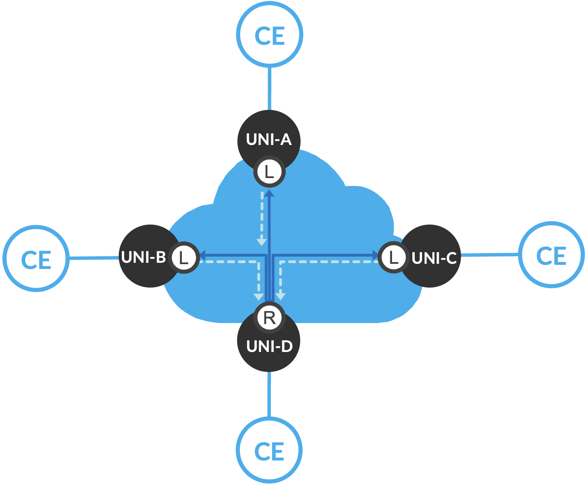
<figcaption><p>: E-TREE Rooted-Multipoint Single Root</p></figcaption>
</figure>

The second topology is shown below ( Figure 12 ) with multiple Root EVCs. In this scenario, leaf-to-leaf communication is still forbidden to only leaf-to-root or leaf-to-multiple roots. However, root-to-root communications are allowed, providing additional reliability and high availability. The Metro EBS JVD includes dual root nodes in active-active high availability modes.

<figure>
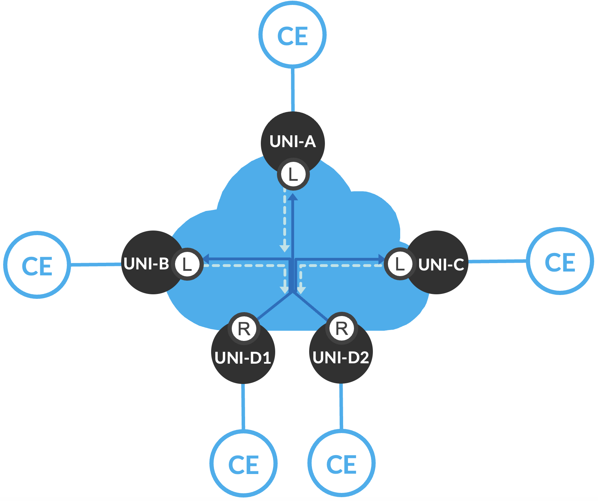
<figcaption><p>: E-TREE Rooted-Multipoint Multiple Roots</p></figcaption>
</figure>

E-Tree implements similar performance categories to E-Line and E-LAN services to meet established SLOs to ensure key performance metrics are delivered. This includes:

- Differing bandwidth rates between UNIs.

- Multiple Class of Service (CoS) profiles for tailoring service levels.

- Performance objectives measuring Frame Delay (FD), Inter-Frame Delay Variation (IFDV), and Frame Loss Ratio (FLR) to establish availability metrics.

- Service Multiplexing at one or more UNIs, enabling flexibility for rooted-multipoint services that may coexist with other service types.

These metrics ensure that the network meets specific performance levels, making it suitable for more critical applications that require reliable data transmission, such as voice, video, or financial transactions.

E-Tree services come in two main variations determined by the degree of control delegated between the provider and customer end user:

1.  **Ethernet Private Tree (EP-Tree)** is a port-based, rooted-multipoint “all-to-one bundling” service providing a dedicated and private transparent data path. All traffic on the physical port (UNI) is mapped to a single EVC. EP-Tree allows subscribers full control over their network infrastructure with the flexibility to create and manage site-to-site connectivity options. Subscriber CE-VLAN IDs and CE-VLAN CoS markings are preserved end-to-end without restrictions.

2.  **Ethernet Virtual Private Tree (EVP-Tree)** supports service multiplexing and shared bandwidth across the network. EVP-Tree enables multiple EVCs on one or more UNIs, providing greater flexibility for delivering multiple rooted-multipoint services. In parallel, point-to-point EVPL E-Line or multipoint-to-multipoint EVP-LAN EVCs may be created over a single UNI. Subscribers and/or traffic flows can be mapped to specific VLANs with flexible VLAN ID preservation and QoS mapping.

E-Tree services offer a range of possibilities for enterprises to interconnect facilities in an efficient, scalable, and secure manner. The detailed service attributes and configurations, as outlined in MEF technical specifications, provide a foundation for customizing the service to meet varying business needs.

The Iometrix MEF 3.0 validation covers the critical functionality required to deliver E-Tree services and provide robust, flexible, and scalable solutions for organizations that require reliable rooted-multipoint Ethernet connectivity. Leveraging the Metro EBS JVD solution architecture enables the ability to scale from best-effort services to high-performance, guaranteed service delivery with strict performance objectives.

###### E-TREE Rooted-Multipoint Services

The protocol suite of rooted-multipoint E-Tree services covered by the JVD includes EVPN-ETREE with single or dual root nodes. The EVP-Tree use case includes 1129 MEF-related test cases executed as part of the validation. EP-Tree is supported but not included in the validation. The key service categories under test include:

1.  Functional Service Attributes and Parameters

2.  Layer 2 Control Protocol Frame Behaviors

3.  Service OAM Functionalities

4.  Bandwidth Profile Attributes and Parameters

5.  Service Performance Attributes and Parameters

<figure>

<figcaption><p>: E-Tree Base Protocol Suite</p></figcaption>
</figure>

Multiple combinations and service attributes of EVPN-ETREE are supported beyond the scope of what is included in the JVD, with MX304 (MSE1, MSE2) as active-active root nodes and MX204 (MA4, MA5) as leaf nodes.

<figure>
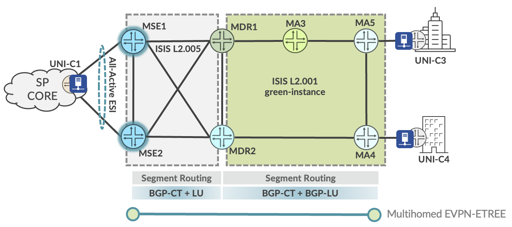
<figcaption><p>: E-TREE Rooted-Multipoint Service Termination</p></figcaption>
</figure>

The lab topology includes service instantiation points illustrated in Figure 14 for E-Tree services, covered by the corresponding MEF test cases. Iometrix test probes are placed throughout the topology for conducting the end-to-end validation.

Table 12: E-TREE EVP-TREE Service Use Cases

| Index | Service Type | VPN Type | High Availability | Service Instantiation | Endpoints |
|----|----|----|----|----|----|
| 1 | E-Tree | EVPN-ETREE | Active-Active Roots | Metro Ring | MSE1, MSE2, MA4, MA5 |

Every VPN service included in the JVD is designed with the purpose of delivering crucial metro functionality and connectivity objectives. The services featured in the above table are further explained below.

Table 13: E-TREE EVP-TREE Service Use Cases

<table>
<colgroup>
<col style="width: 11%" />
<col style="width: 15%" />
<col style="width: 72%" />
</colgroup>
<thead>
<tr>
<th>Matching<br />
Index</th>
<th>EVP-TREE</th>
<th style="text-align: left;">Metro Use Case</th>
</tr>
</thead>
<tbody>
<tr>
<td><strong>[ 1 ]</strong></td>
<td>EVPN-ETREE</td>
<td style="text-align: left;">EVPN-ETREE is implemented as a VLAN-based service with leaf nodes at MA4 (MX204) and MA5 (MX204). Redundant Root nodes are included at MSE1 and MSE2 (MX304) for active-active high availability. Leaf-to-leaf communication is forbidden. All-active ESI LAG is supported for UNI resiliency at the MSEs.</td>
</tr>
</tbody>
</table>

For E-Tree configurations used in this JVD and in Metro Ethernet Business Services JVD, please visit the Juniper GitHub repository at <https://github.com/Juniper/jvd> or contact your Juniper Networks representative.

###### E-Tree: EVPN-ETREE Example

EVPN-ETREE is implemented as a VLAN-based service with leaf nodes at MA4 (MX204) and MA5 (MX204). Redundant Root nodes are included at MSE1 and MSE2 (MX304) for active-active high availability. Leaf-to-leaf communication is forbidden. All-active ESI LAG is supported for UNI resiliency at the MSEs. Further details are explained in the section **E-TREE Rooted-Multipoint Services.**

The sample configuration below provides outputs for MSE1 (root), MSE2 (root), MA4 (leaf), and MA5 (leaf).

**Root: MSE1 (MX304)**

```
interfaces {

ae10 {

unit 4080 {

encapsulation vlan-bridge;

vlan-id 4080;

esi {

00:10:11:11:40:80:01:62:00:01;

all-active;

}

family bridge {

filter {

input f_elan-evpn;

}

}

etree-ac-role root;

}

}

}

routing-instances {

evpn_group_80_4080 {

instance-type evpn;

protocols {

evpn {

interface ae10.4080;

evpn-etree;

}

}

vlan-id 4080;

interface ae10.4080;

route-distinguisher 10.0.0.10:4080;

vrf-export evpn_group_80_4080;

vrf-target target:63536:4080;

}

}
```

**Root: MSE2 (MX304)**

```
interfaces {

ae10 {

unit 4080 {

encapsulation vlan-bridge;

vlan-id 4080;

esi {

00:10:11:11:40:80:01:62:00:01;

all-active;

}

etree-ac-role root;

}

}

}

routing-instances {

evpn_group_80_4080 {

instance-type evpn;

protocols {

evpn {

interface ae10.4080;

evpn-etree;

}

}

vlan-id 4080;

interface ae10.4080;

route-distinguisher 10.0.0.11:4080;

vrf-export evpn_group_80_4080;

vrf-target target:63536:4080;

}

}
```

**Leaf: MA4 (MX204)**

```
interfaces {

xe-0/1/5 {

flexible-vlan-tagging;

mtu 9102;

encapsulation flexible-ethernet-services;

unit 4080 {

encapsulation vlan-bridge;

vlan-id 4080;

family bridge {

filter {

input f_elan-evpn;

}

}

etree-ac-role leaf;

}

}

}

routing-instances {

evpn_group_80_4080 {

instance-type evpn;

protocols {

evpn {

interface xe-0/1/5.4080;

evpn-etree;

}

}

vlan-id 4080;

interface xe-0/1/5.4080;

route-distinguisher 10.0.0.16:4080;

vrf-export evpn_group_80_4080;

vrf-target target:63536:4080;

}

}
```

**Leaf: MA5 (MX204)**

```
interfaces {

xe-0/1/0 {

flexible-vlan-tagging;

mtu 9102;

encapsulation flexible-ethernet-services;

unit 4080 {

encapsulation vlan-bridge;

vlan-id 4080;

family bridge {

filter {

input f_elan-evpn;

}

}

etree-ac-role leaf;

}

}

}

routing-instances {

evpn_group_80_4080 {

instance-type evpn;

protocols {

evpn {

interface xe-0/1/0.4080;

evpn-etree;

}

}

vlan-id 4080;

interface xe-0/1/0.4080;

route-distinguisher 10.0.0.19:4080;

vrf-export evpn_group_80_4080;

vrf-target target:63536:4080;

}

}
```

For full details on EVPN-ETREE configurations, please refer to the Juniper GitHub repository at <https://github.com/Juniper/jvd>.

###### Metro as a Service: Access E-LINE

The following sections describe how MEF framework is leveraged in the JVD to deliver Metro as a Service (MaaS) solutions. This section explains the Access E-Line (formerly E-Access) portion of the MEF 3.0 validation.

Access E-Line is defined by MEF 51 technical specification as a wholesale Ethernet access service based on the usage of Operator Virtual Connections (OVCs) to associate External Network-to-Network Interface (ENNI) endpoint(s) to UNI endpoint(s). The OVC enables an operator to provide Ethernet connectivity between a Customer Edge (CE) at the UNI and another service provider at the External ENNI. This model allows Ethernet services to transport across multiple operators' networks while ensuring service consistency and quality.

The UNI acts as the customer demarcation point with the service provider. The ENNI is situated at the boundary between two operator networks and serves as the connection point where the OVC terminates in the provider’s network, transitioning to another network or service provider. In the case the OVC facilitates a transfer within a single operator, the connection type is called an Internal Network-to-Network Interface (INNI), but the functional characteristics are the same.

Table 14: ENNI and INNI Characteristics

| Feature | ENNI | INNI |
|----|----|----|
| Location | Between two operator networks | Within a single operator's network |
| Purpose | Inter-operator connectivity | Intra-operator connectivity |
| Connection Type | Connects independent provider networks | Connects internal network domains |
| Example Use Case | Wholesale-to-retail provider connection | Multi-services Integration |

The Access E-Line service formed by the point-to-point OVC is called O-Line, which may interconnect a UNI to an ENNI or between two ENNIs. Multiple O-Line services may be strung together across provider domains or multi-operator networks.

Additional connectivity methods are possible to form Access E-LAN multipoint-to-multipoint (O-LAN service) but are not covered in the JVD.

<figure>
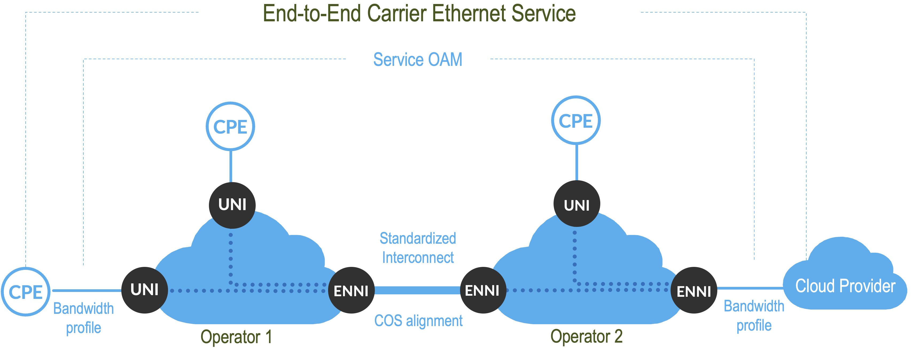
<figcaption><p>: Access E-Line with ENNI Connectivity</p></figcaption>
</figure>

Access E-Line involves several components that differ from the previous services described so far. These include:

1.  **OVC-Based Architecture**: The OVC links the UNI at the customer’s location to the ENNI, which interconnects different service provider networks. The OVC acts as the carrier for traffic between these interfaces, ensuring secure and reliable transport of Ethernet services across domains.

2.  **Seamless Multi-Operator Connectivity**: By leveraging OVCs, the Access E-Line service allows one provider to use another provider’s infrastructure to extend their service reach. This facilitates end-to-end service delivery across multiple administrative domains without compromising service quality.

3.  **OVC Types**: E-Access services can support both Point-to-Point OVCs (similar to EPL services) and Multiplexed OVCs (similar to EVPL services), allowing multiple services to be delivered over a single physical connection. The service provider owning the access infrastructure may support multiple virtual circuits identified by a single VLAN ID. This flexibility makes it suitable for a wide variety of business and wholesale scenarios.

Access E-Line may be leveraged to deliver several use cases, including:

- **Wholesale Access**: A provider can offer access services to other operators, allowing them to deliver Ethernet services in regions outside their own network footprint.

- **Multi-Domain Ethernet Services**: Access E-Line simplifies the process of offering Ethernet services across multiple operators' networks by using standardized OVCs at the ENNI.

Access E-Line allows operators to extend service offerings while maintaining control over the quality and performance.

###### Access E-Line Services

The protocol suite of point-to-point OVC Access E-Line covered by the JVD includes approximately 400 MEF-related test cases in the validation of the key service categories:

1.  Functional Service Attributes and Parameters

2.  Layer 2 Control Protocol Frame Behaviors

3.  Service OAM Functionalities

4.  Bandwidth Profile Attributes and Parameters

5.  Service Performance Attributes and Parameters

<figure>

<figcaption><p>: Access E-Line Base Protocol Suite</p></figcaption>
</figure>

Multiple combinations and service attributes of Access E-Line are supported beyond the scope of what is included in the JVD, such as Access E-LAN, Access E-Tree, and Access E-Transit permutations. O-Line services are point-to-point in nature and may be chained to connect disparate UNIs across multiple O-Line connections. OVC pairs forming O-Line services may consist of the following connectivity types:

1.  Connecting two External or Internal NNIs (ENNI or INNI)

2.  Connecting OVC endpoints (ENNI or INNI) within the same device (aka Hairpinning)

3.  Connecting ENNI or INNI to a UNI

Two options featured in the JVD to facilitate Access E-Line include leveraging local-switched services: L2CCC with L2Circuit local-switching and EVPN-VPWS local-switching.

<figure>
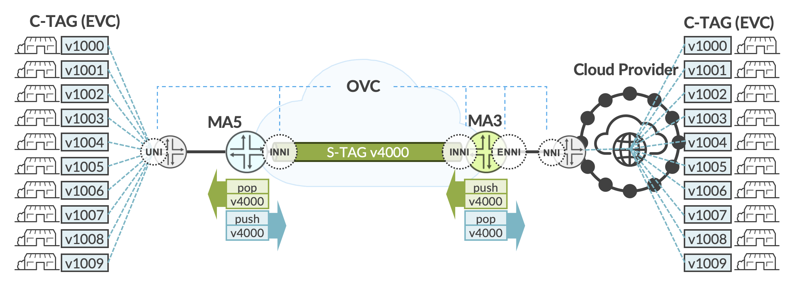
<figcaption><p>: Access E-Line</p></figcaption>
</figure>

In the example shown ( Figure 15 ), end-to-end connectivity is achieved across multiple O-Line services for a cloud provider interconnection.

EVCs are service multiplexed, which may support multitenant use cases. At the transit point of MA5 (MX204), an S-TAG is mapped to the OVC endpoint toward MA3 (ACX7100-48L) to support INNI-to-INNI connectivity within the same Carrier Ethernet network. Traffic is exchanged across the interdomain segment using S-TAG information. C-TAGs and COS markings are preserved. The S-TAG may be removed at the ENNI OVC to expose the original C-TAG infrastructure to the Cloud Provider. The interworkings of how the O-Line services are achieved are flexible and dependent on the use case requirements. Extending or swapping S-TAG at the ENNI-to-NNI exchange may be preferred to continue transporting CE-VLANs transparently.

For Access E-Line configurations used in this JVD and in Metro Ethernet Business Services JVD, please visit the Juniper GitHub repository at <https://github.com/Juniper/jvd> or contact your Juniper Networks representative.

###### Access E-Line: EVPN-VPWS Local-Switching Example

Access E-Line (formerly E-Access) services may be delivered with several permutations. The JVD includes common local-switching methodologies using EVPN-VPWS or L2Circuit (L2CCC). A range of VLAN-IDs are identified at the OVC ENNI position, pushing an outer S-TAG. The transport network to the destination OVC needs only to be aware of the outer VLAN-ID. Further details are explained in the section **Metro as a Service: Access E-LINE**.

The sample configuration below provides outputs for MA3 (ACX7100-48L).

**MA3 (ACX7100-48L)**

```
interfaces {

et-0/0/0 {

flexible-vlan-tagging;

mtu 9102;

encapsulation flexible-ethernet-services;

ether-options {

ethernet-switch-profile {

tag-protocol-id \[ 0x8100 0x88a8 \];

}

}

unit 2500 {

encapsulation vlan-ccc;

vlan-id-list 2500-2599;

input-vlan-map {

push;

tag-protocol-id 0x88a8;

vlan-id 4082;

}

output-vlan-map pop;

family ccc {

filter {

input f_eline-evpn-vpws;

}

}

}

}

et-0/0/51 {

mtu 9102;

ether-options {

ethernet-switch-profile {

tag-protocol-id \[ 0x8100 0x88a8 \];

}

}

unit 4082 {

encapsulation vlan-ccc;

vlan-tags outer 0x88a8.4082;

}

}

}

routing-instances {

lsw_evpn_vpws_group_90_4082 {

instance-type evpn-vpws;

protocols {

evpn {

interface et-0/0/0.2500 {

vpws-service-id {

local 22;

remote 11;

}

}

interface et-0/0/51.4082 {

vpws-service-id {

local 11;

remote 22;

}

}

control-word;

}

}

interface et-0/0/0.2500;

interface et-0/0/51.4082;

route-distinguisher 10.0.0.15:4082;

vrf-target target:63533:4082;

}

}
```

For full details on Access E-Line configurations, please refer to the Juniper GitHub repository at <https://github.com/Juniper/jvd>.

###### Access E-Line: L2Circuit Local-Switching Example

A similar configuration, leveraging L2Circuit local-switching, is accomplished with the below sample configuration.

**MA3 (ACX7100-48L)**

```
interfaces {

et-0/0/0 {

flexible-vlan-tagging;

mtu 9102;

encapsulation flexible-ethernet-services;

ether-options {

ethernet-switch-profile {

tag-protocol-id \[ 0x8100 0x88a8 \];

}

}

unit 2500 {

encapsulation vlan-ccc;

vlan-id-list 2500-2599;

input-vlan-map {

push;

tag-protocol-id 0x88a8;

vlan-id 4082;

}

output-vlan-map pop;

family ccc {

filter {

input f_eline-evpn-vpws;

}

}

}

}

et-0/0/51 {

mtu 9102;

ether-options {

ethernet-switch-profile {

tag-protocol-id \[ 0x8100 0x88a8 \];

}

}

unit 4082 {

encapsulation vlan-ccc;

vlan-tags outer 0x88a8.4082;

}

}

}

protocols {

l2circuit {

local-switching {

interface et-0/0/0.2500 {

end-interface {

interface et-0/0/51.4082;

}

ignore-mtu-mismatch;

}

}

}

}
```

# Results Summary and Analysis

The JVD team successfully validated E-Line, E-LAN, E-Tree, and Access E-Line services included in the [Metro Ethernet Business Services JVD](https://www.juniper.net/documentation/us/en/software/jvd/jvd-metro-ebs-03-01/index.html) using Iometrix Lab in the Sky infrastructure. Over 12,000 test cases were executed to ensure the featured services meet MEF 3.0 compliance. The validation includes use cases delivered with EVPN-VPWS, EVPN Flexible Cross Connect, L2Circuit, L2VPN, and BGP-VPLS in intra-AS and inter-AS scenarios.

The primary devices under test include MEF 3.0-certified products: ACX7024, ACX7100, ACX7509, and MX304. The below topology ( Figure 18 ) illustrates the physical architecture built to support this solution in Juniper labs. Iometrix test probes are placed in the positions shown with blue icons to facilitate traffic flows and compliance examinations.

Throughout the validation, our goal is to remain aligned with MEF 3.0 mandatory certification requirements as defined by [MEF 91 Carrier Ethernet Test Requirements](https://www.mef.net/wp-content/uploads/2021/03/MEF-91.pdf) standard. Test cases are categorized as mandatory or conditional mandatory.

- MANDATORY test cases, as included in MEF 3.0 certification, are covered by the JVD.

- CONDITIONAL MANDATORY test cases are not enforced, typically due to reliance upon optional features or attributes. In other words, these test scenarios only become mandatory when certain optional attributes are utilized. Depending on whether the conditions already exist in the Metro EBS network design, optional test cases may or may not be covered by the JVD.

The solution architecture supports additional features and functionalities defined by MEF but beyond the scope of the unconditional mandatory certification criteria. Future JVD iterations may expand testing to include optional attributes.

In some cases, optional (conditional mandatory) attributes are covered to preserve the intentionality of the JVD itself, such as UNI resiliency. The test data identifies certification applicability criteria with additional columns to clearly identify areas where the validation tested beyond the scope of MEF 3.0 requirements.

<figure>

<figcaption><p>: Metro Topology Under Test</p></figcaption>
</figure>

The validation focused on five major categories of test scenarios related to MEF 3.0. Tests were executed from Iometrix Lab in the Sky infrastructure. All included test cases passed without exception.

1.  Functional Service Attributes and Parameters

2.  Layer 2 Control Protocol Frame Behaviors

3.  Service OAM Functionalities

4.  Bandwidth Profile Attributes and Parameters

5.  Service Performance Attributes and Parameters

###### Functional Service Attributes and Parameters

This category validates service functionalities and attributes defined for service types, including E-Line, E-LAN, E-Tree, and Access E-Line. It ensures that services meet the necessary operational characteristics and behaviors, such as Ethernet Virtual Connections (EVCs), VLAN handling, and service multiplexing.

The table below summarizes functional testing included in the JVD. For additional test information, please see the Test Report Brief or contact your Juniper representative.

In each case, the number of endpoints is adjusted based on the service type. For example, E-LAN and E-Tree will include a minimum of 3 sites, and E-Line will always be two sites. As a result, test cases have additional multipliers (not shown below) to validate all possible combinations.

The Access E-Line test cases share similar functional goals as E-Line, E-LAN, and E-Tree but with a focus on validating OVC endpoints related to ENNI operations with single and double-tagged frames.

Table 15: MEF Functional Test Cases

| Test Type | Test Name | Service Type |
|:---|:---|:---|
| Functional | Class of Service attributes and behaviors | EPL, EP-LAN, EVPL, EVP-LAN, EVP-TREE |
| Functional | EVC Service attributes | EPL, EP-LAN, EVPL, EVP-LAN, EVP-TREE |
| Functional | Non-Looping Frame Delivery for Broadcast, Multicast, and Unknown Unicast (High, Med, Low) | EPL, EP-LAN, EVPL, EVP-LAN, EVP-TREE |
| Functional | CE-VLAN Preservation for Untagged Service Frames | EPL, EP-LAN |
| Functional | CE-VLAN Preservation for Tagged Service Frames (High, Med, Low) | EPL, EP-LAN, EVPL, EVP-LAN, EVP-TREE |
| Functional | CE-VLAN Preservation Priority Tagged Service Frames (High, Med, Low) | EPL, EP-LAN |
| Functional | CE-VLAN Preservation Tagged Service Frames PCP 0-1 (Low) | EPL, EP-LAN |
| Functional | CE-VLAN Preservation Tagged Service Frames PCP 2-3 (Med) | EPL, EP-LAN |
| Functional | CE-VLAN Preservation Tagged Service Frames PCP 4-5 (High) | EPL, EP-LAN |
| Functional | CE-VLAN Preservation Priority Tagged Service Frames PCP 0-1 (Low) | EPL, EP-LAN |
| Functional | CE-VLAN Preservation Priority Tagged Service Frames PCP 2-3 (Med) | EPL, EP-LAN |
| Functional | CE-VLAN Preservation Priority Tagged Service Frames PCP 4-5 (High) | EPL, EP-LAN |
| Functional | CE-VLAN DEI Preservation Tagged Service Frames DEI 0-1 (High, Med, Low) | EPL, EP-LAN |
| Functional | CE-VLAN DEI Preservation Priority Tagged Service Frames DEI 0-1 (High, Med, Low) | EPL, EP-LAN |
| Functional | UNI Physical Layer, Mode, and Speed (High, Med, Low) | EPL, EP-LAN, EVPL, EVP-LAN, EVP-TREE |
| Functional | EVC Maximum Service Frame Size for Untagged | EPL, EP-LAN |
| Functional | EVC Maximum Service Frame Size for Tagged (High, Med, Low) | EPL, EP-LAN, EVPL, EVP-LAN, EVP-TREE |
| Functional | CE-VLAN ID/EVC Map Service Frame Discard (High, Med, Low) | EVPL, EVP-LAN, EVP-TREE |
| Functional | Maximum CE-VLAN IDs per EVC EPs with All-to-One Bundling Enabled | EPL, EP-LAN |
| Functional | Single Copy of Service Frame Delivery in Multipoint EVC for Broadcast (High, Med, Low) | EPL, EP-LAN, EVP-TREE |
| Functional | Single Copy of Service Frame Delivery in Multipoint EVC for Multicast (High, Med, Low) | EPL, EP-LAN, EVP-TREE |
| Functional | Single Copy of Service Frame Delivery in Multipoint EVC for Unknown Unicast (High, Med, Low) | EPL, EP-LAN, EVP-TREE |
| Functional | Service Frame Transparency for Tagged to Tagged (High, Med, Low) | EPL, EP-LAN, EVPL, EVP-LAN, EVP-TREE |
| Functional | Service Frame Transparency for Untagged to Untagged | EPL, EP-LAN |
| Functional | Service Frame Transparency for Priority Tagged to Priority Tagged (High, Med, Low) | EPL, EP-LAN |
| Functional | Class of Service attributes and behaviors | Access E-Line |
| Functional | OVC Service attributes | Access E-Line |
| Functional | OVC CE-VLAN ID Preservation for Double-Tagged ENNI Frame (High, Med, Low) | Access E-Line |
| Functional | Maximum Number of CE-VLAN ID per OVC EPs at the UNI with Custom number of CE-VLAN IDs for Double Tagged ENNI Frame (High, Med, Low) | Access E-Line |
| Functional | OVC CE-VLAN PCP Preservation for Double-Tagged ENNI Frames PCP 0-1 (Low) | Access E-Line |
| Functional | OVC CE-VLAN PCP Preservation for Double-Tagged ENNI Frames PCP 2-3 (Med) | Access E-Line |
| Functional | OVC CE-VLAN PCP Preservation for Double-Tagged ENNI Frames PCP 4-5 (High) | Access E-Line |
| Functional | ENNI Physical Layer, Mode, and Speed with Double-Tagged ENNI Frame (High, Med, Low) | Access E-Line |
| Functional | OVC Maximum Frame Size with Double-Tagged ENNI Frame (High, Med, Low) | Access E-Line |
| Functional | OVC End Point Map with ENNI Frame Discard (High, Med, Low) | Access E-Line |
| Functional | OVC CE-VLAN ID Preservation with Tagged Service Frame (High, Med, Low) | Access E-Line |
| Functional | Maximum Number of CE-VLAN ID per OVC EPs at the UNI with Custom number of CE-VLAN IDs for Tagged Service Frame (High, Med, Low) | Access E-Line |
| Functional | OVC CE-VLAN PCP Preservation for Tagged ENNI Frames PCP 0-1 (Low) | Access E-Line |
| Functional | OVC CE-VLAN PCP Preservation for Tagged ENNI Frames PCP 2-3 (Med) | Access E-Line |
| Functional | OVC CE-VLAN PCP Preservation for Tagged ENNI Frames PCP 4-5 (High) | Access E-Line |
| Functional | UNI Physical Layer, Mode and Speed for Tagged Service Frame (High, Med, Low) | Access E-Line |
| Functional | OVC Maximum Frame Size for Tagged Service Frame (High, Med, Low) | Access E-Line |

Functional Test Cases: **PASS**

###### L2CP and SOAM Frame Behavior

This category tests the handling of Layer 2 Control Protocols (L2CP) and Service OAM (SOAM) frames, ensuring they are properly processed and managed by the system. It involves testing the correct tunneling and forwarding of control and management frames (e.g., CCM, LBM, LTM, LTR). The validation ensures frames are properly identified and handled according to MEF network operation and maintenance standards. Where applicable, Class of Service attributes are included.

L2CP test cases are validated based on MEF frame handling expectations. JUNOS-Evolved ACX devices leverage the \[mef-forwarding-profile\] persona to allow customers flexible default behaviors for handling L2CP frame filtering. Without the MEF profile, the majority of L2CP MAC types will be forwarded by design. Once the MEF forwarding profile is enabled, key L2CP MACs will be filtered or forwarded based on MEF expectations. For strict alignment, firewall filtering allows selective MAC filtering treatment. Both approaches are utilized in the JVD with all configurations provided.

The table below explains MEF test cases included in the JVD with a comparison of JUNOS-EVO behavior with and without enabling the MEF forwarding profile. For additional test information, please see the Test Report Brief or contact your Juniper representative.

Table 16: L2CP Frame Treatment

<table style="width:100%;">
<colgroup>
<col style="width: 59%" />
<col style="width: 11%" />
<col style="width: 13%" />
<col style="width: 15%" />
</colgroup>
<thead>
<tr>
<th style="text-align: left;">Layer 2 Control Protocol MAC</th>
<th style="text-align: left;">MEF Behavior</th>
<th style="text-align: left;">MEF Profile<br />
Enabled</th>
<th style="text-align: left;">MEF Profile<br />
Disabled</th>
</tr>
</thead>
<tbody>
<tr>
<td style="text-align: left;">01-80-C2-00-00-01 IEEE MAC Specific Destination Address</td>
<td style="text-align: left;">Filtered</td>
<td style="text-align: left;">Filtered</td>
<td style="text-align: left;">Filtered</td>
</tr>
<tr>
<td style="text-align: left;">01-80-C2-00-00-02 IEEE Slow Protocols LACP Destination Address</td>
<td style="text-align: left;">Filtered</td>
<td style="text-align: left;">Filtered</td>
<td style="text-align: left;">Forwarded</td>
</tr>
<tr>
<td style="text-align: left;">01-80-C2-00-00-02 IEEE Slow Protocols Marker Destination Address</td>
<td style="text-align: left;">Filtered</td>
<td style="text-align: left;">Filtered</td>
<td style="text-align: left;">Forwarded</td>
</tr>
<tr>
<td style="text-align: left;">01-80-C2-00-00-02 IEEE Slow Protocols Link OAM Destination Address</td>
<td style="text-align: left;">Filtered</td>
<td style="text-align: left;">Filtered</td>
<td style="text-align: left;">Forwarded</td>
</tr>
<tr>
<td style="text-align: left;">01-80-C2-00-00-03 Nearest Non-TMPR Bridge Destination Address</td>
<td style="text-align: left;">Filtered</td>
<td style="text-align: left;">Filtered</td>
<td style="text-align: left;">Forwarded</td>
</tr>
<tr>
<td style="text-align: left;">01-80-C2-00-00-04 IEEE MAC Specific Destination Address</td>
<td style="text-align: left;">Filtered</td>
<td style="text-align: left;">Filtered</td>
<td style="text-align: left;">Forwarded</td>
</tr>
<tr>
<td style="text-align: left;">01-80-C2-00-00-05 Reserved Destination Address</td>
<td style="text-align: left;">Filtered</td>
<td style="text-align: left;">Filtered</td>
<td style="text-align: left;">Forwarded</td>
</tr>
<tr>
<td style="text-align: left;">01-80-C2-00-00-06 Reserved Destination Address</td>
<td style="text-align: left;">Filtered</td>
<td style="text-align: left;">Filtered</td>
<td style="text-align: left;">Forwarded</td>
</tr>
<tr>
<td style="text-align: left;">01-80-C2-00-00-07 MEF E-LMI Destination Address</td>
<td style="text-align: left;">Filtered</td>
<td style="text-align: left;">Forwarded</td>
<td style="text-align: left;">Forwarded</td>
</tr>
<tr>
<td style="text-align: left;">01-80-C2-00-00-08 Provider Bridge Group Destination Address</td>
<td style="text-align: left;">Filtered</td>
<td style="text-align: left;">Filtered</td>
<td style="text-align: left;">Forwarded</td>
</tr>
<tr>
<td style="text-align: left;">01-80-C2-00-00-09 Reserved Destination Address</td>
<td style="text-align: left;">Filtered</td>
<td style="text-align: left;">Filtered</td>
<td style="text-align: left;">Forwarded</td>
</tr>
<tr>
<td style="text-align: left;">01-80-C2-00-00-0A Reserved Destination Address</td>
<td style="text-align: left;">Filtered</td>
<td style="text-align: left;">Filtered</td>
<td style="text-align: left;">Forwarded</td>
</tr>
<tr>
<td style="text-align: left;">01-80-C2-00-00-0E Nearest Bridge Individual LAN PTPv2 Destination Address</td>
<td style="text-align: left;">Filtered</td>
<td style="text-align: left;">Forwarded</td>
<td style="text-align: left;">Forwarded</td>
</tr>
<tr>
<td style="text-align: left;">01-80-C2-00-00-0E Nearest Bridge Individual LAN LLDP Destination Address</td>
<td style="text-align: left;">Filtered</td>
<td style="text-align: left;">Forwarded</td>
<td style="text-align: left;">Filtered</td>
</tr>
<tr>
<td style="text-align: left;">01-80-C2-00-00-20 MRP Destination Address</td>
<td style="text-align: left;">Filtered</td>
<td style="text-align: left;">Forwarded</td>
<td style="text-align: left;">Forwarded</td>
</tr>
<tr>
<td style="text-align: left;">01-80-C2-00-00-21 MRP Destination Address</td>
<td style="text-align: left;">Filtered</td>
<td style="text-align: left;">Forwarded</td>
<td style="text-align: left;">Forwarded</td>
</tr>
<tr>
<td style="text-align: left;">01-80-C2-00-00-22 MRP Destination Address</td>
<td style="text-align: left;">Filtered</td>
<td style="text-align: left;">Forwarded</td>
<td style="text-align: left;">Forwarded</td>
</tr>
<tr>
<td style="text-align: left;">01-80-C2-00-00-23 MRP Destination Address</td>
<td style="text-align: left;">Filtered</td>
<td style="text-align: left;">Forwarded</td>
<td style="text-align: left;">Forwarded</td>
</tr>
<tr>
<td style="text-align: left;">01-80-C2-00-00-24 MRP Destination Address</td>
<td style="text-align: left;">Filtered</td>
<td style="text-align: left;">Forwarded</td>
<td style="text-align: left;">Forwarded</td>
</tr>
<tr>
<td style="text-align: left;">01-80-C2-00-00-25 MRP Destination Address</td>
<td style="text-align: left;">Filtered</td>
<td style="text-align: left;">Forwarded</td>
<td style="text-align: left;">Forwarded</td>
</tr>
<tr>
<td style="text-align: left;">01-80-C2-00-00-26 MRP Destination Address</td>
<td style="text-align: left;">Filtered</td>
<td style="text-align: left;">Forwarded</td>
<td style="text-align: left;">Forwarded</td>
</tr>
<tr>
<td style="text-align: left;">01-80-C2-00-00-27 MRP Destination Address</td>
<td style="text-align: left;">Filtered</td>
<td style="text-align: left;">Forwarded</td>
<td style="text-align: left;">Forwarded</td>
</tr>
<tr>
<td style="text-align: left;">01-80-C2-00-00-28 MRP Destination Address</td>
<td style="text-align: left;">Filtered</td>
<td style="text-align: left;">Forwarded</td>
<td style="text-align: left;">Forwarded</td>
</tr>
<tr>
<td style="text-align: left;">01-80-C2-00-00-29 MRP Destination Address</td>
<td style="text-align: left;">Filtered</td>
<td style="text-align: left;">Forwarded</td>
<td style="text-align: left;">Forwarded</td>
</tr>
<tr>
<td style="text-align: left;">01-80-C2-00-00-2A MRP Destination Address</td>
<td style="text-align: left;">Filtered</td>
<td style="text-align: left;">Forwarded</td>
<td style="text-align: left;">Forwarded</td>
</tr>
<tr>
<td style="text-align: left;">01-80-C2-00-00-2B MRP Destination Address</td>
<td style="text-align: left;">Filtered</td>
<td style="text-align: left;">Forwarded</td>
<td style="text-align: left;">Forwarded</td>
</tr>
<tr>
<td style="text-align: left;">01-80-C2-00-00-2C MRP Destination Address</td>
<td style="text-align: left;">Filtered</td>
<td style="text-align: left;">Forwarded</td>
<td style="text-align: left;">Forwarded</td>
</tr>
<tr>
<td style="text-align: left;">01-80-C2-00-00-2D MRP Destination Address</td>
<td style="text-align: left;">Filtered</td>
<td style="text-align: left;">Forwarded</td>
<td style="text-align: left;">Forwarded</td>
</tr>
<tr>
<td style="text-align: left;">01-80-C2-00-00-2E MRP Destination Address</td>
<td style="text-align: left;">Filtered</td>
<td style="text-align: left;">Forwarded</td>
<td style="text-align: left;">Forwarded</td>
</tr>
<tr>
<td style="text-align: left;">01-80-C2-00-00-2F MRP Destination Address</td>
<td style="text-align: left;">Filtered</td>
<td style="text-align: left;">Forwarded</td>
<td style="text-align: left;">Forwarded</td>
</tr>
<tr>
<td style="text-align: left;">01-80-C2-00-00-00 Nearest Customer Bridge Destination Address</td>
<td style="text-align: left;">Forwarded <sup>1</sup></td>
<td style="text-align: left;">Forwarded</td>
<td style="text-align: left;">Forwarded</td>
</tr>
<tr>
<td style="text-align: left;">01-80-C2-00-00-0B Reserved Destination Address</td>
<td style="text-align: left;">Forwarded <sup>1</sup></td>
<td style="text-align: left;">Forwarded</td>
<td style="text-align: left;">Forwarded</td>
</tr>
<tr>
<td style="text-align: left;">01-80-C2-00-00-0C Reserved Destination Address</td>
<td style="text-align: left;">Forwarded <sup>1</sup></td>
<td style="text-align: left;">Forwarded</td>
<td style="text-align: left;">Forwarded</td>
</tr>
<tr>
<td style="text-align: left;">01-80-C2-00-00-0D Provider Bridge MVRPs Destination Address</td>
<td style="text-align: left;">Forwarded <sup>1</sup></td>
<td style="text-align: left;">Forwarded</td>
<td style="text-align: left;">Forwarded</td>
</tr>
<tr>
<td style="text-align: left;">01-80-C2-00-00-0F Reserved Destination Address</td>
<td style="text-align: left;">Forwarded <sup>1</sup></td>
<td style="text-align: left;">Forwarded</td>
<td style="text-align: left;">Forwarded</td>
</tr>
</tbody>
</table>

<sup>1</sup> VLAN-based services filter these L2CP MACs

L2CP Test Cases: **PASS**

The L2CP validation includes MEF Forwarding Profile configuration on ACX7000 platforms with an additional filter-set configuration to match MEF behavior expectations. The UNI configuration is applicable to any device with \[ mef-forwarding-profile \] configuration. In the case where this configuration is not supported or excluded for selective MAC-handling behavior, the firewall filter is expanded to cover the complete address space.

In this portion of the validation, two configuration variants are used. The first configuration segment below is applicable to all port-based and VLAN-based services. The second portion of the configuration (as indicated) is additionally applicable to VLAN-based services.

**VLAN-based and Port-based Services**

```
system {

packet-forwarding-options {

mef-forwarding-profile;

}

}

firewall {

family ethernet-switching {

filter l2cp {

interface-specific;

term discard-l2cp {

from {

destination-mac-address {

01:80:c2:00:00:07/48;

01:80:c2:00:00:0e/48;

01:80:c2:00:00:20/48;

01:80:c2:00:00:21/48;

01:80:c2:00:00:22/48;

01:80:c2:00:00:23/48;

01:80:c2:00:00:2a/48;

01:80:c2:00:00:2d/48;

01:80:c2:00:00:2e/48;

01:80:c2:00:00:2f/48;

01:80:c2:00:00:2b/48;

01:80:c2:00:00:24/48;

01:80:c2:00:00:25/48;

01:80:c2:00:00:26/48;

01:80:c2:00:00:27/48;

01:80:c2:00:00:28/48;

01:80:c2:00:00:29/48;

01:80:c2:00:00:2c/48;

}

}

then {

count l2cp_discard;

discard;

}

}
```

**VLAN-based Services will also include these addresses**

```
firewall {

family ethernet-switching {

filter l2cp {

interface-specific;

term discard-l2cp {

from {

01:80:c2:00:00:00/48;

01:80:c2:00:00:0b/48;

01:80:c2:00:00:0c/48;

01:80:c2:00:00:0d/48;

01:80:c2:00:00:0f/48;

}

}
```

For configurations used in this JVD and in Metro Ethernet Business Services JVD, please visit the Juniper GitHub repository at <https://github.com/Juniper/jvd> or contact your Juniper Networks representative.

The table below summarizes Service OAM testing included in the JVD. For additional test information, please see the Test Report Brief or contact your Juniper representative. Every row represents multiple test cases where service frames are validated with different MEG Levels, each with high, medium, and low Class of Service attributes.

Table 17: MEF SOAM Test Cases

| Test Type | Test Name | Service Type |
|:---|:---|:---|
| SOAM | Continuity Check Message Transparency for Untagged CCM Service Frame - MEG Level 6 and Level 7 | EPL, EP-LAN |
| SOAM | Multicast Loopback Message Transparency for Untagged LBM Service Frame - MEG Level 6 and Level 7 | EPL, EP-LAN |
| SOAM | Unicast Loopback Message Transparency for Untagged LBM Service Frame - MEG Level 6 and Level 7 | EPL, EP-LAN |
| SOAM | Loopback Response Transparency for Untagged LBR Service Frame - MEG Level 6 and Level 7 | EPL, EP-LAN |
| SOAM | Linktrace Message Transparency for Untagged LTM Service Frame - MEG Level 6 and Level 7 | EPL, EP-LAN |
| SOAM | Linktrace Response Transparency for Untagged LTR Service Frame - MEG Level 6 level 7 | EPL, EP-LAN |
| SOAM | Continuity Check Message Transparency for Tagged CCM Service Frame - MEG Level 6-7 (High, Med, Low) | EVPL, EVP-LAN, EVP-TREE |
| SOAM | Multicast Loopback Message Transparency for Tagged LBM Service Frame - MEG Level 6-7 (High, Med, Low) | EVPL, EVP-LAN, EVP-TREE |
| SOAM | Unicast Loopback Message Transparency for Tagged LBM Service Frame - MEG Level 6-7 (High, Med, Low) | EVPL, EVP-LAN, EVP-TREE |
| SOAM | Loopback Response Transparency for Tagged LBR Service Frame - MEG Level 6-7 (High, Med, Low) | EVPL, EVP-LAN, EVP-TREE |
| SOAM | Linktrace Message Transparency for Tagged LTM Service Frame - MEG Level 6-7 (High, Med, Low) | EVPL, EVP-LAN, EVP-TREE |
| SOAM | Linktrace Response Transparency for Tagged LTR Service Frame - MEG Level 6-7 (High, Med, Low) | EVPL, EVP-LAN, EVP-TREE |
| SOAM | Continuity Check Message Transparency - Double Tagged CCM ENNI Frames - MEG Level 3, Level 4, Level 5, Level 6, and Level 7 (High, Med, Low) | Access E-Line |
| SOAM | Multicast Loopback Message Transparency - Double Tagged LBM ENNI Frames - MEG Level 3, Level 4, Level 5, Level 6, and Level 7 (High, Med, Low) | Access E-Line |
| SOAM | Unicast Loopback Message Transparency - Double Tagged LBM ENNI Frames - MEG Level 3, Level 4, Level 5, Level 6, and Level 7 (High, Med, Low) | Access E-Line |
| SOAM | Loopback Response Transparency - Double Tagged LBR ENNI Frames - MEG Level 3, Level 4, Level 5, Level 6, and Level 7 (High, Med, Low) | Access E-Line |
| SOAM | Linktrace Message Transparency - Double Tagged LTM ENNI Frames - MEG Level 3, Level 4, Level 5, Level 6, and Level 7 (High, Med, Low) | Access E-Line |
| SOAM | Linktrace Response Transparency - Double Tagged LTR ENNI Frames - MEG Level 3, Level 4, Level 5, Level 6, and Level 7 (High, Med, Low) | Access E-Line |
| SOAM | Continuity Check Message Transparency - Tagged CCM Service Frame - MEG Level 3, Level 4, Level 5, Level 6, and Level 7 (High, Med, Low) | Access E-Line |
| SOAM | Multicast Loopback Message Transparency - Tagged LBM Service Frame - MEG Level 3, Level 4, Level 5, Level 6, and Level 7 (High, Med, Low) | Access E-Line |
| SOAM | Unicast Loopback Message Transparency - Tagged LBM Service Frame - MEG Level 3, Level 4, Level 5, Level 6, and Level 7 (each with High, Med, Low) | Access E-Line |
| SOAM | Loopback Response Transparency - Tagged LBR Service Frame - MEG Level 3, Level 4, Level 5, Level 6, and Level 7 (High, Med, Low) | Access E-Line |
| SOAM | Linktrace Message Transparency - Tagged LTM Service Frame - MEG Level 3, Level 4, Level 5, Level 6, and Level 7 (High, Med, Low) | Access E-Line |
| SOAM | Linktrace Response Transparency - Tagged LTR Service Frame - MEG Level 3, Level 4, Level 5, Level 6, and Level 7 (High, Med, Low) | Access E-Line |

Service OAM Test Cases: **PASS**

###### Bandwidth Profile Attributes and Parameters

This category focuses on verifying that Bandwidth Profiles can meet the expectations for service delivery in Carrier Ethernet networks. Performance metrics like traffic policing are validated to ensure proper traffic flow management in different service conditions.

The BWP topic validates attributes such as the performance and enforcement of committed information rates (CIR), committed burst size (CBS), excess information rates (EIR), excess burst size, and traffic shaping to ensure that the service adheres to the agreed-upon bandwidth allocations. In addition, test cases include color-blind and color-aware functionalities, conformance for the delivery of different frame types, and validation of CoS behaviors.

The table below summarizes BWP testing included in the JVD. For additional test information, please see the Test Report Brief or contact your Juniper representative.

Table 18: MEF BWP Test Cases

| Test Type | Test Name | Service Type |
|:---|:---|:---|
| BWP | Color Blind Ingress BWP - CIR Enforcement Tagged Frames when \[CIR/CBS\>0 and EIR/EBS=0\] and CoS ID per EVC & PCP | EPL, EP-LAN, EVPL, EVP-LAN, EVP-TREE |
| BWP | Color Blind Ingress BWP - CBS Enforcement Tagged Frames when \[CIR/CBS\>0 and EIR/EBS=0\] and CoS ID per EVC & PCP | EPL, EP-LAN, EVPL, EVP-LAN, EVP-TREE |
| BWP | Color Blind Ingress BWP - EIR Enforcement Tagged Frames when \[CIR/CBS=0 and EIR/EBS\>0\] and CoS ID per EVC & PCP | EPL, EP-LAN, EVPL, EVP-LAN, EVP-TREE |
| BWP | Color Blind Ingress BWP - EIR Enforcement Untagged Frames when \[CIR/CBS=0 and EIR/EBS\>0\] and CoS ID per EVC & PCP | EPL, EP-LAN, EVPL, EVP-LAN, EVP-TREE |
| BWP | Color Blind Ingress BWP - EBS Enforcement Tagged Frames when \[CIR/CBS=0 and EIR/EBS\>0\] and CoS ID per EVC & PCP | EPL, EP-LAN, EVPL, EVP-LAN, EVP-TREE |
| BWP | Color Blind Ingress BWP - EBS Enforcement Untagged Frames when \[CIR/CBS=0 and EIR/EBS\>0\] and CoS ID per EVC & PCP | EPL, EP-LAN, EVPL, EVP-LAN, EVP-TREE |
| BWP | Color Blind Ingress BWP - CIR and EIR Enforcement Tagged Frames when \[CIR/CBS\>0 and EIR/EBS\>0\] and CoS ID per EVC & PCP | EPL, EP-LAN, EVPL, EVP-LAN, EVP-TREE |
| BWP | Color Blind Ingress BWP - CBS and EBS Enforcement Tagged Frames when \[CIR/CBS\>0 and EIR/EBS\>0\] and CoS ID per EVC & PCP | EPL, EP-LAN, EVPL, EVP-LAN, EVP-TREE |
| BWP | Color Blind Ingress BWP - Unconditional Delivery of Broadcast Frames and CoS ID per EVC & PCP | EPL, EP-LAN, EVPL, EVP-LAN, EVP-TREE |
| BWP | Color Blind Ingress BWP - Unconditional Delivery of Multicast Frames and CoS ID per EVC & PCP | EPL, EP-LAN, EVPL, EVP-LAN, EVP-TREE |
| BWP | Color Blind Ingress BWP - Unconditional Delivery of Unicast Frames and CoS ID per EVC & PCP | EPL, EP-LAN, EVPL, EVP-LAN, EVP-TREE |
| BWP | Color Blind Ingress BWP - Class of Service Discard and CoS ID per EVC & PCP | EPL, EP-LAN, EVPL, EVP-LAN, EVP-TREE |
| BWP | Color Aware Ingress BWP - CIR Enforcement Tagged Frames when \[CIR/CBS\>0 and EIR/EBS=0\] and CoS ID per OVC EP & PCP - Color ID per PCP | Access E-Line |
| BWP | Color Aware Ingress BWP - Color Awareness Verification Tagged Frames when \[CIR/CBS\>0 and EIR/EBS=0\] and CoS ID per OVC EP & PCP - Color ID per PCP | Access E-Line |
| BWP | Color Aware Ingress BWP - CBS Enforcement Tagged Frames when \[CIR/CBS\>0 and EIR/EBS=0\] and CoS ID per OVC EP & PCP - Color ID per PCP | Access E-Line |
| BWP | Color Aware Ingress BWP - EIR Enforcement Tagged Frames when \[CIR/CBS=0 and EIR/EBS\>0\] and CoS ID per OVC EP & PCP - Color ID per PCP | Access E-Line |
| BWP | Color Aware Ingress BWP - Color Awareness Verification Tagged Frames when \[CIR/CBS=0 and EIR/EBS\>0\] and CoS ID per OVC EP & PCP - Color ID per PCP | Access E-Line |
| BWP | Color Aware Ingress BWP - EBS Enforcement Tagged Frames when \[CIR/CBS=0 and EIR/EBS\>0\] and CoS ID per OVC EP & PCP - Color ID per PCP | Access E-Line |
| BWP | Color Aware Ingress BWP - CIR and EIR Enforcement Tagged Frames when \[CIR/CBS\>0 and EIR/EBS\>0\] and CoS ID per OVC EP & PCP - Color ID per PCP | Access E-Line |
| BWP | Color Aware Ingress BWP - Color Awareness Verification Tagged Frames when \[CIR/CBS\>0, EIR/EBS\>0 and CF=0\] and CoS ID per OVC EP & PCP - Color ID per PCP | Access E-Line |
| BWP | Color Aware Ingress BWP - CBS and EBS Enforcement Tagged Frames when \[CIR/CBS\>0 and EIR/EBS\>0\] and CoS ID per OVC EP & PCP - Color ID per PCP | Access E-Line |
| BWP | Color Aware Ingress BWP - Unconditional Delivery of Broadcast Frames and CoS ID per OVC EP & PCP - Color ID per PCP | Access E-Line |
| BWP | Color Aware Ingress BWP - Unconditional Delivery of Multicast Frames and CoS ID per OVC EP & PCP - Color ID per PCP | Access E-Line |
| BWP | Color Aware Ingress BWP - Unconditional Delivery of Unicast Frames and CoS ID per OVC EP & PCP - Color ID per PCP | Access E-Line |
| BWP | Color Aware Ingress BWP - Class of Service Discard and CoS ID per OVC EP & PCP - Color ID per PCP | Access E-Line |
| BWP | Color Blind Ingress BWP - CIR Enforcement Tagged Frames when \[CIR/CBS\>0 and EIR/EBS=0\] and CoS ID per OVC EP & PCP | Access E-Line |
| BWP | Color Blind Ingress BWP - CBS Enforcement Tagged Frames when \[CIR/CBS\>0 and EIR/EBS=0\] and CoS ID per OVC EP & PCP | Access E-Line |
| BWP | Color Blind Ingress BWP - EIR Enforcement Tagged Frames when \[CIR/CBS=0 and EIR/EBS\>0\] and CoS ID per OVC EP & PCP | Access E-Line |
| BWP | Color Blind Ingress BWP - EBS Enforcement Tagged Frames when \[CIR/CBS=0 and EIR/EBS\>0\] and CoS ID per OVC EP & PCP | Access E-Line |
| BWP | Color Blind Ingress BWP - CIR and EIR Enforcement Tagged Frames when \[CIR/CBS\>0 and EIR/EBS\>0\] and CoS ID per OVC EP & PCP | Access E-Line |
| BWP | Color Blind Ingress BWP - CBS and EBS Enforcement Tagged Frames when \[CIR/CBS\>0 and EIR/EBS\>0\] and CoS ID per OVC EP & PCP | Access E-Line |
| BWP | Color Blind Ingress BWP - Unconditional Delivery of Broadcast Frames and CoS ID per OVC EP & PCP | Access E-Line |
| BWP | Color Blind Ingress BWP - Unconditional Delivery of Multicast Frames and CoS ID per OVC EP & PCP | Access E-Line |
| BWP | Color Blind Ingress BWP - Unconditional Delivery of Unicast Frames and CoS ID per OVC EP & PCP | Access E-Line |
| BWP | Color Blind Ingress BWP - Class of Service Discard and CoS ID per OVC EP & PCP | Access E-Line |

Bandwidth Profile Test Cases: **PASS**

Traffic is metered based on two-rate tricolor marking policers (TrTCM) largely defined by [RFC4115](https://datatracker.ietf.org/doc/html/rfc4115). An example bandwidth profile used in the validation is displayed below and is applicable to ACX and MX platforms. Multiple bandwidth profiles are utilized throughout the validation depending on the MEF test case being executed. The BWP shown below is for the EVPL E-Line color-blind test case.

**ACX7100 TrTCM Color-Blind Policer**

```
firewall {

family ccc {

filter f_eline-evpn-vpws {

interface-specific;

term discard_pcp {

from {

learn-vlan-1p-priority \[ 6 7 \];

}

then {

count discard_pcp6_7;

discard;

}

}

term high_class {

from {

learn-vlan-1p-priority \[ 5 4 \];

}

then {

three-color-policer {

two-rate high_policer;

}

count high_class;

}

}

term medium_class {

from {

learn-vlan-1p-priority \[ 3 2 \];

}

then {

three-color-policer {

two-rate medium_policer;

}

count class_medium;

}

}

term low_class {

from {

learn-vlan-1p-priority \[ 0 1 \];

}

then {

three-color-policer {

two-rate low_policer;

}

count class_low;

}

}

term default {

then {

three-color-policer {

two-rate low_policer;

}

count default;

}

}

}

three-color-policer high_policer {

action {

loss-priority high then discard;

}

two-rate {

color-blind;

committed-information-rate 3500000000;

committed-burst-size 35k;

peak-information-rate 3500000000;

peak-burst-size 35125;

}

}

three-color-policer low_policer {

action {

loss-priority high then discard;

}

two-rate {

color-blind;

committed-information-rate 22k;

committed-burst-size 125;

peak-information-rate 3500000000;

peak-burst-size 35k;

}

}

three-color-policer medium_policer {

action {

loss-priority high then discard;

}

two-rate {

color-blind;

committed-information-rate 3500000000;

committed-burst-size 35k;

peak-information-rate 7g;

peak-burst-size 70k;

}

}

}
```

The attribute learn-vlan-1p-priority matches the IEEE 802.1p VLAN priority in the outer position. In this example, the test case calls for matching traffic marked with 802.1p priority bits \[6, 7\] and discarding these packets while performing two-rate tricolor marking in color-blind mode, policing traffic individually classified as *high*, *medium*, and *low*. The policer is constructed in three main components:

1.  *Two-Rate* defines two bandwidth limits: guaranteed or committed information rate (CIR) and committed burst size (CBS); peak information rate (PIR) and peak burst size (PBS).

2.  *Tricolor marking* categorizes traffic as Green, Yellow, or Red. Green traffic conforms to the defined guaranteed bandwidth (CIR) and burst (CBS) limits. Green traffic is given an implicit packet loss priority (PLP) of low. Yellow traffic exceeds the committed (CIR) or burst (CBS) rates but remains within the peak (PIR) and burst (PBS) rates. Yellow traffic is given a PLP of medium-high. Red traffic exceeds PIR or PBS and is given a PLP of high. Policers may only mark traffic (soft policing) or elect to discard traffic exceeding PIR (hard policing). In the example, traffic marked with an implicit loss priority of high (red) is discarded.

3.  *Color Mode* defines if the policer is color-blind or color-aware. In color-blind mode, the policer ignores any premarked packets. In color-aware mode, the policer becomes cognizant of previously marked or metered packets and inspects the packet’s loss priority to be treated accordingly. The PLP value can be raised but not lowered. In other words, a packet received with a yellow loss priority (medium-high) can be marked red but cannot be remarked to green

NOTE: Behavior Aggregate classifiers can also influence color-aware mode policers, so it is important to consider the appropriate packet-handling configuration.

The below configuration provides an example of a TrTCM color-aware mode policer utilized for an Access E-Line BWP test scenario. In this case, a cascade policer hierarchy is created by marking and metering traffic onto the next term to be aggregated and considered with other matching traffic priorities in the same policer.

The Coupling Flag (CF) attribute determines how yellow-marked traffic is handled, which is to say, traffic exceeding the CIR token bucket. When CF is enabled (CF=1), yellow frames equate to CIR+PIR and are not discarded when exceeding CIR. When CF is disabled (CF=0), yellow service frames exceeding CIR are discarded (CIR=PIR). MX platforms by default leverage CF=1 but can be configured for CF=0 by simply matching on the PLP and discarding (see CF0-yellow).

**MX TrTCM Color-Aware Policer**

```
firewall {

family bridge {

filter f-epl-option-1 {

interface-specific;

term high_class_discard {

from {

learn-vlan-1p-priority \[ 6 7 \];

}

then {

count pcp_6_7;

discard;

}

}

term high_class {

from {

learn-vlan-1p-priority 4;

}

then {

count high_pcp4;

loss-priority high;

next term;

}

}

term color-envelop {

from {

learn-vlan-1p-priority \[ 5 4 \];

}

then {

three-color-policer {

two-rate high_policer;

}

count color-envelop;

}

}

term medium_class-3 {

from {

learn-vlan-1p-priority 3;

}

then {

three-color-policer {

two-rate medium_policer;

}

count med-3;

accept;

}

}

term medium_class-2 {

from {

learn-vlan-1p-priority 2;

}

then {

three-color-policer {

two-rate medium_policer;

}

count med-2;

next term;

}

}

term CF0-yellow {

from {

loss-priority medium-high;

learn-vlan-1p-priority 2;

}

then {

count CFO-yellow;

discard;

}

}

term low_class {

from {

learn-vlan-1p-priority \[ 0 1 \];

}

then {

three-color-policer {

two-rate low_policer;

}

count low_class;

}

}

term deault {

then count default_traffic;

}

}

}

}

three-color-policer high_policer {

action {

loss-priority high then discard;

}

two-rate {

color-aware;

committed-information-rate 3500000000;

committed-burst-size 35k;

peak-information-rate 3500000000;

peak-burst-size 35125;

}

}

three-color-policer low_policer {

action {

loss-priority high then discard;

}

two-rate {

color-aware;

committed-information-rate 22k;

committed-burst-size 1500;

peak-information-rate 3500000000;

peak-burst-size 35k;

}

}

three-color-policer medium_policer {

action {

loss-priority high then discard;

}

two-rate {

color-aware;

committed-information-rate 3500000000;

committed-burst-size 35k;

peak-information-rate 7g;

peak-burst-size 70k;

}

}

}
```

For configurations used in this JVD and in Metro Ethernet Business Services JVD, please visit the Juniper GitHub repository at <https://github.com/Juniper/jvd> or contact your Juniper Networks representative.

###### Service Performance Attributes and Parameters

This category tests performance characteristics like latency, jitter, frame loss ratio (FLR), and availability in compliance with the specified Service Level Agreements (SLAs). It ensures that the service can meet the agreed-upon performance parameters for various traffic types (e.g., unicast, multicast, broadcast) under real-world conditions, validating that service performance aligns with customer requirements.

Multiple test cases are executed for each topic, measuring one-way metrics in all directions based on the service type. The table below summarizes Performance testing included in the JVD. For additional test information, please see the Test Report Brief or contact your Juniper representative.

Table 19: MEF Performance Test Cases

| Test Type | Test Name | Service Type |
|:---|:---|:---|
| Performance | One-Way Frame Delay Performance | EPL, EP-LAN, EVPL, EVP-LAN, EVP-TREE, Access E-Line |
| Performance | One-Way Mean Frame Delay Performance | EPL, EP-LAN, EVPL, EVP-LAN, EVP-TREE, Access E-Line |
| Performance | One-Way Inter-Frame Delay Variation Performance | EPL, EP-LAN, EVPL, EVP-LAN, EVP-TREE, Access E-Line |
| Performance | One-Way Frame Delay Range Performance | EPL, EP-LAN, EVPL, EVP-LAN, EVP-TREE, Access E-Line |
| Performance | One-Way Frame Loss Ratio Performance | EPL, EP-LAN, EVPL, EVP-LAN, EVP-TREE, Access E-Line |

Performance Test Cases: **PASS**

###### E-LINE Test Results Summary

Details of E-Line validation can be found in the section *Metro as a Service: E-LINE*. The table below explains the E-Line service attributes and test scenarios applicable to MEF 3.0 certification and what is covered by in the validation. The scope of the validation aligns with MEF test requirements for E-Line:

1.  UNI Service Attributes and Test Requirements

2.  EVC Service Attributes and Test Requirements

3.  EVC per-UNI Service Attributes and Test Requirements

The tables provided are based on [MEF 91 Carrier Ethernet Test Requirements](https://www.mef.net/wp-content/uploads/2021/03/MEF-91.pdf). The Certification Applicability column does not always equate to a mandatory requirement. Additional context is explained in the table descriptions and reference technical specifications. For example, some parameters may be \[Enabled or Disabled\] or \[MUST be No\] based on the defined MEF technical specifications. These may translate to optional or mandatory only under optional conditions. In such cases, the JVD may include or exclude these scenarios.

The JVD Test Coverage column confirms the attributes that were included and validated in the course of execution.

Table 20: MEF 3.0 E-Line UNI Service Attributes and Test Requirements

<table>
<colgroup>
<col style="width: 6%" />
<col style="width: 22%" />
<col style="width: 41%" />
<col style="width: 7%" />
<col style="width: 8%" />
<col style="width: 6%" />
<col style="width: 7%" />
</colgroup>
<thead>
<tr>
<th style="text-align: center;"><strong>Index</strong></th>
<th><strong>UNI Service Attributes</strong></th>
<th><strong>Summary Description</strong></th>
<th colspan="2"><strong>Certification Applicability<br />
◉ = Tested<br />
❍= Not Tested</strong></th>
<th colspan="2"><strong>JVD Test coverage<br />
◉ = Tested<br />
❍= Not Tested</strong></th>
</tr>
</thead>
<tbody>
<tr>
<td style="text-align: center;">1</td>
<td>UNI ID</td>
<td>String as specified in Section 9.1 of MEF 10.3</td>
<td>EPL ❍</td>
<td>EVPL ❍</td>
<td>EPL ◉</td>
<td>EVPL ◉</td>
</tr>
<tr>
<td style="text-align: center;">2</td>
<td>Physical Layer</td>
<td>List of Physical Layers as specified in Section 9.2 of MEF 10.3</td>
<td>EPL ◉</td>
<td>EVPL ◉</td>
<td>EPL ◉</td>
<td>EVPL ◉</td>
</tr>
<tr>
<td style="text-align: center;">3</td>
<td>Synchronous Mode <sup>1</sup></td>
<td>List of Disabled or Enabled for each link in the UNI as specified in Section 9.3 of MEF 10.3</td>
<td>EPL ❍</td>
<td>EVPL ❍</td>
<td>EPL ❍</td>
<td>EVPL ❍</td>
</tr>
<tr>
<td style="text-align: center;">4</td>
<td>Number of Links <sup>1</sup></td>
<td>At least 1 as specified in Section 9.4 of MEF 10.3</td>
<td>EPL ❍</td>
<td>EVPL ❍</td>
<td>EPL ◉</td>
<td>EVPL ◉</td>
</tr>
<tr>
<td style="text-align: center;">5</td>
<td>UNI Resiliency <sup>1, J1</sup></td>
<td>None or 2-link Aggregation or Other as specified in Section 9.5 of MEF 10.3</td>
<td>EPL ❍</td>
<td>EVPL ❍</td>
<td>EPL ❍</td>
<td>EVPL ◉</td>
</tr>
<tr>
<td style="text-align: center;">6</td>
<td>Service Frame Format</td>
<td>IEEE 802.3 - 2012 as specified in Section 9.6 of MEF 10.3</td>
<td>EPL ◉</td>
<td>EVPL ◉</td>
<td>EPL ◉</td>
<td>EVPL ◉</td>
</tr>
<tr>
<td style="text-align: center;">7</td>
<td>UNI Maximum Service Frame Size</td>
<td>At least 1522 Bytes as specified in Section 9.7 of MEF 10.3. SHOULD be &gt; 1600 Bytes</td>
<td>EPL ◉</td>
<td>EVPL ◉</td>
<td>EPL ◉</td>
<td>EVPL ◉</td>
</tr>
<tr>
<td style="text-align: center;">8</td>
<td>Service Multiplexing <sup>3, J3</sup></td>
<td>Enabled or Disabled as specified in Section 9.8 of MEF 10.3</td>
<td>EPL ❍</td>
<td>EVPL ❍</td>
<td>EPL ❍</td>
<td>EVPL ◉</td>
</tr>
<tr>
<td style="text-align: center;">9</td>
<td>CE-VLAN ID for Untagged and Priority Tagged Service Frames</td>
<td>A value in the range 1 to 4094 as specified in Section 9.9 of MEF 10.3</td>
<td>EPL ❍</td>
<td>EVPL ◉</td>
<td>EPL ◉</td>
<td>EVPL ◉</td>
</tr>
<tr>
<td style="text-align: center;">10</td>
<td>CE-VLAN ID/EVC Map</td>
<td>A map as specified in Section 9.10 of MEF 10.3</td>
<td>EPL ◉</td>
<td>EVPL ◉</td>
<td>EPL ◉</td>
<td>EVPL ◉</td>
</tr>
<tr>
<td style="text-align: center;">11</td>
<td>Maximum number of EVCs</td>
<td>At least 1 as specified in Section 9.11 of MEF 10.3</td>
<td>EPL ◉</td>
<td>EVPL ◉</td>
<td>EPL ◉</td>
<td>EVPL ◉</td>
</tr>
<tr>
<td style="text-align: center;">12</td>
<td>Bundling</td>
<td>Enabled or Disabled as specified in Section 9.12 of MEF 10.3</td>
<td>EPL ❍</td>
<td>EVPL ◉</td>
<td>EPL ❍</td>
<td>EVPL ◉</td>
</tr>
<tr>
<td style="text-align: center;">13</td>
<td>All to One Bundling</td>
<td>Enabled or Disabled as specified in Section 9.13 of MEF 10.3</td>
<td>EPL ◉</td>
<td>EVPL ❍</td>
<td>EPL ◉</td>
<td>EVPL ❍</td>
</tr>
<tr>
<td style="text-align: center;">14</td>
<td>Token Share</td>
<td>Enabled or Disabled as specified in Section 8.2.1 of this MEF 6.2</td>
<td>EPL ◉</td>
<td>EVPL ◉</td>
<td>EPL ◉</td>
<td>EVPL ◉</td>
</tr>
<tr>
<td style="text-align: center;">15</td>
<td>Envelopes</td>
<td>list of &lt;Envelope ID. CF<sup>0</sup>, n&gt;. where &lt;Envelope ID. CF<sup>0</sup> &gt; is as specified in Section 12.1 of MEF 10.3 and n is the number of Bandwidth Profile Flows in the Envelope</td>
<td>EPL ◉</td>
<td>EVPL ◉</td>
<td>EPL ◉</td>
<td>EVPL ◉</td>
</tr>
<tr>
<td style="text-align: center;">16</td>
<td>Ingress BWP per UNI <sup>J3</sup></td>
<td>Ingress BWP per UNI as specified in Section 9.14 of MEF 10.3<br />
MUST be No</td>
<td>EPL ❍</td>
<td>EVPL ❍</td>
<td>EPL ◉</td>
<td>EVPL ◉</td>
</tr>
<tr>
<td style="text-align: center;">17</td>
<td>Egress BWP per UNI <sup>J2</sup></td>
<td>Egress BWP per UNI as specified in Section 9.14 of MEF 10.3<br />
MUST be No</td>
<td>EPL ❍</td>
<td>EVPL ❍</td>
<td>EPL ❍</td>
<td>EVPL ❍</td>
</tr>
<tr>
<td style="text-align: center;">18</td>
<td>Link OAM <sup>1</sup></td>
<td>Enabled or Disabled as specified in Section 9.16 of MEF 10.3</td>
<td>EPL ❍</td>
<td>EVPL ❍</td>
<td>EPL ❍</td>
<td>EVPL ❍</td>
</tr>
<tr>
<td style="text-align: center;">19</td>
<td>UNI MEG <sup>1</sup></td>
<td>Enabled or Disabled as specified in Section 9.17 of MEF 10.3</td>
<td>EPL ❍</td>
<td>EVPL ❍</td>
<td>EPL ❍</td>
<td>EVPL ❍</td>
</tr>
<tr>
<td style="text-align: center;">20</td>
<td>E-LMI <sup>1</sup></td>
<td>Enabled or Disabled as specified in Section 9.18 of MEF 10.3</td>
<td>EPL ❍</td>
<td>EVPL ❍</td>
<td>EPL ❍</td>
<td>EVPL ❍</td>
</tr>
<tr>
<td style="text-align: center;">21</td>
<td>UNI L2CP Address Set</td>
<td>CTB or CTB-2 or CTA as specified in MEF 45 table 10 for EVPL and in MEF 45.0.1 Table 11 for EPL</td>
<td>EPL ◉</td>
<td>EVPL ◉</td>
<td>EPL ◉</td>
<td>EVPL ◉</td>
</tr>
<tr>
<td style="text-align: center;">22</td>
<td>UNI L2CP peering <sup>2</sup></td>
<td>None or list of {Destination Address, Protocol Identifier) or list of {Destination Address Protocol Identifier Link Identifier) to be Peered as specified in MEF 45</td>
<td>EPL ◉</td>
<td>EVPL ◉</td>
<td>EPL ◉</td>
<td>EVPL ◉</td>
</tr>
</tbody>
</table>

<sup>Reference: [MEF 91 Carrier Ethernet Test Requirements](https://www.mef.net/wp-content/uploads/2021/03/MEF-91.pdf)</sup>

<sup>1</sup> As per MEF 91, control and management protocols such as E-LMI, Link OAM, Service OAM UNI-MEG, Service OAM ENNI-MEG, Test MEG, or protection mechanisms that may be operating at the external interfaces are outside the scope of the MEF 3.0 CE certification program. The deployment and verification of these protocols are to be handled between subscriber/service provider/operator.

<sup>2</sup> Protocols not on the list are either Passed to EVC or Discarded based on the Destination Address.

<sup>3</sup> Service Multiplexing requires the instantiation of at least two services at the UNI, which is outside the scope of the MEF 3.0 CE certification program. This is covered in the JVD.

<sup>J1</sup> UNI Resiliency is not mandated by MEF but included in the JVD as a foundational attribute with EVPN all-active ESI and further explained in [Metro Ethernet Business Services JVD](https://www.juniper.net/documentation/us/en/software/jvd/jvd-metro-ebs-03-01/index.html).

<sup>J2</sup> MEF 10.4 updates Egress Equivalence Class Service to an optional attribute and is no longer included in MEF 3.0.

<sup>J3</sup> Optional but covered in JVD.

Table 21: MEF 3.0 E-Line EVC Service Attributes and Test Requirements

<table>
<colgroup>
<col style="width: 6%" />
<col style="width: 22%" />
<col style="width: 41%" />
<col style="width: 7%" />
<col style="width: 8%" />
<col style="width: 6%" />
<col style="width: 7%" />
</colgroup>
<thead>
<tr>
<th style="text-align: center;"><strong>Index</strong></th>
<th><strong>EVC Service Attributes</strong></th>
<th><strong>Summary Description</strong></th>
<th colspan="2"><strong>Certification Applicability<br />
◉ = Tested<br />
❍= Not Tested</strong></th>
<th colspan="2"><strong>JVD Test coverage<br />
◉ = Tested<br />
❍= Not Tested</strong></th>
</tr>
</thead>
<tbody>
<tr>
<td style="text-align: center;">1</td>
<td>EVC Type</td>
<td>MUST be Point-to-Point as specified in Section 8.1 of MEF 10.3</td>
<td>EPL ◉</td>
<td>EVPL ◉</td>
<td>EPL ◉</td>
<td>EVPL ◉</td>
</tr>
<tr>
<td style="text-align: center;">2</td>
<td>EVC ID <sup>J3</sup></td>
<td>String as specified in Section 8.2 of MEF 10.3</td>
<td>EPL ❍</td>
<td>EVPL ❍</td>
<td>EPL ◉</td>
<td>EVPL ◉</td>
</tr>
<tr>
<td style="text-align: center;">3</td>
<td>UNI List</td>
<td>List of &lt;UNI ID, UNI Role&gt; pairs as specified in Section 8.3 of MEF 10.3 for UNIs associated by the EVC</td>
<td>EPL ◉</td>
<td>EVPL ◉</td>
<td>EPL ◉</td>
<td>EVPL ◉</td>
</tr>
<tr>
<td style="text-align: center;">4</td>
<td>Maximum Number of UNIs</td>
<td>MUST be two as specified in Section 8.4 of MEF 10.3</td>
<td>EPL ◉</td>
<td>EVPL ◉</td>
<td>EPL ◉</td>
<td>EVPL ◉</td>
</tr>
<tr>
<td style="text-align: center;">5</td>
<td>Unicast Service Frame Delivery</td>
<td>Discard or Deliver Unconditionally or Deliver Conditionally as specified in Section 8.5.2 of MEF 10.3</td>
<td>EPL ◉</td>
<td>EVPL ◉</td>
<td>EPL ◉</td>
<td>EVPL ◉</td>
</tr>
<tr>
<td style="text-align: center;">6</td>
<td>Multicast Service Frame Delivery</td>
<td>Discard or Deliver Unconditionally or Deliver Conditionally as specified in Section 8.5.2 of MEF 10.3</td>
<td>EPL ◉</td>
<td>EVPL ◉</td>
<td>EPL ◉</td>
<td>EVPL ◉</td>
</tr>
<tr>
<td style="text-align: center;">7</td>
<td>Broadcast Service Frame Delivery</td>
<td>Discard or Deliver Unconditionally or Deliver Conditionally as specified in Section 8.5.2 of MEF 10.3</td>
<td>EPL ◉</td>
<td>EVPL ◉</td>
<td>EPL ◉</td>
<td>EVPL ◉</td>
</tr>
<tr>
<td style="text-align: center;">8</td>
<td>CE-VLAN ID Preservation</td>
<td>Enabled or Disabled as specified in Section 8.6.1 of MEF 10.3</td>
<td>EPL ◉</td>
<td>EVPL ◉</td>
<td>EPL ◉</td>
<td>EVPL ◉</td>
</tr>
<tr>
<td style="text-align: center;">9</td>
<td>CE-VLAN CoS Preservation <sup>4</sup></td>
<td>Enabled or Disabled as specified in Section 8.6.2 of MEF 10.3</td>
<td>EPL ◉</td>
<td>EVPL ◉</td>
<td>EPL ◉</td>
<td>EVPL ◉</td>
</tr>
<tr>
<td style="text-align: center;">10</td>
<td>EVC Performance</td>
<td>List of performance metrics and associated parameters and performance objectives as specified in Section 8.8 of MEF 10.3</td>
<td>EPL ◉</td>
<td>EVPL ◉</td>
<td>EPL ◉</td>
<td>EVPL ◉</td>
</tr>
<tr>
<td style="text-align: center;">11</td>
<td>EVC Maximum Service Frame Size</td>
<td>At least 1522 as specified in Section 8.9 of MEF 10.3</td>
<td>EPL ◉</td>
<td>EVPL ◉</td>
<td>EPL ◉</td>
<td>EVPL ◉</td>
</tr>
<tr>
<td style="text-align: center;">12</td>
<td>Service Frame Transparency</td>
<td>Data Service Frame as specified in Section 8.5.3 of MEF 10.3</td>
<td>EPL ❍</td>
<td>EVPL ❍</td>
<td>EPL ◉</td>
<td>EVPL ◉</td>
</tr>
<tr>
<td style="text-align: center;">13</td>
<td>Continuity Check Message Transparency</td>
<td>CCM function as an operation that runs on a MEP for service monitoring as specified in 8.2 of MEF 30.1</td>
<td>EPL ❍</td>
<td>EVPL ❍</td>
<td>EPL ◉</td>
<td>EVPL ◉</td>
</tr>
<tr>
<td style="text-align: center;">14</td>
<td>Loopback Message Transparency</td>
<td>Needed for compliant MEF Service OAM implementation as specified in 8.3 of MEF 30.1</td>
<td>EPL ❍</td>
<td>EVPL ❍</td>
<td>EPL ◉</td>
<td>EVPL ◉</td>
</tr>
<tr>
<td style="text-align: center;">15</td>
<td>Linktrace Response Transparency</td>
<td>Needed for compliant MEF Service OAM implementation as specified in 8.4 of MEF 30.1</td>
<td>EPL ❍</td>
<td>EVPL ❍</td>
<td>EPL ◉</td>
<td>EVPL ◉</td>
</tr>
</tbody>
</table>

<sup>Reference: [MEF 91 Carrier Ethernet Test Requirements](https://www.mef.net/wp-content/uploads/2021/03/MEF-91.pdf)</sup>

<sup>4</sup> CE-VLAN ID Preservation testing includes the Service Frame Transparency verification.

<sup>J3</sup> Optional but covered in JVD.

Table 22: MEF 3.0 E-Line EVC Per-UNI Service Attributes and Test Requirements

<table>
<colgroup>
<col style="width: 6%" />
<col style="width: 22%" />
<col style="width: 40%" />
<col style="width: 7%" />
<col style="width: 8%" />
<col style="width: 6%" />
<col style="width: 7%" />
</colgroup>
<thead>
<tr>
<th style="text-align: center;"><strong>Index</strong></th>
<th><strong>EVC Per-UNI Service Attributes</strong></th>
<th><strong>Summary Description</strong></th>
<th colspan="2"><strong>Certification Applicability<br />
◉ = Tested<br />
❍= Not Tested</strong></th>
<th colspan="2"><strong>JVD Test coverage<br />
◉ = Tested<br />
❍= Not Tested</strong></th>
</tr>
</thead>
<tbody>
<tr>
<td style="text-align: center;">1</td>
<td>UNI EVC ID</td>
<td>String as specified in Section 10.1 of MEF 10.3</td>
<td>EPL ❍</td>
<td>EVPL ❍</td>
<td>EPL ❍</td>
<td>EVPL ❍</td>
</tr>
<tr>
<td style="text-align: center;">2</td>
<td>Class of Service Identifier for Data Service Frame</td>
<td>EVC or CE-VLAN CoS or IP value(s) and corresponding CoS Name as specified in Section 10.2.1 of MEF 10.3</td>
<td>EPL ◉</td>
<td>EVPL ◉</td>
<td>EPL ◉</td>
<td>EVPL ◉</td>
</tr>
<tr>
<td style="text-align: center;">3</td>
<td>Class of Service Identifier for L2CP Service Frame</td>
<td>"All" or list of each L2CP in the EVC and corresponding CoS Name as specified in Section 10.2.2 of MEF 10.3</td>
<td>EPL ◉</td>
<td>EVPL ◉</td>
<td>EPL ◉</td>
<td>EVPL ◉</td>
</tr>
<tr>
<td style="text-align: center;">4</td>
<td>Class of Service Identifier for SOAM Service Frame</td>
<td>Basis same as for Data Service Frames as specified in Section 10.2.3 of MEF 10.3</td>
<td>EPL ◉</td>
<td>EVPL ◉</td>
<td>EPL ◉</td>
<td>EVPL ◉</td>
</tr>
<tr>
<td style="text-align: center;">5</td>
<td>Color Identifier for Service Frame</td>
<td>None or EVC or CE-VLAN CoS or CE-VLAN Tag DEI or IP as specified in Section 10.3 of MEF 10.3</td>
<td>EPL ◉</td>
<td>EVPL ◉</td>
<td>EPL ◉</td>
<td>EVPL ◉</td>
</tr>
<tr>
<td style="text-align: center;">6</td>
<td>Egress Equivalence Class Identifier for Data Service Frames</td>
<td>CE-VLAN CoS or IP value(s) and corresponding CoS Name(s) as specified in Section 10.4.1 of MEF 10.3</td>
<td>EPL ❍</td>
<td>EVPL ◉</td>
<td>EPL ◉</td>
<td>EVPL ◉</td>
</tr>
<tr>
<td style="text-align: center;">7</td>
<td>Egress Equivalence Class Identifier for L2CP Service Frame</td>
<td>"All" or list of each L2CP in the EVC and corresponding Egress Equivalence Class as specified in Section 10.4.2 of MEF 10.3</td>
<td>EPL ❍</td>
<td>EVPL ◉</td>
<td>EPL ◉</td>
<td>EVPL ◉</td>
</tr>
<tr>
<td style="text-align: center;">8</td>
<td>Egress Equivalence Class Identifier for SOAM Service Frame</td>
<td>Basis same as for Data Service Frames as specified in Section 10.4.3 of MEF 10.3</td>
<td>EPL ❍</td>
<td>EVPL ◉</td>
<td>EPL ◉</td>
<td>EVPL ◉</td>
</tr>
<tr>
<td style="text-align: center;">9</td>
<td>Ingress Bandwidth Profile per EVC <sup>J3</sup></td>
<td>Ingress Bandwidth Profile per EVC as specified in Section 10.5 of MEF 10.3 MUST be No</td>
<td>EPL ❍</td>
<td>EVPL ❍</td>
<td>EPL ◉</td>
<td>EVPL ◉</td>
</tr>
<tr>
<td style="text-align: center;">10</td>
<td>Egress Bandwidth Profile per EVC <sup>J2</sup></td>
<td>Egress Bandwidth Profile per EVC as specified in Section 10.7 of MEF 10.3 MUST be No</td>
<td>EPL ❍</td>
<td>EVPL ❍</td>
<td>EPL ❍</td>
<td>EVPL ❍</td>
</tr>
<tr>
<td style="text-align: center;">11</td>
<td>Ingress Bandwidth Profile per Class of Service Identifier</td>
<td>No or Parameters with Bandwidth Profile as defined in Section 10.6 of MEF 10.3</td>
<td>EPL ◉</td>
<td>EVPL ◉</td>
<td>EPL ◉</td>
<td>EVPL ◉</td>
</tr>
<tr>
<td style="text-align: center;">12</td>
<td>Egress Bandwidth Profile per Egress Equivalence Class <sup>J2</sup></td>
<td>No or Parameters with Bandwidth Profile as defined in Section 10.8 of MEF 10.3</td>
<td>EPL ❍</td>
<td>EVPL ◉</td>
<td>EPL ❍</td>
<td>EVPL ❍</td>
</tr>
<tr>
<td style="text-align: center;">13</td>
<td>Source MAC Address Limit <sup>5</sup></td>
<td>Enabled or Disabled as specified in Section 10.9 of MEF 10.3</td>
<td>EPL ❍</td>
<td>EVPL ◉</td>
<td>EPL ❍</td>
<td>EVPL ❍</td>
</tr>
<tr>
<td style="text-align: center;">14</td>
<td>Test MEG <sup>J3</sup></td>
<td>Enabled or Disabled as specified in Section 10.10 of MEF 10.3</td>
<td>EPL ❍</td>
<td>EVPL ❍</td>
<td>EPL ◉</td>
<td>EVPL ◉</td>
</tr>
<tr>
<td style="text-align: center;">15</td>
<td>Subscriber MEG MIP</td>
<td>Enabled or Disabled as specified in Section 10.11 of MEF 10.3</td>
<td>EPL ◉</td>
<td>EVPL ◉</td>
<td>EPL ❍</td>
<td>EVPL ❍</td>
</tr>
</tbody>
</table>

<sup>Reference: [MEF 91 Carrier Ethernet Test Requirements](https://www.mef.net/wp-content/uploads/2021/03/MEF-91.pdf)</sup>

<sup>1</sup> As per MEF 91, control and management protocols such as E-LMI, Link OAM, Service OAM UNI-MEG, Service OAM ENNI-MEG, Test MEG, or protection mechanisms that may be operating at the external interfaces are outside the scope of the MEF 3.0 CE certification program. The deployment and verification of these protocols are to be handled between subscriber/service provider/operator.

<sup>5</sup> Optional attribute. Supported but not covered in JVD.

<sup>J2</sup> MEF 10.4 updates Egress Equivalence Class Service to an optional attribute and is no longer included in MEF 3.0.

<sup>J3</sup> Optional but covered in JVD.

###### E-LAN Test Results Summary

Details of E-LAN validation can be found in the section <span class="mark"></span>*Metro as a Service: E-LAN*. The table below explains the E-LAN service attributes and test scenarios applicable to MEF 3.0 certification and what is covered by the validation. The scope of the validation aligns with MEF test requirements for E-LAN:

1.  UNI Service Attributes and Test Requirements

2.  EVC Service Attributes and Test Requirements

3.  EVC per-UNI Service Attributes and Test Requirements

The tables are based on MEF 91 Test Requirements. The Certification Applicability column does not always equate to a mandatory requirement. Additional context is explained in the table descriptions and reference technical specifications. For example, some parameters may be \[Enabled or Disabled\] or \[MUST be No\] based on the defined MEF technical specifications. These may translate to optional or mandatory only under optional conditions. In such cases, the JVD may include or exclude these scenarios.

The JVD Test Coverage column confirms the attributes that were included and validated in the course of execution.

Table 23: MEF 3.0 E-LAN UNI Service Attributes and Test Requirements

<table>
<colgroup>
<col style="width: 6%" />
<col style="width: 20%" />
<col style="width: 38%" />
<col style="width: 8%" />
<col style="width: 9%" />
<col style="width: 8%" />
<col style="width: 9%" />
</colgroup>
<thead>
<tr>
<th><strong>Index</strong></th>
<th><strong>UNI Service Attributes</strong></th>
<th><strong>Summary Description</strong></th>
<th colspan="2"><strong>Certification Applicability<br />
◉ = Tested<br />
❍= Not Tested</strong></th>
<th colspan="2"><strong>JVD Test coverage<br />
◉ = Tested<br />
❍= Not Tested</strong></th>
</tr>
</thead>
<tbody>
<tr>
<td>1</td>
<td>UNI ID</td>
<td>String as specified in Section 9.1 of MEF 10.3</td>
<td>EP-LAN ❍</td>
<td>EVP-LAN ❍</td>
<td>EP-LAN ◉</td>
<td>EVP-LAN ◉</td>
</tr>
<tr>
<td>2</td>
<td>Physical Layer</td>
<td>List of Physical Layers as specified in Section 9.2 of MEF 10.3</td>
<td>EP-LAN ◉</td>
<td>EVP-LAN ◉</td>
<td>EP-LAN ◉</td>
<td>EVP-LAN ◉</td>
</tr>
<tr>
<td>3</td>
<td>Synchronous Mode <sup>1</sup></td>
<td>List of Disabled or Enabled for each link in the UNI as specified in Section 9.3 of MEF 10.3</td>
<td>EP-LAN ❍</td>
<td>EVP-LAN ❍</td>
<td>EP-LAN ❍</td>
<td>EVP-LAN ❍</td>
</tr>
<tr>
<td>4</td>
<td>Number of Links <sup>1</sup></td>
<td>At least 1 as specified in Section 9.4 of MEF 10.3</td>
<td>EP-LAN ❍</td>
<td>EVP-LAN ❍</td>
<td>EP-LAN ◉</td>
<td>EVP-LAN ◉</td>
</tr>
<tr>
<td>5</td>
<td>UNI Resiliency <sup>1,</sup> <sup>J1</sup></td>
<td>None or 2-link Aggregation or Other as specified in Section 9.5 of MEF 10.3</td>
<td>EP-LAN ❍</td>
<td>EVP-LAN ❍</td>
<td>EP-LAN ❍</td>
<td>EVP-LAN ◉</td>
</tr>
<tr>
<td>6</td>
<td>Service Frame Format</td>
<td>IEEE 802.3 - 2012 as specified in Section 9.6 of MEF 10.3</td>
<td>EP-LAN ◉</td>
<td>EVP-LAN ◉</td>
<td>EP-LAN ◉</td>
<td>EVP-LAN ◉</td>
</tr>
<tr>
<td>7</td>
<td>UNI Maximum Service Frame Size</td>
<td>At least 1522 Bytes as specified in Section 9.7 of MEF 10.3. SHOULD be &gt; 1600 Bytes</td>
<td>EP-LAN ◉</td>
<td>EVP-LAN ◉</td>
<td>EP-LAN ◉</td>
<td>EVP-LAN ◉</td>
</tr>
<tr>
<td>8</td>
<td>Service Multiplexing <sup>3, J3</sup></td>
<td>Enabled or Disabled as specified in Section 9.8 of MEF 10.3</td>
<td>EP-LAN ❍</td>
<td>EVP-LAN ❍</td>
<td>EP-LAN ❍</td>
<td>EVP-LAN ◉</td>
</tr>
<tr>
<td>9</td>
<td>CE-VLAN ID for Untagged and Priority Tagged Service Frames</td>
<td>A value in the range 1 to 4094 as specified in Section 9.9 of MEF 10.3</td>
<td>EP-LAN ❍</td>
<td>EVP-LAN ◉</td>
<td>EP-LAN ◉</td>
<td>EVP-LAN ◉</td>
</tr>
<tr>
<td>10</td>
<td>CE-VLAN ID/EVC Map</td>
<td>A map as specilied in Section 9.10 of MEF 10.3</td>
<td>EP-LAN ◉</td>
<td>EVP-LAN ◉</td>
<td>EP-LAN ◉</td>
<td>EVP-LAN ◉</td>
</tr>
<tr>
<td>11</td>
<td>Maximum number of EVCs</td>
<td>At least 1 as specified in Section 9.11 of MEF 10.3</td>
<td>EP-LAN ◉</td>
<td>EVP-LAN ◉</td>
<td>EP-LAN ◉</td>
<td>EVP-LAN ◉</td>
</tr>
<tr>
<td>12</td>
<td>Bundling</td>
<td>Enabled or Disabled as specified in Section 9.12 of MEF 10.3</td>
<td>EP-LAN ❍</td>
<td>EVP-LAN ◉</td>
<td>EP-LAN ❍</td>
<td>EVP-LAN ◉</td>
</tr>
<tr>
<td>13</td>
<td>All to One Bundling</td>
<td>Enabled or Disabled as specified in Section 9.13 of MEF 10.3</td>
<td>EP-LAN ◉</td>
<td>EVP-LAN ❍</td>
<td>EP-LAN ◉</td>
<td>EVP-LAN ❍</td>
</tr>
<tr>
<td>14</td>
<td>Token Share</td>
<td>Enabled or Disabled as specified in Section 8.2.1 of this MEF 6.2</td>
<td>EP-LAN ◉</td>
<td>EVP-LAN ◉</td>
<td>EP-LAN ◉</td>
<td>EVP-LAN ◉</td>
</tr>
<tr>
<td>15</td>
<td>Envelopes</td>
<td>list of &lt;Envelope ID. CF<sup>0</sup>, n&gt;. where &lt;Envelope ID. CF<sup>0</sup> &gt; is as specified in Section 12.1 of MEF 10.3 and n is the number of Bandwidth Profile Flows in the Envelope</td>
<td>EP-LAN ◉</td>
<td>EVP-LAN ◉</td>
<td>EP-LAN ◉</td>
<td>EVP-LAN ◉</td>
</tr>
<tr>
<td>16</td>
<td>Ingress BWP per UNI <sup>J3</sup></td>
<td>Ingress BWP per UNI as specified in Section 9.14 of MEF 10.3<br />
MUST be No</td>
<td>EP-LAN ❍</td>
<td>EVP-LAN ❍</td>
<td>EP-LAN ◉</td>
<td>EVP-LAN ◉</td>
</tr>
<tr>
<td>17</td>
<td>Egress BWP per UNI <sup>J2</sup></td>
<td>Egress BWP per UNI as specified in Section 9.14 of MEF 10.3<br />
MUST be No</td>
<td>EP-LAN ❍</td>
<td>EVP-LAN ❍</td>
<td>EP-LAN ❍</td>
<td>EVP-LAN ❍</td>
</tr>
<tr>
<td>18</td>
<td>Link OAM <sup>1</sup></td>
<td>Enabled or Disabled as specified in Section 9.16 of MEF 10.3</td>
<td>EP-LAN ❍</td>
<td>EVP-LAN ❍</td>
<td>EP-LAN ❍</td>
<td>EVP-LAN ❍</td>
</tr>
<tr>
<td>19</td>
<td>UNI MEG <sup>1</sup></td>
<td>Enabled or Disabled as specified in Section 9.17 of MEF 10.3</td>
<td>EP-LAN ❍</td>
<td>EVP-LAN ❍</td>
<td>EP-LAN ❍</td>
<td>EVP-LAN ❍</td>
</tr>
<tr>
<td>20</td>
<td>E-LMI <sup>1</sup></td>
<td>Enabled or Disabled as specified in Section 9.18 of MEF 10.3</td>
<td>EP-LAN ❍</td>
<td>EVP-LAN ❍</td>
<td>EP-LAN ❍</td>
<td>EVP-LAN ❍</td>
</tr>
<tr>
<td>21</td>
<td>UNI L2CP Address Set</td>
<td>CTB or CTB-2 or CTA as specified in MEF 45 table 10 for EVPL and in MEF 45.0.1 Table 11 for EPL</td>
<td>EP-LAN ◉</td>
<td>EVP-LAN ◉</td>
<td>EP-LAN ◉</td>
<td>EVP-LAN ◉</td>
</tr>
<tr>
<td>22</td>
<td>UNI L2CP peering <sup>2</sup></td>
<td>None or list of {Destination Address, Protocol Identifier) or list of {Destination Address Protocol Identifier Link Identifier) to be Peered as specified in MEF 45</td>
<td>EP-LAN ◉</td>
<td>EVP-LAN ◉</td>
<td>EP-LAN ◉</td>
<td>EVP-LAN ◉</td>
</tr>
</tbody>
</table>

<sup>Reference: [MEF 91 Carrier Ethernet Test Requirements](https://www.mef.net/wp-content/uploads/2021/03/MEF-91.pdf)</sup>

<sup>1</sup> As per MEF 91, control and management protocols such as E-LMI, Link OAM, Service OAM UNI-MEG, Service OAM ENNI-MEG, Test MEG, or protection mechanisms that may be operating at the external interfaces are outside the scope of the MEF 3.0 CE certification program. The deployment and verification of these protocols are to be handled between subscriber/service provider/operator.

<sup>2</sup> Protocols not on the list are either Passed to EVC or Discarded based on the Destination Address.

<sup>3</sup> Service Multiplexing requires the instantiation of at least two services at the UNI, which is outside the scope of the MEF 3.0 CE certification program. This is covered in the JVD.

<sup>J1</sup> UNI Resiliency is not mandated by MEF but included in the JVD as a foundational attribute with EVPN all-active ESI and further explained in [Metro Ethernet Business Services JVD](https://www.juniper.net/documentation/us/en/software/jvd/jvd-metro-ebs-03-01/index.html)

<sup>J2</sup> MEF 10.4 updates Egress Equivalence Class Service to an optional attribute and is no longer included in MEF 3.0.

<sup>J3</sup> Optional but covered in JVD.

Table 24: MEF 3.0 E-LAN EVC Service Attributes and Test Requirements

<table style="width:100%;">
<colgroup>
<col style="width: 6%" />
<col style="width: 21%" />
<col style="width: 37%" />
<col style="width: 8%" />
<col style="width: 8%" />
<col style="width: 8%" />
<col style="width: 9%" />
</colgroup>
<thead>
<tr>
<th style="text-align: center;"><strong>Index</strong></th>
<th><strong>EVC Service Attributes</strong></th>
<th><strong>Summary Description</strong></th>
<th colspan="2"><strong>Certification Applicability<br />
◉ = Tested<br />
❍= Not Tested</strong></th>
<th colspan="2"><strong>JVD Test coverage<br />
◉ = Tested<br />
❍= Not Tested</strong></th>
</tr>
</thead>
<tbody>
<tr>
<td style="text-align: center;">1</td>
<td>EVC Type</td>
<td>MUST be Multipoint-to-Multipoint as specified in Section 8.1 of MEF 10.3</td>
<td>EP-LAN ◉</td>
<td>EVP-LAN ◉</td>
<td>EP-LAN ◉</td>
<td>EVP-LAN ◉</td>
</tr>
<tr>
<td style="text-align: center;">2</td>
<td>EVC ID</td>
<td>String as specified in Section 8.2 of MEF 10.3</td>
<td>EP-LAN ❍</td>
<td>EVP-LAN ❍</td>
<td>EP-LAN ◉</td>
<td>EVP-LAN ◉</td>
</tr>
<tr>
<td style="text-align: center;">3</td>
<td>UNI List</td>
<td>List of &lt;UNI ID, UNI Role&gt; pairs as specified in Section 8.3 of MEF 10.3 for UNIs associated by the EVC</td>
<td>EP-LAN ◉</td>
<td>EVP-LAN ◉</td>
<td>EP-LAN ◉</td>
<td>EVP-LAN ◉</td>
</tr>
<tr>
<td style="text-align: center;">4</td>
<td>Maximum Number of UNIs</td>
<td>Two or three or greater as specified in Section 8.4 of MEF 10.3</td>
<td>EP-LAN ◉</td>
<td>EVP-LAN ◉</td>
<td>EP-LAN ◉</td>
<td>EVP-LAN ◉</td>
</tr>
<tr>
<td style="text-align: center;">5</td>
<td>Unicast Service Frame Delivery</td>
<td>Discard or Deliver Unconditionally or Deliver Conditionally as specified in Section 8.5.2 of MEF 10.3</td>
<td>EP-LAN ◉</td>
<td>EVP-LAN ◉</td>
<td>EP-LAN ◉</td>
<td>EVP-LAN ◉</td>
</tr>
<tr>
<td style="text-align: center;">6</td>
<td>Multicast Service Frame Delivery</td>
<td>Discard or Deliver Unconditionally or Deliver Conditionally as specified in Section 8.5.2 of MEF 10.3</td>
<td>EP-LAN ◉</td>
<td>EVP-LAN ◉</td>
<td>EP-LAN ◉</td>
<td>EVP-LAN ◉</td>
</tr>
<tr>
<td style="text-align: center;">7</td>
<td>Broadcast Service Frame Delivery</td>
<td>Discard or Deliver Unconditionally or Deliver Conditionally as specified in Section 8.5.2 of MEF 10.3</td>
<td>EP-LAN ◉</td>
<td>EVP-LAN ◉</td>
<td>EP-LAN ◉</td>
<td>EVP-LAN ◉</td>
</tr>
<tr>
<td style="text-align: center;">8</td>
<td>CE-VLAN ID Preservation <sup>4</sup></td>
<td>Enabled or Disabled as specified in Section 8.6.1 of MEF 10.3</td>
<td>EP-LAN ◉</td>
<td>EVP-LAN ◉</td>
<td>EP-LAN ◉</td>
<td>EVP-LAN ◉</td>
</tr>
<tr>
<td style="text-align: center;">9</td>
<td>CE-VLAN CoS Preservation</td>
<td>Enabled or Disabled as specified in Section 8.6.2 of MEF 10.3</td>
<td>EP-LAN ◉</td>
<td>EVP-LAN ◉</td>
<td>EP-LAN ◉</td>
<td>EVP-LAN ◉</td>
</tr>
<tr>
<td style="text-align: center;">10</td>
<td>EVC Performance</td>
<td>List of performance metrics and associated parameters and performance objectives as specified in Section 8.8 of MEF 10.3</td>
<td>EP-LAN ◉</td>
<td>EVP-LAN ◉</td>
<td>EP-LAN ◉</td>
<td>EVP-LAN ◉</td>
</tr>
<tr>
<td style="text-align: center;">11</td>
<td>EVC Maximum Service Frame Size</td>
<td>At least 1522 as specified in Section 8.9 of MEF 10.3</td>
<td>EP-LAN ◉</td>
<td>EVP-LAN ◉</td>
<td>EP-LAN ◉</td>
<td>EVP-LAN ◉</td>
</tr>
<tr>
<td style="text-align: center;">12</td>
<td>Service Frame Transparency</td>
<td>Data Service Frame as specified in Section 8.5.3 of MEF 10.3</td>
<td>EP-LAN ❍</td>
<td>EVP-LAN ❍</td>
<td>EP-LAN ◉</td>
<td>EVP-LAN ◉</td>
</tr>
<tr>
<td style="text-align: center;">13</td>
<td>Continuity Check Message Transparency</td>
<td>CCM function as an operation that runs on a MEP for service monitoring as specified in 8.2 of MEF 30.1</td>
<td>EP-LAN ❍</td>
<td>EVP-LAN ❍</td>
<td>EP-LAN ◉</td>
<td>EVP-LAN ◉</td>
</tr>
<tr>
<td style="text-align: center;">14</td>
<td>Loopback Message Transparency</td>
<td>Needed for compliant MEF Service OAM implementation as specified in 8.3 of MEF 30.1</td>
<td>EP-LAN ❍</td>
<td>EVP-LAN ❍</td>
<td>EP-LAN ◉</td>
<td>EVP-LAN ◉</td>
</tr>
<tr>
<td style="text-align: center;">15</td>
<td>Linktrace Response Transparency</td>
<td>Needed for compliant MEF Service OAM implementation as specified in 8.4 of MEF 30.1</td>
<td>EP-LAN ❍</td>
<td>EVP-LAN ❍</td>
<td>EP-LAN ◉</td>
<td>EVP-LAN ◉</td>
</tr>
</tbody>
</table>

<sup>Reference: [MEF 91 Carrier Ethernet Test Requirements](https://www.mef.net/wp-content/uploads/2021/03/MEF-91.pdf)</sup>

<sup>4</sup> CE-VLAN ID Preservation testing includes the Service Frame Transparency verification.

Table 25: MEF 3.0 E-LAN EVC Per-UNI Service Attributes and Test Requirements

<table style="width:100%;">
<colgroup>
<col style="width: 6%" />
<col style="width: 21%" />
<col style="width: 37%" />
<col style="width: 8%" />
<col style="width: 8%" />
<col style="width: 8%" />
<col style="width: 9%" />
</colgroup>
<thead>
<tr>
<th style="text-align: center;"><strong>Index</strong></th>
<th><strong>EVC Per-UNI Service Attributes</strong></th>
<th><strong>Summary Description</strong></th>
<th colspan="2"><strong>Certification Applicability<br />
◉ = Tested<br />
❍= Not Tested</strong></th>
<th colspan="2"><strong>JVD Test coverage<br />
◉ = Tested<br />
❍= Not Tested</strong></th>
</tr>
</thead>
<tbody>
<tr>
<td style="text-align: center;">1</td>
<td>UNI EVC ID</td>
<td>String as specified in Section 10.1 of MEF 10.3</td>
<td>EP-LAN ❍</td>
<td>EVP-LAN ❍</td>
<td>EP-LAN ❍</td>
<td>EVP-LAN ❍</td>
</tr>
<tr>
<td style="text-align: center;">2</td>
<td>Class of Service Identifier for Data Service Frame</td>
<td>EVC or CE-VLAN CoS or IP value(s) and corresponding CoS Name as specified in Section 10.2.1 of MEF 10.3</td>
<td>EP-LAN ◉</td>
<td>EVP-LAN ◉</td>
<td>EP-LAN ◉</td>
<td>EVP-LAN ◉</td>
</tr>
<tr>
<td style="text-align: center;">3</td>
<td>Class of Service Identifier for L2CP Service Frame</td>
<td>“All” or list of each L2CP in the EVC and corresponding CoS Name as specified in Section 10.2.2 of MEF 10.3</td>
<td>EP-LAN ◉</td>
<td>EVP-LAN ◉</td>
<td>EP-LAN ◉</td>
<td>EVP-LAN ◉</td>
</tr>
<tr>
<td style="text-align: center;">4</td>
<td>Class of Service Identifier for SOAM Service Frame</td>
<td>Basis same as for Data Service Frames as specified in Section 10.2.3 of MEF10.3</td>
<td>EP-LAN ◉</td>
<td>EVP-LAN ◉</td>
<td>EP-LAN ◉</td>
<td>EVP-LAN ◉</td>
</tr>
<tr>
<td style="text-align: center;">5</td>
<td>Color Identifier for Service Frame</td>
<td>None or EVC or CE-VLAN CoS or CE-VLAN Tag DEI or IP as specified in Section 10.3 of MEF 10.3</td>
<td>EP-LAN ◉</td>
<td>EVP-LAN ◉</td>
<td>EP-LAN ◉</td>
<td>EVP-LAN ◉</td>
</tr>
<tr>
<td style="text-align: center;">6</td>
<td>Egress Equivalence Class Identifier for Data Service Frames <sup>4</sup></td>
<td>CE-VLAN CoS or IP value(s) and corresponding CoS Name(s) as specified in Section 10.4.1 of MEF 10.3</td>
<td>EP-LAN ◉</td>
<td>EVP-LAN ◉</td>
<td>EP-LAN ◉</td>
<td>EVP-LAN ◉</td>
</tr>
<tr>
<td style="text-align: center;">7</td>
<td>Egress Equivalence Class Identifier for L2CP Service Frames <sup>4</sup></td>
<td>“All” or list of each L2CP in the EVC and corresponding Egress Equivalence Class as specified in Section 10.4.2 of MEF 10.3</td>
<td>EP-LAN ◉</td>
<td>EVP-LAN ◉</td>
<td>EP-LAN ◉</td>
<td>EVP-LAN ◉</td>
</tr>
<tr>
<td style="text-align: center;">8</td>
<td>Egress Equivalence Class Identifier for SOAM Service Frames <sup>4</sup></td>
<td>Basis same as for Data Service Frames as specified in Section 10.4.3 of MEF 10.3</td>
<td>EP-LAN ◉</td>
<td>EVP-LAN ◉</td>
<td>EP-LAN ◉</td>
<td>EVP-LAN ◉</td>
</tr>
<tr>
<td style="text-align: center;">9</td>
<td>Ingress Bandwidth Profile per EVC</td>
<td>Ingress Bandwidth Profile per EVC as specified in Section 10.5 of MEF 10.3 MUST be No</td>
<td>EP-LAN ❍</td>
<td>EVP-LAN ❍</td>
<td>EP-LAN ◉</td>
<td>EVP-LAN ◉</td>
</tr>
<tr>
<td style="text-align: center;">10</td>
<td>Egress Bandwidth Profile per EVC <sup>J2</sup></td>
<td>Egress Bandwidth Profile per EVC as specified in Section 10.7 of MEF 10.3 MUST be No</td>
<td>EP-LAN ❍</td>
<td>EVP-LAN ❍</td>
<td>EP-LAN ❍</td>
<td>EVP-LAN ❍</td>
</tr>
<tr>
<td style="text-align: center;">11</td>
<td>Ingress Bandwidth Profile per Class of Service Identifier <sup>J3</sup></td>
<td>No or Parameters with Bandwidth Profile as defined in Section 10.6 of MEF 10.3</td>
<td>EP-LAN ◉</td>
<td>EVP-LAN ◉</td>
<td>EP-LAN ◉</td>
<td>EVP-LAN ◉</td>
</tr>
<tr>
<td style="text-align: center;">12</td>
<td>Egress Bandwidth Profile per Egress Equivalence Class <sup>4, J2</sup></td>
<td>No or Parameters with Bandwidth Profile as defined in Section 10.8 of MEF 10.3</td>
<td>EP-LAN ◉</td>
<td>EVP-LAN ◉</td>
<td>EP-LAN ❍</td>
<td>EVP-LAN ❍</td>
</tr>
<tr>
<td style="text-align: center;">13</td>
<td>Source MAC Address Limit <sup>5</sup></td>
<td>Enabled or Disabled as specified in Section 10.9 of MEF 10.3</td>
<td>EP-LAN ◉</td>
<td>EVP-LAN ◉</td>
<td>EP-LAN ❍</td>
<td>EVP-LAN ❍</td>
</tr>
<tr>
<td style="text-align: center;">14</td>
<td>Test MEG <sup>1</sup></td>
<td>Enabled or Disabled as specified in Section 10.10 of MEF 10.3</td>
<td>EP-LAN ❍</td>
<td>EVP-LAN ❍</td>
<td>EP-LAN ◉</td>
<td>EVP-LAN ◉</td>
</tr>
<tr>
<td style="text-align: center;">15</td>
<td>Subscriber MEG MIP</td>
<td>Enabled or Disabled as specified in Section 10.11 of MEF 10.3</td>
<td>EP-LAN ◉</td>
<td>EVP-LAN ◉</td>
<td>EP-LAN ❍</td>
<td>EVP-LAN ❍</td>
</tr>
</tbody>
</table>

<sup>Reference: [MEF 91 Carrier Ethernet Test Requirements](https://www.mef.net/wp-content/uploads/2021/03/MEF-91.pdf)</sup>

<sup>1</sup> As per MEF 91, control and management protocols such as E-LMI, Link OAM, Service OAM UNI-MEG, Service OAM ENNI-MEG, Test MEG, or protection mechanisms that may be operating at the external interfaces are outside the scope of the MEF 3.0 CE certification program. The deployment and verification of these protocols are to be handled between subscriber/service provider/operator.

<sup>4</sup> Refer to Egress Bandwidth Profile per Egress Equivalence Class.

<sup>5</sup> Optional attribute. Supported but not covered in JVD.

<sup>J2</sup> MEF 10.4 updates Egress Equivalence Class Service to an optional attribute and is no longer included in MEF 3.0.

<sup>J3</sup> Optional but covered in JVD.

###### E-TREE Test Results Summary

Details of E-Tree validation can be found in the section *Metro as a Service: E-TREE*. The table below explains the E-Tree service attributes and test scenarios applicable to MEF 3.0 certification and what is covered by in the validation. The scope of the validation aligns with MEF test requirements for E-Tree:

1.  UNI Service Attributes and Test Requirements

2.  EVC Service Attributes and Test Requirements

3.  EVC per-UNI Service Attributes and Test Requirements

The tables are based on MEF 91 Test Requirements. The Certification Applicability column does not always equate to a mandatory requirement. Additional context is explained in the table descriptions and reference technical specifications. For example, some parameters may be \[Enabled or Disabled\] or \[MUST be No\] based on the defined MEF technical specifications. These may translate to optional or mandatory only under optional conditions. In such cases, the JVD may include or exclude these scenarios. Only the EVP-Tree service type is included in the validation, as reflected in the table.

The JVD Test Coverage column confirms the attributes that were included and validated in the course of execution.

Table 26: MEF 3.0 E-TREE UNI Service Attributes and Test Requirements

<table>
<colgroup>
<col style="width: 6%" />
<col style="width: 18%" />
<col style="width: 44%" />
<col style="width: 8%" />
<col style="width: 9%" />
<col style="width: 13%" />
</colgroup>
<thead>
<tr>
<th style="text-align: center;"><strong>Index</strong></th>
<th><strong>UNI Service Attributes</strong></th>
<th><strong>Summary Description</strong></th>
<th colspan="2"><strong>Certification Applicability<br />
◉ = Tested<br />
❍= Not Tested</strong></th>
<th><strong>JVD Test coverage<br />
◉ = Tested<br />
❍= Not Tested</strong></th>
</tr>
</thead>
<tbody>
<tr>
<td style="text-align: center;">1</td>
<td>UNI Identifier</td>
<td>String as specified in Section 9.1 of MEF 10.3</td>
<td>EP-Tree ❍</td>
<td>EVP-Tree ❍</td>
<td>EVP-Tree ◉</td>
</tr>
<tr>
<td style="text-align: center;">2</td>
<td>Physical Layer</td>
<td>List of Physical Layers as specified in Section 9.2 of MEF 10.3</td>
<td>EP-Tree ◉</td>
<td>EVP-Tree ◉</td>
<td>EVP-Tree ◉</td>
</tr>
<tr>
<td style="text-align: center;">3</td>
<td>Synchronous Mode <sup>1</sup></td>
<td>List of Disabled or Enabled for each link in the UNI as specified in Section 9.3 of MEF 10.3</td>
<td>EP-Tree ❍</td>
<td>EVP-Tree ❍</td>
<td>EVP-Tree ❍</td>
</tr>
<tr>
<td style="text-align: center;">4</td>
<td>Number of Links <sup>1</sup></td>
<td>At least 1 as specified in Section 9.4 of MEF 10.3</td>
<td>EP-Tree ❍</td>
<td>EVP-Tree ❍</td>
<td>EVP-Tree ◉</td>
</tr>
<tr>
<td style="text-align: center;">5</td>
<td>UNI Resiliency <sup>1, J1</sup></td>
<td>None or 2-link Aggregation or Other as specified in Section 9.5 of MEF 10.3</td>
<td>EP-Tree ❍</td>
<td>EVP-Tree ❍</td>
<td>EVP-Tree ◉</td>
</tr>
<tr>
<td style="text-align: center;">6</td>
<td>Service Frame Format</td>
<td>IEEE Std. 802.3 – 2012 as specified in Section 9.6 of MEF 10.3</td>
<td>EP-Tree ◉</td>
<td>EVP-Tree ◉</td>
<td>EVP-Tree ◉</td>
</tr>
<tr>
<td style="text-align: center;">7</td>
<td>UNI Maximum Service Frame Size</td>
<td>At least 1522 B as specified in Section 9.7 of MEF 10.3</td>
<td>EP-Tree ◉</td>
<td>EVP-Tree ◉</td>
<td>EVP-Tree ◉</td>
</tr>
<tr>
<td style="text-align: center;">8</td>
<td>Service Multiplexing <sup>3, J3</sup></td>
<td>Enabled or Disabled as specified in Section 9.8 of MEF 10.3</td>
<td>EP-Tree ❍</td>
<td>EVP-Tree ❍</td>
<td>EVP-Tree ◉</td>
</tr>
<tr>
<td style="text-align: center;">9</td>
<td>CE-VLAN ID for Untagged and Priority Tagged Service Frames</td>
<td>A value in the range 1 to 4094 as specified in Section 9.9 of MEF 10.3</td>
<td>EP-Tree ❍</td>
<td>EVP-Tree ◉</td>
<td>EVP-Tree ◉</td>
</tr>
<tr>
<td style="text-align: center;">10</td>
<td>CE-VLAN ID/EVC Map</td>
<td>A map as specified in Section 9.10 of MEF 10.3</td>
<td>EP-Tree ◉</td>
<td>EVP-Tree ◉</td>
<td>EVP-Tree ◉</td>
</tr>
<tr>
<td style="text-align: center;">11</td>
<td>Maximum number of EVCs</td>
<td>At least 1 as specified in Section 9.11 of MEF 10.3</td>
<td>EP-Tree ◉</td>
<td>EVP-Tree ◉</td>
<td>EVP-Tree ◉</td>
</tr>
<tr>
<td style="text-align: center;">12</td>
<td>Bundling</td>
<td>Enabled or Disabled as specified in Section 9.12 of MEF 10.3</td>
<td>EP-Tree ❍</td>
<td>EVP-Tree ◉</td>
<td>EVP-Tree ◉</td>
</tr>
<tr>
<td style="text-align: center;">13</td>
<td>All to One Bundling <sup>J4</sup></td>
<td>Enabled or Disabled as specified in Section 9.13 of MEF 10.3</td>
<td>EP-Tree ◉</td>
<td>EVP-Tree ❍</td>
<td>EVP-Tree ❍</td>
</tr>
<tr>
<td style="text-align: center;">14</td>
<td>Token Share</td>
<td>Enabled or Disabled as specified in Section 8.2.1 of this MEF 6.2</td>
<td>EP-Tree ◉</td>
<td>EVP-Tree ◉</td>
<td>EVP-Tree ◉</td>
</tr>
<tr>
<td style="text-align: center;">15</td>
<td>Envelopes</td>
<td>list of &lt;Envelope ID, CF0, n &gt;, where &lt;Envelope ID, CF0 &gt; is as specified in Section 12.1 of MEF 10.3 and n is the number of Bandwidth Profile Flows in the Envelope</td>
<td>EP-Tree ◉</td>
<td>EVP-Tree ◉</td>
<td>EVP-Tree ◉</td>
</tr>
<tr>
<td style="text-align: center;">16</td>
<td>Ingress BWP per UNI <sup>J3</sup></td>
<td>Ingress BWP per UNI as specified in Section 9.14 of MEF 10.3 MUST be No</td>
<td>EP-Tree ❍</td>
<td>EVP-Tree ❍</td>
<td>EVP-Tree ◉</td>
</tr>
<tr>
<td style="text-align: center;">17</td>
<td>Egress BWP per UNI <sup>J2</sup></td>
<td>Egress BWP per UNI as specified in Section 9.14 of MEF 10.3 MUST be No</td>
<td>EP-Tree ❍</td>
<td>EVP-Tree ❍</td>
<td>EVP-Tree ❍</td>
</tr>
<tr>
<td style="text-align: center;">18</td>
<td>Link OAM <sup>1</sup></td>
<td>Enabled or Disabled as specified in Section 9.16 of MEF 10.3</td>
<td>EP-Tree ❍</td>
<td>EVP-Tree ❍</td>
<td>EVP-Tree ❍</td>
</tr>
<tr>
<td style="text-align: center;">19</td>
<td>UNI MEG <sup>1</sup></td>
<td>Enabled or Disabled as specified in Section 9.17 of MEF 10.3</td>
<td>EP-Tree ❍</td>
<td>EVP-Tree ❍</td>
<td>EVP-Tree ❍</td>
</tr>
<tr>
<td style="text-align: center;">20</td>
<td>E-LMI <sup>1</sup></td>
<td>Enabled or Disabled as specified in Section 9.18 of MEF 10.3</td>
<td>EP-Tree ❍</td>
<td>EVP-Tree ❍</td>
<td>EVP-Tree ❍</td>
</tr>
<tr>
<td style="text-align: center;">21</td>
<td>UNI L2CP Address Set</td>
<td>CTB or CTB-2 or CTA as specified in MEF 45 table 11 for EVP-Tree and Table 12 for EP-Tree</td>
<td>EP-Tree ◉</td>
<td>EVP-Tree ◉</td>
<td>EVP-Tree ◉</td>
</tr>
<tr>
<td style="text-align: center;">22</td>
<td>UNI L2CP peering <sup>2</sup></td>
<td>None or list of {Destination Address, Protocol Identifier} or list of {Destination Address, Protocol Identifier, Link Identifier} to be Peered as specified in MEF 45</td>
<td>EP-Tree ◉</td>
<td>EVP-Tree ◉</td>
<td>EVP-Tree ◉</td>
</tr>
</tbody>
</table>

<sup>Reference: [MEF 91 Carrier Ethernet Test Requirements](https://www.mef.net/wp-content/uploads/2021/03/MEF-91.pdf)</sup>

<sup>1</sup> As per MEF 91, control and management protocols such as E-LMI, Link OAM, Service OAM UNI-MEG, Service OAM ENNI-MEG, Test MEG, or protection mechanisms that may be operating at the external interfaces are outside the scope of the MEF 3.0 CE certification program. The deployment and verification of these protocols are to be handled between subscriber/service provider/operator.

<sup>2</sup> Protocols not on the list are either Passed to EVC or Discarded based on the Destination Address.

<sup>3</sup> Service Multiplexing requires the instantiation of at least two services at the UNI, which is outside the scope of the MEF 3.0 CE certification program. This is covered in the JVD.

<sup>J1</sup> UNI Resiliency is not mandated by MEF but included in the JVD as a foundational attribute with EVPN all-active ESI and further explained in [Metro Ethernet Business Services JVD](https://www.juniper.net/documentation/us/en/software/jvd/jvd-metro-ebs-03-01/index.html)

<sup>J2</sup> MEF 10.4 updates Egress Equivalence Class Service to an optional attribute and is no longer included in MEF 3.0.

<sup>J3</sup> Optional but covered in JVD.

<sup>J4</sup> All-to-One Bundling is an EP-Tree service. Supported but not covered in the JVD.

Table 27: MEF 3.0 E-TREE EVC Service Attributes and Test Requirements

<table>
<colgroup>
<col style="width: 6%" />
<col style="width: 20%" />
<col style="width: 42%" />
<col style="width: 8%" />
<col style="width: 9%" />
<col style="width: 13%" />
</colgroup>
<thead>
<tr>
<th style="text-align: center;"><strong>Index</strong></th>
<th><strong>EVC Service Attributes</strong></th>
<th><strong>Summary Description</strong></th>
<th colspan="2"><strong>Certification Applicability<br />
◉ = Tested<br />
❍= Not Tested</strong></th>
<th><strong>JVD Test coverage<br />
◉ = Tested<br />
❍= Not Tested</strong></th>
</tr>
</thead>
<tbody>
<tr>
<td style="text-align: center;">1</td>
<td>EVC Type</td>
<td>MUST be Rooted-Multipoint as specified in Section 8.1 of MEF 10.3</td>
<td>EP-Tree ◉</td>
<td>EVP-Tree ◉</td>
<td>EVP-Tree ◉</td>
</tr>
<tr>
<td style="text-align: center;">2</td>
<td>EVC ID</td>
<td>String as specified in Section 8.2 of MEF 10.3</td>
<td>EP-Tree ❍</td>
<td>EVP-Tree ❍</td>
<td>EVP-Tree ◉</td>
</tr>
<tr>
<td style="text-align: center;">3</td>
<td>UNI List</td>
<td>List of &lt;UNI ID, UNI Role&gt; pairs as specified in Section 8.3 of MEF 10.3 for UNIs associated by the EVC</td>
<td>EP-Tree ◉</td>
<td>EVP-Tree ◉</td>
<td>EVP-Tree ◉</td>
</tr>
<tr>
<td style="text-align: center;">4</td>
<td>Maximum Number of UNIs</td>
<td>Two or three or greater as specified in Section 8.4 of MEF 10.3</td>
<td>EP-Tree ◉</td>
<td>EVP-Tree ◉</td>
<td>EVP-Tree ◉</td>
</tr>
<tr>
<td style="text-align: center;">5</td>
<td>Unicast Service Frame Delivery</td>
<td>Discard or Deliver Unconditionally or Deliver Conditionally as specified in Section 8.5.2 of MEF 10.3</td>
<td>EP-Tree ◉</td>
<td>EVP-Tree ◉</td>
<td>EVP-Tree ◉</td>
</tr>
<tr>
<td style="text-align: center;">6</td>
<td>Multicast Service Frame Delivery</td>
<td>Discard or Deliver Unconditionally or Deliver Conditionally as specified in Section 8.5.2 of MEF 10.3</td>
<td>EP-Tree ◉</td>
<td>EVP-Tree ◉</td>
<td>EVP-Tree ◉</td>
</tr>
<tr>
<td style="text-align: center;">7</td>
<td>Broadcast Service Frame Delivery</td>
<td>Discard or Deliver Unconditionally or Deliver Conditionally as specified in Section 8.5.2 of MEF 10.3</td>
<td>EP-Tree ◉</td>
<td>EVP-Tree ◉</td>
<td>EVP-Tree ◉</td>
</tr>
<tr>
<td style="text-align: center;">8</td>
<td>CE-VLAN ID Preservation <sup>4</sup></td>
<td>Enabled or Disabled as specified in Section 8.6.1 of MEF 10.3</td>
<td>EP-Tree ◉</td>
<td>EVP-Tree ◉</td>
<td>EVP-Tree ◉</td>
</tr>
<tr>
<td style="text-align: center;">9</td>
<td>CE-VLAN CoS Preservation</td>
<td>Enabled or Disabled as specified in Section 8.6.2 of MEF 10.3</td>
<td>EP-Tree ◉</td>
<td>EVP-Tree ◉</td>
<td>EVP-Tree ◉</td>
</tr>
<tr>
<td style="text-align: center;">10</td>
<td>EVC Performance</td>
<td>List of performance metrics and associated parameters and performance objectives as specified in Section 8.8 of MEF 10.3</td>
<td>EP-Tree ◉</td>
<td>EVP-Tree ◉</td>
<td>EVP-Tree ◉</td>
</tr>
<tr>
<td style="text-align: center;">11</td>
<td>EVC Maximum Service Frame Size</td>
<td>At least 1522 as specified in Section 8.9 of MEF 10.3</td>
<td>EP-Tree ◉</td>
<td>EVP-Tree ◉</td>
<td>EVP-Tree ◉</td>
</tr>
<tr>
<td style="text-align: center;">12</td>
<td>Service Frame Transparency</td>
<td>Data Service Frame as specified in Section 8.5.3 of MEF 10.3</td>
<td>EP-Tree ❍</td>
<td>EVP-Tree ❍</td>
<td>EVP-Tree ◉</td>
</tr>
<tr>
<td style="text-align: center;">13</td>
<td>Continuity Check Message Transparency</td>
<td>CCM function as an operation that runs on a MEP for service monitoring as specified in 8.2 of MEF 30.1</td>
<td>EP-Tree ❍</td>
<td>EVP-Tree ❍</td>
<td>EVP-Tree ◉</td>
</tr>
<tr>
<td style="text-align: center;">14</td>
<td>Loopback Message Transparency </td>
<td>Needed for compliant MEF Service OAM implementation as specified in 8.3 of MEF 30.1</td>
<td>EP-Tree ❍</td>
<td>EVP-Tree ❍</td>
<td>EVP-Tree ◉</td>
</tr>
<tr>
<td style="text-align: center;">15</td>
<td>Linktrace Response Transparency</td>
<td>Needed for compliant MEF Service OAM implementation as specified in 8.4 of MEF 30.1</td>
<td>EP-Tree ❍</td>
<td>EVP-Tree ❍</td>
<td>EVP-Tree ◉</td>
</tr>
</tbody>
</table>

<sup>Reference: [MEF 91 Carrier Ethernet Test Requirements](https://www.mef.net/wp-content/uploads/2021/03/MEF-91.pdf)</sup>

<sup>4</sup> CE-VLAN ID Preservation testing includes the Service Frame Transparency verification.

Table 28: MEF 3.0 E-TREE EVC Per-UNI Service Attributes and Test Requirements

<table>
<colgroup>
<col style="width: 6%" />
<col style="width: 22%" />
<col style="width: 39%" />
<col style="width: 8%" />
<col style="width: 9%" />
<col style="width: 13%" />
</colgroup>
<thead>
<tr>
<th style="text-align: center;"><strong>Index</strong></th>
<th><strong>EVC Per-UNI<br />
Service Attributes</strong></th>
<th><strong>Summary Description</strong></th>
<th colspan="2"><strong>Certification Applicability<br />
◉ = Tested<br />
❍= Not Tested</strong></th>
<th><strong>JVD Test coverage<br />
◉ = Tested<br />
❍= Not Tested</strong></th>
</tr>
</thead>
<tbody>
<tr>
<td style="text-align: center;">1</td>
<td>UNI EVC ID</td>
<td>String as specified in Section 10.1 of MEF 10.3</td>
<td>EP-Tree ❍</td>
<td>EVP-Tree ❍</td>
<td>EVP-Tree ◉</td>
</tr>
<tr>
<td style="text-align: center;">2</td>
<td>Class of Service Identifier for Data Service Frame</td>
<td>EVC or CE-VLAN CoS or IP value(s) and corresponding CoS Name as specified in Section 10.2.1 of MEF 10.3</td>
<td>EP-Tree ◉</td>
<td>EVP-Tree ◉</td>
<td>EVP-Tree ◉</td>
</tr>
<tr>
<td style="text-align: center;">3</td>
<td>Class of Service Identifier for L2CP Service Frame</td>
<td>“All” or list of each L2CP in the EVC and corresponding CoS Name as specified in Section 10.2.2 of MEF 10.3</td>
<td>EP-Tree ◉</td>
<td>EVP-Tree ◉</td>
<td>EVP-Tree ◉</td>
</tr>
<tr>
<td style="text-align: center;">4</td>
<td>Class of Service Identifier for SOAM Service Frame</td>
<td>Basis same as for Data Service Frames as specified in Section 10.2.3 of MEF10.3</td>
<td>EP-Tree ◉</td>
<td>EVP-Tree ◉</td>
<td>EVP-Tree ◉</td>
</tr>
<tr>
<td style="text-align: center;">5</td>
<td>Color Identifier for Service Frame</td>
<td>None or EVC or CE-VLAN CoS or CE-VLAN Tag DEI or IP as specified in Section 10.3 of MEF 10.3</td>
<td>EP-Tree ◉</td>
<td>EVP-Tree ◉</td>
<td>EVP-Tree ◉</td>
</tr>
<tr>
<td style="text-align: center;">6</td>
<td>Egress Equivalence Class Identifier for Data Service Frames <sup>4</sup></td>
<td>CE-VLAN CoS or IP value(s) and corresponding CoS Name(s) as specified in Section 10.4.1 of MEF 10.3</td>
<td>EP-Tree ❍</td>
<td>EVP-Tree ◉</td>
<td>EVP-Tree ◉</td>
</tr>
<tr>
<td style="text-align: center;">7</td>
<td>Egress Equivalence Class Identifier for L2CP Service Frames <sup>4</sup></td>
<td>“All” or list of each L2CP in the EVC and corresponding Egress Equivalence Class as specified in Section 10.4.2 of MEF 10.3</td>
<td>EP-Tree ❍</td>
<td>EVP-Tree ◉</td>
<td>EVP-Tree ◉</td>
</tr>
<tr>
<td style="text-align: center;">8</td>
<td>Egress Equivalence Class Identifier for SOAM Service Frames <sup>4</sup></td>
<td>Basis same as for Data Service Frames as specified in Section 10.4.3 of MEF 10.3</td>
<td>EP-Tree ❍</td>
<td>EVP-Tree ◉</td>
<td>EVP-Tree ◉</td>
</tr>
<tr>
<td style="text-align: center;">9</td>
<td>Ingress Bandwidth Profile per EVC <sup>J3</sup></td>
<td>Ingress Bandwidth Profile per EVC as specified in Section 10.5 of MEF 10.3 MUST be No</td>
<td>EP-Tree ❍</td>
<td>EVP-Tree ❍</td>
<td>EVP-Tree ❍</td>
</tr>
<tr>
<td style="text-align: center;">10</td>
<td>Egress Bandwidth Profile per EVC <sup>J2</sup></td>
<td>Egress Bandwidth Profile per EVC as specified in Section 10.7 of MEF 10.3 MUST be No</td>
<td>EP-Tree ❍</td>
<td>EVP-Tree ❍</td>
<td>EVP-Tree ❍</td>
</tr>
<tr>
<td style="text-align: center;">11</td>
<td>Ingress Bandwidth Profile per Class of Service Identifier</td>
<td>No or Parameters with Bandwidth Profile as defined in Section 10.6 of MEF 10.3</td>
<td>EP-Tree ◉</td>
<td>EVP-Tree ◉</td>
<td>EVP-Tree ◉</td>
</tr>
<tr>
<td style="text-align: center;">12</td>
<td>Egress Bandwidth Profile per Egress Equivalence Class <sup>J2</sup></td>
<td>No or Parameters with Bandwidth Profile as defined in Section 10.8 of MEF 10.3</td>
<td>EP-Tree ❍</td>
<td>EVP-Tree ◉</td>
<td>EVP-Tree ❍</td>
</tr>
<tr>
<td style="text-align: center;">13</td>
<td>Source MAC Address Limit 5</td>
<td>Enabled or Disabled as specified in Section 10.9 of MEF 10.3</td>
<td>EP-Tree ❍</td>
<td>EVP-Tree ◉</td>
<td>EVP-Tree ❍</td>
</tr>
<tr>
<td style="text-align: center;">14</td>
<td>Test MEG <sup>1</sup></td>
<td>Enabled or Disabled as specified in Section 10.10 of MEF 10.3</td>
<td>EP-Tree ❍</td>
<td>EVP-Tree ❍</td>
<td>EVP-Tree ◉</td>
</tr>
<tr>
<td style="text-align: center;">15</td>
<td>Subscriber MEG MIP</td>
<td>Enabled or Disabled as specified in Section 10.11 of MEF 10.3</td>
<td>EP-Tree ◉</td>
<td>EVP-Tree ◉</td>
<td>EVP-Tree ❍</td>
</tr>
</tbody>
</table>

<sup>Reference: [MEF 91 Carrier Ethernet Test Requirements](https://www.mef.net/wp-content/uploads/2021/03/MEF-91.pdf)</sup>

<sup>1</sup> As per MEF 91, control and management protocols such as E-LMI, Link OAM, Service OAM UNI-MEG, Service OAM ENNI-MEG, Test MEG, or protection mechanisms that may be operating at the external interfaces are outside the scope of the MEF 3.0 CE certification program. The deployment and verification of these protocols are to be handled between subscriber/service provider/operator.

<sup>4</sup> Refer to Egress Bandwidth Profile per Egress Equivalence Class.

<sup>5</sup> Optional attribute. Supported but not covered in JVD.

<sup>J2</sup> MEF 10.4 updates Egress Equivalence Class Service to an optional attribute and is no longer included in MEF 3.0.

<sup>J3</sup> Optional but covered in JVD.

###### Access E-LINE (E-ACCESS) Test Results Summary

Details of Access E-Line validation can be found in the section *Metro as a Service: Access E-LINE*. The table below explains the Access E-Line service attributes and test scenarios applicable to MEF 3.0 certification and what is covered by in the validation. The scope of the validation aligns with MEF test requirements for Access E-Line:

1.  Operator UNI Service Attributes and Test Requirements

2.  EVC Service Attributes and Test Requirements

3.  EVC per-UNI Service Attributes and Test Requirements

The tables are based on MEF 91 Test Requirements. The Certification Applicability column does not always equate to a mandatory requirement. Additional context is explained in the table descriptions and reference technical specifications. For example, some parameters may be \[Enabled or Disabled\] or \[MUST be No\] based on the defined MEF technical specifications. These may translate to optional or mandatory only under optional conditions. In such cases, the JVD may include or exclude these scenarios.

The JVD Test Coverage column confirms the attributes that were included and validated in the course of execution.

Table 29: MEF 3.0 Access E-Line Operator UNI Service Attributes and Test Requirements

<table style="width:100%;">
<colgroup>
<col style="width: 6%" />
<col style="width: 23%" />
<col style="width: 44%" />
<col style="width: 13%" />
<col style="width: 13%" />
</colgroup>
<thead>
<tr>
<th style="text-align: center;"><strong>Index</strong></th>
<th><strong>Operator UNI<br />
Service Attributes</strong></th>
<th><strong>Summary Description</strong></th>
<th><strong>Certification Applicability<br />
◉ = Tested<br />
❍= Not Tested</strong></th>
<th><strong>JVD Test coverage<br />
◉ = Tested<br />
❍= Not Tested</strong></th>
</tr>
</thead>
<tbody>
<tr>
<td style="text-align: center;">1</td>
<td>Operator UNI Identifier</td>
<td>A string that is unique across the Operator CEN as specified in Table 25 of MEF 26.2</td>
<td>Access E-Line ❍</td>
<td>Access E-Line ◉</td>
</tr>
<tr>
<td style="text-align: center;">2</td>
<td>Operator UNI Physical Layer</td>
<td>A subset of the PHYs listed in IEEE Std. 802.3 – 2012 for each physical link as specified in Table 25 of MEF 26.2</td>
<td>Access E-Line ◉</td>
<td>Access E-Line ◉</td>
</tr>
<tr>
<td style="text-align: center;">3</td>
<td>Operator UNI Synchronous Mode <sup>1</sup></td>
<td>A list of items, one for each physical link, where each item can equal either Enabled or Disabled as specified in Table 25 of MEF 26.2</td>
<td>Access E-Line ❍</td>
<td>Access E-Line ❍</td>
</tr>
<tr>
<td style="text-align: center;">4</td>
<td>Operator UNI Number of Links<sup>1</sup></td>
<td>A strictly positive integer as specified in Table 25 of MEF 26.2</td>
<td>Access E-Line ❍</td>
<td>Access E-Line ◉</td>
</tr>
<tr>
<td style="text-align: center;">5</td>
<td>Operator UNI Link Aggregation <sup>1</sup></td>
<td>None, 2-Link Active/Standby, All Active, or Other as specified in Table 25 of MEF 26.2</td>
<td>Access E-Line ❍</td>
<td>Access E-Line ❍</td>
</tr>
<tr>
<td style="text-align: center;">6</td>
<td>Operator UNI Port Conversation ID to Aggregation Link Map <sup>1</sup></td>
<td>See IEEE Std. 802.1AX – 2014 as specified in Table 25 of MEF 26.2</td>
<td>Access E-Line ❍</td>
<td>Access E-Line ❍</td>
</tr>
<tr>
<td style="text-align: center;">7</td>
<td>Operator UNI Service Frame Format</td>
<td>Ethernet MAC Frame conforming to Clause 3 of IEEE 802.3-2012 as specified in Table 25 of MEF 26.2</td>
<td>Access E-Line ◉</td>
<td>Access E-Line ◉</td>
</tr>
<tr>
<td style="text-align: center;">8</td>
<td>Operator UNI Maximum Service Frame Size</td>
<td>An integer number of bytes greater than or equal to 1522 as specified in Table 25 of MEF 26.2</td>
<td>Access E-Line ◉</td>
<td>Access E-Line ◉</td>
</tr>
<tr>
<td style="text-align: center;">9</td>
<td>Operator UNI Default CE-VLAN ID</td>
<td>An integer in the range 1,2, ... ,4094 as specified in Table 25 of MEF 26.2</td>
<td>Access E-Line ◉</td>
<td>Access E-Line ❍</td>
</tr>
<tr>
<td style="text-align: center;">10</td>
<td>Operator UNI Maximum Number of OVC End Points</td>
<td>A strictly positive integer as specified in Table 25 of MEF 26.2</td>
<td>Access E-Line ❍</td>
<td>Access E-Line ◉</td>
</tr>
<tr>
<td style="text-align: center;">11</td>
<td>Operator UNI Maximum Number of CE-VLAN IDs per OVC End Point</td>
<td>A strictly positive integer as specified in Table 25 of MEF 26.2</td>
<td>Access E-Line ❍</td>
<td>Access E-Line ◉</td>
</tr>
<tr>
<td style="text-align: center;">12</td>
<td>Operator UNI Ingress Bandwidth Profile per UNI <sup>3</sup></td>
<td>Parameters or Disabled When Parameters, several parameter values need to be agreed to by the SP/SO and Operator as specified in Table 25 of MEF 26.2 (single bandwidth profile flow)</td>
<td>Access E-Line ❍</td>
<td>Access E-Line ◉</td>
</tr>
<tr>
<td style="text-align: center;">13</td>
<td>Operator UNI Egress Bandwidth Profile per UNI <sup>3</sup></td>
<td>Parameters or Disabled When Parameters, several parameter values need to be agreed to by the SP/SO and Operator as specified in Table 25 of MEF 26.2 (single bandwidth profile flow)</td>
<td>Access E-Line ❍</td>
<td>Access E-Line ❍</td>
</tr>
<tr>
<td style="text-align: center;">14</td>
<td>Operator UNI Link OAM <sup>1</sup></td>
<td>Enabled or Disabled as specified in Table 25 of MEF 26.2</td>
<td>Access E-Line ❍</td>
<td>Access E-Line ❍</td>
</tr>
<tr>
<td style="text-align: center;">15</td>
<td>Operator UNI MEG <sup>1</sup></td>
<td>Enabled or Disabled as specified in Table 25 of MEF 26.2</td>
<td>Access E-Line ❍</td>
<td>Access E-Line ❍</td>
</tr>
<tr>
<td style="text-align: center;">16</td>
<td>Operator UNI LAG Link MEG <sup>1</sup></td>
<td>Enabled or Disabled as specified in Table 25 of MEF 26.2</td>
<td> </td>
<td>Access E-Line ❍</td>
</tr>
<tr>
<td style="text-align: center;">17</td>
<td>Operator UNI E-LMI <sup>1</sup></td>
<td>Enabled or Disabled as specified in Table 25 of MEF 26.2</td>
<td>Access E-Line ❍</td>
<td>Access E-Line ❍</td>
</tr>
<tr>
<td style="text-align: center;">18</td>
<td>Operator UNI Token Share</td>
<td>Enabled or Disabled as specified in Table 25 of MEF 26.2</td>
<td>Access E-Line ◉</td>
<td>Access E-Line ◉</td>
</tr>
<tr>
<td style="text-align: center;">19</td>
<td>Operator UNI Envelopes</td>
<td>A list of entries of the form &lt;Envelope ID value, Envelope Coupling Flag value&gt; as specified in Table 25 of MEF 26.2</td>
<td>Access E-Line ◉</td>
<td>Access E-Line ◉</td>
</tr>
<tr>
<td style="text-align: center;">20</td>
<td>Operator UNI L2CP Address set</td>
<td>CTB or CTB-2 or CTA as specified in MEF 45.0.1 Table A-1</td>
<td>Access E-Line ◉</td>
<td>Access E-Line ◉</td>
</tr>
<tr>
<td style="text-align: center;">21</td>
<td>Operator UNI L2CP Peering <sup>2</sup></td>
<td>The L2CP Peering service attribute value MUST be an empty list, or a list of entries identifying protocols to be Peered where each entry consists of {Destination Address, Protocol Identifier} or {Destination Address, Protocol Identifier, Link Identifier}</td>
<td>Access E-Line ◉</td>
<td>Access E-Line ◉</td>
</tr>
</tbody>
</table>

<sup>Reference: [MEF 91 Carrier Ethernet Test Requirements](https://www.mef.net/wp-content/uploads/2021/03/MEF-91.pdf)</sup>

<sup>1</sup> As per MEF 91, control and management protocols such as E-LMI, Link OAM, Service OAM UNI-MEG, Service OAM ENNI-MEG, Test MEG, or protection mechanisms that may be operating at the external interfaces are outside the scope of the MEF 3.0 CE certification program. The deployment and verification of these protocols are to be handled between subscriber/service provider/operator.

<sup>2</sup> Protocols not on the list are either Passed to EVC or Discarded based on the Destination Address.

<sup>3</sup> Ingress Bandwidth Profile per Class of Service Identifier is mandatory for Access E-Line and Transit E-Line services. Other ingress or egress bandwidth profiles in combination with Ingress Bandwidth Profile per Class of Service Identifier are to be handled between subscriber/service provider/operator. Ingress Bandwidth Profile is included in the JVD.

Table 30: MEF 3.0 Access E-Line OVC Service Attributes and Test Requirements

<table style="width:100%;">
<colgroup>
<col style="width: 6%" />
<col style="width: 23%" />
<col style="width: 44%" />
<col style="width: 13%" />
<col style="width: 13%" />
</colgroup>
<thead>
<tr>
<th style="text-align: center;"><strong>Index</strong></th>
<th><strong>OVC Service Attributes</strong></th>
<th><strong>Summary Description</strong></th>
<th><strong>Certification Applicability<br />
◉ = Tested<br />
❍= Not Tested</strong></th>
<th><strong>JVD Test coverage<br />
◉ = Tested<br />
❍= Not Tested</strong></th>
</tr>
</thead>
<tbody>
<tr>
<td style="text-align: center;">1</td>
<td>OVC Identifier</td>
<td>A unique identifier within the Operator’s network for the OVC as specified in Table 6 of MEF 26.2</td>
<td>Access E-Line ❍</td>
<td>Access E-Line ◉</td>
</tr>
<tr>
<td style="text-align: center;">2</td>
<td>OVC Type</td>
<td>OVC type as specified in Table 6 of MEF 26.2. Access E-Line MUST be Point-to-Point</td>
<td>Access E-Line ◉</td>
<td>Access E-Line ◉</td>
</tr>
<tr>
<td style="text-align: center;">3</td>
<td>OVC End Point List</td>
<td>A list of OVC End Point Identifiers as specified in Table 6 of MEF 26.2. Access E-Line MUST have one OVC End Point at an ENNI and one OVC End Point at a UNI</td>
<td>Access E-Line ◉</td>
<td>Access E-Line ◉</td>
</tr>
<tr>
<td style="text-align: center;">4</td>
<td>Maximum Number of UNI OVC End Points</td>
<td>An integer greater than or equal to 0 as specified in Table 6 of MEF 26.2. MUST be 1 for Access E-Line</td>
<td>Access E-Line ◉</td>
<td>Access E-Line ◉</td>
</tr>
<tr>
<td style="text-align: center;">5</td>
<td>Maximum Number of ENNI OVC End Points</td>
<td>A strictly positive integer as specified in Table 6 of MEF 26.2. MUST be 1 for Access E-Line</td>
<td>Access E-Line ◉</td>
<td>Access E-Line ◉</td>
</tr>
<tr>
<td style="text-align: center;">6</td>
<td>OVC Maximum Frame Size</td>
<td>At least 1526 as specified in Table 6 of MEF 26.2</td>
<td>Access E-Line ◉</td>
<td>Access E-Line ◉</td>
</tr>
<tr>
<td style="text-align: center;">7</td>
<td>OVC CE-VLAN ID Preservation</td>
<td>Can be one of Preserve, Strip, or Retain as specified in Table 6 of MEF 26.2</td>
<td>Access E-Line ◉</td>
<td>Access E-Line ◉</td>
</tr>
<tr>
<td style="text-align: center;">8</td>
<td>OVC CE-VLAN CoS (PCP) Preservation</td>
<td>Enabled or Disabled as specified in Table 6 of MEF 26.2</td>
<td>Access E-Line ◉</td>
<td>Access E-Line ◉</td>
</tr>
<tr>
<td style="text-align: center;">9</td>
<td>OVC S-VLAN ID Preservation</td>
<td>Enabled or Disabled in MEF 51 Table 5 and as defined in MEF 26.1. The attribute has been removed from 26.2</td>
<td>Access E-Line ❍</td>
<td>Access E-Line ❍</td>
</tr>
<tr>
<td style="text-align: center;">10</td>
<td>OVC S-VLAN CoS (PCP) Preservation</td>
<td>Enabled or Disabled as specified in Table 6 of MEF 26.2</td>
<td>Access E-Line ❍</td>
<td>Access E-Line ❍</td>
</tr>
<tr>
<td style="text-align: center;">11</td>
<td>Color Forwarding</td>
<td>Yes or No in MEF 51 Table 5 and as defined in MEF 26.1. The attribute has been removed from 26.2</td>
<td>Access E-Line ❍</td>
<td>Access E-Line ❍</td>
</tr>
<tr>
<td style="text-align: center;">12</td>
<td>Service Level Specification</td>
<td>Any combination of some or all of performance metrics defined in MEF 26.2 can be used in an SLS</td>
<td>Access E-Line ◉</td>
<td>Access E-Line ◉</td>
</tr>
<tr>
<td style="text-align: center;">13</td>
<td>Unicast Frame Delivery</td>
<td>Conditional or Unconditional or Discard as specified in Table 6 of MEF 26.2. If Conditional, the conditions need to be specified. The Operator MUST support unconditional unicast frame delivery</td>
<td>Access E-Line ◉</td>
<td>Access E-Line ◉</td>
</tr>
<tr>
<td style="text-align: center;">14</td>
<td>Multicast Frame Delivery</td>
<td>Conditional or Unconditional or Discard as specified in Table 6 of MEF 26.2. If Conditional, the conditions need to be specified. The Operator MUST support unconditional multicast frame delivery</td>
<td>Access E-Line ◉</td>
<td>Access E-Line ◉</td>
</tr>
<tr>
<td style="text-align: center;">15</td>
<td>Broadcast Frame Delivery</td>
<td>Conditional or Unconditional or Discard as specified in Table 6 of MEF 26.2. If Conditional, the conditions need to be specified. The Operator MUST support unconditional broadcast frame delivery</td>
<td>Access E-Line ◉</td>
<td>Access E-Line ◉</td>
</tr>
<tr>
<td style="text-align: center;">16</td>
<td>OVC Available MEG Level</td>
<td>OVC Available MEG Level (0,1,2, … ,7 or None) as specified in Table 6 of MEF 26.2. It specifies the lowest MEG Level available for the Service Provider or SOAM Super Operator</td>
<td>Access E-Line ◉</td>
<td>Access E-Line ◉</td>
</tr>
</tbody>
</table>

<sup>Reference: [MEF 91 Carrier Ethernet Test Requirements](https://www.mef.net/wp-content/uploads/2021/03/MEF-91.pdf)</sup>

Table 31: MEF 3.0 Access E-Line OVD End Point Service Attributes and Test Requirements

<table style="width:100%;">
<colgroup>
<col style="width: 6%" />
<col style="width: 23%" />
<col style="width: 44%" />
<col style="width: 13%" />
<col style="width: 13%" />
</colgroup>
<thead>
<tr>
<th style="text-align: center;"><strong>Index</strong></th>
<th><strong>Endpoint at UNI<br />
Service Attributes</strong></th>
<th><strong>Summary Description</strong></th>
<th><strong>Certification Applicability<br />
◉ = Tested<br />
❍= Not Tested</strong></th>
<th><strong>JVD Test coverage<br />
◉ = Tested<br />
❍= Not Tested</strong></th>
</tr>
</thead>
<tbody>
<tr>
<td style="text-align: center;">1</td>
<td>OVC End Point Identifier</td>
<td>A unique identifier within the Operator’s network for a specific OVC at the UNI. Specified in MEF 26.2 Table 30.</td>
<td>Access E-Line ❍</td>
<td>Access E-Line ◉</td>
</tr>
<tr>
<td style="text-align: center;">2</td>
<td>OVC End Point Map</td>
<td>The CE-VLAN ID(s) that map to the OVC End Point at the UNI. Specified in MEF 26.2 Table 30.</td>
<td>Access E-Line ◉</td>
<td>Access E-Line ◉</td>
</tr>
<tr>
<td style="text-align: center;">3</td>
<td>OVC End Point Class of Service Identifiers</td>
<td>The way that a Class of Service Name is determined for ingress Service Frames at a UNI as specified in MEF 26.2 Table 30.</td>
<td>Access E-Line ◉</td>
<td>Access E-Line ◉</td>
</tr>
<tr>
<td style="text-align: center;">4</td>
<td>Ingress Bandwidth Profile per OVC End Point <sup>3</sup></td>
<td>Ingress policing on all ingress EI Frames mapped to the OVC End Point as specified in MEF 26.2 Table 30. MUST be No for Access E-Line.</td>
<td>Access E-Line ❍</td>
<td>Access E-Line ❍</td>
</tr>
<tr>
<td style="text-align: center;">5</td>
<td>Ingress Bandwidth Profile per Class of Service Identifier (Name)</td>
<td>Ingress policing by the Operator on all ingress frames with the CoS ID for a given OVC End Point at a UNI as specified in MEF 26.2 Table 30.</td>
<td>Access E-Line ◉</td>
<td>Access E-Line ◉</td>
</tr>
<tr>
<td style="text-align: center;">6</td>
<td>Egress Bandwidth Profile per OVC End Point <sup>3</sup></td>
<td>Egress policing and shaping on all egress EI Frames mapped to the OVC End Point as specified in MEF 26.2 Table 30. MUST be No for Access E-Line.</td>
<td>Access E-Line ❍</td>
<td>Access E-Line ❍</td>
</tr>
<tr>
<td style="text-align: center;">7</td>
<td>Egress Bandwidth Profile per Class of Service Identifier (Name) <sup>3</sup></td>
<td>Traffic limiting of egress Service Frames with the CoS ID mapped to the OVC End Point at a UNI. Specified in MEF 26.2 Table 30.</td>
<td>Access E-Line ❍</td>
<td>Access E-Line ❍</td>
</tr>
<tr>
<td style="text-align: center;">8</td>
<td>Source MAC Address Limit <sup>5</sup></td>
<td>Enabled or Disabled as specified in as specified in MEF 26.2 Table 30.</td>
<td>Access E-Line ◉</td>
<td>Access E-Line ❍</td>
</tr>
<tr>
<td style="text-align: center;">9</td>
<td>Maintenance End Point (MEP) List</td>
<td>A list of MEPs, with their direction (Up or Down), MEG and MEG level, to be enabled at the OVC End Point. Specified in MEF 26.2 Table 30.</td>
<td>Access E-Line ❍</td>
<td>Access E-Line ❍</td>
</tr>
<tr>
<td style="text-align: center;">10</td>
<td>Subscriber MEG MIP</td>
<td>The indication of the instantiation of a MIP, Enabled or Disabled as specified in MEF 26.2 Table 30.</td>
<td>Access E-Line ◉</td>
<td>Access E-Line ❍</td>
</tr>
<tr>
<td style="text-align: center;"><strong>Index</strong></td>
<td><strong>Endpoint at ENNI<br />
Service Attributes</strong></td>
<td><strong>Summary Description</strong></td>
<td><strong>Certification Applicability<br />
◉ = Tested<br />
❍= Not Tested</strong></td>
<td><strong>JVD Test coverage<br />
◉ = Tested<br />
❍= Not Tested</strong></td>
</tr>
<tr>
<td style="text-align: center;">1</td>
<td>OVC End Point Identifier</td>
<td>A unique identifier within the Operator’s network for the OVC End Point. Specified in MEF 26.2 Table 30.</td>
<td>Access E-Line ❍</td>
<td>Access E-Line ◉</td>
</tr>
<tr>
<td style="text-align: center;">2</td>
<td>Trunk Identifier</td>
<td>A pair of S-VLAN ID values used on the ENNI for distinguishing between Root and Leaf originated frames. Not applicable for Access E-Line Services and has been removed from 26.2</td>
<td>Access E-Line ❍</td>
<td>Access E-Line ❍</td>
</tr>
<tr>
<td style="text-align: center;">3</td>
<td>OVC End Point Map</td>
<td>Each S-VLAN ID value associated with an instance of an OVC Service, as defined in this document, MUST map to a distinct End Point of Type = ‘OVC’. Specified in MEF 26.2 Table 30.</td>
<td>Access E-Line ◉</td>
<td>Access E-Line ◉</td>
</tr>
<tr>
<td style="text-align: center;">4</td>
<td>Class of Service Identifier for ENNI Frames</td>
<td>The way that a Class of Service Name is determined for ingress ENNI Frames at an ENNI as specified in MEF 26.2 Table 30</td>
<td>Access E-Line ◉</td>
<td>Access E-Line ◉</td>
</tr>
<tr>
<td style="text-align: center;">5</td>
<td>Ingress Bandwidth Profile per OVC End Point <sup>3</sup></td>
<td>Ingress policing on all ingress EI Frames mapped to the OVC End Point as specified in MEF 26.2 Table 30. MUST be No for Access E-Line.</td>
<td>Access E-Line ❍</td>
<td>Access E-Line ❍</td>
</tr>
<tr>
<td style="text-align: center;">6</td>
<td>Ingress Bandwidth Profile per Class of Service Identifier (Name)</td>
<td>Ingress policing by the Operator on all ingress ENNI frames with the CoS ID mapped to the OVC End Point as specified in MEF 26.2 Table 30</td>
<td>Access E-Line ◉</td>
<td>Access E-Line ◉</td>
</tr>
<tr>
<td style="text-align: center;">7</td>
<td>Egress Bandwidth Profile per OVC End Point <sup>3</sup></td>
<td>Egress policing and shaping on all egress EI Frames mapped to the OVC End Point as specified in MEF 26.2 Table 30. MUST be No for Access E-Line.</td>
<td>Access E-Line ❍</td>
<td>Access E-Line ❍</td>
</tr>
<tr>
<td style="text-align: center;">8</td>
<td>Egress Bandwidth Profile per Class of Service Identifier <sup>3</sup></td>
<td>Traffic limiting of egress Service Frames with the CoS ID mapped to the OVC End Point at an ENNI. Specified in MEF 26.2 Table 30.</td>
<td>Access E-Line ❍</td>
<td>Access E-Line ❍</td>
</tr>
<tr>
<td style="text-align: center;">9</td>
<td>Source MAC Address Limit <sup>5</sup></td>
<td>Enabled or Disabled as specified in as specified in MEF 26.2 Table 30.</td>
<td>Access E-Line ◉</td>
<td>Access E-Line ❍</td>
</tr>
<tr>
<td style="text-align: center;">10</td>
<td>Maintenance End Point (MEP) List</td>
<td>A list of MEPs, with their direction (Up or Down), MEG and MEG level, to be enabled at the OVC End Point. Specified in MEF 26.2 Table 30.</td>
<td>Access E-Line ❍</td>
<td>Access E-Line ◉</td>
</tr>
</tbody>
</table>

<sup>Reference: [MEF 91 Carrier Ethernet Test Requirements](https://www.mef.net/wp-content/uploads/2021/03/MEF-91.pdf)</sup>

<sup>3</sup> Ingress Bandwidth Profile per Class of Service Identifier is mandatory for Access E-Line and Transit E-Line services. Other ingress or egress bandwidth profiles in combination with Ingress Bandwidth Profile per Class of Service Identifier are to be handled between subscriber/service provider/operator. Ingress Bandwidth Profile is included in the JVD.

<sup>5</sup> Optional attribute. Supported but not covered in JVD.

Table 32: MEF 3.0 Access E-Line ENNI Service Attributes and Test Requirements

<table style="width:100%;">
<colgroup>
<col style="width: 6%" />
<col style="width: 23%" />
<col style="width: 44%" />
<col style="width: 13%" />
<col style="width: 13%" />
</colgroup>
<thead>
<tr>
<th style="text-align: center;"><strong>Index</strong></th>
<th><strong>ENNI Service Attributes</strong></th>
<th><strong>Summary Description</strong></th>
<th><strong>Certification Applicability<br />
◉ = Tested<br />
❍= Not Tested</strong></th>
<th><strong>JVD Test coverage<br />
◉ = Tested<br />
❍= Not Tested</strong></th>
</tr>
</thead>
<tbody>
<tr>
<td style="text-align: center;">1</td>
<td>Operator ENNI Identifier</td>
<td>A string that is unique across the ENNIs of the Operator CEN as specified in Table 24 of MEF 26.2</td>
<td>Access E-Line ❍</td>
<td>Access E-Line ◉</td>
</tr>
<tr>
<td style="text-align: center;">2</td>
<td>S-VLAN ID Control</td>
<td>Full or Partial as specified in Table 24 of MEF 26.2</td>
<td>Access E-Line ❍</td>
<td>Access E-Line ❍</td>
</tr>
<tr>
<td style="text-align: center;">3</td>
<td>Maximum Number of OVCs</td>
<td>A strictly positive integer as specified in Table 24 of MEF 26.2</td>
<td>Access E-Line ❍</td>
<td>Access E-Line ❍</td>
</tr>
<tr>
<td style="text-align: center;">4</td>
<td>Maximum Number of OVC End Points per OVC</td>
<td>A strictly positive integer as specified in Table 24 of MEF 26.2 (MUST be two for Access E-Line)</td>
<td>Access E-Line ◉</td>
<td>Access E-Line ◉</td>
</tr>
<tr>
<td style="text-align: center;">5</td>
<td>ENNI Token Share</td>
<td>Enabled or Disabled as specified in Table 24 of MEF 26.2</td>
<td>Access E-Line ◉</td>
<td>Access E-Line ◉</td>
</tr>
<tr>
<td style="text-align: center;">6</td>
<td>ENNI Envelopes</td>
<td>A list of entries of the form &lt;Envelope ID value, Envelope Coupling Flag value&gt; as specified in Table 24 of MEF 26.2</td>
<td>Access E-Line ◉</td>
<td>Access E-Line ◉</td>
</tr>
<tr>
<td style="text-align: center;"><strong>Index</strong></td>
<td><strong>Common Service Attributes</strong></td>
<td><strong>Summary Description</strong></td>
<td><strong>Certification Applicability<br />
◉ = Tested<br />
❍= Not Tested</strong></td>
<td><strong>JVD Test coverage<br />
◉ = Tested<br />
❍= Not Tested</strong></td>
</tr>
<tr>
<td style="text-align: center;">7</td>
<td>ENNI Peering Identifier</td>
<td>A string that is unique across all of the ENNIs between the Operator CENs as specified in Table 3 of MEF 26.2</td>
<td>Access E-Line ❍</td>
<td>Access E-Line ❍</td>
</tr>
<tr>
<td style="text-align: center;">8</td>
<td>ENNI Physical Layer</td>
<td>A subset of the PHYs listed in IEEE Std. 802.3 – 2012 for each physical link as specified in Table 3 of MEF 26.2</td>
<td>Access E-Line ◉</td>
<td>Access E-Line ◉</td>
</tr>
<tr>
<td style="text-align: center;">9</td>
<td>ENNI Frame Format</td>
<td>Ethernet MAC Frame conforming to Clause 3 of IEEE 802.3-2012 as specified in Table 3 of MEF 26.2</td>
<td>Access E-Line ◉</td>
<td>Access E-Line ◉</td>
</tr>
<tr>
<td style="text-align: center;">10</td>
<td>ENNI Number of Links <sup>1</sup></td>
<td>A strictly positive integer as specified in Table 3 of MEF 26.2</td>
<td>Access E-Line ❍</td>
<td>Access E-Line ◉</td>
</tr>
<tr>
<td style="text-align: center;">11</td>
<td>ENNI Link Aggregation <sup>1</sup></td>
<td>None, 2-Link Active/Standby, All Active, or Other as specified in Table 3 of MEF 26.2</td>
<td>Access E-Line ❍</td>
<td>Access E-Line ❍</td>
</tr>
<tr>
<td style="text-align: center;">12</td>
<td>ENNI Port Conversation ID to Aggregation Link Map <sup>1</sup></td>
<td>See IEEE Std. 802.1AX – 2014 as specified in Table 3 of MEF 26.2</td>
<td>Access E-Line ❍</td>
<td>Access E-Line ❍</td>
</tr>
<tr>
<td style="text-align: center;">13</td>
<td>ENNI MEG <sup>1</sup></td>
<td>Enabled or Disabled as specified in Table 3 of MEF 26.2</td>
<td>Access E-Line ❍</td>
<td>Access E-Line ❍</td>
</tr>
<tr>
<td style="text-align: center;">14</td>
<td>ENNI LAG Link MEG <sup>1</sup></td>
<td>Enabled or Disabled as specified in Table 3 of MEF 26.2</td>
<td>Access E-Line ❍</td>
<td>Access E-Line ❍</td>
</tr>
<tr>
<td style="text-align: center;">15</td>
<td>ENNI Link OAM <sup>1</sup></td>
<td>Enabled or Disabled as specified in Table 3 of MEF 26.2</td>
<td>Access E-Line ❍</td>
<td>Access E-Line ❍</td>
</tr>
<tr>
<td style="text-align: center;"><strong>Index</strong></td>
<td><strong>Operator Multilateral<br />
Service Attributes</strong></td>
<td><strong>Summary Description</strong></td>
<td><strong>Certification Applicability<br />
◉ = Tested<br />
❍= Not Tested</strong></td>
<td><strong>JVD Test coverage<br />
◉ = Tested<br />
❍= Not Tested</strong></td>
</tr>
<tr>
<td style="text-align: center;">16</td>
<td>ENNI L2CP Peering <sup>2</sup></td>
<td>The L2CP Peering service attribute value MUST be an empty list, or a list of entries identifying protocols to be Peered where each entry consists of {Destination Address, Protocol Identifier} or {Destination Address, Protocol Identifier, Link Identifier}</td>
<td>Access E-Line ◉</td>
<td>Access E-Line ◉</td>
</tr>
<tr>
<td style="text-align: center;">17</td>
<td>ENNI Tagged L2CP Frame Processing</td>
<td>An ENNI Tagged L2CP Frame Processing Service Attribute SHOULD be 802.1 compliant</td>
<td>Access E-Line ◉</td>
<td>Access E-Line ◉</td>
</tr>
<tr>
<td style="text-align: center;">18</td>
<td>ENNI Maximum Frame Size</td>
<td>The maximum length ENNI Frame in bytes that can be reliably processed as specified in Table 5 of MEF 26.2</td>
<td>Access E-Line ◉</td>
<td>Access E-Line ◉</td>
</tr>
</tbody>
</table>

<sup>Reference: [MEF 91 Carrier Ethernet Test Requirements](https://www.mef.net/wp-content/uploads/2021/03/MEF-91.pdf)</sup>

<sup>1</sup> As per MEF 91, control and management protocols such as E-LMI, Link OAM, Service OAM UNI-MEG, Service OAM ENNI-MEG, Test MEG, or protection mechanisms that may be operating at the external interfaces are outside the scope of the MEF 3.0 CE certification program. The deployment and verification of these protocols are to be handled between subscriber/service provider/operator.

<sup>2</sup> Protocols not on the list are either Passed to EVC or Discarded based on the Destination Address.

# Recommendations

**Metro as a Service** by Juniper Networks introduces the first supplier-approved comprehensive validation of MEF 3.0 compliance conducted over a production-emulated network. The Juniper Validated Design enhances the solution established with [Metro Ethernet Business Services JVD](https://www.juniper.net/documentation/us/en/software/jvd/jvd-metro-ebs-03-01/index.html) by executing and passing **over 12,000 MEF 3.0 test cases** end-to-end across all featured E-Line, E-LAN, E-Tree, and Access E-Line services.

Juniper Networks is commited to delivering quality, interoperability, and industry standards compliance for Carrier Ethernet services. The validation assures our customers can be confident that Juniper products and solutions are reliable, compatible, and capable of delivering high-performance Ethernet connectivity in diverse networking environments. The primary devices under test include MEF 3.0-certified products: ACX7024, ACX7100, ACX7509, and MX304.

In the course of validation, **<u>all test cases passed without any exceptions</u>**. The intentionality of this validation was to align with MEF 3.0 Carrier Ethernet test cases and scenarios, but in several areas, the JVD exceeds these requirements and is capable of advancing much further.

Operators leverage the MEF 3.0 certification as a benchmark for ensuring the quality and reliability of their Carrier Ethernet service offerings. By deploying MEF-certified equipment and adhering to MEF standards, providers can offer services that meet rigorous performance criteria and customer expectations. Providers may go further to complete MEF 3.0 certification for their services portfolio, which similarly provides confidence that their own customers can trust MEF-certified services meet stringent performance, reliability, and interoperability requirements, reducing the risk of deployment and ensuring consistent service quality.

**Metro as a Service** JVD provides assurance to Operators that not only will the products perform within the expectations established by the Metro Ethernet Forum, but the entire end-to-end solution architecture and all included technologies harmonize to meet these goals. The JVD includes a diverse portfolio coexisting of modern and traditional VPN services, including EVPN-VPWS, EVPN-FXC, EVPN-ELAN, EVPN Type-5, BGP-VPLS, L2VPN, L2Circuit, and Floating Pseudowire. Services include selective per-VPN color-aware traffic steering over multi-domain and inter-AS topologies.

We confidently recommend the solutions provided by this validation for the delivery of Carrier Ethernet services over a comprehensive network architecture.

---

## Sources

- Published JVD: <https://www.juniper.net/documentation/us/en/software/jvd/jvd-metro-ebs-mef-03-02/index.html>
- Companion docs: [`solution-overview.md`](solution-overview.md), [`test-report-brief.md`](test-report-brief.md), [`test-reports/iometrix-eline-report.md`](test-reports/iometrix-eline-report.md)
- Configurations: [`../configuration/`](../configuration/)
- Design-guide figures: [`images/design-guide/`](images/design-guide/)
