# Metro as a Service (MEF 3.0) — JVD Design Guide

> Full markdown conversion of the published *Metro as a Service MEF 3.0 — Juniper
> Validated Design* (155-page Design Guide, published 2025-10-12), converted
> directly from the source PDF for completeness (all sections, per-service
> configuration examples, and MEF conformance tables). Figures are extracted
> inline from the PDF into [`images/design-guide/`](images/design-guide/). Full
> per-device configurations also live under
> [`../configuration/`](../configuration/). Source of truth is the published PDF
> on juniper.net.

---


**ii**

## Table of Contents

**About this Document | 1**

**Solution Benefits | 2**

**Use Case and Reference Architecture | 3**

**Validation Framework | 5**

**Test Objectives | 14**

**Solution Architecture | 20**

**Results Summary and Analysis | 88**

**Recommendations | 152**

**Revision History | 153**

### Metro as a Service MEF 3.0—Juniper Validated** **Design (JVD)

Juniper Networks Validated Designs provide you with a comprehensive, end-to-end blueprint for
deploying Juniper solutions in your network. These designs are created by Juniper's expert engineers

and tested to ensure they meet your requirements. Using a validated design, you can reduce the risk of
costly mistakes, save time and money, and ensure that your network is optimized for maximum

performance.

### About this Document

This document presents a Juniper Validated Design (JVD) for developing and deploying diverse services

that are guaranteed Metro Ethernet Forum (MEF) 3.0 compliant using Juniper ACX Series Routers and

MX Series Routers. The reference architecture is based on the [Metro Ethernet Business Services (EBS)](https://www.juniper.net/documentation/us/en/software/jvd/jvd-metro-ebs-03-01/index.html)

JVD and includes over twenty use cases delivered through EVPN, VPLS, L2VPN, L2Circuit, and L3VPN

services.

The dense services portfolio covering E-Line, E-LAN, E-Tree, and Access E-Line service types are
validated against MEF standards using the identical test infrastructure for MEF 3.0 certification. This
ensures that service providers can confidentially deploy Juniper Networks end-to-end solutions,
maximizing service performance, customer expectations, interoperability, and improving time to market.

The validation incorporates all [Metro Ethernet Business Services JVD](https://www.juniper.net/documentation/us/en/software/jvd/jvd-metro-ebs-03-01/solution_architecture.html) characteristics, including
interdomain color-aware traffic steering across metro fabrics and multi-ring architectures. This allows
selective mapping of each VPN service type to colored paths throughout the network.

The Metro as a Service (MaaS) JVD leverages MEF 3.0-certified Juniper routers, including the MX304,
ACX7100, ACX7509, ACX7024, ACX5448, and ACX710. The JVD documentation references a
comprehensive list of MEF technical specifications relevant to the design, including those related to
subscriber Ethernet services, service attributes, Class of Service (CoS), service activation, and layer 2

control protocols.

fi fi

i

### Solution Benefits

This JVD tackles the challenges of modernizing metro networks to accommodate growing traffic
demands, edge cloud integration, and evolving service requirements.

The Metro Ethernet Business Services solution validates a comprehensive multidimensional architecture
with best practices for designing and implementing a dense service L2/L3 portfolio across intra-domain
and inter-AS regions. Metro Ethernet follows the standards and framework defined by the Metro
Ethernet Forum (MEF) for the delivery and characterization of services. MEF 3.0 certification for
operators involves the end-to-end compliance of production network services. By deploying MEFcertified equipment and adhering to MEF standards, service providers can ensure their service offerings
meet rigorous performance criteria and meet customer expectations.

The Metro Ethernet Business Services JVD addresses the following three key challenges faced by

modern metro networks:

 - Inefcient Traf fi c Flow: fi Traditional metro architecture often rely on backhauling traffic to central
aggregation points, leading to increased costs and latency as edge cloud adoption grows. This JVD
introduces the Metro Edge Gateway (MEG) component to optimize traffic flows within the metro
ecosystem by shifting advanced features closer to subscribers and enabling efficient traffic handling.

 - Modernizing Transport Underlay: The Metro EBS design embraces network slicing and virtualization
concepts, enabling multiple layers of abstraction over the same physical infrastructure. This allows
flexible traffic steering and service differentiation.

 - Adoptng Cloud Principles: i Provides seamless integration of legacy and next-generation technologies,
aligning with "x-to-anything" connectivity models. This involves leveraging techniques like metro
fabric and color-aware traffic steering to enhance the existing services and facilitate smooth
migration to a cloud-centric metro architecture.

MaaS introduces the first supplier-approved comprehensive validation of MEF 3.0 compliance
conducted over a production-emulated network. The Metro as a Service JVD enhances the solution

established with [Metro Ethernet Business Services JVD](https://www.juniper.net/documentation/us/en/software/jvd/jvd-metro-ebs-03-01/index.html) by qualifying over 12,000 MEF 3.0 test cases

end-to-end across all featured E-Line, E-LAN, E-Tree, and Access E-Line (E-Access) services.

The Metro as a Service MEF 3.0 JVD enhances the solutions with key benefits to service providers:

 - Seamless Interoperability: Juniper Networks MEF 3.0 certified products ensure that products work
well with other MEF-compliant systems, reducing integration complexity and making it easier to
deliver reliable, multi-vendor services.

 - Faster Time-to-Market: Juniper Networks MEF-compliant solutions come pre-tested with industry
standards, enabling service providers to deploy new services quickly, remain competitive, and meet
customer demands efficiently.

 - Guaranteed Service Quality: MEF 3.0 standards include stringent performance, security, and

reliability benchmarks, allowing providers to deliver high-quality, dependable services and maintain

customer trust.

With the [Metro EBS JVD](https://www.juniper.net/documentation/us/en/software/jvd/jvd-metro-ebs-03-01/index.html) setting the foundation, this validation assures that Juniper products and
solutions are reliable, compatible, and capable of delivering high-performance Ethernet connectivity in
diverse networking environments. The primary Devices Under Test (DUT) include MEF 3.0-certified

products: ACX7024, ACX7100, ACX7509, and MX304.

The Metro EBS JVD addresses traditional L2 business access and dedicated Internet access services
while incorporating modern service delivery protocols, including EVPN-VPWS, EVPN Flexible Cross
Connect, EVPN-ETREE, and EVPN-ELAN. The topology, built upon the Juniper Cloud Metro portfolio,
deploys an infrastructure designed to support metro access multi-ring topologies and metro fabric scale
out spine-and-leaf design. The reference architecture is based on modern Carrier Ethernet Metro Area
Networks (MAN) and takes into consideration the transformation required to facilitate diverse new
services, applications, and use cases.

The Cloud Metro concept carries important characteristics in the amalgamation of service and content
providers. These shifting industry trends demand massive bandwidth and an increase in service scale
while supporting more complex metro workloads. This JVD establishes a bridge between the retrometro concepts and the modern adaptation of cloud principles into metro networks. This includes an
array of EVPN technologies, SR-MPLS/SRv6, and machinery to support inter-domain traffic engineering
or seamless architectures across disparate networks. This differentiating factor characterizes
requirements for supporting X-to-Anything connectivity models or building infrastructures that become
access agnostic while blending with virtualized network functions and devices.

The solution architectures and services proposed in the Metro Ethernet Business Services JVD are part
of the network modernization journey and challenges faced by many operators. Our modern converged

network infrastructures and technologies stand ready to meet the demands of the new metro. This JVD
proposes solution blueprints to make every connection count.

### Use Case and Reference Architecture

**IN THIS SECTION**

Metro Ethernet Forum **| 4**

The reference architecture is based on modern Carrier Ethernet MAN, considering the transformation
required to facilitate the diverse new services, applications, and use cases. Some common principles
exist to deliver L2 and/or L3-enabled services for point-to-point, point-to-multipoint, and multipoint-tomultipoint solutions—with more intelligent mechanisms enabling the coexistence of L2/L3 services and

improved High Availability (HA) models.

The Metro as a Service JVD focuses on the service delivery and validation aspects defined by MEF 3.0
technical specifications and requirements and fulfilled with Iometrix Lab in the Sky cloud-based testing
environment. The solution architecture deploys an infrastructure designed to support traditional metro
access ring topologies with multi-service edge termination. In addition, the topology features a metro
fabric spine-and-leaf design with border leaf nodes supporting metro-edge gateway services and
facilitating connectivity to the computing complexes. Both infrastructures are designed to support
seamless interconnectivity within and between different network segments.

The validation encompasses mandatory test cases and may include conditional mandatory test cases
(where applicable) required for MEF 3.0 certification. The Metro Ethernet Forum 3.0 Carrier Ethernet
certification for suppliers is limited to product-level certification. As such, the featured DUTs, including
MX304, ACX7100, ACX7509, and ACX7024, are MEF 3.0-certified products and appear on the MEF
registry. As for this writing, suppliers are not eligible for service-level MEF 3.0 certification, which is the
primary certification path that operators take. The MaaS JVD claims MEF 3.0 service compliance but is
restricted from certification. Nevertheless, the Juniper MEF validation allows operators to rapidly
achieve MEF 3.0 certification using the solutions provided. This JVD can be further leveraged to reduce
POC qualification cycles and speed up the time to market.

#### Metro Ethernet Forum

The Metro Ethernet Forum (MEF) is an industry consortium dedicated to accelerating the adoption of

Carrier Ethernet services and technologies. Its primary purposes and goals revolve around
standardization, interoperability, and innovation within the Ethernet ecosystem. MEF works to develop

and promote standards for Carrier Ethernet services, ensuring interoperability between Carrier Ethernet
networks and equipment from different vendors, fostering innovation by promoting the development of
new technologies and services based on Carrier Ethernet, and educating the market about the benefits
and capabilities of Carrier Ethernet services.

MEF 3.0 Carrier Ethernet certification is a program designed to ensure that Ethernet services adhere to
industry standards and best practices. The certification process involves rigorous testing and validation
of network equipment, software, and services to ensure interoperability, performance, and reliability.

The certification provides several benefits to both operators and customers. For operators, certification
can enhance market competitiveness, increase customer trust, and streamline the deployment of
Ethernet services. For customers, certification ensures that they are investing in reliable and

t

i i

i

i i i

interoperable solutions that meet industry standards, reducing the risk of compatibility issues and
downtime.

MEF 3.0 certification encompasses a range of technical specifications aimed at ensuring the

interoperability, performance, and reliability of Carrier Ethernet services. Some of the key technical
specifications included in MEF 3.0 certification are:

 - Service Atributes: t Defines the attributes and parameters of Carrier Ethernet services, including
bandwidth profiles, service performance, and service multiplexing.

 - Service OAM (Operatons, Administrat i on, and Maintenance): i Specifies OAM functions for
monitoring and troubleshooting Carrier Ethernet services, including connectivity verification,
performance monitoring, and fault detection.

 - Performance Monitoring: Defines performance metrics and monitoring mechanisms for Carrier
Ethernet services, such as frame delay, frame delay variation (jitter), and frame loss ratio.

 - Ethernet Access Services: Covers specifications for Ethernet access services, including Ethernet
Virtual Connections (EVCs), service multiplexing, and service handoff at the network edge.

 - Interconnecton Services: i Specifies requirements and protocols for interconnecting Carrier Ethernet
networks, enabling end-to-end service delivery across multiple service providers.

 - Network-to-Network Interface (NNI): Defines the interface and protocols for interconnecting Carrier
Ethernet networks operated by different service providers, ensuring interoperability and seamless
service handoff.

 - Test and Certf i cat i on: i Outlines testing procedures and certification criteria for verifying compliance
with MEF 3.0 specifications, ensuring consistent quality and interoperability of certified products and

services.

These technical specifications provide a comprehensive framework for designing, deploying, and

managing Carrier Ethernet services that meet the performance, scalability, and reliability requirements of

modern networking environments.

### Validation Framework

**IN THIS SECTION**

MEF 3.0 Carrier Ethernet Key Standards **| 6**

t

i i

i

i i i

i i i

i i

t

t

Carrier Ethernet Subscriber Models **| 7**

Key Service Attributes **| 9**

Test Bed **| 12**

Platforms / Devices Under Test (DUT) **| 13**

Test Bed Configuration **| 13**

i i i

i i

t

t

An important focus of the Metro Ethernet Business Services JVD and the successive Metro as a Service

JVD is the alignment with MEF standards. The major MEF 3.0 Carrier Ethernet standards are divided

into three main categories: subscriber services provided to customers, operator services enabling the
interconnection of Ethernet services, and special topics covering service enhancements and emerging

technologies.

The following section describes the key technical specifications covered by MEF 3.0 CE certification as a
major point of reference for this validation. As can be gleaned from MEF 91, the certification does not
cover the technical specifications in its entirety but rather identifies specific sections of relevance.

#### MEF 3.0 Carrier Ethernet Key Standards

- MEF 91: Establishes the test requirements for subscriber and operator Carrier Ethernet services.
MEF 91 is the blueprint for what is tested and identifies the underlying MEF services standards for

both the subscriber and operator services.

- MEF 3.0 Certf i cat i on Framework i : Outlines the certification process, testing procedures, and criteria
for verifying compliance with MEF 3.0 specifications, ensuring consistent quality and interoperability
of certified products and services.

- MEF 6.3 Subscriber Ethernet Services Def i nitons: i Includes the superseded MEF 6.2 foundational
specification that establishes the service definitions for UNI attributes, EVC attributes, and
bandwidth profiles for all the Carrier Ethernet service types.

- MEF 10.4 Subscriber Ethernet Services At t ributes : Includes the superseded MEF 10.3 specification
and establishes the foundational service attributes for E-Line, E-LAN, E-Tree, E-Access, and E-Transit
service types. It defines service attributes, performance objectives, and management requirements
for Carrier Ethernet services, including bandwidth profiles, service multiplexing, and Quality of

Service (QoS) parameters.

- MEF 26.2 Operator Ethernet Services At t ributes : Establishes the External Network-to-Network
Interface (ENNI) attributes and requirements critical for multi-operator service delivery. It specifies

i i

i

i

i i i

how Operator Virtual Connections (OVCs) are managed over ENNIs spanning multiple operators.
Additionally, it covers the performance objectives, traffic management, service multiplexing, and

handling of OAM protocols at the ENNI.

- MEF 51 (.1) Operator Ethernet Service Defnit i ons: i Defines operator services based on the 26.2
service attributes, including OVC UNI or ENNI endpoint attributes. It establishes the O-Line, O-LAN,
and O-Tree definitions and implementations.

- MEF 62 Managed Access E-Line (MAEL) Service: Standardizes the implementation and
characteristics of point-to-point managed Access E-Line services based on MEF 51.

- MEF 65 Simplifed Transit E-Line (STEL) Service: i Formalizes the common use case of Transit E-Line
services by constraining values of certain ENNI Common Attributes, ENNI Service Attributes, and
Operator Ethernet Service Attributes defined in MEF 26.2.

- MEF 30.1 Service OAM Fault Management Implementaton: i Establishes a common foundation for
implementing Service OAM (SOAM) fault management for Ethernet Services.

- MEF 35.1 (Service OAM Performance Monitoring) : Standardizes SOAM Performance Monitoring
(PM) implementation for Ethernet services, building from the MEF 17 framework.

- MEF 45.1 Layer 2 Control Protocols in Ethernet Services: Defines treatment requirements for Layer 2

Control Protocols (L2CP) frames within Carrier Ethernet services.

- MEF 23.2 (.1) Class of Service: MEF 23.2 standard and amended 23.2.1 standard for including
bandwidth profile models with token sharing define the Class of Service attributes for Carrier
Ethernet networks, ensuring service differentiation capabilities.

- MEF 48.1 Ethernet Service Actvat i on Test i ng: i Provides methodologies and requirements for Service
Activation Testing (SAT) of Ethernet services.

#### Carrier Ethernet Subscriber Models

Metro Ethernet Forum (MEF) establishes the framework for service attributes and definitions within the

Carrier Ethernet network. The subscriber delivery mechanisms included in this JVD follow those
standardized models. The column on the right describes the common solutions for the type of service,
with the majority featured in the validation.

**Table 1: Carrier Ethernet Service Categories**

|Service Type|Service Description|Common VPN Types|
|---|---|---|
||E-LINE for delivering<br>point-to-point connectons<br>like Ethernet Private Lines<br>(EPL) or Ethernet Virtual<br>Private Lines (EVPL)|EVPN-VPWS<br>EVPN-FXC<br>L2Circuit<br>VPLS VPWS|
||E-LAN for delivering<br>multpoint-to-multpoint<br>connectons like Ethernet<br>Private LAN (EP-LAN) or<br>Ethernet Virtual Private<br>LAN (EVP-LAN).|EVPN-ELAN<br>VPLS<br>L2VPN|
||E-TREE for delivering<br>rooted-multpoint hub-<br>and-spoke connectons<br>such as Ethernet Private<br>Tree (EP-TREE) or Ethernet<br>Virtual Private Tree (EVP-<br>TREE).|EVPN-ETREE<br>H-VPLS|
||E-ACCESS for delivering<br>wholesale point-to-point<br>services connectng UNI to<br>NNI as Access EPL or<br>Access EVPL|EVPN-VPWS LSW<br>L2CCC LSW|


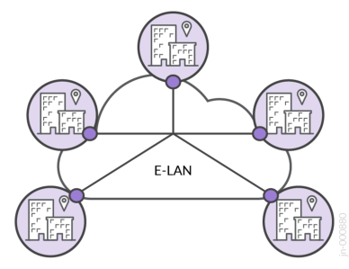


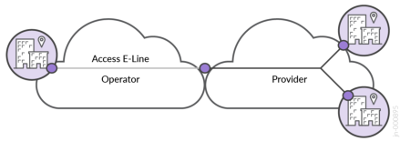

i

#### Key Service Attributes

MEF services attributes are further defined on the basis of major characteristics:

- Service Multplexing: i This attribute allows multiple Ethernet Virtual Connections (EVCs) to terminate
on the same User Network Interface (UNI), enabling multiple distinct Ethernet services to share the
same physical or virtual interface. If Service Multiplexing is enabled at the UNI, multiple EVCs can

share the same interface. For example, EVC1 for Customer-A and EVC2 for Customer-B can be
assigned the same physical interface while retaining local separation. To differentiate traffic for each

service, MEF standards specify the use of Customer Edge VLAN (CE-VLAN) IDs to map incoming
frames to the appropriate EVC. Each EVC maintains discrete service characteristics for performance,
bandwidth, and Quality of Service (QoS) parameters. This approach optimizes network efficiency and
flexibility, allowing service providers to deliver customized, on-demand services over common
infrastructures without requiring a dedicated connection for each service.

- Bundling: This attribute allows multiple CE-VLANs to be grouped under a single Ethernet Service at
the UNI. Different types of customer traffic, such as voice, data, and video, are carried over one EVC
while maintaining distinct service characteristics for each CE-VLAN. Bundling enables service
providers to manage multiple CE-VLANs within a single EVC, providing flexibility for differentiated
traffic policies and performance requirements, making it ideal for delivering multiple traffic types

from a single customer over a common interface.

- All-to-One Bundling: This attribute consolidates all CE-VLANs from a single UNI into a single EVC,
simplifying service provisioning when per-VLAN differentiation is not necessary. All CE-VLANs share
a unified service policy, inheriting the same QoS attributes applied to the EVC. Typically used with
private Ethernet services, All-to-One Bundling enables secure, isolated connectivity between

customer sites over common network infrastructure.

- An Ethernet Virtual Circuit (EVC): This attribute is a logical connection that links two or more
Customer Edge (CE) devices across a service provider’s network. It forms the foundation for MEFdefined Ethernet services (for example, E-Line, E-LAN, and E-Tree). EVCs provide a logical path
through which customer traffic flows, ensuring the traffic between specified CEs is isolated and
follows defined performance characteristics like bandwidth and latency. MEF defines the following

three main types of EVCs:

 - Point-to-Point (for example, E-Line)

 Multipoint-to-Multipoint (for example, E-LAN)

 Rooted Multipoint (for example, E-Tree)

- Customer Edge VLAN (CE-VLAN) ID(s): This attribute defines customer-assigned VLAN tags that are

associated with an EVC at the service provider’s edge network. Depending on the service agreement

and customer requirements, one or more CE-VLANs may be mapped to an EVC.

i t

i

i

i i

- EVC Data Service Frame Dispositon Service At i ribute (MEF 10.4/10.3): t This attribute defines how
Unicast, Multicast, and Broadcast traffic types are managed within the EVC. It specifies the treatment
of frames, allowing flexible and policy-driven frame forwarding or discarding in compliance with the

service’s requirements, including:

 - Delivered Unconditonally: i Frames are forwarded to the destination without any conditions,
ensuring that all valid frames are transmitted as expected.

 - Delivered Conditonally: i Frames are forwarded based on specific conditions, such as matching
service policies, VLAN IDs, or other predefined criteria. This may include forwarding frames to
specific recipients for multicast or broadcast traffic.

 - Discarded: Frames are dropped if they do not meet certain criteria, such as invalid service

parameters, improper frame tagging, or non-conformance with the service policy.

The updates from MEF 10.3 to MEF 10.4 signify a shift in design philosophy, moving from granular perframe type service disposition attributes to a consolidated attribute utilizing a 3-tuple structure of frame
handling within an EVC. The disposition settings (discard, delivery unconditionally, or delivery
conditionally) remain unchanged but simplify overall management.

While the CE-VLAN construct remains central to the current implementation of MEF 3.0, as defined by
MEF 10.3 technical specification, the modernized EVC EP Map Service At t ribute and EVC EP Service
At t ribute introduced in MEF 10.4 reflect the continued evolution in the MEF framework, enveloping
industry trends with greater flexibility. For more information on the EVC End Point (EVC EP) model, see

[MEF 10.4 Technical Specifcat](https://www.mef.net/resources/mef-10-4-subscriber-ethernet-services-attributes/) i ons i .

**Table 2: MEF Bundling and Service Multiplexing**

i t

i

i

i i

i t

i

i

i i

i t

i

i

i i

|Service Multiplexing|Bundlin<br>g|All-to-One Bundling|Description|
|---|---|---|---|
|Enabled|Disabled|Disabled|Multple virtual private services are allowed at the UNI<br>with only one CE-VLAN ID mapped to each service|
|Enabled|Enabled|Disabled|Multple virtual private services enabled at the UNI<br>and multple CE-VLAN IDs can be mapped to each<br>service|
|Enabled|Enabled|Enabled|Illegal confguraton|
|Enabled|Disabled|Enabled|Illegal confguraton|
|Disabled|Disabled|Enabled|Single private service at the UNI|

i

i

**Table 2: MEF Bundling and Service Multiplexing (Continued)**

i

i

i

i

i

i

|Service Multpi lexing|Bundlin<br>g|All-to-One Bundling|Description|
|---|---|---|---|
|Disabled|Enabled|Disabled|Single virtual private service enabled at the UNI with<br>multple CE-VLAN IDs mapped to it|
|Disabled|Enabled|Enabled|Illegal confguraton|
|Disabled|Disabled|Disabled|Single virtual private service enabled at the UNI with<br>only a single CE-VLAN ID mapped to it|

[Reference: https://wiki.mef.net/display/CESG/Bundling+and+Service+Multiplexing](https://wiki.mef.net/display/CESG/Bundling+and+Service+Multiplexing)

Table 2 on page 10 explains MEF guidance for valid service multiplexing and bundling combinations,
which are followed by this JVD. For more information, see [MEF documentaton](https://www.mef.net/learn/mef-technical-standards-sdks/?portfolio-set=carrier-ethernet) i .

- Service Multplexing i determines whether the UNI terminates one (disabled) or more (enabled)

Ethernet services.

- Bundling is ‘Enabled’ when multiple CE-VLANs are supported on the UNI or ‘Disabled’ when each

Ethernet Service includes a single CE-VLAN.

- All-to-One Bundling means that all CE-VLANs are associated with a single Ethernet service as a

private UNI service. When bundling is ‘Disabled’, one or more virtual private services are enabled per

UNI.

The MaaS JVD covers 19 use cases for delivering Metro Ethernet services, including:

- E-Line: Point-to-point connections like EPL and EVPL

- E-LAN: Multipoint-to-multipoint connections like EP-LAN and EVP-LAN

- E-Tree: Rooted multipoint hub-and-spoke connections like EP-TREE and EVP-TREE

- Access E-Line: Wholesale point-to-point services connecting UNI to NNI

- Internet Access: IP service connecting IPVC endpoints for dedicated Internet access

This JVD explains how the featured services, behaviors, and characteristics map to MEF definitions.

#### Test Bed

The Metro as a Service JVD leverages two foundational components: the physical infrastructure
introduced in [Metro EBS JVD](https://www.juniper.net/documentation/us/en/software/jvd/jvd-metro-ebs-03-01/validation_framework.html) and Iometrix Lab in the Sky. Figure 1 on page 12 explains connectivity
for building the metro fabric spine-and-leaf and multi-ring topologies with primary featured DUTs in this

JVD.

**Figure 1: Lab Topology Test Bed**

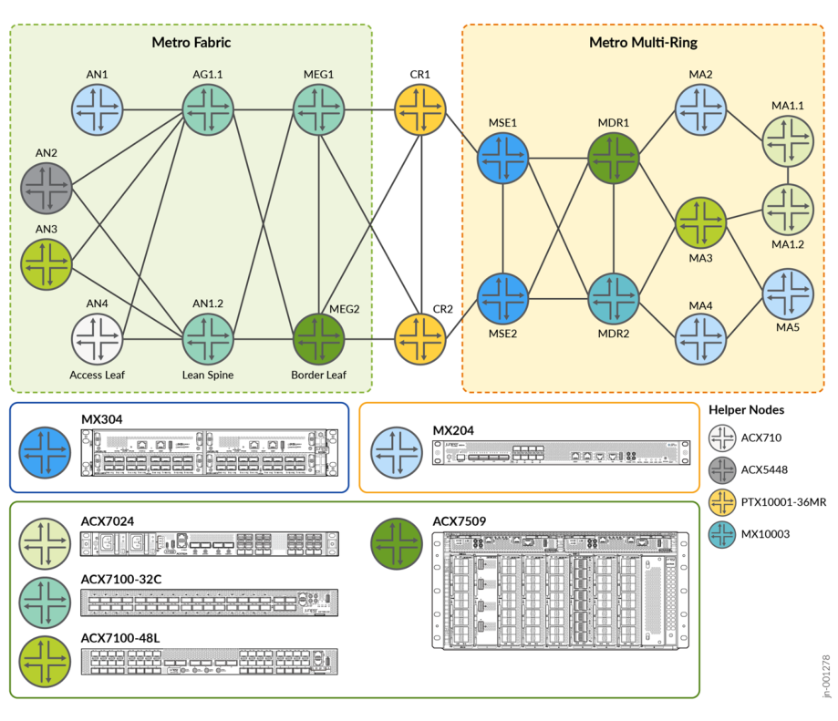

Iometrix Lab in the Sky is a Network as a Service (NaaS) cloud-based testing infrastructure supporting a
testing application that leverages virtual test probes utilizing x86 whitebox probes. The same
infrastructure is used as a basis for MEF 3.0 certification testing. The Iometrix Lab in the Sky

infrastructure consists of the following components.

**Figure 2: Iometrix Infrastructure**

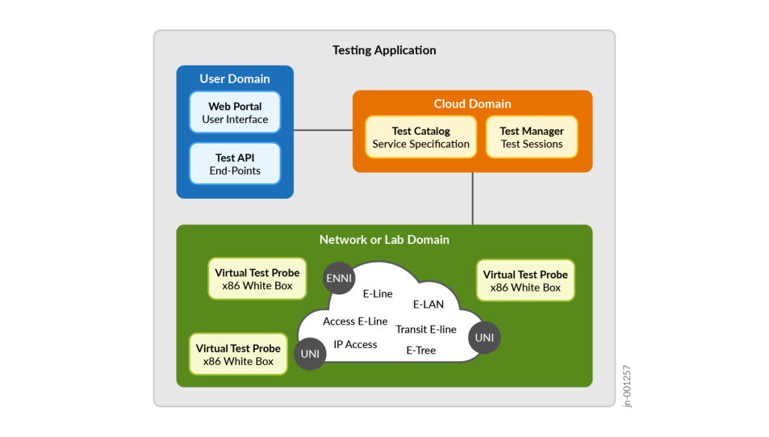

#### Platforms / Devices Under Test (DUT)

Selected access platforms include ACX7024, ACX7100-48L, ACX710, ACX5448, and MX204 platforms.
Aggregation or spine platforms include the ACX7100-32C in the metro fabric and ACX7509 with
MX10003 routers as metro distribution routers in the ring architecture. The Metro edge gateway
performs border leaf functions with the ACX7509 and ACX7100-32C, providing connectivity to the

edge compute complexes. The metro core uses the PTX10001-36MR core and peering platform. The
MX304 is ideally suited for the multi-services edge, supporting complex services termination and

interconnect points.

To review the software versions and platforms on which this JVD was validated by Juniper Networks,
[see the Validated Platforms and Software section in this document.](https://www.juniper.net/documentation/us/en/software/jvd/jvd-metro-ebs-mef-03-02/validated-platforms.html)

#### Test Bed Configuration

JVD configurations are available at [Juniper GitHub](https://github.com/Juniper/jvd) . Please contact your Juniper representative for any

queries.

### Test Objectives

**IN THIS SECTION**

Test Goals **| 18**

Test Non-Goals **| 19**

Juniper Validated Design (JVD) is a cross-functional collaboration between Juniper solution architects
and test teams to develop coherent multidimensional solutions for domain-specific use cases. The JVD
team comprises technical leaders in the industry with a wealth of experience supporting complex
customer use cases. The scenarios selected for validation are based on industry standards to solve
critical business needs with practical network and solution designs.

The key goals of the JVD initiative include:

 Test iterative multidimensional use cases

 Optimize best practices and address solution gaps

 Validate overall solution integrity and resilience

 Support configuration and design guidance

 Deliver practical, validated, and deployable solutions

A reference architecture is selected after consultation with Juniper Networks global theaters and a deep
analysis of customer use cases. The deployed design concepts use best practices and leverage relevant
technologies to deliver the solution scope. Key Performance Indicators (KPIs) are identified as part of an
extensive test plan that focuses on functionality, performance integrity, and service delivery.

Once the physical infrastructure that is required to support the validation is built, the design is sanitychecked and optimized. Our test teams conduct a series of rigorous validations to prove solution
viability, capturing and recording results. Throughout the validation process, our engineers engage with
software developers to quickly address any issues found.

The Metro Ethernet Business Services solution validates a comprehensive multidimensional architecture
that includes best practices for designing and implementing a dense services L2/L3 portfolio across

intra-domain and inter-AS regions.

The solution architecture is extended to validate MEF 3.0 compliance, ensuring all featured L2 services

meet or exceed MEF standards for high performance, reliability, interoperability, and QoS. With

i i

adherence to MEF standards, operators can ensure that customers experience consistent, high-quality
Ethernet connectivity across different networks and providers. The rigorous MEF 3.0 test cases provide

assurance that Carrier Ethernet services are reliable and capable of delivering on Service Level

Agreements (SLA).

The areas of focus are:

- Service Performance: Validates bandwidth (using MEF bandwidth profile service attributes), latency,
jitter (delay variation), frame loss, and QoS compliance with the capability to differentiate between
traffic types. Ensures consistent and predictable network performance to meet SLAs.

- Service Actvat i on: i Ensures accurate service setup, provisioning, multiplexing, and bundling.
Validation of service multiplexing and bundling capabilities that ensure EVCs and CE-VLANs can be

managed over a single UNI, as required.

- Standards Conformance: Ensures Carrier Ethernet services deliver all defined EVC types, including ELine, E-LAN, E-Tree, and Access E-Line, enabling compatibility and seamless operation in multivendor and multi-provider environments.

- Reliability and Resiliency: Tests for service continuity, protection, and rapid failover. Ensuring services
remain stable during network outages and able to meet uptime requirements. Protection mechanisms

are built into both underlay and overlay network design.

- Service Assurance: Verifies monitoring, fault detection, and Service OAM (Operations,
Administration, and Maintenance) capabilities.

The underlying infrastructure described in this document provides a resilient and high-performance
Segment Routing (SR) architecture but is not a requirement of the solutions presented. Other underlay

technologies can be leveraged, for example MPLS RSVP-TE.

The validation focuses on qualifying MEF 3.0 mandatory test cases across [Metro Ethernet Business](https://www.juniper.net/documentation/us/en/software/jvd/jvd-metro-ebs-03-01/solution_architecture.html)
[Services](https://www.juniper.net/documentation/us/en/software/jvd/jvd-metro-ebs-03-01/solution_architecture.html) solution architecture featuring E-Line, E-LAN, E-Tree, and E-Access solutions for supporting

crucial Carrier Ethernet use cases.

**Figure 3: Metro Ethernet Business Services Solution Architecture**


Table 3 on page 16 explains the services included in the JVD.

Service Type is one of the four MEF options for E-Line, E-LAN, E-Tree, or Access E-Line.

VPN Type is the implementation mechanism used in the JVD to deliver the solution.

High Availability represents each service, which may include variations of single-homing and/or
multi-homing.

- Service Instantiation and Endpoints identify where each service type exists in the network. Figure 3
on page 16 can be referenced for identification with defined endpoints and device types.

**Table 3: Services Under Test**

|Inde<br>x|Service<br>Type|VPN Type|High Availability|Service<br>Instantiation|Endpoints|
|---|---|---|---|---|---|
|1|E-Line|EVPN-VPWS Port<br>Based|Single-Homed|Inter-AS Fabric to<br>Ring|AN3, MA1.1|
|2|E-Line|EVPN-VPWS VLAN-<br>based|Actve-Actve<br>Multhoming|Inter-AS Fabric to<br>Ring|AN1, AN2, AN3,<br>MA1.1, MA1.2|
|3|E-Line|EVPN-VPWS VLAN-<br>based|Single-Homed|Intra-Fabric|AN3, AN4|

**Table 3: Services Under Test (Continued)**

|Inde<br>x|Service<br>Type|VPN Type|High Availability|Service<br>Instantai toi n|Endpoints|
|---|---|---|---|---|---|
|4|E-Line|EVPN-VPWS VLAN-<br>based|Actve-Actve<br>Multhoming|Metro Fabric|AN3, MEG1,<br>MEG2|
|5|E-Line|EVPN Flexible Cross-<br>Connect VLAN Aware|Actve-Actve<br>Multhoming|Inter-AS MEG to<br>Ring|MEG1. MEG2,<br>MA1.1, MA1.2|
|6|E-Line|EVPN Flexible Cross-<br>Connect VLAN<br>Unaware|Single-Homed|Inter-AS Fabric to<br>MSE|AN3, MSE1|
|7|E-Line|Layer 2 Circuit|Hot-Standby|Metro Fabric|AN3, MEG1,<br>MEG2|
|8|E-Line|L2VPN Port Based|Single-Homed|Inter-AS Fabric to<br>Ring|AN3, MA5|
|9|E-Line|L2VPN VLAN-based|Single-Homed|Inter-AS Fabric to<br>Ring|AN3. MA5|
|10|E-Line|BGP-VPLS VPWS|Single-Homed|Inter-Rings|MA5, MA1.2|
|11|E-Line|EVPN Floatng<br>Pseudowire|Anycast|Metro Ring|MSE1, MSE2,<br>MA1.2|
|12|E-LAN|EVPN-ELAN Port<br>Based|Single-Homed|Inter-AS Fabric to<br>Ring|AN3, MA1.2|
|13|E-LAN|EVPN-ELAN VLAN-<br>based|Actve-Actve<br>Multhoming|Inter-AS Fabric to<br>Ring|AN1, AN2, AN3,<br>MEG1. MEG2,<br>MA1.1, MA1.3|
|14|E-LAN|EVPN-ELAN VLAN<br>Bundle|Actve-Actve<br>Multhoming|Metro Fabric|AN3, MEG1.<br>MEG2|
|15|E-LAN|EVPN-ELAN Type 5|Actve-Actve<br>Multhoming|Inter-AS Fabric to<br>MSE|AN3, MEG1,<br>MEG2, MSE1,<br>MSE2|

**Table 3: Services Under Test (Continued)**

|Inde<br>x|Service<br>Type|VPN Type|High Availability|Service<br>Instantai toi n|Endpoints|
|---|---|---|---|---|---|
|16|E-LAN|BGP-VPLS|Single-Homed|Inter-AS Fabric to<br>Ring|AN3, MEG2,<br>MA1.2|
|17|E-Tree|EVPN-ETREE|Actve-Actve Roots|Metro Ring|MSE1, MSE2,<br>MA4, MA5|
|18|Access E-<br>Line|EVPN-VPWS Local-<br>Switching|Single-Homed|Metro Ring|MA5, MA3|
|19|Access E-<br>Line|Layer 2 Circuit<br>(L2CCC) Local-<br>Switching|Single-Homed|Metro Ring|MA5, MA3|

#### Test Goals

Test cases executed based on MEF 3.0 certification fall into four distinct categories. These test cases are
qualified in the JVD across the presented transport and services architectures and include the following

major topics.

Functional Service Attributes and Parameters:

 This category covers the testing of service functionalities and attributes defined for service types,

including E-Line, E-LAN, E-Tree, and Access E-Line. It validates that services meet the necessary
operational characteristics and behaviors, such as Ethernet Virtual Connections (EVCs), VLAN
handling, and service multiplexing.

 Tests include verifying the correct mapping of service attributes (for example, CE-VLAN ID, CoS,
EVC Service Attributes) and ensuring that services operate as intended.

- Layer 2 Control Protocol (L2CP) and Service OAM (SOAM) Frame Behavior:

 - This category tests the handling of L2CP and SOAM frames, ensuring they are properly processed
and managed by the system. It involves testing the correct tunneling and forwarding of control
and management frames, for example, Continuity Check Message (CCM), Loopback Message

(LBM), Link Trace Message (LTM), and Link Trace Reply (LTR).

 This also includes validating whether frames are correctly identified and handled according to
MEF network operation and maintenance standards.

i

Bandwidth Profile Attributes and Parameters:

 This category focuses on verifying that bandwidth profiles are implemented correctly. It tests
attributes such as Committed Information Rate (CIR), Excess Information Rate (EIR), and traffic
shaping to ensure that the service adheres to the agreed-upon bandwidth allocations.

 Performance metrics like traffic policing are validated to ensure proper traffic flow management in
different service conditions.

Service Performance Attributes and Parameters:

 This category tests performance characteristics like latency, jitter, Frame Loss Ratio (FLR), and
availability in compliance with the specified SLAs.

 It ensures that the service can meet the agreed-upon performance parameters for various traffic
types (for example, unicast, multicast, broadcast) under real-world conditions, validating that

service performance aligns with your requirements.

These categories ensure that the services and equipment meet MEF 3.0 standards for functionality,

performance, interoperability, and service assurance required to deliver the expected quality and

reliability.

#### Test Non-Goals

Non-goals include elements that make sense for the JVD but are excluded for various reasons, for
example, outside the scope, feature/product limitation, and so on. The MaaS validation covers service
types included in the [Metro EBS JVD](https://www.juniper.net/documentation/us/en/software/jvd/jvd-metro-ebs-03-01/solution_architecture.html#Toc162895750__Toc162895764) . Additional service types are possible and supported.

Formal MEF 3.0 certification: While the majority of Juniper products featured in this JVD are MEF
3.0 certified and appear on the public registry, the constraints of MEF limit suppliers from achieving a
certification intended for Service Providers. The validation demonstrates MEF 3.0 compliance across

all featured services and devices.

Transit E-Line (fka, E-Transit): This service type is supported but not explicitly covered. An instance of

Transit E-Line (MEF 65) service type is included, but test cases are designed to deliver I/ENNI-to-UNI

O-Line services.

Attributes outside the scope of MEF 3.0 certification: MEF 3.0 includes important sections across
numerous technical specifications but may not cover the entire specification. For consistency, this

JVD focuses primarily on MEF 3.0 requirements.

Features and functionality outside the scope of this JVD: The solution architecture, including
convergence, design concepts, and extensive configurations, are covered previously (see [Metro EBS](https://www.juniper.net/documentation/us/en/software/jvd/jvd-metro-ebs-03-01/test_objectives.html)
[Test Objectves](https://www.juniper.net/documentation/us/en/software/jvd/jvd-metro-ebs-03-01/test_objectives.html) i ). Some overlapping validation may exist where it is applicable to MEF 3.0.

 The validation does not include multi-vendor test scenarios.

 Layer 3 IPVC: These solutions are included in the JVD with L3VPN and EVPN Type-5 but are not a
requirement of MEF 3.0 CE certification. EVPN Type-5 is validated as an E-LAN service. Several MEF
technical specifications cover IP service definitions and attributes, including MEF 61.1, MEF 60, MEF

57, and so forth.

 Devices not listed as DUTs: Test cases are curated for the validation of the primary DUTs. Helper
nodes are verified to provide expected support functionalities.

### Solution Architecture

**IN THIS SECTION**

Metro as a Service: E-LINE **| 24**

E-LINE Point-to-Point Services **| 26**

E-Line: EVPN-VPWS Example **| 30**

E-Line: EVPN-FXC VLAN Aware Example **| 33**

E-Line: EVPN-FXC VLAN Unaware Example **| 36**

E-Line: Layer 2Circuit Example **| 39**

E-Line: Layer 2 VPN Example **| 41**

E-Line: BGP-VPLS Example **| 43**

E-Line: EVPN Floating Pseudowire Example **| 45**

Metro as a Service: E-LAN **| 50**

E-LAN Multipoint-to-Multipoint Services **| 51**

E-LAN: EVPN-ELAN VLAN-Based Example **| 56**

E-LAN: EVPN-ELAN VLAN-Bundle Example **| 59**

E-LAN: EVPN-ELAN Type-5 Example **| 62**

E-LAN: BGP-VPLS Example **| 69**

Metro as a Service: E-TREE **| 71**

E-TREE Rooted-Multipoint Services **| 75**

E-Tree: EVPN-ETREE Example **| 77**

Metro as a Service: Access E-LINE **| 80**

Access E-Line Services **| 83**

Access E-Line: EVPN-VPWS Local-Switching Example **| 84**

Access E-Line: L2Circuit Local-Switching Example **| 86**

The JVD solution presents a design for the integration of traditional Metro ring architectures utilizing
multi-instance ISIS with Metro fabrics. SR MPLS is the underlay technology of choice. Flex-Algo is
leveraged to enable lightweight traffic engineering. Transport Classes are associated with the Flex-Algo
tunnels to create slices through the network established by the lowest delay, best traffic engineering

metrics, or preferred IGP metrics. Three paths are created in the topology: Gold (Delay metric), Bronze
(TE metric), and Best Effort (IGP metric). Each VPN service can be selectively mapped onto specific FlexAlgos using BGP extended color community attributes to perform color-aware traffic steering. A
cascade-style resolution scheme allows Gold paths to failover to Bronze, and Bronze paths to failover to
Best Effort.

Carrier Ethernet services are delivered with L2Circuit, L2VPN, and VPLS traditional VPN services
coexisting with modern services, including EVPN-VPWS, EVPN Flexible Cross Connect (FXC), EVPN
ELAN, and EVPN-TREE. L3 services are supported with L3VPN, EVPN-ELAN Type 5, and EVPN Anycast

IRB models.

For extensive information on building this solution architecture, see [Metro Ethernet Business Services](https://www.juniper.net/documentation/us/en/software/jvd/jvd-metro-ebs-03-01/index.html)

[JVD](https://www.juniper.net/documentation/us/en/software/jvd/jvd-metro-ebs-03-01/index.html) .

The MaaS JVD leverages the established services and infrastructure defined by Metro EBS JVD to
qualify MEF 3.0 parameters. Solutions for E-Line, E-LAN, E-Tree, and Access E-Line deliver a variety of
use cases critical for Metro networks. The primary service goals include the following key attributes:

Site-to-site and multisite-to-multisite VPN services

Communications with Edge/Cloud Computing resources

Inter-AS stitching of disparate service domains

- Internet Access for selected Layer 2 and Layer 3 services

Optimization of Intra-Fabric and Inter-Ring connectivity

Integration of services with points of network attachments (i.e., SP Core)

Seamless multi-domain color-aware services with traffic steering

Figure 4 on page 22 illustrates Iometrix probes connected throughout the JVD topology to enable the
execution of MEF-related test cases across all Layer 2 E-Line, E-LAN, E-Tree, and Access E-Line services
featured in the solution. Test cases are developed to mirror MEF 3.0 certification requirements.

**Figure 4: Metro EBS Solution Architecture with Iometrix Probes**


The above diagram details service instantiation points throughout the network. In the services
schematic, solid circles represent points of termination, whereas empty dotted-line circles indicate
passthrough or inter-AS points of the network. For more information on specific device participation,

see Table 4 on page 23 .

**Table 4: Featured Devices**

|Topology Definitoi ns|Role|Device|
|---|---|---|
|Access Leaf|AN|ACX7100-48L (DUT), ACX710, ACX5448, MX204|
|Lean Spine|AG1|ACX7100-32C|
|Lean Edge Border Leaf|MEG|Metro Edge Gateway: ACX7509 (DUT),<br>ACX7100-32C (DUT)|
|Core|CR|PTX10001-36MR|
|Multservices Edge|MSE|MX304 (DUT)|
|Metro Distributon Router|MDR|MX10003, ACX7509 (DUT)|
|Metro Access Node|MA|ACX7024 (DUT), ACX7100-48L (DUT), MX204<br>(DUT)|

Service Providers are increasingly deploying or migrating to EVPN as a more capable solution under a
single technology umbrella compared to fragmented traditional VPN services, such as L2Circuit, VPLS,
and L2VPN. However, operators continue to require legacy support as both standalone and coexisting
solutions. This JVD considers a range of modern and traditional Carrier Ethernet services, creating a
comparative performance analysis and providing methodologies to modernize legacy protocols.

The validation consists of the standard service types:

- E-LINE

- E-LAN

- E-TREE

- ACCESS E-LINE (formerly E-Access)

Metro EBS JVD additionally includes Layer 3 IPVC service types, but this is outside the scope of MEF
3.0. EVPN-ELAN with Route-Type 5 is included as an L3+L2 VPN service, with the validation focusing

on the L2 aspect.

This JVD offers E-Line, E-LAN, and E-Tree services with options for single-homing and active-active
multi-homing nodes to maximize service availability. Service type conformance, defined by MEF, utilizes
the following attributes and testing requirements for reliable and consistent Ethernet connectivity across

diverse network environments.

UNI Service Attributes define the subscriber's interface characteristics in the service provider

network.

EVC per UNI Service Attributes distinguishes how the EVC functions at each UNI.

EVC Service Attributes define the EVC characteristics critical to service functionality.

- CE-VLAN ID and EVC map between UNIs

 - EPL, EP-LAN, and EP-Tree: All CE-VLAN IDs, CoS assignments, as well as priority-tagged and

untagged frames are included within a single EVC.

 - EVPL, EVP-LAN, and EVP-Tree: A single CE-VLAN ID in the EVC, allowing for all CoS assignments.

L2CP functions identify frames that are tunneled (forwarded) or discarded within the service.

Service Operations, Administration, and Maintenance (SOAM) functions identify frames that must be
tunneled (CCM, LBM, LTM, LTR at MEG levels 5 and 6) for operational continuity.

Preservation of CE-VLAN IDs and CoS ensures that customer-defined VLAN IDs and CoS priorities

are maintained across the network.

In addition, MEF compliance testing includes specific traffic and port characteristics to validate service
quality, including expected disposition settings explained in the "Key Service Attributes" on page 9
section:

Traffic Types: Unicast, multicast, and broadcast traffic behavior

- Frame Tagging: Proper handling of tagged and untagged Ethernet frames

#### Metro as a Service: E-LINE

The following sections describe how MEF framework is leveraged in the JVD to deliver Metro as a
Service (MaaS) solution. This section explains the E-Line portion of the MEF 3.0 validation.

The Subscriber Ethernet Services Definition 6.2/6.3 technical specification defines the E-Line service
type as a point-to-point EVC connecting two User-Network Interfaces (UNIs). This service type provides
dedicated, private, and reliable Ethernet communication between two endpoints.

**Figure 5: E-LINE Point-to-Point Service Type**


Basic E-Line connects two UNIs to deliver a best-effort service with symmetrical bandwidth without

performance guarantees.

In more advanced E-Line implementations, a more diverse service offer might include:

Differing bandwidth rates between UNIs.

Multiple Class of Service (CoS) profiles for tailoring service levels.

Performance objectives measuring Frame Delay (FD), Inter-Frame Delay Variation (IFDV), and Frame
Loss Ratio (FLR) to establish availability metrics.

Service Multiplexing at one or both UNIs, enabling multiple point-to-point EVCs.

E-Line services come in two main variations:

- Ethernet Private Line (EPL) is a port-based point-to-point “all-to-one bundling” service providing a

dedicated, transparent data path. Subscribers maintain full control over their network infrastructure
with the flexibility to create and manage multiple point-to-point connections over a single UNI,
typically using VLAN separation. CE-VLAN IDs and CE-VLAN CoS markings are preserved end-toend. EPL is ideal for applications requiring full Ethernet frame delivery between locations. Depending
on SLAs, additional performance objectives may include low-latency guarantees, high reliability,
bandwidth allocation, and so forth.

- Ethernet Virtual Private Line (EVPL) is similar to EPL but supports service multiplexing (VLAN-based),
allowing multiple services to share the same physical interface at a UNI. EVPL enables multiple EVCs
on one or both of the UNIs, providing greater flexibility for delivering multiple point-to-point

connections over a single UNI. EVPL is well-suited for organizations that need scalable, segmented
connectivity with customized service levels across diverse applications.

Depending on the required CoS, these services can be tailored to meet specific performance criteria.
The service attributes and their values are detailed in MEF specifications, with specific constraints

outlined for E-Line services to ensure performance consistency.

#### E-LINE Point-to-Point Services

The protocol suite of point-to-point E-LINE services covered by the JVD includes EVPN-VPWS, EVPN
Flexible Cross Connect (FXC), BGP-VPLS (as a point-to-point service), L2Circuit, Floating PW, and
L2VPN. The profile implements 11 distinct E-Line use cases to deliver different connectivity options.
Each use case has approximately 500 MEF-related test cases executed as part of the validation. The key

service categories under the test include:

Functional Service Attributes and Parameters

- Layer 2 Control Protocol Frame Behaviors

Service OAM Functionalities

Bandwidth Profile Attributes and Parameters

Service Performance Attributes and Parameters

**Figure 6: E-Line Base Protocol Suite**


Multiple permutations of the following service instantiation are delivered:

- Intra-Fabric

- Inter-AS

- Inter-Ring

Single-homing and Multihoming

- VLAN Aware and VLAN Unaware

Each VPN type can support multiple combinations of MEF service attributes. This flexibility is
demonstrated, but the JVD does not attempt to include every possible combination. There are

additional valid options for each VPN service type that can be leveraged, depending on the service
objectives.

**Figure 7: E-LINE Point-to-Point Service Termination**

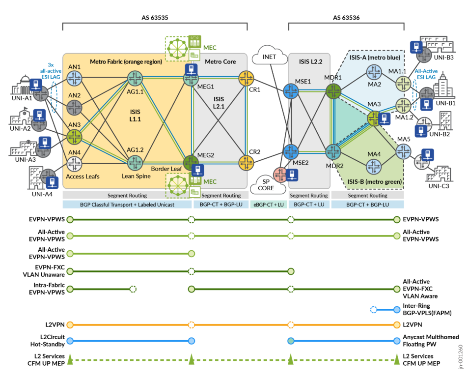

The lab topology includes service instantiation points illustrated in Figure 7 on page 27 for E-Line

services, covered by the corresponding MEF test cases. Iometrix test probes are placed throughout the
topology for conducting the end-to-end validation.

**Table 5: E-Line Service Definitions**

|Index|Service<br>Type|VPN Type|High Availability|Service<br>Instantiation|Endpoints|
|---|---|---|---|---|---|
|1|E-Line|EVPN-VPWS Port<br>Based|Single-Homed|Inter-AS Fabric to<br>Ring|AN3, MA1.1|
|2|E-Line|EVPN-VPWS VLAN-<br>based|Actve-Actve<br>Multhoming|Inter-AS Fabric to<br>Ring|AN1, AN2, AN3,<br>MA1.1, MA1.2|
|3|E-Line|EVPN-VPWS VLAN-<br>based|Single-Homed|Intra-Fabric|AN3, AN4|
|4|E-Line|EVPN-VPWS VLAN-<br>based|Actve-Actve<br>Multhoming|Metro Fabric|AN3, MEG1,<br>MEG2|
|5|E-Line|EVPN Flexible Cross-<br>Connect VLAN<br>Aware|Actve-Actve<br>Multhoming|Inter-AS MEG to<br>Ring|MEG1. MEG2,<br>MA1.1, MA1.2|
|6|E-Line|EVPN Flexible Cross-<br>Connect VLAN<br>Unaware|Single-Homed|Inter-AS Fabric to<br>MSE|AN3, MSE1|
|7|E-Line|Layer 2 Circuit|Hot-Standby|Metro Fabric|AN3, MEG1,<br>MEG2|
|8|E-Line|L2VPN Port Based|Single-Homed|Inter-AS Fabric to<br>Ring|AN3, MA5|
|9|E-Line|L2VPN VLAN-based|Single-Homed|Inter-AS Fabric to<br>Ring|AN3, MA5|
|10|E-Line|BGP-VPLS VPWS|Single-Homed|Inter-Rings|MA5, MA1.2|
|11|E-Line|EVPN Floatng<br>Pseudowire|Anycast|Metro Ring|MSE1, MSE2,<br>MA1.2|

Every VPN service included in the JVD is designed with the purpose of delivering crucial metro
functionality and connectivity objectives. The services featured in Table 5 on page 28 are further

explained in Table 6 on page 29 with use cases.

**Table 6: E-Line EVPL Service Use Cases**

|Matchin<br>g<br>Index|E-Line EVPL|Metro Use Case|
|---|---|---|
|[ 2 ]|EVPN-VPWS|EVPN-VPWS with EVI spanning up to three PEs AN1 (MX204), AN2 (ACX5448),<br>and AN3 (ACX7100-48L) to connect the CE (UNI-A1) Ethernet Segment (ES) with<br>all-actve ESI UNI resiliency. The E-Line EVPN service is extended end-to-end<br>with Inter-AS support terminatng into the EVPN EVI spanning two PEs MA1.1<br>(ACX7024) and MA1.2 (ACX7024) with an all-actve ESI connectng the UNI-B1<br>ES.|
|[ 3 ]|EVPN-VPWS|EVPN-VPWS, as a Metro Fabric E-Line service, supports intra-fabric<br>communicatons between AN3 (ACX7100-48L) and AN4 (ACX710) with trafc<br>fows optmized to be contained within the spine nodes AG1.1/AG1.2<br>(ACX7100-32C).|
|[ 4 ]|EVPN-VPWS|EVPN-VPWS establishes an actve-actve high availability service connecton<br>between AN3 (ACX7100-48L) to MEG1 (ACX7100-32C) and MEG2 (ACX7509) to<br>provide UNI-A3 connectvity into the Multaccess Edge Computng complex over<br>an all-actve ESI.|
|[ 5 ]|EVPN-FXC<br>VLAN-Aware|EVPN Flexible Cross Connect (FXC) as a VLAN Aware service is established<br>between MA1.1/MA1.2 (ACX7024) with all-actve ESI atachment circuits<br>supportng multple UNI ports and terminatng on an actve-actve high availability<br>connecton with MEG1 (ACX7100-32C) and MEG2 (ACX7509). This Inter-AS<br>service allows simplistc VLAN aggregaton optons with the ability to support one<br>or more VLAN stacks per ESI for MEC access.|
|[ 6 ]|EVPN-FXC<br>VLAN-Unaware|EVPN Flexible Cross Connect (FXC) as a VLAN Unaware service is established<br>between AN3 (ACX7100-48L) to MSE1 (MX304), connectng UNI-A2 into a QinQ<br>infrastructure. This Inter-AS service allows simplistc VLAN aggregaton optons<br>with a shared-state ESI.|
|[ 7 ]|L2Circuit|Layer 2 Circuit (L2Circuit) establishes an actve-passive (hot-standby) connecton<br>between AN3 and MEG1 (actve) and MEG2 (hot-standby). This traditonal service<br>(aka Martni) is extended to support the modern requirements of the network for<br>accessing MEC resources.|
|[ 9 ]|L2VPN|L2VPN is a traditonal BGP Layer 2 service (aka Kompella), establishing the Inter-<br>AS connecton between AN3 (ACX7100-48L) and MA4 (MX204).|

**Table 6: E-Line EVPL Service Use Cases (Continued)**

|Matchin<br>g<br>Index|E-Line EVPL|Metro Use Case|
|---|---|---|
|[ 10 ]|BGP-VPLS|BGP-VPLS is leveraged as a point-to-point service connectng MA5 (MX204) with<br>MA1.2 (ACX7024) over the mult-ring topology with optmizatons to traverse the<br>service-unaware MDR nodes.|
|[ 11 ]|EVPN Floatng<br>PW|EVPN Floatng Pseudowire is a reimagined Statc L2Circuit service utlizing a<br>Segment Routng Anycast-SID for actve-actve terminaton on MSE1 and MSE2<br>(MX304). Using an anycast service label allows trafc to be load-shared over the<br>ring. The foatng PW service allows VLAN aggregaton with selectve sttching<br>into EVPN-ELAN containers on the MSEs. The virtual ESI established with the MX<br>pseudowire interface (ps) allows for an all-actve vESI facing the ring segment.|

**Table 7: E-Line EPL Service Use Cases**

|Matchin<br>g<br>Index|E-Line EPL|Metro Use Case|
|---|---|---|
|[ 1 ]|EVPN-VPWS|EVPN-VPWS port-based service supports a point-to-point multdomain Inter-AS<br>connecton between AN3 to MA1.1. This enables UNI-A3 fexible connectvity<br>with the UNI-B3 site.|
|[ 8 ]|L2VPN|L2VPN port-based service is delivered between AN3 (ACX7100-48L) and MA5<br>(MX204) connectng UNI-A3 with UNI-C3.|

For E-Line configurations used in this JVD and in [Metro EBS JVD](https://www.juniper.net/documentation/us/en/software/jvd/jvd-metro-ebs-03-01/index.html), see [Juniper GitHub Repository](https://github.com/Juniper/jvd) or
contact your Juniper representative.

#### E-Line: EVPN-VPWS Example

E-Line EVPN-VPWS vlan-based services are included with several permutations in the validation
(explained in Table 6 on page 29 and throughout section "E-LINE Point-to-Point Service" on page 26 "E

LINE Point-to-Point Services" on page 26). In the following sample configuration, MEG1 and MEG2
provide an all-active ESI termination for EVPN-VPWS services.

```
       MEG1 (ACX7100-32C)
 interfaces {
 ae67 {
 unit 4000 {
 encapsulation vlan-ccc;
 vlan-id 4000;
 esi {
 00:40:11:11:21:22:01:00:00:01;
 all-active;
 }
 family ccc {
 filter {
 input f_eline-evpn-vpws;
 }
 }
 }
 }
 }
 routing-instances {
 evpn_group_edge_4000 {
 instance-type evpn-vpws;
 protocols {
 evpn {
 interface ae67.4000 {
 vpws-service-id {
 local 2;
 remote 1;
 }
 }
 }
 }
 interface ae67.4000;
 route-distinguisher 10.0.0.6:33300;
 vrf-export evpn_group_edge_4000;
 vrf-target target:63535:33300;
 }
 }
 MEG2 (ACX7509)
```

```
 interfaces {
 ae67 {
 unit 4000 {
 encapsulation vlan-ccc;
 vlan-id 4000;
 esi {
 00:40:11:11:21:22:01:00:00:01;
 all-active;
 }
 family ccc {
 filter {
 input f_eline-evpn-vpws;
 }
 }
 }
 }
 }
 routing-instances {
 evpn_group_edge_4000 {
 instance-type evpn-vpws;
 protocols {
 evpn {
 interface ae67.4000 {
 vpws-service-id {
 local 2;
 remote 1;
 }
 }
 }
 }
 interface ae67.4000;
 route-distinguisher 10.0.0.7:33300;
 vrf-export evpn_group_edge_4000;
 vrf-target target:63535:33300;
 }
 }
```

For more information on EVPN-VPWS E-Line configurations, see [Juniper GitHub Repository](https://github.com/Juniper/jvd) .

#### E-Line: EVPN-FXC VLAN Aware Example

EVPN-VPWS Flexible Cross-Connect (FXC), enables multiplexing a large number of attachment circuits
across multiple interfaces onto a single VPWS service tunnel. All attachment circuits bundled by the FXC
instance share the same MPLS label and service tunnel. With VLAN Aware FXC, service multiplexing can
support multiple Ethernet Segments with distinct high availability. Although the same service label is
leveraged for all attachment circuits, an Ethernet A-D is advertised or withdrawn per EVI route for each
attachment circuit.

E-Line EVPN-VPWS Flexible Cross Connect (FXC) VLAN Aware services (explained in section "E-LINE
Point-to-Point Services" on page 26 ) are established between MA1.1/MA1.2 (ACX7024) with all-active
ESI attachment circuits supporting multiple UNI ports and terminating an active-active high availability
connection with MEG1 (ACX7100-32C) and MEG2 (ACX7509). This Inter-AS service allows simplistic
VLAN aggregation options with the ability to support one or more VLAN stacks per ESI for MEC access.

In the sample configuration below, MA1.1 and MA1.2 provide all-active ESI termination for EVPN-FXC
services. FXC is commonly leveraged with Pseudowire Headend Termination (PWHT). For this example,
it is point-to-point with strictly FXC at the terminating points.

```
       MA1.1 (ACX7024)
 interfaces {
 ae12 {
 unit 4002 {
 encapsulation vlan-ccc;
 vlan-id 4002;
 input-vlan-map {
 push;
 vlan-id 3400;
 }
 output-vlan-map pop;
 esi {
 00:10:55:11:50:12:02:00:00:00;
 all-active;
 }
 family ccc {
 filter {
 input f_eline-evpn-vpws;
 }
 }
 }
 unit 4001 {
```

```
encapsulation vlan-ccc;
vlan-id 4001;
input-vlan-map {
push;
vlan-id 3000;
}
output-vlan-map pop;
esi {
00:10:55:11:50:12:01:00:00:00;
all-active;
}
family ccc {
filter {
input f_eline-evpn-vpws;
}
}
}
}
}
routing-instances {
evpn_vpws_fxc_aware {
instance-type evpn-vpws;
protocols {
evpn {
interface ae12.4001 {
vpws-service-id {
local 2;
remote 1;
}
}
interface ae12.4002 {
vpws-service-id {
local 22;
remote 11;
}
}
flexible-cross-connect-vlan-aware;
}
}
interface ae12.4001;
interface ae12.4002;
route-distinguisher 10.0.0.17:5501;
vrf-export evpn_vpws_fxc_aware;
```

```
vrf-target target:63536:55100;
}
}
MA1.2 (ACX7024)
interfaces {
ae12 {
unit 4002 {
encapsulation vlan-ccc;
vlan-id 4002;
input-vlan-map {
push;
vlan-id 3400;
}
output-vlan-map pop;
esi {
00:10:55:11:50:12:02:00:00:00;
all-active;
}
family ccc {
filter {
input f_eline-evpn-vpws;
}
}
}
unit 4001 {
encapsulation vlan-ccc;
vlan-id 4001;
input-vlan-map {
push;
vlan-id 3000;
}
output-vlan-map pop;
esi {
00:10:55:11:50:12:01:00:00:00;
all-active;
}
family ccc {
filter {
input f_eline-evpn-vpws;
}
}
}
}
```

```
 }
 routing-instances {
 evpn_vpws_fxc_aware {
 instance-type evpn-vpws;
 protocols {
 evpn {
 interface ae12.4001 {
 vpws-service-id {
 local 2;
 remote 1;
 }
 }
 interface ae12.4002 {
 vpws-service-id {
 local 22;
 remote 11;
 }
 }
 flexible-cross-connect-vlan-aware;
 }
 }
 interface ae12.4001;
 interface ae12.4002;
 route-distinguisher 10.0.0.18:5501;
 vrf-export evpn_vpws_fxc_aware;
 vrf-target target:63536:55100;
 }
 }
```

For more information on EVPN-FXC E-Line configurations, see [Juniper GitHub Repository](https://github.com/Juniper/jvd) .

#### E-Line: EVPN-FXC VLAN Unaware Example

EVPN-VPWS Flexible Cross-Connect (FXC), enables multiplexing a large number of attachment circuits
across multiple interfaces onto a single VPWS service tunnel. All attachment circuits bundled by the FXC

instance share the same MPLS service label and service tunnel. With VLAN Unaware FXC, a single
Ethernet A-D is advertised or withdrawn for the entire bundle of attachment circuits. The route is
withdrawn only when all the attachment circuits are down.

E-Line EVPN-VPWS FXC VLAN Unaware services (explained in the "E-LINE Point-to-Point Services" on
page 26 section) are established between AN3 (ACX7100-48L) to MSE1 (MX304), connecting UNI-A2
into a QinQ infrastructure. This Inter-AS service allows simplistic VLAN aggregation options across a

shared-state instance.

In the sample configuration below, AN3 presents two logical interfaces with service multiplexed
Attachment Circuits (AC) bundled in a single EVI. An ESI could be extended for high availability with all
ACs sharing EVI state. FXC is commonly leveraged with Pseudowire Headend Termination (PWHT). For
this example, it is point-to-point with strictly FXC at the terminating points.

```
       AN3 (ACX7100-48L)
 interfaces {
 et-0/0/13 {
 flexible-vlan-tagging;
 encapsulation flexible-ethernet-services;
 unit 4007 {
 encapsulation vlan-ccc;
 vlan-id 4007;
 family ccc {
 filter {
 input f_eline-evpn-vpws;
 }
 }
 }
 unit 4008 {
 encapsulation vlan-ccc;
 vlan-id 4008;
 family ccc {
 filter {
 input f_eline-evpn-vpws;
 }
 }
 }
 }
 }
 routing-instances {
 evpn_group_4007 {
 instance-type evpn-vpws;
 protocols {
 evpn {
 flexible-cross-connect-vlan-unaware;
```

```
group fxc {
interface et-0/0/13.4007;
interface et-0/0/13.4008;
interface et-0/0/1.4007;
interface et-0/0/1.4008;
service-id {
local 1;
remote 2;
}
}
}
}
route-distinguisher 10.0.0.2:40001;
vrf-target target:63535:40001;
}
}
MSE1 (MX304)
interfaces {
xe-0/0/13:2 {
flexible-vlan-tagging;
encapsulation flexible-ethernet-services;
unit 4007 {
encapsulation vlan-ccc;
vlan-id 4007;
family ccc {
filter {
input f_eline-evpn-vpws;
}
}
}
unit 4008 {
encapsulation vlan-ccc;
vlan-id 4008;
family ccc {
filter {
input f_eline-evpn-vpws;
}
}
}
}
}
routing-instances {
evpn_group_4007 {
```

```
 instance-type evpn-vpws;
 protocols {
 evpn {
 flexible-cross-connect-vlan-unaware;
 group fxc {
 interface xe-0/0/13:2.4007;
 interface xe-0/0/13:2.4008;
 service-id {
 local 2;
 remote 1;
 }
 }
 }
 }
 route-distinguisher 10.0.0.10:40001;
 vrf-target target:63535:40001;
 }
 }
```

For more information on EVPN-FXC E-Line configurations, see [Juniper GitHub Repository](https://github.com/Juniper/jvd) .

#### E-Line: Layer 2Circuit Example

Layer 2 Circuit (L2Circuit) establishes an active-passive (hot-standby) connection between AN3 and
MEG1 (active) and MEG2 (hot-standby). This traditional service (aka Martini) is extended to support the
modern requirements of the network for accessing MEC resources. Optionally, vlan normalization and

Flow-Aware Transport Pseudowire (FAT-PW) label load-balancing are included. AN3 (ACX7100-48L)
establishes the primary and backup remote PEs. MEG1 and MEG2 are configured with hot-standby-vcon to enable hot-standby pseudowire upon receipt of the status-TLV. The solution is further explained in
the "E-LINE Point-to-Point Services" on page 26 section.

```
       AN3 (ACX7100-48L)
 interfaces {
 et-0/0/13 {
 flexible-vlan-tagging;
 encapsulation flexible-ethernet-services;
 unit 4006 {
 encapsulation vlan-ccc;
 vlan-id 4006;
```

```
input-vlan-map {
push;
vlan-id 1000;
}
output-vlan-map pop;
family ccc {
filter {
input f_eline-evpn-vpws;
}
}
}
}
}
protocols {
l2circuit {
neighbor 10.0.0.6 {
interface et-0/0/13.4006 {
virtual-circuit-id 2006;
control-word;
flow-label-transmit;
flow-label-receive;
encapsulation-type ethernet-vlan;
ignore-mtu-mismatch;
pseudowire-status-tlv;
backup-neighbor 10.0.0.7 {
virtual-circuit-id 3333;
hot-standby;
}
}
}
}
}
MEG1 (ACX7100-32C) and MEG2 (ACX7509)
interfaces {
et-2/0/4 {
flexible-vlan-tagging;
encapsulation flexible-ethernet-services;
unit 4006 {
encapsulation vlan-ccc;
vlan-id 4006;
input-vlan-map {
push;
vlan-id 1000;
```

```
 }
 output-vlan-map pop;
 family ccc {
 filter {
 input f_eline-evpn-vpws;
 }
 }
 }
 }
 }
 protocols {
 l2circuit {
 neighbor 10.0.0.2 {
 interface et-2/0/4.4006 {
 virtual-circuit-id 3333;
 control-word;
 flow-label-transmit;
 flow-label-receive;
 encapsulation-type ethernet-vlan;
 ignore-encapsulation-mismatch;
 ignore-mtu-mismatch;
 pseudowire-status-tlv {
 hot-standby-vc-on;
 }
 }
 }
 }
```

For more information on L2Circuit E-Line configurations, see [Juniper GitHub Repository](https://github.com/Juniper/jvd) .

#### E-Line: Layer 2 VPN Example

Layer 2 VPN is a traditional BGP Layer 2 service (aka Kompella), establishing the Inter-AS connection
between AN3 (ACX7100-48L) and MA5 (MX204). The solution is further explained in the "E-LINE
Point-to-Point Services" on page 26 section

```
       AN3 (ACX7100-48L)
 interfaces {
 et-0/0/13 {
```

```
 flexible-vlan-tagging;
 encapsulation flexible-ethernet-services;
 unit 200 {
 encapsulation vlan-ccc;
 vlan-id 200;
 family ccc {
 filter {
 input f_eline-evpn-vpws;
 }
 }
 }
 }
 }
 routing-instances {
 l2vpn_group_200 {
 instance-type l2vpn;
 protocols {
 l2vpn {
 site r2 {
 interface et-0/0/13.200 {
 remote-site-id 1119;
 }
 site-identifier 1102;
 }
 encapsulation-type ethernet-vlan;
 no-control-word;
 }
 }
 interface et-0/0/13.200;
 route-distinguisher 63535:102000;
 vrf-target target:63535:102000;
 }
 }
```

For more information on L2VPN E-Line configurations, see [Juniper GitHub Repository](https://github.com/Juniper/jvd) .

#### E-Line: BGP-VPLS Example

BGP-VPLS is leveraged as a point-to-point service connecting MA5 (MX204) with MA1.2 (ACX7024)
over the multi-ring topology with optimizations to traverse the service-unaware MDR nodes. Although

not mandatory, the label-block-size can be reduced from the default of eight for label space savings.

```
       MA1.2 (ACX7024)
 interfaces {
 et-0/0/12 {
 vlan-tagging;
 encapsulation flexible-ethernet-services;
 unit 4005 {
 encapsulation vlan-bridge;
 vlan-id 4005;
 family ethernet-switching {
 filter {
 input f_elan-evpn;
 }
 }
 }
 }
 }
 routing-instances {
 vpls_group_4005 {
 instance-type virtual-switch;
 protocols {
 vpls {
 site r18 {
 site-identifier 2;
 }
 service-type single;
 site-range 2;
 label-block-size 2;
 no-tunnel-services;
 }
 }
 route-distinguisher 10.0.0.18:44444;
 vrf-target target:64535:44444;
 vlans {
 vlan4005 {
```

```
interface et-0/0/12.4005;
}
}
}
}
MA5 (MX204)
interfaces {
xe-0/1/0 {
vlan-tagging;
encapsulation flexible-ethernet-services;
unit 4005 {
encapsulation vlan-bridge;
vlan-id 4005;
family bridge {
filter {
input f_elan-evpn;
}
}
}
}
}
routing-instances {
vpls_group_4005 {
instance-type virtual-switch;
protocols {
vpls {
site r19 {
site-identifier 1;
}
site-range 2;
label-block-size 2;
no-tunnel-services;
}
}
bridge-domains {
vlan4005 {
vlan-id 4005;
interface xe-0/1/0.4005;
bridge-options {
no-normalization;
}
}
}
```

```
 route-distinguisher 10.0.0.19:44444;
 vrf-target target:64535:44444;
 }
 }
```

For more information on BGP-VPLS E-Line configurations, see [Juniper GitHub Repository](https://github.com/Juniper/jvd) .

#### E-Line: EVPN Floating Pseudowire Example

EVPN Floating Pseudowire (PW) is a reimagined Static L2Circuit service utilizing a Segment Routing
Anycast-SID for active-active termination on MSE1 and MSE2 (MX304). Using an anycast service label
allows traffic to be load-shared over the Metro Ethernet ring. The floating PW service allows VLAN
aggregation with selective stitching into EVPN-ELAN containers on the MSEs. The virtual ESI
established with the MX pseudowire interface (ps) allows for an all-active vESI facing the ring segment.

The basic construct of the Floating PW service establishes a static L2Circuit from MA1.2 (ACX7024)
towards an Anycast IP Gateway associated with an Anycast-SID terminating on both MSE1 and MSE2.
The L2Circuit is terminated on the MX PS transport interface (ps22.0 in the configuration below). The
associated pseudowire service interface (ps22.4004) is stitched into an EVPN instance, establishing the
virtual ESI facing toward the access node. This vESI operates as all-active and signaled appropriately
between MSE1/2, establishing the designated and backup forwarder based on default MOD election.
EVPN signaling is separated from anycast functionalities and uses local (unique) loopbacks for MSE1/2.

An additional optimization may include a conditional route policy applied to ISIS and BGP export policies

to track the state of the transport interface (ps22.0).

```
       MA1.2 (ACX7024)
 interfaces {
 et-0/0/12 {
 flexible-vlan-tagging;
 encapsulation flexible-ethernet-services;
 unit 4004 {
 encapsulation vlan-ccc;
 vlan-id 4004;
 family ccc {
 filter {
 input f_eline-evpn-vpws;
 }
 }
 }
```

```
}
}
protocols {
l2circuit {
neighbor 1.1.10.10 {
interface et-0/0/12.4004 {
static {
incoming-label 1000022;
outgoing-label 1000022;
}
virtual-circuit-id 10120;
encapsulation-type ethernet-vlan;
}
}
}
}
MSE1 (MX304)
interfaces {
ps22 {
anchor-point {
lt-0/0/0;
}
vlan-tagging;
encapsulation flexible-ethernet-services;
unit 0 {
encapsulation ethernet-ccc;
}
unit 4004 {
encapsulation vlan-bridge;
vlan-id 4004;
esi {
00:11:11:11:44:11:11:30:02:0a;
all-active;
}
}
}
ae10 {
unit 4004 {
encapsulation vlan-bridge;
vlan-id 4004;
esi {
00:11:11:11:11:44:11:30:01:0a;
all-active;
```

```
}
family bridge {
filter {
input f_elan-evpn;
}
}
}
}
}
routing-instances {
4004-evpn-floating-pw {
instance-type evpn;
protocols {
evpn;
}
vlan-id 4004;
interface ae10.4004;
interface ps22.4004;
route-distinguisher 10.0.0.10:40004;
vrf-target target:4004:4004;
}
}
protocols {
l2circuit {
neighbor 10.0.0.18 {
interface ps22.0 {
static {
incoming-label 1000022;
outgoing-label 1000022;
}
virtual-circuit-id 10120;
encapsulation-type ethernet-vlan;
}
}
}
}
policy-options {
condition Floating-PW-Condition {
if-route-exists {
address-family {
ccc {
ps22.0;
table mpls.0;
```

```
}
}
}
}
}
MSE2 (MX304)
interfaces {
ps22 {
anchor-point {
lt-0/0/0;
}
vlan-tagging;
encapsulation flexible-ethernet-services;
unit 0 {
encapsulation ethernet-ccc;
}
unit 4004 {
encapsulation vlan-bridge;
vlan-id 4004;
esi {
00:11:11:11:44:11:11:30:02:0a;
all-active;
}
}
}
ae10 {
unit 4004 {
encapsulation vlan-bridge;
vlan-id 4004;
esi {
00:11:11:11:11:44:11:30:01:0a;
all-active;
}
family bridge {
filter {
input f_elan-evpn;
}
}
}
}
}
routing-instances {
4004-evpn-floating-pw {
```

```
 instance-type evpn;
 protocols {
 evpn;
 }
 vlan-id 4004;
 interface ae10.4004;
 interface ps22.4004;
 route-distinguisher 10.0.0.11:40004;
 vrf-target target:4004:4004;
 }
 }
 protocols {
 l2circuit {
 neighbor 10.0.0.18 {
 interface ps22.0 {
 static {
 incoming-label 1000022;
 outgoing-label 1000022;
 }
 virtual-circuit-id 10120;
 encapsulation-type ethernet-vlan;
 }
 }
 }
 }
 policy-options {
 condition Floating-PW-Condition {
 if-route-exists {
 address-family {
 ccc {
 ps22.0;
 table mpls.0;
 }
 }
 }
 }
 }
```

For more information on Floating Pseudowire E-Line configurations, see [Juniper GitHub Repository](https://github.com/Juniper/jvd) .

#### Metro as a Service: E-LAN

The following sections describe how MEF framework is leveraged in the JVD to deliver Metro as a
Service (MaaS) solution. This section explains the E-LAN portion of the MEF 3.0 validation. The
Subscriber Ethernet Services Definition 6.2/6.3 technical specification defines the E-LAN service type as
a multipoint-to-multipoint EVC. E-LAN services allow communication between multiple locations by
connecting UNIs, enabling any site to communicate directly with any other site within the network. ELAN is designed to simulate the functionality of a traditional Local Area Network (LAN) over a Metro

Ethernet Network (MEN).

Multipoint-to-multipoint offers flexible and scalable solutions for enterprises that need to interconnect
multiple branch offices, data centers, or remote sites.

Service multiplexing is an important E-LAN feature capability, allowing multiple Ethernet services to be

delivered over a single physical interface (UNI). A UNI can simultaneously support both E-LAN services
connecting multiple locations and an E-Line service forming point-to-point connections. The ability to
multiplex different services across the same interface is an important goal of supporting a flexible

network design.

**Figure 8: E-LAN Multipoint-to-Multipoint Service Type**

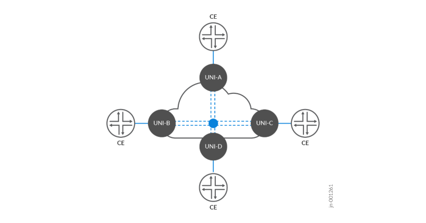

E-LAN implements similar service performance categories to E-Line, wherein the basic imposition may
include a best-effort service without performance guarantees. This means data transmission is not
prioritized, and there are no assurances for latency or packet loss thresholds. In more advanced
implementations, Service-Level Objectives (SLOs) are established to ensure key performance metrics are

delivered:

Differing bandwidth rates between UNIs

Multiple Class of Service (CoS) profiles for tailoring service levels

Performance objectives measuring Frame Delay (FD), Inter-Frame Delay Variation (IFDV), and Frame
Loss Ratio (FLR) to establish availability metrics

Service Multiplexing at one or more UNIs, enabling flexibility for multiple multipoint-to-multipoint E
LAN services and/or in parallel with point-to-point E-Line EVCs

These metrics ensure that the network meets specific performance levels, making it suitable for more
critical applications that require reliable data transmission, such as voice, video, or financial transactions.

E-LAN services include two main variations determined by the degree of control delegated between the

service provider and customer end user:

- Ethernet Private LAN (EP-LAN) is a port-based multipoint-to-multipoint “all-to-one bundling” service
providing a dedicated and private, transparent data path. All traffic on the physical port is mapped to

a single EVC. EP-LAN allows subscribers full control over their network infrastructure with the
flexibility to create and manage site-to-site connectivity options. CE-VLAN IDs and CE-VLAN CoS

markings are preserved end-to-end.

- Ethernet Virtual Private LAN (EVP-LAN) is similar to EP-LAN but supports service multiplexing and
shared bandwidth across the network. EVP-LAN enables multiple EVCs on one or more UNIs,
providing greater flexibility for delivering multiple multipoint-to-multipoint E-LAN services and/or in
parallel with point-to-point E-Line EVCs over a single UNI. Subscribers and/or traffic flows can be
mapped to specific VLANs with flexible VLAN ID preservation and QoS mapping.

E-LAN services offer a range of possibilities for enterprises looking to interconnect their facilities in an
efficient and effective manner. The detailed service attributes and configurations, as outlined in MEF
technical specifications, provide a foundation for customizing the service to meet varying business

needs.

The Iometrix MEF 3.0 validation covers the critical functionality required to deliver E-LAN services and
provide robust, flexible, and scalable solutions for organizations that require reliable multipoint-tomultipoint Ethernet connectivity. Leveraging the Metro EBS JVD solution architecture enables the
ability to scale from best-effort services to high-performance, guaranteed service delivery with strict
performance objectives.

#### E-LAN Multipoint-to-Multipoint Services

The protocol suite of multipoint-to-multipoint E-LAN services covered by the JVD includes EVPN-ELAN
and BGP-VPLS. The profile implements five distinct E-LAN use cases to deliver different connectivity

options. Each use case includes approximately 500-1250 MEF-related test cases executed as part of the
validation. The key service categories under the test include:

Functional Service Attributes and Parameters

- Layer 2 Control Protocol Frame Behaviors

Service OAM Functionalities

Bandwidth Profile Attributes and Parameters

Service Performance Attributes and Parameters

**Figure 9: E-LAN Base Protocol Suite**


Multiple permutations of the following service instantiation are delivered:

- Intra-Fabric

- Inter-AS

- Inter-Ring

Single-homing and Multihoming

- VLAN Aware and VLAN Unaware

Each VPN type can support multiple combinations of MEF service attributes. This flexibility is
demonstrated, but the JVD does not attempt to include every possible combination. There are
additional valid options for each VPN service type that can be leveraged, depending on the service
objectives.

**Figure 10: E-LAN Multipoint-to-Multipoint Service Termination**

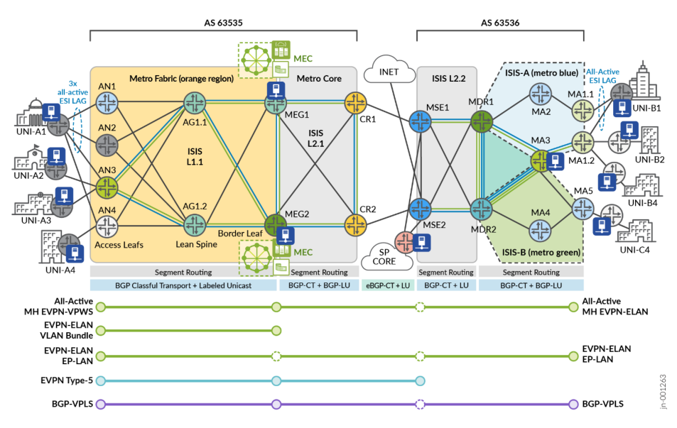

The lab topology includes service instantiation points illustrated in Figure 10 on page 53 for E-LAN

services, covered by the corresponding MEF test cases. Iometrix test probes are placed throughout the
topology for conducting end-to-end validation.

**Table 8: E-LAN Service Definitions**

|Inde<br>x|Servic<br>e Type|VPN Type|High Availability|Service Instantiation|Endpoints|
|---|---|---|---|---|---|
|1|E-LAN|EVPN-ELAN Port Based|Single-Homed|Inter-AS Fabric to<br>Ring|AN3, MA1.2, MA5|
|2|E-LAN|EVPN-ELAN VLAN-<br>based|Actve-Actve<br>Multhoming|Inter-AS Fabric to<br>Ring|AN1, AN2, AN3,<br>MEG1. MEG2,<br>MA1.1, MA1.2|
|3|E-LAN|EVPN-ELAN VLAN<br>Bundle|Actve-Actve<br>Multhoming|Metro Fabric|AN3, MEG1.<br>MEG2|

**Table 8: E-LAN Service Definitions (Continued)**

|Inde<br>x|Servic<br>e Type|VPN Type|High Availability|Service Instantiatoi n|Endpoints|
|---|---|---|---|---|---|
|4|E-LAN|EVPN-ELAN Type 5|Actve-Actve<br>Multhoming|Inter-AS Fabric to<br>MSE|AN3, MEG1,<br>MEG2, MSE1,<br>MSE2|
|5|E-LAN|BGP-VPLS|Single-Homed|Inter-AS Fabric to<br>Ring|AN3, MEG2,<br>MA1.2|

Every VPN service included in the JVD is designed with the purpose of delivering crucial metro
functionality and connectivity objectives. The services featured in Table 8 on page 53 are further

explained below.

**Table 9: E-LAN EVP-LAN Service Use Cases**

|Matchin<br>g<br>Index|EVP-LAN|Metro Use Case|
|---|---|---|
|[ 2 ]|EVPN-ELAN<br>VLAN-based|EVPN-ELAN VLAN-based service with EVI spanning up to three PEs AN1<br>(MX204), AN2 (ACX5448), and AN3 (ACX7100-48L) to connect the CE (UNI-A1)<br>Ethernet Segment (ES) with all-actve ESI UNI resiliency.<br>The E-LAN EVPN service is extended end-to-end with inter-AS support<br>terminatng into the EVPN EVI spanning two PEs MA1.1 (ACX7024) and MA1.2<br>(ACX7024) with an all-actve ESI connectng the UNI-B1 ES.<br>Additonal EVPN-ELAN sites include all-actve ESI connectng into the Multaccess<br>Edge Computng infrastructure at MEG1 (ACX7100-32C) and MEG2 (ACX7509).<br>This service allows for a seamless multpoint-to-multpoint LAN with all sites<br>enabled to access MEC resources.|

**Table 9: E-LAN EVP-LAN Service Use Cases (Continued)**

|Matchin<br>g<br>Index|EVP-LAN|Metro Use Case|
|---|---|---|
|[ 3 ]|EVPN-ELAN<br>VLAN Bundle|EVPN-ELAN VLAN Bundling establishes an actve-actve high availability service<br>connecton between AN3 (ACX7100-48L) to MEG1 (ACX7100-32C) and MEG2<br>(ACX7509) to provide UNI-A3 connectvity into the MEC complex over an all-<br>actve ESI. EVPN-ELAN VLAN Bundles services support N:1 mapping of CE-<br>VLANs to the EVI Bridge Domain.<br>Service multplexing is supported with the MEF Bundling atribute selectvely<br>enabled or disabled (All-to-One Bundling is disabled). The use case allows the<br>subscriber to curate layer 2 connectvity optons between local and remote sites<br>using VLAN matching. This allows the creaton of multple distnct E-LAN and<br>simultaneous E-LINE services between the common networks.|
|[ 4 ]|EVPN-ELAN<br>Route Type-5|With EVPN-ELAN leveraging Route-Type 5, Layer 3 capabilites are extended into<br>the Layer 2 service with IP Prefx advertsement support. This service connects<br>UNI-A3 via AN3 (ACX7100-48L), establishing actve-actve high availability to<br>MEG1 (ACX7100-32C) and MEG2 (ACX7509 for MEC access, including both<br>Layer 2 and Layer 3 reachability using Virtual Gateway Address (VGA). The use<br>case is further extended to include MSE1 (MX304) as an additonal EVPN-ELAN<br>site.|
|[ 5 ]|BGP-VPLS|BGP-VPLS is leveraged as a multpoint-to-multpoint inter-AS service connectng<br>UNI-A2 at AN3 (ACX7100-48L) with the MEC at MEG2 (ACX7509) on the metro<br>fabric and extends the LAN to the metro ring by connectng UNI-B2 site at MA1.2<br>(ACX7024).|

**Table 10: E-LAN EP-LAN Service Use Cases**

|Matchin<br>g<br>Index|EP-LAN|Metro Use Case|
|---|---|---|
|[ 1 ]|EVPN-ELAN|EVPN-ELAN port-based service supports an inter-AS LAN service between<br>multdomain inter-AS connectons between AN3, MA5, and MA1.2. This enables a<br>fexible and transparent connectvity service between UNI-A4 (AN3), UNI-B4<br>(MA1.2), and UNI-C4 (MA5).|

For E-LAN configurations used in this JVD and in [Metro Ethernet Business Services JVD](https://www.juniper.net/documentation/us/en/software/jvd/jvd-metro-ebs-03-01/index.html), see [Juniper](https://github.com/Juniper/jvd)
[GitHub Repository](https://github.com/Juniper/jvd) or contact your Juniper representative.

#### E-LAN: EVPN-ELAN VLAN-Based Example

EVPN-ELAN VLAN-based service allows one-to-one mapping of a single broadcast domain to a single
bridge domain. Each VLAN is mapped to one EVPN instance (EVI), resulting in a separate bridge table
for each VLAN. The example includes attachment circuits from three PEs: AN1 (MX204), AN2
(ACX5448), and AN3 (ACX7100-48L) to connect the CE (UNI-A1) Ethernet Segment (ES) with all-active

ESI UNI resiliency.

The E-LAN EVPN service is extended end-to-end with inter-AS support terminating into the EVPN EVI
spanning two PEs MA1.1 (ACX7024) and MA1.2 (ACX7024) with an all-active ESI connecting the UNI
B1 ES.

Additional EVPN-ELAN sites include all-active ESI connecting into the Multiaccess Edge Computing

(MEC) infrastructure at MEG1 (ACX7100-32C) and MEG2 (ACX7509). This service allows seamless
multipoint-to-multipoint LAN with all sites enabled to access MEC resources. For more information, see
the "E-LAN Multipoint-to-Multipoint Services" on page 51 section.

For brevity, the following sample configuration provides MX-to-ACX interoperability outputs for AN1
(MX204) with EVPN-ELAN connectivity to MEG1 (ACX7100-32C) and MEG2 (ACX7509).

```
       AN1 (MX204)
 interfaces {
 ae11 {
 unit 4011 {
 encapsulation vlan-bridge;
 vlan-id 4011;
 esi {
 00:70:11:40:11:11:11:00:00:64;
 all-active;
 }
 family bridge {
 filter {
 input f_elan-evpn;
 }
 }
 }
 }
 }
 routing-instances {
 evpn_group_90_4011 {
 instance-type evpn;
 protocols {
```

```
evpn {
encapsulation mpls;
}
}
vlan-id none;
no-normalization;
interface ae11.4011;
route-distinguisher 10.0.0.0:64011;
vrf-target target:63535:64011;
}
}
MEG1 (ACX7100-32C)
interfaces {
ae67 {
unit 4011 {
encapsulation vlan-bridge;
vlan-id 4011;
esi {
00:70:11:40:11:11:11:00:00:66;
all-active;
}
family ethernet-switching {
filter {
input f_elan-evpn;
}
}
}
}
}
routing-instances {
evpn_group_90_4011 {
instance-type mac-vrf;
protocols {
evpn {
encapsulation mpls;
no-control-word;
}
}
service-type vlan-based;
route-distinguisher 10.0.0.6:64011;
vrf-target target:63535:64011;
vlans {
BD_evpn_group_90_4011 {
```

```
vlan-id none;
interface ae67.4011;
}
}
}
}
MEG2 (ACX7509)
interfaces {
ae67 {
unit 4011 {
encapsulation vlan-bridge;
vlan-id 4011;
esi {
00:70:11:40:11:11:11:00:00:66;
all-active;
}
family ethernet-switching {
filter {
input f_elan-evpn;
}
}
}
}
}
routing-instances {
evpn_group_90_4011 {
instance-type mac-vrf;
protocols {
evpn {
encapsulation mpls;
no-control-word;
}
}
service-type vlan-based;
route-distinguisher 10.0.0.7:64011;
vrf-target target:63535:64011;
vlans {
BD_evpn_group_90_4011 {
vlan-id none;
interface ae67.4011;
}
}
```

```
 }
 }
```

For more information on EVPN-ELAN configurations, see [Juniper GitHub Repository](https://github.com/Juniper/jvd) .

#### E-LAN: EVPN-ELAN VLAN-Bundle Example

EVPN-ELAN VLAN Bundling establishes an active-active high availability service connection between
AN3 (ACX7100-48L) to MEG1 (ACX7100-32C) and MEG2 (ACX7509) to provide UNI-A3 connectivity
to the MEC complex over an all-active ESI. EVPN-ELAN VLAN Bundle services support N:1 mapping of

CE-VLANs to the EVI Bridge Domain.

Service multiplexing is supported with the MEF Bundling attribute selectively enabled or disabled (Allto-One Bundling is disabled). The use case allows the subscriber to curate Layer 2 connectivity options
between local and remote sites using VLAN matching. This allows the creation of multiple distinct ELAN and simultaneous E-LINE services between the common networks. For more information, see "ELAN Multipoint-to-Multipoint Services" on page 51 section.

The following sample configuration provides outputs for AN3 to MEG1 and MEG2.

```
       AN3 (ACX7100-48L)
 interfaces {
 et-0/0/13 {
 flexible-vlan-tagging;
 encapsulation flexible-ethernet-services;
 unit 4013 {
 encapsulation vlan-bridge;
 vlan-id-list 4013-4014;
 family ethernet-switching {
 filter {
 input f_elan-evpn;
 }
 }
 }
 }
 }
 routing-instances {
 evpn_group_80_4013 {
 instance-type mac-vrf;
```

```
protocols {
evpn {
encapsulation mpls;
}
}
service-type vlan-bundle;
route-distinguisher 10.0.0.2:4013;
vrf-export evpn_group_80_4013;
vrf-target target:63535:4013;
vlans {
BD_evpn_group_80_4013 {
interface et-0/0/13.4013;
}
}
}
}
      MEG1 (ACX7100-32C)
interfaces {
ae67 {
unit 4013 {
encapsulation vlan-bridge;
vlan-id-list 4013-4014;
esi {
00:81:10:13:10:10:10:00:00:01;
all-active;
}
family ethernet-switching {
filter {
input f_elan-evpn;
}
}
}
}
}
routing-instances {
evpn_group_80_4013 {
instance-type mac-vrf;
protocols {
evpn {
encapsulation mpls;
}
}
```

```
service-type vlan-bundle;
route-distinguisher 10.0.0.6:4013;
vrf-export evpn_group_80_4013;
vrf-target target:63535:4013;
vlans {
BD_evpn_group_80_4013 {
interface ae67.4013;
}
}
}
}
MEG2 (ACX7509)
interfaces {
ae67 {
unit 4013 {
encapsulation vlan-bridge;
vlan-id-list 4013-4014;
esi {
00:81:10:13:10:10:10:00:00:01;
all-active;
}
family ethernet-switching {
filter {
input f_elan-evpn;
}
}
}
}
}
routing-instances {
evpn_group_80_4013 {
instance-type mac-vrf;
protocols {
evpn {
encapsulation mpls;
}
}
service-type vlan-bundle;
route-distinguisher 10.0.0.7:4013;
vrf-export evpn_group_80_4013;
vrf-target target:63535:4013;
vlans {
BD_evpn_group_80_4013 {
```

```
 interface ae67.4013;
 }
 }
 }
 }
```

For more information on EVPN-ELAN VLAN Bundling configurations, see [Juniper GitHub Repository](https://github.com/Juniper/jvd) .

#### E-LAN: EVPN-ELAN Type-5 Example

With EVPN-ELAN leveraging Route-Type 5, Layer 3 capabilities are extended into the Layer 2 service
with IP Prefix advertisement support. This service connects UNI-A3 through AN3 (ACX7100-48L),
establishing active-active high availability to MEG1 (ACX7100-32C) and MEG2 (ACX7509) for MEC

access, including both Layer 2 and Layer 3 reachability with IRB Virtual Gateway Address (VGA). The use
case is extended to include MSE1 (MX304) as an additional EVPN-ELAN site.

In the Metro EBS JVD, MSE2 further provides a subscription-based Internet service for EVPN-ELAN
with RT-5 by importing public subnets tagged with the Internet community value. To limit only RouteType 5 advertisements, an export filter can be leveraged at MSE2 with a family EVPN matching keyword

[nlri-route-type 5]. This aspect is not included in the MaaS JVD, since only Layer 2 services are covered.

```
       AN3 (ACX7100-48L)
 interfaces {
 et-0/0/13 {
 flexible-vlan-tagging;
 encapsulation flexible-ethernet-services;
 unit 4075 {
 encapsulation vlan-bridge;
 vlan-id 4075;
 family ethernet-switching {
 filter {
 input f_elan-evpn;
 }
 }
 }
 }
 irb {
 unit 4075 {
 family inet {
```

```
address 203.0.113.1/27;
}
mac 00:01:33:44:11:12;
}
}
}
routing-instances {
evpn_group_60_4075 {
instance-type mac-vrf;
protocols {
evpn {
encapsulation mpls;
default-gateway do-not-advertise;
normalization;
no-control-word;
}
}
service-type vlan-based;
route-distinguisher 10.0.0.2:14075;
vrf-target target:61535:14075;
vlans {
V4000 {
vlan-id 4075;
interface et-0/0/13.4075;
l3-interface irb.4075;
}
}
}
METRO_L3VPN_4075 {
instance-type vrf;
routing-options {
router-id 10.0.0.2;
}
protocols {
evpn {
ip-prefix-routes {
advertise direct-nexthop;
encapsulation mpls;
}
}
}
interface irb.4075;
route-distinguisher 63000:13075;
```

```
vrf-import PS-METRO_L3VPN_4075-IMPORT;
vrf-export PS-METRO_L3VPN_4075-EXPORT;
vrf-table-label;
}
}
MEG1 (ACX7100-32C)
interfaces {
ae67 {
unit 4075 {
encapsulation vlan-bridge;
vlan-id 4075;
esi {
00:22:11:77:11:12:a1:00:00:01;
all-active;
}
family ethernet-switching {
filter {
input f_elan-evpn;
}
}
}
}
irb {
unit 4075 {
virtual-gateway-accept-data;
family inet {
address 198.51.100.2/27 {
virtual-gateway-address 198.51.100.1;
}
}
virtual-gateway-v4-mac 00:01:33:44:11:11;
}
}
}
routing-instances {
evpn_group_60_4075 {
instance-type mac-vrf;
protocols {
evpn {
encapsulation mpls;
default-gateway do-not-advertise;
normalization;
no-control-word;
```

```
}
}
service-type vlan-based;
route-distinguisher 10.0.0.6:14075;
vrf-target target:61535:14075;
vlans {
V4000 {
vlan-id 4075;
interface ae67.4075;
l3-interface irb.4075;
}
}
}
METRO_L3VPN_4075 {
instance-type vrf;
routing-options {
router-id 10.0.0.6;
}
protocols {
evpn {
ip-prefix-routes {
advertise direct-nexthop;
encapsulation mpls;
}
}
}
interface irb.4075;
route-distinguisher 61000:13075;
vrf-import PS-METRO_L3VPN_4075-IMPORT;
vrf-export PS-METRO_L3VPN_4075-EXPORT;
vrf-target target:61535:13075;
vrf-table-label;
}
}
MEG2 (ACX7509)
interfaces {
ae67 {
unit 4075 {
encapsulation vlan-bridge;
vlan-id 4075;
esi {
00:22:11:77:11:12:a1:00:00:01;
all-active;
```

```
}
family ethernet-switching {
filter {
input f_elan-evpn;
}
}
}
}
irb {
unit 4075 {
virtual-gateway-accept-data;
family inet {
address 198.51.100.3/27 {
virtual-gateway-address 198.51.100.1;
}
}
virtual-gateway-v4-mac 00:01:33:44:11:11;
}
}
}
routing-instances {
evpn_group_60_4075 {
instance-type mac-vrf;
protocols {
evpn {
encapsulation mpls;
default-gateway do-not-advertise;
normalization;
no-control-word;
}
}
service-type vlan-based;
route-distinguisher 10.0.0.7:14075;
vrf-target target:61535:14075;
vlans {
V4000 {
vlan-id 4075;
interface ae67.4075;
l3-interface irb.4075;
}
}
}
METRO_L3VPN_4075 {
```

```
instance-type vrf;
routing-options {
router-id 10.0.0.7;
}
protocols {
evpn {
ip-prefix-routes {
advertise direct-nexthop;
encapsulation mpls;
}
}
}
interface irb.4075;
route-distinguisher 62000:13075;
vrf-import PS-METRO_L3VPN_4075-IMPORT;
vrf-export PS-METRO_L3VPN_4075-EXPORT;
vrf-target target:61535:13075;
vrf-table-label;
}
}
MSE1 (MX304)
interfaces {
xe-0/0/13:2 {
flexible-vlan-tagging;
encapsulation flexible-ethernet-services;
unit 4075 {
encapsulation vlan-bridge;
vlan-id 4075;
family bridge {
filter {
input f_elan-evpn;
}
}
}
}
irb {
unit 4075 {
family inet {
address 192.0.2.1/27;
}
}
}
}
```

```
routing-instances {
evpn_group_60_4075 {
instance-type virtual-switch;
protocols {
evpn {
encapsulation mpls;
default-gateway do-not-advertise;
extended-vlan-list 4075;
no-control-word;
}
}
bridge-domains {
BD_evpn_group_60_4075 {
vlan-id 4075;
interface xe-0/0/13:2.4075;
routing-interface irb.4075;
}
}
route-distinguisher 10.0.0.10:14075;
vrf-target target:61535:14075;
}
METRO_L3VPN_4075 {
instance-type vrf;
routing-options {
router-id 10.0.0.10;
auto-export;
}
protocols {
evpn {
ip-prefix-routes {
advertise direct-nexthop;
encapsulation mpls;
}
}
}
interface irb.4075;
route-distinguisher 63200:13075;
vrf-import PS-METRO_L3VPN_4075-IMPORT;
vrf-export PS-METRO_L3VPN_4075-EXPORT;
vrf-table-label;
}
}
```

For more information on EVPN-EVPN with Type-5 configurations, see [Juniper GitHub Repository](https://github.com/Juniper/jvd) .

#### E-LAN: BGP-VPLS Example

BGP-VPLS is leveraged as a multipoint-to-multipoint inter-AS service connecting UNI-A2 at AN3

(ACX7100-48L) with the MEC at MEG2 (ACX7509) on the metro fabric and extends the LAN to the
metro ring by connecting UNI-B2 site at MA1.2 (ACX7024). For brevity, the sample configuration

outputs AN3 and MA1.2.

```
       AN3 (ACX7100-48L)
 interfaces {
 et-0/0/13 {
 flexible-vlan-tagging;
 encapsulation flexible-ethernet-services;
 unit 4012 {
 encapsulation vlan-bridge;
 vlan-id 4012;
 input-vlan-map {
 push;
 vlan-id 3712;
 }
 output-vlan-map pop;
 family ethernet-switching {
 filter {
 input f_elan-evpn;
 }
 }
 }
 }
 }
 routing-instances {
 vpls_group_103_4012 {
 instance-type virtual-switch;
 protocols {
 vpls {
 site r2 {
 site-identifier 1;
 }
 service-type single;
```

```
site-range 10;
label-block-size 8;
no-tunnel-services;
}
}
route-distinguisher 63535:1894012;
vrf-export vpls_group_103_4012;
vrf-target target:63535:1094012;
vlans {
vlan4012 {
interface et-0/0/13.4012;
}
}
}
}
MA1.2 (ACX7024)
interfaces {
et-0/0/12 {
unit 4012 {
encapsulation vlan-bridge;
vlan-id 4012;
input-vlan-map {
push;
vlan-id 3712;
}
output-vlan-map pop;
family ethernet-switching {
filter {
input f_elan-evpn;
}
}
}
}
}
interfaces {
et-2/0/4 {
unit 4012 {
encapsulation vlan-bridge;
vlan-id 4012;
input-vlan-map {
push;
vlan-id 3712;
}
```

```
 output-vlan-map pop;
 family ethernet-switching {
 filter {
 input f_elan-evpn;
 }
 }
 }
 }
 }
 routing-instances {
 vpls_group_103_4012 {
 instance-type virtual-switch;
 protocols {
 vpls {
 site r7 {
 site-identifier 4;
 }
 service-type single;
 site-range 10;
 label-block-size 8;
 no-tunnel-services;
 }
 }
 route-distinguisher 10.0.0.7:44012;
 vrf-export vpls_group_103_4012;
 vrf-target target:63535:1094012;
 vlans {
 vlan4012 {
 interface et-2/0/4.4012;
 }
 }
 }
 }
```

For more information on BGP-VPLS E-LAN configurations, see [Juniper GitHub Repository](https://github.com/Juniper/jvd) .

#### Metro as a Service: E-TREE

The following sections describe how MEF framework is leveraged in the JVD to deliver Metro as a
Service (MaaS) solution. This section explains the Ethernet Tree (E-Tree) portion of the MEF 3.0
validation.

i i

i

i

An Ethernet service with a rooted-multipoint EVC attribute is classified as an E-Tree service type. E-Tree
enables controlled communication between a central site (root) and multiple branch sites (leaves) while
preventing communication between branches. This service type, which is described in MEF 6.2/6.3
specifications, defines the E-Tree service model to facilitate root-to-leaf communication while restricting
or disallowing leaf-to-leaf traffic.

With EVPN E-TREE, each attachment circuit is designated as either root or leaf. As a result, each
Customer Edge (CE) device attached to the service is either a root or leaf.

E-Tree includes the following key characteristics:

- The root site(s) can exchange data with any leaf node, allowing for centralized control or data
distribution.

A root site has no restrictions forming communications with an egress UNI and can send traffic to

another root or any of the leaves.

Leaf-to-leaf communication is isolated. Traffic between leaf sites is either blocked or restricted,

ensuring that branches cannot directly communicate with each other, providing enhanced security
and data segregation. A leaf site can send or receive traffic only from a root.

Services may be provisioned across point-to-multipoint or multipoint-to-multipoint topologies using
EVCs, with each root having unique connections to the leaves or other roots.

A leaf site or root site can be connected to the PE devices in singlehoming mode or multihoming

mode.

Metro Ethernet Business Services JVD leverages E-Tree to deliver efficient, secure, and scalable services
supporting multiple business locations. Some examples within the scope of Metro EBS and beyond

include:

- Retail Chain Management : E-Tree services in a large retail organization allow the central office to
push data or update individual stores without enabling store-to-store communication. This ensures
operational consistency and prevents unauthorized data exchange between branches, helping to

maintain security and policy enforcement.

- Broadcastng and Media Distribut i on i : A content provider (root) distributes media to multiple
recipients (leaves), ensuring recipients cannot share information.

- Financial Data Distributon i : Centralized stock exchanges distribute real-time data to multiple

branches while branches remain isolated from one another.

- Surveillance Systems : A central monitoring hub collects feeds from multiple remote cameras (leaves)

without those cameras needing to communicate.

- Government or Military Communicatons i : A command center communicates with multiple remote
locations, ensuring isolated and secure communications.

The E-Tree service model ensures clear hierarchical communication, suitable for scenarios requiring a

single point of control with isolated downstream branches. In Figure 11 on page 73, a single root EVC
supports multiple leaf EVCs. Service frames are exchanged between the root EVC and any leaf EVCs.

Service frames cannot be exchanged between any Leaf-to-Leaf UNI EVCs. The behavior is consistent for
all traffic types (Unicast, Multicast, and Broadcast).

**Figure 11: E-TREE Rooted-Multipoint Single Root**

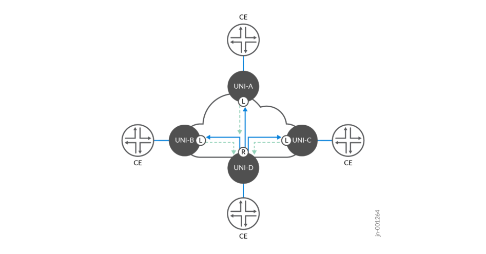

Figure 12 on page 74 illustrates the second topology with multiple root EVCs. In this scenario, leaf-toleaf communication is still forbidden to only leaf-to-root or leaf-to-multiple roots. However, root-to-root
communication is allowed, providing additional reliability and high availability. The Metro EBS JVD
includes dual root nodes in active-active high availability modes.

**Figure 12: E-TREE Rooted-Multipoint Multiple Roots**

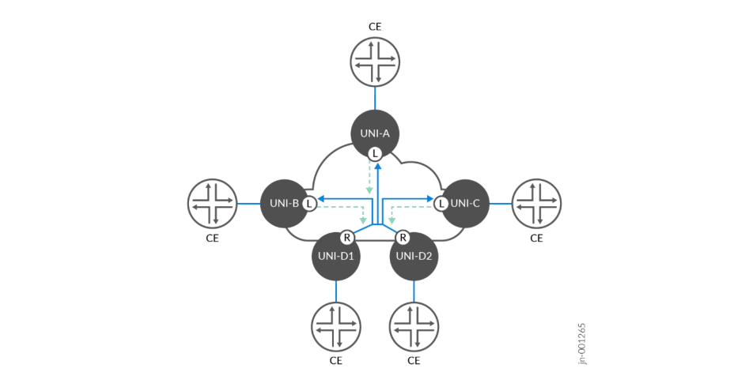

E-Tree implements similar performance categories to E-Line and E-LAN services to meet the established

SLOs to ensure key performance metrics are delivered. This includes:

Differing bandwidth rates between UNIs

Multiple Class of Service (CoS) profiles for tailoring service levels

Performance objectives measuring Frame Delay (FD), Inter-Frame Delay Variation (IFDV), and Frame
Loss Ratio (FLR) to establish availability metrics

Service multiplexing at one or more UNIs, enabling flexibility for rooted-multipoint services that may

coexist with other service types.

These metrics ensure that the network meets specific performance levels, making it suitable for more
critical applications that require reliable data transmission, such as voice, video, or financial transactions.

E-Tree services has two main variations determined by the degree of control delegated between the

service provider and customer end user:

- Ethernet Private Tree (EP-Tree) is a port-based, rooted-multipoint “all-to-one bundling” service
providing a dedicated and private transparent data path. All traffic on the physical port (UNI) is

mapped to a single EVC. EP-Tree allows subscribers full control over their network infrastructure with
the flexibility to create and manage site-to-site connectivity options. Subscriber CE-VLAN IDs and
CE-VLAN CoS markings are preserved end-to-end without restrictions.

- Ethernet Virtual Private Tree (EVP-Tree) supports service multiplexing and shared bandwidth across
the network. EVP-Tree enables multiple EVCs on one or more UNIs, providing greater flexibility for

delivering multiple rooted-multipoint services. In parallel, point-to-point EVPL E-Line or multipointto-multipoint EVP-LAN EVCs may be created over a single UNI. Subscribers and/or traffic flows can
be mapped to specific VLANs with flexible VLAN ID preservation and QoS mapping.

E-Tree services offer a range of possibilities for enterprises to interconnect facilities in an efficient,
scalable, and secure manner. The detailed service attributes and configurations, as outlined in MEF
technical specifications, provide a foundation for customizing the service to meet varying business

needs.

The Iometrix MEF 3.0 validation covers the critical functionality required to deliver E-Tree services. It
provides robust, flexible, and scalable solutions for organizations that require reliable rooted-multipoint
Ethernet connectivity. Leveraging the Metro EBS JVD solution architecture enables the ability to scale
from best-effort services to high-performance, guaranteed service delivery with strict performance
objectives.

#### E-TREE Rooted-Multipoint Services

The protocol suite of E-Tree rooted-multipoint services covered by the JVD includes EVPN-ETREE with

single or dual root nodes. The EVP-Tree use case includes 1129 MEF-related test cases executed as part
of the validation. EP-Tree is supported but not included in the validation. The key service categories

under the test include:

Functional Service Attributes and Parameters

- Layer 2 Control Protocol Frame Behaviors

Service OAM Functionalities

Bandwidth Profile Attributes and Parameters

Service Performance Attributes and Parameters

**Figure 13: E-Tree Base Protocol Suite**


Multiple combinations and service attributes of EVPN-ETREE are supported beyond the scope of what
is included in the JVD, with MX304 (MSE1, MSE2) as active-active root nodes and MX204 (MA4, MA5)

as leaf nodes.

**Figure 14: E-TREE Rooted-Multipoint Service Termination**

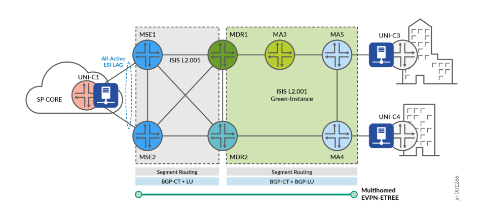

Figure 14 on page 76 illustrates the lab topology with service instantiation points for E-Tree services

covered by the corresponding MEF test cases. Iometrix test probes are placed throughout the topology
for conducting the end-to-end validation.

**Table 11: E-TREE EVP-TREE Service Use Cases**

|Inde<br>x|Service<br>Type|VPN Type|High Availability|Service<br>Instantiation|Endpoints|
|---|---|---|---|---|---|
|1|E-Tree|EVPN-ETREE|Actve-Actve Roots|Metro Ring|MSE1,<br>MSE2, MA4,<br>MA5|

Every VPN service included in the JVD is designed with the purpose of delivering crucial metro
functionality and connectivity objectives. The services featured in Table 11 on page 76 are explained

below.

**Table 12: E-TREE EVP-TREE Service Use Cases**

|Matchin<br>g<br>Index|EVP-TREE|Metro Use Case|
|---|---|---|
|[ 1 ]|EVPN-ETREE|EVPN-ETREE is implemented as a VLAN-based service with leaf nodes at MA4<br>(MX204) and MA5 (MX204). Redundant Root nodes are included at MSE1 and<br>MSE2 (MX304) for actve-actve high availability. Leaf-to-leaf communicaton is<br>forbidden. All-actve ESI LAG is supported for UNI resiliency at the MSEs.|

For more information about the E-Tree configurations used in this JVD and in Metro Ethernet Business
Services JVD, see [Juniper GitHub Repository](https://github.com/Juniper/jvd) or contact your Juniper representative.

#### E-Tree: EVPN-ETREE Example

EVPN-ETREE is implemented as a VLAN-based service with leaf nodes at MA4 (MX204) and MA5
(MX204). Redundant Root nodes are included at MSE1 and MSE2 (MX304) for active-active high
availability. Leaf-to-leaf communication is forbidden. All-active ESI LAG is supported for UNI resiliency
at the MSEs. For more information, see "E-TREE Rooted-Multipoint Services" on page 75

The following sample configuration provides outputs for MSE1 (root), MSE2 (root), MA4 (leaf), and MA5

(leaf).

```
       Root: MSE1 (MX304)
 interfaces {
 ae10 {
 unit 4080 {
 encapsulation vlan-bridge;
 vlan-id 4080;
 esi {
 00:10:11:11:40:80:01:62:00:01;
 all-active;
 }
 family bridge {
 filter {
 input f_elan-evpn;
 }
 }
```

```
etree-ac-role root;
}
}
}
routing-instances {
evpn_group_80_4080 {
instance-type evpn;
protocols {
evpn {
interface ae10.4080;
evpn-etree;
}
}
vlan-id 4080;
interface ae10.4080;
route-distinguisher 10.0.0.10:4080;
vrf-export evpn_group_80_4080;
vrf-target target:63536:4080;
}
}
Root: MSE2 (MX304)
interfaces {
ae10 {
unit 4080 {
encapsulation vlan-bridge;
vlan-id 4080;
esi {
00:10:11:11:40:80:01:62:00:01;
all-active;
}
etree-ac-role root;
}
}
}
routing-instances {
evpn_group_80_4080 {
instance-type evpn;
protocols {
evpn {
interface ae10.4080;
evpn-etree;
}
}
```

```
vlan-id 4080;
interface ae10.4080;
route-distinguisher 10.0.0.11:4080;
vrf-export evpn_group_80_4080;
vrf-target target:63536:4080;
}
}
Leaf: MA4 (MX204)
interfaces {
xe-0/1/5 {
flexible-vlan-tagging;
mtu 9102;
encapsulation flexible-ethernet-services;
unit 4080 {
encapsulation vlan-bridge;
vlan-id 4080;
family bridge {
filter {
input f_elan-evpn;
}
}
etree-ac-role leaf;
}
}
}
routing-instances {
evpn_group_80_4080 {
instance-type evpn;
protocols {
evpn {
interface xe-0/1/5.4080;
evpn-etree;
}
}
vlan-id 4080;
interface xe-0/1/5.4080;
route-distinguisher 10.0.0.16:4080;
vrf-export evpn_group_80_4080;
vrf-target target:63536:4080;
}
}
Leaf: MA5 (MX204)
interfaces {
```

```
 xe-0/1/0 {
 flexible-vlan-tagging;
 mtu 9102;
 encapsulation flexible-ethernet-services;
 unit 4080 {
 encapsulation vlan-bridge;
 vlan-id 4080;
 family bridge {
 filter {
 input f_elan-evpn;
 }
 }
 etree-ac-role leaf;
 }
 }
 }
 routing-instances {
 evpn_group_80_4080 {
 instance-type evpn;
 protocols {
 evpn {
 interface xe-0/1/0.4080;
 evpn-etree;
 }
 }
 vlan-id 4080;
 interface xe-0/1/0.4080;
 route-distinguisher 10.0.0.19:4080;
 vrf-export evpn_group_80_4080;
 vrf-target target:63536:4080;
 }
 }
```

For more information about the EVPN-ETREE configurations, see [Juniper GitHub Repository](https://github.com/Juniper/jvd) .

#### Metro as a Service: Access E-LINE

The following sections describe how MEF framework is leveraged in the JVD to deliver Metro as a
Service (MaaS) solution. This section explains the Access E-Line (formerly E-Access) portion of the MEF
3.0 validation.

Access E-Line is defined by MEF 51 technical specification as a wholesale Ethernet access service based
on the usage of Operator Virtual Connections (OVCs) to associate External Network-to-Network

Interface (ENNI) endpoint(s) to UNI endpoint(s). The OVC enables an operator to provide Ethernet
connectivity between a Customer Edge (CE) at the UNI and another service provider at the External
ENNI. This model allows Ethernet services to transport across multiple operators' networks while

ensuring service consistency and quality.

The UNI acts as the customer demarcation point with the service provider. The ENNI is situated at the
boundary between two operator networks and serves as the connection point where the OVC
terminates in the service provider’s network, transitioning to another network or service provider. When
the OVC facilitates a transfer within a single operator, the connection type is called an Internal Networkto-Network Interface (INNI), but the functional characteristics are the same.

**Table 13: ENNI and INNI Characteristics**

|Feature|ENNI|INNI|
|---|---|---|
|Locaton|Between two operator networks|Within a single operator's network|
|Purpose|Inter-operator connectvity|Intra-operator connectvity|
|Connecton Type|Connects independent provider networks|Connects internal network domains|
|Example Use Case|Wholesale-to-retail provider connecton|Mult-services Integraton|

The Access E-Line service formed by the point-to-point OVC is called O-Line, which may interconnect a
UNI to an ENNI or between two ENNIs. Multiple O-Line services may be strung together across
provider domains or multi-operator networks.


i i

i

**Figure 15: Access E-Line with ENNI Connectivity**

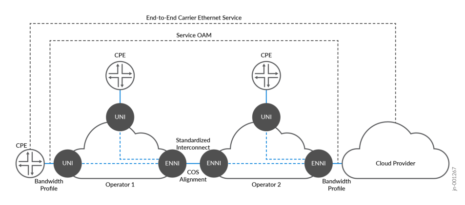

i i

i

Access E-Line involves the following components that differ from the previous services described so far.

- OVC-Based Architecture : The OVC links the UNI at the customer’s location to the ENNI, which
interconnects different service provider networks. The OVC acts as the carrier for traffic between

these interfaces, ensuring secure and reliable transport of Ethernet services across domains.

- Seamless Mult-Operator Connect i vity i : By leveraging OVCs, the Access E-Line service allows one

operator to use another operator’s infrastructure to extend their service reachability. This facilitates
end-to-end service delivery across multiple administrative domains without compromising service

quality.

- OVC Types : E-Access services can support both Point-to-Point OVCs (similar to EPL services) and
Multiplexed OVCs (similar to EVPL services), allowing multiple services to be delivered over a single
physical connection. The service provider owning the access infrastructure may support multiple

virtual circuits identified by a single VLAN ID. This flexibility makes it suitable for a wide variety of

business and wholesale scenarios.

Access E-Line may be leveraged to deliver several use cases, including:

- Wholesale Access : A service provider can offer access services to other network operators, allowing

them to deliver Ethernet services in regions outside their own network footprint.

- Mult-Domain Ethernet Services i : Access E-Line simplifies the process of offering Ethernet services
across multiple operators' networks by using standardized OVCs at the ENNI.

Access E-Line allows operators to extend service offerings while maintaining control over the quality

and performance.

#### Access E-Line Services

The protocol suite of point-to-point OVC Access E-Line covered by the JVD includes approximately 400
MEF-related test cases in the validation of the following key service categories:

Functional Service Attributes and Parameters

- Layer 2 Control Protocol Frame Behaviors

Service OAM Functionalities

Bandwidth Profile Attributes and Parameters

Service Performance Attributes and Parameters

**Figure 16: Access E-Line Base Protocol Suite**


Multiple combinations and service attributes of Access E-Line are supported beyond the scope of what
is included in the JVD, such as Access E-LAN, Access E-Tree, and Access E-Transit permutations. O-Line
services are point-to-point in nature and may be chained to connect disparate UNIs across multiple OLine connections. OVC pairs forming O-Line services may consist of the following connectivity types:

Connecting two External or Internal NNIs (ENNI or INNI)

Connecting OVC endpoints (ENNI or INNI) within the same device (aka Hairpinning)

Connecting ENNI or INNI to a UNI

Two options featured in the JVD to facilitate Access E-Line include leveraging local-switched services:

L2CCC with L2Circuit local-switching and EVPN-VPWS local-switching.

**Figure 17: Access E-Line**

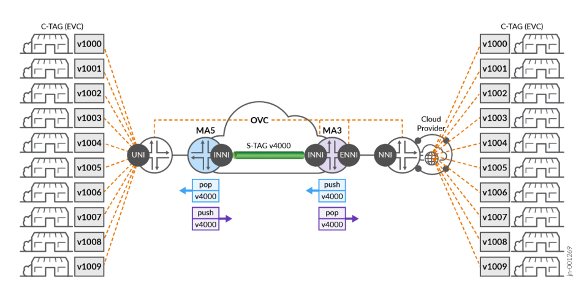

Figure 17 on page 84 illustrates end-to-end connectivity achieved across multiple O-Line services for a
cloud provider interconnection.

EVCs are service multiplexed, which may support multitenant use cases. At the transit point of MA5

(MX204), an S-TAG is mapped to the OVC endpoint toward MA3 (ACX7100-48L) to support INNI-toINNI connectivity within the same Carrier Ethernet network. Traffic is exchanged across the interdomain
segment using S-TAG information. C-TAGs and CoS markings are preserved. The S-TAG may be removed

at the ENNI OVC to expose the original C-TAG infrastructure to the cloud provider. The interworking’s
of how the O-Line services are achieved are flexible and dependent on the use case requirements.
Extending or swapping S-TAG at the ENNI-to-NNI exchange may be preferred to continue transporting

CE-VLANs transparently.

For more information about the Access E-Line configurations used in this JVD and in Metro Ethernet
Business Services JVD, see [Juniper GitHub Repository](https://github.com/Juniper/jvd) or contact your Juniper representative.

#### Access E-Line: EVPN-VPWS Local-Switching Example

Access E-Line (formerly E-Access) services are delivered with several permutations. The JVD includes

common local-switching methodologies using EVPN-VPWS or L2Circuit (L2CCC). A range of VLAN-IDs
are identified at the OVC ENNI position, pushing an outer S-TAG. The transport network to the
destination OVC needs only to be aware of the outer VLAN-ID. For more information, see "Metro as a
Service: Access E-LINE" on page 80 section.

The following sample configuration provides outputs for MA3 (ACX7100-48L).

```
       MA3 (ACX7100-48L)
 interfaces {
 et-0/0/0 {
 flexible-vlan-tagging;
 mtu 9102;
 encapsulation flexible-ethernet-services;
 ether-options {
 ethernet-switch-profile {
 tag-protocol-id [ 0x8100 0x88a8 ];
 }
 }
 unit 2500 {
 encapsulation vlan-ccc;
 vlan-id-list 2500-2599;
 input-vlan-map {
 push;
 tag-protocol-id 0x88a8;
 vlan-id 4082;
 }
 output-vlan-map pop;
 family ccc {
 filter {
 input f_eline-evpn-vpws;
 }
 }
 }
 }
 et-0/0/51 {
 mtu 9102;
 ether-options {
 ethernet-switch-profile {
 tag-protocol-id [ 0x8100 0x88a8 ];
 }
 }
 unit 4082 {
 encapsulation vlan-ccc;
 vlan-tags outer 0x88a8.4082;
 }
 }
```

```
 }
 routing-instances {
 lsw_evpn_vpws_group_90_4082 {
 instance-type evpn-vpws;
 protocols {
 evpn {
 interface et-0/0/0.2500 {
 vpws-service-id {
 local 22;
 remote 11;
 }
 }
 interface et-0/0/51.4082 {
 vpws-service-id {
 local 11;
 remote 22;
 }
 }
 control-word;
 }
 }
 interface et-0/0/0.2500;
 interface et-0/0/51.4082;
 route-distinguisher 10.0.0.15:4082;
 vrf-target target:63533:4082;
 }
 }
```

For more information about Access E-Line configurations, see [Juniper GitHub Repository](https://github.com/Juniper/jvd) .

#### Access E-Line: L2Circuit Local-Switching Example

A similar configuration, leveraging L2Circuit local-switching, is accomplished with the following sample
configuration.

```
       MA3 (ACX7100-48L)
 interfaces {
 et-0/0/0 {
 flexible-vlan-tagging;
```

```
mtu 9102;
encapsulation flexible-ethernet-services;
ether-options {
ethernet-switch-profile {
tag-protocol-id [ 0x8100 0x88a8 ];
}
}
unit 2500 {
encapsulation vlan-ccc;
vlan-id-list 2500-2599;
input-vlan-map {
push;
tag-protocol-id 0x88a8;
vlan-id 4082;
}
output-vlan-map pop;
family ccc {
filter {
input f_eline-evpn-vpws;
}
}
}
}
et-0/0/51 {
mtu 9102;
ether-options {
ethernet-switch-profile {
tag-protocol-id [ 0x8100 0x88a8 ];
}
}
unit 4082 {
encapsulation vlan-ccc;
vlan-tags outer 0x88a8.4082;
}
}
}
protocols {
l2circuit {
local-switching {
interface et-0/0/0.2500 {
end-interface {
interface et-0/0/51.4082;
}
```

```
  ignore-mtu-mismatch;
  }
  }
  }
  }
### Results Summary and Analysis
```

**IN THIS SECTION**

Functional Service Attributes and Parameters **| 91**

L2CP and SOAM Frame Behavior **| 95**

Bandwidth Profile Attributes and Parameters **| 103**

Service Performance Attributes and Parameters **| 113**

E-LINE Test Results Summary **| 114**

E-LAN Test Results Summary **| 121**

E-TREE Test Results Summary **| 132**

Access E-LINE (E-Access) Test Results Summary **| 140**

The JVD team has successfully validated E-Line, E-LAN, E-Tree, and Access E-Line services included in

the [Metro Ethernet Business Services JVD](https://www.juniper.net/documentation/us/en/software/jvd/jvd-metro-ebs-03-01/index.html) using Iometrix Lab in the Sky infrastructure. Over 12,000 test
cases are executed to ensure the featured services meet MEF 3.0 compliance. The validation includes

use cases delivered with EVPN-VPWS, EVPN Flexible Cross Connect, L2Circuit, L2VPN, and BGP-VPLS

in the intra-AS and inter-AS scenarios.

The primary devices under test include MEF 3.0-certified products: ACX7024, ACX7100, ACX7509, and

MX304. The below topology ( Figure 18 on page 90 ) illustrates the physical architecture built to
support this solution in Juniper labs. Iometrix test probes are placed in the positions shown with blue
icons to facilitate traffic flows and compliance examinations.

Throughout the validation, our goal is to remain aligned with MEF 3.0 mandatory certification
requirements as defined by [MEF 91 Carrier Ethernet Test Requirements](https://www.mef.net/wp-content/uploads/2021/03/MEF-91.pdf) standard. Test cases are
categorized as mandatory or conditional mandatory.

 MANDATORY test cases, as included in MEF 3.0 certification, are covered by the JVD.

CONDITIONAL MANDATORY test cases are not enforced, typically due to reliance upon optional
features or attributes. In other words, these test scenarios only become mandatory when certain
optional attributes are utilized. Depending on whether the conditions already exist in the Metro EBS
network design, optional test cases may or may not be covered by the JVD.

The solution architecture supports additional features and functionalities defined by MEF but beyond
the scope of the unconditional mandatory certification criteria. Future JVD iterations may expand
testing to include optional attributes.

In some cases, optional (conditional mandatory) attributes are covered to preserve the intentionality of
the JVD itself, such as UNI resiliency. The test data identifies certification applicability criteria with
additional columns to clearly identify areas where the validation tested beyond the scope of MEF 3.0

requirements.

**Figure 18: Metro Topology Under Test**

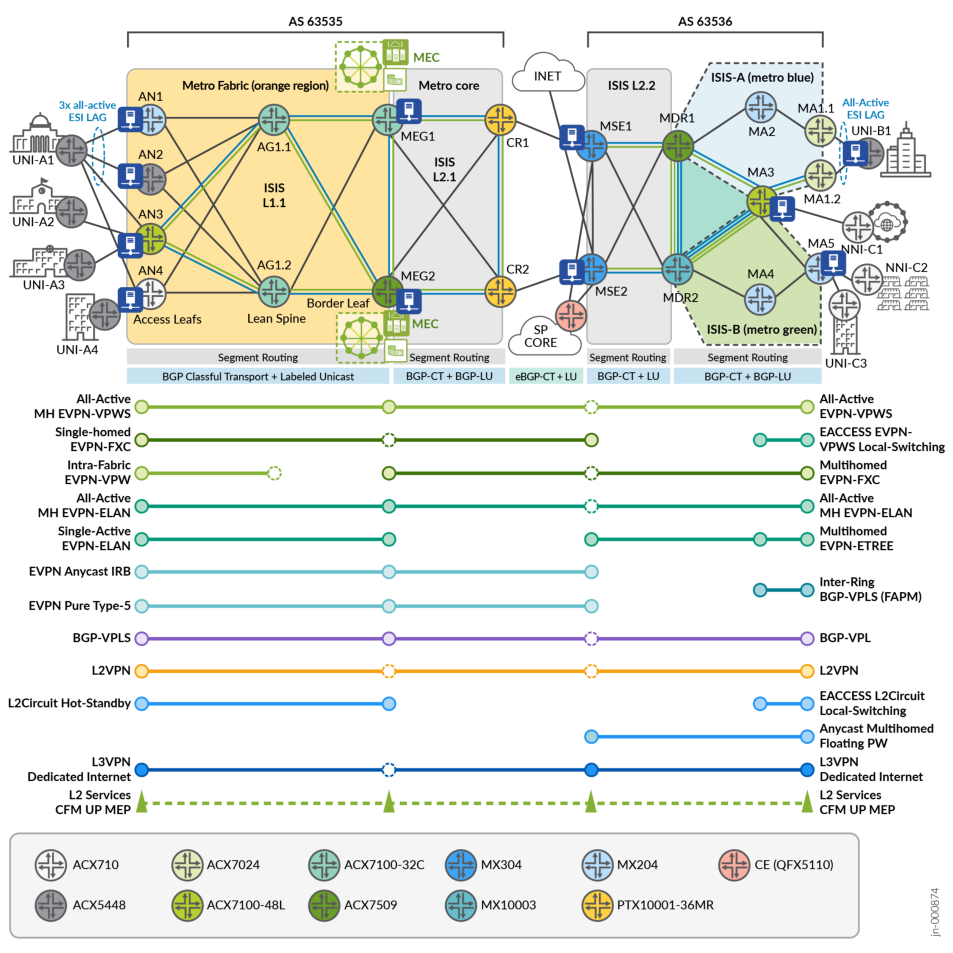

The JVD validation focused on the following five major categories of test scenarios related to MEF 3.0.

The test cases are executed from Iometrix Lab in the Sky infrastructure. All included test cases passed
without exception.

Functional Service Attributes and Parameters

- Layer 2 Control Protocol Frame Behaviors

Service OAM Functionalities

Bandwidth Profile Attributes and Parameters

Service Performance Attributes and Parameters

#### Functional Service Attributes and Parameters

This category validates service functionalities and attributes defined for service types, including E-Line,
E-LAN, E-Tree, and Access E-Line. It ensures these services meet the necessary operational
characteristics and behaviors, such as Ethernet Virtual Connections (EVCs), VLAN handling, and service
multiplexing.

Table 14 on page 91 summarizes functional testing included in the JVD. For additional test information,
see the Test Report Brief or contact your Juniper representative.

In each case, the number of endpoints is adjusted based on the service type. For example, E-LAN and ETree include a minimum of 3 sites, and E-Line is always two sites. As a result, test cases have additional
multipliers (not shown below) to validate all possible combinations.

The Access E-Line test cases share similar functional goals as E-Line, E-LAN, and E-Tree but with a focus
on validating OVC endpoints related to ENNI operations with single and double-tagged frames.

**Table 14: MEF Functional Test Cases**

|Test<br>Type|Test Name|Service Type|
|---|---|---|
|Functo<br>nal|Class of Service atributes and behaviors|EPL, EP-LAN, EVPL, EVP-LAN,<br>EVP-TREE|
|Functo<br>nal|EVC Service atributes|EPL, EP-LAN, EVPL, EVP-LAN,<br>EVP-TREE|
|Functo<br>nal|Non-Looping Frame Delivery for Broadcast, Multcast, and<br>Unknown Unicast (High, Med, Low)|EPL, EP-LAN, EVPL, EVP-LAN,<br>EVP-TREE|
|Functo<br>nal|CE-VLAN Preservaton for Untagged Service Frames|EPL, EP-LAN|
|Functo<br>nal|CE-VLAN Preservaton for Tagged Service Frames (High, Med,<br>Low)|EPL, EP-LAN, EVPL, EVP-LAN,<br>EVP-TREE|
|Functo<br>nal|CE-VLAN Preservaton Priority Tagged Service Frames (High, Med,<br>Low)|EPL, EP-LAN|

**Table 14: MEF Functional Test Cases (Continued)**

|Test<br>Type|Test Name|Service Type|
|---|---|---|
|Functo<br>nal|CE-VLAN Preservaton Tagged Service Frames PCP 0-1 (Low)|EPL, EP-LAN|
|Functo<br>nal|CE-VLAN Preservaton Tagged Service Frames PCP 2-3 (Med)|EPL, EP-LAN|
|Functo<br>nal|CE-VLAN Preservaton Tagged Service Frames PCP 4-5 (High)|EPL, EP-LAN|
|Functo<br>nal|CE-VLAN Preservaton Priority Tagged Service Frames PCP 0-1<br>(Low)|EPL, EP-LAN|
|Functo<br>nal|CE-VLAN Preservaton Priority Tagged Service Frames PCP 2-3<br>(Med)|EPL, EP-LAN|
|Functo<br>nal|CE-VLAN Preservaton Priority Tagged Service Frames PCP 4-5<br>(High)|EPL, EP-LAN|
|Functo<br>nal|CE-VLAN DEI Preservaton Tagged Service Frames DEI 0-1 (High,<br>Med, Low)|EPL, EP-LAN|
|Functo<br>nal|CE-VLAN DEI Preservaton Priority Tagged Service Frames DEI 0-1<br>(High, Med, Low)|EPL, EP-LAN|
|Functo<br>nal|UNI Physical Layer, Mode, and Speed (High, Med, Low)|EPL, EP-LAN, EVPL, EVP-LAN,<br>EVP-TREE|
|Functo<br>nal|EVC Maximum Service Frame Size for Untagged|EPL, EP-LAN|
|Functo<br>nal|EVC Maximum Service Frame Size for Tagged (High, Med, Low)|EPL, EP-LAN, EVPL, EVP-LAN,<br>EVP-TREE|
|Functo<br>nal|CE-VLAN ID/EVC Map Service Frame Discard (High, Med, Low)|EVPL, EVP-LAN, EVP-TREE|
|Functo<br>nal|Maximum CE-VLAN IDs per EVC EPs with All-to-One Bundling<br>Enabled|EPL, EP-LAN|

**Table 14: MEF Functional Test Cases (Continued)**

|Test<br>Type|Test Name|Service Type|
|---|---|---|
|Functo<br>nal|Single Copy of Service Frame Delivery in Multpoint EVC for<br>Broadcast (High, Med, Low)|EPL, EP-LAN, EVP-TREE|
|Functo<br>nal|Single Copy of Service Frame Delivery in Multpoint EVC for<br>Multcast (High, Med, Low)|EPL, EP-LAN, EVP-TREE|
|Functo<br>nal|Single Copy of Service Frame Delivery in Multpoint EVC for<br>Unknown Unicast (High, Med, Low)|EPL, EP-LAN, EVP-TREE|
|Functo<br>nal|Service Frame Transparency for Tagged to Tagged (High, Med,<br>Low)|EPL, EP-LAN, EVPL, EVP-LAN,<br>EVP-TREE|
|Functo<br>nal|Service Frame Transparency for Untagged to Untagged|EPL, EP-LAN|
|Functo<br>nal|Service Frame Transparency for Priority Tagged to Priority Tagged<br>(High, Med, Low)|EPL, EP-LAN|
|Functo<br>nal|Class of Service atributes and behaviors|Access E-Line|
|Functo<br>nal|OVC Service atributes|Access E-Line|
|Functo<br>nal|OVC CE-VLAN ID Preservaton for Double-Tagged ENNI Frame<br>(High, Med, Low)|Access E-Line|
|Functo<br>nal|Maximum Number of CE-VLAN ID per OVC EPs at the UNI with<br>Custom number of CE-VLAN IDs for Double Tagged ENNI Frame<br>(High, Med, Low)|Access E-Line|
|Functo<br>nal|OVC CE-VLAN PCP Preservaton for Double-Tagged ENNI Frames<br>PCP 0-1 (Low)|Access E-Line|
|Functo<br>nal|OVC CE-VLAN PCP Preservaton for Double-Tagged ENNI Frames<br>PCP 2-3 (Med)|Access E-Line|

**Table 14: MEF Functional Test Cases (Continued)**

|Test<br>Type|Test Name|Service Type|
|---|---|---|
|Functo<br>nal|OVC CE-VLAN PCP Preservaton for Double-Tagged ENNI Frames<br>PCP 4-5 (High)|Access E-Line|
|Functo<br>nal|ENNI Physical Layer, Mode, and Speed with Double-Tagged ENNI<br>Frame (High, Med, Low)|Access E-Line|
|Functo<br>nal|OVC Maximum Frame Size with Double-Tagged ENNI Frame (High,<br>Med, Low)|Access E-Line|
|Functo<br>nal|OVC End Point Map with ENNI Frame Discard (High, Med, Low)|Access E-Line|
|Functo<br>nal|OVC CE-VLAN ID Preservaton with Tagged Service Frame (High,<br>Med, Low)|Access E-Line|
|Functo<br>nal|Maximum Number of CE-VLAN ID per OVC EPs at the UNI with<br>Custom number of CE-VLAN IDs for Tagged Service Frame (High,<br>Med, Low)|Access E-Line|
|Functo<br>nal|OVC CE-VLAN PCP Preservaton for Tagged ENNI Frames PCP<br>0-1 (Low)|Access E-Line|
|Functo<br>nal|OVC CE-VLAN PCP Preservaton for Tagged ENNI Frames PCP<br>2-3 (Med)|Access E-Line|
|Functo<br>nal|OVC CE-VLAN PCP Preservaton for Tagged ENNI Frames PCP<br>4-5 (High)|Access E-Line|
|Functo<br>nal|UNI Physical Layer, Mode and Speed for Tagged Service Frame<br>(High, Med, Low)|Access E-Line|
|Functo<br>nal|OVC Maximum Frame Size for Tagged Service Frame (High, Med,<br>Low)|Access E-Line|

Functional Test Cases: PASS

#### L2CP and SOAM Frame Behavior

This category tests the handling of Layer 2 Control Protocols (L2CP) and Service OAM (SOAM) frames,
ensuring they are properly processed and managed by the system. It involves testing the correct

tunneling and forwarding of control and management frames (for example, CCM, LBM, LTM, LTR). The
validation ensures frames are properly identified and handled according to MEF network operation and
maintenance standards. Where applicable, Class of Service attributes are included.

L2CP test cases are validated based on MEF frame handling expectations (MEF 45.1). The treatment of

L2CP frames is dependent on whether the service is C-TAG Aware (CTA) or C-TAG Blind (CTB). In this

context, CTA is referenced as VLAN-based, and CTB is referenced as a port-based service type.

JUNOS-Evolved ACX devices leverage the [mef-forwarding-profile] persona to allow customers flexible
default behaviors for handling L2CP frame filtering. Without the MEF forwarding profile, the majority of
L2CP MAC types are forwarded by design. Once the MEF forwarding profile is enabled, key L2CP MACs
are filtered or forwarded based on MEF expectations for VLAN-based (CTA) or port-based (CTB)
services. For strict alignment, firewall filtering allows selective MAC filtering treatment. Both approaches
are used in the JVD with all configurations provided.

Table 15 on page 95 explains MEF test cases comparing JUNOS-EVO behavior with and without
enabling the MEF forwarding profile. By default, MX Series Routers implement the MEF Profile behavior
without additional configuration.

For VLAN-based services, the expectation is to filter all L2CP MACs. This is the behavior when
configuring the MEF forwarding profile. For additional test information, see the Test Report Brief or
contact your Juniper representative.

**Table 15: L2CP Frame Treatment (VLAN-based Services)**

|Layer 2 Control Protocol MAC|MEF<br>Behavior|MEF<br>Profile<br>Enabled|MEF Profile<br>Disabled|
|---|---|---|---|
|01-80-C2-00-00-01 IEEE MAC Specifc Destnaton Address|Filtered|Filtered|Filtered|
|01-80-C2-00-00-02 IEEE Slow Protocols LACP Destnaton<br>Address|Filtered|Filtered|Forwarded|
|01-80-C2-00-00-02 IEEE Slow Protocols Marker Destnaton<br>Address|Filtered|Filtered|Forwarded|
|01-80-C2-00-00-02 IEEE Slow Protocols Link OAM Destnaton<br>Address|Filtered|Filtered|Forwarded|

**Table 15: L2CP Frame Treatment (VLAN-based Services) (Continued)**

|Layer 2 Control Protocol MAC|MEF<br>Behavior|MEF<br>Profile<br>Enabled|MEF Proflie<br>Disabled|
|---|---|---|---|
|01-80-C2-00-00-03 Nearest Non-TMPR Bridge Destnaton<br>Address|Filtered|Filtered|Forwarded|
|01-80-C2-00-00-04 IEEE MAC Specifc Destnaton Address|Filtered|Filtered|Forwarded|
|01-80-C2-00-00-05 Reserved Destnaton Address|Filtered|Filtered|Forwarded|
|01-80-C2-00-00-06 Reserved Destnaton Address|Filtered|Filtered|Forwarded|
|01-80-C2-00-00-07 MEF E-LMI Destnaton Address|Filtered|Filtered|Forwarded|
|01-80-C2-00-00-08 Provider Bridge Group Destnaton Address|Filtered|Filtered|Forwarded|
|01-80-C2-00-00-09 Reserved Destnaton Address|Filtered|Filtered|Forwarded|
|01-80-C2-00-00-0A Reserved Destnaton Address|Filtered|Filtered|Forwarded|
|01-80-C2-00-00-0E Nearest Bridge Individual LAN PTPv2<br>Destnaton Address|Filtered|Filtered|Forwarded|
|01-80-C2-00-00-0E Nearest Bridge Individual LAN LLDP<br>Destnaton Address|Filtered|Filtered|Filtered|
|01-80-C2-00-00-20 MRP Destnaton Address|Filtered|Filtered|Forwarded|
|01-80-C2-00-00-21 MRP Destnaton Address|Filtered|Filtered|Forwarded|
|01-80-C2-00-00-22 MRP Destnaton Address|Filtered|Filtered|Forwarded|
|01-80-C2-00-00-23 MRP Destnaton Address|Filtered|Filtered|Forwarded|
|01-80-C2-00-00-24 MRP Destnaton Address|Filtered|Filtered|Forwarded|
|01-80-C2-00-00-25 MRP Destnaton Address|Filtered|Filtered|Forwarded|
|01-80-C2-00-00-26 MRP Destnaton Address|Filtered|Filtered|Forwarded|

**Table 15: L2CP Frame Treatment (VLAN-based Services) (Continued)**

|Layer 2 Control Protocol MAC|MEF<br>Behavior|MEF<br>Profile<br>Enabled|MEF Proflie<br>Disabled|
|---|---|---|---|
|01-80-C2-00-00-27 MRP Destnaton Address|Filtered|Filtered|Forwarded|
|01-80-C2-00-00-28 MRP Destnaton Address|Filtered|Filtered|Forwarded|
|01-80-C2-00-00-29 MRP Destnaton Address|Filtered|Filtered|Forwarded|
|01-80-C2-00-00-2A MRP Destnaton Address|Filtered|Filtered|Forwarded|
|01-80-C2-00-00-2B MRP Destnaton Address|Filtered|Filtered|Forwarded|
|01-80-C2-00-00-2C MRP Destnaton Address|Filtered|Filtered|Forwarded|
|01-80-C2-00-00-2D MRP Destnaton Address|Filtered|Filtered|Forwarded|
|01-80-C2-00-00-2E MRP Destnaton Address|Filtered|Filtered|Forwarded|
|01-80-C2-00-00-2F MRP Destnaton Address|Filtered|Filtered|Forwarded|
|01-80-C2-00-00-00 Nearest Customer Bridge Destnaton<br>Address|Filtered|Filtered|Forwarded|
|01-80-C2-00-00-0B Reserved Destnaton Address|Filtered|Filtered|Forwarded|
|01-80-C2-00-00-0C Reserved Destnaton Address|Filtered|Filtered|Forwarded|
|01-80-C2-00-00-0D Provider Bridge MVRPs Destnaton Address|Filtered|Filtered|Forwarded|
|01-80-C2-00-00-0F Reserved Destnaton Address|Filtered|Filtered|Forwarded|

L2CP Test Cases: PASS

For Port-based services, the behavior is slightly different with more transparent processing of L2CP
frames. In this case, with the MEF Profile configured, most L2CP MACs specified in MEF 45.1 have
matching behavior, but the default actions allow extensibility to support CTB Option-2. A firewall filter
can be used to filter the additional L2CP MACs selectively. For additional test information, see the Test
Report Brief or contact your Juniper representative.

**Table 16: L2CP Frame Treatment (Port-based Services)**

|Layer 2 Control Protocol MAC|MEF<br>Behavior|MEF<br>Profile<br>Enabled|MEF Profile<br>Disabled|
|---|---|---|---|
|01-80-C2-00-00-01 IEEE MAC Specifc Destnaton Address|Filtered|Filtered|Filtered|
|01-80-C2-00-00-02 IEEE Slow Protocols LACP Destnaton<br>Address|Filtered|Filtered|Forwarded|
|01-80-C2-00-00-02 IEEE Slow Protocols Marker Destnaton<br>Address|Filtered|Filtered|Forwarded|
|01-80-C2-00-00-02 IEEE Slow Protocols Link OAM Destnaton<br>Address|Filtered|Filtered|Forwarded|
|01-80-C2-00-00-03 Nearest Non-TMPR Bridge Destnaton<br>Address|Filtered|Filtered|Forwarded|
|01-80-C2-00-00-04 IEEE MAC Specifc Destnaton Address|Filtered|Filtered|Forwarded|
|01-80-C2-00-00-05 Reserved Destnaton Address|Filtered|Filtered|Forwarded|
|01-80-C2-00-00-06 Reserved Destnaton Address|Filtered|Filtered|Forwarded|
|01-80-C2-00-00-07 MEF E-LMI Destnaton Address|Filtered|Forwarded|Forwarded|
|01-80-C2-00-00-08 Provider Bridge Group Destnaton Address|Filtered|Filtered|Forwarded|
|01-80-C2-00-00-09 Reserved Destnaton Address|Filtered|Filtered|Forwarded|
|01-80-C2-00-00-0A Reserved Destnaton Address|Filtered|Filtered|Forwarded|
|01-80-C2-00-00-0E Nearest Bridge Individual LAN PTPv2<br>Destnaton Address|Filtered|Forwarded|Forwarded|
|01-80-C2-00-00-0E Nearest Bridge Individual LAN LLDP<br>Destnaton Address|Filtered|Forwarded|Filtered|
|01-80-C2-00-00-20 MRP Destnaton Address|Filtered|Forwarded|Forwarded|

**Table 16: L2CP Frame Treatment (Port-based Services) (Continued)**

|Layer 2 Control Protocol MAC|MEF<br>Behavior|MEF<br>Profile<br>Enabled|MEF Profile<br>Disabled|
|---|---|---|---|
|01-80-C2-00-00-21 MRP Destnaton Address|Filtered|Forwarded|Forwarded|
|01-80-C2-00-00-22 MRP Destnaton Address|Filtered|Forwarded|Forwarded|
|01-80-C2-00-00-23 MRP Destnaton Address|Filtered|Forwarded|Forwarded|
|01-80-C2-00-00-24 MRP Destnaton Address|Filtered|Forwarded|Forwarded|
|01-80-C2-00-00-25 MRP Destnaton Address|Filtered|Forwarded|Forwarded|
|01-80-C2-00-00-26 MRP Destnaton Address|Filtered|Forwarded|Forwarded|
|01-80-C2-00-00-27 MRP Destnaton Address|Filtered|Forwarded|Forwarded|
|01-80-C2-00-00-28 MRP Destnaton Address|Filtered|Forwarded|Forwarded|
|01-80-C2-00-00-29 MRP Destnaton Address|Filtered|Forwarded|Forwarded|
|01-80-C2-00-00-2A MRP Destnaton Address|Filtered|Forwarded|Forwarded|
|01-80-C2-00-00-2B MRP Destnaton Address|Filtered|Forwarded|Forwarded|
|01-80-C2-00-00-2C MRP Destnaton Address|Filtered|Forwarded|Forwarded|
|01-80-C2-00-00-2D MRP Destnaton Address|Filtered|Forwarded|Forwarded|
|01-80-C2-00-00-2E MRP Destnaton Address|Filtered|Forwarded|Forwarded|
|01-80-C2-00-00-2F MRP Destnaton Address|Filtered|Forwarded|Forwarded|
|01-80-C2-00-00-00 Nearest Customer Bridge Destnaton<br>Address|Forwarded|Forwarded|Forwarded|
|01-80-C2-00-00-0B Reserved Destnaton Address|Forwarded|Forwarded|Forwarded|

**Table 16: L2CP Frame Treatment (Port-based Services) (Continued)**

|Layer 2 Control Protocol MAC|MEF<br>Behavior|MEF<br>Profile<br>Enabled|MEF Profile<br>Disabled|
|---|---|---|---|
|01-80-C2-00-00-0C Reserved Destnaton Address|Forwarded|Forwarded|Forwarded|
|01-80-C2-00-00-0D Provider Bridge MVRPs Destnaton Address|Forwarded|Forwarded|Forwarded|
|01-80-C2-00-00-0F Reserved Destnaton Address|Forwarded|Forwarded|Forwarded|

L2CP Test Cases: PASS

The L2CP validation includes the MEF forwarding profile configuration on ACX7000 platforms with an
additional filter-set to match MEF CTB behavior expectations. The UNI configuration is applicable to
any device with [ mef-forwarding-profile ] configuration. This configuration may be excluded for more
selective L2CP processing behavior using only a firewall filter.

In this portion of the validation, two configuration variants are used. For VLAN-based services (CTA),
only the MEF forwarding profile is used. MX Series Routers implement this behavior by default for

VLAN-based services.

The second portion of the configuration (shown below) is for supporting port-based (CTB) services,
which includes the MEF forwarding profile and an additional firewall filter for selectively discarding the
specified L2CP MACs.

```
       VLAN-based and Port-based Services
 system {
 packet-forwarding-options {
 mef-forwarding-profile;
 }
 }
 firewall {
 family ethernet-switching {
 filter l2cp {
 interface-specific;
 term discard-l2cp {
 from {
 destination-mac-address {
 01:80:c2:00:00:07/48;
 01:80:c2:00:00:0e/48;
```

```
 01:80:c2:00:00:20/48;
 01:80:c2:00:00:21/48;
 01:80:c2:00:00:22/48;
 01:80:c2:00:00:23/48;
 01:80:c2:00:00:2a/48;
 01:80:c2:00:00:2d/48;
 01:80:c2:00:00:2e/48;
 01:80:c2:00:00:2f/48;
 01:80:c2:00:00:2b/48;
 01:80:c2:00:00:24/48;
 01:80:c2:00:00:25/48;
 01:80:c2:00:00:26/48;
 01:80:c2:00:00:27/48;
 01:80:c2:00:00:28/48;
 01:80:c2:00:00:29/48;
 01:80:c2:00:00:2c/48;
 }
 }
 then {
 count l2cp_discard;
 discard;
 }
 }
```

For more information about the configurations used in this JVD and in Metro Ethernet Business Services
JVD, see [Juniper GitHub Repository](https://junipernetworks.sharepoint.com/sites/PACE/Shared%20Documents/External-Writable/JVDs/AWAN-JVD/Metro%20Ethernet%20Business%20Services%20(metro-ebs-xx-xx)/v2%202025-Q1%20(METRO-EBS-MEF-03-02)/Juniper%20GitHub%20Repository) or contact your Juniper representative.

Table 17 on page 101 summarizes Service OAM testing included in the JVD. Every row represents
multiple test cases where service frames are validated with different MEG Levels, each with high,
medium, and low CoS attributes. For additional test information, please see the Test Report Brief or
contact your Juniper representative.

**Table 17: MEF SOAM Test Cases**

|Test<br>Type|Test Name|Service Type|
|---|---|---|
|SOA<br>M|Contnuity Check Message Transparency for Untagged CCM Service Frame - MEG<br>Level 6 and Level 7|EPL, EP-LAN|
|SOA<br>M|Multcast Loopback Message Transparency for Untagged LBM Service Frame -<br>MEG Level 6 and Level 7|EPL, EP-LAN|

**Table 17: MEF SOAM Test Cases (Continued)**

|Test<br>Type|Test Name|Service Type|
|---|---|---|
|SOA<br>M|Unicast Loopback Message Transparency for Untagged LBM Service Frame - MEG<br>Level 6 and Level 7|EPL, EP-LAN|
|SOA<br>M|Loopback Response Transparency for Untagged LBR Service Frame - MEG Level 6<br>and Level 7|EPL, EP-LAN|
|SOA<br>M|Linktrace Message Transparency for Untagged LTM Service Frame - MEG Level 6<br>and Level 7|EPL, EP-LAN|
|SOA<br>M|Linktrace Response Transparency for Untagged LTR Service Frame - MEG Level 6<br>level 7|EPL, EP-LAN|
|SOA<br>M|Contnuity Check Message Transparency for Tagged CCM Service Frame - MEG<br>Level 6-7 (High, Med, Low)|EVPL, EVP-LAN,<br>EVP-TREE|
|SOA<br>M|Multcast Loopback Message Transparency for Tagged LBM Service Frame - MEG<br>Level 6-7 (High, Med, Low)|EVPL, EVP-LAN,<br>EVP-TREE|
|SOA<br>M|Unicast Loopback Message Transparency for Tagged LBM Service Frame - MEG<br>Level 6-7 (High, Med, Low)|EVPL, EVP-LAN,<br>EVP-TREE|
|SOA<br>M|Loopback Response Transparency for Tagged LBR Service Frame - MEG Level 6-7<br>(High, Med, Low)|EVPL, EVP-LAN,<br>EVP-TREE|
|SOA<br>M|Linktrace Message Transparency for Tagged LTM Service Frame - MEG Level 6-7<br>(High, Med, Low)|EVPL, EVP-LAN,<br>EVP-TREE|
|SOA<br>M|Linktrace Response Transparency for Tagged LTR Service Frame - MEG Level 6-7<br>(High, Med, Low)|EVPL, EVP-LAN,<br>EVP-TREE|
|SOA<br>M|Contnuity Check Message Transparency - Double Tagged CCM ENNI Frames -<br>MEG Level 3, Level 4, Level 5, Level 6, and Level 7 (High, Med, Low)|Access E-Line|
|SOA<br>M|Multcast Loopback Message Transparency - Double Tagged LBM ENNI Frames -<br>MEG Level 3, Level 4, Level 5, Level 6, and Level 7 (High, Med, Low)|Access E-Line|
|SOA<br>M|Unicast Loopback Message Transparency - Double Tagged LBM ENNI Frames -<br>MEG Level 3, Level 4, Level 5, Level 6, and Level 7 (High, Med, Low)|Access E-Line|

**Table 17: MEF SOAM Test Cases (Continued)**

|Test<br>Type|Test Name|Service Type|
|---|---|---|
|SOA<br>M|Loopback Response Transparency - Double Tagged LBR ENNI Frames - MEG Level<br>3, Level 4, Level 5, Level 6, and Level 7 (High, Med, Low)|Access E-Line|
|SOA<br>M|Linktrace Message Transparency - Double Tagged LTM ENNI Frames - MEG Level<br>3, Level 4, Level 5, Level 6, and Level 7 (High, Med, Low)|Access E-Line|
|SOA<br>M|Linktrace Response Transparency - Double Tagged LTR ENNI Frames - MEG Level<br>3, Level 4, Level 5, Level 6, and Level 7 (High, Med, Low)|Access E-Line|
|SOA<br>M|Contnuity Check Message Transparency - Tagged CCM Service Frame - MEG<br>Level 3, Level 4, Level 5, Level 6, and Level 7 (High, Med, Low)|Access E-Line|
|SOA<br>M|Multcast Loopback Message Transparency - Tagged LBM Service Frame - MEG<br>Level 3, Level 4, Level 5, Level 6, and Level 7 (High, Med, Low)|Access E-Line|
|SOA<br>M|Unicast Loopback Message Transparency - Tagged LBM Service Frame - MEG<br>Level 3, Level 4, Level 5, Level 6, and Level 7 (each with High, Med, Low)|Access E-Line|
|SOA<br>M|Loopback Response Transparency - Tagged LBR Service Frame - MEG Level 3,<br>Level 4, Level 5, Level 6, and Level 7 (High, Med, Low)|Access E-Line|
|SOA<br>M|Linktrace Message Transparency - Tagged LTM Service Frame - MEG Level 3, Level<br>4, Level 5, Level 6, and Level 7 (High, Med, Low)|Access E-Line|
|SOA<br>M|Linktrace Response Transparency - Tagged LTR Service Frame - MEG Level 3,<br>Level 4, Level 5, Level 6, and Level 7 (High, Med, Low)|Access E-Line|

Service OAM Test Cases: PASS

#### Bandwidth Profile Attributes and Parameters

This category verifies whether Bandwidth Profiles can meet the expectations for service delivery in
Carrier Ethernet networks. It validates performance metrics like traffic policing to ensure proper traffic
flow management in different service conditions.

The Bandwidth Profile (BWP) validates attributes such as the performance and enforcement of
committed information rates (CIR), committed burst size (CBS), excess information rates (EIR), excess
burst size, and traffic shaping to ensure that the service adheres to the agreed-upon bandwidth
allocations. In addition, test cases include color-blind and color-aware functionalities, conformance for
the delivery of different frame types, and validation of CoS behaviors.

Table 18 on page 104 summarizes BWP testing included in the JVD. For additional test information, see
Test Report Brief or contact your Juniper representative.

**Table 18: MEF BWP Test Cases**

|Test<br>Type|Test Name|Service Type|
|---|---|---|
|BW<br>P|Color Blind Ingress BWP - CIR Enforcement Tagged Frames when [CIR/CBS>0 and<br>EIR/EBS=0] and CoS ID per EVC & PCP|EPL, EP-LAN,<br>EVPL, EVP-LAN,<br>EVP-TREE|
|BW<br>P|Color Blind Ingress BWP - CBS Enforcement Tagged Frames when [CIR/CBS>0 and<br>EIR/EBS=0] and CoS ID per EVC & PCP|EPL, EP-LAN,<br>EVPL, EVP-LAN,<br>EVP-TREE|
|BW<br>P|Color Blind Ingress BWP - EIR Enforcement Tagged Frames when [CIR/CBS=0 and<br>EIR/EBS>0] and CoS ID per EVC & PCP|EPL, EP-LAN,<br>EVPL, EVP-LAN,<br>EVP-TREE|
|BW<br>P|Color Blind Ingress BWP - EIR Enforcement Untagged Frames when [CIR/CBS=0 and<br>EIR/EBS>0] and CoS ID per EVC & PCP|EPL, EP-LAN,<br>EVPL, EVP-LAN,<br>EVP-TREE|
|BW<br>P|Color Blind Ingress BWP - EBS Enforcement Tagged Frames when [CIR/CBS=0 and<br>EIR/EBS>0] and CoS ID per EVC & PCP|EPL, EP-LAN,<br>EVPL, EVP-LAN,<br>EVP-TREE|
|BW<br>P|Color Blind Ingress BWP - EBS Enforcement Untagged Frames when [CIR/CBS=0 and<br>EIR/EBS>0] and CoS ID per EVC & PCP|EPL, EP-LAN,<br>EVPL, EVP-LAN,<br>EVP-TREE|
|BW<br>P|Color Blind Ingress BWP - CIR and EIR Enforcement Tagged Frames when [CIR/<br>CBS>0 and EIR/EBS>0] and CoS ID per EVC & PCP|EPL, EP-LAN,<br>EVPL, EVP-LAN,<br>EVP-TREE|

**Table 18: MEF BWP Test Cases (Continued)**

|Test<br>Type|Test Name|Service Type|
|---|---|---|
|BW<br>P|Color Blind Ingress BWP - CBS and EBS Enforcement Tagged Frames when [CIR/<br>CBS>0 and EIR/EBS>0] and CoS ID per EVC & PCP|EPL, EP-LAN,<br>EVPL, EVP-LAN,<br>EVP-TREE|
|BW<br>P|Color Blind Ingress BWP - Unconditonal Delivery of Broadcast Frames and CoS ID<br>per EVC & PCP|EPL, EP-LAN,<br>EVPL, EVP-LAN,<br>EVP-TREE|
|BW<br>P|Color Blind Ingress BWP - Unconditonal Delivery of Multcast Frames and CoS ID per<br>EVC & PCP|EPL, EP-LAN,<br>EVPL, EVP-LAN,<br>EVP-TREE|
|BW<br>P|Color Blind Ingress BWP - Unconditonal Delivery of Unicast Frames and CoS ID per<br>EVC & PCP|EPL, EP-LAN,<br>EVPL, EVP-LAN,<br>EVP-TREE|
|BW<br>P|Color Blind Ingress BWP - Class of Service Discard and CoS ID per EVC & PCP|EPL, EP-LAN,<br>EVPL, EVP-LAN,<br>EVP-TREE|
|BW<br>P|Color Aware Ingress BWP - CIR Enforcement Tagged Frames when [CIR/CBS>0 and<br>EIR/EBS=0] and CoS ID per OVC EP & PCP - Color ID per PCP|Access E-Line|
|BW<br>P|Color Aware Ingress BWP - Color Awareness Verifcaton Tagged Frames when [CIR/<br>CBS>0 and EIR/EBS=0] and CoS ID per OVC EP & PCP - Color ID per PCP|Access E-Line|
|BW<br>P|Color Aware Ingress BWP - CBS Enforcement Tagged Frames when [CIR/CBS>0 and<br>EIR/EBS=0] and CoS ID per OVC EP & PCP - Color ID per PCP|Access E-Line|
|BW<br>P|Color Aware Ingress BWP - EIR Enforcement Tagged Frames when [CIR/CBS=0 and<br>EIR/EBS>0] and CoS ID per OVC EP & PCP - Color ID per PCP|Access E-Line|
|BW<br>P|Color Aware Ingress BWP - Color Awareness Verifcaton Tagged Frames when [CIR/<br>CBS=0 and EIR/EBS>0] and CoS ID per OVC EP & PCP - Color ID per PCP|Access E-Line|
|BW<br>P|Color Aware Ingress BWP - EBS Enforcement Tagged Frames when [CIR/CBS=0 and<br>EIR/EBS>0] and CoS ID per OVC EP & PCP - Color ID per PCP|Access E-Line|

**Table 18: MEF BWP Test Cases (Continued)**

|Test<br>Type|Test Name|Service Type|
|---|---|---|
|BW<br>P|Color Aware Ingress BWP - CIR and EIR Enforcement Tagged Frames when [CIR/<br>CBS>0 and EIR/EBS>0] and CoS ID per OVC EP & PCP - Color ID per PCP|Access E-Line|
|BW<br>P|Color Aware Ingress BWP - Color Awareness Verifcaton Tagged Frames when [CIR/<br>CBS>0, EIR/EBS>0 and CF=0] and CoS ID per OVC EP & PCP - Color ID per PCP|Access E-Line|
|BW<br>P|Color Aware Ingress BWP - CBS and EBS Enforcement Tagged Frames when [CIR/<br>CBS>0 and EIR/EBS>0] and CoS ID per OVC EP & PCP - Color ID per PCP|Access E-Line|
|BW<br>P|Color Aware Ingress BWP - Unconditonal Delivery of Broadcast Frames and CoS ID<br>per OVC EP & PCP - Color ID per PCP|Access E-Line|
|BW<br>P|Color Aware Ingress BWP - Unconditonal Delivery of Multcast Frames and CoS ID<br>per OVC EP & PCP - Color ID per PCP|Access E-Line|
|BW<br>P|Color Aware Ingress BWP - Unconditonal Delivery of Unicast Frames and CoS ID per<br>OVC EP & PCP - Color ID per PCP|Access E-Line|
|BW<br>P|Color Aware Ingress BWP - Class of Service Discard and CoS ID per OVC EP & PCP -<br>Color ID per PCP|Access E-Line|
|BW<br>P|Color Blind Ingress BWP - CIR Enforcement Tagged Frames when [CIR/CBS>0 and<br>EIR/EBS=0] and CoS ID per OVC EP & PCP|Access E-Line|
|BW<br>P|Color Blind Ingress BWP - CBS Enforcement Tagged Frames when [CIR/CBS>0 and<br>EIR/EBS=0] and CoS ID per OVC EP & PCP|Access E-Line|
|BW<br>P|Color Blind Ingress BWP - EIR Enforcement Tagged Frames when [CIR/CBS=0 and<br>EIR/EBS>0] and CoS ID per OVC EP & PCP|Access E-Line|
|BW<br>P|Color Blind Ingress BWP - EBS Enforcement Tagged Frames when [CIR/CBS=0 and<br>EIR/EBS>0] and CoS ID per OVC EP & PCP|Access E-Line|
|BW<br>P|Color Blind Ingress BWP - CIR and EIR Enforcement Tagged Frames when [CIR/<br>CBS>0 and EIR/EBS>0] and CoS ID per OVC EP & PCP|Access E-Line|
|BW<br>P|Color Blind Ingress BWP - CBS and EBS Enforcement Tagged Frames when [CIR/<br>CBS>0 and EIR/EBS>0] and CoS ID per OVC EP & PCP|Access E-Line|

**Table 18: MEF BWP Test Cases (Continued)**

|Test<br>Type|Test Name|Service Type|
|---|---|---|
|BW<br>P|Color Blind Ingress BWP - Unconditonal Delivery of Broadcast Frames and CoS ID<br>per OVC EP & PCP|Access E-Line|
|BW<br>P|Color Blind Ingress BWP - Unconditonal Delivery of Multcast Frames and CoS ID per<br>OVC EP & PCP|Access E-Line|
|BW<br>P|Color Blind Ingress BWP - Unconditonal Delivery of Unicast Frames and CoS ID per<br>OVC EP & PCP|Access E-Line|
|BW<br>P|Color Blind Ingress BWP - Class of Service Discard and CoS ID per OVC EP & PCP|Access E-Line|

Bandwidth Profile Test Cases: PASS

Traffic is metered based on two-rate tricolor marking policers (TrTCM) largely defined by [RFC4115](https://datatracker.ietf.org/doc/html/rfc4115) . The
following sample bandwidth profile is used in the validation and is applicable to ACX and MX Series
Routers. Multiple bandwidth profiles are utilized throughout the validation depending on the MEF test

case being executed. The following BWP is for the EVPL E-Line color-blind test case.

ACX7100 TrTCM Color-Blind Policer

```
 firewall {
 family ccc {
 filter f_eline-evpn-vpws {
 interface-specific;
 term discard_pcp {
 from {
 learn-vlan-1p-priority [ 6 7 ];
 }
 then {
 count discard_pcp6_7;
 discard;
 }
 }
 term high_class {
 from {
 learn-vlan-1p-priority [ 5 4 ];
 }
```

```
then {
three-color-policer {
two-rate high_policer;
}
count high_class;
}
}
term medium_class {
from {
learn-vlan-1p-priority [ 3 2 ];
}
then {
three-color-policer {
two-rate medium_policer;
}
count class_medium;
}
}
term low_class {
from {
learn-vlan-1p-priority [ 0 1 ];
}
then {
three-color-policer {
two-rate low_policer;
}
count class_low;
}
}
term default {
then {
three-color-policer {
two-rate low_policer;
}
count default;
}
}
}
three-color-policer high_policer {
action {
loss-priority high then discard;
}
two-rate {
```

```
 color-blind;
 committed-information-rate 3500000000;
 committed-burst-size 35k;
 peak-information-rate 3500000000;
 peak-burst-size 35125;
 }
 }
 three-color-policer low_policer {
 action {
 loss-priority high then discard;
 }
 two-rate {
 color-blind;
 committed-information-rate 22k;
 committed-burst-size 125;
 peak-information-rate 3500000000;
 peak-burst-size 35k;
 }
 }
 three-color-policer medium_policer {
 action {
 loss-priority high then discard;
 }
 two-rate {
 color-blind;
 committed-information-rate 3500000000;
 committed-burst-size 35k;
 peak-information-rate 7g;
 peak-burst-size 70k;
 }
 }
 }
```

The learn-vlan-1p-priority attribute matches the IEEE 802.1p VLAN priority in the outer position. In this
example, the test case calls for matching traffic marked with 802.1p priority bits [6, 7] and discarding
these packets while performing two-rate tricolor marking in color-blind mode, policing traffic individually
classified as high, medium, and low. The policer is constructed with three main components:

Two-Rate defines two bandwidth limits: guaranteed or Committed Information Rate (CIR) and
Committed Burst Size (CBS); Peak Information Rate (PIR) and Peak Burst Size (PBS).

Tricolor marking categorizes traffic as Green, Yellow, or Red. Policers may mark traffic (soft policing)
or elect to discard traffic exceeding PIR (hard policing). In the example, traffic marked with an implicit

loss priority of high (red) is discarded.

 Green traffic conforms to the defined guaranteed bandwidth (CIR) and burst (CBS) limits. Green
traffic is given an implicit Packet Loss Priority (PLP) of low.

 Yellow traffic exceeds the committed (CIR) or burst (CBS) rates but remains within the peak (PIR)
and burst (PBS) rates. Yellow traffic is given a PLP of medium-high.

 Red traffic exceeds PIR or PBS and is given a PLP of high.

Color Mode defines if the policer is color-blind or color-aware. In color-blind mode, the policer

ignores any premarked packets. In color-aware mode, the policer becomes cognizant of previously

marked or metered packets and inspects the packet’s loss priority to be treated accordingly. The PLP

value can be raised but not lowered. In other words, a packet received with a yellow loss priority

(medium-high) can be marked as red but cannot be remarked as green.


The following configuration provides an example of a TrTCM color-aware mode policer utilized for an

Access E-Line BWP test scenario. In this case, a cascade policer hierarchy is created by marking and
metering traffic onto the next term to be aggregated and considered with other matching traffic
priorities in the same policer.

The Coupling Flag (CF) attribute determines how yellow-marked traffic is handled, that is, traffic

exceeding the CIR token bucket. When CF is enabled (CF=1), yellow frames equate to CIR+PIR and are

not discarded when exceeding CIR. When CF is disabled (CF=0), yellow service frames exceeding CIR
are discarded (CIR=PIR). MX Series Routers leverage CF=1 by default but can be configured for CF=0 by

simply matching on the PLP and discarding (see CF0-yellow).

MX TrTCM Color-Aware Policer

```
 firewall {
 family bridge {
 filter f-epl-option-1 {
 interface-specific;
 term high_class_discard {
 from {
 learn-vlan-1p-priority [ 6 7 ];
 }
 then {
```

```
count pcp_6_7;
discard;
}
}
term high_class {
from {
learn-vlan-1p-priority 4;
}
then {
count high_pcp4;
loss-priority high;
next term;
}
}
term color-envelop {
from {
learn-vlan-1p-priority [ 5 4 ];
}
then {
three-color-policer {
two-rate high_policer;
}
count color-envelop;
}
}
term medium_class-3 {
from {
learn-vlan-1p-priority 3;
}
then {
three-color-policer {
two-rate medium_policer;
}
count med-3;
accept;
}
}
term medium_class-2 {
from {
learn-vlan-1p-priority 2;
}
then {
three-color-policer {
```

```
two-rate medium_policer;
}
count med-2;
next term;
}
}
term CF0-yellow {
from {
loss-priority medium-high;
learn-vlan-1p-priority 2;
}
then {
count CFO-yellow;
discard;
}
}
term low_class {
from {
learn-vlan-1p-priority [ 0 1 ];
}
then {
three-color-policer {
two-rate low_policer;
}
count low_class;
}
}
term deault {
then count default_traffic;
}
}
}
}
three-color-policer high_policer {
action {
loss-priority high then discard;
}
two-rate {
color-aware;
committed-information-rate 3500000000;
committed-burst-size 35k;
peak-information-rate 3500000000;
peak-burst-size 35125;
```

```
 }
 }
 three-color-policer low_policer {
 action {
 loss-priority high then discard;
 }
 two-rate {
 color-aware;
 committed-information-rate 22k;
 committed-burst-size 1500;
 peak-information-rate 3500000000;
 peak-burst-size 35k;
 }
 }
 three-color-policer medium_policer {
 action {
 loss-priority high then discard;
 }
 two-rate {
 color-aware;
 committed-information-rate 3500000000;
 committed-burst-size 35k;
 peak-information-rate 7g;
 peak-burst-size 70k;
 }
 }
 }
```

For more information about the configurations used in this JVD and in Metro Ethernet Business Services
JVD, see [Juniper GitHub Repository](https://junipernetworks.sharepoint.com/sites/PACE/Shared%20Documents/External-Writable/JVDs/AWAN-JVD/Metro%20Ethernet%20Business%20Services%20(metro-ebs-xx-xx)/v2%202025-Q1%20(METRO-EBS-MEF-03-02)/Juniper%20GitHub%20Repository) or contact your Juniper representative.

#### Service Performance Attributes and Parameters

This category tests performance characteristics like latency, jitter, Frame Loss Ratio (FLR), and availability
in compliance with the specified Service Level Agreements (SLAs). It ensures that the service can meet
the agreed-upon performance parameters for various traffic types (for example, unicast, multicast,
broadcast) under real-world conditions, validating that service performance aligns with customer

requirements.

Multiple test cases are executed for each topic, measuring one-way metrics in all directions based on
the service type. The table below summarizes Performance testing included in the JVD. For additional
test information, please see the Test Report Brief or contact your Juniper representative.

**Table 19: MEF Performance Test Cases**

|Test Type|Test Name|Service Type|
|---|---|---|
|Performanc<br>e|One-Way Frame Delay Performance|EPL, EP-LAN, EVPL, EVP-LAN, EVP-TREE,<br>Access E-Line|
|Performanc<br>e|One-Way Mean Frame Delay Performance|EPL, EP-LAN, EVPL, EVP-LAN, EVP-TREE,<br>Access E-Line|
|Performanc<br>e|One-Way Inter-Frame Delay Variaton Performance|EPL, EP-LAN, EVPL, EVP-LAN, EVP-TREE,<br>Access E-Line|
|Performanc<br>e|One-Way Frame Delay Range Performance|EPL, EP-LAN, EVPL, EVP-LAN, EVP-TREE,<br>Access E-Line|
|Performanc<br>e|One-Way Frame Loss Rato Performance|EPL, EP-LAN, EVPL, EVP-LAN, EVP-TREE,<br>Access E-Line|

Performance Test Cases: PASS

#### E-LINE Test Results Summary

Details of E-Line validation are available in the "Metro as a Service: E-LINE" on page 24 section. Table 21
on page 115 explains the E-Line service attributes and test scenarios applicable to MEF 3.0 certification
and JVD validation. The scope of the validation aligns with MEF test requirements for E-Line:

UNI Service Attributes and Test Requirements

EVC Service Attributes and Test Requirements

EVC per-UNI Service Attributes and Test Requirements

The tables provided in this section are based on [MEF 91 Carrier Ethernet Test Requirements](https://www.mef.net/wp-content/uploads/2021/03/MEF-91.pdf) . The
Certification Applicability column does not always equate to a mandatory requirement. Additional
context is explained in the table descriptions and reference technical specifications. For example, some
parameters may be [Enabled or Disabled] or [MUST be No] based on the defined MEF technical

specifications. These may translate to optional or mandatory only under optional conditions. In such

cases, the JVD may include or exclude these scenarios.

The JVD Test Coverage column confirms the attributes that are included and validated in the course of
execution.

**Table 20: MEF 3.0 E-Line UNI Service Attributes and Test Requirements**

|Inde<br>x|UNI Service<br>Attributes|Summary Description|Certification<br>Applicability<br>◉ = Tested<br>❍= Not<br>Tested|Col5|JVD Test<br>Coverage<br>◉ = Tested<br>❍= Not<br>Tested|Col7|
|---|---|---|---|---|---|---|
|1|UNI ID|String as specifed in Secton 9.1 of MEF<br>10.3|EPL<br>❍|EVPL<br>❍|EPL<br>◉|EVPL<br>◉|
|2|Physical Layer|List of Physical Layers as specifed in<br>Secton 9.2 of MEF 10.3|EPL<br>◉|EVPL<br>◉|EPL<br>◉|EVPL<br>◉|
|3|Synchronous Mode1|List of Disabled or Enabled for each link in<br>the UNI as specifed in Secton 9.3 of MEF<br>10.3|EPL<br>❍|EVPL<br>❍|EPL<br>❍|EVPL<br>❍|
|4|Number of Links1|At least 1 as specifed in Secton 9.4 of MEF<br>10.3|EPL<br>❍|EVPL<br>❍|EPL<br>◉|EVPL<br>◉|
|5|UNI Resiliency1, J1|None or 2-link Aggregaton or Other as<br>specifed in Secton 9.5 of MEF 10.3|EPL<br>❍|EVPL<br>❍|EPL<br>❍|EVPL<br>◉|
|6|Service Frame<br>Format|IEEE 802.3 - 2012 as specifed in Secton<br>9.6 of MEF 10.3|EPL<br>◉|EVPL<br>◉|EPL<br>◉|EVPL<br>◉|
|7|UNI Maximum<br>Service Frame Size|At least 1522 Bytes as specifed in Secton<br>9.7 of MEF 10.3. SHOULD be > 1600 Bytes|EPL<br>◉|EVPL<br>◉|EPL<br>◉|EVPL<br>◉|
|8|Service Multplexing<br>3, J3|Enabled or Disabled as specifed in Secton<br>9.8 of MEF 10.3|EPL<br>❍|EVPL<br>❍|EPL<br>❍|EVPL<br>◉|
|9|CE-VLAN ID for<br>Untagged and<br>Priority Tagged<br>Service Frames|A value in the range 1 to 4094 as specifed<br>in Secton 9.9 of MEF 10.3|EPL<br>❍|EVPL<br>◉|EPL<br>◉|EVPL<br>◉|

**Table 20: MEF 3.0 E-Line UNI Service Attributes and Test Requirements (Continued)**

|Inde<br>x|UNI Service<br>Attributes|Summary Descriptoi n|Certification<br>Applicability<br>◉ = Tested<br>❍= Not<br>Tested|Col5|JVD Test<br>Coverage<br>◉ = Tested<br>❍= Not<br>Tested|Col7|
|---|---|---|---|---|---|---|
|10|CE-VLAN ID/EVC<br>Map|A map as specifed in Secton 9.10 of MEF<br>10.3|EPL<br>◉|EVPL<br>◉|EPL<br>◉|EVPL<br>◉|
|11|Maximum number of<br>EVCs|At least 1 as specifed in Secton 9.11 of<br>MEF 10.3|EPL<br>◉|EVPL<br>◉|EPL<br>◉|EVPL<br>◉|
|12|Bundling|Enabled or Disabled as specifed in Secton<br>9.12 of MEF 10.3|EPL<br>❍|EVPL<br>◉|EPL<br>❍|EVPL<br>◉|
|13|All to One Bundling|Enabled or Disabled as specifed in Secton<br>9.13 of MEF 10.3|EPL<br>◉|EVPL<br>❍|EPL<br>◉|EVPL<br>❍|
|14|Token Share|Enabled or Disabled as specifed in Secton<br>8.2.1 of this MEF 6.2|EPL<br>◉|EVPL<br>◉|EPL<br>◉|EVPL<br>◉|
|15|Envelopes|list of <Envelope ID. CF0, n>. where<br><Envelope ID. CF0 > is as specifed in<br>Secton 12.1 of MEF 10.3 and n is the<br>number of Bandwidth Profle Flows in the<br>Envelope|EPL<br>◉|EVPL<br>◉|EPL<br>◉|EVPL<br>◉|
|16|Ingress BWP per UNI<br>J3|Ingress BWP per UNI as specifed in Secton<br>9.14 of MEF 10.3<br>MUST be No|EPL<br>❍|EVPL<br>❍|EPL<br>◉|EVPL<br>◉|
|17|Egress BWP per UNI<br>J2|Egress BWP per UNI as specifed in Secton<br>9.14 of MEF 10.3<br>MUST be No|EPL<br>❍|EVPL<br>❍|EPL<br>❍|EVPL<br>❍|
|18|Link OAM1|Enabled or Disabled as specifed in Secton<br>9.16 of MEF 10.3|EPL<br>❍|EVPL<br>❍|EPL<br>❍|EVPL<br>❍|

**Table 20: MEF 3.0 E-Line UNI Service Attributes and Test Requirements (Continued)**

|Inde<br>x|UNI Service<br>Attributes|Summary Descriptoi n|Certification<br>Applicability<br>◉ = Tested<br>❍= Not<br>Tested|Col5|JVD Test<br>Coverage<br>◉ = Tested<br>❍= Not<br>Tested|Col7|
|---|---|---|---|---|---|---|
|19|UNI MEG1|Enabled or Disabled as specifed in Secton<br>9.17 of MEF 10.3|EPL<br>❍|EVPL<br>❍|EPL<br>❍|EVPL<br>❍|
|20|E-LMI1|Enabled or Disabled as specifed in Secton<br>9.18 of MEF 10.3|EPL<br>❍|EVPL<br>❍|EPL<br>❍|EVPL<br>❍|
|21|UNI L2CP Address<br>Set|CTB or CTB-2 or CTA as specifed in MEF<br>45 table 10 for EVPL and in MEF 45.0.1<br>Table 11 for EPL|EPL<br>◉|EVPL<br>◉|EPL<br>◉|EVPL<br>◉|
|22|UNI L2CP peering2|None or list of {Destnaton Address,<br>Protocol Identfer) or list of {Destnaton<br>Address Protocol Identfer Link Identfer) to<br>be Peered as specifed in MEF 45|EPL<br>◉|EVPL<br>◉|EPL<br>◉|EVPL<br>◉|

Reference: [MEF 91 Carrier Ethernet Test Requirements](https://www.mef.net/wp-content/uploads/2021/03/MEF-91.pdf)

1 As per MEF 91, control and management protocols such as E-LMI, Link OAM, Service OAM UNI-MEG,
Service OAM ENNI-MEG, Test MEG, or protection mechanisms that may be operating at the external
interfaces are outside the scope of the MEF 3.0 CE certification program. The deployment and
verification of these protocols are to be handled between subscriber/service provider/operator.

2 Protocols not on the list are either Passed to EVC or Discarded based on the Destination Address.

3 Service Multiplexing requires the instantiation of at least two services at the UNI, which is outside the
scope of the MEF 3.0 CE certification program. This is covered in the JVD.

J1 UNI Resiliency is not mandated by MEF but included in the JVD as a foundational attribute with
[EVPN all-active ESI and further explained in Metro Ethernet Business Services JVD.](https://www.juniper.net/documentation/us/en/software/jvd/jvd-metro-ebs-03-01/index.html)

J2 MEF 10.4 updates Egress Equivalence Class Service to an optional attribute and is no longer included

in MEF 3.0.

J3 Optional but covered in JVD.

**Table 21: MEF 3.0 E-Line EVC Service Attributes and Test Requirements**

|Inde<br>x|EVC Service<br>Attributes|Summary Description|Certification<br>Applicability<br>◉ = Tested<br>❍= Not<br>Tested|Col5|JVD Test<br>Coverage<br>◉ = Tested<br>❍= Not<br>Tested|Col7|
|---|---|---|---|---|---|---|
|1|EVC Type|MUST be Point-to-Point as specifed in<br>Secton 8.1 of MEF 10.3|EPL<br>◉|EVPL<br>◉|EPL<br>◉|EVPL<br>◉|
|2|EVC ID J3|String as specifed in Secton 8.2 of MEF<br>10.3|EPL<br>❍|EVPL<br>❍|EPL<br>◉|EVPL<br>◉|
|3|UNI List|List of <UNI ID, UNI Role> pairs as specifed<br>in Secton 8.3 of MEF 10.3 for UNIs<br>associated by the EVC|EPL<br>◉|EVPL<br>◉|EPL<br>◉|EVPL<br>◉|
|4|Maximum Number of<br>UNIs|MUST be two as specifed in Secton 8.4 of<br>MEF 10.3|EPL<br>◉|EVPL<br>◉|EPL<br>◉|EVPL<br>◉|
|5|Unicast Service<br>Frame Delivery|Discard or Deliver Unconditonally or<br>Deliver Conditonally as specifed in Secton<br>8.5.2 of MEF 10.3|EPL<br>◉|EVPL<br>◉|EPL<br>◉|EVPL<br>◉|
|6|Multcast Service<br>Frame Delivery|Discard or Deliver Unconditonally or<br>Deliver Conditonally as specifed in Secton<br>8.5.2 of MEF 10.3|EPL<br>◉|EVPL<br>◉|EPL<br>◉|EVPL<br>◉|
|7|Broadcast Service<br>Frame Delivery|Discard or Deliver Unconditonally or<br>Deliver Conditonally as specifed in Secton<br>8.5.2 of MEF 10.3|EPL<br>◉|EVPL<br>◉|EPL<br>◉|EVPL<br>◉|
|8|CE-VLAN ID<br>Preservaton|Enabled or Disabled as specifed in Secton<br>8.6.1 of MEF 10.3|EPL<br>◉|EVPL<br>◉|EPL<br>◉|EVPL<br>◉|
|9|CE-VLAN CoS<br>Preservaton 4|Enabled or Disabled as specifed in Secton<br>8.6.2 of MEF 10.3|EPL<br>◉|EVPL<br>◉|EPL<br>◉|EVPL<br>◉|
|10|EVC Performance|List of performance metrics and associated<br>parameters and performance objectves as<br>specifed in Secton 8.8 of MEF 10.3|EPL<br>◉|EVPL<br>◉|EPL<br>◉|EVPL<br>◉|

**Table 21: MEF 3.0 E-Line EVC Service Attributes and Test Requirements (Continued)**

|Inde<br>x|EVC Service<br>Attributes|Summary Description|Certification<br>Applicability<br>◉ = Tested<br>❍= Not<br>Tested|Col5|JVD Test<br>Coverage<br>◉ = Tested<br>❍= Not<br>Tested|Col7|
|---|---|---|---|---|---|---|
|11|EVC Maximum<br>Service Frame Size|At least 1522 as specifed in Secton 8.9 of<br>MEF 10.3|EPL<br>◉|EVPL<br>◉|EPL<br>◉|EVPL<br>◉|
|12|Service Frame<br>Transparency|Data Service Frame as specifed in Secton<br>8.5.3 of MEF 10.3|EPL<br>❍|EVPL<br>❍|EPL<br>◉|EVPL<br>◉|
|13|Contnuity Check<br>Message<br>Transparency|CCM functons as an operaton that runs on<br>a MEP for service monitoring as specifed in<br>8.2 of MEF 30.1|EPL<br>❍|EVPL<br>❍|EPL<br>◉|EVPL<br>◉|
|14|Loopback Message<br>Transparency|Needed for compliant MEF Service OAM<br>implementaton as specifed in 8.3 of MEF<br>30.1|EPL<br>❍|EVPL<br>❍|EPL<br>◉|EVPL<br>◉|
|15|Linktrace Response<br>Transparency|Needed for compliant MEF Service OAM<br>implementaton as specifed in 8.4 of MEF<br>30.1|EPL<br>❍|EVPL<br>❍|EPL<br>◉|EVPL<br>◉|

Reference: [MEF 91 Carrier Ethernet Test Requirements](https://www.mef.net/wp-content/uploads/2021/03/MEF-91.pdf)

4 CE-VLAN ID Preservation testing includes the Service Frame Transparency verification.

J3 Optional but covered in JVD.

**Table 22: MEF 3.0 E-Line EVC Per-UNI Service Attributes and Test Requirements**

|Inde<br>x|EVC Per-UNI Service<br>Attributes|Summary Description|Certification<br>Applicability<br>◉ = Tested<br>❍= Not<br>Tested|Col5|JVD Test<br>Coverage<br>◉ = Tested<br>❍= Not<br>Tested|Col7|
|---|---|---|---|---|---|---|
|1|UNI EVC ID|String as specifed in Secton 10.1 of MEF<br>10.3|EPL<br>❍|EVPL<br>❍|EPL<br>❍|EVPL<br>❍|

**Table 22: MEF 3.0 E-Line EVC Per-UNI Service Attributes and Test Requirements (Continued)**

|Inde<br>x|EVC Per-UNI Service<br>Attributes|Summary Description|Certification<br>Applicability<br>◉ = Tested<br>❍= Not<br>Tested|Col5|JVD Test<br>Coverage<br>◉ = Tested<br>❍= Not<br>Tested|Col7|
|---|---|---|---|---|---|---|
|2|Class of Service<br>Identfer for Data<br>Service Frame|EVC or CE-VLAN CoS or IP value(s) and<br>corresponding CoS Name as specifed in<br>Secton 10.2.1 of MEF 10.3|EPL<br>◉|EVPL<br>◉|EPL<br>◉|EVPL<br>◉|
|3|Class of Service<br>Identfer for L2CP<br>Service Frame|"All" or list of each L2CP in the EVC and<br>corresponding CoS Name as specifed in<br>Secton 10.2.2 of MEF 10.3|EPL<br>◉|EVPL<br>◉|EPL<br>◉|EVPL<br>◉|
|4|Class of Service<br>Identfer for SOAM<br>Service Frame|Basis same as for Data Service Frames as<br>specifed in Secton 10.2.3 of MEF 10.3|EPL<br>◉|EVPL<br>◉|EPL<br>◉|EVPL<br>◉|
|5|Color Identfer for<br>Service Frame|None or EVC or CE-VLAN CoS or CE-<br>VLAN Tag DEI or IP as specifed in Secton<br>10.3 of MEF 10.3|EPL<br>◉|EVPL<br>◉|EPL<br>◉|EVPL<br>◉|
|6|Egress Equivalence<br>Class Identfer for<br>Data Service Frames|CE-VLAN CoS or IP value(s) and<br>corresponding CoS Name(s) as specifed in<br>Secton 10.4.1 of MEF 10.3|EPL<br>❍|EVPL<br>◉|EPL<br>◉|EVPL<br>◉|
|7|Egress Equivalence<br>Class Identfer for<br>L2CP Service Frame|"All" or list of each L2CP in the EVC and<br>corresponding Egress Equivalence Class as<br>specifed in Secton 10.4.2 of MEF 10.3|EPL<br>❍|EVPL<br>◉|EPL<br>◉|EVPL<br>◉|
|8|Egress Equivalence<br>Class Identfer for<br>SOAM Service Frame|Basis same as for Data Service Frames as<br>specifed in Secton 10.4.3 of MEF 10.3|EPL<br>❍|EVPL<br>◉|EPL<br>◉|EVPL<br>◉|
|9|Ingress Bandwidth<br>Profle per EVCJ3|Ingress Bandwidth Profle per EVC as<br>specifed in Secton 10.5 of MEF 10.3<br>MUST be No|EPL<br>❍|EVPL<br>❍|EPL<br>◉|EVPL<br>◉|
|10|Egress Bandwidth<br>Profle per EVCJ2|Egress Bandwidth Profle per EVC as<br>specifed in Secton 10.7 of MEF 10.3<br>MUST be No|EPL<br>❍|EVPL<br>❍|EPL<br>❍|EVPL<br>❍|

**Table 22: MEF 3.0 E-Line EVC Per-UNI Service Attributes and Test Requirements (Continued)**

|Inde<br>x|EVC Per-UNI Service<br>Attributes|Summary Description|Certification<br>Applicability<br>◉ = Tested<br>❍= Not<br>Tested|Col5|JVD Test<br>Coverage<br>◉ = Tested<br>❍= Not<br>Tested|Col7|
|---|---|---|---|---|---|---|
|11|Ingress Bandwidth<br>Profle per Class of<br>Service Identfer|No or Parameters with Bandwidth Profle<br>as defned in Secton 10.6 of MEF 10.3|EPL<br>◉|EVPL<br>◉|EPL<br>◉|EVPL<br>◉|
|12|Egress Bandwidth<br>Profle per Egress<br>Equivalence ClassJ2|No or Parameters with Bandwidth Profle<br>as defned in Secton 10.8 of MEF 10.3|EPL<br>❍|EVPL<br>◉|EPL<br>❍|EVPL<br>❍|
|13|Source MAC Address<br>Limit5|Enabled or Disabled as specifed in Secton<br>10.9 of MEF 10.3|EPL<br>❍|EVPL<br>◉|EPL<br>❍|EVPL<br>❍|
|14|Test MEGJ3|Enabled or Disabled as specifed in Secton<br>10.10 of MEF 10.3|EPL<br>❍|EVPL<br>❍|EPL<br>◉|EVPL<br>◉|
|15|Subscriber MEG MIP|Enabled or Disabled as specifed in Secton<br>10.11 of MEF 10.3|EPL<br>◉|EVPL<br>◉|EPL<br>❍|EVPL<br>❍|

Reference: [MEF 91 Carrier Ethernet Test Requirements](https://www.mef.net/wp-content/uploads/2021/03/MEF-91.pdf)

1 As per MEF 91, control and management protocols such as E-LMI, Link OAM, Service OAM UNI-MEG,
Service OAM ENNI-MEG, Test MEG, or protection mechanisms that may be operating at the external
interfaces are outside the scope of the MEF 3.0 CE certification program. The deployment and
verification of these protocols are to be handled between subscriber/service provider/operator.

5 Optional attribute. Supported but not covered in JVD.

J2 MEF 10.4 updates Egress Equivalence Class Service to an optional attribute and is no longer included

in MEF 3.0.

J3 Optional but covered in JVD.

#### E-LAN Test Results Summary

E-LAN validation details are available in the "Metro as a Service: E-LAN" on page 50 section. Table 23 on
page 122 explains the E-LAN service attributes and test scenarios applicable to MEF 3.0 certification

and what is covered by the validation. The scope of the validation aligns with MEF test requirements for

E-LAN:

UNI Service Attributes and Test Requirements

EVC Service Attributes and Test Requirements

EVC per-UNI Service Attributes and Test Requirements

The tables provided in this section are based on [MEF 91 Test Requirements](https://www.mef.net/wp-content/uploads/2021/03/MEF-91.pdf) . The Certification
Applicability column does not always equate to a mandatory requirement. Additional context is
explained in the table descriptions and reference technical specifications. For example, some parameters
may be [Enabled or Disabled] or [MUST be No] based on the defined MEF technical specifications.
These parameters may translate to optional or mandatory only under optional conditions. In such cases,

the JVD may include or exclude these scenarios.

The JVD Test Coverage column confirms the attributes that are included and validated in the course of
execution.

**Table 23: Table 24: MEF 3.0 E-LAN UNI Service Attributes and Test Requirements**

|Index|UNI Service Atrt ibutes|Summary<br>Description|Certification<br>Applicability<br>◉ = Tested<br>❍= Not Tested|Col5|JVD Test Coverage<br>◉ = Tested<br>❍= Not Tested|Col7|
|---|---|---|---|---|---|---|
|1|UNI ID|String as specifed<br>in Secton 9.1 of<br>MEF 10.3|EP-LAN<br>❍|EVP-<br>LAN❍|EP-LAN<br>◉|EVP-<br>LAN◉|
|2|Physical Layer|List of Physical<br>Layers as<br>specifed in<br>Secton 9.2 of<br>MEF 10.3|EP-LAN<br>◉|EVP-<br>LAN◉|EP-LAN<br>◉|EVP-<br>LAN◉|
|3|Synchronous Mode1|List of Disabled or<br>Enabled for each<br>link in the UNI as<br>specifed in<br>Secton 9.3 of<br>MEF 10.3|EP-LAN<br>❍|EVP-<br>LAN❍|EP-LAN<br>❍|EVP-<br>LAN❍|

**Table 23: Table 24: MEF 3.0 E-LAN UNI Service Attributes and Test Requirements (Continued)**

|Index|UNI Service Attributes|Summary<br>Description|Certification<br>Applicability<br>◉ = Tested<br>❍= Not Tested|Col5|JVD Test Coverage<br>◉ = Tested<br>❍= Not Tested|Col7|
|---|---|---|---|---|---|---|
|4|Number of Links1|At least 1 as<br>specifed in<br>Secton 9.4 of<br>MEF 10.3|EP-LAN<br>❍|EVP-<br>LAN❍|EP-LAN<br>◉|EVP-<br>LAN◉|
|5|UNI Resiliency1,J1|None or 2-link<br>Aggregaton or<br>Other as specifed<br>in Secton 9.5 of<br>MEF 10.3|EP-LAN<br>❍|EVP-<br>LAN❍|EP-LAN<br>❍|EVP-<br>LAN◉|
|6|Service Frame Format|IEEE 802.3 - 2012<br>as specifed in<br>Secton 9.6 of<br>MEF 10.3|EP-LAN<br>◉|EVP-<br>LAN◉|EP-LAN<br>◉|EVP-<br>LAN◉|
|7|UNI Maximum Service<br>Frame Size|At least 1522<br>Bytes as specifed<br>in Secton 9.7 of<br>MEF 10.3.<br>SHOULD be ><br>1600 Bytes|EP-LAN<br>◉|EVP-<br>LAN◉|EP-LAN<br>◉|EVP-<br>LAN◉|
|8|Service Multplexing3, J3|Enabled or<br>Disabled as<br>specifed in<br>Secton 9.8 of<br>MEF 10.3|EP-LAN<br>❍|EVP-<br>LAN❍|EP-LAN<br>❍|EVP-<br>LAN◉|
|9|CE-VLAN ID for Untagged<br>and Priority Tagged<br>Service Frames|A value in the<br>range 1 to 4094<br>as specifed in<br>Secton 9.9 of<br>MEF 10.3|EP-LAN<br>❍|EVP-<br>LAN◉|EP-LAN<br>◉|EVP-<br>LAN◉|

**Table 23: Table 24: MEF 3.0 E-LAN UNI Service Attributes and Test Requirements (Continued)**

|Index|UNI Service Attributes|Summary<br>Description|Certification<br>Applicability<br>◉ = Tested<br>❍= Not Tested|Col5|JVD Test Coverage<br>◉ = Tested<br>❍= Not Tested|Col7|
|---|---|---|---|---|---|---|
|10|CE-VLAN ID/EVC Map|A map as<br>specifed in<br>Secton 9.10 of<br>MEF 10.3|EP-LAN<br>◉|EVP-<br>LAN◉|EP-LAN<br>◉|EVP-<br>LAN◉|
|11|Maximum number of<br>EVCs|At least 1 as<br>specifed in<br>Secton 9.11 of<br>MEF 10.3|EP-LAN<br>◉|EVP-<br>LAN◉|EP-LAN<br>◉|EVP-<br>LAN◉|
|12|Bundling|Enabled or<br>Disabled as<br>specifed in<br>Secton 9.12 of<br>MEF 10.3|EP-LAN<br>❍|EVP-<br>LAN◉|EP-LAN<br>❍|EVP-<br>LAN◉|
|13|All to One Bundling|Enabled or<br>Disabled as<br>specifed in<br>Secton 9.13 of<br>MEF 10.3|EP-LAN<br>◉|EVP-<br>LAN❍|EP-LAN<br>◉|EVP-<br>LAN❍|
|14|Token Share|Enabled or<br>Disabled as<br>specifed in<br>Secton 8.2.1 of<br>this MEF 6.2|EP-LAN<br>◉|EVP-<br>LAN◉|EP-LAN<br>◉|EVP-<br>LAN◉|

**Table 23: Table 24: MEF 3.0 E-LAN UNI Service Attributes and Test Requirements (Continued)**

|Index|UNI Service Attributes|Summary<br>Description|Certification<br>Applicability<br>◉ = Tested<br>❍= Not Tested|Col5|JVD Test Coverage<br>◉ = Tested<br>❍= Not Tested|Col7|
|---|---|---|---|---|---|---|
|15|Envelopes|list of <Envelope<br>ID. CF0, n>. where<br><Envelope ID. CF0<br>> is as specifed in<br>Secton 12.1 of<br>MEF 10.3 and n is<br>the number of<br>Bandwidth Profle<br>Flows in the<br>Envelope|EP-LAN<br>◉|EVP-<br>LAN◉|EP-LAN<br>◉|EVP-<br>LAN◉|
|16|Ingress BWP per UNIJ3|Ingress BWP per<br>UNI as specifed<br>in Secton 9.14 of<br>MEF 10.3<br>MUST be No|EP-LAN<br>❍|EVP-<br>LAN❍|EP-LAN<br>◉|EVP-<br>LAN◉|
|17|Egress BWP per UNIJ2|Egress BWP per<br>UNI as specifed<br>in Secton 9.14 of<br>MEF 10.3<br>MUST be No|EP-LAN<br>❍|EVP-<br>LAN❍|EP-LAN<br>❍|EVP-<br>LAN❍|
|18|Link OAM1|Enabled or<br>Disabled as<br>specifed in<br>Secton 9.16 of<br>MEF 10.3|EP-LAN<br>❍|EVP-<br>LAN❍|EP-LAN<br>❍|EVP-<br>LAN❍|
|19|UNI MEG1|Enabled or<br>Disabled as<br>specifed in<br>Secton 9.17 of<br>MEF 10.3|EP-LAN<br>❍|EVP-<br>LAN❍|EP-LAN<br>❍|EVP-<br>LAN❍|

**Table 23: Table 24: MEF 3.0 E-LAN UNI Service Attributes and Test Requirements (Continued)**

|Index|UNI Service Attributes|Summary<br>Description|Certification<br>Applicability<br>◉ = Tested<br>❍= Not Tested|Col5|JVD Test Coverage<br>◉ = Tested<br>❍= Not Tested|Col7|
|---|---|---|---|---|---|---|
|20|E-LMI1|Enabled or<br>Disabled as<br>specifed in<br>Secton 9.18 of<br>MEF 10.3|EP-LAN<br>❍|EVP-<br>LAN❍|EP-LAN<br>❍|EVP-<br>LAN❍|
|21|UNI L2CP Address Set|CTB or CTB-2 or<br>CTA as specifed<br>in MEF 45 table<br>10 for EVPL and<br>in MEF 45.0.1<br>Table 11 for EPL|EP-LAN<br>◉|EVP-<br>LAN◉|EP-LAN<br>◉|EVP-<br>LAN◉|
|22|UNI L2CP peering2|None or list of<br>{Destnaton<br>Address, Protocol<br>Identfer) or list<br>of {Destnaton<br>Address Protocol<br>Identfer Link<br>Identfer) to be<br>Peered as<br>specifed in MEF<br>45|EP-LAN<br>◉|EVP-<br>LAN◉|EP-LAN<br>◉|EVP-<br>LAN◉|

Reference: [MEF 91 Carrier Ethernet Test Requirements](https://www.mef.net/wp-content/uploads/2021/03/MEF-91.pdf)

1 As per MEF 91, control and management protocols such as E-LMI, Link OAM, Service OAM UNI-MEG,
Service OAM ENNI-MEG, Test MEG, or protection mechanisms that may be operating at the external
interfaces are outside the scope of the MEF 3.0 CE certification program. The deployment and
verification of these protocols are to be handled between subscriber/service provider/operator.

2 Protocols not on the list are either Passed to EVC or Discarded based on the Destination Address.

3 Service Multiplexing requires the instantiation of at least two services at the UNI, which is outside the
scope of the MEF 3.0 CE certification program. This is covered in the JVD.

J1 UNI Resiliency is not mandated by MEF but included in the JVD as a foundational attribute with
[EVPN all-active ESI and further explained in Metro Ethernet Business Services JVD.](https://www.juniper.net/documentation/us/en/software/jvd/jvd-metro-ebs-03-01/index.html)

J2 MEF 10.4 updates Egress Equivalence Class Service to an optional attribute and is no longer included

in MEF 3.0.

J3 Optional but covered in JVD.

**Table 24: MEF 3.0 E-LAN EVC Service Attributes and Test Requirements**

|Inde<br>x|EVC Service Attributes|Summary Description|Certification<br>Applicability<br>◉ = Tested<br>❍= Not<br>Tested|Col5|JVD Test<br>Coverage<br>◉ =<br>Tested<br>❍= Not<br>Tested|Col7|
|---|---|---|---|---|---|---|
|1|EVC Type|MUST be Multpoint-to-Multpoint as<br>specifed in Secton 8.1 of MEF 10.3|EP-<br>LAN<br>◉|EVP-<br>LAN<br>◉|EP-<br>LA<br>N<br>◉|EV<br>P-<br>LA<br>N<br>◉|
|2|EVC ID|String as specifed in Secton 8.2 of MEF 10.3|EP-<br>LAN<br>❍|EVP-<br>LAN<br>❍|EP-<br>LA<br>N<br>◉|EV<br>P-<br>LA<br>N<br>◉|
|3|UNI List|List of <UNI ID, UNI Role> pairs as specifed in<br>Secton 8.3 of MEF 10.3 for UNIs associated<br>by the EVC|EP-<br>LAN<br>◉|EVP-<br>LAN<br>◉|EP-<br>LA<br>N<br>◉|EV<br>P-<br>LA<br>N<br>◉|
|4|Maximum Number of<br>UNIs|Two or three or greater as specifed in Secton<br>8.4 of MEF 10.3|EP-<br>LAN<br>◉|EVP-<br>LAN<br>◉|EP-<br>LA<br>N<br>◉|EV<br>P-<br>LA<br>N<br>◉|
|5|Unicast Service Frame<br>Delivery|Discard or Deliver Unconditonally or Deliver<br>Conditonally as specifed in Secton 8.5.2 of<br>MEF 10.3|EP-<br>LAN<br>◉|EVP-<br>LAN<br>◉|EP-<br>LA<br>N<br>◉|EV<br>P-<br>LA<br>N<br>◉|

**Table 24: MEF 3.0 E-LAN EVC Service Attributes and Test Requirements (Continued)**

|Inde<br>x|EVC Service Attributes|Summary Descriptoi n|Certification<br>Applicability<br>◉ = Tested<br>❍= Not<br>Tested|Col5|JVD Test<br>Coverage<br>◉ =<br>Tested<br>❍= Not<br>Tested|Col7|
|---|---|---|---|---|---|---|
|6|Multcast Service Frame<br>Delivery|Discard or Deliver Unconditonally or Deliver<br>Conditonally as specifed in Secton 8.5.2 of<br>MEF 10.3|EP-<br>LAN<br>◉|EVP-<br>LAN<br>◉|EP-<br>LA<br>N<br>◉|EV<br>P-<br>LA<br>N<br>◉|
|7|Broadcast Service Frame<br>Delivery|Discard or Deliver Unconditonally or Deliver<br>Conditonally as specifed in Secton 8.5.2 of<br>MEF 10.3|EP-<br>LAN<br>◉|EVP-<br>LAN<br>◉|EP-<br>LA<br>N<br>◉|EV<br>P-<br>LA<br>N<br>◉|
|8|CE-VLAN ID<br>Preservaton4|Enabled or Disabled as specifed in Secton<br>8.6.1 of MEF 10.3|EP-<br>LAN<br>◉|EVP-<br>LAN<br>◉|EP-<br>LA<br>N<br>◉|EV<br>P-<br>LA<br>N<br>◉|
|9|CE-VLAN CoS<br>Preservaton|Enabled or Disabled as specifed in Secton<br>8.6.2 of MEF 10.3|EP-<br>LAN<br>◉|EVP-<br>LAN<br>◉|EP-<br>LA<br>N<br>◉|EV<br>P-<br>LA<br>N<br>◉|
|10|EVC Performance|List of performance metrics and associated<br>parameters and performance objectves as<br>specifed in Secton 8.8 of MEF 10.3|EP-<br>LAN<br>◉|EVP-<br>LAN<br>◉|EP-<br>LA<br>N<br>◉|EV<br>P-<br>LA<br>N<br>◉|
|11|EVC Maximum Service<br>Frame Size|At least 1522 as specifed in Secton 8.9 of<br>MEF 10.3|EP-<br>LAN<br>◉|EVP-<br>LAN<br>◉|EP-<br>LA<br>N<br>◉|EV<br>P-<br>LA<br>N<br>◉|

**Table 24: MEF 3.0 E-LAN EVC Service Attributes and Test Requirements (Continued)**

|Inde<br>x|EVC Service Attributes|Summary Descriptoi n|Certification<br>Applicability<br>◉ = Tested<br>❍= Not<br>Tested|Col5|JVD Test<br>Coverage<br>◉ =<br>Tested<br>❍= Not<br>Tested|Col7|
|---|---|---|---|---|---|---|
|12|Service Frame<br>Transparency|Data Service Frame as specifed in Secton<br>8.5.3 of MEF 10.3|EP-<br>LAN<br>❍|EVP-<br>LAN<br>❍|EP-<br>LA<br>N<br>◉|EV<br>P-<br>LA<br>N<br>◉|
|13|Contnuity Check<br>Message Transparency|CCM functons as an operaton that runs on a<br>MEP for service monitoring as specifed in 8.2<br>of MEF 30.1|EP-<br>LAN<br>❍|EVP-<br>LAN<br>❍|EP-<br>LA<br>N<br>◉|EV<br>P-<br>LA<br>N<br>◉|
|14|Loopback Message<br>Transparency|Needed for compliant MEF Service OAM<br>implementaton as specifed in 8.3 of MEF<br>30.1|EP-<br>LAN<br>❍|EVP-<br>LAN<br>❍|EP-<br>LA<br>N<br>◉|EV<br>P-<br>LA<br>N<br>◉|
|15|Linktrace Response<br>Transparency|Needed for compliant MEF Service OAM<br>implementaton as specifed in 8.4 of MEF<br>30.1|EP-<br>LAN<br>❍|EVP-<br>LAN<br>❍|EP-<br>LA<br>N<br>◉|EV<br>P-<br>LA<br>N<br>◉|

Reference: [MEF 91 Carrier Ethernet Test Requirements](https://www.mef.net/wp-content/uploads/2021/03/MEF-91.pdf)

4 CE-VLAN ID Preservation testing includes the Service Frame Transparency verification.

**Table 25: MEF 3.0 E-LAN EVC Per-UNI Service Attributes and Test Requirements**

|Inde<br>x|EVC Per-UNI Service<br>Attributes|Summary Description|Certification<br>Applicability<br>◉ = Tested<br>❍= Not Tested|Col5|JVD Test<br>Coverage<br>◉ = Tested<br>❍= Not Tested|Col7|
|---|---|---|---|---|---|---|
|1|UNI EVC ID|String as specifed in Secton 10.1 of<br>MEF 10.3|EP-<br>LAN<br>❍|EVP-<br>LAN<br>❍|EP-<br>LAN<br>❍|EVP-<br>LAN❍|
|2|Class of Service<br>Identfer for Data<br>Service Frame|EVC or CE-VLAN CoS or IP value(s) and<br>corresponding CoS Name as specifed<br>in Secton 10.2.1 of MEF 10.3|EP-<br>LAN◉|EVP-<br>LAN◉|EP-<br>LAN◉|EVP-<br>LAN◉|
|3|Class of Service<br>Identfer for L2CP<br>Service Frame|“All” or list of each L2CP in the EVC<br>and corresponding CoS Name as<br>specifed in Secton 10.2.2 of MEF 10.3|EP-<br>LAN◉|EVP-<br>LAN◉|EP-<br>LAN◉|EVP-<br>LAN◉|
|4|Class of Service<br>Identfer for SOAM<br>Service Frame|Basis same as for Data Service Frames<br>as specifed in Secton 10.2.3 of<br>MEF10.3|EP-<br>LAN◉|EVP-<br>LAN◉|EP-<br>LAN◉|EVP-<br>LAN◉|
|5|Color Identfer for<br>Service Frame|None or EVC or CE-VLAN CoS or CE-<br>VLAN Tag DEI or IP as specifed in<br>Secton 10.3 of MEF 10.3|EP-<br>LAN◉|EVP-<br>LAN◉|EP-<br>LAN◉|EVP-<br>LAN◉|
|6|Egress Equivalence<br>Class Identfer for<br>Data Service Frames<br>4|CE-VLAN CoS or IP value(s) and<br>corresponding CoS Name(s) as<br>specifed in Secton 10.4.1 of MEF 10.3|EP-<br>LAN◉|EVP-<br>LAN◉|EP-<br>LAN◉|EVP-<br>LAN◉|
|7|Egress Equivalence<br>Class Identfer for<br>L2CP Service Frames<br>4|“All” or list of each L2CP in the EVC<br>and corresponding Egress Equivalence<br>Class as specifed in Secton 10.4.2 of<br>MEF 10.3|EP-<br>LAN◉|EVP-<br>LAN◉|EP-<br>LAN◉|EVP-<br>LAN◉|
|8|Egress Equivalence<br>Class Identfer for<br>SOAM Service<br>Frames4|Basis same as for Data Service Frames<br>as specifed in Secton 10.4.3 of MEF<br>10.3|EP-<br>LAN◉|EVP-<br>LAN◉|EP-<br>LAN◉|EVP-<br>LAN◉|

**Table 25: MEF 3.0 E-LAN EVC Per-UNI Service Attributes and Test Requirements (Continued)**

|Inde<br>x|EVC Per-UNI Service<br>Attributes|Summary Description|Certification<br>Applicability<br>◉ = Tested<br>❍= Not Tested|Col5|JVD Test<br>Coverage<br>◉ = Tested<br>❍= Not Tested|Col7|
|---|---|---|---|---|---|---|
|9|Ingress Bandwidth<br>Profle per EVC|Ingress Bandwidth Profle per EVC as<br>specifed in Secton 10.5 of MEF 10.3<br>MUST be No|EP-<br>LAN<br>❍|EVP-<br>LAN<br>❍|EP-<br>LAN◉|EVP-<br>LAN◉|
|10|Egress Bandwidth<br>Profle per EVCJ2|Egress Bandwidth Profle per EVC as<br>specifed in Secton 10.7 of MEF 10.3<br>MUST be No|EP-<br>LAN<br>❍|EVP-<br>LAN<br>❍|EP-<br>LAN<br>❍|EVP-<br>LAN❍|
|11|Ingress Bandwidth<br>Profle per Class of<br>Service IdentferJ3|No or Parameters with Bandwidth<br>Profle as defned in Secton 10.6 of<br>MEF 10.3|EP-<br>LAN◉|EVP-<br>LAN◉|EP-<br>LAN◉|EVP-<br>LAN◉|
|12|Egress Bandwidth<br>Profle per Egress<br>Equivalence Class4,<br>J2|No or Parameters with Bandwidth<br>Profle as defned in Secton 10.8 of<br>MEF 10.3|EP-<br>LAN◉|EVP-<br>LAN◉|EP-<br>LAN<br>❍|EVP-<br>LAN❍|
|13|Source MAC Address<br>Limit5|Enabled or Disabled as specifed in<br>Secton 10.9 of MEF 10.3|EP-<br>LAN◉|EVP-<br>LAN◉|EP-<br>LAN<br>❍|EVP-<br>LAN❍|
|14|Test MEG1|Enabled or Disabled as specifed in<br>Secton 10.10 of MEF 10.3|EP-<br>LAN<br>❍|EVP-<br>LAN<br>❍|EP-<br>LAN◉|EVP-<br>LAN◉|
|15|Subscriber MEG MIP|Enabled or Disabled as specifed in<br>Secton 10.11 of MEF 10.3|EP-<br>LAN◉|EVP-<br>LAN◉|EP-<br>LAN<br>❍|EVP-<br>LAN❍|

Reference: [MEF 91 Carrier Ethernet Test Requirements](https://www.mef.net/wp-content/uploads/2021/03/MEF-91.pdf)

1 As per MEF 91, control and management protocols such as E-LMI, Link OAM, Service OAM UNI-MEG,
Service OAM ENNI-MEG, Test MEG, or protection mechanisms that may be operating at the external
interfaces are outside the scope of the MEF 3.0 CE certification program. The deployment and
verification of these protocols are to be handled between subscriber/service provider/operator.

4 Refer to Egress Bandwidth Profile per Egress Equivalence Class.

5 Optional attribute. Supported but not covered in JVD.

J2 MEF 10.4 updates Egress Equivalence Class Service to an optional attribute and is no longer included

in MEF 3.0.

J3 Optional but covered in JVD.

#### E-TREE Test Results Summary

E-Tree validation details are available in the "Metro as a Service: E-TREE" on page 71 section. Table 26
on page 132 explains the E-Tree service attributes and test scenarios applicable to MEF 3.0 certification
and what is covered by in the validation. The scope of the validation aligns with MEF test requirements

for E-Tree:

UNI Service Attributes and Test Requirements

EVC Service Attributes and Test Requirements

EVC per-UNI Service Attributes and Test Requirements

The tables provided in this section are based on [MEF 91 Test Requirements](https://www.mef.net/wp-content/uploads/2021/03/MEF-91.pdf) . The Certification
Applicability column does not always equate to a mandatory requirement. Additional context is
explained in the table descriptions and reference technical specifications. For example, some parameters
may be [Enabled or Disabled] or [MUST be No] based on the defined MEF technical specifications.
These may translate to optional or mandatory only under optional conditions. In such cases, the JVD
may include or exclude these scenarios. Only the EVP-Tree service type is included in the validation, as
reflected in the table.

The JVD Test Coverage column confirms the attributes that are included and validated in the course of
execution.

**Table 26: MEF 3.0 E-TREE UNI Service Attributes and Test Requirements**

|Inde<br>x|UNI Service<br>Attributes|Summary Description|Certification<br>Applicability<br>◉ = Tested<br>❍= Not Tested|Col5|JVD Test<br>Coverage<br>◉ = Tested<br>❍= Not<br>Tested|
|---|---|---|---|---|---|
|1|UNI Identfer|String as specifed in Secton 9.1 of MEF 10.3|EP-<br>Tree<br>❍|EVP-<br>Tree<br>❍|EVP-Tree◉|

**Table 26: MEF 3.0 E-TREE UNI Service Attributes and Test Requirements (Continued)**

|Inde<br>x|UNI Service<br>Attributes|Summary Descriptoi n|Certification<br>Applicability<br>◉ = Tested<br>❍= Not Tested|Col5|JVD Test<br>Coverage<br>◉ = Tested<br>❍= Not<br>Tested|
|---|---|---|---|---|---|
|2|Physical Layer|List of Physical Layers as specifed in Secton 9.2<br>of MEF 10.3|EP-<br>Tree◉|EVP-<br>Tree◉|EVP-Tree◉|
|3|Synchronous<br>Mode1|List of Disabled or Enabled for each link in the<br>UNI as specifed in Secton 9.3 of MEF 10.3|EP-<br>Tree<br>❍|EVP-<br>Tree<br>❍|EVP-Tree❍|
|4|Number of Links1|At least 1 as specifed in Secton 9.4 of MEF 10.3|EP-<br>Tree<br>❍|EVP-<br>Tree<br>❍|EVP-Tree◉|
|5|UNI Resiliency1,<br>J1|None or 2-link Aggregaton or Other as specifed<br>in Secton 9.5 of MEF 10.3|EP-<br>Tree<br>❍|EVP-<br>Tree<br>❍|EVP-Tree◉|
|6|Service Frame<br>Format|IEEE Std. 802.3 – 2012 as specifed in Secton<br>9.6 of MEF 10.3|EP-<br>Tree◉|EVP-<br>Tree◉|EVP-Tree◉|
|7|UNI Maximum<br>Service Frame<br>Size|At least 1522 B as specifed in Secton 9.7 of<br>MEF 10.3|EP-<br>Tree◉|EVP-<br>Tree◉|EVP-Tree◉|
|8|Service<br>Multplexing3, J3|Enabled or Disabled as specifed in Secton 9.8 of<br>MEF 10.3|EP-<br>Tree<br>❍|EVP-<br>Tree<br>❍|EVP-Tree◉|
|9|CE-VLAN ID for<br>Untagged and<br>Priority Tagged<br>Service Frames|A value in the range 1 to 4094 as specifed in<br>Secton 9.9 of MEF 10.3|EP-<br>Tree<br>❍|EVP-<br>Tree◉|EVP-Tree◉|
|10|CE-VLAN ID/EVC<br>Map|A map as specifed in Secton 9.10 of MEF 10.3|EP-<br>Tree◉|EVP-<br>Tree◉|EVP-Tree◉|

**Table 26: MEF 3.0 E-TREE UNI Service Attributes and Test Requirements (Continued)**

|Inde<br>x|UNI Service<br>Attributes|Summary Descriptoi n|Certification<br>Applicability<br>◉ = Tested<br>❍= Not Tested|Col5|JVD Test<br>Coverage<br>◉ = Tested<br>❍= Not<br>Tested|
|---|---|---|---|---|---|
|11|Maximum number<br>of EVCs|At least 1 as specifed in Secton 9.11 of MEF<br>10.3|EP-<br>Tree◉|EVP-<br>Tree◉|EVP-Tree◉|
|12|Bundling|Enabled or Disabled as specifed in Secton 9.12<br>of MEF 10.3|EP-<br>Tree<br>❍|EVP-<br>Tree◉|EVP-Tree◉|
|13|All to One<br>BundlingJ4|Enabled or Disabled as specifed in Secton 9.13<br>of MEF 10.3|EP-<br>Tree◉|EVP-<br>Tree<br>❍|EVP-Tree❍|
|14|Token Share|Enabled or Disabled as specifed in Secton 8.2.1<br>of this MEF 6.2|EP-<br>Tree◉|EVP-<br>Tree◉|EVP-Tree◉|
|15|Envelopes|list of <Envelope ID, CF0, n >, where <Envelope<br>ID, CF0 > is as specifed in Secton 12.1 of MEF<br>10.3 and n is the number of Bandwidth Profle<br>Flows in the Envelope|EP-<br>Tree◉|EVP-<br>Tree◉|EVP-Tree◉|
|16|Ingress BWP per<br>UNIJ3|Ingress BWP per UNI as specifed in Secton 9.14<br>of MEF 10.3 MUST be No|EP-<br>Tree<br>❍|EVP-<br>Tree<br>❍|EVP-Tree◉|
|17|Egress BWP per<br>UNIJ2|Egress BWP per UNI as specifed in Secton 9.14<br>of MEF 10.3 MUST be No|EP-<br>Tree<br>❍|EVP-<br>Tree<br>❍|EVP-Tree❍|
|18|Link OAM1|Enabled or Disabled as specifed in Secton 9.16<br>of MEF 10.3|EP-<br>Tree<br>❍|EVP-<br>Tree<br>❍|EVP-Tree❍|
|19|UNI MEG1|Enabled or Disabled as specifed in Secton 9.17<br>of MEF 10.3|EP-<br>Tree<br>❍|EVP-<br>Tree<br>❍|EVP-Tree❍|

**Table 26: MEF 3.0 E-TREE UNI Service Attributes and Test Requirements (Continued)**

|Inde<br>x|UNI Service<br>Attributes|Summary Descriptoi n|Certification<br>Applicability<br>◉ = Tested<br>❍= Not Tested|Col5|JVD Test<br>Coverage<br>◉ = Tested<br>❍= Not<br>Tested|
|---|---|---|---|---|---|
|20|E-LMI1|Enabled or Disabled as specifed in Secton 9.18<br>of MEF 10.3|EP-<br>Tree<br>❍|EVP-<br>Tree<br>❍|EVP-Tree❍|
|21|UNI L2CP<br>Address Set|CTB or CTB-2 or CTA as specifed in MEF 45<br>table 11 for EVP-Tree and Table 12 for EP-Tree|EP-<br>Tree◉|EVP-<br>Tree◉|EVP-Tree◉|
|22|UNI L2CP peering<br>2|None or list of {Destnaton Address, Protocol<br>Identfer} or list of {Destnaton Address,<br>Protocol Identfer, Link Identfer} to be Peered<br>as specifed in MEF 45|EP-<br>Tree◉|EVP-<br>Tree◉|EVP-Tree◉|

Reference: [MEF 91 Carrier Ethernet Test Requirements](https://www.mef.net/wp-content/uploads/2021/03/MEF-91.pdf)

1 As per MEF 91, control and management protocols such as E-LMI, Link OAM, Service OAM UNI-MEG,
Service OAM ENNI-MEG, Test MEG, or protection mechanisms that may be operating at the external
interfaces are outside the scope of the MEF 3.0 CE certification program. The deployment and
verification of these protocols are to be handled between subscriber/service provider/operator.

2 Protocols not on the list are either Passed to EVC or Discarded based on the Destination Address.

3 Service Multiplexing requires the instantiation of at least two services at the UNI, which is outside the
scope of the MEF 3.0 CE certification program. This is covered in the JVD.

J1 UNI Resiliency is not mandated by MEF but included in the JVD as a foundational attribute with
[EVPN all-active ESI and further explained in Metro Ethernet Business Services JVD.](https://www.juniper.net/documentation/us/en/software/jvd/jvd-metro-ebs-03-01/index.html)

J2 MEF 10.4 updates Egress Equivalence Class of Service to an optional attribute and is no longer

included in MEF 3.0.

J3 Optional but covered in JVD.

J4 All-to-One Bundling is an EP-Tree service. Supported but not covered in the JVD.

**Table 27: MEF 3.0 E-TREE EVC Service Attributes and Test Requirements**

|Inde<br>x|EVC Service<br>Attributes|Summary Description|Certification<br>Applicability<br>◉ = Tested<br>❍= Not Tested|Col5|JVD Test<br>Coverage<br>◉ = Tested<br>❍= Not<br>Tested|
|---|---|---|---|---|---|
|1|EVC Type|MUST be Rooted-Multpoint as specifed in<br>Secton 8.1 of MEF 10.3|EP-<br>Tree◉|EVP-<br>Tree◉|EVP-Tree◉|
|2|EVC ID|String as specifed in Secton 8.2 of MEF 10.3|EP-<br>Tree<br>❍|EVP-<br>Tree❍|EVP-Tree◉|
|3|UNI List|List of <UNI ID, UNI Role> pairs as specifed<br>in Secton 8.3 of MEF 10.3 for UNIs<br>associated by the EVC|EP-<br>Tree◉|EVP-<br>Tree◉|EVP-Tree◉|
|4|Maximum Number<br>of UNIs|Two or three or greater as specifed in<br>Secton 8.4 of MEF 10.3|EP-<br>Tree◉|EVP-<br>Tree◉|EVP-Tree◉|
|5|Unicast Service<br>Frame Delivery|Discard or Deliver Unconditonally or Deliver<br>Conditonally as specifed in Secton 8.5.2 of<br>MEF 10.3|EP-<br>Tree◉|EVP-<br>Tree◉|EVP-Tree◉|
|6|Multcast Service<br>Frame Delivery|Discard or Deliver Unconditonally or Deliver<br>Conditonally as specifed in Secton 8.5.2 of<br>MEF 10.3|EP-<br>Tree◉|EVP-<br>Tree◉|EVP-Tree◉|
|7|Broadcast Service<br>Frame Delivery|Discard or Deliver Unconditonally or Deliver<br>Conditonally as specifed in Secton 8.5.2 of<br>MEF 10.3|EP-<br>Tree◉|EVP-<br>Tree◉|EVP-Tree◉|
|8|CE-VLAN ID<br>Preservaton 4|Enabled or Disabled as specifed in Secton<br>8.6.1 of MEF 10.3|EP-<br>Tree◉|EVP-<br>Tree◉|EVP-Tree◉|
|9|CE-VLAN CoS<br>Preservaton|Enabled or Disabled as specifed in Secton<br>8.6.2 of MEF 10.3|EP-<br>Tree◉|EVP-<br>Tree◉|EVP-Tree◉|
|10|EVC Performance|List of performance metrics and associated<br>parameters and performance objectves as<br>specifed in Secton 8.8 of MEF 10.3|EP-<br>Tree◉|EVP-<br>Tree◉|EVP-Tree◉|

**Table 27: MEF 3.0 E-TREE EVC Service Attributes and Test Requirements (Continued)**

|Inde<br>x|EVC Service<br>Attributes|Summary Descriptoi n|Certification<br>Applicability<br>◉ = Tested<br>❍= Not Tested|Col5|JVD Test<br>Coverage<br>◉ = Tested<br>❍= Not<br>Tested|
|---|---|---|---|---|---|
|11|EVC Maximum<br>Service Frame Size|At least 1522 as specifed in Secton 8.9 of<br>MEF 10.3|EP-<br>Tree◉|EVP-<br>Tree◉|EVP-Tree◉|
|12|Service Frame<br>Transparency|Data Service Frame as specifed in Secton<br>8.5.3 of MEF 10.3|EP-<br>Tree<br>❍|EVP-<br>Tree❍|EVP-Tree◉|
|13|Contnuity Check<br>Message<br>Transparency|CCM functons as an operaton that runs on<br>a MEP for service monitoring as specifed in<br>8.2 of MEF 30.1|EP-<br>Tree<br>❍|EVP-<br>Tree❍|EVP-Tree◉|
|14|Loopback Message<br>Transparency|Needed for compliant MEF Service OAM<br>implementaton as specifed in 8.3 of MEF<br>30.1|EP-<br>Tree<br>❍|EVP-<br>Tree❍|EVP-Tree◉|
|15|Linktrace Response<br>Transparency|Needed for compliant MEF Service OAM<br>implementaton as specifed in 8.4 of MEF<br>30.1|EP-<br>Tree<br>❍|EVP-<br>Tree❍|EVP-Tree◉|

Reference: [MEF 91 Carrier Ethernet Test Requirements](https://www.mef.net/wp-content/uploads/2021/03/MEF-91.pdf)

4 CE-VLAN ID Preservation testing includes the Service Frame Transparency verification.

**Table 28: MEF 3.0 E-TREE EVC Per-UNI Service Attributes and Test Requirements**

|Inde<br>x|EVC Per-UNI<br>Service Attributes|Summary Descriptoi n|Certification<br>Applicability<br>◉ = Tested<br>❍= Not Tested|Col5|JVD Test<br>Coverage<br>◉ = Tested<br>❍= Not<br>Tested|
|---|---|---|---|---|---|
|1|UNI EVC ID|String as specifed in Secton 10.1 of MEF<br>10.3|EP-<br>Tree<br>❍|EVP-<br>Tree❍|EVP-Tree◉|

**Table 28: MEF 3.0 E-TREE EVC Per-UNI Service Attributes and Test Requirements (Continued)**

|Inde<br>x|EVC Per-UNI<br>Service Attributes|Summary Description|Certification<br>Applicability<br>◉ = Tested<br>❍= Not Tested|Col5|JVD Test<br>Coverage<br>◉ = Tested<br>❍= Not<br>Tested|
|---|---|---|---|---|---|
|2|Class of Service<br>Identfer for Data<br>Service Frame|EVC or CE-VLAN CoS or IP value(s) and<br>corresponding CoS Name as specifed in<br>Secton 10.2.1 of MEF 10.3|EP-<br>Tree◉|EVP-<br>Tree◉|EVP-Tree◉|
|3|Class of Service<br>Identfer for L2CP<br>Service Frame|“All” or list of each L2CP in the EVC and<br>corresponding CoS Name as specifed in<br>Secton 10.2.2 of MEF 10.3|EP-<br>Tree◉|EVP-<br>Tree◉|EVP-Tree◉|
|4|Class of Service<br>Identfer for SOAM<br>Service Frame|Basis same as for Data Service Frames as<br>specifed in Secton 10.2.3 of MEF10.3|EP-<br>Tree◉|EVP-<br>Tree◉|EVP-Tree◉|
|5|Color Identfer for<br>Service Frame|None or EVC or CE-VLAN CoS or CE-<br>VLAN Tag DEI or IP as specifed in Secton<br>10.3 of MEF 10.3|EP-<br>Tree◉|EVP-<br>Tree◉|EVP-Tree◉|
|6|Egress Equivalence<br>Class Identfer for Data<br>Service Frames4|CE-VLAN CoS or IP value(s) and<br>corresponding CoS Name(s) as specifed in<br>Secton 10.4.1 of MEF 10.3|EP-<br>Tree<br>❍|EVP-<br>Tree◉|EVP-Tree◉|
|7|Egress Equivalence<br>Class Identfer for<br>L2CP Service Frames4|“All” or list of each L2CP in the EVC and<br>corresponding Egress Equivalence Class as<br>specifed in Secton 10.4.2 of MEF 10.3|EP-<br>Tree<br>❍|EVP-<br>Tree◉|EVP-Tree◉|
|8|Egress Equivalence<br>Class Identfer for<br>SOAM Service Frames<br>4|Basis same as for Data Service Frames as<br>specifed in Secton 10.4.3 of MEF 10.3|EP-<br>Tree<br>❍|EVP-<br>Tree◉|EVP-Tree◉|
|9|Ingress Bandwidth<br>Profle per EVCJ3|Ingress Bandwidth Profle per EVC as<br>specifed in Secton 10.5 of MEF 10.3<br>MUST be No|EP-<br>Tree<br>❍|EVP-<br>Tree❍|EVP-Tree❍|

**Table 28: MEF 3.0 E-TREE EVC Per-UNI Service Attributes and Test Requirements (Continued)**

|Inde<br>x|EVC Per-UNI<br>Service Attributes|Summary Description|Certification<br>Applicability<br>◉ = Tested<br>❍= Not Tested|Col5|JVD Test<br>Coverage<br>◉ = Tested<br>❍= Not<br>Tested|
|---|---|---|---|---|---|
|10|Egress Bandwidth<br>Profle per EVCJ2|Egress Bandwidth Profle per EVC as<br>specifed in Secton 10.7 of MEF 10.3<br>MUST be No|EP-<br>Tree<br>❍|EVP-<br>Tree❍|EVP-Tree❍|
|11|Ingress Bandwidth<br>Profle per Class of<br>Service Identfer|No or Parameters with Bandwidth Profle<br>as defned in Secton 10.6 of MEF 10.3|EP-<br>Tree◉|EVP-<br>Tree◉|EVP-Tree◉|
|12|Egress Bandwidth<br>Profle per Egress<br>Equivalence ClassJ2|No or Parameters with Bandwidth Profle<br>as defned in Secton 10.8 of MEF 10.3|EP-<br>Tree<br>❍|EVP-<br>Tree◉|EVP-Tree❍|
|13|Source MAC Address<br>Limit 5|Enabled or Disabled as specifed in Secton<br>10.9 of MEF 10.3|EP-<br>Tree<br>❍|EVP-<br>Tree◉|EVP-Tree❍|
|14|Test MEG1|Enabled or Disabled as specifed in Secton<br>10.10 of MEF 10.3|EP-<br>Tree<br>❍|EVP-<br>Tree❍|EVP-Tree◉|
|15|Subscriber MEG MIP|Enabled or Disabled as specifed in Secton<br>10.11 of MEF 10.3|EP-<br>Tree◉|EVP-<br>Tree◉|EVP-Tree❍|

Reference: [MEF 91 Carrier Ethernet Test Requirements](https://www.mef.net/wp-content/uploads/2021/03/MEF-91.pdf)

1 As per MEF 91, control and management protocols such as E-LMI, Link OAM, Service OAM UNI-MEG,
Service OAM ENNI-MEG, Test MEG, or protection mechanisms that may be operating at the external
interfaces are outside the scope of the MEF 3.0 CE certification program. The deployment and
verification of these protocols are to be handled between subscriber/service provider/operator.

4 Refer to Egress Bandwidth Profile per Egress Equivalence Class.

5 Optional attribute. Supported but not covered in JVD.

J2 MEF 10.4 updates Egress Equivalence Class Service to an optional attribute and is no longer included

in MEF 3.0.

J3 Optional but covered in JVD.

#### Access E-LINE (E-Access) Test Results Summary

Access E-Line validation details are available in the "Metro as a Service: Access E-LINE" on page 80
section. Table 29 on page 140 explains the Access E-Line service attributes and test scenarios applicable
to MEF 3.0 certification and what is covered in the validation. The scope of the validation aligns with

MEF test requirements for Access E-Line:

Operator UNI Service Attributes and Test Requirements

EVC Service Attributes and Test Requirements

EVC per-UNI Service Attributes and Test Requirements

The tables provided in this section are based on MEF 91 Test Requirements. The Certification
Applicability column does not always equate to a mandatory requirement. Additional context is
explained in the table descriptions and reference technical specifications. For example, some parameters
may be [Enabled or Disabled] or [MUST be No] based on the defined MEF technical specifications.
These may translate to optional or mandatory only under optional conditions. In such cases, the JVD

may include or exclude these scenarios.

The JVD Test Coverage column confirms the attributes that are included and validated in the course of
execution.

**Table 29: MEF 3.0 Access E-Line Operator UNI Service Attributes and Test Requirements**

|Inde<br>x|Operator UNI<br>Service Attributes|Summary Description|Certificatio<br>n<br>Applicabilit<br>y<br>◉ = Tested<br>❍= Not<br>Tested|JVD Test<br>Coverage<br>◉ = Tested<br>❍= Not<br>Tested|
|---|---|---|---|---|
|1|Operator UNI Identfer|A string that is unique across the Operator CEN<br>as specifed in Table 25 of MEF 26.2|Access E-<br>Line❍|Access E-<br>Line◉|
|2|Operator UNI Physical<br>Layer|A subset of the PHYs listed in IEEE Std. 802.3 –<br>2012 for each physical link as specifed in Table<br>25 of MEF 26.2|Access E-<br>Line◉|Access E-<br>Line◉|
|3|Operator UNI<br>Synchronous Mode1|A list of items, one for each physical link, where<br>each item can equal either Enabled or Disabled as<br>specifed in Table 25 of MEF 26.2|Access E-<br>Line❍|Access E-<br>Line❍|

**Table 29: MEF 3.0 Access E-Line Operator UNI Service Attributes and Test Requirements (Continued)**

|Inde<br>x|Operator UNI<br>Service Attributes|Summary Description|Certificatio<br>n<br>Applicabilit<br>y<br>◉ = Tested<br>❍= Not<br>Tested|JVD Test<br>Coverage<br>◉ = Tested<br>❍= Not<br>Tested|
|---|---|---|---|---|
|4|Operator UNI Number<br>of Links1|A strictly positve integer as specifed in Table 25<br>of MEF 26.2|Access E-<br>Line❍|Access E-<br>Line◉|
|5|Operator UNI Link<br>Aggregaton1|None, 2-Link Actve/Standby, All Actve, or Other<br>as specifed in Table 25 of MEF 26.2|Access E-<br>Line❍|Access E-<br>Line❍|
|6|Operator UNI Port<br>Conversaton ID to<br>Aggregaton Link Map1|See IEEE Std. 802.1AX – 2014 as specifed in<br>Table 25 of MEF 26.2|Access E-<br>Line❍|Access E-<br>Line❍|
|7|Operator UNI Service<br>Frame Format|Ethernet MAC Frame conforming to Clause 3 of<br>IEEE 802.3-2012 as specifed in Table 25 of MEF<br>26.2|Access E-<br>Line◉|Access E-<br>Line◉|
|8|Operator UNI<br>Maximum Service<br>Frame Size|An integer number of bytes greater than or equal<br>to 1522 as specifed in Table 25 of MEF 26.2|Access E-<br>Line◉|Access E-<br>Line◉|
|9|Operator UNI Default<br>CE-VLAN ID|An integer in the range 1,2, ... ,4094 as specifed<br>in Table 25 of MEF 26.2|Access E-<br>Line◉|Access E-<br>Line❍|
|10|Operator UNI<br>Maximum Number of<br>OVC End Points|A strictly positve integer as specifed in Table 25<br>of MEF 26.2|Access E-<br>Line❍|Access E-<br>Line◉|
|11|Operator UNI<br>Maximum Number of<br>CE-VLAN IDs per OVC<br>End Point|A strictly positve integer as specifed in Table 25<br>of MEF 26.2|Access E-<br>Line❍|Access E-<br>Line◉|

**Table 29: MEF 3.0 Access E-Line Operator UNI Service Attributes and Test Requirements (Continued)**

|Inde<br>x|Operator UNI<br>Service Attributes|Summary Description|Certificatio<br>n<br>Applicabilit<br>y<br>◉ = Tested<br>❍= Not<br>Tested|JVD Test<br>Coverage<br>◉ = Tested<br>❍= Not<br>Tested|
|---|---|---|---|---|
|12|Operator UNI Ingress<br>Bandwidth Profle per<br>UNI3|Parameters or Disabled When Parameters, several<br>parameter values need to be agreed to by the<br>SP/SO and Operator as specifed in Table 25 of<br>MEF 26.2 (single bandwidth profle fow)|Access E-<br>Line❍|Access E-<br>Line◉|
|13|Operator UNI Egress<br>Bandwidth Profle per<br>UNI3|Parameters or Disabled When Parameters, several<br>parameter values need to be agreed to by the<br>SP/SO and Operator as specifed in Table 25 of<br>MEF 26.2 (single bandwidth profle fow)|Access E-<br>Line❍|Access E-<br>Line❍|
|14|Operator UNI Link<br>OAM1|Enabled or Disabled as specifed in Table 25 of<br>MEF 26.2|Access E-<br>Line❍|Access E-<br>Line❍|
|15|Operator UNI MEG1|Enabled or Disabled as specifed in Table 25 of<br>MEF 26.2|Access E-<br>Line❍|Access E-<br>Line❍|
|16|Operator UNI LAG Link<br>MEG1|Enabled or Disabled as specifed in Table 25 of<br>MEF 26.2||Access E-<br>Line❍|
|17|Operator UNI E-LMI1|Enabled or Disabled as specifed in Table 25 of<br>MEF 26.2|Access E-<br>Line❍|Access E-<br>Line❍|
|18|Operator UNI Token<br>Share|Enabled or Disabled as specifed in Table 25 of<br>MEF 26.2|Access E-<br>Line◉|Access E-<br>Line◉|
|19|Operator UNI<br>Envelopes|A list of entries of the form <Envelope ID value,<br>Envelope Coupling Flag value> as specifed in<br>Table 25 of MEF 26.2|Access E-<br>Line◉|Access E-<br>Line◉|
|20|Operator UNI L2CP<br>Address set|CTB or CTB-2 or CTA as specifed in MEF 45.0.1<br>Table A-1|Access E-<br>Line◉|Access E-<br>Line◉|

**Table 29: MEF 3.0 Access E-Line Operator UNI Service Attributes and Test Requirements (Continued)**

|Inde<br>x|Operator UNI<br>Service Attributes|Summary Description|Certificatio<br>n<br>Applicabilit<br>y<br>◉ = Tested<br>❍= Not<br>Tested|JVD Test<br>Coverage<br>◉ = Tested<br>❍= Not<br>Tested|
|---|---|---|---|---|
|21|Operator UNI L2CP<br>Peering2|The L2CP Peering service atribute value MUST<br>be an empty list, or a list of entries identfying<br>protocols to be Peered where each entry consists<br>of {Destnaton Address, Protocol Identfer} or<br>{Destnaton Address, Protocol Identfer, Link<br>Identfer}|Access E-<br>Line◉|Access E-<br>Line◉|

Reference: [MEF 91 Carrier Ethernet Test Requirements](https://www.mef.net/wp-content/uploads/2021/03/MEF-91.pdf)

1 As per MEF 91, control and management protocols such as E-LMI, Link OAM, Service OAM UNI-MEG,
Service OAM ENNI-MEG, Test MEG, or protection mechanisms that may be operating at the external
interfaces are outside the scope of the MEF 3.0 CE certification program. The deployment and
verification of these protocols are to be handled between subscriber/service provider/operator.

2 Protocols not on the list are either Passed to EVC or Discarded based on the Destination Address.

3 Ingress Bandwidth Profile per Class of Service Identifier is mandatory for Access E-Line and Transit ELine services. Other ingress or egress bandwidth profiles in combination with Ingress Bandwidth Profile
per Class of Service Identifier are to be handled between subscriber/service provider/operator. Ingress
Bandwidth Profile is included in the JVD.

**Table 30: MEF 3.0 Access E-Line OVC Service Attributes and Test Requirements**

|Inde<br>x|OVC Service Attributes|Summary Description|Certificatio<br>n<br>Applicabilit<br>y<br>◉ = Tested<br>❍= Not<br>Tested|JVD Test<br>Coverage<br>◉ = Tested<br>❍= Not<br>Tested|
|---|---|---|---|---|
|1|OVC Identfer|A unique identfer within the Operator’s network<br>for the OVC as specifed in Table 6 of MEF 26.2|Access E-<br>Line❍|Access E-<br>Line◉|

**Table 30: MEF 3.0 Access E-Line OVC Service Attributes and Test Requirements (Continued)**

|Inde<br>x|OVC Service Attributes|Summary Descriptoi n|Certificatio<br>n<br>Applicabilit<br>y<br>◉ = Tested<br>❍= Not<br>Tested|JVD Test<br>Coverage<br>◉ = Tested<br>❍= Not<br>Tested|
|---|---|---|---|---|
|2|OVC Type|OVC type as specifed in Table 6 of MEF 26.2.<br>Access E-Line MUST be Point-to-Point|Access E-<br>Line◉|Access E-<br>Line◉|
|3|OVC End Point List|A list of OVC End Point Identfers as specifed in<br>Table 6 of MEF 26.2. Access E-Line MUST have<br>one OVC End Point at an ENNI and one OVC End<br>Point at a UNI|Access E-<br>Line◉|Access E-<br>Line◉|
|4|Maximum Number of<br>UNI OVC End Points|An integer greater than or equal to 0 as specifed<br>in Table 6 of MEF 26.2. MUST be 1 for Access E-<br>Line|Access E-<br>Line◉|Access E-<br>Line◉|
|5|Maximum Number of<br>ENNI OVC End Points|A strictly positve integer as specifed in Table 6 of<br>MEF 26.2. MUST be 1 for Access E-Line|Access E-<br>Line◉|Access E-<br>Line◉|
|6|OVC Maximum Frame<br>Size|At least 1526 as specifed in Table 6 of MEF 26.2|Access E-<br>Line◉|Access E-<br>Line◉|
|7|OVC CE-VLAN ID<br>Preservaton|Can be one of Preserve, Strip, or Retain as<br>specifed in Table 6 of MEF 26.2|Access E-<br>Line◉|Access E-<br>Line◉|
|8|OVC CE-VLAN CoS<br>(PCP) Preservaton|Enabled or Disabled as specifed in Table 6 of MEF<br>26.2|Access E-<br>Line◉|Access E-<br>Line◉|
|9|OVC S-VLAN ID<br>Preservaton|Enabled or Disabled in MEF 51 Table 5 and as<br>defned in MEF 26.1. The atribute has been<br>removed from 26.2|Access E-<br>Line❍|Access E-<br>Line❍|
|10|OVC S-VLAN CoS<br>(PCP) Preservaton|Enabled or Disabled as specifed in Table 6 of MEF<br>26.2|Access E-<br>Line❍|Access E-<br>Line❍|

**Table 30: MEF 3.0 Access E-Line OVC Service Attributes and Test Requirements (Continued)**

|Inde<br>x|OVC Service Attributes|Summary Descriptoi n|Certificatio<br>n<br>Applicabilit<br>y<br>◉ = Tested<br>❍= Not<br>Tested|JVD Test<br>Coverage<br>◉ = Tested<br>❍= Not<br>Tested|
|---|---|---|---|---|
|11|Color Forwarding|Yes or No in MEF 51 Table 5 and as defned in<br>MEF 26.1. The atribute has been removed from<br>26.2|Access E-<br>Line❍|Access E-<br>Line❍|
|12|Service Level<br>Specifcaton|Any combinaton of some or all of performance<br>metrics defned in MEF 26.2 can be used in an<br>SLS|Access E-<br>Line◉|Access E-<br>Line◉|
|13|Unicast Frame Delivery|Conditonal or Unconditonal or Discard as<br>specifed in Table 6 of MEF 26.2. If Conditonal,<br>the conditons need to be specifed. The Operator<br>MUST support unconditonal unicast frame<br>delivery|Access E-<br>Line◉|Access E-<br>Line◉|
|14|Multcast Frame<br>Delivery|Conditonal or Unconditonal or Discard as<br>specifed in Table 6 of MEF 26.2. If Conditonal,<br>the conditons need to be specifed. The Operator<br>MUST support unconditonal multcast frame<br>delivery|Access E-<br>Line◉|Access E-<br>Line◉|
|15|Broadcast Frame<br>Delivery|Conditonal or Unconditonal or Discard as<br>specifed in Table 6 of MEF 26.2. If Conditonal,<br>the conditons need to be specifed. The Operator<br>MUST support unconditonal broadcast frame<br>delivery|Access E-<br>Line◉|Access E-<br>Line◉|
|16|OVC Available MEG<br>Level|OVC Available MEG Level (0,1,2, …,7 or None) as<br>specifed in Table 6 of MEF 26.2. It specifes the<br>lowest MEG Level available for the Service<br>Provider or SOAM Super Operator|Access E-<br>Line◉|Access E-<br>Line◉|

Reference: [MEF 91 Carrier Ethernet Test Requirements](https://www.mef.net/wp-content/uploads/2021/03/MEF-91.pdf)

**Table 31: MEF 3.0 Access E-Line OVD End Point Service Attributes and Test Requirements**

|Inde<br>x|Endpoint at UNI<br>Service Attributes|Summary Description|Certificatio<br>n<br>Applicabilit<br>y<br>◉ = Tested<br>❍= Not<br>Tested|JVD Test<br>Coverage<br>◉ = Tested<br>❍= Not<br>Tested|
|---|---|---|---|---|
|1|OVC End Point<br>Identfer|A unique identfer within the Operator’s network<br>for a specifc OVC at the UNI. Specifed in MEF<br>26.2 Table 30.|Access E-<br>Line❍|Access E-<br>Line◉|
|2|OVC End Point Map|The CE-VLAN ID(s) that map to the OVC End<br>Point at the UNI. Specifed in MEF 26.2 Table 30.|Access E-<br>Line◉|Access E-<br>Line◉|
|3|OVC End Point Class of<br>Service Identfers|The way that a Class of Service Name is<br>determined for ingress Service Frames at a UNI as<br>specifed in MEF 26.2 Table 30.|Access E-<br>Line◉|Access E-<br>Line◉|
|4|Ingress Bandwidth<br>Profle per OVC End<br>Point3|Ingress policing on all ingress EI Frames mapped<br>to the OVC End Point as specifed in MEF 26.2<br>Table 30. MUST be No for Access E-Line.|Access E-<br>Line❍|Access E-<br>Line❍|
|5|Ingress Bandwidth<br>Profle per Class of<br>Service Identfer<br>(Name)|Ingress policing by the Operator on all ingress<br>frames with the CoS ID for a given OVC End Point<br>at a UNI as specifed in MEF 26.2 Table 30.|Access E-<br>Line◉|Access E-<br>Line◉|
|6|Egress Bandwidth<br>Profle per OVC End<br>Point3|Egress policing and shaping on all egress EI<br>Frames mapped to the OVC End Point as specifed<br>in MEF 26.2 Table 30. MUST be No for Access E-<br>Line.|Access E-<br>Line❍|Access E-<br>Line❍|
|7|Egress Bandwidth<br>Profle per Class of<br>Service Identfer<br>(Name)3|Trafc limitng of egress Service Frames with the<br>CoS ID mapped to the OVC End Point at a UNI.<br>Specifed in MEF 26.2 Table 30.|Access E-<br>Line❍|Access E-<br>Line❍|
|8|Source MAC Address<br>Limit5|Enabled or Disabled as specifed in as specifed in<br>MEF 26.2 Table 30.|Access E-<br>Line◉|Access E-<br>Line❍|

**Table 31: MEF 3.0 Access E-Line OVD End Point Service Attributes and Test Requirements (Continued)**

|Inde<br>x|Endpoint at UNI<br>Service Attributes|Summary Description|Certificatio<br>n<br>Applicabilit<br>y<br>◉ = Tested<br>❍= Not<br>Tested|JVD Test<br>Coverage<br>◉ = Tested<br>❍= Not<br>Tested|
|---|---|---|---|---|
|9|Maintenance End Point<br>(MEP) List|A list of MEPs, with their directon (Up or Down),<br>MEG and MEG level, to be enabled at the OVC<br>End Point. Specifed in MEF 26.2 Table 30.|Access E-<br>Line❍|Access E-<br>Line❍|
|10|Subscriber MEG MIP|The indicaton of the instantaton of a MIP,<br>Enabled or Disabled as specifed in MEF 26.2<br>Table 30.|Access E-<br>Line◉|Access E-<br>Line❍|
|Inde<br>x|Endpoint at ENNI<br>Service Atributes|Summary Descripton|Certfcato<br>n<br>Applicabilit<br>y<br>◉ = Tested<br>❍= Not<br>Tested|JVD Test<br>Coverage<br>◉ = Tested<br>❍= Not<br>Tested|
|1|OVC End Point<br>Identfer|A unique identfer within the Operator’s network<br>for the OVC End Point. Specifed in MEF 26.2<br>Table 30.|Access E-<br>Line❍|Access E-<br>Line◉|
|2|Trunk Identfer|A pair of S-VLAN ID values used on the ENNI for<br>distnguishing between Root and Leaf originated<br>frames. Not applicable for Access E-Line Services<br>and has been removed from 26.2|Access E-<br>Line❍|Access E-<br>Line❍|
|3|OVC End Point Map|Each S-VLAN ID value associated with an instance<br>of an OVC Service, as defned in this document,<br>MUST map to a distnct End Point of Type =<br>‘OVC’. Specifed in MEF 26.2 Table 30.|Access E-<br>Line◉|Access E-<br>Line◉|

**Table 31: MEF 3.0 Access E-Line OVD End Point Service Attributes and Test Requirements (Continued)**

|Inde<br>x|Endpoint at UNI<br>Service Attributes|Summary Description|Certificatio<br>n<br>Applicabilit<br>y<br>◉ = Tested<br>❍= Not<br>Tested|JVD Test<br>Coverage<br>◉ = Tested<br>❍= Not<br>Tested|
|---|---|---|---|---|
|4|Class of Service<br>Identfer for ENNI<br>Frames|The way that a Class of Service Name is<br>determined for ingress ENNI Frames at an ENNI<br>as specifed in MEF 26.2 Table 30|Access E-<br>Line◉|Access E-<br>Line◉|
|5|Ingress Bandwidth<br>Profle per OVC End<br>Point3|Ingress policing on all ingress EI Frames mapped<br>to the OVC End Point as specifed in MEF 26.2<br>Table 30. MUST be No for Access E-Line.|Access E-<br>Line❍|Access E-<br>Line❍|
|6|Ingress Bandwidth<br>Profle per Class of<br>Service Identfer<br>(Name)|Ingress policing by the Operator on all ingress<br>ENNI frames with the CoS ID mapped to the OVC<br>End Point as specifed in MEF 26.2 Table 30|Access E-<br>Line◉|Access E-<br>Line◉|
|7|Egress Bandwidth<br>Profle per OVC End<br>Point3|Egress policing and shaping on all egress EI<br>Frames mapped to the OVC End Point as specifed<br>in MEF 26.2 Table 30. MUST be No for Access E-<br>Line.|Access E-<br>Line❍|Access E-<br>Line❍|
|8|Egress Bandwidth<br>Profle per Class of<br>Service Identfer3|Trafc limitng of egress Service Frames with the<br>CoS ID mapped to the OVC End Point at an ENNI.<br>Specifed in MEF 26.2 Table 30.|Access E-<br>Line❍|Access E-<br>Line❍|
|9|Source MAC Address<br>Limit5|Enabled or Disabled as specifed in as specifed in<br>MEF 26.2 Table 30.|Access E-<br>Line◉|Access E-<br>Line❍|
|10|Maintenance End Point<br>(MEP) List|A list of MEPs, with their directon (Up or Down),<br>MEG and MEG level, to be enabled at the OVC<br>End Point. Specifed in MEF 26.2 Table 30.|Access E-<br>Line❍|Access E-<br>Line◉|

Reference: [MEF 91 Carrier Ethernet Test Requirements](https://www.mef.net/wp-content/uploads/2021/03/MEF-91.pdf)

3 Ingress Bandwidth Profile per Class of Service Identifier is mandatory for Access E-Line and Transit ELine services. Other ingress or egress bandwidth profiles in combination with Ingress Bandwidth Profile
per Class of Service Identifier are to be handled between subscriber/service provider/operator. Ingress
Bandwidth Profile is included in the JVD.

5 Optional attribute Supported but not covered in JVD.

**Table 32: MEF 3.0 Access E-Line ENNI Service Attributes and Test Requirements**

|Inde<br>x|ENNI Service<br>Attributes|Summary Description|Certificatio<br>n<br>Applicabilit<br>y<br>◉ = Tested<br>❍= Not<br>Tested|JVD Test<br>Coverage<br>◉ = Tested<br>❍= Not<br>Tested|
|---|---|---|---|---|
|1|Operator ENNI<br>Identfer|A string that is unique across the ENNIs of the<br>Operator CEN as specifed in Table 24 of MEF<br>26.2|Access E-<br>Line❍|Access E-<br>Line◉|
|2|S-VLAN ID Control|Full or Partal as specifed in Table 24 of MEF 26.2|Access E-<br>Line❍|Access E-<br>Line❍|
|3|Maximum Number of<br>OVCs|A strictly positve integer as specifed in Table 24<br>of MEF 26.2|Access E-<br>Line❍|Access E-<br>Line❍|
|4|Maximum Number of<br>OVC End Points per<br>OVC|A strictly positve integer as specifed in Table 24<br>of MEF 26.2 (MUST be two for Access E-Line)|Access E-<br>Line◉|Access E-<br>Line◉|
|5|ENNI Token Share|Enabled or Disabled as specifed in Table 24 of<br>MEF 26.2|Access E-<br>Line◉|Access E-<br>Line◉|
|6|ENNI Envelopes|A list of entries of the form <Envelope ID value,<br>Envelope Coupling Flag value> as specifed in<br>Table 24 of MEF 26.2|Access E-<br>Line◉|Access E-<br>Line◉|
|Inde<br>x|Common Service<br>Atributes|Summary Descripton|Certfcato<br>n<br>Applicabilit<br>y<br>◉ = Tested<br>❍= Not<br>Tested|JVD Test<br>Coverage<br>◉ = Tested<br>❍= Not<br>Tested|

**Table 32: MEF 3.0 Access E-Line ENNI Service Attributes and Test Requirements (Continued)**

|Inde<br>x|ENNI Service<br>Attributes|Summary Description|Certificatio<br>n<br>Applicabilit<br>y<br>◉ = Tested<br>❍= Not<br>Tested|JVD Test<br>Coverage<br>◉ = Tested<br>❍= Not<br>Tested|
|---|---|---|---|---|
|7|ENNI Peering Identfer|A string that is unique across all of the ENNIs<br>between the Operator CENs as specifed in Table<br>3 of MEF 26.2|Access E-<br>Line❍|Access E-<br>Line❍|
|8|ENNI Physical Layer|A subset of the PHYs listed in IEEE Std. 802.3 –<br>2012 for each physical link as specifed in Table 3<br>of MEF 26.2|Access E-<br>Line◉|Access E-<br>Line◉|
|9|ENNI Frame Format|Ethernet MAC Frame conforming to Clause 3 of<br>IEEE 802.3-2012 as specifed in Table 3 of MEF<br>26.2|Access E-<br>Line◉|Access E-<br>Line◉|
|10|ENNI Number of Links<br>1|A strictly positve integer as specifed in Table 3 of<br>MEF 26.2|Access E-<br>Line❍|Access E-<br>Line◉|
|11|ENNI Link Aggregaton<br>1|None, 2-Link Actve/Standby, All Actve, or Other<br>as specifed in Table 3 of MEF 26.2|Access E-<br>Line❍|Access E-<br>Line❍|
|12|ENNI Port<br>Conversaton ID to<br>Aggregaton Link Map1|See IEEE Std. 802.1AX – 2014 as specifed in<br>Table 3 of MEF 26.2|Access E-<br>Line❍|Access E-<br>Line❍|
|13|ENNI MEG1|Enabled or Disabled as specifed in Table 3 of MEF<br>26.2|Access E-<br>Line❍|Access E-<br>Line❍|
|14|ENNI LAG Link MEG1|Enabled or Disabled as specifed in Table 3 of MEF<br>26.2|Access E-<br>Line❍|Access E-<br>Line❍|
|15|ENNI Link OAM1|Enabled or Disabled as specifed in Table 3 of MEF<br>26.2|Access E-<br>Line❍|Access E-<br>Line❍|

**Table 32: MEF 3.0 Access E-Line ENNI Service Attributes and Test Requirements (Continued)**

|Inde<br>x|ENNI Service<br>Attributes|Summary Description|Certificatio<br>n<br>Applicabilit<br>y<br>◉ = Tested<br>❍= Not<br>Tested|JVD Test<br>Coverage<br>◉ = Tested<br>❍= Not<br>Tested|
|---|---|---|---|---|
|Inde<br>x|Operator Multlateral<br>Service Atributes|Summary Descripton|Certfcato<br>n<br>Applicabilit<br>y<br>◉ = Tested<br>❍= Not<br>Tested|JVD Test<br>Coverage<br>◉ = Tested<br>❍= Not<br>Tested|
|16|ENNI L2CP Peering2|The L2CP Peering service atribute value MUST<br>be an empty list, or a list of entries identfying<br>protocols to be Peered where each entry consists<br>of {Destnaton Address, Protocol Identfer} or<br>{Destnaton Address, Protocol Identfer, Link<br>Identfer}|Access E-<br>Line◉|Access E-<br>Line◉|
|17|ENNI Tagged L2CP<br>Frame Processing|An ENNI Tagged L2CP Frame Processing Service<br>Atribute SHOULD be 802.1 compliant|Access E-<br>Line◉|Access E-<br>Line◉|
|18|ENNI Maximum Frame<br>Size|The maximum length ENNI Frame in bytes that<br>can be reliably processed as specifed in Table 5 of<br>MEF 26.2|Access E-<br>Line◉|Access E-<br>Line◉|

Reference: [MEF 91 Carrier Ethernet Test Requirements](https://www.mef.net/wp-content/uploads/2021/03/MEF-91.pdf)

1 As per MEF 91, control and management protocols such as E-LMI, Link OAM, Service OAM UNI-MEG,
Service OAM ENNI-MEG, Test MEG, or protection mechanisms that may be operating at the external
interfaces are outside the scope of the MEF 3.0 CE certification program. The deployment and
verification of these protocols are to be handled between subscriber/service provider/operator.

2 Protocols not on the list are either Passed to EVC or Discarded based on the Destination Address.

i

### Recommendations

Metro as a Service introduces the first supplier-approved comprehensive validation of MEF 3.0
compliance conducted over a production-emulated network. This JVD enhances the solution
established with [Metro Ethernet Business Services JVD](https://www.juniper.net/documentation/us/en/software/jvd/jvd-metro-ebs-03-01/index.html) by executing and passing over 12,000 MEF 3.0

test cases end-to-end across all featured E-Line, E-LAN, E-Tree, and Access E-Line services.

Juniper Networks is committed to delivering quality, interoperability, and industry standards compliance
for Carrier Ethernet services. The validation assures our customers that Juniper products and solutions
are reliable, compatible, and capable of delivering high-performance Ethernet connectivity in diverse
networking environments. The primary devices under test include MEF 3.0-certified products:

ACX7024, ACX7100, ACX7509, and MX304.

In the course of validation, all test cases passed without any exceptons i . The intentionality of this
validation is to align with MEF 3.0 Carrier Ethernet test cases and scenarios. In several areas, the JVD

exceeds these requirements and is capable of advancing much further.

Operators leverage the MEF 3.0 certification as a benchmark for ensuring the quality and reliability of
their Carrier Ethernet service offerings. By deploying MEF-certified equipment and adhering to MEF
standards, operators can offer services that meet rigorous performance criteria and meet customer
expectations. Service providers may go further to complete MEF 3.0 certification for their services
portfolio, which provides confidence that their own customers can trust MEF-certified services meet

stringent performance, reliability, and interoperability requirements, reducing deployment risks and

ensuring consistent service quality.

Metro as a Service JVD provides assurance to operators that not only will the products perform within
the expectations established by the Metro Ethernet Forum, but the entire end-to-end solution

architecture and all included technologies harmonize to meet these goals. The JVD includes a diverse
portfolio coexisting of modern and traditional VPN services, including EVPN-VPWS, EVPN-FXC, EVPNELAN, EVPN Type-5, BGP-VPLS, L2VPN, L2Circuit, and Floating Pseudowire. Services include selective
per-VPN color-aware traffic steering over multi-domain and inter-AS topologies.

The validation confirms the end-to-end compliance of the Metro EBS solution architecture with MEF

standards and is recommended for the delivery of Carrier Ethernet services.

### Revision History

**Table 33: Revision History**

|Date|Version|Description|
|---|---|---|
|February 2025|JVD-AWAN-METRO-EBS-MEF-03-02|Inital publish|

Juniper Networks, the Juniper Networks logo, Juniper, and Junos are registered trademarks of Juniper

Networks, Inc. in the United States and other countries. All other trademarks, service marks, registered
marks, or registered service marks are the property of their respective owners. Juniper Networks assumes

no responsibility for any inaccuracies in this document. Juniper Networks reserves the right to change,
modify, transfer, or otherwise revise this publication without notice. Copyright © 2025 Juniper Networks,

Inc. All rights reserved.


---

## Sources

- Published JVD: <https://www.juniper.net/documentation/us/en/software/jvd/jvd-metro-ebs-mef-03-02/index.html>
- Companion docs: [`solution-overview.md`](solution-overview.md), [`test-report-brief.md`](test-report-brief.md), [`test-reports/e-line.md`](test-reports/e-line.md)
- Configurations: [`../configuration/`](../configuration/)
