# MEF 3.0 Test Report — E-Line (EPL / EVPL)

> Markdown conversion of the Iometrix-based MEF 3.0 **E-Line** test-results report
> for the Metro as a Service (MEF 3.0) JVD. Iometrix is the official MEF test
> laboratory. This is the detailed per-service conformance evidence that
> complements the summary in [`test-report-brief.md`](../test-report-brief.md) —
> every row is a MEF 3.0 Test Plan case with its PASS result. Full device
> configurations live in [`../configuration/`](../../configuration/) rather than
> being duplicated here.

## Summary

- **Equipment:** ACX7100-48L, ACX7509, ACX7100-32C, MX304, MX204, ACX710, ACX5448
- **Software:** Junos / Junos Evolved 23.2R2 · **Interface speed:** 10 Gbps
- **Test plan:** MEF Carrier Ethernet 3.0 Test Plan — Service Attributes and Traffic Management
- **Result:** all E-Line EPL / EVPL service test cases **PASS**
- **Services covered:** EVPN-VPWS (EPL, SH-fabric, MH-E2E, EDGE), EVPN-FXC (SH-unaware, MH-aware), L2VPN (EPL, E2E), BGP-VPLS (point-to-point), L2Circuit hot-standby, Floating pseudowire

---

The equipment referenced below was tested by Iometrix, the official MEF test laboratory, in accordance with the MEF Carrier Ethernet 3.0 Test Plan for Service Attributes and Traffic Management and was found to comply with all applicable service requirements as detailed in this Test Report.

## Equipment Information

Product Model : ACX7100-48L , ACX7509, ACX7100-32C, MX304, MX204, ACX710, ACX5448

*Software Version : 23.2R2*

*Interface Speed : 10Gbps*

### E-LINE Services Test Report Information

Various below ELINE services were tested.

### EVPL Services:

BGP-VPLS-FAPM-ring

EVPN-VPWS-SH-fabric

EVPN-VPWS-MH-E2E

EVPN-FXC-SH-unaware

EVPN-FXC-MH-aware

EVPN-VPWS EDGE

L2Circuit-Hot Standby

Floating PW

L2VPN-E2E

### EPL Services:

EVPN_VPWS_PORT_BASED

L2VPN_PORT_BASED

## MEF 3.0 Conformance Test Plan

The MEF 3.0 Test Plan defines a series of conformance Test Cases, test procedures and requirements for the following Carrier Ethernet services:

- E-Line (EPL and EVPL)

<table style="width:100%;">
<colgroup>
<col style="width: 9%" />
<col style="width: 60%" />
<col style="width: 14%" />
<col style="width: 14%" />
</colgroup>
<thead>
<tr>
<th colspan="2" style="text-align: center;"><strong>Test Cases Summary – Service Attributes</strong></th>
<th colspan="2" style="text-align: center;"><strong>E - Line</strong></th>
</tr>
</thead>
<tbody>
<tr>
<td style="text-align: center;"><strong>Test case</strong></td>
<td><strong>Test Case Name</strong></td>
<td style="text-align: center;"><strong>EPL</strong></td>
<td style="text-align: center;"><strong>EVPL</strong></td>
</tr>
<tr>
<td style="text-align: center;">1</td>
<td>Non-looping Frame Delivery</td>
<td style="text-align: center;">1.1.1 to 1.1.3</td>
<td style="text-align: center;">1.2.1 to 1.2.3</td>
</tr>
<tr>
<td style="text-align: center;">2</td>
<td>L2CP Service Frames - Must not Tunnel</td>
<td style="text-align: center;">E_L_F_1</td>
<td style="text-align: center;">E_L_F_2</td>
</tr>
<tr>
<td style="text-align: center;">3</td>
<td>Service Frame Transparency Tag Exception 1 (Tag –Tag)</td>
<td style="text-align: center;">6.1.1</td>
<td style="text-align: center;">6.2.1</td>
</tr>
<tr>
<td style="text-align: center;">4</td>
<td>Service Frame Transparency Tag Exception 2 ( Untag - Untag)</td>
<td style="text-align: center;">8.1.1</td>
<td style="text-align: center;">-</td>
</tr>
<tr>
<td style="text-align: center;">5</td>
<td>Service Frame Transparency Tag Exception 3 (Tag1 – Tag2) (P-Tag-Tag)</td>
<td style="text-align: center;">9.11</td>
<td style="text-align: center;">-</td>
</tr>
<tr>
<td style="text-align: center;">6</td>
<td>CE-VLAN ID Preservation - Untag</td>
<td style="text-align: center;">10.1.1</td>
<td style="text-align: center;">-</td>
</tr>
<tr>
<td style="text-align: center;">7</td>
<td>CE-VLAN ID Preservation – Tag &amp; P-Tag</td>
<td style="text-align: center;">11.1.1 &amp; 11.12</td>
<td style="text-align: center;">11.2.1</td>
</tr>
<tr>
<td style="text-align: center;">8</td>
<td>CE-VLAN PCP Preservation – Tag &amp; P-Tag</td>
<td style="text-align: center;">12.1.1 &amp; 12.1.2</td>
<td style="text-align: center;">-</td>
</tr>
<tr>
<td style="text-align: center;">9</td>
<td>CE-VLAN DEI Preservation Enabled</td>
<td style="text-align: center;">13.1.1 &amp; 13.1.2</td>
<td style="text-align: center;">-</td>
</tr>
<tr>
<td style="text-align: center;">10</td>
<td>L2CP Service Frames - Must Tunnel</td>
<td style="text-align: center;">E_L_P_1</td>
<td style="text-align: center;">-</td>
</tr>
<tr>
<td style="text-align: center;">11</td>
<td>UNI Physical Layer, Mode and Speed</td>
<td style="text-align: center;">15.1.1</td>
<td style="text-align: center;">15.2.1</td>
</tr>
<tr>
<td style="text-align: center;">12</td>
<td>EVC Maximum Service Frame Size - Untagged</td>
<td style="text-align: center;">16.1.1</td>
<td style="text-align: center;">-</td>
</tr>
<tr>
<td style="text-align: center;">13</td>
<td>EVC Maximum Service Frame Size - Tagged</td>
<td style="text-align: center;">16.1.2</td>
<td style="text-align: center;">16.2.2</td>
</tr>
<tr>
<td style="text-align: center;">14</td>
<td>Maximum Number of CE-VLAN IDs per EVC EPs - All to One Bundling Enabled</td>
<td style="text-align: center;">23.1.1</td>
<td style="text-align: center;">-</td>
</tr>
<tr>
<td style="text-align: center;">15</td>
<td>Service OAM Continuity Check Message Transparency</td>
<td style="text-align: center;">1.1.2</td>
<td style="text-align: center;">1.2.1</td>
</tr>
<tr>
<td style="text-align: center;">16</td>
<td>Service OAM Multicast Loopback Message Transparency</td>
<td style="text-align: center;">2.1.2</td>
<td style="text-align: center;">2.2.1</td>
</tr>
<tr>
<td style="text-align: center;">17</td>
<td>Service OAM Unicast Loopback Message Transparency</td>
<td style="text-align: center;">3.1.2</td>
<td style="text-align: center;">3.2.1</td>
</tr>
<tr>
<td style="text-align: center;">18</td>
<td>Service OAM Loopback Response Transparency</td>
<td style="text-align: center;">4.1.2</td>
<td style="text-align: center;">4.2.1</td>
</tr>
<tr>
<td style="text-align: center;">19</td>
<td>Service OAM Linktrace Message Transparency</td>
<td style="text-align: center;">5.1.2</td>
<td style="text-align: center;">5.2.1</td>
</tr>
<tr>
<td style="text-align: center;">20</td>
<td>Service OAM Linktrace Response Transparency</td>
<td style="text-align: center;">6.1.2</td>
<td style="text-align: center;">6.2.1</td>
</tr>
</tbody>
</table>

The Test Plan is composed of a Part 1 covering *MEF 3.0 Services Attributes* and a Part 2 covering *MEF 3.0 Traffic Management.* The following two tables list all the MEF 3.0 Test Cases.

<table style="width:100%;">
<colgroup>
<col style="width: 12%" />
<col style="width: 58%" />
<col style="width: 14%" />
<col style="width: 14%" />
</colgroup>
<thead>
<tr>
<th colspan="2" style="text-align: center;"><strong>Test Cases Summary – Traffic Management</strong></th>
<th colspan="2" style="text-align: center;"><strong>E-Line</strong></th>
</tr>
</thead>
<tbody>
<tr>
<td style="text-align: center;"><strong>Test Case</strong></td>
<td><strong>Test Case Name</strong></td>
<td style="text-align: center;"><strong>EPL</strong></td>
<td style="text-align: center;"><strong>EVPL</strong></td>
</tr>
<tr>
<td style="text-align: center;">1</td>
<td>One-Way Frame Delay Performance</td>
<td colspan="2" style="text-align: center;">1.1.1</td>
</tr>
<tr>
<td style="text-align: center;">2</td>
<td>One-Way Mean Frame Delay Performance</td>
<td colspan="2" style="text-align: center;">2.1.1</td>
</tr>
<tr>
<td style="text-align: center;">3</td>
<td>One-Way Inter-Frame Delay Variation Performance</td>
<td colspan="2" style="text-align: center;">3.1.1</td>
</tr>
<tr>
<td style="text-align: center;">4</td>
<td>One-Way Frame Delay Range Performance</td>
<td colspan="2" style="text-align: center;">4.1.1</td>
</tr>
<tr>
<td style="text-align: center;">5</td>
<td>One-Way Frame Loss Ratio Performance</td>
<td colspan="2" style="text-align: center;">5.1.1</td>
</tr>
<tr>
<td style="text-align: center;">6</td>
<td>Ingress Bandwidth Profile - CIR Enforcement</td>
<td style="text-align: center;">1.1.6</td>
<td style="text-align: center;">1.1.6</td>
</tr>
<tr>
<td style="text-align: center;">7</td>
<td>Ingress Bandwidth Profile - CBS Enforcement</td>
<td style="text-align: center;">2.1.6</td>
<td style="text-align: center;">2.1.6</td>
</tr>
<tr>
<td style="text-align: center;">8</td>
<td>Ingress Bandwidth Profile - EIR Enforcement Tagged Frames</td>
<td style="text-align: center;">3.1.6</td>
<td style="text-align: center;">3.1.6</td>
</tr>
<tr>
<td style="text-align: center;">9</td>
<td>Ingress Bandwidth Profile - EIR Enforcement Untagged Frames</td>
<td style="text-align: center;">3.1.8</td>
<td style="text-align: center;">-</td>
</tr>
<tr>
<td style="text-align: center;">10</td>
<td>Ingress Bandwidth Profile - EBS Enforcement Tagged Frames</td>
<td style="text-align: center;">4.1.6</td>
<td style="text-align: center;">4.1.6</td>
</tr>
<tr>
<td style="text-align: center;">11</td>
<td>Ingress Bandwidth Profile - EBS Enforcement Untagged Frames</td>
<td style="text-align: center;">4..1.8</td>
<td style="text-align: center;">-</td>
</tr>
<tr>
<td style="text-align: center;">12</td>
<td>Ingress BWP - CIR and EIR Enforcement Tagged Frames</td>
<td style="text-align: center;">5.1.6</td>
<td style="text-align: center;">5.1.6</td>
</tr>
<tr>
<td style="text-align: center;">13</td>
<td>Ingress BWP - CBS and EBS Enforcement Tagged Frames </td>
<td style="text-align: center;">6..1.6</td>
<td style="text-align: center;">6.1.6</td>
</tr>
<tr>
<td style="text-align: center;">14</td>
<td>Ingress BWP - Unconditional Delivery of Broadcast Frames and CoS ID per EVC &amp; PCP</td>
<td style="text-align: center;">7.1.1</td>
<td style="text-align: center;">7.1.1</td>
</tr>
<tr>
<td style="text-align: center;">15</td>
<td>Ingress BWP - Unconditional Delivery of Multicast Frames and CoS ID per EVC &amp; PCP</td>
<td style="text-align: center;">7.1.2</td>
<td style="text-align: center;">7.1.2</td>
</tr>
<tr>
<td style="text-align: center;">16</td>
<td>Ingress BWP - Unconditional Delivery of Unicast Frames and CoS ID per EVC &amp; PCP</td>
<td style="text-align: center;">7.1.3</td>
<td style="text-align: center;">7.1.3</td>
</tr>
<tr>
<td style="text-align: center;">17</td>
<td>Ingress BWP - Class of Service Discard and CoS ID per EVC &amp; PCP</td>
<td style="text-align: center;">9.1.1</td>
<td style="text-align: center;">9.1.1</td>
</tr>
</tbody>
</table>

### MEF 3.0 Conformance Test Bed

The following schematic shows the test bed used to test the conformance of MEF 3.0 Services:

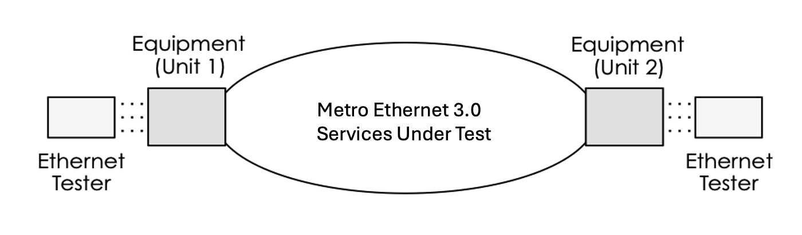

Equipment is set up on the test bed with two units connected across network. A tester is attached to each unit and sends and receives frames across the services submitted for testing. Sometime tester may be attached via a switch also.

## MEF 3.0 Test Status & Results

### Test Status

The Test Cases defined in the *MEF 3.0 Test Plans* are MANDATORY or CONDITIONAL MANDATORY:

- A MANDATORY status means that a test case MUST be executed because it verifies an absolute requirement.

- A CONDITIONAL MANDATORY status means that a test case MAY or MAY NOT be executed because it verifies an absolute requirement dependent on an optional feature. If the optional feature is declared ‘supported’, the test case must be executed. If the optional feature is declared ‘not supported’, the test case is not executed.

### Test Results

Test results can be assessed as ‘PASS’, ‘Not Applicable’ (N/A) or ‘Not Submitted for Testing’ (N/S).

E-LINE

### EVPN-VPWS EPL SERVICE:

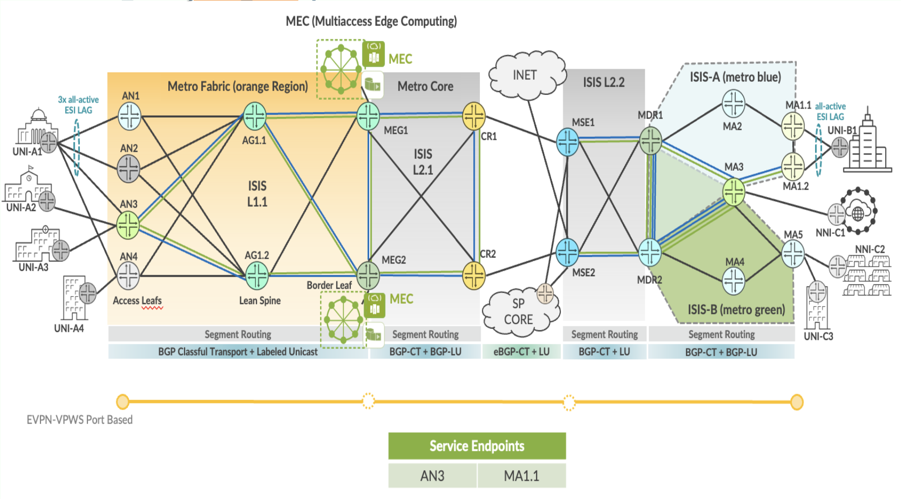

EVPN-VPWS Port Based Service implementation in EBS topology.

| EPL Service | Service Attributes Test Results |
|-------------|---------------------------------|

<table>
<colgroup>
<col style="width: 8%" />
<col style="width: 9%" />
<col style="width: 65%" />
<col style="width: 9%" />
<col style="width: 7%" />
</colgroup>
<thead>
<tr>
<th colspan="5" style="text-align: center;">Non Looping Frame Delivery</th>
</tr>
</thead>
<tbody>
<tr>
<td style="text-align: center;">MEF 3.0 Test Plan</td>
<td style="text-align: center;">Test Case Number</td>
<td>Test Case Name</td>
<td style="text-align: center;">Test Result</td>
<td style="text-align: center;">Comments</td>
</tr>
<tr>
<td rowspan="3" style="text-align: center;">Part 1</td>
<td style="text-align: center;">1.1.1</td>
<td>Non-looping frame delivery, broadcast frames</td>
<td style="text-align: center;">PASS</td>
<td style="text-align: center;">-</td>
</tr>
<tr>
<td style="text-align: center;">1.1.2</td>
<td>Non-looping frame delivery, multicast frames</td>
<td style="text-align: center;">PASS</td>
<td style="text-align: center;">-</td>
</tr>
<tr>
<td style="text-align: center;">1.1.3</td>
<td>Non-looping frame delivery, unknown unicast frames</td>
<td style="text-align: center;">PASS</td>
<td style="text-align: center;">-</td>
</tr>
</tbody>
</table>

<table>
<colgroup>
<col style="width: 8%" />
<col style="width: 9%" />
<col style="width: 65%" />
<col style="width: 9%" />
<col style="width: 7%" />
</colgroup>
<thead>
<tr>
<th colspan="5" style="text-align: center;">CE-VLAN ID and CE-VLAN CoS Preservation YES</th>
</tr>
</thead>
<tbody>
<tr>
<td style="text-align: center;">MEF 3.0 Test Plan</td>
<td style="text-align: center;">Test Case Number</td>
<td>Test Case Name</td>
<td style="text-align: center;">Test Result</td>
<td style="text-align: center;">Comments</td>
</tr>
<tr>
<td rowspan="7" style="text-align: center;">Part 1</td>
<td style="text-align: center;">10.1.1</td>
<td>CE-VLAN ID preservation, untagged frames</td>
<td style="text-align: center;">PASS</td>
<td style="text-align: center;">-</td>
</tr>
<tr>
<td style="text-align: center;">11.1.1</td>
<td>CE-VLAN ID preservation, tagged frames</td>
<td style="text-align: center;">PASS</td>
<td style="text-align: center;">-</td>
</tr>
<tr>
<td style="text-align: center;">11.1.2</td>
<td>CE-VLAN ID preservation, priority tagged frames</td>
<td style="text-align: center;">PASS</td>
<td style="text-align: center;">-</td>
</tr>
<tr>
<td style="text-align: center;">12.1.1</td>
<td>CE-VLAN CoS preservation, tagged frames</td>
<td style="text-align: center;">PASS</td>
<td style="text-align: center;">-</td>
</tr>
<tr>
<td style="text-align: center;">12.1.2</td>
<td>CE-VLAN CoS preservation, priority tagged frames</td>
<td style="text-align: center;">PASS</td>
<td style="text-align: center;">-</td>
</tr>
<tr>
<td style="text-align: center;">13.1.1</td>
<td>CE-VLAN DEI preservation, tagged frames</td>
<td style="text-align: center;">PASS</td>
<td style="text-align: center;">-</td>
</tr>
<tr>
<td style="text-align: center;">13.1.2</td>
<td>CE-VLAN DEI preservation, priority tagged frames</td>
<td style="text-align: center;">PASS</td>
<td style="text-align: center;">-</td>
</tr>
</tbody>
</table>

<table>
<colgroup>
<col style="width: 8%" />
<col style="width: 9%" />
<col style="width: 65%" />
<col style="width: 9%" />
<col style="width: 7%" />
</colgroup>
<thead>
<tr>
<th colspan="5" style="text-align: center;">UNI Physical Layer and MAC Layer</th>
</tr>
</thead>
<tbody>
<tr>
<td style="text-align: center;">MEF 3.0 Test Plan</td>
<td style="text-align: center;">Test Case Number</td>
<td>Test Case Name</td>
<td style="text-align: center;">Test Result</td>
<td style="text-align: center;">Comments</td>
</tr>
<tr>
<td style="text-align: center;">Part 1</td>
<td style="text-align: center;">15.1.1</td>
<td>UNI physical layer, mode and speed</td>
<td style="text-align: center;">PASS</td>
<td style="text-align: center;">-</td>
</tr>
</tbody>
</table>

<table style="width:100%;">
<colgroup>
<col style="width: 9%" />
<col style="width: 9%" />
<col style="width: 63%" />
<col style="width: 9%" />
<col style="width: 7%" />
</colgroup>
<thead>
<tr>
<th colspan="5" style="text-align: center;">EVC Maximum Transmission Unit Size</th>
</tr>
</thead>
<tbody>
<tr>
<td style="text-align: center;">MEF 3.0 Test Plan</td>
<td style="text-align: center;">Test Case Number</td>
<td>Test Case Name</td>
<td style="text-align: center;">Test Result</td>
<td style="text-align: center;">Comments</td>
</tr>
<tr>
<td rowspan="2" style="text-align: center;">Part 1</td>
<td style="text-align: center;">16.1.1</td>
<td>EVC Maximum Service Frame Size - Untagged</td>
<td style="text-align: center;">PASS</td>
<td style="text-align: center;"><strong>-</strong></td>
</tr>
<tr>
<td style="text-align: center;">16.1.2</td>
<td>EVC Maximum Service Frame Size - Tagged</td>
<td style="text-align: center;">PASS</td>
<td style="text-align: center;"><strong>-</strong></td>
</tr>
</tbody>
</table>

<table>
<colgroup>
<col style="width: 9%" />
<col style="width: 7%" />
<col style="width: 65%" />
<col style="width: 9%" />
<col style="width: 8%" />
</colgroup>
<thead>
<tr>
<th colspan="5" style="text-align: center;">Service OAM</th>
</tr>
</thead>
<tbody>
<tr>
<td style="text-align: center;">MEF 3.0 Test Plan</td>
<td style="text-align: center;">Test Case Number</td>
<td>Test Case Name</td>
<td style="text-align: center;">Test Result</td>
<td style="text-align: center;">Comments</td>
</tr>
<tr>
<td rowspan="6" style="text-align: center;">Part 1</td>
<td style="text-align: center;">1.1.2</td>
<td>Continuity Check Message Transparency - Untagged CCM Service Frame</td>
<td style="text-align: center;">PASS</td>
<td style="text-align: center;">-</td>
</tr>
<tr>
<td style="text-align: center;">2.1.2</td>
<td>Multicast Loopback Message Transparency - Untagged LBM Service Frame</td>
<td style="text-align: center;">PASS</td>
<td style="text-align: center;">-</td>
</tr>
<tr>
<td style="text-align: center;">3.1.2</td>
<td>Unicast Loopback Message Transparency - Untagged LBM Service Frame</td>
<td style="text-align: center;">PASS</td>
<td style="text-align: center;">-</td>
</tr>
<tr>
<td style="text-align: center;">4.1.2</td>
<td>Loopback Response Transparency - Untagged LBR Service Frame</td>
<td style="text-align: center;">PASS</td>
<td style="text-align: center;">-</td>
</tr>
<tr>
<td style="text-align: center;">5.1.2</td>
<td>Linktrace Message Transparency - Untagged LTM Service Frame</td>
<td style="text-align: center;">PASS</td>
<td style="text-align: center;">-</td>
</tr>
<tr>
<td style="text-align: center;">6.1.2</td>
<td>Linktrace Response Transparency - Untagged LTR Service Frame</td>
<td style="text-align: center;">PASS</td>
<td style="text-align: center;">-</td>
</tr>
</tbody>
</table>

<table style="width:100%;">
<colgroup>
<col style="width: 9%" />
<col style="width: 9%" />
<col style="width: 63%" />
<col style="width: 9%" />
<col style="width: 7%" />
</colgroup>
<thead>
<tr>
<th colspan="5" style="text-align: center;">CE-VLAN IDs per EVC EPs</th>
</tr>
</thead>
<tbody>
<tr>
<td style="text-align: center;">MEF 3.0 Test Plan</td>
<td style="text-align: center;">Test Case Number</td>
<td>Test Case Name</td>
<td style="text-align: center;">Test Result</td>
<td style="text-align: center;">Comments</td>
</tr>
<tr>
<td style="text-align: center;">Part 1</td>
<td style="text-align: center;">23.1.1</td>
<td>Maximum Number of CE-VLAN IDs per EVC EPs - All to One Bundling Enabled</td>
<td style="text-align: center;">PASS</td>
<td style="text-align: center;">-</td>
</tr>
</tbody>
</table>

<table>
<colgroup>
<col style="width: 9%" />
<col style="width: 9%" />
<col style="width: 63%" />
<col style="width: 9%" />
<col style="width: 7%" />
</colgroup>
<thead>
<tr>
<th colspan="5" style="text-align: center;">Service Frame Transparency</th>
</tr>
</thead>
<tbody>
<tr>
<td style="text-align: center;">MEF 3.0 Test Plan</td>
<td style="text-align: center;">Test Case Number</td>
<td>Test Case Name</td>
<td style="text-align: center;">Test Result</td>
<td style="text-align: center;">Comments</td>
</tr>
<tr>
<td rowspan="3" style="text-align: center;">Part 1</td>
<td style="text-align: center;">6.1.1</td>
<td>Service Frame Transparency - Tag Exception 1, Untagged to Tagged</td>
<td style="text-align: center;">PASS</td>
<td style="text-align: center;">-</td>
</tr>
<tr>
<td style="text-align: center;">8.1.1</td>
<td>Service Frame Transparency - Tag Exception 2, Tagged to Untagged</td>
<td style="text-align: center;">PASS</td>
<td style="text-align: center;">-</td>
</tr>
<tr>
<td style="text-align: center;">9.1.1</td>
<td>Service Frame Transparency - Tag Exception 2, Priority Tagged to Untagged</td>
<td style="text-align: center;">PASS</td>
<td style="text-align: center;">-</td>
</tr>
</tbody>
</table>

<table>
<colgroup>
<col style="width: 9%" />
<col style="width: 8%" />
<col style="width: 65%" />
<col style="width: 9%" />
<col style="width: 7%" />
</colgroup>
<thead>
<tr>
<th colspan="5" style="text-align: center;">L2CP Service Frames</th>
</tr>
</thead>
<tbody>
<tr>
<td style="text-align: center;">MEF 3.0 Test Plan</td>
<td style="text-align: center;">Test Case Number</td>
<td>Test Case Name</td>
<td style="text-align: center;">Test Result</td>
<td style="text-align: center;">Comments</td>
</tr>
<tr>
<td rowspan="20" style="text-align: center;">Part 1</td>
<td rowspan="15" style="text-align: center;">E_L_F_1</td>
<td>L2CP Service Frames Must Not Tunnel - 01:80:C2:00:00:01, 0x8808</td>
<td style="text-align: center;">PASS</td>
<td style="text-align: center;">-</td>
</tr>
<tr>
<td>L2CP Service Frames Must Not Tunnel - 01:80:C2:00:00:02, 0x8809/01/02</td>
<td style="text-align: center;">PASS</td>
<td style="text-align: center;">-</td>
</tr>
<tr>
<td>L2CP Service Frames Must Not Tunnel - 01:80:C2:00:00:02, 0x8809/03</td>
<td style="text-align: center;">PASS</td>
<td style="text-align: center;">-</td>
</tr>
<tr>
<td>L2CP Service Frames Must Not Tunnel - 01:80:C2:00:00:02, 0x8809/0A</td>
<td style="text-align: center;">PASS</td>
<td style="text-align: center;">-</td>
</tr>
<tr>
<td>L2CP Service Frames Must Not Tunnel - 01:80:C2:00:00:03, 0x888E</td>
<td style="text-align: center;">PASS</td>
<td style="text-align: center;">-</td>
</tr>
<tr>
<td>L2CP Service Frames Must Not Tunnel - 01:80:C2:00:00:04</td>
<td style="text-align: center;">PASS</td>
<td style="text-align: center;">-</td>
</tr>
<tr>
<td>L2CP Service Frames Must Not Tunnel - 01:80:C2:00:00:05</td>
<td style="text-align: center;">PASS</td>
<td style="text-align: center;">-</td>
</tr>
<tr>
<td>L2CP Service Frames Must Not Tunnel - 01:80:C2:00:00:06</td>
<td style="text-align: center;">PASS</td>
<td style="text-align: center;">-</td>
</tr>
<tr>
<td>L2CP Service Frames Must Not Tunnel - 01:80:C2:00:00:07, 0x88EE</td>
<td style="text-align: center;">PASS</td>
<td style="text-align: center;">-</td>
</tr>
<tr>
<td>L2CP Service Frames Must Not Tunnel - 01:80:C2:00:00:08</td>
<td style="text-align: center;">PASS</td>
<td style="text-align: center;">-</td>
</tr>
<tr>
<td>L2CP Service Frames Must Not Tunnel - 01:80:C2:00:00:09</td>
<td style="text-align: center;">PASS</td>
<td style="text-align: center;">-</td>
</tr>
<tr>
<td>L2CP Service Frames Must Not Tunnel - 01:80:C2:00:00:0A</td>
<td style="text-align: center;">PASS</td>
<td style="text-align: center;">-</td>
</tr>
<tr>
<td>L2CP Service Frames Must Not Tunnel - 01:80:C2:00:00:0E, 0x88CC</td>
<td style="text-align: center;">PASS</td>
<td style="text-align: center;">-</td>
</tr>
<tr>
<td>L2CP Service Frames Must Not Tunnel - 01:80:C2:00:00:0E, 0x88F7</td>
<td style="text-align: center;">PASS</td>
<td style="text-align: center;">-</td>
</tr>
<tr>
<td>L2CP Service Frames Must Tunnel - 01:80:C2:00:00:20 through 01:80:C2:00:00:2F</td>
<td style="text-align: center;">PASS</td>
<td style="text-align: center;">-</td>
</tr>
<tr>
<td rowspan="5" style="text-align: center;">E_L_P_1</td>
<td>L2CP Service Frames Must Tunnel - 01:80:C2:00:00:00</td>
<td style="text-align: center;">PASS</td>
<td style="text-align: center;">-</td>
</tr>
<tr>
<td>L2CP Service Frames Must Tunnel - 01:80:C2:00:00:0B</td>
<td style="text-align: center;">PASS</td>
<td style="text-align: center;">-</td>
</tr>
<tr>
<td>L2CP Service Frames Must Tunnel - 01:80:C2:00:00:0C</td>
<td style="text-align: center;">PASS</td>
<td style="text-align: center;">-</td>
</tr>
<tr>
<td>L2CP Service Frames Must Tunnel - 01:80:C2:00:00:0D</td>
<td style="text-align: center;">PASS</td>
<td style="text-align: center;">-</td>
</tr>
<tr>
<td>L2CP Service Frames Must Tunnel - 01:80:C2:00:00:0F</td>
<td style="text-align: center;">PASS</td>
<td style="text-align: center;">-</td>
</tr>
</tbody>
</table>

| EPL SERVICE | Performance Results |
|-------------|---------------------|

<table>
<colgroup>
<col style="width: 9%" />
<col style="width: 9%" />
<col style="width: 10%" />
<col style="width: 10%" />
<col style="width: 10%" />
<col style="width: 8%" />
<col style="width: 7%" />
<col style="width: 13%" />
<col style="width: 10%" />
<col style="width: 10%" />
</colgroup>
<thead>
<tr>
<th colspan="10" style="text-align: center;">One-Way Frame Delay Performance – Performance Tier 1</th>
</tr>
</thead>
<tbody>
<tr>
<td style="text-align: center;">MEF 3.0 Test Plan</td>
<td style="text-align: center;">Test Case Number</td>
<td colspan="6">Test Case Name and Bandwidth Profile Parameters</td>
<td style="text-align: center;">Test Result</td>
<td style="text-align: center;">Comments</td>
</tr>
<tr>
<td rowspan="4" style="text-align: center;">Part 2</td>
<td rowspan="4" style="text-align: center;">1.1.1</td>
<td colspan="6">One-Way Frame Delay Performance with CIR = 3500 Mbps</td>
<td rowspan="4" style="text-align: center;">PASS</td>
<td rowspan="4" style="text-align: center;">-</td>
</tr>
<tr>
<td style="text-align: center;">CIR</td>
<td style="text-align: center;">CBS</td>
<td style="text-align: center;">EIR</td>
<td style="text-align: center;">EBS</td>
<td style="text-align: center;">CM</td>
<td style="text-align: center;">Class of Service</td>
</tr>
<tr>
<td style="text-align: center;">3500 Mbps</td>
<td style="text-align: center;">35000 Bytes</td>
<td style="text-align: center;">0 Mbps</td>
<td style="text-align: center;">0 Bytes</td>
<td style="text-align: center;">Color-Blind</td>
<td style="text-align: center;">High</td>
</tr>
<tr>
<td style="text-align: center;">3500 Mbps</td>
<td style="text-align: center;">35000 Bytes</td>
<td style="text-align: center;">3500 Mbps</td>
<td style="text-align: center;">35000 Bytes</td>
<td style="text-align: center;">Color-Blind</td>
<td style="text-align: center;">Medium</td>
</tr>
</tbody>
</table>

<table>
<colgroup>
<col style="width: 9%" />
<col style="width: 9%" />
<col style="width: 10%" />
<col style="width: 10%" />
<col style="width: 10%" />
<col style="width: 8%" />
<col style="width: 7%" />
<col style="width: 13%" />
<col style="width: 10%" />
<col style="width: 10%" />
</colgroup>
<thead>
<tr>
<th colspan="10" style="text-align: center;">One-Way Mean Frame Delay Performance – Performance Tier 1</th>
</tr>
</thead>
<tbody>
<tr>
<td style="text-align: center;">MEF 3.0 Test Plan</td>
<td style="text-align: center;">Test Case Number</td>
<td colspan="6">Test Case Name and Bandwidth Profile Parameters</td>
<td style="text-align: center;">Test Result</td>
<td style="text-align: center;">Comments</td>
</tr>
<tr>
<td rowspan="4" style="text-align: center;">Part 2</td>
<td rowspan="4" style="text-align: center;">2.1.1</td>
<td colspan="6">One-Way Frame Delay Performance with CIR = 3500 Mbps</td>
<td rowspan="4" style="text-align: center;">PASS</td>
<td rowspan="4" style="text-align: center;">-</td>
</tr>
<tr>
<td style="text-align: center;">CIR</td>
<td style="text-align: center;">CBS</td>
<td style="text-align: center;">EIR</td>
<td style="text-align: center;">EBS</td>
<td style="text-align: center;">CM</td>
<td style="text-align: center;">Class of Service</td>
</tr>
<tr>
<td style="text-align: center;">3500 Mbps</td>
<td style="text-align: center;">35000 Bytes</td>
<td style="text-align: center;">0 Mbps</td>
<td style="text-align: center;">0 Bytes</td>
<td style="text-align: center;">Color-Blind</td>
<td style="text-align: center;">High</td>
</tr>
<tr>
<td style="text-align: center;">3500 Mbps</td>
<td style="text-align: center;">35000 Bytes</td>
<td style="text-align: center;">3500 Mbps</td>
<td style="text-align: center;">35000 Bytes</td>
<td style="text-align: center;">Color-Blind</td>
<td style="text-align: center;">Medium</td>
</tr>
</tbody>
</table>

<table>
<colgroup>
<col style="width: 9%" />
<col style="width: 9%" />
<col style="width: 10%" />
<col style="width: 10%" />
<col style="width: 10%" />
<col style="width: 8%" />
<col style="width: 7%" />
<col style="width: 13%" />
<col style="width: 10%" />
<col style="width: 10%" />
</colgroup>
<thead>
<tr>
<th colspan="10" style="text-align: center;">One-Way Inter-Frame Delay Performance – Performance Tier 1</th>
</tr>
</thead>
<tbody>
<tr>
<td style="text-align: center;">MEF 3.0 Test Plan</td>
<td style="text-align: center;">Test Case Number</td>
<td colspan="6">Test Case Name and Bandwidth Profile Parameters</td>
<td style="text-align: center;">Test Result</td>
<td style="text-align: center;">Comments</td>
</tr>
<tr>
<td rowspan="4" style="text-align: center;">Part 2</td>
<td rowspan="4" style="text-align: center;">3.1.1</td>
<td colspan="6">One-Way Frame Delay Performance with CIR = 3500 Mbps</td>
<td rowspan="4" style="text-align: center;">PASS</td>
<td rowspan="4" style="text-align: center;">-</td>
</tr>
<tr>
<td style="text-align: center;">CIR</td>
<td style="text-align: center;">CBS</td>
<td style="text-align: center;">EIR</td>
<td style="text-align: center;">EBS</td>
<td style="text-align: center;">CM</td>
<td style="text-align: center;">Class of Service</td>
</tr>
<tr>
<td style="text-align: center;">3500 Mbps</td>
<td style="text-align: center;">35000 Bytes</td>
<td style="text-align: center;">0 Mbps</td>
<td style="text-align: center;">0 Bytes</td>
<td style="text-align: center;">Color-Blind</td>
<td style="text-align: center;">High</td>
</tr>
<tr>
<td style="text-align: center;">3500 Mbps</td>
<td style="text-align: center;">35000 Bytes</td>
<td style="text-align: center;">3500 Mbps</td>
<td style="text-align: center;">35000 Bytes</td>
<td style="text-align: center;">Color-Blind</td>
<td style="text-align: center;">Medium</td>
</tr>
</tbody>
</table>

<table>
<colgroup>
<col style="width: 9%" />
<col style="width: 9%" />
<col style="width: 10%" />
<col style="width: 10%" />
<col style="width: 10%" />
<col style="width: 8%" />
<col style="width: 7%" />
<col style="width: 13%" />
<col style="width: 10%" />
<col style="width: 10%" />
</colgroup>
<thead>
<tr>
<th colspan="10" style="text-align: center;">One-Way Frame Delay Range Performance – Performance Tier 1</th>
</tr>
</thead>
<tbody>
<tr>
<td style="text-align: center;">MEF 3.0 Test Plan</td>
<td style="text-align: center;">Test Case Number</td>
<td colspan="6">Test Case Name and Bandwidth Profile Parameters</td>
<td style="text-align: center;">Test Result</td>
<td style="text-align: center;">Comments</td>
</tr>
<tr>
<td rowspan="4" style="text-align: center;">Part 2</td>
<td rowspan="4" style="text-align: center;">4.1.1</td>
<td colspan="6">One-Way Frame Delay Performance with CIR = 3500 Mbps</td>
<td rowspan="4" style="text-align: center;">PASS</td>
<td rowspan="4" style="text-align: center;">-</td>
</tr>
<tr>
<td style="text-align: center;">CIR</td>
<td style="text-align: center;">CBS</td>
<td style="text-align: center;">EIR</td>
<td style="text-align: center;">EBS</td>
<td style="text-align: center;">CM</td>
<td style="text-align: center;">Class of Service</td>
</tr>
<tr>
<td style="text-align: center;">3500 Mbps</td>
<td style="text-align: center;">35000 Bytes</td>
<td style="text-align: center;">0 Mbps</td>
<td style="text-align: center;">0 Bytes</td>
<td style="text-align: center;">Color-Blind</td>
<td style="text-align: center;">High</td>
</tr>
<tr>
<td style="text-align: center;">3500 Mbps</td>
<td style="text-align: center;">35000 Bytes</td>
<td style="text-align: center;">3500 Mbps</td>
<td style="text-align: center;">35000 Bytes</td>
<td style="text-align: center;">Color-Blind</td>
<td style="text-align: center;">Medium</td>
</tr>
</tbody>
</table>

<table>
<colgroup>
<col style="width: 9%" />
<col style="width: 9%" />
<col style="width: 10%" />
<col style="width: 10%" />
<col style="width: 10%" />
<col style="width: 8%" />
<col style="width: 7%" />
<col style="width: 13%" />
<col style="width: 10%" />
<col style="width: 10%" />
</colgroup>
<thead>
<tr>
<th colspan="10" style="text-align: center;">One-Way Frame Loss Performance – Performance Tier 1</th>
</tr>
</thead>
<tbody>
<tr>
<td style="text-align: center;">MEF 3.0 Test Plan</td>
<td style="text-align: center;">Test Case Number</td>
<td colspan="6">Test Case Name and Bandwidth Profile Parameters</td>
<td style="text-align: center;">Test Result</td>
<td style="text-align: center;">Comments</td>
</tr>
<tr>
<td rowspan="4" style="text-align: center;">Part 2</td>
<td rowspan="4" style="text-align: center;">5.1.1</td>
<td colspan="6">One-Way Frame Delay Performance with CIR = 3500 Mbps</td>
<td rowspan="4" style="text-align: center;">PASS</td>
<td rowspan="4" style="text-align: center;">-</td>
</tr>
<tr>
<td style="text-align: center;">CIR</td>
<td style="text-align: center;">CBS</td>
<td style="text-align: center;">EIR</td>
<td style="text-align: center;">EBS</td>
<td style="text-align: center;">CM</td>
<td style="text-align: center;">Class of Service</td>
</tr>
<tr>
<td style="text-align: center;">3500 Mbps</td>
<td style="text-align: center;">35000 Bytes</td>
<td style="text-align: center;">0 Mbps</td>
<td style="text-align: center;">0 Bytes</td>
<td style="text-align: center;">Color-Blind</td>
<td style="text-align: center;">High</td>
</tr>
<tr>
<td style="text-align: center;">3500 Mbps</td>
<td style="text-align: center;">35000 Bytes</td>
<td style="text-align: center;">3500 Mbps</td>
<td style="text-align: center;">35000 Bytes</td>
<td style="text-align: center;">Color-Blind</td>
<td style="text-align: center;">Medium</td>
</tr>
</tbody>
</table>

| EPL SERVICE | Traffic Management Test Results |
|-------------|---------------------------------|

<table>
<colgroup>
<col style="width: 8%" />
<col style="width: 8%" />
<col style="width: 9%" />
<col style="width: 9%" />
<col style="width: 9%" />
<col style="width: 7%" />
<col style="width: 6%" />
<col style="width: 11%" />
<col style="width: 10%" />
<col style="width: 9%" />
<col style="width: 10%" />
</colgroup>
<thead>
<tr>
<th colspan="11" style="text-align: center;">Ingress Bandwidth Profile - CIR Enforcement</th>
</tr>
</thead>
<tbody>
<tr>
<td style="text-align: center;">MEF 3.0 Test Plan</td>
<td style="text-align: center;">Test Case Number</td>
<td colspan="7">Test Case Name and Bandwidth Profile Parameters</td>
<td style="text-align: center;">Test Result</td>
<td style="text-align: center;">Comments</td>
</tr>
<tr>
<td rowspan="3" style="text-align: center;">Part 2</td>
<td rowspan="3" style="text-align: center;">1.1.6</td>
<td colspan="7">CBS Enforcement Tagged Frames when [CIR/CBS&gt;0 and EIR/EBS=0] and CoS ID per EVC &amp; PCP</td>
<td rowspan="3" style="text-align: center;">PASS</td>
<td rowspan="3" style="text-align: center;">-</td>
</tr>
<tr>
<td style="text-align: center;">CIR</td>
<td style="text-align: center;">CBS</td>
<td style="text-align: center;">EIR</td>
<td style="text-align: center;">EBS</td>
<td style="text-align: center;">CM</td>
<td style="text-align: center;">Class of Service</td>
<td style="text-align: center;">Test Frame sizes</td>
</tr>
<tr>
<td style="text-align: center;">3500 Mbps</td>
<td style="text-align: center;">35000 Bytes</td>
<td style="text-align: center;">0 Mbps</td>
<td style="text-align: center;">0 Bytes</td>
<td style="text-align: center;">Color-Blind</td>
<td style="text-align: center;">High</td>
<td style="text-align: center;">80,600,1500</td>
</tr>
</tbody>
</table>

<table>
<colgroup>
<col style="width: 8%" />
<col style="width: 8%" />
<col style="width: 9%" />
<col style="width: 9%" />
<col style="width: 9%" />
<col style="width: 7%" />
<col style="width: 6%" />
<col style="width: 11%" />
<col style="width: 10%" />
<col style="width: 9%" />
<col style="width: 10%" />
</colgroup>
<thead>
<tr>
<th colspan="11" style="text-align: center;">Ingress Bandwidth Profile - CBS Enforcement</th>
</tr>
</thead>
<tbody>
<tr>
<td style="text-align: center;">MEF 3.0 Test Plan</td>
<td style="text-align: center;">Test Case Number</td>
<td colspan="7">Test Case Name and Bandwidth Profile Parameters</td>
<td style="text-align: center;">Test Result</td>
<td style="text-align: center;">Comments</td>
</tr>
<tr>
<td rowspan="3" style="text-align: center;">Part 2</td>
<td rowspan="3" style="text-align: center;">2.1.6</td>
<td colspan="7">CBS Enforcement Tagged Frames when [CIR/CBS&gt;0 and EIR/EBS=0] and CoS ID per EVC &amp; PCP</td>
<td rowspan="3" style="text-align: center;">PASS</td>
<td rowspan="3" style="text-align: center;">-</td>
</tr>
<tr>
<td style="text-align: center;">CIR</td>
<td style="text-align: center;">CBS</td>
<td style="text-align: center;">EIR</td>
<td style="text-align: center;">EBS</td>
<td style="text-align: center;">CM</td>
<td style="text-align: center;">Class of Service</td>
<td style="text-align: center;">Test Frame sizes</td>
</tr>
<tr>
<td style="text-align: center;">3500 Mbps</td>
<td style="text-align: center;">35000 Bytes</td>
<td style="text-align: center;">0 Mbps</td>
<td style="text-align: center;">0 Bytes</td>
<td style="text-align: center;">Color-Blind</td>
<td style="text-align: center;">High</td>
<td style="text-align: center;">80,600,1500</td>
</tr>
</tbody>
</table>

<table>
<colgroup>
<col style="width: 8%" />
<col style="width: 8%" />
<col style="width: 9%" />
<col style="width: 9%" />
<col style="width: 9%" />
<col style="width: 7%" />
<col style="width: 6%" />
<col style="width: 11%" />
<col style="width: 10%" />
<col style="width: 9%" />
<col style="width: 10%" />
</colgroup>
<thead>
<tr>
<th colspan="11" style="text-align: center;">Ingress Bandwidth Profile - EIR Enforcement</th>
</tr>
</thead>
<tbody>
<tr>
<td style="text-align: center;">MEF 3.0 Test Plan</td>
<td style="text-align: center;">Test Case Number</td>
<td colspan="7">Test Case Name and Bandwidth Profile Parameters</td>
<td style="text-align: center;">Test Result</td>
<td style="text-align: center;">Comments</td>
</tr>
<tr>
<td rowspan="6" style="text-align: center;">Part 2</td>
<td rowspan="3" style="text-align: center;">3.1.6</td>
<td colspan="7">EIR Enforcement Tagged Frames when [CIR/CBS=0 and EIR/EBS&gt;0] and CoS ID per EVC &amp; PCP</td>
<td rowspan="3" style="text-align: center;">PASS</td>
<td rowspan="3" style="text-align: center;">-</td>
</tr>
<tr>
<td style="text-align: center;">CIR</td>
<td style="text-align: center;">CBS</td>
<td style="text-align: center;">EIR</td>
<td style="text-align: center;">EBS</td>
<td style="text-align: center;">CM</td>
<td style="text-align: center;">Class of Service</td>
<td style="text-align: center;">Test Frame sizes</td>
</tr>
<tr>
<td style="text-align: center;">0 Mbps</td>
<td style="text-align: center;">0 Bytes</td>
<td style="text-align: center;">3500 Mbps</td>
<td style="text-align: center;">35000 Bytes</td>
<td style="text-align: center;">Color-Blind</td>
<td style="text-align: center;">Low</td>
<td style="text-align: center;">80,600,1500</td>
</tr>
<tr>
<td rowspan="3" style="text-align: center;">3.1.8</td>
<td colspan="7">EIR Enforcement UnTagged Frames when [CIR/CBS=0 and EIR/EBS&gt;0] and CoS ID per EVC &amp; PCP</td>
<td rowspan="3" style="text-align: center;">PASS</td>
<td rowspan="3" style="text-align: center;">-</td>
</tr>
<tr>
<td style="text-align: center;">CIR</td>
<td style="text-align: center;">CBS</td>
<td style="text-align: center;">EIR</td>
<td style="text-align: center;">EBS</td>
<td style="text-align: center;">CM</td>
<td style="text-align: center;">Class of Service</td>
<td style="text-align: center;">Test Frame sizes</td>
</tr>
<tr>
<td style="text-align: center;">0 Mbps</td>
<td style="text-align: center;">0 Bytes</td>
<td style="text-align: center;">3500 Mbps</td>
<td style="text-align: center;">35000 Bytes</td>
<td style="text-align: center;">Color-Blind</td>
<td style="text-align: center;">Low</td>
<td style="text-align: center;">80,600,1500</td>
</tr>
</tbody>
</table>

<table>
<colgroup>
<col style="width: 8%" />
<col style="width: 8%" />
<col style="width: 9%" />
<col style="width: 9%" />
<col style="width: 9%" />
<col style="width: 7%" />
<col style="width: 6%" />
<col style="width: 11%" />
<col style="width: 10%" />
<col style="width: 9%" />
<col style="width: 10%" />
</colgroup>
<thead>
<tr>
<th colspan="11" style="text-align: center;">Ingress Bandwidth Profile - EBS Enforcement</th>
</tr>
</thead>
<tbody>
<tr>
<td style="text-align: center;">MEF 3.0 Test Plan</td>
<td style="text-align: center;">Test Case Number</td>
<td colspan="7">Test Case Name and Bandwidth Profile Parameters</td>
<td style="text-align: center;">Test Result</td>
<td style="text-align: center;">Comments</td>
</tr>
<tr>
<td rowspan="3" style="text-align: center;">Part 2</td>
<td rowspan="3" style="text-align: center;">4.1.6</td>
<td colspan="7">EBS Enforcement Tagged Frames when [CIR/CBS=0 and EIR/EBS&gt;0] and CoS ID per EVC &amp; PCP</td>
<td rowspan="3" style="text-align: center;">PASS</td>
<td rowspan="3" style="text-align: center;">-</td>
</tr>
<tr>
<td style="text-align: center;">CIR</td>
<td style="text-align: center;">CBS</td>
<td style="text-align: center;">EIR</td>
<td style="text-align: center;">EBS</td>
<td style="text-align: center;">CM</td>
<td style="text-align: center;">Class of Service</td>
<td style="text-align: center;">Test Frame sizes</td>
</tr>
<tr>
<td style="text-align: center;">3500 Mbps</td>
<td style="text-align: center;">35000 Bytes</td>
<td style="text-align: center;">0 Mbps</td>
<td style="text-align: center;">0 Bytes</td>
<td style="text-align: center;">Color-Blind</td>
<td style="text-align: center;">Low</td>
<td style="text-align: center;">80,600,1500</td>
</tr>
<tr>
<td rowspan="3" style="text-align: center;">Part 2</td>
<td rowspan="3" style="text-align: center;">4.1.8</td>
<td colspan="7">EBS Enforcement UnTagged Frames when [CIR/CBS=0 and EIR/EBS&gt;0] and CoS ID per EVC &amp; PCP</td>
<td rowspan="3" style="text-align: center;">PASS</td>
<td rowspan="3" style="text-align: center;">-</td>
</tr>
<tr>
<td style="text-align: center;">CIR</td>
<td style="text-align: center;">CBS</td>
<td style="text-align: center;">EIR</td>
<td style="text-align: center;">EBS</td>
<td style="text-align: center;">CM</td>
<td style="text-align: center;">Class of Service</td>
<td style="text-align: center;">Test Frame sizes</td>
</tr>
<tr>
<td style="text-align: center;">3500 Mbps</td>
<td style="text-align: center;">35000 Bytes</td>
<td style="text-align: center;">0 Mbps</td>
<td style="text-align: center;">0 Bytes</td>
<td style="text-align: center;">Color-Blind</td>
<td style="text-align: center;">Low</td>
<td style="text-align: center;">80,600,1500</td>
</tr>
</tbody>
</table>

<table>
<colgroup>
<col style="width: 8%" />
<col style="width: 8%" />
<col style="width: 9%" />
<col style="width: 9%" />
<col style="width: 9%" />
<col style="width: 7%" />
<col style="width: 6%" />
<col style="width: 11%" />
<col style="width: 10%" />
<col style="width: 9%" />
<col style="width: 10%" />
</colgroup>
<thead>
<tr>
<th colspan="11" style="text-align: center;">Ingress Bandwidth Profile - CIR and EIR Enforcement</th>
</tr>
</thead>
<tbody>
<tr>
<td style="text-align: center;">MEF 3.0 Test Plan</td>
<td style="text-align: center;">Test Case Number</td>
<td colspan="7">Test Case Name and Bandwidth Profile Parameters</td>
<td style="text-align: center;">Test Result</td>
<td style="text-align: center;">Comments</td>
</tr>
<tr>
<td rowspan="3" style="text-align: center;">Part 2</td>
<td rowspan="3" style="text-align: center;">5.1.6</td>
<td colspan="7">CIR and EIR Enforcement Tagged Frames when [CIR/CBS&gt;0 and EIR/EBS&gt;0] and CoS ID per EVC &amp; PCP</td>
<td rowspan="3" style="text-align: center;">PASS</td>
<td rowspan="3" style="text-align: center;">-</td>
</tr>
<tr>
<td style="text-align: center;">CIR</td>
<td style="text-align: center;">CBS</td>
<td style="text-align: center;">EIR</td>
<td style="text-align: center;">EBS</td>
<td style="text-align: center;">CM</td>
<td style="text-align: center;">Class of Service</td>
<td style="text-align: center;">Test Frame sizes</td>
</tr>
<tr>
<td style="text-align: center;">3500 Mbps</td>
<td style="text-align: center;">35000 Bytes</td>
<td style="text-align: center;">3500 Mbps</td>
<td style="text-align: center;">35000 Bytes</td>
<td style="text-align: center;">Color-Blind</td>
<td style="text-align: center;">Medium</td>
<td style="text-align: center;">80,600,1500</td>
</tr>
</tbody>
</table>

<table>
<colgroup>
<col style="width: 8%" />
<col style="width: 8%" />
<col style="width: 9%" />
<col style="width: 9%" />
<col style="width: 9%" />
<col style="width: 7%" />
<col style="width: 6%" />
<col style="width: 11%" />
<col style="width: 10%" />
<col style="width: 9%" />
<col style="width: 10%" />
</colgroup>
<thead>
<tr>
<th colspan="11" style="text-align: center;">Ingress Bandwidth Profile - CBS and EBS Enforcement</th>
</tr>
</thead>
<tbody>
<tr>
<td style="text-align: center;">MEF 3.0 Test Plan</td>
<td style="text-align: center;">Test Case Number</td>
<td colspan="7">Test Case Name and Bandwidth Profile Parameters</td>
<td style="text-align: center;">Test Result</td>
<td style="text-align: center;">Comments</td>
</tr>
<tr>
<td rowspan="3" style="text-align: center;">Part 2</td>
<td rowspan="3" style="text-align: center;">6.1.6</td>
<td colspan="7">CBS and EBS Enforcement Tagged Frames when [CIR/CBS&gt;0 and EIR/EBS&gt;0] and CoS ID per EVC &amp; PCP</td>
<td rowspan="3" style="text-align: center;">PASS</td>
<td rowspan="3" style="text-align: center;">-</td>
</tr>
<tr>
<td style="text-align: center;">CIR</td>
<td style="text-align: center;">CBS</td>
<td style="text-align: center;">EIR</td>
<td style="text-align: center;">EBS</td>
<td style="text-align: center;">CM</td>
<td style="text-align: center;">Class of Service</td>
<td style="text-align: center;">Test Frame sizes</td>
</tr>
<tr>
<td style="text-align: center;">3500 Mbps</td>
<td style="text-align: center;">35000 Bytes</td>
<td style="text-align: center;">3500 Mbps</td>
<td style="text-align: center;">35000 Bytes</td>
<td style="text-align: center;">Color-Blind</td>
<td style="text-align: center;">Medium</td>
<td style="text-align: center;">80,600,1500</td>
</tr>
</tbody>
</table>

<table>
<colgroup>
<col style="width: 8%" />
<col style="width: 8%" />
<col style="width: 9%" />
<col style="width: 9%" />
<col style="width: 9%" />
<col style="width: 7%" />
<col style="width: 6%" />
<col style="width: 11%" />
<col style="width: 10%" />
<col style="width: 9%" />
<col style="width: 10%" />
</colgroup>
<thead>
<tr>
<th colspan="11" style="text-align: center;">Ingress Bandwidth Profile - Unconditional Delivery of Frames</th>
</tr>
</thead>
<tbody>
<tr>
<td style="text-align: center;">MEF 3.0 Test Plan</td>
<td style="text-align: center;">Test Case Number</td>
<td colspan="7">Test Case Name and Bandwidth Profile Parameters</td>
<td style="text-align: center;">Test Result</td>
<td style="text-align: center;">Comments</td>
</tr>
<tr>
<td rowspan="12" style="text-align: center;">Part 2</td>
<td rowspan="4" style="text-align: center;">7.1.1</td>
<td colspan="7">Unconditional Delivery of Broadcast Frames and CoS ID per EVC &amp; PCP</td>
<td rowspan="4" style="text-align: center;">PASS</td>
<td rowspan="4" style="text-align: center;">-</td>
</tr>
<tr>
<td style="text-align: center;">CIR</td>
<td style="text-align: center;">CBS</td>
<td style="text-align: center;">EIR</td>
<td style="text-align: center;">EBS</td>
<td style="text-align: center;">CM</td>
<td style="text-align: center;">Class of Service</td>
<td style="text-align: center;">Test Frame sizes</td>
</tr>
<tr>
<td style="text-align: center;">3500 Mbps</td>
<td style="text-align: center;">35000 Bytes</td>
<td style="text-align: center;">0 Mbps</td>
<td style="text-align: center;">0 Bytes</td>
<td style="text-align: center;">Color-Blind</td>
<td style="text-align: center;">High</td>
<td style="text-align: center;">80,600,1500</td>
</tr>
<tr>
<td style="text-align: center;">3500 Mbps</td>
<td style="text-align: center;">35000 Bytes</td>
<td style="text-align: center;">3500 Mbps</td>
<td style="text-align: center;">35000 Bytes</td>
<td style="text-align: center;">Color-Blind</td>
<td style="text-align: center;">Medium</td>
<td style="text-align: center;">80,600,1500</td>
</tr>
<tr>
<td rowspan="4" style="text-align: center;">7.1.2</td>
<td colspan="7">Unconditional Delivery of Mutlicast Frames and CoS ID per EVC &amp; PCP</td>
<td rowspan="4" style="text-align: center;">PASS</td>
<td rowspan="4" style="text-align: center;">-</td>
</tr>
<tr>
<td style="text-align: center;">CIR</td>
<td style="text-align: center;">CBS</td>
<td style="text-align: center;">EIR</td>
<td style="text-align: center;">EBS</td>
<td style="text-align: center;">CM</td>
<td style="text-align: center;">Class of Service</td>
<td style="text-align: center;">Test Frame sizes</td>
</tr>
<tr>
<td style="text-align: center;">3500 Mbps</td>
<td style="text-align: center;">35000 Bytes</td>
<td style="text-align: center;">0 Mbps</td>
<td style="text-align: center;">0 Bytes</td>
<td style="text-align: center;">Color-Blind</td>
<td style="text-align: center;">High</td>
<td style="text-align: center;">80,600,1500</td>
</tr>
<tr>
<td style="text-align: center;">3500 Mbps</td>
<td style="text-align: center;">35000 Bytes</td>
<td style="text-align: center;">3500 Mbps</td>
<td style="text-align: center;">35000 Bytes</td>
<td style="text-align: center;">Color-Blind</td>
<td style="text-align: center;">Medium</td>
<td style="text-align: center;">80,600,1500</td>
</tr>
<tr>
<td rowspan="4" style="text-align: center;">7.1.3</td>
<td colspan="7">Unconditional Delivery of Unicast Frames and CoS ID per EVC &amp; PCP</td>
<td rowspan="4" style="text-align: center;">PASS</td>
<td rowspan="4" style="text-align: center;">-</td>
</tr>
<tr>
<td style="text-align: center;">CIR</td>
<td style="text-align: center;">CBS</td>
<td style="text-align: center;">EIR</td>
<td style="text-align: center;">EBS</td>
<td style="text-align: center;">CM</td>
<td style="text-align: center;">Class of Service</td>
<td style="text-align: center;">Test Frame sizes</td>
</tr>
<tr>
<td style="text-align: center;">3500 Mbps</td>
<td style="text-align: center;">35000 Bytes</td>
<td style="text-align: center;">0 Mbps</td>
<td style="text-align: center;">0 Bytes</td>
<td style="text-align: center;">Color-Blind</td>
<td style="text-align: center;">High</td>
<td style="text-align: center;">80,600,1500</td>
</tr>
<tr>
<td style="text-align: center;">3500 Mbps</td>
<td style="text-align: center;">35000 Bytes</td>
<td style="text-align: center;">3500 Mbps</td>
<td style="text-align: center;">35000 Bytes</td>
<td style="text-align: center;">Color-Blind</td>
<td style="text-align: center;">Medium</td>
<td style="text-align: center;">80,600,1500</td>
</tr>
</tbody>
</table>

<table>
<colgroup>
<col style="width: 8%" />
<col style="width: 8%" />
<col style="width: 9%" />
<col style="width: 9%" />
<col style="width: 9%" />
<col style="width: 7%" />
<col style="width: 6%" />
<col style="width: 11%" />
<col style="width: 10%" />
<col style="width: 9%" />
<col style="width: 10%" />
</colgroup>
<thead>
<tr>
<th colspan="11" style="text-align: center;">Ingress Bandwidth Profile - Class of Service Discard</th>
</tr>
</thead>
<tbody>
<tr>
<td style="text-align: center;">MEF 3.0 Test Plan</td>
<td style="text-align: center;">Test Case Number</td>
<td colspan="7">Test Case Name and Bandwidth Profile Parameters</td>
<td style="text-align: center;">Test Result</td>
<td style="text-align: center;">Comments</td>
</tr>
<tr>
<td rowspan="3" style="text-align: center;">Part 2</td>
<td rowspan="3" style="text-align: center;">9.1.1</td>
<td colspan="7">CBS Enforcement Tagged Frames when [CIR/CBS&gt;0 and EIR/EBS=0] and CoS ID per EVC &amp; PCP</td>
<td rowspan="3" style="text-align: center;">PASS</td>
<td rowspan="3" style="text-align: center;">-</td>
</tr>
<tr>
<td style="text-align: center;">CIR</td>
<td style="text-align: center;">CBS</td>
<td style="text-align: center;">EIR</td>
<td style="text-align: center;">EBS</td>
<td style="text-align: center;">CM</td>
<td style="text-align: center;">Class of Service</td>
<td style="text-align: center;">Test Frame sizes</td>
</tr>
<tr>
<td style="text-align: center;">3500 Mbps</td>
<td style="text-align: center;">35000 Bytes</td>
<td style="text-align: center;">0 Mbps</td>
<td style="text-align: center;">0 Bytes</td>
<td style="text-align: center;">Color-Blind</td>
<td style="text-align: center;">High</td>
<td style="text-align: center;">80,600,1500</td>
</tr>
</tbody>
</table>

E-LINE - EPL

### L2VPN EPL SERVICE:

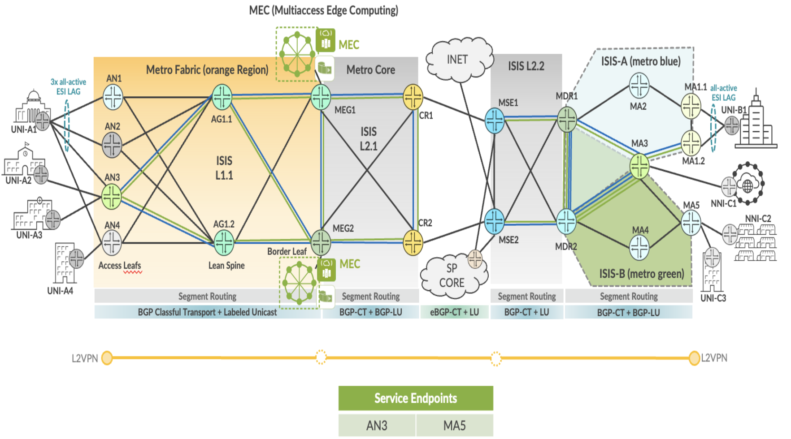

L2VPN Port Based End-to-End Service implementation in EBS topology.

| EPL Service | Service Attributes Test Results |
|-------------|---------------------------------|

<table>
<colgroup>
<col style="width: 8%" />
<col style="width: 9%" />
<col style="width: 65%" />
<col style="width: 9%" />
<col style="width: 7%" />
</colgroup>
<thead>
<tr>
<th colspan="5" style="text-align: center;">Non Looping Frame Delivery</th>
</tr>
</thead>
<tbody>
<tr>
<td style="text-align: center;">MEF 3.0 Test Plan</td>
<td style="text-align: center;">Test Case Number</td>
<td>Test Case Name</td>
<td style="text-align: center;">Test Result</td>
<td style="text-align: center;">Comments</td>
</tr>
<tr>
<td rowspan="3" style="text-align: center;">Part 1</td>
<td style="text-align: center;">1.1.1</td>
<td>Non-looping frame delivery, broadcast frames</td>
<td style="text-align: center;">PASS</td>
<td style="text-align: center;">-</td>
</tr>
<tr>
<td style="text-align: center;">1.1.2</td>
<td>Non-looping frame delivery, multicast frames</td>
<td style="text-align: center;">PASS</td>
<td style="text-align: center;">-</td>
</tr>
<tr>
<td style="text-align: center;">1.1.3</td>
<td>Non-looping frame delivery, unknown unicast frames</td>
<td style="text-align: center;">PASS</td>
<td style="text-align: center;">-</td>
</tr>
</tbody>
</table>

<table>
<colgroup>
<col style="width: 8%" />
<col style="width: 9%" />
<col style="width: 65%" />
<col style="width: 9%" />
<col style="width: 7%" />
</colgroup>
<thead>
<tr>
<th colspan="5" style="text-align: center;">CE-VLAN ID and CE-VLAN CoS Preservation YES</th>
</tr>
</thead>
<tbody>
<tr>
<td style="text-align: center;">MEF 3.0 Test Plan</td>
<td style="text-align: center;">Test Case Number</td>
<td>Test Case Name</td>
<td style="text-align: center;">Test Result</td>
<td style="text-align: center;">Comments</td>
</tr>
<tr>
<td rowspan="7" style="text-align: center;">Part 1</td>
<td style="text-align: center;">10.1.1</td>
<td>CE-VLAN ID preservation, untagged frames</td>
<td style="text-align: center;">PASS</td>
<td style="text-align: center;">-</td>
</tr>
<tr>
<td style="text-align: center;">11.1.1</td>
<td>CE-VLAN ID preservation, tagged frames</td>
<td style="text-align: center;">PASS</td>
<td style="text-align: center;">-</td>
</tr>
<tr>
<td style="text-align: center;">11.1.2</td>
<td>CE-VLAN ID preservation, priority tagged frames</td>
<td style="text-align: center;">PASS</td>
<td style="text-align: center;">-</td>
</tr>
<tr>
<td style="text-align: center;">12.1.1</td>
<td>CE-VLAN CoS preservation, tagged frames</td>
<td style="text-align: center;">PASS</td>
<td style="text-align: center;">-</td>
</tr>
<tr>
<td style="text-align: center;">12.1.2</td>
<td>CE-VLAN CoS preservation, priority tagged frames</td>
<td style="text-align: center;">PASS</td>
<td style="text-align: center;">-</td>
</tr>
<tr>
<td style="text-align: center;">13.1.1</td>
<td>CE-VLAN DEI preservation, tagged frames</td>
<td style="text-align: center;">PASS</td>
<td style="text-align: center;">-</td>
</tr>
<tr>
<td style="text-align: center;">13.1.2</td>
<td>CE-VLAN DEI preservation, priority tagged frames</td>
<td style="text-align: center;">PASS</td>
<td style="text-align: center;">-</td>
</tr>
</tbody>
</table>

<table>
<colgroup>
<col style="width: 8%" />
<col style="width: 9%" />
<col style="width: 65%" />
<col style="width: 9%" />
<col style="width: 7%" />
</colgroup>
<thead>
<tr>
<th colspan="5" style="text-align: center;">UNI Physical Layer and MAC Layer</th>
</tr>
</thead>
<tbody>
<tr>
<td style="text-align: center;">MEF 3.0 Test Plan</td>
<td style="text-align: center;">Test Case Number</td>
<td>Test Case Name</td>
<td style="text-align: center;">Test Result</td>
<td style="text-align: center;">Comments</td>
</tr>
<tr>
<td style="text-align: center;">Part 1</td>
<td style="text-align: center;">15.1.1</td>
<td>UNI physical layer, mode and speed</td>
<td style="text-align: center;">PASS</td>
<td style="text-align: center;">-</td>
</tr>
</tbody>
</table>

<table style="width:100%;">
<colgroup>
<col style="width: 9%" />
<col style="width: 9%" />
<col style="width: 63%" />
<col style="width: 9%" />
<col style="width: 7%" />
</colgroup>
<thead>
<tr>
<th colspan="5" style="text-align: center;">EVC Maximum Transmission Unit Size</th>
</tr>
</thead>
<tbody>
<tr>
<td style="text-align: center;">MEF 3.0 Test Plan</td>
<td style="text-align: center;">Test Case Number</td>
<td>Test Case Name</td>
<td style="text-align: center;">Test Result</td>
<td style="text-align: center;">Comments</td>
</tr>
<tr>
<td rowspan="2" style="text-align: center;">Part 1</td>
<td style="text-align: center;">16.1.1</td>
<td>EVC Maximum Service Frame Size - Untagged</td>
<td style="text-align: center;">PASS</td>
<td style="text-align: center;"><strong>-</strong></td>
</tr>
<tr>
<td style="text-align: center;">16.1.2</td>
<td>EVC Maximum Service Frame Size - Tagged</td>
<td style="text-align: center;">PASS</td>
<td style="text-align: center;"><strong>-</strong></td>
</tr>
</tbody>
</table>

<table>
<colgroup>
<col style="width: 9%" />
<col style="width: 7%" />
<col style="width: 65%" />
<col style="width: 9%" />
<col style="width: 8%" />
</colgroup>
<thead>
<tr>
<th colspan="5" style="text-align: center;">Service OAM</th>
</tr>
</thead>
<tbody>
<tr>
<td style="text-align: center;">MEF 3.0 Test Plan</td>
<td style="text-align: center;">Test Case Number</td>
<td>Test Case Name</td>
<td style="text-align: center;">Test Result</td>
<td style="text-align: center;">Comments</td>
</tr>
<tr>
<td rowspan="6" style="text-align: center;">Part 1</td>
<td style="text-align: center;">1.1.2</td>
<td>Continuity Check Message Transparency - Untagged CCM Service Frame</td>
<td style="text-align: center;">PASS</td>
<td style="text-align: center;">-</td>
</tr>
<tr>
<td style="text-align: center;">2.1.2</td>
<td>Multicast Loopback Message Transparency - Untagged LBM Service Frame</td>
<td style="text-align: center;">PASS</td>
<td style="text-align: center;">-</td>
</tr>
<tr>
<td style="text-align: center;">3.1.2</td>
<td>Unicast Loopback Message Transparency - Untagged LBM Service Frame</td>
<td style="text-align: center;">PASS</td>
<td style="text-align: center;">-</td>
</tr>
<tr>
<td style="text-align: center;">4.1.2</td>
<td>Loopback Response Transparency - Untagged LBR Service Frame</td>
<td style="text-align: center;">PASS</td>
<td style="text-align: center;">-</td>
</tr>
<tr>
<td style="text-align: center;">5.1.2</td>
<td>Linktrace Message Transparency - Untagged LTM Service Frame</td>
<td style="text-align: center;">PASS</td>
<td style="text-align: center;">-</td>
</tr>
<tr>
<td style="text-align: center;">6.1.2</td>
<td>Linktrace Response Transparency - Untagged LTR Service Frame</td>
<td style="text-align: center;">PASS</td>
<td style="text-align: center;">-</td>
</tr>
</tbody>
</table>

<table style="width:100%;">
<colgroup>
<col style="width: 9%" />
<col style="width: 9%" />
<col style="width: 63%" />
<col style="width: 9%" />
<col style="width: 7%" />
</colgroup>
<thead>
<tr>
<th colspan="5" style="text-align: center;">CE-VLAN IDs per EVC EPs</th>
</tr>
</thead>
<tbody>
<tr>
<td style="text-align: center;">MEF 3.0 Test Plan</td>
<td style="text-align: center;">Test Case Number</td>
<td>Test Case Name</td>
<td style="text-align: center;">Test Result</td>
<td style="text-align: center;">Comments</td>
</tr>
<tr>
<td style="text-align: center;">Part 1</td>
<td style="text-align: center;">23.1.1</td>
<td>Maximum Number of CE-VLAN IDs per EVC EPs - All to One Bundling Enabled</td>
<td style="text-align: center;">PASS</td>
<td style="text-align: center;">-</td>
</tr>
</tbody>
</table>

<table>
<colgroup>
<col style="width: 9%" />
<col style="width: 9%" />
<col style="width: 63%" />
<col style="width: 9%" />
<col style="width: 7%" />
</colgroup>
<thead>
<tr>
<th colspan="5" style="text-align: center;">Service Frame Transparency</th>
</tr>
</thead>
<tbody>
<tr>
<td style="text-align: center;">MEF 3.0 Test Plan</td>
<td style="text-align: center;">Test Case Number</td>
<td>Test Case Name</td>
<td style="text-align: center;">Test Result</td>
<td style="text-align: center;">Comments</td>
</tr>
<tr>
<td rowspan="3" style="text-align: center;">Part 1</td>
<td style="text-align: center;">6.1.1</td>
<td>Service Frame Transparency - Tag Exception 1, Untagged to Tagged</td>
<td style="text-align: center;">PASS</td>
<td style="text-align: center;">-</td>
</tr>
<tr>
<td style="text-align: center;">8.1.1</td>
<td>Service Frame Transparency - Tag Exception 2, Tagged to Untagged</td>
<td style="text-align: center;">PASS</td>
<td style="text-align: center;">-</td>
</tr>
<tr>
<td style="text-align: center;">9.1.1</td>
<td>Service Frame Transparency - Tag Exception 2, Priority Tagged to Untagged</td>
<td style="text-align: center;">PASS</td>
<td style="text-align: center;">-</td>
</tr>
</tbody>
</table>

<table>
<colgroup>
<col style="width: 9%" />
<col style="width: 8%" />
<col style="width: 65%" />
<col style="width: 9%" />
<col style="width: 7%" />
</colgroup>
<thead>
<tr>
<th colspan="5" style="text-align: center;">L2CP Service Frames</th>
</tr>
</thead>
<tbody>
<tr>
<td style="text-align: center;">MEF 3.0 Test Plan</td>
<td style="text-align: center;">Test Case Number</td>
<td>Test Case Name</td>
<td style="text-align: center;">Test Result</td>
<td style="text-align: center;">Comments</td>
</tr>
<tr>
<td rowspan="20" style="text-align: center;">Part 1</td>
<td rowspan="15" style="text-align: center;">E_L_F_1</td>
<td>L2CP Service Frames Must Not Tunnel - 01:80:C2:00:00:01, 0x8808</td>
<td style="text-align: center;">PASS</td>
<td style="text-align: center;">-</td>
</tr>
<tr>
<td>L2CP Service Frames Must Not Tunnel - 01:80:C2:00:00:02, 0x8809/01/02</td>
<td style="text-align: center;">PASS</td>
<td style="text-align: center;">-</td>
</tr>
<tr>
<td>L2CP Service Frames Must Not Tunnel - 01:80:C2:00:00:02, 0x8809/03</td>
<td style="text-align: center;">PASS</td>
<td style="text-align: center;">-</td>
</tr>
<tr>
<td>L2CP Service Frames Must Not Tunnel - 01:80:C2:00:00:02, 0x8809/0A</td>
<td style="text-align: center;">PASS</td>
<td style="text-align: center;">-</td>
</tr>
<tr>
<td>L2CP Service Frames Must Not Tunnel - 01:80:C2:00:00:03, 0x888E</td>
<td style="text-align: center;">PASS</td>
<td style="text-align: center;">-</td>
</tr>
<tr>
<td>L2CP Service Frames Must Not Tunnel - 01:80:C2:00:00:04</td>
<td style="text-align: center;">PASS</td>
<td style="text-align: center;">-</td>
</tr>
<tr>
<td>L2CP Service Frames Must Not Tunnel - 01:80:C2:00:00:05</td>
<td style="text-align: center;">PASS</td>
<td style="text-align: center;">-</td>
</tr>
<tr>
<td>L2CP Service Frames Must Not Tunnel - 01:80:C2:00:00:06</td>
<td style="text-align: center;">PASS</td>
<td style="text-align: center;">-</td>
</tr>
<tr>
<td>L2CP Service Frames Must Not Tunnel - 01:80:C2:00:00:07, 0x88EE</td>
<td style="text-align: center;">PASS</td>
<td style="text-align: center;">-</td>
</tr>
<tr>
<td>L2CP Service Frames Must Not Tunnel - 01:80:C2:00:00:08</td>
<td style="text-align: center;">PASS</td>
<td style="text-align: center;">-</td>
</tr>
<tr>
<td>L2CP Service Frames Must Not Tunnel - 01:80:C2:00:00:09</td>
<td style="text-align: center;">PASS</td>
<td style="text-align: center;">-</td>
</tr>
<tr>
<td>L2CP Service Frames Must Not Tunnel - 01:80:C2:00:00:0A</td>
<td style="text-align: center;">PASS</td>
<td style="text-align: center;">-</td>
</tr>
<tr>
<td>L2CP Service Frames Must Not Tunnel - 01:80:C2:00:00:0E, 0x88CC</td>
<td style="text-align: center;">PASS</td>
<td style="text-align: center;">-</td>
</tr>
<tr>
<td>L2CP Service Frames Must Not Tunnel - 01:80:C2:00:00:0E, 0x88F7</td>
<td style="text-align: center;">PASS</td>
<td style="text-align: center;">-</td>
</tr>
<tr>
<td>L2CP Service Frames Must Tunnel - 01:80:C2:00:00:20 through 01:80:C2:00:00:2F</td>
<td style="text-align: center;">PASS</td>
<td style="text-align: center;">-</td>
</tr>
<tr>
<td rowspan="5" style="text-align: center;">E_L_P_1</td>
<td>L2CP Service Frames Must Tunnel - 01:80:C2:00:00:00</td>
<td style="text-align: center;">PASS</td>
<td style="text-align: center;">-</td>
</tr>
<tr>
<td>L2CP Service Frames Must Tunnel - 01:80:C2:00:00:0B</td>
<td style="text-align: center;">PASS</td>
<td style="text-align: center;">-</td>
</tr>
<tr>
<td>L2CP Service Frames Must Tunnel - 01:80:C2:00:00:0C</td>
<td style="text-align: center;">PASS</td>
<td style="text-align: center;">-</td>
</tr>
<tr>
<td>L2CP Service Frames Must Tunnel - 01:80:C2:00:00:0D</td>
<td style="text-align: center;">PASS</td>
<td style="text-align: center;">-</td>
</tr>
<tr>
<td>L2CP Service Frames Must Tunnel - 01:80:C2:00:00:0F</td>
<td style="text-align: center;">PASS</td>
<td style="text-align: center;">-</td>
</tr>
</tbody>
</table>

| EPL SERVICE | Performance Results |
|-------------|---------------------|

<table>
<colgroup>
<col style="width: 9%" />
<col style="width: 9%" />
<col style="width: 10%" />
<col style="width: 10%" />
<col style="width: 10%" />
<col style="width: 8%" />
<col style="width: 7%" />
<col style="width: 13%" />
<col style="width: 10%" />
<col style="width: 10%" />
</colgroup>
<thead>
<tr>
<th colspan="10" style="text-align: center;">One-Way Frame Delay Performance – Performance Tier 1</th>
</tr>
</thead>
<tbody>
<tr>
<td style="text-align: center;">MEF 3.0 Test Plan</td>
<td style="text-align: center;">Test Case Number</td>
<td colspan="6">Test Case Name and Bandwidth Profile Parameters</td>
<td style="text-align: center;">Test Result</td>
<td style="text-align: center;">Comments</td>
</tr>
<tr>
<td rowspan="4" style="text-align: center;">Part 2</td>
<td rowspan="4" style="text-align: center;">1.1.1</td>
<td colspan="6">One-Way Frame Delay Performance with CIR = 3500 Mbps</td>
<td rowspan="4" style="text-align: center;">PASS</td>
<td rowspan="4" style="text-align: center;">-</td>
</tr>
<tr>
<td style="text-align: center;">CIR</td>
<td style="text-align: center;">CBS</td>
<td style="text-align: center;">EIR</td>
<td style="text-align: center;">EBS</td>
<td style="text-align: center;">CM</td>
<td style="text-align: center;">Class of Service</td>
</tr>
<tr>
<td style="text-align: center;">3500 Mbps</td>
<td style="text-align: center;">35000 Bytes</td>
<td style="text-align: center;">0 Mbps</td>
<td style="text-align: center;">0 Bytes</td>
<td style="text-align: center;">Color-Blind</td>
<td style="text-align: center;">High</td>
</tr>
<tr>
<td style="text-align: center;">3500 Mbps</td>
<td style="text-align: center;">35000 Bytes</td>
<td style="text-align: center;">3500 Mbps</td>
<td style="text-align: center;">35000 Bytes</td>
<td style="text-align: center;">Color-Blind</td>
<td style="text-align: center;">Medium</td>
</tr>
</tbody>
</table>

<table>
<colgroup>
<col style="width: 9%" />
<col style="width: 9%" />
<col style="width: 10%" />
<col style="width: 10%" />
<col style="width: 10%" />
<col style="width: 8%" />
<col style="width: 7%" />
<col style="width: 13%" />
<col style="width: 10%" />
<col style="width: 10%" />
</colgroup>
<thead>
<tr>
<th colspan="10" style="text-align: center;">One-Way Mean Frame Delay Performance – Performance Tier 1</th>
</tr>
</thead>
<tbody>
<tr>
<td style="text-align: center;">MEF 3.0 Test Plan</td>
<td style="text-align: center;">Test Case Number</td>
<td colspan="6">Test Case Name and Bandwidth Profile Parameters</td>
<td style="text-align: center;">Test Result</td>
<td style="text-align: center;">Comments</td>
</tr>
<tr>
<td rowspan="4" style="text-align: center;">Part 2</td>
<td rowspan="4" style="text-align: center;">2.1.1</td>
<td colspan="6">One-Way Frame Delay Performance with CIR = 3500 Mbps</td>
<td rowspan="4" style="text-align: center;">PASS</td>
<td rowspan="4" style="text-align: center;">-</td>
</tr>
<tr>
<td style="text-align: center;">CIR</td>
<td style="text-align: center;">CBS</td>
<td style="text-align: center;">EIR</td>
<td style="text-align: center;">EBS</td>
<td style="text-align: center;">CM</td>
<td style="text-align: center;">Class of Service</td>
</tr>
<tr>
<td style="text-align: center;">3500 Mbps</td>
<td style="text-align: center;">35000 Bytes</td>
<td style="text-align: center;">0 Mbps</td>
<td style="text-align: center;">0 Bytes</td>
<td style="text-align: center;">Color-Blind</td>
<td style="text-align: center;">High</td>
</tr>
<tr>
<td style="text-align: center;">3500 Mbps</td>
<td style="text-align: center;">35000 Bytes</td>
<td style="text-align: center;">3500 Mbps</td>
<td style="text-align: center;">35000 Bytes</td>
<td style="text-align: center;">Color-Blind</td>
<td style="text-align: center;">Medium</td>
</tr>
</tbody>
</table>

<table>
<colgroup>
<col style="width: 9%" />
<col style="width: 9%" />
<col style="width: 10%" />
<col style="width: 10%" />
<col style="width: 10%" />
<col style="width: 8%" />
<col style="width: 7%" />
<col style="width: 13%" />
<col style="width: 10%" />
<col style="width: 10%" />
</colgroup>
<thead>
<tr>
<th colspan="10" style="text-align: center;">One-Way Inter-Frame Delay Performance – Performance Tier 1</th>
</tr>
</thead>
<tbody>
<tr>
<td style="text-align: center;">MEF 3.0 Test Plan</td>
<td style="text-align: center;">Test Case Number</td>
<td colspan="6">Test Case Name and Bandwidth Profile Parameters</td>
<td style="text-align: center;">Test Result</td>
<td style="text-align: center;">Comments</td>
</tr>
<tr>
<td rowspan="4" style="text-align: center;">Part 2</td>
<td rowspan="4" style="text-align: center;">3.1.1</td>
<td colspan="6">One-Way Frame Delay Performance with CIR = 3500 Mbps</td>
<td rowspan="4" style="text-align: center;">PASS</td>
<td rowspan="4" style="text-align: center;">-</td>
</tr>
<tr>
<td style="text-align: center;">CIR</td>
<td style="text-align: center;">CBS</td>
<td style="text-align: center;">EIR</td>
<td style="text-align: center;">EBS</td>
<td style="text-align: center;">CM</td>
<td style="text-align: center;">Class of Service</td>
</tr>
<tr>
<td style="text-align: center;">3500 Mbps</td>
<td style="text-align: center;">35000 Bytes</td>
<td style="text-align: center;">0 Mbps</td>
<td style="text-align: center;">0 Bytes</td>
<td style="text-align: center;">Color-Blind</td>
<td style="text-align: center;">High</td>
</tr>
<tr>
<td style="text-align: center;">3500 Mbps</td>
<td style="text-align: center;">35000 Bytes</td>
<td style="text-align: center;">3500 Mbps</td>
<td style="text-align: center;">35000 Bytes</td>
<td style="text-align: center;">Color-Blind</td>
<td style="text-align: center;">Medium</td>
</tr>
</tbody>
</table>

<table>
<colgroup>
<col style="width: 9%" />
<col style="width: 9%" />
<col style="width: 10%" />
<col style="width: 10%" />
<col style="width: 10%" />
<col style="width: 8%" />
<col style="width: 7%" />
<col style="width: 13%" />
<col style="width: 10%" />
<col style="width: 10%" />
</colgroup>
<thead>
<tr>
<th colspan="10" style="text-align: center;">One-Way Frame Delay Range Performance – Performance Tier 1</th>
</tr>
</thead>
<tbody>
<tr>
<td style="text-align: center;">MEF 3.0 Test Plan</td>
<td style="text-align: center;">Test Case Number</td>
<td colspan="6">Test Case Name and Bandwidth Profile Parameters</td>
<td style="text-align: center;">Test Result</td>
<td style="text-align: center;">Comments</td>
</tr>
<tr>
<td rowspan="4" style="text-align: center;">Part 2</td>
<td rowspan="4" style="text-align: center;">4.1.1</td>
<td colspan="6">One-Way Frame Delay Performance with CIR = 3500 Mbps</td>
<td rowspan="4" style="text-align: center;">PASS</td>
<td rowspan="4" style="text-align: center;">-</td>
</tr>
<tr>
<td style="text-align: center;">CIR</td>
<td style="text-align: center;">CBS</td>
<td style="text-align: center;">EIR</td>
<td style="text-align: center;">EBS</td>
<td style="text-align: center;">CM</td>
<td style="text-align: center;">Class of Service</td>
</tr>
<tr>
<td style="text-align: center;">3500 Mbps</td>
<td style="text-align: center;">35000 Bytes</td>
<td style="text-align: center;">0 Mbps</td>
<td style="text-align: center;">0 Bytes</td>
<td style="text-align: center;">Color-Blind</td>
<td style="text-align: center;">High</td>
</tr>
<tr>
<td style="text-align: center;">3500 Mbps</td>
<td style="text-align: center;">35000 Bytes</td>
<td style="text-align: center;">3500 Mbps</td>
<td style="text-align: center;">35000 Bytes</td>
<td style="text-align: center;">Color-Blind</td>
<td style="text-align: center;">Medium</td>
</tr>
</tbody>
</table>

<table>
<colgroup>
<col style="width: 9%" />
<col style="width: 9%" />
<col style="width: 10%" />
<col style="width: 10%" />
<col style="width: 10%" />
<col style="width: 8%" />
<col style="width: 7%" />
<col style="width: 13%" />
<col style="width: 10%" />
<col style="width: 10%" />
</colgroup>
<thead>
<tr>
<th colspan="10" style="text-align: center;">One-Way Frame Loss Performance – Performance Tier 1</th>
</tr>
</thead>
<tbody>
<tr>
<td style="text-align: center;">MEF 3.0 Test Plan</td>
<td style="text-align: center;">Test Case Number</td>
<td colspan="6">Test Case Name and Bandwidth Profile Parameters</td>
<td style="text-align: center;">Test Result</td>
<td style="text-align: center;">Comments</td>
</tr>
<tr>
<td rowspan="4" style="text-align: center;">Part 2</td>
<td rowspan="4" style="text-align: center;">5.1.1</td>
<td colspan="6">One-Way Frame Delay Performance with CIR = 3500 Mbps</td>
<td rowspan="4" style="text-align: center;">PASS</td>
<td rowspan="4" style="text-align: center;">-</td>
</tr>
<tr>
<td style="text-align: center;">CIR</td>
<td style="text-align: center;">CBS</td>
<td style="text-align: center;">EIR</td>
<td style="text-align: center;">EBS</td>
<td style="text-align: center;">CM</td>
<td style="text-align: center;">Class of Service</td>
</tr>
<tr>
<td style="text-align: center;">3500 Mbps</td>
<td style="text-align: center;">35000 Bytes</td>
<td style="text-align: center;">0 Mbps</td>
<td style="text-align: center;">0 Bytes</td>
<td style="text-align: center;">Color-Blind</td>
<td style="text-align: center;">High</td>
</tr>
<tr>
<td style="text-align: center;">3500 Mbps</td>
<td style="text-align: center;">35000 Bytes</td>
<td style="text-align: center;">3500 Mbps</td>
<td style="text-align: center;">35000 Bytes</td>
<td style="text-align: center;">Color-Blind</td>
<td style="text-align: center;">Medium</td>
</tr>
</tbody>
</table>

| EPL SERVICE | Traffic Management Test Results |
|-------------|---------------------------------|

<table>
<colgroup>
<col style="width: 8%" />
<col style="width: 8%" />
<col style="width: 9%" />
<col style="width: 9%" />
<col style="width: 9%" />
<col style="width: 7%" />
<col style="width: 6%" />
<col style="width: 11%" />
<col style="width: 10%" />
<col style="width: 9%" />
<col style="width: 10%" />
</colgroup>
<thead>
<tr>
<th colspan="11" style="text-align: center;">Ingress Bandwidth Profile - CIR Enforcement</th>
</tr>
</thead>
<tbody>
<tr>
<td style="text-align: center;">MEF 3.0 Test Plan</td>
<td style="text-align: center;">Test Case Number</td>
<td colspan="7">Test Case Name and Bandwidth Profile Parameters</td>
<td style="text-align: center;">Test Result</td>
<td style="text-align: center;">Comments</td>
</tr>
<tr>
<td rowspan="3" style="text-align: center;">Part 2</td>
<td rowspan="3" style="text-align: center;">1.1.6</td>
<td colspan="7">CBS Enforcement Tagged Frames when [CIR/CBS&gt;0 and EIR/EBS=0] and CoS ID per EVC &amp; PCP</td>
<td rowspan="3" style="text-align: center;">PASS</td>
<td rowspan="3" style="text-align: center;">-</td>
</tr>
<tr>
<td style="text-align: center;">CIR</td>
<td style="text-align: center;">CBS</td>
<td style="text-align: center;">EIR</td>
<td style="text-align: center;">EBS</td>
<td style="text-align: center;">CM</td>
<td style="text-align: center;">Class of Service</td>
<td style="text-align: center;">Test Frame sizes</td>
</tr>
<tr>
<td style="text-align: center;">3500 Mbps</td>
<td style="text-align: center;">35000 Bytes</td>
<td style="text-align: center;">0 Mbps</td>
<td style="text-align: center;">0 Bytes</td>
<td style="text-align: center;">Color-Blind</td>
<td style="text-align: center;">High</td>
<td style="text-align: center;">80,600,1500</td>
</tr>
</tbody>
</table>

<table>
<colgroup>
<col style="width: 8%" />
<col style="width: 8%" />
<col style="width: 9%" />
<col style="width: 9%" />
<col style="width: 9%" />
<col style="width: 7%" />
<col style="width: 6%" />
<col style="width: 11%" />
<col style="width: 10%" />
<col style="width: 9%" />
<col style="width: 10%" />
</colgroup>
<thead>
<tr>
<th colspan="11" style="text-align: center;">Ingress Bandwidth Profile - CBS Enforcement</th>
</tr>
</thead>
<tbody>
<tr>
<td style="text-align: center;">MEF 3.0 Test Plan</td>
<td style="text-align: center;">Test Case Number</td>
<td colspan="7">Test Case Name and Bandwidth Profile Parameters</td>
<td style="text-align: center;">Test Result</td>
<td style="text-align: center;">Comments</td>
</tr>
<tr>
<td rowspan="3" style="text-align: center;">Part 2</td>
<td rowspan="3" style="text-align: center;">2.1.6</td>
<td colspan="7">CBS Enforcement Tagged Frames when [CIR/CBS&gt;0 and EIR/EBS=0] and CoS ID per EVC &amp; PCP</td>
<td rowspan="3" style="text-align: center;">PASS</td>
<td rowspan="3" style="text-align: center;">-</td>
</tr>
<tr>
<td style="text-align: center;">CIR</td>
<td style="text-align: center;">CBS</td>
<td style="text-align: center;">EIR</td>
<td style="text-align: center;">EBS</td>
<td style="text-align: center;">CM</td>
<td style="text-align: center;">Class of Service</td>
<td style="text-align: center;">Test Frame sizes</td>
</tr>
<tr>
<td style="text-align: center;">3500 Mbps</td>
<td style="text-align: center;">35000 Bytes</td>
<td style="text-align: center;">0 Mbps</td>
<td style="text-align: center;">0 Bytes</td>
<td style="text-align: center;">Color-Blind</td>
<td style="text-align: center;">High</td>
<td style="text-align: center;">80,600,1500</td>
</tr>
</tbody>
</table>

<table>
<colgroup>
<col style="width: 8%" />
<col style="width: 8%" />
<col style="width: 9%" />
<col style="width: 9%" />
<col style="width: 9%" />
<col style="width: 7%" />
<col style="width: 6%" />
<col style="width: 11%" />
<col style="width: 10%" />
<col style="width: 9%" />
<col style="width: 10%" />
</colgroup>
<thead>
<tr>
<th colspan="11" style="text-align: center;">Ingress Bandwidth Profile - EIR Enforcement</th>
</tr>
</thead>
<tbody>
<tr>
<td style="text-align: center;">MEF 3.0 Test Plan</td>
<td style="text-align: center;">Test Case Number</td>
<td colspan="7">Test Case Name and Bandwidth Profile Parameters</td>
<td style="text-align: center;">Test Result</td>
<td style="text-align: center;">Comments</td>
</tr>
<tr>
<td rowspan="6" style="text-align: center;">Part 2</td>
<td rowspan="3" style="text-align: center;">3.1.6</td>
<td colspan="7">EIR Enforcement Tagged Frames when [CIR/CBS=0 and EIR/EBS&gt;0] and CoS ID per EVC &amp; PCP</td>
<td rowspan="3" style="text-align: center;">PASS</td>
<td rowspan="3" style="text-align: center;">-</td>
</tr>
<tr>
<td style="text-align: center;">CIR</td>
<td style="text-align: center;">CBS</td>
<td style="text-align: center;">EIR</td>
<td style="text-align: center;">EBS</td>
<td style="text-align: center;">CM</td>
<td style="text-align: center;">Class of Service</td>
<td style="text-align: center;">Test Frame sizes</td>
</tr>
<tr>
<td style="text-align: center;">0 Mbps</td>
<td style="text-align: center;">0 Bytes</td>
<td style="text-align: center;">3500 Mbps</td>
<td style="text-align: center;">35000 Bytes</td>
<td style="text-align: center;">Color-Blind</td>
<td style="text-align: center;">Low</td>
<td style="text-align: center;">80,600,1500</td>
</tr>
<tr>
<td rowspan="3" style="text-align: center;">3.1.8</td>
<td colspan="7">EIR Enforcement UnTagged Frames when [CIR/CBS=0 and EIR/EBS&gt;0] and CoS ID per EVC &amp; PCP</td>
<td rowspan="3" style="text-align: center;">PASS</td>
<td rowspan="3" style="text-align: center;">-</td>
</tr>
<tr>
<td style="text-align: center;">CIR</td>
<td style="text-align: center;">CBS</td>
<td style="text-align: center;">EIR</td>
<td style="text-align: center;">EBS</td>
<td style="text-align: center;">CM</td>
<td style="text-align: center;">Class of Service</td>
<td style="text-align: center;">Test Frame sizes</td>
</tr>
<tr>
<td style="text-align: center;">0 Mbps</td>
<td style="text-align: center;">0 Bytes</td>
<td style="text-align: center;">3500 Mbps</td>
<td style="text-align: center;">35000 Bytes</td>
<td style="text-align: center;">Color-Blind</td>
<td style="text-align: center;">Low</td>
<td style="text-align: center;">80,600,1500</td>
</tr>
</tbody>
</table>

<table>
<colgroup>
<col style="width: 8%" />
<col style="width: 8%" />
<col style="width: 9%" />
<col style="width: 9%" />
<col style="width: 9%" />
<col style="width: 7%" />
<col style="width: 6%" />
<col style="width: 11%" />
<col style="width: 10%" />
<col style="width: 9%" />
<col style="width: 10%" />
</colgroup>
<thead>
<tr>
<th colspan="11" style="text-align: center;">Ingress Bandwidth Profile - EBS Enforcement</th>
</tr>
</thead>
<tbody>
<tr>
<td style="text-align: center;">MEF 3.0 Test Plan</td>
<td style="text-align: center;">Test Case Number</td>
<td colspan="7">Test Case Name and Bandwidth Profile Parameters</td>
<td style="text-align: center;">Test Result</td>
<td style="text-align: center;">Comments</td>
</tr>
<tr>
<td rowspan="3" style="text-align: center;">Part 2</td>
<td rowspan="3" style="text-align: center;">4.1.6</td>
<td colspan="7">EBS Enforcement Tagged Frames when [CIR/CBS=0 and EIR/EBS&gt;0] and CoS ID per EVC &amp; PCP</td>
<td rowspan="3" style="text-align: center;">PASS</td>
<td rowspan="3" style="text-align: center;">-</td>
</tr>
<tr>
<td style="text-align: center;">CIR</td>
<td style="text-align: center;">CBS</td>
<td style="text-align: center;">EIR</td>
<td style="text-align: center;">EBS</td>
<td style="text-align: center;">CM</td>
<td style="text-align: center;">Class of Service</td>
<td style="text-align: center;">Test Frame sizes</td>
</tr>
<tr>
<td style="text-align: center;">3500 Mbps</td>
<td style="text-align: center;">35000 Bytes</td>
<td style="text-align: center;">0 Mbps</td>
<td style="text-align: center;">0 Bytes</td>
<td style="text-align: center;">Color-Blind</td>
<td style="text-align: center;">Low</td>
<td style="text-align: center;">80,600,1500</td>
</tr>
<tr>
<td rowspan="3" style="text-align: center;">Part 2</td>
<td rowspan="3" style="text-align: center;">4.1.8</td>
<td colspan="7">EBS Enforcement UnTagged Frames when [CIR/CBS=0 and EIR/EBS&gt;0] and CoS ID per EVC &amp; PCP</td>
<td rowspan="3" style="text-align: center;">PASS</td>
<td rowspan="3" style="text-align: center;">-</td>
</tr>
<tr>
<td style="text-align: center;">CIR</td>
<td style="text-align: center;">CBS</td>
<td style="text-align: center;">EIR</td>
<td style="text-align: center;">EBS</td>
<td style="text-align: center;">CM</td>
<td style="text-align: center;">Class of Service</td>
<td style="text-align: center;">Test Frame sizes</td>
</tr>
<tr>
<td style="text-align: center;">3500 Mbps</td>
<td style="text-align: center;">35000 Bytes</td>
<td style="text-align: center;">0 Mbps</td>
<td style="text-align: center;">0 Bytes</td>
<td style="text-align: center;">Color-Blind</td>
<td style="text-align: center;">Low</td>
<td style="text-align: center;">80,600,1500</td>
</tr>
</tbody>
</table>

<table>
<colgroup>
<col style="width: 8%" />
<col style="width: 8%" />
<col style="width: 9%" />
<col style="width: 9%" />
<col style="width: 9%" />
<col style="width: 7%" />
<col style="width: 6%" />
<col style="width: 11%" />
<col style="width: 10%" />
<col style="width: 9%" />
<col style="width: 10%" />
</colgroup>
<thead>
<tr>
<th colspan="11" style="text-align: center;">Ingress Bandwidth Profile - CIR and EIR Enforcement</th>
</tr>
</thead>
<tbody>
<tr>
<td style="text-align: center;">MEF 3.0 Test Plan</td>
<td style="text-align: center;">Test Case Number</td>
<td colspan="7">Test Case Name and Bandwidth Profile Parameters</td>
<td style="text-align: center;">Test Result</td>
<td style="text-align: center;">Comments</td>
</tr>
<tr>
<td rowspan="3" style="text-align: center;">Part 2</td>
<td rowspan="3" style="text-align: center;">5.1.6</td>
<td colspan="7">CIR and EIR Enforcement Tagged Frames when [CIR/CBS&gt;0 and EIR/EBS&gt;0] and CoS ID per EVC &amp; PCP</td>
<td rowspan="3" style="text-align: center;">PASS</td>
<td rowspan="3" style="text-align: center;">-</td>
</tr>
<tr>
<td style="text-align: center;">CIR</td>
<td style="text-align: center;">CBS</td>
<td style="text-align: center;">EIR</td>
<td style="text-align: center;">EBS</td>
<td style="text-align: center;">CM</td>
<td style="text-align: center;">Class of Service</td>
<td style="text-align: center;">Test Frame sizes</td>
</tr>
<tr>
<td style="text-align: center;">3500 Mbps</td>
<td style="text-align: center;">35000 Bytes</td>
<td style="text-align: center;">3500 Mbps</td>
<td style="text-align: center;">35000 Bytes</td>
<td style="text-align: center;">Color-Blind</td>
<td style="text-align: center;">Medium</td>
<td style="text-align: center;">80,600,1500</td>
</tr>
</tbody>
</table>

<table>
<colgroup>
<col style="width: 8%" />
<col style="width: 8%" />
<col style="width: 9%" />
<col style="width: 9%" />
<col style="width: 9%" />
<col style="width: 7%" />
<col style="width: 6%" />
<col style="width: 11%" />
<col style="width: 10%" />
<col style="width: 9%" />
<col style="width: 10%" />
</colgroup>
<thead>
<tr>
<th colspan="11" style="text-align: center;">Ingress Bandwidth Profile - CBS and EBS Enforcement</th>
</tr>
</thead>
<tbody>
<tr>
<td style="text-align: center;">MEF 3.0 Test Plan</td>
<td style="text-align: center;">Test Case Number</td>
<td colspan="7">Test Case Name and Bandwidth Profile Parameters</td>
<td style="text-align: center;">Test Result</td>
<td style="text-align: center;">Comments</td>
</tr>
<tr>
<td rowspan="3" style="text-align: center;">Part 2</td>
<td rowspan="3" style="text-align: center;">6.1.6</td>
<td colspan="7">CBS and EBS Enforcement Tagged Frames when [CIR/CBS&gt;0 and EIR/EBS&gt;0] and CoS ID per EVC &amp; PCP</td>
<td rowspan="3" style="text-align: center;">PASS</td>
<td rowspan="3" style="text-align: center;">-</td>
</tr>
<tr>
<td style="text-align: center;">CIR</td>
<td style="text-align: center;">CBS</td>
<td style="text-align: center;">EIR</td>
<td style="text-align: center;">EBS</td>
<td style="text-align: center;">CM</td>
<td style="text-align: center;">Class of Service</td>
<td style="text-align: center;">Test Frame sizes</td>
</tr>
<tr>
<td style="text-align: center;">3500 Mbps</td>
<td style="text-align: center;">35000 Bytes</td>
<td style="text-align: center;">3500 Mbps</td>
<td style="text-align: center;">35000 Bytes</td>
<td style="text-align: center;">Color-Blind</td>
<td style="text-align: center;">Medium</td>
<td style="text-align: center;">80,600,1500</td>
</tr>
</tbody>
</table>

<table>
<colgroup>
<col style="width: 8%" />
<col style="width: 8%" />
<col style="width: 9%" />
<col style="width: 9%" />
<col style="width: 9%" />
<col style="width: 7%" />
<col style="width: 6%" />
<col style="width: 11%" />
<col style="width: 10%" />
<col style="width: 9%" />
<col style="width: 10%" />
</colgroup>
<thead>
<tr>
<th colspan="11" style="text-align: center;">Ingress Bandwidth Profile - Unconditional Delivery of Frames</th>
</tr>
</thead>
<tbody>
<tr>
<td style="text-align: center;">MEF 3.0 Test Plan</td>
<td style="text-align: center;">Test Case Number</td>
<td colspan="7">Test Case Name and Bandwidth Profile Parameters</td>
<td style="text-align: center;">Test Result</td>
<td style="text-align: center;">Comments</td>
</tr>
<tr>
<td rowspan="12" style="text-align: center;">Part 2</td>
<td rowspan="4" style="text-align: center;">7.1.1</td>
<td colspan="7">Unconditional Delivery of Broadcast Frames and CoS ID per EVC &amp; PCP</td>
<td rowspan="4" style="text-align: center;">PASS</td>
<td rowspan="4" style="text-align: center;">-</td>
</tr>
<tr>
<td style="text-align: center;">CIR</td>
<td style="text-align: center;">CBS</td>
<td style="text-align: center;">EIR</td>
<td style="text-align: center;">EBS</td>
<td style="text-align: center;">CM</td>
<td style="text-align: center;">Class of Service</td>
<td style="text-align: center;">Test Frame sizes</td>
</tr>
<tr>
<td style="text-align: center;">3500 Mbps</td>
<td style="text-align: center;">35000 Bytes</td>
<td style="text-align: center;">0 Mbps</td>
<td style="text-align: center;">0 Bytes</td>
<td style="text-align: center;">Color-Blind</td>
<td style="text-align: center;">High</td>
<td style="text-align: center;">80,600,1500</td>
</tr>
<tr>
<td style="text-align: center;">3500 Mbps</td>
<td style="text-align: center;">35000 Bytes</td>
<td style="text-align: center;">3500 Mbps</td>
<td style="text-align: center;">35000 Bytes</td>
<td style="text-align: center;">Color-Blind</td>
<td style="text-align: center;">Medium</td>
<td style="text-align: center;">80,600,1500</td>
</tr>
<tr>
<td rowspan="4" style="text-align: center;">7.1.2</td>
<td colspan="7">Unconditional Delivery of Mutlicast Frames and CoS ID per EVC &amp; PCP</td>
<td rowspan="4" style="text-align: center;">PASS</td>
<td rowspan="4" style="text-align: center;">-</td>
</tr>
<tr>
<td style="text-align: center;">CIR</td>
<td style="text-align: center;">CBS</td>
<td style="text-align: center;">EIR</td>
<td style="text-align: center;">EBS</td>
<td style="text-align: center;">CM</td>
<td style="text-align: center;">Class of Service</td>
<td style="text-align: center;">Test Frame sizes</td>
</tr>
<tr>
<td style="text-align: center;">3500 Mbps</td>
<td style="text-align: center;">35000 Bytes</td>
<td style="text-align: center;">0 Mbps</td>
<td style="text-align: center;">0 Bytes</td>
<td style="text-align: center;">Color-Blind</td>
<td style="text-align: center;">High</td>
<td style="text-align: center;">80,600,1500</td>
</tr>
<tr>
<td style="text-align: center;">3500 Mbps</td>
<td style="text-align: center;">35000 Bytes</td>
<td style="text-align: center;">3500 Mbps</td>
<td style="text-align: center;">35000 Bytes</td>
<td style="text-align: center;">Color-Blind</td>
<td style="text-align: center;">Medium</td>
<td style="text-align: center;">80,600,1500</td>
</tr>
<tr>
<td rowspan="4" style="text-align: center;">7.1.3</td>
<td colspan="7">Unconditional Delivery of Unicast Frames and CoS ID per EVC &amp; PCP</td>
<td rowspan="4" style="text-align: center;">PASS</td>
<td rowspan="4" style="text-align: center;">-</td>
</tr>
<tr>
<td style="text-align: center;">CIR</td>
<td style="text-align: center;">CBS</td>
<td style="text-align: center;">EIR</td>
<td style="text-align: center;">EBS</td>
<td style="text-align: center;">CM</td>
<td style="text-align: center;">Class of Service</td>
<td style="text-align: center;">Test Frame sizes</td>
</tr>
<tr>
<td style="text-align: center;">3500 Mbps</td>
<td style="text-align: center;">35000 Bytes</td>
<td style="text-align: center;">0 Mbps</td>
<td style="text-align: center;">0 Bytes</td>
<td style="text-align: center;">Color-Blind</td>
<td style="text-align: center;">High</td>
<td style="text-align: center;">80,600,1500</td>
</tr>
<tr>
<td style="text-align: center;">3500 Mbps</td>
<td style="text-align: center;">35000 Bytes</td>
<td style="text-align: center;">3500 Mbps</td>
<td style="text-align: center;">35000 Bytes</td>
<td style="text-align: center;">Color-Blind</td>
<td style="text-align: center;">Medium</td>
<td style="text-align: center;">80,600,1500</td>
</tr>
</tbody>
</table>

<table>
<colgroup>
<col style="width: 8%" />
<col style="width: 8%" />
<col style="width: 9%" />
<col style="width: 9%" />
<col style="width: 9%" />
<col style="width: 7%" />
<col style="width: 6%" />
<col style="width: 11%" />
<col style="width: 10%" />
<col style="width: 9%" />
<col style="width: 10%" />
</colgroup>
<thead>
<tr>
<th colspan="11" style="text-align: center;">Ingress Bandwidth Profile - Class of Service Discard</th>
</tr>
</thead>
<tbody>
<tr>
<td style="text-align: center;">MEF 3.0 Test Plan</td>
<td style="text-align: center;">Test Case Number</td>
<td colspan="7">Test Case Name and Bandwidth Profile Parameters</td>
<td style="text-align: center;">Test Result</td>
<td style="text-align: center;">Comments</td>
</tr>
<tr>
<td rowspan="3" style="text-align: center;">Part 2</td>
<td rowspan="3" style="text-align: center;">9.1.1</td>
<td colspan="7">CBS Enforcement Tagged Frames when [CIR/CBS&gt;0 and EIR/EBS=0] and CoS ID per EVC &amp; PCP</td>
<td rowspan="3" style="text-align: center;">PASS</td>
<td rowspan="3" style="text-align: center;">-</td>
</tr>
<tr>
<td style="text-align: center;">CIR</td>
<td style="text-align: center;">CBS</td>
<td style="text-align: center;">EIR</td>
<td style="text-align: center;">EBS</td>
<td style="text-align: center;">CM</td>
<td style="text-align: center;">Class of Service</td>
<td style="text-align: center;">Test Frame sizes</td>
</tr>
<tr>
<td style="text-align: center;">3500 Mbps</td>
<td style="text-align: center;">35000 Bytes</td>
<td style="text-align: center;">0 Mbps</td>
<td style="text-align: center;">0 Bytes</td>
<td style="text-align: center;">Color-Blind</td>
<td style="text-align: center;">High</td>
<td style="text-align: center;">80,600,1500</td>
</tr>
</tbody>
</table>

E-LINE - EVPL

### L2VPN-E2E:

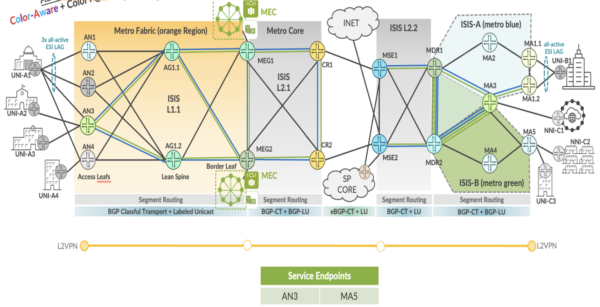

L2VPN End-to-End Service ELINE-EVPL implementation in EBS topology.

| EVPL Service | Service Attributes Test Results |
|--------------|---------------------------------|

<table style="width:100%;">
<colgroup>
<col style="width: 9%" />
<col style="width: 9%" />
<col style="width: 63%" />
<col style="width: 9%" />
<col style="width: 7%" />
</colgroup>
<thead>
<tr>
<th colspan="5" style="text-align: center;">Non Looping Frame Delivery</th>
</tr>
</thead>
<tbody>
<tr>
<td style="text-align: center;">MEF 3.0 Test Plan</td>
<td style="text-align: center;">Test Case Number</td>
<td>Test Case Name</td>
<td style="text-align: center;">Test Result</td>
<td style="text-align: center;">Comments</td>
</tr>
<tr>
<td rowspan="3" style="text-align: center;">Part 1</td>
<td style="text-align: center;">1.1.1</td>
<td>Non-looping frame delivery, broadcast frames</td>
<td style="text-align: center;">PASS</td>
<td style="text-align: center;">-</td>
</tr>
<tr>
<td style="text-align: center;">1.1.2</td>
<td>Non-looping frame delivery, multicast frames</td>
<td style="text-align: center;">PASS</td>
<td style="text-align: center;">-</td>
</tr>
<tr>
<td style="text-align: center;">1.1.3</td>
<td>Non-looping frame delivery, unknown unicast frames</td>
<td style="text-align: center;">PASS</td>
<td style="text-align: center;">-</td>
</tr>
</tbody>
</table>

<table style="width:100%;">
<colgroup>
<col style="width: 9%" />
<col style="width: 9%" />
<col style="width: 63%" />
<col style="width: 9%" />
<col style="width: 7%" />
</colgroup>
<thead>
<tr>
<th colspan="5" style="text-align: center;">CE-VLAN ID and CE-VLAN CoS Preservation YES</th>
</tr>
</thead>
<tbody>
<tr>
<td style="text-align: center;">MEF 3.0 Test Plan</td>
<td style="text-align: center;">Test Case Number</td>
<td>Test Case Name</td>
<td style="text-align: center;">Test Result</td>
<td style="text-align: center;">Comments</td>
</tr>
<tr>
<td style="text-align: center;">Part 1</td>
<td style="text-align: center;">11.2.1</td>
<td>CE-VLAN ID preservation, tagged frames</td>
<td style="text-align: center;">PASS</td>
<td style="text-align: center;">-</td>
</tr>
</tbody>
</table>

<table>
<colgroup>
<col style="width: 9%" />
<col style="width: 9%" />
<col style="width: 63%" />
<col style="width: 9%" />
<col style="width: 7%" />
</colgroup>
<thead>
<tr>
<th colspan="5" style="text-align: center;">UNI Physical Layer and MAC Layer</th>
</tr>
</thead>
<tbody>
<tr>
<td style="text-align: center;">MEF 3.0 Test Plan</td>
<td style="text-align: center;">Test Case Number</td>
<td>Test Case Name</td>
<td style="text-align: center;">Test Result</td>
<td style="text-align: center;">Comments</td>
</tr>
<tr>
<td style="text-align: center;">Part 1</td>
<td style="text-align: center;">15.2.1</td>
<td>UNI physical layer, mode and speed</td>
<td style="text-align: center;">PASS</td>
<td style="text-align: center;">-</td>
</tr>
</tbody>
</table>

<table>
<colgroup>
<col style="width: 9%" />
<col style="width: 9%" />
<col style="width: 63%" />
<col style="width: 9%" />
<col style="width: 7%" />
</colgroup>
<thead>
<tr>
<th colspan="5" style="text-align: center;">EVC Maximum Transmission Unit Size</th>
</tr>
</thead>
<tbody>
<tr>
<td style="text-align: center;">MEF 3.0 Test Plan</td>
<td style="text-align: center;">Test Case Number</td>
<td>Test Case Name</td>
<td style="text-align: center;">Test Result</td>
<td style="text-align: center;">Comments</td>
</tr>
<tr>
<td style="text-align: center;">Part 1</td>
<td style="text-align: center;">16.2.2</td>
<td>EVC Maximum Service Frame Size - Tagged</td>
<td style="text-align: center;">PASS</td>
<td style="text-align: center;"><strong>-</strong></td>
</tr>
</tbody>
</table>

<table style="width:100%;">
<colgroup>
<col style="width: 9%" />
<col style="width: 9%" />
<col style="width: 63%" />
<col style="width: 9%" />
<col style="width: 7%" />
</colgroup>
<thead>
<tr>
<th colspan="5" style="text-align: center;">CE-VLAN ID/EVC Map</th>
</tr>
</thead>
<tbody>
<tr>
<td style="text-align: center;">MEF 3.0 Test Plan</td>
<td style="text-align: center;">Test Case Number</td>
<td>Test Case Name</td>
<td style="text-align: center;">Test Result</td>
<td style="text-align: center;">Comments</td>
</tr>
<tr>
<td style="text-align: center;">Part 1</td>
<td style="text-align: center;">20.2.1</td>
<td>CE-VLAN ID/EVC Map, Service Frame Discard</td>
<td style="text-align: center;">PASS</td>
<td style="text-align: center;">-</td>
</tr>
</tbody>
</table>

<table>
<colgroup>
<col style="width: 9%" />
<col style="width: 9%" />
<col style="width: 63%" />
<col style="width: 9%" />
<col style="width: 7%" />
</colgroup>
<thead>
<tr>
<th colspan="5" style="text-align: center;">Service OAM</th>
</tr>
</thead>
<tbody>
<tr>
<td style="text-align: center;">MEF 3.0 Test Plan</td>
<td style="text-align: center;">Test Case Number</td>
<td>Test Case Name</td>
<td style="text-align: center;">Test Result</td>
<td style="text-align: center;">Comments</td>
</tr>
<tr>
<td rowspan="6" style="text-align: center;">Part 1</td>
<td style="text-align: center;">1.2.1</td>
<td>Continuity Check Message Transparency - Untagged CCM Service Frame</td>
<td style="text-align: center;">PASS</td>
<td style="text-align: center;">-</td>
</tr>
<tr>
<td style="text-align: center;">2.2.1</td>
<td>Multicast Loopback Message Transparency - Untagged LBM Service Frame</td>
<td style="text-align: center;">PASS</td>
<td style="text-align: center;">-</td>
</tr>
<tr>
<td style="text-align: center;">3.2.1</td>
<td>Unicast Loopback Message Transparency - Untagged LBM Service Frame</td>
<td style="text-align: center;">PASS</td>
<td style="text-align: center;">-</td>
</tr>
<tr>
<td style="text-align: center;">4.2.1</td>
<td>Loopback Response Transparency - Untagged LBR Service Frame</td>
<td style="text-align: center;">PASS</td>
<td style="text-align: center;">-</td>
</tr>
<tr>
<td style="text-align: center;">5.2.1</td>
<td>Linktrace Message Transparency - Untagged LTM Service Frame</td>
<td style="text-align: center;">PASS</td>
<td style="text-align: center;">-</td>
</tr>
<tr>
<td style="text-align: center;">6.2.1</td>
<td>Linktrace Response Transparency - Untagged LTR Service Frame</td>
<td style="text-align: center;">PASS</td>
<td style="text-align: center;">-</td>
</tr>
</tbody>
</table>

<table>
<colgroup>
<col style="width: 9%" />
<col style="width: 9%" />
<col style="width: 64%" />
<col style="width: 8%" />
<col style="width: 8%" />
</colgroup>
<thead>
<tr>
<th colspan="5" style="text-align: center;">Service Frame Transparency</th>
</tr>
</thead>
<tbody>
<tr>
<td style="text-align: center;">MEF 3.0 Test Plan</td>
<td style="text-align: center;">Test Case Number</td>
<td>Test Case Name</td>
<td style="text-align: center;">Test Result</td>
<td style="text-align: center;">Comments</td>
</tr>
<tr>
<td style="text-align: center;">Part 1</td>
<td style="text-align: center;">6.2.1</td>
<td>Service Frame Transparency - Tagged to Tagged</td>
<td style="text-align: center;">PASS</td>
<td style="text-align: center;">-</td>
</tr>
</tbody>
</table>

<table>
<colgroup>
<col style="width: 9%" />
<col style="width: 9%" />
<col style="width: 63%" />
<col style="width: 9%" />
<col style="width: 7%" />
</colgroup>
<thead>
<tr>
<th colspan="5" style="text-align: center;">L2CP Service Frames</th>
</tr>
</thead>
<tbody>
<tr>
<td style="text-align: center;">MEF 3.0 Test Plan</td>
<td style="text-align: center;">Test Case Number</td>
<td>Test Case Name</td>
<td style="text-align: center;">Test Result</td>
<td style="text-align: center;">Comments</td>
</tr>
<tr>
<td rowspan="20" style="text-align: center;">Part 1</td>
<td rowspan="20" style="text-align: center;">E_L_F_2</td>
<td>L2CP Service Frames Must Not Tunnel - 01:80:C2:00:00:01, 0x8808</td>
<td style="text-align: center;">PASS</td>
<td style="text-align: center;">-</td>
</tr>
<tr>
<td>L2CP Service Frames Must Not Tunnel - 01:80:C2:00:00:02, 0x8809/01/02</td>
<td style="text-align: center;">PASS</td>
<td style="text-align: center;">-</td>
</tr>
<tr>
<td>L2CP Service Frames Must Not Tunnel - 01:80:C2:00:00:02, 0x8809/03</td>
<td style="text-align: center;">PASS</td>
<td style="text-align: center;">-</td>
</tr>
<tr>
<td>L2CP Service Frames Must Not Tunnel - 01:80:C2:00:00:02, 0x8809/0A</td>
<td style="text-align: center;">PASS</td>
<td style="text-align: center;">-</td>
</tr>
<tr>
<td>L2CP Service Frames Must Not Tunnel - 01:80:C2:00:00:03, 0x888E</td>
<td style="text-align: center;">PASS</td>
<td style="text-align: center;">-</td>
</tr>
<tr>
<td>L2CP Service Frames Must Not Tunnel - 01:80:C2:00:00:04</td>
<td style="text-align: center;">PASS</td>
<td style="text-align: center;">-</td>
</tr>
<tr>
<td>L2CP Service Frames Must Not Tunnel - 01:80:C2:00:00:05</td>
<td style="text-align: center;">PASS</td>
<td style="text-align: center;">-</td>
</tr>
<tr>
<td>L2CP Service Frames Must Not Tunnel - 01:80:C2:00:00:06</td>
<td style="text-align: center;">PASS</td>
<td style="text-align: center;">-</td>
</tr>
<tr>
<td>L2CP Service Frames Must Not Tunnel - 01:80:C2:00:00:07, 0x88EE</td>
<td style="text-align: center;">PASS</td>
<td style="text-align: center;">-</td>
</tr>
<tr>
<td>L2CP Service Frames Must Not Tunnel - 01:80:C2:00:00:08</td>
<td style="text-align: center;">PASS</td>
<td style="text-align: center;">-</td>
</tr>
<tr>
<td>L2CP Service Frames Must Not Tunnel - 01:80:C2:00:00:09</td>
<td style="text-align: center;">PASS</td>
<td style="text-align: center;">-</td>
</tr>
<tr>
<td>L2CP Service Frames Must Not Tunnel - 01:80:C2:00:00:0A</td>
<td style="text-align: center;">PASS</td>
<td style="text-align: center;">-</td>
</tr>
<tr>
<td>L2CP Service Frames Must Not Tunnel - 01:80:C2:00:00:0E, 0x88CC</td>
<td style="text-align: center;">PASS</td>
<td style="text-align: center;">-</td>
</tr>
<tr>
<td>L2CP Service Frames Must Not Tunnel - 01:80:C2:00:00:0E, 0x88F7</td>
<td style="text-align: center;">PASS</td>
<td style="text-align: center;">-</td>
</tr>
<tr>
<td>L2CP Service Frames Must Not Tunnel - 01:80:C2:00:00:20 through 01:80:C2:00:00:2F</td>
<td style="text-align: center;">PASS</td>
<td style="text-align: center;">-</td>
</tr>
<tr>
<td>L2CP Service Frames Must Not Tunnel - 01:80:C2:00:00:00</td>
<td style="text-align: center;">PASS</td>
<td style="text-align: center;">-</td>
</tr>
<tr>
<td>L2CP Service Frames Must Not Tunnel - 01:80:C2:00:00:0B</td>
<td style="text-align: center;">PASS</td>
<td style="text-align: center;">-</td>
</tr>
<tr>
<td>L2CP Service Frames Must Not Tunnel - 01:80:C2:00:00:0C</td>
<td style="text-align: center;">PASS</td>
<td style="text-align: center;">-</td>
</tr>
<tr>
<td>L2CP Service Frames Must Not Tunnel - 01:80:C2:00:00:0D</td>
<td style="text-align: center;">PASS</td>
<td style="text-align: center;">-</td>
</tr>
<tr>
<td>L2CP Service Frames Must Not Tunnel - 01:80:C2:00:00:0F</td>
<td style="text-align: center;">PASS</td>
<td style="text-align: center;">-</td>
</tr>
</tbody>
</table>

| EVPL SERVICE | Performance Results |
|--------------|---------------------|

<table>
<colgroup>
<col style="width: 9%" />
<col style="width: 9%" />
<col style="width: 10%" />
<col style="width: 10%" />
<col style="width: 10%" />
<col style="width: 8%" />
<col style="width: 7%" />
<col style="width: 13%" />
<col style="width: 10%" />
<col style="width: 10%" />
</colgroup>
<thead>
<tr>
<th colspan="10" style="text-align: center;">One-Way Frame Delay Performance – Performance Tier 1</th>
</tr>
</thead>
<tbody>
<tr>
<td style="text-align: center;">MEF 3.0 Test Plan</td>
<td style="text-align: center;">Test Case Number</td>
<td colspan="6">Test Case Name and Bandwidth Profile Parameters</td>
<td style="text-align: center;">Test Result</td>
<td style="text-align: center;">Comments</td>
</tr>
<tr>
<td rowspan="4" style="text-align: center;">Part 2</td>
<td rowspan="4" style="text-align: center;">1.1.1</td>
<td colspan="6">One-Way Frame Delay Performance with CIR = 3500 Mbps</td>
<td rowspan="4" style="text-align: center;">PASS</td>
<td rowspan="4" style="text-align: center;">-</td>
</tr>
<tr>
<td style="text-align: center;">CIR</td>
<td style="text-align: center;">CBS</td>
<td style="text-align: center;">EIR</td>
<td style="text-align: center;">EBS</td>
<td style="text-align: center;">CM</td>
<td style="text-align: center;">Class of Service</td>
</tr>
<tr>
<td style="text-align: center;">3500 Mbps</td>
<td style="text-align: center;">35000 Bytes</td>
<td style="text-align: center;">0 Mbps</td>
<td style="text-align: center;">0 Bytes</td>
<td style="text-align: center;">Color-Blind</td>
<td style="text-align: center;">High</td>
</tr>
<tr>
<td style="text-align: center;">3500 Mbps</td>
<td style="text-align: center;">35000 Bytes</td>
<td style="text-align: center;">3500 Mbps</td>
<td style="text-align: center;">35000 Bytes</td>
<td style="text-align: center;">Color-Blind</td>
<td style="text-align: center;">Medium</td>
</tr>
</tbody>
</table>

<table>
<colgroup>
<col style="width: 9%" />
<col style="width: 9%" />
<col style="width: 10%" />
<col style="width: 10%" />
<col style="width: 10%" />
<col style="width: 8%" />
<col style="width: 7%" />
<col style="width: 13%" />
<col style="width: 10%" />
<col style="width: 10%" />
</colgroup>
<thead>
<tr>
<th colspan="10" style="text-align: center;">One-Way Mean Frame Delay Performance – Performance Tier 1</th>
</tr>
</thead>
<tbody>
<tr>
<td style="text-align: center;">MEF 3.0 Test Plan</td>
<td style="text-align: center;">Test Case Number</td>
<td colspan="6">Test Case Name and Bandwidth Profile Parameters</td>
<td style="text-align: center;">Test Result</td>
<td style="text-align: center;">Comments</td>
</tr>
<tr>
<td rowspan="4" style="text-align: center;">Part 2</td>
<td rowspan="4" style="text-align: center;">2.1.1</td>
<td colspan="6">One-Way Frame Delay Performance with CIR = 3500 Mbps</td>
<td rowspan="4" style="text-align: center;">PASS</td>
<td rowspan="4" style="text-align: center;">-</td>
</tr>
<tr>
<td style="text-align: center;">CIR</td>
<td style="text-align: center;">CBS</td>
<td style="text-align: center;">EIR</td>
<td style="text-align: center;">EBS</td>
<td style="text-align: center;">CM</td>
<td style="text-align: center;">Class of Service</td>
</tr>
<tr>
<td style="text-align: center;">3500 Mbps</td>
<td style="text-align: center;">35000 Bytes</td>
<td style="text-align: center;">0 Mbps</td>
<td style="text-align: center;">0 Bytes</td>
<td style="text-align: center;">Color-Blind</td>
<td style="text-align: center;">High</td>
</tr>
<tr>
<td style="text-align: center;">3500 Mbps</td>
<td style="text-align: center;">35000 Bytes</td>
<td style="text-align: center;">3500 Mbps</td>
<td style="text-align: center;">35000 Bytes</td>
<td style="text-align: center;">Color-Blind</td>
<td style="text-align: center;">Medium</td>
</tr>
</tbody>
</table>

<table>
<colgroup>
<col style="width: 9%" />
<col style="width: 9%" />
<col style="width: 10%" />
<col style="width: 10%" />
<col style="width: 10%" />
<col style="width: 8%" />
<col style="width: 7%" />
<col style="width: 13%" />
<col style="width: 10%" />
<col style="width: 10%" />
</colgroup>
<thead>
<tr>
<th colspan="10" style="text-align: center;">One-Way Inter-Frame Delay Performance – Performance Tier 1</th>
</tr>
</thead>
<tbody>
<tr>
<td style="text-align: center;">MEF 3.0 Test Plan</td>
<td style="text-align: center;">Test Case Number</td>
<td colspan="6">Test Case Name and Bandwidth Profile Parameters</td>
<td style="text-align: center;">Test Result</td>
<td style="text-align: center;">Comments</td>
</tr>
<tr>
<td rowspan="4" style="text-align: center;">Part 2</td>
<td rowspan="4" style="text-align: center;">3.1.1</td>
<td colspan="6">One-Way Frame Delay Performance with CIR = 3500 Mbps</td>
<td rowspan="4" style="text-align: center;">PASS</td>
<td rowspan="4" style="text-align: center;">-</td>
</tr>
<tr>
<td style="text-align: center;">CIR</td>
<td style="text-align: center;">CBS</td>
<td style="text-align: center;">EIR</td>
<td style="text-align: center;">EBS</td>
<td style="text-align: center;">CM</td>
<td style="text-align: center;">Class of Service</td>
</tr>
<tr>
<td style="text-align: center;">3500 Mbps</td>
<td style="text-align: center;">35000 Bytes</td>
<td style="text-align: center;">0 Mbps</td>
<td style="text-align: center;">0 Bytes</td>
<td style="text-align: center;">Color-Blind</td>
<td style="text-align: center;">High</td>
</tr>
<tr>
<td style="text-align: center;">3500 Mbps</td>
<td style="text-align: center;">35000 Bytes</td>
<td style="text-align: center;">3500 Mbps</td>
<td style="text-align: center;">35000 Bytes</td>
<td style="text-align: center;">Color-Blind</td>
<td style="text-align: center;">Medium</td>
</tr>
</tbody>
</table>

<table>
<colgroup>
<col style="width: 9%" />
<col style="width: 9%" />
<col style="width: 10%" />
<col style="width: 10%" />
<col style="width: 10%" />
<col style="width: 8%" />
<col style="width: 7%" />
<col style="width: 13%" />
<col style="width: 10%" />
<col style="width: 10%" />
</colgroup>
<thead>
<tr>
<th colspan="10" style="text-align: center;">One-Way Frame Delay Range Performance – Performance Tier 1</th>
</tr>
</thead>
<tbody>
<tr>
<td style="text-align: center;">MEF 3.0 Test Plan</td>
<td style="text-align: center;">Test Case Number</td>
<td colspan="6">Test Case Name and Bandwidth Profile Parameters</td>
<td style="text-align: center;">Test Result</td>
<td style="text-align: center;">Comments</td>
</tr>
<tr>
<td rowspan="4" style="text-align: center;">Part 2</td>
<td rowspan="4" style="text-align: center;">4.1.1</td>
<td colspan="6">One-Way Frame Delay Performance with CIR = 3500 Mbps</td>
<td rowspan="4" style="text-align: center;">PASS</td>
<td rowspan="4" style="text-align: center;">-</td>
</tr>
<tr>
<td style="text-align: center;">CIR</td>
<td style="text-align: center;">CBS</td>
<td style="text-align: center;">EIR</td>
<td style="text-align: center;">EBS</td>
<td style="text-align: center;">CM</td>
<td style="text-align: center;">Class of Service</td>
</tr>
<tr>
<td style="text-align: center;">3500 Mbps</td>
<td style="text-align: center;">35000 Bytes</td>
<td style="text-align: center;">0 Mbps</td>
<td style="text-align: center;">0 Bytes</td>
<td style="text-align: center;">Color-Blind</td>
<td style="text-align: center;">High</td>
</tr>
<tr>
<td style="text-align: center;">3500 Mbps</td>
<td style="text-align: center;">35000 Bytes</td>
<td style="text-align: center;">3500 Mbps</td>
<td style="text-align: center;">35000 Bytes</td>
<td style="text-align: center;">Color-Blind</td>
<td style="text-align: center;">Medium</td>
</tr>
</tbody>
</table>

<table>
<colgroup>
<col style="width: 9%" />
<col style="width: 9%" />
<col style="width: 10%" />
<col style="width: 10%" />
<col style="width: 10%" />
<col style="width: 8%" />
<col style="width: 7%" />
<col style="width: 13%" />
<col style="width: 10%" />
<col style="width: 10%" />
</colgroup>
<thead>
<tr>
<th colspan="10" style="text-align: center;">One-Way Frame Loss Performance – Performance Tier 1</th>
</tr>
</thead>
<tbody>
<tr>
<td style="text-align: center;">MEF 3.0 Test Plan</td>
<td style="text-align: center;">Test Case Number</td>
<td colspan="6">Test Case Name and Bandwidth Profile Parameters</td>
<td style="text-align: center;">Test Result</td>
<td style="text-align: center;">Comments</td>
</tr>
<tr>
<td rowspan="4" style="text-align: center;">Part 2</td>
<td rowspan="4" style="text-align: center;">5.1.1</td>
<td colspan="6">One-Way Frame Delay Performance with CIR = 3500 Mbps</td>
<td rowspan="4" style="text-align: center;">PASS</td>
<td rowspan="4" style="text-align: center;">-</td>
</tr>
<tr>
<td style="text-align: center;">CIR</td>
<td style="text-align: center;">CBS</td>
<td style="text-align: center;">EIR</td>
<td style="text-align: center;">EBS</td>
<td style="text-align: center;">CM</td>
<td style="text-align: center;">Class of Service</td>
</tr>
<tr>
<td style="text-align: center;">3500 Mbps</td>
<td style="text-align: center;">35000 Bytes</td>
<td style="text-align: center;">0 Mbps</td>
<td style="text-align: center;">0 Bytes</td>
<td style="text-align: center;">Color-Blind</td>
<td style="text-align: center;">High</td>
</tr>
<tr>
<td style="text-align: center;">3500 Mbps</td>
<td style="text-align: center;">35000 Bytes</td>
<td style="text-align: center;">3500 Mbps</td>
<td style="text-align: center;">35000 Bytes</td>
<td style="text-align: center;">Color-Blind</td>
<td style="text-align: center;">Medium</td>
</tr>
</tbody>
</table>

| EVPL SERVICE | Traffic Management Test Results |
|--------------|---------------------------------|

<table>
<colgroup>
<col style="width: 8%" />
<col style="width: 8%" />
<col style="width: 9%" />
<col style="width: 9%" />
<col style="width: 9%" />
<col style="width: 7%" />
<col style="width: 6%" />
<col style="width: 11%" />
<col style="width: 10%" />
<col style="width: 9%" />
<col style="width: 10%" />
</colgroup>
<thead>
<tr>
<th colspan="11" style="text-align: center;">Ingress Bandwidth Profile - CIR Enforcement</th>
</tr>
</thead>
<tbody>
<tr>
<td style="text-align: center;">MEF 3.0 Test Plan</td>
<td style="text-align: center;">Test Case Number</td>
<td colspan="7">Test Case Name and Bandwidth Profile Parameters</td>
<td style="text-align: center;">Test Result</td>
<td style="text-align: center;">Comments</td>
</tr>
<tr>
<td rowspan="3" style="text-align: center;">Part 2</td>
<td rowspan="3" style="text-align: center;">1.1.6</td>
<td colspan="7">CBS Enforcement Tagged Frames when [CIR/CBS&gt;0 and EIR/EBS=0] and CoS ID per EVC &amp; PCP</td>
<td rowspan="3" style="text-align: center;">PASS</td>
<td rowspan="3" style="text-align: center;">-</td>
</tr>
<tr>
<td style="text-align: center;">CIR</td>
<td style="text-align: center;">CBS</td>
<td style="text-align: center;">EIR</td>
<td style="text-align: center;">EBS</td>
<td style="text-align: center;">CM</td>
<td style="text-align: center;">Class of Service</td>
<td style="text-align: center;">Test Frame sizes</td>
</tr>
<tr>
<td style="text-align: center;">3500 Mbps</td>
<td style="text-align: center;">35000 Bytes</td>
<td style="text-align: center;">0 Mbps</td>
<td style="text-align: center;">0 Bytes</td>
<td style="text-align: center;">Color-Blind</td>
<td style="text-align: center;">High</td>
<td style="text-align: center;">80,600,1500</td>
</tr>
</tbody>
</table>

<table>
<colgroup>
<col style="width: 8%" />
<col style="width: 8%" />
<col style="width: 9%" />
<col style="width: 9%" />
<col style="width: 9%" />
<col style="width: 7%" />
<col style="width: 6%" />
<col style="width: 11%" />
<col style="width: 10%" />
<col style="width: 9%" />
<col style="width: 10%" />
</colgroup>
<thead>
<tr>
<th colspan="11" style="text-align: center;">Ingress Bandwidth Profile - CBS Enforcement</th>
</tr>
</thead>
<tbody>
<tr>
<td style="text-align: center;">MEF 3.0 Test Plan</td>
<td style="text-align: center;">Test Case Number</td>
<td colspan="7">Test Case Name and Bandwidth Profile Parameters</td>
<td style="text-align: center;">Test Result</td>
<td style="text-align: center;">Comments</td>
</tr>
<tr>
<td rowspan="3" style="text-align: center;">Part 2</td>
<td rowspan="3" style="text-align: center;">2.1.6</td>
<td colspan="7">CBS Enforcement Tagged Frames when [CIR/CBS&gt;0 and EIR/EBS=0] and CoS ID per EVC &amp; PCP</td>
<td rowspan="3" style="text-align: center;">PASS</td>
<td rowspan="3" style="text-align: center;">-</td>
</tr>
<tr>
<td style="text-align: center;">CIR</td>
<td style="text-align: center;">CBS</td>
<td style="text-align: center;">EIR</td>
<td style="text-align: center;">EBS</td>
<td style="text-align: center;">CM</td>
<td style="text-align: center;">Class of Service</td>
<td style="text-align: center;">Test Frame sizes</td>
</tr>
<tr>
<td style="text-align: center;">3500 Mbps</td>
<td style="text-align: center;">35000 Bytes</td>
<td style="text-align: center;">0 Mbps</td>
<td style="text-align: center;">0 Bytes</td>
<td style="text-align: center;">Color-Blind</td>
<td style="text-align: center;">High</td>
<td style="text-align: center;">80,600,1500</td>
</tr>
</tbody>
</table>

<table>
<colgroup>
<col style="width: 8%" />
<col style="width: 8%" />
<col style="width: 9%" />
<col style="width: 9%" />
<col style="width: 9%" />
<col style="width: 7%" />
<col style="width: 6%" />
<col style="width: 11%" />
<col style="width: 10%" />
<col style="width: 9%" />
<col style="width: 10%" />
</colgroup>
<thead>
<tr>
<th colspan="11" style="text-align: center;">Ingress Bandwidth Profile - EIR Enforcement</th>
</tr>
</thead>
<tbody>
<tr>
<td style="text-align: center;">MEF 3.0 Test Plan</td>
<td style="text-align: center;">Test Case Number</td>
<td colspan="7">Test Case Name and Bandwidth Profile Parameters</td>
<td style="text-align: center;">Test Result</td>
<td style="text-align: center;">Comments</td>
</tr>
<tr>
<td rowspan="3" style="text-align: center;">Part 2</td>
<td rowspan="3" style="text-align: center;">3.1.6</td>
<td colspan="7">EIR Enforcement Tagged Frames when [CIR/CBS=0 and EIR/EBS&gt;0] and CoS ID per EVC &amp; PCP</td>
<td rowspan="3" style="text-align: center;">PASS</td>
<td rowspan="3" style="text-align: center;">-</td>
</tr>
<tr>
<td style="text-align: center;">CIR</td>
<td style="text-align: center;">CBS</td>
<td style="text-align: center;">EIR</td>
<td style="text-align: center;">EBS</td>
<td style="text-align: center;">CM</td>
<td style="text-align: center;">Class of Service</td>
<td style="text-align: center;">Test Frame sizes</td>
</tr>
<tr>
<td style="text-align: center;">0 Mbps</td>
<td style="text-align: center;">0 Bytes</td>
<td style="text-align: center;">3500 Mbps</td>
<td style="text-align: center;">35000 Bytes</td>
<td style="text-align: center;">Color-Blind</td>
<td style="text-align: center;">Low</td>
<td style="text-align: center;">80,600,1500</td>
</tr>
</tbody>
</table>

<table>
<colgroup>
<col style="width: 8%" />
<col style="width: 8%" />
<col style="width: 9%" />
<col style="width: 9%" />
<col style="width: 9%" />
<col style="width: 7%" />
<col style="width: 6%" />
<col style="width: 11%" />
<col style="width: 10%" />
<col style="width: 9%" />
<col style="width: 10%" />
</colgroup>
<thead>
<tr>
<th colspan="11" style="text-align: center;">Ingress Bandwidth Profile - EBS Enforcement</th>
</tr>
</thead>
<tbody>
<tr>
<td style="text-align: center;">MEF 3.0 Test Plan</td>
<td style="text-align: center;">Test Case Number</td>
<td colspan="7">Test Case Name and Bandwidth Profile Parameters</td>
<td style="text-align: center;">Test Result</td>
<td style="text-align: center;">Comments</td>
</tr>
<tr>
<td rowspan="3" style="text-align: center;">Part 2</td>
<td rowspan="3" style="text-align: center;">4.1.6</td>
<td colspan="7">EBS Enforcement Tagged Frames when [CIR/CBS=0 and EIR/EBS&gt;0] and CoS ID per EVC &amp; PCP</td>
<td rowspan="3" style="text-align: center;">PASS</td>
<td rowspan="3" style="text-align: center;">-</td>
</tr>
<tr>
<td style="text-align: center;">CIR</td>
<td style="text-align: center;">CBS</td>
<td style="text-align: center;">EIR</td>
<td style="text-align: center;">EBS</td>
<td style="text-align: center;">CM</td>
<td style="text-align: center;">Class of Service</td>
<td style="text-align: center;">Test Frame sizes</td>
</tr>
<tr>
<td style="text-align: center;">3500 Mbps</td>
<td style="text-align: center;">35000 Bytes</td>
<td style="text-align: center;">0 Mbps</td>
<td style="text-align: center;">0 Bytes</td>
<td style="text-align: center;">Color-Blind</td>
<td style="text-align: center;">Low</td>
<td style="text-align: center;">80,600,1500</td>
</tr>
</tbody>
</table>

<table>
<colgroup>
<col style="width: 8%" />
<col style="width: 8%" />
<col style="width: 9%" />
<col style="width: 9%" />
<col style="width: 9%" />
<col style="width: 7%" />
<col style="width: 6%" />
<col style="width: 11%" />
<col style="width: 10%" />
<col style="width: 9%" />
<col style="width: 10%" />
</colgroup>
<thead>
<tr>
<th colspan="11" style="text-align: center;">Ingress Bandwidth Profile - CIR and EIR Enforcement</th>
</tr>
</thead>
<tbody>
<tr>
<td style="text-align: center;">MEF 3.0 Test Plan</td>
<td style="text-align: center;">Test Case Number</td>
<td colspan="7">Test Case Name and Bandwidth Profile Parameters</td>
<td style="text-align: center;">Test Result</td>
<td style="text-align: center;">Comments</td>
</tr>
<tr>
<td rowspan="3" style="text-align: center;">Part 2</td>
<td rowspan="3" style="text-align: center;">5.1.6</td>
<td colspan="7">CIR and EIR Enforcement Tagged Frames when [CIR/CBS&gt;0 and EIR/EBS&gt;0] and CoS ID per EVC &amp; PCP</td>
<td rowspan="3" style="text-align: center;">PASS</td>
<td rowspan="3" style="text-align: center;">-</td>
</tr>
<tr>
<td style="text-align: center;">CIR</td>
<td style="text-align: center;">CBS</td>
<td style="text-align: center;">EIR</td>
<td style="text-align: center;">EBS</td>
<td style="text-align: center;">CM</td>
<td style="text-align: center;">Class of Service</td>
<td style="text-align: center;">Test Frame sizes</td>
</tr>
<tr>
<td style="text-align: center;">3500 Mbps</td>
<td style="text-align: center;">35000 Bytes</td>
<td style="text-align: center;">3500 Mbps</td>
<td style="text-align: center;">35000 Bytes</td>
<td style="text-align: center;">Color-Blind</td>
<td style="text-align: center;">Medium</td>
<td style="text-align: center;">80,600,1500</td>
</tr>
</tbody>
</table>

<table>
<colgroup>
<col style="width: 8%" />
<col style="width: 8%" />
<col style="width: 9%" />
<col style="width: 9%" />
<col style="width: 9%" />
<col style="width: 7%" />
<col style="width: 6%" />
<col style="width: 11%" />
<col style="width: 10%" />
<col style="width: 9%" />
<col style="width: 10%" />
</colgroup>
<thead>
<tr>
<th colspan="11" style="text-align: center;">Ingress Bandwidth Profile - CBS and EBS Enforcement</th>
</tr>
</thead>
<tbody>
<tr>
<td style="text-align: center;">MEF 3.0 Test Plan</td>
<td style="text-align: center;">Test Case Number</td>
<td colspan="7">Test Case Name and Bandwidth Profile Parameters</td>
<td style="text-align: center;">Test Result</td>
<td style="text-align: center;">Comments</td>
</tr>
<tr>
<td rowspan="3" style="text-align: center;">Part 2</td>
<td rowspan="3" style="text-align: center;">6.1.6</td>
<td colspan="7">CBS and EBS Enforcement Tagged Frames when [CIR/CBS&gt;0 and EIR/EBS&gt;0] and CoS ID per EVC &amp; PCP</td>
<td rowspan="3" style="text-align: center;">PASS</td>
<td rowspan="3" style="text-align: center;">-</td>
</tr>
<tr>
<td style="text-align: center;">CIR</td>
<td style="text-align: center;">CBS</td>
<td style="text-align: center;">EIR</td>
<td style="text-align: center;">EBS</td>
<td style="text-align: center;">CM</td>
<td style="text-align: center;">Class of Service</td>
<td style="text-align: center;">Test Frame sizes</td>
</tr>
<tr>
<td style="text-align: center;">3500 Mbps</td>
<td style="text-align: center;">35000 Bytes</td>
<td style="text-align: center;">3500 Mbps</td>
<td style="text-align: center;">35000 Bytes</td>
<td style="text-align: center;">Color-Blind</td>
<td style="text-align: center;">Medium</td>
<td style="text-align: center;">80,600,1500</td>
</tr>
</tbody>
</table>

<table>
<colgroup>
<col style="width: 8%" />
<col style="width: 8%" />
<col style="width: 9%" />
<col style="width: 9%" />
<col style="width: 9%" />
<col style="width: 7%" />
<col style="width: 6%" />
<col style="width: 11%" />
<col style="width: 10%" />
<col style="width: 9%" />
<col style="width: 10%" />
</colgroup>
<thead>
<tr>
<th colspan="11" style="text-align: center;">Ingress Bandwidth Profile - Unconditional Delivery of Frames</th>
</tr>
</thead>
<tbody>
<tr>
<td style="text-align: center;">MEF 3.0 Test Plan</td>
<td style="text-align: center;">Test Case Number</td>
<td colspan="7">Test Case Name and Bandwidth Profile Parameters</td>
<td style="text-align: center;">Test Result</td>
<td style="text-align: center;">Comments</td>
</tr>
<tr>
<td rowspan="12" style="text-align: center;">Part 2</td>
<td rowspan="4" style="text-align: center;">7.1.1</td>
<td colspan="7">Unconditional Delivery of Broadcast Frames and CoS ID per EVC &amp; PCP</td>
<td rowspan="4" style="text-align: center;">PASS</td>
<td rowspan="4" style="text-align: center;">-</td>
</tr>
<tr>
<td style="text-align: center;">CIR</td>
<td style="text-align: center;">CBS</td>
<td style="text-align: center;">EIR</td>
<td style="text-align: center;">EBS</td>
<td style="text-align: center;">CM</td>
<td style="text-align: center;">Class of Service</td>
<td style="text-align: center;">Test Frame sizes</td>
</tr>
<tr>
<td style="text-align: center;">3500 Mbps</td>
<td style="text-align: center;">35000 Bytes</td>
<td style="text-align: center;">0 Mbps</td>
<td style="text-align: center;">0 Bytes</td>
<td style="text-align: center;">Color-Blind</td>
<td style="text-align: center;">High</td>
<td style="text-align: center;">80,600,1500</td>
</tr>
<tr>
<td style="text-align: center;">3500 Mbps</td>
<td style="text-align: center;">35000 Bytes</td>
<td style="text-align: center;">3500 Mbps</td>
<td style="text-align: center;">35000 Bytes</td>
<td style="text-align: center;">Color-Blind</td>
<td style="text-align: center;">Medium</td>
<td style="text-align: center;">80,600,1500</td>
</tr>
<tr>
<td rowspan="4" style="text-align: center;">7.1.2</td>
<td colspan="7">Unconditional Delivery of Mutlicast Frames and CoS ID per EVC &amp; PCP</td>
<td rowspan="4" style="text-align: center;">PASS</td>
<td rowspan="4" style="text-align: center;">-</td>
</tr>
<tr>
<td style="text-align: center;">CIR</td>
<td style="text-align: center;">CBS</td>
<td style="text-align: center;">EIR</td>
<td style="text-align: center;">EBS</td>
<td style="text-align: center;">CM</td>
<td style="text-align: center;">Class of Service</td>
<td style="text-align: center;">Test Frame sizes</td>
</tr>
<tr>
<td style="text-align: center;">3500 Mbps</td>
<td style="text-align: center;">35000 Bytes</td>
<td style="text-align: center;">0 Mbps</td>
<td style="text-align: center;">0 Bytes</td>
<td style="text-align: center;">Color-Blind</td>
<td style="text-align: center;">High</td>
<td style="text-align: center;">80,600,1500</td>
</tr>
<tr>
<td style="text-align: center;">3500 Mbps</td>
<td style="text-align: center;">35000 Bytes</td>
<td style="text-align: center;">3500 Mbps</td>
<td style="text-align: center;">35000 Bytes</td>
<td style="text-align: center;">Color-Blind</td>
<td style="text-align: center;">Medium</td>
<td style="text-align: center;">80,600,1500</td>
</tr>
<tr>
<td rowspan="4" style="text-align: center;">7.1.3</td>
<td colspan="7">Unconditional Delivery of Unicast Frames and CoS ID per EVC &amp; PCP</td>
<td rowspan="4" style="text-align: center;">PASS</td>
<td rowspan="4" style="text-align: center;">-</td>
</tr>
<tr>
<td style="text-align: center;">CIR</td>
<td style="text-align: center;">CBS</td>
<td style="text-align: center;">EIR</td>
<td style="text-align: center;">EBS</td>
<td style="text-align: center;">CM</td>
<td style="text-align: center;">Class of Service</td>
<td style="text-align: center;">Test Frame sizes</td>
</tr>
<tr>
<td style="text-align: center;">3500 Mbps</td>
<td style="text-align: center;">35000 Bytes</td>
<td style="text-align: center;">0 Mbps</td>
<td style="text-align: center;">0 Bytes</td>
<td style="text-align: center;">Color-Blind</td>
<td style="text-align: center;">High</td>
<td style="text-align: center;">80,600,1500</td>
</tr>
<tr>
<td style="text-align: center;">3500 Mbps</td>
<td style="text-align: center;">35000 Bytes</td>
<td style="text-align: center;">3500 Mbps</td>
<td style="text-align: center;">35000 Bytes</td>
<td style="text-align: center;">Color-Blind</td>
<td style="text-align: center;">Medium</td>
<td style="text-align: center;">80,600,1500</td>
</tr>
</tbody>
</table>

<table>
<colgroup>
<col style="width: 8%" />
<col style="width: 8%" />
<col style="width: 9%" />
<col style="width: 9%" />
<col style="width: 9%" />
<col style="width: 7%" />
<col style="width: 6%" />
<col style="width: 11%" />
<col style="width: 10%" />
<col style="width: 9%" />
<col style="width: 10%" />
</colgroup>
<thead>
<tr>
<th colspan="11" style="text-align: center;">Ingress Bandwidth Profile - Class of Service Discard</th>
</tr>
</thead>
<tbody>
<tr>
<td style="text-align: center;">MEF 3.0 Test Plan</td>
<td style="text-align: center;">Test Case Number</td>
<td colspan="7">Test Case Name and Bandwidth Profile Parameters</td>
<td style="text-align: center;">Test Result</td>
<td style="text-align: center;">Comments</td>
</tr>
<tr>
<td rowspan="3" style="text-align: center;">Part 2</td>
<td rowspan="3" style="text-align: center;">9.1.1</td>
<td colspan="7">CBS Enforcement Tagged Frames when [CIR/CBS&gt;0 and EIR/EBS=0] and CoS ID per EVC &amp; PCP</td>
<td rowspan="3" style="text-align: center;">PASS</td>
<td rowspan="3" style="text-align: center;">-</td>
</tr>
<tr>
<td style="text-align: center;">CIR</td>
<td style="text-align: center;">CBS</td>
<td style="text-align: center;">EIR</td>
<td style="text-align: center;">EBS</td>
<td style="text-align: center;">CM</td>
<td style="text-align: center;">Class of Service</td>
<td style="text-align: center;">Test Frame sizes</td>
</tr>
<tr>
<td style="text-align: center;">3500 Mbps</td>
<td style="text-align: center;">35000 Bytes</td>
<td style="text-align: center;">0 Mbps</td>
<td style="text-align: center;">0 Bytes</td>
<td style="text-align: center;">Color-Blind</td>
<td style="text-align: center;">High</td>
<td style="text-align: center;">80,600,1500</td>
</tr>
</tbody>
</table>

E-LINE - EVPL

### BGP-VPLS-FAPM-ring (Point to point service):

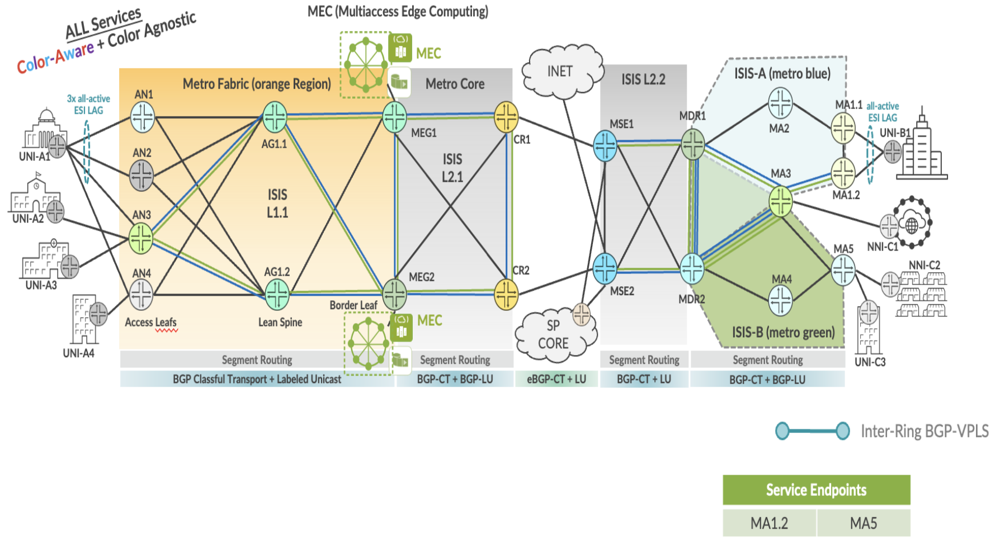

BGP-VPLS point-to-point (with 2 sites) Service in ELINE-EVPL implementation in RINGs of EBS topology.

| EVPL Service | Service Attributes Test Results |
|--------------|---------------------------------|

<table style="width:100%;">
<colgroup>
<col style="width: 9%" />
<col style="width: 9%" />
<col style="width: 63%" />
<col style="width: 9%" />
<col style="width: 7%" />
</colgroup>
<thead>
<tr>
<th colspan="5" style="text-align: center;">Non Looping Frame Delivery</th>
</tr>
</thead>
<tbody>
<tr>
<td style="text-align: center;">MEF 3.0 Test Plan</td>
<td style="text-align: center;">Test Case Number</td>
<td>Test Case Name</td>
<td style="text-align: center;">Test Result</td>
<td style="text-align: center;">Comments</td>
</tr>
<tr>
<td rowspan="3" style="text-align: center;">Part 1</td>
<td style="text-align: center;">1.1.1</td>
<td>Non-looping frame delivery, broadcast frames</td>
<td style="text-align: center;">PASS</td>
<td style="text-align: center;">-</td>
</tr>
<tr>
<td style="text-align: center;">1.1.2</td>
<td>Non-looping frame delivery, multicast frames</td>
<td style="text-align: center;">PASS</td>
<td style="text-align: center;">-</td>
</tr>
<tr>
<td style="text-align: center;">1.1.3</td>
<td>Non-looping frame delivery, unknown unicast frames</td>
<td style="text-align: center;">PASS</td>
<td style="text-align: center;">-</td>
</tr>
</tbody>
</table>

<table style="width:100%;">
<colgroup>
<col style="width: 9%" />
<col style="width: 9%" />
<col style="width: 63%" />
<col style="width: 9%" />
<col style="width: 7%" />
</colgroup>
<thead>
<tr>
<th colspan="5" style="text-align: center;">CE-VLAN ID and CE-VLAN CoS Preservation YES</th>
</tr>
</thead>
<tbody>
<tr>
<td style="text-align: center;">MEF 3.0 Test Plan</td>
<td style="text-align: center;">Test Case Number</td>
<td>Test Case Name</td>
<td style="text-align: center;">Test Result</td>
<td style="text-align: center;">Comments</td>
</tr>
<tr>
<td style="text-align: center;">Part 1</td>
<td style="text-align: center;">11.2.1</td>
<td>CE-VLAN ID preservation, tagged frames</td>
<td style="text-align: center;">PASS</td>
<td style="text-align: center;">-</td>
</tr>
</tbody>
</table>

<table>
<colgroup>
<col style="width: 9%" />
<col style="width: 9%" />
<col style="width: 63%" />
<col style="width: 9%" />
<col style="width: 7%" />
</colgroup>
<thead>
<tr>
<th colspan="5" style="text-align: center;">UNI Physical Layer and MAC Layer</th>
</tr>
</thead>
<tbody>
<tr>
<td style="text-align: center;">MEF 3.0 Test Plan</td>
<td style="text-align: center;">Test Case Number</td>
<td>Test Case Name</td>
<td style="text-align: center;">Test Result</td>
<td style="text-align: center;">Comments</td>
</tr>
<tr>
<td style="text-align: center;">Part 1</td>
<td style="text-align: center;">15.2.1</td>
<td>UNI physical layer, mode and speed</td>
<td style="text-align: center;">PASS</td>
<td style="text-align: center;">-</td>
</tr>
</tbody>
</table>

<table>
<colgroup>
<col style="width: 9%" />
<col style="width: 9%" />
<col style="width: 63%" />
<col style="width: 9%" />
<col style="width: 7%" />
</colgroup>
<thead>
<tr>
<th colspan="5" style="text-align: center;">EVC Maximum Transmission Unit Size</th>
</tr>
</thead>
<tbody>
<tr>
<td style="text-align: center;">MEF 3.0 Test Plan</td>
<td style="text-align: center;">Test Case Number</td>
<td>Test Case Name</td>
<td style="text-align: center;">Test Result</td>
<td style="text-align: center;">Comments</td>
</tr>
<tr>
<td style="text-align: center;">Part 1</td>
<td style="text-align: center;">16.2.2</td>
<td>EVC Maximum Service Frame Size - Tagged</td>
<td style="text-align: center;">PASS</td>
<td style="text-align: center;"><strong>-</strong></td>
</tr>
</tbody>
</table>

<table style="width:100%;">
<colgroup>
<col style="width: 9%" />
<col style="width: 9%" />
<col style="width: 63%" />
<col style="width: 9%" />
<col style="width: 7%" />
</colgroup>
<thead>
<tr>
<th colspan="5" style="text-align: center;">CE-VLAN ID/EVC Map</th>
</tr>
</thead>
<tbody>
<tr>
<td style="text-align: center;">MEF 3.0 Test Plan</td>
<td style="text-align: center;">Test Case Number</td>
<td>Test Case Name</td>
<td style="text-align: center;">Test Result</td>
<td style="text-align: center;">Comments</td>
</tr>
<tr>
<td style="text-align: center;">Part 1</td>
<td style="text-align: center;">20.2.1</td>
<td>CE-VLAN ID/EVC Map, Service Frame Discard</td>
<td style="text-align: center;">PASS</td>
<td style="text-align: center;">-</td>
</tr>
</tbody>
</table>

<table>
<colgroup>
<col style="width: 9%" />
<col style="width: 9%" />
<col style="width: 63%" />
<col style="width: 9%" />
<col style="width: 7%" />
</colgroup>
<thead>
<tr>
<th colspan="5" style="text-align: center;">Service OAM</th>
</tr>
</thead>
<tbody>
<tr>
<td style="text-align: center;">MEF 3.0 Test Plan</td>
<td style="text-align: center;">Test Case Number</td>
<td>Test Case Name</td>
<td style="text-align: center;">Test Result</td>
<td style="text-align: center;">Comments</td>
</tr>
<tr>
<td rowspan="6" style="text-align: center;">Part 1</td>
<td style="text-align: center;">1.2.1</td>
<td>Continuity Check Message Transparency - Untagged CCM Service Frame</td>
<td style="text-align: center;">PASS</td>
<td style="text-align: center;">-</td>
</tr>
<tr>
<td style="text-align: center;">2.2.1</td>
<td>Multicast Loopback Message Transparency - Untagged LBM Service Frame</td>
<td style="text-align: center;">PASS</td>
<td style="text-align: center;">-</td>
</tr>
<tr>
<td style="text-align: center;">3.2.1</td>
<td>Unicast Loopback Message Transparency - Untagged LBM Service Frame</td>
<td style="text-align: center;">PASS</td>
<td style="text-align: center;">-</td>
</tr>
<tr>
<td style="text-align: center;">4.2.1</td>
<td>Loopback Response Transparency - Untagged LBR Service Frame</td>
<td style="text-align: center;">PASS</td>
<td style="text-align: center;">-</td>
</tr>
<tr>
<td style="text-align: center;">5.2.1</td>
<td>Linktrace Message Transparency - Untagged LTM Service Frame</td>
<td style="text-align: center;">PASS</td>
<td style="text-align: center;">-</td>
</tr>
<tr>
<td style="text-align: center;">6.2.1</td>
<td>Linktrace Response Transparency - Untagged LTR Service Frame</td>
<td style="text-align: center;">PASS</td>
<td style="text-align: center;">-</td>
</tr>
</tbody>
</table>

<table>
<colgroup>
<col style="width: 9%" />
<col style="width: 9%" />
<col style="width: 64%" />
<col style="width: 8%" />
<col style="width: 8%" />
</colgroup>
<thead>
<tr>
<th colspan="5" style="text-align: center;">Service Frame Transparency</th>
</tr>
</thead>
<tbody>
<tr>
<td style="text-align: center;">MEF 3.0 Test Plan</td>
<td style="text-align: center;">Test Case Number</td>
<td>Test Case Name</td>
<td style="text-align: center;">Test Result</td>
<td style="text-align: center;">Comments</td>
</tr>
<tr>
<td style="text-align: center;">Part 1</td>
<td style="text-align: center;">6.2.1</td>
<td>Service Frame Transparency - Tagged to Tagged</td>
<td style="text-align: center;">PASS</td>
<td style="text-align: center;">-</td>
</tr>
</tbody>
</table>

<table>
<colgroup>
<col style="width: 9%" />
<col style="width: 9%" />
<col style="width: 63%" />
<col style="width: 9%" />
<col style="width: 7%" />
</colgroup>
<thead>
<tr>
<th colspan="5" style="text-align: center;">L2CP Service Frames</th>
</tr>
</thead>
<tbody>
<tr>
<td style="text-align: center;">MEF 3.0 Test Plan</td>
<td style="text-align: center;">Test Case Number</td>
<td>Test Case Name</td>
<td style="text-align: center;">Test Result</td>
<td style="text-align: center;">Comments</td>
</tr>
<tr>
<td rowspan="20" style="text-align: center;">Part 1</td>
<td rowspan="20" style="text-align: center;">E_L_F_2</td>
<td>L2CP Service Frames Must Not Tunnel - 01:80:C2:00:00:01, 0x8808</td>
<td style="text-align: center;">PASS</td>
<td style="text-align: center;">-</td>
</tr>
<tr>
<td>L2CP Service Frames Must Not Tunnel - 01:80:C2:00:00:02, 0x8809/01/02</td>
<td style="text-align: center;">PASS</td>
<td style="text-align: center;">-</td>
</tr>
<tr>
<td>L2CP Service Frames Must Not Tunnel - 01:80:C2:00:00:02, 0x8809/03</td>
<td style="text-align: center;">PASS</td>
<td style="text-align: center;">-</td>
</tr>
<tr>
<td>L2CP Service Frames Must Not Tunnel - 01:80:C2:00:00:02, 0x8809/0A</td>
<td style="text-align: center;">PASS</td>
<td style="text-align: center;">-</td>
</tr>
<tr>
<td>L2CP Service Frames Must Not Tunnel - 01:80:C2:00:00:03, 0x888E</td>
<td style="text-align: center;">PASS</td>
<td style="text-align: center;">-</td>
</tr>
<tr>
<td>L2CP Service Frames Must Not Tunnel - 01:80:C2:00:00:04</td>
<td style="text-align: center;">PASS</td>
<td style="text-align: center;">-</td>
</tr>
<tr>
<td>L2CP Service Frames Must Not Tunnel - 01:80:C2:00:00:05</td>
<td style="text-align: center;">PASS</td>
<td style="text-align: center;">-</td>
</tr>
<tr>
<td>L2CP Service Frames Must Not Tunnel - 01:80:C2:00:00:06</td>
<td style="text-align: center;">PASS</td>
<td style="text-align: center;">-</td>
</tr>
<tr>
<td>L2CP Service Frames Must Not Tunnel - 01:80:C2:00:00:07, 0x88EE</td>
<td style="text-align: center;">PASS</td>
<td style="text-align: center;">-</td>
</tr>
<tr>
<td>L2CP Service Frames Must Not Tunnel - 01:80:C2:00:00:08</td>
<td style="text-align: center;">PASS</td>
<td style="text-align: center;">-</td>
</tr>
<tr>
<td>L2CP Service Frames Must Not Tunnel - 01:80:C2:00:00:09</td>
<td style="text-align: center;">PASS</td>
<td style="text-align: center;">-</td>
</tr>
<tr>
<td>L2CP Service Frames Must Not Tunnel - 01:80:C2:00:00:0A</td>
<td style="text-align: center;">PASS</td>
<td style="text-align: center;">-</td>
</tr>
<tr>
<td>L2CP Service Frames Must Not Tunnel - 01:80:C2:00:00:0E, 0x88CC</td>
<td style="text-align: center;">PASS</td>
<td style="text-align: center;">-</td>
</tr>
<tr>
<td>L2CP Service Frames Must Not Tunnel - 01:80:C2:00:00:0E, 0x88F7</td>
<td style="text-align: center;">PASS</td>
<td style="text-align: center;">-</td>
</tr>
<tr>
<td>L2CP Service Frames Must Not Tunnel - 01:80:C2:00:00:20 through 01:80:C2:00:00:2F</td>
<td style="text-align: center;">PASS</td>
<td style="text-align: center;">-</td>
</tr>
<tr>
<td>L2CP Service Frames Must Not Tunnel - 01:80:C2:00:00:00</td>
<td style="text-align: center;">PASS</td>
<td style="text-align: center;">-</td>
</tr>
<tr>
<td>L2CP Service Frames Must Not Tunnel - 01:80:C2:00:00:0B</td>
<td style="text-align: center;">PASS</td>
<td style="text-align: center;">-</td>
</tr>
<tr>
<td>L2CP Service Frames Must Not Tunnel - 01:80:C2:00:00:0C</td>
<td style="text-align: center;">PASS</td>
<td style="text-align: center;">-</td>
</tr>
<tr>
<td>L2CP Service Frames Must Not Tunnel - 01:80:C2:00:00:0D</td>
<td style="text-align: center;">PASS</td>
<td style="text-align: center;">-</td>
</tr>
<tr>
<td>L2CP Service Frames Must Not Tunnel - 01:80:C2:00:00:0F</td>
<td style="text-align: center;">PASS</td>
<td style="text-align: center;">-</td>
</tr>
</tbody>
</table>

| EVPL SERVICE | Performance Results |
|--------------|---------------------|

<table>
<colgroup>
<col style="width: 9%" />
<col style="width: 9%" />
<col style="width: 10%" />
<col style="width: 10%" />
<col style="width: 10%" />
<col style="width: 8%" />
<col style="width: 7%" />
<col style="width: 13%" />
<col style="width: 10%" />
<col style="width: 10%" />
</colgroup>
<thead>
<tr>
<th colspan="10" style="text-align: center;">One-Way Frame Delay Performance – Performance Tier 1</th>
</tr>
</thead>
<tbody>
<tr>
<td style="text-align: center;">MEF 3.0 Test Plan</td>
<td style="text-align: center;">Test Case Number</td>
<td colspan="6">Test Case Name and Bandwidth Profile Parameters</td>
<td style="text-align: center;">Test Result</td>
<td style="text-align: center;">Comments</td>
</tr>
<tr>
<td rowspan="4" style="text-align: center;">Part 2</td>
<td rowspan="4" style="text-align: center;">1.1.1</td>
<td colspan="6">One-Way Frame Delay Performance with CIR = 3500 Mbps</td>
<td rowspan="4" style="text-align: center;">PASS</td>
<td rowspan="4" style="text-align: center;">-</td>
</tr>
<tr>
<td style="text-align: center;">CIR</td>
<td style="text-align: center;">CBS</td>
<td style="text-align: center;">EIR</td>
<td style="text-align: center;">EBS</td>
<td style="text-align: center;">CM</td>
<td style="text-align: center;">Class of Service</td>
</tr>
<tr>
<td style="text-align: center;">3500 Mbps</td>
<td style="text-align: center;">35000 Bytes</td>
<td style="text-align: center;">0 Mbps</td>
<td style="text-align: center;">0 Bytes</td>
<td style="text-align: center;">Color-Blind</td>
<td style="text-align: center;">High</td>
</tr>
<tr>
<td style="text-align: center;">3500 Mbps</td>
<td style="text-align: center;">35000 Bytes</td>
<td style="text-align: center;">3500 Mbps</td>
<td style="text-align: center;">35000 Bytes</td>
<td style="text-align: center;">Color-Blind</td>
<td style="text-align: center;">Medium</td>
</tr>
</tbody>
</table>

<table>
<colgroup>
<col style="width: 9%" />
<col style="width: 9%" />
<col style="width: 10%" />
<col style="width: 10%" />
<col style="width: 10%" />
<col style="width: 8%" />
<col style="width: 7%" />
<col style="width: 13%" />
<col style="width: 10%" />
<col style="width: 10%" />
</colgroup>
<thead>
<tr>
<th colspan="10" style="text-align: center;">One-Way Mean Frame Delay Performance – Performance Tier 1</th>
</tr>
</thead>
<tbody>
<tr>
<td style="text-align: center;">MEF 3.0 Test Plan</td>
<td style="text-align: center;">Test Case Number</td>
<td colspan="6">Test Case Name and Bandwidth Profile Parameters</td>
<td style="text-align: center;">Test Result</td>
<td style="text-align: center;">Comments</td>
</tr>
<tr>
<td rowspan="4" style="text-align: center;">Part 2</td>
<td rowspan="4" style="text-align: center;">2.1.1</td>
<td colspan="6">One-Way Frame Delay Performance with CIR = 3500 Mbps</td>
<td rowspan="4" style="text-align: center;">PASS</td>
<td rowspan="4" style="text-align: center;">-</td>
</tr>
<tr>
<td style="text-align: center;">CIR</td>
<td style="text-align: center;">CBS</td>
<td style="text-align: center;">EIR</td>
<td style="text-align: center;">EBS</td>
<td style="text-align: center;">CM</td>
<td style="text-align: center;">Class of Service</td>
</tr>
<tr>
<td style="text-align: center;">3500 Mbps</td>
<td style="text-align: center;">35000 Bytes</td>
<td style="text-align: center;">0 Mbps</td>
<td style="text-align: center;">0 Bytes</td>
<td style="text-align: center;">Color-Blind</td>
<td style="text-align: center;">High</td>
</tr>
<tr>
<td style="text-align: center;">3500 Mbps</td>
<td style="text-align: center;">35000 Bytes</td>
<td style="text-align: center;">3500 Mbps</td>
<td style="text-align: center;">35000 Bytes</td>
<td style="text-align: center;">Color-Blind</td>
<td style="text-align: center;">Medium</td>
</tr>
</tbody>
</table>

<table>
<colgroup>
<col style="width: 9%" />
<col style="width: 9%" />
<col style="width: 10%" />
<col style="width: 10%" />
<col style="width: 10%" />
<col style="width: 8%" />
<col style="width: 7%" />
<col style="width: 13%" />
<col style="width: 10%" />
<col style="width: 10%" />
</colgroup>
<thead>
<tr>
<th colspan="10" style="text-align: center;">One-Way Inter-Frame Delay Performance – Performance Tier 1</th>
</tr>
</thead>
<tbody>
<tr>
<td style="text-align: center;">MEF 3.0 Test Plan</td>
<td style="text-align: center;">Test Case Number</td>
<td colspan="6">Test Case Name and Bandwidth Profile Parameters</td>
<td style="text-align: center;">Test Result</td>
<td style="text-align: center;">Comments</td>
</tr>
<tr>
<td rowspan="4" style="text-align: center;">Part 2</td>
<td rowspan="4" style="text-align: center;">3.1.1</td>
<td colspan="6">One-Way Frame Delay Performance with CIR = 3500 Mbps</td>
<td rowspan="4" style="text-align: center;">PASS</td>
<td rowspan="4" style="text-align: center;">-</td>
</tr>
<tr>
<td style="text-align: center;">CIR</td>
<td style="text-align: center;">CBS</td>
<td style="text-align: center;">EIR</td>
<td style="text-align: center;">EBS</td>
<td style="text-align: center;">CM</td>
<td style="text-align: center;">Class of Service</td>
</tr>
<tr>
<td style="text-align: center;">3500 Mbps</td>
<td style="text-align: center;">35000 Bytes</td>
<td style="text-align: center;">0 Mbps</td>
<td style="text-align: center;">0 Bytes</td>
<td style="text-align: center;">Color-Blind</td>
<td style="text-align: center;">High</td>
</tr>
<tr>
<td style="text-align: center;">3500 Mbps</td>
<td style="text-align: center;">35000 Bytes</td>
<td style="text-align: center;">3500 Mbps</td>
<td style="text-align: center;">35000 Bytes</td>
<td style="text-align: center;">Color-Blind</td>
<td style="text-align: center;">Medium</td>
</tr>
</tbody>
</table>

<table>
<colgroup>
<col style="width: 9%" />
<col style="width: 9%" />
<col style="width: 10%" />
<col style="width: 10%" />
<col style="width: 10%" />
<col style="width: 8%" />
<col style="width: 7%" />
<col style="width: 13%" />
<col style="width: 10%" />
<col style="width: 10%" />
</colgroup>
<thead>
<tr>
<th colspan="10" style="text-align: center;">One-Way Frame Delay Range Performance – Performance Tier 1</th>
</tr>
</thead>
<tbody>
<tr>
<td style="text-align: center;">MEF 3.0 Test Plan</td>
<td style="text-align: center;">Test Case Number</td>
<td colspan="6">Test Case Name and Bandwidth Profile Parameters</td>
<td style="text-align: center;">Test Result</td>
<td style="text-align: center;">Comments</td>
</tr>
<tr>
<td rowspan="4" style="text-align: center;">Part 2</td>
<td rowspan="4" style="text-align: center;">4.1.1</td>
<td colspan="6">One-Way Frame Delay Performance with CIR = 3500 Mbps</td>
<td rowspan="4" style="text-align: center;">PASS</td>
<td rowspan="4" style="text-align: center;">-</td>
</tr>
<tr>
<td style="text-align: center;">CIR</td>
<td style="text-align: center;">CBS</td>
<td style="text-align: center;">EIR</td>
<td style="text-align: center;">EBS</td>
<td style="text-align: center;">CM</td>
<td style="text-align: center;">Class of Service</td>
</tr>
<tr>
<td style="text-align: center;">3500 Mbps</td>
<td style="text-align: center;">35000 Bytes</td>
<td style="text-align: center;">0 Mbps</td>
<td style="text-align: center;">0 Bytes</td>
<td style="text-align: center;">Color-Blind</td>
<td style="text-align: center;">High</td>
</tr>
<tr>
<td style="text-align: center;">3500 Mbps</td>
<td style="text-align: center;">35000 Bytes</td>
<td style="text-align: center;">3500 Mbps</td>
<td style="text-align: center;">35000 Bytes</td>
<td style="text-align: center;">Color-Blind</td>
<td style="text-align: center;">Medium</td>
</tr>
</tbody>
</table>

<table>
<colgroup>
<col style="width: 9%" />
<col style="width: 9%" />
<col style="width: 10%" />
<col style="width: 10%" />
<col style="width: 10%" />
<col style="width: 8%" />
<col style="width: 7%" />
<col style="width: 13%" />
<col style="width: 10%" />
<col style="width: 10%" />
</colgroup>
<thead>
<tr>
<th colspan="10" style="text-align: center;">One-Way Frame Loss Performance – Performance Tier 1</th>
</tr>
</thead>
<tbody>
<tr>
<td style="text-align: center;">MEF 3.0 Test Plan</td>
<td style="text-align: center;">Test Case Number</td>
<td colspan="6">Test Case Name and Bandwidth Profile Parameters</td>
<td style="text-align: center;">Test Result</td>
<td style="text-align: center;">Comments</td>
</tr>
<tr>
<td rowspan="4" style="text-align: center;">Part 2</td>
<td rowspan="4" style="text-align: center;">5.1.1</td>
<td colspan="6">One-Way Frame Delay Performance with CIR = 3500 Mbps</td>
<td rowspan="4" style="text-align: center;">PASS</td>
<td rowspan="4" style="text-align: center;">-</td>
</tr>
<tr>
<td style="text-align: center;">CIR</td>
<td style="text-align: center;">CBS</td>
<td style="text-align: center;">EIR</td>
<td style="text-align: center;">EBS</td>
<td style="text-align: center;">CM</td>
<td style="text-align: center;">Class of Service</td>
</tr>
<tr>
<td style="text-align: center;">3500 Mbps</td>
<td style="text-align: center;">35000 Bytes</td>
<td style="text-align: center;">0 Mbps</td>
<td style="text-align: center;">0 Bytes</td>
<td style="text-align: center;">Color-Blind</td>
<td style="text-align: center;">High</td>
</tr>
<tr>
<td style="text-align: center;">3500 Mbps</td>
<td style="text-align: center;">35000 Bytes</td>
<td style="text-align: center;">3500 Mbps</td>
<td style="text-align: center;">35000 Bytes</td>
<td style="text-align: center;">Color-Blind</td>
<td style="text-align: center;">Medium</td>
</tr>
</tbody>
</table>

| EVPL SERVICE | Traffic Management Test Results |
|--------------|---------------------------------|

<table>
<colgroup>
<col style="width: 8%" />
<col style="width: 8%" />
<col style="width: 9%" />
<col style="width: 9%" />
<col style="width: 9%" />
<col style="width: 7%" />
<col style="width: 6%" />
<col style="width: 11%" />
<col style="width: 10%" />
<col style="width: 9%" />
<col style="width: 10%" />
</colgroup>
<thead>
<tr>
<th colspan="11" style="text-align: center;">Ingress Bandwidth Profile - CIR Enforcement</th>
</tr>
</thead>
<tbody>
<tr>
<td style="text-align: center;">MEF 3.0 Test Plan</td>
<td style="text-align: center;">Test Case Number</td>
<td colspan="7">Test Case Name and Bandwidth Profile Parameters</td>
<td style="text-align: center;">Test Result</td>
<td style="text-align: center;">Comments</td>
</tr>
<tr>
<td rowspan="3" style="text-align: center;">Part 2</td>
<td rowspan="3" style="text-align: center;">1.1.6</td>
<td colspan="7">CBS Enforcement Tagged Frames when [CIR/CBS&gt;0 and EIR/EBS=0] and CoS ID per EVC &amp; PCP</td>
<td rowspan="3" style="text-align: center;">PASS</td>
<td rowspan="3" style="text-align: center;">-</td>
</tr>
<tr>
<td style="text-align: center;">CIR</td>
<td style="text-align: center;">CBS</td>
<td style="text-align: center;">EIR</td>
<td style="text-align: center;">EBS</td>
<td style="text-align: center;">CM</td>
<td style="text-align: center;">Class of Service</td>
<td style="text-align: center;">Test Frame sizes</td>
</tr>
<tr>
<td style="text-align: center;">3500 Mbps</td>
<td style="text-align: center;">35000 Bytes</td>
<td style="text-align: center;">0 Mbps</td>
<td style="text-align: center;">0 Bytes</td>
<td style="text-align: center;">Color-Blind</td>
<td style="text-align: center;">High</td>
<td style="text-align: center;">80,600,1500</td>
</tr>
</tbody>
</table>

<table>
<colgroup>
<col style="width: 8%" />
<col style="width: 8%" />
<col style="width: 9%" />
<col style="width: 9%" />
<col style="width: 9%" />
<col style="width: 7%" />
<col style="width: 6%" />
<col style="width: 11%" />
<col style="width: 10%" />
<col style="width: 9%" />
<col style="width: 10%" />
</colgroup>
<thead>
<tr>
<th colspan="11" style="text-align: center;">Ingress Bandwidth Profile - CBS Enforcement</th>
</tr>
</thead>
<tbody>
<tr>
<td style="text-align: center;">MEF 3.0 Test Plan</td>
<td style="text-align: center;">Test Case Number</td>
<td colspan="7">Test Case Name and Bandwidth Profile Parameters</td>
<td style="text-align: center;">Test Result</td>
<td style="text-align: center;">Comments</td>
</tr>
<tr>
<td rowspan="3" style="text-align: center;">Part 2</td>
<td rowspan="3" style="text-align: center;">2.1.6</td>
<td colspan="7">CBS Enforcement Tagged Frames when [CIR/CBS&gt;0 and EIR/EBS=0] and CoS ID per EVC &amp; PCP</td>
<td rowspan="3" style="text-align: center;">PASS</td>
<td rowspan="3" style="text-align: center;">-</td>
</tr>
<tr>
<td style="text-align: center;">CIR</td>
<td style="text-align: center;">CBS</td>
<td style="text-align: center;">EIR</td>
<td style="text-align: center;">EBS</td>
<td style="text-align: center;">CM</td>
<td style="text-align: center;">Class of Service</td>
<td style="text-align: center;">Test Frame sizes</td>
</tr>
<tr>
<td style="text-align: center;">3500 Mbps</td>
<td style="text-align: center;">35000 Bytes</td>
<td style="text-align: center;">0 Mbps</td>
<td style="text-align: center;">0 Bytes</td>
<td style="text-align: center;">Color-Blind</td>
<td style="text-align: center;">High</td>
<td style="text-align: center;">80,600,1500</td>
</tr>
</tbody>
</table>

<table>
<colgroup>
<col style="width: 8%" />
<col style="width: 8%" />
<col style="width: 9%" />
<col style="width: 9%" />
<col style="width: 9%" />
<col style="width: 7%" />
<col style="width: 6%" />
<col style="width: 11%" />
<col style="width: 10%" />
<col style="width: 9%" />
<col style="width: 10%" />
</colgroup>
<thead>
<tr>
<th colspan="11" style="text-align: center;">Ingress Bandwidth Profile - EIR Enforcement</th>
</tr>
</thead>
<tbody>
<tr>
<td style="text-align: center;">MEF 3.0 Test Plan</td>
<td style="text-align: center;">Test Case Number</td>
<td colspan="7">Test Case Name and Bandwidth Profile Parameters</td>
<td style="text-align: center;">Test Result</td>
<td style="text-align: center;">Comments</td>
</tr>
<tr>
<td rowspan="3" style="text-align: center;">Part 2</td>
<td rowspan="3" style="text-align: center;">3.1.6</td>
<td colspan="7">EIR Enforcement Tagged Frames when [CIR/CBS=0 and EIR/EBS&gt;0] and CoS ID per EVC &amp; PCP</td>
<td rowspan="3" style="text-align: center;">PASS</td>
<td rowspan="3" style="text-align: center;">-</td>
</tr>
<tr>
<td style="text-align: center;">CIR</td>
<td style="text-align: center;">CBS</td>
<td style="text-align: center;">EIR</td>
<td style="text-align: center;">EBS</td>
<td style="text-align: center;">CM</td>
<td style="text-align: center;">Class of Service</td>
<td style="text-align: center;">Test Frame sizes</td>
</tr>
<tr>
<td style="text-align: center;">0 Mbps</td>
<td style="text-align: center;">0 Bytes</td>
<td style="text-align: center;">3500 Mbps</td>
<td style="text-align: center;">35000 Bytes</td>
<td style="text-align: center;">Color-Blind</td>
<td style="text-align: center;">Low</td>
<td style="text-align: center;">80,600,1500</td>
</tr>
</tbody>
</table>

<table>
<colgroup>
<col style="width: 8%" />
<col style="width: 8%" />
<col style="width: 9%" />
<col style="width: 9%" />
<col style="width: 9%" />
<col style="width: 7%" />
<col style="width: 6%" />
<col style="width: 11%" />
<col style="width: 10%" />
<col style="width: 9%" />
<col style="width: 10%" />
</colgroup>
<thead>
<tr>
<th colspan="11" style="text-align: center;">Ingress Bandwidth Profile - EBS Enforcement</th>
</tr>
</thead>
<tbody>
<tr>
<td style="text-align: center;">MEF 3.0 Test Plan</td>
<td style="text-align: center;">Test Case Number</td>
<td colspan="7">Test Case Name and Bandwidth Profile Parameters</td>
<td style="text-align: center;">Test Result</td>
<td style="text-align: center;">Comments</td>
</tr>
<tr>
<td rowspan="3" style="text-align: center;">Part 2</td>
<td rowspan="3" style="text-align: center;">4.1.6</td>
<td colspan="7">EBS Enforcement Tagged Frames when [CIR/CBS=0 and EIR/EBS&gt;0] and CoS ID per EVC &amp; PCP</td>
<td rowspan="3" style="text-align: center;">PASS</td>
<td rowspan="3" style="text-align: center;">-</td>
</tr>
<tr>
<td style="text-align: center;">CIR</td>
<td style="text-align: center;">CBS</td>
<td style="text-align: center;">EIR</td>
<td style="text-align: center;">EBS</td>
<td style="text-align: center;">CM</td>
<td style="text-align: center;">Class of Service</td>
<td style="text-align: center;">Test Frame sizes</td>
</tr>
<tr>
<td style="text-align: center;">3500 Mbps</td>
<td style="text-align: center;">35000 Bytes</td>
<td style="text-align: center;">0 Mbps</td>
<td style="text-align: center;">0 Bytes</td>
<td style="text-align: center;">Color-Blind</td>
<td style="text-align: center;">Low</td>
<td style="text-align: center;">80,600,1500</td>
</tr>
</tbody>
</table>

<table>
<colgroup>
<col style="width: 8%" />
<col style="width: 8%" />
<col style="width: 9%" />
<col style="width: 9%" />
<col style="width: 9%" />
<col style="width: 7%" />
<col style="width: 6%" />
<col style="width: 11%" />
<col style="width: 10%" />
<col style="width: 9%" />
<col style="width: 10%" />
</colgroup>
<thead>
<tr>
<th colspan="11" style="text-align: center;">Ingress Bandwidth Profile - CIR and EIR Enforcement</th>
</tr>
</thead>
<tbody>
<tr>
<td style="text-align: center;">MEF 3.0 Test Plan</td>
<td style="text-align: center;">Test Case Number</td>
<td colspan="7">Test Case Name and Bandwidth Profile Parameters</td>
<td style="text-align: center;">Test Result</td>
<td style="text-align: center;">Comments</td>
</tr>
<tr>
<td rowspan="3" style="text-align: center;">Part 2</td>
<td rowspan="3" style="text-align: center;">5.1.6</td>
<td colspan="7">CIR and EIR Enforcement Tagged Frames when [CIR/CBS&gt;0 and EIR/EBS&gt;0] and CoS ID per EVC &amp; PCP</td>
<td rowspan="3" style="text-align: center;">PASS</td>
<td rowspan="3" style="text-align: center;">-</td>
</tr>
<tr>
<td style="text-align: center;">CIR</td>
<td style="text-align: center;">CBS</td>
<td style="text-align: center;">EIR</td>
<td style="text-align: center;">EBS</td>
<td style="text-align: center;">CM</td>
<td style="text-align: center;">Class of Service</td>
<td style="text-align: center;">Test Frame sizes</td>
</tr>
<tr>
<td style="text-align: center;">3500 Mbps</td>
<td style="text-align: center;">35000 Bytes</td>
<td style="text-align: center;">3500 Mbps</td>
<td style="text-align: center;">35000 Bytes</td>
<td style="text-align: center;">Color-Blind</td>
<td style="text-align: center;">Medium</td>
<td style="text-align: center;">80,600,1500</td>
</tr>
</tbody>
</table>

<table>
<colgroup>
<col style="width: 8%" />
<col style="width: 8%" />
<col style="width: 9%" />
<col style="width: 9%" />
<col style="width: 9%" />
<col style="width: 7%" />
<col style="width: 6%" />
<col style="width: 11%" />
<col style="width: 10%" />
<col style="width: 9%" />
<col style="width: 10%" />
</colgroup>
<thead>
<tr>
<th colspan="11" style="text-align: center;">Ingress Bandwidth Profile - CBS and EBS Enforcement</th>
</tr>
</thead>
<tbody>
<tr>
<td style="text-align: center;">MEF 3.0 Test Plan</td>
<td style="text-align: center;">Test Case Number</td>
<td colspan="7">Test Case Name and Bandwidth Profile Parameters</td>
<td style="text-align: center;">Test Result</td>
<td style="text-align: center;">Comments</td>
</tr>
<tr>
<td rowspan="3" style="text-align: center;">Part 2</td>
<td rowspan="3" style="text-align: center;">6.1.6</td>
<td colspan="7">CBS and EBS Enforcement Tagged Frames when [CIR/CBS&gt;0 and EIR/EBS&gt;0] and CoS ID per EVC &amp; PCP</td>
<td rowspan="3" style="text-align: center;">PASS</td>
<td rowspan="3" style="text-align: center;">-</td>
</tr>
<tr>
<td style="text-align: center;">CIR</td>
<td style="text-align: center;">CBS</td>
<td style="text-align: center;">EIR</td>
<td style="text-align: center;">EBS</td>
<td style="text-align: center;">CM</td>
<td style="text-align: center;">Class of Service</td>
<td style="text-align: center;">Test Frame sizes</td>
</tr>
<tr>
<td style="text-align: center;">3500 Mbps</td>
<td style="text-align: center;">35000 Bytes</td>
<td style="text-align: center;">3500 Mbps</td>
<td style="text-align: center;">35000 Bytes</td>
<td style="text-align: center;">Color-Blind</td>
<td style="text-align: center;">Medium</td>
<td style="text-align: center;">80,600,1500</td>
</tr>
</tbody>
</table>

<table>
<colgroup>
<col style="width: 8%" />
<col style="width: 8%" />
<col style="width: 9%" />
<col style="width: 9%" />
<col style="width: 9%" />
<col style="width: 7%" />
<col style="width: 6%" />
<col style="width: 11%" />
<col style="width: 10%" />
<col style="width: 9%" />
<col style="width: 10%" />
</colgroup>
<thead>
<tr>
<th colspan="11" style="text-align: center;">Ingress Bandwidth Profile - Unconditional Delivery of Frames</th>
</tr>
</thead>
<tbody>
<tr>
<td style="text-align: center;">MEF 3.0 Test Plan</td>
<td style="text-align: center;">Test Case Number</td>
<td colspan="7">Test Case Name and Bandwidth Profile Parameters</td>
<td style="text-align: center;">Test Result</td>
<td style="text-align: center;">Comments</td>
</tr>
<tr>
<td rowspan="12" style="text-align: center;">Part 2</td>
<td rowspan="4" style="text-align: center;">7.1.1</td>
<td colspan="7">Unconditional Delivery of Broadcast Frames and CoS ID per EVC &amp; PCP</td>
<td rowspan="4" style="text-align: center;">PASS</td>
<td rowspan="4" style="text-align: center;">-</td>
</tr>
<tr>
<td style="text-align: center;">CIR</td>
<td style="text-align: center;">CBS</td>
<td style="text-align: center;">EIR</td>
<td style="text-align: center;">EBS</td>
<td style="text-align: center;">CM</td>
<td style="text-align: center;">Class of Service</td>
<td style="text-align: center;">Test Frame sizes</td>
</tr>
<tr>
<td style="text-align: center;">3500 Mbps</td>
<td style="text-align: center;">35000 Bytes</td>
<td style="text-align: center;">0 Mbps</td>
<td style="text-align: center;">0 Bytes</td>
<td style="text-align: center;">Color-Blind</td>
<td style="text-align: center;">High</td>
<td style="text-align: center;">80,600,1500</td>
</tr>
<tr>
<td style="text-align: center;">3500 Mbps</td>
<td style="text-align: center;">35000 Bytes</td>
<td style="text-align: center;">3500 Mbps</td>
<td style="text-align: center;">35000 Bytes</td>
<td style="text-align: center;">Color-Blind</td>
<td style="text-align: center;">Medium</td>
<td style="text-align: center;">80,600,1500</td>
</tr>
<tr>
<td rowspan="4" style="text-align: center;">7.1.2</td>
<td colspan="7">Unconditional Delivery of Mutlicast Frames and CoS ID per EVC &amp; PCP</td>
<td rowspan="4" style="text-align: center;">PASS</td>
<td rowspan="4" style="text-align: center;">-</td>
</tr>
<tr>
<td style="text-align: center;">CIR</td>
<td style="text-align: center;">CBS</td>
<td style="text-align: center;">EIR</td>
<td style="text-align: center;">EBS</td>
<td style="text-align: center;">CM</td>
<td style="text-align: center;">Class of Service</td>
<td style="text-align: center;">Test Frame sizes</td>
</tr>
<tr>
<td style="text-align: center;">3500 Mbps</td>
<td style="text-align: center;">35000 Bytes</td>
<td style="text-align: center;">0 Mbps</td>
<td style="text-align: center;">0 Bytes</td>
<td style="text-align: center;">Color-Blind</td>
<td style="text-align: center;">High</td>
<td style="text-align: center;">80,600,1500</td>
</tr>
<tr>
<td style="text-align: center;">3500 Mbps</td>
<td style="text-align: center;">35000 Bytes</td>
<td style="text-align: center;">3500 Mbps</td>
<td style="text-align: center;">35000 Bytes</td>
<td style="text-align: center;">Color-Blind</td>
<td style="text-align: center;">Medium</td>
<td style="text-align: center;">80,600,1500</td>
</tr>
<tr>
<td rowspan="4" style="text-align: center;">7.1.3</td>
<td colspan="7">Unconditional Delivery of Unicast Frames and CoS ID per EVC &amp; PCP</td>
<td rowspan="4" style="text-align: center;">PASS</td>
<td rowspan="4" style="text-align: center;">-</td>
</tr>
<tr>
<td style="text-align: center;">CIR</td>
<td style="text-align: center;">CBS</td>
<td style="text-align: center;">EIR</td>
<td style="text-align: center;">EBS</td>
<td style="text-align: center;">CM</td>
<td style="text-align: center;">Class of Service</td>
<td style="text-align: center;">Test Frame sizes</td>
</tr>
<tr>
<td style="text-align: center;">3500 Mbps</td>
<td style="text-align: center;">35000 Bytes</td>
<td style="text-align: center;">0 Mbps</td>
<td style="text-align: center;">0 Bytes</td>
<td style="text-align: center;">Color-Blind</td>
<td style="text-align: center;">High</td>
<td style="text-align: center;">80,600,1500</td>
</tr>
<tr>
<td style="text-align: center;">3500 Mbps</td>
<td style="text-align: center;">35000 Bytes</td>
<td style="text-align: center;">3500 Mbps</td>
<td style="text-align: center;">35000 Bytes</td>
<td style="text-align: center;">Color-Blind</td>
<td style="text-align: center;">Medium</td>
<td style="text-align: center;">80,600,1500</td>
</tr>
</tbody>
</table>

<table>
<colgroup>
<col style="width: 8%" />
<col style="width: 8%" />
<col style="width: 9%" />
<col style="width: 9%" />
<col style="width: 9%" />
<col style="width: 7%" />
<col style="width: 6%" />
<col style="width: 11%" />
<col style="width: 10%" />
<col style="width: 9%" />
<col style="width: 10%" />
</colgroup>
<thead>
<tr>
<th colspan="11" style="text-align: center;">Ingress Bandwidth Profile - Class of Service Discard</th>
</tr>
</thead>
<tbody>
<tr>
<td style="text-align: center;">MEF 3.0 Test Plan</td>
<td style="text-align: center;">Test Case Number</td>
<td colspan="7">Test Case Name and Bandwidth Profile Parameters</td>
<td style="text-align: center;">Test Result</td>
<td style="text-align: center;">Comments</td>
</tr>
<tr>
<td rowspan="3" style="text-align: center;">Part 2</td>
<td rowspan="3" style="text-align: center;">9.1.1</td>
<td colspan="7">CBS Enforcement Tagged Frames when [CIR/CBS&gt;0 and EIR/EBS=0] and CoS ID per EVC &amp; PCP</td>
<td rowspan="3" style="text-align: center;">PASS</td>
<td rowspan="3" style="text-align: center;">-</td>
</tr>
<tr>
<td style="text-align: center;">CIR</td>
<td style="text-align: center;">CBS</td>
<td style="text-align: center;">EIR</td>
<td style="text-align: center;">EBS</td>
<td style="text-align: center;">CM</td>
<td style="text-align: center;">Class of Service</td>
<td style="text-align: center;">Test Frame sizes</td>
</tr>
<tr>
<td style="text-align: center;">3500 Mbps</td>
<td style="text-align: center;">35000 Bytes</td>
<td style="text-align: center;">0 Mbps</td>
<td style="text-align: center;">0 Bytes</td>
<td style="text-align: center;">Color-Blind</td>
<td style="text-align: center;">High</td>
<td style="text-align: center;">80,600,1500</td>
</tr>
</tbody>
</table>

E-LINE - EVPL

### EVPN-VPWS-SH-fabric:

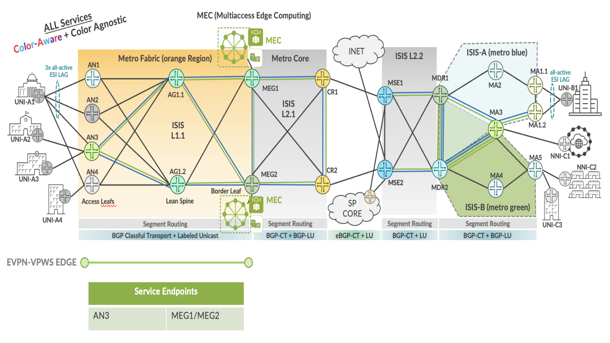

EVPN-VPWS Service implementation in fabric region of EBS topology.

| EVPL Service | Service Attributes Test Results |
|--------------|---------------------------------|

<table style="width:100%;">
<colgroup>
<col style="width: 9%" />
<col style="width: 9%" />
<col style="width: 63%" />
<col style="width: 9%" />
<col style="width: 7%" />
</colgroup>
<thead>
<tr>
<th colspan="5" style="text-align: center;">Non Looping Frame Delivery</th>
</tr>
</thead>
<tbody>
<tr>
<td style="text-align: center;">MEF 3.0 Test Plan</td>
<td style="text-align: center;">Test Case Number</td>
<td>Test Case Name</td>
<td style="text-align: center;">Test Result</td>
<td style="text-align: center;">Comments</td>
</tr>
<tr>
<td rowspan="3" style="text-align: center;">Part 1</td>
<td style="text-align: center;">1.1.1</td>
<td>Non-looping frame delivery, broadcast frames</td>
<td style="text-align: center;">PASS</td>
<td style="text-align: center;">-</td>
</tr>
<tr>
<td style="text-align: center;">1.1.2</td>
<td>Non-looping frame delivery, multicast frames</td>
<td style="text-align: center;">PASS</td>
<td style="text-align: center;">-</td>
</tr>
<tr>
<td style="text-align: center;">1.1.3</td>
<td>Non-looping frame delivery, unknown unicast frames</td>
<td style="text-align: center;">PASS</td>
<td style="text-align: center;">-</td>
</tr>
</tbody>
</table>

<table style="width:100%;">
<colgroup>
<col style="width: 9%" />
<col style="width: 9%" />
<col style="width: 63%" />
<col style="width: 9%" />
<col style="width: 7%" />
</colgroup>
<thead>
<tr>
<th colspan="5" style="text-align: center;">CE-VLAN ID and CE-VLAN CoS Preservation YES</th>
</tr>
</thead>
<tbody>
<tr>
<td style="text-align: center;">MEF 3.0 Test Plan</td>
<td style="text-align: center;">Test Case Number</td>
<td>Test Case Name</td>
<td style="text-align: center;">Test Result</td>
<td style="text-align: center;">Comments</td>
</tr>
<tr>
<td style="text-align: center;">Part 1</td>
<td style="text-align: center;">11.2.1</td>
<td>CE-VLAN ID preservation, tagged frames</td>
<td style="text-align: center;">PASS</td>
<td style="text-align: center;">-</td>
</tr>
</tbody>
</table>

<table>
<colgroup>
<col style="width: 9%" />
<col style="width: 9%" />
<col style="width: 63%" />
<col style="width: 9%" />
<col style="width: 7%" />
</colgroup>
<thead>
<tr>
<th colspan="5" style="text-align: center;">UNI Physical Layer and MAC Layer</th>
</tr>
</thead>
<tbody>
<tr>
<td style="text-align: center;">MEF 3.0 Test Plan</td>
<td style="text-align: center;">Test Case Number</td>
<td>Test Case Name</td>
<td style="text-align: center;">Test Result</td>
<td style="text-align: center;">Comments</td>
</tr>
<tr>
<td style="text-align: center;">Part 1</td>
<td style="text-align: center;">15.2.1</td>
<td>UNI physical layer, mode and speed</td>
<td style="text-align: center;">PASS</td>
<td style="text-align: center;">-</td>
</tr>
</tbody>
</table>

<table>
<colgroup>
<col style="width: 9%" />
<col style="width: 9%" />
<col style="width: 63%" />
<col style="width: 9%" />
<col style="width: 7%" />
</colgroup>
<thead>
<tr>
<th colspan="5" style="text-align: center;">EVC Maximum Transmission Unit Size</th>
</tr>
</thead>
<tbody>
<tr>
<td style="text-align: center;">MEF 3.0 Test Plan</td>
<td style="text-align: center;">Test Case Number</td>
<td>Test Case Name</td>
<td style="text-align: center;">Test Result</td>
<td style="text-align: center;">Comments</td>
</tr>
<tr>
<td style="text-align: center;">Part 1</td>
<td style="text-align: center;">16.2.2</td>
<td>EVC Maximum Service Frame Size - Tagged</td>
<td style="text-align: center;">PASS</td>
<td style="text-align: center;"><strong>-</strong></td>
</tr>
</tbody>
</table>

<table style="width:100%;">
<colgroup>
<col style="width: 9%" />
<col style="width: 9%" />
<col style="width: 63%" />
<col style="width: 9%" />
<col style="width: 7%" />
</colgroup>
<thead>
<tr>
<th colspan="5" style="text-align: center;">CE-VLAN ID/EVC Map</th>
</tr>
</thead>
<tbody>
<tr>
<td style="text-align: center;">MEF 3.0 Test Plan</td>
<td style="text-align: center;">Test Case Number</td>
<td>Test Case Name</td>
<td style="text-align: center;">Test Result</td>
<td style="text-align: center;">Comments</td>
</tr>
<tr>
<td style="text-align: center;">Part 1</td>
<td style="text-align: center;">20.2.1</td>
<td>CE-VLAN ID/EVC Map, Service Frame Discard</td>
<td style="text-align: center;">PASS</td>
<td style="text-align: center;">-</td>
</tr>
</tbody>
</table>

<table>
<colgroup>
<col style="width: 9%" />
<col style="width: 9%" />
<col style="width: 63%" />
<col style="width: 9%" />
<col style="width: 7%" />
</colgroup>
<thead>
<tr>
<th colspan="5" style="text-align: center;">Service OAM</th>
</tr>
</thead>
<tbody>
<tr>
<td style="text-align: center;">MEF 3.0 Test Plan</td>
<td style="text-align: center;">Test Case Number</td>
<td>Test Case Name</td>
<td style="text-align: center;">Test Result</td>
<td style="text-align: center;">Comments</td>
</tr>
<tr>
<td rowspan="6" style="text-align: center;">Part 1</td>
<td style="text-align: center;">1.2.1</td>
<td>Continuity Check Message Transparency - Untagged CCM Service Frame</td>
<td style="text-align: center;">PASS</td>
<td style="text-align: center;">-</td>
</tr>
<tr>
<td style="text-align: center;">2.2.1</td>
<td>Multicast Loopback Message Transparency - Untagged LBM Service Frame</td>
<td style="text-align: center;">PASS</td>
<td style="text-align: center;">-</td>
</tr>
<tr>
<td style="text-align: center;">3.2.1</td>
<td>Unicast Loopback Message Transparency - Untagged LBM Service Frame</td>
<td style="text-align: center;">PASS</td>
<td style="text-align: center;">-</td>
</tr>
<tr>
<td style="text-align: center;">4.2.1</td>
<td>Loopback Response Transparency - Untagged LBR Service Frame</td>
<td style="text-align: center;">PASS</td>
<td style="text-align: center;">-</td>
</tr>
<tr>
<td style="text-align: center;">5.2.1</td>
<td>Linktrace Message Transparency - Untagged LTM Service Frame</td>
<td style="text-align: center;">PASS</td>
<td style="text-align: center;">-</td>
</tr>
<tr>
<td style="text-align: center;">6.2.1</td>
<td>Linktrace Response Transparency - Untagged LTR Service Frame</td>
<td style="text-align: center;">PASS</td>
<td style="text-align: center;">-</td>
</tr>
</tbody>
</table>

<table>
<colgroup>
<col style="width: 9%" />
<col style="width: 9%" />
<col style="width: 64%" />
<col style="width: 8%" />
<col style="width: 8%" />
</colgroup>
<thead>
<tr>
<th colspan="5" style="text-align: center;">Service Frame Transparency</th>
</tr>
</thead>
<tbody>
<tr>
<td style="text-align: center;">MEF 3.0 Test Plan</td>
<td style="text-align: center;">Test Case Number</td>
<td>Test Case Name</td>
<td style="text-align: center;">Test Result</td>
<td style="text-align: center;">Comments</td>
</tr>
<tr>
<td style="text-align: center;">Part 1</td>
<td style="text-align: center;">6.2.1</td>
<td>Service Frame Transparency - Tagged to Tagged</td>
<td style="text-align: center;">PASS</td>
<td style="text-align: center;">-</td>
</tr>
</tbody>
</table>

<table>
<colgroup>
<col style="width: 9%" />
<col style="width: 9%" />
<col style="width: 63%" />
<col style="width: 9%" />
<col style="width: 7%" />
</colgroup>
<thead>
<tr>
<th colspan="5" style="text-align: center;">L2CP Service Frames</th>
</tr>
</thead>
<tbody>
<tr>
<td style="text-align: center;">MEF 3.0 Test Plan</td>
<td style="text-align: center;">Test Case Number</td>
<td>Test Case Name</td>
<td style="text-align: center;">Test Result</td>
<td style="text-align: center;">Comments</td>
</tr>
<tr>
<td rowspan="20" style="text-align: center;">Part 1</td>
<td rowspan="20" style="text-align: center;">E_L_F_2</td>
<td>L2CP Service Frames Must Not Tunnel - 01:80:C2:00:00:01, 0x8808</td>
<td style="text-align: center;">PASS</td>
<td style="text-align: center;">-</td>
</tr>
<tr>
<td>L2CP Service Frames Must Not Tunnel - 01:80:C2:00:00:02, 0x8809/01/02</td>
<td style="text-align: center;">PASS</td>
<td style="text-align: center;">-</td>
</tr>
<tr>
<td>L2CP Service Frames Must Not Tunnel - 01:80:C2:00:00:02, 0x8809/03</td>
<td style="text-align: center;">PASS</td>
<td style="text-align: center;">-</td>
</tr>
<tr>
<td>L2CP Service Frames Must Not Tunnel - 01:80:C2:00:00:02, 0x8809/0A</td>
<td style="text-align: center;">PASS</td>
<td style="text-align: center;">-</td>
</tr>
<tr>
<td>L2CP Service Frames Must Not Tunnel - 01:80:C2:00:00:03, 0x888E</td>
<td style="text-align: center;">PASS</td>
<td style="text-align: center;">-</td>
</tr>
<tr>
<td>L2CP Service Frames Must Not Tunnel - 01:80:C2:00:00:04</td>
<td style="text-align: center;">PASS</td>
<td style="text-align: center;">-</td>
</tr>
<tr>
<td>L2CP Service Frames Must Not Tunnel - 01:80:C2:00:00:05</td>
<td style="text-align: center;">PASS</td>
<td style="text-align: center;">-</td>
</tr>
<tr>
<td>L2CP Service Frames Must Not Tunnel - 01:80:C2:00:00:06</td>
<td style="text-align: center;">PASS</td>
<td style="text-align: center;">-</td>
</tr>
<tr>
<td>L2CP Service Frames Must Not Tunnel - 01:80:C2:00:00:07, 0x88EE</td>
<td style="text-align: center;">PASS</td>
<td style="text-align: center;">-</td>
</tr>
<tr>
<td>L2CP Service Frames Must Not Tunnel - 01:80:C2:00:00:08</td>
<td style="text-align: center;">PASS</td>
<td style="text-align: center;">-</td>
</tr>
<tr>
<td>L2CP Service Frames Must Not Tunnel - 01:80:C2:00:00:09</td>
<td style="text-align: center;">PASS</td>
<td style="text-align: center;">-</td>
</tr>
<tr>
<td>L2CP Service Frames Must Not Tunnel - 01:80:C2:00:00:0A</td>
<td style="text-align: center;">PASS</td>
<td style="text-align: center;">-</td>
</tr>
<tr>
<td>L2CP Service Frames Must Not Tunnel - 01:80:C2:00:00:0E, 0x88CC</td>
<td style="text-align: center;">PASS</td>
<td style="text-align: center;">-</td>
</tr>
<tr>
<td>L2CP Service Frames Must Not Tunnel - 01:80:C2:00:00:0E, 0x88F7</td>
<td style="text-align: center;">PASS</td>
<td style="text-align: center;">-</td>
</tr>
<tr>
<td>L2CP Service Frames Must Not Tunnel - 01:80:C2:00:00:20 through 01:80:C2:00:00:2F</td>
<td style="text-align: center;">PASS</td>
<td style="text-align: center;">-</td>
</tr>
<tr>
<td>L2CP Service Frames Must Not Tunnel - 01:80:C2:00:00:00</td>
<td style="text-align: center;">PASS</td>
<td style="text-align: center;">-</td>
</tr>
<tr>
<td>L2CP Service Frames Must Not Tunnel - 01:80:C2:00:00:0B</td>
<td style="text-align: center;">PASS</td>
<td style="text-align: center;">-</td>
</tr>
<tr>
<td>L2CP Service Frames Must Not Tunnel - 01:80:C2:00:00:0C</td>
<td style="text-align: center;">PASS</td>
<td style="text-align: center;">-</td>
</tr>
<tr>
<td>L2CP Service Frames Must Not Tunnel - 01:80:C2:00:00:0D</td>
<td style="text-align: center;">PASS</td>
<td style="text-align: center;">-</td>
</tr>
<tr>
<td>L2CP Service Frames Must Not Tunnel - 01:80:C2:00:00:0F</td>
<td style="text-align: center;">PASS</td>
<td style="text-align: center;">-</td>
</tr>
</tbody>
</table>

| EVPL SERVICE | Performance Results |
|--------------|---------------------|

<table>
<colgroup>
<col style="width: 9%" />
<col style="width: 9%" />
<col style="width: 10%" />
<col style="width: 10%" />
<col style="width: 10%" />
<col style="width: 8%" />
<col style="width: 7%" />
<col style="width: 13%" />
<col style="width: 10%" />
<col style="width: 10%" />
</colgroup>
<thead>
<tr>
<th colspan="10" style="text-align: center;">One-Way Frame Delay Performance – Performance Tier 1</th>
</tr>
</thead>
<tbody>
<tr>
<td style="text-align: center;">MEF 3.0 Test Plan</td>
<td style="text-align: center;">Test Case Number</td>
<td colspan="6">Test Case Name and Bandwidth Profile Parameters</td>
<td style="text-align: center;">Test Result</td>
<td style="text-align: center;">Comments</td>
</tr>
<tr>
<td rowspan="4" style="text-align: center;">Part 2</td>
<td rowspan="4" style="text-align: center;">1.1.1</td>
<td colspan="6">One-Way Frame Delay Performance with CIR = 3500 Mbps</td>
<td rowspan="4" style="text-align: center;">PASS</td>
<td rowspan="4" style="text-align: center;">-</td>
</tr>
<tr>
<td style="text-align: center;">CIR</td>
<td style="text-align: center;">CBS</td>
<td style="text-align: center;">EIR</td>
<td style="text-align: center;">EBS</td>
<td style="text-align: center;">CM</td>
<td style="text-align: center;">Class of Service</td>
</tr>
<tr>
<td style="text-align: center;">3500 Mbps</td>
<td style="text-align: center;">35000 Bytes</td>
<td style="text-align: center;">0 Mbps</td>
<td style="text-align: center;">0 Bytes</td>
<td style="text-align: center;">Color-Blind</td>
<td style="text-align: center;">High</td>
</tr>
<tr>
<td style="text-align: center;">3500 Mbps</td>
<td style="text-align: center;">35000 Bytes</td>
<td style="text-align: center;">3500 Mbps</td>
<td style="text-align: center;">35000 Bytes</td>
<td style="text-align: center;">Color-Blind</td>
<td style="text-align: center;">Medium</td>
</tr>
</tbody>
</table>

<table>
<colgroup>
<col style="width: 9%" />
<col style="width: 9%" />
<col style="width: 10%" />
<col style="width: 10%" />
<col style="width: 10%" />
<col style="width: 8%" />
<col style="width: 7%" />
<col style="width: 13%" />
<col style="width: 10%" />
<col style="width: 10%" />
</colgroup>
<thead>
<tr>
<th colspan="10" style="text-align: center;">One-Way Mean Frame Delay Performance – Performance Tier 1</th>
</tr>
</thead>
<tbody>
<tr>
<td style="text-align: center;">MEF 3.0 Test Plan</td>
<td style="text-align: center;">Test Case Number</td>
<td colspan="6">Test Case Name and Bandwidth Profile Parameters</td>
<td style="text-align: center;">Test Result</td>
<td style="text-align: center;">Comments</td>
</tr>
<tr>
<td rowspan="4" style="text-align: center;">Part 2</td>
<td rowspan="4" style="text-align: center;">2.1.1</td>
<td colspan="6">One-Way Frame Delay Performance with CIR = 3500 Mbps</td>
<td rowspan="4" style="text-align: center;">PASS</td>
<td rowspan="4" style="text-align: center;">-</td>
</tr>
<tr>
<td style="text-align: center;">CIR</td>
<td style="text-align: center;">CBS</td>
<td style="text-align: center;">EIR</td>
<td style="text-align: center;">EBS</td>
<td style="text-align: center;">CM</td>
<td style="text-align: center;">Class of Service</td>
</tr>
<tr>
<td style="text-align: center;">3500 Mbps</td>
<td style="text-align: center;">35000 Bytes</td>
<td style="text-align: center;">0 Mbps</td>
<td style="text-align: center;">0 Bytes</td>
<td style="text-align: center;">Color-Blind</td>
<td style="text-align: center;">High</td>
</tr>
<tr>
<td style="text-align: center;">3500 Mbps</td>
<td style="text-align: center;">35000 Bytes</td>
<td style="text-align: center;">3500 Mbps</td>
<td style="text-align: center;">35000 Bytes</td>
<td style="text-align: center;">Color-Blind</td>
<td style="text-align: center;">Medium</td>
</tr>
</tbody>
</table>

<table>
<colgroup>
<col style="width: 9%" />
<col style="width: 9%" />
<col style="width: 10%" />
<col style="width: 10%" />
<col style="width: 10%" />
<col style="width: 8%" />
<col style="width: 7%" />
<col style="width: 13%" />
<col style="width: 10%" />
<col style="width: 10%" />
</colgroup>
<thead>
<tr>
<th colspan="10" style="text-align: center;">One-Way Inter-Frame Delay Performance – Performance Tier 1</th>
</tr>
</thead>
<tbody>
<tr>
<td style="text-align: center;">MEF 3.0 Test Plan</td>
<td style="text-align: center;">Test Case Number</td>
<td colspan="6">Test Case Name and Bandwidth Profile Parameters</td>
<td style="text-align: center;">Test Result</td>
<td style="text-align: center;">Comments</td>
</tr>
<tr>
<td rowspan="4" style="text-align: center;">Part 2</td>
<td rowspan="4" style="text-align: center;">3.1.1</td>
<td colspan="6">One-Way Frame Delay Performance with CIR = 3500 Mbps</td>
<td rowspan="4" style="text-align: center;">PASS</td>
<td rowspan="4" style="text-align: center;">-</td>
</tr>
<tr>
<td style="text-align: center;">CIR</td>
<td style="text-align: center;">CBS</td>
<td style="text-align: center;">EIR</td>
<td style="text-align: center;">EBS</td>
<td style="text-align: center;">CM</td>
<td style="text-align: center;">Class of Service</td>
</tr>
<tr>
<td style="text-align: center;">3500 Mbps</td>
<td style="text-align: center;">35000 Bytes</td>
<td style="text-align: center;">0 Mbps</td>
<td style="text-align: center;">0 Bytes</td>
<td style="text-align: center;">Color-Blind</td>
<td style="text-align: center;">High</td>
</tr>
<tr>
<td style="text-align: center;">3500 Mbps</td>
<td style="text-align: center;">35000 Bytes</td>
<td style="text-align: center;">3500 Mbps</td>
<td style="text-align: center;">35000 Bytes</td>
<td style="text-align: center;">Color-Blind</td>
<td style="text-align: center;">Medium</td>
</tr>
</tbody>
</table>

<table>
<colgroup>
<col style="width: 9%" />
<col style="width: 9%" />
<col style="width: 10%" />
<col style="width: 10%" />
<col style="width: 10%" />
<col style="width: 8%" />
<col style="width: 7%" />
<col style="width: 13%" />
<col style="width: 10%" />
<col style="width: 10%" />
</colgroup>
<thead>
<tr>
<th colspan="10" style="text-align: center;">One-Way Frame Delay Range Performance – Performance Tier 1</th>
</tr>
</thead>
<tbody>
<tr>
<td style="text-align: center;">MEF 3.0 Test Plan</td>
<td style="text-align: center;">Test Case Number</td>
<td colspan="6">Test Case Name and Bandwidth Profile Parameters</td>
<td style="text-align: center;">Test Result</td>
<td style="text-align: center;">Comments</td>
</tr>
<tr>
<td rowspan="4" style="text-align: center;">Part 2</td>
<td rowspan="4" style="text-align: center;">4.1.1</td>
<td colspan="6">One-Way Frame Delay Performance with CIR = 3500 Mbps</td>
<td rowspan="4" style="text-align: center;">PASS</td>
<td rowspan="4" style="text-align: center;">-</td>
</tr>
<tr>
<td style="text-align: center;">CIR</td>
<td style="text-align: center;">CBS</td>
<td style="text-align: center;">EIR</td>
<td style="text-align: center;">EBS</td>
<td style="text-align: center;">CM</td>
<td style="text-align: center;">Class of Service</td>
</tr>
<tr>
<td style="text-align: center;">3500 Mbps</td>
<td style="text-align: center;">35000 Bytes</td>
<td style="text-align: center;">0 Mbps</td>
<td style="text-align: center;">0 Bytes</td>
<td style="text-align: center;">Color-Blind</td>
<td style="text-align: center;">High</td>
</tr>
<tr>
<td style="text-align: center;">3500 Mbps</td>
<td style="text-align: center;">35000 Bytes</td>
<td style="text-align: center;">3500 Mbps</td>
<td style="text-align: center;">35000 Bytes</td>
<td style="text-align: center;">Color-Blind</td>
<td style="text-align: center;">Medium</td>
</tr>
</tbody>
</table>

<table>
<colgroup>
<col style="width: 9%" />
<col style="width: 9%" />
<col style="width: 10%" />
<col style="width: 10%" />
<col style="width: 10%" />
<col style="width: 8%" />
<col style="width: 7%" />
<col style="width: 13%" />
<col style="width: 10%" />
<col style="width: 10%" />
</colgroup>
<thead>
<tr>
<th colspan="10" style="text-align: center;">One-Way Frame Loss Performance – Performance Tier 1</th>
</tr>
</thead>
<tbody>
<tr>
<td style="text-align: center;">MEF 3.0 Test Plan</td>
<td style="text-align: center;">Test Case Number</td>
<td colspan="6">Test Case Name and Bandwidth Profile Parameters</td>
<td style="text-align: center;">Test Result</td>
<td style="text-align: center;">Comments</td>
</tr>
<tr>
<td rowspan="4" style="text-align: center;">Part 2</td>
<td rowspan="4" style="text-align: center;">5.1.1</td>
<td colspan="6">One-Way Frame Delay Performance with CIR = 3500 Mbps</td>
<td rowspan="4" style="text-align: center;">PASS</td>
<td rowspan="4" style="text-align: center;">-</td>
</tr>
<tr>
<td style="text-align: center;">CIR</td>
<td style="text-align: center;">CBS</td>
<td style="text-align: center;">EIR</td>
<td style="text-align: center;">EBS</td>
<td style="text-align: center;">CM</td>
<td style="text-align: center;">Class of Service</td>
</tr>
<tr>
<td style="text-align: center;">3500 Mbps</td>
<td style="text-align: center;">35000 Bytes</td>
<td style="text-align: center;">0 Mbps</td>
<td style="text-align: center;">0 Bytes</td>
<td style="text-align: center;">Color-Blind</td>
<td style="text-align: center;">High</td>
</tr>
<tr>
<td style="text-align: center;">3500 Mbps</td>
<td style="text-align: center;">35000 Bytes</td>
<td style="text-align: center;">3500 Mbps</td>
<td style="text-align: center;">35000 Bytes</td>
<td style="text-align: center;">Color-Blind</td>
<td style="text-align: center;">Medium</td>
</tr>
</tbody>
</table>

| EVPL SERVICE | Traffic Management Test Results |
|--------------|---------------------------------|

<table>
<colgroup>
<col style="width: 8%" />
<col style="width: 8%" />
<col style="width: 9%" />
<col style="width: 9%" />
<col style="width: 9%" />
<col style="width: 7%" />
<col style="width: 6%" />
<col style="width: 11%" />
<col style="width: 10%" />
<col style="width: 9%" />
<col style="width: 10%" />
</colgroup>
<thead>
<tr>
<th colspan="11" style="text-align: center;">Ingress Bandwidth Profile - CIR Enforcement</th>
</tr>
</thead>
<tbody>
<tr>
<td style="text-align: center;">MEF 3.0 Test Plan</td>
<td style="text-align: center;">Test Case Number</td>
<td colspan="7">Test Case Name and Bandwidth Profile Parameters</td>
<td style="text-align: center;">Test Result</td>
<td style="text-align: center;">Comments</td>
</tr>
<tr>
<td rowspan="3" style="text-align: center;">Part 2</td>
<td rowspan="3" style="text-align: center;">1.1.6</td>
<td colspan="7">CBS Enforcement Tagged Frames when [CIR/CBS&gt;0 and EIR/EBS=0] and CoS ID per EVC &amp; PCP</td>
<td rowspan="3" style="text-align: center;">PASS</td>
<td rowspan="3" style="text-align: center;">-</td>
</tr>
<tr>
<td style="text-align: center;">CIR</td>
<td style="text-align: center;">CBS</td>
<td style="text-align: center;">EIR</td>
<td style="text-align: center;">EBS</td>
<td style="text-align: center;">CM</td>
<td style="text-align: center;">Class of Service</td>
<td style="text-align: center;">Test Frame sizes</td>
</tr>
<tr>
<td style="text-align: center;">3500 Mbps</td>
<td style="text-align: center;">35000 Bytes</td>
<td style="text-align: center;">0 Mbps</td>
<td style="text-align: center;">0 Bytes</td>
<td style="text-align: center;">Color-Blind</td>
<td style="text-align: center;">High</td>
<td style="text-align: center;">80,600,1500</td>
</tr>
</tbody>
</table>

<table>
<colgroup>
<col style="width: 8%" />
<col style="width: 8%" />
<col style="width: 9%" />
<col style="width: 9%" />
<col style="width: 9%" />
<col style="width: 7%" />
<col style="width: 6%" />
<col style="width: 11%" />
<col style="width: 10%" />
<col style="width: 9%" />
<col style="width: 10%" />
</colgroup>
<thead>
<tr>
<th colspan="11" style="text-align: center;">Ingress Bandwidth Profile - CBS Enforcement</th>
</tr>
</thead>
<tbody>
<tr>
<td style="text-align: center;">MEF 3.0 Test Plan</td>
<td style="text-align: center;">Test Case Number</td>
<td colspan="7">Test Case Name and Bandwidth Profile Parameters</td>
<td style="text-align: center;">Test Result</td>
<td style="text-align: center;">Comments</td>
</tr>
<tr>
<td rowspan="3" style="text-align: center;">Part 2</td>
<td rowspan="3" style="text-align: center;">2.1.6</td>
<td colspan="7">CBS Enforcement Tagged Frames when [CIR/CBS&gt;0 and EIR/EBS=0] and CoS ID per EVC &amp; PCP</td>
<td rowspan="3" style="text-align: center;">PASS</td>
<td rowspan="3" style="text-align: center;">-</td>
</tr>
<tr>
<td style="text-align: center;">CIR</td>
<td style="text-align: center;">CBS</td>
<td style="text-align: center;">EIR</td>
<td style="text-align: center;">EBS</td>
<td style="text-align: center;">CM</td>
<td style="text-align: center;">Class of Service</td>
<td style="text-align: center;">Test Frame sizes</td>
</tr>
<tr>
<td style="text-align: center;">3500 Mbps</td>
<td style="text-align: center;">35000 Bytes</td>
<td style="text-align: center;">0 Mbps</td>
<td style="text-align: center;">0 Bytes</td>
<td style="text-align: center;">Color-Blind</td>
<td style="text-align: center;">High</td>
<td style="text-align: center;">80,600,1500</td>
</tr>
</tbody>
</table>

<table>
<colgroup>
<col style="width: 8%" />
<col style="width: 8%" />
<col style="width: 9%" />
<col style="width: 9%" />
<col style="width: 9%" />
<col style="width: 7%" />
<col style="width: 6%" />
<col style="width: 11%" />
<col style="width: 10%" />
<col style="width: 9%" />
<col style="width: 10%" />
</colgroup>
<thead>
<tr>
<th colspan="11" style="text-align: center;">Ingress Bandwidth Profile - EIR Enforcement</th>
</tr>
</thead>
<tbody>
<tr>
<td style="text-align: center;">MEF 3.0 Test Plan</td>
<td style="text-align: center;">Test Case Number</td>
<td colspan="7">Test Case Name and Bandwidth Profile Parameters</td>
<td style="text-align: center;">Test Result</td>
<td style="text-align: center;">Comments</td>
</tr>
<tr>
<td rowspan="3" style="text-align: center;">Part 2</td>
<td rowspan="3" style="text-align: center;">3.1.6</td>
<td colspan="7">EIR Enforcement Tagged Frames when [CIR/CBS=0 and EIR/EBS&gt;0] and CoS ID per EVC &amp; PCP</td>
<td rowspan="3" style="text-align: center;">PASS</td>
<td rowspan="3" style="text-align: center;">-</td>
</tr>
<tr>
<td style="text-align: center;">CIR</td>
<td style="text-align: center;">CBS</td>
<td style="text-align: center;">EIR</td>
<td style="text-align: center;">EBS</td>
<td style="text-align: center;">CM</td>
<td style="text-align: center;">Class of Service</td>
<td style="text-align: center;">Test Frame sizes</td>
</tr>
<tr>
<td style="text-align: center;">0 Mbps</td>
<td style="text-align: center;">0 Bytes</td>
<td style="text-align: center;">3500 Mbps</td>
<td style="text-align: center;">35000 Bytes</td>
<td style="text-align: center;">Color-Blind</td>
<td style="text-align: center;">Low</td>
<td style="text-align: center;">80,600,1500</td>
</tr>
</tbody>
</table>

<table>
<colgroup>
<col style="width: 8%" />
<col style="width: 8%" />
<col style="width: 9%" />
<col style="width: 9%" />
<col style="width: 9%" />
<col style="width: 7%" />
<col style="width: 6%" />
<col style="width: 11%" />
<col style="width: 10%" />
<col style="width: 9%" />
<col style="width: 10%" />
</colgroup>
<thead>
<tr>
<th colspan="11" style="text-align: center;">Ingress Bandwidth Profile - EBS Enforcement</th>
</tr>
</thead>
<tbody>
<tr>
<td style="text-align: center;">MEF 3.0 Test Plan</td>
<td style="text-align: center;">Test Case Number</td>
<td colspan="7">Test Case Name and Bandwidth Profile Parameters</td>
<td style="text-align: center;">Test Result</td>
<td style="text-align: center;">Comments</td>
</tr>
<tr>
<td rowspan="3" style="text-align: center;">Part 2</td>
<td rowspan="3" style="text-align: center;">4.1.6</td>
<td colspan="7">EBS Enforcement Tagged Frames when [CIR/CBS=0 and EIR/EBS&gt;0] and CoS ID per EVC &amp; PCP</td>
<td rowspan="3" style="text-align: center;">PASS</td>
<td rowspan="3" style="text-align: center;">-</td>
</tr>
<tr>
<td style="text-align: center;">CIR</td>
<td style="text-align: center;">CBS</td>
<td style="text-align: center;">EIR</td>
<td style="text-align: center;">EBS</td>
<td style="text-align: center;">CM</td>
<td style="text-align: center;">Class of Service</td>
<td style="text-align: center;">Test Frame sizes</td>
</tr>
<tr>
<td style="text-align: center;">3500 Mbps</td>
<td style="text-align: center;">35000 Bytes</td>
<td style="text-align: center;">0 Mbps</td>
<td style="text-align: center;">0 Bytes</td>
<td style="text-align: center;">Color-Blind</td>
<td style="text-align: center;">Low</td>
<td style="text-align: center;">80,600,1500</td>
</tr>
</tbody>
</table>

<table>
<colgroup>
<col style="width: 8%" />
<col style="width: 8%" />
<col style="width: 9%" />
<col style="width: 9%" />
<col style="width: 9%" />
<col style="width: 7%" />
<col style="width: 6%" />
<col style="width: 11%" />
<col style="width: 10%" />
<col style="width: 9%" />
<col style="width: 10%" />
</colgroup>
<thead>
<tr>
<th colspan="11" style="text-align: center;">Ingress Bandwidth Profile - CIR and EIR Enforcement</th>
</tr>
</thead>
<tbody>
<tr>
<td style="text-align: center;">MEF 3.0 Test Plan</td>
<td style="text-align: center;">Test Case Number</td>
<td colspan="7">Test Case Name and Bandwidth Profile Parameters</td>
<td style="text-align: center;">Test Result</td>
<td style="text-align: center;">Comments</td>
</tr>
<tr>
<td rowspan="3" style="text-align: center;">Part 2</td>
<td rowspan="3" style="text-align: center;">5.1.6</td>
<td colspan="7">CIR and EIR Enforcement Tagged Frames when [CIR/CBS&gt;0 and EIR/EBS&gt;0] and CoS ID per EVC &amp; PCP</td>
<td rowspan="3" style="text-align: center;">PASS</td>
<td rowspan="3" style="text-align: center;">-</td>
</tr>
<tr>
<td style="text-align: center;">CIR</td>
<td style="text-align: center;">CBS</td>
<td style="text-align: center;">EIR</td>
<td style="text-align: center;">EBS</td>
<td style="text-align: center;">CM</td>
<td style="text-align: center;">Class of Service</td>
<td style="text-align: center;">Test Frame sizes</td>
</tr>
<tr>
<td style="text-align: center;">3500 Mbps</td>
<td style="text-align: center;">35000 Bytes</td>
<td style="text-align: center;">3500 Mbps</td>
<td style="text-align: center;">35000 Bytes</td>
<td style="text-align: center;">Color-Blind</td>
<td style="text-align: center;">Medium</td>
<td style="text-align: center;">80,600,1500</td>
</tr>
</tbody>
</table>

<table>
<colgroup>
<col style="width: 8%" />
<col style="width: 8%" />
<col style="width: 9%" />
<col style="width: 9%" />
<col style="width: 9%" />
<col style="width: 7%" />
<col style="width: 6%" />
<col style="width: 11%" />
<col style="width: 10%" />
<col style="width: 9%" />
<col style="width: 10%" />
</colgroup>
<thead>
<tr>
<th colspan="11" style="text-align: center;">Ingress Bandwidth Profile - CBS and EBS Enforcement</th>
</tr>
</thead>
<tbody>
<tr>
<td style="text-align: center;">MEF 3.0 Test Plan</td>
<td style="text-align: center;">Test Case Number</td>
<td colspan="7">Test Case Name and Bandwidth Profile Parameters</td>
<td style="text-align: center;">Test Result</td>
<td style="text-align: center;">Comments</td>
</tr>
<tr>
<td rowspan="3" style="text-align: center;">Part 2</td>
<td rowspan="3" style="text-align: center;">6.1.6</td>
<td colspan="7">CBS and EBS Enforcement Tagged Frames when [CIR/CBS&gt;0 and EIR/EBS&gt;0] and CoS ID per EVC &amp; PCP</td>
<td rowspan="3" style="text-align: center;">PASS</td>
<td rowspan="3" style="text-align: center;">-</td>
</tr>
<tr>
<td style="text-align: center;">CIR</td>
<td style="text-align: center;">CBS</td>
<td style="text-align: center;">EIR</td>
<td style="text-align: center;">EBS</td>
<td style="text-align: center;">CM</td>
<td style="text-align: center;">Class of Service</td>
<td style="text-align: center;">Test Frame sizes</td>
</tr>
<tr>
<td style="text-align: center;">3500 Mbps</td>
<td style="text-align: center;">35000 Bytes</td>
<td style="text-align: center;">3500 Mbps</td>
<td style="text-align: center;">35000 Bytes</td>
<td style="text-align: center;">Color-Blind</td>
<td style="text-align: center;">Medium</td>
<td style="text-align: center;">80,600,1500</td>
</tr>
</tbody>
</table>

<table>
<colgroup>
<col style="width: 8%" />
<col style="width: 8%" />
<col style="width: 9%" />
<col style="width: 9%" />
<col style="width: 9%" />
<col style="width: 7%" />
<col style="width: 6%" />
<col style="width: 11%" />
<col style="width: 10%" />
<col style="width: 9%" />
<col style="width: 10%" />
</colgroup>
<thead>
<tr>
<th colspan="11" style="text-align: center;">Ingress Bandwidth Profile - Unconditional Delivery of Frames</th>
</tr>
</thead>
<tbody>
<tr>
<td style="text-align: center;">MEF 3.0 Test Plan</td>
<td style="text-align: center;">Test Case Number</td>
<td colspan="7">Test Case Name and Bandwidth Profile Parameters</td>
<td style="text-align: center;">Test Result</td>
<td style="text-align: center;">Comments</td>
</tr>
<tr>
<td rowspan="12" style="text-align: center;">Part 2</td>
<td rowspan="4" style="text-align: center;">7.1.1</td>
<td colspan="7">Unconditional Delivery of Broadcast Frames and CoS ID per EVC &amp; PCP</td>
<td rowspan="4" style="text-align: center;">PASS</td>
<td rowspan="4" style="text-align: center;">-</td>
</tr>
<tr>
<td style="text-align: center;">CIR</td>
<td style="text-align: center;">CBS</td>
<td style="text-align: center;">EIR</td>
<td style="text-align: center;">EBS</td>
<td style="text-align: center;">CM</td>
<td style="text-align: center;">Class of Service</td>
<td style="text-align: center;">Test Frame sizes</td>
</tr>
<tr>
<td style="text-align: center;">3500 Mbps</td>
<td style="text-align: center;">35000 Bytes</td>
<td style="text-align: center;">0 Mbps</td>
<td style="text-align: center;">0 Bytes</td>
<td style="text-align: center;">Color-Blind</td>
<td style="text-align: center;">High</td>
<td style="text-align: center;">80,600,1500</td>
</tr>
<tr>
<td style="text-align: center;">3500 Mbps</td>
<td style="text-align: center;">35000 Bytes</td>
<td style="text-align: center;">3500 Mbps</td>
<td style="text-align: center;">35000 Bytes</td>
<td style="text-align: center;">Color-Blind</td>
<td style="text-align: center;">Medium</td>
<td style="text-align: center;">80,600,1500</td>
</tr>
<tr>
<td rowspan="4" style="text-align: center;">7.1.2</td>
<td colspan="7">Unconditional Delivery of Mutlicast Frames and CoS ID per EVC &amp; PCP</td>
<td rowspan="4" style="text-align: center;">PASS</td>
<td rowspan="4" style="text-align: center;">-</td>
</tr>
<tr>
<td style="text-align: center;">CIR</td>
<td style="text-align: center;">CBS</td>
<td style="text-align: center;">EIR</td>
<td style="text-align: center;">EBS</td>
<td style="text-align: center;">CM</td>
<td style="text-align: center;">Class of Service</td>
<td style="text-align: center;">Test Frame sizes</td>
</tr>
<tr>
<td style="text-align: center;">3500 Mbps</td>
<td style="text-align: center;">35000 Bytes</td>
<td style="text-align: center;">0 Mbps</td>
<td style="text-align: center;">0 Bytes</td>
<td style="text-align: center;">Color-Blind</td>
<td style="text-align: center;">High</td>
<td style="text-align: center;">80,600,1500</td>
</tr>
<tr>
<td style="text-align: center;">3500 Mbps</td>
<td style="text-align: center;">35000 Bytes</td>
<td style="text-align: center;">3500 Mbps</td>
<td style="text-align: center;">35000 Bytes</td>
<td style="text-align: center;">Color-Blind</td>
<td style="text-align: center;">Medium</td>
<td style="text-align: center;">80,600,1500</td>
</tr>
<tr>
<td rowspan="4" style="text-align: center;">7.1.3</td>
<td colspan="7">Unconditional Delivery of Unicast Frames and CoS ID per EVC &amp; PCP</td>
<td rowspan="4" style="text-align: center;">PASS</td>
<td rowspan="4" style="text-align: center;">-</td>
</tr>
<tr>
<td style="text-align: center;">CIR</td>
<td style="text-align: center;">CBS</td>
<td style="text-align: center;">EIR</td>
<td style="text-align: center;">EBS</td>
<td style="text-align: center;">CM</td>
<td style="text-align: center;">Class of Service</td>
<td style="text-align: center;">Test Frame sizes</td>
</tr>
<tr>
<td style="text-align: center;">3500 Mbps</td>
<td style="text-align: center;">35000 Bytes</td>
<td style="text-align: center;">0 Mbps</td>
<td style="text-align: center;">0 Bytes</td>
<td style="text-align: center;">Color-Blind</td>
<td style="text-align: center;">High</td>
<td style="text-align: center;">80,600,1500</td>
</tr>
<tr>
<td style="text-align: center;">3500 Mbps</td>
<td style="text-align: center;">35000 Bytes</td>
<td style="text-align: center;">3500 Mbps</td>
<td style="text-align: center;">35000 Bytes</td>
<td style="text-align: center;">Color-Blind</td>
<td style="text-align: center;">Medium</td>
<td style="text-align: center;">80,600,1500</td>
</tr>
</tbody>
</table>

<table>
<colgroup>
<col style="width: 8%" />
<col style="width: 8%" />
<col style="width: 9%" />
<col style="width: 9%" />
<col style="width: 9%" />
<col style="width: 7%" />
<col style="width: 6%" />
<col style="width: 11%" />
<col style="width: 10%" />
<col style="width: 9%" />
<col style="width: 10%" />
</colgroup>
<thead>
<tr>
<th colspan="11" style="text-align: center;">Ingress Bandwidth Profile - Class of Service Discard</th>
</tr>
</thead>
<tbody>
<tr>
<td style="text-align: center;">MEF 3.0 Test Plan</td>
<td style="text-align: center;">Test Case Number</td>
<td colspan="7">Test Case Name and Bandwidth Profile Parameters</td>
<td style="text-align: center;">Test Result</td>
<td style="text-align: center;">Comments</td>
</tr>
<tr>
<td rowspan="3" style="text-align: center;">Part 2</td>
<td rowspan="3" style="text-align: center;">9.1.1</td>
<td colspan="7">CBS Enforcement Tagged Frames when [CIR/CBS&gt;0 and EIR/EBS=0] and CoS ID per EVC &amp; PCP</td>
<td rowspan="3" style="text-align: center;">PASS</td>
<td rowspan="3" style="text-align: center;">-</td>
</tr>
<tr>
<td style="text-align: center;">CIR</td>
<td style="text-align: center;">CBS</td>
<td style="text-align: center;">EIR</td>
<td style="text-align: center;">EBS</td>
<td style="text-align: center;">CM</td>
<td style="text-align: center;">Class of Service</td>
<td style="text-align: center;">Test Frame sizes</td>
</tr>
<tr>
<td style="text-align: center;">3500 Mbps</td>
<td style="text-align: center;">35000 Bytes</td>
<td style="text-align: center;">0 Mbps</td>
<td style="text-align: center;">0 Bytes</td>
<td style="text-align: center;">Color-Blind</td>
<td style="text-align: center;">High</td>
<td style="text-align: center;">80,600,1500</td>
</tr>
</tbody>
</table>

E-LINE - EVPL

### EVPN-VPWS-MH-E2E:

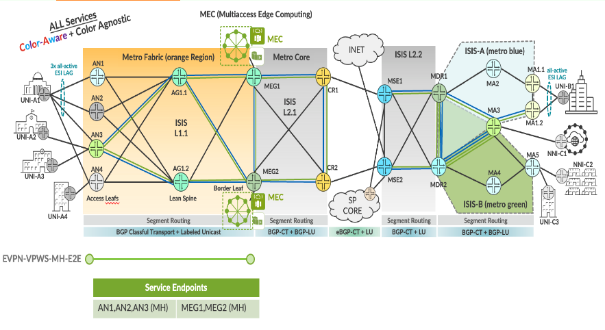

EVPN-VPWS Multi-homing Service implementation in EBS topology.

| EVPL Service | Service Attributes Test Results |
|--------------|---------------------------------|

<table style="width:100%;">
<colgroup>
<col style="width: 9%" />
<col style="width: 9%" />
<col style="width: 63%" />
<col style="width: 9%" />
<col style="width: 7%" />
</colgroup>
<thead>
<tr>
<th colspan="5" style="text-align: center;">Non Looping Frame Delivery</th>
</tr>
</thead>
<tbody>
<tr>
<td style="text-align: center;">MEF 3.0 Test Plan</td>
<td style="text-align: center;">Test Case Number</td>
<td>Test Case Name</td>
<td style="text-align: center;">Test Result</td>
<td style="text-align: center;">Comments</td>
</tr>
<tr>
<td rowspan="3" style="text-align: center;">Part 1</td>
<td style="text-align: center;">1.1.1</td>
<td>Non-looping frame delivery, broadcast frames</td>
<td style="text-align: center;">PASS</td>
<td style="text-align: center;">-</td>
</tr>
<tr>
<td style="text-align: center;">1.1.2</td>
<td>Non-looping frame delivery, multicast frames</td>
<td style="text-align: center;">PASS</td>
<td style="text-align: center;">-</td>
</tr>
<tr>
<td style="text-align: center;">1.1.3</td>
<td>Non-looping frame delivery, unknown unicast frames</td>
<td style="text-align: center;">PASS</td>
<td style="text-align: center;">-</td>
</tr>
</tbody>
</table>

<table style="width:100%;">
<colgroup>
<col style="width: 9%" />
<col style="width: 9%" />
<col style="width: 63%" />
<col style="width: 9%" />
<col style="width: 7%" />
</colgroup>
<thead>
<tr>
<th colspan="5" style="text-align: center;">CE-VLAN ID and CE-VLAN CoS Preservation YES</th>
</tr>
</thead>
<tbody>
<tr>
<td style="text-align: center;">MEF 3.0 Test Plan</td>
<td style="text-align: center;">Test Case Number</td>
<td>Test Case Name</td>
<td style="text-align: center;">Test Result</td>
<td style="text-align: center;">Comments</td>
</tr>
<tr>
<td style="text-align: center;">Part 1</td>
<td style="text-align: center;">11.2.1</td>
<td>CE-VLAN ID preservation, tagged frames</td>
<td style="text-align: center;">PASS</td>
<td style="text-align: center;">-</td>
</tr>
</tbody>
</table>

<table>
<colgroup>
<col style="width: 9%" />
<col style="width: 9%" />
<col style="width: 63%" />
<col style="width: 9%" />
<col style="width: 7%" />
</colgroup>
<thead>
<tr>
<th colspan="5" style="text-align: center;">UNI Physical Layer and MAC Layer</th>
</tr>
</thead>
<tbody>
<tr>
<td style="text-align: center;">MEF 3.0 Test Plan</td>
<td style="text-align: center;">Test Case Number</td>
<td>Test Case Name</td>
<td style="text-align: center;">Test Result</td>
<td style="text-align: center;">Comments</td>
</tr>
<tr>
<td style="text-align: center;">Part 1</td>
<td style="text-align: center;">15.2.1</td>
<td>UNI physical layer, mode and speed</td>
<td style="text-align: center;">PASS</td>
<td style="text-align: center;">-</td>
</tr>
</tbody>
</table>

<table>
<colgroup>
<col style="width: 9%" />
<col style="width: 9%" />
<col style="width: 63%" />
<col style="width: 9%" />
<col style="width: 7%" />
</colgroup>
<thead>
<tr>
<th colspan="5" style="text-align: center;">EVC Maximum Transmission Unit Size</th>
</tr>
</thead>
<tbody>
<tr>
<td style="text-align: center;">MEF 3.0 Test Plan</td>
<td style="text-align: center;">Test Case Number</td>
<td>Test Case Name</td>
<td style="text-align: center;">Test Result</td>
<td style="text-align: center;">Comments</td>
</tr>
<tr>
<td style="text-align: center;">Part 1</td>
<td style="text-align: center;">16.2.2</td>
<td>EVC Maximum Service Frame Size - Tagged</td>
<td style="text-align: center;">PASS</td>
<td style="text-align: center;"><strong>-</strong></td>
</tr>
</tbody>
</table>

<table style="width:100%;">
<colgroup>
<col style="width: 9%" />
<col style="width: 9%" />
<col style="width: 63%" />
<col style="width: 9%" />
<col style="width: 7%" />
</colgroup>
<thead>
<tr>
<th colspan="5" style="text-align: center;">CE-VLAN ID/EVC Map</th>
</tr>
</thead>
<tbody>
<tr>
<td style="text-align: center;">MEF 3.0 Test Plan</td>
<td style="text-align: center;">Test Case Number</td>
<td>Test Case Name</td>
<td style="text-align: center;">Test Result</td>
<td style="text-align: center;">Comments</td>
</tr>
<tr>
<td style="text-align: center;">Part 1</td>
<td style="text-align: center;">20.2.1</td>
<td>CE-VLAN ID/EVC Map, Service Frame Discard</td>
<td style="text-align: center;">PASS</td>
<td style="text-align: center;">-</td>
</tr>
</tbody>
</table>

<table>
<colgroup>
<col style="width: 9%" />
<col style="width: 9%" />
<col style="width: 63%" />
<col style="width: 9%" />
<col style="width: 7%" />
</colgroup>
<thead>
<tr>
<th colspan="5" style="text-align: center;">Service OAM</th>
</tr>
</thead>
<tbody>
<tr>
<td style="text-align: center;">MEF 3.0 Test Plan</td>
<td style="text-align: center;">Test Case Number</td>
<td>Test Case Name</td>
<td style="text-align: center;">Test Result</td>
<td style="text-align: center;">Comments</td>
</tr>
<tr>
<td rowspan="6" style="text-align: center;">Part 1</td>
<td style="text-align: center;">1.2.1</td>
<td>Continuity Check Message Transparency - Untagged CCM Service Frame</td>
<td style="text-align: center;">PASS</td>
<td style="text-align: center;">-</td>
</tr>
<tr>
<td style="text-align: center;">2.2.1</td>
<td>Multicast Loopback Message Transparency - Untagged LBM Service Frame</td>
<td style="text-align: center;">PASS</td>
<td style="text-align: center;">-</td>
</tr>
<tr>
<td style="text-align: center;">3.2.1</td>
<td>Unicast Loopback Message Transparency - Untagged LBM Service Frame</td>
<td style="text-align: center;">PASS</td>
<td style="text-align: center;">-</td>
</tr>
<tr>
<td style="text-align: center;">4.2.1</td>
<td>Loopback Response Transparency - Untagged LBR Service Frame</td>
<td style="text-align: center;">PASS</td>
<td style="text-align: center;">-</td>
</tr>
<tr>
<td style="text-align: center;">5.2.1</td>
<td>Linktrace Message Transparency - Untagged LTM Service Frame</td>
<td style="text-align: center;">PASS</td>
<td style="text-align: center;">-</td>
</tr>
<tr>
<td style="text-align: center;">6.2.1</td>
<td>Linktrace Response Transparency - Untagged LTR Service Frame</td>
<td style="text-align: center;">PASS</td>
<td style="text-align: center;">-</td>
</tr>
</tbody>
</table>

<table>
<colgroup>
<col style="width: 9%" />
<col style="width: 9%" />
<col style="width: 64%" />
<col style="width: 8%" />
<col style="width: 8%" />
</colgroup>
<thead>
<tr>
<th colspan="5" style="text-align: center;">Service Frame Transparency</th>
</tr>
</thead>
<tbody>
<tr>
<td style="text-align: center;">MEF 3.0 Test Plan</td>
<td style="text-align: center;">Test Case Number</td>
<td>Test Case Name</td>
<td style="text-align: center;">Test Result</td>
<td style="text-align: center;">Comments</td>
</tr>
<tr>
<td style="text-align: center;">Part 1</td>
<td style="text-align: center;">6.2.1</td>
<td>Service Frame Transparency - Tagged to Tagged</td>
<td style="text-align: center;">PASS</td>
<td style="text-align: center;">-</td>
</tr>
</tbody>
</table>

<table>
<colgroup>
<col style="width: 9%" />
<col style="width: 9%" />
<col style="width: 63%" />
<col style="width: 9%" />
<col style="width: 7%" />
</colgroup>
<thead>
<tr>
<th colspan="5" style="text-align: center;">L2CP Service Frames</th>
</tr>
</thead>
<tbody>
<tr>
<td style="text-align: center;">MEF 3.0 Test Plan</td>
<td style="text-align: center;">Test Case Number</td>
<td>Test Case Name</td>
<td style="text-align: center;">Test Result</td>
<td style="text-align: center;">Comments</td>
</tr>
<tr>
<td rowspan="20" style="text-align: center;">Part 1</td>
<td rowspan="20" style="text-align: center;">E_L_F_2</td>
<td>L2CP Service Frames Must Not Tunnel - 01:80:C2:00:00:01, 0x8808</td>
<td style="text-align: center;">PASS</td>
<td style="text-align: center;">-</td>
</tr>
<tr>
<td>L2CP Service Frames Must Not Tunnel - 01:80:C2:00:00:02, 0x8809/01/02</td>
<td style="text-align: center;">PASS</td>
<td style="text-align: center;">-</td>
</tr>
<tr>
<td>L2CP Service Frames Must Not Tunnel - 01:80:C2:00:00:02, 0x8809/03</td>
<td style="text-align: center;">PASS</td>
<td style="text-align: center;">-</td>
</tr>
<tr>
<td>L2CP Service Frames Must Not Tunnel - 01:80:C2:00:00:02, 0x8809/0A</td>
<td style="text-align: center;">PASS</td>
<td style="text-align: center;">-</td>
</tr>
<tr>
<td>L2CP Service Frames Must Not Tunnel - 01:80:C2:00:00:03, 0x888E</td>
<td style="text-align: center;">PASS</td>
<td style="text-align: center;">-</td>
</tr>
<tr>
<td>L2CP Service Frames Must Not Tunnel - 01:80:C2:00:00:04</td>
<td style="text-align: center;">PASS</td>
<td style="text-align: center;">-</td>
</tr>
<tr>
<td>L2CP Service Frames Must Not Tunnel - 01:80:C2:00:00:05</td>
<td style="text-align: center;">PASS</td>
<td style="text-align: center;">-</td>
</tr>
<tr>
<td>L2CP Service Frames Must Not Tunnel - 01:80:C2:00:00:06</td>
<td style="text-align: center;">PASS</td>
<td style="text-align: center;">-</td>
</tr>
<tr>
<td>L2CP Service Frames Must Not Tunnel - 01:80:C2:00:00:07, 0x88EE</td>
<td style="text-align: center;">PASS</td>
<td style="text-align: center;">-</td>
</tr>
<tr>
<td>L2CP Service Frames Must Not Tunnel - 01:80:C2:00:00:08</td>
<td style="text-align: center;">PASS</td>
<td style="text-align: center;">-</td>
</tr>
<tr>
<td>L2CP Service Frames Must Not Tunnel - 01:80:C2:00:00:09</td>
<td style="text-align: center;">PASS</td>
<td style="text-align: center;">-</td>
</tr>
<tr>
<td>L2CP Service Frames Must Not Tunnel - 01:80:C2:00:00:0A</td>
<td style="text-align: center;">PASS</td>
<td style="text-align: center;">-</td>
</tr>
<tr>
<td>L2CP Service Frames Must Not Tunnel - 01:80:C2:00:00:0E, 0x88CC</td>
<td style="text-align: center;">PASS</td>
<td style="text-align: center;">-</td>
</tr>
<tr>
<td>L2CP Service Frames Must Not Tunnel - 01:80:C2:00:00:0E, 0x88F7</td>
<td style="text-align: center;">PASS</td>
<td style="text-align: center;">-</td>
</tr>
<tr>
<td>L2CP Service Frames Must Not Tunnel - 01:80:C2:00:00:20 through 01:80:C2:00:00:2F</td>
<td style="text-align: center;">PASS</td>
<td style="text-align: center;">-</td>
</tr>
<tr>
<td>L2CP Service Frames Must Not Tunnel - 01:80:C2:00:00:00</td>
<td style="text-align: center;">PASS</td>
<td style="text-align: center;">-</td>
</tr>
<tr>
<td>L2CP Service Frames Must Not Tunnel - 01:80:C2:00:00:0B</td>
<td style="text-align: center;">PASS</td>
<td style="text-align: center;">-</td>
</tr>
<tr>
<td>L2CP Service Frames Must Not Tunnel - 01:80:C2:00:00:0C</td>
<td style="text-align: center;">PASS</td>
<td style="text-align: center;">-</td>
</tr>
<tr>
<td>L2CP Service Frames Must Not Tunnel - 01:80:C2:00:00:0D</td>
<td style="text-align: center;">PASS</td>
<td style="text-align: center;">-</td>
</tr>
<tr>
<td>L2CP Service Frames Must Not Tunnel - 01:80:C2:00:00:0F</td>
<td style="text-align: center;">PASS</td>
<td style="text-align: center;">-</td>
</tr>
</tbody>
</table>

| EVPL SERVICE | Performance Results |
|--------------|---------------------|

<table>
<colgroup>
<col style="width: 9%" />
<col style="width: 9%" />
<col style="width: 10%" />
<col style="width: 10%" />
<col style="width: 10%" />
<col style="width: 8%" />
<col style="width: 7%" />
<col style="width: 13%" />
<col style="width: 10%" />
<col style="width: 10%" />
</colgroup>
<thead>
<tr>
<th colspan="10" style="text-align: center;">One-Way Frame Delay Performance – Performance Tier 1</th>
</tr>
</thead>
<tbody>
<tr>
<td style="text-align: center;">MEF 3.0 Test Plan</td>
<td style="text-align: center;">Test Case Number</td>
<td colspan="6">Test Case Name and Bandwidth Profile Parameters</td>
<td style="text-align: center;">Test Result</td>
<td style="text-align: center;">Comments</td>
</tr>
<tr>
<td rowspan="4" style="text-align: center;">Part 2</td>
<td rowspan="4" style="text-align: center;">1.1.1</td>
<td colspan="6">One-Way Frame Delay Performance with CIR = 3500 Mbps</td>
<td rowspan="4" style="text-align: center;">PASS</td>
<td rowspan="4" style="text-align: center;">-</td>
</tr>
<tr>
<td style="text-align: center;">CIR</td>
<td style="text-align: center;">CBS</td>
<td style="text-align: center;">EIR</td>
<td style="text-align: center;">EBS</td>
<td style="text-align: center;">CM</td>
<td style="text-align: center;">Class of Service</td>
</tr>
<tr>
<td style="text-align: center;">3500 Mbps</td>
<td style="text-align: center;">35000 Bytes</td>
<td style="text-align: center;">0 Mbps</td>
<td style="text-align: center;">0 Bytes</td>
<td style="text-align: center;">Color-Blind</td>
<td style="text-align: center;">High</td>
</tr>
<tr>
<td style="text-align: center;">3500 Mbps</td>
<td style="text-align: center;">35000 Bytes</td>
<td style="text-align: center;">3500 Mbps</td>
<td style="text-align: center;">35000 Bytes</td>
<td style="text-align: center;">Color-Blind</td>
<td style="text-align: center;">Medium</td>
</tr>
</tbody>
</table>

<table>
<colgroup>
<col style="width: 9%" />
<col style="width: 9%" />
<col style="width: 10%" />
<col style="width: 10%" />
<col style="width: 10%" />
<col style="width: 8%" />
<col style="width: 7%" />
<col style="width: 13%" />
<col style="width: 10%" />
<col style="width: 10%" />
</colgroup>
<thead>
<tr>
<th colspan="10" style="text-align: center;">One-Way Mean Frame Delay Performance – Performance Tier 1</th>
</tr>
</thead>
<tbody>
<tr>
<td style="text-align: center;">MEF 3.0 Test Plan</td>
<td style="text-align: center;">Test Case Number</td>
<td colspan="6">Test Case Name and Bandwidth Profile Parameters</td>
<td style="text-align: center;">Test Result</td>
<td style="text-align: center;">Comments</td>
</tr>
<tr>
<td rowspan="4" style="text-align: center;">Part 2</td>
<td rowspan="4" style="text-align: center;">2.1.1</td>
<td colspan="6">One-Way Frame Delay Performance with CIR = 3500 Mbps</td>
<td rowspan="4" style="text-align: center;">PASS</td>
<td rowspan="4" style="text-align: center;">-</td>
</tr>
<tr>
<td style="text-align: center;">CIR</td>
<td style="text-align: center;">CBS</td>
<td style="text-align: center;">EIR</td>
<td style="text-align: center;">EBS</td>
<td style="text-align: center;">CM</td>
<td style="text-align: center;">Class of Service</td>
</tr>
<tr>
<td style="text-align: center;">3500 Mbps</td>
<td style="text-align: center;">35000 Bytes</td>
<td style="text-align: center;">0 Mbps</td>
<td style="text-align: center;">0 Bytes</td>
<td style="text-align: center;">Color-Blind</td>
<td style="text-align: center;">High</td>
</tr>
<tr>
<td style="text-align: center;">3500 Mbps</td>
<td style="text-align: center;">35000 Bytes</td>
<td style="text-align: center;">3500 Mbps</td>
<td style="text-align: center;">35000 Bytes</td>
<td style="text-align: center;">Color-Blind</td>
<td style="text-align: center;">Medium</td>
</tr>
</tbody>
</table>

<table>
<colgroup>
<col style="width: 9%" />
<col style="width: 9%" />
<col style="width: 10%" />
<col style="width: 10%" />
<col style="width: 10%" />
<col style="width: 8%" />
<col style="width: 7%" />
<col style="width: 13%" />
<col style="width: 10%" />
<col style="width: 10%" />
</colgroup>
<thead>
<tr>
<th colspan="10" style="text-align: center;">One-Way Inter-Frame Delay Performance – Performance Tier 1</th>
</tr>
</thead>
<tbody>
<tr>
<td style="text-align: center;">MEF 3.0 Test Plan</td>
<td style="text-align: center;">Test Case Number</td>
<td colspan="6">Test Case Name and Bandwidth Profile Parameters</td>
<td style="text-align: center;">Test Result</td>
<td style="text-align: center;">Comments</td>
</tr>
<tr>
<td rowspan="4" style="text-align: center;">Part 2</td>
<td rowspan="4" style="text-align: center;">3.1.1</td>
<td colspan="6">One-Way Frame Delay Performance with CIR = 3500 Mbps</td>
<td rowspan="4" style="text-align: center;">PASS</td>
<td rowspan="4" style="text-align: center;">-</td>
</tr>
<tr>
<td style="text-align: center;">CIR</td>
<td style="text-align: center;">CBS</td>
<td style="text-align: center;">EIR</td>
<td style="text-align: center;">EBS</td>
<td style="text-align: center;">CM</td>
<td style="text-align: center;">Class of Service</td>
</tr>
<tr>
<td style="text-align: center;">3500 Mbps</td>
<td style="text-align: center;">35000 Bytes</td>
<td style="text-align: center;">0 Mbps</td>
<td style="text-align: center;">0 Bytes</td>
<td style="text-align: center;">Color-Blind</td>
<td style="text-align: center;">High</td>
</tr>
<tr>
<td style="text-align: center;">3500 Mbps</td>
<td style="text-align: center;">35000 Bytes</td>
<td style="text-align: center;">3500 Mbps</td>
<td style="text-align: center;">35000 Bytes</td>
<td style="text-align: center;">Color-Blind</td>
<td style="text-align: center;">Medium</td>
</tr>
</tbody>
</table>

<table>
<colgroup>
<col style="width: 9%" />
<col style="width: 9%" />
<col style="width: 10%" />
<col style="width: 10%" />
<col style="width: 10%" />
<col style="width: 8%" />
<col style="width: 7%" />
<col style="width: 13%" />
<col style="width: 10%" />
<col style="width: 10%" />
</colgroup>
<thead>
<tr>
<th colspan="10" style="text-align: center;">One-Way Frame Delay Range Performance – Performance Tier 1</th>
</tr>
</thead>
<tbody>
<tr>
<td style="text-align: center;">MEF 3.0 Test Plan</td>
<td style="text-align: center;">Test Case Number</td>
<td colspan="6">Test Case Name and Bandwidth Profile Parameters</td>
<td style="text-align: center;">Test Result</td>
<td style="text-align: center;">Comments</td>
</tr>
<tr>
<td rowspan="4" style="text-align: center;">Part 2</td>
<td rowspan="4" style="text-align: center;">4.1.1</td>
<td colspan="6">One-Way Frame Delay Performance with CIR = 3500 Mbps</td>
<td rowspan="4" style="text-align: center;">PASS</td>
<td rowspan="4" style="text-align: center;">-</td>
</tr>
<tr>
<td style="text-align: center;">CIR</td>
<td style="text-align: center;">CBS</td>
<td style="text-align: center;">EIR</td>
<td style="text-align: center;">EBS</td>
<td style="text-align: center;">CM</td>
<td style="text-align: center;">Class of Service</td>
</tr>
<tr>
<td style="text-align: center;">3500 Mbps</td>
<td style="text-align: center;">35000 Bytes</td>
<td style="text-align: center;">0 Mbps</td>
<td style="text-align: center;">0 Bytes</td>
<td style="text-align: center;">Color-Blind</td>
<td style="text-align: center;">High</td>
</tr>
<tr>
<td style="text-align: center;">3500 Mbps</td>
<td style="text-align: center;">35000 Bytes</td>
<td style="text-align: center;">3500 Mbps</td>
<td style="text-align: center;">35000 Bytes</td>
<td style="text-align: center;">Color-Blind</td>
<td style="text-align: center;">Medium</td>
</tr>
</tbody>
</table>

<table>
<colgroup>
<col style="width: 9%" />
<col style="width: 9%" />
<col style="width: 10%" />
<col style="width: 10%" />
<col style="width: 10%" />
<col style="width: 8%" />
<col style="width: 7%" />
<col style="width: 13%" />
<col style="width: 10%" />
<col style="width: 10%" />
</colgroup>
<thead>
<tr>
<th colspan="10" style="text-align: center;">One-Way Frame Loss Performance – Performance Tier 1</th>
</tr>
</thead>
<tbody>
<tr>
<td style="text-align: center;">MEF 3.0 Test Plan</td>
<td style="text-align: center;">Test Case Number</td>
<td colspan="6">Test Case Name and Bandwidth Profile Parameters</td>
<td style="text-align: center;">Test Result</td>
<td style="text-align: center;">Comments</td>
</tr>
<tr>
<td rowspan="4" style="text-align: center;">Part 2</td>
<td rowspan="4" style="text-align: center;">5.1.1</td>
<td colspan="6">One-Way Frame Delay Performance with CIR = 3500 Mbps</td>
<td rowspan="4" style="text-align: center;">PASS</td>
<td rowspan="4" style="text-align: center;">-</td>
</tr>
<tr>
<td style="text-align: center;">CIR</td>
<td style="text-align: center;">CBS</td>
<td style="text-align: center;">EIR</td>
<td style="text-align: center;">EBS</td>
<td style="text-align: center;">CM</td>
<td style="text-align: center;">Class of Service</td>
</tr>
<tr>
<td style="text-align: center;">3500 Mbps</td>
<td style="text-align: center;">35000 Bytes</td>
<td style="text-align: center;">0 Mbps</td>
<td style="text-align: center;">0 Bytes</td>
<td style="text-align: center;">Color-Blind</td>
<td style="text-align: center;">High</td>
</tr>
<tr>
<td style="text-align: center;">3500 Mbps</td>
<td style="text-align: center;">35000 Bytes</td>
<td style="text-align: center;">3500 Mbps</td>
<td style="text-align: center;">35000 Bytes</td>
<td style="text-align: center;">Color-Blind</td>
<td style="text-align: center;">Medium</td>
</tr>
</tbody>
</table>

| EVPL SERVICE | Traffic Management Test Results |
|--------------|---------------------------------|

<table>
<colgroup>
<col style="width: 8%" />
<col style="width: 8%" />
<col style="width: 9%" />
<col style="width: 9%" />
<col style="width: 9%" />
<col style="width: 7%" />
<col style="width: 6%" />
<col style="width: 11%" />
<col style="width: 10%" />
<col style="width: 9%" />
<col style="width: 10%" />
</colgroup>
<thead>
<tr>
<th colspan="11" style="text-align: center;">Ingress Bandwidth Profile - CIR Enforcement</th>
</tr>
</thead>
<tbody>
<tr>
<td style="text-align: center;">MEF 3.0 Test Plan</td>
<td style="text-align: center;">Test Case Number</td>
<td colspan="7">Test Case Name and Bandwidth Profile Parameters</td>
<td style="text-align: center;">Test Result</td>
<td style="text-align: center;">Comments</td>
</tr>
<tr>
<td rowspan="3" style="text-align: center;">Part 2</td>
<td rowspan="3" style="text-align: center;">1.1.6</td>
<td colspan="7">CBS Enforcement Tagged Frames when [CIR/CBS&gt;0 and EIR/EBS=0] and CoS ID per EVC &amp; PCP</td>
<td rowspan="3" style="text-align: center;">PASS</td>
<td rowspan="3" style="text-align: center;">-</td>
</tr>
<tr>
<td style="text-align: center;">CIR</td>
<td style="text-align: center;">CBS</td>
<td style="text-align: center;">EIR</td>
<td style="text-align: center;">EBS</td>
<td style="text-align: center;">CM</td>
<td style="text-align: center;">Class of Service</td>
<td style="text-align: center;">Test Frame sizes</td>
</tr>
<tr>
<td style="text-align: center;">3500 Mbps</td>
<td style="text-align: center;">35000 Bytes</td>
<td style="text-align: center;">0 Mbps</td>
<td style="text-align: center;">0 Bytes</td>
<td style="text-align: center;">Color-Blind</td>
<td style="text-align: center;">High</td>
<td style="text-align: center;">80,600,1500</td>
</tr>
</tbody>
</table>

<table>
<colgroup>
<col style="width: 8%" />
<col style="width: 8%" />
<col style="width: 9%" />
<col style="width: 9%" />
<col style="width: 9%" />
<col style="width: 7%" />
<col style="width: 6%" />
<col style="width: 11%" />
<col style="width: 10%" />
<col style="width: 9%" />
<col style="width: 10%" />
</colgroup>
<thead>
<tr>
<th colspan="11" style="text-align: center;">Ingress Bandwidth Profile - CBS Enforcement</th>
</tr>
</thead>
<tbody>
<tr>
<td style="text-align: center;">MEF 3.0 Test Plan</td>
<td style="text-align: center;">Test Case Number</td>
<td colspan="7">Test Case Name and Bandwidth Profile Parameters</td>
<td style="text-align: center;">Test Result</td>
<td style="text-align: center;">Comments</td>
</tr>
<tr>
<td rowspan="3" style="text-align: center;">Part 2</td>
<td rowspan="3" style="text-align: center;">2.1.6</td>
<td colspan="7">CBS Enforcement Tagged Frames when [CIR/CBS&gt;0 and EIR/EBS=0] and CoS ID per EVC &amp; PCP</td>
<td rowspan="3" style="text-align: center;">PASS</td>
<td rowspan="3" style="text-align: center;">-</td>
</tr>
<tr>
<td style="text-align: center;">CIR</td>
<td style="text-align: center;">CBS</td>
<td style="text-align: center;">EIR</td>
<td style="text-align: center;">EBS</td>
<td style="text-align: center;">CM</td>
<td style="text-align: center;">Class of Service</td>
<td style="text-align: center;">Test Frame sizes</td>
</tr>
<tr>
<td style="text-align: center;">3500 Mbps</td>
<td style="text-align: center;">35000 Bytes</td>
<td style="text-align: center;">0 Mbps</td>
<td style="text-align: center;">0 Bytes</td>
<td style="text-align: center;">Color-Blind</td>
<td style="text-align: center;">High</td>
<td style="text-align: center;">80,600,1500</td>
</tr>
</tbody>
</table>

<table>
<colgroup>
<col style="width: 8%" />
<col style="width: 8%" />
<col style="width: 9%" />
<col style="width: 9%" />
<col style="width: 9%" />
<col style="width: 7%" />
<col style="width: 6%" />
<col style="width: 11%" />
<col style="width: 10%" />
<col style="width: 9%" />
<col style="width: 10%" />
</colgroup>
<thead>
<tr>
<th colspan="11" style="text-align: center;">Ingress Bandwidth Profile - EIR Enforcement</th>
</tr>
</thead>
<tbody>
<tr>
<td style="text-align: center;">MEF 3.0 Test Plan</td>
<td style="text-align: center;">Test Case Number</td>
<td colspan="7">Test Case Name and Bandwidth Profile Parameters</td>
<td style="text-align: center;">Test Result</td>
<td style="text-align: center;">Comments</td>
</tr>
<tr>
<td rowspan="3" style="text-align: center;">Part 2</td>
<td rowspan="3" style="text-align: center;">3.1.6</td>
<td colspan="7">EIR Enforcement Tagged Frames when [CIR/CBS=0 and EIR/EBS&gt;0] and CoS ID per EVC &amp; PCP</td>
<td rowspan="3" style="text-align: center;">PASS</td>
<td rowspan="3" style="text-align: center;">-</td>
</tr>
<tr>
<td style="text-align: center;">CIR</td>
<td style="text-align: center;">CBS</td>
<td style="text-align: center;">EIR</td>
<td style="text-align: center;">EBS</td>
<td style="text-align: center;">CM</td>
<td style="text-align: center;">Class of Service</td>
<td style="text-align: center;">Test Frame sizes</td>
</tr>
<tr>
<td style="text-align: center;">0 Mbps</td>
<td style="text-align: center;">0 Bytes</td>
<td style="text-align: center;">3500 Mbps</td>
<td style="text-align: center;">35000 Bytes</td>
<td style="text-align: center;">Color-Blind</td>
<td style="text-align: center;">Low</td>
<td style="text-align: center;">80,600,1500</td>
</tr>
</tbody>
</table>

<table>
<colgroup>
<col style="width: 8%" />
<col style="width: 8%" />
<col style="width: 9%" />
<col style="width: 9%" />
<col style="width: 9%" />
<col style="width: 7%" />
<col style="width: 6%" />
<col style="width: 11%" />
<col style="width: 10%" />
<col style="width: 9%" />
<col style="width: 10%" />
</colgroup>
<thead>
<tr>
<th colspan="11" style="text-align: center;">Ingress Bandwidth Profile - EBS Enforcement</th>
</tr>
</thead>
<tbody>
<tr>
<td style="text-align: center;">MEF 3.0 Test Plan</td>
<td style="text-align: center;">Test Case Number</td>
<td colspan="7">Test Case Name and Bandwidth Profile Parameters</td>
<td style="text-align: center;">Test Result</td>
<td style="text-align: center;">Comments</td>
</tr>
<tr>
<td rowspan="3" style="text-align: center;">Part 2</td>
<td rowspan="3" style="text-align: center;">4.1.6</td>
<td colspan="7">EBS Enforcement Tagged Frames when [CIR/CBS=0 and EIR/EBS&gt;0] and CoS ID per EVC &amp; PCP</td>
<td rowspan="3" style="text-align: center;">PASS</td>
<td rowspan="3" style="text-align: center;">-</td>
</tr>
<tr>
<td style="text-align: center;">CIR</td>
<td style="text-align: center;">CBS</td>
<td style="text-align: center;">EIR</td>
<td style="text-align: center;">EBS</td>
<td style="text-align: center;">CM</td>
<td style="text-align: center;">Class of Service</td>
<td style="text-align: center;">Test Frame sizes</td>
</tr>
<tr>
<td style="text-align: center;">3500 Mbps</td>
<td style="text-align: center;">35000 Bytes</td>
<td style="text-align: center;">0 Mbps</td>
<td style="text-align: center;">0 Bytes</td>
<td style="text-align: center;">Color-Blind</td>
<td style="text-align: center;">Low</td>
<td style="text-align: center;">80,600,1500</td>
</tr>
</tbody>
</table>

<table>
<colgroup>
<col style="width: 8%" />
<col style="width: 8%" />
<col style="width: 9%" />
<col style="width: 9%" />
<col style="width: 9%" />
<col style="width: 7%" />
<col style="width: 6%" />
<col style="width: 11%" />
<col style="width: 10%" />
<col style="width: 9%" />
<col style="width: 10%" />
</colgroup>
<thead>
<tr>
<th colspan="11" style="text-align: center;">Ingress Bandwidth Profile - CIR and EIR Enforcement</th>
</tr>
</thead>
<tbody>
<tr>
<td style="text-align: center;">MEF 3.0 Test Plan</td>
<td style="text-align: center;">Test Case Number</td>
<td colspan="7">Test Case Name and Bandwidth Profile Parameters</td>
<td style="text-align: center;">Test Result</td>
<td style="text-align: center;">Comments</td>
</tr>
<tr>
<td rowspan="3" style="text-align: center;">Part 2</td>
<td rowspan="3" style="text-align: center;">5.1.6</td>
<td colspan="7">CIR and EIR Enforcement Tagged Frames when [CIR/CBS&gt;0 and EIR/EBS&gt;0] and CoS ID per EVC &amp; PCP</td>
<td rowspan="3" style="text-align: center;">PASS</td>
<td rowspan="3" style="text-align: center;">-</td>
</tr>
<tr>
<td style="text-align: center;">CIR</td>
<td style="text-align: center;">CBS</td>
<td style="text-align: center;">EIR</td>
<td style="text-align: center;">EBS</td>
<td style="text-align: center;">CM</td>
<td style="text-align: center;">Class of Service</td>
<td style="text-align: center;">Test Frame sizes</td>
</tr>
<tr>
<td style="text-align: center;">3500 Mbps</td>
<td style="text-align: center;">35000 Bytes</td>
<td style="text-align: center;">3500 Mbps</td>
<td style="text-align: center;">35000 Bytes</td>
<td style="text-align: center;">Color-Blind</td>
<td style="text-align: center;">Medium</td>
<td style="text-align: center;">80,600,1500</td>
</tr>
</tbody>
</table>

<table>
<colgroup>
<col style="width: 8%" />
<col style="width: 8%" />
<col style="width: 9%" />
<col style="width: 9%" />
<col style="width: 9%" />
<col style="width: 7%" />
<col style="width: 6%" />
<col style="width: 11%" />
<col style="width: 10%" />
<col style="width: 9%" />
<col style="width: 10%" />
</colgroup>
<thead>
<tr>
<th colspan="11" style="text-align: center;">Ingress Bandwidth Profile - CBS and EBS Enforcement</th>
</tr>
</thead>
<tbody>
<tr>
<td style="text-align: center;">MEF 3.0 Test Plan</td>
<td style="text-align: center;">Test Case Number</td>
<td colspan="7">Test Case Name and Bandwidth Profile Parameters</td>
<td style="text-align: center;">Test Result</td>
<td style="text-align: center;">Comments</td>
</tr>
<tr>
<td rowspan="3" style="text-align: center;">Part 2</td>
<td rowspan="3" style="text-align: center;">6.1.6</td>
<td colspan="7">CBS and EBS Enforcement Tagged Frames when [CIR/CBS&gt;0 and EIR/EBS&gt;0] and CoS ID per EVC &amp; PCP</td>
<td rowspan="3" style="text-align: center;">PASS</td>
<td rowspan="3" style="text-align: center;">-</td>
</tr>
<tr>
<td style="text-align: center;">CIR</td>
<td style="text-align: center;">CBS</td>
<td style="text-align: center;">EIR</td>
<td style="text-align: center;">EBS</td>
<td style="text-align: center;">CM</td>
<td style="text-align: center;">Class of Service</td>
<td style="text-align: center;">Test Frame sizes</td>
</tr>
<tr>
<td style="text-align: center;">3500 Mbps</td>
<td style="text-align: center;">35000 Bytes</td>
<td style="text-align: center;">3500 Mbps</td>
<td style="text-align: center;">35000 Bytes</td>
<td style="text-align: center;">Color-Blind</td>
<td style="text-align: center;">Medium</td>
<td style="text-align: center;">80,600,1500</td>
</tr>
</tbody>
</table>

<table>
<colgroup>
<col style="width: 8%" />
<col style="width: 8%" />
<col style="width: 9%" />
<col style="width: 9%" />
<col style="width: 9%" />
<col style="width: 7%" />
<col style="width: 6%" />
<col style="width: 11%" />
<col style="width: 10%" />
<col style="width: 9%" />
<col style="width: 10%" />
</colgroup>
<thead>
<tr>
<th colspan="11" style="text-align: center;">Ingress Bandwidth Profile - Unconditional Delivery of Frames</th>
</tr>
</thead>
<tbody>
<tr>
<td style="text-align: center;">MEF 3.0 Test Plan</td>
<td style="text-align: center;">Test Case Number</td>
<td colspan="7">Test Case Name and Bandwidth Profile Parameters</td>
<td style="text-align: center;">Test Result</td>
<td style="text-align: center;">Comments</td>
</tr>
<tr>
<td rowspan="12" style="text-align: center;">Part 2</td>
<td rowspan="4" style="text-align: center;">7.1.1</td>
<td colspan="7">Unconditional Delivery of Broadcast Frames and CoS ID per EVC &amp; PCP</td>
<td rowspan="4" style="text-align: center;">PASS</td>
<td rowspan="4" style="text-align: center;">-</td>
</tr>
<tr>
<td style="text-align: center;">CIR</td>
<td style="text-align: center;">CBS</td>
<td style="text-align: center;">EIR</td>
<td style="text-align: center;">EBS</td>
<td style="text-align: center;">CM</td>
<td style="text-align: center;">Class of Service</td>
<td style="text-align: center;">Test Frame sizes</td>
</tr>
<tr>
<td style="text-align: center;">3500 Mbps</td>
<td style="text-align: center;">35000 Bytes</td>
<td style="text-align: center;">0 Mbps</td>
<td style="text-align: center;">0 Bytes</td>
<td style="text-align: center;">Color-Blind</td>
<td style="text-align: center;">High</td>
<td style="text-align: center;">80,600,1500</td>
</tr>
<tr>
<td style="text-align: center;">3500 Mbps</td>
<td style="text-align: center;">35000 Bytes</td>
<td style="text-align: center;">3500 Mbps</td>
<td style="text-align: center;">35000 Bytes</td>
<td style="text-align: center;">Color-Blind</td>
<td style="text-align: center;">Medium</td>
<td style="text-align: center;">80,600,1500</td>
</tr>
<tr>
<td rowspan="4" style="text-align: center;">7.1.2</td>
<td colspan="7">Unconditional Delivery of Mutlicast Frames and CoS ID per EVC &amp; PCP</td>
<td rowspan="4" style="text-align: center;">PASS</td>
<td rowspan="4" style="text-align: center;">-</td>
</tr>
<tr>
<td style="text-align: center;">CIR</td>
<td style="text-align: center;">CBS</td>
<td style="text-align: center;">EIR</td>
<td style="text-align: center;">EBS</td>
<td style="text-align: center;">CM</td>
<td style="text-align: center;">Class of Service</td>
<td style="text-align: center;">Test Frame sizes</td>
</tr>
<tr>
<td style="text-align: center;">3500 Mbps</td>
<td style="text-align: center;">35000 Bytes</td>
<td style="text-align: center;">0 Mbps</td>
<td style="text-align: center;">0 Bytes</td>
<td style="text-align: center;">Color-Blind</td>
<td style="text-align: center;">High</td>
<td style="text-align: center;">80,600,1500</td>
</tr>
<tr>
<td style="text-align: center;">3500 Mbps</td>
<td style="text-align: center;">35000 Bytes</td>
<td style="text-align: center;">3500 Mbps</td>
<td style="text-align: center;">35000 Bytes</td>
<td style="text-align: center;">Color-Blind</td>
<td style="text-align: center;">Medium</td>
<td style="text-align: center;">80,600,1500</td>
</tr>
<tr>
<td rowspan="4" style="text-align: center;">7.1.3</td>
<td colspan="7">Unconditional Delivery of Unicast Frames and CoS ID per EVC &amp; PCP</td>
<td rowspan="4" style="text-align: center;">PASS</td>
<td rowspan="4" style="text-align: center;">-</td>
</tr>
<tr>
<td style="text-align: center;">CIR</td>
<td style="text-align: center;">CBS</td>
<td style="text-align: center;">EIR</td>
<td style="text-align: center;">EBS</td>
<td style="text-align: center;">CM</td>
<td style="text-align: center;">Class of Service</td>
<td style="text-align: center;">Test Frame sizes</td>
</tr>
<tr>
<td style="text-align: center;">3500 Mbps</td>
<td style="text-align: center;">35000 Bytes</td>
<td style="text-align: center;">0 Mbps</td>
<td style="text-align: center;">0 Bytes</td>
<td style="text-align: center;">Color-Blind</td>
<td style="text-align: center;">High</td>
<td style="text-align: center;">80,600,1500</td>
</tr>
<tr>
<td style="text-align: center;">3500 Mbps</td>
<td style="text-align: center;">35000 Bytes</td>
<td style="text-align: center;">3500 Mbps</td>
<td style="text-align: center;">35000 Bytes</td>
<td style="text-align: center;">Color-Blind</td>
<td style="text-align: center;">Medium</td>
<td style="text-align: center;">80,600,1500</td>
</tr>
</tbody>
</table>

<table>
<colgroup>
<col style="width: 8%" />
<col style="width: 8%" />
<col style="width: 9%" />
<col style="width: 9%" />
<col style="width: 9%" />
<col style="width: 7%" />
<col style="width: 6%" />
<col style="width: 11%" />
<col style="width: 10%" />
<col style="width: 9%" />
<col style="width: 10%" />
</colgroup>
<thead>
<tr>
<th colspan="11" style="text-align: center;">Ingress Bandwidth Profile - Class of Service Discard</th>
</tr>
</thead>
<tbody>
<tr>
<td style="text-align: center;">MEF 3.0 Test Plan</td>
<td style="text-align: center;">Test Case Number</td>
<td colspan="7">Test Case Name and Bandwidth Profile Parameters</td>
<td style="text-align: center;">Test Result</td>
<td style="text-align: center;">Comments</td>
</tr>
<tr>
<td rowspan="3" style="text-align: center;">Part 2</td>
<td rowspan="3" style="text-align: center;">9.1.1</td>
<td colspan="7">CBS Enforcement Tagged Frames when [CIR/CBS&gt;0 and EIR/EBS=0] and CoS ID per EVC &amp; PCP</td>
<td rowspan="3" style="text-align: center;">PASS</td>
<td rowspan="3" style="text-align: center;">-</td>
</tr>
<tr>
<td style="text-align: center;">CIR</td>
<td style="text-align: center;">CBS</td>
<td style="text-align: center;">EIR</td>
<td style="text-align: center;">EBS</td>
<td style="text-align: center;">CM</td>
<td style="text-align: center;">Class of Service</td>
<td style="text-align: center;">Test Frame sizes</td>
</tr>
<tr>
<td style="text-align: center;">3500 Mbps</td>
<td style="text-align: center;">35000 Bytes</td>
<td style="text-align: center;">0 Mbps</td>
<td style="text-align: center;">0 Bytes</td>
<td style="text-align: center;">Color-Blind</td>
<td style="text-align: center;">High</td>
<td style="text-align: center;">80,600,1500</td>
</tr>
</tbody>
</table>

E-LINE - EVPL

### EVPN-FXC-SH-unaware:

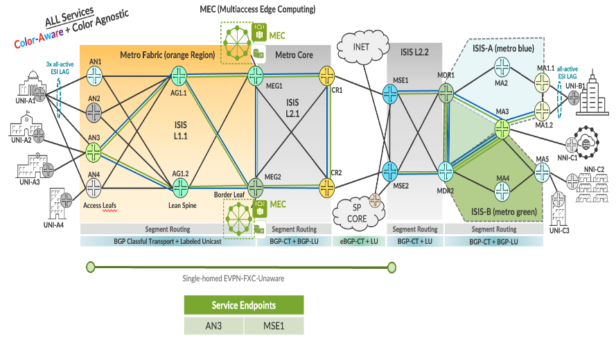

EVPN-VPWS FXC VLAN Unaware Single-homing Service implementation EBS topology.

| EVPL Service | Service Attributes Test Results |
|--------------|---------------------------------|

<table style="width:100%;">
<colgroup>
<col style="width: 9%" />
<col style="width: 9%" />
<col style="width: 63%" />
<col style="width: 9%" />
<col style="width: 7%" />
</colgroup>
<thead>
<tr>
<th colspan="5" style="text-align: center;">Non Looping Frame Delivery</th>
</tr>
</thead>
<tbody>
<tr>
<td style="text-align: center;">MEF 3.0 Test Plan</td>
<td style="text-align: center;">Test Case Number</td>
<td>Test Case Name</td>
<td style="text-align: center;">Test Result</td>
<td style="text-align: center;">Comments</td>
</tr>
<tr>
<td rowspan="3" style="text-align: center;">Part 1</td>
<td style="text-align: center;">1.1.1</td>
<td>Non-looping frame delivery, broadcast frames</td>
<td style="text-align: center;">PASS</td>
<td style="text-align: center;">-</td>
</tr>
<tr>
<td style="text-align: center;">1.1.2</td>
<td>Non-looping frame delivery, multicast frames</td>
<td style="text-align: center;">PASS</td>
<td style="text-align: center;">-</td>
</tr>
<tr>
<td style="text-align: center;">1.1.3</td>
<td>Non-looping frame delivery, unknown unicast frames</td>
<td style="text-align: center;">PASS</td>
<td style="text-align: center;">-</td>
</tr>
</tbody>
</table>

<table style="width:100%;">
<colgroup>
<col style="width: 9%" />
<col style="width: 9%" />
<col style="width: 63%" />
<col style="width: 9%" />
<col style="width: 7%" />
</colgroup>
<thead>
<tr>
<th colspan="5" style="text-align: center;">CE-VLAN ID and CE-VLAN CoS Preservation YES</th>
</tr>
</thead>
<tbody>
<tr>
<td style="text-align: center;">MEF 3.0 Test Plan</td>
<td style="text-align: center;">Test Case Number</td>
<td>Test Case Name</td>
<td style="text-align: center;">Test Result</td>
<td style="text-align: center;">Comments</td>
</tr>
<tr>
<td style="text-align: center;">Part 1</td>
<td style="text-align: center;">11.2.1</td>
<td>CE-VLAN ID preservation, tagged frames</td>
<td style="text-align: center;">PASS</td>
<td style="text-align: center;">-</td>
</tr>
</tbody>
</table>

<table>
<colgroup>
<col style="width: 9%" />
<col style="width: 9%" />
<col style="width: 63%" />
<col style="width: 9%" />
<col style="width: 7%" />
</colgroup>
<thead>
<tr>
<th colspan="5" style="text-align: center;">UNI Physical Layer and MAC Layer</th>
</tr>
</thead>
<tbody>
<tr>
<td style="text-align: center;">MEF 3.0 Test Plan</td>
<td style="text-align: center;">Test Case Number</td>
<td>Test Case Name</td>
<td style="text-align: center;">Test Result</td>
<td style="text-align: center;">Comments</td>
</tr>
<tr>
<td style="text-align: center;">Part 1</td>
<td style="text-align: center;">15.2.1</td>
<td>UNI physical layer, mode and speed</td>
<td style="text-align: center;">PASS</td>
<td style="text-align: center;">-</td>
</tr>
</tbody>
</table>

<table>
<colgroup>
<col style="width: 9%" />
<col style="width: 9%" />
<col style="width: 63%" />
<col style="width: 9%" />
<col style="width: 7%" />
</colgroup>
<thead>
<tr>
<th colspan="5" style="text-align: center;">EVC Maximum Transmission Unit Size</th>
</tr>
</thead>
<tbody>
<tr>
<td style="text-align: center;">MEF 3.0 Test Plan</td>
<td style="text-align: center;">Test Case Number</td>
<td>Test Case Name</td>
<td style="text-align: center;">Test Result</td>
<td style="text-align: center;">Comments</td>
</tr>
<tr>
<td style="text-align: center;">Part 1</td>
<td style="text-align: center;">16.2.2</td>
<td>EVC Maximum Service Frame Size - Tagged</td>
<td style="text-align: center;">PASS</td>
<td style="text-align: center;"><strong>-</strong></td>
</tr>
</tbody>
</table>

<table style="width:100%;">
<colgroup>
<col style="width: 9%" />
<col style="width: 9%" />
<col style="width: 63%" />
<col style="width: 9%" />
<col style="width: 7%" />
</colgroup>
<thead>
<tr>
<th colspan="5" style="text-align: center;">CE-VLAN ID/EVC Map</th>
</tr>
</thead>
<tbody>
<tr>
<td style="text-align: center;">MEF 3.0 Test Plan</td>
<td style="text-align: center;">Test Case Number</td>
<td>Test Case Name</td>
<td style="text-align: center;">Test Result</td>
<td style="text-align: center;">Comments</td>
</tr>
<tr>
<td style="text-align: center;">Part 1</td>
<td style="text-align: center;">20.2.1</td>
<td>CE-VLAN ID/EVC Map, Service Frame Discard</td>
<td style="text-align: center;">PASS</td>
<td style="text-align: center;">-</td>
</tr>
</tbody>
</table>

<table>
<colgroup>
<col style="width: 9%" />
<col style="width: 9%" />
<col style="width: 63%" />
<col style="width: 9%" />
<col style="width: 7%" />
</colgroup>
<thead>
<tr>
<th colspan="5" style="text-align: center;">Service OAM</th>
</tr>
</thead>
<tbody>
<tr>
<td style="text-align: center;">MEF 3.0 Test Plan</td>
<td style="text-align: center;">Test Case Number</td>
<td>Test Case Name</td>
<td style="text-align: center;">Test Result</td>
<td style="text-align: center;">Comments</td>
</tr>
<tr>
<td rowspan="6" style="text-align: center;">Part 1</td>
<td style="text-align: center;">1.2.1</td>
<td>Continuity Check Message Transparency - Untagged CCM Service Frame</td>
<td style="text-align: center;">PASS</td>
<td style="text-align: center;">-</td>
</tr>
<tr>
<td style="text-align: center;">2.2.1</td>
<td>Multicast Loopback Message Transparency - Untagged LBM Service Frame</td>
<td style="text-align: center;">PASS</td>
<td style="text-align: center;">-</td>
</tr>
<tr>
<td style="text-align: center;">3.2.1</td>
<td>Unicast Loopback Message Transparency - Untagged LBM Service Frame</td>
<td style="text-align: center;">PASS</td>
<td style="text-align: center;">-</td>
</tr>
<tr>
<td style="text-align: center;">4.2.1</td>
<td>Loopback Response Transparency - Untagged LBR Service Frame</td>
<td style="text-align: center;">PASS</td>
<td style="text-align: center;">-</td>
</tr>
<tr>
<td style="text-align: center;">5.2.1</td>
<td>Linktrace Message Transparency - Untagged LTM Service Frame</td>
<td style="text-align: center;">PASS</td>
<td style="text-align: center;">-</td>
</tr>
<tr>
<td style="text-align: center;">6.2.1</td>
<td>Linktrace Response Transparency - Untagged LTR Service Frame</td>
<td style="text-align: center;">PASS</td>
<td style="text-align: center;">-</td>
</tr>
</tbody>
</table>

<table>
<colgroup>
<col style="width: 9%" />
<col style="width: 9%" />
<col style="width: 64%" />
<col style="width: 8%" />
<col style="width: 8%" />
</colgroup>
<thead>
<tr>
<th colspan="5" style="text-align: center;">Service Frame Transparency</th>
</tr>
</thead>
<tbody>
<tr>
<td style="text-align: center;">MEF 3.0 Test Plan</td>
<td style="text-align: center;">Test Case Number</td>
<td>Test Case Name</td>
<td style="text-align: center;">Test Result</td>
<td style="text-align: center;">Comments</td>
</tr>
<tr>
<td style="text-align: center;">Part 1</td>
<td style="text-align: center;">6.2.1</td>
<td>Service Frame Transparency - Tagged to Tagged</td>
<td style="text-align: center;">PASS</td>
<td style="text-align: center;">-</td>
</tr>
</tbody>
</table>

<table>
<colgroup>
<col style="width: 9%" />
<col style="width: 9%" />
<col style="width: 63%" />
<col style="width: 9%" />
<col style="width: 7%" />
</colgroup>
<thead>
<tr>
<th colspan="5" style="text-align: center;">L2CP Service Frames</th>
</tr>
</thead>
<tbody>
<tr>
<td style="text-align: center;">MEF 3.0 Test Plan</td>
<td style="text-align: center;">Test Case Number</td>
<td>Test Case Name</td>
<td style="text-align: center;">Test Result</td>
<td style="text-align: center;">Comments</td>
</tr>
<tr>
<td rowspan="20" style="text-align: center;">Part 1</td>
<td rowspan="20" style="text-align: center;">E_L_F_2</td>
<td>L2CP Service Frames Must Not Tunnel - 01:80:C2:00:00:01, 0x8808</td>
<td style="text-align: center;">PASS</td>
<td style="text-align: center;">-</td>
</tr>
<tr>
<td>L2CP Service Frames Must Not Tunnel - 01:80:C2:00:00:02, 0x8809/01/02</td>
<td style="text-align: center;">PASS</td>
<td style="text-align: center;">-</td>
</tr>
<tr>
<td>L2CP Service Frames Must Not Tunnel - 01:80:C2:00:00:02, 0x8809/03</td>
<td style="text-align: center;">PASS</td>
<td style="text-align: center;">-</td>
</tr>
<tr>
<td>L2CP Service Frames Must Not Tunnel - 01:80:C2:00:00:02, 0x8809/0A</td>
<td style="text-align: center;">PASS</td>
<td style="text-align: center;">-</td>
</tr>
<tr>
<td>L2CP Service Frames Must Not Tunnel - 01:80:C2:00:00:03, 0x888E</td>
<td style="text-align: center;">PASS</td>
<td style="text-align: center;">-</td>
</tr>
<tr>
<td>L2CP Service Frames Must Not Tunnel - 01:80:C2:00:00:04</td>
<td style="text-align: center;">PASS</td>
<td style="text-align: center;">-</td>
</tr>
<tr>
<td>L2CP Service Frames Must Not Tunnel - 01:80:C2:00:00:05</td>
<td style="text-align: center;">PASS</td>
<td style="text-align: center;">-</td>
</tr>
<tr>
<td>L2CP Service Frames Must Not Tunnel - 01:80:C2:00:00:06</td>
<td style="text-align: center;">PASS</td>
<td style="text-align: center;">-</td>
</tr>
<tr>
<td>L2CP Service Frames Must Not Tunnel - 01:80:C2:00:00:07, 0x88EE</td>
<td style="text-align: center;">PASS</td>
<td style="text-align: center;">-</td>
</tr>
<tr>
<td>L2CP Service Frames Must Not Tunnel - 01:80:C2:00:00:08</td>
<td style="text-align: center;">PASS</td>
<td style="text-align: center;">-</td>
</tr>
<tr>
<td>L2CP Service Frames Must Not Tunnel - 01:80:C2:00:00:09</td>
<td style="text-align: center;">PASS</td>
<td style="text-align: center;">-</td>
</tr>
<tr>
<td>L2CP Service Frames Must Not Tunnel - 01:80:C2:00:00:0A</td>
<td style="text-align: center;">PASS</td>
<td style="text-align: center;">-</td>
</tr>
<tr>
<td>L2CP Service Frames Must Not Tunnel - 01:80:C2:00:00:0E, 0x88CC</td>
<td style="text-align: center;">PASS</td>
<td style="text-align: center;">-</td>
</tr>
<tr>
<td>L2CP Service Frames Must Not Tunnel - 01:80:C2:00:00:0E, 0x88F7</td>
<td style="text-align: center;">PASS</td>
<td style="text-align: center;">-</td>
</tr>
<tr>
<td>L2CP Service Frames Must Not Tunnel - 01:80:C2:00:00:20 through 01:80:C2:00:00:2F</td>
<td style="text-align: center;">PASS</td>
<td style="text-align: center;">-</td>
</tr>
<tr>
<td>L2CP Service Frames Must Not Tunnel - 01:80:C2:00:00:00</td>
<td style="text-align: center;">PASS</td>
<td style="text-align: center;">-</td>
</tr>
<tr>
<td>L2CP Service Frames Must Not Tunnel - 01:80:C2:00:00:0B</td>
<td style="text-align: center;">PASS</td>
<td style="text-align: center;">-</td>
</tr>
<tr>
<td>L2CP Service Frames Must Not Tunnel - 01:80:C2:00:00:0C</td>
<td style="text-align: center;">PASS</td>
<td style="text-align: center;">-</td>
</tr>
<tr>
<td>L2CP Service Frames Must Not Tunnel - 01:80:C2:00:00:0D</td>
<td style="text-align: center;">PASS</td>
<td style="text-align: center;">-</td>
</tr>
<tr>
<td>L2CP Service Frames Must Not Tunnel - 01:80:C2:00:00:0F</td>
<td style="text-align: center;">PASS</td>
<td style="text-align: center;">-</td>
</tr>
</tbody>
</table>

| EVPL SERVICE | Performance Results |
|--------------|---------------------|

<table>
<colgroup>
<col style="width: 9%" />
<col style="width: 9%" />
<col style="width: 10%" />
<col style="width: 10%" />
<col style="width: 10%" />
<col style="width: 8%" />
<col style="width: 7%" />
<col style="width: 13%" />
<col style="width: 10%" />
<col style="width: 10%" />
</colgroup>
<thead>
<tr>
<th colspan="10" style="text-align: center;">One-Way Frame Delay Performance – Performance Tier 1</th>
</tr>
</thead>
<tbody>
<tr>
<td style="text-align: center;">MEF 3.0 Test Plan</td>
<td style="text-align: center;">Test Case Number</td>
<td colspan="6">Test Case Name and Bandwidth Profile Parameters</td>
<td style="text-align: center;">Test Result</td>
<td style="text-align: center;">Comments</td>
</tr>
<tr>
<td rowspan="4" style="text-align: center;">Part 2</td>
<td rowspan="4" style="text-align: center;">1.1.1</td>
<td colspan="6">One-Way Frame Delay Performance with CIR = 3500 Mbps</td>
<td rowspan="4" style="text-align: center;">PASS</td>
<td rowspan="4" style="text-align: center;">-</td>
</tr>
<tr>
<td style="text-align: center;">CIR</td>
<td style="text-align: center;">CBS</td>
<td style="text-align: center;">EIR</td>
<td style="text-align: center;">EBS</td>
<td style="text-align: center;">CM</td>
<td style="text-align: center;">Class of Service</td>
</tr>
<tr>
<td style="text-align: center;">3500 Mbps</td>
<td style="text-align: center;">35000 Bytes</td>
<td style="text-align: center;">0 Mbps</td>
<td style="text-align: center;">0 Bytes</td>
<td style="text-align: center;">Color-Blind</td>
<td style="text-align: center;">High</td>
</tr>
<tr>
<td style="text-align: center;">3500 Mbps</td>
<td style="text-align: center;">35000 Bytes</td>
<td style="text-align: center;">3500 Mbps</td>
<td style="text-align: center;">35000 Bytes</td>
<td style="text-align: center;">Color-Blind</td>
<td style="text-align: center;">Medium</td>
</tr>
</tbody>
</table>

<table>
<colgroup>
<col style="width: 9%" />
<col style="width: 9%" />
<col style="width: 10%" />
<col style="width: 10%" />
<col style="width: 10%" />
<col style="width: 8%" />
<col style="width: 7%" />
<col style="width: 13%" />
<col style="width: 10%" />
<col style="width: 10%" />
</colgroup>
<thead>
<tr>
<th colspan="10" style="text-align: center;">One-Way Mean Frame Delay Performance – Performance Tier 1</th>
</tr>
</thead>
<tbody>
<tr>
<td style="text-align: center;">MEF 3.0 Test Plan</td>
<td style="text-align: center;">Test Case Number</td>
<td colspan="6">Test Case Name and Bandwidth Profile Parameters</td>
<td style="text-align: center;">Test Result</td>
<td style="text-align: center;">Comments</td>
</tr>
<tr>
<td rowspan="4" style="text-align: center;">Part 2</td>
<td rowspan="4" style="text-align: center;">2.1.1</td>
<td colspan="6">One-Way Frame Delay Performance with CIR = 3500 Mbps</td>
<td rowspan="4" style="text-align: center;">PASS</td>
<td rowspan="4" style="text-align: center;">-</td>
</tr>
<tr>
<td style="text-align: center;">CIR</td>
<td style="text-align: center;">CBS</td>
<td style="text-align: center;">EIR</td>
<td style="text-align: center;">EBS</td>
<td style="text-align: center;">CM</td>
<td style="text-align: center;">Class of Service</td>
</tr>
<tr>
<td style="text-align: center;">3500 Mbps</td>
<td style="text-align: center;">35000 Bytes</td>
<td style="text-align: center;">0 Mbps</td>
<td style="text-align: center;">0 Bytes</td>
<td style="text-align: center;">Color-Blind</td>
<td style="text-align: center;">High</td>
</tr>
<tr>
<td style="text-align: center;">3500 Mbps</td>
<td style="text-align: center;">35000 Bytes</td>
<td style="text-align: center;">3500 Mbps</td>
<td style="text-align: center;">35000 Bytes</td>
<td style="text-align: center;">Color-Blind</td>
<td style="text-align: center;">Medium</td>
</tr>
</tbody>
</table>

<table>
<colgroup>
<col style="width: 9%" />
<col style="width: 9%" />
<col style="width: 10%" />
<col style="width: 10%" />
<col style="width: 10%" />
<col style="width: 8%" />
<col style="width: 7%" />
<col style="width: 13%" />
<col style="width: 10%" />
<col style="width: 10%" />
</colgroup>
<thead>
<tr>
<th colspan="10" style="text-align: center;">One-Way Inter-Frame Delay Performance – Performance Tier 1</th>
</tr>
</thead>
<tbody>
<tr>
<td style="text-align: center;">MEF 3.0 Test Plan</td>
<td style="text-align: center;">Test Case Number</td>
<td colspan="6">Test Case Name and Bandwidth Profile Parameters</td>
<td style="text-align: center;">Test Result</td>
<td style="text-align: center;">Comments</td>
</tr>
<tr>
<td rowspan="4" style="text-align: center;">Part 2</td>
<td rowspan="4" style="text-align: center;">3.1.1</td>
<td colspan="6">One-Way Frame Delay Performance with CIR = 3500 Mbps</td>
<td rowspan="4" style="text-align: center;">PASS</td>
<td rowspan="4" style="text-align: center;">-</td>
</tr>
<tr>
<td style="text-align: center;">CIR</td>
<td style="text-align: center;">CBS</td>
<td style="text-align: center;">EIR</td>
<td style="text-align: center;">EBS</td>
<td style="text-align: center;">CM</td>
<td style="text-align: center;">Class of Service</td>
</tr>
<tr>
<td style="text-align: center;">3500 Mbps</td>
<td style="text-align: center;">35000 Bytes</td>
<td style="text-align: center;">0 Mbps</td>
<td style="text-align: center;">0 Bytes</td>
<td style="text-align: center;">Color-Blind</td>
<td style="text-align: center;">High</td>
</tr>
<tr>
<td style="text-align: center;">3500 Mbps</td>
<td style="text-align: center;">35000 Bytes</td>
<td style="text-align: center;">3500 Mbps</td>
<td style="text-align: center;">35000 Bytes</td>
<td style="text-align: center;">Color-Blind</td>
<td style="text-align: center;">Medium</td>
</tr>
</tbody>
</table>

<table>
<colgroup>
<col style="width: 9%" />
<col style="width: 9%" />
<col style="width: 10%" />
<col style="width: 10%" />
<col style="width: 10%" />
<col style="width: 8%" />
<col style="width: 7%" />
<col style="width: 13%" />
<col style="width: 10%" />
<col style="width: 10%" />
</colgroup>
<thead>
<tr>
<th colspan="10" style="text-align: center;">One-Way Frame Delay Range Performance – Performance Tier 1</th>
</tr>
</thead>
<tbody>
<tr>
<td style="text-align: center;">MEF 3.0 Test Plan</td>
<td style="text-align: center;">Test Case Number</td>
<td colspan="6">Test Case Name and Bandwidth Profile Parameters</td>
<td style="text-align: center;">Test Result</td>
<td style="text-align: center;">Comments</td>
</tr>
<tr>
<td rowspan="4" style="text-align: center;">Part 2</td>
<td rowspan="4" style="text-align: center;">4.1.1</td>
<td colspan="6">One-Way Frame Delay Performance with CIR = 3500 Mbps</td>
<td rowspan="4" style="text-align: center;">PASS</td>
<td rowspan="4" style="text-align: center;">-</td>
</tr>
<tr>
<td style="text-align: center;">CIR</td>
<td style="text-align: center;">CBS</td>
<td style="text-align: center;">EIR</td>
<td style="text-align: center;">EBS</td>
<td style="text-align: center;">CM</td>
<td style="text-align: center;">Class of Service</td>
</tr>
<tr>
<td style="text-align: center;">3500 Mbps</td>
<td style="text-align: center;">35000 Bytes</td>
<td style="text-align: center;">0 Mbps</td>
<td style="text-align: center;">0 Bytes</td>
<td style="text-align: center;">Color-Blind</td>
<td style="text-align: center;">High</td>
</tr>
<tr>
<td style="text-align: center;">3500 Mbps</td>
<td style="text-align: center;">35000 Bytes</td>
<td style="text-align: center;">3500 Mbps</td>
<td style="text-align: center;">35000 Bytes</td>
<td style="text-align: center;">Color-Blind</td>
<td style="text-align: center;">Medium</td>
</tr>
</tbody>
</table>

<table>
<colgroup>
<col style="width: 9%" />
<col style="width: 9%" />
<col style="width: 10%" />
<col style="width: 10%" />
<col style="width: 10%" />
<col style="width: 8%" />
<col style="width: 7%" />
<col style="width: 13%" />
<col style="width: 10%" />
<col style="width: 10%" />
</colgroup>
<thead>
<tr>
<th colspan="10" style="text-align: center;">One-Way Frame Loss Performance – Performance Tier 1</th>
</tr>
</thead>
<tbody>
<tr>
<td style="text-align: center;">MEF 3.0 Test Plan</td>
<td style="text-align: center;">Test Case Number</td>
<td colspan="6">Test Case Name and Bandwidth Profile Parameters</td>
<td style="text-align: center;">Test Result</td>
<td style="text-align: center;">Comments</td>
</tr>
<tr>
<td rowspan="4" style="text-align: center;">Part 2</td>
<td rowspan="4" style="text-align: center;">5.1.1</td>
<td colspan="6">One-Way Frame Delay Performance with CIR = 3500 Mbps</td>
<td rowspan="4" style="text-align: center;">PASS</td>
<td rowspan="4" style="text-align: center;">-</td>
</tr>
<tr>
<td style="text-align: center;">CIR</td>
<td style="text-align: center;">CBS</td>
<td style="text-align: center;">EIR</td>
<td style="text-align: center;">EBS</td>
<td style="text-align: center;">CM</td>
<td style="text-align: center;">Class of Service</td>
</tr>
<tr>
<td style="text-align: center;">3500 Mbps</td>
<td style="text-align: center;">35000 Bytes</td>
<td style="text-align: center;">0 Mbps</td>
<td style="text-align: center;">0 Bytes</td>
<td style="text-align: center;">Color-Blind</td>
<td style="text-align: center;">High</td>
</tr>
<tr>
<td style="text-align: center;">3500 Mbps</td>
<td style="text-align: center;">35000 Bytes</td>
<td style="text-align: center;">3500 Mbps</td>
<td style="text-align: center;">35000 Bytes</td>
<td style="text-align: center;">Color-Blind</td>
<td style="text-align: center;">Medium</td>
</tr>
</tbody>
</table>

| EVPL SERVICE | Traffic Management Test Results |
|--------------|---------------------------------|

<table>
<colgroup>
<col style="width: 8%" />
<col style="width: 8%" />
<col style="width: 9%" />
<col style="width: 9%" />
<col style="width: 9%" />
<col style="width: 7%" />
<col style="width: 6%" />
<col style="width: 11%" />
<col style="width: 10%" />
<col style="width: 9%" />
<col style="width: 10%" />
</colgroup>
<thead>
<tr>
<th colspan="11" style="text-align: center;">Ingress Bandwidth Profile - CIR Enforcement</th>
</tr>
</thead>
<tbody>
<tr>
<td style="text-align: center;">MEF 3.0 Test Plan</td>
<td style="text-align: center;">Test Case Number</td>
<td colspan="7">Test Case Name and Bandwidth Profile Parameters</td>
<td style="text-align: center;">Test Result</td>
<td style="text-align: center;">Comments</td>
</tr>
<tr>
<td rowspan="3" style="text-align: center;">Part 2</td>
<td rowspan="3" style="text-align: center;">1.1.6</td>
<td colspan="7">CBS Enforcement Tagged Frames when [CIR/CBS&gt;0 and EIR/EBS=0] and CoS ID per EVC &amp; PCP</td>
<td rowspan="3" style="text-align: center;">PASS</td>
<td rowspan="3" style="text-align: center;">-</td>
</tr>
<tr>
<td style="text-align: center;">CIR</td>
<td style="text-align: center;">CBS</td>
<td style="text-align: center;">EIR</td>
<td style="text-align: center;">EBS</td>
<td style="text-align: center;">CM</td>
<td style="text-align: center;">Class of Service</td>
<td style="text-align: center;">Test Frame sizes</td>
</tr>
<tr>
<td style="text-align: center;">3500 Mbps</td>
<td style="text-align: center;">35000 Bytes</td>
<td style="text-align: center;">0 Mbps</td>
<td style="text-align: center;">0 Bytes</td>
<td style="text-align: center;">Color-Blind</td>
<td style="text-align: center;">High</td>
<td style="text-align: center;">80,600,1500</td>
</tr>
</tbody>
</table>

<table>
<colgroup>
<col style="width: 8%" />
<col style="width: 8%" />
<col style="width: 9%" />
<col style="width: 9%" />
<col style="width: 9%" />
<col style="width: 7%" />
<col style="width: 6%" />
<col style="width: 11%" />
<col style="width: 10%" />
<col style="width: 9%" />
<col style="width: 10%" />
</colgroup>
<thead>
<tr>
<th colspan="11" style="text-align: center;">Ingress Bandwidth Profile - CBS Enforcement</th>
</tr>
</thead>
<tbody>
<tr>
<td style="text-align: center;">MEF 3.0 Test Plan</td>
<td style="text-align: center;">Test Case Number</td>
<td colspan="7">Test Case Name and Bandwidth Profile Parameters</td>
<td style="text-align: center;">Test Result</td>
<td style="text-align: center;">Comments</td>
</tr>
<tr>
<td rowspan="3" style="text-align: center;">Part 2</td>
<td rowspan="3" style="text-align: center;">2.1.6</td>
<td colspan="7">CBS Enforcement Tagged Frames when [CIR/CBS&gt;0 and EIR/EBS=0] and CoS ID per EVC &amp; PCP</td>
<td rowspan="3" style="text-align: center;">PASS</td>
<td rowspan="3" style="text-align: center;">-</td>
</tr>
<tr>
<td style="text-align: center;">CIR</td>
<td style="text-align: center;">CBS</td>
<td style="text-align: center;">EIR</td>
<td style="text-align: center;">EBS</td>
<td style="text-align: center;">CM</td>
<td style="text-align: center;">Class of Service</td>
<td style="text-align: center;">Test Frame sizes</td>
</tr>
<tr>
<td style="text-align: center;">3500 Mbps</td>
<td style="text-align: center;">35000 Bytes</td>
<td style="text-align: center;">0 Mbps</td>
<td style="text-align: center;">0 Bytes</td>
<td style="text-align: center;">Color-Blind</td>
<td style="text-align: center;">High</td>
<td style="text-align: center;">80,600,1500</td>
</tr>
</tbody>
</table>

<table>
<colgroup>
<col style="width: 8%" />
<col style="width: 8%" />
<col style="width: 9%" />
<col style="width: 9%" />
<col style="width: 9%" />
<col style="width: 7%" />
<col style="width: 6%" />
<col style="width: 11%" />
<col style="width: 10%" />
<col style="width: 9%" />
<col style="width: 10%" />
</colgroup>
<thead>
<tr>
<th colspan="11" style="text-align: center;">Ingress Bandwidth Profile - EIR Enforcement</th>
</tr>
</thead>
<tbody>
<tr>
<td style="text-align: center;">MEF 3.0 Test Plan</td>
<td style="text-align: center;">Test Case Number</td>
<td colspan="7">Test Case Name and Bandwidth Profile Parameters</td>
<td style="text-align: center;">Test Result</td>
<td style="text-align: center;">Comments</td>
</tr>
<tr>
<td rowspan="3" style="text-align: center;">Part 2</td>
<td rowspan="3" style="text-align: center;">3.1.6</td>
<td colspan="7">EIR Enforcement Tagged Frames when [CIR/CBS=0 and EIR/EBS&gt;0] and CoS ID per EVC &amp; PCP</td>
<td rowspan="3" style="text-align: center;">PASS</td>
<td rowspan="3" style="text-align: center;">-</td>
</tr>
<tr>
<td style="text-align: center;">CIR</td>
<td style="text-align: center;">CBS</td>
<td style="text-align: center;">EIR</td>
<td style="text-align: center;">EBS</td>
<td style="text-align: center;">CM</td>
<td style="text-align: center;">Class of Service</td>
<td style="text-align: center;">Test Frame sizes</td>
</tr>
<tr>
<td style="text-align: center;">0 Mbps</td>
<td style="text-align: center;">0 Bytes</td>
<td style="text-align: center;">3500 Mbps</td>
<td style="text-align: center;">35000 Bytes</td>
<td style="text-align: center;">Color-Blind</td>
<td style="text-align: center;">Low</td>
<td style="text-align: center;">80,600,1500</td>
</tr>
</tbody>
</table>

<table>
<colgroup>
<col style="width: 8%" />
<col style="width: 8%" />
<col style="width: 9%" />
<col style="width: 9%" />
<col style="width: 9%" />
<col style="width: 7%" />
<col style="width: 6%" />
<col style="width: 11%" />
<col style="width: 10%" />
<col style="width: 9%" />
<col style="width: 10%" />
</colgroup>
<thead>
<tr>
<th colspan="11" style="text-align: center;">Ingress Bandwidth Profile - EBS Enforcement</th>
</tr>
</thead>
<tbody>
<tr>
<td style="text-align: center;">MEF 3.0 Test Plan</td>
<td style="text-align: center;">Test Case Number</td>
<td colspan="7">Test Case Name and Bandwidth Profile Parameters</td>
<td style="text-align: center;">Test Result</td>
<td style="text-align: center;">Comments</td>
</tr>
<tr>
<td rowspan="3" style="text-align: center;">Part 2</td>
<td rowspan="3" style="text-align: center;">4.1.6</td>
<td colspan="7">EBS Enforcement Tagged Frames when [CIR/CBS=0 and EIR/EBS&gt;0] and CoS ID per EVC &amp; PCP</td>
<td rowspan="3" style="text-align: center;">PASS</td>
<td rowspan="3" style="text-align: center;">-</td>
</tr>
<tr>
<td style="text-align: center;">CIR</td>
<td style="text-align: center;">CBS</td>
<td style="text-align: center;">EIR</td>
<td style="text-align: center;">EBS</td>
<td style="text-align: center;">CM</td>
<td style="text-align: center;">Class of Service</td>
<td style="text-align: center;">Test Frame sizes</td>
</tr>
<tr>
<td style="text-align: center;">3500 Mbps</td>
<td style="text-align: center;">35000 Bytes</td>
<td style="text-align: center;">0 Mbps</td>
<td style="text-align: center;">0 Bytes</td>
<td style="text-align: center;">Color-Blind</td>
<td style="text-align: center;">Low</td>
<td style="text-align: center;">80,600,1500</td>
</tr>
</tbody>
</table>

<table>
<colgroup>
<col style="width: 8%" />
<col style="width: 8%" />
<col style="width: 9%" />
<col style="width: 9%" />
<col style="width: 9%" />
<col style="width: 7%" />
<col style="width: 6%" />
<col style="width: 11%" />
<col style="width: 10%" />
<col style="width: 9%" />
<col style="width: 10%" />
</colgroup>
<thead>
<tr>
<th colspan="11" style="text-align: center;">Ingress Bandwidth Profile - CIR and EIR Enforcement</th>
</tr>
</thead>
<tbody>
<tr>
<td style="text-align: center;">MEF 3.0 Test Plan</td>
<td style="text-align: center;">Test Case Number</td>
<td colspan="7">Test Case Name and Bandwidth Profile Parameters</td>
<td style="text-align: center;">Test Result</td>
<td style="text-align: center;">Comments</td>
</tr>
<tr>
<td rowspan="3" style="text-align: center;">Part 2</td>
<td rowspan="3" style="text-align: center;">5.1.6</td>
<td colspan="7">CIR and EIR Enforcement Tagged Frames when [CIR/CBS&gt;0 and EIR/EBS&gt;0] and CoS ID per EVC &amp; PCP</td>
<td rowspan="3" style="text-align: center;">PASS</td>
<td rowspan="3" style="text-align: center;">-</td>
</tr>
<tr>
<td style="text-align: center;">CIR</td>
<td style="text-align: center;">CBS</td>
<td style="text-align: center;">EIR</td>
<td style="text-align: center;">EBS</td>
<td style="text-align: center;">CM</td>
<td style="text-align: center;">Class of Service</td>
<td style="text-align: center;">Test Frame sizes</td>
</tr>
<tr>
<td style="text-align: center;">3500 Mbps</td>
<td style="text-align: center;">35000 Bytes</td>
<td style="text-align: center;">3500 Mbps</td>
<td style="text-align: center;">35000 Bytes</td>
<td style="text-align: center;">Color-Blind</td>
<td style="text-align: center;">Medium</td>
<td style="text-align: center;">80,600,1500</td>
</tr>
</tbody>
</table>

<table>
<colgroup>
<col style="width: 8%" />
<col style="width: 8%" />
<col style="width: 9%" />
<col style="width: 9%" />
<col style="width: 9%" />
<col style="width: 7%" />
<col style="width: 6%" />
<col style="width: 11%" />
<col style="width: 10%" />
<col style="width: 9%" />
<col style="width: 10%" />
</colgroup>
<thead>
<tr>
<th colspan="11" style="text-align: center;">Ingress Bandwidth Profile - CBS and EBS Enforcement</th>
</tr>
</thead>
<tbody>
<tr>
<td style="text-align: center;">MEF 3.0 Test Plan</td>
<td style="text-align: center;">Test Case Number</td>
<td colspan="7">Test Case Name and Bandwidth Profile Parameters</td>
<td style="text-align: center;">Test Result</td>
<td style="text-align: center;">Comments</td>
</tr>
<tr>
<td rowspan="3" style="text-align: center;">Part 2</td>
<td rowspan="3" style="text-align: center;">6.1.6</td>
<td colspan="7">CBS and EBS Enforcement Tagged Frames when [CIR/CBS&gt;0 and EIR/EBS&gt;0] and CoS ID per EVC &amp; PCP</td>
<td rowspan="3" style="text-align: center;">PASS</td>
<td rowspan="3" style="text-align: center;">-</td>
</tr>
<tr>
<td style="text-align: center;">CIR</td>
<td style="text-align: center;">CBS</td>
<td style="text-align: center;">EIR</td>
<td style="text-align: center;">EBS</td>
<td style="text-align: center;">CM</td>
<td style="text-align: center;">Class of Service</td>
<td style="text-align: center;">Test Frame sizes</td>
</tr>
<tr>
<td style="text-align: center;">3500 Mbps</td>
<td style="text-align: center;">35000 Bytes</td>
<td style="text-align: center;">3500 Mbps</td>
<td style="text-align: center;">35000 Bytes</td>
<td style="text-align: center;">Color-Blind</td>
<td style="text-align: center;">Medium</td>
<td style="text-align: center;">80,600,1500</td>
</tr>
</tbody>
</table>

<table>
<colgroup>
<col style="width: 8%" />
<col style="width: 8%" />
<col style="width: 9%" />
<col style="width: 9%" />
<col style="width: 9%" />
<col style="width: 7%" />
<col style="width: 6%" />
<col style="width: 11%" />
<col style="width: 10%" />
<col style="width: 9%" />
<col style="width: 10%" />
</colgroup>
<thead>
<tr>
<th colspan="11" style="text-align: center;">Ingress Bandwidth Profile - Unconditional Delivery of Frames</th>
</tr>
</thead>
<tbody>
<tr>
<td style="text-align: center;">MEF 3.0 Test Plan</td>
<td style="text-align: center;">Test Case Number</td>
<td colspan="7">Test Case Name and Bandwidth Profile Parameters</td>
<td style="text-align: center;">Test Result</td>
<td style="text-align: center;">Comments</td>
</tr>
<tr>
<td rowspan="12" style="text-align: center;">Part 2</td>
<td rowspan="4" style="text-align: center;">7.1.1</td>
<td colspan="7">Unconditional Delivery of Broadcast Frames and CoS ID per EVC &amp; PCP</td>
<td rowspan="4" style="text-align: center;">PASS</td>
<td rowspan="4" style="text-align: center;">-</td>
</tr>
<tr>
<td style="text-align: center;">CIR</td>
<td style="text-align: center;">CBS</td>
<td style="text-align: center;">EIR</td>
<td style="text-align: center;">EBS</td>
<td style="text-align: center;">CM</td>
<td style="text-align: center;">Class of Service</td>
<td style="text-align: center;">Test Frame sizes</td>
</tr>
<tr>
<td style="text-align: center;">3500 Mbps</td>
<td style="text-align: center;">35000 Bytes</td>
<td style="text-align: center;">0 Mbps</td>
<td style="text-align: center;">0 Bytes</td>
<td style="text-align: center;">Color-Blind</td>
<td style="text-align: center;">High</td>
<td style="text-align: center;">80,600,1500</td>
</tr>
<tr>
<td style="text-align: center;">3500 Mbps</td>
<td style="text-align: center;">35000 Bytes</td>
<td style="text-align: center;">3500 Mbps</td>
<td style="text-align: center;">35000 Bytes</td>
<td style="text-align: center;">Color-Blind</td>
<td style="text-align: center;">Medium</td>
<td style="text-align: center;">80,600,1500</td>
</tr>
<tr>
<td rowspan="4" style="text-align: center;">7.1.2</td>
<td colspan="7">Unconditional Delivery of Mutlicast Frames and CoS ID per EVC &amp; PCP</td>
<td rowspan="4" style="text-align: center;">PASS</td>
<td rowspan="4" style="text-align: center;">-</td>
</tr>
<tr>
<td style="text-align: center;">CIR</td>
<td style="text-align: center;">CBS</td>
<td style="text-align: center;">EIR</td>
<td style="text-align: center;">EBS</td>
<td style="text-align: center;">CM</td>
<td style="text-align: center;">Class of Service</td>
<td style="text-align: center;">Test Frame sizes</td>
</tr>
<tr>
<td style="text-align: center;">3500 Mbps</td>
<td style="text-align: center;">35000 Bytes</td>
<td style="text-align: center;">0 Mbps</td>
<td style="text-align: center;">0 Bytes</td>
<td style="text-align: center;">Color-Blind</td>
<td style="text-align: center;">High</td>
<td style="text-align: center;">80,600,1500</td>
</tr>
<tr>
<td style="text-align: center;">3500 Mbps</td>
<td style="text-align: center;">35000 Bytes</td>
<td style="text-align: center;">3500 Mbps</td>
<td style="text-align: center;">35000 Bytes</td>
<td style="text-align: center;">Color-Blind</td>
<td style="text-align: center;">Medium</td>
<td style="text-align: center;">80,600,1500</td>
</tr>
<tr>
<td rowspan="4" style="text-align: center;">7.1.3</td>
<td colspan="7">Unconditional Delivery of Unicast Frames and CoS ID per EVC &amp; PCP</td>
<td rowspan="4" style="text-align: center;">PASS</td>
<td rowspan="4" style="text-align: center;">-</td>
</tr>
<tr>
<td style="text-align: center;">CIR</td>
<td style="text-align: center;">CBS</td>
<td style="text-align: center;">EIR</td>
<td style="text-align: center;">EBS</td>
<td style="text-align: center;">CM</td>
<td style="text-align: center;">Class of Service</td>
<td style="text-align: center;">Test Frame sizes</td>
</tr>
<tr>
<td style="text-align: center;">3500 Mbps</td>
<td style="text-align: center;">35000 Bytes</td>
<td style="text-align: center;">0 Mbps</td>
<td style="text-align: center;">0 Bytes</td>
<td style="text-align: center;">Color-Blind</td>
<td style="text-align: center;">High</td>
<td style="text-align: center;">80,600,1500</td>
</tr>
<tr>
<td style="text-align: center;">3500 Mbps</td>
<td style="text-align: center;">35000 Bytes</td>
<td style="text-align: center;">3500 Mbps</td>
<td style="text-align: center;">35000 Bytes</td>
<td style="text-align: center;">Color-Blind</td>
<td style="text-align: center;">Medium</td>
<td style="text-align: center;">80,600,1500</td>
</tr>
</tbody>
</table>

<table>
<colgroup>
<col style="width: 8%" />
<col style="width: 8%" />
<col style="width: 9%" />
<col style="width: 9%" />
<col style="width: 9%" />
<col style="width: 7%" />
<col style="width: 6%" />
<col style="width: 11%" />
<col style="width: 10%" />
<col style="width: 9%" />
<col style="width: 10%" />
</colgroup>
<thead>
<tr>
<th colspan="11" style="text-align: center;">Ingress Bandwidth Profile - Class of Service Discard</th>
</tr>
</thead>
<tbody>
<tr>
<td style="text-align: center;">MEF 3.0 Test Plan</td>
<td style="text-align: center;">Test Case Number</td>
<td colspan="7">Test Case Name and Bandwidth Profile Parameters</td>
<td style="text-align: center;">Test Result</td>
<td style="text-align: center;">Comments</td>
</tr>
<tr>
<td rowspan="3" style="text-align: center;">Part 2</td>
<td rowspan="3" style="text-align: center;">9.1.1</td>
<td colspan="7">CBS Enforcement Tagged Frames when [CIR/CBS&gt;0 and EIR/EBS=0] and CoS ID per EVC &amp; PCP</td>
<td rowspan="3" style="text-align: center;">PASS</td>
<td rowspan="3" style="text-align: center;">-</td>
</tr>
<tr>
<td style="text-align: center;">CIR</td>
<td style="text-align: center;">CBS</td>
<td style="text-align: center;">EIR</td>
<td style="text-align: center;">EBS</td>
<td style="text-align: center;">CM</td>
<td style="text-align: center;">Class of Service</td>
<td style="text-align: center;">Test Frame sizes</td>
</tr>
<tr>
<td style="text-align: center;">3500 Mbps</td>
<td style="text-align: center;">35000 Bytes</td>
<td style="text-align: center;">0 Mbps</td>
<td style="text-align: center;">0 Bytes</td>
<td style="text-align: center;">Color-Blind</td>
<td style="text-align: center;">High</td>
<td style="text-align: center;">80,600,1500</td>
</tr>
</tbody>
</table>

E-LINE - EVPL

### EVPN-FXC-MH-Aware:

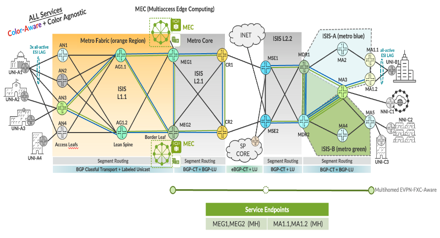

EVPN-VPWS FXC VLAN aware Multi-homing Service implementation in EBS topology.

| EVPL Service | Service Attributes Test Results |
|--------------|---------------------------------|

<table style="width:100%;">
<colgroup>
<col style="width: 9%" />
<col style="width: 9%" />
<col style="width: 63%" />
<col style="width: 9%" />
<col style="width: 7%" />
</colgroup>
<thead>
<tr>
<th colspan="5" style="text-align: center;">Non Looping Frame Delivery</th>
</tr>
</thead>
<tbody>
<tr>
<td style="text-align: center;">MEF 3.0 Test Plan</td>
<td style="text-align: center;">Test Case Number</td>
<td>Test Case Name</td>
<td style="text-align: center;">Test Result</td>
<td style="text-align: center;">Comments</td>
</tr>
<tr>
<td rowspan="3" style="text-align: center;">Part 1</td>
<td style="text-align: center;">1.1.1</td>
<td>Non-looping frame delivery, broadcast frames</td>
<td style="text-align: center;">PASS</td>
<td style="text-align: center;">-</td>
</tr>
<tr>
<td style="text-align: center;">1.1.2</td>
<td>Non-looping frame delivery, multicast frames</td>
<td style="text-align: center;">PASS</td>
<td style="text-align: center;">-</td>
</tr>
<tr>
<td style="text-align: center;">1.1.3</td>
<td>Non-looping frame delivery, unknown unicast frames</td>
<td style="text-align: center;">PASS</td>
<td style="text-align: center;">-</td>
</tr>
</tbody>
</table>

<table style="width:100%;">
<colgroup>
<col style="width: 9%" />
<col style="width: 9%" />
<col style="width: 63%" />
<col style="width: 9%" />
<col style="width: 7%" />
</colgroup>
<thead>
<tr>
<th colspan="5" style="text-align: center;">CE-VLAN ID and CE-VLAN CoS Preservation YES</th>
</tr>
</thead>
<tbody>
<tr>
<td style="text-align: center;">MEF 3.0 Test Plan</td>
<td style="text-align: center;">Test Case Number</td>
<td>Test Case Name</td>
<td style="text-align: center;">Test Result</td>
<td style="text-align: center;">Comments</td>
</tr>
<tr>
<td style="text-align: center;">Part 1</td>
<td style="text-align: center;">11.2.1</td>
<td>CE-VLAN ID preservation, tagged frames</td>
<td style="text-align: center;">PASS</td>
<td style="text-align: center;">-</td>
</tr>
</tbody>
</table>

<table>
<colgroup>
<col style="width: 9%" />
<col style="width: 9%" />
<col style="width: 63%" />
<col style="width: 9%" />
<col style="width: 7%" />
</colgroup>
<thead>
<tr>
<th colspan="5" style="text-align: center;">UNI Physical Layer and MAC Layer</th>
</tr>
</thead>
<tbody>
<tr>
<td style="text-align: center;">MEF 3.0 Test Plan</td>
<td style="text-align: center;">Test Case Number</td>
<td>Test Case Name</td>
<td style="text-align: center;">Test Result</td>
<td style="text-align: center;">Comments</td>
</tr>
<tr>
<td style="text-align: center;">Part 1</td>
<td style="text-align: center;">15.2.1</td>
<td>UNI physical layer, mode and speed</td>
<td style="text-align: center;">PASS</td>
<td style="text-align: center;">-</td>
</tr>
</tbody>
</table>

<table>
<colgroup>
<col style="width: 9%" />
<col style="width: 9%" />
<col style="width: 63%" />
<col style="width: 9%" />
<col style="width: 7%" />
</colgroup>
<thead>
<tr>
<th colspan="5" style="text-align: center;">EVC Maximum Transmission Unit Size</th>
</tr>
</thead>
<tbody>
<tr>
<td style="text-align: center;">MEF 3.0 Test Plan</td>
<td style="text-align: center;">Test Case Number</td>
<td>Test Case Name</td>
<td style="text-align: center;">Test Result</td>
<td style="text-align: center;">Comments</td>
</tr>
<tr>
<td style="text-align: center;">Part 1</td>
<td style="text-align: center;">16.2.2</td>
<td>EVC Maximum Service Frame Size - Tagged</td>
<td style="text-align: center;">PASS</td>
<td style="text-align: center;"><strong>-</strong></td>
</tr>
</tbody>
</table>

<table style="width:100%;">
<colgroup>
<col style="width: 9%" />
<col style="width: 9%" />
<col style="width: 63%" />
<col style="width: 9%" />
<col style="width: 7%" />
</colgroup>
<thead>
<tr>
<th colspan="5" style="text-align: center;">CE-VLAN ID/EVC Map</th>
</tr>
</thead>
<tbody>
<tr>
<td style="text-align: center;">MEF 3.0 Test Plan</td>
<td style="text-align: center;">Test Case Number</td>
<td>Test Case Name</td>
<td style="text-align: center;">Test Result</td>
<td style="text-align: center;">Comments</td>
</tr>
<tr>
<td style="text-align: center;">Part 1</td>
<td style="text-align: center;">20.2.1</td>
<td>CE-VLAN ID/EVC Map, Service Frame Discard</td>
<td style="text-align: center;">PASS</td>
<td style="text-align: center;">-</td>
</tr>
</tbody>
</table>

<table>
<colgroup>
<col style="width: 9%" />
<col style="width: 9%" />
<col style="width: 63%" />
<col style="width: 9%" />
<col style="width: 7%" />
</colgroup>
<thead>
<tr>
<th colspan="5" style="text-align: center;">Service OAM</th>
</tr>
</thead>
<tbody>
<tr>
<td style="text-align: center;">MEF 3.0 Test Plan</td>
<td style="text-align: center;">Test Case Number</td>
<td>Test Case Name</td>
<td style="text-align: center;">Test Result</td>
<td style="text-align: center;">Comments</td>
</tr>
<tr>
<td rowspan="6" style="text-align: center;">Part 1</td>
<td style="text-align: center;">1.2.1</td>
<td>Continuity Check Message Transparency - Untagged CCM Service Frame</td>
<td style="text-align: center;">PASS</td>
<td style="text-align: center;">-</td>
</tr>
<tr>
<td style="text-align: center;">2.2.1</td>
<td>Multicast Loopback Message Transparency - Untagged LBM Service Frame</td>
<td style="text-align: center;">PASS</td>
<td style="text-align: center;">-</td>
</tr>
<tr>
<td style="text-align: center;">3.2.1</td>
<td>Unicast Loopback Message Transparency - Untagged LBM Service Frame</td>
<td style="text-align: center;">PASS</td>
<td style="text-align: center;">-</td>
</tr>
<tr>
<td style="text-align: center;">4.2.1</td>
<td>Loopback Response Transparency - Untagged LBR Service Frame</td>
<td style="text-align: center;">PASS</td>
<td style="text-align: center;">-</td>
</tr>
<tr>
<td style="text-align: center;">5.2.1</td>
<td>Linktrace Message Transparency - Untagged LTM Service Frame</td>
<td style="text-align: center;">PASS</td>
<td style="text-align: center;">-</td>
</tr>
<tr>
<td style="text-align: center;">6.2.1</td>
<td>Linktrace Response Transparency - Untagged LTR Service Frame</td>
<td style="text-align: center;">PASS</td>
<td style="text-align: center;">-</td>
</tr>
</tbody>
</table>

<table>
<colgroup>
<col style="width: 9%" />
<col style="width: 9%" />
<col style="width: 64%" />
<col style="width: 8%" />
<col style="width: 8%" />
</colgroup>
<thead>
<tr>
<th colspan="5" style="text-align: center;">Service Frame Transparency</th>
</tr>
</thead>
<tbody>
<tr>
<td style="text-align: center;">MEF 3.0 Test Plan</td>
<td style="text-align: center;">Test Case Number</td>
<td>Test Case Name</td>
<td style="text-align: center;">Test Result</td>
<td style="text-align: center;">Comments</td>
</tr>
<tr>
<td style="text-align: center;">Part 1</td>
<td style="text-align: center;">6.2.1</td>
<td>Service Frame Transparency - Tagged to Tagged</td>
<td style="text-align: center;">PASS</td>
<td style="text-align: center;">-</td>
</tr>
</tbody>
</table>

<table>
<colgroup>
<col style="width: 9%" />
<col style="width: 9%" />
<col style="width: 63%" />
<col style="width: 9%" />
<col style="width: 7%" />
</colgroup>
<thead>
<tr>
<th colspan="5" style="text-align: center;">L2CP Service Frames</th>
</tr>
</thead>
<tbody>
<tr>
<td style="text-align: center;">MEF 3.0 Test Plan</td>
<td style="text-align: center;">Test Case Number</td>
<td>Test Case Name</td>
<td style="text-align: center;">Test Result</td>
<td style="text-align: center;">Comments</td>
</tr>
<tr>
<td rowspan="20" style="text-align: center;">Part 1</td>
<td rowspan="20" style="text-align: center;">E_L_F_2</td>
<td>L2CP Service Frames Must Not Tunnel - 01:80:C2:00:00:01, 0x8808</td>
<td style="text-align: center;">PASS</td>
<td style="text-align: center;">-</td>
</tr>
<tr>
<td>L2CP Service Frames Must Not Tunnel - 01:80:C2:00:00:02, 0x8809/01/02</td>
<td style="text-align: center;">PASS</td>
<td style="text-align: center;">-</td>
</tr>
<tr>
<td>L2CP Service Frames Must Not Tunnel - 01:80:C2:00:00:02, 0x8809/03</td>
<td style="text-align: center;">PASS</td>
<td style="text-align: center;">-</td>
</tr>
<tr>
<td>L2CP Service Frames Must Not Tunnel - 01:80:C2:00:00:02, 0x8809/0A</td>
<td style="text-align: center;">PASS</td>
<td style="text-align: center;">-</td>
</tr>
<tr>
<td>L2CP Service Frames Must Not Tunnel - 01:80:C2:00:00:03, 0x888E</td>
<td style="text-align: center;">PASS</td>
<td style="text-align: center;">-</td>
</tr>
<tr>
<td>L2CP Service Frames Must Not Tunnel - 01:80:C2:00:00:04</td>
<td style="text-align: center;">PASS</td>
<td style="text-align: center;">-</td>
</tr>
<tr>
<td>L2CP Service Frames Must Not Tunnel - 01:80:C2:00:00:05</td>
<td style="text-align: center;">PASS</td>
<td style="text-align: center;">-</td>
</tr>
<tr>
<td>L2CP Service Frames Must Not Tunnel - 01:80:C2:00:00:06</td>
<td style="text-align: center;">PASS</td>
<td style="text-align: center;">-</td>
</tr>
<tr>
<td>L2CP Service Frames Must Not Tunnel - 01:80:C2:00:00:07, 0x88EE</td>
<td style="text-align: center;">PASS</td>
<td style="text-align: center;">-</td>
</tr>
<tr>
<td>L2CP Service Frames Must Not Tunnel - 01:80:C2:00:00:08</td>
<td style="text-align: center;">PASS</td>
<td style="text-align: center;">-</td>
</tr>
<tr>
<td>L2CP Service Frames Must Not Tunnel - 01:80:C2:00:00:09</td>
<td style="text-align: center;">PASS</td>
<td style="text-align: center;">-</td>
</tr>
<tr>
<td>L2CP Service Frames Must Not Tunnel - 01:80:C2:00:00:0A</td>
<td style="text-align: center;">PASS</td>
<td style="text-align: center;">-</td>
</tr>
<tr>
<td>L2CP Service Frames Must Not Tunnel - 01:80:C2:00:00:0E, 0x88CC</td>
<td style="text-align: center;">PASS</td>
<td style="text-align: center;">-</td>
</tr>
<tr>
<td>L2CP Service Frames Must Not Tunnel - 01:80:C2:00:00:0E, 0x88F7</td>
<td style="text-align: center;">PASS</td>
<td style="text-align: center;">-</td>
</tr>
<tr>
<td>L2CP Service Frames Must Not Tunnel - 01:80:C2:00:00:20 through 01:80:C2:00:00:2F</td>
<td style="text-align: center;">PASS</td>
<td style="text-align: center;">-</td>
</tr>
<tr>
<td>L2CP Service Frames Must Not Tunnel - 01:80:C2:00:00:00</td>
<td style="text-align: center;">PASS</td>
<td style="text-align: center;">-</td>
</tr>
<tr>
<td>L2CP Service Frames Must Not Tunnel - 01:80:C2:00:00:0B</td>
<td style="text-align: center;">PASS</td>
<td style="text-align: center;">-</td>
</tr>
<tr>
<td>L2CP Service Frames Must Not Tunnel - 01:80:C2:00:00:0C</td>
<td style="text-align: center;">PASS</td>
<td style="text-align: center;">-</td>
</tr>
<tr>
<td>L2CP Service Frames Must Not Tunnel - 01:80:C2:00:00:0D</td>
<td style="text-align: center;">PASS</td>
<td style="text-align: center;">-</td>
</tr>
<tr>
<td>L2CP Service Frames Must Not Tunnel - 01:80:C2:00:00:0F</td>
<td style="text-align: center;">PASS</td>
<td style="text-align: center;">-</td>
</tr>
</tbody>
</table>

| EVPL SERVICE | Performance Results |
|--------------|---------------------|

<table>
<colgroup>
<col style="width: 9%" />
<col style="width: 9%" />
<col style="width: 10%" />
<col style="width: 10%" />
<col style="width: 10%" />
<col style="width: 8%" />
<col style="width: 7%" />
<col style="width: 13%" />
<col style="width: 10%" />
<col style="width: 10%" />
</colgroup>
<thead>
<tr>
<th colspan="10" style="text-align: center;">One-Way Frame Delay Performance – Performance Tier 1</th>
</tr>
</thead>
<tbody>
<tr>
<td style="text-align: center;">MEF 3.0 Test Plan</td>
<td style="text-align: center;">Test Case Number</td>
<td colspan="6">Test Case Name and Bandwidth Profile Parameters</td>
<td style="text-align: center;">Test Result</td>
<td style="text-align: center;">Comments</td>
</tr>
<tr>
<td rowspan="4" style="text-align: center;">Part 2</td>
<td rowspan="4" style="text-align: center;">1.1.1</td>
<td colspan="6">One-Way Frame Delay Performance with CIR = 3500 Mbps</td>
<td rowspan="4" style="text-align: center;">PASS</td>
<td rowspan="4" style="text-align: center;">-</td>
</tr>
<tr>
<td style="text-align: center;">CIR</td>
<td style="text-align: center;">CBS</td>
<td style="text-align: center;">EIR</td>
<td style="text-align: center;">EBS</td>
<td style="text-align: center;">CM</td>
<td style="text-align: center;">Class of Service</td>
</tr>
<tr>
<td style="text-align: center;">3500 Mbps</td>
<td style="text-align: center;">35000 Bytes</td>
<td style="text-align: center;">0 Mbps</td>
<td style="text-align: center;">0 Bytes</td>
<td style="text-align: center;">Color-Blind</td>
<td style="text-align: center;">High</td>
</tr>
<tr>
<td style="text-align: center;">3500 Mbps</td>
<td style="text-align: center;">35000 Bytes</td>
<td style="text-align: center;">3500 Mbps</td>
<td style="text-align: center;">35000 Bytes</td>
<td style="text-align: center;">Color-Blind</td>
<td style="text-align: center;">Medium</td>
</tr>
</tbody>
</table>

<table>
<colgroup>
<col style="width: 9%" />
<col style="width: 9%" />
<col style="width: 10%" />
<col style="width: 10%" />
<col style="width: 10%" />
<col style="width: 8%" />
<col style="width: 7%" />
<col style="width: 13%" />
<col style="width: 10%" />
<col style="width: 10%" />
</colgroup>
<thead>
<tr>
<th colspan="10" style="text-align: center;">One-Way Mean Frame Delay Performance – Performance Tier 1</th>
</tr>
</thead>
<tbody>
<tr>
<td style="text-align: center;">MEF 3.0 Test Plan</td>
<td style="text-align: center;">Test Case Number</td>
<td colspan="6">Test Case Name and Bandwidth Profile Parameters</td>
<td style="text-align: center;">Test Result</td>
<td style="text-align: center;">Comments</td>
</tr>
<tr>
<td rowspan="4" style="text-align: center;">Part 2</td>
<td rowspan="4" style="text-align: center;">2.1.1</td>
<td colspan="6">One-Way Frame Delay Performance with CIR = 3500 Mbps</td>
<td rowspan="4" style="text-align: center;">PASS</td>
<td rowspan="4" style="text-align: center;">-</td>
</tr>
<tr>
<td style="text-align: center;">CIR</td>
<td style="text-align: center;">CBS</td>
<td style="text-align: center;">EIR</td>
<td style="text-align: center;">EBS</td>
<td style="text-align: center;">CM</td>
<td style="text-align: center;">Class of Service</td>
</tr>
<tr>
<td style="text-align: center;">3500 Mbps</td>
<td style="text-align: center;">35000 Bytes</td>
<td style="text-align: center;">0 Mbps</td>
<td style="text-align: center;">0 Bytes</td>
<td style="text-align: center;">Color-Blind</td>
<td style="text-align: center;">High</td>
</tr>
<tr>
<td style="text-align: center;">3500 Mbps</td>
<td style="text-align: center;">35000 Bytes</td>
<td style="text-align: center;">3500 Mbps</td>
<td style="text-align: center;">35000 Bytes</td>
<td style="text-align: center;">Color-Blind</td>
<td style="text-align: center;">Medium</td>
</tr>
</tbody>
</table>

<table>
<colgroup>
<col style="width: 9%" />
<col style="width: 9%" />
<col style="width: 10%" />
<col style="width: 10%" />
<col style="width: 10%" />
<col style="width: 8%" />
<col style="width: 7%" />
<col style="width: 13%" />
<col style="width: 10%" />
<col style="width: 10%" />
</colgroup>
<thead>
<tr>
<th colspan="10" style="text-align: center;">One-Way Inter-Frame Delay Performance – Performance Tier 1</th>
</tr>
</thead>
<tbody>
<tr>
<td style="text-align: center;">MEF 3.0 Test Plan</td>
<td style="text-align: center;">Test Case Number</td>
<td colspan="6">Test Case Name and Bandwidth Profile Parameters</td>
<td style="text-align: center;">Test Result</td>
<td style="text-align: center;">Comments</td>
</tr>
<tr>
<td rowspan="4" style="text-align: center;">Part 2</td>
<td rowspan="4" style="text-align: center;">3.1.1</td>
<td colspan="6">One-Way Frame Delay Performance with CIR = 3500 Mbps</td>
<td rowspan="4" style="text-align: center;">PASS</td>
<td rowspan="4" style="text-align: center;">-</td>
</tr>
<tr>
<td style="text-align: center;">CIR</td>
<td style="text-align: center;">CBS</td>
<td style="text-align: center;">EIR</td>
<td style="text-align: center;">EBS</td>
<td style="text-align: center;">CM</td>
<td style="text-align: center;">Class of Service</td>
</tr>
<tr>
<td style="text-align: center;">3500 Mbps</td>
<td style="text-align: center;">35000 Bytes</td>
<td style="text-align: center;">0 Mbps</td>
<td style="text-align: center;">0 Bytes</td>
<td style="text-align: center;">Color-Blind</td>
<td style="text-align: center;">High</td>
</tr>
<tr>
<td style="text-align: center;">3500 Mbps</td>
<td style="text-align: center;">35000 Bytes</td>
<td style="text-align: center;">3500 Mbps</td>
<td style="text-align: center;">35000 Bytes</td>
<td style="text-align: center;">Color-Blind</td>
<td style="text-align: center;">Medium</td>
</tr>
</tbody>
</table>

<table>
<colgroup>
<col style="width: 9%" />
<col style="width: 9%" />
<col style="width: 10%" />
<col style="width: 10%" />
<col style="width: 10%" />
<col style="width: 8%" />
<col style="width: 7%" />
<col style="width: 13%" />
<col style="width: 10%" />
<col style="width: 10%" />
</colgroup>
<thead>
<tr>
<th colspan="10" style="text-align: center;">One-Way Frame Delay Range Performance – Performance Tier 1</th>
</tr>
</thead>
<tbody>
<tr>
<td style="text-align: center;">MEF 3.0 Test Plan</td>
<td style="text-align: center;">Test Case Number</td>
<td colspan="6">Test Case Name and Bandwidth Profile Parameters</td>
<td style="text-align: center;">Test Result</td>
<td style="text-align: center;">Comments</td>
</tr>
<tr>
<td rowspan="4" style="text-align: center;">Part 2</td>
<td rowspan="4" style="text-align: center;">4.1.1</td>
<td colspan="6">One-Way Frame Delay Performance with CIR = 3500 Mbps</td>
<td rowspan="4" style="text-align: center;">PASS</td>
<td rowspan="4" style="text-align: center;">-</td>
</tr>
<tr>
<td style="text-align: center;">CIR</td>
<td style="text-align: center;">CBS</td>
<td style="text-align: center;">EIR</td>
<td style="text-align: center;">EBS</td>
<td style="text-align: center;">CM</td>
<td style="text-align: center;">Class of Service</td>
</tr>
<tr>
<td style="text-align: center;">3500 Mbps</td>
<td style="text-align: center;">35000 Bytes</td>
<td style="text-align: center;">0 Mbps</td>
<td style="text-align: center;">0 Bytes</td>
<td style="text-align: center;">Color-Blind</td>
<td style="text-align: center;">High</td>
</tr>
<tr>
<td style="text-align: center;">3500 Mbps</td>
<td style="text-align: center;">35000 Bytes</td>
<td style="text-align: center;">3500 Mbps</td>
<td style="text-align: center;">35000 Bytes</td>
<td style="text-align: center;">Color-Blind</td>
<td style="text-align: center;">Medium</td>
</tr>
</tbody>
</table>

<table>
<colgroup>
<col style="width: 9%" />
<col style="width: 9%" />
<col style="width: 10%" />
<col style="width: 10%" />
<col style="width: 10%" />
<col style="width: 8%" />
<col style="width: 7%" />
<col style="width: 13%" />
<col style="width: 10%" />
<col style="width: 10%" />
</colgroup>
<thead>
<tr>
<th colspan="10" style="text-align: center;">One-Way Frame Loss Performance – Performance Tier 1</th>
</tr>
</thead>
<tbody>
<tr>
<td style="text-align: center;">MEF 3.0 Test Plan</td>
<td style="text-align: center;">Test Case Number</td>
<td colspan="6">Test Case Name and Bandwidth Profile Parameters</td>
<td style="text-align: center;">Test Result</td>
<td style="text-align: center;">Comments</td>
</tr>
<tr>
<td rowspan="4" style="text-align: center;">Part 2</td>
<td rowspan="4" style="text-align: center;">5.1.1</td>
<td colspan="6">One-Way Frame Delay Performance with CIR = 3500 Mbps</td>
<td rowspan="4" style="text-align: center;">PASS</td>
<td rowspan="4" style="text-align: center;">-</td>
</tr>
<tr>
<td style="text-align: center;">CIR</td>
<td style="text-align: center;">CBS</td>
<td style="text-align: center;">EIR</td>
<td style="text-align: center;">EBS</td>
<td style="text-align: center;">CM</td>
<td style="text-align: center;">Class of Service</td>
</tr>
<tr>
<td style="text-align: center;">3500 Mbps</td>
<td style="text-align: center;">35000 Bytes</td>
<td style="text-align: center;">0 Mbps</td>
<td style="text-align: center;">0 Bytes</td>
<td style="text-align: center;">Color-Blind</td>
<td style="text-align: center;">High</td>
</tr>
<tr>
<td style="text-align: center;">3500 Mbps</td>
<td style="text-align: center;">35000 Bytes</td>
<td style="text-align: center;">3500 Mbps</td>
<td style="text-align: center;">35000 Bytes</td>
<td style="text-align: center;">Color-Blind</td>
<td style="text-align: center;">Medium</td>
</tr>
</tbody>
</table>

| EVPL SERVICE | Traffic Management Test Results |
|--------------|---------------------------------|

<table>
<colgroup>
<col style="width: 8%" />
<col style="width: 8%" />
<col style="width: 9%" />
<col style="width: 9%" />
<col style="width: 9%" />
<col style="width: 7%" />
<col style="width: 6%" />
<col style="width: 11%" />
<col style="width: 10%" />
<col style="width: 9%" />
<col style="width: 10%" />
</colgroup>
<thead>
<tr>
<th colspan="11" style="text-align: center;">Ingress Bandwidth Profile - CIR Enforcement</th>
</tr>
</thead>
<tbody>
<tr>
<td style="text-align: center;">MEF 3.0 Test Plan</td>
<td style="text-align: center;">Test Case Number</td>
<td colspan="7">Test Case Name and Bandwidth Profile Parameters</td>
<td style="text-align: center;">Test Result</td>
<td style="text-align: center;">Comments</td>
</tr>
<tr>
<td rowspan="3" style="text-align: center;">Part 2</td>
<td rowspan="3" style="text-align: center;">1.1.6</td>
<td colspan="7">CBS Enforcement Tagged Frames when [CIR/CBS&gt;0 and EIR/EBS=0] and CoS ID per EVC &amp; PCP</td>
<td rowspan="3" style="text-align: center;">PASS</td>
<td rowspan="3" style="text-align: center;">-</td>
</tr>
<tr>
<td style="text-align: center;">CIR</td>
<td style="text-align: center;">CBS</td>
<td style="text-align: center;">EIR</td>
<td style="text-align: center;">EBS</td>
<td style="text-align: center;">CM</td>
<td style="text-align: center;">Class of Service</td>
<td style="text-align: center;">Test Frame sizes</td>
</tr>
<tr>
<td style="text-align: center;">3500 Mbps</td>
<td style="text-align: center;">35000 Bytes</td>
<td style="text-align: center;">0 Mbps</td>
<td style="text-align: center;">0 Bytes</td>
<td style="text-align: center;">Color-Blind</td>
<td style="text-align: center;">High</td>
<td style="text-align: center;">80,600,1500</td>
</tr>
</tbody>
</table>

<table>
<colgroup>
<col style="width: 8%" />
<col style="width: 8%" />
<col style="width: 9%" />
<col style="width: 9%" />
<col style="width: 9%" />
<col style="width: 7%" />
<col style="width: 6%" />
<col style="width: 11%" />
<col style="width: 10%" />
<col style="width: 9%" />
<col style="width: 10%" />
</colgroup>
<thead>
<tr>
<th colspan="11" style="text-align: center;">Ingress Bandwidth Profile - CBS Enforcement</th>
</tr>
</thead>
<tbody>
<tr>
<td style="text-align: center;">MEF 3.0 Test Plan</td>
<td style="text-align: center;">Test Case Number</td>
<td colspan="7">Test Case Name and Bandwidth Profile Parameters</td>
<td style="text-align: center;">Test Result</td>
<td style="text-align: center;">Comments</td>
</tr>
<tr>
<td rowspan="3" style="text-align: center;">Part 2</td>
<td rowspan="3" style="text-align: center;">2.1.6</td>
<td colspan="7">CBS Enforcement Tagged Frames when [CIR/CBS&gt;0 and EIR/EBS=0] and CoS ID per EVC &amp; PCP</td>
<td rowspan="3" style="text-align: center;">PASS</td>
<td rowspan="3" style="text-align: center;">-</td>
</tr>
<tr>
<td style="text-align: center;">CIR</td>
<td style="text-align: center;">CBS</td>
<td style="text-align: center;">EIR</td>
<td style="text-align: center;">EBS</td>
<td style="text-align: center;">CM</td>
<td style="text-align: center;">Class of Service</td>
<td style="text-align: center;">Test Frame sizes</td>
</tr>
<tr>
<td style="text-align: center;">3500 Mbps</td>
<td style="text-align: center;">35000 Bytes</td>
<td style="text-align: center;">0 Mbps</td>
<td style="text-align: center;">0 Bytes</td>
<td style="text-align: center;">Color-Blind</td>
<td style="text-align: center;">High</td>
<td style="text-align: center;">80,600,1500</td>
</tr>
</tbody>
</table>

<table>
<colgroup>
<col style="width: 8%" />
<col style="width: 8%" />
<col style="width: 9%" />
<col style="width: 9%" />
<col style="width: 9%" />
<col style="width: 7%" />
<col style="width: 6%" />
<col style="width: 11%" />
<col style="width: 10%" />
<col style="width: 9%" />
<col style="width: 10%" />
</colgroup>
<thead>
<tr>
<th colspan="11" style="text-align: center;">Ingress Bandwidth Profile - EIR Enforcement</th>
</tr>
</thead>
<tbody>
<tr>
<td style="text-align: center;">MEF 3.0 Test Plan</td>
<td style="text-align: center;">Test Case Number</td>
<td colspan="7">Test Case Name and Bandwidth Profile Parameters</td>
<td style="text-align: center;">Test Result</td>
<td style="text-align: center;">Comments</td>
</tr>
<tr>
<td rowspan="3" style="text-align: center;">Part 2</td>
<td rowspan="3" style="text-align: center;">3.1.6</td>
<td colspan="7">EIR Enforcement Tagged Frames when [CIR/CBS=0 and EIR/EBS&gt;0] and CoS ID per EVC &amp; PCP</td>
<td rowspan="3" style="text-align: center;">PASS</td>
<td rowspan="3" style="text-align: center;">-</td>
</tr>
<tr>
<td style="text-align: center;">CIR</td>
<td style="text-align: center;">CBS</td>
<td style="text-align: center;">EIR</td>
<td style="text-align: center;">EBS</td>
<td style="text-align: center;">CM</td>
<td style="text-align: center;">Class of Service</td>
<td style="text-align: center;">Test Frame sizes</td>
</tr>
<tr>
<td style="text-align: center;">0 Mbps</td>
<td style="text-align: center;">0 Bytes</td>
<td style="text-align: center;">3500 Mbps</td>
<td style="text-align: center;">35000 Bytes</td>
<td style="text-align: center;">Color-Blind</td>
<td style="text-align: center;">Low</td>
<td style="text-align: center;">80,600,1500</td>
</tr>
</tbody>
</table>

<table>
<colgroup>
<col style="width: 8%" />
<col style="width: 8%" />
<col style="width: 9%" />
<col style="width: 9%" />
<col style="width: 9%" />
<col style="width: 7%" />
<col style="width: 6%" />
<col style="width: 11%" />
<col style="width: 10%" />
<col style="width: 9%" />
<col style="width: 10%" />
</colgroup>
<thead>
<tr>
<th colspan="11" style="text-align: center;">Ingress Bandwidth Profile - EBS Enforcement</th>
</tr>
</thead>
<tbody>
<tr>
<td style="text-align: center;">MEF 3.0 Test Plan</td>
<td style="text-align: center;">Test Case Number</td>
<td colspan="7">Test Case Name and Bandwidth Profile Parameters</td>
<td style="text-align: center;">Test Result</td>
<td style="text-align: center;">Comments</td>
</tr>
<tr>
<td rowspan="3" style="text-align: center;">Part 2</td>
<td rowspan="3" style="text-align: center;">4.1.6</td>
<td colspan="7">EBS Enforcement Tagged Frames when [CIR/CBS=0 and EIR/EBS&gt;0] and CoS ID per EVC &amp; PCP</td>
<td rowspan="3" style="text-align: center;">PASS</td>
<td rowspan="3" style="text-align: center;">-</td>
</tr>
<tr>
<td style="text-align: center;">CIR</td>
<td style="text-align: center;">CBS</td>
<td style="text-align: center;">EIR</td>
<td style="text-align: center;">EBS</td>
<td style="text-align: center;">CM</td>
<td style="text-align: center;">Class of Service</td>
<td style="text-align: center;">Test Frame sizes</td>
</tr>
<tr>
<td style="text-align: center;">3500 Mbps</td>
<td style="text-align: center;">35000 Bytes</td>
<td style="text-align: center;">0 Mbps</td>
<td style="text-align: center;">0 Bytes</td>
<td style="text-align: center;">Color-Blind</td>
<td style="text-align: center;">Low</td>
<td style="text-align: center;">80,600,1500</td>
</tr>
</tbody>
</table>

<table>
<colgroup>
<col style="width: 8%" />
<col style="width: 8%" />
<col style="width: 9%" />
<col style="width: 9%" />
<col style="width: 9%" />
<col style="width: 7%" />
<col style="width: 6%" />
<col style="width: 11%" />
<col style="width: 10%" />
<col style="width: 9%" />
<col style="width: 10%" />
</colgroup>
<thead>
<tr>
<th colspan="11" style="text-align: center;">Ingress Bandwidth Profile - CIR and EIR Enforcement</th>
</tr>
</thead>
<tbody>
<tr>
<td style="text-align: center;">MEF 3.0 Test Plan</td>
<td style="text-align: center;">Test Case Number</td>
<td colspan="7">Test Case Name and Bandwidth Profile Parameters</td>
<td style="text-align: center;">Test Result</td>
<td style="text-align: center;">Comments</td>
</tr>
<tr>
<td rowspan="3" style="text-align: center;">Part 2</td>
<td rowspan="3" style="text-align: center;">5.1.6</td>
<td colspan="7">CIR and EIR Enforcement Tagged Frames when [CIR/CBS&gt;0 and EIR/EBS&gt;0] and CoS ID per EVC &amp; PCP</td>
<td rowspan="3" style="text-align: center;">PASS</td>
<td rowspan="3" style="text-align: center;">-</td>
</tr>
<tr>
<td style="text-align: center;">CIR</td>
<td style="text-align: center;">CBS</td>
<td style="text-align: center;">EIR</td>
<td style="text-align: center;">EBS</td>
<td style="text-align: center;">CM</td>
<td style="text-align: center;">Class of Service</td>
<td style="text-align: center;">Test Frame sizes</td>
</tr>
<tr>
<td style="text-align: center;">3500 Mbps</td>
<td style="text-align: center;">35000 Bytes</td>
<td style="text-align: center;">3500 Mbps</td>
<td style="text-align: center;">35000 Bytes</td>
<td style="text-align: center;">Color-Blind</td>
<td style="text-align: center;">Medium</td>
<td style="text-align: center;">80,600,1500</td>
</tr>
</tbody>
</table>

<table>
<colgroup>
<col style="width: 8%" />
<col style="width: 8%" />
<col style="width: 9%" />
<col style="width: 9%" />
<col style="width: 9%" />
<col style="width: 7%" />
<col style="width: 6%" />
<col style="width: 11%" />
<col style="width: 10%" />
<col style="width: 9%" />
<col style="width: 10%" />
</colgroup>
<thead>
<tr>
<th colspan="11" style="text-align: center;">Ingress Bandwidth Profile - CBS and EBS Enforcement</th>
</tr>
</thead>
<tbody>
<tr>
<td style="text-align: center;">MEF 3.0 Test Plan</td>
<td style="text-align: center;">Test Case Number</td>
<td colspan="7">Test Case Name and Bandwidth Profile Parameters</td>
<td style="text-align: center;">Test Result</td>
<td style="text-align: center;">Comments</td>
</tr>
<tr>
<td rowspan="3" style="text-align: center;">Part 2</td>
<td rowspan="3" style="text-align: center;">6.1.6</td>
<td colspan="7">CBS and EBS Enforcement Tagged Frames when [CIR/CBS&gt;0 and EIR/EBS&gt;0] and CoS ID per EVC &amp; PCP</td>
<td rowspan="3" style="text-align: center;">PASS</td>
<td rowspan="3" style="text-align: center;">-</td>
</tr>
<tr>
<td style="text-align: center;">CIR</td>
<td style="text-align: center;">CBS</td>
<td style="text-align: center;">EIR</td>
<td style="text-align: center;">EBS</td>
<td style="text-align: center;">CM</td>
<td style="text-align: center;">Class of Service</td>
<td style="text-align: center;">Test Frame sizes</td>
</tr>
<tr>
<td style="text-align: center;">3500 Mbps</td>
<td style="text-align: center;">35000 Bytes</td>
<td style="text-align: center;">3500 Mbps</td>
<td style="text-align: center;">35000 Bytes</td>
<td style="text-align: center;">Color-Blind</td>
<td style="text-align: center;">Medium</td>
<td style="text-align: center;">80,600,1500</td>
</tr>
</tbody>
</table>

<table>
<colgroup>
<col style="width: 8%" />
<col style="width: 8%" />
<col style="width: 9%" />
<col style="width: 9%" />
<col style="width: 9%" />
<col style="width: 7%" />
<col style="width: 6%" />
<col style="width: 11%" />
<col style="width: 10%" />
<col style="width: 9%" />
<col style="width: 10%" />
</colgroup>
<thead>
<tr>
<th colspan="11" style="text-align: center;">Ingress Bandwidth Profile - Unconditional Delivery of Frames</th>
</tr>
</thead>
<tbody>
<tr>
<td style="text-align: center;">MEF 3.0 Test Plan</td>
<td style="text-align: center;">Test Case Number</td>
<td colspan="7">Test Case Name and Bandwidth Profile Parameters</td>
<td style="text-align: center;">Test Result</td>
<td style="text-align: center;">Comments</td>
</tr>
<tr>
<td rowspan="12" style="text-align: center;">Part 2</td>
<td rowspan="4" style="text-align: center;">7.1.1</td>
<td colspan="7">Unconditional Delivery of Broadcast Frames and CoS ID per EVC &amp; PCP</td>
<td rowspan="4" style="text-align: center;">PASS</td>
<td rowspan="4" style="text-align: center;">-</td>
</tr>
<tr>
<td style="text-align: center;">CIR</td>
<td style="text-align: center;">CBS</td>
<td style="text-align: center;">EIR</td>
<td style="text-align: center;">EBS</td>
<td style="text-align: center;">CM</td>
<td style="text-align: center;">Class of Service</td>
<td style="text-align: center;">Test Frame sizes</td>
</tr>
<tr>
<td style="text-align: center;">3500 Mbps</td>
<td style="text-align: center;">35000 Bytes</td>
<td style="text-align: center;">0 Mbps</td>
<td style="text-align: center;">0 Bytes</td>
<td style="text-align: center;">Color-Blind</td>
<td style="text-align: center;">High</td>
<td style="text-align: center;">80,600,1500</td>
</tr>
<tr>
<td style="text-align: center;">3500 Mbps</td>
<td style="text-align: center;">35000 Bytes</td>
<td style="text-align: center;">3500 Mbps</td>
<td style="text-align: center;">35000 Bytes</td>
<td style="text-align: center;">Color-Blind</td>
<td style="text-align: center;">Medium</td>
<td style="text-align: center;">80,600,1500</td>
</tr>
<tr>
<td rowspan="4" style="text-align: center;">7.1.2</td>
<td colspan="7">Unconditional Delivery of Mutlicast Frames and CoS ID per EVC &amp; PCP</td>
<td rowspan="4" style="text-align: center;">PASS</td>
<td rowspan="4" style="text-align: center;">-</td>
</tr>
<tr>
<td style="text-align: center;">CIR</td>
<td style="text-align: center;">CBS</td>
<td style="text-align: center;">EIR</td>
<td style="text-align: center;">EBS</td>
<td style="text-align: center;">CM</td>
<td style="text-align: center;">Class of Service</td>
<td style="text-align: center;">Test Frame sizes</td>
</tr>
<tr>
<td style="text-align: center;">3500 Mbps</td>
<td style="text-align: center;">35000 Bytes</td>
<td style="text-align: center;">0 Mbps</td>
<td style="text-align: center;">0 Bytes</td>
<td style="text-align: center;">Color-Blind</td>
<td style="text-align: center;">High</td>
<td style="text-align: center;">80,600,1500</td>
</tr>
<tr>
<td style="text-align: center;">3500 Mbps</td>
<td style="text-align: center;">35000 Bytes</td>
<td style="text-align: center;">3500 Mbps</td>
<td style="text-align: center;">35000 Bytes</td>
<td style="text-align: center;">Color-Blind</td>
<td style="text-align: center;">Medium</td>
<td style="text-align: center;">80,600,1500</td>
</tr>
<tr>
<td rowspan="4" style="text-align: center;">7.1.3</td>
<td colspan="7">Unconditional Delivery of Unicast Frames and CoS ID per EVC &amp; PCP</td>
<td rowspan="4" style="text-align: center;">PASS</td>
<td rowspan="4" style="text-align: center;">-</td>
</tr>
<tr>
<td style="text-align: center;">CIR</td>
<td style="text-align: center;">CBS</td>
<td style="text-align: center;">EIR</td>
<td style="text-align: center;">EBS</td>
<td style="text-align: center;">CM</td>
<td style="text-align: center;">Class of Service</td>
<td style="text-align: center;">Test Frame sizes</td>
</tr>
<tr>
<td style="text-align: center;">3500 Mbps</td>
<td style="text-align: center;">35000 Bytes</td>
<td style="text-align: center;">0 Mbps</td>
<td style="text-align: center;">0 Bytes</td>
<td style="text-align: center;">Color-Blind</td>
<td style="text-align: center;">High</td>
<td style="text-align: center;">80,600,1500</td>
</tr>
<tr>
<td style="text-align: center;">3500 Mbps</td>
<td style="text-align: center;">35000 Bytes</td>
<td style="text-align: center;">3500 Mbps</td>
<td style="text-align: center;">35000 Bytes</td>
<td style="text-align: center;">Color-Blind</td>
<td style="text-align: center;">Medium</td>
<td style="text-align: center;">80,600,1500</td>
</tr>
</tbody>
</table>

<table>
<colgroup>
<col style="width: 8%" />
<col style="width: 8%" />
<col style="width: 9%" />
<col style="width: 9%" />
<col style="width: 9%" />
<col style="width: 7%" />
<col style="width: 6%" />
<col style="width: 11%" />
<col style="width: 10%" />
<col style="width: 9%" />
<col style="width: 10%" />
</colgroup>
<thead>
<tr>
<th colspan="11" style="text-align: center;">Ingress Bandwidth Profile - Class of Service Discard</th>
</tr>
</thead>
<tbody>
<tr>
<td style="text-align: center;">MEF 3.0 Test Plan</td>
<td style="text-align: center;">Test Case Number</td>
<td colspan="7">Test Case Name and Bandwidth Profile Parameters</td>
<td style="text-align: center;">Test Result</td>
<td style="text-align: center;">Comments</td>
</tr>
<tr>
<td rowspan="3" style="text-align: center;">Part 2</td>
<td rowspan="3" style="text-align: center;">9.1.1</td>
<td colspan="7">CBS Enforcement Tagged Frames when [CIR/CBS&gt;0 and EIR/EBS=0] and CoS ID per EVC &amp; PCP</td>
<td rowspan="3" style="text-align: center;">PASS</td>
<td rowspan="3" style="text-align: center;">-</td>
</tr>
<tr>
<td style="text-align: center;">CIR</td>
<td style="text-align: center;">CBS</td>
<td style="text-align: center;">EIR</td>
<td style="text-align: center;">EBS</td>
<td style="text-align: center;">CM</td>
<td style="text-align: center;">Class of Service</td>
<td style="text-align: center;">Test Frame sizes</td>
</tr>
<tr>
<td style="text-align: center;">3500 Mbps</td>
<td style="text-align: center;">35000 Bytes</td>
<td style="text-align: center;">0 Mbps</td>
<td style="text-align: center;">0 Bytes</td>
<td style="text-align: center;">Color-Blind</td>
<td style="text-align: center;">High</td>
<td style="text-align: center;">80,600,1500</td>
</tr>
</tbody>
</table>

E-LINE - EVPL

### Floating Pseudo-wire:

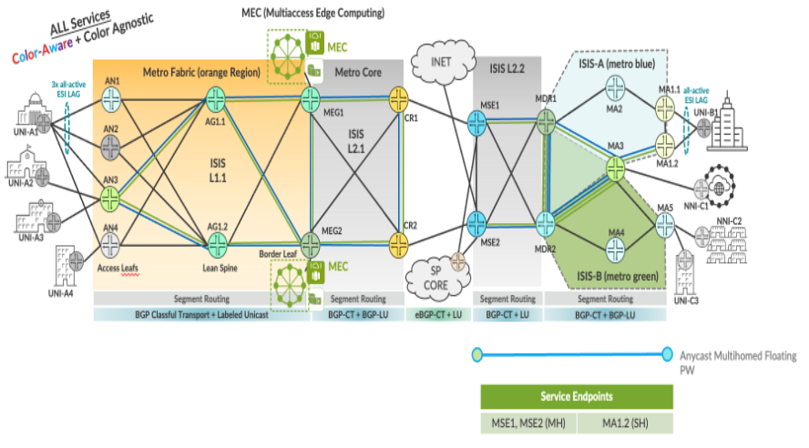

Floating PW with Anycast-SID Service implementation in EBS topology.

| EVPL Service | Service Attributes Test Results |
|--------------|---------------------------------|

<table style="width:100%;">
<colgroup>
<col style="width: 9%" />
<col style="width: 9%" />
<col style="width: 63%" />
<col style="width: 9%" />
<col style="width: 7%" />
</colgroup>
<thead>
<tr>
<th colspan="5" style="text-align: center;">Non Looping Frame Delivery</th>
</tr>
</thead>
<tbody>
<tr>
<td style="text-align: center;">MEF 3.0 Test Plan</td>
<td style="text-align: center;">Test Case Number</td>
<td>Test Case Name</td>
<td style="text-align: center;">Test Result</td>
<td style="text-align: center;">Comments</td>
</tr>
<tr>
<td rowspan="3" style="text-align: center;">Part 1</td>
<td style="text-align: center;">1.1.1</td>
<td>Non-looping frame delivery, broadcast frames</td>
<td style="text-align: center;">PASS</td>
<td style="text-align: center;">-</td>
</tr>
<tr>
<td style="text-align: center;">1.1.2</td>
<td>Non-looping frame delivery, multicast frames</td>
<td style="text-align: center;">PASS</td>
<td style="text-align: center;">-</td>
</tr>
<tr>
<td style="text-align: center;">1.1.3</td>
<td>Non-looping frame delivery, unknown unicast frames</td>
<td style="text-align: center;">PASS</td>
<td style="text-align: center;">-</td>
</tr>
</tbody>
</table>

<table style="width:100%;">
<colgroup>
<col style="width: 9%" />
<col style="width: 9%" />
<col style="width: 63%" />
<col style="width: 9%" />
<col style="width: 7%" />
</colgroup>
<thead>
<tr>
<th colspan="5" style="text-align: center;">CE-VLAN ID and CE-VLAN CoS Preservation YES</th>
</tr>
</thead>
<tbody>
<tr>
<td style="text-align: center;">MEF 3.0 Test Plan</td>
<td style="text-align: center;">Test Case Number</td>
<td>Test Case Name</td>
<td style="text-align: center;">Test Result</td>
<td style="text-align: center;">Comments</td>
</tr>
<tr>
<td style="text-align: center;">Part 1</td>
<td style="text-align: center;">11.2.1</td>
<td>CE-VLAN ID preservation, tagged frames</td>
<td style="text-align: center;">PASS</td>
<td style="text-align: center;">-</td>
</tr>
</tbody>
</table>

<table>
<colgroup>
<col style="width: 9%" />
<col style="width: 9%" />
<col style="width: 63%" />
<col style="width: 9%" />
<col style="width: 7%" />
</colgroup>
<thead>
<tr>
<th colspan="5" style="text-align: center;">UNI Physical Layer and MAC Layer</th>
</tr>
</thead>
<tbody>
<tr>
<td style="text-align: center;">MEF 3.0 Test Plan</td>
<td style="text-align: center;">Test Case Number</td>
<td>Test Case Name</td>
<td style="text-align: center;">Test Result</td>
<td style="text-align: center;">Comments</td>
</tr>
<tr>
<td style="text-align: center;">Part 1</td>
<td style="text-align: center;">15.2.1</td>
<td>UNI physical layer, mode and speed</td>
<td style="text-align: center;">PASS</td>
<td style="text-align: center;">-</td>
</tr>
</tbody>
</table>

<table>
<colgroup>
<col style="width: 9%" />
<col style="width: 9%" />
<col style="width: 63%" />
<col style="width: 9%" />
<col style="width: 7%" />
</colgroup>
<thead>
<tr>
<th colspan="5" style="text-align: center;">EVC Maximum Transmission Unit Size</th>
</tr>
</thead>
<tbody>
<tr>
<td style="text-align: center;">MEF 3.0 Test Plan</td>
<td style="text-align: center;">Test Case Number</td>
<td>Test Case Name</td>
<td style="text-align: center;">Test Result</td>
<td style="text-align: center;">Comments</td>
</tr>
<tr>
<td style="text-align: center;">Part 1</td>
<td style="text-align: center;">16.2.2</td>
<td>EVC Maximum Service Frame Size - Tagged</td>
<td style="text-align: center;">PASS</td>
<td style="text-align: center;"><strong>-</strong></td>
</tr>
</tbody>
</table>

<table style="width:100%;">
<colgroup>
<col style="width: 9%" />
<col style="width: 9%" />
<col style="width: 63%" />
<col style="width: 9%" />
<col style="width: 7%" />
</colgroup>
<thead>
<tr>
<th colspan="5" style="text-align: center;">CE-VLAN ID/EVC Map</th>
</tr>
</thead>
<tbody>
<tr>
<td style="text-align: center;">MEF 3.0 Test Plan</td>
<td style="text-align: center;">Test Case Number</td>
<td>Test Case Name</td>
<td style="text-align: center;">Test Result</td>
<td style="text-align: center;">Comments</td>
</tr>
<tr>
<td style="text-align: center;">Part 1</td>
<td style="text-align: center;">20.2.1</td>
<td>CE-VLAN ID/EVC Map, Service Frame Discard</td>
<td style="text-align: center;">PASS</td>
<td style="text-align: center;">-</td>
</tr>
</tbody>
</table>

<table>
<colgroup>
<col style="width: 9%" />
<col style="width: 9%" />
<col style="width: 63%" />
<col style="width: 9%" />
<col style="width: 7%" />
</colgroup>
<thead>
<tr>
<th colspan="5" style="text-align: center;">Service OAM</th>
</tr>
</thead>
<tbody>
<tr>
<td style="text-align: center;">MEF 3.0 Test Plan</td>
<td style="text-align: center;">Test Case Number</td>
<td>Test Case Name</td>
<td style="text-align: center;">Test Result</td>
<td style="text-align: center;">Comments</td>
</tr>
<tr>
<td rowspan="6" style="text-align: center;">Part 1</td>
<td style="text-align: center;">1.2.1</td>
<td>Continuity Check Message Transparency - Untagged CCM Service Frame</td>
<td style="text-align: center;">PASS</td>
<td style="text-align: center;">-</td>
</tr>
<tr>
<td style="text-align: center;">2.2.1</td>
<td>Multicast Loopback Message Transparency - Untagged LBM Service Frame</td>
<td style="text-align: center;">PASS</td>
<td style="text-align: center;">-</td>
</tr>
<tr>
<td style="text-align: center;">3.2.1</td>
<td>Unicast Loopback Message Transparency - Untagged LBM Service Frame</td>
<td style="text-align: center;">PASS</td>
<td style="text-align: center;">-</td>
</tr>
<tr>
<td style="text-align: center;">4.2.1</td>
<td>Loopback Response Transparency - Untagged LBR Service Frame</td>
<td style="text-align: center;">PASS</td>
<td style="text-align: center;">-</td>
</tr>
<tr>
<td style="text-align: center;">5.2.1</td>
<td>Linktrace Message Transparency - Untagged LTM Service Frame</td>
<td style="text-align: center;">PASS</td>
<td style="text-align: center;">-</td>
</tr>
<tr>
<td style="text-align: center;">6.2.1</td>
<td>Linktrace Response Transparency - Untagged LTR Service Frame</td>
<td style="text-align: center;">PASS</td>
<td style="text-align: center;">-</td>
</tr>
</tbody>
</table>

<table>
<colgroup>
<col style="width: 9%" />
<col style="width: 9%" />
<col style="width: 64%" />
<col style="width: 8%" />
<col style="width: 8%" />
</colgroup>
<thead>
<tr>
<th colspan="5" style="text-align: center;">Service Frame Transparency</th>
</tr>
</thead>
<tbody>
<tr>
<td style="text-align: center;">MEF 3.0 Test Plan</td>
<td style="text-align: center;">Test Case Number</td>
<td>Test Case Name</td>
<td style="text-align: center;">Test Result</td>
<td style="text-align: center;">Comments</td>
</tr>
<tr>
<td style="text-align: center;">Part 1</td>
<td style="text-align: center;">6.2.1</td>
<td>Service Frame Transparency - Tagged to Tagged</td>
<td style="text-align: center;">PASS</td>
<td style="text-align: center;">-</td>
</tr>
</tbody>
</table>

<table>
<colgroup>
<col style="width: 9%" />
<col style="width: 9%" />
<col style="width: 63%" />
<col style="width: 9%" />
<col style="width: 7%" />
</colgroup>
<thead>
<tr>
<th colspan="5" style="text-align: center;">L2CP Service Frames</th>
</tr>
</thead>
<tbody>
<tr>
<td style="text-align: center;">MEF 3.0 Test Plan</td>
<td style="text-align: center;">Test Case Number</td>
<td>Test Case Name</td>
<td style="text-align: center;">Test Result</td>
<td style="text-align: center;">Comments</td>
</tr>
<tr>
<td rowspan="20" style="text-align: center;">Part 1</td>
<td rowspan="20" style="text-align: center;">E_L_F_2</td>
<td>L2CP Service Frames Must Not Tunnel - 01:80:C2:00:00:01, 0x8808</td>
<td style="text-align: center;">PASS</td>
<td style="text-align: center;">-</td>
</tr>
<tr>
<td>L2CP Service Frames Must Not Tunnel - 01:80:C2:00:00:02, 0x8809/01/02</td>
<td style="text-align: center;">PASS</td>
<td style="text-align: center;">-</td>
</tr>
<tr>
<td>L2CP Service Frames Must Not Tunnel - 01:80:C2:00:00:02, 0x8809/03</td>
<td style="text-align: center;">PASS</td>
<td style="text-align: center;">-</td>
</tr>
<tr>
<td>L2CP Service Frames Must Not Tunnel - 01:80:C2:00:00:02, 0x8809/0A</td>
<td style="text-align: center;">PASS</td>
<td style="text-align: center;">-</td>
</tr>
<tr>
<td>L2CP Service Frames Must Not Tunnel - 01:80:C2:00:00:03, 0x888E</td>
<td style="text-align: center;">PASS</td>
<td style="text-align: center;">-</td>
</tr>
<tr>
<td>L2CP Service Frames Must Not Tunnel - 01:80:C2:00:00:04</td>
<td style="text-align: center;">PASS</td>
<td style="text-align: center;">-</td>
</tr>
<tr>
<td>L2CP Service Frames Must Not Tunnel - 01:80:C2:00:00:05</td>
<td style="text-align: center;">PASS</td>
<td style="text-align: center;">-</td>
</tr>
<tr>
<td>L2CP Service Frames Must Not Tunnel - 01:80:C2:00:00:06</td>
<td style="text-align: center;">PASS</td>
<td style="text-align: center;">-</td>
</tr>
<tr>
<td>L2CP Service Frames Must Not Tunnel - 01:80:C2:00:00:07, 0x88EE</td>
<td style="text-align: center;">PASS</td>
<td style="text-align: center;">-</td>
</tr>
<tr>
<td>L2CP Service Frames Must Not Tunnel - 01:80:C2:00:00:08</td>
<td style="text-align: center;">PASS</td>
<td style="text-align: center;">-</td>
</tr>
<tr>
<td>L2CP Service Frames Must Not Tunnel - 01:80:C2:00:00:09</td>
<td style="text-align: center;">PASS</td>
<td style="text-align: center;">-</td>
</tr>
<tr>
<td>L2CP Service Frames Must Not Tunnel - 01:80:C2:00:00:0A</td>
<td style="text-align: center;">PASS</td>
<td style="text-align: center;">-</td>
</tr>
<tr>
<td>L2CP Service Frames Must Not Tunnel - 01:80:C2:00:00:0E, 0x88CC</td>
<td style="text-align: center;">PASS</td>
<td style="text-align: center;">-</td>
</tr>
<tr>
<td>L2CP Service Frames Must Not Tunnel - 01:80:C2:00:00:0E, 0x88F7</td>
<td style="text-align: center;">PASS</td>
<td style="text-align: center;">-</td>
</tr>
<tr>
<td>L2CP Service Frames Must Not Tunnel - 01:80:C2:00:00:20 through 01:80:C2:00:00:2F</td>
<td style="text-align: center;">PASS</td>
<td style="text-align: center;">-</td>
</tr>
<tr>
<td>L2CP Service Frames Must Not Tunnel - 01:80:C2:00:00:00</td>
<td style="text-align: center;">PASS</td>
<td style="text-align: center;">-</td>
</tr>
<tr>
<td>L2CP Service Frames Must Not Tunnel - 01:80:C2:00:00:0B</td>
<td style="text-align: center;">PASS</td>
<td style="text-align: center;">-</td>
</tr>
<tr>
<td>L2CP Service Frames Must Not Tunnel - 01:80:C2:00:00:0C</td>
<td style="text-align: center;">PASS</td>
<td style="text-align: center;">-</td>
</tr>
<tr>
<td>L2CP Service Frames Must Not Tunnel - 01:80:C2:00:00:0D</td>
<td style="text-align: center;">PASS</td>
<td style="text-align: center;">-</td>
</tr>
<tr>
<td>L2CP Service Frames Must Not Tunnel - 01:80:C2:00:00:0F</td>
<td style="text-align: center;">PASS</td>
<td style="text-align: center;">-</td>
</tr>
</tbody>
</table>

| EVPL SERVICE | Performance Results |
|--------------|---------------------|

<table>
<colgroup>
<col style="width: 9%" />
<col style="width: 9%" />
<col style="width: 10%" />
<col style="width: 10%" />
<col style="width: 10%" />
<col style="width: 8%" />
<col style="width: 7%" />
<col style="width: 13%" />
<col style="width: 10%" />
<col style="width: 10%" />
</colgroup>
<thead>
<tr>
<th colspan="10" style="text-align: center;">One-Way Frame Delay Performance – Performance Tier 1</th>
</tr>
</thead>
<tbody>
<tr>
<td style="text-align: center;">MEF 3.0 Test Plan</td>
<td style="text-align: center;">Test Case Number</td>
<td colspan="6">Test Case Name and Bandwidth Profile Parameters</td>
<td style="text-align: center;">Test Result</td>
<td style="text-align: center;">Comments</td>
</tr>
<tr>
<td rowspan="4" style="text-align: center;">Part 2</td>
<td rowspan="4" style="text-align: center;">1.1.1</td>
<td colspan="6">One-Way Frame Delay Performance with CIR = 3500 Mbps</td>
<td rowspan="4" style="text-align: center;">PASS</td>
<td rowspan="4" style="text-align: center;">-</td>
</tr>
<tr>
<td style="text-align: center;">CIR</td>
<td style="text-align: center;">CBS</td>
<td style="text-align: center;">EIR</td>
<td style="text-align: center;">EBS</td>
<td style="text-align: center;">CM</td>
<td style="text-align: center;">Class of Service</td>
</tr>
<tr>
<td style="text-align: center;">3500 Mbps</td>
<td style="text-align: center;">35000 Bytes</td>
<td style="text-align: center;">0 Mbps</td>
<td style="text-align: center;">0 Bytes</td>
<td style="text-align: center;">Color-Blind</td>
<td style="text-align: center;">High</td>
</tr>
<tr>
<td style="text-align: center;">3500 Mbps</td>
<td style="text-align: center;">35000 Bytes</td>
<td style="text-align: center;">3500 Mbps</td>
<td style="text-align: center;">35000 Bytes</td>
<td style="text-align: center;">Color-Blind</td>
<td style="text-align: center;">Medium</td>
</tr>
</tbody>
</table>

<table>
<colgroup>
<col style="width: 9%" />
<col style="width: 9%" />
<col style="width: 10%" />
<col style="width: 10%" />
<col style="width: 10%" />
<col style="width: 8%" />
<col style="width: 7%" />
<col style="width: 13%" />
<col style="width: 10%" />
<col style="width: 10%" />
</colgroup>
<thead>
<tr>
<th colspan="10" style="text-align: center;">One-Way Mean Frame Delay Performance – Performance Tier 1</th>
</tr>
</thead>
<tbody>
<tr>
<td style="text-align: center;">MEF 3.0 Test Plan</td>
<td style="text-align: center;">Test Case Number</td>
<td colspan="6">Test Case Name and Bandwidth Profile Parameters</td>
<td style="text-align: center;">Test Result</td>
<td style="text-align: center;">Comments</td>
</tr>
<tr>
<td rowspan="4" style="text-align: center;">Part 2</td>
<td rowspan="4" style="text-align: center;">2.1.1</td>
<td colspan="6">One-Way Frame Delay Performance with CIR = 3500 Mbps</td>
<td rowspan="4" style="text-align: center;">PASS</td>
<td rowspan="4" style="text-align: center;">-</td>
</tr>
<tr>
<td style="text-align: center;">CIR</td>
<td style="text-align: center;">CBS</td>
<td style="text-align: center;">EIR</td>
<td style="text-align: center;">EBS</td>
<td style="text-align: center;">CM</td>
<td style="text-align: center;">Class of Service</td>
</tr>
<tr>
<td style="text-align: center;">3500 Mbps</td>
<td style="text-align: center;">35000 Bytes</td>
<td style="text-align: center;">0 Mbps</td>
<td style="text-align: center;">0 Bytes</td>
<td style="text-align: center;">Color-Blind</td>
<td style="text-align: center;">High</td>
</tr>
<tr>
<td style="text-align: center;">3500 Mbps</td>
<td style="text-align: center;">35000 Bytes</td>
<td style="text-align: center;">3500 Mbps</td>
<td style="text-align: center;">35000 Bytes</td>
<td style="text-align: center;">Color-Blind</td>
<td style="text-align: center;">Medium</td>
</tr>
</tbody>
</table>

<table>
<colgroup>
<col style="width: 9%" />
<col style="width: 9%" />
<col style="width: 10%" />
<col style="width: 10%" />
<col style="width: 10%" />
<col style="width: 8%" />
<col style="width: 7%" />
<col style="width: 13%" />
<col style="width: 10%" />
<col style="width: 10%" />
</colgroup>
<thead>
<tr>
<th colspan="10" style="text-align: center;">One-Way Inter-Frame Delay Performance – Performance Tier 1</th>
</tr>
</thead>
<tbody>
<tr>
<td style="text-align: center;">MEF 3.0 Test Plan</td>
<td style="text-align: center;">Test Case Number</td>
<td colspan="6">Test Case Name and Bandwidth Profile Parameters</td>
<td style="text-align: center;">Test Result</td>
<td style="text-align: center;">Comments</td>
</tr>
<tr>
<td rowspan="4" style="text-align: center;">Part 2</td>
<td rowspan="4" style="text-align: center;">3.1.1</td>
<td colspan="6">One-Way Frame Delay Performance with CIR = 3500 Mbps</td>
<td rowspan="4" style="text-align: center;">PASS</td>
<td rowspan="4" style="text-align: center;">-</td>
</tr>
<tr>
<td style="text-align: center;">CIR</td>
<td style="text-align: center;">CBS</td>
<td style="text-align: center;">EIR</td>
<td style="text-align: center;">EBS</td>
<td style="text-align: center;">CM</td>
<td style="text-align: center;">Class of Service</td>
</tr>
<tr>
<td style="text-align: center;">3500 Mbps</td>
<td style="text-align: center;">35000 Bytes</td>
<td style="text-align: center;">0 Mbps</td>
<td style="text-align: center;">0 Bytes</td>
<td style="text-align: center;">Color-Blind</td>
<td style="text-align: center;">High</td>
</tr>
<tr>
<td style="text-align: center;">3500 Mbps</td>
<td style="text-align: center;">35000 Bytes</td>
<td style="text-align: center;">3500 Mbps</td>
<td style="text-align: center;">35000 Bytes</td>
<td style="text-align: center;">Color-Blind</td>
<td style="text-align: center;">Medium</td>
</tr>
</tbody>
</table>

<table>
<colgroup>
<col style="width: 9%" />
<col style="width: 9%" />
<col style="width: 10%" />
<col style="width: 10%" />
<col style="width: 10%" />
<col style="width: 8%" />
<col style="width: 7%" />
<col style="width: 13%" />
<col style="width: 10%" />
<col style="width: 10%" />
</colgroup>
<thead>
<tr>
<th colspan="10" style="text-align: center;">One-Way Frame Delay Range Performance – Performance Tier 1</th>
</tr>
</thead>
<tbody>
<tr>
<td style="text-align: center;">MEF 3.0 Test Plan</td>
<td style="text-align: center;">Test Case Number</td>
<td colspan="6">Test Case Name and Bandwidth Profile Parameters</td>
<td style="text-align: center;">Test Result</td>
<td style="text-align: center;">Comments</td>
</tr>
<tr>
<td rowspan="4" style="text-align: center;">Part 2</td>
<td rowspan="4" style="text-align: center;">4.1.1</td>
<td colspan="6">One-Way Frame Delay Performance with CIR = 3500 Mbps</td>
<td rowspan="4" style="text-align: center;">PASS</td>
<td rowspan="4" style="text-align: center;">-</td>
</tr>
<tr>
<td style="text-align: center;">CIR</td>
<td style="text-align: center;">CBS</td>
<td style="text-align: center;">EIR</td>
<td style="text-align: center;">EBS</td>
<td style="text-align: center;">CM</td>
<td style="text-align: center;">Class of Service</td>
</tr>
<tr>
<td style="text-align: center;">3500 Mbps</td>
<td style="text-align: center;">35000 Bytes</td>
<td style="text-align: center;">0 Mbps</td>
<td style="text-align: center;">0 Bytes</td>
<td style="text-align: center;">Color-Blind</td>
<td style="text-align: center;">High</td>
</tr>
<tr>
<td style="text-align: center;">3500 Mbps</td>
<td style="text-align: center;">35000 Bytes</td>
<td style="text-align: center;">3500 Mbps</td>
<td style="text-align: center;">35000 Bytes</td>
<td style="text-align: center;">Color-Blind</td>
<td style="text-align: center;">Medium</td>
</tr>
</tbody>
</table>

<table>
<colgroup>
<col style="width: 9%" />
<col style="width: 9%" />
<col style="width: 10%" />
<col style="width: 10%" />
<col style="width: 10%" />
<col style="width: 8%" />
<col style="width: 7%" />
<col style="width: 13%" />
<col style="width: 10%" />
<col style="width: 10%" />
</colgroup>
<thead>
<tr>
<th colspan="10" style="text-align: center;">One-Way Frame Loss Performance – Performance Tier 1</th>
</tr>
</thead>
<tbody>
<tr>
<td style="text-align: center;">MEF 3.0 Test Plan</td>
<td style="text-align: center;">Test Case Number</td>
<td colspan="6">Test Case Name and Bandwidth Profile Parameters</td>
<td style="text-align: center;">Test Result</td>
<td style="text-align: center;">Comments</td>
</tr>
<tr>
<td rowspan="4" style="text-align: center;">Part 2</td>
<td rowspan="4" style="text-align: center;">5.1.1</td>
<td colspan="6">One-Way Frame Delay Performance with CIR = 3500 Mbps</td>
<td rowspan="4" style="text-align: center;">PASS</td>
<td rowspan="4" style="text-align: center;">-</td>
</tr>
<tr>
<td style="text-align: center;">CIR</td>
<td style="text-align: center;">CBS</td>
<td style="text-align: center;">EIR</td>
<td style="text-align: center;">EBS</td>
<td style="text-align: center;">CM</td>
<td style="text-align: center;">Class of Service</td>
</tr>
<tr>
<td style="text-align: center;">3500 Mbps</td>
<td style="text-align: center;">35000 Bytes</td>
<td style="text-align: center;">0 Mbps</td>
<td style="text-align: center;">0 Bytes</td>
<td style="text-align: center;">Color-Blind</td>
<td style="text-align: center;">High</td>
</tr>
<tr>
<td style="text-align: center;">3500 Mbps</td>
<td style="text-align: center;">35000 Bytes</td>
<td style="text-align: center;">3500 Mbps</td>
<td style="text-align: center;">35000 Bytes</td>
<td style="text-align: center;">Color-Blind</td>
<td style="text-align: center;">Medium</td>
</tr>
</tbody>
</table>

| EVPL SERVICE | Traffic Management Test Results |
|--------------|---------------------------------|

<table>
<colgroup>
<col style="width: 8%" />
<col style="width: 8%" />
<col style="width: 9%" />
<col style="width: 9%" />
<col style="width: 9%" />
<col style="width: 7%" />
<col style="width: 6%" />
<col style="width: 11%" />
<col style="width: 10%" />
<col style="width: 9%" />
<col style="width: 10%" />
</colgroup>
<thead>
<tr>
<th colspan="11" style="text-align: center;">Ingress Bandwidth Profile - CIR Enforcement</th>
</tr>
</thead>
<tbody>
<tr>
<td style="text-align: center;">MEF 3.0 Test Plan</td>
<td style="text-align: center;">Test Case Number</td>
<td colspan="7">Test Case Name and Bandwidth Profile Parameters</td>
<td style="text-align: center;">Test Result</td>
<td style="text-align: center;">Comments</td>
</tr>
<tr>
<td rowspan="3" style="text-align: center;">Part 2</td>
<td rowspan="3" style="text-align: center;">1.1.6</td>
<td colspan="7">CBS Enforcement Tagged Frames when [CIR/CBS&gt;0 and EIR/EBS=0] and CoS ID per EVC &amp; PCP</td>
<td rowspan="3" style="text-align: center;">PASS</td>
<td rowspan="3" style="text-align: center;">-</td>
</tr>
<tr>
<td style="text-align: center;">CIR</td>
<td style="text-align: center;">CBS</td>
<td style="text-align: center;">EIR</td>
<td style="text-align: center;">EBS</td>
<td style="text-align: center;">CM</td>
<td style="text-align: center;">Class of Service</td>
<td style="text-align: center;">Test Frame sizes</td>
</tr>
<tr>
<td style="text-align: center;">3500 Mbps</td>
<td style="text-align: center;">35000 Bytes</td>
<td style="text-align: center;">0 Mbps</td>
<td style="text-align: center;">0 Bytes</td>
<td style="text-align: center;">Color-Blind</td>
<td style="text-align: center;">High</td>
<td style="text-align: center;">80,600,1500</td>
</tr>
</tbody>
</table>

<table>
<colgroup>
<col style="width: 8%" />
<col style="width: 8%" />
<col style="width: 9%" />
<col style="width: 9%" />
<col style="width: 9%" />
<col style="width: 7%" />
<col style="width: 6%" />
<col style="width: 11%" />
<col style="width: 10%" />
<col style="width: 9%" />
<col style="width: 10%" />
</colgroup>
<thead>
<tr>
<th colspan="11" style="text-align: center;">Ingress Bandwidth Profile - CBS Enforcement</th>
</tr>
</thead>
<tbody>
<tr>
<td style="text-align: center;">MEF 3.0 Test Plan</td>
<td style="text-align: center;">Test Case Number</td>
<td colspan="7">Test Case Name and Bandwidth Profile Parameters</td>
<td style="text-align: center;">Test Result</td>
<td style="text-align: center;">Comments</td>
</tr>
<tr>
<td rowspan="3" style="text-align: center;">Part 2</td>
<td rowspan="3" style="text-align: center;">2.1.6</td>
<td colspan="7">CBS Enforcement Tagged Frames when [CIR/CBS&gt;0 and EIR/EBS=0] and CoS ID per EVC &amp; PCP</td>
<td rowspan="3" style="text-align: center;">PASS</td>
<td rowspan="3" style="text-align: center;">-</td>
</tr>
<tr>
<td style="text-align: center;">CIR</td>
<td style="text-align: center;">CBS</td>
<td style="text-align: center;">EIR</td>
<td style="text-align: center;">EBS</td>
<td style="text-align: center;">CM</td>
<td style="text-align: center;">Class of Service</td>
<td style="text-align: center;">Test Frame sizes</td>
</tr>
<tr>
<td style="text-align: center;">3500 Mbps</td>
<td style="text-align: center;">35000 Bytes</td>
<td style="text-align: center;">0 Mbps</td>
<td style="text-align: center;">0 Bytes</td>
<td style="text-align: center;">Color-Blind</td>
<td style="text-align: center;">High</td>
<td style="text-align: center;">80,600,1500</td>
</tr>
</tbody>
</table>

<table>
<colgroup>
<col style="width: 8%" />
<col style="width: 8%" />
<col style="width: 9%" />
<col style="width: 9%" />
<col style="width: 9%" />
<col style="width: 7%" />
<col style="width: 6%" />
<col style="width: 11%" />
<col style="width: 10%" />
<col style="width: 9%" />
<col style="width: 10%" />
</colgroup>
<thead>
<tr>
<th colspan="11" style="text-align: center;">Ingress Bandwidth Profile - EIR Enforcement</th>
</tr>
</thead>
<tbody>
<tr>
<td style="text-align: center;">MEF 3.0 Test Plan</td>
<td style="text-align: center;">Test Case Number</td>
<td colspan="7">Test Case Name and Bandwidth Profile Parameters</td>
<td style="text-align: center;">Test Result</td>
<td style="text-align: center;">Comments</td>
</tr>
<tr>
<td rowspan="3" style="text-align: center;">Part 2</td>
<td rowspan="3" style="text-align: center;">3.1.6</td>
<td colspan="7">EIR Enforcement Tagged Frames when [CIR/CBS=0 and EIR/EBS&gt;0] and CoS ID per EVC &amp; PCP</td>
<td rowspan="3" style="text-align: center;">PASS</td>
<td rowspan="3" style="text-align: center;">-</td>
</tr>
<tr>
<td style="text-align: center;">CIR</td>
<td style="text-align: center;">CBS</td>
<td style="text-align: center;">EIR</td>
<td style="text-align: center;">EBS</td>
<td style="text-align: center;">CM</td>
<td style="text-align: center;">Class of Service</td>
<td style="text-align: center;">Test Frame sizes</td>
</tr>
<tr>
<td style="text-align: center;">0 Mbps</td>
<td style="text-align: center;">0 Bytes</td>
<td style="text-align: center;">3500 Mbps</td>
<td style="text-align: center;">35000 Bytes</td>
<td style="text-align: center;">Color-Blind</td>
<td style="text-align: center;">Low</td>
<td style="text-align: center;">80,600,1500</td>
</tr>
</tbody>
</table>

<table>
<colgroup>
<col style="width: 8%" />
<col style="width: 8%" />
<col style="width: 9%" />
<col style="width: 9%" />
<col style="width: 9%" />
<col style="width: 7%" />
<col style="width: 6%" />
<col style="width: 11%" />
<col style="width: 10%" />
<col style="width: 9%" />
<col style="width: 10%" />
</colgroup>
<thead>
<tr>
<th colspan="11" style="text-align: center;">Ingress Bandwidth Profile - EBS Enforcement</th>
</tr>
</thead>
<tbody>
<tr>
<td style="text-align: center;">MEF 3.0 Test Plan</td>
<td style="text-align: center;">Test Case Number</td>
<td colspan="7">Test Case Name and Bandwidth Profile Parameters</td>
<td style="text-align: center;">Test Result</td>
<td style="text-align: center;">Comments</td>
</tr>
<tr>
<td rowspan="3" style="text-align: center;">Part 2</td>
<td rowspan="3" style="text-align: center;">4.1.6</td>
<td colspan="7">EBS Enforcement Tagged Frames when [CIR/CBS=0 and EIR/EBS&gt;0] and CoS ID per EVC &amp; PCP</td>
<td rowspan="3" style="text-align: center;">PASS</td>
<td rowspan="3" style="text-align: center;">-</td>
</tr>
<tr>
<td style="text-align: center;">CIR</td>
<td style="text-align: center;">CBS</td>
<td style="text-align: center;">EIR</td>
<td style="text-align: center;">EBS</td>
<td style="text-align: center;">CM</td>
<td style="text-align: center;">Class of Service</td>
<td style="text-align: center;">Test Frame sizes</td>
</tr>
<tr>
<td style="text-align: center;">3500 Mbps</td>
<td style="text-align: center;">35000 Bytes</td>
<td style="text-align: center;">0 Mbps</td>
<td style="text-align: center;">0 Bytes</td>
<td style="text-align: center;">Color-Blind</td>
<td style="text-align: center;">Low</td>
<td style="text-align: center;">80,600,1500</td>
</tr>
</tbody>
</table>

<table>
<colgroup>
<col style="width: 8%" />
<col style="width: 8%" />
<col style="width: 9%" />
<col style="width: 9%" />
<col style="width: 9%" />
<col style="width: 7%" />
<col style="width: 6%" />
<col style="width: 11%" />
<col style="width: 10%" />
<col style="width: 9%" />
<col style="width: 10%" />
</colgroup>
<thead>
<tr>
<th colspan="11" style="text-align: center;">Ingress Bandwidth Profile - CIR and EIR Enforcement</th>
</tr>
</thead>
<tbody>
<tr>
<td style="text-align: center;">MEF 3.0 Test Plan</td>
<td style="text-align: center;">Test Case Number</td>
<td colspan="7">Test Case Name and Bandwidth Profile Parameters</td>
<td style="text-align: center;">Test Result</td>
<td style="text-align: center;">Comments</td>
</tr>
<tr>
<td rowspan="3" style="text-align: center;">Part 2</td>
<td rowspan="3" style="text-align: center;">5.1.6</td>
<td colspan="7">CIR and EIR Enforcement Tagged Frames when [CIR/CBS&gt;0 and EIR/EBS&gt;0] and CoS ID per EVC &amp; PCP</td>
<td rowspan="3" style="text-align: center;">PASS</td>
<td rowspan="3" style="text-align: center;">-</td>
</tr>
<tr>
<td style="text-align: center;">CIR</td>
<td style="text-align: center;">CBS</td>
<td style="text-align: center;">EIR</td>
<td style="text-align: center;">EBS</td>
<td style="text-align: center;">CM</td>
<td style="text-align: center;">Class of Service</td>
<td style="text-align: center;">Test Frame sizes</td>
</tr>
<tr>
<td style="text-align: center;">3500 Mbps</td>
<td style="text-align: center;">35000 Bytes</td>
<td style="text-align: center;">3500 Mbps</td>
<td style="text-align: center;">35000 Bytes</td>
<td style="text-align: center;">Color-Blind</td>
<td style="text-align: center;">Medium</td>
<td style="text-align: center;">80,600,1500</td>
</tr>
</tbody>
</table>

<table>
<colgroup>
<col style="width: 8%" />
<col style="width: 8%" />
<col style="width: 9%" />
<col style="width: 9%" />
<col style="width: 9%" />
<col style="width: 7%" />
<col style="width: 6%" />
<col style="width: 11%" />
<col style="width: 10%" />
<col style="width: 9%" />
<col style="width: 10%" />
</colgroup>
<thead>
<tr>
<th colspan="11" style="text-align: center;">Ingress Bandwidth Profile - CBS and EBS Enforcement</th>
</tr>
</thead>
<tbody>
<tr>
<td style="text-align: center;">MEF 3.0 Test Plan</td>
<td style="text-align: center;">Test Case Number</td>
<td colspan="7">Test Case Name and Bandwidth Profile Parameters</td>
<td style="text-align: center;">Test Result</td>
<td style="text-align: center;">Comments</td>
</tr>
<tr>
<td rowspan="3" style="text-align: center;">Part 2</td>
<td rowspan="3" style="text-align: center;">6.1.6</td>
<td colspan="7">CBS and EBS Enforcement Tagged Frames when [CIR/CBS&gt;0 and EIR/EBS&gt;0] and CoS ID per EVC &amp; PCP</td>
<td rowspan="3" style="text-align: center;">PASS</td>
<td rowspan="3" style="text-align: center;">-</td>
</tr>
<tr>
<td style="text-align: center;">CIR</td>
<td style="text-align: center;">CBS</td>
<td style="text-align: center;">EIR</td>
<td style="text-align: center;">EBS</td>
<td style="text-align: center;">CM</td>
<td style="text-align: center;">Class of Service</td>
<td style="text-align: center;">Test Frame sizes</td>
</tr>
<tr>
<td style="text-align: center;">3500 Mbps</td>
<td style="text-align: center;">35000 Bytes</td>
<td style="text-align: center;">3500 Mbps</td>
<td style="text-align: center;">35000 Bytes</td>
<td style="text-align: center;">Color-Blind</td>
<td style="text-align: center;">Medium</td>
<td style="text-align: center;">80,600,1500</td>
</tr>
</tbody>
</table>

<table>
<colgroup>
<col style="width: 8%" />
<col style="width: 8%" />
<col style="width: 9%" />
<col style="width: 9%" />
<col style="width: 9%" />
<col style="width: 7%" />
<col style="width: 6%" />
<col style="width: 11%" />
<col style="width: 10%" />
<col style="width: 9%" />
<col style="width: 10%" />
</colgroup>
<thead>
<tr>
<th colspan="11" style="text-align: center;">Ingress Bandwidth Profile - Unconditional Delivery of Frames</th>
</tr>
</thead>
<tbody>
<tr>
<td style="text-align: center;">MEF 3.0 Test Plan</td>
<td style="text-align: center;">Test Case Number</td>
<td colspan="7">Test Case Name and Bandwidth Profile Parameters</td>
<td style="text-align: center;">Test Result</td>
<td style="text-align: center;">Comments</td>
</tr>
<tr>
<td rowspan="12" style="text-align: center;">Part 2</td>
<td rowspan="4" style="text-align: center;">7.1.1</td>
<td colspan="7">Unconditional Delivery of Broadcast Frames and CoS ID per EVC &amp; PCP</td>
<td rowspan="4" style="text-align: center;">PASS</td>
<td rowspan="4" style="text-align: center;">-</td>
</tr>
<tr>
<td style="text-align: center;">CIR</td>
<td style="text-align: center;">CBS</td>
<td style="text-align: center;">EIR</td>
<td style="text-align: center;">EBS</td>
<td style="text-align: center;">CM</td>
<td style="text-align: center;">Class of Service</td>
<td style="text-align: center;">Test Frame sizes</td>
</tr>
<tr>
<td style="text-align: center;">3500 Mbps</td>
<td style="text-align: center;">35000 Bytes</td>
<td style="text-align: center;">0 Mbps</td>
<td style="text-align: center;">0 Bytes</td>
<td style="text-align: center;">Color-Blind</td>
<td style="text-align: center;">High</td>
<td style="text-align: center;">80,600,1500</td>
</tr>
<tr>
<td style="text-align: center;">3500 Mbps</td>
<td style="text-align: center;">35000 Bytes</td>
<td style="text-align: center;">3500 Mbps</td>
<td style="text-align: center;">35000 Bytes</td>
<td style="text-align: center;">Color-Blind</td>
<td style="text-align: center;">Medium</td>
<td style="text-align: center;">80,600,1500</td>
</tr>
<tr>
<td rowspan="4" style="text-align: center;">7.1.2</td>
<td colspan="7">Unconditional Delivery of Mutlicast Frames and CoS ID per EVC &amp; PCP</td>
<td rowspan="4" style="text-align: center;">PASS</td>
<td rowspan="4" style="text-align: center;">-</td>
</tr>
<tr>
<td style="text-align: center;">CIR</td>
<td style="text-align: center;">CBS</td>
<td style="text-align: center;">EIR</td>
<td style="text-align: center;">EBS</td>
<td style="text-align: center;">CM</td>
<td style="text-align: center;">Class of Service</td>
<td style="text-align: center;">Test Frame sizes</td>
</tr>
<tr>
<td style="text-align: center;">3500 Mbps</td>
<td style="text-align: center;">35000 Bytes</td>
<td style="text-align: center;">0 Mbps</td>
<td style="text-align: center;">0 Bytes</td>
<td style="text-align: center;">Color-Blind</td>
<td style="text-align: center;">High</td>
<td style="text-align: center;">80,600,1500</td>
</tr>
<tr>
<td style="text-align: center;">3500 Mbps</td>
<td style="text-align: center;">35000 Bytes</td>
<td style="text-align: center;">3500 Mbps</td>
<td style="text-align: center;">35000 Bytes</td>
<td style="text-align: center;">Color-Blind</td>
<td style="text-align: center;">Medium</td>
<td style="text-align: center;">80,600,1500</td>
</tr>
<tr>
<td rowspan="4" style="text-align: center;">7.1.3</td>
<td colspan="7">Unconditional Delivery of Unicast Frames and CoS ID per EVC &amp; PCP</td>
<td rowspan="4" style="text-align: center;">PASS</td>
<td rowspan="4" style="text-align: center;">-</td>
</tr>
<tr>
<td style="text-align: center;">CIR</td>
<td style="text-align: center;">CBS</td>
<td style="text-align: center;">EIR</td>
<td style="text-align: center;">EBS</td>
<td style="text-align: center;">CM</td>
<td style="text-align: center;">Class of Service</td>
<td style="text-align: center;">Test Frame sizes</td>
</tr>
<tr>
<td style="text-align: center;">3500 Mbps</td>
<td style="text-align: center;">35000 Bytes</td>
<td style="text-align: center;">0 Mbps</td>
<td style="text-align: center;">0 Bytes</td>
<td style="text-align: center;">Color-Blind</td>
<td style="text-align: center;">High</td>
<td style="text-align: center;">80,600,1500</td>
</tr>
<tr>
<td style="text-align: center;">3500 Mbps</td>
<td style="text-align: center;">35000 Bytes</td>
<td style="text-align: center;">3500 Mbps</td>
<td style="text-align: center;">35000 Bytes</td>
<td style="text-align: center;">Color-Blind</td>
<td style="text-align: center;">Medium</td>
<td style="text-align: center;">80,600,1500</td>
</tr>
</tbody>
</table>

<table>
<colgroup>
<col style="width: 8%" />
<col style="width: 8%" />
<col style="width: 9%" />
<col style="width: 9%" />
<col style="width: 9%" />
<col style="width: 7%" />
<col style="width: 6%" />
<col style="width: 11%" />
<col style="width: 10%" />
<col style="width: 9%" />
<col style="width: 10%" />
</colgroup>
<thead>
<tr>
<th colspan="11" style="text-align: center;">Ingress Bandwidth Profile - Class of Service Discard</th>
</tr>
</thead>
<tbody>
<tr>
<td style="text-align: center;">MEF 3.0 Test Plan</td>
<td style="text-align: center;">Test Case Number</td>
<td colspan="7">Test Case Name and Bandwidth Profile Parameters</td>
<td style="text-align: center;">Test Result</td>
<td style="text-align: center;">Comments</td>
</tr>
<tr>
<td rowspan="3" style="text-align: center;">Part 2</td>
<td rowspan="3" style="text-align: center;">9.1.1</td>
<td colspan="7">CBS Enforcement Tagged Frames when [CIR/CBS&gt;0 and EIR/EBS=0] and CoS ID per EVC &amp; PCP</td>
<td rowspan="3" style="text-align: center;">PASS</td>
<td rowspan="3" style="text-align: center;">-</td>
</tr>
<tr>
<td style="text-align: center;">CIR</td>
<td style="text-align: center;">CBS</td>
<td style="text-align: center;">EIR</td>
<td style="text-align: center;">EBS</td>
<td style="text-align: center;">CM</td>
<td style="text-align: center;">Class of Service</td>
<td style="text-align: center;">Test Frame sizes</td>
</tr>
<tr>
<td style="text-align: center;">3500 Mbps</td>
<td style="text-align: center;">35000 Bytes</td>
<td style="text-align: center;">0 Mbps</td>
<td style="text-align: center;">0 Bytes</td>
<td style="text-align: center;">Color-Blind</td>
<td style="text-align: center;">High</td>
<td style="text-align: center;">80,600,1500</td>
</tr>
</tbody>
</table>

E-LINE - EVPL

### L2Circuit-HSB:

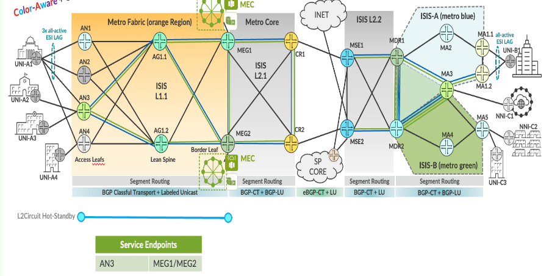

L2Circuit Hot-standby Service implementation in EBS topology.

| EVPL Service | Service Attributes Test Results |
|--------------|---------------------------------|

<table style="width:100%;">
<colgroup>
<col style="width: 9%" />
<col style="width: 9%" />
<col style="width: 63%" />
<col style="width: 9%" />
<col style="width: 7%" />
</colgroup>
<thead>
<tr>
<th colspan="5" style="text-align: center;">Non Looping Frame Delivery</th>
</tr>
</thead>
<tbody>
<tr>
<td style="text-align: center;">MEF 3.0 Test Plan</td>
<td style="text-align: center;">Test Case Number</td>
<td>Test Case Name</td>
<td style="text-align: center;">Test Result</td>
<td style="text-align: center;">Comments</td>
</tr>
<tr>
<td rowspan="3" style="text-align: center;">Part 1</td>
<td style="text-align: center;">1.1.1</td>
<td>Non-looping frame delivery, broadcast frames</td>
<td style="text-align: center;">PASS</td>
<td style="text-align: center;">-</td>
</tr>
<tr>
<td style="text-align: center;">1.1.2</td>
<td>Non-looping frame delivery, multicast frames</td>
<td style="text-align: center;">PASS</td>
<td style="text-align: center;">-</td>
</tr>
<tr>
<td style="text-align: center;">1.1.3</td>
<td>Non-looping frame delivery, unknown unicast frames</td>
<td style="text-align: center;">PASS</td>
<td style="text-align: center;">-</td>
</tr>
</tbody>
</table>

<table style="width:100%;">
<colgroup>
<col style="width: 9%" />
<col style="width: 9%" />
<col style="width: 63%" />
<col style="width: 9%" />
<col style="width: 7%" />
</colgroup>
<thead>
<tr>
<th colspan="5" style="text-align: center;">CE-VLAN ID and CE-VLAN CoS Preservation YES</th>
</tr>
</thead>
<tbody>
<tr>
<td style="text-align: center;">MEF 3.0 Test Plan</td>
<td style="text-align: center;">Test Case Number</td>
<td>Test Case Name</td>
<td style="text-align: center;">Test Result</td>
<td style="text-align: center;">Comments</td>
</tr>
<tr>
<td style="text-align: center;">Part 1</td>
<td style="text-align: center;">11.2.1</td>
<td>CE-VLAN ID preservation, tagged frames</td>
<td style="text-align: center;">PASS</td>
<td style="text-align: center;">-</td>
</tr>
</tbody>
</table>

<table>
<colgroup>
<col style="width: 9%" />
<col style="width: 9%" />
<col style="width: 63%" />
<col style="width: 9%" />
<col style="width: 7%" />
</colgroup>
<thead>
<tr>
<th colspan="5" style="text-align: center;">UNI Physical Layer and MAC Layer</th>
</tr>
</thead>
<tbody>
<tr>
<td style="text-align: center;">MEF 3.0 Test Plan</td>
<td style="text-align: center;">Test Case Number</td>
<td>Test Case Name</td>
<td style="text-align: center;">Test Result</td>
<td style="text-align: center;">Comments</td>
</tr>
<tr>
<td style="text-align: center;">Part 1</td>
<td style="text-align: center;">15.2.1</td>
<td>UNI physical layer, mode and speed</td>
<td style="text-align: center;">PASS</td>
<td style="text-align: center;">-</td>
</tr>
</tbody>
</table>

<table>
<colgroup>
<col style="width: 9%" />
<col style="width: 9%" />
<col style="width: 63%" />
<col style="width: 9%" />
<col style="width: 7%" />
</colgroup>
<thead>
<tr>
<th colspan="5" style="text-align: center;">EVC Maximum Transmission Unit Size</th>
</tr>
</thead>
<tbody>
<tr>
<td style="text-align: center;">MEF 3.0 Test Plan</td>
<td style="text-align: center;">Test Case Number</td>
<td>Test Case Name</td>
<td style="text-align: center;">Test Result</td>
<td style="text-align: center;">Comments</td>
</tr>
<tr>
<td style="text-align: center;">Part 1</td>
<td style="text-align: center;">16.2.2</td>
<td>EVC Maximum Service Frame Size - Tagged</td>
<td style="text-align: center;">PASS</td>
<td style="text-align: center;"><strong>-</strong></td>
</tr>
</tbody>
</table>

<table style="width:100%;">
<colgroup>
<col style="width: 9%" />
<col style="width: 9%" />
<col style="width: 63%" />
<col style="width: 9%" />
<col style="width: 7%" />
</colgroup>
<thead>
<tr>
<th colspan="5" style="text-align: center;">CE-VLAN ID/EVC Map</th>
</tr>
</thead>
<tbody>
<tr>
<td style="text-align: center;">MEF 3.0 Test Plan</td>
<td style="text-align: center;">Test Case Number</td>
<td>Test Case Name</td>
<td style="text-align: center;">Test Result</td>
<td style="text-align: center;">Comments</td>
</tr>
<tr>
<td style="text-align: center;">Part 1</td>
<td style="text-align: center;">20.2.1</td>
<td>CE-VLAN ID/EVC Map, Service Frame Discard</td>
<td style="text-align: center;">PASS</td>
<td style="text-align: center;">-</td>
</tr>
</tbody>
</table>

<table>
<colgroup>
<col style="width: 9%" />
<col style="width: 9%" />
<col style="width: 63%" />
<col style="width: 9%" />
<col style="width: 7%" />
</colgroup>
<thead>
<tr>
<th colspan="5" style="text-align: center;">Service OAM</th>
</tr>
</thead>
<tbody>
<tr>
<td style="text-align: center;">MEF 3.0 Test Plan</td>
<td style="text-align: center;">Test Case Number</td>
<td>Test Case Name</td>
<td style="text-align: center;">Test Result</td>
<td style="text-align: center;">Comments</td>
</tr>
<tr>
<td rowspan="6" style="text-align: center;">Part 1</td>
<td style="text-align: center;">1.2.1</td>
<td>Continuity Check Message Transparency - Untagged CCM Service Frame</td>
<td style="text-align: center;">PASS</td>
<td style="text-align: center;">-</td>
</tr>
<tr>
<td style="text-align: center;">2.2.1</td>
<td>Multicast Loopback Message Transparency - Untagged LBM Service Frame</td>
<td style="text-align: center;">PASS</td>
<td style="text-align: center;">-</td>
</tr>
<tr>
<td style="text-align: center;">3.2.1</td>
<td>Unicast Loopback Message Transparency - Untagged LBM Service Frame</td>
<td style="text-align: center;">PASS</td>
<td style="text-align: center;">-</td>
</tr>
<tr>
<td style="text-align: center;">4.2.1</td>
<td>Loopback Response Transparency - Untagged LBR Service Frame</td>
<td style="text-align: center;">PASS</td>
<td style="text-align: center;">-</td>
</tr>
<tr>
<td style="text-align: center;">5.2.1</td>
<td>Linktrace Message Transparency - Untagged LTM Service Frame</td>
<td style="text-align: center;">PASS</td>
<td style="text-align: center;">-</td>
</tr>
<tr>
<td style="text-align: center;">6.2.1</td>
<td>Linktrace Response Transparency - Untagged LTR Service Frame</td>
<td style="text-align: center;">PASS</td>
<td style="text-align: center;">-</td>
</tr>
</tbody>
</table>

<table>
<colgroup>
<col style="width: 9%" />
<col style="width: 9%" />
<col style="width: 64%" />
<col style="width: 8%" />
<col style="width: 8%" />
</colgroup>
<thead>
<tr>
<th colspan="5" style="text-align: center;">Service Frame Transparency</th>
</tr>
</thead>
<tbody>
<tr>
<td style="text-align: center;">MEF 3.0 Test Plan</td>
<td style="text-align: center;">Test Case Number</td>
<td>Test Case Name</td>
<td style="text-align: center;">Test Result</td>
<td style="text-align: center;">Comments</td>
</tr>
<tr>
<td style="text-align: center;">Part 1</td>
<td style="text-align: center;">6.2.1</td>
<td>Service Frame Transparency - Tagged to Tagged</td>
<td style="text-align: center;">PASS</td>
<td style="text-align: center;">-</td>
</tr>
</tbody>
</table>

<table>
<colgroup>
<col style="width: 9%" />
<col style="width: 9%" />
<col style="width: 63%" />
<col style="width: 9%" />
<col style="width: 7%" />
</colgroup>
<thead>
<tr>
<th colspan="5" style="text-align: center;">L2CP Service Frames</th>
</tr>
</thead>
<tbody>
<tr>
<td style="text-align: center;">MEF 3.0 Test Plan</td>
<td style="text-align: center;">Test Case Number</td>
<td>Test Case Name</td>
<td style="text-align: center;">Test Result</td>
<td style="text-align: center;">Comments</td>
</tr>
<tr>
<td rowspan="20" style="text-align: center;">Part 1</td>
<td rowspan="20" style="text-align: center;">E_L_F_2</td>
<td>L2CP Service Frames Must Not Tunnel - 01:80:C2:00:00:01, 0x8808</td>
<td style="text-align: center;">PASS</td>
<td style="text-align: center;">-</td>
</tr>
<tr>
<td>L2CP Service Frames Must Not Tunnel - 01:80:C2:00:00:02, 0x8809/01/02</td>
<td style="text-align: center;">PASS</td>
<td style="text-align: center;">-</td>
</tr>
<tr>
<td>L2CP Service Frames Must Not Tunnel - 01:80:C2:00:00:02, 0x8809/03</td>
<td style="text-align: center;">PASS</td>
<td style="text-align: center;">-</td>
</tr>
<tr>
<td>L2CP Service Frames Must Not Tunnel - 01:80:C2:00:00:02, 0x8809/0A</td>
<td style="text-align: center;">PASS</td>
<td style="text-align: center;">-</td>
</tr>
<tr>
<td>L2CP Service Frames Must Not Tunnel - 01:80:C2:00:00:03, 0x888E</td>
<td style="text-align: center;">PASS</td>
<td style="text-align: center;">-</td>
</tr>
<tr>
<td>L2CP Service Frames Must Not Tunnel - 01:80:C2:00:00:04</td>
<td style="text-align: center;">PASS</td>
<td style="text-align: center;">-</td>
</tr>
<tr>
<td>L2CP Service Frames Must Not Tunnel - 01:80:C2:00:00:05</td>
<td style="text-align: center;">PASS</td>
<td style="text-align: center;">-</td>
</tr>
<tr>
<td>L2CP Service Frames Must Not Tunnel - 01:80:C2:00:00:06</td>
<td style="text-align: center;">PASS</td>
<td style="text-align: center;">-</td>
</tr>
<tr>
<td>L2CP Service Frames Must Not Tunnel - 01:80:C2:00:00:07, 0x88EE</td>
<td style="text-align: center;">PASS</td>
<td style="text-align: center;">-</td>
</tr>
<tr>
<td>L2CP Service Frames Must Not Tunnel - 01:80:C2:00:00:08</td>
<td style="text-align: center;">PASS</td>
<td style="text-align: center;">-</td>
</tr>
<tr>
<td>L2CP Service Frames Must Not Tunnel - 01:80:C2:00:00:09</td>
<td style="text-align: center;">PASS</td>
<td style="text-align: center;">-</td>
</tr>
<tr>
<td>L2CP Service Frames Must Not Tunnel - 01:80:C2:00:00:0A</td>
<td style="text-align: center;">PASS</td>
<td style="text-align: center;">-</td>
</tr>
<tr>
<td>L2CP Service Frames Must Not Tunnel - 01:80:C2:00:00:0E, 0x88CC</td>
<td style="text-align: center;">PASS</td>
<td style="text-align: center;">-</td>
</tr>
<tr>
<td>L2CP Service Frames Must Not Tunnel - 01:80:C2:00:00:0E, 0x88F7</td>
<td style="text-align: center;">PASS</td>
<td style="text-align: center;">-</td>
</tr>
<tr>
<td>L2CP Service Frames Must Not Tunnel - 01:80:C2:00:00:20 through 01:80:C2:00:00:2F</td>
<td style="text-align: center;">PASS</td>
<td style="text-align: center;">-</td>
</tr>
<tr>
<td>L2CP Service Frames Must Not Tunnel - 01:80:C2:00:00:00</td>
<td style="text-align: center;">PASS</td>
<td style="text-align: center;">-</td>
</tr>
<tr>
<td>L2CP Service Frames Must Not Tunnel - 01:80:C2:00:00:0B</td>
<td style="text-align: center;">PASS</td>
<td style="text-align: center;">-</td>
</tr>
<tr>
<td>L2CP Service Frames Must Not Tunnel - 01:80:C2:00:00:0C</td>
<td style="text-align: center;">PASS</td>
<td style="text-align: center;">-</td>
</tr>
<tr>
<td>L2CP Service Frames Must Not Tunnel - 01:80:C2:00:00:0D</td>
<td style="text-align: center;">PASS</td>
<td style="text-align: center;">-</td>
</tr>
<tr>
<td>L2CP Service Frames Must Not Tunnel - 01:80:C2:00:00:0F</td>
<td style="text-align: center;">PASS</td>
<td style="text-align: center;">-</td>
</tr>
</tbody>
</table>

| EVPL SERVICE | Performance Results |
|--------------|---------------------|

<table>
<colgroup>
<col style="width: 9%" />
<col style="width: 9%" />
<col style="width: 10%" />
<col style="width: 10%" />
<col style="width: 10%" />
<col style="width: 8%" />
<col style="width: 7%" />
<col style="width: 13%" />
<col style="width: 10%" />
<col style="width: 10%" />
</colgroup>
<thead>
<tr>
<th colspan="10" style="text-align: center;">One-Way Frame Delay Performance – Performance Tier 1</th>
</tr>
</thead>
<tbody>
<tr>
<td style="text-align: center;">MEF 3.0 Test Plan</td>
<td style="text-align: center;">Test Case Number</td>
<td colspan="6">Test Case Name and Bandwidth Profile Parameters</td>
<td style="text-align: center;">Test Result</td>
<td style="text-align: center;">Comments</td>
</tr>
<tr>
<td rowspan="4" style="text-align: center;">Part 2</td>
<td rowspan="4" style="text-align: center;">1.1.1</td>
<td colspan="6">One-Way Frame Delay Performance with CIR = 3500 Mbps</td>
<td rowspan="4" style="text-align: center;">PASS</td>
<td rowspan="4" style="text-align: center;">-</td>
</tr>
<tr>
<td style="text-align: center;">CIR</td>
<td style="text-align: center;">CBS</td>
<td style="text-align: center;">EIR</td>
<td style="text-align: center;">EBS</td>
<td style="text-align: center;">CM</td>
<td style="text-align: center;">Class of Service</td>
</tr>
<tr>
<td style="text-align: center;">3500 Mbps</td>
<td style="text-align: center;">35000 Bytes</td>
<td style="text-align: center;">0 Mbps</td>
<td style="text-align: center;">0 Bytes</td>
<td style="text-align: center;">Color-Blind</td>
<td style="text-align: center;">High</td>
</tr>
<tr>
<td style="text-align: center;">3500 Mbps</td>
<td style="text-align: center;">35000 Bytes</td>
<td style="text-align: center;">3500 Mbps</td>
<td style="text-align: center;">35000 Bytes</td>
<td style="text-align: center;">Color-Blind</td>
<td style="text-align: center;">Medium</td>
</tr>
</tbody>
</table>

<table>
<colgroup>
<col style="width: 9%" />
<col style="width: 9%" />
<col style="width: 10%" />
<col style="width: 10%" />
<col style="width: 10%" />
<col style="width: 8%" />
<col style="width: 7%" />
<col style="width: 13%" />
<col style="width: 10%" />
<col style="width: 10%" />
</colgroup>
<thead>
<tr>
<th colspan="10" style="text-align: center;">One-Way Mean Frame Delay Performance – Performance Tier 1</th>
</tr>
</thead>
<tbody>
<tr>
<td style="text-align: center;">MEF 3.0 Test Plan</td>
<td style="text-align: center;">Test Case Number</td>
<td colspan="6">Test Case Name and Bandwidth Profile Parameters</td>
<td style="text-align: center;">Test Result</td>
<td style="text-align: center;">Comments</td>
</tr>
<tr>
<td rowspan="4" style="text-align: center;">Part 2</td>
<td rowspan="4" style="text-align: center;">2.1.1</td>
<td colspan="6">One-Way Frame Delay Performance with CIR = 3500 Mbps</td>
<td rowspan="4" style="text-align: center;">PASS</td>
<td rowspan="4" style="text-align: center;">-</td>
</tr>
<tr>
<td style="text-align: center;">CIR</td>
<td style="text-align: center;">CBS</td>
<td style="text-align: center;">EIR</td>
<td style="text-align: center;">EBS</td>
<td style="text-align: center;">CM</td>
<td style="text-align: center;">Class of Service</td>
</tr>
<tr>
<td style="text-align: center;">3500 Mbps</td>
<td style="text-align: center;">35000 Bytes</td>
<td style="text-align: center;">0 Mbps</td>
<td style="text-align: center;">0 Bytes</td>
<td style="text-align: center;">Color-Blind</td>
<td style="text-align: center;">High</td>
</tr>
<tr>
<td style="text-align: center;">3500 Mbps</td>
<td style="text-align: center;">35000 Bytes</td>
<td style="text-align: center;">3500 Mbps</td>
<td style="text-align: center;">35000 Bytes</td>
<td style="text-align: center;">Color-Blind</td>
<td style="text-align: center;">Medium</td>
</tr>
</tbody>
</table>

<table>
<colgroup>
<col style="width: 9%" />
<col style="width: 9%" />
<col style="width: 10%" />
<col style="width: 10%" />
<col style="width: 10%" />
<col style="width: 8%" />
<col style="width: 7%" />
<col style="width: 13%" />
<col style="width: 10%" />
<col style="width: 10%" />
</colgroup>
<thead>
<tr>
<th colspan="10" style="text-align: center;">One-Way Inter-Frame Delay Performance – Performance Tier 1</th>
</tr>
</thead>
<tbody>
<tr>
<td style="text-align: center;">MEF 3.0 Test Plan</td>
<td style="text-align: center;">Test Case Number</td>
<td colspan="6">Test Case Name and Bandwidth Profile Parameters</td>
<td style="text-align: center;">Test Result</td>
<td style="text-align: center;">Comments</td>
</tr>
<tr>
<td rowspan="4" style="text-align: center;">Part 2</td>
<td rowspan="4" style="text-align: center;">3.1.1</td>
<td colspan="6">One-Way Frame Delay Performance with CIR = 3500 Mbps</td>
<td rowspan="4" style="text-align: center;">PASS</td>
<td rowspan="4" style="text-align: center;">-</td>
</tr>
<tr>
<td style="text-align: center;">CIR</td>
<td style="text-align: center;">CBS</td>
<td style="text-align: center;">EIR</td>
<td style="text-align: center;">EBS</td>
<td style="text-align: center;">CM</td>
<td style="text-align: center;">Class of Service</td>
</tr>
<tr>
<td style="text-align: center;">3500 Mbps</td>
<td style="text-align: center;">35000 Bytes</td>
<td style="text-align: center;">0 Mbps</td>
<td style="text-align: center;">0 Bytes</td>
<td style="text-align: center;">Color-Blind</td>
<td style="text-align: center;">High</td>
</tr>
<tr>
<td style="text-align: center;">3500 Mbps</td>
<td style="text-align: center;">35000 Bytes</td>
<td style="text-align: center;">3500 Mbps</td>
<td style="text-align: center;">35000 Bytes</td>
<td style="text-align: center;">Color-Blind</td>
<td style="text-align: center;">Medium</td>
</tr>
</tbody>
</table>

<table>
<colgroup>
<col style="width: 9%" />
<col style="width: 9%" />
<col style="width: 10%" />
<col style="width: 10%" />
<col style="width: 10%" />
<col style="width: 8%" />
<col style="width: 7%" />
<col style="width: 13%" />
<col style="width: 10%" />
<col style="width: 10%" />
</colgroup>
<thead>
<tr>
<th colspan="10" style="text-align: center;">One-Way Frame Delay Range Performance – Performance Tier 1</th>
</tr>
</thead>
<tbody>
<tr>
<td style="text-align: center;">MEF 3.0 Test Plan</td>
<td style="text-align: center;">Test Case Number</td>
<td colspan="6">Test Case Name and Bandwidth Profile Parameters</td>
<td style="text-align: center;">Test Result</td>
<td style="text-align: center;">Comments</td>
</tr>
<tr>
<td rowspan="4" style="text-align: center;">Part 2</td>
<td rowspan="4" style="text-align: center;">4.1.1</td>
<td colspan="6">One-Way Frame Delay Performance with CIR = 3500 Mbps</td>
<td rowspan="4" style="text-align: center;">PASS</td>
<td rowspan="4" style="text-align: center;">-</td>
</tr>
<tr>
<td style="text-align: center;">CIR</td>
<td style="text-align: center;">CBS</td>
<td style="text-align: center;">EIR</td>
<td style="text-align: center;">EBS</td>
<td style="text-align: center;">CM</td>
<td style="text-align: center;">Class of Service</td>
</tr>
<tr>
<td style="text-align: center;">3500 Mbps</td>
<td style="text-align: center;">35000 Bytes</td>
<td style="text-align: center;">0 Mbps</td>
<td style="text-align: center;">0 Bytes</td>
<td style="text-align: center;">Color-Blind</td>
<td style="text-align: center;">High</td>
</tr>
<tr>
<td style="text-align: center;">3500 Mbps</td>
<td style="text-align: center;">35000 Bytes</td>
<td style="text-align: center;">3500 Mbps</td>
<td style="text-align: center;">35000 Bytes</td>
<td style="text-align: center;">Color-Blind</td>
<td style="text-align: center;">Medium</td>
</tr>
</tbody>
</table>

<table>
<colgroup>
<col style="width: 9%" />
<col style="width: 9%" />
<col style="width: 10%" />
<col style="width: 10%" />
<col style="width: 10%" />
<col style="width: 8%" />
<col style="width: 7%" />
<col style="width: 13%" />
<col style="width: 10%" />
<col style="width: 10%" />
</colgroup>
<thead>
<tr>
<th colspan="10" style="text-align: center;">One-Way Frame Loss Performance – Performance Tier 1</th>
</tr>
</thead>
<tbody>
<tr>
<td style="text-align: center;">MEF 3.0 Test Plan</td>
<td style="text-align: center;">Test Case Number</td>
<td colspan="6">Test Case Name and Bandwidth Profile Parameters</td>
<td style="text-align: center;">Test Result</td>
<td style="text-align: center;">Comments</td>
</tr>
<tr>
<td rowspan="4" style="text-align: center;">Part 2</td>
<td rowspan="4" style="text-align: center;">5.1.1</td>
<td colspan="6">One-Way Frame Delay Performance with CIR = 3500 Mbps</td>
<td rowspan="4" style="text-align: center;">PASS</td>
<td rowspan="4" style="text-align: center;">-</td>
</tr>
<tr>
<td style="text-align: center;">CIR</td>
<td style="text-align: center;">CBS</td>
<td style="text-align: center;">EIR</td>
<td style="text-align: center;">EBS</td>
<td style="text-align: center;">CM</td>
<td style="text-align: center;">Class of Service</td>
</tr>
<tr>
<td style="text-align: center;">3500 Mbps</td>
<td style="text-align: center;">35000 Bytes</td>
<td style="text-align: center;">0 Mbps</td>
<td style="text-align: center;">0 Bytes</td>
<td style="text-align: center;">Color-Blind</td>
<td style="text-align: center;">High</td>
</tr>
<tr>
<td style="text-align: center;">3500 Mbps</td>
<td style="text-align: center;">35000 Bytes</td>
<td style="text-align: center;">3500 Mbps</td>
<td style="text-align: center;">35000 Bytes</td>
<td style="text-align: center;">Color-Blind</td>
<td style="text-align: center;">Medium</td>
</tr>
</tbody>
</table>

| EVPL SERVICE | Traffic Management Test Results |
|--------------|---------------------------------|

<table>
<colgroup>
<col style="width: 8%" />
<col style="width: 8%" />
<col style="width: 9%" />
<col style="width: 9%" />
<col style="width: 9%" />
<col style="width: 7%" />
<col style="width: 6%" />
<col style="width: 11%" />
<col style="width: 10%" />
<col style="width: 9%" />
<col style="width: 10%" />
</colgroup>
<thead>
<tr>
<th colspan="11" style="text-align: center;">Ingress Bandwidth Profile - CIR Enforcement</th>
</tr>
</thead>
<tbody>
<tr>
<td style="text-align: center;">MEF 3.0 Test Plan</td>
<td style="text-align: center;">Test Case Number</td>
<td colspan="7">Test Case Name and Bandwidth Profile Parameters</td>
<td style="text-align: center;">Test Result</td>
<td style="text-align: center;">Comments</td>
</tr>
<tr>
<td rowspan="3" style="text-align: center;">Part 2</td>
<td rowspan="3" style="text-align: center;">1.1.6</td>
<td colspan="7">CBS Enforcement Tagged Frames when [CIR/CBS&gt;0 and EIR/EBS=0] and CoS ID per EVC &amp; PCP</td>
<td rowspan="3" style="text-align: center;">PASS</td>
<td rowspan="3" style="text-align: center;">-</td>
</tr>
<tr>
<td style="text-align: center;">CIR</td>
<td style="text-align: center;">CBS</td>
<td style="text-align: center;">EIR</td>
<td style="text-align: center;">EBS</td>
<td style="text-align: center;">CM</td>
<td style="text-align: center;">Class of Service</td>
<td style="text-align: center;">Test Frame sizes</td>
</tr>
<tr>
<td style="text-align: center;">3500 Mbps</td>
<td style="text-align: center;">35000 Bytes</td>
<td style="text-align: center;">0 Mbps</td>
<td style="text-align: center;">0 Bytes</td>
<td style="text-align: center;">Color-Blind</td>
<td style="text-align: center;">High</td>
<td style="text-align: center;">80,600,1500</td>
</tr>
</tbody>
</table>

<table>
<colgroup>
<col style="width: 8%" />
<col style="width: 8%" />
<col style="width: 9%" />
<col style="width: 9%" />
<col style="width: 9%" />
<col style="width: 7%" />
<col style="width: 6%" />
<col style="width: 11%" />
<col style="width: 10%" />
<col style="width: 9%" />
<col style="width: 10%" />
</colgroup>
<thead>
<tr>
<th colspan="11" style="text-align: center;">Ingress Bandwidth Profile - CBS Enforcement</th>
</tr>
</thead>
<tbody>
<tr>
<td style="text-align: center;">MEF 3.0 Test Plan</td>
<td style="text-align: center;">Test Case Number</td>
<td colspan="7">Test Case Name and Bandwidth Profile Parameters</td>
<td style="text-align: center;">Test Result</td>
<td style="text-align: center;">Comments</td>
</tr>
<tr>
<td rowspan="3" style="text-align: center;">Part 2</td>
<td rowspan="3" style="text-align: center;">2.1.6</td>
<td colspan="7">CBS Enforcement Tagged Frames when [CIR/CBS&gt;0 and EIR/EBS=0] and CoS ID per EVC &amp; PCP</td>
<td rowspan="3" style="text-align: center;">PASS</td>
<td rowspan="3" style="text-align: center;">-</td>
</tr>
<tr>
<td style="text-align: center;">CIR</td>
<td style="text-align: center;">CBS</td>
<td style="text-align: center;">EIR</td>
<td style="text-align: center;">EBS</td>
<td style="text-align: center;">CM</td>
<td style="text-align: center;">Class of Service</td>
<td style="text-align: center;">Test Frame sizes</td>
</tr>
<tr>
<td style="text-align: center;">3500 Mbps</td>
<td style="text-align: center;">35000 Bytes</td>
<td style="text-align: center;">0 Mbps</td>
<td style="text-align: center;">0 Bytes</td>
<td style="text-align: center;">Color-Blind</td>
<td style="text-align: center;">High</td>
<td style="text-align: center;">80,600,1500</td>
</tr>
</tbody>
</table>

<table>
<colgroup>
<col style="width: 8%" />
<col style="width: 8%" />
<col style="width: 9%" />
<col style="width: 9%" />
<col style="width: 9%" />
<col style="width: 7%" />
<col style="width: 6%" />
<col style="width: 11%" />
<col style="width: 10%" />
<col style="width: 9%" />
<col style="width: 10%" />
</colgroup>
<thead>
<tr>
<th colspan="11" style="text-align: center;">Ingress Bandwidth Profile - EIR Enforcement</th>
</tr>
</thead>
<tbody>
<tr>
<td style="text-align: center;">MEF 3.0 Test Plan</td>
<td style="text-align: center;">Test Case Number</td>
<td colspan="7">Test Case Name and Bandwidth Profile Parameters</td>
<td style="text-align: center;">Test Result</td>
<td style="text-align: center;">Comments</td>
</tr>
<tr>
<td rowspan="3" style="text-align: center;">Part 2</td>
<td rowspan="3" style="text-align: center;">3.1.6</td>
<td colspan="7">EIR Enforcement Tagged Frames when [CIR/CBS=0 and EIR/EBS&gt;0] and CoS ID per EVC &amp; PCP</td>
<td rowspan="3" style="text-align: center;">PASS</td>
<td rowspan="3" style="text-align: center;">-</td>
</tr>
<tr>
<td style="text-align: center;">CIR</td>
<td style="text-align: center;">CBS</td>
<td style="text-align: center;">EIR</td>
<td style="text-align: center;">EBS</td>
<td style="text-align: center;">CM</td>
<td style="text-align: center;">Class of Service</td>
<td style="text-align: center;">Test Frame sizes</td>
</tr>
<tr>
<td style="text-align: center;">0 Mbps</td>
<td style="text-align: center;">0 Bytes</td>
<td style="text-align: center;">3500 Mbps</td>
<td style="text-align: center;">35000 Bytes</td>
<td style="text-align: center;">Color-Blind</td>
<td style="text-align: center;">Low</td>
<td style="text-align: center;">80,600,1500</td>
</tr>
</tbody>
</table>

<table>
<colgroup>
<col style="width: 8%" />
<col style="width: 8%" />
<col style="width: 9%" />
<col style="width: 9%" />
<col style="width: 9%" />
<col style="width: 7%" />
<col style="width: 6%" />
<col style="width: 11%" />
<col style="width: 10%" />
<col style="width: 9%" />
<col style="width: 10%" />
</colgroup>
<thead>
<tr>
<th colspan="11" style="text-align: center;">Ingress Bandwidth Profile - EBS Enforcement</th>
</tr>
</thead>
<tbody>
<tr>
<td style="text-align: center;">MEF 3.0 Test Plan</td>
<td style="text-align: center;">Test Case Number</td>
<td colspan="7">Test Case Name and Bandwidth Profile Parameters</td>
<td style="text-align: center;">Test Result</td>
<td style="text-align: center;">Comments</td>
</tr>
<tr>
<td rowspan="3" style="text-align: center;">Part 2</td>
<td rowspan="3" style="text-align: center;">4.1.6</td>
<td colspan="7">EBS Enforcement Tagged Frames when [CIR/CBS=0 and EIR/EBS&gt;0] and CoS ID per EVC &amp; PCP</td>
<td rowspan="3" style="text-align: center;">PASS</td>
<td rowspan="3" style="text-align: center;">-</td>
</tr>
<tr>
<td style="text-align: center;">CIR</td>
<td style="text-align: center;">CBS</td>
<td style="text-align: center;">EIR</td>
<td style="text-align: center;">EBS</td>
<td style="text-align: center;">CM</td>
<td style="text-align: center;">Class of Service</td>
<td style="text-align: center;">Test Frame sizes</td>
</tr>
<tr>
<td style="text-align: center;">3500 Mbps</td>
<td style="text-align: center;">35000 Bytes</td>
<td style="text-align: center;">0 Mbps</td>
<td style="text-align: center;">0 Bytes</td>
<td style="text-align: center;">Color-Blind</td>
<td style="text-align: center;">Low</td>
<td style="text-align: center;">80,600,1500</td>
</tr>
</tbody>
</table>

<table>
<colgroup>
<col style="width: 8%" />
<col style="width: 8%" />
<col style="width: 9%" />
<col style="width: 9%" />
<col style="width: 9%" />
<col style="width: 7%" />
<col style="width: 6%" />
<col style="width: 11%" />
<col style="width: 10%" />
<col style="width: 9%" />
<col style="width: 10%" />
</colgroup>
<thead>
<tr>
<th colspan="11" style="text-align: center;">Ingress Bandwidth Profile - CIR and EIR Enforcement</th>
</tr>
</thead>
<tbody>
<tr>
<td style="text-align: center;">MEF 3.0 Test Plan</td>
<td style="text-align: center;">Test Case Number</td>
<td colspan="7">Test Case Name and Bandwidth Profile Parameters</td>
<td style="text-align: center;">Test Result</td>
<td style="text-align: center;">Comments</td>
</tr>
<tr>
<td rowspan="3" style="text-align: center;">Part 2</td>
<td rowspan="3" style="text-align: center;">5.1.6</td>
<td colspan="7">CIR and EIR Enforcement Tagged Frames when [CIR/CBS&gt;0 and EIR/EBS&gt;0] and CoS ID per EVC &amp; PCP</td>
<td rowspan="3" style="text-align: center;">PASS</td>
<td rowspan="3" style="text-align: center;">-</td>
</tr>
<tr>
<td style="text-align: center;">CIR</td>
<td style="text-align: center;">CBS</td>
<td style="text-align: center;">EIR</td>
<td style="text-align: center;">EBS</td>
<td style="text-align: center;">CM</td>
<td style="text-align: center;">Class of Service</td>
<td style="text-align: center;">Test Frame sizes</td>
</tr>
<tr>
<td style="text-align: center;">3500 Mbps</td>
<td style="text-align: center;">35000 Bytes</td>
<td style="text-align: center;">3500 Mbps</td>
<td style="text-align: center;">35000 Bytes</td>
<td style="text-align: center;">Color-Blind</td>
<td style="text-align: center;">Medium</td>
<td style="text-align: center;">80,600,1500</td>
</tr>
</tbody>
</table>

<table>
<colgroup>
<col style="width: 8%" />
<col style="width: 8%" />
<col style="width: 9%" />
<col style="width: 9%" />
<col style="width: 9%" />
<col style="width: 7%" />
<col style="width: 6%" />
<col style="width: 11%" />
<col style="width: 10%" />
<col style="width: 9%" />
<col style="width: 10%" />
</colgroup>
<thead>
<tr>
<th colspan="11" style="text-align: center;">Ingress Bandwidth Profile - CBS and EBS Enforcement</th>
</tr>
</thead>
<tbody>
<tr>
<td style="text-align: center;">MEF 3.0 Test Plan</td>
<td style="text-align: center;">Test Case Number</td>
<td colspan="7">Test Case Name and Bandwidth Profile Parameters</td>
<td style="text-align: center;">Test Result</td>
<td style="text-align: center;">Comments</td>
</tr>
<tr>
<td rowspan="3" style="text-align: center;">Part 2</td>
<td rowspan="3" style="text-align: center;">6.1.6</td>
<td colspan="7">CBS and EBS Enforcement Tagged Frames when [CIR/CBS&gt;0 and EIR/EBS&gt;0] and CoS ID per EVC &amp; PCP</td>
<td rowspan="3" style="text-align: center;">PASS</td>
<td rowspan="3" style="text-align: center;">-</td>
</tr>
<tr>
<td style="text-align: center;">CIR</td>
<td style="text-align: center;">CBS</td>
<td style="text-align: center;">EIR</td>
<td style="text-align: center;">EBS</td>
<td style="text-align: center;">CM</td>
<td style="text-align: center;">Class of Service</td>
<td style="text-align: center;">Test Frame sizes</td>
</tr>
<tr>
<td style="text-align: center;">3500 Mbps</td>
<td style="text-align: center;">35000 Bytes</td>
<td style="text-align: center;">3500 Mbps</td>
<td style="text-align: center;">35000 Bytes</td>
<td style="text-align: center;">Color-Blind</td>
<td style="text-align: center;">Medium</td>
<td style="text-align: center;">80,600,1500</td>
</tr>
</tbody>
</table>

<table>
<colgroup>
<col style="width: 8%" />
<col style="width: 8%" />
<col style="width: 9%" />
<col style="width: 9%" />
<col style="width: 9%" />
<col style="width: 7%" />
<col style="width: 6%" />
<col style="width: 11%" />
<col style="width: 10%" />
<col style="width: 9%" />
<col style="width: 10%" />
</colgroup>
<thead>
<tr>
<th colspan="11" style="text-align: center;">Ingress Bandwidth Profile - Unconditional Delivery of Frames</th>
</tr>
</thead>
<tbody>
<tr>
<td style="text-align: center;">MEF 3.0 Test Plan</td>
<td style="text-align: center;">Test Case Number</td>
<td colspan="7">Test Case Name and Bandwidth Profile Parameters</td>
<td style="text-align: center;">Test Result</td>
<td style="text-align: center;">Comments</td>
</tr>
<tr>
<td rowspan="12" style="text-align: center;">Part 2</td>
<td rowspan="4" style="text-align: center;">7.1.1</td>
<td colspan="7">Unconditional Delivery of Broadcast Frames and CoS ID per EVC &amp; PCP</td>
<td rowspan="4" style="text-align: center;">PASS</td>
<td rowspan="4" style="text-align: center;">-</td>
</tr>
<tr>
<td style="text-align: center;">CIR</td>
<td style="text-align: center;">CBS</td>
<td style="text-align: center;">EIR</td>
<td style="text-align: center;">EBS</td>
<td style="text-align: center;">CM</td>
<td style="text-align: center;">Class of Service</td>
<td style="text-align: center;">Test Frame sizes</td>
</tr>
<tr>
<td style="text-align: center;">3500 Mbps</td>
<td style="text-align: center;">35000 Bytes</td>
<td style="text-align: center;">0 Mbps</td>
<td style="text-align: center;">0 Bytes</td>
<td style="text-align: center;">Color-Blind</td>
<td style="text-align: center;">High</td>
<td style="text-align: center;">80,600,1500</td>
</tr>
<tr>
<td style="text-align: center;">3500 Mbps</td>
<td style="text-align: center;">35000 Bytes</td>
<td style="text-align: center;">3500 Mbps</td>
<td style="text-align: center;">35000 Bytes</td>
<td style="text-align: center;">Color-Blind</td>
<td style="text-align: center;">Medium</td>
<td style="text-align: center;">80,600,1500</td>
</tr>
<tr>
<td rowspan="4" style="text-align: center;">7.1.2</td>
<td colspan="7">Unconditional Delivery of Mutlicast Frames and CoS ID per EVC &amp; PCP</td>
<td rowspan="4" style="text-align: center;">PASS</td>
<td rowspan="4" style="text-align: center;">-</td>
</tr>
<tr>
<td style="text-align: center;">CIR</td>
<td style="text-align: center;">CBS</td>
<td style="text-align: center;">EIR</td>
<td style="text-align: center;">EBS</td>
<td style="text-align: center;">CM</td>
<td style="text-align: center;">Class of Service</td>
<td style="text-align: center;">Test Frame sizes</td>
</tr>
<tr>
<td style="text-align: center;">3500 Mbps</td>
<td style="text-align: center;">35000 Bytes</td>
<td style="text-align: center;">0 Mbps</td>
<td style="text-align: center;">0 Bytes</td>
<td style="text-align: center;">Color-Blind</td>
<td style="text-align: center;">High</td>
<td style="text-align: center;">80,600,1500</td>
</tr>
<tr>
<td style="text-align: center;">3500 Mbps</td>
<td style="text-align: center;">35000 Bytes</td>
<td style="text-align: center;">3500 Mbps</td>
<td style="text-align: center;">35000 Bytes</td>
<td style="text-align: center;">Color-Blind</td>
<td style="text-align: center;">Medium</td>
<td style="text-align: center;">80,600,1500</td>
</tr>
<tr>
<td rowspan="4" style="text-align: center;">7.1.3</td>
<td colspan="7">Unconditional Delivery of Unicast Frames and CoS ID per EVC &amp; PCP</td>
<td rowspan="4" style="text-align: center;">PASS</td>
<td rowspan="4" style="text-align: center;">-</td>
</tr>
<tr>
<td style="text-align: center;">CIR</td>
<td style="text-align: center;">CBS</td>
<td style="text-align: center;">EIR</td>
<td style="text-align: center;">EBS</td>
<td style="text-align: center;">CM</td>
<td style="text-align: center;">Class of Service</td>
<td style="text-align: center;">Test Frame sizes</td>
</tr>
<tr>
<td style="text-align: center;">3500 Mbps</td>
<td style="text-align: center;">35000 Bytes</td>
<td style="text-align: center;">0 Mbps</td>
<td style="text-align: center;">0 Bytes</td>
<td style="text-align: center;">Color-Blind</td>
<td style="text-align: center;">High</td>
<td style="text-align: center;">80,600,1500</td>
</tr>
<tr>
<td style="text-align: center;">3500 Mbps</td>
<td style="text-align: center;">35000 Bytes</td>
<td style="text-align: center;">3500 Mbps</td>
<td style="text-align: center;">35000 Bytes</td>
<td style="text-align: center;">Color-Blind</td>
<td style="text-align: center;">Medium</td>
<td style="text-align: center;">80,600,1500</td>
</tr>
</tbody>
</table>

<table>
<colgroup>
<col style="width: 8%" />
<col style="width: 8%" />
<col style="width: 9%" />
<col style="width: 9%" />
<col style="width: 9%" />
<col style="width: 7%" />
<col style="width: 6%" />
<col style="width: 11%" />
<col style="width: 10%" />
<col style="width: 9%" />
<col style="width: 10%" />
</colgroup>
<thead>
<tr>
<th colspan="11" style="text-align: center;">Ingress Bandwidth Profile - Class of Service Discard</th>
</tr>
</thead>
<tbody>
<tr>
<td style="text-align: center;">MEF 3.0 Test Plan</td>
<td style="text-align: center;">Test Case Number</td>
<td colspan="7">Test Case Name and Bandwidth Profile Parameters</td>
<td style="text-align: center;">Test Result</td>
<td style="text-align: center;">Comments</td>
</tr>
<tr>
<td rowspan="3" style="text-align: center;">Part 2</td>
<td rowspan="3" style="text-align: center;">9.1.1</td>
<td colspan="7">CBS Enforcement Tagged Frames when [CIR/CBS&gt;0 and EIR/EBS=0] and CoS ID per EVC &amp; PCP</td>
<td rowspan="3" style="text-align: center;">PASS</td>
<td rowspan="3" style="text-align: center;">-</td>
</tr>
<tr>
<td style="text-align: center;">CIR</td>
<td style="text-align: center;">CBS</td>
<td style="text-align: center;">EIR</td>
<td style="text-align: center;">EBS</td>
<td style="text-align: center;">CM</td>
<td style="text-align: center;">Class of Service</td>
<td style="text-align: center;">Test Frame sizes</td>
</tr>
<tr>
<td style="text-align: center;">3500 Mbps</td>
<td style="text-align: center;">35000 Bytes</td>
<td style="text-align: center;">0 Mbps</td>
<td style="text-align: center;">0 Bytes</td>
<td style="text-align: center;">Color-Blind</td>
<td style="text-align: center;">High</td>
<td style="text-align: center;">80,600,1500</td>
</tr>
</tbody>
</table>

E-LINE - EVPL

### EVPN-VPWS-SH (Fabric):

EVPN-VPWS Single-homing Service implementation withing Fabric region of EBS topology.

| EVPL Service | Service Attributes Test Results |
|--------------|---------------------------------|

<table style="width:100%;">
<colgroup>
<col style="width: 9%" />
<col style="width: 9%" />
<col style="width: 63%" />
<col style="width: 9%" />
<col style="width: 7%" />
</colgroup>
<thead>
<tr>
<th colspan="5" style="text-align: center;">Non Looping Frame Delivery</th>
</tr>
</thead>
<tbody>
<tr>
<td style="text-align: center;">MEF 3.0 Test Plan</td>
<td style="text-align: center;">Test Case Number</td>
<td>Test Case Name</td>
<td style="text-align: center;">Test Result</td>
<td style="text-align: center;">Comments</td>
</tr>
<tr>
<td rowspan="3" style="text-align: center;">Part 1</td>
<td style="text-align: center;">1.1.1</td>
<td>Non-looping frame delivery, broadcast frames</td>
<td style="text-align: center;">PASS</td>
<td style="text-align: center;">-</td>
</tr>
<tr>
<td style="text-align: center;">1.1.2</td>
<td>Non-looping frame delivery, multicast frames</td>
<td style="text-align: center;">PASS</td>
<td style="text-align: center;">-</td>
</tr>
<tr>
<td style="text-align: center;">1.1.3</td>
<td>Non-looping frame delivery, unknown unicast frames</td>
<td style="text-align: center;">PASS</td>
<td style="text-align: center;">-</td>
</tr>
</tbody>
</table>

<table style="width:100%;">
<colgroup>
<col style="width: 9%" />
<col style="width: 9%" />
<col style="width: 63%" />
<col style="width: 9%" />
<col style="width: 7%" />
</colgroup>
<thead>
<tr>
<th colspan="5" style="text-align: center;">CE-VLAN ID and CE-VLAN CoS Preservation YES</th>
</tr>
</thead>
<tbody>
<tr>
<td style="text-align: center;">MEF 3.0 Test Plan</td>
<td style="text-align: center;">Test Case Number</td>
<td>Test Case Name</td>
<td style="text-align: center;">Test Result</td>
<td style="text-align: center;">Comments</td>
</tr>
<tr>
<td style="text-align: center;">Part 1</td>
<td style="text-align: center;">11.2.1</td>
<td>CE-VLAN ID preservation, tagged frames</td>
<td style="text-align: center;">PASS</td>
<td style="text-align: center;">-</td>
</tr>
</tbody>
</table>

<table>
<colgroup>
<col style="width: 9%" />
<col style="width: 9%" />
<col style="width: 63%" />
<col style="width: 9%" />
<col style="width: 7%" />
</colgroup>
<thead>
<tr>
<th colspan="5" style="text-align: center;">UNI Physical Layer and MAC Layer</th>
</tr>
</thead>
<tbody>
<tr>
<td style="text-align: center;">MEF 3.0 Test Plan</td>
<td style="text-align: center;">Test Case Number</td>
<td>Test Case Name</td>
<td style="text-align: center;">Test Result</td>
<td style="text-align: center;">Comments</td>
</tr>
<tr>
<td style="text-align: center;">Part 1</td>
<td style="text-align: center;">15.2.1</td>
<td>UNI physical layer, mode and speed</td>
<td style="text-align: center;">PASS</td>
<td style="text-align: center;">-</td>
</tr>
</tbody>
</table>

<table>
<colgroup>
<col style="width: 9%" />
<col style="width: 9%" />
<col style="width: 63%" />
<col style="width: 9%" />
<col style="width: 7%" />
</colgroup>
<thead>
<tr>
<th colspan="5" style="text-align: center;">EVC Maximum Transmission Unit Size</th>
</tr>
</thead>
<tbody>
<tr>
<td style="text-align: center;">MEF 3.0 Test Plan</td>
<td style="text-align: center;">Test Case Number</td>
<td>Test Case Name</td>
<td style="text-align: center;">Test Result</td>
<td style="text-align: center;">Comments</td>
</tr>
<tr>
<td style="text-align: center;">Part 1</td>
<td style="text-align: center;">16.2.2</td>
<td>EVC Maximum Service Frame Size - Tagged</td>
<td style="text-align: center;">PASS</td>
<td style="text-align: center;"><strong>-</strong></td>
</tr>
</tbody>
</table>

<table style="width:100%;">
<colgroup>
<col style="width: 9%" />
<col style="width: 9%" />
<col style="width: 63%" />
<col style="width: 9%" />
<col style="width: 7%" />
</colgroup>
<thead>
<tr>
<th colspan="5" style="text-align: center;">CE-VLAN ID/EVC Map</th>
</tr>
</thead>
<tbody>
<tr>
<td style="text-align: center;">MEF 3.0 Test Plan</td>
<td style="text-align: center;">Test Case Number</td>
<td>Test Case Name</td>
<td style="text-align: center;">Test Result</td>
<td style="text-align: center;">Comments</td>
</tr>
<tr>
<td style="text-align: center;">Part 1</td>
<td style="text-align: center;">20.2.1</td>
<td>CE-VLAN ID/EVC Map, Service Frame Discard</td>
<td style="text-align: center;">PASS</td>
<td style="text-align: center;">-</td>
</tr>
</tbody>
</table>

<table>
<colgroup>
<col style="width: 9%" />
<col style="width: 9%" />
<col style="width: 63%" />
<col style="width: 9%" />
<col style="width: 7%" />
</colgroup>
<thead>
<tr>
<th colspan="5" style="text-align: center;">Service OAM</th>
</tr>
</thead>
<tbody>
<tr>
<td style="text-align: center;">MEF 3.0 Test Plan</td>
<td style="text-align: center;">Test Case Number</td>
<td>Test Case Name</td>
<td style="text-align: center;">Test Result</td>
<td style="text-align: center;">Comments</td>
</tr>
<tr>
<td rowspan="6" style="text-align: center;">Part 1</td>
<td style="text-align: center;">1.2.1</td>
<td>Continuity Check Message Transparency - Untagged CCM Service Frame</td>
<td style="text-align: center;">PASS</td>
<td style="text-align: center;">-</td>
</tr>
<tr>
<td style="text-align: center;">2.2.1</td>
<td>Multicast Loopback Message Transparency - Untagged LBM Service Frame</td>
<td style="text-align: center;">PASS</td>
<td style="text-align: center;">-</td>
</tr>
<tr>
<td style="text-align: center;">3.2.1</td>
<td>Unicast Loopback Message Transparency - Untagged LBM Service Frame</td>
<td style="text-align: center;">PASS</td>
<td style="text-align: center;">-</td>
</tr>
<tr>
<td style="text-align: center;">4.2.1</td>
<td>Loopback Response Transparency - Untagged LBR Service Frame</td>
<td style="text-align: center;">PASS</td>
<td style="text-align: center;">-</td>
</tr>
<tr>
<td style="text-align: center;">5.2.1</td>
<td>Linktrace Message Transparency - Untagged LTM Service Frame</td>
<td style="text-align: center;">PASS</td>
<td style="text-align: center;">-</td>
</tr>
<tr>
<td style="text-align: center;">6.2.1</td>
<td>Linktrace Response Transparency - Untagged LTR Service Frame</td>
<td style="text-align: center;">PASS</td>
<td style="text-align: center;">-</td>
</tr>
</tbody>
</table>

<table>
<colgroup>
<col style="width: 9%" />
<col style="width: 9%" />
<col style="width: 64%" />
<col style="width: 8%" />
<col style="width: 8%" />
</colgroup>
<thead>
<tr>
<th colspan="5" style="text-align: center;">Service Frame Transparency</th>
</tr>
</thead>
<tbody>
<tr>
<td style="text-align: center;">MEF 3.0 Test Plan</td>
<td style="text-align: center;">Test Case Number</td>
<td>Test Case Name</td>
<td style="text-align: center;">Test Result</td>
<td style="text-align: center;">Comments</td>
</tr>
<tr>
<td style="text-align: center;">Part 1</td>
<td style="text-align: center;">6.2.1</td>
<td>Service Frame Transparency - Tagged to Tagged</td>
<td style="text-align: center;">PASS</td>
<td style="text-align: center;">-</td>
</tr>
</tbody>
</table>

<table>
<colgroup>
<col style="width: 9%" />
<col style="width: 9%" />
<col style="width: 63%" />
<col style="width: 9%" />
<col style="width: 7%" />
</colgroup>
<thead>
<tr>
<th colspan="5" style="text-align: center;">L2CP Service Frames</th>
</tr>
</thead>
<tbody>
<tr>
<td style="text-align: center;">MEF 3.0 Test Plan</td>
<td style="text-align: center;">Test Case Number</td>
<td>Test Case Name</td>
<td style="text-align: center;">Test Result</td>
<td style="text-align: center;">Comments</td>
</tr>
<tr>
<td rowspan="20" style="text-align: center;">Part 1</td>
<td rowspan="20" style="text-align: center;">E_L_F_2</td>
<td>L2CP Service Frames Must Not Tunnel - 01:80:C2:00:00:01, 0x8808</td>
<td style="text-align: center;">PASS</td>
<td style="text-align: center;">-</td>
</tr>
<tr>
<td>L2CP Service Frames Must Not Tunnel - 01:80:C2:00:00:02, 0x8809/01/02</td>
<td style="text-align: center;">PASS</td>
<td style="text-align: center;">-</td>
</tr>
<tr>
<td>L2CP Service Frames Must Not Tunnel - 01:80:C2:00:00:02, 0x8809/03</td>
<td style="text-align: center;">PASS</td>
<td style="text-align: center;">-</td>
</tr>
<tr>
<td>L2CP Service Frames Must Not Tunnel - 01:80:C2:00:00:02, 0x8809/0A</td>
<td style="text-align: center;">PASS</td>
<td style="text-align: center;">-</td>
</tr>
<tr>
<td>L2CP Service Frames Must Not Tunnel - 01:80:C2:00:00:03, 0x888E</td>
<td style="text-align: center;">PASS</td>
<td style="text-align: center;">-</td>
</tr>
<tr>
<td>L2CP Service Frames Must Not Tunnel - 01:80:C2:00:00:04</td>
<td style="text-align: center;">PASS</td>
<td style="text-align: center;">-</td>
</tr>
<tr>
<td>L2CP Service Frames Must Not Tunnel - 01:80:C2:00:00:05</td>
<td style="text-align: center;">PASS</td>
<td style="text-align: center;">-</td>
</tr>
<tr>
<td>L2CP Service Frames Must Not Tunnel - 01:80:C2:00:00:06</td>
<td style="text-align: center;">PASS</td>
<td style="text-align: center;">-</td>
</tr>
<tr>
<td>L2CP Service Frames Must Not Tunnel - 01:80:C2:00:00:07, 0x88EE</td>
<td style="text-align: center;">PASS</td>
<td style="text-align: center;">-</td>
</tr>
<tr>
<td>L2CP Service Frames Must Not Tunnel - 01:80:C2:00:00:08</td>
<td style="text-align: center;">PASS</td>
<td style="text-align: center;">-</td>
</tr>
<tr>
<td>L2CP Service Frames Must Not Tunnel - 01:80:C2:00:00:09</td>
<td style="text-align: center;">PASS</td>
<td style="text-align: center;">-</td>
</tr>
<tr>
<td>L2CP Service Frames Must Not Tunnel - 01:80:C2:00:00:0A</td>
<td style="text-align: center;">PASS</td>
<td style="text-align: center;">-</td>
</tr>
<tr>
<td>L2CP Service Frames Must Not Tunnel - 01:80:C2:00:00:0E, 0x88CC</td>
<td style="text-align: center;">PASS</td>
<td style="text-align: center;">-</td>
</tr>
<tr>
<td>L2CP Service Frames Must Not Tunnel - 01:80:C2:00:00:0E, 0x88F7</td>
<td style="text-align: center;">PASS</td>
<td style="text-align: center;">-</td>
</tr>
<tr>
<td>L2CP Service Frames Must Not Tunnel - 01:80:C2:00:00:20 through 01:80:C2:00:00:2F</td>
<td style="text-align: center;">PASS</td>
<td style="text-align: center;">-</td>
</tr>
<tr>
<td>L2CP Service Frames Must Not Tunnel - 01:80:C2:00:00:00</td>
<td style="text-align: center;">PASS</td>
<td style="text-align: center;">-</td>
</tr>
<tr>
<td>L2CP Service Frames Must Not Tunnel - 01:80:C2:00:00:0B</td>
<td style="text-align: center;">PASS</td>
<td style="text-align: center;">-</td>
</tr>
<tr>
<td>L2CP Service Frames Must Not Tunnel - 01:80:C2:00:00:0C</td>
<td style="text-align: center;">PASS</td>
<td style="text-align: center;">-</td>
</tr>
<tr>
<td>L2CP Service Frames Must Not Tunnel - 01:80:C2:00:00:0D</td>
<td style="text-align: center;">PASS</td>
<td style="text-align: center;">-</td>
</tr>
<tr>
<td>L2CP Service Frames Must Not Tunnel - 01:80:C2:00:00:0F</td>
<td style="text-align: center;">PASS</td>
<td style="text-align: center;">-</td>
</tr>
</tbody>
</table>

| EVPL SERVICE | Performance Results |
|--------------|---------------------|

<table>
<colgroup>
<col style="width: 9%" />
<col style="width: 9%" />
<col style="width: 10%" />
<col style="width: 10%" />
<col style="width: 10%" />
<col style="width: 8%" />
<col style="width: 7%" />
<col style="width: 13%" />
<col style="width: 10%" />
<col style="width: 10%" />
</colgroup>
<thead>
<tr>
<th colspan="10" style="text-align: center;">One-Way Frame Delay Performance – Performance Tier 1</th>
</tr>
</thead>
<tbody>
<tr>
<td style="text-align: center;">MEF 3.0 Test Plan</td>
<td style="text-align: center;">Test Case Number</td>
<td colspan="6">Test Case Name and Bandwidth Profile Parameters</td>
<td style="text-align: center;">Test Result</td>
<td style="text-align: center;">Comments</td>
</tr>
<tr>
<td rowspan="4" style="text-align: center;">Part 2</td>
<td rowspan="4" style="text-align: center;">1.1.1</td>
<td colspan="6">One-Way Frame Delay Performance with CIR = 3500 Mbps</td>
<td rowspan="4" style="text-align: center;">PASS</td>
<td rowspan="4" style="text-align: center;">-</td>
</tr>
<tr>
<td style="text-align: center;">CIR</td>
<td style="text-align: center;">CBS</td>
<td style="text-align: center;">EIR</td>
<td style="text-align: center;">EBS</td>
<td style="text-align: center;">CM</td>
<td style="text-align: center;">Class of Service</td>
</tr>
<tr>
<td style="text-align: center;">3500 Mbps</td>
<td style="text-align: center;">35000 Bytes</td>
<td style="text-align: center;">0 Mbps</td>
<td style="text-align: center;">0 Bytes</td>
<td style="text-align: center;">Color-Blind</td>
<td style="text-align: center;">High</td>
</tr>
<tr>
<td style="text-align: center;">3500 Mbps</td>
<td style="text-align: center;">35000 Bytes</td>
<td style="text-align: center;">3500 Mbps</td>
<td style="text-align: center;">35000 Bytes</td>
<td style="text-align: center;">Color-Blind</td>
<td style="text-align: center;">Medium</td>
</tr>
</tbody>
</table>

<table>
<colgroup>
<col style="width: 9%" />
<col style="width: 9%" />
<col style="width: 10%" />
<col style="width: 10%" />
<col style="width: 10%" />
<col style="width: 8%" />
<col style="width: 7%" />
<col style="width: 13%" />
<col style="width: 10%" />
<col style="width: 10%" />
</colgroup>
<thead>
<tr>
<th colspan="10" style="text-align: center;">One-Way Mean Frame Delay Performance – Performance Tier 1</th>
</tr>
</thead>
<tbody>
<tr>
<td style="text-align: center;">MEF 3.0 Test Plan</td>
<td style="text-align: center;">Test Case Number</td>
<td colspan="6">Test Case Name and Bandwidth Profile Parameters</td>
<td style="text-align: center;">Test Result</td>
<td style="text-align: center;">Comments</td>
</tr>
<tr>
<td rowspan="4" style="text-align: center;">Part 2</td>
<td rowspan="4" style="text-align: center;">2.1.1</td>
<td colspan="6">One-Way Frame Delay Performance with CIR = 3500 Mbps</td>
<td rowspan="4" style="text-align: center;">PASS</td>
<td rowspan="4" style="text-align: center;">-</td>
</tr>
<tr>
<td style="text-align: center;">CIR</td>
<td style="text-align: center;">CBS</td>
<td style="text-align: center;">EIR</td>
<td style="text-align: center;">EBS</td>
<td style="text-align: center;">CM</td>
<td style="text-align: center;">Class of Service</td>
</tr>
<tr>
<td style="text-align: center;">3500 Mbps</td>
<td style="text-align: center;">35000 Bytes</td>
<td style="text-align: center;">0 Mbps</td>
<td style="text-align: center;">0 Bytes</td>
<td style="text-align: center;">Color-Blind</td>
<td style="text-align: center;">High</td>
</tr>
<tr>
<td style="text-align: center;">3500 Mbps</td>
<td style="text-align: center;">35000 Bytes</td>
<td style="text-align: center;">3500 Mbps</td>
<td style="text-align: center;">35000 Bytes</td>
<td style="text-align: center;">Color-Blind</td>
<td style="text-align: center;">Medium</td>
</tr>
</tbody>
</table>

<table>
<colgroup>
<col style="width: 9%" />
<col style="width: 9%" />
<col style="width: 10%" />
<col style="width: 10%" />
<col style="width: 10%" />
<col style="width: 8%" />
<col style="width: 7%" />
<col style="width: 13%" />
<col style="width: 10%" />
<col style="width: 10%" />
</colgroup>
<thead>
<tr>
<th colspan="10" style="text-align: center;">One-Way Inter-Frame Delay Performance – Performance Tier 1</th>
</tr>
</thead>
<tbody>
<tr>
<td style="text-align: center;">MEF 3.0 Test Plan</td>
<td style="text-align: center;">Test Case Number</td>
<td colspan="6">Test Case Name and Bandwidth Profile Parameters</td>
<td style="text-align: center;">Test Result</td>
<td style="text-align: center;">Comments</td>
</tr>
<tr>
<td rowspan="4" style="text-align: center;">Part 2</td>
<td rowspan="4" style="text-align: center;">3.1.1</td>
<td colspan="6">One-Way Frame Delay Performance with CIR = 3500 Mbps</td>
<td rowspan="4" style="text-align: center;">PASS</td>
<td rowspan="4" style="text-align: center;">-</td>
</tr>
<tr>
<td style="text-align: center;">CIR</td>
<td style="text-align: center;">CBS</td>
<td style="text-align: center;">EIR</td>
<td style="text-align: center;">EBS</td>
<td style="text-align: center;">CM</td>
<td style="text-align: center;">Class of Service</td>
</tr>
<tr>
<td style="text-align: center;">3500 Mbps</td>
<td style="text-align: center;">35000 Bytes</td>
<td style="text-align: center;">0 Mbps</td>
<td style="text-align: center;">0 Bytes</td>
<td style="text-align: center;">Color-Blind</td>
<td style="text-align: center;">High</td>
</tr>
<tr>
<td style="text-align: center;">3500 Mbps</td>
<td style="text-align: center;">35000 Bytes</td>
<td style="text-align: center;">3500 Mbps</td>
<td style="text-align: center;">35000 Bytes</td>
<td style="text-align: center;">Color-Blind</td>
<td style="text-align: center;">Medium</td>
</tr>
</tbody>
</table>

<table>
<colgroup>
<col style="width: 9%" />
<col style="width: 9%" />
<col style="width: 10%" />
<col style="width: 10%" />
<col style="width: 10%" />
<col style="width: 8%" />
<col style="width: 7%" />
<col style="width: 13%" />
<col style="width: 10%" />
<col style="width: 10%" />
</colgroup>
<thead>
<tr>
<th colspan="10" style="text-align: center;">One-Way Frame Delay Range Performance – Performance Tier 1</th>
</tr>
</thead>
<tbody>
<tr>
<td style="text-align: center;">MEF 3.0 Test Plan</td>
<td style="text-align: center;">Test Case Number</td>
<td colspan="6">Test Case Name and Bandwidth Profile Parameters</td>
<td style="text-align: center;">Test Result</td>
<td style="text-align: center;">Comments</td>
</tr>
<tr>
<td rowspan="4" style="text-align: center;">Part 2</td>
<td rowspan="4" style="text-align: center;">4.1.1</td>
<td colspan="6">One-Way Frame Delay Performance with CIR = 3500 Mbps</td>
<td rowspan="4" style="text-align: center;">PASS</td>
<td rowspan="4" style="text-align: center;">-</td>
</tr>
<tr>
<td style="text-align: center;">CIR</td>
<td style="text-align: center;">CBS</td>
<td style="text-align: center;">EIR</td>
<td style="text-align: center;">EBS</td>
<td style="text-align: center;">CM</td>
<td style="text-align: center;">Class of Service</td>
</tr>
<tr>
<td style="text-align: center;">3500 Mbps</td>
<td style="text-align: center;">35000 Bytes</td>
<td style="text-align: center;">0 Mbps</td>
<td style="text-align: center;">0 Bytes</td>
<td style="text-align: center;">Color-Blind</td>
<td style="text-align: center;">High</td>
</tr>
<tr>
<td style="text-align: center;">3500 Mbps</td>
<td style="text-align: center;">35000 Bytes</td>
<td style="text-align: center;">3500 Mbps</td>
<td style="text-align: center;">35000 Bytes</td>
<td style="text-align: center;">Color-Blind</td>
<td style="text-align: center;">Medium</td>
</tr>
</tbody>
</table>

<table>
<colgroup>
<col style="width: 9%" />
<col style="width: 9%" />
<col style="width: 10%" />
<col style="width: 10%" />
<col style="width: 10%" />
<col style="width: 8%" />
<col style="width: 7%" />
<col style="width: 13%" />
<col style="width: 10%" />
<col style="width: 10%" />
</colgroup>
<thead>
<tr>
<th colspan="10" style="text-align: center;">One-Way Frame Loss Performance – Performance Tier 1</th>
</tr>
</thead>
<tbody>
<tr>
<td style="text-align: center;">MEF 3.0 Test Plan</td>
<td style="text-align: center;">Test Case Number</td>
<td colspan="6">Test Case Name and Bandwidth Profile Parameters</td>
<td style="text-align: center;">Test Result</td>
<td style="text-align: center;">Comments</td>
</tr>
<tr>
<td rowspan="4" style="text-align: center;">Part 2</td>
<td rowspan="4" style="text-align: center;">5.1.1</td>
<td colspan="6">One-Way Frame Delay Performance with CIR = 3500 Mbps</td>
<td rowspan="4" style="text-align: center;">PASS</td>
<td rowspan="4" style="text-align: center;">-</td>
</tr>
<tr>
<td style="text-align: center;">CIR</td>
<td style="text-align: center;">CBS</td>
<td style="text-align: center;">EIR</td>
<td style="text-align: center;">EBS</td>
<td style="text-align: center;">CM</td>
<td style="text-align: center;">Class of Service</td>
</tr>
<tr>
<td style="text-align: center;">3500 Mbps</td>
<td style="text-align: center;">35000 Bytes</td>
<td style="text-align: center;">0 Mbps</td>
<td style="text-align: center;">0 Bytes</td>
<td style="text-align: center;">Color-Blind</td>
<td style="text-align: center;">High</td>
</tr>
<tr>
<td style="text-align: center;">3500 Mbps</td>
<td style="text-align: center;">35000 Bytes</td>
<td style="text-align: center;">3500 Mbps</td>
<td style="text-align: center;">35000 Bytes</td>
<td style="text-align: center;">Color-Blind</td>
<td style="text-align: center;">Medium</td>
</tr>
</tbody>
</table>

| EVPL SERVICE | Traffic Management Test Results |
|--------------|---------------------------------|

<table>
<colgroup>
<col style="width: 8%" />
<col style="width: 8%" />
<col style="width: 9%" />
<col style="width: 9%" />
<col style="width: 9%" />
<col style="width: 7%" />
<col style="width: 6%" />
<col style="width: 11%" />
<col style="width: 10%" />
<col style="width: 9%" />
<col style="width: 10%" />
</colgroup>
<thead>
<tr>
<th colspan="11" style="text-align: center;">Ingress Bandwidth Profile - CIR Enforcement</th>
</tr>
</thead>
<tbody>
<tr>
<td style="text-align: center;">MEF 3.0 Test Plan</td>
<td style="text-align: center;">Test Case Number</td>
<td colspan="7">Test Case Name and Bandwidth Profile Parameters</td>
<td style="text-align: center;">Test Result</td>
<td style="text-align: center;">Comments</td>
</tr>
<tr>
<td rowspan="3" style="text-align: center;">Part 2</td>
<td rowspan="3" style="text-align: center;">1.1.6</td>
<td colspan="7">CBS Enforcement Tagged Frames when [CIR/CBS&gt;0 and EIR/EBS=0] and CoS ID per EVC &amp; PCP</td>
<td rowspan="3" style="text-align: center;">PASS</td>
<td rowspan="3" style="text-align: center;">-</td>
</tr>
<tr>
<td style="text-align: center;">CIR</td>
<td style="text-align: center;">CBS</td>
<td style="text-align: center;">EIR</td>
<td style="text-align: center;">EBS</td>
<td style="text-align: center;">CM</td>
<td style="text-align: center;">Class of Service</td>
<td style="text-align: center;">Test Frame sizes</td>
</tr>
<tr>
<td style="text-align: center;">3500 Mbps</td>
<td style="text-align: center;">35000 Bytes</td>
<td style="text-align: center;">0 Mbps</td>
<td style="text-align: center;">0 Bytes</td>
<td style="text-align: center;">Color-Blind</td>
<td style="text-align: center;">High</td>
<td style="text-align: center;">80,600,1500</td>
</tr>
</tbody>
</table>

<table>
<colgroup>
<col style="width: 8%" />
<col style="width: 8%" />
<col style="width: 9%" />
<col style="width: 9%" />
<col style="width: 9%" />
<col style="width: 7%" />
<col style="width: 6%" />
<col style="width: 11%" />
<col style="width: 10%" />
<col style="width: 9%" />
<col style="width: 10%" />
</colgroup>
<thead>
<tr>
<th colspan="11" style="text-align: center;">Ingress Bandwidth Profile - CBS Enforcement</th>
</tr>
</thead>
<tbody>
<tr>
<td style="text-align: center;">MEF 3.0 Test Plan</td>
<td style="text-align: center;">Test Case Number</td>
<td colspan="7">Test Case Name and Bandwidth Profile Parameters</td>
<td style="text-align: center;">Test Result</td>
<td style="text-align: center;">Comments</td>
</tr>
<tr>
<td rowspan="3" style="text-align: center;">Part 2</td>
<td rowspan="3" style="text-align: center;">2.1.6</td>
<td colspan="7">CBS Enforcement Tagged Frames when [CIR/CBS&gt;0 and EIR/EBS=0] and CoS ID per EVC &amp; PCP</td>
<td rowspan="3" style="text-align: center;">PASS</td>
<td rowspan="3" style="text-align: center;">-</td>
</tr>
<tr>
<td style="text-align: center;">CIR</td>
<td style="text-align: center;">CBS</td>
<td style="text-align: center;">EIR</td>
<td style="text-align: center;">EBS</td>
<td style="text-align: center;">CM</td>
<td style="text-align: center;">Class of Service</td>
<td style="text-align: center;">Test Frame sizes</td>
</tr>
<tr>
<td style="text-align: center;">3500 Mbps</td>
<td style="text-align: center;">35000 Bytes</td>
<td style="text-align: center;">0 Mbps</td>
<td style="text-align: center;">0 Bytes</td>
<td style="text-align: center;">Color-Blind</td>
<td style="text-align: center;">High</td>
<td style="text-align: center;">80,600,1500</td>
</tr>
</tbody>
</table>

<table>
<colgroup>
<col style="width: 8%" />
<col style="width: 8%" />
<col style="width: 9%" />
<col style="width: 9%" />
<col style="width: 9%" />
<col style="width: 7%" />
<col style="width: 6%" />
<col style="width: 11%" />
<col style="width: 10%" />
<col style="width: 9%" />
<col style="width: 10%" />
</colgroup>
<thead>
<tr>
<th colspan="11" style="text-align: center;">Ingress Bandwidth Profile - EIR Enforcement</th>
</tr>
</thead>
<tbody>
<tr>
<td style="text-align: center;">MEF 3.0 Test Plan</td>
<td style="text-align: center;">Test Case Number</td>
<td colspan="7">Test Case Name and Bandwidth Profile Parameters</td>
<td style="text-align: center;">Test Result</td>
<td style="text-align: center;">Comments</td>
</tr>
<tr>
<td rowspan="3" style="text-align: center;">Part 2</td>
<td rowspan="3" style="text-align: center;">3.1.6</td>
<td colspan="7">EIR Enforcement Tagged Frames when [CIR/CBS=0 and EIR/EBS&gt;0] and CoS ID per EVC &amp; PCP</td>
<td rowspan="3" style="text-align: center;">PASS</td>
<td rowspan="3" style="text-align: center;">-</td>
</tr>
<tr>
<td style="text-align: center;">CIR</td>
<td style="text-align: center;">CBS</td>
<td style="text-align: center;">EIR</td>
<td style="text-align: center;">EBS</td>
<td style="text-align: center;">CM</td>
<td style="text-align: center;">Class of Service</td>
<td style="text-align: center;">Test Frame sizes</td>
</tr>
<tr>
<td style="text-align: center;">0 Mbps</td>
<td style="text-align: center;">0 Bytes</td>
<td style="text-align: center;">3500 Mbps</td>
<td style="text-align: center;">35000 Bytes</td>
<td style="text-align: center;">Color-Blind</td>
<td style="text-align: center;">Low</td>
<td style="text-align: center;">80,600,1500</td>
</tr>
</tbody>
</table>

<table>
<colgroup>
<col style="width: 8%" />
<col style="width: 8%" />
<col style="width: 9%" />
<col style="width: 9%" />
<col style="width: 9%" />
<col style="width: 7%" />
<col style="width: 6%" />
<col style="width: 11%" />
<col style="width: 10%" />
<col style="width: 9%" />
<col style="width: 10%" />
</colgroup>
<thead>
<tr>
<th colspan="11" style="text-align: center;">Ingress Bandwidth Profile - EBS Enforcement</th>
</tr>
</thead>
<tbody>
<tr>
<td style="text-align: center;">MEF 3.0 Test Plan</td>
<td style="text-align: center;">Test Case Number</td>
<td colspan="7">Test Case Name and Bandwidth Profile Parameters</td>
<td style="text-align: center;">Test Result</td>
<td style="text-align: center;">Comments</td>
</tr>
<tr>
<td rowspan="3" style="text-align: center;">Part 2</td>
<td rowspan="3" style="text-align: center;">4.1.6</td>
<td colspan="7">EBS Enforcement Tagged Frames when [CIR/CBS=0 and EIR/EBS&gt;0] and CoS ID per EVC &amp; PCP</td>
<td rowspan="3" style="text-align: center;">PASS</td>
<td rowspan="3" style="text-align: center;">-</td>
</tr>
<tr>
<td style="text-align: center;">CIR</td>
<td style="text-align: center;">CBS</td>
<td style="text-align: center;">EIR</td>
<td style="text-align: center;">EBS</td>
<td style="text-align: center;">CM</td>
<td style="text-align: center;">Class of Service</td>
<td style="text-align: center;">Test Frame sizes</td>
</tr>
<tr>
<td style="text-align: center;">3500 Mbps</td>
<td style="text-align: center;">35000 Bytes</td>
<td style="text-align: center;">0 Mbps</td>
<td style="text-align: center;">0 Bytes</td>
<td style="text-align: center;">Color-Blind</td>
<td style="text-align: center;">Low</td>
<td style="text-align: center;">80,600,1500</td>
</tr>
</tbody>
</table>

<table>
<colgroup>
<col style="width: 8%" />
<col style="width: 8%" />
<col style="width: 9%" />
<col style="width: 9%" />
<col style="width: 9%" />
<col style="width: 7%" />
<col style="width: 6%" />
<col style="width: 11%" />
<col style="width: 10%" />
<col style="width: 9%" />
<col style="width: 10%" />
</colgroup>
<thead>
<tr>
<th colspan="11" style="text-align: center;">Ingress Bandwidth Profile - CIR and EIR Enforcement</th>
</tr>
</thead>
<tbody>
<tr>
<td style="text-align: center;">MEF 3.0 Test Plan</td>
<td style="text-align: center;">Test Case Number</td>
<td colspan="7">Test Case Name and Bandwidth Profile Parameters</td>
<td style="text-align: center;">Test Result</td>
<td style="text-align: center;">Comments</td>
</tr>
<tr>
<td rowspan="3" style="text-align: center;">Part 2</td>
<td rowspan="3" style="text-align: center;">5.1.6</td>
<td colspan="7">CIR and EIR Enforcement Tagged Frames when [CIR/CBS&gt;0 and EIR/EBS&gt;0] and CoS ID per EVC &amp; PCP</td>
<td rowspan="3" style="text-align: center;">PASS</td>
<td rowspan="3" style="text-align: center;">-</td>
</tr>
<tr>
<td style="text-align: center;">CIR</td>
<td style="text-align: center;">CBS</td>
<td style="text-align: center;">EIR</td>
<td style="text-align: center;">EBS</td>
<td style="text-align: center;">CM</td>
<td style="text-align: center;">Class of Service</td>
<td style="text-align: center;">Test Frame sizes</td>
</tr>
<tr>
<td style="text-align: center;">3500 Mbps</td>
<td style="text-align: center;">35000 Bytes</td>
<td style="text-align: center;">3500 Mbps</td>
<td style="text-align: center;">35000 Bytes</td>
<td style="text-align: center;">Color-Blind</td>
<td style="text-align: center;">Medium</td>
<td style="text-align: center;">80,600,1500</td>
</tr>
</tbody>
</table>

<table>
<colgroup>
<col style="width: 8%" />
<col style="width: 8%" />
<col style="width: 9%" />
<col style="width: 9%" />
<col style="width: 9%" />
<col style="width: 7%" />
<col style="width: 6%" />
<col style="width: 11%" />
<col style="width: 10%" />
<col style="width: 9%" />
<col style="width: 10%" />
</colgroup>
<thead>
<tr>
<th colspan="11" style="text-align: center;">Ingress Bandwidth Profile - CBS and EBS Enforcement</th>
</tr>
</thead>
<tbody>
<tr>
<td style="text-align: center;">MEF 3.0 Test Plan</td>
<td style="text-align: center;">Test Case Number</td>
<td colspan="7">Test Case Name and Bandwidth Profile Parameters</td>
<td style="text-align: center;">Test Result</td>
<td style="text-align: center;">Comments</td>
</tr>
<tr>
<td rowspan="3" style="text-align: center;">Part 2</td>
<td rowspan="3" style="text-align: center;">6.1.6</td>
<td colspan="7">CBS and EBS Enforcement Tagged Frames when [CIR/CBS&gt;0 and EIR/EBS&gt;0] and CoS ID per EVC &amp; PCP</td>
<td rowspan="3" style="text-align: center;">PASS</td>
<td rowspan="3" style="text-align: center;">-</td>
</tr>
<tr>
<td style="text-align: center;">CIR</td>
<td style="text-align: center;">CBS</td>
<td style="text-align: center;">EIR</td>
<td style="text-align: center;">EBS</td>
<td style="text-align: center;">CM</td>
<td style="text-align: center;">Class of Service</td>
<td style="text-align: center;">Test Frame sizes</td>
</tr>
<tr>
<td style="text-align: center;">3500 Mbps</td>
<td style="text-align: center;">35000 Bytes</td>
<td style="text-align: center;">3500 Mbps</td>
<td style="text-align: center;">35000 Bytes</td>
<td style="text-align: center;">Color-Blind</td>
<td style="text-align: center;">Medium</td>
<td style="text-align: center;">80,600,1500</td>
</tr>
</tbody>
</table>

<table>
<colgroup>
<col style="width: 8%" />
<col style="width: 8%" />
<col style="width: 9%" />
<col style="width: 9%" />
<col style="width: 9%" />
<col style="width: 7%" />
<col style="width: 6%" />
<col style="width: 11%" />
<col style="width: 10%" />
<col style="width: 9%" />
<col style="width: 10%" />
</colgroup>
<thead>
<tr>
<th colspan="11" style="text-align: center;">Ingress Bandwidth Profile - Unconditional Delivery of Frames</th>
</tr>
</thead>
<tbody>
<tr>
<td style="text-align: center;">MEF 3.0 Test Plan</td>
<td style="text-align: center;">Test Case Number</td>
<td colspan="7">Test Case Name and Bandwidth Profile Parameters</td>
<td style="text-align: center;">Test Result</td>
<td style="text-align: center;">Comments</td>
</tr>
<tr>
<td rowspan="12" style="text-align: center;">Part 2</td>
<td rowspan="4" style="text-align: center;">7.1.1</td>
<td colspan="7">Unconditional Delivery of Broadcast Frames and CoS ID per EVC &amp; PCP</td>
<td rowspan="4" style="text-align: center;">PASS</td>
<td rowspan="4" style="text-align: center;">-</td>
</tr>
<tr>
<td style="text-align: center;">CIR</td>
<td style="text-align: center;">CBS</td>
<td style="text-align: center;">EIR</td>
<td style="text-align: center;">EBS</td>
<td style="text-align: center;">CM</td>
<td style="text-align: center;">Class of Service</td>
<td style="text-align: center;">Test Frame sizes</td>
</tr>
<tr>
<td style="text-align: center;">3500 Mbps</td>
<td style="text-align: center;">35000 Bytes</td>
<td style="text-align: center;">0 Mbps</td>
<td style="text-align: center;">0 Bytes</td>
<td style="text-align: center;">Color-Blind</td>
<td style="text-align: center;">High</td>
<td style="text-align: center;">80,600,1500</td>
</tr>
<tr>
<td style="text-align: center;">3500 Mbps</td>
<td style="text-align: center;">35000 Bytes</td>
<td style="text-align: center;">3500 Mbps</td>
<td style="text-align: center;">35000 Bytes</td>
<td style="text-align: center;">Color-Blind</td>
<td style="text-align: center;">Medium</td>
<td style="text-align: center;">80,600,1500</td>
</tr>
<tr>
<td rowspan="4" style="text-align: center;">7.1.2</td>
<td colspan="7">Unconditional Delivery of Mutlicast Frames and CoS ID per EVC &amp; PCP</td>
<td rowspan="4" style="text-align: center;">PASS</td>
<td rowspan="4" style="text-align: center;">-</td>
</tr>
<tr>
<td style="text-align: center;">CIR</td>
<td style="text-align: center;">CBS</td>
<td style="text-align: center;">EIR</td>
<td style="text-align: center;">EBS</td>
<td style="text-align: center;">CM</td>
<td style="text-align: center;">Class of Service</td>
<td style="text-align: center;">Test Frame sizes</td>
</tr>
<tr>
<td style="text-align: center;">3500 Mbps</td>
<td style="text-align: center;">35000 Bytes</td>
<td style="text-align: center;">0 Mbps</td>
<td style="text-align: center;">0 Bytes</td>
<td style="text-align: center;">Color-Blind</td>
<td style="text-align: center;">High</td>
<td style="text-align: center;">80,600,1500</td>
</tr>
<tr>
<td style="text-align: center;">3500 Mbps</td>
<td style="text-align: center;">35000 Bytes</td>
<td style="text-align: center;">3500 Mbps</td>
<td style="text-align: center;">35000 Bytes</td>
<td style="text-align: center;">Color-Blind</td>
<td style="text-align: center;">Medium</td>
<td style="text-align: center;">80,600,1500</td>
</tr>
<tr>
<td rowspan="4" style="text-align: center;">7.1.3</td>
<td colspan="7">Unconditional Delivery of Unicast Frames and CoS ID per EVC &amp; PCP</td>
<td rowspan="4" style="text-align: center;">PASS</td>
<td rowspan="4" style="text-align: center;">-</td>
</tr>
<tr>
<td style="text-align: center;">CIR</td>
<td style="text-align: center;">CBS</td>
<td style="text-align: center;">EIR</td>
<td style="text-align: center;">EBS</td>
<td style="text-align: center;">CM</td>
<td style="text-align: center;">Class of Service</td>
<td style="text-align: center;">Test Frame sizes</td>
</tr>
<tr>
<td style="text-align: center;">3500 Mbps</td>
<td style="text-align: center;">35000 Bytes</td>
<td style="text-align: center;">0 Mbps</td>
<td style="text-align: center;">0 Bytes</td>
<td style="text-align: center;">Color-Blind</td>
<td style="text-align: center;">High</td>
<td style="text-align: center;">80,600,1500</td>
</tr>
<tr>
<td style="text-align: center;">3500 Mbps</td>
<td style="text-align: center;">35000 Bytes</td>
<td style="text-align: center;">3500 Mbps</td>
<td style="text-align: center;">35000 Bytes</td>
<td style="text-align: center;">Color-Blind</td>
<td style="text-align: center;">Medium</td>
<td style="text-align: center;">80,600,1500</td>
</tr>
</tbody>
</table>

<table>
<colgroup>
<col style="width: 8%" />
<col style="width: 8%" />
<col style="width: 9%" />
<col style="width: 9%" />
<col style="width: 9%" />
<col style="width: 7%" />
<col style="width: 6%" />
<col style="width: 11%" />
<col style="width: 10%" />
<col style="width: 9%" />
<col style="width: 10%" />
</colgroup>
<thead>
<tr>
<th colspan="11" style="text-align: center;">Ingress Bandwidth Profile - Class of Service Discard</th>
</tr>
</thead>
<tbody>
<tr>
<td style="text-align: center;">MEF 3.0 Test Plan</td>
<td style="text-align: center;">Test Case Number</td>
<td colspan="7">Test Case Name and Bandwidth Profile Parameters</td>
<td style="text-align: center;">Test Result</td>
<td style="text-align: center;">Comments</td>
</tr>
<tr>
<td rowspan="3" style="text-align: center;">Part 2</td>
<td rowspan="3" style="text-align: center;">9.1.1</td>
<td colspan="7">CBS Enforcement Tagged Frames when [CIR/CBS&gt;0 and EIR/EBS=0] and CoS ID per EVC &amp; PCP</td>
<td rowspan="3" style="text-align: center;">PASS</td>
<td rowspan="3" style="text-align: center;">-</td>
</tr>
<tr>
<td style="text-align: center;">CIR</td>
<td style="text-align: center;">CBS</td>
<td style="text-align: center;">EIR</td>
<td style="text-align: center;">EBS</td>
<td style="text-align: center;">CM</td>
<td style="text-align: center;">Class of Service</td>
<td style="text-align: center;">Test Frame sizes</td>
</tr>
<tr>
<td style="text-align: center;">3500 Mbps</td>
<td style="text-align: center;">35000 Bytes</td>
<td style="text-align: center;">0 Mbps</td>
<td style="text-align: center;">0 Bytes</td>
<td style="text-align: center;">Color-Blind</td>
<td style="text-align: center;">High</td>
<td style="text-align: center;">80,600,1500</td>
</tr>
</tbody>
</table>

---

## Sources

- Source report: Iometrix-based MEF 3.0 E-Line test-results report
  (`IOMETRIX_BASED_MEF_TEST_REPORT_ELINE_Results.docx`), Metro as a Service
  (MEF 3.0) JVD test campaign.
- Summary: [`test-report-brief.md`](../test-report-brief.md)
- Design: [`design-guide.md`](../design-guide.md)
- Configurations: [`../configuration/`](../../configuration/)
