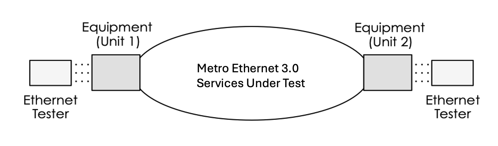
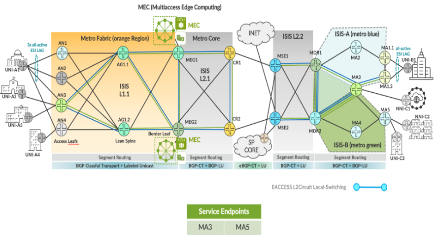
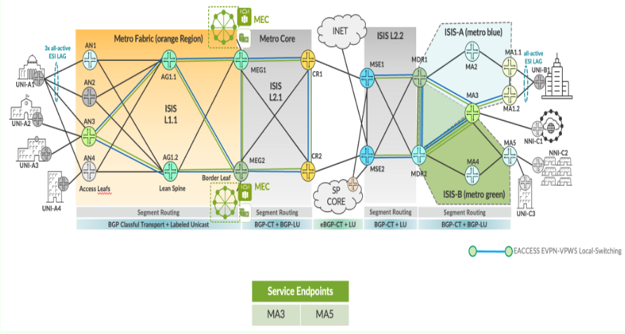
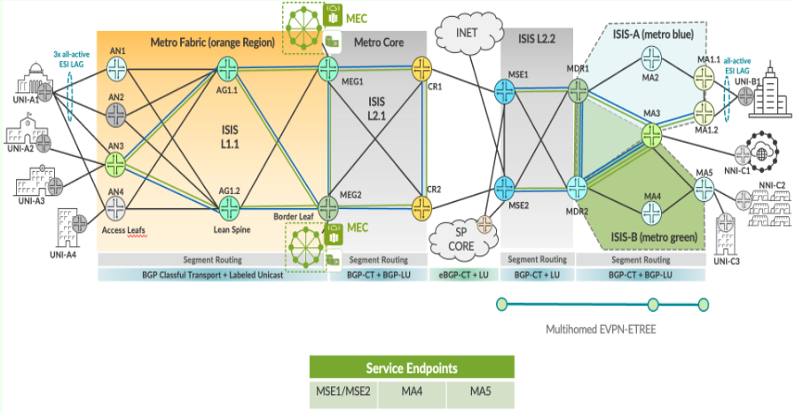

# MEF 3.0 Test Report — E-Tree and Access E-Line

> Markdown conversion of the Iometrix-based MEF 3.0 **E-Tree and Access E-Line**
> test-results report for the Metro as a Service (MEF 3.0) JVD. Covers both
> EVP-Tree (rooted-multipoint) and E-Access (Access E-Line / OVC) service types.
> Detailed per-service conformance evidence complementing the summary in
> [`../test-report-brief.md`](../test-report-brief.md). Full device configurations
> live in [`../../configuration/`](../../configuration/).

## Summary

- **Equipment:** ACX7100-48L, ACX7509, ACX7100-32C, MX304, MX204, ACX710, ACX5448
- **Software:** Junos / Junos Evolved 23.2R2 · **Interface speed:** 10 Gbps
- **Test plan:** MEF Carrier Ethernet 3.0 Test Plan — Service Attributes and Traffic Management
- **Result:** all E-Tree and Access E-Line service test cases **PASS**
- **Services covered:** EVPN-ETREE (EVP-Tree, active-active multihomed root), EVPN-VPWS local-switching (E-Access), L2Circuit local-switching (E-Access)

---

The equipment referenced below was tested by Iometrix, the official MEF test laboratory, in accordance with the MEF Carrier Ethernet 3.0 Test Plan for Service Attributes and Traffic Management and was found to comply with all applicable service requirements as detailed in this Test Report.

## Equipment Information

Product Model : ACX7100-48L , ACX7509, ACX7100-32C, MX304, MX204, ACX710, ACX5448

*Software Version : 23.2R2*

*Interface Speed : 10Gbps*

### E-TREE & E-ACCESS Services Test Report Information

Various below services were tested.

### EVPL Services

E-TREE:

EVPN-ETREE

E-ACCESS:

EVPN-VPWS_LSW

L2Cicuit_LSW

## MEF 3.0 Conformance Test Plan

The MEF 3.0 Test Plan defines a series of conformance Test Cases, test procedures and requirements for the following Carrier Ethernet services:

- E-TREE

- E-ACCESS

The Test Plan is composed of a Part 1 covering *MEF 3.0 Services Attributes* and a Part 2 covering *MEF 3.0 Traffic Management.* The following two tables list all the MEF 3.0 Test Cases.

<table>
<colgroup>
<col style="width: 10%" />
<col style="width: 75%" />
<col style="width: 13%" />
</colgroup>
<thead>
<tr>
<th colspan="2" style="text-align: center;"><strong>Test Cases Summary – Service Attributes</strong></th>
<th style="text-align: center;"><strong>E-TREE</strong></th>
</tr>
</thead>
<tbody>
<tr>
<td style="text-align: center;"><strong>Test case</strong></td>
<td><strong>Test Case Name</strong></td>
<td style="text-align: center;"><strong>EVP-TREE</strong></td>
</tr>
<tr>
<td style="text-align: center;">1</td>
<td>Non-looping Frame Delivery</td>
<td style="text-align: center;">1.6.1 to 1.6.3</td>
</tr>
<tr>
<td style="text-align: center;">2</td>
<td>EVC Leakage</td>
<td style="text-align: center;">-</td>
</tr>
<tr>
<td style="text-align: center;">3</td>
<td>Single Copy Broadcast, Multicast, Unknown DA Service Frame Delivery in Multipoint EVC</td>
<td style="text-align: center;">3.6.1 to 3.6.3</td>
</tr>
<tr>
<td style="text-align: center;">4</td>
<td>Service Frame with Invalid FCS - Discard</td>
<td style="text-align: center;">-</td>
</tr>
<tr>
<td style="text-align: center;">5</td>
<td>L2CP Service Frames - Must Not Tunnel</td>
<td style="text-align: center;">E_L_F_6</td>
</tr>
<tr>
<td style="text-align: center;">6</td>
<td>Service Frame Conditional Delivery</td>
<td style="text-align: center;">-</td>
</tr>
<tr>
<td style="text-align: center;">7</td>
<td>Service Frame Transparency Tag Exception 1 (Untag –Tag)</td>
<td style="text-align: center;">-</td>
</tr>
<tr>
<td style="text-align: center;">8</td>
<td>Service Frame Transparency Tag Exception 2 (Tag – Untag) (P-Tag – Untag)</td>
<td style="text-align: center;">-</td>
</tr>
<tr>
<td style="text-align: center;">9</td>
<td>Service Frame Transparency Tag Exception 3 (Tag1 – Tag2) (P-Tag-Tag)</td>
<td style="text-align: center;">6.6.1</td>
</tr>
<tr>
<td style="text-align: center;">10</td>
<td>CE-VLAN ID Preservation – Tag &amp; P-Tag</td>
<td style="text-align: center;">11.6.1</td>
</tr>
<tr>
<td style="text-align: center;">11</td>
<td>CE-VLAN CoS Preservation – Tag &amp; P-Tag</td>
<td style="text-align: center;">-</td>
</tr>
<tr>
<td style="text-align: center;">12</td>
<td>UNI Physical Layer, Mode and Speed</td>
<td style="text-align: center;">15.6.1</td>
</tr>
<tr>
<td style="text-align: center;">13</td>
<td>UNI MAC Layer - Minimum Frame Size and MTU Size</td>
<td style="text-align: center;">-</td>
</tr>
<tr>
<td style="text-align: center;">14</td>
<td>Service Multiplexing of Point-to-Point EVCs</td>
<td style="text-align: center;">-</td>
</tr>
<tr>
<td style="text-align: center;">15</td>
<td>Service Multiplexing of Multipoint EVCs</td>
<td style="text-align: center;">-</td>
</tr>
<tr>
<td style="text-align: center;">16</td>
<td> Service Multiplexing of Point-to-Point and Multipoint EVCs</td>
<td style="text-align: center;">-</td>
</tr>
<tr>
<td style="text-align: center;">17</td>
<td>CE-VLAN ID for untagged and priority tagged Service Frames</td>
<td style="text-align: center;">-</td>
</tr>
<tr>
<td style="text-align: center;">18</td>
<td>CE-VLAN ID/EVC Map Service Frame Discard</td>
<td style="text-align: center;">20.6.1</td>
</tr>
<tr>
<td style="text-align: center;">19</td>
<td>Maximum Number of EVCs per UNI - Must be Greater than or Equal to 1</td>
<td style="text-align: center;">-</td>
</tr>
<tr>
<td style="text-align: center;">20</td>
<td>EVC Maximum Service Frame Size - Tagged</td>
<td style="text-align: center;">16.6.2</td>
</tr>
<tr>
<td style="text-align: center;">21</td>
<td>Single Copy Broadcast, Multicast, Unknown DA Service Frame Delivery in Multipoint EVC</td>
<td style="text-align: center;">3.6.1 to 3.6.3</td>
</tr>
<tr>
<td style="text-align: center;">22</td>
<td>Service OAM Continuity Check Message Transparency</td>
<td style="text-align: center;">1.6.1</td>
</tr>
<tr>
<td style="text-align: center;">23</td>
<td>Service OAM Multicast Loopback Message Transparency</td>
<td style="text-align: center;">2.6.1</td>
</tr>
<tr>
<td style="text-align: center;">24</td>
<td>Service OAM Unicast Loopback Message Transparency</td>
<td style="text-align: center;">3.1.6</td>
</tr>
<tr>
<td style="text-align: center;">25</td>
<td>Service OAM Loopback Response Transparency</td>
<td style="text-align: center;">4.6.1</td>
</tr>
<tr>
<td style="text-align: center;">26</td>
<td>Service OAM Linktrace Message Transparency</td>
<td style="text-align: center;">5.6.1</td>
</tr>
<tr>
<td style="text-align: center;">27</td>
<td>Service OAM Linktrace Response Transparency</td>
<td style="text-align: center;">6.6.1</td>
</tr>
</tbody>
</table>

<table>
<colgroup>
<col style="width: 10%" />
<col style="width: 57%" />
<col style="width: 15%" />
<col style="width: 15%" />
</colgroup>
<thead>
<tr>
<th colspan="2" rowspan="2"><strong>Testcases Cases Summary – Service Attributes</strong></th>
<th colspan="2" style="text-align: center;"><strong>E-Access</strong></th>
</tr>
<tr>
<th colspan="2" style="text-align: center;"><strong>Access EVPL</strong></th>
</tr>
</thead>
<tbody>
<tr>
<td><strong>Test Case</strong></td>
<td><strong>Test Case Name</strong></td>
<td style="text-align: center;"><strong>UNI to ENNI</strong></td>
<td style="text-align: center;"><strong>ENNI to UNI</strong></td>
</tr>
<tr>
<td style="text-align: center;">1</td>
<td>Maximum Number of CE-VLAN IDs per OVC</td>
<td style="text-align: center;">O_F_U_10.7.5</td>
<td style="text-align: center;">O_F_E_10.8.5</td>
</tr>
<tr>
<td style="text-align: center;">2</td>
<td>OVC Maximum Frame Size</td>
<td style="text-align: center;">O_F_U_7.7.1</td>
<td style="text-align: center;">O_F_E_7.8.1</td>
</tr>
<tr>
<td style="text-align: center;">3</td>
<td>OVC CE-VLAN ID Preservation</td>
<td style="text-align: center;">O_F_U_1.7.1</td>
<td style="text-align: center;">O_F_E_1.8.1</td>
</tr>
<tr>
<td style="text-align: center;">4</td>
<td>CE-VLAN PCP Value Preservation</td>
<td style="text-align: center;">O_F_U_2.7.1</td>
<td style="text-align: center;">O_F_E_2.8.1</td>
</tr>
<tr>
<td style="text-align: center;">5</td>
<td>L2CP Service Frames - Must Not Tunnel</td>
<td style="text-align: center;">O_L_F_U_1 to O_L_F_U_2F</td>
<td style="text-align: center;">O_L_F_E_1 to O_L_F_E_2F</td>
</tr>
<tr>
<td style="text-align: center;">6</td>
<td>UNI/ENNI Physical Layer, Mode and Speed</td>
<td style="text-align: center;">O_F_U_6.7.1</td>
<td style="text-align: center;">O_F_E_6.8.1</td>
</tr>
<tr>
<td style="text-align: center;">7</td>
<td>OVC End Point Map - ENNI Frame Discard</td>
<td style="text-align: center;">-</td>
<td style="text-align: center;">O_F_E_9.8.1</td>
</tr>
<tr>
<td style="text-align: center;">8</td>
<td>Service OAM Continuity Check Message Transparency</td>
<td style="text-align: center;">O_S_T_U_1.7.1_3</td>
<td style="text-align: center;">O_S_T_E_1.8.1</td>
</tr>
<tr>
<td style="text-align: center;">9</td>
<td>Service OAM Multicast Loopback Message Transparency</td>
<td style="text-align: center;">O_S_T_U_2.7.1_3</td>
<td style="text-align: center;">O_S_T_E_2.8.1</td>
</tr>
<tr>
<td style="text-align: center;">10</td>
<td>Service OAM Unicast Loopback Message Transparency</td>
<td style="text-align: center;">O_S_T_U_3.7.1_3</td>
<td style="text-align: center;">O_S_T_E_3.8.1</td>
</tr>
<tr>
<td style="text-align: center;">11</td>
<td>Service OAM Loopback Response Transparency</td>
<td style="text-align: center;">O_S_T_U_4.7.1_3</td>
<td style="text-align: center;">O_S_T_E_4.8.1</td>
</tr>
<tr>
<td style="text-align: center;">12</td>
<td>Service OAM Linktrace Message Transparency</td>
<td style="text-align: center;">O_S_T_U_5.7.1_3</td>
<td style="text-align: center;">O_S_T_E_5.8.1</td>
</tr>
<tr>
<td style="text-align: center;">13</td>
<td>Service OAM Linktrace Response Transparency</td>
<td style="text-align: center;">O_S_T_U_6.7.1_3</td>
<td style="text-align: center;">O_S_T_E_6.8.1</td>
</tr>
</tbody>
</table>

<table>
<colgroup>
<col style="width: 5%" />
<col style="width: 60%" />
<col style="width: 8%" />
<col style="width: 12%" />
<col style="width: 12%" />
</colgroup>
<thead>
<tr>
<th colspan="2" style="text-align: center;"><strong>Test Cases Summary – Traffic Management</strong></th>
<th style="text-align: center;"><strong>E-Tree</strong></th>
<th colspan="2" style="text-align: center;"><strong>E-Access</strong></th>
</tr>
</thead>
<tbody>
<tr>
<td rowspan="2" style="text-align: center;"><strong>Test Case</strong></td>
<td rowspan="2"><strong>Test Case Name</strong></td>
<td rowspan="2" style="text-align: center;"><strong>EVP-Tree</strong></td>
<td style="text-align: center;"><strong>UNI to ENNI</strong></td>
<td style="text-align: center;"><strong>ENNI to UNI</strong></td>
</tr>
<tr>
<td style="text-align: center;"><strong>Access EVPL</strong></td>
<td style="text-align: center;"><strong>Access EVPL</strong></td>
</tr>
<tr>
<td style="text-align: center;">1</td>
<td>One-Way Frame Delay Performance</td>
<td style="text-align: center;">1.3.1</td>
<td style="text-align: center;">P_B_U_L_1.4.1</td>
<td style="text-align: center;">P_B_E_L_1.4.1</td>
</tr>
<tr>
<td style="text-align: center;">2</td>
<td>One-Way Mean Frame Delay Performance</td>
<td style="text-align: center;">2.3.1</td>
<td style="text-align: center;">P_B_U_L_2.4.1</td>
<td style="text-align: center;">P_B_E_L_2.4.1</td>
</tr>
<tr>
<td style="text-align: center;">3</td>
<td>One-Way Inter-Frame Delay Variation Performance</td>
<td style="text-align: center;">3.3.1</td>
<td style="text-align: center;">P_B_U_L_3.4.1</td>
<td style="text-align: center;">P_B_E_L_3.4.1</td>
</tr>
<tr>
<td style="text-align: center;">4</td>
<td>One-Way Frame Delay Range Performance</td>
<td style="text-align: center;">4.3.1</td>
<td style="text-align: center;">P_B_U_L_4.4.1</td>
<td style="text-align: center;">P_B_E_L_4.4.1</td>
</tr>
<tr>
<td style="text-align: center;">5</td>
<td>One-Way Frame Loss Ratio Performance</td>
<td style="text-align: center;">5.3.1</td>
<td style="text-align: center;">P_B_U_L_5.4.1</td>
<td style="text-align: center;">P_B_E_L_5.4.1</td>
</tr>
<tr>
<td style="text-align: center;">6</td>
<td>Ingress Bandwidth Profile - CIR Enforcement</td>
<td style="text-align: center;">1.3.6</td>
<td style="text-align: center;">I_B_B_P_U_1.4.6</td>
<td style="text-align: center;">I_B_A_PP_E_1.4.6</td>
</tr>
<tr>
<td style="text-align: center;"></td>
<td>Ingress Bandwidth Profile - Color Awareness Verification Tagged Frame when [CIR/CBS&gt;0 and EIR/EBS=0]</td>
<td style="text-align: center;">-</td>
<td style="text-align: center;">-</td>
<td style="text-align: center;">I_B_A_PP_E_1.4.7</td>
</tr>
<tr>
<td style="text-align: center;">7</td>
<td>Ingress Bandwidth Profile - CBS Enforcement</td>
<td style="text-align: center;">2.3.6</td>
<td style="text-align: center;">I_B_B_P_U_2.4.6</td>
<td style="text-align: center;">I_B_A_PP_E_2.4.6</td>
</tr>
<tr>
<td style="text-align: center;">8</td>
<td>Ingress Bandwidth Profile - EIR Enforcement Tagged Frames</td>
<td style="text-align: center;">3.3.6</td>
<td style="text-align: center;">I_B_B_P_U_3.4.6</td>
<td style="text-align: center;">I_B_A_PP_E_3.4.6</td>
</tr>
<tr>
<td style="text-align: center;">9</td>
<td>Ingress Bandwidth Profile - Color Awareness Verification Tagged Frames when [CIR/CBS=0 and EIR/EBS&gt;0] </td>
<td style="text-align: center;">-</td>
<td style="text-align: center;">-</td>
<td style="text-align: center;">I_B_A_PP_E_3.4.7</td>
</tr>
<tr>
<td style="text-align: center;">10</td>
<td>Ingress Bandwidth Profile - EBS Enforcement Tagged Frames</td>
<td style="text-align: center;">4.3.6</td>
<td style="text-align: center;">I_B_B_P_U_4.4.6</td>
<td style="text-align: center;">I_B_A_PP_E_4.4.6</td>
</tr>
<tr>
<td style="text-align: center;">11</td>
<td>Color Awareness Verification Tagged Frames when [CIR/CBS&gt;0, EIR/EBS&gt;0</td>
<td style="text-align: center;">-</td>
<td style="text-align: center;">-</td>
<td style="text-align: center;">I_B_A_PP_E_5.4.7</td>
</tr>
<tr>
<td style="text-align: center;">12</td>
<td>Ingress BWP - CIR and EIR Enforcement Tagged Frames</td>
<td style="text-align: center;">5.3.6</td>
<td style="text-align: center;">I_B_B_P_U_5.4.6</td>
<td style="text-align: center;">I_B_A_PP_E_5.4.6</td>
</tr>
<tr>
<td style="text-align: center;">13</td>
<td>Ingress BWP - CBS and EBS Enforcement Tagged Frames </td>
<td style="text-align: center;">6..3.6</td>
<td style="text-align: center;">I_B_B_P_U_6.4.6</td>
<td style="text-align: center;">I_B_A_PP_E_6.4.6</td>
</tr>
<tr>
<td style="text-align: center;">14</td>
<td>Ingress BWP - Unconditional Delivery of Broadcast Frames and CoS ID per EVC &amp; PCP</td>
<td style="text-align: center;">7.3.1</td>
<td style="text-align: center;">I_B_B_P_U_7.4.1</td>
<td style="text-align: center;">I_B_A_PP_E_7.4.1</td>
</tr>
<tr>
<td style="text-align: center;">15</td>
<td>Ingress BWP - Unconditional Delivery of Multicast Frames and CoS ID per EVC &amp; PCP</td>
<td style="text-align: center;">7.3.2</td>
<td style="text-align: center;">I_B_B_P_U_7.4.2</td>
<td style="text-align: center;">I_B_A_PP_E_7.4.2</td>
</tr>
<tr>
<td style="text-align: center;">16</td>
<td>Ingress BWP - Unconditional Delivery of Unicast Frames and CoS ID per EVC &amp; PCP</td>
<td style="text-align: center;">7.3.3</td>
<td style="text-align: center;">I_B_B_P_U_7.4.3</td>
<td style="text-align: center;">I_B_A_PP_E_7.4.3</td>
</tr>
<tr>
<td style="text-align: center;">17</td>
<td>Ingress BWP - Class of Service Discard and CoS ID per EVC &amp; PCP</td>
<td style="text-align: center;">9.3.1</td>
<td style="text-align: center;">I_B_B_P_U_9.4.1</td>
<td style="text-align: center;">I_B_A_PP_E_9.4.1</td>
</tr>
</tbody>
</table>

## MEF 3.0 Conformance Test Bed

The following schematic shows the test bed used to test the conformance of MEF 3.0 Services:

Equipment is set up on the test bed with two units connected across network. A tester is attached to each unit and sends and receives frames across the services submitted for testing. Sometime tester may be attached via a switch also.

## MEF 3.0 Test Status & Results

### Test Status

The Test Cases defined in the *MEF 3.0 Test Plans* are MANDATORY or CONDITIONAL MANDATORY:

- A MANDATORY status means that a test case MUST be executed because it verifies an absolute requirement.

- A CONDITIONAL MANDATORY status means that a test case MAY or MAY NOT be executed because it verifies an absolute requirement dependent on an optional feature. If the optional feature is declared ‘supported’, the test case must be executed. If the optional feature is declared ‘not supported’, the test case is not executed.

### Test Results

Test results can be assessed as ‘PASS’, ‘Not Applicable’ (N/A) or ‘Not Submitted for Testing’ (N/S).

E-ACCESS Services

### L2Circuit Local Switching Topology

Service implementation in JVD EBS topology

| ACCESS EVPL Service | Service Attributes Test Results |
|---------------------|---------------------------------|

<table>
<colgroup>
<col style="width: 9%" />
<col style="width: 8%" />
<col style="width: 65%" />
<col style="width: 9%" />
<col style="width: 7%" />
</colgroup>
<thead>
<tr>
<th colspan="5" style="text-align: center;">OVC CE-VLAN ID Preservation</th>
</tr>
</thead>
<tbody>
<tr>
<td style="text-align: center;">MEF 3.0 Test Plan</td>
<td style="text-align: center;">Test Case Number</td>
<td>Test Case Name</td>
<td style="text-align: center;">Test Result</td>
<td style="text-align: center;">Comments</td>
</tr>
<tr>
<td rowspan="2" style="text-align: center;">Part 1</td>
<td style="text-align: center;">1.8.1</td>
<td>OVC CE-VLAN ID Preservation - Double Tagged ENNI Frame - ENNI to UNI</td>
<td style="text-align: center;">PASS</td>
<td style="text-align: center;">-</td>
</tr>
<tr>
<td style="text-align: center;">1.7.1</td>
<td>OVC CE-VLAN ID Preservation - Tagged Service Frame- UNI to ENNI</td>
<td style="text-align: center;">PASS</td>
<td style="text-align: center;">-</td>
</tr>
</tbody>
</table>

<table>
<colgroup>
<col style="width: 9%" />
<col style="width: 9%" />
<col style="width: 63%" />
<col style="width: 9%" />
<col style="width: 7%" />
</colgroup>
<thead>
<tr>
<th colspan="5" style="text-align: center;">Maximum Number of CE-VLAN IDs per OVC</th>
</tr>
</thead>
<tbody>
<tr>
<td style="text-align: center;">MEF 3.0 Test Plan</td>
<td style="text-align: center;">Test Case Number</td>
<td>Test Case Name</td>
<td style="text-align: center;">Test Result</td>
<td style="text-align: center;">Comments</td>
</tr>
<tr>
<td rowspan="2" style="text-align: center;">Part 1</td>
<td style="text-align: center;">10.8.5</td>
<td>Maximum Number of CE-VLAN ID per OVC EPs at the UNI - Custom number of CE-VLAN IDs - Double Tagged ENNI Frame</td>
<td style="text-align: center;">PASS</td>
<td style="text-align: center;">-</td>
</tr>
<tr>
<td style="text-align: center;">10.7.5</td>
<td>Maximum Number of CE-VLAN ID per OVC EPs at the UNI - Custom number of CE-VLAN IDs - Tagged Service Frame</td>
<td style="text-align: center;">PASS</td>
<td style="text-align: center;">-</td>
</tr>
</tbody>
</table>

<table>
<colgroup>
<col style="width: 9%" />
<col style="width: 9%" />
<col style="width: 63%" />
<col style="width: 9%" />
<col style="width: 7%" />
</colgroup>
<thead>
<tr>
<th colspan="5" style="text-align: center;">CE-VLAN CoS ID Value Preservation</th>
</tr>
</thead>
<tbody>
<tr>
<td style="text-align: center;">MEF 3.0 Test Plan</td>
<td style="text-align: center;">Test Case Number</td>
<td>Test Case Name</td>
<td style="text-align: center;">Test Result</td>
<td style="text-align: center;">Comments</td>
</tr>
<tr>
<td rowspan="2" style="text-align: center;">Part 1</td>
<td style="text-align: center;">2.7.1</td>
<td>OVC CE-VLAN PCP Preservation Enabled - Tagged Service Frame – UNI to ENNI</td>
<td style="text-align: center;">PASS</td>
<td style="text-align: center;">-</td>
</tr>
<tr>
<td style="text-align: center;">2.8.1</td>
<td>OVC CE-VLAN PCP Preservation Enabled - Double Tagged ENNI Frame– ENNI to UNI</td>
<td style="text-align: center;">PASS</td>
<td style="text-align: center;">-</td>
</tr>
</tbody>
</table>

<table>
<colgroup>
<col style="width: 9%" />
<col style="width: 9%" />
<col style="width: 63%" />
<col style="width: 9%" />
<col style="width: 7%" />
</colgroup>
<thead>
<tr>
<th colspan="5" style="text-align: center;">ENNI Physical Layer and MAC Layer</th>
</tr>
</thead>
<tbody>
<tr>
<td style="text-align: center;">MEF 3.0 Test Plan</td>
<td style="text-align: center;">Test Case Number</td>
<td>Test Case Name</td>
<td style="text-align: center;">Test Result</td>
<td style="text-align: center;">Comments</td>
</tr>
<tr>
<td style="text-align: center;">Part 1</td>
<td style="text-align: center;">6.8.1</td>
<td>ENNI Physical Layer, Mode and Speed - Double Tagged ENNI Frame</td>
<td style="text-align: center;">PASS</td>
<td style="text-align: center;">-</td>
</tr>
</tbody>
</table>

<table>
<colgroup>
<col style="width: 9%" />
<col style="width: 10%" />
<col style="width: 62%" />
<col style="width: 9%" />
<col style="width: 7%" />
</colgroup>
<thead>
<tr>
<th colspan="5" style="text-align: center;">UNI Physical Layer and MAC Layer</th>
</tr>
</thead>
<tbody>
<tr>
<td style="text-align: center;">MEF 3.0 Test Plan</td>
<td style="text-align: center;">Test Case Number</td>
<td>Test Case Name</td>
<td style="text-align: center;">Test Result</td>
<td style="text-align: center;">Comments</td>
</tr>
<tr>
<td style="text-align: center;">Part 1</td>
<td style="text-align: center;">6.7.1</td>
<td>UNI Physical Layer, Mode and Speed - Tagged Service Frame</td>
<td style="text-align: center;">PASS</td>
<td style="text-align: center;">-</td>
</tr>
</tbody>
</table>

<table style="width:100%;">
<colgroup>
<col style="width: 9%" />
<col style="width: 10%" />
<col style="width: 62%" />
<col style="width: 9%" />
<col style="width: 7%" />
</colgroup>
<thead>
<tr>
<th colspan="5" style="text-align: center;">OVC Maximum Transmission Unit Size</th>
</tr>
</thead>
<tbody>
<tr>
<td style="text-align: center;">MEF 3.0 Test Plan</td>
<td style="text-align: center;">Test Case Number</td>
<td>Test Case Name</td>
<td style="text-align: center;">Test Result</td>
<td style="text-align: center;">Comments</td>
</tr>
<tr>
<td rowspan="2" style="text-align: center;">Part 1</td>
<td style="text-align: center;">7.7.1</td>
<td>OVC Maximum Frame Size - Tagged Service Frame</td>
<td style="text-align: center;">PASS</td>
<td style="text-align: center;">-</td>
</tr>
<tr>
<td style="text-align: center;">7.8.1</td>
<td>OVC Maximum Frame Size - Double Tagged ENNI Frame</td>
<td style="text-align: center;">PASS</td>
<td style="text-align: center;">-</td>
</tr>
</tbody>
</table>

<table>
<colgroup>
<col style="width: 9%" />
<col style="width: 9%" />
<col style="width: 63%" />
<col style="width: 9%" />
<col style="width: 7%" />
</colgroup>
<thead>
<tr>
<th colspan="5" style="text-align: center;">OVC End Point</th>
</tr>
</thead>
<tbody>
<tr>
<td style="text-align: center;">MEF 3.0 Test Plan</td>
<td style="text-align: center;">Test Case Number</td>
<td>Test Case Name</td>
<td style="text-align: center;">Test Result</td>
<td style="text-align: center;">Comments</td>
</tr>
<tr>
<td style="text-align: center;">Part 1</td>
<td style="text-align: center;">9.8.1</td>
<td>OVC End Point Map - ENNI Frame Discard</td>
<td style="text-align: center;">PASS</td>
<td style="text-align: center;">-</td>
</tr>
</tbody>
</table>

<table>
<colgroup>
<col style="width: 8%" />
<col style="width: 9%" />
<col style="width: 63%" />
<col style="width: 9%" />
<col style="width: 7%" />
</colgroup>
<thead>
<tr>
<th colspan="5" style="text-align: center;">Service OAM</th>
</tr>
</thead>
<tbody>
<tr>
<td style="text-align: center;">MEF 3.0 Test Plan</td>
<td style="text-align: center;">Test Case Number</td>
<td style="text-align: center;">Test Case Name</td>
<td style="text-align: center;">Test Result</td>
<td style="text-align: center;">Comments</td>
</tr>
<tr>
<td rowspan="12" style="text-align: center;">Part 1</td>
<td style="text-align: center;">1.8.1</td>
<td style="text-align: center;">Continuity Check Message Transparency - Double Tagged CCM ENNI Frames</td>
<td style="text-align: center;">PASS</td>
<td style="text-align: center;">-</td>
</tr>
<tr>
<td style="text-align: center;">2.8.1</td>
<td style="text-align: center;">Multicast Loopback Message Transparency - Double Tagged LBM ENNI Frames</td>
<td style="text-align: center;">PASS</td>
<td style="text-align: center;">-</td>
</tr>
<tr>
<td style="text-align: center;">3.8.1</td>
<td style="text-align: center;">Unicast Loopback Message Transparency - Double Tagged LBM ENNI Frames</td>
<td style="text-align: center;">PASS</td>
<td style="text-align: center;">-</td>
</tr>
<tr>
<td style="text-align: center;">4.8.1</td>
<td style="text-align: center;">Loopback Response Transparency - Double Tagged LBR ENNI Frames</td>
<td style="text-align: center;">PASS</td>
<td style="text-align: center;">-</td>
</tr>
<tr>
<td style="text-align: center;">5.8.2</td>
<td style="text-align: center;">Linktrace Message Transparency - Double Tagged LTM ENNI Frames</td>
<td style="text-align: center;">PASS</td>
<td style="text-align: center;">-</td>
</tr>
<tr>
<td style="text-align: center;">6.8.2</td>
<td style="text-align: center;">Linktrace Response Transparency - Double Tagged LTR ENNI Frames</td>
<td style="text-align: center;">PASS</td>
<td style="text-align: center;">-</td>
</tr>
<tr>
<td style="text-align: center;">1.7.1</td>
<td style="text-align: center;">Continuity Check Message Transparency - Tagged CCM Service Frame</td>
<td style="text-align: center;">PASS</td>
<td style="text-align: center;">-</td>
</tr>
<tr>
<td style="text-align: center;">2.7.1</td>
<td style="text-align: center;">Multicast Loopback Message Transparency - Tagged LBM Service Frame</td>
<td style="text-align: center;">PASS</td>
<td style="text-align: center;">-</td>
</tr>
<tr>
<td style="text-align: center;">3.7.1</td>
<td style="text-align: center;">Unicast Loopback Message Transparency - Tagged LBM Service Frame</td>
<td style="text-align: center;">PASS</td>
<td style="text-align: center;">-</td>
</tr>
<tr>
<td style="text-align: center;">4.7.1</td>
<td style="text-align: center;">Loopback Response Transparency - Tagged LBR Service Frame</td>
<td style="text-align: center;">PASS</td>
<td style="text-align: center;">-</td>
</tr>
<tr>
<td style="text-align: center;">5.7.2</td>
<td style="text-align: center;">Linktrace Message Transparency - Tagged LTM Service Frame</td>
<td style="text-align: center;">PASS</td>
<td style="text-align: center;">-</td>
</tr>
<tr>
<td style="text-align: center;">6.7.2</td>
<td style="text-align: center;">Linktrace Response Transparency - Tagged LTR Service Frame</td>
<td style="text-align: center;">PASS</td>
<td style="text-align: center;">-</td>
</tr>
</tbody>
</table>

<table>
<colgroup>
<col style="width: 9%" />
<col style="width: 9%" />
<col style="width: 63%" />
<col style="width: 9%" />
<col style="width: 7%" />
</colgroup>
<thead>
<tr>
<th colspan="5" style="text-align: center;">L2CP Service Frames</th>
</tr>
</thead>
<tbody>
<tr>
<td style="text-align: center;">MEF 3.0 Test Plan</td>
<td style="text-align: center;">Test Case Number</td>
<td>Test Case Name</td>
<td style="text-align: center;">Test Result</td>
<td style="text-align: center;">Comments</td>
</tr>
<tr>
<td rowspan="40" style="text-align: center;">Part 1</td>
<td rowspan="20" style="text-align: center;">0_L_F_E</td>
<td>L2CP Service Frames Must Not Tunnel - 01:80:C2:00:00:01, 0x8808 - ENNI to UNI</td>
<td style="text-align: center;">PASS</td>
<td style="text-align: center;">-</td>
</tr>
<tr>
<td>L2CP Service Frames Must Not Tunnel - 01:80:C2:00:00:02, 0x8809/01/02- ENNI to UNI</td>
<td style="text-align: center;">PASS</td>
<td style="text-align: center;">-</td>
</tr>
<tr>
<td>L2CP Service Frames Must Not Tunnel - 01:80:C2:00:00:02, 0x8809/03- ENNI to UNI</td>
<td style="text-align: center;">PASS</td>
<td style="text-align: center;">-</td>
</tr>
<tr>
<td>L2CP Service Frames Must Not Tunnel - 01:80:C2:00:00:02, 0x8809/0A - ENNI to UNI</td>
<td style="text-align: center;">PASS</td>
<td style="text-align: center;">-</td>
</tr>
<tr>
<td>L2CP Service Frames Must Not Tunnel - 01:80:C2:00:00:03, 0x888E - ENNI to UNI</td>
<td style="text-align: center;">PASS</td>
<td style="text-align: center;">-</td>
</tr>
<tr>
<td>L2CP Service Frames Must Not Tunnel - 01:80:C2:00:00:04 - ENNI to UNI</td>
<td style="text-align: center;">PASS</td>
<td style="text-align: center;">-</td>
</tr>
<tr>
<td>L2CP Service Frames Must Not Tunnel - 01:80:C2:00:00:05 - ENNI to UNI</td>
<td style="text-align: center;">PASS</td>
<td style="text-align: center;">-</td>
</tr>
<tr>
<td>L2CP Service Frames Must Not Tunnel - 01:80:C2:00:00:06 - ENNI to UNI</td>
<td style="text-align: center;">PASS</td>
<td style="text-align: center;">-</td>
</tr>
<tr>
<td>L2CP Service Frames Must Not Tunnel - 01:80:C2:00:00:07, 0x88EE - ENNI to UNI</td>
<td style="text-align: center;">PASS</td>
<td style="text-align: center;">-</td>
</tr>
<tr>
<td>L2CP Service Frames Must Not Tunnel - 01:80:C2:00:00:08 - ENNI to UNI</td>
<td style="text-align: center;">PASS</td>
<td style="text-align: center;">-</td>
</tr>
<tr>
<td>L2CP Service Frames Must Not Tunnel - 01:80:C2:00:00:09 - ENNI to UNI</td>
<td style="text-align: center;">PASS</td>
<td style="text-align: center;">-</td>
</tr>
<tr>
<td>L2CP Service Frames Must Not Tunnel - 01:80:C2:00:00:0A - ENNI to UNI</td>
<td style="text-align: center;">PASS</td>
<td style="text-align: center;">-</td>
</tr>
<tr>
<td>L2CP Service Frames Must Not Tunnel - 01:80:C2:00:00:0E, 0x88CC - ENNI to UNI</td>
<td style="text-align: center;">PASS</td>
<td style="text-align: center;">-</td>
</tr>
<tr>
<td>L2CP Service Frames Must Not Tunnel - 01:80:C2:00:00:0E, 0x88F7 - ENNI to UNI</td>
<td style="text-align: center;">PASS</td>
<td style="text-align: center;">-</td>
</tr>
<tr>
<td>L2CP Service Frames Must Not Tunnel - 01:80:C2:00:00:20 through 01:80:C2:00:00:2F</td>
<td style="text-align: center;">PASS</td>
<td style="text-align: center;">-</td>
</tr>
<tr>
<td>L2CP Service Frames Must Not Tunnel - 01:80:C2:00:00:00 - ENNI to UNI</td>
<td style="text-align: center;">PASS</td>
<td style="text-align: center;">-</td>
</tr>
<tr>
<td>L2CP Service Frames Must Not Tunnel - 01:80:C2:00:00:0B - ENNI to UNI</td>
<td style="text-align: center;">PASS</td>
<td style="text-align: center;">-</td>
</tr>
<tr>
<td>L2CP Service Frames Must Not Tunnel - 01:80:C2:00:00:0C - ENNI to UNI</td>
<td style="text-align: center;">PASS</td>
<td style="text-align: center;">-</td>
</tr>
<tr>
<td>L2CP Service Frames Must Not Tunnel - 01:80:C2:00:00:0D - ENNI to UNI</td>
<td style="text-align: center;">PASS</td>
<td style="text-align: center;">-</td>
</tr>
<tr>
<td>L2CP Service Frames Must Not Tunnel - 01:80:C2:00:00:0F - ENNI to UNI</td>
<td style="text-align: center;">PASS</td>
<td style="text-align: center;">-</td>
</tr>
<tr>
<td rowspan="20" style="text-align: center;">0_L_F_U</td>
<td>L2CP Service Frames Must Not Tunnel - 01:80:C2:00:00:01, 0x8808 - UNI to ENNI</td>
<td style="text-align: center;">PASS</td>
<td style="text-align: center;">-</td>
</tr>
<tr>
<td>L2CP Service Frames Must Not Tunnel - 01:80:C2:00:00:02, 0x8809/01/02- UNI to ENNI</td>
<td style="text-align: center;">PASS</td>
<td style="text-align: center;">-</td>
</tr>
<tr>
<td>L2CP Service Frames Must Not Tunnel - 01:80:C2:00:00:02, 0x8809/03- UNI to ENNI</td>
<td style="text-align: center;">PASS</td>
<td style="text-align: center;">-</td>
</tr>
<tr>
<td>L2CP Service Frames Must Not Tunnel - 01:80:C2:00:00:02, 0x8809/0A - UNI to ENNI</td>
<td style="text-align: center;">PASS</td>
<td style="text-align: center;">-</td>
</tr>
<tr>
<td>L2CP Service Frames Must Not Tunnel - 01:80:C2:00:00:03, 0x888E - UNI to ENNI</td>
<td style="text-align: center;">PASS</td>
<td style="text-align: center;">-</td>
</tr>
<tr>
<td>L2CP Service Frames Must Not Tunnel - 01:80:C2:00:00:04 - UNI to ENNI</td>
<td style="text-align: center;">PASS</td>
<td style="text-align: center;">-</td>
</tr>
<tr>
<td>L2CP Service Frames Must Not Tunnel - 01:80:C2:00:00:05 - UNI to ENNI</td>
<td style="text-align: center;">PASS</td>
<td style="text-align: center;">-</td>
</tr>
<tr>
<td>L2CP Service Frames Must Not Tunnel - 01:80:C2:00:00:06 - UNI to ENNI</td>
<td style="text-align: center;">PASS</td>
<td style="text-align: center;">-</td>
</tr>
<tr>
<td>L2CP Service Frames Must Not Tunnel - 01:80:C2:00:00:07, 0x88EE - UNI to ENNI</td>
<td style="text-align: center;">PASS</td>
<td style="text-align: center;">-</td>
</tr>
<tr>
<td>L2CP Service Frames Must Not Tunnel - 01:80:C2:00:00:08 - UNI to ENNI</td>
<td style="text-align: center;">PASS</td>
<td style="text-align: center;">-</td>
</tr>
<tr>
<td>L2CP Service Frames Must Not Tunnel - 01:80:C2:00:00:09 - UNI to ENNI</td>
<td style="text-align: center;">PASS</td>
<td style="text-align: center;">-</td>
</tr>
<tr>
<td>L2CP Service Frames Must Not Tunnel - 01:80:C2:00:00:0A - UNI to ENNI</td>
<td style="text-align: center;">PASS</td>
<td style="text-align: center;">-</td>
</tr>
<tr>
<td>L2CP Service Frames Must Not Tunnel - 01:80:C2:00:00:0E, 0x88CC - UNI to ENNI</td>
<td style="text-align: center;">PASS</td>
<td style="text-align: center;">-</td>
</tr>
<tr>
<td>L2CP Service Frames Must Not Tunnel - 01:80:C2:00:00:0E, 0x88F7 - UNI to ENNI</td>
<td style="text-align: center;">PASS</td>
<td style="text-align: center;">-</td>
</tr>
<tr>
<td>L2CP Service Frames Must Not Tunnel - 01:80:C2:00:00:20 through 01:80:C2:00:00:2F</td>
<td style="text-align: center;">PASS</td>
<td style="text-align: center;">-</td>
</tr>
<tr>
<td>L2CP Service Frames Must Not Tunnel - 01:80:C2:00:00:00 - UNI to ENNI</td>
<td style="text-align: center;">PASS</td>
<td style="text-align: center;">-</td>
</tr>
<tr>
<td>L2CP Service Frames Must Not Tunnel - 01:80:C2:00:00:0B - UNI to ENNI</td>
<td style="text-align: center;">PASS</td>
<td style="text-align: center;">-</td>
</tr>
<tr>
<td>L2CP Service Frames Must Not Tunnel - 01:80:C2:00:00:0C - UNI to ENNI</td>
<td style="text-align: center;">PASS</td>
<td style="text-align: center;">-</td>
</tr>
<tr>
<td>L2CP Service Frames Must Not Tunnel - 01:80:C2:00:00:0D - UNI to ENNI</td>
<td style="text-align: center;">PASS</td>
<td style="text-align: center;">-</td>
</tr>
<tr>
<td>L2CP Service Frames Must Not Tunnel - 01:80:C2:00:00:0F - UNI to ENNI</td>
<td style="text-align: center;">PASS</td>
<td style="text-align: center;">-</td>
</tr>
</tbody>
</table>

| ACCESS EVPL Service | Performance Test Results |
|---------------------|--------------------------|

<table>
<colgroup>
<col style="width: 9%" />
<col style="width: 9%" />
<col style="width: 10%" />
<col style="width: 10%" />
<col style="width: 10%" />
<col style="width: 8%" />
<col style="width: 10%" />
<col style="width: 10%" />
<col style="width: 10%" />
<col style="width: 10%" />
</colgroup>
<thead>
<tr>
<th colspan="10" style="text-align: center;">One-Way Frame Delay Performance – Performance Tier 1</th>
</tr>
</thead>
<tbody>
<tr>
<td style="text-align: center;">MEF 3.0 Test Plan</td>
<td style="text-align: center;">Test Case Number</td>
<td colspan="6">Test Case Name and Bandwidth Profile Parameters</td>
<td style="text-align: center;">Test Result</td>
<td style="text-align: center;">Comments</td>
</tr>
<tr>
<td rowspan="8" style="text-align: center;">Part 2</td>
<td rowspan="4" style="text-align: center;">E_L_1.4.1</td>
<td colspan="6">One-Way Frame Delay Performance from ENNI to UNI with CIR = 3500 Mbps</td>
<td rowspan="4" style="text-align: center;">PASS</td>
<td rowspan="4" style="text-align: center;">-</td>
</tr>
<tr>
<td style="text-align: center;">CIR</td>
<td style="text-align: center;">CBS</td>
<td style="text-align: center;">EIR</td>
<td style="text-align: center;">EBS</td>
<td style="text-align: center;">CM</td>
<td style="text-align: center;">Class of Service</td>
</tr>
<tr>
<td style="text-align: center;">3500 Mbps</td>
<td style="text-align: center;">35000 Bytes</td>
<td style="text-align: center;">0 Mbps</td>
<td style="text-align: center;">0 Bytes</td>
<td style="text-align: center;">Color-Blind</td>
<td style="text-align: center;">High</td>
</tr>
<tr>
<td style="text-align: center;">3500 Mbps</td>
<td style="text-align: center;">35000 Bytes</td>
<td style="text-align: center;">3500 Mbps</td>
<td style="text-align: center;">35000 Bytes</td>
<td style="text-align: center;">Color-Blind</td>
<td style="text-align: center;">Medium</td>
</tr>
<tr>
<td rowspan="4" style="text-align: center;">U_L_2.4.1</td>
<td colspan="6">One-Way Frame Delay Performance from UNI to ENNI with CIR = 3500 Mbps</td>
<td rowspan="4" style="text-align: center;">PASS</td>
<td rowspan="4" style="text-align: center;">-</td>
</tr>
<tr>
<td style="text-align: center;">CIR</td>
<td style="text-align: center;">CBS</td>
<td style="text-align: center;">EIR</td>
<td style="text-align: center;">EBS</td>
<td style="text-align: center;">CM</td>
<td style="text-align: center;">Class of Service</td>
</tr>
<tr>
<td style="text-align: center;">3500 Mbps</td>
<td style="text-align: center;">35000 Bytes</td>
<td style="text-align: center;">0 Mbps</td>
<td style="text-align: center;">0 Bytes</td>
<td style="text-align: center;">Color-Blind</td>
<td style="text-align: center;">High</td>
</tr>
<tr>
<td style="text-align: center;">3500 Mbps</td>
<td style="text-align: center;">35000 Bytes</td>
<td style="text-align: center;">3500 Mbps</td>
<td style="text-align: center;">35000 Bytes</td>
<td style="text-align: center;">Color-Blind</td>
<td style="text-align: center;">Medium</td>
</tr>
</tbody>
</table>

<table>
<colgroup>
<col style="width: 9%" />
<col style="width: 9%" />
<col style="width: 10%" />
<col style="width: 10%" />
<col style="width: 10%" />
<col style="width: 8%" />
<col style="width: 10%" />
<col style="width: 10%" />
<col style="width: 10%" />
<col style="width: 10%" />
</colgroup>
<thead>
<tr>
<th colspan="10" style="text-align: center;">One-Way Mean Frame Delay Performance – Performance Tier 1</th>
</tr>
</thead>
<tbody>
<tr>
<td style="text-align: center;">MEF 3.0 Test Plan</td>
<td style="text-align: center;">Test Case Number</td>
<td colspan="6">Test Case Name and Bandwidth Profile Parameters</td>
<td style="text-align: center;">Test Result</td>
<td style="text-align: center;">Comments</td>
</tr>
<tr>
<td rowspan="8" style="text-align: center;">Part 2</td>
<td rowspan="4" style="text-align: center;">E_L_2.4.1</td>
<td colspan="6">One-Way Frame Delay Performance from ENNI to UNI with CIR = 3500 Mbps</td>
<td rowspan="4" style="text-align: center;">PASS</td>
<td rowspan="4" style="text-align: center;">-</td>
</tr>
<tr>
<td style="text-align: center;">CIR</td>
<td style="text-align: center;">CBS</td>
<td style="text-align: center;">EIR</td>
<td style="text-align: center;">EBS</td>
<td style="text-align: center;">CM</td>
<td style="text-align: center;">Class of Service</td>
</tr>
<tr>
<td style="text-align: center;">3500 Mbps</td>
<td style="text-align: center;">35000 Bytes</td>
<td style="text-align: center;">0 Mbps</td>
<td style="text-align: center;">0 Bytes</td>
<td style="text-align: center;">Color-Blind</td>
<td style="text-align: center;">High</td>
</tr>
<tr>
<td style="text-align: center;">3500 Mbps</td>
<td style="text-align: center;">35000 Bytes</td>
<td style="text-align: center;">3500 Mbps</td>
<td style="text-align: center;">35000 Bytes</td>
<td style="text-align: center;">Color-Blind</td>
<td style="text-align: center;">Medium</td>
</tr>
<tr>
<td rowspan="4" style="text-align: center;">U_L_2.4.1</td>
<td colspan="6">One-Way Frame Delay Performance from UNI to ENNI with CIR = 3500 Mbps</td>
<td rowspan="4" style="text-align: center;">PASS</td>
<td rowspan="4" style="text-align: center;">-</td>
</tr>
<tr>
<td style="text-align: center;">CIR</td>
<td style="text-align: center;">CBS</td>
<td style="text-align: center;">EIR</td>
<td style="text-align: center;">EBS</td>
<td style="text-align: center;">CM</td>
<td style="text-align: center;">Class of Service</td>
</tr>
<tr>
<td style="text-align: center;">3500 Mbps</td>
<td style="text-align: center;">35000 Bytes</td>
<td style="text-align: center;">0 Mbps</td>
<td style="text-align: center;">0 Bytes</td>
<td style="text-align: center;">Color-Blind</td>
<td style="text-align: center;">High</td>
</tr>
<tr>
<td style="text-align: center;">3500 Mbps</td>
<td style="text-align: center;">35000 Bytes</td>
<td style="text-align: center;">3500 Mbps</td>
<td style="text-align: center;">35000 Bytes</td>
<td style="text-align: center;">Color-Blind</td>
<td style="text-align: center;">Medium</td>
</tr>
</tbody>
</table>

<table>
<colgroup>
<col style="width: 9%" />
<col style="width: 9%" />
<col style="width: 10%" />
<col style="width: 10%" />
<col style="width: 10%" />
<col style="width: 8%" />
<col style="width: 10%" />
<col style="width: 10%" />
<col style="width: 10%" />
<col style="width: 10%" />
</colgroup>
<thead>
<tr>
<th colspan="10" style="text-align: center;">One-Way Inter-Frame Delay Performance – Performance Tier 1</th>
</tr>
</thead>
<tbody>
<tr>
<td style="text-align: center;">MEF 3.0 Test Plan</td>
<td style="text-align: center;">Test Case Number</td>
<td colspan="6">Test Case Name and Bandwidth Profile Parameters</td>
<td style="text-align: center;">Test Result</td>
<td style="text-align: center;">Comments</td>
</tr>
<tr>
<td rowspan="8" style="text-align: center;">Part 2</td>
<td rowspan="4" style="text-align: center;">E_L_3.4.1</td>
<td colspan="6">One-Way Frame Delay Performance from ENNI to UNI with CIR = 3500 Mbps</td>
<td rowspan="4" style="text-align: center;">PASS</td>
<td rowspan="4" style="text-align: center;">-</td>
</tr>
<tr>
<td style="text-align: center;">CIR</td>
<td style="text-align: center;">CBS</td>
<td style="text-align: center;">EIR</td>
<td style="text-align: center;">EBS</td>
<td style="text-align: center;">CM</td>
<td style="text-align: center;">Class of Service</td>
</tr>
<tr>
<td style="text-align: center;">3500 Mbps</td>
<td style="text-align: center;">35000 Bytes</td>
<td style="text-align: center;">0 Mbps</td>
<td style="text-align: center;">0 Bytes</td>
<td style="text-align: center;">Color-Blind</td>
<td style="text-align: center;">High</td>
</tr>
<tr>
<td style="text-align: center;">3500 Mbps</td>
<td style="text-align: center;">35000 Bytes</td>
<td style="text-align: center;">3500 Mbps</td>
<td style="text-align: center;">35000 Bytes</td>
<td style="text-align: center;">Color-Blind</td>
<td style="text-align: center;">Medium</td>
</tr>
<tr>
<td rowspan="4" style="text-align: center;">U_L_3.4.1</td>
<td colspan="6">One-Way Frame Delay Performance from UNI to ENNI with CIR = 3500 Mbps</td>
<td rowspan="4" style="text-align: center;">PASS</td>
<td rowspan="4" style="text-align: center;">-</td>
</tr>
<tr>
<td style="text-align: center;">CIR</td>
<td style="text-align: center;">CBS</td>
<td style="text-align: center;">EIR</td>
<td style="text-align: center;">EBS</td>
<td style="text-align: center;">CM</td>
<td style="text-align: center;">Class of Service</td>
</tr>
<tr>
<td style="text-align: center;">3500 Mbps</td>
<td style="text-align: center;">35000 Bytes</td>
<td style="text-align: center;">0 Mbps</td>
<td style="text-align: center;">0 Bytes</td>
<td style="text-align: center;">Color-Blind</td>
<td style="text-align: center;">High</td>
</tr>
<tr>
<td style="text-align: center;">3500 Mbps</td>
<td style="text-align: center;">35000 Bytes</td>
<td style="text-align: center;">3500 Mbps</td>
<td style="text-align: center;">35000 Bytes</td>
<td style="text-align: center;">Color-Blind</td>
<td style="text-align: center;">Medium</td>
</tr>
</tbody>
</table>

<table>
<colgroup>
<col style="width: 9%" />
<col style="width: 9%" />
<col style="width: 10%" />
<col style="width: 10%" />
<col style="width: 10%" />
<col style="width: 8%" />
<col style="width: 10%" />
<col style="width: 10%" />
<col style="width: 10%" />
<col style="width: 10%" />
</colgroup>
<thead>
<tr>
<th colspan="10" style="text-align: center;">One-Way Frame Delay Range Performance – Performance Tier 1</th>
</tr>
</thead>
<tbody>
<tr>
<td style="text-align: center;">MEF 3.0 Test Plan</td>
<td style="text-align: center;">Test Case Number</td>
<td colspan="6">Test Case Name and Bandwidth Profile Parameters</td>
<td style="text-align: center;">Test Result</td>
<td style="text-align: center;">Comments</td>
</tr>
<tr>
<td rowspan="8" style="text-align: center;">Part 2</td>
<td rowspan="4" style="text-align: center;">E_L_4.4.1</td>
<td colspan="6">One-Way Frame Delay Performance from ENNI to UNI with CIR = 3500 Mbps</td>
<td rowspan="4" style="text-align: center;">PASS</td>
<td rowspan="4" style="text-align: center;">-</td>
</tr>
<tr>
<td style="text-align: center;">CIR</td>
<td style="text-align: center;">CBS</td>
<td style="text-align: center;">EIR</td>
<td style="text-align: center;">EBS</td>
<td style="text-align: center;">CM</td>
<td style="text-align: center;">Class of Service</td>
</tr>
<tr>
<td style="text-align: center;">3500 Mbps</td>
<td style="text-align: center;">35000 Bytes</td>
<td style="text-align: center;">0 Mbps</td>
<td style="text-align: center;">0 Bytes</td>
<td style="text-align: center;">Color-Blind</td>
<td style="text-align: center;">High</td>
</tr>
<tr>
<td style="text-align: center;">3500 Mbps</td>
<td style="text-align: center;">35000 Bytes</td>
<td style="text-align: center;">3500 Mbps</td>
<td style="text-align: center;">35000 Bytes</td>
<td style="text-align: center;">Color-Blind</td>
<td style="text-align: center;">Medium</td>
</tr>
<tr>
<td rowspan="4" style="text-align: center;">U_L_4.4.1</td>
<td colspan="6">One-Way Frame Delay Performance from UNI to ENNI with CIR = 3500 Mbps</td>
<td rowspan="4" style="text-align: center;">PASS</td>
<td rowspan="4" style="text-align: center;">-</td>
</tr>
<tr>
<td style="text-align: center;">CIR</td>
<td style="text-align: center;">CBS</td>
<td style="text-align: center;">EIR</td>
<td style="text-align: center;">EBS</td>
<td style="text-align: center;">CM</td>
<td style="text-align: center;">Class of Service</td>
</tr>
<tr>
<td style="text-align: center;">3500 Mbps</td>
<td style="text-align: center;">35000 Bytes</td>
<td style="text-align: center;">0 Mbps</td>
<td style="text-align: center;">0 Bytes</td>
<td style="text-align: center;">Color-Blind</td>
<td style="text-align: center;">High</td>
</tr>
<tr>
<td style="text-align: center;">3500 Mbps</td>
<td style="text-align: center;">35000 Bytes</td>
<td style="text-align: center;">3500 Mbps</td>
<td style="text-align: center;">35000 Bytes</td>
<td style="text-align: center;">Color-Blind</td>
<td style="text-align: center;">Medium</td>
</tr>
</tbody>
</table>

<table>
<colgroup>
<col style="width: 9%" />
<col style="width: 9%" />
<col style="width: 10%" />
<col style="width: 10%" />
<col style="width: 10%" />
<col style="width: 8%" />
<col style="width: 10%" />
<col style="width: 10%" />
<col style="width: 10%" />
<col style="width: 10%" />
</colgroup>
<thead>
<tr>
<th colspan="10" style="text-align: center;">One-Way Frame Loss Performance – Performance Tier 1</th>
</tr>
</thead>
<tbody>
<tr>
<td style="text-align: center;">MEF 3.0 Test Plan</td>
<td style="text-align: center;">Test Case Number</td>
<td colspan="6">Test Case Name and Bandwidth Profile Parameters</td>
<td style="text-align: center;">Test Result</td>
<td style="text-align: center;">Comments</td>
</tr>
<tr>
<td rowspan="8" style="text-align: center;">Part 2</td>
<td rowspan="4" style="text-align: center;">E_L_5.4.1</td>
<td colspan="6">One-Way Frame Delay Performance from ENNI to UNI with CIR = 3500 Mbps</td>
<td rowspan="4" style="text-align: center;">PASS</td>
<td rowspan="4" style="text-align: center;">-</td>
</tr>
<tr>
<td style="text-align: center;">CIR</td>
<td style="text-align: center;">CBS</td>
<td style="text-align: center;">EIR</td>
<td style="text-align: center;">EBS</td>
<td style="text-align: center;">CM</td>
<td style="text-align: center;">Class of Service</td>
</tr>
<tr>
<td style="text-align: center;">3500 Mbps</td>
<td style="text-align: center;">35000 Bytes</td>
<td style="text-align: center;">0 Mbps</td>
<td style="text-align: center;">0 Bytes</td>
<td style="text-align: center;">Color-Blind</td>
<td style="text-align: center;">High</td>
</tr>
<tr>
<td style="text-align: center;">3500 Mbps</td>
<td style="text-align: center;">35000 Bytes</td>
<td style="text-align: center;">3500 Mbps</td>
<td style="text-align: center;">35000 Bytes</td>
<td style="text-align: center;">Color-Blind</td>
<td style="text-align: center;">Medium</td>
</tr>
<tr>
<td rowspan="4" style="text-align: center;">U_L_5.4.1</td>
<td colspan="6">One-Way Frame Delay Performance from UNI to ENNI with CIR = 3500 Mbps</td>
<td rowspan="4" style="text-align: center;">PASS</td>
<td rowspan="4" style="text-align: center;">-</td>
</tr>
<tr>
<td style="text-align: center;">CIR</td>
<td style="text-align: center;">CBS</td>
<td style="text-align: center;">EIR</td>
<td style="text-align: center;">EBS</td>
<td style="text-align: center;">CM</td>
<td style="text-align: center;">Class of Service</td>
</tr>
<tr>
<td style="text-align: center;">3500 Mbps</td>
<td style="text-align: center;">35000 Bytes</td>
<td style="text-align: center;">0 Mbps</td>
<td style="text-align: center;">0 Bytes</td>
<td style="text-align: center;">Color-Blind</td>
<td style="text-align: center;">High</td>
</tr>
<tr>
<td style="text-align: center;">3500 Mbps</td>
<td style="text-align: center;">35000 Bytes</td>
<td style="text-align: center;">3500 Mbps</td>
<td style="text-align: center;">35000 Bytes</td>
<td style="text-align: center;">Color-Blind</td>
<td style="text-align: center;">Medium</td>
</tr>
</tbody>
</table>

| ACCESS EVPL Service | Traffic Management Test Results |
|---------------------|---------------------------------|

<table>
<colgroup>
<col style="width: 8%" />
<col style="width: 8%" />
<col style="width: 9%" />
<col style="width: 9%" />
<col style="width: 7%" />
<col style="width: 8%" />
<col style="width: 9%" />
<col style="width: 9%" />
<col style="width: 10%" />
<col style="width: 9%" />
<col style="width: 10%" />
</colgroup>
<thead>
<tr>
<th colspan="11" style="text-align: center;">Ingress Bandwidth Profile - CIR Enforcement</th>
</tr>
</thead>
<tbody>
<tr>
<td style="text-align: center;">MEF 3.0 Test Plan</td>
<td style="text-align: center;">Test Case Number</td>
<td colspan="7">Test Case Name and Bandwidth Profile Parameters</td>
<td style="text-align: center;">Test Result</td>
<td style="text-align: center;">Comments</td>
</tr>
<tr>
<td rowspan="6" style="text-align: center;">Part 2</td>
<td rowspan="3" style="text-align: center;">E_1.4.6</td>
<td colspan="7">CIR Enforcement Tagged Frames when [CIR/CBS&gt;0 and EIR/EBS=0] and CoS ID per OVC EP &amp; PCP - Color ID per PCP from ENNI to UNI</td>
<td rowspan="3" style="text-align: center;">PASS</td>
<td rowspan="3" style="text-align: center;">-</td>
</tr>
<tr>
<td style="text-align: center;">CIR</td>
<td style="text-align: center;">CBS</td>
<td style="text-align: center;">EIR</td>
<td style="text-align: center;">EBS</td>
<td style="text-align: center;">CM</td>
<td style="text-align: center;">Class of Service</td>
<td style="text-align: center;">Test Frame sizes</td>
</tr>
<tr>
<td style="text-align: center;">3500 Mbps</td>
<td style="text-align: center;">35000 Bytes</td>
<td style="text-align: center;">0 Mbps</td>
<td style="text-align: center;">0 Bytes</td>
<td style="text-align: center;">Color-Aware</td>
<td style="text-align: center;">High</td>
<td style="text-align: center;">80,600,1500</td>
</tr>
<tr>
<td rowspan="3" style="text-align: center;">U_1.4.6</td>
<td colspan="7">CIR Enforcement Tagged Frames when [CIR/CBS&gt;0 and EIR/EBS=0] and CoS ID per OVC EP &amp; PCP from UNI to ENNI</td>
<td rowspan="3" style="text-align: center;">PASS</td>
<td rowspan="3" style="text-align: center;">-</td>
</tr>
<tr>
<td style="text-align: center;">CIR</td>
<td style="text-align: center;">CBS</td>
<td style="text-align: center;">EIR</td>
<td style="text-align: center;">EBS</td>
<td style="text-align: center;">CM</td>
<td style="text-align: center;">Class of Service</td>
<td style="text-align: center;">Test Frame sizes</td>
</tr>
<tr>
<td style="text-align: center;">3500 Mbps</td>
<td style="text-align: center;">35000 Bytes</td>
<td style="text-align: center;">0 Mbps</td>
<td style="text-align: center;">0 Bytes</td>
<td style="text-align: center;">Color-Blind</td>
<td style="text-align: center;">High</td>
<td style="text-align: center;">80,600,1500</td>
</tr>
</tbody>
</table>

<table>
<colgroup>
<col style="width: 8%" />
<col style="width: 8%" />
<col style="width: 9%" />
<col style="width: 0%" />
<col style="width: 7%" />
<col style="width: 2%" />
<col style="width: 7%" />
<col style="width: 1%" />
<col style="width: 6%" />
<col style="width: 0%" />
<col style="width: 9%" />
<col style="width: 0%" />
<col style="width: 8%" />
<col style="width: 0%" />
<col style="width: 10%" />
<col style="width: 0%" />
<col style="width: 9%" />
<col style="width: 10%" />
</colgroup>
<thead>
<tr>
<th colspan="18" style="text-align: center;">Ingress Bandwidth Profile - Color Awareness Verification</th>
</tr>
</thead>
<tbody>
<tr>
<td style="text-align: center;">MEF 3.0 Test Plan</td>
<td style="text-align: center;">Test Case Number</td>
<td colspan="14">Test Case Name and Bandwidth Profile Parameters</td>
<td style="text-align: center;">Test Result</td>
<td style="text-align: center;">Comments</td>
</tr>
<tr>
<td rowspan="9" style="text-align: center;">Part 2</td>
<td rowspan="3" style="text-align: center;">E_1.4.7</td>
<td colspan="14">Color Awareness Verification Tagged Frames when [CIR/CBS&gt;0 and EIR/EBS=0] and CoS ID per OVC EP &amp; PCP - Color ID per PCP from ENNI to UNI</td>
<td rowspan="3" style="text-align: center;">PASS</td>
<td rowspan="3" style="text-align: center;">-</td>
</tr>
<tr>
<td style="text-align: center;">CIR</td>
<td colspan="3" style="text-align: center;">CBS</td>
<td style="text-align: center;">EIR</td>
<td colspan="3" style="text-align: center;">EBS</td>
<td style="text-align: center;">CM</td>
<td colspan="3" style="text-align: center;">Class of Service</td>
<td colspan="2" style="text-align: center;">Test Frame sizes</td>
</tr>
<tr>
<td style="text-align: center;">3500 Mbps</td>
<td colspan="3" style="text-align: center;">35000 Bytes</td>
<td style="text-align: center;">0 Mbps</td>
<td colspan="3" style="text-align: center;">0 Bytes</td>
<td style="text-align: center;">Color-Aware</td>
<td colspan="3" style="text-align: center;">High</td>
<td colspan="2" style="text-align: center;">80,600,1500</td>
</tr>
<tr>
<td rowspan="3" style="text-align: center;">E_3.4.7</td>
<td colspan="14">Color Awareness Verification Tagged Frames when [CIR/CBS=0 and EIR/EBS&gt;0] and CoS ID per OVC EP &amp; PCP - Color ID per PCP from UNI to ENNI</td>
<td rowspan="3" style="text-align: center;">PASS</td>
<td rowspan="3" style="text-align: center;">-</td>
</tr>
<tr>
<td style="text-align: center;">CIR</td>
<td colspan="3" style="text-align: center;">CBS</td>
<td style="text-align: center;">EIR</td>
<td colspan="3" style="text-align: center;">EBS</td>
<td style="text-align: center;">CM</td>
<td colspan="3" style="text-align: center;">Class of Service</td>
<td colspan="2" style="text-align: center;">Test Frame sizes</td>
</tr>
<tr>
<td style="text-align: center;">0 Mbps</td>
<td colspan="3" style="text-align: center;">0 Bytes</td>
<td style="text-align: center;">3500 Mbps</td>
<td colspan="3" style="text-align: center;">35000 Bytes</td>
<td style="text-align: center;">Color-Aware</td>
<td colspan="3" style="text-align: center;">Low</td>
<td colspan="2" style="text-align: center;">80,600,1500</td>
</tr>
<tr>
<td rowspan="3" style="text-align: center;">E_5.4.7</td>
<td colspan="13">Color Awareness Verification Tagged Frames when [CIR/CBS&gt;0, EIR/EBS&gt;0 and CF=0] and CoS ID per OVC EP &amp; PCP - Color ID per PCP from ENNI to UNI</td>
<td colspan="2" rowspan="3" style="text-align: center;">PASS</td>
<td rowspan="3" style="text-align: center;">-</td>
</tr>
<tr>
<td colspan="2" style="text-align: center;">CIR</td>
<td style="text-align: center;">CBS</td>
<td colspan="3" style="text-align: center;">EIR</td>
<td style="text-align: center;">EBS</td>
<td colspan="3" style="text-align: center;">CM</td>
<td style="text-align: center;">Class of Service</td>
<td colspan="2" style="text-align: center;">Test Frame sizes</td>
</tr>
<tr>
<td colspan="2" style="text-align: center;">3500 Mbps</td>
<td style="text-align: center;">35000 Bytes</td>
<td colspan="3" style="text-align: center;">3500 Mbps</td>
<td style="text-align: center;">35000 Bytes</td>
<td colspan="3" style="text-align: center;">Color-aware</td>
<td style="text-align: center;">Medium</td>
<td colspan="2" style="text-align: center;">80,600,1500</td>
</tr>
</tbody>
</table>

<table>
<colgroup>
<col style="width: 8%" />
<col style="width: 8%" />
<col style="width: 9%" />
<col style="width: 9%" />
<col style="width: 9%" />
<col style="width: 7%" />
<col style="width: 9%" />
<col style="width: 8%" />
<col style="width: 10%" />
<col style="width: 9%" />
<col style="width: 10%" />
</colgroup>
<thead>
<tr>
<th colspan="11" style="text-align: center;">Ingress Bandwidth Profile - CBS Enforcement</th>
</tr>
</thead>
<tbody>
<tr>
<td style="text-align: center;">MEF 3.0 Test Plan</td>
<td style="text-align: center;">Test Case Number</td>
<td colspan="7">Test Case Name and Bandwidth Profile Parameters</td>
<td style="text-align: center;">Test Result</td>
<td style="text-align: center;">Comments</td>
</tr>
<tr>
<td rowspan="6" style="text-align: center;">Part 2</td>
<td rowspan="3" style="text-align: center;">E_2.4.6</td>
<td colspan="7">CBS Enforcement Tagged Frames when [CIR/CBS&gt;0 and EIR/EBS=0] and CoS ID per OVC EP &amp; PCP - Color ID per PCP from ENNI to UNI</td>
<td rowspan="3" style="text-align: center;">PASS</td>
<td rowspan="3" style="text-align: center;">-</td>
</tr>
<tr>
<td style="text-align: center;">CIR</td>
<td style="text-align: center;">CBS</td>
<td style="text-align: center;">EIR</td>
<td style="text-align: center;">EBS</td>
<td style="text-align: center;">CM</td>
<td style="text-align: center;">Class of Service</td>
<td style="text-align: center;">Test Frame sizes</td>
</tr>
<tr>
<td style="text-align: center;">3500 Mbps</td>
<td style="text-align: center;">35000 Bytes</td>
<td style="text-align: center;">0 Mbps</td>
<td style="text-align: center;">0 Bytes</td>
<td style="text-align: center;">Color-Aware</td>
<td style="text-align: center;">High</td>
<td style="text-align: center;">80,600,1500</td>
</tr>
<tr>
<td rowspan="3" style="text-align: center;">U_2.4.6</td>
<td colspan="7">CBS Enforcement Tagged Frames when [CIR/CBS&gt;0 and EIR/EBS=0] and CoS ID per OVC EP &amp; PCP from UNI to ENNI</td>
<td rowspan="3" style="text-align: center;">PASS</td>
<td rowspan="3" style="text-align: center;">-</td>
</tr>
<tr>
<td style="text-align: center;">CIR</td>
<td style="text-align: center;">CBS</td>
<td style="text-align: center;">EIR</td>
<td style="text-align: center;">EBS</td>
<td style="text-align: center;">CM</td>
<td style="text-align: center;">Class of Service</td>
<td style="text-align: center;">Test Frame sizes</td>
</tr>
<tr>
<td style="text-align: center;">3500 Mbps</td>
<td style="text-align: center;">35000 Bytes</td>
<td style="text-align: center;">0 Mbps</td>
<td style="text-align: center;">0 Bytes</td>
<td style="text-align: center;">Color-Blind</td>
<td style="text-align: center;">High</td>
<td style="text-align: center;">80,600,1500</td>
</tr>
</tbody>
</table>

<table>
<colgroup>
<col style="width: 8%" />
<col style="width: 8%" />
<col style="width: 9%" />
<col style="width: 7%" />
<col style="width: 10%" />
<col style="width: 6%" />
<col style="width: 10%" />
<col style="width: 8%" />
<col style="width: 10%" />
<col style="width: 9%" />
<col style="width: 10%" />
</colgroup>
<thead>
<tr>
<th colspan="11" style="text-align: center;">Ingress Bandwidth Profile - EIR Enforcement</th>
</tr>
</thead>
<tbody>
<tr>
<td style="text-align: center;">MEF 3.0 Test Plan</td>
<td style="text-align: center;">Test Case Number</td>
<td colspan="7">Test Case Name and Bandwidth Profile Parameters</td>
<td style="text-align: center;">Test Result</td>
<td style="text-align: center;">Comments</td>
</tr>
<tr>
<td rowspan="6" style="text-align: center;">Part 2</td>
<td rowspan="3" style="text-align: center;">E_3.4.6</td>
<td colspan="7">EIR Enforcement Tagged Frames when [CIR/CBS=0 and EIR/EBS&gt;0] and CoS ID per OVC EP &amp; PCP - Color ID per PCP from ENNI to UNI</td>
<td rowspan="3" style="text-align: center;">PASS</td>
<td rowspan="3" style="text-align: center;">-</td>
</tr>
<tr>
<td style="text-align: center;">CIR</td>
<td style="text-align: center;">CBS</td>
<td style="text-align: center;">EIR</td>
<td style="text-align: center;">EBS</td>
<td style="text-align: center;">CM</td>
<td style="text-align: center;">Class of Service</td>
<td style="text-align: center;">Test Frame sizes</td>
</tr>
<tr>
<td style="text-align: center;">0 Mbps</td>
<td style="text-align: center;">0 Bytes</td>
<td style="text-align: center;">3500 Mbps</td>
<td style="text-align: center;">35000 Bytes</td>
<td style="text-align: center;">Color-Aware</td>
<td style="text-align: center;">Low</td>
<td style="text-align: center;">80,600,1500</td>
</tr>
<tr>
<td rowspan="3" style="text-align: center;">U_3.4.6</td>
<td colspan="7">EIR Enforcement Tagged Frames when [CIR/CBS=0 and EIR/EBS&gt;0] and CoS ID per OVC EP &amp; PCP from UNI to ENNi</td>
<td rowspan="3" style="text-align: center;">PASS</td>
<td rowspan="3" style="text-align: center;">-</td>
</tr>
<tr>
<td style="text-align: center;">CIR</td>
<td style="text-align: center;">CBS</td>
<td style="text-align: center;">EIR</td>
<td style="text-align: center;">EBS</td>
<td style="text-align: center;">CM</td>
<td style="text-align: center;">Class of Service</td>
<td style="text-align: center;">Test Frame sizes</td>
</tr>
<tr>
<td style="text-align: center;">0 Mbps</td>
<td style="text-align: center;">0 Bytes</td>
<td style="text-align: center;">3500 Mbps</td>
<td style="text-align: center;">35000 Bytes</td>
<td style="text-align: center;">Color-Blind</td>
<td style="text-align: center;">Low</td>
<td style="text-align: center;">80,600,1500</td>
</tr>
</tbody>
</table>

<table>
<colgroup>
<col style="width: 7%" />
<col style="width: 8%" />
<col style="width: 10%" />
<col style="width: 7%" />
<col style="width: 7%" />
<col style="width: 7%" />
<col style="width: 11%" />
<col style="width: 8%" />
<col style="width: 10%" />
<col style="width: 9%" />
<col style="width: 10%" />
</colgroup>
<thead>
<tr>
<th colspan="11" style="text-align: center;">Ingress Bandwidth Profile - EBS Enforcement</th>
</tr>
</thead>
<tbody>
<tr>
<td style="text-align: center;">MEF 3.0 Test Plan</td>
<td style="text-align: center;">Test Case Number</td>
<td colspan="7">Test Case Name and Bandwidth Profile Parameters</td>
<td style="text-align: center;">Test Result</td>
<td style="text-align: center;">Comments</td>
</tr>
<tr>
<td rowspan="6" style="text-align: center;">Part 2</td>
<td rowspan="3" style="text-align: center;">E_4.4.6</td>
<td colspan="7">EBS Enforcement Tagged Frames when [CIR/CBS=0 and EIR/EBS&gt;0] and CoS ID per OVC EP &amp; PCP - Color ID per PCP from ENNI to UNI</td>
<td rowspan="3" style="text-align: center;">PASS</td>
<td rowspan="3" style="text-align: center;">-</td>
</tr>
<tr>
<td style="text-align: center;">CIR</td>
<td style="text-align: center;">CBS</td>
<td style="text-align: center;">EIR</td>
<td style="text-align: center;">EBS</td>
<td style="text-align: center;">CM</td>
<td style="text-align: center;">Class of Service</td>
<td style="text-align: center;">Test Frame sizes</td>
</tr>
<tr>
<td style="text-align: center;">3500 Mbps</td>
<td style="text-align: center;">35000 Bytes</td>
<td style="text-align: center;">0 Mbps</td>
<td style="text-align: center;">0 Bytes</td>
<td style="text-align: center;">Color-Aware</td>
<td style="text-align: center;">Low</td>
<td style="text-align: center;">80,600,1500</td>
</tr>
<tr>
<td rowspan="3" style="text-align: center;">U_4.4.6</td>
<td colspan="7">EBS Enforcement Tagged Frames when [CIR/CBS=0 and EIR/EBS&gt;0] and CoS ID per OVC EP &amp; PCP - Color ID per PCP from UNI to ENNI</td>
<td rowspan="3" style="text-align: center;">PASS</td>
<td rowspan="3" style="text-align: center;">-</td>
</tr>
<tr>
<td style="text-align: center;">CIR</td>
<td style="text-align: center;">CBS</td>
<td style="text-align: center;">EIR</td>
<td style="text-align: center;">EBS</td>
<td style="text-align: center;">CM</td>
<td style="text-align: center;">Class of Service</td>
<td style="text-align: center;">Test Frame sizes</td>
</tr>
<tr>
<td style="text-align: center;">3500 Mbps</td>
<td style="text-align: center;">35000 Bytes</td>
<td style="text-align: center;">0 Mbps</td>
<td style="text-align: center;">0 Bytes</td>
<td style="text-align: center;">Color-Blind</td>
<td style="text-align: center;">Low</td>
<td style="text-align: center;">80,600,1500</td>
</tr>
</tbody>
</table>

<table>
<colgroup>
<col style="width: 7%" />
<col style="width: 8%" />
<col style="width: 10%" />
<col style="width: 8%" />
<col style="width: 10%" />
<col style="width: 6%" />
<col style="width: 9%" />
<col style="width: 8%" />
<col style="width: 10%" />
<col style="width: 9%" />
<col style="width: 10%" />
</colgroup>
<thead>
<tr>
<th colspan="11" style="text-align: center;">Ingress Bandwidth Profile - CIR and EIR Enforcement</th>
</tr>
</thead>
<tbody>
<tr>
<td style="text-align: center;">MEF 3.0 Test Plan</td>
<td style="text-align: center;">Test Case Number</td>
<td colspan="7">Test Case Name and Bandwidth Profile Parameters</td>
<td style="text-align: center;">Test Result</td>
<td style="text-align: center;">Comments</td>
</tr>
<tr>
<td rowspan="6" style="text-align: center;">Part 2</td>
<td rowspan="3" style="text-align: center;">E_5.4.6</td>
<td colspan="7">CIR and EIR Enforcement Tagged Frames when [CIR/CBS&gt;0 and EIR/EBS&gt;0] and CoS ID per OVC EP &amp; PCP - Color ID per PCP from ENNI to UNI</td>
<td rowspan="3" style="text-align: center;">PASS</td>
<td rowspan="3" style="text-align: center;">-</td>
</tr>
<tr>
<td style="text-align: center;">CIR</td>
<td style="text-align: center;">CBS</td>
<td style="text-align: center;">EIR</td>
<td style="text-align: center;">EBS</td>
<td style="text-align: center;">CM</td>
<td style="text-align: center;">Class of Service</td>
<td style="text-align: center;">Test Frame sizes</td>
</tr>
<tr>
<td style="text-align: center;">3500 Mbps</td>
<td style="text-align: center;">35000 Bytes</td>
<td style="text-align: center;">3500 Mbps</td>
<td style="text-align: center;">35000 Bytes</td>
<td style="text-align: center;">Color-Aware</td>
<td style="text-align: center;">Medium</td>
<td style="text-align: center;">80,600,1500</td>
</tr>
<tr>
<td rowspan="3" style="text-align: center;">U_5.4.6</td>
<td colspan="7">CIR and EIR Enforcement Tagged Frames when [CIR/CBS&gt;0 and EIR/EBS&gt;0] and CoS ID per OVC EP &amp; PCP from UNI to ENNI</td>
<td rowspan="3" style="text-align: center;">PASS</td>
<td rowspan="3" style="text-align: center;">-</td>
</tr>
<tr>
<td style="text-align: center;">CIR</td>
<td style="text-align: center;">CBS</td>
<td style="text-align: center;">EIR</td>
<td style="text-align: center;">EBS</td>
<td style="text-align: center;">CM</td>
<td style="text-align: center;">Class of Service</td>
<td style="text-align: center;">Test Frame sizes</td>
</tr>
<tr>
<td style="text-align: center;">3500 Mbps</td>
<td style="text-align: center;">35000 Bytes</td>
<td style="text-align: center;">3500 Mbps</td>
<td style="text-align: center;">35000 Bytes</td>
<td style="text-align: center;">Color-Blind</td>
<td style="text-align: center;">Medium</td>
<td style="text-align: center;">80,600,1500</td>
</tr>
</tbody>
</table>

<table>
<colgroup>
<col style="width: 7%" />
<col style="width: 8%" />
<col style="width: 10%" />
<col style="width: 9%" />
<col style="width: 9%" />
<col style="width: 7%" />
<col style="width: 9%" />
<col style="width: 8%" />
<col style="width: 10%" />
<col style="width: 9%" />
<col style="width: 10%" />
</colgroup>
<thead>
<tr>
<th colspan="11" style="text-align: center;">Ingress Bandwidth Profile - CBS and EBS Enforcement</th>
</tr>
</thead>
<tbody>
<tr>
<td style="text-align: center;">MEF 3.0 Test Plan</td>
<td style="text-align: center;">Test Case Number</td>
<td colspan="7">Test Case Name and Bandwidth Profile Parameters</td>
<td style="text-align: center;">Test Result</td>
<td style="text-align: center;">Comments</td>
</tr>
<tr>
<td rowspan="6" style="text-align: center;">Part 2</td>
<td rowspan="3" style="text-align: center;">E_6.4.6</td>
<td colspan="7">CIR and EIR Enforcement Tagged Frames when [CIR/CBS&gt;0 and EIR/EBS&gt;0] and CoS ID per OVC EP &amp; PCP - Color ID per PCP from ENNI to UNI</td>
<td rowspan="3" style="text-align: center;">PASS</td>
<td rowspan="3" style="text-align: center;">-</td>
</tr>
<tr>
<td style="text-align: center;">CIR</td>
<td style="text-align: center;">CBS</td>
<td style="text-align: center;">EIR</td>
<td style="text-align: center;">EBS</td>
<td style="text-align: center;">CM</td>
<td style="text-align: center;">Class of Service</td>
<td style="text-align: center;">Test Frame sizes</td>
</tr>
<tr>
<td style="text-align: center;">3500 Mbps</td>
<td style="text-align: center;">35000 Bytes</td>
<td style="text-align: center;">3500 Mbps</td>
<td style="text-align: center;">35000 Bytes</td>
<td style="text-align: center;">Color-Aware</td>
<td style="text-align: center;">Medium</td>
<td style="text-align: center;">80,600,1500</td>
</tr>
<tr>
<td rowspan="3" style="text-align: center;">U_6.4.6</td>
<td colspan="7">CBS and EBS Enforcement Tagged Frames when [CIR/CBS&gt;0 and EIR/EBS&gt;0] and CoS ID per OVC EP &amp; PCP from UNI to ENNI</td>
<td rowspan="3" style="text-align: center;">PASS</td>
<td rowspan="3" style="text-align: center;">-</td>
</tr>
<tr>
<td style="text-align: center;">CIR</td>
<td style="text-align: center;">CBS</td>
<td style="text-align: center;">EIR</td>
<td style="text-align: center;">EBS</td>
<td style="text-align: center;">CM</td>
<td style="text-align: center;">Class of Service</td>
<td style="text-align: center;">Test Frame sizes</td>
</tr>
<tr>
<td style="text-align: center;">3500 Mbps</td>
<td style="text-align: center;">35000 Bytes</td>
<td style="text-align: center;">3500 Mbps</td>
<td style="text-align: center;">35000 Bytes</td>
<td style="text-align: center;">Color-Blind</td>
<td style="text-align: center;">Medium</td>
<td style="text-align: center;">80,600,1500</td>
</tr>
</tbody>
</table>

<table>
<colgroup>
<col style="width: 8%" />
<col style="width: 8%" />
<col style="width: 9%" />
<col style="width: 9%" />
<col style="width: 9%" />
<col style="width: 7%" />
<col style="width: 6%" />
<col style="width: 11%" />
<col style="width: 10%" />
<col style="width: 9%" />
<col style="width: 10%" />
</colgroup>
<thead>
<tr>
<th colspan="11" style="text-align: center;">Ingress Bandwidth Profile - Unconditional Delivery of Frames</th>
</tr>
</thead>
<tbody>
<tr>
<td style="text-align: center;">MEF 3.0 Test Plan</td>
<td style="text-align: center;">Test Case Number</td>
<td colspan="7">Test Case Name and Bandwidth Profile Parameters</td>
<td style="text-align: center;">Test Result</td>
<td style="text-align: center;">Comments</td>
</tr>
<tr>
<td rowspan="24" style="text-align: center;">Part 2</td>
<td rowspan="4" style="text-align: center;">E_7.4.1</td>
<td colspan="7">Unconditional Delivery of Broadcast Frames and CoS ID per OVC EP &amp; PCP - Color ID per PCP from ENNI to UNI</td>
<td rowspan="4" style="text-align: center;">PASS</td>
<td rowspan="4" style="text-align: center;">-</td>
</tr>
<tr>
<td style="text-align: center;">CIR</td>
<td style="text-align: center;">CBS</td>
<td style="text-align: center;">EIR</td>
<td style="text-align: center;">EBS</td>
<td style="text-align: center;">CM</td>
<td style="text-align: center;">Class of Service</td>
<td style="text-align: center;">Test Frame sizes</td>
</tr>
<tr>
<td style="text-align: center;">3500 Mbps</td>
<td style="text-align: center;">35000 Bytes</td>
<td style="text-align: center;">0 Mbps</td>
<td style="text-align: center;">0 Bytes</td>
<td style="text-align: center;">Color-Aware</td>
<td style="text-align: center;">High</td>
<td style="text-align: center;">80,600,1500</td>
</tr>
<tr>
<td style="text-align: center;">3500 Mbps</td>
<td style="text-align: center;">35000 Bytes</td>
<td style="text-align: center;">3500 Mbps</td>
<td style="text-align: center;">35000 Bytes</td>
<td style="text-align: center;">Color-Aware</td>
<td style="text-align: center;">Medium</td>
<td style="text-align: center;">80,600,1500</td>
</tr>
<tr>
<td rowspan="4" style="text-align: center;">E_7.4.2</td>
<td colspan="7">Unconditional Delivery of Multicast Frames and CoS ID per OVC EP &amp; PCP - Color ID per PCP from ENNI to UNI</td>
<td rowspan="4" style="text-align: center;">PASS</td>
<td rowspan="4" style="text-align: center;">-</td>
</tr>
<tr>
<td style="text-align: center;">CIR</td>
<td style="text-align: center;">CBS</td>
<td style="text-align: center;">EIR</td>
<td style="text-align: center;">EBS</td>
<td style="text-align: center;">CM</td>
<td style="text-align: center;">Class of Service</td>
<td style="text-align: center;">Test Frame sizes</td>
</tr>
<tr>
<td style="text-align: center;">3500 Mbps</td>
<td style="text-align: center;">35000 Bytes</td>
<td style="text-align: center;">0 Mbps</td>
<td style="text-align: center;">0 Bytes</td>
<td style="text-align: center;">Color-Aware</td>
<td style="text-align: center;">High</td>
<td style="text-align: center;">80,600,1500</td>
</tr>
<tr>
<td style="text-align: center;">3500 Mbps</td>
<td style="text-align: center;">35000 Bytes</td>
<td style="text-align: center;">3500 Mbps</td>
<td style="text-align: center;">35000 Bytes</td>
<td style="text-align: center;">Color-Aware</td>
<td style="text-align: center;">Medium</td>
<td style="text-align: center;">80,600,1500</td>
</tr>
<tr>
<td rowspan="4" style="text-align: center;">E_7.4.3</td>
<td colspan="7">Unconditional Delivery of Unicast Frames and CoS ID per OVC EP &amp; PCP - Color ID per PCP from ENNI to UNI</td>
<td rowspan="4" style="text-align: center;">PASS</td>
<td rowspan="4" style="text-align: center;">-</td>
</tr>
<tr>
<td style="text-align: center;">CIR</td>
<td style="text-align: center;">CBS</td>
<td style="text-align: center;">EIR</td>
<td style="text-align: center;">EBS</td>
<td style="text-align: center;">CM</td>
<td style="text-align: center;">Class of Service</td>
<td style="text-align: center;">Test Frame sizes</td>
</tr>
<tr>
<td style="text-align: center;">3500 Mbps</td>
<td style="text-align: center;">35000 Bytes</td>
<td style="text-align: center;">0 Mbps</td>
<td style="text-align: center;">0 Bytes</td>
<td style="text-align: center;">Color-Aware</td>
<td style="text-align: center;">High</td>
<td style="text-align: center;">80,600,1500</td>
</tr>
<tr>
<td style="text-align: center;">3500 Mbps</td>
<td style="text-align: center;">35000 Bytes</td>
<td style="text-align: center;">3500 Mbps</td>
<td style="text-align: center;">35000 Bytes</td>
<td style="text-align: center;">Color-Aware</td>
<td style="text-align: center;">Medium</td>
<td style="text-align: center;">80,600,1500</td>
</tr>
<tr>
<td rowspan="4" style="text-align: center;">U_7.4.1</td>
<td colspan="7">Unconditional Delivery of Broadcast Frames and CoS ID per OVC EP &amp; PCP from UNI to ENNI</td>
<td rowspan="4" style="text-align: center;">PASS</td>
<td rowspan="4" style="text-align: center;">-</td>
</tr>
<tr>
<td style="text-align: center;">CIR</td>
<td style="text-align: center;">CBS</td>
<td style="text-align: center;">EIR</td>
<td style="text-align: center;">EBS</td>
<td style="text-align: center;">CM</td>
<td style="text-align: center;">Class of Service</td>
<td style="text-align: center;">Test Frame sizes</td>
</tr>
<tr>
<td style="text-align: center;">3500 Mbps</td>
<td style="text-align: center;">35000 Bytes</td>
<td style="text-align: center;">0 Mbps</td>
<td style="text-align: center;">0 Bytes</td>
<td style="text-align: center;">Color-Blind</td>
<td style="text-align: center;">High</td>
<td style="text-align: center;">80,600,1500</td>
</tr>
<tr>
<td style="text-align: center;">3500 Mbps</td>
<td style="text-align: center;">35000 Bytes</td>
<td style="text-align: center;">3500 Mbps</td>
<td style="text-align: center;">35000 Bytes</td>
<td style="text-align: center;">Color-Blind</td>
<td style="text-align: center;">Medium</td>
<td style="text-align: center;">80,600,1500</td>
</tr>
<tr>
<td rowspan="4" style="text-align: center;">U_7.4.2</td>
<td colspan="7">Unconditional Delivery of Multicast Frames and CoS ID per OVC EP &amp; PCP from UNI to ENNI</td>
<td rowspan="4" style="text-align: center;">PASS</td>
<td rowspan="4" style="text-align: center;">-</td>
</tr>
<tr>
<td style="text-align: center;">CIR</td>
<td style="text-align: center;">CBS</td>
<td style="text-align: center;">EIR</td>
<td style="text-align: center;">EBS</td>
<td style="text-align: center;">CM</td>
<td style="text-align: center;">Class of Service</td>
<td style="text-align: center;">Test Frame sizes</td>
</tr>
<tr>
<td style="text-align: center;">3500 Mbps</td>
<td style="text-align: center;">35000 Bytes</td>
<td style="text-align: center;">0 Mbps</td>
<td style="text-align: center;">0 Bytes</td>
<td style="text-align: center;">Color-Blind</td>
<td style="text-align: center;">High</td>
<td style="text-align: center;">80,600,1500</td>
</tr>
<tr>
<td style="text-align: center;">3500 Mbps</td>
<td style="text-align: center;">35000 Bytes</td>
<td style="text-align: center;">3500 Mbps</td>
<td style="text-align: center;">35000 Bytes</td>
<td style="text-align: center;">Color-Blind</td>
<td style="text-align: center;">Medium</td>
<td style="text-align: center;">80,600,1500</td>
</tr>
<tr>
<td rowspan="4" style="text-align: center;">U_7.4.3</td>
<td colspan="7">Unconditional Delivery of Unicast Frames and CoS ID per OVC EP &amp; PCP from UNI to ENNI</td>
<td rowspan="4" style="text-align: center;">PASS</td>
<td rowspan="4" style="text-align: center;">-</td>
</tr>
<tr>
<td style="text-align: center;">CIR</td>
<td style="text-align: center;">CBS</td>
<td style="text-align: center;">EIR</td>
<td style="text-align: center;">EBS</td>
<td style="text-align: center;">CM</td>
<td style="text-align: center;">Class of Service</td>
<td style="text-align: center;">Test Frame sizes</td>
</tr>
<tr>
<td style="text-align: center;">3500 Mbps</td>
<td style="text-align: center;">35000 Bytes</td>
<td style="text-align: center;">0 Mbps</td>
<td style="text-align: center;">0 Bytes</td>
<td style="text-align: center;">Color-Blind</td>
<td style="text-align: center;">High</td>
<td style="text-align: center;">80,600,1500</td>
</tr>
<tr>
<td style="text-align: center;">3500 Mbps</td>
<td style="text-align: center;">35000 Bytes</td>
<td style="text-align: center;">3500 Mbps</td>
<td style="text-align: center;">35000 Bytes</td>
<td style="text-align: center;">Color-Blind</td>
<td style="text-align: center;">Medium</td>
<td style="text-align: center;">80,600,1500</td>
</tr>
</tbody>
</table>

<table>
<colgroup>
<col style="width: 8%" />
<col style="width: 8%" />
<col style="width: 9%" />
<col style="width: 9%" />
<col style="width: 9%" />
<col style="width: 7%" />
<col style="width: 9%" />
<col style="width: 8%" />
<col style="width: 10%" />
<col style="width: 9%" />
<col style="width: 10%" />
</colgroup>
<thead>
<tr>
<th colspan="11" style="text-align: center;">Ingress Bandwidth Profile - Class of Service Discard</th>
</tr>
</thead>
<tbody>
<tr>
<td style="text-align: center;">MEF 3.0 Test Plan</td>
<td style="text-align: center;">Test Case Number</td>
<td colspan="7">Test Case Name and Bandwidth Profile Parameters</td>
<td style="text-align: center;">Test Result</td>
<td style="text-align: center;">Comments</td>
</tr>
<tr>
<td rowspan="6" style="text-align: center;">Part 2</td>
<td rowspan="3" style="text-align: center;">E_9.4.1</td>
<td colspan="7">CBS and EBS Enforcement Tagged Frames when [CIR/CBS&gt;0 and EIR/EBS&gt;0] and CoS ID per OVC EP &amp; PCP - Color ID per PCP from ENNI to UNI</td>
<td rowspan="3" style="text-align: center;">PASS</td>
<td rowspan="3" style="text-align: center;">-</td>
</tr>
<tr>
<td style="text-align: center;">CIR</td>
<td style="text-align: center;">CBS</td>
<td style="text-align: center;">EIR</td>
<td style="text-align: center;">EBS</td>
<td style="text-align: center;">CM</td>
<td style="text-align: center;">Class of Service</td>
<td style="text-align: center;">Test Frame sizes</td>
</tr>
<tr>
<td style="text-align: center;">3500 Mbps</td>
<td style="text-align: center;">35000 Bytes</td>
<td style="text-align: center;">0 Mbps</td>
<td style="text-align: center;">0 Bytes</td>
<td style="text-align: center;">Color-Aware</td>
<td style="text-align: center;">High</td>
<td style="text-align: center;">80,600,1500</td>
</tr>
<tr>
<td rowspan="3" style="text-align: center;">U_9.4.1</td>
<td colspan="7">Class of Service Discard and CoS ID per OVC EP &amp; PCP from UNI to ENNI</td>
<td rowspan="3" style="text-align: center;">PASS</td>
<td rowspan="3" style="text-align: center;">-</td>
</tr>
<tr>
<td style="text-align: center;">CIR</td>
<td style="text-align: center;">CBS</td>
<td style="text-align: center;">EIR</td>
<td style="text-align: center;">EBS</td>
<td style="text-align: center;">CM</td>
<td style="text-align: center;">Class of Service</td>
<td style="text-align: center;">Test Frame sizes</td>
</tr>
<tr>
<td style="text-align: center;">3500 Mbps</td>
<td style="text-align: center;">35000 Bytes</td>
<td style="text-align: center;">0 Mbps</td>
<td style="text-align: center;">0 Bytes</td>
<td style="text-align: center;">Color-Blind</td>
<td style="text-align: center;">High</td>
<td style="text-align: center;">80,600,1500</td>
</tr>
</tbody>
</table>

EVPN-VPWS Local Switching:

Service implementation in JVD EBS topology

| ACCESS EVPL Service | Service Attributes Test Results |
|---------------------|---------------------------------|

<table>
<colgroup>
<col style="width: 9%" />
<col style="width: 9%" />
<col style="width: 63%" />
<col style="width: 9%" />
<col style="width: 7%" />
</colgroup>
<thead>
<tr>
<th colspan="5" style="text-align: center;">Maximum Number of CE-VLAN IDs per OVC</th>
</tr>
</thead>
<tbody>
<tr>
<td style="text-align: center;">MEF 3.0 Test Plan</td>
<td style="text-align: center;">Test Case Number</td>
<td>Test Case Name</td>
<td style="text-align: center;">Test Result</td>
<td style="text-align: center;">Comments</td>
</tr>
<tr>
<td rowspan="2" style="text-align: center;">Part 1</td>
<td style="text-align: center;">10.8.5</td>
<td>Maximum Number of CE-VLAN ID per OVC EPs at the UNI - Custom number of CE-VLAN IDs - Double Tagged ENNI Frame</td>
<td style="text-align: center;">PASS</td>
<td style="text-align: center;">-</td>
</tr>
<tr>
<td style="text-align: center;">10.7.5</td>
<td>Maximum Number of CE-VLAN ID per OVC EPs at the UNI - Custom number of CE-VLAN IDs - Tagged Service Frame</td>
<td style="text-align: center;">PASS</td>
<td style="text-align: center;">-</td>
</tr>
</tbody>
</table>

<table>
<colgroup>
<col style="width: 9%" />
<col style="width: 9%" />
<col style="width: 63%" />
<col style="width: 9%" />
<col style="width: 7%" />
</colgroup>
<thead>
<tr>
<th colspan="5" style="text-align: center;">ENNI Physical Layer and MAC Layer</th>
</tr>
</thead>
<tbody>
<tr>
<td style="text-align: center;">MEF 3.0 Test Plan</td>
<td style="text-align: center;">Test Case Number</td>
<td>Test Case Name</td>
<td style="text-align: center;">Test Result</td>
<td style="text-align: center;">Comments</td>
</tr>
<tr>
<td style="text-align: center;">Part 1</td>
<td style="text-align: center;">6.8.1</td>
<td>ENNI Physical Layer, Mode and Speed - Double Tagged ENNI Frame</td>
<td style="text-align: center;">PASS</td>
<td style="text-align: center;">-</td>
</tr>
</tbody>
</table>

<table>
<colgroup>
<col style="width: 9%" />
<col style="width: 9%" />
<col style="width: 63%" />
<col style="width: 9%" />
<col style="width: 7%" />
</colgroup>
<thead>
<tr>
<th colspan="5" style="text-align: center;">UNI Physical Layer and MAC Layer</th>
</tr>
</thead>
<tbody>
<tr>
<td style="text-align: center;">MEF 3.0 Test Plan</td>
<td style="text-align: center;">Test Case Number</td>
<td>Test Case Name</td>
<td style="text-align: center;">Test Result</td>
<td style="text-align: center;">Comments</td>
</tr>
<tr>
<td style="text-align: center;">Part 1</td>
<td style="text-align: center;">6.7.1</td>
<td>UNI Physical Layer, Mode and Speed - Tagged Service Frame</td>
<td style="text-align: center;">PASS</td>
<td style="text-align: center;">-</td>
</tr>
</tbody>
</table>

<table style="width:100%;">
<colgroup>
<col style="width: 9%" />
<col style="width: 10%" />
<col style="width: 62%" />
<col style="width: 9%" />
<col style="width: 7%" />
</colgroup>
<thead>
<tr>
<th colspan="5" style="text-align: center;">OVC Maximum Transmission Unit Size</th>
</tr>
</thead>
<tbody>
<tr>
<td style="text-align: center;">MEF 3.0 Test Plan</td>
<td style="text-align: center;">Test Case Number</td>
<td>Test Case Name</td>
<td style="text-align: center;">Test Result</td>
<td style="text-align: center;">Comments</td>
</tr>
<tr>
<td rowspan="2" style="text-align: center;">Part 1</td>
<td style="text-align: center;">7.7.1</td>
<td>OVC Maximum Frame Size - Tagged Service Frame</td>
<td style="text-align: center;">PASS</td>
<td style="text-align: center;">-</td>
</tr>
<tr>
<td style="text-align: center;">7.8.1</td>
<td>OVC Maximum Frame Size - Double Tagged ENNI Frame</td>
<td style="text-align: center;">PASS</td>
<td style="text-align: center;">-</td>
</tr>
</tbody>
</table>

<table>
<colgroup>
<col style="width: 9%" />
<col style="width: 9%" />
<col style="width: 63%" />
<col style="width: 9%" />
<col style="width: 7%" />
</colgroup>
<thead>
<tr>
<th colspan="5" style="text-align: center;">OVC End Point</th>
</tr>
</thead>
<tbody>
<tr>
<td style="text-align: center;">MEF 3.0 Test Plan</td>
<td style="text-align: center;">Test Case Number</td>
<td>Test Case Name</td>
<td style="text-align: center;">Test Result</td>
<td style="text-align: center;">Comments</td>
</tr>
<tr>
<td style="text-align: center;">Part 1</td>
<td style="text-align: center;">9.8.1</td>
<td>OVC End Point Map - ENNI Frame Discard</td>
<td style="text-align: center;">PASS</td>
<td style="text-align: center;">-</td>
</tr>
</tbody>
</table>

<table>
<colgroup>
<col style="width: 9%" />
<col style="width: 9%" />
<col style="width: 63%" />
<col style="width: 9%" />
<col style="width: 7%" />
</colgroup>
<thead>
<tr>
<th colspan="5" style="text-align: center;">CE-VLAN CoS ID Value Preservation</th>
</tr>
</thead>
<tbody>
<tr>
<td style="text-align: center;">MEF 3.0 Test Plan</td>
<td style="text-align: center;">Test Case Number</td>
<td>Test Case Name</td>
<td style="text-align: center;">Test Result</td>
<td style="text-align: center;">Comments</td>
</tr>
<tr>
<td rowspan="2" style="text-align: center;">Part 1</td>
<td style="text-align: center;">2.7.1</td>
<td>OVC CE-VLAN PCP Preservation Enabled - Tagged Service Frame – UNI to ENNI</td>
<td style="text-align: center;">PASS</td>
<td style="text-align: center;">-</td>
</tr>
<tr>
<td style="text-align: center;">2.8.1</td>
<td>OVC CE-VLAN PCP Preservation Enabled - Double Tagged ENNI Frame– ENNI to UNI</td>
<td style="text-align: center;">PASS</td>
<td style="text-align: center;">-</td>
</tr>
</tbody>
</table>

<table>
<colgroup>
<col style="width: 8%" />
<col style="width: 9%" />
<col style="width: 63%" />
<col style="width: 9%" />
<col style="width: 7%" />
</colgroup>
<thead>
<tr>
<th colspan="5" style="text-align: center;">Service OAM</th>
</tr>
</thead>
<tbody>
<tr>
<td style="text-align: center;">MEF 3.0 Test Plan</td>
<td style="text-align: center;">Test Case Number</td>
<td style="text-align: center;">Test Case Name</td>
<td style="text-align: center;">Test Result</td>
<td style="text-align: center;">Comments</td>
</tr>
<tr>
<td rowspan="12" style="text-align: center;">Part 1</td>
<td style="text-align: center;">1.8.1</td>
<td style="text-align: center;">Continuity Check Message Transparency - Double Tagged CCM ENNI Frames</td>
<td style="text-align: center;">PASS</td>
<td style="text-align: center;">-</td>
</tr>
<tr>
<td style="text-align: center;">2.8.1</td>
<td style="text-align: center;">Multicast Loopback Message Transparency - Double Tagged LBM ENNI Frames</td>
<td style="text-align: center;">PASS</td>
<td style="text-align: center;">-</td>
</tr>
<tr>
<td style="text-align: center;">3.8.1</td>
<td style="text-align: center;">Unicast Loopback Message Transparency - Double Tagged LBM ENNI Frames</td>
<td style="text-align: center;">PASS</td>
<td style="text-align: center;">-</td>
</tr>
<tr>
<td style="text-align: center;">4.8.1</td>
<td style="text-align: center;">Loopback Response Transparency - Double Tagged LBR ENNI Frames</td>
<td style="text-align: center;">PASS</td>
<td style="text-align: center;">-</td>
</tr>
<tr>
<td style="text-align: center;">5.8.2</td>
<td style="text-align: center;">Linktrace Message Transparency - Double Tagged LTM ENNI Frames</td>
<td style="text-align: center;">PASS</td>
<td style="text-align: center;">-</td>
</tr>
<tr>
<td style="text-align: center;">6.8.2</td>
<td style="text-align: center;">Linktrace Response Transparency - Double Tagged LTR ENNI Frames</td>
<td style="text-align: center;">PASS</td>
<td style="text-align: center;">-</td>
</tr>
<tr>
<td style="text-align: center;">1.7.1</td>
<td style="text-align: center;">Continuity Check Message Transparency - Tagged CCM Service Frame</td>
<td style="text-align: center;">PASS</td>
<td style="text-align: center;">-</td>
</tr>
<tr>
<td style="text-align: center;">2.7.1</td>
<td style="text-align: center;">Multicast Loopback Message Transparency - Tagged LBM Service Frame</td>
<td style="text-align: center;">PASS</td>
<td style="text-align: center;">-</td>
</tr>
<tr>
<td style="text-align: center;">3.7.1</td>
<td style="text-align: center;">Unicast Loopback Message Transparency - Tagged LBM Service Frame</td>
<td style="text-align: center;">PASS</td>
<td style="text-align: center;">-</td>
</tr>
<tr>
<td style="text-align: center;">4.7.1</td>
<td style="text-align: center;">Loopback Response Transparency - Tagged LBR Service Frame</td>
<td style="text-align: center;">PASS</td>
<td style="text-align: center;">-</td>
</tr>
<tr>
<td style="text-align: center;">5.7.2</td>
<td style="text-align: center;">Linktrace Message Transparency - Tagged LTM Service Frame</td>
<td style="text-align: center;">PASS</td>
<td style="text-align: center;">-</td>
</tr>
<tr>
<td style="text-align: center;">6.7.2</td>
<td style="text-align: center;">Linktrace Response Transparency - Tagged LTR Service Frame</td>
<td style="text-align: center;">PASS</td>
<td style="text-align: center;">-</td>
</tr>
</tbody>
</table>

<table>
<colgroup>
<col style="width: 9%" />
<col style="width: 8%" />
<col style="width: 65%" />
<col style="width: 9%" />
<col style="width: 7%" />
</colgroup>
<thead>
<tr>
<th colspan="5" style="text-align: center;">OVC CE-VLAN ID Preservation</th>
</tr>
</thead>
<tbody>
<tr>
<td style="text-align: center;">MEF 3.0 Test Plan</td>
<td style="text-align: center;">Test Case Number</td>
<td>Test Case Name</td>
<td style="text-align: center;">Test Result</td>
<td style="text-align: center;">Comments</td>
</tr>
<tr>
<td rowspan="2" style="text-align: center;">Part 1</td>
<td style="text-align: center;">1.8.1</td>
<td>OVC CE-VLAN ID Preservation - Double Tagged ENNI Frame - ENNI to UNI</td>
<td style="text-align: center;">PASS</td>
<td style="text-align: center;">-</td>
</tr>
<tr>
<td style="text-align: center;">1.7.1</td>
<td>OVC CE-VLAN ID Preservation - Tagged Service Frame- UNI to ENNI</td>
<td style="text-align: center;">PASS</td>
<td style="text-align: center;">-</td>
</tr>
</tbody>
</table>

<table>
<colgroup>
<col style="width: 9%" />
<col style="width: 9%" />
<col style="width: 63%" />
<col style="width: 9%" />
<col style="width: 7%" />
</colgroup>
<thead>
<tr>
<th colspan="5" style="text-align: center;">L2CP Service Frames</th>
</tr>
</thead>
<tbody>
<tr>
<td style="text-align: center;">MEF 3.0 Test Plan</td>
<td style="text-align: center;">Test Case Number</td>
<td>Test Case Name</td>
<td style="text-align: center;">Test Result</td>
<td style="text-align: center;">Comments</td>
</tr>
<tr>
<td rowspan="40" style="text-align: center;">Part 1</td>
<td rowspan="20" style="text-align: center;">0_L_F_E</td>
<td>L2CP Service Frames Must Not Tunnel - 01:80:C2:00:00:01, 0x8808 - ENNI to UNI</td>
<td style="text-align: center;">PASS</td>
<td style="text-align: center;">-</td>
</tr>
<tr>
<td>L2CP Service Frames Must Not Tunnel - 01:80:C2:00:00:02, 0x8809/01/02- ENNI to UNI</td>
<td style="text-align: center;">PASS</td>
<td style="text-align: center;">-</td>
</tr>
<tr>
<td>L2CP Service Frames Must Not Tunnel - 01:80:C2:00:00:02, 0x8809/03- ENNI to UNI</td>
<td style="text-align: center;">PASS</td>
<td style="text-align: center;">-</td>
</tr>
<tr>
<td>L2CP Service Frames Must Not Tunnel - 01:80:C2:00:00:02, 0x8809/0A - ENNI to UNI</td>
<td style="text-align: center;">PASS</td>
<td style="text-align: center;">-</td>
</tr>
<tr>
<td>L2CP Service Frames Must Not Tunnel - 01:80:C2:00:00:03, 0x888E - ENNI to UNI</td>
<td style="text-align: center;">PASS</td>
<td style="text-align: center;">-</td>
</tr>
<tr>
<td>L2CP Service Frames Must Not Tunnel - 01:80:C2:00:00:04 - ENNI to UNI</td>
<td style="text-align: center;">PASS</td>
<td style="text-align: center;">-</td>
</tr>
<tr>
<td>L2CP Service Frames Must Not Tunnel - 01:80:C2:00:00:05 - ENNI to UNI</td>
<td style="text-align: center;">PASS</td>
<td style="text-align: center;">-</td>
</tr>
<tr>
<td>L2CP Service Frames Must Not Tunnel - 01:80:C2:00:00:06 - ENNI to UNI</td>
<td style="text-align: center;">PASS</td>
<td style="text-align: center;">-</td>
</tr>
<tr>
<td>L2CP Service Frames Must Not Tunnel - 01:80:C2:00:00:07, 0x88EE - ENNI to UNI</td>
<td style="text-align: center;">PASS</td>
<td style="text-align: center;">-</td>
</tr>
<tr>
<td>L2CP Service Frames Must Not Tunnel - 01:80:C2:00:00:08 - ENNI to UNI</td>
<td style="text-align: center;">PASS</td>
<td style="text-align: center;">-</td>
</tr>
<tr>
<td>L2CP Service Frames Must Not Tunnel - 01:80:C2:00:00:09 - ENNI to UNI</td>
<td style="text-align: center;">PASS</td>
<td style="text-align: center;">-</td>
</tr>
<tr>
<td>L2CP Service Frames Must Not Tunnel - 01:80:C2:00:00:0A - ENNI to UNI</td>
<td style="text-align: center;">PASS</td>
<td style="text-align: center;">-</td>
</tr>
<tr>
<td>L2CP Service Frames Must Not Tunnel - 01:80:C2:00:00:0E, 0x88CC - ENNI to UNI</td>
<td style="text-align: center;">PASS</td>
<td style="text-align: center;">-</td>
</tr>
<tr>
<td>L2CP Service Frames Must Not Tunnel - 01:80:C2:00:00:0E, 0x88F7 - ENNI to UNI</td>
<td style="text-align: center;">PASS</td>
<td style="text-align: center;">-</td>
</tr>
<tr>
<td>L2CP Service Frames Must Not Tunnel - 01:80:C2:00:00:20 through 01:80:C2:00:00:2F</td>
<td style="text-align: center;">PASS</td>
<td style="text-align: center;">-</td>
</tr>
<tr>
<td>L2CP Service Frames Must Not Tunnel - 01:80:C2:00:00:00 - ENNI to UNI</td>
<td style="text-align: center;">PASS</td>
<td style="text-align: center;">-</td>
</tr>
<tr>
<td>L2CP Service Frames Must Not Tunnel - 01:80:C2:00:00:0B - ENNI to UNI</td>
<td style="text-align: center;">PASS</td>
<td style="text-align: center;">-</td>
</tr>
<tr>
<td>L2CP Service Frames Must Not Tunnel - 01:80:C2:00:00:0C - ENNI to UNI</td>
<td style="text-align: center;">PASS</td>
<td style="text-align: center;">-</td>
</tr>
<tr>
<td>L2CP Service Frames Must Not Tunnel - 01:80:C2:00:00:0D - ENNI to UNI</td>
<td style="text-align: center;">PASS</td>
<td style="text-align: center;">-</td>
</tr>
<tr>
<td>L2CP Service Frames Must Not Tunnel - 01:80:C2:00:00:0F - ENNI to UNI</td>
<td style="text-align: center;">PASS</td>
<td style="text-align: center;">-</td>
</tr>
<tr>
<td rowspan="20" style="text-align: center;">0_L_F_U</td>
<td>L2CP Service Frames Must Not Tunnel - 01:80:C2:00:00:01, 0x8808 - UNI to ENNI</td>
<td style="text-align: center;">PASS</td>
<td style="text-align: center;">-</td>
</tr>
<tr>
<td>L2CP Service Frames Must Not Tunnel - 01:80:C2:00:00:02, 0x8809/01/02- UNI to ENNI</td>
<td style="text-align: center;">PASS</td>
<td style="text-align: center;">-</td>
</tr>
<tr>
<td>L2CP Service Frames Must Not Tunnel - 01:80:C2:00:00:02, 0x8809/03- UNI to ENNI</td>
<td style="text-align: center;">PASS</td>
<td style="text-align: center;">-</td>
</tr>
<tr>
<td>L2CP Service Frames Must Not Tunnel - 01:80:C2:00:00:02, 0x8809/0A - UNI to ENNI</td>
<td style="text-align: center;">PASS</td>
<td style="text-align: center;">-</td>
</tr>
<tr>
<td>L2CP Service Frames Must Not Tunnel - 01:80:C2:00:00:03, 0x888E - UNI to ENNI</td>
<td style="text-align: center;">PASS</td>
<td style="text-align: center;">-</td>
</tr>
<tr>
<td>L2CP Service Frames Must Not Tunnel - 01:80:C2:00:00:04 - UNI to ENNI</td>
<td style="text-align: center;">PASS</td>
<td style="text-align: center;">-</td>
</tr>
<tr>
<td>L2CP Service Frames Must Not Tunnel - 01:80:C2:00:00:05 - UNI to ENNI</td>
<td style="text-align: center;">PASS</td>
<td style="text-align: center;">-</td>
</tr>
<tr>
<td>L2CP Service Frames Must Not Tunnel - 01:80:C2:00:00:06 - UNI to ENNI</td>
<td style="text-align: center;">PASS</td>
<td style="text-align: center;">-</td>
</tr>
<tr>
<td>L2CP Service Frames Must Not Tunnel - 01:80:C2:00:00:07, 0x88EE - UNI to ENNI</td>
<td style="text-align: center;">PASS</td>
<td style="text-align: center;">-</td>
</tr>
<tr>
<td>L2CP Service Frames Must Not Tunnel - 01:80:C2:00:00:08 - UNI to ENNI</td>
<td style="text-align: center;">PASS</td>
<td style="text-align: center;">-</td>
</tr>
<tr>
<td>L2CP Service Frames Must Not Tunnel - 01:80:C2:00:00:09 - UNI to ENNI</td>
<td style="text-align: center;">PASS</td>
<td style="text-align: center;">-</td>
</tr>
<tr>
<td>L2CP Service Frames Must Not Tunnel - 01:80:C2:00:00:0A - UNI to ENNI</td>
<td style="text-align: center;">PASS</td>
<td style="text-align: center;">-</td>
</tr>
<tr>
<td>L2CP Service Frames Must Not Tunnel - 01:80:C2:00:00:0E, 0x88CC - UNI to ENNI</td>
<td style="text-align: center;">PASS</td>
<td style="text-align: center;">-</td>
</tr>
<tr>
<td>L2CP Service Frames Must Not Tunnel - 01:80:C2:00:00:0E, 0x88F7 - UNI to ENNI</td>
<td style="text-align: center;">PASS</td>
<td style="text-align: center;">-</td>
</tr>
<tr>
<td>L2CP Service Frames Must Not Tunnel - 01:80:C2:00:00:20 through 01:80:C2:00:00:2F</td>
<td style="text-align: center;">PASS</td>
<td style="text-align: center;">-</td>
</tr>
<tr>
<td>L2CP Service Frames Must Not Tunnel - 01:80:C2:00:00:00 - UNI to ENNI</td>
<td style="text-align: center;">PASS</td>
<td style="text-align: center;">-</td>
</tr>
<tr>
<td>L2CP Service Frames Must Not Tunnel - 01:80:C2:00:00:0B - UNI to ENNI</td>
<td style="text-align: center;">PASS</td>
<td style="text-align: center;">-</td>
</tr>
<tr>
<td>L2CP Service Frames Must Not Tunnel - 01:80:C2:00:00:0C - UNI to ENNI</td>
<td style="text-align: center;">PASS</td>
<td style="text-align: center;">-</td>
</tr>
<tr>
<td>L2CP Service Frames Must Not Tunnel - 01:80:C2:00:00:0D - UNI to ENNI</td>
<td style="text-align: center;">PASS</td>
<td style="text-align: center;">-</td>
</tr>
<tr>
<td>L2CP Service Frames Must Not Tunnel - 01:80:C2:00:00:0F - UNI to ENNI</td>
<td style="text-align: center;">PASS</td>
<td style="text-align: center;">-</td>
</tr>
</tbody>
</table>

| ACCESS EVPL Service | Performance Test Results |
|---------------------|--------------------------|

<table>
<colgroup>
<col style="width: 9%" />
<col style="width: 9%" />
<col style="width: 10%" />
<col style="width: 10%" />
<col style="width: 10%" />
<col style="width: 8%" />
<col style="width: 10%" />
<col style="width: 10%" />
<col style="width: 10%" />
<col style="width: 10%" />
</colgroup>
<thead>
<tr>
<th colspan="10" style="text-align: center;">One-Way Frame Delay Performance – Performance Tier 1</th>
</tr>
</thead>
<tbody>
<tr>
<td style="text-align: center;">MEF 3.0 Test Plan</td>
<td style="text-align: center;">Test Case Number</td>
<td colspan="6">Test Case Name and Bandwidth Profile Parameters</td>
<td style="text-align: center;">Test Result</td>
<td style="text-align: center;">Comments</td>
</tr>
<tr>
<td rowspan="8" style="text-align: center;">Part 2</td>
<td rowspan="4" style="text-align: center;">E_L_1.4.1</td>
<td colspan="6">One-Way Frame Delay Performance from ENNI to UNI with CIR = 3500 Mbps</td>
<td rowspan="4" style="text-align: center;">PASS</td>
<td rowspan="4" style="text-align: center;">-</td>
</tr>
<tr>
<td style="text-align: center;">CIR</td>
<td style="text-align: center;">CBS</td>
<td style="text-align: center;">EIR</td>
<td style="text-align: center;">EBS</td>
<td style="text-align: center;">CM</td>
<td style="text-align: center;">Class of Service</td>
</tr>
<tr>
<td style="text-align: center;">3500 Mbps</td>
<td style="text-align: center;">35000 Bytes</td>
<td style="text-align: center;">0 Mbps</td>
<td style="text-align: center;">0 Bytes</td>
<td style="text-align: center;">Color-Blind</td>
<td style="text-align: center;">High</td>
</tr>
<tr>
<td style="text-align: center;">3500 Mbps</td>
<td style="text-align: center;">35000 Bytes</td>
<td style="text-align: center;">3500 Mbps</td>
<td style="text-align: center;">35000 Bytes</td>
<td style="text-align: center;">Color-Blind</td>
<td style="text-align: center;">Medium</td>
</tr>
<tr>
<td rowspan="4" style="text-align: center;">U_L_2.4.1</td>
<td colspan="6">One-Way Frame Delay Performance from UNI to ENNI with CIR = 3500 Mbps</td>
<td rowspan="4" style="text-align: center;">PASS</td>
<td rowspan="4" style="text-align: center;">-</td>
</tr>
<tr>
<td style="text-align: center;">CIR</td>
<td style="text-align: center;">CBS</td>
<td style="text-align: center;">EIR</td>
<td style="text-align: center;">EBS</td>
<td style="text-align: center;">CM</td>
<td style="text-align: center;">Class of Service</td>
</tr>
<tr>
<td style="text-align: center;">3500 Mbps</td>
<td style="text-align: center;">35000 Bytes</td>
<td style="text-align: center;">0 Mbps</td>
<td style="text-align: center;">0 Bytes</td>
<td style="text-align: center;">Color-Blind</td>
<td style="text-align: center;">High</td>
</tr>
<tr>
<td style="text-align: center;">3500 Mbps</td>
<td style="text-align: center;">35000 Bytes</td>
<td style="text-align: center;">3500 Mbps</td>
<td style="text-align: center;">35000 Bytes</td>
<td style="text-align: center;">Color-Blind</td>
<td style="text-align: center;">Medium</td>
</tr>
</tbody>
</table>

<table>
<colgroup>
<col style="width: 9%" />
<col style="width: 9%" />
<col style="width: 10%" />
<col style="width: 10%" />
<col style="width: 10%" />
<col style="width: 8%" />
<col style="width: 10%" />
<col style="width: 10%" />
<col style="width: 10%" />
<col style="width: 10%" />
</colgroup>
<thead>
<tr>
<th colspan="10" style="text-align: center;">One-Way Mean Frame Delay Performance – Performance Tier 1</th>
</tr>
</thead>
<tbody>
<tr>
<td style="text-align: center;">MEF 3.0 Test Plan</td>
<td style="text-align: center;">Test Case Number</td>
<td colspan="6">Test Case Name and Bandwidth Profile Parameters</td>
<td style="text-align: center;">Test Result</td>
<td style="text-align: center;">Comments</td>
</tr>
<tr>
<td rowspan="8" style="text-align: center;">Part 2</td>
<td rowspan="4" style="text-align: center;">E_L_2.4.1</td>
<td colspan="6">One-Way Frame Delay Performance from ENNI to UNI with CIR = 3500 Mbps</td>
<td rowspan="4" style="text-align: center;">PASS</td>
<td rowspan="4" style="text-align: center;">-</td>
</tr>
<tr>
<td style="text-align: center;">CIR</td>
<td style="text-align: center;">CBS</td>
<td style="text-align: center;">EIR</td>
<td style="text-align: center;">EBS</td>
<td style="text-align: center;">CM</td>
<td style="text-align: center;">Class of Service</td>
</tr>
<tr>
<td style="text-align: center;">3500 Mbps</td>
<td style="text-align: center;">35000 Bytes</td>
<td style="text-align: center;">0 Mbps</td>
<td style="text-align: center;">0 Bytes</td>
<td style="text-align: center;">Color-Blind</td>
<td style="text-align: center;">High</td>
</tr>
<tr>
<td style="text-align: center;">3500 Mbps</td>
<td style="text-align: center;">35000 Bytes</td>
<td style="text-align: center;">3500 Mbps</td>
<td style="text-align: center;">35000 Bytes</td>
<td style="text-align: center;">Color-Blind</td>
<td style="text-align: center;">Medium</td>
</tr>
<tr>
<td rowspan="4" style="text-align: center;">U_L_2.4.1</td>
<td colspan="6">One-Way Frame Delay Performance from UNI to ENNI with CIR = 3500 Mbps</td>
<td rowspan="4" style="text-align: center;">PASS</td>
<td rowspan="4" style="text-align: center;">-</td>
</tr>
<tr>
<td style="text-align: center;">CIR</td>
<td style="text-align: center;">CBS</td>
<td style="text-align: center;">EIR</td>
<td style="text-align: center;">EBS</td>
<td style="text-align: center;">CM</td>
<td style="text-align: center;">Class of Service</td>
</tr>
<tr>
<td style="text-align: center;">3500 Mbps</td>
<td style="text-align: center;">35000 Bytes</td>
<td style="text-align: center;">0 Mbps</td>
<td style="text-align: center;">0 Bytes</td>
<td style="text-align: center;">Color-Blind</td>
<td style="text-align: center;">High</td>
</tr>
<tr>
<td style="text-align: center;">3500 Mbps</td>
<td style="text-align: center;">35000 Bytes</td>
<td style="text-align: center;">3500 Mbps</td>
<td style="text-align: center;">35000 Bytes</td>
<td style="text-align: center;">Color-Blind</td>
<td style="text-align: center;">Medium</td>
</tr>
</tbody>
</table>

<table>
<colgroup>
<col style="width: 9%" />
<col style="width: 9%" />
<col style="width: 10%" />
<col style="width: 10%" />
<col style="width: 10%" />
<col style="width: 8%" />
<col style="width: 10%" />
<col style="width: 10%" />
<col style="width: 10%" />
<col style="width: 10%" />
</colgroup>
<thead>
<tr>
<th colspan="10" style="text-align: center;">One-Way Inter-Frame Delay Performance – Performance Tier 1</th>
</tr>
</thead>
<tbody>
<tr>
<td style="text-align: center;">MEF 3.0 Test Plan</td>
<td style="text-align: center;">Test Case Number</td>
<td colspan="6">Test Case Name and Bandwidth Profile Parameters</td>
<td style="text-align: center;">Test Result</td>
<td style="text-align: center;">Comments</td>
</tr>
<tr>
<td rowspan="8" style="text-align: center;">Part 2</td>
<td rowspan="4" style="text-align: center;">E_L_3.4.1</td>
<td colspan="6">One-Way Frame Delay Performance from ENNI to UNI with CIR = 3500 Mbps</td>
<td rowspan="4" style="text-align: center;">PASS</td>
<td rowspan="4" style="text-align: center;">-</td>
</tr>
<tr>
<td style="text-align: center;">CIR</td>
<td style="text-align: center;">CBS</td>
<td style="text-align: center;">EIR</td>
<td style="text-align: center;">EBS</td>
<td style="text-align: center;">CM</td>
<td style="text-align: center;">Class of Service</td>
</tr>
<tr>
<td style="text-align: center;">3500 Mbps</td>
<td style="text-align: center;">35000 Bytes</td>
<td style="text-align: center;">0 Mbps</td>
<td style="text-align: center;">0 Bytes</td>
<td style="text-align: center;">Color-Blind</td>
<td style="text-align: center;">High</td>
</tr>
<tr>
<td style="text-align: center;">3500 Mbps</td>
<td style="text-align: center;">35000 Bytes</td>
<td style="text-align: center;">3500 Mbps</td>
<td style="text-align: center;">35000 Bytes</td>
<td style="text-align: center;">Color-Blind</td>
<td style="text-align: center;">Medium</td>
</tr>
<tr>
<td rowspan="4" style="text-align: center;">U_L_3.4.1</td>
<td colspan="6">One-Way Frame Delay Performance from UNI to ENNI with CIR = 3500 Mbps</td>
<td rowspan="4" style="text-align: center;">PASS</td>
<td rowspan="4" style="text-align: center;">-</td>
</tr>
<tr>
<td style="text-align: center;">CIR</td>
<td style="text-align: center;">CBS</td>
<td style="text-align: center;">EIR</td>
<td style="text-align: center;">EBS</td>
<td style="text-align: center;">CM</td>
<td style="text-align: center;">Class of Service</td>
</tr>
<tr>
<td style="text-align: center;">3500 Mbps</td>
<td style="text-align: center;">35000 Bytes</td>
<td style="text-align: center;">0 Mbps</td>
<td style="text-align: center;">0 Bytes</td>
<td style="text-align: center;">Color-Blind</td>
<td style="text-align: center;">High</td>
</tr>
<tr>
<td style="text-align: center;">3500 Mbps</td>
<td style="text-align: center;">35000 Bytes</td>
<td style="text-align: center;">3500 Mbps</td>
<td style="text-align: center;">35000 Bytes</td>
<td style="text-align: center;">Color-Blind</td>
<td style="text-align: center;">Medium</td>
</tr>
</tbody>
</table>

<table>
<colgroup>
<col style="width: 9%" />
<col style="width: 9%" />
<col style="width: 10%" />
<col style="width: 10%" />
<col style="width: 10%" />
<col style="width: 8%" />
<col style="width: 10%" />
<col style="width: 10%" />
<col style="width: 10%" />
<col style="width: 10%" />
</colgroup>
<thead>
<tr>
<th colspan="10" style="text-align: center;">One-Way Frame Delay Range Performance – Performance Tier 1</th>
</tr>
</thead>
<tbody>
<tr>
<td style="text-align: center;">MEF 3.0 Test Plan</td>
<td style="text-align: center;">Test Case Number</td>
<td colspan="6">Test Case Name and Bandwidth Profile Parameters</td>
<td style="text-align: center;">Test Result</td>
<td style="text-align: center;">Comments</td>
</tr>
<tr>
<td rowspan="8" style="text-align: center;">Part 2</td>
<td rowspan="4" style="text-align: center;">E_L_4.4.1</td>
<td colspan="6">One-Way Frame Delay Performance from ENNI to UNI with CIR = 3500 Mbps</td>
<td rowspan="4" style="text-align: center;">PASS</td>
<td rowspan="4" style="text-align: center;">-</td>
</tr>
<tr>
<td style="text-align: center;">CIR</td>
<td style="text-align: center;">CBS</td>
<td style="text-align: center;">EIR</td>
<td style="text-align: center;">EBS</td>
<td style="text-align: center;">CM</td>
<td style="text-align: center;">Class of Service</td>
</tr>
<tr>
<td style="text-align: center;">3500 Mbps</td>
<td style="text-align: center;">35000 Bytes</td>
<td style="text-align: center;">0 Mbps</td>
<td style="text-align: center;">0 Bytes</td>
<td style="text-align: center;">Color-Blind</td>
<td style="text-align: center;">High</td>
</tr>
<tr>
<td style="text-align: center;">3500 Mbps</td>
<td style="text-align: center;">35000 Bytes</td>
<td style="text-align: center;">3500 Mbps</td>
<td style="text-align: center;">35000 Bytes</td>
<td style="text-align: center;">Color-Blind</td>
<td style="text-align: center;">Medium</td>
</tr>
<tr>
<td rowspan="4" style="text-align: center;">U_L_4.4.1</td>
<td colspan="6">One-Way Frame Delay Performance from UNI to ENNI with CIR = 3500 Mbps</td>
<td rowspan="4" style="text-align: center;">PASS</td>
<td rowspan="4" style="text-align: center;">-</td>
</tr>
<tr>
<td style="text-align: center;">CIR</td>
<td style="text-align: center;">CBS</td>
<td style="text-align: center;">EIR</td>
<td style="text-align: center;">EBS</td>
<td style="text-align: center;">CM</td>
<td style="text-align: center;">Class of Service</td>
</tr>
<tr>
<td style="text-align: center;">3500 Mbps</td>
<td style="text-align: center;">35000 Bytes</td>
<td style="text-align: center;">0 Mbps</td>
<td style="text-align: center;">0 Bytes</td>
<td style="text-align: center;">Color-Blind</td>
<td style="text-align: center;">High</td>
</tr>
<tr>
<td style="text-align: center;">3500 Mbps</td>
<td style="text-align: center;">35000 Bytes</td>
<td style="text-align: center;">3500 Mbps</td>
<td style="text-align: center;">35000 Bytes</td>
<td style="text-align: center;">Color-Blind</td>
<td style="text-align: center;">Medium</td>
</tr>
</tbody>
</table>

<table>
<colgroup>
<col style="width: 9%" />
<col style="width: 9%" />
<col style="width: 10%" />
<col style="width: 10%" />
<col style="width: 10%" />
<col style="width: 8%" />
<col style="width: 10%" />
<col style="width: 10%" />
<col style="width: 10%" />
<col style="width: 10%" />
</colgroup>
<thead>
<tr>
<th colspan="10" style="text-align: center;">One-Way Frame Loss Performance – Performance Tier 1</th>
</tr>
</thead>
<tbody>
<tr>
<td style="text-align: center;">MEF 3.0 Test Plan</td>
<td style="text-align: center;">Test Case Number</td>
<td colspan="6">Test Case Name and Bandwidth Profile Parameters</td>
<td style="text-align: center;">Test Result</td>
<td style="text-align: center;">Comments</td>
</tr>
<tr>
<td rowspan="8" style="text-align: center;">Part 2</td>
<td rowspan="4" style="text-align: center;">E_L_5.4.1</td>
<td colspan="6">One-Way Frame Delay Performance from ENNI to UNI with CIR = 3500 Mbps</td>
<td rowspan="4" style="text-align: center;">PASS</td>
<td rowspan="4" style="text-align: center;">-</td>
</tr>
<tr>
<td style="text-align: center;">CIR</td>
<td style="text-align: center;">CBS</td>
<td style="text-align: center;">EIR</td>
<td style="text-align: center;">EBS</td>
<td style="text-align: center;">CM</td>
<td style="text-align: center;">Class of Service</td>
</tr>
<tr>
<td style="text-align: center;">3500 Mbps</td>
<td style="text-align: center;">35000 Bytes</td>
<td style="text-align: center;">0 Mbps</td>
<td style="text-align: center;">0 Bytes</td>
<td style="text-align: center;">Color-Blind</td>
<td style="text-align: center;">High</td>
</tr>
<tr>
<td style="text-align: center;">3500 Mbps</td>
<td style="text-align: center;">35000 Bytes</td>
<td style="text-align: center;">3500 Mbps</td>
<td style="text-align: center;">35000 Bytes</td>
<td style="text-align: center;">Color-Blind</td>
<td style="text-align: center;">Medium</td>
</tr>
<tr>
<td rowspan="4" style="text-align: center;">U_L_5.4.1</td>
<td colspan="6">One-Way Frame Delay Performance from UNI to ENNI with CIR = 3500 Mbps</td>
<td rowspan="4" style="text-align: center;">PASS</td>
<td rowspan="4" style="text-align: center;">-</td>
</tr>
<tr>
<td style="text-align: center;">CIR</td>
<td style="text-align: center;">CBS</td>
<td style="text-align: center;">EIR</td>
<td style="text-align: center;">EBS</td>
<td style="text-align: center;">CM</td>
<td style="text-align: center;">Class of Service</td>
</tr>
<tr>
<td style="text-align: center;">3500 Mbps</td>
<td style="text-align: center;">35000 Bytes</td>
<td style="text-align: center;">0 Mbps</td>
<td style="text-align: center;">0 Bytes</td>
<td style="text-align: center;">Color-Blind</td>
<td style="text-align: center;">High</td>
</tr>
<tr>
<td style="text-align: center;">3500 Mbps</td>
<td style="text-align: center;">35000 Bytes</td>
<td style="text-align: center;">3500 Mbps</td>
<td style="text-align: center;">35000 Bytes</td>
<td style="text-align: center;">Color-Blind</td>
<td style="text-align: center;">Medium</td>
</tr>
</tbody>
</table>

| ACCESS EVPL Service | Traffic Management Test Results |
|---------------------|---------------------------------|

<table>
<colgroup>
<col style="width: 8%" />
<col style="width: 8%" />
<col style="width: 9%" />
<col style="width: 9%" />
<col style="width: 7%" />
<col style="width: 8%" />
<col style="width: 9%" />
<col style="width: 9%" />
<col style="width: 10%" />
<col style="width: 9%" />
<col style="width: 10%" />
</colgroup>
<thead>
<tr>
<th colspan="11" style="text-align: center;">Ingress Bandwidth Profile - CIR Enforcement</th>
</tr>
</thead>
<tbody>
<tr>
<td style="text-align: center;">MEF 3.0 Test Plan</td>
<td style="text-align: center;">Test Case Number</td>
<td colspan="7">Test Case Name and Bandwidth Profile Parameters</td>
<td style="text-align: center;">Test Result</td>
<td style="text-align: center;">Comments</td>
</tr>
<tr>
<td rowspan="6" style="text-align: center;">Part 2</td>
<td rowspan="3" style="text-align: center;">E_1.4.6</td>
<td colspan="7">CIR Enforcement Tagged Frames when [CIR/CBS&gt;0 and EIR/EBS=0] and CoS ID per OVC EP &amp; PCP - Color ID per PCP from ENNI to UNI</td>
<td rowspan="3" style="text-align: center;">PASS</td>
<td rowspan="3" style="text-align: center;">-</td>
</tr>
<tr>
<td style="text-align: center;">CIR</td>
<td style="text-align: center;">CBS</td>
<td style="text-align: center;">EIR</td>
<td style="text-align: center;">EBS</td>
<td style="text-align: center;">CM</td>
<td style="text-align: center;">Class of Service</td>
<td style="text-align: center;">Test Frame sizes</td>
</tr>
<tr>
<td style="text-align: center;">3500 Mbps</td>
<td style="text-align: center;">35000 Bytes</td>
<td style="text-align: center;">0 Mbps</td>
<td style="text-align: center;">0 Bytes</td>
<td style="text-align: center;">Color-Aware</td>
<td style="text-align: center;">High</td>
<td style="text-align: center;">80,600,1500</td>
</tr>
<tr>
<td rowspan="3" style="text-align: center;">U_1.4.6</td>
<td colspan="7">CIR Enforcement Tagged Frames when [CIR/CBS&gt;0 and EIR/EBS=0] and CoS ID per OVC EP &amp; PCP from UNI to ENNI</td>
<td rowspan="3" style="text-align: center;">PASS</td>
<td rowspan="3" style="text-align: center;">-</td>
</tr>
<tr>
<td style="text-align: center;">CIR</td>
<td style="text-align: center;">CBS</td>
<td style="text-align: center;">EIR</td>
<td style="text-align: center;">EBS</td>
<td style="text-align: center;">CM</td>
<td style="text-align: center;">Class of Service</td>
<td style="text-align: center;">Test Frame sizes</td>
</tr>
<tr>
<td style="text-align: center;">3500 Mbps</td>
<td style="text-align: center;">35000 Bytes</td>
<td style="text-align: center;">0 Mbps</td>
<td style="text-align: center;">0 Bytes</td>
<td style="text-align: center;">Color-Blind</td>
<td style="text-align: center;">High</td>
<td style="text-align: center;">80,600,1500</td>
</tr>
</tbody>
</table>

<table>
<colgroup>
<col style="width: 8%" />
<col style="width: 8%" />
<col style="width: 9%" />
<col style="width: 0%" />
<col style="width: 7%" />
<col style="width: 2%" />
<col style="width: 7%" />
<col style="width: 1%" />
<col style="width: 6%" />
<col style="width: 0%" />
<col style="width: 9%" />
<col style="width: 0%" />
<col style="width: 8%" />
<col style="width: 0%" />
<col style="width: 10%" />
<col style="width: 0%" />
<col style="width: 9%" />
<col style="width: 10%" />
</colgroup>
<thead>
<tr>
<th colspan="18" style="text-align: center;">Ingress Bandwidth Profile - Color Awareness Verification</th>
</tr>
</thead>
<tbody>
<tr>
<td style="text-align: center;">MEF 3.0 Test Plan</td>
<td style="text-align: center;">Test Case Number</td>
<td colspan="14">Test Case Name and Bandwidth Profile Parameters</td>
<td style="text-align: center;">Test Result</td>
<td style="text-align: center;">Comments</td>
</tr>
<tr>
<td rowspan="9" style="text-align: center;">Part 2</td>
<td rowspan="3" style="text-align: center;">E_1.4.7</td>
<td colspan="14">Color Awareness Verification Tagged Frames when [CIR/CBS&gt;0 and EIR/EBS=0] and CoS ID per OVC EP &amp; PCP - Color ID per PCP from ENNI to UNI</td>
<td rowspan="3" style="text-align: center;">PASS</td>
<td rowspan="3" style="text-align: center;">-</td>
</tr>
<tr>
<td style="text-align: center;">CIR</td>
<td colspan="3" style="text-align: center;">CBS</td>
<td style="text-align: center;">EIR</td>
<td colspan="3" style="text-align: center;">EBS</td>
<td style="text-align: center;">CM</td>
<td colspan="3" style="text-align: center;">Class of Service</td>
<td colspan="2" style="text-align: center;">Test Frame sizes</td>
</tr>
<tr>
<td style="text-align: center;">3500 Mbps</td>
<td colspan="3" style="text-align: center;">35000 Bytes</td>
<td style="text-align: center;">0 Mbps</td>
<td colspan="3" style="text-align: center;">0 Bytes</td>
<td style="text-align: center;">Color-Aware</td>
<td colspan="3" style="text-align: center;">High</td>
<td colspan="2" style="text-align: center;">80,600,1500</td>
</tr>
<tr>
<td rowspan="3" style="text-align: center;">E_3.4.7</td>
<td colspan="14">Color Awareness Verification Tagged Frames when [CIR/CBS=0 and EIR/EBS&gt;0] and CoS ID per OVC EP &amp; PCP - Color ID per PCP from UNI to ENNI</td>
<td rowspan="3" style="text-align: center;">PASS</td>
<td rowspan="3" style="text-align: center;">-</td>
</tr>
<tr>
<td style="text-align: center;">CIR</td>
<td colspan="3" style="text-align: center;">CBS</td>
<td style="text-align: center;">EIR</td>
<td colspan="3" style="text-align: center;">EBS</td>
<td style="text-align: center;">CM</td>
<td colspan="3" style="text-align: center;">Class of Service</td>
<td colspan="2" style="text-align: center;">Test Frame sizes</td>
</tr>
<tr>
<td style="text-align: center;">0 Mbps</td>
<td colspan="3" style="text-align: center;">0 Bytes</td>
<td style="text-align: center;">3500 Mbps</td>
<td colspan="3" style="text-align: center;">35000 Bytes</td>
<td style="text-align: center;">Color-Aware</td>
<td colspan="3" style="text-align: center;">Low</td>
<td colspan="2" style="text-align: center;">80,600,1500</td>
</tr>
<tr>
<td rowspan="3" style="text-align: center;">E_5.4.7</td>
<td colspan="13">Color Awareness Verification Tagged Frames when [CIR/CBS&gt;0, EIR/EBS&gt;0 and CF=0] and CoS ID per OVC EP &amp; PCP - Color ID per PCP from ENNI to UNI</td>
<td colspan="2" rowspan="3" style="text-align: center;">PASS</td>
<td rowspan="3" style="text-align: center;">-</td>
</tr>
<tr>
<td colspan="2" style="text-align: center;">CIR</td>
<td style="text-align: center;">CBS</td>
<td colspan="3" style="text-align: center;">EIR</td>
<td style="text-align: center;">EBS</td>
<td colspan="3" style="text-align: center;">CM</td>
<td style="text-align: center;">Class of Service</td>
<td colspan="2" style="text-align: center;">Test Frame sizes</td>
</tr>
<tr>
<td colspan="2" style="text-align: center;">3500 Mbps</td>
<td style="text-align: center;">35000 Bytes</td>
<td colspan="3" style="text-align: center;">3500 Mbps</td>
<td style="text-align: center;">35000 Bytes</td>
<td colspan="3" style="text-align: center;">Color-aware</td>
<td style="text-align: center;">Medium</td>
<td colspan="2" style="text-align: center;">80,600,1500</td>
</tr>
</tbody>
</table>

<table>
<colgroup>
<col style="width: 8%" />
<col style="width: 8%" />
<col style="width: 9%" />
<col style="width: 9%" />
<col style="width: 9%" />
<col style="width: 7%" />
<col style="width: 9%" />
<col style="width: 8%" />
<col style="width: 10%" />
<col style="width: 9%" />
<col style="width: 10%" />
</colgroup>
<thead>
<tr>
<th colspan="11" style="text-align: center;">Ingress Bandwidth Profile - CBS Enforcement</th>
</tr>
</thead>
<tbody>
<tr>
<td style="text-align: center;">MEF 3.0 Test Plan</td>
<td style="text-align: center;">Test Case Number</td>
<td colspan="7">Test Case Name and Bandwidth Profile Parameters</td>
<td style="text-align: center;">Test Result</td>
<td style="text-align: center;">Comments</td>
</tr>
<tr>
<td rowspan="6" style="text-align: center;">Part 2</td>
<td rowspan="3" style="text-align: center;">E_2.4.6</td>
<td colspan="7">CBS Enforcement Tagged Frames when [CIR/CBS&gt;0 and EIR/EBS=0] and CoS ID per OVC EP &amp; PCP - Color ID per PCP from ENNI to UNI</td>
<td rowspan="3" style="text-align: center;">PASS</td>
<td rowspan="3" style="text-align: center;">-</td>
</tr>
<tr>
<td style="text-align: center;">CIR</td>
<td style="text-align: center;">CBS</td>
<td style="text-align: center;">EIR</td>
<td style="text-align: center;">EBS</td>
<td style="text-align: center;">CM</td>
<td style="text-align: center;">Class of Service</td>
<td style="text-align: center;">Test Frame sizes</td>
</tr>
<tr>
<td style="text-align: center;">3500 Mbps</td>
<td style="text-align: center;">35000 Bytes</td>
<td style="text-align: center;">0 Mbps</td>
<td style="text-align: center;">0 Bytes</td>
<td style="text-align: center;">Color-Aware</td>
<td style="text-align: center;">High</td>
<td style="text-align: center;">80,600,1500</td>
</tr>
<tr>
<td rowspan="3" style="text-align: center;">U_2.4.6</td>
<td colspan="7">CBS Enforcement Tagged Frames when [CIR/CBS&gt;0 and EIR/EBS=0] and CoS ID per OVC EP &amp; PCP from UNI to ENNI</td>
<td rowspan="3" style="text-align: center;">PASS</td>
<td rowspan="3" style="text-align: center;">-</td>
</tr>
<tr>
<td style="text-align: center;">CIR</td>
<td style="text-align: center;">CBS</td>
<td style="text-align: center;">EIR</td>
<td style="text-align: center;">EBS</td>
<td style="text-align: center;">CM</td>
<td style="text-align: center;">Class of Service</td>
<td style="text-align: center;">Test Frame sizes</td>
</tr>
<tr>
<td style="text-align: center;">3500 Mbps</td>
<td style="text-align: center;">35000 Bytes</td>
<td style="text-align: center;">0 Mbps</td>
<td style="text-align: center;">0 Bytes</td>
<td style="text-align: center;">Color-Blind</td>
<td style="text-align: center;">High</td>
<td style="text-align: center;">80,600,1500</td>
</tr>
</tbody>
</table>

<table>
<colgroup>
<col style="width: 8%" />
<col style="width: 8%" />
<col style="width: 9%" />
<col style="width: 7%" />
<col style="width: 10%" />
<col style="width: 6%" />
<col style="width: 10%" />
<col style="width: 8%" />
<col style="width: 10%" />
<col style="width: 9%" />
<col style="width: 10%" />
</colgroup>
<thead>
<tr>
<th colspan="11" style="text-align: center;">Ingress Bandwidth Profile - EIR Enforcement</th>
</tr>
</thead>
<tbody>
<tr>
<td style="text-align: center;">MEF 3.0 Test Plan</td>
<td style="text-align: center;">Test Case Number</td>
<td colspan="7">Test Case Name and Bandwidth Profile Parameters</td>
<td style="text-align: center;">Test Result</td>
<td style="text-align: center;">Comments</td>
</tr>
<tr>
<td rowspan="6" style="text-align: center;">Part 2</td>
<td rowspan="3" style="text-align: center;">E_3.4.6</td>
<td colspan="7">EIR Enforcement Tagged Frames when [CIR/CBS=0 and EIR/EBS&gt;0] and CoS ID per OVC EP &amp; PCP - Color ID per PCP from ENNI to UNI</td>
<td rowspan="3" style="text-align: center;">PASS</td>
<td rowspan="3" style="text-align: center;">-</td>
</tr>
<tr>
<td style="text-align: center;">CIR</td>
<td style="text-align: center;">CBS</td>
<td style="text-align: center;">EIR</td>
<td style="text-align: center;">EBS</td>
<td style="text-align: center;">CM</td>
<td style="text-align: center;">Class of Service</td>
<td style="text-align: center;">Test Frame sizes</td>
</tr>
<tr>
<td style="text-align: center;">0 Mbps</td>
<td style="text-align: center;">0 Bytes</td>
<td style="text-align: center;">3500 Mbps</td>
<td style="text-align: center;">35000 Bytes</td>
<td style="text-align: center;">Color-Aware</td>
<td style="text-align: center;">Low</td>
<td style="text-align: center;">80,600,1500</td>
</tr>
<tr>
<td rowspan="3" style="text-align: center;">U_3.4.6</td>
<td colspan="7">EIR Enforcement Tagged Frames when [CIR/CBS=0 and EIR/EBS&gt;0] and CoS ID per OVC EP &amp; PCP from UNI to ENNi</td>
<td rowspan="3" style="text-align: center;">PASS</td>
<td rowspan="3" style="text-align: center;">-</td>
</tr>
<tr>
<td style="text-align: center;">CIR</td>
<td style="text-align: center;">CBS</td>
<td style="text-align: center;">EIR</td>
<td style="text-align: center;">EBS</td>
<td style="text-align: center;">CM</td>
<td style="text-align: center;">Class of Service</td>
<td style="text-align: center;">Test Frame sizes</td>
</tr>
<tr>
<td style="text-align: center;">0 Mbps</td>
<td style="text-align: center;">0 Bytes</td>
<td style="text-align: center;">3500 Mbps</td>
<td style="text-align: center;">35000 Bytes</td>
<td style="text-align: center;">Color-Blind</td>
<td style="text-align: center;">Low</td>
<td style="text-align: center;">80,600,1500</td>
</tr>
</tbody>
</table>

<table>
<colgroup>
<col style="width: 7%" />
<col style="width: 8%" />
<col style="width: 10%" />
<col style="width: 7%" />
<col style="width: 7%" />
<col style="width: 7%" />
<col style="width: 11%" />
<col style="width: 8%" />
<col style="width: 10%" />
<col style="width: 9%" />
<col style="width: 10%" />
</colgroup>
<thead>
<tr>
<th colspan="11" style="text-align: center;">Ingress Bandwidth Profile - EBS Enforcement</th>
</tr>
</thead>
<tbody>
<tr>
<td style="text-align: center;">MEF 3.0 Test Plan</td>
<td style="text-align: center;">Test Case Number</td>
<td colspan="7">Test Case Name and Bandwidth Profile Parameters</td>
<td style="text-align: center;">Test Result</td>
<td style="text-align: center;">Comments</td>
</tr>
<tr>
<td rowspan="6" style="text-align: center;">Part 2</td>
<td rowspan="3" style="text-align: center;">E_4.4.6</td>
<td colspan="7">EBS Enforcement Tagged Frames when [CIR/CBS=0 and EIR/EBS&gt;0] and CoS ID per OVC EP &amp; PCP - Color ID per PCP from ENNI to UNI</td>
<td rowspan="3" style="text-align: center;">PASS</td>
<td rowspan="3" style="text-align: center;">-</td>
</tr>
<tr>
<td style="text-align: center;">CIR</td>
<td style="text-align: center;">CBS</td>
<td style="text-align: center;">EIR</td>
<td style="text-align: center;">EBS</td>
<td style="text-align: center;">CM</td>
<td style="text-align: center;">Class of Service</td>
<td style="text-align: center;">Test Frame sizes</td>
</tr>
<tr>
<td style="text-align: center;">3500 Mbps</td>
<td style="text-align: center;">35000 Bytes</td>
<td style="text-align: center;">0 Mbps</td>
<td style="text-align: center;">0 Bytes</td>
<td style="text-align: center;">Color-Aware</td>
<td style="text-align: center;">Low</td>
<td style="text-align: center;">80,600,1500</td>
</tr>
<tr>
<td rowspan="3" style="text-align: center;">U_4.4.6</td>
<td colspan="7">EBS Enforcement Tagged Frames when [CIR/CBS=0 and EIR/EBS&gt;0] and CoS ID per OVC EP &amp; PCP - Color ID per PCP from UNI to ENNI</td>
<td rowspan="3" style="text-align: center;">PASS</td>
<td rowspan="3" style="text-align: center;">-</td>
</tr>
<tr>
<td style="text-align: center;">CIR</td>
<td style="text-align: center;">CBS</td>
<td style="text-align: center;">EIR</td>
<td style="text-align: center;">EBS</td>
<td style="text-align: center;">CM</td>
<td style="text-align: center;">Class of Service</td>
<td style="text-align: center;">Test Frame sizes</td>
</tr>
<tr>
<td style="text-align: center;">3500 Mbps</td>
<td style="text-align: center;">35000 Bytes</td>
<td style="text-align: center;">0 Mbps</td>
<td style="text-align: center;">0 Bytes</td>
<td style="text-align: center;">Color-Blind</td>
<td style="text-align: center;">Low</td>
<td style="text-align: center;">80,600,1500</td>
</tr>
</tbody>
</table>

<table>
<colgroup>
<col style="width: 7%" />
<col style="width: 8%" />
<col style="width: 10%" />
<col style="width: 8%" />
<col style="width: 10%" />
<col style="width: 6%" />
<col style="width: 9%" />
<col style="width: 8%" />
<col style="width: 10%" />
<col style="width: 9%" />
<col style="width: 10%" />
</colgroup>
<thead>
<tr>
<th colspan="11" style="text-align: center;">Ingress Bandwidth Profile - CIR and EIR Enforcement</th>
</tr>
</thead>
<tbody>
<tr>
<td style="text-align: center;">MEF 3.0 Test Plan</td>
<td style="text-align: center;">Test Case Number</td>
<td colspan="7">Test Case Name and Bandwidth Profile Parameters</td>
<td style="text-align: center;">Test Result</td>
<td style="text-align: center;">Comments</td>
</tr>
<tr>
<td rowspan="6" style="text-align: center;">Part 2</td>
<td rowspan="3" style="text-align: center;">E_5.4.6</td>
<td colspan="7">CIR and EIR Enforcement Tagged Frames when [CIR/CBS&gt;0 and EIR/EBS&gt;0] and CoS ID per OVC EP &amp; PCP - Color ID per PCP from ENNI to UNI</td>
<td rowspan="3" style="text-align: center;">PASS</td>
<td rowspan="3" style="text-align: center;">-</td>
</tr>
<tr>
<td style="text-align: center;">CIR</td>
<td style="text-align: center;">CBS</td>
<td style="text-align: center;">EIR</td>
<td style="text-align: center;">EBS</td>
<td style="text-align: center;">CM</td>
<td style="text-align: center;">Class of Service</td>
<td style="text-align: center;">Test Frame sizes</td>
</tr>
<tr>
<td style="text-align: center;">3500 Mbps</td>
<td style="text-align: center;">35000 Bytes</td>
<td style="text-align: center;">3500 Mbps</td>
<td style="text-align: center;">35000 Bytes</td>
<td style="text-align: center;">Color-Aware</td>
<td style="text-align: center;">Medium</td>
<td style="text-align: center;">80,600,1500</td>
</tr>
<tr>
<td rowspan="3" style="text-align: center;">U_5.4.6</td>
<td colspan="7">CIR and EIR Enforcement Tagged Frames when [CIR/CBS&gt;0 and EIR/EBS&gt;0] and CoS ID per OVC EP &amp; PCP from UNI to ENNI</td>
<td rowspan="3" style="text-align: center;">PASS</td>
<td rowspan="3" style="text-align: center;">-</td>
</tr>
<tr>
<td style="text-align: center;">CIR</td>
<td style="text-align: center;">CBS</td>
<td style="text-align: center;">EIR</td>
<td style="text-align: center;">EBS</td>
<td style="text-align: center;">CM</td>
<td style="text-align: center;">Class of Service</td>
<td style="text-align: center;">Test Frame sizes</td>
</tr>
<tr>
<td style="text-align: center;">3500 Mbps</td>
<td style="text-align: center;">35000 Bytes</td>
<td style="text-align: center;">3500 Mbps</td>
<td style="text-align: center;">35000 Bytes</td>
<td style="text-align: center;">Color-Blind</td>
<td style="text-align: center;">Medium</td>
<td style="text-align: center;">80,600,1500</td>
</tr>
</tbody>
</table>

<table>
<colgroup>
<col style="width: 7%" />
<col style="width: 8%" />
<col style="width: 10%" />
<col style="width: 9%" />
<col style="width: 9%" />
<col style="width: 7%" />
<col style="width: 9%" />
<col style="width: 8%" />
<col style="width: 10%" />
<col style="width: 9%" />
<col style="width: 10%" />
</colgroup>
<thead>
<tr>
<th colspan="11" style="text-align: center;">Ingress Bandwidth Profile - CBS and EBS Enforcement</th>
</tr>
</thead>
<tbody>
<tr>
<td style="text-align: center;">MEF 3.0 Test Plan</td>
<td style="text-align: center;">Test Case Number</td>
<td colspan="7">Test Case Name and Bandwidth Profile Parameters</td>
<td style="text-align: center;">Test Result</td>
<td style="text-align: center;">Comments</td>
</tr>
<tr>
<td rowspan="6" style="text-align: center;">Part 2</td>
<td rowspan="3" style="text-align: center;">E_6.4.6</td>
<td colspan="7">CIR and EIR Enforcement Tagged Frames when [CIR/CBS&gt;0 and EIR/EBS&gt;0] and CoS ID per OVC EP &amp; PCP - Color ID per PCP from ENNI to UNI</td>
<td rowspan="3" style="text-align: center;">PASS</td>
<td rowspan="3" style="text-align: center;">-</td>
</tr>
<tr>
<td style="text-align: center;">CIR</td>
<td style="text-align: center;">CBS</td>
<td style="text-align: center;">EIR</td>
<td style="text-align: center;">EBS</td>
<td style="text-align: center;">CM</td>
<td style="text-align: center;">Class of Service</td>
<td style="text-align: center;">Test Frame sizes</td>
</tr>
<tr>
<td style="text-align: center;">3500 Mbps</td>
<td style="text-align: center;">35000 Bytes</td>
<td style="text-align: center;">3500 Mbps</td>
<td style="text-align: center;">35000 Bytes</td>
<td style="text-align: center;">Color-Aware</td>
<td style="text-align: center;">Medium</td>
<td style="text-align: center;">80,600,1500</td>
</tr>
<tr>
<td rowspan="3" style="text-align: center;">U_6.4.6</td>
<td colspan="7">CBS and EBS Enforcement Tagged Frames when [CIR/CBS&gt;0 and EIR/EBS&gt;0] and CoS ID per OVC EP &amp; PCP from UNI to ENNI</td>
<td rowspan="3" style="text-align: center;">PASS</td>
<td rowspan="3" style="text-align: center;">-</td>
</tr>
<tr>
<td style="text-align: center;">CIR</td>
<td style="text-align: center;">CBS</td>
<td style="text-align: center;">EIR</td>
<td style="text-align: center;">EBS</td>
<td style="text-align: center;">CM</td>
<td style="text-align: center;">Class of Service</td>
<td style="text-align: center;">Test Frame sizes</td>
</tr>
<tr>
<td style="text-align: center;">3500 Mbps</td>
<td style="text-align: center;">35000 Bytes</td>
<td style="text-align: center;">3500 Mbps</td>
<td style="text-align: center;">35000 Bytes</td>
<td style="text-align: center;">Color-Blind</td>
<td style="text-align: center;">Medium</td>
<td style="text-align: center;">80,600,1500</td>
</tr>
</tbody>
</table>

<table>
<colgroup>
<col style="width: 8%" />
<col style="width: 8%" />
<col style="width: 9%" />
<col style="width: 9%" />
<col style="width: 9%" />
<col style="width: 7%" />
<col style="width: 6%" />
<col style="width: 11%" />
<col style="width: 10%" />
<col style="width: 9%" />
<col style="width: 10%" />
</colgroup>
<thead>
<tr>
<th colspan="11" style="text-align: center;">Ingress Bandwidth Profile - Unconditional Delivery of Frames</th>
</tr>
</thead>
<tbody>
<tr>
<td style="text-align: center;">MEF 3.0 Test Plan</td>
<td style="text-align: center;">Test Case Number</td>
<td colspan="7">Test Case Name and Bandwidth Profile Parameters</td>
<td style="text-align: center;">Test Result</td>
<td style="text-align: center;">Comments</td>
</tr>
<tr>
<td rowspan="24" style="text-align: center;">Part 2</td>
<td rowspan="4" style="text-align: center;">E_7.4.1</td>
<td colspan="7">Unconditional Delivery of Broadcast Frames and CoS ID per OVC EP &amp; PCP - Color ID per PCP from ENNI to UNI</td>
<td rowspan="4" style="text-align: center;">PASS</td>
<td rowspan="4" style="text-align: center;">-</td>
</tr>
<tr>
<td style="text-align: center;">CIR</td>
<td style="text-align: center;">CBS</td>
<td style="text-align: center;">EIR</td>
<td style="text-align: center;">EBS</td>
<td style="text-align: center;">CM</td>
<td style="text-align: center;">Class of Service</td>
<td style="text-align: center;">Test Frame sizes</td>
</tr>
<tr>
<td style="text-align: center;">3500 Mbps</td>
<td style="text-align: center;">35000 Bytes</td>
<td style="text-align: center;">0 Mbps</td>
<td style="text-align: center;">0 Bytes</td>
<td style="text-align: center;">Color-Aware</td>
<td style="text-align: center;">High</td>
<td style="text-align: center;">80,600,1500</td>
</tr>
<tr>
<td style="text-align: center;">3500 Mbps</td>
<td style="text-align: center;">35000 Bytes</td>
<td style="text-align: center;">3500 Mbps</td>
<td style="text-align: center;">35000 Bytes</td>
<td style="text-align: center;">Color-Aware</td>
<td style="text-align: center;">Medium</td>
<td style="text-align: center;">80,600,1500</td>
</tr>
<tr>
<td rowspan="4" style="text-align: center;">E_7.4.2</td>
<td colspan="7">Unconditional Delivery of Multicast Frames and CoS ID per OVC EP &amp; PCP - Color ID per PCP from ENNI to UNI</td>
<td rowspan="4" style="text-align: center;">PASS</td>
<td rowspan="4" style="text-align: center;">-</td>
</tr>
<tr>
<td style="text-align: center;">CIR</td>
<td style="text-align: center;">CBS</td>
<td style="text-align: center;">EIR</td>
<td style="text-align: center;">EBS</td>
<td style="text-align: center;">CM</td>
<td style="text-align: center;">Class of Service</td>
<td style="text-align: center;">Test Frame sizes</td>
</tr>
<tr>
<td style="text-align: center;">3500 Mbps</td>
<td style="text-align: center;">35000 Bytes</td>
<td style="text-align: center;">0 Mbps</td>
<td style="text-align: center;">0 Bytes</td>
<td style="text-align: center;">Color-Aware</td>
<td style="text-align: center;">High</td>
<td style="text-align: center;">80,600,1500</td>
</tr>
<tr>
<td style="text-align: center;">3500 Mbps</td>
<td style="text-align: center;">35000 Bytes</td>
<td style="text-align: center;">3500 Mbps</td>
<td style="text-align: center;">35000 Bytes</td>
<td style="text-align: center;">Color-Aware</td>
<td style="text-align: center;">Medium</td>
<td style="text-align: center;">80,600,1500</td>
</tr>
<tr>
<td rowspan="4" style="text-align: center;">E_7.4.3</td>
<td colspan="7">Unconditional Delivery of Unicast Frames and CoS ID per OVC EP &amp; PCP - Color ID per PCP from ENNI to UNI</td>
<td rowspan="4" style="text-align: center;">PASS</td>
<td rowspan="4" style="text-align: center;">-</td>
</tr>
<tr>
<td style="text-align: center;">CIR</td>
<td style="text-align: center;">CBS</td>
<td style="text-align: center;">EIR</td>
<td style="text-align: center;">EBS</td>
<td style="text-align: center;">CM</td>
<td style="text-align: center;">Class of Service</td>
<td style="text-align: center;">Test Frame sizes</td>
</tr>
<tr>
<td style="text-align: center;">3500 Mbps</td>
<td style="text-align: center;">35000 Bytes</td>
<td style="text-align: center;">0 Mbps</td>
<td style="text-align: center;">0 Bytes</td>
<td style="text-align: center;">Color-Aware</td>
<td style="text-align: center;">High</td>
<td style="text-align: center;">80,600,1500</td>
</tr>
<tr>
<td style="text-align: center;">3500 Mbps</td>
<td style="text-align: center;">35000 Bytes</td>
<td style="text-align: center;">3500 Mbps</td>
<td style="text-align: center;">35000 Bytes</td>
<td style="text-align: center;">Color-Aware</td>
<td style="text-align: center;">Medium</td>
<td style="text-align: center;">80,600,1500</td>
</tr>
<tr>
<td rowspan="4" style="text-align: center;">U_7.4.1</td>
<td colspan="7">Unconditional Delivery of Broadcast Frames and CoS ID per OVC EP &amp; PCP from UNI to ENNI</td>
<td rowspan="4" style="text-align: center;">PASS</td>
<td rowspan="4" style="text-align: center;">-</td>
</tr>
<tr>
<td style="text-align: center;">CIR</td>
<td style="text-align: center;">CBS</td>
<td style="text-align: center;">EIR</td>
<td style="text-align: center;">EBS</td>
<td style="text-align: center;">CM</td>
<td style="text-align: center;">Class of Service</td>
<td style="text-align: center;">Test Frame sizes</td>
</tr>
<tr>
<td style="text-align: center;">3500 Mbps</td>
<td style="text-align: center;">35000 Bytes</td>
<td style="text-align: center;">0 Mbps</td>
<td style="text-align: center;">0 Bytes</td>
<td style="text-align: center;">Color-Blind</td>
<td style="text-align: center;">High</td>
<td style="text-align: center;">80,600,1500</td>
</tr>
<tr>
<td style="text-align: center;">3500 Mbps</td>
<td style="text-align: center;">35000 Bytes</td>
<td style="text-align: center;">3500 Mbps</td>
<td style="text-align: center;">35000 Bytes</td>
<td style="text-align: center;">Color-Blind</td>
<td style="text-align: center;">Medium</td>
<td style="text-align: center;">80,600,1500</td>
</tr>
<tr>
<td rowspan="4" style="text-align: center;">U_7.4.2</td>
<td colspan="7">Unconditional Delivery of Multicast Frames and CoS ID per OVC EP &amp; PCP from UNI to ENNI</td>
<td rowspan="4" style="text-align: center;">PASS</td>
<td rowspan="4" style="text-align: center;">-</td>
</tr>
<tr>
<td style="text-align: center;">CIR</td>
<td style="text-align: center;">CBS</td>
<td style="text-align: center;">EIR</td>
<td style="text-align: center;">EBS</td>
<td style="text-align: center;">CM</td>
<td style="text-align: center;">Class of Service</td>
<td style="text-align: center;">Test Frame sizes</td>
</tr>
<tr>
<td style="text-align: center;">3500 Mbps</td>
<td style="text-align: center;">35000 Bytes</td>
<td style="text-align: center;">0 Mbps</td>
<td style="text-align: center;">0 Bytes</td>
<td style="text-align: center;">Color-Blind</td>
<td style="text-align: center;">High</td>
<td style="text-align: center;">80,600,1500</td>
</tr>
<tr>
<td style="text-align: center;">3500 Mbps</td>
<td style="text-align: center;">35000 Bytes</td>
<td style="text-align: center;">3500 Mbps</td>
<td style="text-align: center;">35000 Bytes</td>
<td style="text-align: center;">Color-Blind</td>
<td style="text-align: center;">Medium</td>
<td style="text-align: center;">80,600,1500</td>
</tr>
<tr>
<td rowspan="4" style="text-align: center;">U_7.4.3</td>
<td colspan="7">Unconditional Delivery of Unicast Frames and CoS ID per OVC EP &amp; PCP from UNI to ENNI</td>
<td rowspan="4" style="text-align: center;">PASS</td>
<td rowspan="4" style="text-align: center;">-</td>
</tr>
<tr>
<td style="text-align: center;">CIR</td>
<td style="text-align: center;">CBS</td>
<td style="text-align: center;">EIR</td>
<td style="text-align: center;">EBS</td>
<td style="text-align: center;">CM</td>
<td style="text-align: center;">Class of Service</td>
<td style="text-align: center;">Test Frame sizes</td>
</tr>
<tr>
<td style="text-align: center;">3500 Mbps</td>
<td style="text-align: center;">35000 Bytes</td>
<td style="text-align: center;">0 Mbps</td>
<td style="text-align: center;">0 Bytes</td>
<td style="text-align: center;">Color-Blind</td>
<td style="text-align: center;">High</td>
<td style="text-align: center;">80,600,1500</td>
</tr>
<tr>
<td style="text-align: center;">3500 Mbps</td>
<td style="text-align: center;">35000 Bytes</td>
<td style="text-align: center;">3500 Mbps</td>
<td style="text-align: center;">35000 Bytes</td>
<td style="text-align: center;">Color-Blind</td>
<td style="text-align: center;">Medium</td>
<td style="text-align: center;">80,600,1500</td>
</tr>
</tbody>
</table>

<table>
<colgroup>
<col style="width: 8%" />
<col style="width: 8%" />
<col style="width: 9%" />
<col style="width: 9%" />
<col style="width: 9%" />
<col style="width: 7%" />
<col style="width: 9%" />
<col style="width: 8%" />
<col style="width: 10%" />
<col style="width: 9%" />
<col style="width: 10%" />
</colgroup>
<thead>
<tr>
<th colspan="11" style="text-align: center;">Ingress Bandwidth Profile - Class of Service Discard</th>
</tr>
</thead>
<tbody>
<tr>
<td style="text-align: center;">MEF 3.0 Test Plan</td>
<td style="text-align: center;">Test Case Number</td>
<td colspan="7">Test Case Name and Bandwidth Profile Parameters</td>
<td style="text-align: center;">Test Result</td>
<td style="text-align: center;">Comments</td>
</tr>
<tr>
<td rowspan="6" style="text-align: center;">Part 2</td>
<td rowspan="3" style="text-align: center;">E_9.4.1</td>
<td colspan="7">CBS and EBS Enforcement Tagged Frames when [CIR/CBS&gt;0 and EIR/EBS&gt;0] and CoS ID per OVC EP &amp; PCP - Color ID per PCP from ENNI to UNI</td>
<td rowspan="3" style="text-align: center;">PASS</td>
<td rowspan="3" style="text-align: center;">-</td>
</tr>
<tr>
<td style="text-align: center;">CIR</td>
<td style="text-align: center;">CBS</td>
<td style="text-align: center;">EIR</td>
<td style="text-align: center;">EBS</td>
<td style="text-align: center;">CM</td>
<td style="text-align: center;">Class of Service</td>
<td style="text-align: center;">Test Frame sizes</td>
</tr>
<tr>
<td style="text-align: center;">3500 Mbps</td>
<td style="text-align: center;">35000 Bytes</td>
<td style="text-align: center;">0 Mbps</td>
<td style="text-align: center;">0 Bytes</td>
<td style="text-align: center;">Color-Aware</td>
<td style="text-align: center;">High</td>
<td style="text-align: center;">80,600,1500</td>
</tr>
<tr>
<td rowspan="3" style="text-align: center;">U_9.4.1</td>
<td colspan="7">Class of Service Discard and CoS ID per OVC EP &amp; PCP from UNI to ENNI</td>
<td rowspan="3" style="text-align: center;">PASS</td>
<td rowspan="3" style="text-align: center;">-</td>
</tr>
<tr>
<td style="text-align: center;">CIR</td>
<td style="text-align: center;">CBS</td>
<td style="text-align: center;">EIR</td>
<td style="text-align: center;">EBS</td>
<td style="text-align: center;">CM</td>
<td style="text-align: center;">Class of Service</td>
<td style="text-align: center;">Test Frame sizes</td>
</tr>
<tr>
<td style="text-align: center;">3500 Mbps</td>
<td style="text-align: center;">35000 Bytes</td>
<td style="text-align: center;">0 Mbps</td>
<td style="text-align: center;">0 Bytes</td>
<td style="text-align: center;">Color-Blind</td>
<td style="text-align: center;">High</td>
<td style="text-align: center;">80,600,1500</td>
</tr>
</tbody>
</table>

E-TREE

EVPN-ETREE Service implementation in JVD EBS topology in above diagram.

| EVP - TREE | Service Attributes Test Results |
|------------|---------------------------------|

<table>
<colgroup>
<col style="width: 9%" />
<col style="width: 9%" />
<col style="width: 59%" />
<col style="width: 10%" />
<col style="width: 10%" />
</colgroup>
<thead>
<tr>
<th colspan="5" style="text-align: center;">Non Looping Frame Delivery</th>
</tr>
</thead>
<tbody>
<tr>
<td style="text-align: center;">MEF 3.0 Test Plan</td>
<td style="text-align: center;">Test Case Number</td>
<td>Test Case Name</td>
<td style="text-align: center;">Test Result</td>
<td style="text-align: center;">Comments</td>
</tr>
<tr>
<td rowspan="3" style="text-align: center;">Part 1</td>
<td style="text-align: center;">1.6.1</td>
<td>Non-looping frame delivery, broadcast frames</td>
<td style="text-align: center;">PASS</td>
<td style="text-align: center;">-</td>
</tr>
<tr>
<td style="text-align: center;">1.6.2</td>
<td>Non-looping frame delivery, multicast frames</td>
<td style="text-align: center;">PASS</td>
<td style="text-align: center;">-</td>
</tr>
<tr>
<td style="text-align: center;">1.6.3</td>
<td>Non-looping frame delivery, unknown unicast frames</td>
<td style="text-align: center;">PASS</td>
<td style="text-align: center;">-</td>
</tr>
</tbody>
</table>

<table>
<colgroup>
<col style="width: 9%" />
<col style="width: 9%" />
<col style="width: 59%" />
<col style="width: 10%" />
<col style="width: 10%" />
</colgroup>
<thead>
<tr>
<th colspan="5" style="text-align: center;">CE-VLAN ID and CE-VLAN CoS Preservation YES</th>
</tr>
</thead>
<tbody>
<tr>
<td style="text-align: center;">MEF 3.0 Test Plan</td>
<td style="text-align: center;">Test Case Number</td>
<td>Test Case Name</td>
<td style="text-align: center;">Test Result</td>
<td style="text-align: center;">Comments</td>
</tr>
<tr>
<td style="text-align: center;">Part 1</td>
<td style="text-align: center;">11.6.1</td>
<td>CE-VLAN ID Preservation Enabled - Tagged Service Frame</td>
<td style="text-align: center;">PASS</td>
<td style="text-align: center;">-</td>
</tr>
</tbody>
</table>

<table>
<colgroup>
<col style="width: 9%" />
<col style="width: 9%" />
<col style="width: 59%" />
<col style="width: 10%" />
<col style="width: 10%" />
</colgroup>
<thead>
<tr>
<th colspan="5" style="text-align: center;">UNI Physical Layer and MAC Layer</th>
</tr>
</thead>
<tbody>
<tr>
<td style="text-align: center;">MEF 3.0 Test Plan</td>
<td style="text-align: center;">Test Case Number</td>
<td>Test Case Name</td>
<td style="text-align: center;">Test Result</td>
<td style="text-align: center;">Comments</td>
</tr>
<tr>
<td style="text-align: center;">Part 1</td>
<td style="text-align: center;">15.6.1</td>
<td>UNI physical layer, mode and speed</td>
<td style="text-align: center;">PASS</td>
<td style="text-align: center;">-</td>
</tr>
</tbody>
</table>

<table>
<colgroup>
<col style="width: 9%" />
<col style="width: 9%" />
<col style="width: 59%" />
<col style="width: 10%" />
<col style="width: 10%" />
</colgroup>
<thead>
<tr>
<th colspan="5" style="text-align: center;">EVC Maximum Transmission Unit Size</th>
</tr>
</thead>
<tbody>
<tr>
<td style="text-align: center;">MEF 3.0 Test Plan</td>
<td style="text-align: center;">Test Case Number</td>
<td>Test Case Name</td>
<td style="text-align: center;">Test Result</td>
<td style="text-align: center;">Comments</td>
</tr>
<tr>
<td style="text-align: center;">Part 1</td>
<td style="text-align: center;">16.6.2</td>
<td>EVC Maximum Service Frame Size - Tagged</td>
<td style="text-align: center;">PASS</td>
<td style="text-align: center;"><strong>-</strong></td>
</tr>
</tbody>
</table>

<table style="width:100%;">
<colgroup>
<col style="width: 9%" />
<col style="width: 9%" />
<col style="width: 59%" />
<col style="width: 11%" />
<col style="width: 10%" />
</colgroup>
<thead>
<tr>
<th colspan="5" style="text-align: center;">CE-VLAN ID/EVC Map</th>
</tr>
</thead>
<tbody>
<tr>
<td style="text-align: center;">MEF 3.0 Test Plan</td>
<td style="text-align: center;">Test Case Number</td>
<td>Test Case Name</td>
<td style="text-align: center;">Test Result</td>
<td style="text-align: center;">Comments</td>
</tr>
<tr>
<td style="text-align: center;">Part 1</td>
<td style="text-align: center;">20.6.1</td>
<td>CE-VLAN ID/EVC Map, Service Frame Discard</td>
<td style="text-align: center;"><strong>PASS</strong></td>
<td style="text-align: center;">-</td>
</tr>
</tbody>
</table>

<table>
<colgroup>
<col style="width: 9%" />
<col style="width: 9%" />
<col style="width: 59%" />
<col style="width: 10%" />
<col style="width: 10%" />
</colgroup>
<thead>
<tr>
<th colspan="5" style="text-align: center;">Service OAM</th>
</tr>
</thead>
<tbody>
<tr>
<td style="text-align: center;">MEF 3.0 Test Plan</td>
<td style="text-align: center;">Test Case Number</td>
<td>Test Case Name</td>
<td style="text-align: center;">Test Result</td>
<td style="text-align: center;">Comments</td>
</tr>
<tr>
<td rowspan="6" style="text-align: center;">Part 1</td>
<td style="text-align: center;">1.3.2</td>
<td>Continuity Check Message Transparency - Tagged CCM Service Frame</td>
<td style="text-align: center;">PASS</td>
<td style="text-align: center;">-</td>
</tr>
<tr>
<td style="text-align: center;">2.3.2</td>
<td>Multicast Loopback Message Transparency - Tagged LBM Service Frame</td>
<td style="text-align: center;">PASS</td>
<td style="text-align: center;">-</td>
</tr>
<tr>
<td style="text-align: center;">3.3.2</td>
<td>Unicast Loopback Message Transparency - Tagged LBM Service Frame</td>
<td style="text-align: center;">PASS</td>
<td style="text-align: center;">-</td>
</tr>
<tr>
<td style="text-align: center;">4.3.2</td>
<td>Loopback Response Transparency -Tagged LBR Service Frame</td>
<td style="text-align: center;">PASS</td>
<td style="text-align: center;">-</td>
</tr>
<tr>
<td style="text-align: center;">5.3.2</td>
<td>Linktrace Message Transparency - Tagged LTM Service Frame</td>
<td style="text-align: center;">PASS</td>
<td style="text-align: center;">-</td>
</tr>
<tr>
<td style="text-align: center;">6.3.2</td>
<td>Linktrace Response Transparency -Tagged LTR Service Frame</td>
<td style="text-align: center;">PASS</td>
<td style="text-align: center;">-</td>
</tr>
</tbody>
</table>

<table>
<colgroup>
<col style="width: 9%" />
<col style="width: 9%" />
<col style="width: 59%" />
<col style="width: 10%" />
<col style="width: 10%" />
</colgroup>
<thead>
<tr>
<th colspan="5" style="text-align: center;">Single Copy of Service Frame Delivery in Multipoint EVC</th>
</tr>
</thead>
<tbody>
<tr>
<td style="text-align: center;">MEF 3.0 Test Plan</td>
<td style="text-align: center;">Test Case Number</td>
<td>Test Case Name</td>
<td style="text-align: center;">Test Result</td>
<td style="text-align: center;">Comments</td>
</tr>
<tr>
<td rowspan="3" style="text-align: center;">Part 1</td>
<td style="text-align: center;">3.6.1</td>
<td>Single Copy of Broadcast Service Frame Delivery in Multipoint EVC</td>
<td style="text-align: center;">PASS</td>
<td style="text-align: center;">-</td>
</tr>
<tr>
<td style="text-align: center;">3.6.2</td>
<td>Single Copy of Multicast Service Frame Delivery in Multipoint EVC</td>
<td style="text-align: center;">PASS</td>
<td style="text-align: center;">-</td>
</tr>
<tr>
<td style="text-align: center;">3.6.3</td>
<td>Single Copy of Unknown Unicast Service Frame Delivery in Multipoint EVC</td>
<td style="text-align: center;">PASS</td>
<td style="text-align: center;">-</td>
</tr>
</tbody>
</table>

<table>
<colgroup>
<col style="width: 9%" />
<col style="width: 9%" />
<col style="width: 59%" />
<col style="width: 10%" />
<col style="width: 10%" />
</colgroup>
<thead>
<tr>
<th colspan="5" style="text-align: center;">Service Frame Transparency</th>
</tr>
</thead>
<tbody>
<tr>
<td style="text-align: center;">MEF 3.0 Test Plan</td>
<td style="text-align: center;">Test Case Number</td>
<td>Test Case Name</td>
<td style="text-align: center;">Test Result</td>
<td style="text-align: center;">Comments</td>
</tr>
<tr>
<td style="text-align: center;">Part 1</td>
<td style="text-align: center;">6.6.1</td>
<td>Service Frame Transparency - Tagged to Tagged</td>
<td style="text-align: center;">PASS</td>
<td style="text-align: center;">-</td>
</tr>
</tbody>
</table>

<table>
<colgroup>
<col style="width: 9%" />
<col style="width: 9%" />
<col style="width: 59%" />
<col style="width: 10%" />
<col style="width: 10%" />
</colgroup>
<thead>
<tr>
<th colspan="5" style="text-align: center;">L2CP Service Frames</th>
</tr>
</thead>
<tbody>
<tr>
<td style="text-align: center;">MEF 3.0 Test Plan</td>
<td style="text-align: center;">Test Case Number</td>
<td>Test Case Name</td>
<td style="text-align: center;">Test Result</td>
<td style="text-align: center;">Comments</td>
</tr>
<tr>
<td rowspan="20" style="text-align: center;">Part 1</td>
<td rowspan="20" style="text-align: center;">E_L_F_6</td>
<td>L2CP Service Frames Must Not Tunnel - 01:80:C2:00:00:01, 0x8808</td>
<td style="text-align: center;">PASS</td>
<td style="text-align: center;">-</td>
</tr>
<tr>
<td>L2CP Service Frames Must Not Tunnel - 01:80:C2:00:00:02, 0x8809/01/02</td>
<td style="text-align: center;">PASS</td>
<td style="text-align: center;">-</td>
</tr>
<tr>
<td>L2CP Service Frames Must Not Tunnel - 01:80:C2:00:00:02, 0x8809/03</td>
<td style="text-align: center;">PASS</td>
<td style="text-align: center;">-</td>
</tr>
<tr>
<td>L2CP Service Frames Must Not Tunnel - 01:80:C2:00:00:02, 0x8809/0A</td>
<td style="text-align: center;">PASS</td>
<td style="text-align: center;">-</td>
</tr>
<tr>
<td>L2CP Service Frames Must Not Tunnel - 01:80:C2:00:00:03, 0x888E</td>
<td style="text-align: center;">PASS</td>
<td style="text-align: center;">-</td>
</tr>
<tr>
<td>L2CP Service Frames Must Not Tunnel - 01:80:C2:00:00:04</td>
<td style="text-align: center;">PASS</td>
<td style="text-align: center;">-</td>
</tr>
<tr>
<td>L2CP Service Frames Must Not Tunnel - 01:80:C2:00:00:05</td>
<td style="text-align: center;">PASS</td>
<td style="text-align: center;">-</td>
</tr>
<tr>
<td>L2CP Service Frames Must Not Tunnel - 01:80:C2:00:00:06</td>
<td style="text-align: center;">PASS</td>
<td style="text-align: center;">-</td>
</tr>
<tr>
<td>L2CP Service Frames Must Not Tunnel - 01:80:C2:00:00:07, 0x88EE</td>
<td style="text-align: center;">PASS</td>
<td style="text-align: center;">-</td>
</tr>
<tr>
<td>L2CP Service Frames Must Not Tunnel - 01:80:C2:00:00:08</td>
<td style="text-align: center;">PASS</td>
<td style="text-align: center;">-</td>
</tr>
<tr>
<td>L2CP Service Frames Must Not Tunnel - 01:80:C2:00:00:09</td>
<td style="text-align: center;">PASS</td>
<td style="text-align: center;">-</td>
</tr>
<tr>
<td>L2CP Service Frames Must Not Tunnel - 01:80:C2:00:00:0A</td>
<td style="text-align: center;">PASS</td>
<td style="text-align: center;">-</td>
</tr>
<tr>
<td>L2CP Service Frames Must Not Tunnel - 01:80:C2:00:00:0E, 0x88CC</td>
<td style="text-align: center;">PASS</td>
<td style="text-align: center;">-</td>
</tr>
<tr>
<td>L2CP Service Frames Must Not Tunnel - 01:80:C2:00:00:0E, 0x88F7</td>
<td style="text-align: center;">PASS</td>
<td style="text-align: center;">-</td>
</tr>
<tr>
<td>L2CP Service Frames Must Not Tunnel - 01:80:C2:00:00:20 through 01:80:C2:00:00:2F</td>
<td style="text-align: center;">PASS</td>
<td style="text-align: center;">-</td>
</tr>
<tr>
<td>L2CP Service Frames Must Not Tunnel - 01:80:C2:00:00:00</td>
<td style="text-align: center;">PASS</td>
<td style="text-align: center;">-</td>
</tr>
<tr>
<td>L2CP Service Frames Must Not Tunnel - 01:80:C2:00:00:0B</td>
<td style="text-align: center;">PASS</td>
<td style="text-align: center;">-</td>
</tr>
<tr>
<td>L2CP Service Frames Must Not Tunnel - 01:80:C2:00:00:0C</td>
<td style="text-align: center;">PASS</td>
<td style="text-align: center;">-</td>
</tr>
<tr>
<td>L2CP Service Frames Must Not Tunnel - 01:80:C2:00:00:0D</td>
<td style="text-align: center;">PASS</td>
<td style="text-align: center;">-</td>
</tr>
<tr>
<td>L2CP Service Frames Must Not Tunnel - 01:80:C2:00:00:0F</td>
<td style="text-align: center;">PASS</td>
<td style="text-align: center;">-</td>
</tr>
</tbody>
</table>

| EVP - TREE SERVICE | Traffic Management Test Results |
|--------------------|---------------------------------|

<table>
<colgroup>
<col style="width: 8%" />
<col style="width: 8%" />
<col style="width: 9%" />
<col style="width: 9%" />
<col style="width: 9%" />
<col style="width: 7%" />
<col style="width: 6%" />
<col style="width: 11%" />
<col style="width: 10%" />
<col style="width: 9%" />
<col style="width: 10%" />
</colgroup>
<thead>
<tr>
<th colspan="11" style="text-align: center;">Ingress Bandwidth Profile - CIR Enforcement</th>
</tr>
</thead>
<tbody>
<tr>
<td style="text-align: center;">MEF 3.0 Test Plan</td>
<td style="text-align: center;">Test Case Number</td>
<td colspan="7">Test Case Name and Bandwidth Profile Parameters</td>
<td style="text-align: center;">Test Result</td>
<td style="text-align: center;">Comments</td>
</tr>
<tr>
<td rowspan="3" style="text-align: center;">Part 2</td>
<td rowspan="3" style="text-align: center;">1.3.6</td>
<td colspan="7">CBS Enforcement Tagged Frames when [CIR/CBS&gt;0 and EIR/EBS=0] and CoS ID per EVC &amp; PCP</td>
<td rowspan="3" style="text-align: center;">PASS</td>
<td rowspan="3" style="text-align: center;">-</td>
</tr>
<tr>
<td style="text-align: center;">CIR</td>
<td style="text-align: center;">CBS</td>
<td style="text-align: center;">EIR</td>
<td style="text-align: center;">EBS</td>
<td style="text-align: center;">CM</td>
<td style="text-align: center;">Class of Service</td>
<td style="text-align: center;">Test Frame sizes</td>
</tr>
<tr>
<td style="text-align: center;">3500 Mbps</td>
<td style="text-align: center;">35000 Bytes</td>
<td style="text-align: center;">0 Mbps</td>
<td style="text-align: center;">0 Bytes</td>
<td style="text-align: center;">Color-Blind</td>
<td style="text-align: center;">High</td>
<td style="text-align: center;">80,600,1500</td>
</tr>
</tbody>
</table>

<table>
<colgroup>
<col style="width: 8%" />
<col style="width: 8%" />
<col style="width: 9%" />
<col style="width: 9%" />
<col style="width: 9%" />
<col style="width: 7%" />
<col style="width: 6%" />
<col style="width: 11%" />
<col style="width: 10%" />
<col style="width: 9%" />
<col style="width: 10%" />
</colgroup>
<thead>
<tr>
<th colspan="11" style="text-align: center;">Ingress Bandwidth Profile - CBS Enforcement</th>
</tr>
</thead>
<tbody>
<tr>
<td style="text-align: center;">MEF 3.0 Test Plan</td>
<td style="text-align: center;">Test Case Number</td>
<td colspan="7">Test Case Name and Bandwidth Profile Parameters</td>
<td style="text-align: center;">Test Result</td>
<td style="text-align: center;">Comments</td>
</tr>
<tr>
<td rowspan="3" style="text-align: center;">Part 2</td>
<td rowspan="3" style="text-align: center;">2.3.6</td>
<td colspan="7">CBS Enforcement Tagged Frames when [CIR/CBS&gt;0 and EIR/EBS=0] and CoS ID per EVC &amp; PCP</td>
<td rowspan="3" style="text-align: center;">PASS</td>
<td rowspan="3" style="text-align: center;">-</td>
</tr>
<tr>
<td style="text-align: center;">CIR</td>
<td style="text-align: center;">CBS</td>
<td style="text-align: center;">EIR</td>
<td style="text-align: center;">EBS</td>
<td style="text-align: center;">CM</td>
<td style="text-align: center;">Class of Service</td>
<td style="text-align: center;">Test Frame sizes</td>
</tr>
<tr>
<td style="text-align: center;">3500 Mbps</td>
<td style="text-align: center;">35000 Bytes</td>
<td style="text-align: center;">0 Mbps</td>
<td style="text-align: center;">0 Bytes</td>
<td style="text-align: center;">Color-Blind</td>
<td style="text-align: center;">High</td>
<td style="text-align: center;">80,600,1500</td>
</tr>
</tbody>
</table>

<table>
<colgroup>
<col style="width: 8%" />
<col style="width: 8%" />
<col style="width: 9%" />
<col style="width: 9%" />
<col style="width: 9%" />
<col style="width: 7%" />
<col style="width: 6%" />
<col style="width: 11%" />
<col style="width: 10%" />
<col style="width: 9%" />
<col style="width: 10%" />
</colgroup>
<thead>
<tr>
<th colspan="11" style="text-align: center;">Ingress Bandwidth Profile - EIR Enforcement</th>
</tr>
</thead>
<tbody>
<tr>
<td style="text-align: center;">MEF 3.0 Test Plan</td>
<td style="text-align: center;">Test Case Number</td>
<td colspan="7">Test Case Name and Bandwidth Profile Parameters</td>
<td style="text-align: center;">Test Result</td>
<td style="text-align: center;">Comments</td>
</tr>
<tr>
<td rowspan="3" style="text-align: center;">Part 2</td>
<td rowspan="3" style="text-align: center;">3.3.6</td>
<td colspan="7">EIR Enforcement Tagged Frames when [CIR/CBS=0 and EIR/EBS&gt;0] and CoS ID per EVC &amp; PCP</td>
<td rowspan="3" style="text-align: center;">PASS</td>
<td rowspan="3" style="text-align: center;">-</td>
</tr>
<tr>
<td style="text-align: center;">CIR</td>
<td style="text-align: center;">CBS</td>
<td style="text-align: center;">EIR</td>
<td style="text-align: center;">EBS</td>
<td style="text-align: center;">CM</td>
<td style="text-align: center;">Class of Service</td>
<td style="text-align: center;">Test Frame sizes</td>
</tr>
<tr>
<td style="text-align: center;">0 Mbps</td>
<td style="text-align: center;">0 Bytes</td>
<td style="text-align: center;">3500 Mbps</td>
<td style="text-align: center;">35000 Bytes</td>
<td style="text-align: center;">Color-Blind</td>
<td style="text-align: center;">Low</td>
<td style="text-align: center;">80,600,1500</td>
</tr>
</tbody>
</table>

<table>
<colgroup>
<col style="width: 8%" />
<col style="width: 8%" />
<col style="width: 9%" />
<col style="width: 9%" />
<col style="width: 9%" />
<col style="width: 7%" />
<col style="width: 6%" />
<col style="width: 11%" />
<col style="width: 10%" />
<col style="width: 9%" />
<col style="width: 10%" />
</colgroup>
<thead>
<tr>
<th colspan="11" style="text-align: center;">Ingress Bandwidth Profile - EBS Enforcement</th>
</tr>
</thead>
<tbody>
<tr>
<td style="text-align: center;">MEF 3.0 Test Plan</td>
<td style="text-align: center;">Test Case Number</td>
<td colspan="7">Test Case Name and Bandwidth Profile Parameters</td>
<td style="text-align: center;">Test Result</td>
<td style="text-align: center;">Comments</td>
</tr>
<tr>
<td rowspan="3" style="text-align: center;">Part 2</td>
<td rowspan="3" style="text-align: center;">4.3.6</td>
<td colspan="7">EBS Enforcement Tagged Frames when [CIR/CBS=0 and EIR/EBS&gt;0] and CoS ID per EVC &amp; PCP</td>
<td rowspan="3" style="text-align: center;">PASS</td>
<td rowspan="3" style="text-align: center;">-</td>
</tr>
<tr>
<td style="text-align: center;">CIR</td>
<td style="text-align: center;">CBS</td>
<td style="text-align: center;">EIR</td>
<td style="text-align: center;">EBS</td>
<td style="text-align: center;">CM</td>
<td style="text-align: center;">Class of Service</td>
<td style="text-align: center;">Test Frame sizes</td>
</tr>
<tr>
<td style="text-align: center;">3500 Mbps</td>
<td style="text-align: center;">35000 Bytes</td>
<td style="text-align: center;">0 Mbps</td>
<td style="text-align: center;">0 Bytes</td>
<td style="text-align: center;">Color-Blind</td>
<td style="text-align: center;">Low</td>
<td style="text-align: center;">80,600,1500</td>
</tr>
</tbody>
</table>

<table>
<colgroup>
<col style="width: 8%" />
<col style="width: 8%" />
<col style="width: 9%" />
<col style="width: 9%" />
<col style="width: 9%" />
<col style="width: 7%" />
<col style="width: 6%" />
<col style="width: 11%" />
<col style="width: 10%" />
<col style="width: 9%" />
<col style="width: 10%" />
</colgroup>
<thead>
<tr>
<th colspan="11" style="text-align: center;">Ingress Bandwidth Profile - CIR and EIR Enforcement</th>
</tr>
</thead>
<tbody>
<tr>
<td style="text-align: center;">MEF 3.0 Test Plan</td>
<td style="text-align: center;">Test Case Number</td>
<td colspan="7">Test Case Name and Bandwidth Profile Parameters</td>
<td style="text-align: center;">Test Result</td>
<td style="text-align: center;">Comments</td>
</tr>
<tr>
<td rowspan="3" style="text-align: center;">Part 2</td>
<td rowspan="3" style="text-align: center;">5.3.6</td>
<td colspan="7">CIR and EIR Enforcement Tagged Frames when [CIR/CBS&gt;0 and EIR/EBS&gt;0] and CoS ID per EVC &amp; PCP</td>
<td rowspan="3" style="text-align: center;">PASS</td>
<td rowspan="3" style="text-align: center;">-</td>
</tr>
<tr>
<td style="text-align: center;">CIR</td>
<td style="text-align: center;">CBS</td>
<td style="text-align: center;">EIR</td>
<td style="text-align: center;">EBS</td>
<td style="text-align: center;">CM</td>
<td style="text-align: center;">Class of Service</td>
<td style="text-align: center;">Test Frame sizes</td>
</tr>
<tr>
<td style="text-align: center;">3500 Mbps</td>
<td style="text-align: center;">35000 Bytes</td>
<td style="text-align: center;">3500 Mbps</td>
<td style="text-align: center;">35000 Bytes</td>
<td style="text-align: center;">Color-Blind</td>
<td style="text-align: center;">Medium</td>
<td style="text-align: center;">80,600,1500</td>
</tr>
</tbody>
</table>

<table>
<colgroup>
<col style="width: 8%" />
<col style="width: 8%" />
<col style="width: 9%" />
<col style="width: 9%" />
<col style="width: 9%" />
<col style="width: 7%" />
<col style="width: 6%" />
<col style="width: 11%" />
<col style="width: 10%" />
<col style="width: 9%" />
<col style="width: 10%" />
</colgroup>
<thead>
<tr>
<th colspan="11" style="text-align: center;">Ingress Bandwidth Profile - CBS and EBS Enforcement</th>
</tr>
</thead>
<tbody>
<tr>
<td style="text-align: center;">MEF 3.0 Test Plan</td>
<td style="text-align: center;">Test Case Number</td>
<td colspan="7">Test Case Name and Bandwidth Profile Parameters</td>
<td style="text-align: center;">Test Result</td>
<td style="text-align: center;">Comments</td>
</tr>
<tr>
<td rowspan="3" style="text-align: center;">Part 2</td>
<td rowspan="3" style="text-align: center;">6.3.6</td>
<td colspan="7">CBS and EBS Enforcement Tagged Frames when [CIR/CBS&gt;0 and EIR/EBS&gt;0] and CoS ID per EVC &amp; PCP</td>
<td rowspan="3" style="text-align: center;">PASS</td>
<td rowspan="3" style="text-align: center;">-</td>
</tr>
<tr>
<td style="text-align: center;">CIR</td>
<td style="text-align: center;">CBS</td>
<td style="text-align: center;">EIR</td>
<td style="text-align: center;">EBS</td>
<td style="text-align: center;">CM</td>
<td style="text-align: center;">Class of Service</td>
<td style="text-align: center;">Test Frame sizes</td>
</tr>
<tr>
<td style="text-align: center;">3500 Mbps</td>
<td style="text-align: center;">35000 Bytes</td>
<td style="text-align: center;">3500 Mbps</td>
<td style="text-align: center;">35000 Bytes</td>
<td style="text-align: center;">Color-Blind</td>
<td style="text-align: center;">Medium</td>
<td style="text-align: center;">80,600,1500</td>
</tr>
</tbody>
</table>

<table>
<colgroup>
<col style="width: 8%" />
<col style="width: 8%" />
<col style="width: 9%" />
<col style="width: 9%" />
<col style="width: 9%" />
<col style="width: 7%" />
<col style="width: 6%" />
<col style="width: 11%" />
<col style="width: 10%" />
<col style="width: 9%" />
<col style="width: 10%" />
</colgroup>
<thead>
<tr>
<th colspan="11" style="text-align: center;">Ingress Bandwidth Profile - Unconditional Delivery of Frames</th>
</tr>
</thead>
<tbody>
<tr>
<td style="text-align: center;">MEF 3.0 Test Plan</td>
<td style="text-align: center;">Test Case Number</td>
<td colspan="7">Test Case Name and Bandwidth Profile Parameters</td>
<td style="text-align: center;">Test Result</td>
<td style="text-align: center;">Comments</td>
</tr>
<tr>
<td rowspan="12" style="text-align: center;">Part 2</td>
<td rowspan="4" style="text-align: center;">7.3.1</td>
<td colspan="7">Unconditional Delivery of Broadcast Frames and CoS ID per EVC &amp; PCP</td>
<td rowspan="4" style="text-align: center;">PASS</td>
<td rowspan="4" style="text-align: center;">-</td>
</tr>
<tr>
<td style="text-align: center;">CIR</td>
<td style="text-align: center;">CBS</td>
<td style="text-align: center;">EIR</td>
<td style="text-align: center;">EBS</td>
<td style="text-align: center;">CM</td>
<td style="text-align: center;">Class of Service</td>
<td style="text-align: center;">Test Frame sizes</td>
</tr>
<tr>
<td style="text-align: center;">3500 Mbps</td>
<td style="text-align: center;">35000 Bytes</td>
<td style="text-align: center;">0 Mbps</td>
<td style="text-align: center;">0 Bytes</td>
<td style="text-align: center;">Color-Blind</td>
<td style="text-align: center;">High</td>
<td style="text-align: center;">80,600,1500</td>
</tr>
<tr>
<td style="text-align: center;">3500 Mbps</td>
<td style="text-align: center;">35000 Bytes</td>
<td style="text-align: center;">3500 Mbps</td>
<td style="text-align: center;">35000 Bytes</td>
<td style="text-align: center;">Color-Blind</td>
<td style="text-align: center;">Medium</td>
<td style="text-align: center;">80,600,1500</td>
</tr>
<tr>
<td rowspan="4" style="text-align: center;">7.3.2</td>
<td colspan="7">Unconditional Delivery of Multicast Frames and CoS ID per EVC &amp; PCP</td>
<td rowspan="4" style="text-align: center;">PASS</td>
<td rowspan="4" style="text-align: center;">-</td>
</tr>
<tr>
<td style="text-align: center;">CIR</td>
<td style="text-align: center;">CBS</td>
<td style="text-align: center;">EIR</td>
<td style="text-align: center;">EBS</td>
<td style="text-align: center;">CM</td>
<td style="text-align: center;">Class of Service</td>
<td style="text-align: center;">Test Frame sizes</td>
</tr>
<tr>
<td style="text-align: center;">3500 Mbps</td>
<td style="text-align: center;">35000 Bytes</td>
<td style="text-align: center;">0 Mbps</td>
<td style="text-align: center;">0 Bytes</td>
<td style="text-align: center;">Color-Blind</td>
<td style="text-align: center;">High</td>
<td style="text-align: center;">80,600,1500</td>
</tr>
<tr>
<td style="text-align: center;">3500 Mbps</td>
<td style="text-align: center;">35000 Bytes</td>
<td style="text-align: center;">3500 Mbps</td>
<td style="text-align: center;">35000 Bytes</td>
<td style="text-align: center;">Color-Blind</td>
<td style="text-align: center;">Medium</td>
<td style="text-align: center;">80,600,1500</td>
</tr>
<tr>
<td rowspan="4" style="text-align: center;">7.3.3</td>
<td colspan="7">Unconditional Delivery of Unicast Frames and CoS ID per EVC &amp; PCP</td>
<td rowspan="4" style="text-align: center;">PASS</td>
<td rowspan="4" style="text-align: center;">-</td>
</tr>
<tr>
<td style="text-align: center;">CIR</td>
<td style="text-align: center;">CBS</td>
<td style="text-align: center;">EIR</td>
<td style="text-align: center;">EBS</td>
<td style="text-align: center;">CM</td>
<td style="text-align: center;">Class of Service</td>
<td style="text-align: center;">Test Frame sizes</td>
</tr>
<tr>
<td style="text-align: center;">3500 Mbps</td>
<td style="text-align: center;">35000 Bytes</td>
<td style="text-align: center;">0 Mbps</td>
<td style="text-align: center;">0 Bytes</td>
<td style="text-align: center;">Color-Blind</td>
<td style="text-align: center;">High</td>
<td style="text-align: center;">80,600,1500</td>
</tr>
<tr>
<td style="text-align: center;">3500 Mbps</td>
<td style="text-align: center;">35000 Bytes</td>
<td style="text-align: center;">3500 Mbps</td>
<td style="text-align: center;">35000 Bytes</td>
<td style="text-align: center;">Color-Blind</td>
<td style="text-align: center;">Medium</td>
<td style="text-align: center;">80,600,1500</td>
</tr>
</tbody>
</table>

<table>
<colgroup>
<col style="width: 8%" />
<col style="width: 8%" />
<col style="width: 9%" />
<col style="width: 9%" />
<col style="width: 9%" />
<col style="width: 7%" />
<col style="width: 6%" />
<col style="width: 11%" />
<col style="width: 10%" />
<col style="width: 9%" />
<col style="width: 10%" />
</colgroup>
<thead>
<tr>
<th colspan="11" style="text-align: center;">Ingress Bandwidth Profile - Class of Service Discard</th>
</tr>
</thead>
<tbody>
<tr>
<td style="text-align: center;">MEF 3.0 Test Plan</td>
<td style="text-align: center;">Test Case Number</td>
<td colspan="7">Test Case Name and Bandwidth Profile Parameters</td>
<td style="text-align: center;">Test Result</td>
<td style="text-align: center;">Comments</td>
</tr>
<tr>
<td rowspan="3" style="text-align: center;">Part 2</td>
<td rowspan="3" style="text-align: center;">9.3.1</td>
<td colspan="7">CBS Enforcement Tagged Frames when [CIR/CBS&gt;0 and EIR/EBS=0] and CoS ID per EVC &amp; PCP</td>
<td rowspan="3" style="text-align: center;">PASS</td>
<td rowspan="3" style="text-align: center;">-</td>
</tr>
<tr>
<td style="text-align: center;">CIR</td>
<td style="text-align: center;">CBS</td>
<td style="text-align: center;">EIR</td>
<td style="text-align: center;">EBS</td>
<td style="text-align: center;">CM</td>
<td style="text-align: center;">Class of Service</td>
<td style="text-align: center;">Test Frame sizes</td>
</tr>
<tr>
<td style="text-align: center;">3500 Mbps</td>
<td style="text-align: center;">35000 Bytes</td>
<td style="text-align: center;">0 Mbps</td>
<td style="text-align: center;">0 Bytes</td>
<td style="text-align: center;">Color-Blind</td>
<td style="text-align: center;">High</td>
<td style="text-align: center;">80,600,1500</td>
</tr>
</tbody>
</table>

| EVP - TREE SERVICE | Performance Results |
|--------------------|---------------------|

<table>
<colgroup>
<col style="width: 9%" />
<col style="width: 9%" />
<col style="width: 10%" />
<col style="width: 10%" />
<col style="width: 10%" />
<col style="width: 8%" />
<col style="width: 7%" />
<col style="width: 13%" />
<col style="width: 10%" />
<col style="width: 10%" />
</colgroup>
<thead>
<tr>
<th colspan="10" style="text-align: center;">One-Way Frame Delay Performance – Performance Tier 1</th>
</tr>
</thead>
<tbody>
<tr>
<td style="text-align: center;">MEF 3.0 Test Plan</td>
<td style="text-align: center;">Test Case Number</td>
<td colspan="6">Test Case Name and Bandwidth Profile Parameters</td>
<td style="text-align: center;">Test Result</td>
<td style="text-align: center;">Comments</td>
</tr>
<tr>
<td rowspan="4" style="text-align: center;">Part 2</td>
<td rowspan="4" style="text-align: center;">1.3.1</td>
<td colspan="6">One-Way Frame Delay Performance with CIR = 3500 Mbps</td>
<td rowspan="4" style="text-align: center;">PASS</td>
<td rowspan="4" style="text-align: center;">-</td>
</tr>
<tr>
<td style="text-align: center;">CIR</td>
<td style="text-align: center;">CBS</td>
<td style="text-align: center;">EIR</td>
<td style="text-align: center;">EBS</td>
<td style="text-align: center;">CM</td>
<td style="text-align: center;">Class of Service</td>
</tr>
<tr>
<td style="text-align: center;">3500 Mbps</td>
<td style="text-align: center;">35000 Bytes</td>
<td style="text-align: center;">0 Mbps</td>
<td style="text-align: center;">0 Bytes</td>
<td style="text-align: center;">Color-Blind</td>
<td style="text-align: center;">High</td>
</tr>
<tr>
<td style="text-align: center;">3500 Mbps</td>
<td style="text-align: center;">35000 Bytes</td>
<td style="text-align: center;">3500 Mbps</td>
<td style="text-align: center;">35000 Bytes</td>
<td style="text-align: center;">Color-Blind</td>
<td style="text-align: center;">Medium</td>
</tr>
</tbody>
</table>

<table>
<colgroup>
<col style="width: 9%" />
<col style="width: 9%" />
<col style="width: 10%" />
<col style="width: 10%" />
<col style="width: 10%" />
<col style="width: 8%" />
<col style="width: 7%" />
<col style="width: 13%" />
<col style="width: 10%" />
<col style="width: 10%" />
</colgroup>
<thead>
<tr>
<th colspan="10" style="text-align: center;">One-Way Mean Frame Delay Performance – Performance Tier 1</th>
</tr>
</thead>
<tbody>
<tr>
<td style="text-align: center;">MEF 3.0 Test Plan</td>
<td style="text-align: center;">Test Case Number</td>
<td colspan="6">Test Case Name and Bandwidth Profile Parameters</td>
<td style="text-align: center;">Test Result</td>
<td style="text-align: center;">Comments</td>
</tr>
<tr>
<td rowspan="4" style="text-align: center;">Part 2</td>
<td rowspan="4" style="text-align: center;">2.3.1</td>
<td colspan="6">One-Way Frame Delay Performance with CIR = 3500 Mbps</td>
<td rowspan="4" style="text-align: center;">PASS</td>
<td rowspan="4" style="text-align: center;">-</td>
</tr>
<tr>
<td style="text-align: center;">CIR</td>
<td style="text-align: center;">CBS</td>
<td style="text-align: center;">EIR</td>
<td style="text-align: center;">EBS</td>
<td style="text-align: center;">CM</td>
<td style="text-align: center;">Class of Service</td>
</tr>
<tr>
<td style="text-align: center;">3500 Mbps</td>
<td style="text-align: center;">35000 Bytes</td>
<td style="text-align: center;">0 Mbps</td>
<td style="text-align: center;">0 Bytes</td>
<td style="text-align: center;">Color-Blind</td>
<td style="text-align: center;">High</td>
</tr>
<tr>
<td style="text-align: center;">3500 Mbps</td>
<td style="text-align: center;">35000 Bytes</td>
<td style="text-align: center;">3500 Mbps</td>
<td style="text-align: center;">35000 Bytes</td>
<td style="text-align: center;">Color-Blind</td>
<td style="text-align: center;">Medium</td>
</tr>
</tbody>
</table>

<table>
<colgroup>
<col style="width: 9%" />
<col style="width: 9%" />
<col style="width: 10%" />
<col style="width: 10%" />
<col style="width: 10%" />
<col style="width: 8%" />
<col style="width: 7%" />
<col style="width: 13%" />
<col style="width: 10%" />
<col style="width: 10%" />
</colgroup>
<thead>
<tr>
<th colspan="10" style="text-align: center;">One-Way Inter-Frame Delay Performance – Performance Tier 1</th>
</tr>
</thead>
<tbody>
<tr>
<td style="text-align: center;">MEF 3.0 Test Plan</td>
<td style="text-align: center;">Test Case Number</td>
<td colspan="6">Test Case Name and Bandwidth Profile Parameters</td>
<td style="text-align: center;">Test Result</td>
<td style="text-align: center;">Comments</td>
</tr>
<tr>
<td rowspan="4" style="text-align: center;">Part 2</td>
<td rowspan="4" style="text-align: center;">3.3.1</td>
<td colspan="6">One-Way Frame Delay Performance with CIR = 3500 Mbps</td>
<td rowspan="4" style="text-align: center;">PASS</td>
<td rowspan="4" style="text-align: center;">-</td>
</tr>
<tr>
<td style="text-align: center;">CIR</td>
<td style="text-align: center;">CBS</td>
<td style="text-align: center;">EIR</td>
<td style="text-align: center;">EBS</td>
<td style="text-align: center;">CM</td>
<td style="text-align: center;">Class of Service</td>
</tr>
<tr>
<td style="text-align: center;">3500 Mbps</td>
<td style="text-align: center;">35000 Bytes</td>
<td style="text-align: center;">0 Mbps</td>
<td style="text-align: center;">0 Bytes</td>
<td style="text-align: center;">Color-Blind</td>
<td style="text-align: center;">High</td>
</tr>
<tr>
<td style="text-align: center;">3500 Mbps</td>
<td style="text-align: center;">35000 Bytes</td>
<td style="text-align: center;">3500 Mbps</td>
<td style="text-align: center;">35000 Bytes</td>
<td style="text-align: center;">Color-Blind</td>
<td style="text-align: center;">Medium</td>
</tr>
</tbody>
</table>

<table>
<colgroup>
<col style="width: 9%" />
<col style="width: 9%" />
<col style="width: 10%" />
<col style="width: 10%" />
<col style="width: 10%" />
<col style="width: 8%" />
<col style="width: 7%" />
<col style="width: 13%" />
<col style="width: 10%" />
<col style="width: 10%" />
</colgroup>
<thead>
<tr>
<th colspan="10" style="text-align: center;">One-Way Frame Delay Range Performance – Performance Tier 1</th>
</tr>
</thead>
<tbody>
<tr>
<td style="text-align: center;">MEF 3.0 Test Plan</td>
<td style="text-align: center;">Test Case Number</td>
<td colspan="6">Test Case Name and Bandwidth Profile Parameters</td>
<td style="text-align: center;">Test Result</td>
<td style="text-align: center;">Comments</td>
</tr>
<tr>
<td rowspan="4" style="text-align: center;">Part 2</td>
<td rowspan="4" style="text-align: center;">4.3.1</td>
<td colspan="6">One-Way Frame Delay Performance with CIR = 3500 Mbps</td>
<td rowspan="4" style="text-align: center;">PASS</td>
<td rowspan="4" style="text-align: center;">-</td>
</tr>
<tr>
<td style="text-align: center;">CIR</td>
<td style="text-align: center;">CBS</td>
<td style="text-align: center;">EIR</td>
<td style="text-align: center;">EBS</td>
<td style="text-align: center;">CM</td>
<td style="text-align: center;">Class of Service</td>
</tr>
<tr>
<td style="text-align: center;">3500 Mbps</td>
<td style="text-align: center;">35000 Bytes</td>
<td style="text-align: center;">0 Mbps</td>
<td style="text-align: center;">0 Bytes</td>
<td style="text-align: center;">Color-Blind</td>
<td style="text-align: center;">High</td>
</tr>
<tr>
<td style="text-align: center;">3500 Mbps</td>
<td style="text-align: center;">35000 Bytes</td>
<td style="text-align: center;">3500 Mbps</td>
<td style="text-align: center;">35000 Bytes</td>
<td style="text-align: center;">Color-Blind</td>
<td style="text-align: center;">Medium</td>
</tr>
</tbody>
</table>

<table>
<colgroup>
<col style="width: 9%" />
<col style="width: 9%" />
<col style="width: 10%" />
<col style="width: 10%" />
<col style="width: 10%" />
<col style="width: 8%" />
<col style="width: 7%" />
<col style="width: 13%" />
<col style="width: 10%" />
<col style="width: 10%" />
</colgroup>
<thead>
<tr>
<th colspan="10" style="text-align: center;">One-Way Frame Loss Performance – Performance Tier 1</th>
</tr>
</thead>
<tbody>
<tr>
<td style="text-align: center;">MEF 3.0 Test Plan</td>
<td style="text-align: center;">Test Case Number</td>
<td colspan="6">Test Case Name and Bandwidth Profile Parameters</td>
<td style="text-align: center;">Test Result</td>
<td style="text-align: center;">Comments</td>
</tr>
<tr>
<td rowspan="4" style="text-align: center;">Part 2</td>
<td rowspan="4" style="text-align: center;">5.3.1</td>
<td colspan="6">One-Way Frame Delay Performance with CIR = 3500 Mbps</td>
<td rowspan="4" style="text-align: center;">PASS</td>
<td rowspan="4" style="text-align: center;">-</td>
</tr>
<tr>
<td style="text-align: center;">CIR</td>
<td style="text-align: center;">CBS</td>
<td style="text-align: center;">EIR</td>
<td style="text-align: center;">EBS</td>
<td style="text-align: center;">CM</td>
<td style="text-align: center;">Class of Service</td>
</tr>
<tr>
<td style="text-align: center;">3500 Mbps</td>
<td style="text-align: center;">35000 Bytes</td>
<td style="text-align: center;">0 Mbps</td>
<td style="text-align: center;">0 Bytes</td>
<td style="text-align: center;">Color-Blind</td>
<td style="text-align: center;">High</td>
</tr>
<tr>
<td style="text-align: center;">3500 Mbps</td>
<td style="text-align: center;">35000 Bytes</td>
<td style="text-align: center;">3500 Mbps</td>
<td style="text-align: center;">35000 Bytes</td>
<td style="text-align: center;">Color-Blind</td>
<td style="text-align: center;">Medium</td>
</tr>
</tbody>
</table>

---

## Sources

- Source report: Iometrix-based MEF 3.0 E-Tree and Access E-Line test-results report
  (`IOMETRIX_BASED_MEF_TEST_REPORT_E-Access_E-TREE_Results.docx`), Metro as a
  Service (MEF 3.0) JVD test campaign.
- Summary: [`../test-report-brief.md`](../test-report-brief.md)
- Design: [`../design-guide.md`](../design-guide.md)
- E-Line report: [`iometrix-eline-report.md`](iometrix-eline-report.md)
- E-LAN report: [`iometrix-elan-report.md`](iometrix-elan-report.md)
- Configurations: [`../../configuration/`](../../configuration/)
