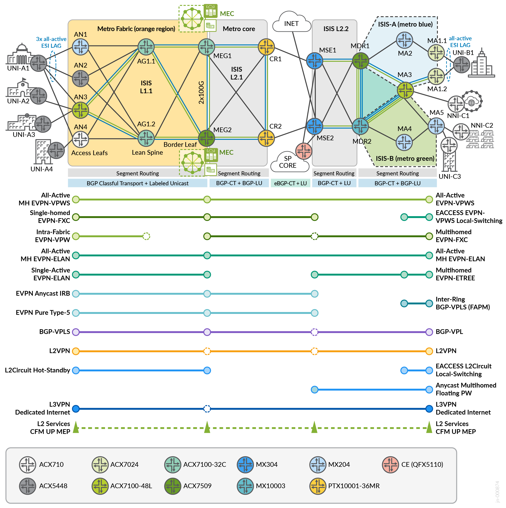

# Configuration Snippets (snips)

This `snips/` directory contains **focused, copy-pasteable configuration excerpts** extracted from the full validated device configurations in [`../conf/`](../conf/) and [`../set/`](../set/). Each file isolates a single concept (a service overlay, a routing protocol, a CoS profile, etc.) so it can be referenced, shared, or adapted without wading through a multi-thousand-line device config.

## Topology



> Refer to the topology when reading any snippet — the **role** referenced in each snippet header (e.g., `an1`, `ag1-1`, `cr1`, `ma3`, `mse1`) maps directly to a device shown above.

## Layout

```
snips/
  junos/        ← Junos OS examples (MX204, MX304, MX10003, ACX5448/710)
  evo/          ← Junos Evolved examples (ACX7024, ACX7100-32C/48L, ACX7509, PTX10001-36MR)
```

Each subtree mirrors the same category folders (`apply-groups/`, `transport/`, `services/`, `cos/`, `policy/`, `firewall/`, `oam/`, `interfaces/`) and the same set of topics. Open the file under `junos/` or `evo/` to see the OS-specific syntax for that topic.

| Sub-folder | What's in it |
|---|---|
| `apply-groups/` | Reusable templated config blocks (`GR-EDGE-INTF`, `GR-CORE-INTF`, `GR-ISIS-BCP`, `GR-L3VPN`, `GR-FATPW-*`, etc.) applied via `apply-groups`. The foundation for keeping per-device configs DRY. |
| `transport/` | Underlay: ISIS with SR-MPLS and TI-LFA, MPLS / segment-routing, BGP overlay sessions (inet-vpn, l2vpn, evpn, route-target). |
| `services/` | MEF service overlays: EVPN-VPWS, EVPN-ELAN (mac-vrf, with-IRB, port-based), L2VPN-Kompella, LDP/BGP-VPLS, L2Circuit (incl. hot-standby), L3VPN. |
| `cos/` | Class-of-service: forwarding-classes, schedulers, scheduler-maps. |
| `policy/` | Routing policies and communities — per-VRF route-targets, BGP-CT color communities, topology tags. |
| `firewall/` | Filters and policers (rate-limiting templates). |
| `oam/` | Ethernet OAM — CFM maintenance domains, Y.1731 performance-monitoring, SLA iterator profiles. |
| `interfaces/` | Edge flexible-vlan with bridge / vlan-ccc, LAG with ESI for active/active multihoming, edge VLAN normalization (input/output-vlan-map), core-facing ISIS+MPLS interface. |

## Snippet Headers — `Seen on:` and `Pair with:`

Every snippet starts with a C-style comment header containing two cross-reference fields:

- **`Seen on:`** — every validated device in `../conf/` that contains this exact pattern, split by OS family. Example:
  ```
   * Seen on:
   *   Junos: an1_mx204 an2_acx5448 an4_acx710 ma4_mx204 mse1_mx304
   *   EVO:   an3_acx7100-48l ma1-1_acx7024 ma3_acx7100-48l meg1_acx7100-32c meg2_acx7509
  ```
  This means you can open `services/evpn-vpws.conf` and immediately see *every* device in the JVD that participates in EVPN-VPWS, on both OS families. Useful for "what's the service between an1 and ma1-1?" questions.

- **`Pair with:`** — other snippets in this folder that work together to deliver the same end-to-end service (e.g., a `services/evpn-vpws.conf` snippet pairs with `transport/bgp-overlay.conf` for `family evpn signaling` and with `interfaces/lag-esi-multihoming.conf` for the AC).

When a topic is validated on only one OS family in this JVD (e.g., L2Circuit hot-standby is only on `an3_acx7100-48l`), the counterpart snippet in the other tree is clearly marked as a **reference shape** with a note that it is not deployed on that OS family in this JVD.

## Topic Index

The same topic file exists under both `junos/` and `evo/`:

| Topic | What it shows |
|---|---|
| `apply-groups/gr-edge-intf.conf` | Customer-facing interface baseline (MTU, flex-vlan, optics alarms) |
| `apply-groups/gr-edge-intf-mh.conf` | Multi-homed edge variant (no port-level damping) |
| `apply-groups/gr-core-intf.conf` | Core-facing baseline (jumbo MTU, mpls maximum-labels 14) |
| `apply-groups/gr-isis-bcp.conf` | ISIS BCP timers (SPF backoff, lsp-interval, overload-on-boot) |
| `apply-groups/gr-bgp-bcp.conf` | BGP BCP (precision-timers, hold-time 10, error-tolerance, tcp-mss) |
| `apply-groups/gr-fatpw-lb.conf` | FAT-PW load-balance-label-capability under forwarding-options |
| `apply-groups/gr-fatpw-label.conf` | Per-instance FAT flow-label config (wildcard L2VPN/EVPN/VPLS naming) |
| `apply-groups/gr-l3vpn.conf` | L3VPN VRF baseline (multipath, protect core, vrf-table-label) |
| `apply-groups/gr-l2ckt-hs.conf` | L2Circuit hot-standby knobs (reference shape on Junos) |
| `apply-groups/gr-isis-bfd.conf` | 50ms BFD on every ISIS interface (reference shape on Junos) |
| `apply-groups/gr-lag-member.conf` | LAG-member templates: edge SH/MH and core variants |
| `transport/isis-srmpls-tilfa.conf` | ISIS underlay with SR-MPLS, TI-LFA, Flex-Algo |
| `transport/mpls-segment-routing.conf` | SRGB, admin-groups, ipv6-tunneling |
| `transport/bgp-overlay.conf` | iBGP to RR with overlay AFs (inet/inet6 LU, inet-vpn, l2vpn, evpn, RT) |
| `services/evpn-vpws.conf` | MEF E-Line via EVPN-VPWS routing-instance |
| `services/evpn-elan-mac-vrf.conf` | MEF E-LAN via EVPN mac-vrf (EVO) / virtual-switch (Junos) |
| `services/evpn-elan-mac-vrf-irb.conf` | EVPN-ELAN with integrated IRB (reference shape on Junos) |
| `services/evpn-port-based.conf` | Port-based EVPN-VPWS (EPL) and EVPN-ELAN (vlan-bundle) |
| `services/l2vpn-kompella.conf` | BGP-signalled (Kompella, RFC 4761) L2VPN, port-based |
| `services/ldp-vpls.conf` | LDP-VPLS via virtual-switch (EVO) / BGP-VPLS analogue (Junos) |
| `services/l2circuit-hot-standby.conf` | L2Circuit PW with backup-neighbor hot-standby |
| `services/l3vpn-vrf.conf` | L3VPN VRF with PE-CE eBGP and as-override |
| `cos/forwarding-classes.conf` | 6-class queue model with DSCP/EXP/802.1p classifiers |
| `cos/schedulers.conf` | Schedulers + scheduler-map for the 6-class model |
| `policy/communities.conf` | Topology tags + BGP-CT color communities + L3VPN per-service RTs |
| `policy/l3vpn-export-import.conf` | Per-VRF export/import policies (route-target tagging) |
| `firewall/policers.conf` | 5/50 Mbps rate-limit policer templates |
| `oam/oam-cfm-perf-mon.conf` | Y.1731 performance-monitoring with HW-assisted timestamping |
| `interfaces/lag-esi-multihoming.conf` | Edge LAG with per-unit ESI (EVPN-VPWS / EVPN-ELAN ACs) |
| `interfaces/edge-vlan-normalization.conf` | Edge port with input/output vlan-map push/pop |
| `interfaces/core-isis-mpls.conf` | Core-facing LAG carrying inet/iso/inet6/mpls |

## Scope

Snippets are **excerpts**, not standalone configs. They:

- Preserve their original Junos hierarchy (e.g., a `services/evpn-vpws.conf` snippet contains the `routing-instances { … }` wrapper so it's syntactically valid in context).
- Are extracted from real, validated config in [`../conf/`](../conf/). When a topic isn't validated on the other OS family in this JVD, the counterpart file is clearly marked as a **reference shape** rather than copied/pasted production config.
- Are **not exhaustive** — only the most pedagogically valuable patterns are extracted. The full configurations remain in [`../conf/`](../conf/) and [`../set/`](../set/) for complete reference.

## Pairing with Documentation

The patterns shown here are described and validated in the [Metro EBS JVD](https://www.juniper.net/documentation/us/en/software/jvd/jvd-metro-ebs-03-01/index.html) and its [Solution Overview PDF](https://www.juniper.net/documentation/us/en/software/jvd/sol-overview-metro-ebs-03-01.pdf).
