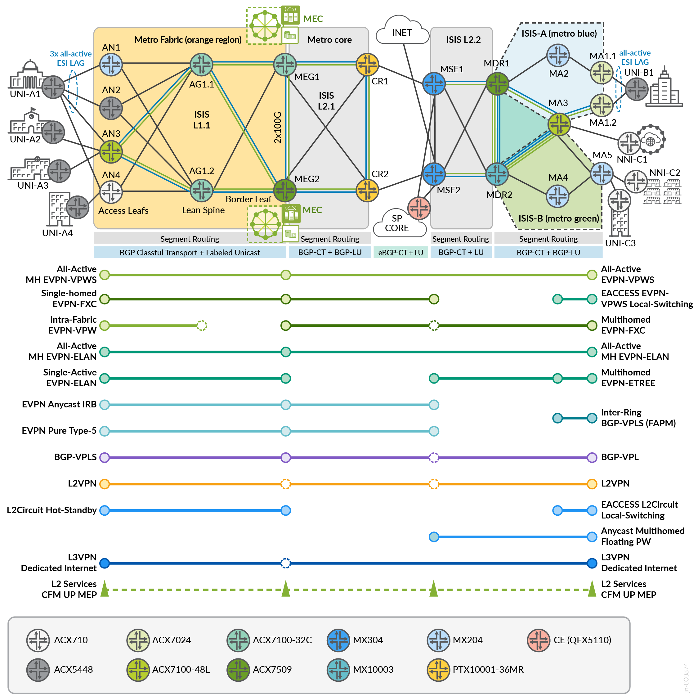

# Configuration Snippets (snips)

This `snips/` directory contains **focused, copy-pasteable configuration excerpts** extracted from the full validated device configurations in [`../conf/`](../conf/). Each file isolates a single concept (a service overlay, a routing protocol, a CoS profile, etc.) so it can be referenced, shared, or adapted without wading through a multi-thousand-line device config.

## Topology



> Refer to the topology when reading any snippet — the **role** referenced in each snippet header (e.g., `an1`, `ag1-1`, `cr1`, `ma3`, `mse1`) maps directly to a device shown above.

## Layout

```
snips/
  junos/        ← Junos OS examples (MX204, MX304, MX10003, ACX5448/710)
  evo/          ← Junos Evolved examples (ACX7024, ACX7100-32C/48L, ACX7509, PTX10001-36MR)
```

Each subtree follows the configuration hierarchy. Available forms can differ
between OS directories; select the exact form and check its device applicability.

| Sub-folder | What's in it |
|---|---|
| `groups/` | Configuration-group definitions, including interface, routing, policy and classifier forms. |
| `apply-groups/` | Application statements at the top-level hierarchy. Nested applications live under their own hierarchy folders. |
| `protocols/` | IS-IS, MPLS, BGP, L2Circuit and Ethernet OAM configuration. |
| `routing-options/` | Router identity, transport classes, resolution and forwarding-table policy. |
| `routing-instances/` | EVPN, Kompella, VPLS and L3VPN routing-instance forms and nested group applications. |
| `class-of-service/` | Classifiers, forwarding classes, rewrite rules, schedulers and scheduler maps. |
| `policy-options/` | Routing policies, communities and prefix lists. |
| `firewall/` | Filters and policers (rate-limiting templates). |
| `interfaces/` | Edge flexible-vlan with bridge / vlan-ccc, LAG with ESI for active/active multihoming, edge VLAN normalization (input/output-vlan-map), core-facing ISIS+MPLS interface. |
| `bridge-domains/` | Bridge-domain attachment and routing-interface configuration. |
| `forwarding-options/` | Forwarding and load-balancing configuration. |
| `chassis/` | Device allocation and chassis-level configuration. |

## Snippet Headers

Every snippet starts with a C-style comment header. Its claims have distinct meanings:

- **`Seen on:`** — every validated device in `../conf/` that contains this exact pattern, split by OS family. Example:
  ```
   * Seen on:
   *   Junos: an1_mx204 an2_acx5448 an4_acx710 ma4_mx204 mse1_mx304
   *   EVO:   an3_acx7100-48l ma1-1_acx7024 ma3_acx7100-48l meg1_acx7100-32c meg2_acx7509
  ```
  These rows identify devices that reproduce this exact template, not every device
  participating in the wider service family. Shared applicability alone does not
  establish a peer relationship.

- **`Count:`** — distinct source instances of this template, per device and in total.
  Overlapping templates must not be added together as a unique-service census.
- **`Pair with:`** — directed, required same-device dependencies. Literal targets
  remain in the declaring OS directory. A `variant:` requirement selects an
  applicable form supplying every required family or capability; its alternatives
  are not configurations to include together. Some attachments and prerequisites
  require source-instance selection or explicit inputs.
- **`Peers with:`** — verified configured cross-device relationships, not live
  reachability. An absent field remains unverified; it is not a claim of no peers.
  `n/a` means a peer relationship is not applicable to this configuration fragment.
  This field is not a port-to-port topology inventory: an interface can have a
  physical neighbor even when its local settings snippet is marked `n/a`.
  ESI relationships identify multihoming peers, not necessarily directly connected devices.

An OS form is published only when its body is found in that OS's validated source
population. Cross-OS observations do not replace a full native representation;
unvalidated reference-only counterparts are not part of the library.

## Templated values — `$VAR` placeholders

Identifiers that vary per deployment (loopback addresses, RD/RT tails, instance names, attachment-circuit interfaces, VPWS service-IDs, etc.) appear as `$VAR` placeholders in the body of every snippet — matching the convention used elsewhere in Juniper's JVD documentation. Values that are JVD-wide constants (apply-group names, forwarding-class names, scheduler-map names, admin-group numbers, SRGB range, AS numbers) are left literal because they ARE the abstraction the JVD documents.

Each snippet header includes a `Variables:` section listing the placeholders it uses, with example values from the device the snippet was extracted from. See [`_variables.md`](_variables.md) for the full glossary.

The leading `/* ... */` header block is treated as documentation — placeholder text inside the header survives rendering verbatim, so the doc remains readable in both source and rendered form.

To render a snippet, substitute each `$VAR` / `${VAR}` placeholder with your
deployment's value. Every placeholder a snippet uses is listed in its
`Variables:` header and in [`_variables.md`](_variables.md).

## Preserve Validated Forms

Changing a deployment value is different from adding a feature. Preserve the
statements, dependencies and application scope of the selected source form.
An already color-mapped service can be considered for a different color with
coherent policy and transport prerequisites; this does not establish that the
substitution was tested in the JVD. A service without color mapping must not be
presented as a validated color-mapped service merely because other services or
the platform support it.

Group definitions retain their exact names, patterns and settings. A definition
does not activate itself: its source application point and matching objects
determine where it takes effect. Keep structurally different groups separate,
and do not remove settings to make a broader common template.

## Source Examples

The generated [instance and binding tables](_bindings.md) and
[complete binding records](_bindings.json) identify exact matches of each
template. Values from different devices or source instances are not interchangeable
defaults. Counts describe template instances, not a sum of unique services across
overlapping forms.

These examples match the indicated form on the linked source device. Where a
service uses import/export policies, an absent explicit `vrf-target` is not proof
that the service has no route-target membership; follow its actual policies.

| Snippet form | Source device | Instance | RD | Explicit RT or policy references |
|---|---|---|---|---|
| [EVO EVPN-ELAN export](evo/routing-instances/evpn-elan/ri-evpn-elan-vlan-based-export.conf) | [an3_acx7100-48l](../conf/an3_acx7100-48l.conf) | `evpn_group_90_700` | `1.1.0.2:7000` | RT `target:63535:7000`; export `evpn_group_90_700` |
| [EVO L3VPN IRB](evo/routing-instances/l3vpn/ri-l3vpn-irb.conf) | [meg1_acx7100-32c](../conf/meg1_acx7100-32c.conf) | `METRO_L3VPN_4050` | `64200:15000` | RT `target:51535:15000` |
| [Junos EVPN-ELAN export](junos/routing-instances/evpn-elan/ri-evpn-elan-vlan-based-export.conf) | [an1_mx204](../conf/an1_mx204.conf) | `evpn_group_90_701` | `1.1.0.0:7001` | RT `target:63535:7001`; export `evpn_group_90_701` |
| [Junos PE-CE eBGP with auto-export](junos/routing-instances/l3vpn/ri-l3vpn-bgp-vrf-policy-auto-export.conf) | [mse1_mx304](../conf/mse1_mx304.conf) | `METRO_BGPv4_L3VPN_1001` | `63536:11001` | Import `METRO_BGPv4_L3VPN_1001-IMPORT`; export `METRO_BGPv4_L3VPN_1001-EXPORT` |
| [Junos PE-CE eBGP](junos/routing-instances/l3vpn/ri-l3vpn-bgp-vrf-policy.conf) | [ma4_mx204](../conf/ma4_mx204.conf) | `METRO_BGPv4_L3VPN_1001` | `63536:41001` | Import `METRO_BGPv4_L3VPN_1001-IMPORT`; export `METRO_BGPv4_L3VPN_1001-EXPORT` |
| [Junos L3VPN IRB](junos/routing-instances/l3vpn/ri-l3vpn-irb.conf) | [mse1_mx304](../conf/mse1_mx304.conf) | `METRO_L3VPN_4050` | `64400:15000` | RT `target:51535:15000` |
| [Junos BGP-VPLS export](junos/routing-instances/vpls/ri-bgp-vpls-export.conf) | [ma5_mx204](../conf/ma5_mx204.conf) | `vpls_group_108_800` | `64535:81000` | RT `target:64535:1183000`; export `vpls_group_108_800` |

Legacy `JVD service mapping` sections remain while their service associations,
remote endpoints and attachment details are checked. Their family-level summaries
are not exact per-template Counts, and a legacy named example can belong to a
different configuration form. The examples above do not establish remote peer
membership or replace the full mapping information.

<!-- mebs-service-examples:start -->
## Archived Service Examples

Generated from the archived device configurations by
`JVD_REPO=<checkout> node $JVD_BUILDER/helpers/js/mebs-service-examples.mjs --write`; use `--check` to verify currency.

These are source-local observations, not assertions that every same-name
instance is a peer or that every endpoint matches the same snippet. RD and RT
values belong to each device separately. Policy references are preserved without
assuming their effective route targets. Interface details below are explicit
settings only; group inheritance and service reachability require separate checks.
A missing explicit setting does not establish that the effective setting is absent.

Loopback cross-references show where a configured neighbor address appears in
the archives; they are not session-state evidence. The supplemental
`evpn_group_80_1398` example preserves the separately cited attachment
`et-0/0/50.1399` without assigning it to `evpn_group_80_1000`.

<details>
<summary>evpn_group_60_4000</summary>

| Source | RD / RT or neighbor | Policies / settings | Interface references and explicit details |
|---|---|---|---|
| [an3_acx7100-48l](../conf/an3_acx7100-48l.conf) | RD `1.1.0.2:14000`; RT `target:61535:14000` | Import Not explicit; export Not explicit | `et-0/0/50.2000`; VLAN `2000`; encapsulation `flexible-ethernet-services`, `vlan-bridge`<br>`irb.4000` |
| [meg1_acx7100-32c](../conf/meg1_acx7100-32c.conf) | RD `1.1.0.6:14000`; RT `target:61535:14000` | Import Not explicit; export Not explicit | `ae66.4000`; ESI `00:22:11:11:11:12:a1:00:00:01`, `all-active`; VLAN `4000`; encapsulation `flexible-ethernet-services`, `vlan-bridge`<br>`irb.4000` |
| [meg2_acx7509](../conf/meg2_acx7509.conf) | RD `1.1.0.7:14000`; RT `target:61535:14000` | Import Not explicit; export Not explicit | `ae66.4000`; ESI `00:22:11:11:11:12:a1:00:00:01`, `all-active`; VLAN `4000`; encapsulation `flexible-ethernet-services`, `vlan-bridge`<br>`irb.4000` |
| [mse1_mx304](../conf/mse1_mx304.conf) | RD `1.1.0.10:14000`; RT `target:61535:14000` | Import Not explicit; export Not explicit | `xe-0/0/3:1.3000`; VLAN `3000`; encapsulation `flexible-ethernet-services`, `vlan-bridge` |
| [mse2_mx304](../conf/mse2_mx304.conf) | RD `1.1.0.11:14000`; RT `target:61535:14000` | Import Not explicit; export Not explicit | `xe-0/0/15:2.4000`; VLAN `4000`; encapsulation `flexible-ethernet-services`, `vlan-bridge` |

</details>

<details>
<summary>evpn_group_80_1000</summary>

| Source | RD / RT or neighbor | Policies / settings | Interface references and explicit details |
|---|---|---|---|
| [an3_acx7100-48l](../conf/an3_acx7100-48l.conf) | RD `1.1.0.2:8000`; RT `target:63535:8000` | Import Not explicit; export `evpn_group_80_1000` | `et-0/0/50.1000`; VLAN `1000-1001`; encapsulation `flexible-ethernet-services`, `vlan-bridge` |
| [ma4_mx204](../conf/ma4_mx204.conf) | RD `1.1.0.16:9000`; RT `target:63536:9000` | Import Not explicit; export Not explicit | `xe-0/1/4.2999`; VLAN `2999`; encapsulation `flexible-ethernet-services`, `vlan-bridge` |
| [ma5_mx204](../conf/ma5_mx204.conf) | RD `1.1.0.19:9000`; RT `target:63536:9000` | Import Not explicit; export Not explicit | `xe-0/1/4.2999`; VLAN `2999`; encapsulation `flexible-ethernet-services`, `vlan-bridge` |
| [meg1_acx7100-32c](../conf/meg1_acx7100-32c.conf) | RD `1.1.0.6:8000`; RT `target:63535:8000` | Import Not explicit; export `evpn_group_80_1000` | `ae66.1000`; ESI `00:81:10:10:10:10:10:00:00:01`, `all-active`; VLAN `1000-1001`; encapsulation `flexible-ethernet-services`, `vlan-bridge` |
| [meg2_acx7509](../conf/meg2_acx7509.conf) | RD `1.1.0.7:8000`; RT `target:63535:8000` | Import Not explicit; export `evpn_group_80_1000` | `ae66.1000`; ESI `00:81:10:10:10:10:10:00:00:01`, `all-active`; VLAN `1000-1001`; encapsulation `flexible-ethernet-services`, `vlan-bridge` |
| [mse1_mx304](../conf/mse1_mx304.conf) | RD `1.1.0.10:9000`; RT `target:63536:9000` | Import Not explicit; export Not explicit | `ae10.2999`; ESI `00:10:11:11:11:80:04:f9:00:01`, `all-active`; VLAN `2999`; encapsulation `flexible-ethernet-services`, `vlan-bridge` |
| [mse2_mx304](../conf/mse2_mx304.conf) | RD `1.1.0.11:9000`; RT `target:63536:9000` | Import Not explicit; export Not explicit | `ae10.2999`; ESI `00:10:11:11:11:80:04:f9:00:01`, `all-active`; VLAN `2999`; encapsulation `flexible-ethernet-services`, `vlan-bridge` |

</details>

<details>
<summary>evpn_group_80_1398</summary>

| Source | RD / RT or neighbor | Policies / settings | Interface references and explicit details |
|---|---|---|---|
| [an3_acx7100-48l](../conf/an3_acx7100-48l.conf) | RD `1.1.0.2:8398`; RT `target:63535:8398` | Import Not explicit; export Not explicit | `et-0/0/50.1398`; VLAN `1398`; encapsulation `flexible-ethernet-services`, `vlan-bridge`<br>`et-0/0/50.1399`; VLAN `1399`; encapsulation `flexible-ethernet-services`, `vlan-bridge` |
| [meg1_acx7100-32c](../conf/meg1_acx7100-32c.conf) | RD `1.1.0.6:8398`; RT `target:63535:8398` | Import Not explicit; export Not explicit | `ae66.1398`; ESI `00:81:10:10:10:10:10:00:00:c8`, `all-active`; VLAN `1398`; encapsulation `flexible-ethernet-services`, `vlan-bridge`<br>`ae66.1399`; ESI `00:81:20:20:64:10:10:00:00:01`, `all-active`; VLAN `1399`; encapsulation `flexible-ethernet-services`, `vlan-bridge` |
| [meg2_acx7509](../conf/meg2_acx7509.conf) | RD `1.1.0.7:8398`; RT `target:63535:8398` | Import Not explicit; export Not explicit | `ae66.1398`; ESI `00:81:10:10:10:10:10:00:00:c8`, `all-active`; VLAN `1398`; encapsulation `flexible-ethernet-services`, `vlan-bridge`<br>`ae66.1399`; ESI `00:81:20:20:64:10:10:00:00:01`, `all-active`; VLAN `1399`; encapsulation `flexible-ethernet-services`, `vlan-bridge` |

</details>

<details>
<summary>EVPN_ELAN_PORT_BASED</summary>

| Source | RD / RT or neighbor | Policies / settings | Interface references and explicit details |
|---|---|---|---|
| [an3_acx7100-48l](../conf/an3_acx7100-48l.conf) | RD `1.1.0.2:5565`; RT `target:63535:6565` | Import Not explicit; export Not explicit | `et-0/0/11.0`; encapsulation `ethernet-bridge` |
| [ma1-2_acx7024](../conf/ma1-2_acx7024.conf) | RD `1.1.0.18:6565`; RT `target:63535:6565` | Import Not explicit; export Not explicit | `et-0/0/8.0`; encapsulation `ethernet-bridge` |

</details>

<details>
<summary>evpn_group_40_1</summary>

| Source | RD / RT or neighbor | Policies / settings | Interface references and explicit details |
|---|---|---|---|
| [an3_acx7100-48l](../conf/an3_acx7100-48l.conf) | RD `1.1.0.2:401`; RT `target:63535:401` | Import Not explicit; export `evpn_group_40_1` | `et-0/0/0.1800`; VLAN `1800`; encapsulation `flexible-ethernet-services`, `vlan-ccc`<br>`et-0/0/0.2300`; VLAN `2300`; encapsulation `flexible-ethernet-services`, `vlan-ccc`<br>`et-0/0/0.800`; VLAN `800-809`; encapsulation `flexible-ethernet-services`, `vlan-ccc` |
| [mse1_mx304](../conf/mse1_mx304.conf) | RD `1.1.0.10:401`; RT `target:63535:401` | Import Not explicit; export `evpn_group_40_1` | `et-0/0/4.1800`; VLAN `1800`; encapsulation `flexible-ethernet-services`, `vlan-ccc`<br>`et-0/0/4.2300`; VLAN `2300`; encapsulation `flexible-ethernet-services`, `vlan-ccc`<br>`et-0/0/4.800`; encapsulation `flexible-ethernet-services`, `vlan-ccc`<br>`et-0/0/4.801`; encapsulation `flexible-ethernet-services`, `vlan-ccc`<br>`et-0/0/4.802`; encapsulation `flexible-ethernet-services`, `vlan-ccc`<br>`et-0/0/4.803`; encapsulation `flexible-ethernet-services`, `vlan-ccc`<br>`et-0/0/4.804`; encapsulation `flexible-ethernet-services`, `vlan-ccc`<br>`et-0/0/4.805`; encapsulation `flexible-ethernet-services`, `vlan-ccc`<br>`et-0/0/4.806`; encapsulation `flexible-ethernet-services`, `vlan-ccc`<br>`et-0/0/4.807`; encapsulation `flexible-ethernet-services`, `vlan-ccc`<br>`et-0/0/4.808`; encapsulation `flexible-ethernet-services`, `vlan-ccc`<br>`et-0/0/4.809`; encapsulation `flexible-ethernet-services`, `vlan-ccc` |

</details>

<details>
<summary>evpn_group_40_100</summary>

| Source | RD / RT or neighbor | Policies / settings | Interface references and explicit details |
|---|---|---|---|
| [an3_acx7100-48l](../conf/an3_acx7100-48l.conf) | RD `1.1.0.2:500`; RT `target:63535:500` | Import Not explicit; export `evpn_group_40_100` | `et-0/0/0.1899`; VLAN `1899`; encapsulation `flexible-ethernet-services`, `vlan-ccc`<br>`et-0/0/0.2399`; VLAN `2399`; encapsulation `flexible-ethernet-services`, `vlan-ccc`<br>`et-0/0/0.998`; VLAN `998`; encapsulation `flexible-ethernet-services`, `vlan-ccc`<br>`et-0/0/0.999`; VLAN `999`; encapsulation `flexible-ethernet-services`, `vlan-ccc` |
| [mse1_mx304](../conf/mse1_mx304.conf) | RD `1.1.0.10:500`; RT `target:63535:500` | Import Not explicit; export `evpn_group_40_100` | `et-0/0/4.1899`; VLAN `1899`; encapsulation `flexible-ethernet-services`, `vlan-ccc`<br>`et-0/0/4.2399`; VLAN `2399`; encapsulation `flexible-ethernet-services`, `vlan-ccc`<br>`et-0/0/4.998`; VLAN `998`; encapsulation `flexible-ethernet-services`, `vlan-ccc`<br>`et-0/0/4.999`; VLAN `999`; encapsulation `flexible-ethernet-services`, `vlan-ccc` |

</details>

<details>
<summary>evpn_group_40_251</summary>

| Source | RD / RT or neighbor | Policies / settings | Interface references and explicit details |
|---|---|---|---|
| [an3_acx7100-48l](../conf/an3_acx7100-48l.conf) | RD `1.1.0.2:651`; RT `target:63535:651` | Import Not explicit; export Not explicit | `et-0/0/0.1300`; VLAN `1300`; encapsulation `flexible-ethernet-services`, `vlan-ccc`<br>`et-0/0/0.1301`; VLAN `1301`; encapsulation `flexible-ethernet-services`, `vlan-ccc`<br>`et-0/0/0.2050`; VLAN `2050`; encapsulation `flexible-ethernet-services`, `vlan-ccc`<br>`et-0/0/0.2550`; VLAN `2550`; encapsulation `flexible-ethernet-services`, `vlan-ccc` |
| [mse1_mx304](../conf/mse1_mx304.conf) | RD `1.1.0.10:651`; RT `target:63535:651` | Import Not explicit; export Not explicit | `et-0/0/4.1300`; VLAN `1300`; encapsulation `flexible-ethernet-services`, `vlan-ccc`<br>`et-0/0/4.1301`; VLAN `1301`; encapsulation `flexible-ethernet-services`, `vlan-ccc`<br>`et-0/0/4.2050`; VLAN `2050`; encapsulation `flexible-ethernet-services`, `vlan-ccc`<br>`et-0/0/4.2550`; VLAN `2550`; encapsulation `flexible-ethernet-services`, `vlan-ccc` |

</details>

<details>
<summary>EVPN_VPWS_PORT_BASED</summary>

| Source | RD / RT or neighbor | Policies / settings | Interface references and explicit details |
|---|---|---|---|
| [an3_acx7100-48l](../conf/an3_acx7100-48l.conf) | RD `1.1.0.2:5500`; RT `target:63535:5500` | Import Not explicit; export Not explicit | `et-0/0/7.0`; encapsulation `ethernet-ccc` |
| [ma1-1_acx7024](../conf/ma1-1_acx7024.conf) | RD `1.1.0.17:5500`; RT `target:63535:5500` | Import Not explicit; export Not explicit | `et-0/0/6.0`; encapsulation `ethernet-ccc` |

</details>

<details>
<summary>L2VPN_PORT_BASED</summary>

| Source | RD / RT or neighbor | Policies / settings | Interface references and explicit details |
|---|---|---|---|
| [an3_acx7100-48l](../conf/an3_acx7100-48l.conf) | RD `63535:6500`; RT `target:63535:6500` | Import Not explicit; export Not explicit | `et-0/0/8.0`; encapsulation `ethernet-ccc` |
| [ma5_mx204](../conf/ma5_mx204.conf) | RD `60535:8500`; RT `target:63535:6500` | Import Not explicit; export Not explicit | `xe-0/1/2.0`; encapsulation `ethernet-ccc` |

</details>

<details>
<summary>METRO_BGPv4_L3VPN_2101</summary>

| Source | RD / RT or neighbor | Policies / settings | Interface references and explicit details |
|---|---|---|---|
| [an3_acx7100-48l](../conf/an3_acx7100-48l.conf) | RD `63535:2101`; RT Not explicit | Import `PS-METRO_BGPv4_L3VPN_2101-IMPORT`; export `PS-METRO_BGPv4_L3VPN_2101-EXPORT` | `et-0/0/4.2101`; VLAN `2101`; encapsulation `flexible-ethernet-services` |
| [ma3_acx7100-48l](../conf/ma3_acx7100-48l.conf) | RD `63536:2101`; RT Not explicit | Import `METRO_BGPv4_L3VPN_2101-IMPORT`; export `METRO_BGPv4_L3VPN_2101-EXPORT` | `et-0/0/5.2101`; VLAN `2101`; encapsulation `flexible-ethernet-services` |
| [mse1_mx304](../conf/mse1_mx304.conf) | RD `63536:2101`; RT Not explicit | Import `METRO_BGPv4_L3VPN_2101-IMPORT`; export `METRO_BGPv4_L3VPN_2101-EXPORT` | `et-0/0/5.2101`; VLAN `2101`; encapsulation `flexible-ethernet-services` |
| [mse2_mx304](../conf/mse2_mx304.conf) | RD `63536:22101`; RT Not explicit | Import `METRO_BGPv4_L3VPN_2101-IMPORT`; export `METRO_BGPv4_L3VPN_2101-EXPORT` | `xe-0/0/15:0.2101`; VLAN `2101`; encapsulation `flexible-ethernet-services` |

</details>

<details>
<summary>METRO_L3VPN_4000</summary>

| Source | RD / RT or neighbor | Policies / settings | Interface references and explicit details |
|---|---|---|---|
| [an3_acx7100-48l](../conf/an3_acx7100-48l.conf) | RD `63000:13000`; RT Not explicit | Import `PS-METRO_L3VPN_4000-IMPORT`; export `PS-METRO_L3VPN_4000-EXPORT` | `irb.4000` |
| [meg1_acx7100-32c](../conf/meg1_acx7100-32c.conf) | RD `61000:13000`; RT `target:61535:13000` | Import `PS-METRO_L3VPN_4000-IMPORT`; export `PS-METRO_L3VPN_4000-EXPORT` | `irb.4000` |
| [meg2_acx7509](../conf/meg2_acx7509.conf) | RD `62000:13000`; RT `target:61535:13000` | Import `PS-METRO_L3VPN_4000-IMPORT`; export `PS-METRO_L3VPN_4000-EXPORT` | `irb.4000` |
| [mse1_mx304](../conf/mse1_mx304.conf) | RD `63200:13000`; RT Not explicit | Import `PS-METRO_L3VPN_4000-IMPORT`; export `PS-METRO_L3VPN_4000-EXPORT` | `irb.4000` |
| [mse2_mx304](../conf/mse2_mx304.conf) | RD `63300:13000`; RT Not explicit | Import `PS-METRO_L3VPN_4000-IMPORT`; export `PS-METRO_L3VPN_4000-EXPORT` | `irb.4000` |

</details>

<details>
<summary>METRO_L3VPN_2001</summary>

| Source | RD / RT or neighbor | Policies / settings | Interface references and explicit details |
|---|---|---|---|
| [an3_acx7100-48l](../conf/an3_acx7100-48l.conf) | RD `63535:2001`; RT Not explicit | Import `PS-METRO_L3VPN_2001-IMPORT`; export `PS-METRO_L3VPN_2001-EXPORT` | `et-0/0/4.2001`; VLAN `2001`; encapsulation `flexible-ethernet-services` |
| [ma3_acx7100-48l](../conf/ma3_acx7100-48l.conf) | RD `63536:2001`; RT Not explicit | Import `METRO_L3VPN_2001-IMPORT`; export `METRO_L3VPN_2001-EXPORT` | `et-0/0/5.2001`; VLAN `2001`; encapsulation `flexible-ethernet-services` |
| [mse1_mx304](../conf/mse1_mx304.conf) | RD `63536:2001`; RT Not explicit | Import `METRO_L3VPN_2001-IMPORT`; export `METRO_L3VPN_2001-EXPORT` | `et-0/0/5.2001`; VLAN `2001`; encapsulation `flexible-ethernet-services` |
| [mse2_mx304](../conf/mse2_mx304.conf) | RD `63536:22001`; RT Not explicit | Import `METRO_L3VPN_2001-IMPORT`; export `METRO_L3VPN_2001-EXPORT` | `xe-0/0/15:0.2001`; VLAN `2001`; encapsulation `flexible-ethernet-services` |

</details>

<details>
<summary>vpls_group_102_400</summary>

| Source | RD / RT or neighbor | Policies / settings | Interface references and explicit details |
|---|---|---|---|
| [an3_acx7100-48l](../conf/an3_acx7100-48l.conf) | RD `63535:1093000`; RT `target:63535:1093000` | Import Not explicit; export `vpls_group_102_400` | `et-0/0/0.400`; VLAN `400`; encapsulation `flexible-ethernet-services`, `vlan-bridge` |
| [ma5_mx204](../conf/ma5_mx204.conf) | RD `63536:1093000`; RT `target:63535:1093000` | Import Not explicit; export `vpls_group_102_400` | `xe-0/1/4.400`; VLAN `400`; encapsulation `flexible-ethernet-services`, `vlan-vpls` |
| [meg1_acx7100-32c](../conf/meg1_acx7100-32c.conf) | RD `63535:1193000`; RT `target:63535:1093000` | Import Not explicit; export `vpls_group_102_400` | `et-0/0/26:0.400`; VLAN `400`; encapsulation `flexible-ethernet-services`, `vlan-bridge` |

</details>

<details>
<summary>KB-VPLS-EPL</summary>

| Source | RD / RT or neighbor | Policies / settings | Interface references and explicit details |
|---|---|---|---|
| [an3_acx7100-48l](../conf/an3_acx7100-48l.conf) | RD Not explicit; RT Not explicit | Import Not explicit; export Not explicit | `et-0/0/53.0`; encapsulation `ethernet-vpls` |

</details>

<details>
<summary>evpn_group_90_700</summary>

| Source | RD / RT or neighbor | Policies / settings | Interface references and explicit details |
|---|---|---|---|
| [an1_mx204](../conf/an1_mx204.conf) | RD `1.1.0.0:7000`; RT `target:63535:7000` | Import Not explicit; export `evpn_group_90_700` | `ae11.700`; ESI `00:70:11:11:11:11:11:00:00:01`, `all-active`; VLAN `700`; encapsulation `flexible-ethernet-services`, `vlan-bridge` |
| [an2_acx5448](../conf/an2_acx5448.conf) | RD `1.1.0.1:7000`; RT `target:63535:7000` | Import Not explicit; export Not explicit | `ae11.700`; ESI `00:70:11:11:11:11:11:00:00:01`, `all-active`; VLAN `700`; encapsulation `flexible-ethernet-services`, `vlan-bridge` |
| [an3_acx7100-48l](../conf/an3_acx7100-48l.conf) | RD `1.1.0.2:7000`; RT `target:63535:7000` | Import Not explicit; export `evpn_group_90_700` | `ae11.700`; ESI `00:70:11:11:11:11:11:00:00:01`, `all-active`; VLAN `700`; encapsulation `flexible-ethernet-services`, `vlan-bridge` |
| [ma1-1_acx7024](../conf/ma1-1_acx7024.conf) | RD `1.1.0.17:7000`; RT `target:63535:7000` | Import Not explicit; export `evpn_group_90_700` | `ae12.700`; ESI `00:72:11:11:11:11:11:00:00:01`, `all-active`; VLAN `700`; encapsulation `flexible-ethernet-services`, `vlan-bridge` |
| [ma1-2_acx7024](../conf/ma1-2_acx7024.conf) | RD `1.1.0.18:7000`; RT `target:63535:7000` | Import Not explicit; export `evpn_group_90_700` | `ae12.700`; ESI `00:72:11:11:11:11:11:00:00:01`, `all-active`; VLAN `700`; encapsulation `flexible-ethernet-services`, `vlan-bridge` |
| [meg1_acx7100-32c](../conf/meg1_acx7100-32c.conf) | RD `1.1.0.6:7000`; RT `target:63535:7000` | Import Not explicit; export `evpn_group_90_700` | `ae66.700`; ESI `00:71:11:11:11:11:11:00:00:01`, `all-active`; VLAN `700`; encapsulation `flexible-ethernet-services`, `vlan-bridge` |
| [meg2_acx7509](../conf/meg2_acx7509.conf) | RD `1.1.0.7:7000`; RT `target:63535:7000` | Import Not explicit; export `evpn_group_90_700` | `ae66.700`; ESI `00:71:11:11:11:11:11:00:00:01`, `all-active`; VLAN `700`; encapsulation `flexible-ethernet-services`, `vlan-bridge` |

</details>

<details>
<summary>evpn_group_80_1</summary>

| Source | RD / RT or neighbor | Policies / settings | Interface references and explicit details |
|---|---|---|---|
| [ma4_mx204](../conf/ma4_mx204.conf) | RD `1.1.0.16:8001`; RT `target:63536:8001` | Import Not explicit; export `evpn_group_80_1` | `xe-0/1/4.2000`; VLAN `2000`; encapsulation `flexible-ethernet-services`, `vlan-bridge` |
| [ma5_mx204](../conf/ma5_mx204.conf) | RD `1.1.0.19:8001`; RT `target:63536:8001` | Import Not explicit; export `evpn_group_80_1` | `xe-0/1/4.2000`; VLAN `2000`; encapsulation `flexible-ethernet-services`, `vlan-bridge` |
| [mse1_mx304](../conf/mse1_mx304.conf) | RD `1.1.0.10:8001`; RT `target:63536:8001` | Import Not explicit; export `evpn_group_80_1` | `ae10.2000`; ESI `00:10:11:11:11:80:01:00:00:01`, `all-active`; VLAN `2000`; encapsulation `flexible-ethernet-services`, `vlan-bridge` |
| [mse2_mx304](../conf/mse2_mx304.conf) | RD `1.1.0.11:8001`; RT `target:63536:8001` | Import Not explicit; export `evpn_group_80_1` | `ae10.2000`; ESI `00:10:11:11:11:80:01:00:00:01`, `all-active`; VLAN `2000`; encapsulation `flexible-ethernet-services`, `vlan-bridge` |

</details>

<details>
<summary>evpn_group_30_2400</summary>

| Source | RD / RT or neighbor | Policies / settings | Interface references and explicit details |
|---|---|---|---|
| [an1_mx204](../conf/an1_mx204.conf) | RD `1.1.0.0:2400`; RT `target:63535:2400` | Import Not explicit; export Not explicit | `ae11.2400`; ESI `00:10:11:11:30:11:01:00:00:00`, `all-active`; VLAN `2400`; encapsulation `flexible-ethernet-services`, `vlan-ccc` |
| [an2_acx5448](../conf/an2_acx5448.conf) | RD `1.1.0.1:2400`; RT `target:63535:2400` | Import Not explicit; export Not explicit | `ae11.2400`; ESI `00:10:11:11:30:11:01:00:00:00`, `all-active`; VLAN `2400`; encapsulation `flexible-ethernet-services`, `vlan-ccc` |
| [an3_acx7100-48l](../conf/an3_acx7100-48l.conf) | RD `1.1.0.2:2400`; RT `target:63535:2400` | Import Not explicit; export Not explicit | `ae11.2400`; ESI `00:10:11:11:30:11:01:00:00:00`, `all-active`; VLAN `2400`; encapsulation `flexible-ethernet-services`, `vlan-ccc` |
| [ma1-1_acx7024](../conf/ma1-1_acx7024.conf) | RD `1.1.0.17:2400`; RT `target:63535:2400` | Import Not explicit; export Not explicit | `ae12.2400`; ESI `00:10:11:11:30:12:01:00:00:00`, `all-active`; VLAN `2400`; encapsulation `flexible-ethernet-services`, `vlan-ccc` |
| [ma1-2_acx7024](../conf/ma1-2_acx7024.conf) | RD `1.1.0.18:2400`; RT `target:63535:2400` | Import Not explicit; export Not explicit | `ae12.2400`; ESI `00:10:11:11:30:12:01:00:00:00`, `all-active`; VLAN `2400`; encapsulation `flexible-ethernet-services`, `vlan-ccc` |

</details>

<details>
<summary>INTERNET-VRF</summary>

| Source | RD / RT or neighbor | Policies / settings | Interface references and explicit details |
|---|---|---|---|
| [mse2_mx304](../conf/mse2_mx304.conf) | RD `1.1.0.11:63536`; RT `import target:63536:22222` | Import Not explicit; export `INET-VRF-DEFAULT_1` | `xe-0/0/15:2.2001`; VLAN `2001`; encapsulation `flexible-ethernet-services` |

</details>

<details>
<summary>METRO_L3VPN_1</summary>

| Source | RD / RT or neighbor | Policies / settings | Interface references and explicit details |
|---|---|---|---|
| [ma4_mx204](../conf/ma4_mx204.conf) | RD `63536:41`; RT Not explicit | Import `METRO_L3VPN_1-IMPORT`; export `METRO_L3VPN_1-EXPORT` | `xe-0/1/4.1`; VLAN `1`; encapsulation `flexible-ethernet-services` |
| [mse1_mx304](../conf/mse1_mx304.conf) | RD `63536:11`; RT Not explicit | Import `METRO_L3VPN_1-IMPORT`; export `METRO_L3VPN_1-EXPORT` | `et-0/0/5.1`; VLAN `1`; encapsulation `flexible-ethernet-services` |
| [mse2_mx304](../conf/mse2_mx304.conf) | RD `63536:31`; RT Not explicit | Import `METRO_L3VPN_1-IMPORT`; export `METRO_L3VPN_1-EXPORT` | `xe-0/0/15:0.1`; VLAN `1`; encapsulation `flexible-ethernet-services` |

</details>

<details>
<summary>l2ckt-vc3000</summary>

| Source | RD / RT or neighbor | Policies / settings | Interface references and explicit details |
|---|---|---|---|
| [an3_acx7100-48l](../conf/an3_acx7100-48l.conf) | Neighbor `1.1.0.6` (loopback in [meg1_acx7100-32c](../conf/meg1_acx7100-32c.conf)); backups `1.1.0.7` (loopback in [meg2_acx7509](../conf/meg2_acx7509.conf)) | Not explicit | `et-0/0/0.3000`; VLAN `3000`; encapsulation `flexible-ethernet-services`, `vlan-ccc` |
| [meg1_acx7100-32c](../conf/meg1_acx7100-32c.conf) | Neighbor `1.1.0.2` (loopback in [an3_acx7100-48l](../conf/an3_acx7100-48l.conf)); backups Not explicit | Not explicit | `et-0/0/26:3.3000`; VLAN `3000`; encapsulation `flexible-ethernet-services`, `vlan-ccc` |

</details>

<details>
<summary>l2ckt-lsw-ma3_acx7100-48l-et-0/0/5.3000</summary>

| Source | RD / RT or neighbor | Policies / settings | Interface references and explicit details |
|---|---|---|---|
| [ma3_acx7100-48l](../conf/ma3_acx7100-48l.conf) | Local switching | Not explicit | `et-0/0/5.3000`; VLAN `3000-3099`; encapsulation `flexible-ethernet-services`, `vlan-ccc`<br>`et-0/0/51.4010`; encapsulation `flexible-ethernet-services`, `vlan-ccc` |

</details>

<!-- mebs-service-examples:end -->

## Topic Index

Paths without an OS prefix are relative to the selected OS directory. Not every
form exists on both OSes; related forms may have different names and bodies.

| Topic | What it shows |
|---|---|
| `groups/gr-edge-intf.conf` | Customer-facing interface baseline (MTU, flex-vlan, optics alarms) |
| `groups/gr-edge-intf-mh.conf` | Multi-homed edge group |
| `groups/gr-core-intf.conf` | Core-facing baseline (jumbo MTU, mpls maximum-labels 14) |
| `groups/gr-isis-bcp.conf` | ISIS BCP timers (SPF backoff, lsp-interval, overload-on-boot) |
| `groups/gr-bgp-bcp.conf` | BGP BCP (precision-timers, hold-time 10, error-tolerance, tcp-mss) |
| `groups/gr-fatpw-lb.conf` | FAT-PW load-balance-label-capability under forwarding-options |
| `groups/gr-fatpw-label.conf` | Per-instance FAT flow-label config (wildcard L2VPN/EVPN/VPLS naming) |
| `groups/gr-l3vpn.conf` | L3VPN VRF baseline (multipath, protect core, vrf-table-label) |
| `evo/groups/gr-l2ckt-hs.conf` | L2Circuit hot-standby knobs (EVO only) |
| `evo/groups/gr-isis-bfd.conf` | 50ms BFD on every ISIS interface (EVO only — MX PEs configure BFD inline under `protocols isis`) |
| `groups/gr-lag-member.conf` | LAG-member group |
| `evo/protocols/isis-srmpls-tilfa.conf` | ISIS underlay with SR-MPLS, TI-LFA, Flex-Algo |
| `protocols/mpls-segment-routing.conf` | SRGB, admin-groups, ipv6-tunneling |
| `protocols/bgp-overlay.conf` | BGP overlay; use the device-appropriate family form |
| `routing-instances/evpn-vpws/ri-evpn-vpws.conf` | MEF E-Line via EVPN-VPWS routing-instance |
| `evo/routing-instances/evpn-elan/ri-evpn-elan-vlan-based-export.conf` | MEF E-LAN, VLAN-based, with a `vrf-export` policy (EVO) |
| `junos/routing-instances/evpn-elan/ri-evpn-elan-vlan-based.conf` | MEF E-LAN via `instance-type evpn` vlan-based — plain/base form (Junos MX) |
| `junos/routing-instances/evpn-elan/ri-evpn-elan-vlan-based-export.conf` | MEF E-LAN, VLAN-based, with a `vrf-export` policy (Junos MX) |
| `evo/routing-instances/evpn-elan/ri-evpn-elan-irb.conf` | EVPN-ELAN with integrated IRB (mac-vrf + `l3-interface`, EVO) |
| `junos/routing-instances/evpn-elan/ri-evpn-elan-irb.conf` | EVPN-ELAN with IRB via `instance-type virtual-switch` (Junos MX) |
| `evo/routing-instances/evpn-elan/ri-evpn-port-based.conf` | Port-based EVPN E-LAN — whole-UNI (`ethernet-bridge` unit 0, mac-vrf + `service-type vlan-bundle`, EVO) |
| `evo/routing-instances/evpn-elan/ri-evpn-elan-vlan-bundle-export.conf` | VLAN-bundle EVPN E-LAN — selected VLANs (`vlan-bridge` + `vlan-id`/`vlan-id-list`) share one MAC-VRF (EVO) |
| `routing-instances/l2vpn/ri-l2vpn-kompella.conf` | Port-based Kompella L2VPN (RFC 4761); required `ethernet-ccc` attachment: [AN3](evo/interfaces/ifd-ethernet-ccc-unit0-description.conf) or [MA5](junos/interfaces/ifd-ethernet-ccc-unit0.conf), with `$AC_INTF = $IFD.0`. |
| `junos/routing-instances/vpls/ri-bgp-vpls-export.conf` | BGP-VPLS (virtual-switch + site/site-identifier, RFC 4761) — Junos PEs |
| `evo/routing-instances/vpls/ri-ldp-vpls.conf` | LDP-VPLS (virtual-switch + vpls-id + neighbor, RFC 4762) — EVO PEs |
| `evo/protocols/l2circuit-hsb-hub-color-ignore-encap.conf` | L2circuit hot-standby hub — transport-colour community, encapsulation-mismatch tolerance (EVO only) |
| `evo/protocols/l2circuit-hsb-pe-color.conf` | L2circuit hot-standby PE — hot-standby-vc-on with transport-colour community (EVO only) |
| `routing-instances/l3vpn/ri-l3vpn-bgp-vrf-policy[-auto-export].conf` | L3VPN VRF with PE-CE eBGP and as-override |
| `routing-instances/l3vpn/ri-l3vpn-ospf-vrf-policy[-auto-export].conf` | L3VPN VRF with PE-CE OSPF (area 0, `interface-type p2p`) |
| `class-of-service/classifiers/cl-6class.conf` | DSCP/EXP/802.1p ingress classifiers |
| `class-of-service/forwarding-classes/fc-6queue-model.conf` | 6-class queue model |
| `class-of-service/rewrite-rules/rr-6class-marking.conf` | DSCP/EXP/802.1p rewrite rules for the 6-class model |
| `class-of-service/scheduler-maps/sm-6class-mapping.conf` | Scheduler-map pairing each class with its scheduler |
| `class-of-service/schedulers/sc-2-priority-model.conf` | Per-class schedulers, strict-high REALTIME plus five low |
| `policy-options/community/` | Topology tags, BGP-CT color communities and L3VPN per-service RTs |
| `policy-options/policy-statement/` | Per-VRF export/import policies (route-target tagging) |
| `firewall/policers.conf` | 5/50 Mbps rate-limit policer templates |
| `evo/protocols/oam-cfm-perf-mon.conf` | Y.1731 performance-monitoring with HW-assisted timestamping |
| `interfaces/ifd-ae-lacp-fast.conf` | Aggregated-Ethernet edge bundle, fast-periodic LACP |
| `interfaces/ifl-vlan-ccc-vlan-map*.conf`, `interfaces/ifl-vlan-bridge-vlan-map*.conf`, `interfaces/ifl-vlan-vpls-vlan-map.conf` | Per-unit attachment circuits with input/output vlan-map push/pop |
| `interfaces/core-isis-mpls.conf` | Core-facing LAG carrying inet/iso/inet6/mpls |

## Scope

The reusable model excludes only explicitly adjudicated, hash-pinned source
subtrees recorded in `_source-exclusions.json`. Diagnostic traceoptions, unused
ports and the reviewed management/test static routes remain in the archives but
are not reusable configuration. Unmodeled configuration is not automatically an
exclusion. Source-to-model conservation is checked separately from individual
snippet reconstruction.

LLDP `interface all` and the device-global `$ASN` are represented for all validated
devices in their native OS directories. `$ASN_CUSTOMER` is the independent
customer-facing peer ASN; community and route-target administrator variables retain
their existing meanings.

Snippets are **excerpts**, not standalone configs. They:

- Preserve their original Junos hierarchy (e.g., an EVPN-VPWS snippet contains
  the `routing-instances { ... }` wrapper so it is syntactically valid in context).
- Are extracted from real, validated config in [`../conf/`](../conf/). Do not
  infer an unobserved OS form or service capability from a related template.
- Are **not exhaustive** — only the most pedagogically valuable patterns are extracted. The full configurations remain in [`../conf/`](../conf/) for complete reference.

## Bring Your Own AI (BYOAI)

Want to generate custom configurations for your own VLANs, IP ranges, and service counts using Claude, ChatGPT, Gemini, or a local model? See [`byoai/`](byoai/) for a model-agnostic system prompt and step-by-step recipes for using this snippet library as grounded corpus for any modern LLM.

## Pairing with Documentation

The patterns shown here are described and validated in the [Metro EBS JVD](https://www.juniper.net/documentation/us/en/software/jvd/jvd-metro-ebs-03-01/index.html) and its [Solution Overview PDF](https://www.juniper.net/documentation/us/en/software/jvd/sol-overview-metro-ebs-03-01.pdf).
