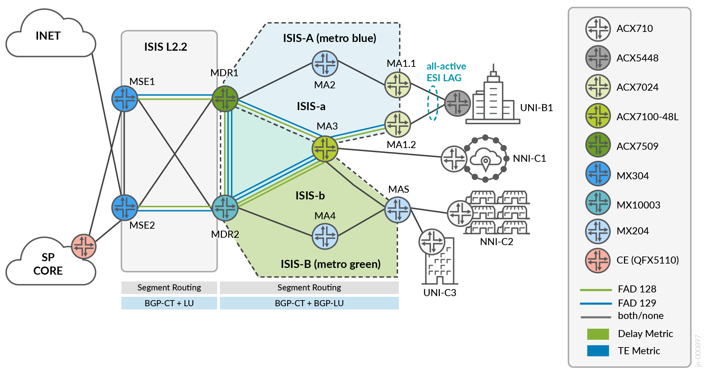
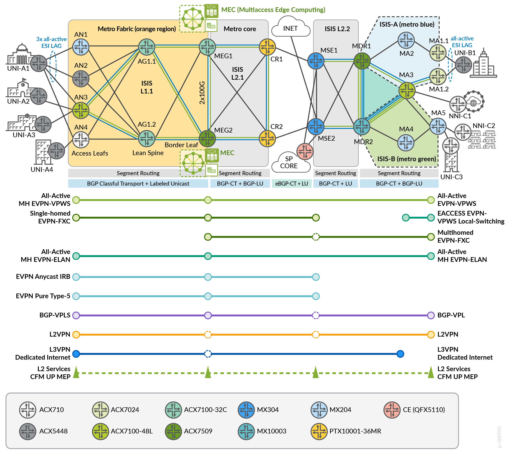
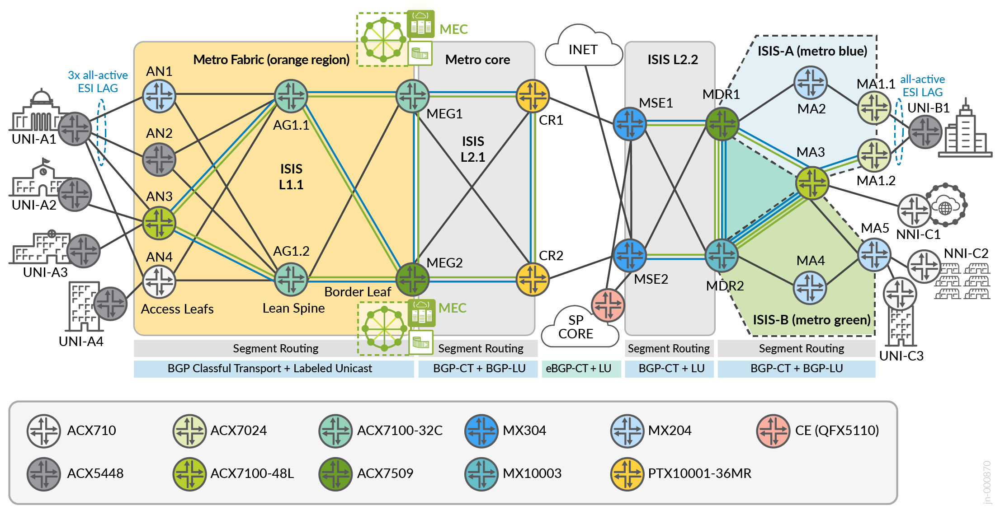
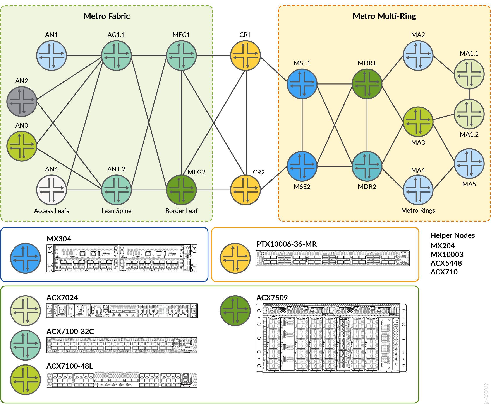
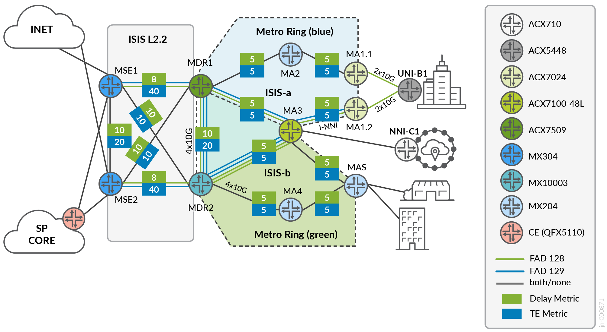
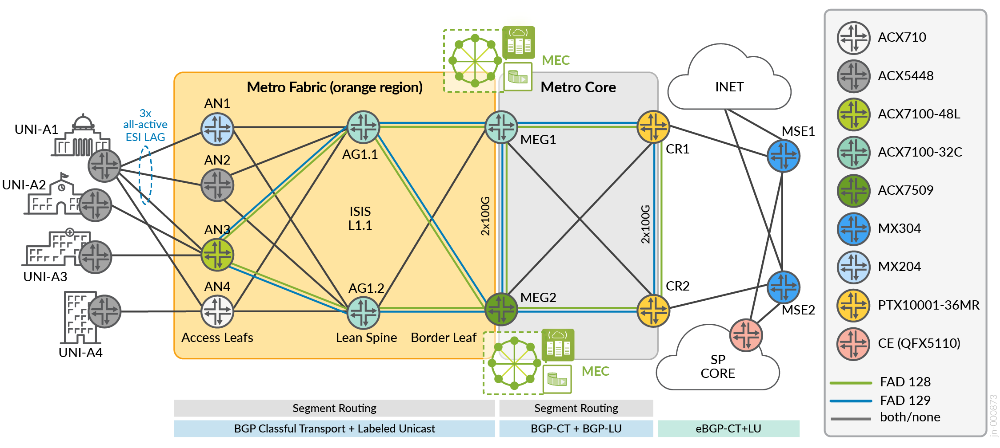

> Faithful markdown conversion of the published PDF:
> [Metro Ethernet Business Services — Juniper Validated Design (JVD)](https://www.juniper.net/documentation/us/en/software/jvd/jvd-metro-ebs-03-03/index.html).
> The PDF on juniper.net is the source of truth. Exhaustive convergence tables are
> condensed to per-category summaries; see the published document for full results.

# Metro Ethernet Business Services — Juniper Validated Design

**Published:** 2025-09-05 | **Version:** JVD-METRO-EBS-03-03

## About this Document

This document presents a JVD for building and deploying a sophisticated Metro Ethernet Business Services (EBS) network architecture using the Juniper ACX Series, MX Series, and PTX Series platforms. Design concepts incorporate traditional ring-based topologies with multi-ring architectures and interconnecting metro fabrics supporting edge cloud connectivity models. Intent-based routing assures SLA requirements spanning multiple BGP autonomous systems (Inter-AS) by leveraging seamless MPLS Segment Routing with BGP Labeled Unicast and BGP Classful Transport. A dense services portfolio is crafted in alignment with MEF standards.

For a full test report including all configuration files, test bed details, and multidimensional scale and performance data, contact your Juniper Networks representative.

## Solution Benefits

*Figure 1. Conceptual Cloud Metro.*

Metro Ethernet has long been a foundational infrastructure delivering L2 Ethernet business, federal, and residential services. Carrier Ethernet, defined by the MEF, establishes the transport and services framework within the MAN. Traditional characteristics include L2 connectivity models (point-to-point, point-to-multipoint, multipoint-to-multipoint). L3 business access is facilitated by L3VPN. The modern metro has evolved to support a highly capable architecture driven by cloudification and emergence of edge compute and telco cloud.

The scope of Metro EBS JVD addresses traditional L2 business access and dedicated Internet access services while incorporating modern service delivery protocols: EVPN-VPWS, EVPN-FXC, EVPN-ETREE, and EVPN-ELAN with high availability. It tackles connectivity challenges introduced with cloud metro solutions.

The topology focuses on the Juniper Cloud Metro portfolio:

- ACX7000 series and MX304 multiservice edge routers as primary DUTs
- PTX10001-36MR for core and peering roles
- Additional helper nodes: ACX710, ACX5448, MX204

Platform alternatives (03-03 updates):

- ACX7348 replaces ACX7100-32C and ACX7509 in the Metro Edge Gateway (MEG) role
- PTX10001-36MR replaces MX10003 and ACX7509 in the Metro Distribution Router (MDR) role
- MX10004 with LC9600 replaces MX304 in the Multiservice Edge (MSE) role

## Use Case and Reference Architecture

*Figure 2. Evolving Metro Design Concept.*

The Cloud Metro evolution transforms traditional aggregation-heavy metro networks into lean, distributed architectures. Aggregation nodes evolve into lean edge roles—border-leaf gateways connecting the metro fabric to external domains. The architecture embraces a spine-and-leaf IP fabric model within the metro, interconnected with multi-ring topologies serving access and distribution tiers.

## Validation Framework

### MEF Standards Alignment

Referenced technical specifications:

- MEF 6.3 Subscriber Ethernet Services Definitions
- MEF 10.4 Subscriber Ethernet Service Attributes
- MEF 23.2 Carrier Ethernet Class of Service
- MEF 26.2 Operator Ethernet Service Attributes
- MEF 35.1 Service OAM Performance Monitoring
- MEF 45.1 Ethernet Layer 2 Control Protocols
- MEF 48 Carrier Ethernet Service Activation
- MEF 51.1 Operator Ethernet Service Definitions
- MEF 62 Managed Access E-Line

Featured MEF 3.0 certified platforms: MX304, ACX7100, ACX7509, ACX7024, ACX5448, ACX710.

### Services Framework

1. **E-Line** — point-to-point connections (EPL or EVPL)
2. **E-LAN** — multipoint-to-multipoint connections (EP-LAN or EVP-LAN)
3. **E-Tree** — rooted-multipoint hub-and-spoke (EP-TREE or EVP-TREE)
4. **E-Access** — wholesale point-to-point UNI to NNI (Access EPL or Access EVPL)
5. **Internet Access** — IP service connecting IPVC endpoints

#### MEF Bundling and Service Multiplexing

| Service Multiplexing | Bundling | All to One Bundling | Description |
|---|---|---|---|
| Yes | No | No | Multiple virtual private services at UNI, one CE-VLAN per service |
| Yes | Yes | No | Multiple virtual private services, multiple CE-VLANs per service |
| No | No | Yes | Single private service at UNI |
| No | Yes | No | Single virtual private service with multiple CE-VLANs |
| No | No | No | Single virtual private service with single CE-VLAN |

(Yes/Yes/Yes, Yes/No/Yes, No/Yes/Yes are illegal configurations)

### Test Bed

*Figure 3. Metro EBS JVD Infrastructure — Metro Fabric + Multi-Ring + Inter-AS.*

Metro Fabric topology: spine-and-leaf model with MEG1 and MEG2 as border leaf nodes. Services within the fabric use spine aggregation nodes (AG1.1, AG1.2) for communication between access nodes (AN). Multi-ring infrastructure includes common metro distribution routers supporting inter-ring communications.

### Platforms / Devices Under Test

**03-01 validated platforms:**

| Role | Platform | Function | Software |
|---|---|---|---|
| AN | ACX7100-48L (DUT) | Access Leaf Node | 23.2R2-EVO |
| AN | MX204 | Access Node | 23.2R2 |
| AN | ACX5448 | Access Node | 23.2R2 |
| AN | ACX710 | Access Node | 23.2R2 |
| AG | ACX7100-32C | Aggregation / Spine | 23.2R2-EVO |
| MEG | ACX7100-32C (DUT) | Metro Edge Gateway | 23.2R2-EVO |
| MEG | ACX7509 (DUT) | Metro Edge Gateway | 23.2R2-EVO |
| MSE | MX304 (DUT) | Multiservice Edge | 23.2R2 |
| CR | PTX10001-36MR | Core Router | 23.2R2-EVO |
| MDR | MX10003 | Metro Distribution Router | 23.2R2 |
| MDR | ACX7509 | Metro Distribution Router | 23.2R2-EVO |
| MA | ACX7100-48L | Metro Access Node | 23.2R2-EVO |
| MA | ACX7024 (DUT) | Metro Access Node | 23.2R2-EVO |
| MA | MX204 | Metro Access | 23.2R2 |

**03-03 platform updates:**

| Role | New Platform | Replaces | Software |
|---|---|---|---|
| MEG | ACX7348 | ACX7100-32C, ACX7509 | 24.2R2S1-EVO |
| MSE | MX10004 + LC9600 | MX304 | 24.2R2S1 |
| MDR | PTX10001-36MR | MX10003, ACX7509 | 24.2R2S1-EVO |

## Test Objectives

### Evolving Use Cases (Three Stages)

1. **Stage 1** — Complete solution with Seamless SR-MPLS, diverse services, intra/inter-region with BGP-LU
2. **Stage 2** — Network "Lite" slicing with Flex-Algo and transport classes; all services color-mapped intra-AS; FAPM extends color across IGP boundaries; default resolution scheme with failover to inet.3
3. **Stage 3** — BGP Classful Transport for inter-AS color-aware traffic steering; all services color-mapped; sophisticated resolution scheme (gold→bronze→best-effort fallback)

### Test Goals

- Validate Metro Fabric performance, convergence, resiliency, MEC connectivity
- Validate Metro Multi-Ring performance, inter-ring optimization via MDR
- Validate ACX7100-48L as Access Leaf (AN3) with all services
- Validate ACX7100-32C as MEG1 (Border Leaf + RR, MEC connectivity)
- Validate ACX7509 as MEG2 (Border Leaf + RR)
- Validate MX304 as MSE (PWHT, Floating PW, DIA, Internet-VRF)
- Validate ACX7024 as MA (active-active, multi-homing)
- Ability for services to support inter-AS with BGP-LU and BGP-CT
- Validate EVPN-VPWS, EVPN-FXC, EVPN-ELAN, EVPN-ETREE, EVPN Type-5, EVPN Anycast IRB, BGP-VPLS, L2VPN, L2Circuit, L3VPN with Internet-VRF DIA

### Test Non-Goals

- L2 VPN color service mapping onto transport classes with inter-AS BGP-CT for ACX7000 (planned for 24.1R1-EVO)
- CoS model deployed but QoS not the focus
- Devices not listed as DUTs (helper nodes verified for functional behavior, but test cases run only against DUTs)
- Any features not specifically listed, including stated solution gaps and known limitations

### Scale and Performance (KPI Summary)

Per-DUT service scale targets:

- **AN3 (ACX7100-48L):** 200 EVPN-VPWS SH, 500 EVPN-FXC SH, 1400 EVPN-VPWS A/A MH, 200 EVPN-ELAN vlan-bundle, 100 EVPN-ELAN vlan-based, 50 EVPN Type-5, 1000 L2Circuit Hot Standby, 300 VPLS, 100 L3VPN (BGPv4/v6/OSPF)
- **MEG1/MEG2:** 1000 EVPN-VPWS A/A MH, 200 EVPN-ELAN vlan-bundle, 100 EVPN-ELAN vlan-based, 1000 EVPN-ETREE (MSE only), 50 EVPN-FXC MH, 200 VPLS, 1000 L2Circuit Hot Standby
- **MSE1/MSE2 (MX304):** 1000 EVPN-ETREE, 50 EVPN Type-5, 100 Floating PW, 1100 L3VPN
- **MA1.1/MA1.2 (ACX7024):** 400 EVPN-VPWS A/A MH, 100 EVPN-ELAN vlan-based, 50 EVPN-FXC MH, 100 Floating PW, 200 VPLS

Route scale: ~31K BGP routes, ~65K FIB routes on AN3; ~113K BGP routes, ~966K FIB routes on MSE.

## Solution Architecture

### Underlay Attributes

SR-MPLS with Flex-Algo using ASLA. Three path types:

- **Gold (Algo 128):** delay metric
- **Bronze (Algo 129):** TE metric
- **Best Effort:** IGP metric (inet.3)

TI-LFA for sub-50ms convergence. BFD on all IGP adjacencies (300ms timers).

### Flexible Algorithm

Two algorithms defined: 128 (delay-metric, admin-group GREEN) and 129 (TE-metric, admin-group BLUE). Uses Application Specific Link Attributes (ASLA) per RFC 8919 for IS-IS. Supports L-Flag for backward compatibility. Strict-sla-based-flex-algorithm disables legacy advertisements.

### Transport Classes

Transport classes create tunnels from Flex-Algo abstraction. Services map onto color transport for intelligent traffic steering.

Resolution schemes:

1. **No Fallback** — traffic discarded if color unavailable
2. **Cascade** (preferred) — gold falls back to bronze, bronze to best-effort (inet.3)

### BGP Routing Policy

- Routes tagged by originating segment community
- Border nodes export only local-region communities, reject peer communities
- BFD on all BGP sessions (300ms detection)
- BGP best practices: external-router-id path selection, hold-time 10s, precision-timers, bgp-error-tolerance, tcp-mss 4096
- PE link protection for EBGP-LU and BGP-CT with per-prefix-label

### BGP Route Reflectors

Redundant RRs per region. Multiprotocol families: labeled-unicast, transport (BGP-CT), inet-vpn, inet6-vpn, l2vpn, evpn, route-target.

- **Fabric:** MEGs serve as AN reflectors
- **Multi-ring:** MDRs are transport reflectors (BGP-LU, BGP-CT); MSEs are services reflectors (MP-BGP)

### Metro Ring Architecture

*Figure 4. Metro Multi-Ring architecture with Flex-Algo metrics.*

Multi-ring with multi-instance IS-IS (blue & green rings). Key features:

- Multi-Instance ISIS
- Flex-Algo Prefix Metrics (FAPM) leaking across ISIS instances
- Intra-domain Transport Class Service Mapping
- EVPN Floating PW with Anycast-SID
- EVPN-ETREE, EVPN-FXC, EVPN-VPWS, EVPN-ELAN
- L2Circuit, L2VPN, VPLS
- L3VPN with Internet Access (Internet-VRF model)
- BGP-VPLS for multi-site connectivity
- E-OAM Performance Monitoring

MSE1 & MSE2 function as redundant route reflectors for all ring nodes and support inter-AS with BGP-LU and BGP-CT. VPN services (MP-BGP) do NOT use next-hop self at MSE. For LU/CT transport routes, next-hop self is mandatory for inter-AS reachability.

Flex-Algo with ASLA defines green (delay) and blue (TE) paths. Routes leaked between domains are tagged with a common ISIS tag; exports already containing the tag are rejected to prevent loops.

### Metro Fabric Architecture

*Figure 5. Metro Fabric — spine/leaf with MEG border-leaf, MEC interconnect, Flex-Algo paths.*

IP Fabric spine-and-leaf model applied to the metro. Spine nodes (AG1.1, AG1.2) aggregate access leaves. MEGs serve as border-leaf with service termination + MEC connectivity. Key features:

- 2-stage Clos topology (spine + leaf)
- EBGP underlay between spine and leaf
- BGP-LU and BGP-CT for inter-AS transport
- All overlay services supported
- MEC connectivity via MEG border-leaf

### Overlay Attributes / Service Delivery Models

Dense L2/L3 services portfolio. Services instantiated across the topology:

- **EVPN-VPWS** — E-Line (EPL/EVPL), single-homed and multi-homed (all-active ESI with 3xPE)
- **EVPN-FXC** — Flexible Cross-Connect (VLAN-aware and VLAN-unaware)
- **EVPN-ELAN** — E-LAN (vlan-based, vlan-bundle, EP-LAN)
- **EVPN-ETREE** — E-Tree (hub-spoke, root/leaf)
- **EVPN Type-5** — L3 Internet access via IRB
- **EVPN Anycast IRB** — Virtual Gateway Address (VGA)
- **Floating PW** — Anycast-SID with vESI for active-active multi-homing (legacy L2CKT migration)
- **BGP-VPLS** — Multi-site L2 connectivity
- **L2VPN** — Point-to-point L2
- **L2Circuit** — Static PW with hot-standby, local-switching (E-Access/E-NNI)
- **L3VPN** — BGPv4, BGPv6, OSPF VRF services with DIA (Internet-VRF model)
- **E-OAM** — Service OAM/CFM, performance monitoring (delay, jitter, loss)

## Results Summary and Analysis

> The published design guide contains detailed per-event convergence tables for
> metro fabric, metro multi-ring, and end-to-end inter-AS services. Below is a
> condensed summary. For full per-event results, see the published document.

### Metro Fabric Convergence

Intra-AS services (AN-to-AN via spine, AN-to-MEG single/multi-homed):

- **EVPN-VPWS:** 0–50 ms (color-aware ≤1 ms typical; one AG-MEG event ~50 ms)
- **EVPN-ELAN:** 0–87 ms (majority sub-5 ms)
- **L2Circuit:** 0–5 ms (hot-standby failover ~2.4–2.9 s includes manual CLI failover)
- **L3VPN:** 0–3 ms

### Metro Multi-Ring Convergence

Intra-AS services (MA-to-MA, MA-to-MSE via MDR leaking):

- **BGP-VPLS:** 0–115 ms (one MA-MA inter-ring event ~115 ms)
- **EVPN-ETREE:** 0–178 ms (worst case: MA-MA inter-ring)
- **Floating PW:** 0–67 ms
- **L3VPN:** 0–50 ms

### End-to-End Inter-AS Convergence

Services spanning fabric and multi-ring across BGP autonomous systems:

- **EVPN-VPWS:** 0–55 ms
- **EVPN-ELAN:** 0–1100 ms (ESI LAG disable event ~1100 ms; all link events sub-20 ms)
- **L2VPN:** 0–39 ms
- **VPLS:** 0–88 ms
- **L3VPN:** 0–50 ms
- **MEG-MEC link events:** 232–915 ms (CE-facing; DLNH + ELP recommended, planned for 24.3R1-EVO on ACX7000)

### Solution Gaps and Known Limitations

- DLNH and ELP for EVPN active-active multi-homing: supported on MX; ACX7000 targets 24.3R1-EVO
- BGP-PIC for seamless SR (BGP-LU/BGP-CT): supported on MX (preserve-nexthop-hierarchy); ACX7000 targets 24.2R1-EVO
- BGP Classful Transport validated on all DUTs with 23.2R2; not required for color-agnostic-only deployments
- Simultaneous ECMP + FRR not supported on ACX7000 with 23.2R2; planned for 24.1R1-EVO

## Recommendations

The Metro EBS JVD addresses traditional L2 Business Access and DIA services while incorporating EVPN-VPWS, EVPN-FXC, EVPN-ETREE, and EVPN-ELAN. The topology deploys metro access multi-ring topologies and a 2-stage metro fabric spine-and-leaf design based on modern Carrier Ethernet MANs.

Featured platforms: MEF 3.0 certified MX304 (Trio 6, 4.8T, 2RU), ACX7509 (compact modular, power-optimized, MEC connectivity), ACX7100-48L and ACX7100-32C (4.8T 1RU, 400GbE), ACX7024 (temperature-rated 360G metro access).

## Revision History

| Date | Version | Description |
|------|---------|-------------|
| Sept 2025 | JVD-METRO-EBS-03-03 | Added ACX7348, PTX10001-36MR, MX10004 with LC9600 as alternative platforms |
| July 2024 | JVD-METRO-EBS-03-01 | Initial publish |

---

## Sources

- Published document: [Metro EBS JVD (03-03)](https://www.juniper.net/documentation/us/en/software/jvd/jvd-metro-ebs-03-03/index.html)
- Companion docs: [`solution-overview-03-01.md`](solution-overview-03-01.md), [`solution-overview-03-03.md`](solution-overview-03-03.md), [`test-report-brief-03-01.md`](test-report-brief-03-01.md), [`test-report-brief-03-03.md`](test-report-brief-03-03.md)
- Configs: [`../configuration/conf/`](../configuration/conf/)
- Snip library: [`../configuration/snips/`](../configuration/snips/)
