# Metro Ethernet Business Services — Juniper Validated Design

> Faithful markdown conversion of the published *Metro Ethernet Business
> Services — Juniper Validated Design (JVD)* Design Guide
> (JVD-METRO-EBS-03-03, published 2025-09-05). The PDF on juniper.net is the
> authoritative source of truth. Exhaustive per-requirement conformance
> matrices are summarized; full per-device configurations live under
> [`../configuration/`](../configuration/). Figures are in
> [`images/`](images/).

**Author:** Juniper Networks, Inc.

## Table of Contents

1. [About this Document](#about-this-document)
2. [Solution Benefits](#solution-benefits)
3. [Use Case and Reference Architecture](#use-case-and-reference-architecture)
4. [Validation Framework](#validation-framework)
   - [MEF Standards Alignment](#mef-standards-alignment)
   - [Services Framework](#services-framework)
   - [Test Bed](#test-bed)
   - [Platforms / Devices Under Test (DUT)](#platforms--devices-under-test-dut)
   - [Test Bed Configuration](#test-bed-configuration)
5. [Test Objectives](#test-objectives)
   - [Evolving Use Cases](#evolving-use-cases)
   - [Test Goals](#test-goals)
   - [Test Non-Goals](#test-non-goals)
   - [Scale and Performance](#scale-and-performance)
6. [Solution Architecture](#solution-architecture)
   - [Underlay Attributes](#underlay-attributes)
   - [Flexible Algorithm](#flexible-algorithm)
   - [Transport Classes](#transport-classes)
   - [BGP Routing Policy](#bgp-routing-policy)
   - [BGP Route Reflectors](#bgp-route-reflectors)
   - [Metro Ring Architecture](#metro-ring-architecture)
   - [Multi-Instance ISIS](#multi-instance-isis)
   - [Inter-Ring Flex-Algo Prefix Leaking](#inter-ring-flex-algo-prefix-leaking)
   - [Intra-AS BGP Classful Transport and Labeled Unicast](#intra-as-bgp-classful-transport-and-labeled-unicast)
   - [Metro Fabric Architecture](#metro-fabric-architecture)
   - [Overlay Attributes](#overlay-attributes)
   - [Metro EBS Service Delivery Models](#metro-ebs-service-delivery-models)
7. [Results Summary and Analysis](#results-summary-and-analysis)
   - [Solution Gaps and Known Limitations](#solution-gaps-and-known-limitations)
8. [Recommendations](#recommendations)
9. [Revision History](#revision-history)
10. [Sources](#sources)

---

Juniper Networks Validated Designs provide customers with a comprehensive,
end-to-end blueprint for deploying Juniper solutions in their network. These
designs are created by Juniper's expert engineers and tested to ensure they
meet the customer's requirements. Using a validated design, customers can
reduce the risk of costly mistakes, save time and money, and ensure that their
network is optimized for maximum performance.

## About this Document

This document presents a Juniper Validated Design (JVD) for building and
deploying a sophisticated Metro Ethernet Business Services (EBS) network
architecture using the Juniper ACX Series, MX Series, and PTX Series platforms.
The design concepts incorporate traditional ring-based topologies with
consideration for multi-ring architectures and interconnecting metro fabrics
supporting edge cloud connectivity models. Intent-based routing assures service
level agreement (SLA) requirements spanning multiple BGP autonomous systems
(Inter-AS) by leveraging seamless MPLS Segment Routing with BGP Labeled Unicast
and BGP Classful Transport. The solutions blend both traditional and modern
technologies that are required for Cloud Metro.

A dense services portfolio is crafted in alignment with Metro Ethernet Forum
(MEF) standards. This ensures that service providers can deliver business
requirements and use cases across a diverse metro ecosystem with flexible
service offerings, high bandwidth, and intelligent traffic steering using the
same physical infrastructure.

For a full test report that includes all configuration files, test bed details,
and multidimensional scale and performance data, contact your Juniper Networks
representative.

## Solution Benefits

Metro Ethernet has long been a foundational infrastructure that delivers Layer 2
Ethernet business, federal, and residential services. Carrier Ethernet, largely
defined by the Metro Ethernet Forum, establishes the transport and services
framework within the Metro Area Network (MAN). The traditional characteristics of
Metro Ethernet Services include Layer 2 connectivity models, which support
point-to-point, point-to-multipoint, and multipoint-to-multipoint service types.
End-to-end Layer 3 business access is typically facilitated by L3VPN and extended
for high-speed Internet access. In this JVD, we further extend EVPN services to
include Internet access. In addition, the behavioral aspects are standardized by
the MEF and include service assurance mechanisms, such as E-OAM and Quality of
Service (QoS) constructs. The modern metro network has evolved to support a
highly capable architecture and more sophisticated feature-set driven by the
cloudification of the metro, and the emergence of new complexes like edge compute
and telco cloud. Cloud services, applications, and new use cases place increased
demands and challenges on the network.

*Figure 1: Conceptual Cloud Metro*

The scope of the Metro Ethernet Business Services (EBS) JVD seeks to address the
traditional L2 business access and dedicated Internet access services while also
incorporating modern service delivery protocol sets, including EVPN-VPWS,
EVPN-FXC, EVPN-ETREE, and EVPN-ELAN with high availability. We tackle the
connectivity challenges that are introduced with cloud metro solutions by
providing the service connectivity models that are required for interconnection
with cloud edge infrastructures and parallel Layer 3 access. In addition, we
explore the integration of traditional VPN services like L2VPN, VPLS, and
L2Circuit for business and wholesale use cases and the interconnection of these
services with the cloud metro architecture.

The topology focuses on the Juniper Cloud Metro portfolio, including the
ACX7000 series and MX304 multiservice edge routers as primary devices under
testing (DUTs) and PTX10001-36MR routers for core and peering roles with
additional helper nodes in the access regions that include the ACX710, ACX5448,
and MX204 platforms. You can also implement this solution with another set of
platforms:

- ACX7348 replaces ACX7100-32C and ACX7509 in the Metro Edge Gateway (MEG) role.
- PTX10001-36MR replaces MX10003 and ACX7509 in the Metro Distribution Router
  (MDR) role.
- MX10004 with the LC9600 line card replaces MX304 in the Multiservice Edge (MSE)
  role.

For more information about these additional platforms, see Metro Ethernet
Business Services with Updated Platform Recommendations.

The reference architecture deploys an infrastructure designed to support
traditional metro access ring topologies with lean edge services termination. In
addition, the topology features a two-stage metro fabric spine-and-leaf design
with border leaf nodes performing the lean edge role and facilitating
connectivity into edge cloud complexes. Both infrastructures support seamless
interconnectivity within and between different access regions. We build the Cloud
Metro infrastructure using spine-leaf fabric and multi-ring architecture that
facilitates x-to-anything connectivity models and leverages seamless Segment
Routing with fast failover TI-LFA recovery mechanisms. Multi-instance ISIS
enables the partitioning of the network domain into independent IGP instances to
improve scale and contain blast radius. Flexible Algorithm with Application
Specific Link Attributes (ASLA) enable the creation of additional layers of
abstraction that form distinct paths through the network based on delay or
traffic engineering metrics. Transport classes and BGP Classful Transport
(BGP-CT) enable the mapping of services onto color transport for both intra-AS
and inter-AS services. Traffic is steered through the network based on the
defined service-level objectives (SLOs). Flex-Algo Prefix Metrics (FAPM) enable
inter-domain traffic steering across flex-algo IGP boundaries and cascade
resolution schemes support the transition of services between performance
hierarchies during failure events. BGP Labeled Unicast supports the coexistence
of inter-AS services with color-mapped services and seamless failover from
colored paths onto uncolored paths if required.

## Use Case and Reference Architecture

The reference architecture is based on a modern Carrier Ethernet MAN that takes
into consideration the transformation that is required to facilitate diverse new
services, applications, and use cases. Some common principles exist to deliver
Layer 2 and/or Layer 3-enabled services for point-to-point, point-to-multipoint,
and multipoint-to-multipoint solutions with more intelligent mechanisms that
enable the coexistence of L2 and L3 services and improved high availability
models. The architecture is referred to as Cloud Metro but carries several
important characteristics in the amalgamation of service and content providers.
These shifting industry trends demand massive bandwidth and increased service
scale while also supporting more complex metro workloads.

A major goal of Cloud Metro is the adaptation of cloud principles into metro
networks. This comes in the form of systems that support a sophisticated feature
set, including the array of EVPN technologies, SR-MPLS/SRv6, and the ability to
support inter-domain traffic engineering or seamless architectures across
disparate networks. It must include capabilities to support and integrate the
services and solutions that are found in traditional metro networks. This is a
differentiating factor that characterizes the requirements for supporting
x-to-anything connectivity models or building infrastructures that become access
agnostic while also blending with virtualized network functions and devices.

Metro networks can vary between service providers, but the design principles are
largely consistent. In the traditional metro network, the design focuses on
supporting north-to-south traffic patterns where services are backhauled across
access, aggregation, and core network segments and centrally aggregated. The
costly scale-up architecture is supported by resilient modular systems with dense
feature sets that can carry a significant failure blast radius. New challenges
emerge with the growth of edge cloud complexes, leading to massive subscriber
traffic increases and exasperated by the consumption of expensive links and ports
while degrading the customer experience. A new design is required.

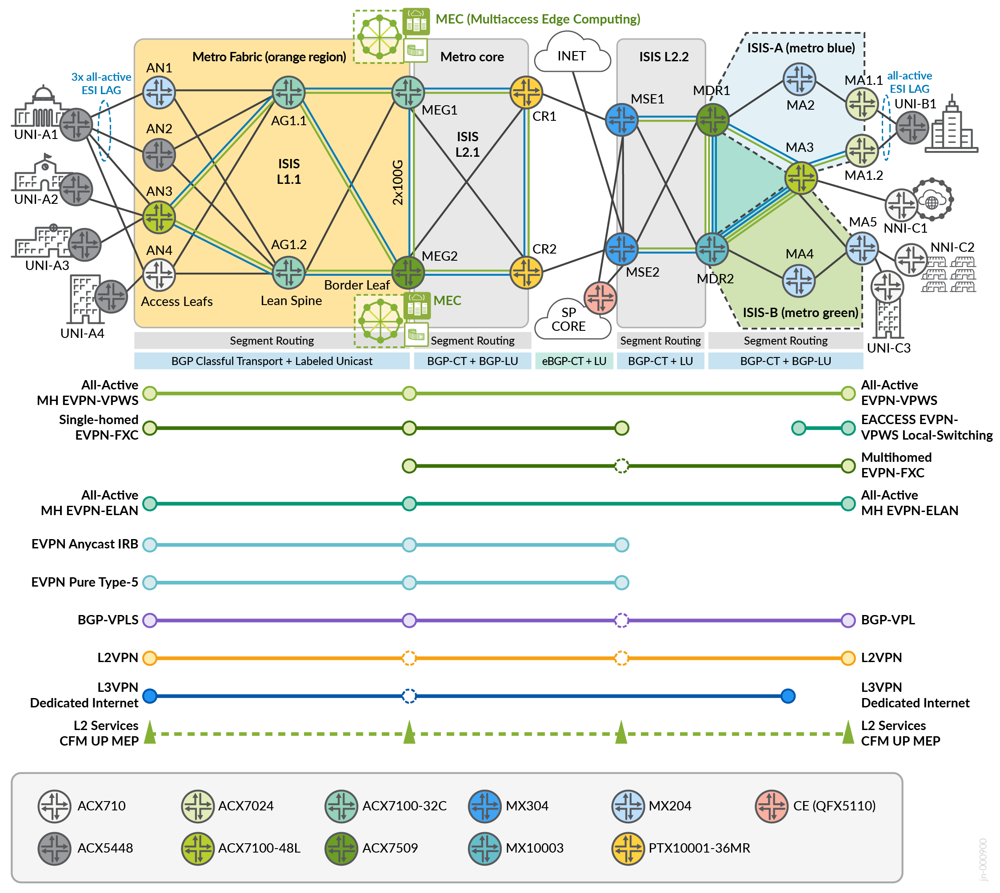
*Figure 2: Evolving Metro Design Concept*

As illustrated in Figure 2, with the emergence of a new model moving to the
right, aggregation nodes evolve into a lean edge role, with certain tactical and
strategic advantages realized as the traffic patterns are better contained within
the metro ecosystem. East-to-west traffic flows are cost-optimized and a
significant reduction in the failure blast radius. Additional benefits are
realized with reduced power consumption and lowered cost-per-gigabit while
improving scalability and the customer experience.

The ACX7000 family is ideally positioned to support the lean edge role with an
advanced feature set capable of serving a majority of customer requirements and
providing critical interconnectivity points for these new cloud complexes. In
parallel, the MX Series multi-services edge component serves the crucial role of
managing more complex interconnectivity, service stitching attributes,
Pseudo-Wire Headend Termination (PWHT), or high-scale BNG use cases.

## Validation Framework

This Metro Ethernet Business Services JVD addresses the network modernization
journey, which includes multiple evolving use cases. A crucial aspect of the
overall solution is enabling flexibility to support heterogeneous customer
architectures within the same validated design. Major attributes include:

- Seamless SR-MPLS with TI-LFA
- Flexible Algorithm Application Specific Link Attribute (ASLA)
- Co-Existence of Seamless SR-MPLS BGP-LU and BGP-CT inter-AS solutions
- End-to-end color-aware Traffic Steering (à la Network "Lite-Slicing")
- Intra-domain Transport Class tunneling with Service Mapping
- Inter-domain color awareness with BGP Classful Transport
- All services include color-aware and color-agnostic path selection
- Intent-based routing with Color Mapping based on Delay and TE metrics
- Color agnostic services take IGP metric paths (inet.3)
- Strict Resolution Scheme (no fallback) + Cascade Fallback Gold failback Bronze
  and Bronze fallback to Best Effort
- Alignment with MEF 3.0 standards for service characteristics and attributes

### MEF Standards Alignment

An important focus of the Metro Ethernet Business Services JVD involves alignment
with the MEF standards. The Metro Ethernet Forum is an industry consortium
dedicated to accelerating the adoption of Carrier Ethernet services and
technologies. Its primary purposes and goals revolve around standardization,
interoperability, and innovation within the Ethernet ecosystem. The MEF works to
develop and promote standards for Carrier Ethernet services, ensure
interoperability between Carrier Ethernet networks and equipment from different
vendors, foster innovation by promoting the development of new technologies and
services based on Carrier Ethernet, and educate the market about the benefits and
capabilities of Carrier Ethernet services.

The referenced technical specifications include:

- MEF 6.3 Subscriber Ethernet Services Definitions
- MEF 10.4 Subscriber Ethernet Service Attributes
- MEF 23.2 Carrier Ethernet Class of Service
- MEF 26.2 Operator Ethernet Service Attributes
- MEF 35.1 Service OAM Performance Monitoring
- MEF 45.1 Ethernet Layer 2 Control Protocols
- MEF 48 Carrier Ethernet Service Activation
- MEF 51.1 Operator Ethernet Service Definitions
- MEF 62 Managed Access E-Line

The Juniper Networks routers that are featured in this JVD include MEF
3.0-certified MX304, ACX7100, ACX7509, ACX7024, ACX5448, and ACX710 platforms.

### Services Framework

The services framework includes the following models:

1. **E-Line** for delivering point-to-point connections as Ethernet Private Lines
   (EPL) or Ethernet Virtual Private Lines (EVPL).
2. **E-LAN** for delivering multipoint-to-multipoint connections as Ethernet
   Private LAN (EP-LAN) or Ethernet Virtual Private LAN (EVP-LAN).
3. **E-TREE** for delivering rooted-multipoint hub-and-spoke connections as
   Ethernet Private Tree (EP-TREE) or Ethernet Virtual Private Tree (EVP-TREE).
4. **E-ACCESS** for delivering wholesale point-to-point services connecting UNI to
   NNI as Access EPL or Access EVPL.
5. **INTERNET ACCESS** is an IP Service created by connecting IP Virtual
   Connections (IPVC) with other IPVC endpoints.

*Example service type: E-Line (Ethernet Private Line / Ethernet Virtual Private Line).*

Services Attributes are further defined by the major characteristics:

- **Service multiplexing** determines whether the UNI terminates one (disabled) or
  more (enabled) Ethernet services.
- **Bundling** is enabled when multiple CE-VLANs are supported on the UNI, or
  disabled when each Ethernet Service includes a single CE-VLAN.
- **All-to-One bundling** means that all CE-VLANs are associated with a single
  Ethernet Service as a private UNI service. When bundling is disabled, one or
  more virtual private services are enabled per UNI.

The MEF provides guidance for valid service multiplexing and bundling
combinations, which are followed by this validated design. For more information,
refer to the MEF documentation.

*Table 1: MEF Bundling and Service Multiplexing*

| Service Multiplexing | Bundling | All-to-One Bundling | Description |
|---|---|---|---|
| Yes | No | No | Multiple virtual private services are allowed at the UNI with only one CE-VLAN ID mapped to each service. |
| Yes | Yes | No | Multiple virtual private services enabled at the UNI and multiple CE-VLAN IDs can be mapped to each service. |
| Yes | Yes | Yes | Illegal configuration |
| Yes | No | Yes | Illegal configuration |
| No | No | Yes | Single private service at the UNI. |
| No | Yes | No | Single virtual private service enabled at the UNI with multiple CE-VLAN IDs mapped to it. |
| No | Yes | Yes | Illegal configuration |
| No | No | No | Single virtual private service enabled at the UNI with only a single CE-VLAN ID mapped to it. |

Reference: <https://wiki.mef.net/display/CESG/Bundling+and+Service+Multiplexing>

We explain how the featured services map to the MEF definitions throughout this
validated design.

### Test Bed

This diagram explains the connectivity for building the Metro EBS JVD
infrastructure. The Metro Fabric topology leverages a spine-and-leaf model in the
green-dotted region with MEG1 and MEG2 as border leaf nodes. Services within the
Metro Fabric use spine aggregation nodes (AG1.1, AG1.2) for communication between
access nodes (AN). The multi-ring infrastructure in the orange-dotted region
includes common metro distribution routers supporting inter-ring communications.

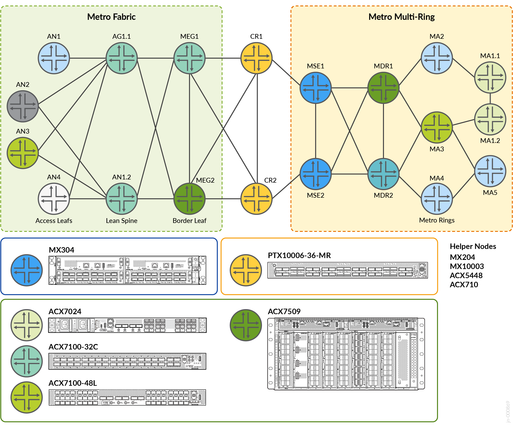
*Figure 3: Metro EBS JVD Infrastructure*

### Platforms / Devices Under Test (DUT)

To review the software versions and platforms on which this JVD was validated by
Juniper Networks, see the Validated Platforms and Software section in this
document.

### Test Bed Configuration

Contact your Juniper Networks representative to get the full archive of the test
bed configuration used for this JVD.

## Test Objectives

Juniper Validated Design (JVD) is a cross-functional collaboration between Juniper
solution architects and test teams to develop coherent multidimensional solutions
for domain-specific use cases. The JVD team comprises technical leaders in the
industry with a wealth of experience supporting complex customer use cases. The
scenarios selected for validation are based on industry standards to solve
critical business needs with practical network and solution designs.

The key goals of the JVD initiative include:

- Test iterative multidimensional use cases.
- Optimize best practices and address solution gaps.
- Validate overall solution integrity and resilience.
- Support configuration and design guidance.
- Deliver practical, validated, and deployable solutions.

A reference architecture is selected after consultation with Juniper Networks
global theaters and a deep analysis of customer use cases. The design concepts
that are deployed use best practices and leverage relevant technologies to deliver
the solution scope. Key performance indicators (KPIs) are identified as part of an
extensive test plan that focuses on functionality, performance integrity, and
service delivery.

Once the physical infrastructure that is required to support the validation is
built, the design is sanity-checked and optimized. Our test teams conduct a series
of rigorous validations to prove solution viability, capturing, and recording
results. Throughout the validation process, our engineers engage with software
developers to quickly address any issues found.

The Metro Ethernet Business Services solution validates a comprehensive
multidimensional architecture that includes best practices for the design and
implementation of a dense services L2/L3 portfolio across intra-domain and
inter-AS regions.

### Evolving Use Cases

Figure 4 shows the Metro Evolving Use Cases table that describes the solution
transformation through multiple stages that provide an operator entry points at
any of the three stages.

1. **Stage 1** describes a complete solution architecture leveraging Seamless
   Segment Routing MPLS with diverse services that support intra/inter-region
   termination points enabled by BGP Labeled Unicast. The stage 1 portion of the
   solution includes all the VPN services described in the JVD documentation.
2. **Stage 2** enhances the solution to support network "Lite" slicing with
   flexible algorithms and transport classes. All services are mapped to color
   transport within the AS. Flex-Algo prefix leaking with FAPM extends
   color-mapped services across IGP boundaries. A default resolution scheme is
   used that enables color-aware service failover to inet.3 resolved next hops.
3. **Stage 3** further enhances the design by introducing BGP Classful Transport
   as the mechanism for Inter-AS color-aware traffic steering. All services are
   color-mapped. In addition, a more sophisticated resolution scheme is included
   to govern the failover of gold to bronze and bronze to best-effort paths.

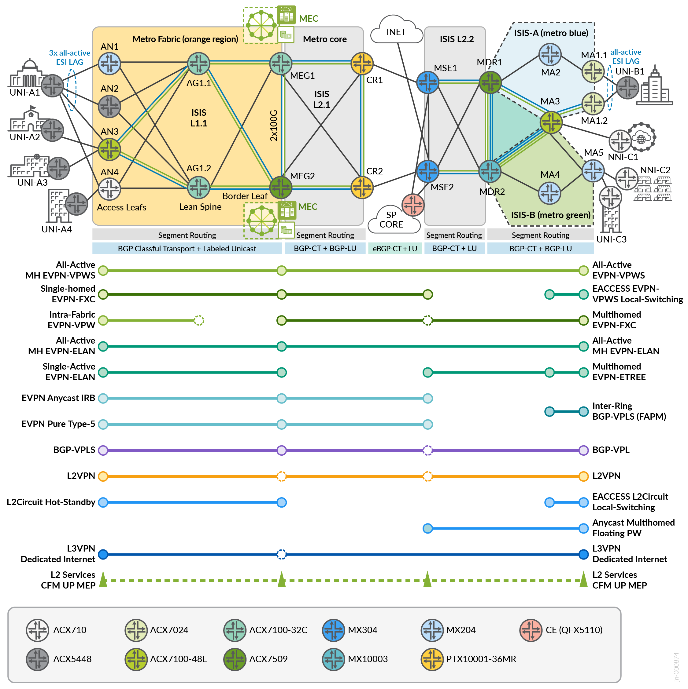
*Figure 4: Metro Evolving Use Cases*

### Test Goals

The focus of the testing includes:

- Validate Metro Fabric performance, convergence, resiliency, ability to optimize
  traffic flows within the fabric, and support MEC connectivity models allowing
  MEG1/MEG2 services edge compute access.
- Validate Metro Multi-Ring performance, convergence, resiliency, and ability to
  optimize traffic flows within/between rings, leveraging MDR1/2 for leaking.
- Validate the ACX7100-48L as an Access Leaf (AN3) DUT supporting EVPN-VPWS,
  EVPN-FXC, EVPN-ELAN, EVPN Type-5, EVPN Anycast IRB, L2VPN, L2Circuit, BGP-VPLS,
  and L3VPN services.
- Validate the ACX7100-32C as a Metro Edge Gateway (MEG1) DUT and functioning as a
  Border Leaf and Route Reflector to facilitate MEC connectivity, access leaf
  service termination, and inter-AS functions. Services include EVPN-VPWS,
  EVPN-FXC, EVPN-ELAN, EVPN Type-5, EVPN Anycast IRB, L2Circuit, and BGP-VPLS.
- Validate the ACX7509 as a Metro Edge Gateway (MEG2) DUT and function as a Border
  Leaf and Route Reflector to facilitate MEC connectivity, and access leaf service
  termination, and inter-AS functions. Services include EVPN-VPWS, EVPN-FXC,
  EVPN-ELAN, EVPN Type-5, EVPN Anycast IRB, L2Circuit, and BGP-VPLS.
- Validate the MX304 as a Multi-Services Edge (MSE1 and MSE2) DUT supporting
  advanced services termination with PWHT, Floating PW Anycast-SID, EVPN-ETREE,
  Dedicated Internet Access (DIA) using Internet-VRF model, Route Reflector, and
  providing an interconnectivity point for Q-in-Q handoff into SP Core.
- Validate the ACX7100-48L as a Metro Access node (MA3) DUT supporting
  local-switching E-NNI / E-Access services with EVPN-VPWS and L2Circuit LSW,
  dense L2Circuit aggregation and facilitating multi-instance ISIS with
  connections in both metro ring blue and green.
- Validate the ACX7024 as a Metro Access node (MA1.1 and MA1.2) DUT supporting
  active-active VPN services with multi-homing or single-homing. Services include
  EVPN-VPWS, EVPN-FXC, EVPN-ELAN, L2Circuit Floating PW, and BGP-VPLS.
- The ability for all services to support inter-AS with BGP Labeled Unicast
  (Seamless MPLS).
- The ability for services to be mapped onto color transport (Flex-Algo) and color
  agnostic paths.
- Support of intra-domain, inter-domain, and inter-AS network abstraction,
  creating distinct color paths through the network.
- The ability for services to support BGP Classful Transport extending color
  mapping across autonomous systems (Seamless SR).
- Validate performance and functionality for EVPN-ELAN, EVPN-VPWS, EVPN Flexible
  Cross Connect, EVPN-VPWS Local-Switching, EVPN with IRB Virtual Gateway, EVPN
  Pure Type-5, EVPN Anycast Floating PW, BGP-VPLS, L2VPN, L2Circuit, L2Circuit
  Local-Switching, and L3VPN with Internet-VRF DIA.

Additional helper nodes are critical to the solution architecture:

- MX204 as Access Node (AN1) to support EVPN ESI LAG with 3xPEs, supporting device
  interoperability with ACX5448 (Junos OS) and ACX7100-48L (Junos OS Evolved)
  platforms.
- ACX5448 as Access Node (AN2) supporting EVPN-VPWS multi-homing topology scale and
  EVPN ESI LAG with 3xPEs, supporting device interoperability with MX204 (Junos OS)
  and ACX7100-48L (Junos OS Evolved) platforms.
- ACX710 as Access Node (AN4) for scaling of single-homed EVPN-VPWS services.
- MX204 as Metro Access (MA2) supporting the metro blue ring. No services are
  enabled here, but the architecture supports adding services to this node.
- MX204 as Metro Access (MA5) supporting local-switching transport, EVPN-ETREE
  services as a leaf node, Inter-Ring BGP-VPLS services, and topology scaling with
  L2Circuit, L2VPN, and VPLS.
- MX204 as Metro Access (MA4) supporting EVPN-ETREE services as a leaf node and
  L3VPNs with Internet access.

> **NOTE:** Listed features are subject to individual device support. Contact your
> Juniper Networks representative for questions or concerns.

### Test Non-Goals

Non-goals include elements that logically belong in the JVD but are excluded for
various reasons, like being outside of the validation scope or because of feature
or product limitations, etc.

- Layer 2 VPN color service mapping onto transport classes with inter-AS BGP
  Classful Transport is validated for all DUTs in the JVD. However, this is
  included as a non-goal for ACX7000 platforms because this feature is planned for
  Junos OS Evolved Release 24.1R1. For this reason, all services include both
  color-aware and color-agnostic path selection. L3VPN with color service mapping
  and BGP-CT is supported and included for all devices.
- A Class of Services (CoS) model is deployed as part of the overall solution
  architecture, but QoS is not a focus of this JVD.
- Devices not listed as DUTs. Helper nodes are verified for correct functional
  behaviors in the design, but test cases are only executed against specified DUTs.
- Any features not specifically listed and including specified solution gaps and
  known limitations.

### Scale and Performance

This section contains the KPIs that are used as solution validation targets.
Validated KPIs are multidimensional and reflect our observations in customer
networks or reasonably represent the solution capabilities. These numbers do not
indicate the maximum scale and performance of individual tested devices. For
unidimensional data on individual SKUs, contact your Juniper Networks
representative.

The Juniper JVD team continuously strives to enhance solution capabilities.
Consequently, solution KPIs may change without prior notice. Always refer to the
latest JVD test report for up-to-date solution KPIs. For the latest comprehensive
test report, contact your Juniper Networks representative.

*Table 2: KPI Scale Summary (DUT Only)*

| Feature | AN3 (ACX7100-48L) | MEG1 (ACX7100-32C) | MEG2 (ACX7509) | MSE1 (MX304) | MSE2 (MX304) | MA1.1 (ACX7024) | MA1.2 (ACX7024) |
|---|---|---|---|---|---|---|---|
| IFD | 66 | 50 | 48 | 115 | 108 | 35 | 35 |
| IFL | 8581 | 4249 | 3945 | 16333 | 13776 | 789 | 1512 |
| VLANs per-system | 6064 | 3064 | 3061 | 7745 | 5686 | 600 | 830 |
| ISIS Adjacency IPv4 | 4 | 7 | 9 | 4 | 3 | 2 | 2 |
| IBGP v4 Sessions | 2 | 7 | 7 | 8 | 3 | 4 | 4 |
| EBGP sessions | 200 | 2 | 2 | 2201 | 2203 | - | - |
| RIB routes | ~279k | ~155k | ~154k | ~349k | ~1.2M | ~31k | ~33k |
| FIB routes | ~65k | ~12k | ~12k | ~113k | ~966k | ~4k | ~4k |
| EVPN-VPWS SH | 200 | - | - | - | - | - | - |
| EVPN-FXC SH vlan-unaware | 500 | - | - | 500 | - | - | - |
| EVPN-FXC SH vlan-aware | - | - | - | - | - | - | - |
| EVPN-FXC MH vlan-aware | 0 | 50 | 50 | - | - | 50 | 50 |
| EVPN-VPWS A/A MH | 1400 | 1000 | 1000 | - | - | 400 | 400 |
| EVPN-ELAN MH vlan-bundle | 200 | 200 | 200 | - | - | - | - |
| EVPN-ELAN MH vlan-based | 100 | 100 | 100 | - | - | 100 | 100 |
| EVPN-ETREE | - | - | - | 1000 | 1000 | - | - |
| EVPN TYPE-5 | 50 | 50 | 50 | 50 | 50 | - | - |
| EVPN Anycast IRB | 25 | 25 | 25 | 25 | 25 | - | - |
| EVPN-VPWS EPL | 1 | - | - | - | - | 1 | - |
| EVPN-ELAN EPL | 1 | - | - | - | - | - | 1 |
| EVPN Floating PW | - | - | - | 100 | 100 | - | 100 |
| L2VPN EPL | 1 | - | - | - | - | - | - |
| L2Circuit Hot Standby | 1000 | 1000 | 1000 | - | - | - | - |
| L2 VPN Sessions | 200 | - | - | - | - | - | - |
| L3VPN BGPv4 Instances | 100 | - | - | 1100 | 1100 | - | - |
| L3VPN BGPv6 Instances | 100 | - | - | 1100 | 1100 | - | - |
| L3VPN OSPF Instances | 100 | - | - | 1100 | 1100 | - | - |
| VPLS Instances | 300 | 200 | 100 | - | - | - | 200 |
| MAC Scale - VPLS | 900 | 600 | 300 | - | - | - | 500 |
| CFM UP MEP | 1000 | 400 | 200 | - | - | - | 300 |
| **TOTAL VPN SERVICES** | **4278** | **2525** | **2525** | **4975** | **4475** | **551** | **851** |

## Solution Architecture

The solutions provide for the integration of traditional Metro ring architectures
with multi-instance ISIS, Flex-Algo Prefix Metric (FAPM) into Segment Routing MPLS
with Metro fabrics leveraging inter-domain Transport Classes and Inter-AS BGP
Classful Transport with end-to-end multi-domain service mapping.

The solution infrastructure can be divided into two major segments: Metro fabric
and Metro multi-ring topologies. The end-to-end topology makes use of SR-MPLS and
Flex-Algo. The following sections describe the components, which are common across
both architectures.

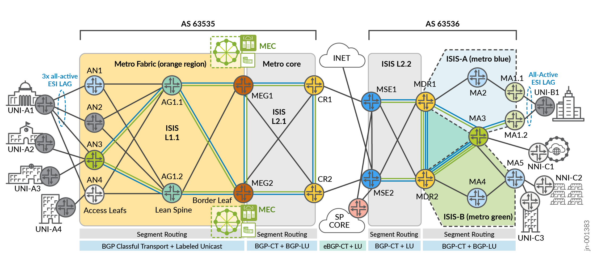
*Figure 5: Metro EBS Solution Topology*

- Flex Algo 128 include-any GREEN delay-metric
- Flex Algo 129 include-any BLUE TE-metric
- Transport Class 4000 maps to GOLD
- Transport Class 6000 maps to BRONZE

*Table 3: Featured JVD Devices*

| Topology Definitions | Role | Device |
|---|---|---|
| Access Leaf | AN | ACX7100-48L (DUT), ACX710, ACX5448, MX204 |
| Lean Spine | AG1 | ACX7100-32C |
| Lean Edge Border Leaf | MEG | Metro Edge Gateway: ACX7509 (DUT), ACX7100-32C (DUT) |
| Core | CR | PTX10001-36MR |
| Multiservices Edge | MSE | MX304 (DUT) |
| Metro Distribution Router | MDR | MX10003, ACX7509 (DUT) |
| Metro Access Node | MA | ACX7024 (DUT), ACX7100-48L (DUT), MX204 |

Solutions for E-Line/E-LAN/E-ACCESS Metro Services based on next-generation
Seamless Segment Routing transport infrastructure, incorporating ACX7024,
ACX7100-48L, and MX204 as access nodes; ACX7100-32C and ACX7509 platforms as Lean
Edge solution offering connectivity options into Cloud Compute complexes; and
MX304 Multiservices Edge (MSE) supporting complex services, termination, and
interconnectivity with other network segments or Internet peering.

Connectivity options for port-based (EPL) and VLAN-based (EVPL) IEEE 802.1q/QinQ-
based EVCs to support end-to-end active-active highly available services including
EVPN-VPWS/FXC/EVPN-ELAN and coexisting with traditional VPN services including
multi-site VPLS, Hot-Standby L2Circuit, L2VPN, and L3VPN with Internet Access.
Legacy static PWs are migrated to an Anycast Floating PW solution leveraging
Anycast-SID for L2 Q-in-Q connectivity. Most Layer 2 services include E-OAM
performance monitoring.

### Underlay Attributes

The common underlay included is Segment Routing MPLS with Labeled ISIS. TI-LFA is
the protection mechanism of choice with loose mode, which allows the transition to
link-protection should node-protection become unavailable.

Characteristics of the SR-MPLS design include:

- ISIS (L1 or L2) enabled for all devices.
- BFD over L-ISIS links.
- Additional ISIS tuning involves the following attributes but should be
  appropriately set for the network deployment to ensure stability:
  - Improve ISIS link state PDU interval to 10ms (100ms default),
  - ISIS maximum hello size is increased to 9106 based on interface ISO MTU
    configuration, which can help identify MTU issues.
  - SPF options are tuned within a range to prevent network instability.
- Consistent SRGB label range between 16000 and 24000. In earlier Junos OS
  implementations, SRGB is configured under the IGP hierarchy. This is still
  supported. Now SRGB is configured conveniently under the MPLS configuration
  hierarchy and is consistent with other label range configurations.
- TI-LFA provides both link and node protection with a configured maximum-label of
  3 for backup paths.
- Microloop Avoidance is enabled for all devices.

ISIS is the IGP that is used for the solution architecture. The JVD includes three
IGP metric combinations using Application Specific Link Attributes (ASLA) link
affinity constraints for computed paths:

1. IGP Metrics for uncolored paths (BGP-LU), referenced as best effort.
2. TE Metrics for Transport Class Bronze (BGP-CT).
3. Static Delay Metrics for Transport Class Gold (BGP-CT).

### Flexible Algorithm

Flexible Algorithm was ratified by RFC9350 and enables controllerless lightweight
traffic engineering solutions, while supporting advanced protection mechanisms,
like TI-LFA. TLV advertisements describe the key attributes of calculation-type,
metric-type, priority, and set of link constraints used for IGP-computed best
paths. The coalescence of these values defines the Flexible Algorithm Definition
(FAD).

Segment Routing prefix-SIDs are then associated with the Flex-Algo identifier,
thereby representing the computed path across participating nodes. By leveraging
different constraints and metric types, multiple layers of abstraction can be
created by forming colored paths through the network.

In the JVD, all nodes will participate in flex-algo and therefore must advertise
the SR-Algorithm sub-TLV node capability. The FAD sub-TLV announcements are not
required by every router. As a best practice to avoid conflict resolution, FAD
announcements in the JVD are restrained to only the border nodes (ABR/ASBR). Both
ABRs should be configured to advertise the FADs. Both sub-TLVs have level scope and
therefore are not advertised across IGP boundaries without an additional mechanism
for sharing inter-region attributes, explained further on.

After several draft revisions, the flex-algo RFC was finalized in 2023. But the
lead-up created a landscape of shifting standards, particularly around link
affinity attributes where three permutations emerged with legacy (RFC5305 section
3.1), Common ASLA (RFC8919 section 6.3.1), and finally Flex-Algo ASLA (RFC9350).

In Metro EBS JVD, the flex-algo implementation includes the latest link attribute
definitions specified in RFC9350 for the use of Application-specific link
attributes. The link attributes, as defined in RFC8919 for ISIS (or RFC8920 for
OSPF), include TE-metric, admin-group, and link-delay. Junos OS/Junos OS Evolved
supports L-Flag, allowing backward compatibility with legacy attributes and
default behavior allows fallback from Flex-Algo ASLA to Common ASLA and finally to
legacy TE attributes. In the JVD, legacy advertisements are disabled with
strict-sla-based-flex-algorithm knob but not a requirement for the solution.

A final consideration is IGP scale as each Flex-Algo will compute its own path. In
the JVD, we define three paths with two algos, gold (128) using delay metrics,
bronze (129) with TE metrics, and best effort (inet.3) with IGP metrics.

### Transport Classes

Transport classes define a set of common constraint attributes that are used to
create transport tunnels. Transport classes can be associated with different
underlay protocols, like RSVP or SR-TE. In the JVD, the transport classes will use
ISIS Flex-Algo to create multiple layers of network abstraction over the same
physical infrastructure. Services are then mapped to the color transport, enabling
a simplistic method for intelligent traffic steering.

With the latest implementations of classful transport, services that are mapped
onto transport class tunnels can be configured to transition or fallback between
tunnel hierarchies as required. The resolution scheme attribute governs the
next-hop resolution tables to consider.

Two styles of resolution scheme fallback methodologies are included in the JVD:

1. **No Fallback** — This method ensures that traffic is mapped to the appropriate
   color. If not, traffic is discarded.
2. **Cascade** — This is the preferred solution validated because it enables
   fallback for gold paths to bronze, and bronze paths to Inet.3 (best effort).

### BGP Routing Policy

BGP routing policies tag all routes based on the originating network segment to
enable targeted redistribution, prevent loops, and simplify troubleshooting. To
prevent loops, border nodes of each region only export routes that match the local
region community and reject routes matching the peer region communities. For
improved failure detection, BFD is configured on all BGP sessions using a 300ms
detection timer. BFD timers should be tuned based on network performance,
stability, and device capabilities.

BGP best practices are applied where relevant and include the following:

- BGP path-selection external-router-id modifies the path selection algorithm to
  always use router-ID for deciding the active path between EBGP paths, which helps
  with more consistent BGP behavior.
- BGP hold-time (default 90 seconds) is reduced to 10 seconds.
- When BGP hold-time is less than 20 seconds, precision-timers should be configured
  since it creates an increased workload on the routing engine CPU. Precision
  timers enable a dedicated kernel thread for BGP computation to ensure keepalives
  survive even with scheduler slips. This helps to prevent BGP session flaps because
  of the expiration of hold-time.
- With bgp-error-tolerance, additional default error handling mechanisms are
  enabled, including limiting malformed hidden routes stored in memory to 1000 and
  suppressing logging of malformed BGP update messages for 300 seconds.
- The BGP maximum segment size tcp-mss is increased from default 500 bytes to the
  maximum of 4096 bytes to help accelerate convergence.

PE link protection is enabled for EBGP-LU and BGP-CT paths in addition to
per-prefix-label to improve convergence. This can be a topic of scaling concern,
but for transport-only segments, the route scale is usually manageable. Only
labeled-unicast is configured with per-prefix-label since BGP-CT transport family
enables this behavior by default.

### BGP Route Reflectors

Fabric and multi-ring regions should use redundant BGP route reflectors for access
node clients. To optimize intra-fabric and inter-ring communication between access
nodes in the same region, multi-protocol BGP for VPN families will not include the
next-hop self option. Unique cluster IDs are used to maximize convergence. As a
general practice for local reachability within the fabric, access segment loopback
addresses are reachable only by ISIS and are not leaked into BGP. Only remote
loopbacks should be learned by BGP.

BGP route reflectors will enable the multiprotocol families:

- labeled-unicast (BGP-LU)
- transport (BGP-CT)
- inet-vpn (L3VPN)
- inet6-vpn (6vPE)
- l2vpn signaling (L2VPN, VPLS)
- evpn signaling (EVPN)
- route-target (RTF)

In all places where Route Target Constraint (RTC) is configured, the additional
next-hop-resolution no-resolution configuration option is included for bypassing
next hop resolution for RIB installation. This configuration is useful for routes
that are not used for forwarding, like non-forwarding RRs. The JVD route reflectors
are in the forwarding path, but RTF is strictly a control-plane element. To further
optimize the topology, the advertise-default option can be used to send only a
default route target to PE clients. The logical use would be in supporting the
featured access segments.

Metro Fabric and Metro Multi-Ring segments deploy different route reflector
strategies. In the fabric, the Metro edge gateways (MEG) function as the access
node (AN) reflectors for both transport and services routes (BGP-LU, BGP-CT, and
MP-BGP). In the multi-ring segment, the metro access nodes (MA) peer as route
reflector clients with the metro distribution routers (MDR), which are only
transport reflectors (BGP-LU, BGP-CT). All services (MP-BGP) leverage the
multiservices edge (MSE) route reflectors.

### Metro Ring Architecture

The following sections describe the proposed metro ring architectures. The design
comprises a multi-ring topology with multi-instance ISIS and inherits the common
elements described earlier.

**Key Metro Ring Features**

- Multi-Instance ISIS (blue and green rings).
- Flex-Algo Prefix Metrics (FAPM) leaking across multiple ISIS instances to
  optimize inter-ring forwarding.
- Intra-domain Transport Class Service Mapping.
- EVPN Floating PW with Anycast-SID (migrating from legacy L2CKT).
- EVPN-ETREE, EVPN-FXC, EVPN-VPWS, EVPN-ELAN
- L2Circuit, L2VPN, and BGP-VPLS.
- Local Switching (LSW) EVPN-VPWS and L2Circuit
- L3VPN Internet services

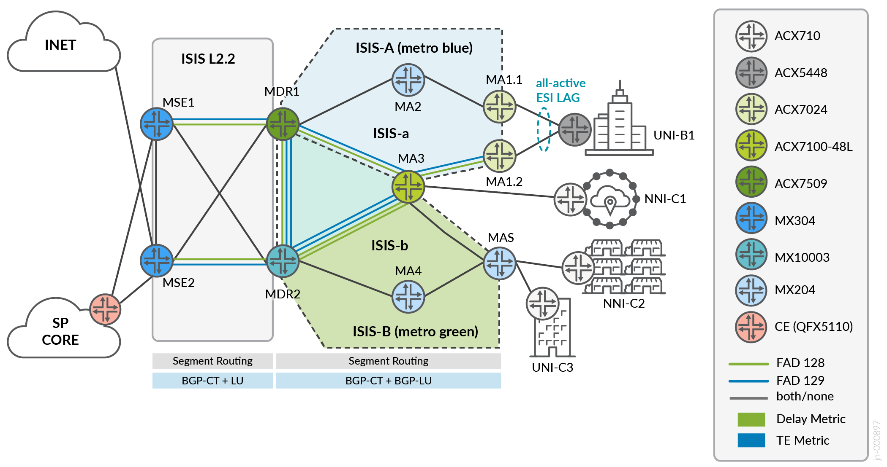
*Figure 6: Metro Ring Architecture*

The primary common BGP communities originating from metro ring regions include:

- CM-LOOPBACK (63536:10000)
- CM-SERVICE-EDGE (63536:10)
- CM-METRO-RING (63536:20)
- CM-REGION-EDGE (63536:30)
- CM-TC-4000-GOLD (transport-target:0:4000)
- CM-TC-6000-BRONZE (transport-target:0:6000)
- CM-INET-DEFAULT (target:63536:11111)
- CM-L3VPN-PUB (target:63536:22222)

### Multi-Instance ISIS

Both blue and green rings are functionally identical as Level 2 ISIS instances.
Most devices operate using a single ISIS instance that is configured under the
normal global hierarchy. Devices that attach to multiple IGP regions are configured
with multiple ISIS instances. This includes MDR1, MDR2, and MA3. Links between MDR1
and MDR2 share a common LAG, split logically by VLANs between global, metro-a, and
metro-b ISIS instances. The interfaces between MDR1 and MDR2 toward MA3 are also
logically divided by VLANs across a common physical interface. All other links are
domain-specific and exist in only a single IGP instance.

There is no requirement to share common interfaces in this architecture. The JVD
demonstrates how these challenging connectivity scenarios can be achieved, creating
definitive postures for route leaking at the border demarcation points.

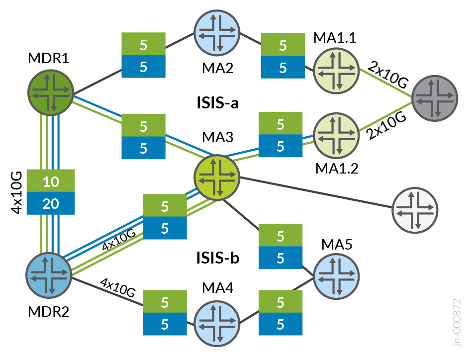
*Figure 7: Multi-Instance ISIS Architecture*

All inter-instance route leaking between rings is done at the MDR1 and MDR2 nodes.
The logic for leaking only at MDRs rather than MA3 can be attributed to
anticipating network expansion with additional rings, causing MA3 to become a less
preferred leaking point. The MDR presents the ideal demarcation point with
visibility of all rings for the regions. Routes leaked between ISIS instances are
tagged to prevent loops. The MDRs function as the BGP transport route reflectors
(BGP-LU and BGP-CT) for all ring access nodes (no multi-protocol BGP). For VPN
services, access nodes peer using MP-BGP with MSE route reflectors.

Leaking between global ISIS area ID 005 into ISIS instances metro-a (001) and
metro-b (002) is restricted to only BGP. At this juncture, seamless SR-MPLS with
BGP-LU and BGP-CT is leveraged. The solution could instead leak between the IGP
domains that are part of the common autonomous system, but here the solution
provides the ability to divide the IGP into smaller domains and reduce the blast
radius.

The same system ID is used for all ISIS instances and unique AREA IDs are included
as follows:

- 0005 – Global Instance
- 0001 – Metro-A Instance
- 0002 – Metro-B Instance

The IP scheme proposes aggregate tags to enable easier route redistribution and
loop prevention as follows:

- 10.10.0.0/24 – TAG2 5: GLOBAL
- 10.10.1.0/24 – TAG2 1: METRO-A
- 10.10.2.0/24 – TAG2 2: METRO-B

### Inter-Ring Flex-Algo Prefix Leaking

Flex-Algo inter-domain procedures are explained in RFC9350 section 13.1. Flex-Algo
Prefix Metric (FAPM) is a sub-TLV advertisement that carries a prefix association.
Flex-Algo with Application Specific Link Attributes (ASLA) metrics are defined on
all nodes, with Flex-Algo Definitions (FADs) advertised only by MDR border nodes.
Application Specific Link Attributes is the latest and standardized version for
Flex-Algo Metric advertisement. Flex-Algo Prefix Metric (FAPM) leaking is performed
between rings through MDRs to enable inter-ring traffic flows and are optimized
within the region.

MSE1 and MSE2 function as redundant route reflectors for all ring nodes and
additionally support inter-AS functionalities enhanced with BGP-LU and BGP-CT. To
ensure traffic flows are optimized within and between rings, VPN services (MP-BGP)
will not leverage next-hop self at the MSE. For LU/CT transport routes, next-hop
self is mandatory to facilitate inter-AS reachability.

SR-MPLS is the underlay of choice using Flex-Algo with ASLA metrics and transport
classes defining green and blue paths through the network. Green paths utilize ISIS
delay metrics and blue paths use TE metrics. The IGP metrics are used for
color-agnostic paths, which could be extended to consider colored or non-colored
paths. All routes leaked between domains are given a common ISIS tag and any routes
that are exported that already include this tag are rejected to prevent loops.

### Intra-AS BGP Classful Transport and Labeled Unicast

There are several viable strategies for communications across IGP domains within
the same autonomous system. In the JVD we provide a few variations using FAPM to
leak prefixes between ISIS instances where each instance denotes a metro ring
entity. From the collective multi-instance ISIS domains toward the global ISIS
domain (existing between MDR and MSE segments), we decide to prohibit any IGP
leaking and only use BGP-LU and BGP-CT as the inter-domain stitching mechanisms.
This ensures the IGP blast radius is contained within the specific areas.

### Metro Fabric Architecture

IP Fabrics are well understood and heavily deployed by hyper-scalers to deliver the
promise of high bandwidth, resiliency, and virtually unlimited scale-out
capability. Metro Fabrics have been a common point of discussion but generally lack
clear definitions. The infrastructure placement becomes a key consideration. While
IP Fabrics are commonly built within a data center environment, practically
nullifying associated fiber transport costs, the metro typically spans greater
distances between physical collocations, which can lead to more expensive optics.
Thus, implementing a metro fabric can vary between service providers and is
determined by the associated transport costs.

The model proposed by the Metro EBS JVD considers an infrastructure built with the
flexibility to support cost-effective scale-out solutions that are contained within
a single physical location and/or supporting spine-and-leaf metro access node
locations. In the general sense, we deploy a two-stage fabric using MPLS as the
underlay transport of choice.

In the topology, the metro fabric refers to the orange region. The metro core is
the grey region.

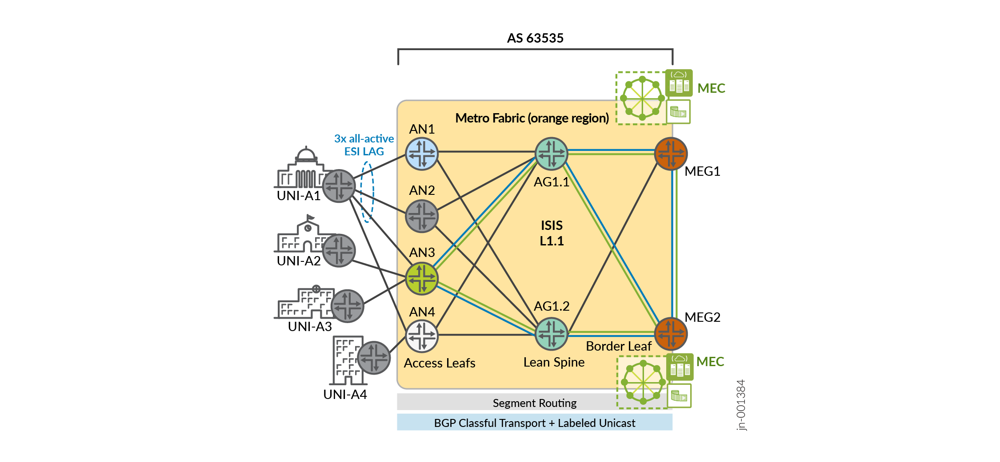
*Figure 8: Metro Fabric Architecture*

**Key Metro Fabric Features**

- Lean edge services aggregation
- Metro edge gateway with multiaccess edge compute interconnectivity
- Optimized forwarding paths over 2-stage MPLS fabric
- EVPN-FXC (aware + unaware), EVPN-VPWS, EVPN-ELAN
- L2Circuit, L2VPN, BGP-VPLS
- Dedicated Internet Access (DIA): L3VPN, EVPN Type-5, EVPN IRB VGA
- All-Active ESI LAG load-shared across three PEs
- Active-active and hot-standby services
- Logical Interface policers

To optimize VPN flows within the Metro Fabric, a pair of route reflectors (hosted
by border leaf nodes MEG1/MEG2) are used. While they operate in the forwarding
path, we must avoid setting next-hop to self for the multi-protocol BGP fabric
services to enable intra-fabric traffic to stay within the spine. Lean spine nodes
(AG1.1, AG1.2) are BGP-free with only SR-MPLS configuration. The IGP domain
comprises ISIS Level 1 in the metro fabric access network and Level 2 in the metro
core. All the metro fabric infrastructure implements the same area ID:

- 0000 – Global Instance

Traffic leaking between L1 and L2 ISIS can be accommodated with IGP machinery and
Flex Algo prefix leaking using Flex-Algo Prefix Metric (FAPM) or IGP leaking
explicitly restricted and relying only on BGP as the inter-domain protocol of
choice.

The Flexible Algorithm Definitions (FADs) are only advertised from the border nodes
at MEG1 and MEG2 positions. Similar to the Metro Ring design, only two transport
classes are created: Gold and Bronze. Resolution schemes enable gold services to
cascade failover onto bronze paths if a gold path is unavailable and bronze is
enabled to failover to "best effort" uncolored paths (inet.3). The default behavior
if no custom resolution scheme is configured, would be to enable all transport
classes to failover onto uncolored paths, resolving from the inet.3 table.

Similar to the metro ring design, we use BGP community-based routing to control how
routes are imported and exported across the various domains. The primary common BGP
communities originating from metro fabric regions include:

- CM-LOOPBACK (63535:10000)
- CM-METRO-FABRIC (63535:1)
- CM-ACCESS-FABRIC (63535:2)
- CM-REGIONAL-BORDER (63535:3)
- CM-TC-4000-GOLD (transport-target:0:4000)
- CM-TC-6000-BRONZE (transport-target:0:6000)
- CM-INET-DEFAULT (target:63536:11111)
- CM-L3VPN-PUB (target:63536:22222)

The core-facing interface IP scheme is delegated with an aggregate tag:

- 10.10.0.0/24 – TAG2 10: GLOBAL

### Overlay Attributes

The following sections describe the implementation and use cases of services that
are included in the Metro Ethernet Business Services JVD. This includes the
termination points and how these services relate to MEF definitions. However, it is
important to note that MEF alignment is not a requirement to use any of the
described services. Multiple permutations are included to cover different customer
use cases, but many more options are possible and supported.

### Metro EBS Service Delivery Models

Over twenty use cases are covered for delivering Metro Ethernet services.
Traditional Layer 2 VPN services are included along with L2Circuit with
hot-standby, L2VPN, and VPLS. This shows the ability to coexist with newer
EVPN-VPWS, EVPN-FXC, EVPN-ELAN, and EVPN-ETREE services over common modern Metro
ring and fabric infrastructures. In addition, the Floating PW solution delivers a
massive upgrade to legacy static L2Circuit by leveraging Anycast-SID with
all-active virtual ESI (vESI) for active-active multi-homing. Layer 3 services are
supported using traditional L3VPN, EVPN-ELAN Type 5, and EVPN IRB Virtual Gateway
Address (VGA) models. High-availability services are included, like active-active
EVPN and hot standby L2CKT.

Service interconnection models are considered for specific segments around lean
edge for Metro edge compute handoff where multiple options exist like EVPN-VXLAN or
SRv6 for IP Fabric interworking, however for this initial phase, we selected a
Q-in-Q handoff, which enables services to be connected into the edge complex
resources based on inner and or outer tag match. Operators are free to perform VLAN
manipulation to meet this goal. Similar considerations are made for multiservices
edge connectivity to facilitate Internet services or SP core for Layer 2
connectivity into additional network segments. Previous 5G Metro JVDs covered over
80 combinations of VLAN manipulation operations, which are still applicable here.

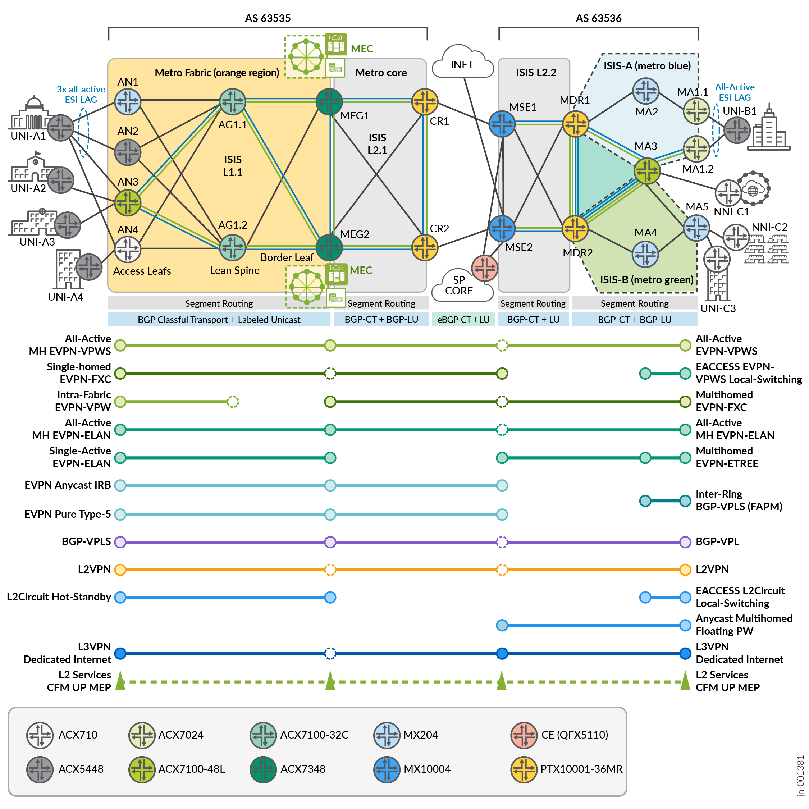
*Figure 9: Metro EBS Service Delivery Models*

Service providers increasingly migrate to EVPN as a more capable solution under a
single technology umbrella compared to traditional VPN services, including the
various flavors of L2Circuit, VPLS, and L2VPN. However, operators continue to
require legacy services as standalone and coexisting solutions. The Metro EBS
validated design considers a range of modern and traditional Carrier Ethernet
services, creating a comparative performance analysis and providing a few
methodologies that significantly modernize legacy protocols by taking advantage of
more recent solution developments.

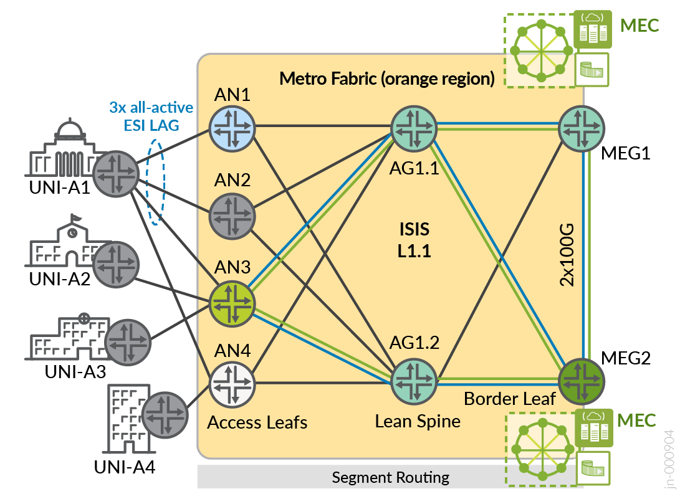
*Figure 10: Service Termination Points*

## Results Summary and Analysis

The JVD team successfully validated comprehensive and multidimensional solutions
for the Metro Ethernet Business Services reference architecture, encompassing over
twenty service-delivery use cases across multi-domain and inter-AS seamless segment
routing infrastructures. The network includes controller-less network lite-slicing
solutions with flex-algo, transport classes, and service mapping. The validation
features MX304, ACX7024, ACX7100-48L, ACX7100-32C and ACX7509 as primary DUTs with
helper nodes including PTX10001-36MR, MX204, MX10003, ACX5448, ACX710, QFX5110
platforms. Over 300 test cases are executed for each DUT during validation on Junos
OS and Junos OS Evolved Release 23.2R2.

A major objective of Juniper Validated Design is to create practical solutions with
a multidimensional scale relevant to the domain-specific use case. Functional
testing ensures services and protocols operate within expectations and network
resiliency performance is measured and reported in the JVD.

The proposed network design delivers fast restoration with consistent sub-50ms
convergence in expected segments with Segment Routing MPLS, Flex-Algo, and TI-LFA
protection machinery. Additional mechanisms to improve failover and or load sharing
include BGP multipath, ECMP fast-reroute, and VPN-unequal-cost for L3VPN services,
Flow Aware Transport Label (FAT-PW), and enablement of all relevant hash-keys for
extracting supported L2, L3, and MPLS fields. Color-aware services support the
creation of TI-LFA backup paths over matching-colored paths, with both primary and
backup following resolution scheme configurations.

The following tables summarize convergence reported during failure events,
categorized by network segment. For additional information, contact your Juniper
Networks representative.

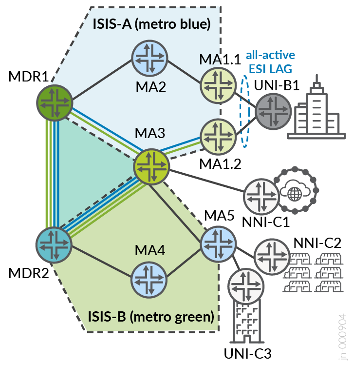
*Figure 11: Metro Fabric*

The table summarizes the convergence times for metro fabric services for a given
failure event. The fabric design enables flow optimization for VPN services between
AN-to-AN. Intra-AS Metro Fabric services include AN-to-AN (via spine AG1 nodes),
AN-to-MEG single-homing, and AN-to-MEG1/MEG2 multi-homing. The Metro Edge Gateway
(MEG) supports the connectivity into edge computing services. In the JVD, this
connection handoff is supported with QFX5110 platforms.

*Table 4: Convergence Times for Metro Fabric Services — Metro Fabric Intra-AS (milliseconds)*

| Event | EVPN-VPWS (Color Aware) | EVPN-VPWS (Color Agnostic) | EVPN-ELAN (Color Aware) | EVPN-ELAN (Color Agnostic) | L2Circuit (Color Aware) | L2Circuit (Color Agnostic) | L3VPN (Color Aware) | L3VPN (Color Agnostic) |
|---|---|---|---|---|---|---|---|---|
| AN3-AG1.1 link disable | 0 | 2.3 | 87 | 3 | 0 | 4.8 | 0 | 2.8 |
| AN3-AG1.1 link enable | 0 | 0 | 0 | 0 | 1 | 1.4 | 0 | 0 |
| AN3-AG1.2 link disable | 0.3 | 1 | 0.2 | 0.2 | 1.2 | 0.7 | 0 | 0.3 |
| AN3-AG1.2 link enable | 0 | 0 | 46.6 | 0 | 0.8 | 1.5 | 0 | 0 |
| AG1.2-MEG2 link disable | 0.7 | 1 | 0.7 | 0.7 | 1.3 | 1.3 | 0 | 0.6 |
| AG1.2-MEG2 link enable | 0 | 0 | 0 | 0 | 0 | 0 | 0 | 0 |
| AG1.1-MEG1 link disable | 49.6 | 0.3 | 20.1 | 0.3 | 42 | 0 | 0 | 0 |
| AG1.1-MEG1 link enable | 0 | 0 | 0.2 | 0.1 | 0 | 0 | 0 | 0 |
| L2CKT Standby Failover¹ | - | - | - | - | 2939.8 | 2443 | - | - |
| L2CKT Standby Revert | - | - | - | - | 39 | 43 | - | - |

¹ Results shown for L2Circuit failure events include link failures with TI-LFA fast
reroute restoration while maintaining L2Circuit mastership. The standby failover
convergence represents executing manual failover from CLI. There are control plane
mechanisms to signal the reverse path on the remote backup neighbor to transition
active/open. The implementation differs slightly from MX platforms, which maintain
an open state for the standby path.

The next table summarizes convergence times for Metro multi-ring services for the
given failure event. The multi-ring design enables flow optimization for MA-to-MA
VPN services by leveraging MDR1/MDR2 as the deterministic point of leaking between
ring domains (ISIS instances). Intra-AS Metro multi-ring services include traffic
flows for MA-to-MA, MA-to-MSE single-homing, and MA-MSE1/MSE2 multi-homing. The
multiservices edge routers support Internet-VRF and SP core connectivity, which
enables services to be stitched into additional network domains.

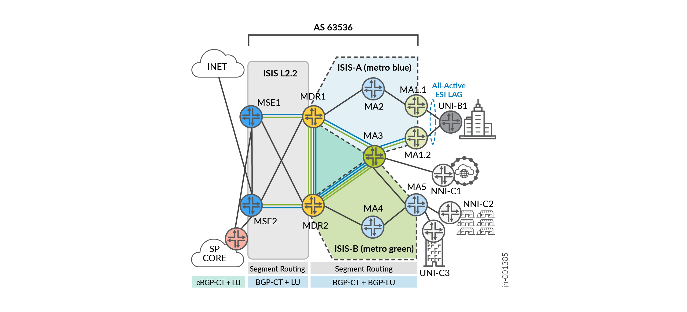
*Figure 12: Metro Multi-Ring Topology*

*Table 5: Convergence Times for Metro Multi-Ring Services — Metro Multi-Ring Intra-AS (milliseconds)*

| Event | BGP-VPLS (Color Aware) | BGP-VPLS (Color Agnostic) | EVPN-Tree (Color Aware) | EVPN-Tree (Color Agnostic) | Floating PW (Color Aware) | Floating PW (Color Agnostic) | L3VPN (Color Aware) | L3VPN (Color Agnostic) |
|---|---|---|---|---|---|---|---|---|
| MDR1-MA2 link disable | 0 | 0 | 0 | 0 | 0 | 0 | 0 | 0 |
| MDR1-MA2 link enable | 17.5 | 0 | 0 | 0 | 0 | 0 | 0 | 0 |
| MDR1-MA3 link disable | 0 | 0 | 0 | 0 | 1.3 | 0.4 | 1 | 1 |
| MDR1-MA3 link enable | 0 | 0 | 0 | 0 | 1.4 | 0.7 | 0 | 0 |
| MDR2-MA3 link disable | 0 | 0 | 0 | 0 | 37.2 | 29.4 | 0.4 | 0 |
| MDR2-MA3 link enable | 0 | 0 | 0 | 0 | 1.4 | 0 | 6.3 | 0 |
| MDR2-MA4 link disable | 22.4 | 35.9 | 48.3 | 48.6 | 0 | 0 | 50 | 50 |
| MDR2-MA4 link enable | 0 | 0 | 0 | 0 | 0 | 0 | 0 | 0 |
| MA1.2-MA3 link disable | 115.3 | 178.3 | 0 | 0 | 67.4 | 18.4 | 0 | 0 |
| MA1.2-MA3 link enable | 12.6 | 12.8 | 0 | 0 | 6.1 | 0 | 0 | 0 |
| SP Core to MSE2 link disable² | - | - | 28.1 | 131.7 | 8.8 | 6.6 | - | - |
| SP Core to MSE2 link enable² | - | - | 32.4 | 31.7 | 84 | 412 | - | - |

² SP Core to MSE2 represents a Q-in-Q segment handoff. The relationship here is more
like a CE-facing link failure event and is measured with Dynamic List Next Hop
(DLNH) and EVPN Egress Link Protection (ELP) support.

The final convergence table includes the end-to-end inter-AS services. This diagram
displays the service instantiation points across the topology.

*Figure 13: Metro Fabric to Multi-Ring Inter-AS Topology*

- Flex Algo 128 include-any GREEN delay-metric
- Flex Algo 129 include-any BLUE TE-metric
- Transport Class 4000 maps to GOLD
- Transport Class 6000 maps to BRONZE

Inter-AS services include:

- EVPN-ELAN Multihoming for VLAN-based services. All-Active ESI with 3xPE (AN1, AN2,
  AN3) to All-Active ESI with 2xPE (MA1.1, MA1.2) and All-Active ESI connectivity
  into MEC complex.
- EVPN-ELAN EP-LAN services between AN3 and MA1.2.
- EVPN-VPWS EPL services between AN3 and MA1.1.
- EVPN-VPWS Multi-homing All-Active ESI with 3xPE (AN1, AN2, AN3) to All-Active ESI
  with 2xPE (MA1.1, MA1.2).
- EVPN Flexible Cross-Connect VLAN Unaware between AN3 and MSE1.
- EVPN Flexible Cross-Connect VLAN Aware Multi-homing All-Active ESI with 2xPE
  (MA1.1, MA1.2) to All-Active ESI MEG1 and MEG2 for MEC connectivity.
- BGP-VPLS with multiple sites from AN3, MA1.2, MA5, and MEG1 or MEG2.
- L2VPN services between AN3 and MA5.
- L3 EVPN Route-Type 5 with multiple sites from AN3, MEG1, MEG2, MSE1, MSE2.
  Includes Internet Access through MSE2.
- L3 EVPN IRB Anycast with multiple sites from AN3, MEG1, MEG2, MSE1, MSE2. Includes
  Internet Access through MSE2.
- L3VPN with sites including AN3, MA4, MSE1, MSE2. L3VPN includes OSPF, BGPv4, and
  BGPv6 VRF services. Includes Internet Access through MSE2.

*Table 6: Convergence Times for End-to-End Inter-AS Services — Metro Inter-AS (milliseconds)*

| Event | EVPN-VPWS (Color Aware) | EVPN-VPWS (Color Agnostic) | EVPN-ELAN (Color Aware) | EVPN-ELAN (Color Agnostic) | L2VPN (Color Aware) | L2VPN (Color Agnostic) | VPLS (Color Aware) | VPLS (Color Agnostic) | L3VPN (Color Aware) | L3VPN (Color Agnostic) |
|---|---|---|---|---|---|---|---|---|---|---|
| AN3-AG1.1 link disable | 0 | 0 | - | 0 | 0 | 0 | 87 | 0 | 0 | 0 |
| AN3-AG1.1 link enable | 0 | 0 | - | 0 | 1 | 1.4 | 0 | 0 | 0 | 0 |
| AN3-AG1.2 link disable | 0 | 0.8 | 0.18 | 0.8 | 0 | 0.8 | 0.4 | 0.8 | 1 | 1 |
| AN3-AG1.2 link enable | 0 | 0 | 0 | 0 | 0 | 0 | 0 | 0 | 0 | 0 |
| AG1.2-MEG2 link disable | 0 | 1.4 | 0.6 | 1.4 | 0.7 | 1.4 | 0.7 | 1.4 | 1.4 | 1.4 |
| AG1.2-MEG2 link enable | 0.7 | 0 | 0 | 0 | 0 | 0 | 0 | 0 | 0 | 0 |
| AG1.1-MEG1 link disable | 0 | 0.7 | 0.7 | 0.2 | 0 | 0 | 0.1 | 0 | 0 | 0 |
| AG1.1-MEG1 link enable | 0 | 0.5 | 0.4 | 0.2 | 0 | 0 | 0.4 | 0.2 | 0.4 | 0 |
| MDR1-MA2 link disable | 1.9 | 3.4 | 0 | 1.7 | 0 | 0 | 0 | 0 | 0 | 0 |
| MDR1-MA2 link enable | 0.4 | 10.6 | 1.2 | 3.79 | 0 | 0 | 0 | 0 | 0 | 0 |
| MDR1-MA3 link disable | 0.2 | 0.1 | 0.4 | 0.19 | 0 | 0.4 | 0.3 | 2.1 | 0 | 0 |
| MDR1-MA3 link enable | 0.4 | 0.4 | 3.9 | 0.2 | 0 | 0.1 | 0.8 | 1.5 | 0.1 | 0 |
| MDR2-MA3 link disable | 11.3 | 19 | 0.6 | 12.5 | 1.24 | 0.3 | 14.7 | 37.7 | 0.5 | 0 |
| MDR2-MA3 link enable | 0 | 26.9 | 0.2 | 0.1 | 38.6 | 0.1 | 0.1 | 1.6 | 0.1 | 0 |
| MDR2-MA4 link disable | 0 | 0 | 0 | 0 | 18.4 | 25.4 | 22.4 | 0 | 0 | 0 |
| MDR2-MA4 link enable | 0 | 0 | 0 | 0 | 0 | 0 | 0 | 0 | 0 | 0 |
| MA1.2-MA3 link disable | 54.9 | 9.6 | - | - | 0 | 0 | 18.4 | 61.9 | 0 | 0 |
| MA1.2-MA3 link enable | 11.6 | 0.4 | - | - | 0 | 0 | 0.1 | 13.9 | 0 | 0 |
| AN3 ESI LAG disable | - | 2.2 | 1099.41 | 1075.61 | - | - | - | - | - | - |
| AN3 ESI LAG enable | - | 1.8 | 38.1 | 38.1 | - | - | - | - | - | - |
| MEG-MEC link disable³ | 579.11 | 571.91 | 909.91 | 915.11 | - | - | - | - | - | 0 |
| MEG-MEC link enable³ | 144.81 | 232.81 | 1420 | 71.51 | - | - | - | - | - | 81.5 |

³ Current results show global repair because of CE-link failure. For fast failover,
Dynamic List Next Hop (DLNH) and EVPN Egress Link Protection (ELP) are recommended
and scheduled for Junos OS Evolved Release 24.3R1 on ACX7000 platforms. For
comparative results demonstrating DLNH and ELP improvements supported by MX
platforms, see the full test report (contact your Juniper Networks representative).

### Solution Gaps and Known Limitations

The solutions and services proposed by the JVD can be considered complete and
supported with the following distinctions. Note that any target Junos OS/Junos OS
Evolved feature delivery references are not guaranteed and are subject to delay or
cancellation without notice. Contact your Juniper Networks representative for
status.

- Juniper recommends two additional optimization options for improving EVPN
  performance and reducing convergence time. For EVPN active-active multi-homing,
  the ESI route by default points to two next hops. A link failure event between PE
  and CE causes a new next-hop entry to be created, triggering mass MAC route
  withdrawals and additions. Juniper recommends Dynamic List Next Hop (DLNH) to
  enable silent removal of the affected next-hop entry without causing mass MAC
  withdrawals. EVPN Egress Link Protection (ELP) creates backup next hops on
  multi-homed PEs to support fast reroute (FRR). These features are currently
  supported on MX platforms. The ACX7000 family does not support these features in
  Junos OS Evolved Release 23.2R2 but support is planned for Junos OS Evolved
  Release 24.3R1.
- To avoid certain BGP-LU and BGP-CT inter-domain global repair events, Juniper
  recommends BGP-PIC machinery. In the presented solution, the functionality
  requires the preserve-nexthop-hierarchy knob, which is supported by MX platforms
  and included in the JVD. The ACX7000 family targets Junos OS Evolved Release
  24.2R1 for these features. BGP-PIC for Seamless SR (BGP-LU and BGP-CT) is not
  included in the JVD for unsupported devices.
- BGP Classful Transport is included and validated on all featured DUTs running
  Junos OS Evolved Release 23.2R2. This feature enables seamless inter-domain color
  transport but is not required for the solution using only color-agnostic paths.
  Contact your Juniper Networks representative with questions or concerns.
- As of Junos OS Evolved Release 23.2R2, the ACX7000 family does not support
  simultaneous ECMP + FRR mechanisms. In general, TI-LFA fast reroute will provide
  optimal restoration and these are the results reported in the JVD. Support for the
  coexistence of ECMP+FRR is currently planned for Junos OS Evolved Release 24.1R1
  and presents opportunities to further improve network resiliency and reduce
  convergence.

For additional JVD test information, contact your Juniper Networks representative.

## Recommendations

The Metro Ethernet Business Services Juniper Validated Design addresses traditional
L2 Business Access and Dedicated Internet Access services while incorporating modern
service delivery protocols, including EVPN-VPWS, EVPN-FXC, EVPN-ETREE, and
EVPN-ELAN. The topology, built using the Juniper Cloud Metro portfolio, deploys an
infrastructure designed to support metro access multi-ring topologies and a 2-stage
metro fabric spine-and-leaf design. The reference architecture is based on modern
Carrier Ethernet Metro Area Networks and takes into consideration the transformation
required to facilitate diverse new services, applications, and use cases.

The new architecture, known as Cloud Metro, carries several important
characteristics in the amalgamation of service and content providers. These shifting
industry trends demand massive bandwidth and service scale increase while supporting
more complex metro workloads. A major goal of Cloud Metro is the adaptation of cloud
principles into metro networks, including the array of EVPN technologies,
SR-MPLS/SRv6, and machinery to support inter-domain traffic engineering or seamless
architectures across disparate networks. This is a differentiating factor that
characterizes requirements for supporting x-to-anything connectivity models or
building infrastructures that become access agnostic, while blending with
virtualized network functions and devices.

The solution architectures and services proposed in the Metro Ethernet Business
Services JVD are part of the network modernization journey and are challenges many
operators face. Our modern converged network infrastructures and technologies stand
ready to meet the demands of the new metro. JVD proposes solution blueprints to make
every connection count.

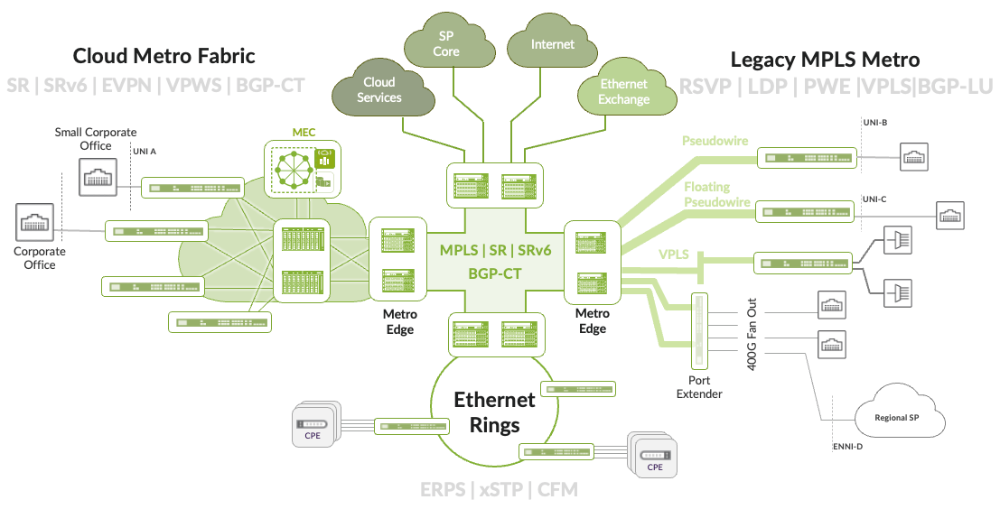
*Figure 12: Juniper Evolved Metro*

The Juniper Networks MEF 3.0 certified MX304 leverages the next-generation Trio 6
chipset that is designed with the highest performance, efficiency, and agility
requirements to meet cloud-era scale and network demand. The compact 2RU modular
4.8T platform delivers the advanced feature set required for the most sophisticated
multiservice edge roles.

The ACX7000 Family is purpose-built to support the Cloud Metro evolution with a
consistent advanced feature set across the complete portfolio. The MEF 3.0 certified
ACX7509 compact modular metro router delivers an innovative centralized chassis
architecture, designed to reduce failures, optimize power efficiency, and support
the diverse speeds and feeds required for the interconnectivity into the featured
Multi-access Edge Computing (MEC) complexes.

The MEF 3.0 certified ACX7100-48L and ACX7100-32C are 4.8T 1RU platforms supporting
dense capacity and provide up to 400GbE metro access and aggregation. The JVD
selected ACX7100-48L for access fabric and multi-ring attachments and ACX7100-32C
for the roles of fabric spine and metro edge gateway with border leaf service
termination functionality.

The MEF 3.0 certified ACX7024 temperature-rated 360G platform is ideally situated
for metro access roles and supports the advanced feature set of the ACX7000 family
portfolio.

## Revision History

*Table 7: Revision History*

| Date | Version | Description |
|---|---|---|
| Sept 2025 | JVD-METRO-EBS-03-03 | Added new platforms: ACX7348; PTX10001-36MR; MX10004 with the LC9600 line card. You can replace ACX7100-32C and ACX7509, MX10003 and ACX7509, and MX304 with these new set of platforms respectively. |
| July 2024 | JVD-METRO-EBS-03-01 | Initial publish |

## Sources

- **Published JVD (source of truth):** Metro Ethernet Business Services — Juniper
  Validated Design, on
  [juniper.net validated designs](https://www.juniper.net/documentation/validated-designs/).
- **Companion documents in this folder:**
  [solution-overview-03-03.md](solution-overview-03-03.md),
  [test-report-brief-03-03.md](test-report-brief-03-03.md),
  [datasheet.md](datasheet.md).
- **Configurations and snippets:** full per-device configurations under
  [`../configuration/`](../configuration/); templatized config snippets under
  [`../configuration/snips/`](../configuration/snips/).

> Trademarks: Juniper Networks, the Juniper Networks logo, Juniper, and Junos are
> registered trademarks of Juniper Networks, Inc. in the United States and other
> countries. All other trademarks, service marks, registered marks, or registered
> service marks are the property of their respective owners. Copyright © 2025
> Juniper Networks, Inc. All rights reserved.
