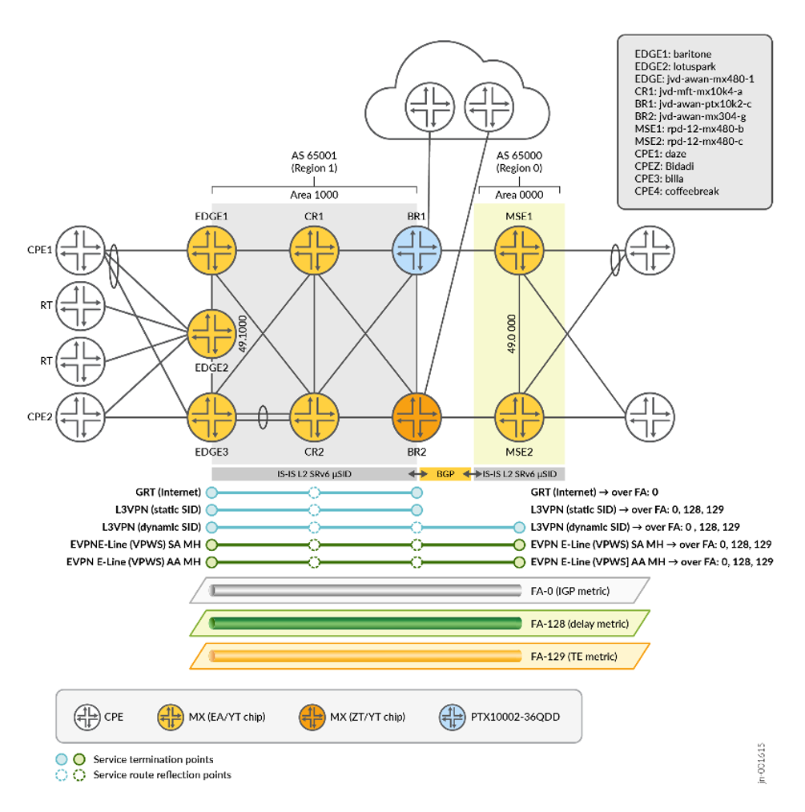
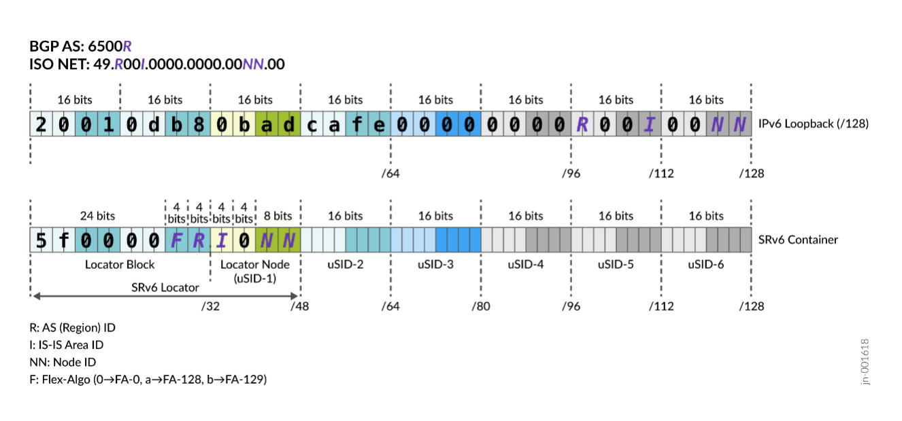

# Service Provider SRv6 Core and Edge JVD

This Juniper Validated Design (JVD) delivers a reference architecture for service provider core and edge networks built on **SRv6 µSID (NEXT-CSID)** transport. Phase 1 covers multi-domain transport with Flex-Algo (no SRv6-TE) and core service overlays — **L3VPN** (SAFI 128 and EVPN Type-5 SAFI 70) and **EVPN E-Line / VPWS**.

---

## 📄 SRv6 Core and Edge JVD Documentation

- **JVD Landing Page:**
  [SRv6 Core and Edge JVD](https://www.juniper.net/documentation/us/en/software/jvd/jvd-sp-core-edge-srv6-01-01/index.html)

- **Solution Overview (PDF):**
  [PDF Overview](https://www.juniper.net/documentation/us/en/software/jvd/sol-overview-sp-core-edge-srv6-01-01.pdf)

- **Solution Benefits:**
  [Solution Benefits](https://www.juniper.net/documentation/us/en/software/jvd/jvd-sp-core-edge-srv6-01-01/solution_benefits.html)

- **Use Case and Reference Architecture:**
  [Use Case and Reference Architecture](https://www.juniper.net/documentation/us/en/software/jvd/jvd-sp-core-edge-srv6-01-01/use_case_and_reference_architecture.html)

- **Solution Architecture:**
  [Solution Architecture](https://www.juniper.net/documentation/us/en/software/jvd/jvd-sp-core-edge-srv6-01-01/solution_architecture.html)

- **Validation Framework:**
  [Validation Framework](https://www.juniper.net/documentation/us/en/software/jvd/jvd-sp-core-edge-srv6-01-01/validation_framework.html)

- **Test Objectives:**
  [Test Objectives](https://www.juniper.net/documentation/us/en/software/jvd/jvd-sp-core-edge-srv6-01-01/test_objectives.html)

---

## 🚀 Solution Benefits

SRv6 replaces MPLS encapsulation with native IPv6 encapsulation, retaining the benefits of MPLS while unlocking new capabilities:

- **Increased scale** — Prefix aggregation/summarization at AS or area boundaries removes the need to leak unique loopbacks or labels across domains.
- **Simplified operations** — Eliminates LDP/RSVP from the underlay; transport state is carried entirely in IS-IS extensions.
- **Lower cost to serve** — A single IPv6 encapsulation can span DC, access, aggregation, and WAN, removing encapsulation conversion at domain boundaries.
- **Improved user experience** — Enables Service Function Chaining (SFC) and multi-topology routing via SRv6 Flexible Algorithms.

---

## 🧩 Architecture

The reference design implements **core** and **edge** segments inside a single flat IS-IS Level-2 domain (default IS-IS instance). A separate **Multi-Service Edge (MSE)** domain is reachable over BGP only, with redistribution policies (with or without summarization) providing end-to-end IPv6 connectivity between loopbacks and locators.



*Figure 1 — SRv6 JVD lab topology, services overlay, and Flex-Algo transport classes.*

### IPv6 / SRv6 µSID Addressing



*Figure 2 — IPv6 loopback and SRv6 µSID container layout. `R` = AS/Region ID, `I` = IS-IS Area ID, `NN` = Node ID, `F` = Flex-Algo (0→FA-0, a→FA-128, b→FA-129).*

Major components:

- SP reference architectures (core, edge, MSE)
- Seamless Segment Routing across SP edge and core domains (Inter-AS BGP + SRv6 locator redistribution / summarization between domains)
- Fast failover and detection: TI-LFA, MLA, BFD, ECMP
- SRv6 µSID with IS-IS
- Flex-Algo Application Specific Link Attribute (ASLA) — TE and Delay metrics
- Flex-Algo Prefix Metric (FAPM) Transport Classes
- Strict and Cascade Transport Class Resolution schemes — Inter-AS BGP Transport
- VPN service mapping to transport Flex-Algo
- Redundant Route Reflectors
- EVPN-VPWS with Active/Active and Active/Standby multi-homing
- Inter-AS Option C
- TWAMP-light for delay measurement

### Flex-Algo deployment

| Flex-Algo | Metric        | Purpose                  |
|-----------|---------------|--------------------------|
| 0         | IGP metric    | Default best-path        |
| 128       | Delay metric  | Latency-optimized class  |
| 129       | TE metric     | Engineered transport     |

Each Flex-Algo carries its own Node SID (µN) and unprotected adjacency SIDs (µA).

---

## 🧱 Validated Hardware and Software

| Tag   | Role             | Platform        | Line card                       | Chip                  | OS                       |
|-------|------------------|-----------------|---------------------------------|-----------------------|--------------------------|
| R0    | EDGE1            | MX480           | MPC7E 3D 40XGE                  | Trio 4 (EA, mkernel)  | Junos OS 24.4R2          |
| R1    | EDGE2            | MX480           | MPC7E 3D 40XGE                  | Trio 4 (EA, mkernel)  | Junos OS 24.4R2          |
| R2    | EDGE3            | MX480           | MPC10E 3D MRATE-15xQSFPP        | Trio 5 (ZT, AFT)      | Junos OS 24.4R2          |
| R3    | CR1              | MX10004         | JNP10K-LC9600                   | Trio 6 (YT, AFT)      | Junos OS 24.4R2          |
| R4    | CR2              | MX2010          | MPC11E 3D MRATE-40xQSFPP        | Trio 5 (ZT, AFT)      | Junos OS 24.4R2          |
| R5    | BR1              | PTX10002-36QDD  | N/A                             | Express 5 (BX)        | Junos OS Evolved 24.4R2  |
| R6    | BR2              | MX304           | LMIC                            | Trio 6 (YT, AFT)      | Junos OS 24.4R2          |
| R7    | MSE1             | MX480           | MPC10E 3D MRATE-10xQSFPP        | Trio 5 (ZT, AFT)      | Junos OS 24.4R2          |
| R8    | MSE2             | MX304           | LMIC                            | Trio 6 (YT, AFT)      | Junos OS 24.4R2          |
| R9    | CPE1             | MX240           | N/A                             | N/A                   | Junos OS 24.4R2          |
| R10   | CPE2             | MX240           | N/A                             | N/A                   | Junos OS 24.4R2          |
| R11   | CPE3             | MX240           | N/A                             | N/A                   | Junos OS 24.4R2          |
| R12   | CPE4             | MX240           | N/A                             | N/A                   | Junos OS 24.4R2          |
| RT0   | Traffic Generator| IXIA            | N/A                             | N/A                   | IxOS 9.3.0               |

Roles: **EDGE** = Edge Node, **CR** = Core Router, **BR** = Border Router, **MSE** = Multi-Service Edge.

---

## ✅ Baseline Features

- SRv6 µSID with IS-IS, Flex-Algo (with dynamically measured delay metrics)
- TI-LFA (link/node) and MLA (micro-loop avoidance) for IS-IS
- SRv6 µSID locator summarization in IS-IS
- L3VPN (mDT4, mDT6, mDT46) and EVPN-VPWS (mDX2)
- BGP, BFD, community-based routing policy, route reflection, IPv4, IPv6
- LACP, AE bundles, VLAN (802.1Q)

## ⛔ Out of Scope (Phase 1)

- SRv6-TE, PCEP-driven TE, network slicing
- IS-IS multi-instance with Instance ID TLV (TLV #7)
- EVPN E-LAN and EVPN-VPWS PWHT over SRv6
- MPLS ↔ SRv6 µSID migration / interworking
- SRv6 classic SID and µSID co-existence
- UPA, FBF, CBF, Class-of-Service (CoS)
- MVPN over SRv6
- SRv6 high-availability (GR, GRES, NSR)
- BGP-only or protocol-less IPv6 fabrics

---

## 📁 Repository Layout

```
srv6_core_edge/
├── README.md
├── configuration/
│   └── conf/         # Hierarchical Junos configs, one file per device
└── images/           # Topology and architecture diagrams
```

## 🗂️ Configurations

| File | Role | Platform |
|---|---|---|
| [`edge1_mx480.conf`](configuration/conf/edge1_mx480.conf) | Edge 1 | MX480 |
| [`edge2_mx480.conf`](configuration/conf/edge2_mx480.conf) | Edge 2 | MX480 |
| [`edge3_mx480.conf`](configuration/conf/edge3_mx480.conf) | Edge 3 | MX480 |
| [`cr1_mx10004.conf`](configuration/conf/cr1_mx10004.conf) | Core Router 1 | MX10004 |
| [`cr2_mx2010.conf`](configuration/conf/cr2_mx2010.conf) | Core Router 2 | MX2010 |
| [`br1_ptx10002-36qdd.conf`](configuration/conf/br1_ptx10002-36qdd.conf) | Border Router 1 | PTX10002-36QDD |
| [`br2_mx304.conf`](configuration/conf/br2_mx304.conf) | Border Router 2 | MX304 |
| [`mse1_mx480.conf`](configuration/conf/mse1_mx480.conf) | Multi-Service Edge 1 | MX480 |
| [`mse2_mx304.conf`](configuration/conf/mse2_mx304.conf) | Multi-Service Edge 2 | MX304 |
| [`cpe1_mx240.conf`](configuration/conf/cpe1_mx240.conf) | CPE 1 | MX240 |
| [`cpe2_mx240.conf`](configuration/conf/cpe2_mx240.conf) | CPE 2 | MX240 |
| [`cpe3_mx240.conf`](configuration/conf/cpe3_mx240.conf) | CPE 3 | MX240 |
| [`cpe4_mx240.conf`](configuration/conf/cpe4_mx240.conf) | CPE 4 | MX240 |

> Configs have been sanitized for public release: encrypted credentials, internal management IPs, AAA secrets, default SNMP communities, and lab-specific contact/location metadata have been removed. Hostnames have been normalized to match the diagram labels.

---

*Send feedback to: design-center-comments@juniper.net*
