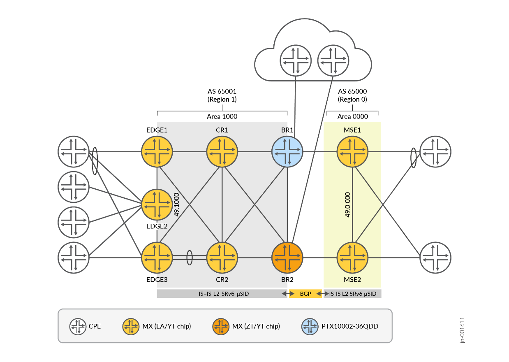
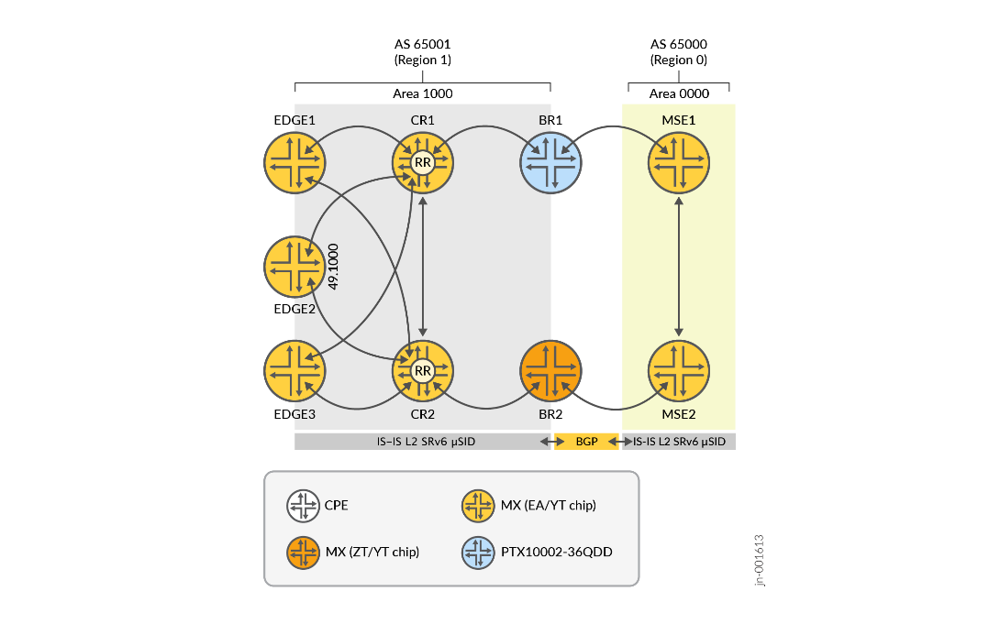
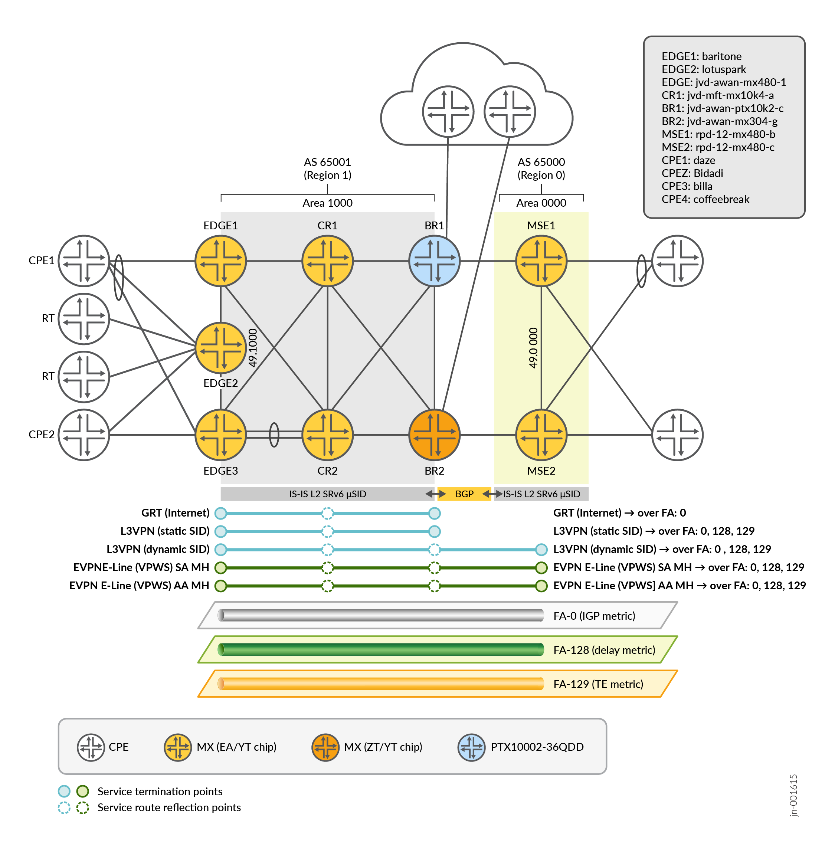
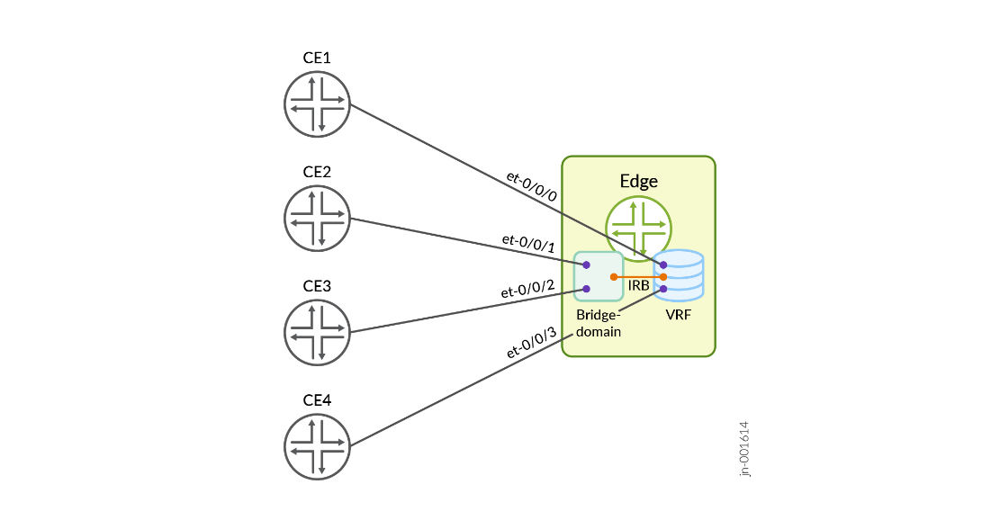

> Faithful markdown conversion of the published PDF:
> [SP Core and Edge SRv6 — Juniper Validated Design (JVD)](https://www.juniper.net/documentation/us/en/software/jvd/jvd-sp-core-edge-srv6-01-01/index.html).
> The PDF on juniper.net is the source of truth. The exhaustive per-device
> configuration listing is not reproduced here — see
> [`../configuration/conf/`](../configuration/conf/) and the
> [snip library](../configuration/snips/) for full configs.

# SP Core and Edge SRv6 — Juniper Validated Design

## About this Document

This JVD details an SRv6 Core and Edge used for the transport of L3 and L2 business services in a Service Provider (SP) network. It describes a service-provider network using SRv6 with SID compression based on NEXT-CSID (micro-SID / µSID) as the underlying transport. The solution validation uses a phased approach; **Phase 1** scope is limited to multi-domain network transport with multiple transport planes realized through SRv6 Flex-Algo (without traffic engineering), and services focused on the Global Routing Table (GRT), L3VPN, and point-to-point L2 services (EVPN E-Line / VPWS). Validated on Juniper MX Series and PTX Series routers.

## Solution Benefits

SRv6 replaces MPLS encapsulation with IPv6 encapsulation, retaining most MPLS benefits and adding new capabilities:

- **Increase network scalability** — SRv6 allows prefix aggregation/summarization at domain (AS, area) boundaries, eliminating the need to exchange unique loopbacks or labels across boundaries.
- **Simplify operations** — fewer protocols than LDP/RSVP; underlay reachability distributed via IS-IS extensions.
- **Reduce cost to serve** — unified encapsulation across DC, access/aggregation, and WAN; no encapsulation conversion at domain boundaries.
- **Improve the user experience** — enables new use cases such as Service Function Chaining and multi-topology routing with SRv6 Flexible Algorithms.

## Use Case and Reference Architecture

*Figure 1. Juniper SRv6 Solution Architecture.*

Modern SP networks have two main segments — **core** and **edge**. The reference design implements core and edge within a single flat IS-IS Level 2 domain (default IS-IS instance). The Multi-Service Edge (MSE) service complex is placed in a **separate domain with BGP-only reachability**. Redistribution policies (with or without summarization) are provisioned between the IS-IS and BGP domains for end-to-end IPv6 connectivity between loopbacks and locators.

Major components:
- Seamless Segment Routing across SP edge and core domains (Inter-AS BGP + SRv6 locator redistribution/summarization)
- Fast failover: TI-LFA, MLA, BFD, ECMP
- SRv6 SID with IS-IS; Flex-Algo ASLA (TE and delay metrics); Flex-Algo Prefix Metric (FAPM)
- Transport Classes; strict and cascade transport-class resolution; Inter-AS BGP transport
- VPN service mapping to transport Flex-Algo; redundant route reflectors
- EVPN-VPWS with A/A and A/S multihoming; Inter-AS Option C; TWAMP-Light delay measurement

**Baseline features:** SRv6 SID IS-IS + Flex-Algo (dynamically measured delay); TI-LFA (link/node) + MLA; SRv6 µSID locator summarization; L3VPN (µDT4/µDT6/µDT46), EVPN-VPWS (µDX2); BGP, BFD, community-based routing policy, route reflection, IPv4/IPv6; LACP, AE, VLAN (802.1q).

## Validation Framework

Key technical attributes: basic SRv6 µSID transport (Flex-Algo without SRv6-TE); SRv6 µSID services (L3VPN and EVPN E-Line with Flex-Algo and multihoming); L3VPN with direct PE-CE and IRB PE-CE interfaces; TI-LFA/MLA with dynamic and static µA (Adj-SID); L3VPN and EVPN E-Line service resolution over non-IS-IS routes (SRv6 dynamic tunnels).

*Figure 2. SRv6 JVD Lab Topology — two regions (AS 65001 / Area 1000 and AS 65000 / Area 0000) with services mapped over Flex-Algos FA-0 (IGP), FA-128 (delay), FA-129 (TE).*

### Table 1: Devices Under Test

| Tag | Role | Platform | Line card | Chip | OS |
|-----|------|----------|-----------|------|-----|
| R0 | EDGE1 | MX480 | MPC7E 3D 40XGE | Trio 4 (EA, µkernel) | Junos OS 24.4R2 |
| R1 | EDGE2 | MX480 | MPC7E 3D 40XGE | Trio 4 (EA, µkernel) | Junos OS 24.4R2 |
| R2 | EDGE3 | MX480 | MPC10E 3D MRATE-15xQSFPP | Trio 5 (ZT, AFT) | Junos OS 24.4R2 |
| R3 | CR1 | MX10004 | JNP10K-LC9600 | Trio 6 (YT, AFT) | Junos OS 24.4R2 |
| R4 | CR2 | MX2010 | MPC11E 3D MRATE-40xQSFPP | Trio 5 (ZT, AFT) | Junos OS 24.4R2 |
| R5 | BR1 | PTX10002-36QDD | — | Express 5 (BX) | Junos OS Evolved 24.4R2 |
| R6 | BR2 | MX304 | LMIC | Trio 6 (YT, AFT) | Junos OS 24.4R2 |
| R7 | MSE1 | MX480 | MPC10E 3D MRATE-10xQSFPP | Trio 5 (ZT, AFT) | Junos OS 24.4R2 |
| R8 | MSE2 | MX304 | LMIC | Trio 6 (YT, AFT) | Junos OS 24.4R2 |
| R9–R12 | CPE1–CPE4 (Helper) | MX240 | — | — | Junos OS 24.4R2 |
| RT0 | Traffic Generator (Helper) | IXIA | — | — | IxOS 9.3.0 |

## Test Objectives

Validate SRv6 µSID transport (FAPM, inter-domain locator summarization, Transport Classes) delivering L2 (EVPN variants) and L3 services.

### Test Non-Goals

- SRv6-TE (advanced µSID transport options)
- IS-IS multi-instance with Instance ID TLV (#7)
- EVPN E-LAN, EVPN-VPWS PWHT over SRv6
- MPLS → µSRv6 migration / interworking
- SRv6 classic SID and µSID migration/co-existence
- Unreachable Prefix Announcement (UPA)
- FBF/CBF over Flex-Algo and SRv6-TE
- Class-of-Service (CoS); Network Slicing with SRv6
- SRv6-TE with external controller (PCEP); colored service resolution with fallback
- FRR-style backup across multiple IS-IS domains; MVPN in SRv6
- HA features (GR, GRES, NSR); BGP-only (no IGP) IPv6 fabrics

## Solution Architecture

### Platform Positioning

- **Edge:** EDGE1/EDGE2 (MX480, Trio 4 EA), EDGE3 (MX480, Trio 5 ZT)
- **Core Router:** CR1 (MX10004, Trio 6 YT), CR2 (MX2010, Trio 5 ZT) — also the BGP route reflectors
- **Border Router:** BR1 (PTX10002-36QDD, Express 5 BX), BR2 (MX304, Trio 6 YT)
- **Multi-Service Edge:** MSE1 (MX480, Trio 5 ZT), MSE2 (MX304, Trio 6 YT)
- **CPE (Helper):** CPE1–4 (MX240); **RT:** IXIA

### Addressing Scheme

This JVD uses **IPv6 infrastructure addresses exclusively** — no IPv4 on loopbacks or links. IPv4 appears only in VPN context (PE-CE links, VRF loopbacks) to validate IPv4-and-IPv6 VPNs over an IPv6-only SRv6 underlay. IPv6 Link-Local Addressing (LLA) is used on links (no global IPv6 link addresses). SRv6 locators use the IANA-assigned prefix **5f00::/16 (RFC 9602)**.

*Figure 3. SRv6-JVD Addressing Scheme — locator = block + F(lex-algo) + R(egion) + I(SIS area) + NN(node), µSIDs 1-6. F: 0→FA-0, a→FA-128, b→FA-129.*

### IS-IS

- Point-to-point links with IPv6 LLA; increased MTU (IFD 9192, inet6/iso 9106)
- **IS-IS Level 2 only** with wide metrics; L1 disabled
- IPv6 unicast topology explicitly enabled (supports IPv4-MPLS + IPv6-SRv6 migration)
- TI-LFA (link + node) with soft node-protection; MLA with default timers
- BFD-protected adjacencies; micro-BFD on LAG members
- Hello + LSP authentication (HMAC-SHA-1, enhanced option)
- Three per-link metrics: IGP (from 1 Tbps ref-bw), TE (manual), Delay (dynamic via TWAMP-Light)
- **Three Flex-Algos:** FA-0 (IGP metric, default), FA-128 (delay), FA-129 (TE) — each with its own µN and µA SIDs
- Export policy tags prefixes (Table 2); import policy sets FIB priority + backup-path calculation; redistribution capped (e.g. 3000 prefixes)

**Table 2: IS-IS Tags** — 101 SRv6 Locators, 102 Loopbacks, 103 Links, 201 SRv6 locator aggregate, 202 Loopback aggregate.

### BGP

*Figure 4. SRv6-JVD BGP Design — CR nodes as a redundant route-reflector pair.*

- External Router-ID tiebreaker; local service routes advertised from the main table
- Precision timers; BGP error-tolerance; multipath list next-hop
- RFC 8950 IPv6 next-hop encoding for IPv4 NLRIs (interoperability)
- TCP-AO on all sessions; increased TCP-MSS; single-hop eBGP protected with BFD
- BGP exchanges SRv6 locator + loopback summaries between ASes and redistributes into IS-IS

**Table 3: BGP NLRIs** — IPv4 unicast (1/1), IPv6 unicast (2/1), VPN-IPv4 (1/128), VPN-IPv6 (2/128), EVPN (25/70), RT constraints (1/132). RRs disable next-hop resolution (reflect regardless of reachability) and advertise a default RT constraint. Inter-region eBGP is multi-hop with next-hop unchanged (classical **Option C**).

### Services

*Figure 5. SRv6 Services.*

- **GRT** (EDGE↔BR) — IPv4/IPv6 Internet routes via a dynamically allocated µDT46 service SID (single SID for all routes); FA-0 underlay only
- **L3VPN** (SAFI 128) — IPv4/IPv6 VPN traffic via per-VRF µDT46 service SID (static or dynamic); each VRF maps to a Flex-Algo by deriving the SID from that FA's locator; selected per-prefix SIDs map specific prefixes to a different FA. The **MSE L3VPN** uses the SRv6 **dynamic-tunnel** feature to resolve SIDs via a BGP-announced locator prefix (no IS-IS locator TLV)
- **EVPN E-Line (VPWS)** — single-active and all-active multihoming via static/dynamic µDX2 service SID; each E-Line maps to a Flex-Algo via its locator

*Figure 6. VRF with IRB — L3VPN with direct PE-CE or IRB-as-PE-CE interface.*

## Results Summary and Analysis

The JVD validated the SRv6 architecture with MX304, MX480, MX2010, MX10004, and PTX10002-36QDD as primary DUTs. **Over 100 test cases per DUT** executed on Junos OS / Junos OS Evolved **24.4R2**.

### Table 4: Scaling for JVD Testing

| Feature | Scale |
|---------|-------|
| Node SIDs (µN) | 3,000 |
| Adjacency SIDs (µA) | 9,000 |
| SRv6 Locators | 9,000 |
| EVPN-VPWS instances | 4,000 |
| SRv6-L3VPN (µDT4/µDT6/µDT46) | 8,000 |

### Convergence

Link failure and restoration times target **≤ 50 ms**, achieved by IP FRR (SRv6 TI-LFA) with backup core paths preprogrammed in the PFE of each transit node.

## Revision History

| Version | Description |
|---------|-------------|
| jvd-sp-core-edge-srv6-01-01 | Phase 1 — SRv6 µSID core/edge; GRT, L3VPN, EVPN E-Line over Flex-Algo (no SRv6-TE) |

---

## Sources

- Published document: [SP Core and Edge SRv6 JVD](https://www.juniper.net/documentation/us/en/software/jvd/jvd-sp-core-edge-srv6-01-01/index.html)
- Companion docs: [`solution-overview.md`](solution-overview.md), [`test-report-brief.md`](test-report-brief.md), [`datasheet.md`](datasheet.md)
- Configs: [`../configuration/conf/`](../configuration/conf/) · Snip library: [`../configuration/snips/`](../configuration/snips/)
