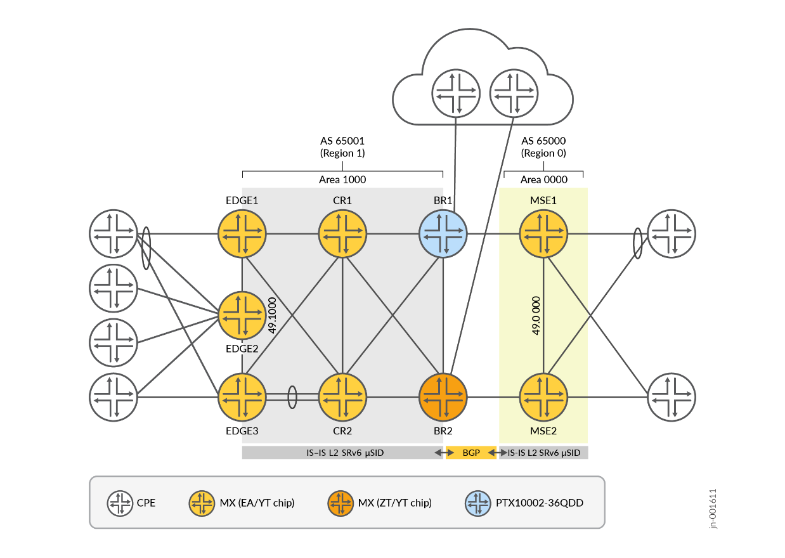
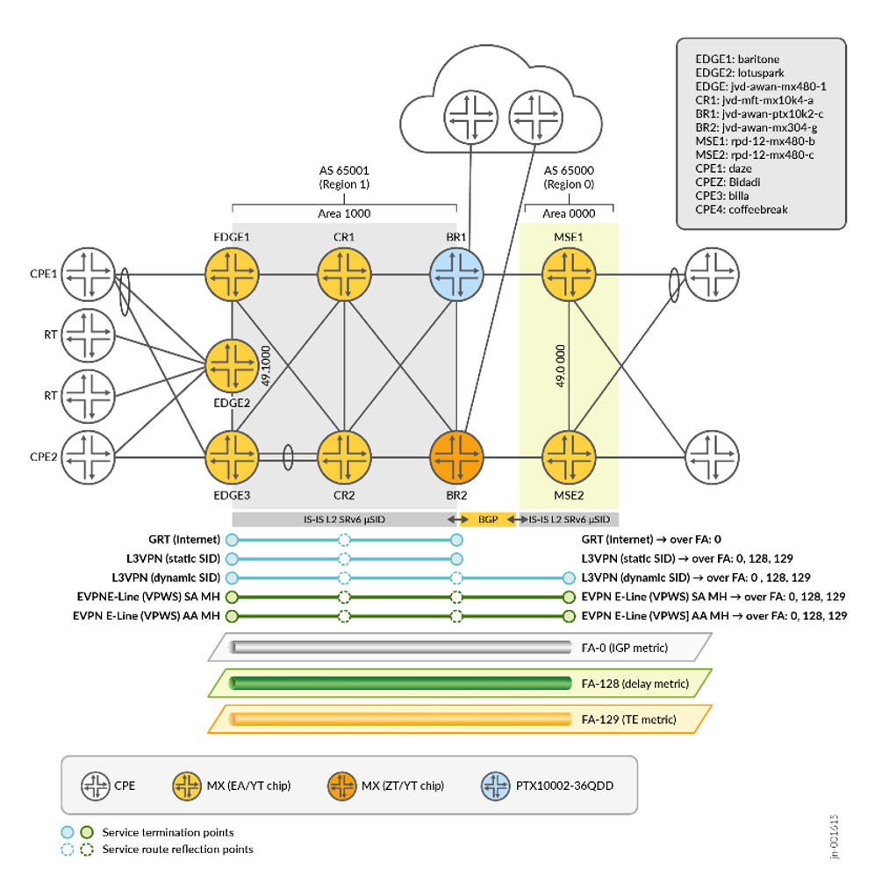
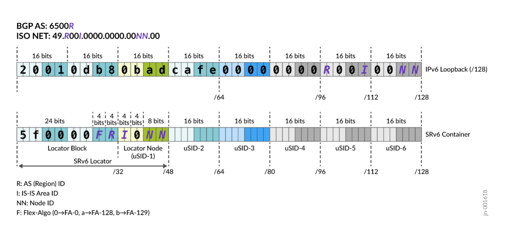
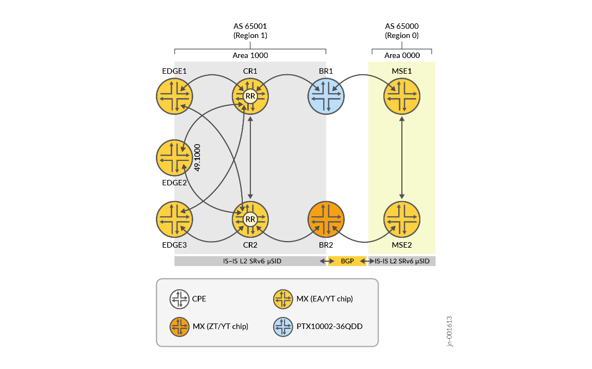
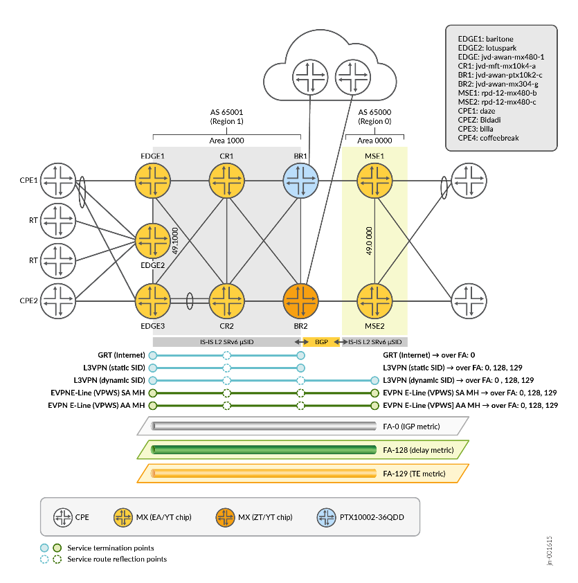
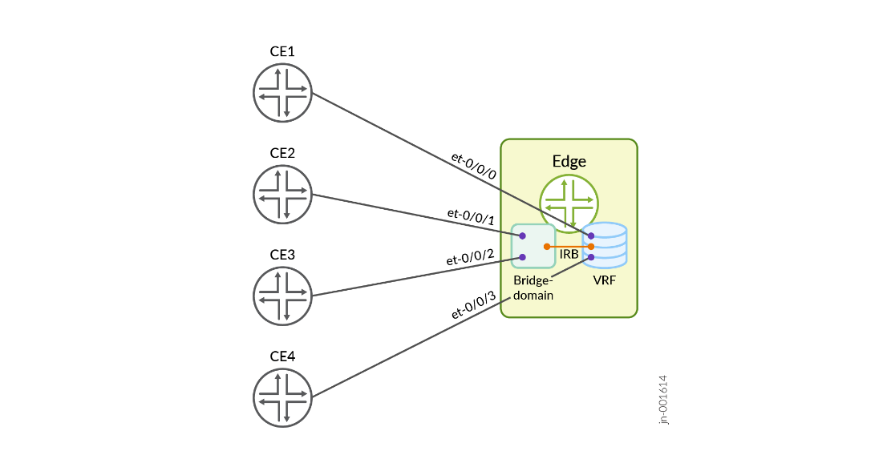

>
> Faithful markdown conversion of the published PDF:
> [Service Provider SRv6 Core and Edge — Juniper Validated Design (JVD)](https://www.juniper.net/documentation/us/en/software/jvd/jvd-sp-core-edge-srv6-01-01/index.html).
> The PDF on juniper.net is the source of truth. The complete per-device Test Bed
> Device Configuration is reproduced inline below; the same configs also live in
> [`../configuration/conf/`](../configuration/conf/) and the
> [snip library](../configuration/snips/).

# Service Provider SRv6 Core and Edge — Juniper Validated Design (JVD)

Juniper Networks Validated Designs provide you with a comprehensive, end-to-end
blueprint for deploying Juniper solutions in your network. These designs are
created by Juniper's expert engineers and tested to ensure they meet your
requirements. Using a validated design, you can reduce the risk of costly
mistakes, save time and money, and ensure that your network is optimized for
maximum performance.

## About this Document

This Juniper Validated Design (JVD) details an SRv6 Core and Edge that are used
for the transport of L3 and L2 business services in a Service Provider (SP)
network.

This JVD provides a high-level description and outlines requirements for a
service provider network using SRv6 with Segment Identifier (SID) compression
based on NEXT-CSID (also called micro-SID or simply µSID) as the underlying
transport. The JVD solution validation uses a phased approach, with each phase
adding additional functional scope and new platforms. The scope of this JVD is
limited to the multi-domain network transport with multiple transport planes
realized through SRv6 Flex-Algo (without traffic engineering) and services, with
a focus on the Global Routing Table (GRT), L3VPN, and point-to-point L2 Services
(EVPN E-Line-VPWS).

The reference network design is used to validate Juniper Networks MX Series
Routers with Juniper Networks PTX Series Routers to support SRv6 network
deployments. This approach provides scale and performance.

## Solution Benefits

### SRv6-Based Transport Solution

Most of the service provider networks rely on Multiprotocol Label Switching
(MPLS) transport. MPLS transport is based on Label Distribution Protocol (LDP),
traffic engineering with Resource ReSerVation Protocol (RSVP), or newer
deployments that replace LDP or RSVP control plane for label distribution with
Interior Gateway Protocol (IGP) extension (Segment Routing). SRv6 is a new
transport mechanism that replaces MPLS encapsulation with IPv6 encapsulation. It
retains most MPLS benefits and adds new features to service provider networks.

With these capabilities, you can:

- **Increase network scalability:** SRv6 allows prefix aggregation or
  summarization at domain (autonomous system, area) boundaries. This is a
  powerful toolset for high-scale deployments in large networks, eliminating the
  need to exchange unique loopbacks or labels across domain boundaries.
- **Simplify operations:** Compared to LDP or RSVP, SRv6 reduces the number of
  protocols required to operate the network. You can move away from
  traffic-handling protocols like LDP or RSVP in underlay networks in favor of
  SRv6, where corresponding information is distributed through IS-IS extensions.
- **Reduce cost to serve:** SRv6 potentially enables unified encapsulation
  across all network segments, including data centers, access and aggregation
  networks, and wide area networks. Encapsulation conversion at domain
  boundaries (for example, between VxLAN in DC and MPLS in WAN) is no longer
  required. This approach reduces operational expenses (Opex) and capital
  expenditures (Capex) by simplifying DC gateways.
- **Improve the user experience:** SRv6 enables new use cases, such as Service
  Function Chaining (SFC) and multi-topology routing with SRv6 Flexible
  Algorithms.

## Use Case and Reference Architecture

The modern service provider networks have two main segments referred to as core
and edge (Figure 1). The solution uses a reference design that implements core
and edge segments within a single flat IS-IS Level 2 domain, using the default
IS-IS instance. Additionally, the Multi-Service Edge (MSE) service complex is
placed in a separate domain, with BGP-only reachability.


*Figure 1: Juniper SRv6 Solution Architecture.*

Appropriate redistribution policies, with or without summarization, are
provisioned between an IS-IS and a BGP domain to provide end-to-end IPv6
connectivity between loopbacks and locators.

The reference architecture deploys an infrastructure designed to support
traditional service provider topologies with edge services termination.

The major components under consideration include:

- SP reference architectures
- Seamless Segment Routing across SP edge and core domains (Inter-AS BGP + SRv6
  locator redistribution/summarization between domains)
- Fast failover and detection TI-LFA, MLA, BFD, ECMP, and so on.
- SRv6 SID with IS-IS
- Flex-Algo Application Specific Link Attribute (ASLA) TE and Delay metrics
- Flex-Algo Prefix Metric (FAPM)
- Transport Classes
- Strict and Cascade Transport Class Resolution schemes Inter-AS BGP Transport
- VPN Service Mapping to transport Flex-Algo
- Redundant Route Reflectors
- EVPN-VPWS with A/A and A/S Multihoming
- Inter-AS Option C
- TWAMP light for delay measurement

### Baseline Features

The baseline features required for this JVD include:

- SRv6 SID IS-IS, Flex-Algo (with dynamically measured delay metrics) IS-IS
- TI-LFA (link/node) IS-IS, MLA (micro-loop avoidance) IS-IS
- SRv6 µSID locator summarization IS-IS
- L3VPN (µDT4, µDT6, µDT46), EVPN-VPWS (µDX2)
- BGP, BFD, Community-based Routing Policy, Route Reflection, IPv4, IPv6
- LACP, AE, VLAN (802.1q)

## Validation Framework

This JVD addresses the network modernization that includes a new SRv6 transport
approach for scalable and resilient transport. One key aspect of the overall
solution is enabling flexibility to support heterogeneous customer architectures
within the same validated design. Key technical attributes include:

- Basic SRv6 µSID transport (with Flex-Algo but without SRv6-TE)
- Basic SRv6 µSID services (L3VPN and EVPN E-Line with Flex-Algo and
  multi-homing)
- L3VPN with direct PE-CE interfaces, as well as with IRB as PE-CE interface
- TI-LFA/MLA with dynamic and static µA (Adj-SID)
- SRv6 L3VPN and EVPN E-Line (VPWS) service resolution over non-ISIS routes
  (SRv6 dynamic tunnels)

Table 1 shows details of devices used in the lab environment.

### Table 1: Devices Under Test

| Tag | Role | Platform | Line card | Chip | OS |
|-----|------|----------|-----------|------|-----|
| R0 | EDGE1 | MX480 | MPC7E 3D 40XGE | Trio 4 (EA, µkernel) | Junos OS 24.4R2 |
| R1 | EDGE2 | MX480 | MPC7E 3D 40XGE | Trio 4 (EA, µkernel) | Junos OS 24.4R2 |
| R2 | EDGE3 | MX480 | MPC10E 3D MRATE-15xQSFPP | Trio 5 (ZT, AFT) | Junos OS 24.4R2 |
| R3 | CR1 | MX10004 | JNP10K-LC9600 | Trio 6 (YT, AFT) | Junos OS 24.4R2 |
| R4 | CR2 | MX2010 | MPC11E 3D MRATE-40xQSFPP | Trio 5 (ZT, AFT) | Junos OS 24.4R2 |
| R5 | BR1 | PTX10002-36QDD | N/A | Express 5 (BX) | Junos OS Evolved 24.4R2 |
| R6 | BR2 | MX304 | LMIC | Trio 6 (YT, AFT) | Junos OS 24.4R2 |
| R7 | MSE1 | MX480 | MPC10E 3D MRATE-10xQSFPP | Trio 5 (ZT, AFT) | Junos OS 24.4R2 |
| R8 | MSE2 | MX304 | LMIC | Trio 6 (YT, AFT) | Junos OS 24.4R2 |
| R9 | CPE1 | MX240 | N/A | N/A | Junos OS 24.4R2 |
| R10 | CPE2 | MX240 | N/A | N/A | Junos OS 24.4R2 |
| R11 | CPE3 | MX240 | N/A | N/A | Junos OS 24.4R2 |
| R12 | CPE4 | MX240 | N/A | N/A | Junos OS 24.4R2 |
| RT0 | Traffic Generator | IXIA | N/A | N/A | IxOS 9.3.0 |

## Test Objectives

### Test Goals

The test goals and deliverables are:

- Validate solutions through incremental testing efforts or test profiles.
- Identify and close solution gaps to ensure completeness.
- Build and deliver full test reports and design recommendations for network
  engineers implementing this solution.
- Provide configuration details, design, and implementation guidance for
  validated use cases.

The solution delivers SRv6 µSID-based transport architecture. These
architectures include features like Flex-Algo Prefix Metric (FAPM) and use
inter-domain designs with SRv6 locator summarization and Transport Classes for
end-to-end multi-domain service mapping.

This SRv6 µSID infrastructure provides L2 (different EVPN variants) and L3
Services.

Other JVD solutions delivered as part of an existing Metro JVD track are:

- **Metro Ethernet Business Services — Juniper Validated Design (JVD):**
  Leveraging metro fabric design concepts to support wholesale service delivery
  mechanisms.
- **Low-Latency QoS Design for 5G:** Support differentiated workloads with an
  advanced low-latency CoS model.
- **5G xHaul CSR Seamless Segment Routing — Juniper Validated Design (JVD):**
  Using fronthaul access and aggregation principles.
- **5G Fronthaul Class of Service — Juniper Validated Design (JVD):** Applying
  Class of Service modelling for access and aggregation architectures.

### Test Non-Goals

The test non-goals are:

- More advanced SRv6 µSID transport options (SRv6-TE)
- IS-IS Multi-instance with Instance ID TLV (TLV #7)
- Service enhancements (EVPN E-LAN, EVPN-VPWS PWHT) over SRv6
- MPLS to µSRv6 migration strategies and interworking functions
- SRv6 classic SID and SRv6 µSID migration or co-existence
- SRv6 EVPN E-LAN service resolution over non-ISIS routes (SRv6 dynamic tunnels)
- Unreachable Prefix Announcement (UPA)
- FBF or CBF (filter-based forwarding, class-based forwarding) over Flex-Algo and
  SRv6-TE
- Class-of-Service (CoS)
- Network Slicing with SRv6
- SRv6-TE with external controller (using PCEP)
- Colored service resolution with resolution fallback
- FRR-style backup across multiple IS-IS domains
- MVPN in SRv6 networks
- High-availability features for SRv6, such as Graceful Restart (GR), Graceful
  Routing Engine Switchover (GRES), and Non-Stop Active Routing (NSR)
- BGP only (no IGP) IPv6 fabrics (i.e., DC fabric with SRv6 underlay)
- Protocol-less (no BGP or IGP) IPv6 fabric with µN and µA configured statically
  by an external controller

## Solution Architecture

### JVD Lab Topology


*Figure 2: SRv6 JVD Lab Topology.*

### Platform Positioning

This JVD is evaluated and validated on the following platforms.

> **NOTE:** The Devices Under Test (DUT) are used with helper devices. However,
> the helper device's functionality is not evaluated. They facilitate test
> execution.

- **Edge Node:**
  - EDGE1 (DUT) – MX480 with MPC7E 3D 40XGE (Trio 4: EA chip)
  - EDGE2 (DUT) – MX480 with MPC7E 3D 40XGE (Trio 4: EA chip)
  - EDGE3 (DUT) – MX480 with MPC10E 3D MRATE-15xQSFPP (Trio 5: ZT chip)
- **Core Router:**
  - CR1 (DUT) – MX10004 with JNP10K-LC9600 (Trio 6: YT chip)
  - CR2 (DUT) – MX2010 with MPC11E 3D MRATE-40xQSFPP (Trio 5: ZT chip)
- **Border Router:**
  - BR1 (DUT) – PTX10002-36QDD (Express 5: BX chip)
  - BR2 (DUT) – MX304 (Trio 6: YT chip)
- **Multi-Service Edge:**
  - MSE1 (DUT) – MX480 with MPC10E 3D MRATE-10xQSFPP (Trio 5: ZT chip)
  - MSE2 (DUT) – MX304 (Trio 6: YT chip)
- **Customer Premises Equipment:**
  - CPE1 (Helper) – MX240
  - CPE2 (Helper) – MX240
  - CPE3 (Helper) – MX240
  - CPE4 (Helper) – MX240
- **RT** – IXIA (Helper) Tester device is used to generate traffic flow and
  increase network scale

### Network Architecture

The network architecture of this JVD aligns with typical service provider
architecture, where the network is divided into multiple domains. Domains in
this SRv6 JVD use Autonomous Systems, with prefix leaking or summarization
between domains.

### Addressing Scheme

This JVD uses IPv6 infrastructure addresses exclusively. No IPv4 infrastructure
addresses are configured (i.e., no IPv4 addresses on loopbacks or links). IPv4
addressing might be present in the VPN context only (i.e., on PE-CE links, or on
loopbacks within VRFs), to validate that both IPv4 and IPv6 VPNs can be
transported across IPv6-only SRv6 underlay transport. 4-byte (32-bit)
identifiers are used for Router ID, BGP Cluster ID, as well as BGP Route
Distinguishers.

To minimize operational and management efforts, IPv6 Link Local Addressing (LLA)
is used in this JVD. Therefore, no global IPv6 link addresses are assigned. On
the other hand, for loopbacks, SRv6 locator blocks and SRv6 locators, a
well-organized, structured IPv6 addressing scheme is used. Similarly, IS-IS area
IDs and BGP autonomous systems use structured numbering schemes. SRv6 locators
use the IANA-assigned prefix 5f00::/16 (RFC 9602). There are many possible ways
for such allocation. The allocation might differ from deployment to deployment,
depending on actual requirements. Figure 3 outlines the example allocation used
in the JVD.


*Figure 3: SRv6-JVD Addressing Scheme.*

### IS-IS

Main characteristics of IS-IS are:

- IS-IS type point-to-point (P2P) links use IPv6 Link Local Address (LLA)
  addressing. No global IPv6 addresses appear on links.
- All links use an increased MTU (IFD MTU: 9192, inet6/iso MTU: 9106).
- IFD hold-timers (Juniper Networks MX Series Routers, Juniper Networks PTX
  Series Routers) and IFD exponential damping (MX Series, PTX Series) are enabled
  to suppress interface flapping, minimizing IS-IS churn when interface flaps
- IS-IS Level 2 with wide metrics is only used. Level 1 is disabled throughout
  the network.
- Only IS-IS Hello packets are sent with maximum MTU (strict Hello padding) to
  continuously verify MTU availability. Remaining IS-IS packets (LSP, CSNP, PSNP)
  use a standard maximum size of 1492 octets.
- IPv6 unicast topology is explicitly enabled. Enabling separate topologies is
  beneficial in migration scenarios that support both IPv4 (MPLS) and IPv6
  (SRv6). Using separate IPv4 unicast topology (which is the default topology)
  and IPv6 unicast topology (explicitly configured topology) support
  non-congruent networks (some links are only IPv4, some links only IPv6, some
  links both IPv4 and IPv6).

  > **NOTE:** In this JVD, IPv4 is not used.

- Overload metrics (for IS-IS neighbors and internal or external prefixes) with a
  timeout are enabled. When the routing process restarts, high metrics are
  advertised until the configured timeout expires.
- ISO NET addresses are configured in each IS-IS process (no ISO NET addressing
  on loopbacks).
- Topology Independent Loop Free Alternates (TI-LFA) is enabled (both link and
  node protection) with 'soft' node-protection flavor (i.e., during backup path
  calculation, instead of removing the protected node from the topology, link
  metrics to the protected node are increased to the MAX-1 value).
- Micro-Loop Avoidance (MLA) is enabled with default timer settings.
- IS-IS adjacencies are protected with BFD. On aggregated interfaces (LAG),
  instead of using BFD to protect IS-IS adjacencies, per-member link BFD sessions
  are used to protect LACP (micro-BFD).
- Both Hello and LSP authentication are deployed, using the HMAC-SHA-1
  authentication algorithm and the IS-IS enhanced option.
- Each link has three metrics:
  - IGP metric (derived automatically from reference bandwidth 1 Tbps)
  - TE metric (manually configured)
  - Delay metrics (based on dynamically measured link delay through a Two-Way
    Active Measurement Protocol - TWAMP light)
- TWAMP light server uses the following timestamping methods, available in Junos
  OS Release 24.2, to achieve the highest possible accuracy (TWAMP light client
  for link delay measurements always use packetIO timestamp):
  - Juniper Networks PTX Series Routers: PFE timestamping (medium accuracy)
  - Juniper Networks MX Series Routers: mKernel or packetIO, depending on the
    line card (low accuracy)
- TE and delay metrics are distributed using Application Specific Link Attribute
  (ASLA) TLV for the Flex-Algo application.
- Three Flex-Algos are deployed across the network:
  - Flex-Algo 0: using IGP metrics (this is the default Flex-Algo)
  - Flex-Algo 128: using delay metrics
  - Flex-Algo 129: using TE metrics
- Each Flex-Algo has its own Node (µN) and unprotected adjacency SIDs (µA). In
  the core domain, static unprotected adjacency SID are used (the same value is
  used across reboots).
- IS-IS uses export policy to export specific prefixes with specific IS-IS tags,
  as outlined in Table 2. Using IS-IS tags simplifies IS-IS import export
  policies.
- IS-IS uses an import policy to set the FIB installation priority (loopbacks and
  locators are high), and to enable or disable backup path calculation for
  specific prefix groups.
- A maximum limit (for example, 3000 prefixes) of redistributed prefixes is set
  to avoid overflowing the IS-IS database with a large number of prefixes that
  might be redistributed accidentally. When the limit of redistributed prefixes
  is reached, IS-IS does not enter the overload state but stops the
  redistribution of additional prefixes.
- To avoid accidental redistribution into IS-IS from other routing protocols,
  when users modify IS-IS export policies, redistribution from BGP, OSPF, and
  static is explicitly disabled.

#### Table 2: IS-IS Tags

| Value | Type | Synopsis |
|-------|------|----------|
| 101 | tag1 | SRv6 Locators |
| 102 | tag1 | Loopbacks |
| 103 | tag1 | Links |
| 201 | tag1 | SRv6 locator aggregate |
| 202 | tag1 | Loopback aggregate |

### BGP

In Figure 4, the BGP design is based on a classical router-reflector design,
with CR nodes functioning as a pair of BGP route reflectors.


*Figure 4: SRv6-JVD BGP Design.*

Main characteristics of BGP:

- BGP uses an external Router ID as a tiebreaker for path selection
- The system advertises local service routers from the main routing table (not
  from the service routing tables)
- BGP export policies apply to exported local service prefixes
- BGP uses precision timers
- BGP uses BGP error tolerance extensions
- BGP uses multi-path list next-hop structures
- BGP uses RFC 8950-compliant IPv6 next hop encoding for IPv4 NRLIs (AFI=1) to
  allow interoperability with 3rd party vendors
- TCP Authentication Option (AO) is enabled on all the BGP sessions
- TCP Maximum Segment Size (MSS) increased for better BGP packing
- Single-hop eBGP sessions, like single-hop IS-IS adjacencies, are protected with
  BFD
- BGP exchanges SRv6 locator summaries and loopback summaries between AS's and
  redistributes them into IS-IS
- Network Layer Reachability Information (NLRIs) are enabled on BGP sessions, as
  per Table 3

#### Table 3: BGP NLRIs

| NLRI Name | AFI/SAFI | Edge | CR | BR | MSE |
|-----------|----------|------|----|----|-----|
| IPv4 unicast | 1/1 | ✔ | ✔ | ✔ | |
| IPv6 unicast | 2/1 | ✔ | ✔ | ✔ | ✔ |
| VPN IPv4 unicast | 1/128 | ✔ | ✔ | ✔ | ✔ |
| VPN IPv6 unicast | 2/128 | ✔ | ✔ | ✔ | ✔ |
| EVPN | 25/70 | ✔ | ✔ | | ✔ |
| RT constraints | 1/132 | ✔ | ✔ | ✔ | ✔ |

RT constraints NLRI has disabled next-hop resolution. This NLRI is pure
control-plane NLRI, not used for forwarding, therefore does not require next-hop
resolution for forwarding. Disabling next-hop resolution for this NRLI slightly
improves BGP convergence by always accepting the NLRI, regardless of the
next-hop status (reachable or not).

All other NLRIs are enabled to accept or send SRv6 service SIDs.

On BGP route reflectors, there are small changes in BGP settings compared to
other routers. The changes in BGP settings are:

- next-hop resolution is disabled for all NLRIs (RRs reflect NLRIs regardless of
  whether the next-hop is reachable or not. This approach improves overall BGP
  convergence.)
- RT constraints NLRI advertises a default RT constraint (for example, send me
  all prefixes, regardless of RT)

eBGP sessions between regions exchange loopback summaries and SRv6 locators
between regions and carry RT constraints and Service NLRIs. The receiving
Autonomous System Boundary Routers (ASBRs) generate SRv6 locator summaries.
These eBGP sessions terminate on global IPv6 addresses of links that interconnect
regions. For proper SRv6 next-hop resolution with dynamic tunnels, configure the
eBGP sessions as multi-hop, and ensure that next-hop remains unchanged (classical
Option C architecture).

### Services

Multiple services are implemented at the top of the network, as outlined in
Figure 5.


*Figure 5: SRv6 Services.*

The types of traffic flows represented in the topology include:

- **Global Routing Table (GRT)** between EDGE and BR that carry IPv4 and IPv6
  Internet routes, using dynamically allocated µDT46 service SID (single-service
  SID for all routes). GRT traffic uses only the default Flex-Algo (Flex-Algo 0)
  as a transport underlay.
- **L3VPN (SAFI=128)** between EDGE and BR that carry IPv4 and IPv6 VPN traffic
  uses per-VRF manually assigned µDT46 service SID. Each VRF maps to a specific
  Flex-Algo underlay by deriving per-VRF service SID from the SRv6 locator
  associated with the given Flex-Algo. A small set of prefixes within the VRF has
  a per-prefix, manually assigned µDT46 service SID. The SID is derived from a
  different SRv6 locator to map these prefixes to a different Flex-Algo underlay.
- **L3VPN (SAFI=128)** between EDGE, BR, and MSE that carry IPv4 and IPv6 VPN
  traffic, use per-VRF, dynamically assigned µDT46 service SID. Each VRF maps to a
  specific Flex-Algo underlay by deriving the per-VRF service SID from SRv6
  locator associated with the given Flex-Algo. A small set of selected prefixes
  within the VRF has a per-prefix, dynamically assigned µDT46 service SID, derived
  from a different SRv6 locator to map these prefixes to a different Flex-Algo
  underlay. The MSE L3VPN service requires SRv6 SID resolution through a locator
  prefix announced by BGP. These prefixes do not have an IS-IS SRv6 locator TLV,
  so the SRv6 SID resolution fails. The MSE implements the SRv6 dynamic-tunnel
  feature to allow SRv6 SID resolution without IS-IS SRv6 locator TLV.
- **EVPN E-Line (VPWS)** with single-active multihoming between EDGE and MSE uses
  statically and dynamically assigned µDX2 service SID. Each E-Line maps to a
  specific Flex-Algo underlay by deriving service SIDs from the SRv6 locator
  associated with the given Flex-Algo.
- **EVPN E-Line (VPWS)** with all-active multi-homing between EDGE and MSE uses
  statically and dynamically assigned µDX2 service SID. Each E-Line maps to a
  specific Flex-Algo underlay by deriving service SIDs from the SRv6 locator
  associated with the given Flex-Algo.

L3VPN might have direct PE-CE interfaces, as well as IRB as PE-CE interfaces, as
outlined in Figure 6.


*Figure 6: VRF with IRB.*

### Solution Validation Requirements

This JVD validates an end-to-end network architecture and design using SRv6
underlay with GRT, L3VPN, and EVPN E-Line services at scale under multiple stress
conditions to emulate Business as Usual Operations (BAU OPS).

- Validate Global Routing Table (GRT) IPv4 and IPv6 internet routes, using
  dynamically allocated µDT46 service SID (single service SID for all routes)
- Validate L3VPN (SAFI=128) carrying IPv4 and IPv6 VPN traffic, using per-VRF,
  statically (manually) or dynamically assigned µDT46 service SID
- Validate IRB interface as a PE-CE interface in an SRv6-based L3VPN
- Validate dynamic tunnel creation to aid next-hop resolution of L3VPN prefixes
  without the presence of an IS-IS SRv6 Locator TLV
- Validate EVPN E-Line (VPWS) with single-active and all-active multihoming using
  statically (manually) and dynamically assigned µDX2 service SID
- Validate per instance SRv6 locator-based mapping of L3VPN and EVPN E-Line
  (VPWS) services to different SRv6 Flex-Algos
- Validate per prefix SRv6 locator-based mapping of L3VPN prefixes to different
  SRv6 Flex-Algos

### Key Measurements

As a part of JVD testing, record the following items under the scaled
environment.

- Link failure event (should be ≤50ms)
- Link restoration event (should be ≤50ms)

## Test Bed Device Configuration

Repetitive configuration of interface settings, BGP groups settings, and VRF
settings are grouped into apply-groups, so that the same set of settings
(inherited from the apply-group) are applied.

### Apply-Groups

#### Apply-Groups for Interfaces

```junos
  groups {
      GR-CORE-INTF-IPV6 {
           interfaces {
               <*> {
                   description ****GR-CORE-INTF-SETTINGS-APPLIED-ADD-DESCRIPTION****;
                   traps;
                   mtu 9192;
                   hold-time up 2000 down 0;
                   damping {             # Interface damping supported on MX and PTX only
                        half-life 30;
                        max-suppress 600;
                        reuse 250;
                        suppress 2000;
                        enable;
                   }
                   unit 0 {
                        traps;
                        family iso {
                            mtu 9106;
                        }
                        family inet6 {
                            mtu 9106;
                        }
                   }
               }


        <ae*> {
            aggregated-ether-options {
                bfd-liveness-detection {
                    version automatic;
                    minimum-interval 50;
                    multiplier 3;
                    no-adaptation;
                }
                lacp {
                    active;
                    accept-data;            # LACP accept-data supported on MX only
                    hold-time up 2;
                }
            }
        }
        /* Interface types: et-, ge-, xe- */
        "<[egx][te]-*>" {
            optics-options {
                alarm low-light-alarm {
                    link-down;
                }
                warning low-light-warning {
                    syslog;
                }
            }
        }
    }
}
GR-CORE-INTF-LAG-MEMBER {
    interfaces {
        <*> {
            description **GR-CORE-INTF-LAG-MEMBER-SETTINGS-APPLIED-ADD-DESCRIPTION**;
            traps;
            hold-time up 2000 down 0;
            damping {             # Interface damping supported on MX and PTX only
                half-life 30;
                max-suppress 600;
                reuse 250;
                suppress 2000;
                enable;
            }
            optics-options {
                alarm low-light-alarm {


                    link-down;
                }
                warning low-light-warning {
                    syslog;
                }
            }
        }
    }
}
GR-EDGE-INTF {                             # Group not required on CR
    interfaces {
        <*> {
            description ****GR-EDGE-INTF-SETTINGS-APPLIED-ADD-DESCRIPTION****;
            traps;
            flexible-vlan-tagging;
            mtu 9102;
            hold-time up 180000 down 0;
            damping {              # Interface damping supported on MX and PTX only
                 half-life 30;
                 max-suppress 600;
                 reuse 250;
                 suppress 2000;
                 enable;
            }
            encapsulation flexible-ethernet-services;
        }
        <ae*> {
            aggregated-ether-options {
                 lacp {
                     active;
                     accept-data;     # LACP accept-data supported on MX only
                     hold-time up 2;
                 }
            }
        }
        "<[egx][te]-*>" {
            optics-options {
                alarm low-light-alarm {
                    link-down;
                }
                warning low-light-warning {
                    syslog;
                }


             }
         }
     }
 }
 GR-EDGE-INTF-LAG-MEMBER {                              # Group not required on CR
     interfaces {
         <*> {
             traps;
             hold-time up 180000 down 0;
             damping {              # Interface damping supported on MX and PTX only
                  half-life 30;
                  max-suppress 600;
                  reuse 250;
                  suppress 2000;
                  enable;
             }
             optics-options {
                  alarm low-light-alarm {
                      link-down;
                  }
                  warning low-light-warning {
                      syslog;
                  }
             }
         }
     }
 }
GR-INTER-AS-INTF-IPV6 {           # Group required on BR and MSE only
     interfaces {
         <*> {
             description ****GR-CORE-INTF-SETTINGS-APPLIED-ADD-DESCRIPTION****;
             traps;
             mtu 9192;
             hold-time up 2000 down 0;
             damping {
                 half-life 30;
                 max-suppress 600;
                 reuse 250;
                 suppress 2000;
                 enable;
             }
             unit 0 {
                 traps;


                     family inet6 {
                         mtu 9106;
                     }
                 }
             }
             <ae*> {
                 aggregated-ether-options {
                     bfd-liveness-detection {
                         version automatic;
                         minimum-interval 50;
                         multiplier 3;
                         no-adaptation;
                     }
                     lacp {
                         active;
                         accept-data;         # LACP accept-data supported on MX only
                         hold-time up 2;
                     }
                 }
             }
             /* Interface types: et-, ge-, xe- */
             "<[egx][te]-*>" {
                 optics-options {
                     alarm low-light-alarm {
                         link-down;
                     }
                     warning low-light-warning {
                         syslog;
                     }
                 }
             }
         }
     }
 }
```

#### Apply-Groups for Protocols

```junos
               groups {
                  GR-ISIS-IPV6 {
                      protocols {


     isis {
         /* Interface types: ae, et-, ge-, xe-; not included: lo0 */
         interface <*e*> {
             level 1 disable;
             level 2 {
                 srv6-adjacency-segment {
                     unprotected {
                         locator SL-FA-000 {
                              micro-adjacency-sid;
                         }
                         locator SL-FA-128 {
                              micro-adjacency-sid;
                         }
                         locator SL-FA-129 {
                              micro-adjacency-sid;
                         }
                     }
                 }
                 post-convergence-lfa {
                     node-protection cost 16777214;
                 }
                 application-specific {
                     attribute-group LA-FA {
                         advertise-delay-metric;
                         te-metric 1000;            # Default TE metric. Can
be
                         application {             # overridden on interface
                             flex-algorithm;
                         }
                     }
                 }
                 hello-authentication-key-chain KC-ISIS;
             }
             delay-measurement;
             hello-padding strict;
             point-to-point;
         }
         /* Interface types: et-, ge-, xe- */
         interface "<[egx][te]-*>" {
             family inet6 {
                 bfd-liveness-detection {
                     minimum-interval 50;
                     multiplier 3;


                            no-adaptation;
                        }
                    }
                }
                interface lo0.0 {
                    level 1 disable;
                    passive;
                }
            }
        }
    }
    GR-BGP {
        protocols {
             bgp {
                 group <GR-IBGP-*> {
                     type internal;
                     authentication-algorithm ao;
                     authentication-key-chain KC-BGP;
                     multipath;
                     tcp-mss 4096;
                 }
                 group <GR-EBGP-*> {          # This group required on BR and MSE only
                     type external;
                     authentication-algorithm ao;
                     authentication-key-chain KC-EBGP;
                     multipath;
                     tcp-mss 4096;
                     bfd-liveness-detection {
                         minimum-interval 50;
                         multiplier 3;
                         no-adaptation;
                     }
                 }
             }
        }
    }
}
```

#### Other Apply-Groups

```junos
groups {
    GR-L3VPN {                                         # Group not needed on CR
         routing-instances {
             <*> {
                 instance-type vrf;
                 routing-options {
                     static {
                         route 0.0.0.0/0 {
                              discard;
                              retain;
                              no-readvertise;
                              preference 4294967295;
                         }
                     }
                     protect {
                         core;
                     }
                 }
                 vrf-table-label;
             }
         }
    }
    GR-SRV6 {
         routing-options {
             source-packet-routing {
                 srv6 {
                     locator <SL-*> {
                         micro-sid {
                              flavor {
                                  psp;
                                  usp;
                                  usd;
                              }
                         }
                     }
                }
            }
        }


    }
}
```

### Interfaces

#### Loopbacks

```junos
interfaces {
    lo0 {
        unit 0 {
             family inet6 {
                 address $LOCAL_IPV6_LOOPBACK_ADDRESS;
             }
        }
        unit $IFL {             # These IFLs required on AN, AG, BR and MSE
             family <inet|inet6> {
                 address $VPN_LOOPBACK_IP_ADDRESS;
             }
        }
    }
}
```

#### Unbundled WAN Interfaces

```junos
interfaces {
    $IFD {
        apply-groups GR-CORE-INTF-IPV6;
        description $DESCRIPTION;
    }
}
```

#### Bundled WAN Interfaces

```junos
interfaces {
    $IFD {
        apply-groups GR-CORE-INTF-LAG-MEMBER;


        description $DESCRIPTION;
        ether-options {
            802.3ad ae$AE_ID;
        }
    }
    ae$AE_ID {
        apply-groups GR-CORE-INTF-IPV6;
        description $DESCRIPTION;
        aggregated-ether-options {
            bfd-liveness-detection {
                neighbor $NEIGHBOR_IPV6_LOOPBACK_ADDRESS;
                local-address $LOCAL_IPV6_LOOPBACK_ADDRESS;
            }
        }
    }
}
```

#### Unbundled Edge Interfaces

```junos
interfaces {
    $IFD {
        apply-groups GR-EDGE-INTF;
        description $DESCRIPTION;
        unit $IFL {
             vlan-id $VLAN_ID;
             <other service specific parameters>
        }
    }
}
```

#### Bundled Edge Interfaces

```junos
interfaces {
    $IFD {
        apply-groups GR-EDGE-INTF-LAG-MEMBER;
        description $DESCRIPTION;
        ether-options {
             802.3ad ae$AE_ID;
        }
    }


     ae$AE_ID {
         apply-groups GR-EDGE-INTF;
         description $DESCRIPTION;
         unit $IFL {
             vlan-id $VLAN_ID;
             <other service specific parameters>
         }
     }
 }
```

#### Inter-region Interfaces

```junos
interfaces {
    $IFD {
        apply-groups GR-INTER-AS-INTF-IPV6;
        description $DESCRIPTION;
        unit 0 {
             family inet6 {
                 address $INTER_REGION_LINK_GLOBAL_ADDRESS;
             }
        }
    }
}
```

### IS-IS

#### IS-IS on CR Routers

```junos
  routing-options {
      flex-algorithm 128 {
          use-transport-class {
              inet3-install;
          }
      }
      flex-algorithm 129 {
          use-transport-class {
              inet3-install;
          }


}
source-packet-routing {
    srv6 {
        apply-groups GR-SRV6;
        block SB-FA-000 {
            5f00:1::/32;
            local-micro-sid {
                maximum-static-sids 2000;
            }
        }
        block SB-FA-128 {
            5f00:a1::/32;
            local-micro-sid {
                maximum-static-sids 2000;
            }
        }
        block SB-FA-129 {
            5f00:b1::/32;
            local-micro-sid {
                maximum-static-sids 2000;
            }
        }
        locator SL-FA-000 {
            5f00:1:6048::/48;           # Example for node 48, in region 1, area 6
            micro-sid {
                block-name SB-FA-000;
            }
        }
        locator SL-FA-128 {
            algorithm 128;
            5f00:a1:6048::/48;          # Example for node 48, in region 1, area 6
            micro-sid {
                block-name SB-FA-128;
            }
        }
        locator SL-FA-129 {
            algorithm 129;
            5f00:b1:6048::/48;          # Example for node 48, in region 1, area 6
            micro-sid {
                block-name SB-FA-129;
            }
        }
    }


    }
    router-id $ROUTER_ID;
    ipv6-router-id $LOCAL_IPV6_LOOPBACK_ADDRESS;
    transport-class {
        auto-create;
        name TC-128 {
            color 128;
        }
        name TC-129 {
            color 129;
        }
    }
    nonstop-routing;
    forwarding-table {
        export PS-LOAD-BALANCE;
    }
}
services {
    <rpm|monitoring> {                           # MX: rpm, PTX: monitoring
        twamp {
            server {
                 authentication-mode none;       # Configuration supported only on MX
                 light {
                     offload-type pfe-timestamp; # Configuration supported only on PTX
                 }
            }
        }
    }
}
policy-options {
    policy-statement PS-ISIS-EXPORT {
        term TR-OOB-MANAGEMENT {
            from interface [ em0.0 fxp0.0 re0:mgmt-0.0 ];
            then reject;
        }
        term TR-LOCAL-LOOPBACK-IPV6 {
            from {
                family inet6;
                protocol direct;
                interface lo0.0;
            }
            then {
                tag 102;


                accept;
            }
        }
        then reject;
    }
    policy-statement PS-ISIS-IMPORT {
        term TR-HIGH {
             from tag 101;
             then {
                 priority high;
                 accept;
             }
        }
        term TR-HIGH-LOCATORS {
             from {
                 route-filter 5f00::/24 prefix-length-range /36-/48;
             }
             then {
                 priority high;
                 accept;
           }
        }
        term TR-MEDIUM {
             from tag 102;
             then {
                 priority medium;
                 accept;
             }
        }
        term LOW {
             then {
                 priority low;
                 no-backup;
                 accept;
             }
        }
    }
    policy-statement PS-LOAD-BALANCE {
        then {
            load-balance per-flow;
        }
    }
}


security {
    authentication-key-chains {
        key-chain KC-ISIS {
            key 1 {
                secret "$ENCRYPTED_KEY"; ## SECRET-DATA
                start-time "2016-12-31.16:00:00 -0800";
                algorithm hmac-sha-1;
                options isis-enhanced;
            }
        }
    }
}
protocols {
    isis {
        apply-groups GR-ISIS-IPV6;
        interface $IFL {                         # static uA only in CR, BR, and EDGE
            level 2 {                            # (default IS-IS instance) routers.
                srv6-adjacency-segment {
                     unprotected {
                         locator SL-FA-$FA-ID {
                             micro-adjacency-sid {
                                 $SID_VALUE;
                             }
                         }
                     }
                }
            }
        }
        interface lo0.0 {
            passive;
        }
        source-packet-routing {
            flex-algorithm [ 128 129 ];
            no-strict-spf;
            srv6 {
                locator SL-FA-000 micro-node-sid;
                locator SL-FA-128 micro-node-sid;
                locator SL-FA-129 micro-node-sid;
            }
        }
        level 1 disable;
        level 2 {
            purge-originator empty;


              authentication-key-chain KC-ISIS;
              wide-metrics-only;
              prefix-export-limit 3000;
         }
         traceoptions {
             flag error detail;
             flag hello detail;
             file isis size 5m files 10 world-readable;
         }
         backup-spf-options {
             use-post-convergence-lfa maximum-backup-paths 2;
             use-source-packet-routing;
         }
         export PS-ISIS-EXPORT;
         import PS-ISIS-IMPORT;
         reference-bandwidth 4000g;
         lsp-lifetime 65535;
         max-hello-size 9106;
         no-ipv4-routing;
         no-external-export {
             protocol bgp;                        # BGP export must be allowed on MSE
             protocol ospf;
             protocol static;
         }
         topologies ipv6-unicast;
         overload {
             timeout 60;
             advertise-high-metrics;
             internal-prefixes;
             external-prefixes;
         }
         dynamic-overload no-overload-on-prefix-export-limit;
         net 49.$R00$I.0000.0000.00$NN.00;
     }
     esis {
         disable;                                  # Configuration supported only on MX
     }
 }
```

#### IS-IS on BR and MSE Routers

The BR and MSE routers are ASBR routers between regions. Therefore, there is a
single significant change in IS-IS configuration as compared to the Edge or CR
routers:

The BR and MSE routers either redistribute or summarize between regions;
therefore, they use different PS-ISIS-EXPORT policies.

The following are the changes in the IS-IS configuration on the MSE routers
(compared to the Edge or CR routers).

```junos
  routing-options {
      rib inet6.0 {
          aggregate {
              route 5f00:1::/32 {
                   tag 201;
                   tag2 1000;
                   preference 14;
                   discard;
              }
              route 5f00:a1::/32 {
                   tag 201;
                   tag2 1000;
                   preference 14;
                   discard;
                   algorithm 128;
              }
              route 5f00:b1::/32 {
                   tag 201;
                   tag2 1000;
                   preference 14;
                   discard;
                   algorithm 129;
              }
          }
      }
  }
  policy-options {
      policy-statement PS-ISIS-EXPORT {
          term TR-OOB-MANAGEMENT {
              from interface [ em0.0 fxp0.0 re0:mgmt-0.0 ];
              then reject;
          }
          term TR-LOCAL-LOOPBACK-IPV6 {
              from {


                family inet6;
                protocol direct;
                interface lo0.0;
            }
            then {
                tag 102;
                accept;
            }
        }
        term TR-REGION-1-LOOPBACK-SUMMARY-IPV6 {
             from {
                  family inet6;
                   protocol bgp;
                   community CM-LOOPBACK-65001;
               }
               then {
                   tag 202;
                   tag2 0;
                   accept;
               }
          }
          term TR-REGION-1-LOCATOR-SUMMARY-IPV6 {
             from {
                  family inet6;
                  protocol aggregate;
                  tag 201;
                  tag2 1000;
             }
             then {
                  advertise-locator;
                  accept;
             }
        }
        then reject;
    }
    community CM-LOOPBACK members 65001:10000;
}
```

The following are the changes in the IS-IS configuration on the BR routers
(compared to the Edge or CR routers).

```junos
  routing-options {
      rib inet6.0 {
          aggregate {
              route 5f00:0::/32 {
                   tag 201;
                   tag2 0;
                   preference 14;
                   discard;
              }
              route 5f00:a0::/32 {
                   tag 201;
                   tag2 0;
                   preference 14;
                   discard;
                   algorithm 128;
              }
              route 5f00:b0::/32 {
                   tag 201;
                   tag2 0;
                   preference 14;
                   discard;
                   algorithm 129;
              }
          }
      }
  }
  policy-options {
      policy-statement PS-ISIS-EXPORT {
          term TR-OOB-MANAGEMENT {
              from interface [ em0.0 fxp0.0 re0:mgmt-0.0 ];
              then reject;
          }
          term TR-LOCAL-LOOPBACK-IPV6 {
              from {
                   family inet6;
                  protocol direct;
                  interface lo0.0;
              }
              then {


                tag 102;
                accept;
            }
        }
        term TR-REGION-0-LOOPBACK-SUMMARY-IPV6 {
            from {
                family inet6;
                protocol bgp;
                community CM-LOOPBACK-65000;
            }
            then {
                tag 202;
                tag2 0;
                set-down-bit;
                accept;
            }
        }
        term TR-REGION-0-LOCATOR-SUMMARY-IPV6 {
            from {
                family inet6;
                protocol aggregate;
                tag 201;
                tag2 0;
            }
            then {
                advertise-locator;
                set-down-bit;
                accept;
            }
        }
        then reject;
    }
}
```

### BGP

#### BGP on Edge (BGP RR Clients)

```junos
 routing-options {
     resolution {
         preserve-nexthop-hierarchy;
     }
     router-id $ROUTER_ID;
     autonomous-system $AS_ID;
     forwarding-table {
         srv6-chain-merge;
     }
 }
 security {
     authentication-key-chains {
         key-chain KC-BGP {
             key 1 {
                 secret "$ENCRYPTED_KEY"; ## SECRET-DATA
                 start-time "2016-12-31.16:00:00 -0800";
                 algorithm ao;
                 ao-attribute {
                     send-id 1;
                     recv-id 1;
                     tcp-ao-option enabled;
                     cryptographic-algorithm aes-128-cmac-96;
                 }
             }
         }
     }
 }
 protocols {
     bgp {
         apply-groups GR-BGP;
         path-selection external-router-id;
         advertise-from-main-vpn-tables;
         vpn-apply-export;
         group GR-IBGP-TO-RR-SRV6 {
             local-address $LOCAL_IPV6_LOOPBACK_ADDRESS;
             family inet {
                 unicast {


            extended-nexthop;
            advertise-srv6-service;
            accept-srv6-service;
        }
    }
    family inet-vpn {
        unicast {
            extended-nexthop;
            advertise-srv6-service;
            accept-srv6-service;
        }
    }
    family inet6 {
        unicast {
            advertise-srv6-service;
            accept-srv6-service;
        }
    }
    family inet6-vpn {
        unicast {
            advertise-srv6-service;
            accept-srv6-service;
        }
    }
    family evpn {
        signaling {
            advertise-srv6-service;
            accept-srv6-service;
        }
    }
    family route-target {
        nexthop-resolution {
            no-resolution;
        }
    }
    neighbor $RR_IPV6_LOOPBACK_ADDRESS {
        description $RR_DESCRIPTION;
    }
}
precision-timers;
traceoptions {
    file bgp size 10m files 5 world-readable;
    flag open detail;


         }
         advertise-inactive;
         inactive: advertise-external;
         log-updown;
         bgp-error-tolerance;
         multipath {
             list-nexthop;
         }
         rfc8950-compliant;
         defaults {
             ebgp {
                 no-policy {
                     receive reject-always;
                     advertise reject-always;
                 }
             }
         }
     }
 }
```

#### BGP on CR Routers (BGP Route Reflectors)

```junos
 routing-options {
     resolution {
         preserve-nexthop-hierarchy;
     }
     router-id $ROUTER_ID;
     autonomous-system $AS_ID;
     forwarding-table {
         srv6-chain-merge;
     }
 }
 security {
     authentication-key-chains {
         key-chain KC-BGP {
             key 1 {
                  secret "$ENCRYPTED_KEY"; ## SECRET-DATA
                  start-time "2016-12-31.16:00:00 -0800";
                  algorithm ao;
                 ao-attribute {
                      send-id 1;


                    recv-id 1;
                    tcp-ao-option enabled;
                    cryptographic-algorithm aes-128-cmac-96;
                }
            }
        }
    }
}
protocols {
    bgp {
        apply-groups GR-BGP;
        path-selection external-router-id;
        advertise-from-main-vpn-tables;
        vpn-apply-export;
        group GR-IBGP-PE-SRV6 {
            local-address $LOCAL_IPV6_LOOPBACK_ADDRESS;
            family inet {
                unicast {
                    nexthop-resolution {
                        no-resolution;
                    }
                    extended-nexthop;
                    advertise-srv6-service;
                    accept-srv6-service;
                }
            }
            family inet-vpn {
                unicast {
                    nexthop-resolution {
                        no-resolution;
                    }
                    extended-nexthop;
                    advertise-srv6-service;
                    accept-srv6-service;
                }
            }
            family inet6 {
                unicast {
                    nexthop-resolution {
                        no-resolution;
                    }
                    advertise-srv6-service;
                    accept-srv6-service;


        }
    }
    family inet6-vpn {
        unicast {
            advertise-srv6-service;
            accept-srv6-service;
        }
    }
    family evpn {
        signaling {
            nexthop-resolution {
                no-resolution;
            }
            advertise-srv6-service;
            accept-srv6-service;
        }
    }
    family route-target {
        advertise-default;
        nexthop-resolution {
            no-resolution;
        }
    }
    cluster $ROUTER_ID;
    neighbor $PE_IPV6_LOOPBACK_ADDRESS {
        description $PE_DESCRIPTION;
    }
}
group GR-IBGP-PE-SRV6 {
    local-address $LOCAL_IPV6_LOOPBACK_ADDRESS;
    family inet {
        unicast {
            nexthop-resolution {
                no-resolution;
            }
            extended-nexthop;
            advertise-srv6-service;
            accept-srv6-service;
        }
    }
    family inet-vpn {
        unicast {
            nexthop-resolution {


                no-resolution;
            }
            extended-nexthop;
            advertise-srv6-service;
            accept-srv6-service;
        }
    }
    family inet6 {
        unicast {
            nexthop-resolution {
                no-resolution;
            }
            advertise-srv6-service;
            accept-srv6-service;
        }
    }
    family inet6-vpn {
        unicast {
            advertise-srv6-service;
            accept-srv6-service;
        }
    }
    family evpn {
        signaling {
            nexthop-resolution {
                no-resolution;
            }
            advertise-srv6-service;
            accept-srv6-service;
        }
    }
    family route-target {
        external-paths 2;                    # Number of ASBRs
        nexthop-resolution {
            no-resolution;
        }
    }
    cluster $ROUTER_ID;
    neighbor $ASBR_IPV6_LOOPBACK_ADDRESS {
        description $ASBR_DESCRIPTION;
    }
}
group GR-IBGP-RRS-SRV6 {


local-address $LOCAL_IPV6_LOOPBACK_ADDRESS;
family inet {
    unicast {
        nexthop-resolution {
            no-resolution;
        }
        extended-nexthop;
        advertise-srv6-service;
        accept-srv6-service;
    }
}
family inet-vpn {
    unicast {
        nexthop-resolution {
            no-resolution;
        }
        extended-nexthop;
        advertise-srv6-service;
        accept-srv6-service;
    }
}
family inet6 {
    unicast {
        nexthop-resolution {
            no-resolution;
        }
        advertise-srv6-service;
        accept-srv6-service;
    }
}
family inet6-vpn {
    unicast {
        advertise-srv6-service;
        accept-srv6-service;
    }
}
family evpn {
    signaling {
        nexthop-resolution {
            no-resolution;
        }
        advertise-srv6-service;
        accept-srv6-service;


                 }
             }
             family route-target {
                 advertise-default;
                 nexthop-resolution {
                     no-resolution;
                 }
             }
             neighbor $RR_IPV6_LOOPBACK_ADDRESS {
                 description $RR_DESCRIPTION;
             }
         }
         precision-timers;
         traceoptions {
             file bgp size 10m files 5 world-readable;
             flag open detail;
         }
         advertise-inactive;
         inactive: advertise-external;
         log-updown;
         bgp-error-tolerance;
         multipath {
             list-nexthop;
         }
         rfc8950-compliant;
         defaults {
             ebgp {
                 no-policy {
                     receive reject-always;
                     advertise reject-always;
                 }
             }
         }
     }
 }
```

#### BGP on BR Routers (BGP ASBRs)

```junos
 routing-options {
     rib inet6.0 {
         aggregate {


            route 2001:db8:bad:cafe::1000:0/100 {              # AS65001 loopback summary
                tag 202;
                tag2 0;
                preference 14;
                discard;
            }
        }
    }
    resolution {
        preserve-nexthop-hierarchy;
    }
    router-id $ROUTER_ID;
    autonomous-system $AS_ID;
    forwarding-table {
        srv6-chain-merge;
    }
}
security {
    authentication-key-chains {
        key-chain KC-BGP {
            key 1 {
                secret "$ENCRYPTED_KEY"; ## SECRET-DATA
                start-time "2016-12-31.16:00:00 -0800";
                algorithm ao;
                ao-attribute {
                    send-id 1;
                    recv-id 1;
                    tcp-ao-option enabled;
                    cryptographic-algorithm aes-128-cmac-96;
                }
            }
        }
        key-chain KC-EBGP {
            key 1 {
                secret "$ENCRYPTED_KEY"; ## SECRET-DATA
                start-time "2017-1-1.00:00:00 +0000";
                algorithm ao;
                ao-attribute {
                    send-id 1;
                    recv-id 1;
                    tcp-ao-option enabled;
                    cryptographic-algorithm aes-128-cmac-96;
                }


            }
        }
    }
}
policy-options {
    policy-statement PS-IBGP-SRV6-IMP {
        then {
            tag 65001;
    }
    policy-statement PS-EBGP-IMP {
        term TR-REGION-0-LOCATORS {
            from rib {
                 inet6.0;
                 community CM-LOOPBACK-65000;
            }
            then {
                 preference 160;
                 community add CM-NO-ADVERTISE;
                 accept;
            }
        }
        term TR-REGION-0-LOCATORS {
            from rib inet6.0;
            then {
                 community add CM-NO-ADVERTISE;
                 accept;
            }
        }
    }
    policy-statement PS-EBGP-NHS {
        term TR-REMOTE {
            from tag 65001;
            then next policy;
        }
        term TR-LOCAL {
            then next-hop $LOCAL_IPV6_LOOPBACK_ADDRESS;
        }
    }
    policy-statement PS-EBGP-SRV6-EXP {
        term TR-LOOPBACK-SUMMARY {
            from {
                protocol aggregate;
                tag 202;


                tag2 0;
            }
            then {
                community add CM-LOOPBACK-65001;
                next-hop self;
                accept;
            }
        }
        term TR-LOCATORS {
            from {
                route-filter 5f00::/24 prefix-length-range /48-/48;
            }
            then accept;
        }
        term TR-RTC {
            from rib bgp.rtarget.0;
            then accept;
        }
        term TR-L3VPN {
            from community RT-SRV6;
            then accept;
        }
    }
    community CM-NO-ADVERTISE members no-advertise;
    community RT-SRV6 members target:65001:9...;          # RTs used by SRv6 services
    community CM-LOOPBACK-65000 members 65000:10000;
    community CM-LOOPBACK-65001 members 65001:10000;
}
protocols {
    bgp {
        apply-groups GR-BGP;
        path-selection external-router-id;
        advertise-from-main-vpn-tables;
        vpn-apply-export;
        group GR-IBGP-TO-RR-SRV6 {
            local-address $LOCAL_IPV6_LOOPBACK_ADDRESS;
            import PS-IBGP-SRV6-IMP;
            family inet {
                unicast {
                    extended-nexthop;
                    advertise-srv6-service;
                    accept-srv6-service;
                }


    }
    family inet-vpn {
        unicast {
            extended-nexthop;
            advertise-srv6-service;
            accept-srv6-service;
        }
    }
    family inet6 {
        unicast {
            advertise-srv6-service;
            accept-srv6-service;
        }
    }
    family inet6-vpn {
        unicast {
            advertise-srv6-service;
            accept-srv6-service;
        }
    }
    family evpn {
        signaling {
            advertise-srv6-service;
            accept-srv6-service;
        }
    }
    family route-target {
        nexthop-resolution {
            no-resolution;
        }
    }
    neighbor $RR_IPV6_LOOPBACK_ADDRESS {
        description $RR_DESCRIPTION;
    }
}
group GR-EBGP-AS65000-SRV6 {
    multihop {
        ttl 255;
        no-nexthop-change;
    }
    import PS-EBGP-IMP;
    family inet-vpn {
        unicast {


            extended-nexthop;
            advertise-srv6-service;
            accept-srv6-service;
        }
    }
    family inet6 {
        unicast;
    }
    family inet6-vpn {
        unicast {
            advertise-srv6-service;
            accept-srv6-service;
        }
    }
    family evpn {
        signaling {
            advertise-srv6-service;
            accept-srv6-service;
        }
    }
    family route-target {
        nexthop-resolution {
            no-resolution;
        }
    }
    export [ PS-EBGP-NHS PS-EBGP-SRV6-EXP ];
    peer-as $PEER_AS;
    neighbor $EBGP_PEER_LINK_ADDRESS {
        description $EBGP_PEER_DESCRIPTION;
        local-address $LOCAL_LINK_ADDRESS;
    }
    advertise-prefix-sid;
    accept-prefix-sid;
}
precision-timers;
traceoptions {
    file bgp size 10m files 5 world-readable;
    flag open detail;
}
advertise-inactive;
inactive: advertise-external;
log-updown;
bgp-error-tolerance;


         multipath {
             list-nexthop;
             no-nexthop-change;
         }
         rfc8950-compliant;
         defaults {
             ebgp {
                 no-policy {
                     receive reject-always;
                     advertise reject-always;
                 }
             }
         }
     }
 }
```

#### BGP on MSE Routers

```junos
 routing-options {
     resolution {
         preserve-nexthop-hierarchy;
     }
     router-id $ROUTER_ID;
     autonomous-system $AS_ID;
     forwarding-table {
         srv6-chain-merge;
     }
 }
 security {
     authentication-key-chains {
         key-chain KC-BGP {
             key 1 {
                  secret "$ENCRYPTED_KEY"; ## SECRET-DATA
                  start-time "2016-12-31.16:00:00 -0800";
                  algorithm ao;
                  ao-attribute {
                      send-id 1;
                      recv-id 1;
                      tcp-ao-option enabled;
                      cryptographic-algorithm aes-128-cmac-96;
                  }


            }
        }
        key-chain KC-EBGP {
            key 1 {
                secret "$ENCRYPTED_KEY"; ## SECRET-DATA
                start-time "2017-1-1.00:00:00 +0000";
                algorithm ao;
                ao-attribute {
                    send-id 1;
                    recv-id 1;
                    tcp-ao-option enabled;
                    cryptographic-algorithm aes-128-cmac-96;
                }
            }
        }
    }
}
policy-options {
    policy-statement PS-EBGP-IMP {
        term TR-REGION-1-LOOPBACK-SUMMARY {
            from {
                 rib inet6.0;
                 community CM-LOOPBACK-65001;
            }
            then {
                 preference 160;
                 community add CM-NO-ADVERTISE;
                 accept;
            }
        }
        term TR-REGION-1-LOCATORS {
            from rib inet6.0;
            then {
            preference 160;
                 community add CM-NO-ADVERTISE;
                accept;
            }
        }
        then accept;
    }
    policy-options policy-statement PS-EBGP-NHS
    term TR-REMOTE {
        from tag 65000;


        then {
            community add CM-TEST1;
            next policy;
        }
    }
    term TR-LOCAL {
        then {
            next-hop $LOCAL_IPV6_LOOPBACK_ADDRESS;
        }
    }
    policy-statement PS-EBGP-SRV6-EXP {
        term TR-RTC {
            from rib bgp.rtarget.0;
            then accept;
        }
        term TR-LOOPBACK-SUMMARY {
            from {
                protocol aggregate;
                tag 202;
                tag2 0;
            }
            then {
                community add CM-LOOPBACK-65000;
                next-hop self;
                accept;
            }
        }
        term TR-LOCATORS {
            from {
                route-filter 5f00::/24 prefix-length-range /48-/48;
            }
            then accept;
        }
        term TR-L3VPN {
            from community RT-SRV6;
            then accept;
        }
    }
    community CM-NO-ADVERTISE members no-advertise;
    community RT-SRV6 members target:65001:9...;          # RTs used by SRv6 services
    community CM-LOOPBACK-65000 members 65000:10000;
    community CM-LOOPBACK-65001 members 65001:10000;
}


protocols {
    bgp {
        apply-groups GR-BGP;
        path-selection external-router-id;
        advertise-from-main-vpn-tables;
        vpn-apply-export;
        group GR-IBGP-SRV6 {
            local-address $LOCAL_IPV6_LOOPBACK_ADDRESS;
            import PS-IBGP-SRV6-IMP;
            family inet-vpn {
                unicast {
                    extended-nexthop;
                    advertise-srv6-service;
                    accept-srv6-service;
                }
            }
            family inet6-vpn {
                unicast {
                    advertise-srv6-service;
                    accept-srv6-service;
                }
            }
            family evpn {
                signaling {
                    advertise-srv6-service;
                    accept-srv6-service;
                }
            }
            family route-target {
                nexthop-resolution {
                    no-resolution;
                }
            }
            export PS-IBGP-SRV6-EXP;
            neighbor $IBGP_PEER_IPV6_LOOPBACK_ADDRESS {
                description $IBGP_PEER_DESCRIPTION;
            }
        }
        group GR-EBGP-AS65001-SRV6 {
            multihop {
                ttl 255;
                no-nexthop-change;
            }


    import PS-EBGP-IMP;
    family inet-vpn {
        unicast {
            extended-nexthop;
            advertise-srv6-service;
            accept-srv6-service;
        }
    }
    family inet6 {
        unicast;
    }
    family inet6-vpn {
        unicast {
            advertise-srv6-service;
            accept-srv6-service;
        }
    }
    family evpn {
        signaling {
            advertise-srv6-service;
            accept-srv6-service;
        }
    }
    family route-target {
        nexthop-resolution {
            no-resolution;
        }
    }
    export [ PS-EBGP-NHS PS-EBGP-SRV6-EXP ];
    peer-as $PEER_AS;
    neighbor $EBGP_PEER_LINK_ADDRESS {
        description $EBGP_PEER_DESCRIPTION;
        local-address $LOCAL_LINK_ADDRESS;
    }
    advertise-prefix-sid;
    accept-prefix-sid;
}
precision-timers;
traceoptions {
    file bgp size 10m files 5 world-readable;
    flag open detail;
}
advertise-inactive;


          inactive: advertise-external;
          log-updown;
          bgp-error-tolerance;
          multipath {
              list-nexthop;
          }
          rfc8950-compliant;
          defaults {
              ebgp {
                  no-policy {
                      receive reject-always;
                      advertise reject-always;
                  }
              }
          }
      }
  }
```

### Services

#### Internet through Global Routing Table

```junos
interfaces {
    $PEERING_IFD {
        apply-groups GR-EDGE-INTF;
        description $IFD_DESCRIPTION;
        unit $PEERING_IFL {
             family inet address $VPN_IPV4_PEERING_ADDRESS/$PREFIX_LENGTH;
             family inet6 address $VPN_IPV6_PEERING_ADDRESS/$PREFIX_LENGTH;
        }
    }
}
protocols {
    bgp {
        source-packet-routing {
            srv6 {
                locator SL-FA-000 {
                    micro-dt46-sid;
                }


            }
        }
    }
}
```

#### L3VPN with Static SID Allocation

Statically allocated default SID is assigned to the VRF. The VRF advertises all
prefixes that use that SID except for prefixes matched by a per-prefix policy.

```junos
 interfaces {
     lo0 {
         unit $LOOPBACK_IFL {
             family inet address $VPN_IPV4_LOOPBACK_ADDRESS/32;
             family inet6 address $VPN_IPV6_LOOPBACK_ADDRESS/128;
         }
     }
     $PE_CE_IFD {
         apply-groups GR-EDGE-INTF;
         description $IFD_DESCRIPTION;
         unit $PE_CE_IFL {
             family inet address $VPN_IPV4_PE_CE_ADDRESS/$PREFIX_LENGTH;
             family inet6 address $VPN_IPV6_PE_CE_ADDRESS/$PREFIX_LENGTH;
         }
     }
 }
 policy-options {
     policy-statement $PER_PREFIX_POLICY {
         term $TERM_NAME {
             from <prefix-selection-criteria>;
             then {
                 srv6 locator SL-FA-$FA_ID_NON_DEFAULT micro-dt46-sid;
                 accept;
             }
         }
     }
 }
 protocols {
     bgp {
         group GR-IBGP-TO-RR-SRV6 {
             export $PER_PREFIX_POLICY;
         }


    }
}
routing-instances {
    $L3VPN_STATIC_NAME {
        apply-groups GR-L3VPN;
        routing-options {
            router-id $VPN_IPV4_LOOPBACK_ADDRESS;
            ipv6-router-id $VPN_IPV6_LOOPBACK_ADDRESS;
        }
        protocols {
            bgp {
                source-packet-routing {
                    srv6 {
                         locator SL-FA-$FA_ID_DEFAULT {          # e.g. 000
                             micro-dt46-sid $SID_VALUE_DEFAULT;
                         }
                         locator SL-FA-$FA_ID_NON_DEFAULT {      # e.g. 128 or 129
                             micro-dt46-sid $SID_VALUE_NON_DEFAULT non-default;
                         }
                    }
                }
            }
        }
        interface lo0.$LOOPBACK_IFL;
        interface $PE_CE_IFD.$PE_CE_IFL;
        route-distinguisher $RD_VALUE;
        vrf-target target:$RT_VALUE;
    }
}
```

#### L3VPN with Dynamic SID Allocation

```junos
 interfaces {
     lo0 {
         unit $LOOPBACK_IFL {
              family inet address $VPN_IPV4_LOOPBACK_ADDRESS/32;
             family inet6 address $VPN_IPV6_LOOPBACK_ADDRESS/128;
         }
     }
     $PE_CE_IFD {
         apply-groups GR-EDGE-INTF;


        description $IFD_DESCRIPTION;
        unit $PE_CE_IFL {
            family inet address $VPN_IPV4_PE_CE_ADDRESS/$PREFIX_LENGTH;
            family inet6 address $VPN_IPV6_PE_CE_ADDRESS/$PREFIX_LENGTH;
        }
    }
}
policy-options {
    policy-statement $PER_PREFIX_POLICY {
        term $TERM_NAME {
            from <prefix-selection-criteria>;
            then {
                 srv6 locator SL-FA-$FA_ID_NON_DEFAULT micro-dt46-sid;
                 accept;
            }
        }
    }
}
protocols {
    bgp {
        group GR-IBGP-TO-RR-SRV6 {
            export $PER_PREFIX_POLICY;
        }
    }
}
routing-instances {
    $L3VPN_DYNAMIC_NAME {
        apply-groups GR-L3VPN;
        routing-options {
            router-id $VPN_IPV4_LOOPBACK_ADDRESS;
            ipv6-router-id $VPN_IPV6_LOOPBACK_ADDRESS;
        }
        protocols {
            bgp {
                 source-packet-routing {
                    srv6 {
                        locator SL-FA-$FA_ID_DEFAULT {          # e.g. 000
                            micro-dt46-sid;
                        }
                        locator SL-FA-$FA_ID_NON_DEFAULT {      # e.g. 128 or 129
                            micro-dt46-sid non-default;
                        }
                    }


                  }
              }
          }
          interface lo0.$LOOPBACK_IFL;
          interface $PE_CE_IFD.$PE_CE_IFL;
          route-distinguisher $RD_VALUE;
          vrf-target target: RT_VALUE;
      }
  }
```

#### L3VPN SRv6 SID Resolution Through Dynamic-Tunnels

SRv6 dynamic feature is required on the BR and MSE routers for proper SRv6 SID
resolution (for L3VPN prefixes received from another AS), as IS-IS SRv6 locator
TLV does not exist for locators used by SRv6 SIDs from another AS.

```junos
  # MSE dynamic-tunnel configuration
  policy-options {
      policy-statement PS-REGION-1-LOCATORS {
          term 1 {
              from {
                   route-filter 5f00:1::/32 prefix-length-range /32-/48;
                   route-filter 5f00:a1::/32 prefix-length-range /32-/48;
                   route-filter 5f00:b1::/32 prefix-length-range /32-/48;
              }
              then accept;
          }
          then reject;
      }
  }
  routing-options {
      dynamic-tunnels {
          forwarding-rib {
              inet6.0 {
                   inet6-import PS-REGION-1-LOCATORS;
              }
          }
          DT-REGION-1 {
              source-address IPV6_LOOPBACK_ADDRESS;
              srv6;
              destination-networks {
                   5f00:1::/32;


                5f00:a1::/32;
                5f00:b1::/32;
            }
        }
    }
}
# BR dynamic-tunnel configuration
policy-options {
    policy-statement PS-REGION-0-LOCATORS {
        term 1 {
            from {
                 route-filter 5f00::/32 prefix-length-range /32-/48;
                 route-filter 5f00:a0::/32 prefix-length-range /32-/48;
                 route-filter 5f00:b0::/32 prefix-length-range /32-/48;
            }
            then accept;
        }
        then reject;
    }
}
routing-options {
    dynamic-tunnels {
        forwarding-rib {
            inet6.0 {
                 inet6-import PS-REGION-0-LOCATORS;
            }
        }
        DT-REGION-0 {
            source-address IPV6_LOOPBACK_ADDRESS;
            srv6;
            destination-networks {
                 5f00::/32;
                 5f00:a0::/32;
                 5f00:b0::/32;
            }
        }
    }
}
```

> **NOTE:** The SRv6 locator range (5f00::/16 or longer) MUST be blocked on
> eBGP peers, to address any security threat, whereas other autonomous systems
> advertising prefixes from 5f00::/16 or longer range may attract
> SRv6-encapsulated VPN traffic.

#### L3VPN with IRB as PE-CE Interface

In many cases, multiple CE devices connected to a PE router are interconnected
between each other through Layer 2 (using bridge-domain on PE), sharing a common
PE-CE subnet, with the IRB interface placed inside VRF as PE-CE interface.

```junos
interfaces {
    $PE-CE-X-IFD {
        apply-groups GR-EDGE-INTF;
        description $DESCRIPTION-X;
        unit $IFL {
             encapsulation vlan-bridge;
             vlan-id $VLAN_ID;
        }
    }
    $PE-CE-Y-IFD {
        apply-groups GR-EDGE-INTF;
        description $DESCRIPTION-Y;
        unit $IFL {
             encapsulation vlan-bridge;
             vlan-id $VLAN_ID;
        }
    }
    irb {
        unit $IFL {
             family inet {
                 address $PE_CE_ADDRESS/$PE_CE_SUBNET;
            }
        }
    }
}
bridge-domains {
    $BD_NAME {
        vlan-id $VLAN_ID;
        interface $PE-CE-X-IFD.$IFL;


        interface $PE-CE-Y-IFD.$IFL;
        routing-interface irb.$IFL;
}
routing-instances {
    $L3VPN_<STATIC|DYNAMIC>_NAME {
        (…)
        interface irb.$IFL;
        (…)
    }
}
```

#### EVPN E-Line (VPWS) with Single-Active Multi-Homing using Static SID Allocation

```junos
interfaces {
    $PE_CE_IFD {
        apply-groups GR-EDGE-INTF;
        description $IFD_DESCRIPTION;
        unit $IFL_EVPN_VPWS {
             encapsulation vlan-ccc;
             vlan-id $VLAN_ID_EVPN_VPWS;
             esi {
                 $ESI_ID;
                 single-active;
             }
        }
    }
}
routing-instances {
    $EVPN_ELINE_SA_NAME {
        instance-type evpn-vpws;
        protocols {
             evpn {
                 interface $PE_CE_IFD.$IFL_EVPN_VPWS {
                     vpws-service-id {
                          local $VC_ID_LOCAL;
                          remote $VC_ID_REMOTE;
                          source-packet-routing {
                              srv6 locator SL-FA-$FA_ID micro-dx2-sid $SID_VALUE;
                          }
                     }
                 }


                encapsulation srv6;
            }
        }
        interface $PE_CE_IFD.$IFL_EVPN_VPWS;
        route-distinguisher $RD_VALUE;
        vrf-target target:$EVPN_VPWS_VPN_RT_VALUE;
    }
}
```

#### EVPN E-Line (VPWS) with All-Active Multi-Homing Using Dynamic SID Allocation

```junos
interfaces {
    $PE_CE_IFD {
        apply-groups GR-EDGE-INTF-LAG-MEMBR;
        description $IFD_DESCRIPTION;
             <gigether-options|ether-options> {      # Depending on the interface and
             802.3ad ae$PE_CE_LAG_ID;                # platform, gigaether or ether
        }
    }
}
interfaces {
    ae$PE_CE_LAG_ID {
        apply-groups GR-EDGE-INTF;
        description $IFD_DESCRIPTION;
        aggregated-ether-options {
             lacp {
                 system-id $LACP_SYSTEM_ID;
             }
        }
        unit $IFL_EVPN_VPWS {
             encapsulation vlan-ccc;
             vlan-id $VLAN_ID_EVPN_VPWS;
             esi {
                 $ESI_ID;
                 all-active;
             }
        }
    }
}
routing-instances {
    $EVPN_ELINE_AA_NAME {


        instance-type evpn-vpws;
        protocols {
            evpn {
                interface ae$PE_CE_LAG_ID.$IFL_EVPN_VPWS {
                    vpws-service-id {
                        local $VC_ID_LOCAL;
                        remote $VC_ID_REMOTE;
                        source-packet-routing {
                            srv6 locator SL-FA-$FA_ID;           # e.g. 000, 128, 129
                        }
                    }
                }
                encapsulation srv6;
            }
        }
        interface ae$PE_CE_LAG_ID.$IFL_EVPN_VPWS;
        route-distinguisher $RD_VALUE;
        vrf-target target:$EVPN_VPWS_VPN_RT_VALUE;
    }
}
```

#### EVPN E-Line (VPWS) with All-Active Multi-Homing Using Static SID Allocation

```junos
interfaces {
    $PE_CE_IFD {
        apply-groups GR-EDGE-INTF-LAG-MEMBR;
        description $IFD_DESCRIPTION;
             <gigether-options|ether-options> {     # Depending on the interface and
             802.3ad ae$PE_CE_LAG_ID;               # platform, gigaether or ether
        }
    }
}
interfaces {
    ae$PE_CE_LAG_ID {
        apply-groups GR-EDGE-INTF;
        description $IFD_DESCRIPTION;
        aggregated-ether-options {
             lacp {
                 system-id $LACP_SYSTEM_ID;
             }
        }


        unit $IFL_EVPN_VPWS {
            encapsulation vlan-ccc;
            vlan-id $VLAN_ID_EVPN_VPWS;
            esi {
                $ESI_ID;
                all-active;
            }
        }
    }
}
routing-instances {
    $EVPN_ELINE_AA_NAME {
        instance-type evpn-vpws;
        protocols {
            evpn {
                interface ae$PE_CE_LAG_ID.$IFL_EVPN_VPWS {
                    vpws-service-id {
                        local $VC_ID_LOCAL;
                        remote $VC_ID_REMOTE;
                        source-packet-routing {
                            srv6 locator SL-FA-$FA_ID micro-dx2-sid $SID_VALUE;
                        }
                    }
                }
                encapsulation srv6;
            }
        }
        interface ae$PE_CE_LAG_ID.$IFL_EVPN_VPWS;
        route-distinguisher $RD_VALUE;
        vrf-target target:$EVPN_VPWS_VPN_RT_VALUE;
    }
}
```

#### Miscellaneous

```junos
chassis {
    network-services enhanced-ip;     # MX only
}
```

## Results Summary and Analysis

The JVD team has successfully validated the comprehensive multidimensional
solutions for the proposed SRv6 architecture by executing extensive test cases
developed for this design. The validation uses Juniper Networks MX304, MX480,
MX2010, MX10004, and PTX10002-36QDD as primary DUTs. Over 100 test cases are
executed for each DUT during validation on Junos OS and Junos OS Evolved version
24.4R2.

The objective of this JVD is to create practical solutions with a
multidimensional scale relevant to the domain-specific use cases. Functional
testing ensures that services and protocols operate within expectations. This
JVD measures and reports the network resiliency and convergence performance.

General testing includes, but is not limited to, the following scenarios:

- Validate end-to-end service provider network architecture and design with SRv6
  µSID as a foundation technology under scale during normal operations and under
  multiple stress conditions.
- Validate MX with mkernel (for example, Trio 4: EA chip) PFE and MX with AFT
  (for example, Trio 5: ZT chip) PFE, as platforms for Edge (EDGE).
- Validate PTX10002-36QDD (Express 5: BX chip) and MX with AFT (for example,
  Trio 6: YT chip) platforms as border node (BR).
- Validate MX with AFT (for example, Trio 5/6: ZT/YT chip) PFE, as platforms for
  Multi-Service Edge (MSE).
- Validate solution scaling documented in Table 4.
- Validate solution resiliency during any single link or node failure.
- Execute various resiliency tests for routing protocols convergence IS-IS or
  BGP.
- Restore device configuration.
- Reboot devices.
- Restart various Junos OS and Junos OS EVO software components.

### Scaling of JVD Testing

> **NOTE:** The information shared in this section does not represent system
> maximums and may be modified at any time. Contact your Juniper Networks
> representative for additional scaling information.

#### Table 4: Scaling for JVD Testing

| Feature | Scale |
|---------|-------|
| Node SIDs (µN) | 3000 |
| Adjacency SIDs (µA) | 9000 |
| SRv6 Locators | 9000 |
| EVPN VPWS instance | 4000 |
| SRv6-L3VPN (µDT4/µDT6/µDT46) | 8000 |

The scaling details shown in Table 4 are used for resiliency and functional
testing in the JVD.

The network design validated in this JVD delivers fast network restoration in an
SRv6-based network. Based on TI-LFA and MLA, traffic flows are rerouted with
minimal impact.

### Convergence Measurements

Table 5 shows convergence measurements for link failures and restoration times.
Results show the expected value for total restoration time. Core SRv6 topology
fast restoration (TI-LFA) mitigates core link failures. The backup core path is
preprogrammed in the PFE of each transit node, enabling traffic to recover within
milliseconds. The results reflect rapid link restoration times achieved by IP FRR
(SRv6 TI-LFA) for the underlay network.

## Appendix

This appendix provides the reference table information from the "Results Summary
and Analysis" section.

### Table 5: Convergence Results During Link Failures

All convergence values are in milliseconds (ms).

| Event | EVPN-VPWS Single-Active Multihoming — Flex-Algo 0 | Flex-Algo 128 | Flex-Algo 129 | EVPN-VPWS Active-Active Multihoming — Flex-Algo 0 | Flex-Algo 128 | Flex-Algo 129 | L3VPN — Flex-Algo 0 | Flex-Algo 128 | Flex-Algo 129 | GRT (over default Flex-Algo) |
|-------|---|---|---|---|---|---|---|---|---|---|
| EDGE3-CR2 link disable | 3.6 | 3.7 | 2.75 | 3.3 | 3.3 | 2.4 | 0 | 0 | 0 | 0 |
| EDGE3-CR2 link enable | 0 | 0 | 0 | 0 | 0 | 0 | 0 | 0 | 0 | 0 |
| EDGE3-CR1 link disable | 0 | 0 | 0 | 0.1 | 0.1 | 0.1 | 0 | 0 | 0 | 0 |
| EDGE3-CR1 link enable | 0.2 | 0.2 | 0.2 | 0.1 | 0.1 | 0.1 | 0 | 0.1 | 0.1 | 0 |
| BR1-CR1 link disable | 0.4 | 0.4 | 0.1 | 0.22 | 11.75 | 0.37 | 0.1 | 0 | 0.1 | 0.5 |
| BR1-CR1 link enable | 0.2 | 0.2 | 0.2 | 0.1 | 0.1 | 0.1 | 0.1 | 0.09 | 0.1 | 0 |
| BR1-CR2 link disable | 0.8 | 0.7 | 0.8 | 1.4 | 0.94 | 0.88 | 1.7 | 1.74 | 1.73 | 0 |
| BR1-CR2 link enable | 1.1 | 0.9 | 1.2 | 2.1 | 1.9 | 2.2 | 1.9 | 2.1 | 1.8 | 5.1 |

## Revision History

### Table 6: Revision History

| Date | Version | Description |
|------|---------|-------------|
| Jan 2026 | JVD-SP-CORE-EDGE-01-01 | Initial publish |

---

## Sources

- Published document: [Service Provider SRv6 Core and Edge JVD](https://www.juniper.net/documentation/us/en/software/jvd/jvd-sp-core-edge-srv6-01-01/index.html)
- Companion docs: [`solution-overview.md`](solution-overview.md), [`test-report-brief.md`](test-report-brief.md), [`datasheet.md`](datasheet.md)
- Configs: [`../configuration/conf/`](../configuration/conf/) · Snip library: [`../configuration/snips/`](../configuration/snips/)
